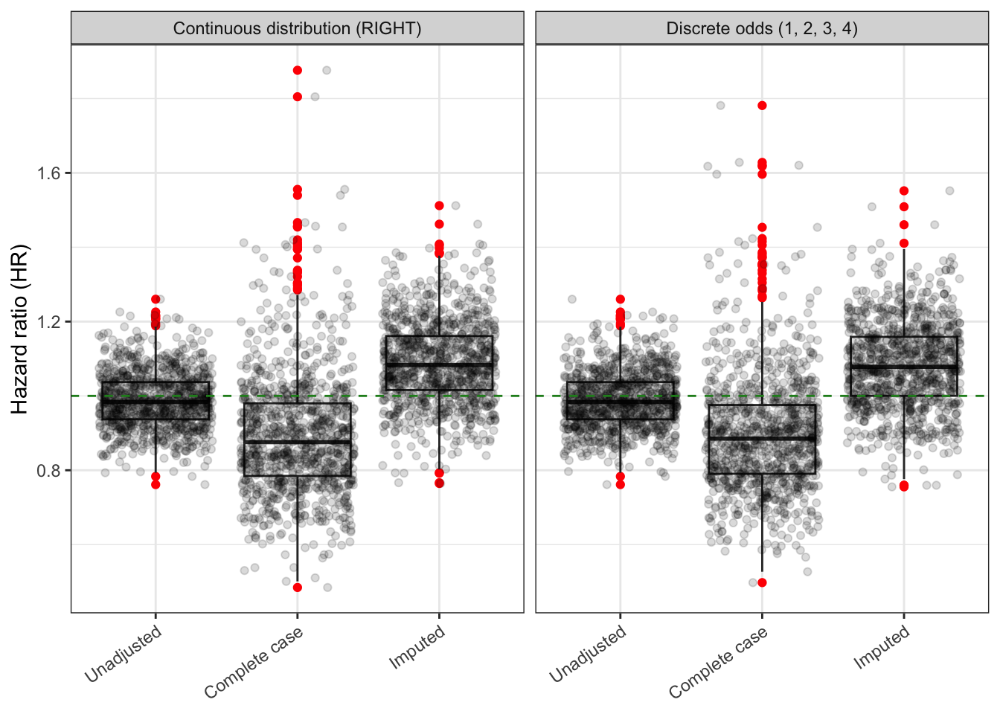
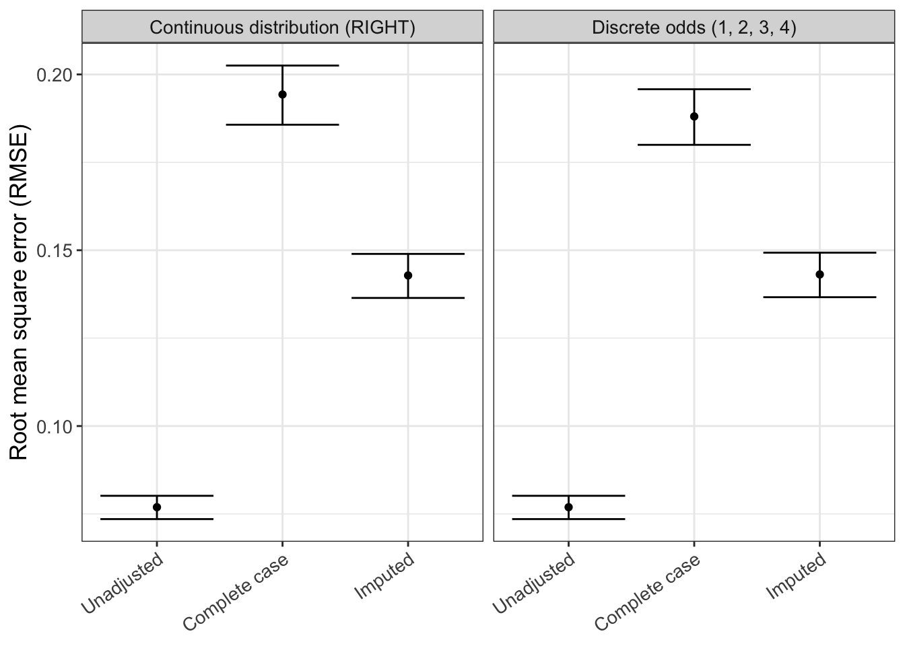
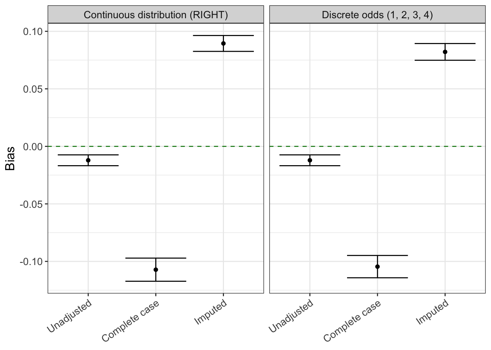
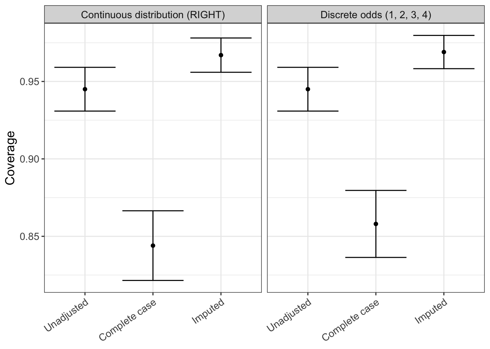
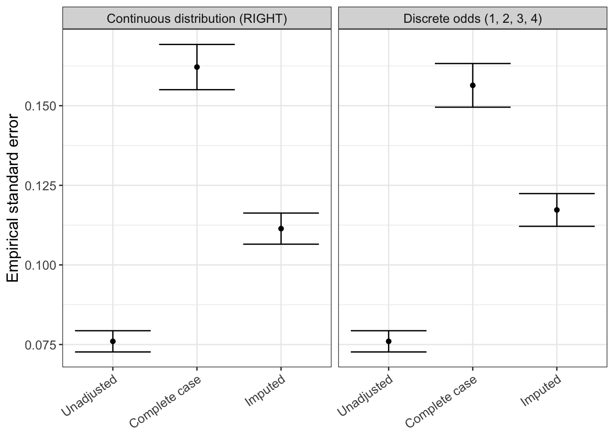
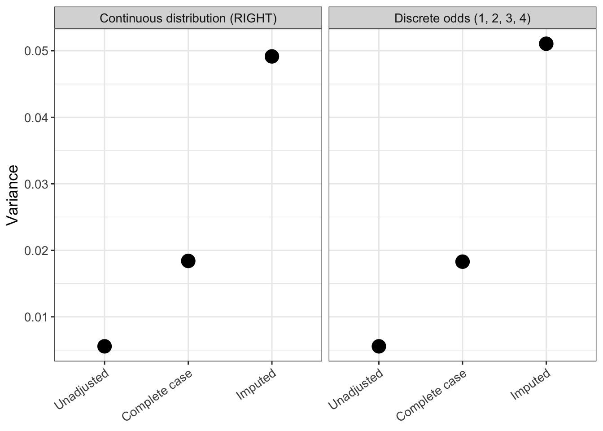

## About

This script analyzes the raw simulation results obtained in the previous script via `run_simulation.R` and was last run on 2024-03-04 15:46:35.134269.

## Read raw results table

We first read the results table with the raw simulation results.


::: {.cell}

```{.r .cell-code}
results <- read_parquet(file = here("data", "simulation_results.parquet")) |> 
  mutate(method = factor(method, levels = c("Unadjusted", "Complete case", "Imputed")))

results |> 
  glimpse()
```

::: {.cell-output .cell-output-stdout}
```
Rows: 6,000
Columns: 5
$ method     <fct> Unadjusted, Complete case, Imputed, Unadjusted, Complete ca…
$ estimate   <dbl> 1.0810100, 1.0312457, 1.1821327, 0.9628319, 0.5999282, 1.01…
$ se         <dbl> 0.07540090, 0.13014871, 0.19584325, 0.07442175, 0.14116245,…
$ replicate  <int> 1, 1, 1, 2, 2, 2, 3, 3, 3, 4, 4, 4, 5, 5, 5, 6, 6, 6, 7, 7,…
$ simulation <chr> "Continuous distribution (RIGHT)", "Continuous distribution…
```
:::
:::


## QC

Let's do a few quality/sanity checks.

-   Number of analysis methods


::: {.cell}

```{.r .cell-code}
unique(results$method)
```

::: {.cell-output .cell-output-stdout}
```
[1] Unadjusted    Complete case Imputed      
Levels: Unadjusted Complete case Imputed
```
:::
:::


-   Assert that there are no missing results


::: {.cell}

```{.r .cell-code}
assert_that(!any(sapply(results$estimate, is.na)), msg = "There are missing estimates")
```

::: {.cell-output .cell-output-stdout}
```
[1] TRUE
```
:::

```{.r .cell-code}
assert_that(!any(sapply(results$se, is.na)), msg = "There are missing standard errors")
```

::: {.cell-output .cell-output-stdout}
```
[1] TRUE
```
:::
:::


## Main results


::: {.cell}

```{.r .cell-code}
# call helper functions
source(here::here("functions", "rsimsum_ggplot.R"))
```
:::


For the analysis of aggregate simulation results we use the `rsimsum` package. More information about this package can be found [here](https://ellessenne.github.io/rsimsum/).[@rsimsum]


::: {.cell}

```{.r .cell-code}
simsum_out <- simsum(
  data = results, 
  estvarname = "estimate", 
  se = "se", 
  true = 1, 
  by = "simulation",
  methodvar = "method", 
  ref = "Complete case"
  ) |> 
  summary() |> 
  tidy()
```
:::


::: panel-tabset
### Hazard ratio distribution


::: {.cell}

```{.r .cell-code}
hr_distribution <- results |> 
  ggplot(aes(x = method, y = estimate)) +
  geom_boxplot(outlier.colour = "red") +
  geom_point(position = position_jitter(seed = 42), alpha = 0.15) +
  geom_hline(yintercept = 1.0, color = "forestgreen", linetype = "dashed") +
  labs(
    x = "Method",
    y = "Hazard ratio (HR)"
    ) +
  theme_bw() +
  theme(
    axis.title.x = element_blank(),
    axis.text.x = element_text(angle = 35, vjust = 1, hjust=1)
    ) +
  facet_wrap(~simulation)

hr_distribution
```

::: {.cell-output-display}
{#fig-hr_distribution width=672}
:::
:::


### Hazard ratio distribution (interactive)


::: {.cell}

```{.r .cell-code}
ggplotly(hr_distribution)
```

::: {.cell-output-display}

```{=html}
<div class="plotly html-widget html-fill-item" id="htmlwidget-835818ce92c950b30334" style="width:100%;height:464px;"></div>
<script type="application/json" data-for="htmlwidget-835818ce92c950b30334">{"x":{"data":[{"x":[1,1,1,1,1,1,1,1,1,1,1,1,1,1,1,1,1,1,1,1,1,1,1,1,1,1,1,1,1,1,1,1,1,1,1,1,1,1,1,1,1,1,1,1,1,1,1,1,1,1,1,1,1,1,1,1,1,1,1,1,1,1,1,1,1,1,1,1,1,1,1,1,1,1,1,1,1,1,1,1,1,1,1,1,1,1,1,1,1,1,1,1,1,1,1,1,1,1,1,1,1,1,1,1,1,1,1,1,1,1,1,1,1,1,1,1,1,1,1,1,1,1,1,1,1,1,1,1,1,1,1,1,1,1,1,1,1,1,1,1,1,1,1,1,1,1,1,1,1,1,1,1,1,1,1,1,1,1,1,1,1,1,1,1,1,1,1,1,1,1,1,1,1,1,1,1,1,1,1,1,1,1,1,1,1,1,1,1,1,1,1,1,1,1,1,1,1,1,1,1,1,1,1,1,1,1,1,1,1,1,1,1,1,1,1,1,1,1,1,1,1,1,1,1,1,1,1,1,1,1,1,1,1,1,1,1,1,1,1,1,1,1,1,1,1,1,1,1,1,1,1,1,1,1,1,1,1,1,1,1,1,1,1,1,1,1,1,1,1,1,1,1,1,1,1,1,1,1,1,1,1,1,1,1,1,1,1,1,1,1,1,1,1,1,1,1,1,1,1,1,1,1,1,1,1,1,1,1,1,1,1,1,1,1,1,1,1,1,1,1,1,1,1,1,1,1,1,1,1,1,1,1,1,1,1,1,1,1,1,1,1,1,1,1,1,1,1,1,1,1,1,1,1,1,1,1,1,1,1,1,1,1,1,1,1,1,1,1,1,1,1,1,1,1,1,1,1,1,1,1,1,1,1,1,1,1,1,1,1,1,1,1,1,1,1,1,1,1,1,1,1,1,1,1,1,1,1,1,1,1,1,1,1,1,1,1,1,1,1,1,1,1,1,1,1,1,1,1,1,1,1,1,1,1,1,1,1,1,1,1,1,1,1,1,1,1,1,1,1,1,1,1,1,1,1,1,1,1,1,1,1,1,1,1,1,1,1,1,1,1,1,1,1,1,1,1,1,1,1,1,1,1,1,1,1,1,1,1,1,1,1,1,1,1,1,1,1,1,1,1,1,1,1,1,1,1,1,1,1,1,1,1,1,1,1,1,1,1,1,1,1,1,1,1,1,1,1,1,1,1,1,1,1,1,1,1,1,1,1,1,1,1,1,1,1,1,1,1,1,1,1,1,1,1,1,1,1,1,1,1,1,1,1,1,1,1,1,1,1,1,1,1,1,1,1,1,1,1,1,1,1,1,1,1,1,1,1,1,1,1,1,1,1,1,1,1,1,1,1,1,1,1,1,1,1,1,1,1,1,1,1,1,1,1,1,1,1,1,1,1,1,1,1,1,1,1,1,1,1,1,1,1,1,1,1,1,1,1,1,1,1,1,1,1,1,1,1,1,1,1,1,1,1,1,1,1,1,1,1,1,1,1,1,1,1,1,1,1,1,1,1,1,1,1,1,1,1,1,1,1,1,1,1,1,1,1,1,1,1,1,1,1,1,1,1,1,1,1,1,1,1,1,1,1,1,1,1,1,1,1,1,1,1,1,1,1,1,1,1,1,1,1,1,1,1,1,1,1,1,1,1,1,1,1,1,1,1,1,1,1,1,1,1,1,1,1,1,1,1,1,1,1,1,1,1,1,1,1,1,1,1,1,1,1,1,1,1,1,1,1,1,1,1,1,1,1,1,1,1,1,1,1,1,1,1,1,1,1,1,1,1,1,1,1,1,1,1,1,1,1,1,1,1,1,1,1,1,1,1,1,1,1,1,1,1,1,1,1,1,1,1,1,1,1,1,1,1,1,1,1,1,1,1,1,1,1,1,1,1,1,1,1,1,1,1,1,1,1,1,1,1,1,1,1,1,1,1,1,1,1,1,1,1,1,1,1,1,1,1,1,1,1,1,1,1,1,1,1,1,1,1,1,1,1,1,1,1,1,1,1,1,1,1,1,1,1,1,1,1,1,1,1,1,1,1,1,1,1,1,1,1,1,1,1,1,1,1,1,1,1,1,1,1,1,1,1,1,1,1,1,1,1,1,1,1,1,1,1,1,1,1,1,1,1,1,1,1,1,1,1,1,1,1,1,1,1,1,1,1,1,1,1,1,1,1,1,1,1,1,1,1,1,1,1,1,1,1,1,1,1,1,1,1,1,1,1,1,1,1,1,1,1,1,1,1,1,1,1,1,1,2,2,2,2,2,2,2,2,2,2,2,2,2,2,2,2,2,2,2,2,2,2,2,2,2,2,2,2,2,2,2,2,2,2,2,2,2,2,2,2,2,2,2,2,2,2,2,2,2,2,2,2,2,2,2,2,2,2,2,2,2,2,2,2,2,2,2,2,2,2,2,2,2,2,2,2,2,2,2,2,2,2,2,2,2,2,2,2,2,2,2,2,2,2,2,2,2,2,2,2,2,2,2,2,2,2,2,2,2,2,2,2,2,2,2,2,2,2,2,2,2,2,2,2,2,2,2,2,2,2,2,2,2,2,2,2,2,2,2,2,2,2,2,2,2,2,2,2,2,2,2,2,2,2,2,2,2,2,2,2,2,2,2,2,2,2,2,2,2,2,2,2,2,2,2,2,2,2,2,2,2,2,2,2,2,2,2,2,2,2,2,2,2,2,2,2,2,2,2,2,2,2,2,2,2,2,2,2,2,2,2,2,2,2,2,2,2,2,2,2,2,2,2,2,2,2,2,2,2,2,2,2,2,2,2,2,2,2,2,2,2,2,2,2,2,2,2,2,2,2,2,2,2,2,2,2,2,2,2,2,2,2,2,2,2,2,2,2,2,2,2,2,2,2,2,2,2,2,2,2,2,2,2,2,2,2,2,2,2,2,2,2,2,2,2,2,2,2,2,2,2,2,2,2,2,2,2,2,2,2,2,2,2,2,2,2,2,2,2,2,2,2,2,2,2,2,2,2,2,2,2,2,2,2,2,2,2,2,2,2,2,2,2,2,2,2,2,2,2,2,2,2,2,2,2,2,2,2,2,2,2,2,2,2,2,2,2,2,2,2,2,2,2,2,2,2,2,2,2,2,2,2,2,2,2,2,2,2,2,2,2,2,2,2,2,2,2,2,2,2,2,2,2,2,2,2,2,2,2,2,2,2,2,2,2,2,2,2,2,2,2,2,2,2,2,2,2,2,2,2,2,2,2,2,2,2,2,2,2,2,2,2,2,2,2,2,2,2,2,2,2,2,2,2,2,2,2,2,2,2,2,2,2,2,2,2,2,2,2,2,2,2,2,2,2,2,2,2,2,2,2,2,2,2,2,2,2,2,2,2,2,2,2,2,2,2,2,2,2,2,2,2,2,2,2,2,2,2,2,2,2,2,2,2,2,2,2,2,2,2,2,2,2,2,2,2,2,2,2,2,2,2,2,2,2,2,2,2,2,2,2,2,2,2,2,2,2,2,2,2,2,2,2,2,2,2,2,2,2,2,2,2,2,2,2,2,2,2,2,2,2,2,2,2,2,2,2,2,2,2,2,2,2,2,2,2,2,2,2,2,2,2,2,2,2,2,2,2,2,2,2,2,2,2,2,2,2,2,2,2,2,2,2,2,2,2,2,2,2,2,2,2,2,2,2,2,2,2,2,2,2,2,2,2,2,2,2,2,2,2,2,2,2,2,2,2,2,2,2,2,2,2,2,2,2,2,2,2,2,2,2,2,2,2,2,2,2,2,2,2,2,2,2,2,2,2,2,2,2,2,2,2,2,2,2,2,2,2,2,2,2,2,2,2,2,2,2,2,2,2,2,2,2,2,2,2,2,2,2,2,2,2,2,2,2,2,2,2,2,2,2,2,2,2,2,2,2,2,2,2,2,2,2,2,2,2,2,2,2,2,2,2,2,2,2,2,2,2,2,2,2,2,2,2,2,2,2,2,2,2,2,2,2,2,2,2,2,2,2,2,2,2,2,2,2,2,2,2,2,2,2,2,2,2,2,2,2,2,2,2,2,2,2,2,2,2,2,2,2,2,2,2,2,2,2,2,2,2,2,2,2,2,2,2,2,2,2,2,2,2,2,2,2,2,2,2,2,2,2,2,2,2,2,2,2,2,2,2,2,2,2,2,2,2,2,2,2,2,2,2,2,2,2,2,2,2,2,2,2,2,2,2,2,2,2,2,2,2,2,2,2,2,2,2,2,2,2,2,2,2,2,2,2,2,2,2,2,2,2,2,2,2,2,2,2,2,2,2,2,2,2,2,2,2,2,2,2,2,2,2,2,2,2,2,2,2,2,2,2,2,2,2,2,2,2,2,2,2,2,2,2,2,2,2,2,2,2,2,2,2,2,2,2,2,2,2,2,2,2,2,2,2,2,2,2,2,2,2,2,2,2,2,2,2,2,2,2,2,2,2,2,2,2,2,2,2,2,2,2,2,2,2,2,2,2,2,2,2,2,2,2,2,2,2,2,2,2,2,2,2,3,3,3,3,3,3,3,3,3,3,3,3,3,3,3,3,3,3,3,3,3,3,3,3,3,3,3,3,3,3,3,3,3,3,3,3,3,3,3,3,3,3,3,3,3,3,3,3,3,3,3,3,3,3,3,3,3,3,3,3,3,3,3,3,3,3,3,3,3,3,3,3,3,3,3,3,3,3,3,3,3,3,3,3,3,3,3,3,3,3,3,3,3,3,3,3,3,3,3,3,3,3,3,3,3,3,3,3,3,3,3,3,3,3,3,3,3,3,3,3,3,3,3,3,3,3,3,3,3,3,3,3,3,3,3,3,3,3,3,3,3,3,3,3,3,3,3,3,3,3,3,3,3,3,3,3,3,3,3,3,3,3,3,3,3,3,3,3,3,3,3,3,3,3,3,3,3,3,3,3,3,3,3,3,3,3,3,3,3,3,3,3,3,3,3,3,3,3,3,3,3,3,3,3,3,3,3,3,3,3,3,3,3,3,3,3,3,3,3,3,3,3,3,3,3,3,3,3,3,3,3,3,3,3,3,3,3,3,3,3,3,3,3,3,3,3,3,3,3,3,3,3,3,3,3,3,3,3,3,3,3,3,3,3,3,3,3,3,3,3,3,3,3,3,3,3,3,3,3,3,3,3,3,3,3,3,3,3,3,3,3,3,3,3,3,3,3,3,3,3,3,3,3,3,3,3,3,3,3,3,3,3,3,3,3,3,3,3,3,3,3,3,3,3,3,3,3,3,3,3,3,3,3,3,3,3,3,3,3,3,3,3,3,3,3,3,3,3,3,3,3,3,3,3,3,3,3,3,3,3,3,3,3,3,3,3,3,3,3,3,3,3,3,3,3,3,3,3,3,3,3,3,3,3,3,3,3,3,3,3,3,3,3,3,3,3,3,3,3,3,3,3,3,3,3,3,3,3,3,3,3,3,3,3,3,3,3,3,3,3,3,3,3,3,3,3,3,3,3,3,3,3,3,3,3,3,3,3,3,3,3,3,3,3,3,3,3,3,3,3,3,3,3,3,3,3,3,3,3,3,3,3,3,3,3,3,3,3,3,3,3,3,3,3,3,3,3,3,3,3,3,3,3,3,3,3,3,3,3,3,3,3,3,3,3,3,3,3,3,3,3,3,3,3,3,3,3,3,3,3,3,3,3,3,3,3,3,3,3,3,3,3,3,3,3,3,3,3,3,3,3,3,3,3,3,3,3,3,3,3,3,3,3,3,3,3,3,3,3,3,3,3,3,3,3,3,3,3,3,3,3,3,3,3,3,3,3,3,3,3,3,3,3,3,3,3,3,3,3,3,3,3,3,3,3,3,3,3,3,3,3,3,3,3,3,3,3,3,3,3,3,3,3,3,3,3,3,3,3,3,3,3,3,3,3,3,3,3,3,3,3,3,3,3,3,3,3,3,3,3,3,3,3,3,3,3,3,3,3,3,3,3,3,3,3,3,3,3,3,3,3,3,3,3,3,3,3,3,3,3,3,3,3,3,3,3,3,3,3,3,3,3,3,3,3,3,3,3,3,3,3,3,3,3,3,3,3,3,3,3,3,3,3,3,3,3,3,3,3,3,3,3,3,3,3,3,3,3,3,3,3,3,3,3,3,3,3,3,3,3,3,3,3,3,3,3,3,3,3,3,3,3,3,3,3,3,3,3,3,3,3,3,3,3,3,3,3,3,3,3,3,3,3,3,3,3,3,3,3,3,3,3,3,3,3,3,3,3,3,3,3,3,3,3,3,3,3,3,3,3,3,3,3,3,3,3,3,3,3,3,3,3,3,3,3,3,3,3,3,3,3,3,3,3,3,3,3,3,3,3,3,3,3,3,3,3,3,3,3,3,3,3,3,3,3,3,3,3,3,3,3,3,3,3,3,3,3,3,3,3,3,3,3,3,3,3,3,3,3,3,3,3,3,3,3,3,3,3,3,3,3,3,3,3,3,3,3,3,3,3,3,3,3,3,3,3,3,3,3,3,3,3,3,3,3,3,3,3,3,3,3,3,3,3,3,3,3,3,3,3,3,3,3,3,3,3,3,3,3,3,3,3,3,3,3,3,3,3,3,3,3,3,3,3,3,3,3,3,3,3,3,3,3,3,3,3,3,3,3,3,3,3,3,3,3,3,3,3,3,3,3,3,3,3,3,3,3,3,3,3,3,3,3,3,3,3,3,3,3,3,3,3,3,3,3,3,3,3,3,3,3,3,3,3,3,3,3,3,3,3,3,3,3,3,3,3,3,3,3,3],"y":[1.0810099918571652,1.1228740608439314,0.88036779623824846,0.96283187499714529,0.92742994762294662,0.92981073247412749,0.95811905173145562,0.96816252285564641,1.0311358488813716,0.99988029953744151,0.95769330987135137,0.97082711488206108,0.91370245204240552,1.1004893889682543,0.8709151889462915,1.0605633484519523,1.0683907943043993,0.89009561886930633,0.87764621451713043,0.91430410978164367,1.039054786662398,0.86776567552472039,0.91472887416102022,0.99552705889943716,1.0128712158759714,1.0615337793109441,0.93993981228644286,1.0365870312389356,0.90593999948480597,0.95426175105917366,0.97777746439056978,0.96622532290551766,0.99120971147908654,1.1576104044795217,1.0702107963286156,0.84411080397699978,0.96543738778847521,0.89274291173178499,0.9324952842920935,0.98788889345492881,0.97060205996235893,1.036382266110123,0.96524257073527897,0.8521035164532188,0.98221718654045698,1.0587442405063414,0.89544600427121268,1.0545440265277615,0.895566980248647,1.0031416970657145,1.0098276234973054,0.97460109168325748,0.97818269077897857,1.1578488627465482,1.0635572188575486,1.0756215819750166,0.94263607283216977,1.0379097375609301,0.99909288067065372,0.93855821851328347,1.1173052095983771,0.83678660869725308,0.7614359081782569,0.87953870027127434,0.93430670017154949,1.1414059808179104,0.99479288409019173,1.038751651518304,0.98500110590626633,0.97620402885815238,1.2257146784101187,0.977210187832393,0.98378294540914379,1.0489499897179766,1.0166945357942014,1.0674158849425743,0.95375007195174055,0.94902365268855016,0.90510186097267031,1.0860002563778521,1.0027507876116102,0.94242042521962055,0.94852338315081797,0.93648041527083503,0.92833327663683141,0.91834243199881105,0.94168863469990916,0.98811784961172233,0.99992465118868246,1.0376632650513733,0.91062906196214843,0.86979634063528266,0.88830446823296461,0.81066891366085914,1.0259923960793649,0.99430506812558284,1.0744355171163968,0.87328050075048291,0.90148798742339331,1.0710440676271966,0.91351158530506371,0.9104670574205227,0.97731745213362453,0.83206100342837108,0.94876841825594616,0.96642749656723337,0.93259879021705272,1.073066007573475,0.91066859131446409,1.0202755649022013,0.82229228582489755,0.87710618485422853,1.1055488840532011,0.96025937482576473,0.93760528476185723,0.95412552149062146,0.93327701090346593,1.1271774331030433,0.96616264031569332,0.9719824061104696,0.92326458017636381,0.97148963808705491,1.1885616139783173,0.90495542108376348,1.0316714509936611,1.0871010175713252,1.0497179422873679,0.98103213979653447,0.97006451676566163,1.0574386949007879,1.060414156498223,0.99254020503332407,1.0334552358964106,1.0282621408939061,1.0074683344365989,0.98247185015919669,1.0498339399340686,0.9362855250116292,1.0912174771458931,0.97786038233479822,0.85310989067154641,1.1695252902070061,1.0954958664476655,0.88658302691633672,0.97855568188949049,0.94526687266383136,0.85589223121642344,0.99000786237514504,1.0613114437555378,0.85167261414588424,0.97642570177267241,0.98236539723885863,0.98535486826083241,0.88913440942266631,0.91434325755438939,1.042142621254508,0.97584834122035968,1.0086039050292739,1.0251554942154939,1.0049520667049872,0.98765993415245268,0.9754899907861545,0.90956356179828968,1.043214588755313,1.0542882068571238,0.91084402779463569,1.1053962901053735,0.92288170614188714,0.92830877695433955,0.86926383102960969,1.1021665861381664,1.0254174353598795,0.94096052887693238,0.91722642679662802,0.87497437581349236,0.98965031728510233,1.011146927535,1.0202481727663975,0.96475369276093315,0.90369126253271326,1.1161366993322801,1.001101172870702,1.0905940554193165,0.98549325184404646,1.0424876075873692,0.96878609812305094,0.96501687803799618,0.9230448021785741,0.96549012015022539,1.1038542446938404,1.0535524205571736,0.99635368327509766,1.0427769049664386,1.0446512966551316,1.0195828359087917,1.0149059027939515,0.98645501839861571,0.93153480544608602,0.90983410851559632,1.1010913011775918,1.2060879216737015,0.88043034156143152,0.86644831841474967,0.98044880563661574,0.90289195454776539,0.98649983482177839,0.79595153127047158,0.989212768948462,0.98044644751414611,0.94281659846649968,0.94222901296099637,1.0354714416807107,0.90391445543846516,0.93458054881572616,0.91122112469868344,0.95552531563830889,0.96832089789143527,0.83891752520755447,1.0731370180184812,1.10162468014201,1.0852086321451464,1.0708814797811947,1.0802395997000018,0.82201266856367516,1.0246115677596881,1.0335899994175584,0.96995460849494952,1.1084485174725327,1.033266806912408,0.98782649242083442,1.0518007117419983,0.93682127449234009,1.0729174313800556,1.1275420703402441,1.0602273156017852,0.98432687606049973,0.96152316564635554,1.0466189127196248,0.95619373776604688,0.94434907215549102,0.95095317362493148,1.0754782985452942,0.79661488560958649,1.0662546999771718,0.90405130490000396,1.0003675938856695,0.9203921585738789,1.0627385680262629,1.0989267440614043,0.9951103835099917,0.86462501788850954,0.96789215813511564,0.88403946144041323,0.95793401397846978,0.9915525853526298,1.0238922845239682,1.0101339954590882,0.96585437324271106,1.0253760961727083,0.97838306775584838,1.1496633469400819,0.9190782949142472,1.0521009479481951,0.96888890133206573,0.9890102917579765,1.09039522358257,0.9138859900522367,0.90775942587545388,0.87890062083371379,1.024076549137567,1.0721376971729575,1.0171988783449708,0.92663210858041289,1.0656749515435924,1.0130855185595773,1.0061757993150067,1.027989202866129,1.0875594497198857,1.2109023591797283,0.95096434808352925,1.1487920285946036,1.0297949988091315,1.1094538598204855,0.87469479540401862,1.0877514711545488,1.0061075918404283,0.85728412075694183,0.91645030178573517,0.87925609483859446,0.96187453633628239,1.0356734787915478,0.89944776086939482,1.0185353512206408,0.98252139484555712,1.0717422204991236,1.037464501943524,1.0838610921356557,1.1150346121512211,0.98207476057133358,0.96016429116561075,0.96345589285952871,0.942378632723474,1.1008518052218483,1.0872233465174139,0.95972038449474251,1.0769476931005995,0.94215982648029006,1.0194173557674975,0.99868302805980158,0.86542467641807042,0.95201087133401585,1.1070120958741307,1.0372543983060161,1.1007350182620925,0.907394253672405,0.96792713503105987,1.0865521203509299,1.0085793697143417,0.99446411137721147,1.0412945347915703,0.97129401920394542,0.94948564489057519,1.1508644094816902,0.99258788162066547,0.93764797778023456,0.95971272781018435,0.97865223854826178,0.98278968080784235,1.1317268881191598,0.82657063569942713,0.89559793821106115,1.1005701516839517,0.96638693733775105,1.0366902599392371,0.99323630371873617,0.9612055498358274,0.94501484980967865,0.95798259614252679,0.92290458757373883,1.1042524763458681,1.006310638066011,0.92992523019082363,0.9787108771275036,0.98784451812524665,0.96924273488322388,0.89512176327923154,0.9347240893024219,0.98545868198585485,1.0070577060801191,0.93868537889146419,0.89818931041025918,0.93956046161943096,1.1096896145971114,1.0897685389848537,1.1252251797591273,0.96271405772756835,1.1747197872195427,0.99367793213277245,0.9865055077219379,0.82084556640946604,1.0761941102076893,0.99596762288789842,0.92780038207278126,1.0815992030851025,0.97489747317372821,0.94057733321047676,0.98757695312657401,0.97861763062173501,1.0251616390626515,0.9294621961645515,1.0018176022090934,0.96671658737267474,0.90582307348336899,1.0222390948206443,1.0082380127192601,1.1702130905840915,1.0193895170985565,1.0114384069483293,0.79328441346868028,1.0614984355005972,0.91674305955172153,1.0469998074789308,1.0665186620422424,0.97646550794877263,0.90936991696273528,0.89930541064506597,0.97456709967616795,1.0111693177682319,0.94101260477945503,1.0494690892336263,0.86907486517886967,0.96737426164118312,0.96587267856453762,0.95236438174685489,0.99385969397618212,0.919071634005174,1.0814191100844004,0.96096292048434773,1.1284504520602949,1.0545151082942072,1.0266051033593204,1.0314243173980302,1.0272563386376543,1.1159200407614964,1.0589928450782538,1.018102969653502,0.93960245480570037,1.1257073471345582,1.0334848046144174,0.96076494802445178,0.89394179006226937,1.1081435708872467,1.0263101681999418,0.9341215475672292,0.91834243075896549,0.89061870129894682,1.0438421655477184,0.97204106295557913,0.94502852804165649,0.99007666025870089,1.0065975006374503,0.90544756783535107,0.98941462094392829,1.023006968111744,0.99840850189393082,0.94352926398826309,0.95034512667109516,0.9556435583712497,1.075444966591331,0.9579337816624417,0.98262463890971541,0.94349128667388449,1.019345977357204,0.84010342008755168,0.96133409231960054,0.99817559342396278,0.89409402495526569,1.0466347256723587,0.95135971551596077,0.98871645556286347,0.95112458653995913,0.91513993138734051,1.2169280158004614,0.91044894717025027,1.1125050305334889,0.93348709417056697,0.93710980389998344,1.0247351210130036,0.98394013785967649,1.1147120757360947,1.071634873821111,0.92641565872444787,1.0775861507533622,0.9339123373919338,1.0192143951831443,0.981713658115687,1.109591826319269,0.97570340491734853,1.0037555288132713,0.90278316864288699,1.0730157341909676,0.99936192557496906,1.0426542342717746,0.97914693768513184,0.93988801250199039,0.92083450980646242,0.99276459483107005,0.99671506592101466,0.91007928394643101,1.1001534674313957,0.91195776708979259,1.0745279971672477,0.90148366688969406,0.91819415919469871,1.0615360145101236,0.97829518279756789,0.95879895109882185,0.97865500267384375,1.0362180569653643,0.96882582145140617,1.0514626912557585,0.98940799329031159,1.0818238788574537,0.93439223004595773,1.0362701397735106,0.96517262493397982,0.84661841105852076,1.1070270010909955,0.88391060629086238,1.1218149403619619,0.95949161013067108,0.86333855506425461,0.99438318011232762,1.0277802285738551,1.0549534657950104,0.96476388164046034,1.0492004085961644,0.98412818186005979,0.99476795972471899,1.0440045295658227,0.94021728703793062,0.93304769534698007,0.98423649200356489,1.0178626326575873,0.94404594972318279,0.97540849772200333,0.98984416114327578,1.0392870026449745,1.0123504196779316,1.0598728760428695,1.0099125451389004,0.86595253038763109,0.92226613584001871,1.0432705450571498,1.1570658879304541,1.0864529157398144,0.96209604677526905,1.1481474503469897,0.9820986532851248,1.0699527094290913,1.1054486226407734,0.9688744429291154,1.0143162992520307,1.0063718314979919,0.84621603196088502,1.0037672323322417,0.95325381254206498,1.0396760030643577,1.0335999902368651,0.98955072654275389,1.0446443233504326,0.90795820791014559,0.95290358750228155,1.0276568271093431,1.0526956999198458,0.98564310362471141,1.021019041095593,1.0251140640566683,1.0031551435031412,1.0378623526633748,0.94198500594458279,1.0590933051412037,1.0500137075932463,0.98987916526806807,0.9702298399598297,0.87866252408138956,0.96185067082982867,0.90132128354333318,1.013066009527692,1.0077143036026446,0.98662228268699848,1.0673849517515988,1.0754974617316595,0.95466578026752813,1.0110795521895979,0.95470636700293765,1.0383280587907544,0.88053308993482704,0.88013828593027943,0.931359103964706,1.0289077342505304,1.087627802416649,0.91228568349748673,1.0990900171720763,0.91918867069346444,1.0262326850635886,0.85653255109483339,1.1220387414476571,1.0900924878120859,0.98119100306605467,0.99198648819142787,0.98942957016462019,1.0157317218473125,1.1627335859765382,0.98498521439211817,1.0341936900404698,0.94491730857852019,1.0282839980523193,1.0134523717891815,0.97656092648077886,0.98353204168462893,1.0448350002733613,0.86078121663341234,0.95161988253341478,0.95096106188020613,0.94624482169940261,0.93603020530081948,0.85106377914874098,1.0853372589670147,0.97132792605155094,0.93501955584734875,0.91763985928544545,1.0039754906104132,1.0275732127461374,0.90265161673069327,0.92087700981400289,0.94287947092575441,1.0787229994932765,0.98536965414511379,0.98082062804746362,0.88295676350125962,1.2148755705062311,1.1349194413682011,0.98480272822071224,1.0259157302496114,1.0282462546366318,1.0761625311710286,0.95908960609927396,1.0236687105325664,0.88900455914456478,0.97384105894417516,0.89492675139812827,0.8671817153568212,1.0813208707746351,0.96243228142477555,1.0180697029192842,0.89324384356025222,1.0578721628974808,0.88983632667438328,1.1185850531207724,0.90692185152646776,0.95873596986913623,1.0277990039690061,0.99957534769055811,1.0924700592229351,0.92026350017855096,0.91889323608387308,0.8683368041538001,0.95736961841969448,0.96526796934952586,1.1096148041148319,0.9786851894498233,1.0060163262531621,1.0207018650542268,0.96016464237073884,0.9161803167466378,0.85786148204945623,1.0372677152972896,1.2075072944787986,1.0236144735964574,0.94511943324342973,1.0447669584417101,0.91549448682130063,1.0272460377255757,0.98341264296377895,1.1133284612823093,1.0501546973740703,0.97451652663501653,1.0168525237635173,0.99803817417718799,0.92590148313217613,0.98998394109422438,1.0240037755431215,0.98365033749144959,1.1352735176509492,0.98961489801503311,1.0554108253223793,1.0493343981395051,0.80855811325754956,0.96433705131592562,0.94573256125300542,0.95319951815777904,0.96437176101301114,0.86350872601112483,1.0061921838976287,1.0143539352227995,1.1087275653274518,0.87843187972841519,0.9354907681908704,1.0285024467832238,1.1296582150847319,1.0440365753893988,1.0646106559881603,0.97720972978900256,1.0402212175604517,0.97286731895666967,0.98119026072187132,0.94804989009457097,1.0060166771444212,0.94109678227963622,1.0051707951168436,0.90723387703726066,0.93520130309429361,0.89121027524000629,1.0709506701823663,1.031704223812103,0.90603031027745851,0.96619479968351818,1.0087683843112958,1.077248945879735,1.0449226924724577,0.96433873046377416,0.9939862853435868,1.0488334531555137,1.0153702309948685,0.95387627001566355,0.96417134971953566,0.87587504908704272,0.95293635855973546,0.98520066671630102,1.0986828310699235,1.093787235946692,0.86815027011802792,0.9162929269667196,1.0356811123199396,0.85779898203453908,0.94698550255042047,0.97416128692879633,1.0333398989910458,1.1049485619711175,0.96975070433872057,1.0677744073420703,0.86265303602156518,1.1739738577838019,1.0136146821953116,0.90198223253279297,1.086900934701289,0.84378255596740681,0.96797042693434243,0.94115768702751956,0.94962427423524409,0.98519446051098369,0.97836967035417022,0.90045707113371853,0.90654466999067806,0.98382484149098282,1.0331078985856876,1.0976741215976811,0.905293877436532,1.0042393080894636,1.0401836821697825,0.94443928854211856,1.0000961493379723,0.95597926090347607,0.93158383885765805,1.0240680928242072,1.020430499672984,0.95102494352679612,0.94655630645040145,1.0910815053356773,1.0471553599015719,0.95352431544082661,0.99657023331244476,1.0197351100570575,0.98856725789711875,0.97853250337432329,0.93100948916415172,0.94231227821317143,0.97750611655829467,0.92566943373195132,0.89004136292860991,0.92057708756928214,0.89325086441981572,0.98338160012969034,1.0535287575583241,0.98858873219791887,1.0062527195301807,0.87335422015874298,0.90856135712753849,0.88619707304701312,0.91907026438275619,0.99869053003220387,1.0330873396259328,1.049735225385058,0.91665361701888637,0.84428514334684768,0.91781355693771893,0.94934093944294706,0.95647278113195189,0.93781379258032382,0.86901207864421703,0.90403297457641985,1.0006953700801196,1.1460200970079439,1.1062064303683683,0.96615286342024354,1.0720126905942746,1.0039800050065,0.98502155899022614,1.0357225661738536,0.92053901606480737,0.94908904617981615,1.0770412815446511,0.88579747353412419,0.90418556114201465,1.0508009803104335,0.96390761641686906,0.92590394732869286,1.1542175208520953,0.98075514760687676,0.95694702189611491,1.1143942688956026,0.95306100381392633,1.0163463807033419,0.97175138178941112,0.93873379391983902,0.96170536807420859,0.90932985947572964,0.99519854287411114,1.0787086383198936,0.99851756113483336,1.0414553101598467,1.0522501179954555,0.9836681925001346,0.98941273213821235,0.91587584252809773,1.0111369994693895,0.87547997547843948,0.87475723648959569,1.0218493894612208,0.95031494088821677,0.92561094233399566,0.90574665311684044,0.94045555594172003,0.98472281564204589,0.87902713136832,1.0595429337433742,1.0369252471609063,1.0528251197209046,1.2600927852262183,0.98424127342322865,0.96209923856378188,0.85080819839896005,1.0099348294486321,0.92727442388195191,0.97914296514311383,0.98868358314566906,0.94332394903810124,1.0544161375754439,0.93823627427589162,1.1604150180295558,0.96104793829724988,1.0489042843490362,0.9959019425501372,0.9594608342355947,1.0704450627830422,0.8704497473942695,1.0802991460355922,0.94386240763108842,0.94297834331366082,1.0336919153341593,0.94748299676913028,0.92091856554874529,0.96358159779405028,0.98634334268617019,1.0623018434094287,1.0051779523007918,1.0067754713842318,1.1183687209899662,1.0593091504331156,0.93618812689355002,0.91042230676767777,0.91293880263304805,1.0548928683692951,0.91350688117243017,0.94363640586885056,0.98432678083692815,1.0004893148930767,0.90959669073074401,0.95888893876068737,1.0305295489790425,0.89402407445658427,1.0769694078255689,1.1942083151964908,0.85927719094887722,1.0206610402246215,1.0084515219931329,0.96371006752284027,0.96363751984038459,0.9295077461286344,1.0943663192531183,1.0442257611777199,0.89042944578890237,1.1826673383656139,1.0376817190162639,1.0032426539876211,0.92660329410212527,0.94194417423040522,1.0040653505330239,0.95376532012209658,0.94169024191600681,0.98265301318563214,1.0810748327021242,1.1859581081962733,1.0427395685628844,0.96205169961748382,0.96155982091023839,1.0273258146450652,0.97923679155265153,1.0939500842220089,0.92707393903505542,0.97375144156741156,1.0622784031650681,0.94982451503472098,0.9851812254559158,0.98581215008982293,1.139104946126438,1.0292229296765605,1.0017653945141241,1.1182663348436304,0.92970644815751902,1.0010957259204003,0.92964872303197288,0.97245590631585732,0.85104003568800402,0.94229099200308386,1.1539910957936999,0.99234387077046626,0.96856224441945249,0.99555064125306869,1.0355364292442095,0.91373084134394522,0.86182990632584577,0.92150513422084923,0.97481521457632936,1.0639358174469951,1.0265426996034788,1.0295112841453502,1.0670523684907016,0.95943641386913481,0.92120485862284995,0.91055011382920048,1.1181295186613214,0.90209008174597394,1.0337859054678495,0.85807330074702237,0.91635616603526227,0.95047641845904796,1.053002028973927,0.99778221768514419,0.89824869372106608,1.0115278863173329,0.94410289983655749,1.0006184304520458,1.0683844262485276,1.0745831867728224,0.95134999900982209,0.88900254580977833,0.92820398327056131,1.0334577510666685,0.84321418806337511,0.95552284955139,0.88907584322888256,0.994847237483244,0.86617941895590111,0.87972603360116575,0.99129847891774459,1.0418342326242043,0.89037444095857743,0.8785518650315739,1.1677394299896116,1.0978670970659257,0.94537069968296661,0.9905245518711453,1.075999063617493,1.0511841879991903,0.99244489446670281,0.85846489353785504,0.9468168487194687,0.96930941761588918,0.94891000313829688,0.92771751357795396,0.92695944961874932,1.0699512600836587,1.0986140489881564,0.99144942994615659,0.83863672149016411,0.90751538705114854,0.91166907968299382,0.84179048467540663,0.92431754793889986,0.91199938983591711,1.0317276423457495,0.98145339683393573,0.87633800302757203,1.1423030925044986,1.0170652986881992,1.0072433276831625,1.0670106893366922,0.98348820867439168,1.0486501865563962,1.0086354695109845,0.94998323609203672,1.0426223489914648,1.1515095078983213,0.97756314682696777,0.95266703204811254,0.94740644547687336,1.0003576386320121,0.93776560801350206,1.0121194740306552,1.0442699084393785,1.0844487726367342,0.99355767994521227,0.96891573998584657,0.91739794093313698,0.9823220117773046,0.78341213529026077,1.0283668629518978,1.0594252920116303,0.87571264967437368,0.94163554858919163,0.99317145207633439,1.0256013647524629,1.0404998846591624,0.96550735604977755,1.0270991872438129,0.9730154583292292,0.92214039667045955,0.78772986543975487,1.1405398236181228,1.0030169280121002,0.88136266635438099,1.0158121445848982,0.93200615936092934,0.62343866164205386,0.79671896541689247,0.86918524793159935,1.0587872564183647,0.84928922709903043,0.97193666371223508,0.83682931803698091,0.82030004712835014,0.84161572110327176,1.0550951005040583,1.0317113355087757,0.74715212041234835,0.9024235923693712,1.0548914503633662,0.95244620573132943,1.1059815136337545,0.74749840807942847,0.83586739320651848,1.1115215035929233,0.64582643150053198,1.2850999188237995,0.86321760941294312,0.89233158818877922,0.91444346834449153,0.90080355721883909,0.93918107119618244,0.75616617535548247,1.037219075387674,0.83541034173109208,0.82445455805629031,0.65023782434517863,0.89540988806968813,0.89344213215716106,0.84273011686499988,0.96513366560183378,1.1782889549210029,0.65135964153773629,0.78733158797600811,0.9102316467136562,0.73193488405858131,0.79757120134182069,0.93427754641916438,0.9672514477953682,1.2364933346711462,1.1030937466817332,0.8142994344808383,0.91465553570103675,1.136586634546112,1.0731366173138663,0.77856906482825539,0.6887659014351728,0.85506911731819257,0.88296454184558903,0.91545957147137669,0.8727614592221884,0.61417165077304847,0.81778609312451123,0.90358614257280578,0.89670844523430071,0.76479245532392814,0.83296366473348993,0.84834433316635671,1.0214373085032609,0.806534428963115,0.91774666205183719,0.94529648683048662,0.63413746278106609,0.70448998637255256,0.91618884374311771,0.88803224626645971,0.98143194130849198,0.81497123069447219,1.2679276730631834,0.73746226428707395,0.76871117823169255,0.6716700418800956,0.70545266488234404,1.0828545765008319,1.022266577745568,1.0312457011644482,1.0280813802818112,0.73077656990617457,0.5999281978090788,0.82921011264134104,1.0307461150464019,0.8406208015309985,0.95894271825845512,0.91545861096442627,0.61799388161937285,1.0290957589837919,0.88041327995437391,0.79679273840579057,1.0212176695740334,0.92976295435147571,0.91992760330655965,0.6777469693372995,0.95154086997358578,0.87967353693506345,0.74454426614449043,0.89344679940754557,0.84419325567714631,0.87009622891548388,0.90084921251299999,0.94778113126529628,0.78872489437678117,0.93207093409955943,1.0905711282680375,0.62251103785267525,0.83055650703060413,0.81826833574642677,0.76854151518014546,0.99005251130273986,1.1996149155184701,0.96360432970159815,0.79583835019008231,0.83876982243011988,1.130987361620013,0.84683650335611549,0.77085643564960005,0.73882737427774059,1.0472540260857315,0.87403050510552827,0.61947423050070727,1.0178739749680297,1.020097020196407,0.75352491069999616,0.91419884400760254,0.86226878094294124,1.0192572857179434,0.95725291530398038,1.2162798940526387,0.7188641485845737,1.2137127393738947,0.79775929734246886,1.3023321663721656,0.76352432282787419,0.61298657313259164,0.80542010496939442,0.94253761963421168,1.009059842775855,0.50105362713480872,0.53829535620513203,1.0280941938424761,0.99321930019716909,0.82055917937506617,0.87773547440696664,0.95230693300847236,0.72282074551075104,0.7733731573623277,0.94044242096677411,0.89794387046811219,0.92983511469513958,0.94279753340921357,0.9568045441867733,0.9312502900604509,0.82525253189727643,0.96051929159015459,0.85937323196192639,0.80877262717088472,0.95098363133340369,0.75098708901345157,0.7700771258067538,0.65147447083364285,0.67858563662160032,0.92522374904515536,1.1403112095699928,0.90764176234678362,1.0518878541777066,1.2051888441453413,0.80723870860656122,0.78129370252362229,0.82185695764836253,0.72788747849027069,0.69186395476856033,0.94469171286305498,0.94746793156352749,1.1242261861023006,0.77138627856625541,1.0347868374234535,0.79487496821355708,0.66968384037344963,0.88992005240210426,0.70194853311296923,0.96004776064056085,0.91559978352552041,0.70850583555570712,0.93397021967610261,0.67131771512313743,0.83763468224665938,0.67640473361959363,0.73902776789519209,1.1429470204047489,0.80333135906599529,0.65703667765259344,0.84423425620368009,0.70454111539221742,1.1476716433571308,1.3951777422034357,1.0167791929930834,0.8711383948265482,0.84376231258121703,0.99120880773281905,0.86721749129595294,1.5555554162684959,1.0217290356793272,0.81717988625722893,1.0183283746465972,0.99735011793289507,1.024951794672377,0.83183661966333611,1.004147135631259,1.2348005192236333,0.80095691108193356,0.71330581389812509,0.99829795360166362,0.98219693501568939,1.0216442751005053,1.0530427915909431,0.60736168597216234,0.69524299481214313,1.265907212982226,1.0735153577933638,0.67843997784737131,1.095522986348304,0.93714012533062108,0.7491825183224613,0.91789422607421345,0.82595479724643384,0.81346733624550183,0.83933045314942301,0.98913567423987936,0.81645372612917044,0.92764274797850288,0.76192783785629514,0.88497260383385012,1.0120399763031216,0.7518691448061996,0.9438759008909533,0.94148809872772643,0.9770039637992628,0.82851108292007258,1.0209038833368715,0.81377369771361507,1.407065160820566,0.73035312198104896,0.74055450037975734,0.90552059205873581,0.84044082379931517,0.81597805107848298,1.0044529019050084,0.84521651582442459,1.0378311596263921,0.74923108422241358,0.78705237403764838,0.80581057672953171,0.81110302256829159,0.85445412315213154,0.82664351785473567,0.76929902233044889,0.87551436843142227,0.82232440052421873,0.93807427814784128,0.79426242517055612,0.65334727497773237,1.0935652395946533,0.93123233635593705,0.91871512757551288,0.89222107592960553,1.0799959670777937,0.98076397293532336,0.84921662120369701,0.83985461767943947,0.98194984830891086,0.9448971959193273,0.76786252430221957,0.91482526064462533,0.76262626743820228,0.89083747375870692,1.1920075044992777,1.1536396367429802,0.96455998635751194,0.74739241072310592,0.84137261745204139,0.7269140956884319,0.87102208919112034,0.79101296161023882,0.9644749563889059,0.76822444422235581,0.70574937643810276,1.0796635583461334,0.79052603932819265,0.85164803712871984,0.77880197186263989,0.61723444029862584,0.82996631106178342,0.93654547133328725,0.88093774929585411,0.83401225395071987,1.1322703303393813,0.91709643244599881,0.90165967301387995,0.90853195144941734,0.792739117909668,0.80494064784858943,0.89920627906794814,1.0042673059626996,1.2494372216567642,0.69552209901543871,0.82314866297210332,0.76347569559691808,0.91560341634118247,1.0924135219553277,0.99707793777575549,0.87974429911695218,0.84766866865490753,0.77961086303289817,1.1380120028473402,0.80819565053805875,1.1913764943460945,0.82987604098490253,0.68214552202407841,0.78510739999437451,1.0385395264138446,0.76235618852853759,0.76566409884590048,1.0721205450355891,0.73926138704120936,0.91969775067181059,1.0031816422172466,0.65577774429162994,0.72728852517754583,0.68326711390077421,0.89159487183661401,0.77132469296001993,0.93130775457077242,0.90581253280216201,0.83435561332480923,0.9580658443190192,0.84159769132809636,0.89412598081849859,0.94333318982201497,0.965348628347652,1.1814786345780341,0.83869222749536509,0.8295219805104046,1.0329722531816761,0.7244286294116774,0.79736231638724397,0.97913169185285276,0.81878202708723824,0.94362484110200739,0.83700821853161778,0.94664002569048022,0.70972233205478663,0.92175287195682865,1.0248995835964703,0.84564119886213696,0.96443711713402958,0.93960710442267548,1.2496343873954501,0.76104273725891214,0.95796620180883763,0.86891361091728225,0.83089934561341205,0.66563892984905004,0.84520437900181444,0.66680624748655148,0.66992021368339183,0.74924378417963988,0.81824031405215381,0.79868651437158544,1.0537707924960986,0.82173084842954425,0.76099905896907993,1.1736587652430721,0.95197418217373531,1.1502119758212357,0.71944437832333208,0.82240901276609701,1.3210490281949752,0.8359641015006356,0.76713515461913151,1.5396575629119182,0.84360036636365143,1.0158288138782787,1.3041118949456221,0.71237818133744868,1.0107249669391167,0.66932045056132217,0.71256799608433607,1.0096554493923011,0.91065215557058821,1.0338332690184115,0.79545620677032691,0.68872196313814982,1.0024380664421151,1.0582860831520611,0.77338823376113486,1.0781972401180338,0.62531148104007561,0.90987220735959506,1.1469029174251086,1.0994961244540946,0.83882685833023363,0.89981923857832025,0.70024061238864044,0.7870792494536667,0.97509020799187818,0.57426945368166082,1.0821996617355405,0.9962349953420645,1.0259299334498735,0.9574615389500204,0.77523453828195743,0.79315387447731889,0.7223890072179584,0.78867979605828464,0.71323039824994461,1.4011007953989469,0.77418428235655989,0.75163691678713895,0.76776386859647927,0.93679840335158981,1.0111971333441334,0.91478527966087997,0.96060813061872141,0.83648016405984493,0.7849641303129421,0.8432059468612334,0.62975890024707859,1.1683517489487942,1.0377151521235752,0.85395989773047476,0.88801724542358196,0.90003111655512114,0.96580798887322028,1.0146718797099483,0.94564713993406491,0.57275242010868044,0.87704282196968864,0.95567234953623104,0.77327453631227483,1.2705599936623058,0.68731832227052447,0.71763744584999556,1.0136349418368011,0.98182574988334104,1.0032632164220006,1.0280505085472595,0.89405096480445045,0.86274833939773932,0.63301231116280732,0.79067518842742879,0.81208394147509777,1.2894889143432897,0.91546278626265143,0.99328232394348015,0.77950362153010433,0.97148947070811298,0.84681576433649897,0.98812261727056661,0.90722139501295473,0.76445834713851524,0.7339296169302858,0.77298952090362982,0.79429208283363628,0.96573151105650146,0.74211452700304759,0.7041625785630522,0.74309071640189306,1.1796951857135525,0.99752104010251896,0.5641140116847273,0.97991213884620931,0.78219353962999627,1.0226863980694232,0.76919631777169839,1.1461599548394465,0.85866839258497518,0.59817822170907264,0.90237172948054456,0.81631172518801776,0.77578981297612415,0.67500117761371314,1.2409445560099368,0.66064366392340934,1.2711348197472154,1.0857469204963681,0.88206350104504494,0.74422374784453926,0.9577428197909108,1.0178887831251404,0.76102867193592783,0.93250247909852468,0.73481898122755607,0.98691700168745555,0.84476997392910091,0.97874032589276638,0.84474617234526128,0.89236957044274834,0.92106999504839338,0.90730076856441799,0.86838906317696096,1.3317629339968537,0.83652025708015498,0.79478921329824048,0.85334331768028993,1.2178679582824383,0.7424456526300014,0.79330139411800749,0.78778519558643467,0.89384119881915503,0.68486277930763728,0.83975671830734844,0.9616848411995641,0.93933690846789664,1.0646877485904922,0.70423802804958491,0.95319218470517664,0.68974904481162858,0.80936347018188859,1.0510007318266594,0.8141670896690969,1.0653161922169345,0.96884292107954573,0.97994193069171254,0.89250271711409801,0.8581384253544605,1.0045625337257997,0.96735110742523478,0.68136820981516877,0.85639422071095084,0.90561474841202649,0.89290051310959972,0.92382381217111242,1.0885418682846957,0.83578878815358559,0.84096922330870494,0.8402686916650508,0.81133904399627033,0.76418376908279906,0.67398603974236582,0.84525333761524546,0.87643209396741084,0.75801977334589443,1.0054319377710836,0.96455565218162787,0.78420948680734026,1.0775578550799456,0.71928136019149413,0.87473317546678286,0.77102461419446888,0.96631227921017548,1.4197892326867463,0.72530165149297887,0.9387304420337379,1.0616799517403159,0.98748973363295822,1.0122270957438471,0.85719792677320494,0.89244550489011543,0.91215240915460494,0.78599892314728093,1.1188248137180106,0.9120947183802609,0.68517638860280605,1.0165278928111445,0.99075920310614596,0.92854619008611439,0.70637905716972105,0.84542155590441259,0.99044484514209685,0.90138834298925652,0.97850436442846056,0.83533452168018485,0.97826710819194562,1.1047206459321361,0.53019253353134899,0.88510130886282556,0.8993759911020176,0.82959743427148624,1.0360167454994755,0.82205247265598747,0.80396436185234121,0.81866430894825493,0.68358667164428477,0.91482082464432812,0.85565612814715253,0.92460662874159405,0.77245854307644124,0.75802174286954516,0.83360479027338075,0.80133244849791696,0.93574647955050538,0.75066638434065036,0.89651234675123881,0.96748637223461376,0.77021858652607478,1.1234989173660657,0.91138858699229075,0.75228876624637242,0.84954234005453411,0.77734172859376138,0.69257209691827049,0.89803370902945212,0.8721578811034314,0.90885759444162573,0.82491198505179075,0.8477154871074708,0.95816829227438149,0.63462617304157032,0.88663519740520114,0.8857047539699846,0.87062655799240141,0.70136446243598027,1.025931333129706,0.72437995056141025,0.86807978444270817,0.83722417362209367,0.6976046106567092,1.175021172745496,0.83104381242621839,1.0774362752944271,0.86844206699444981,0.67250868798837249,0.68332352303988564,0.85257617021781851,0.85022565205348621,0.98927490956318243,0.82662798741841825,0.97972126428510187,0.74840165308787621,0.67762773778469954,0.87330802824672205,0.90717941032943983,1.253375401300092,0.7596989970513115,0.78938558078598309,1.1160619069096902,1.0197196316333634,0.92818780227377606,0.85316237680374729,0.99401150307461339,0.62603705053531833,1.0801781599836917,0.90818038312112948,0.99033352985317913,0.82943263900915987,0.76325376537909073,1.3712457457138456,0.75479146666522712,1.1036532056709123,1.0138419859779468,0.9137400120657504,0.80376095754743082,1.4120723769491423,0.89995745473395028,0.96030682061043615,0.65402364900708665,0.95300542084354156,1.0563148971741894,0.83159734735469804,0.88356672739079278,0.67167869719795104,0.78785137867319499,0.83564961041760533,0.75892535563911612,1.0347611100087433,1.0133259197299289,0.8864305844473308,0.8106738366867815,1.0696313215108044,0.92512679086415939,0.88334923857719871,0.9247935545801399,0.85206805012452014,1.0813766611376965,0.75504885606472671,1.2676546692909958,0.72606146365267721,1.4564355611442792,1.1146401160414672,0.89851841934645171,0.78220751391665799,1.194257493112618,0.92877807059049422,0.96814655691720308,1.1604566295892018,0.84332501545172256,1.1250943960823117,0.81693559425683215,0.77913317857643183,0.94885483744894727,0.91590585761587739,0.92678520506990891,0.76537212530956966,0.89398155273072655,0.89448524291811005,0.91586397881732406,0.86534716419507751,0.89965994169896069,0.92731145521607972,0.80581842677757998,1.2163884796371767,0.71691907279573996,1.066172894323403,0.7192966069996144,0.96644900592069694,0.99267346937583567,1.0026788212995414,0.80224494933313573,1.0585255678540295,0.84816354560775309,0.83656639230609142,0.84147360119492975,0.6763040500819627,0.86103655246474031,1.0707910074480225,0.95867694362639044,0.72341050492266357,0.98357614125605686,0.92345636251096375,0.89516219875713421,0.87671777857387201,0.76998886609152672,0.89627302366990758,0.817349853726552,0.96774186181746591,0.90748150808545169,0.59175446005999421,1.1475530763408119,0.91407580772590091,0.84156486413034703,1.0317309723845518,0.66919103923888812,1.0678446164518283,0.99868409835982197,0.6380047370170252,0.76826462824550024,0.9671266073294309,0.66754845484651526,0.87362020042859323,0.80831936680420413,0.74612882800578872,0.98578491757933406,0.98835323843909506,0.81939880312040869,0.66436430905820543,1.0011602249149725,0.97258636141764709,1.0231121988542873,1.1859966077127559,0.75497628080963008,1.0346935532011801,0.78140429307298676,0.81383627082096632,0.83651901552847585,0.7556117892233094,0.96339086825328546,0.75934921772874631,1.024785591683177,0.806684344773687,0.85310235014816482,1.2096938604183509,0.90270321446525026,0.94829605153738616,0.94048378214594019,0.99159338189639556,0.80820325227296674,0.66925464793418732,0.76793003929580728,0.80630717641083505,0.84435069401259433,0.97139318422452425,0.73497417812015398,0.89374303567673197,0.91978424992355923,0.91586417347137383,0.48462556432130571,0.88203279556832237,0.99025621789097318,0.66219940375386799,0.82059802157515438,0.8562723800208204,0.60172261498613999,0.85551601614852013,0.99801690071677718,0.8100224965174867,0.8110518317739569,0.76232864994665173,0.84804082333891218,0.75250870794513358,0.87234002060932492,1.210880334161665,0.71479084269073734,0.9273876828965868,0.74726089979830923,0.7318214262868511,0.92835937047879369,0.9629015434321766,0.92121694391564313,0.777818380374798,0.82867866693260817,0.81426254827011191,0.91289540850720063,0.97755093946779703,1.0761139612726585,0.85692419994809832,0.81358603271979957,0.82204532589755064,0.77524706646885655,0.90265035415553474,0.97146686060962928,0.75031836957630227,0.77904780213628533,1.0671305935390627,0.99355356667086814,0.83533729525214651,0.77255751983741416,0.87564537085044969,0.84165312007313553,0.87847032256555546,0.97795574559530718,0.84971364065521271,0.99596604795788113,0.80732233171473566,0.69632765196662794,0.7349178404056903,0.89457862048928583,0.7514138727019456,0.69910703762757631,0.78245139103650063,0.79247818790743452,0.75439971545294993,0.84719740487568174,1.0775417093219914,0.7382883556759573,0.79210338471045028,0.76038474751381935,0.89480854877034033,0.82203007354066904,0.92861198964775449,1.2569968375459641,0.87876924112554355,0.79094918715565177,0.98887457496335052,0.98747774282142886,1.0342244747648306,0.77120509783300806,0.77453376907056171,0.84650636925467115,0.94653112648600113,1.2195878670312528,0.85253181948093648,0.99513126099929206,0.89085703848881925,0.93840209618490245,1.1100670633162379,1.005604988105705,0.51054664230454028,0.96489150029575543,1.1803307176889355,0.67888938219273465,0.70628403459883071,0.65687457331393007,0.92814353298193675,0.9148032593707901,0.86599089131269102,0.75444598416495334,0.81802032812838754,1.0918893009074184,0.82538159852885984,1.0125942363175437,0.81541852445600815,0.85648023185515643,0.88631229610901052,0.60277049760449908,0.73449626118998179,1.031635711097074,1.0090723429428445,0.74386149442382887,1.2120783050714223,1.2306635355918607,0.85307561107954122,0.91951623577463504,0.90616716584440804,0.77905844675143276,0.91367226172494953,0.66269154262118257,0.81968622509500177,0.85594708869346847,0.53803930380531595,0.913744294347412,1.3380743454460322,0.8044291652750758,0.82379978485744598,1.2971417075912417,1.131395275411029,0.81224945268677973,0.95272557557440285,0.9442786040083665,0.85775210517353362,0.94721921413505439,0.85656217679949154,1.0778447418313108,0.80239874737353367,0.74154802341608461,0.94765008110724258,0.79661193120535712,1.1000409479509996,0.66239726502618135,1.0012702090154151,0.87500981688234425,0.96519407633859255,0.81887078904395372,0.81376987420796121,0.9522234414254338,0.7139826157953304,0.86218159674349293,0.8410848761177373,1.0427849739711277,0.98069038851401469,0.77345791870930902,0.81735981631266774,1.0030152087484896,1.0131949245728498,0.86820133260876764,0.73630241553923814,0.67650374563503102,0.97727694366079532,0.7595924745704693,0.87198948276250532,1.1863099858404034,0.7752680350647162,0.90658456291032785,0.66224565257018331,0.93699081241378401,0.8602941741247474,0.7354902603893394,0.93245629456113388,0.96100951839457915,0.76382769893394298,1.8760163800277996,0.68420692541683747,1.3941539293882625,0.78160041075740172,1.0320523023791179,0.79770730345560226,0.83373964921112353,1.0017515554840897,1.0354791812460402,0.66697326494561138,0.95535244801932706,0.74355934148564762,0.66389308926740687,0.84305937572476863,0.8045270220435603,1.1093008356773661,1.016527513109758,0.85702508599904459,0.7032752641151172,1.4543263463737577,1.8047799447911308,0.89582367444565247,0.64150459225917889,0.72842749017176245,0.99855212238456026,0.67900213952832278,1.1605460862595665,0.97002993819355676,1.4663148471941478,1.3347347434704169,0.71580948587939941,0.84621820262337544,0.91969464365653275,0.67189430638644498,1.1904818160191306,0.57280710971742865,0.85053374457821096,0.8411351362121543,0.82926579299265191,0.83209014811029847,0.90489160561825344,1.0174069421425007,0.75993981897360185,0.9384428800253054,0.97535089044770784,1.0000321598950785,1.0692715921319931,1.1788993635780167,1.1448798601305588,1.0075023318661984,1.1165293505538108,1.0604786180397716,1.1468242723694322,0.98629009244511778,1.2215000378209024,1.0216254849768567,1.2433725159864759,0.94819717473200671,1.0294122262455105,1.0680418208565712,1.0186342197470226,1.0556864384857723,1.0856007998531652,1.0220738057014729,0.93959144608654888,1.0816379139220977,1.0439778192578595,1.1000410909633296,1.2047071080234366,0.97559012994624594,0.93169368118231555,0.80294165387397354,1.0806339931600399,0.99680561817095314,0.96182128725266258,1.1574948810121233,1.1501808952370343,1.2125453221242937,1.5119174792064525,1.016528090583291,1.1173648464522941,1.0503695468714209,1.0433158442998693,1.0850233535601677,1.0328354678165506,1.1983781349279714,1.0369587746569604,1.0591899512642327,1.1161533015658118,1.4051373398202567,0.95465205717025947,1.2107178917562413,1.0764967734949549,1.1703635573035023,1.0382104243233206,1.0139130240744791,1.0519368032582863,0.97435146683196239,1.0362399913725693,1.0699391411868271,1.0790996528690726,0.96555905243891627,1.1655409967310444,1.0244331370637223,1.2033723862395076,0.95508361366505912,1.1638157866192693,1.1019043178926236,1.0776776962179326,1.1340578547026321,1.0877712983657304,1.153371182515933,1.1106662480789902,1.1104908121153698,1.0540345184563162,1.2811692996395347,1.1700894378124824,1.1229234162508355,1.0203611536330537,1.1584490813748045,1.0843154422727785,1.0407038429839348,1.1081637498977532,0.94887631313323195,1.0354591891591707,1.0290964433481717,1.163945861011231,1.1688689963754686,1.2182403393076782,1.1395391959294014,1.1458480429174356,1.0467232175762,1.2852738408919668,1.1547463417741615,1.2016766795800258,0.97164519654362347,0.99300901415569132,1.1545788812008468,1.1340560930844745,1.0382880467893181,1.0932805522639175,1.1360561995697205,1.2257003322764641,1.2096621624457635,1.0901081466843323,1.0555337255977435,1.0764512488945031,1.0641338890628231,1.2841932941664973,1.2345097480281757,1.1251849491105883,1.017375852624429,0.94525395531152456,0.97302020923218391,1.0884136757268053,1.19064036175843,1.06971470272248,1.0818042825063285,1.2248722281629425,1.0571596441370827,1.157156095727059,1.2368441074750693,1.1166690637911385,0.81046438889093597,1.202750453006443,1.1911283418113263,1.1265949659980299,1.1163744136335119,1.1438692848358216,1.1202495786291187,0.99022797533474438,0.90968360144642968,1.0963268861719579,1.0030301674850977,1.0324033245161242,1.1129739311750961,1.2001458969196221,1.2334811909775374,1.1521929353300626,1.1924680995374621,0.92367611319558907,1.033648647341892,0.9955939979249494,0.98021091237798552,0.94200442207805279,1.1356396153633257,1.1219135348319329,1.0481943674803413,0.86970925048361514,1.0539582958585001,1.0561567604795405,1.10806790393175,1.1809186266660789,1.2304615872755895,1.2620069425889635,1.2344141288599855,1.079733209167083,0.9745025428151558,1.0920935763637398,1.0348648760758472,1.196320169617614,1.0315381783030377,1.1005265397234103,1.0994896613689411,1.021167517711093,1.0965493295302451,1.1303934113122265,0.99772902661970586,0.95862286382452611,1.3334497930514448,1.2194027074437601,1.1059901034141193,0.83963554561624953,1.2100822835019347,1.0532001695726303,1.0786050868433856,1.0440228716859656,1.0061784711022623,1.1360141358878137,0.92141887340316919,1.0365156226984686,1.0233417313719244,1.1275362889475864,1.1798772651323173,1.1873489618324191,0.94153087832041682,0.99349472679064166,1.1096374127789035,0.84507496321858644,0.97171591326277951,1.1130050322874252,1.182132734445805,1.3459515908682869,1.0585656667679646,1.0168990866186529,1.1658457720944588,1.0408434353643112,1.1362521073120033,1.0509532829590351,1.2921420288930892,1.088298292899359,1.0543729991535842,1.0863436506642514,0.94968257397252032,1.0679014324918576,1.0998956396391626,1.0364209513651137,1.0755485690497286,1.1376011297260107,0.87912868792195209,0.98767002937221438,1.1708667453576649,0.93285719544923817,0.97373560851739049,1.0511480629855925,1.1706111003591113,1.0820583788898683,1.1742164203035719,1.217453853724336,0.93084616466271475,1.0683545692010159,0.95597763061292862,1.0656434533884263,1.1574824194172588,1.2645579766619179,1.1982597993335735,0.92326232217034188,1.1663047322887867,0.99446514791325913,0.95136447032627736,1.0704986341492906,1.1577381496116184,1.1371902712760824,1.0682619652235368,0.96154392426623392,1.0646748136300999,1.2477113976613574,0.94507482369764184,1.0815672776817946,0.97760756607866273,1.1932870667067306,1.1380860815053047,1.0744813210028956,1.085197724387829,1.3975157053683684,1.0217033840011864,1.1901837455658184,1.0055767242390197,0.94791095645728995,1.1315745025900441,0.98905936668714822,1.2901424315635897,0.84252497813481986,0.76438920916574005,1.0431842552586321,1.1287544526395923,1.320325872713956,1.1541836051259857,1.1442212066130726,1.0658656163907516,1.0718304067307183,1.3105646191305218,1.0545582520028236,1.1340020693421669,1.0114978668176402,1.0414581108974554,1.2312399088860153,0.8916209997734158,0.99224450237618356,0.95771592915405235,1.2765694576650981,1.0570010618842842,1.000661820594642,1.015982607550703,0.9808831781601971,0.94733490617508376,1.0947035970233119,1.0168894702651665,1.1361726136783037,1.2216026796485473,1.075019649454352,0.97967914171152271,1.0920739923305181,1.0314756865528969,0.93235206892325495,1.408331773561283,1.205599762494151,1.0911504645258951,0.94994963628044071,0.95198732451009782,1.2033878676573235,1.0858051297265203,0.95899558505114346,1.0244917206292625,1.0096987302397746,1.1609674395493359,1.0410471856565389,1.0558832653210566,1.2502947523713783,1.0223307597722431,1.2543474059628321,0.92141696356772529,1.0347983506146576,1.0647492444270463,0.98845191186966519,0.98732151379808919,1.0726869439198379,0.98137110147282669,1.3848708560896614,1.1479412941805074,0.98041138771194403,1.0498495010588325,1.1058269233023696,1.1670864837874562,1.1237335193966289,1.0766583188412908,1.1998773782664427,1.0056260532144319,1.1503293282151636,1.0282065483856402,1.1855664266319843,1.1466364860126812,1.0734897071025895,1.1895990754199917,1.2060435345754952,1.0559118649735499,1.0029561489975054,1.1522151275158676,1.0787201393965533,1.2664082097132658,0.97084114692907086,0.90417964995367561,1.2800141990932448,1.270422385266506,0.9573754638954155,1.2317007907850022,1.1366215314659789,0.97226265597494965,1.0276294651770088,1.3019163730962038,1.1499631283871514,1.052982088858343,1.1147915441942049,1.1107468265285336,0.93976819487930041,1.1155842708542982,1.1209093447484737,1.1548106704156802,1.0717830101356607,1.1364950468933503,1.1445343453588033,1.2299877148096787,1.1245071880036843,0.94168926788701857,1.0693708851050876,1.2120902745691111,0.98408297662941635,1.2607713879658149,0.9645394414206645,0.95667021036060873,0.99754655796262692,1.2754348438045657,1.0319118841568076,1.2045818988446715,1.0815563268493917,0.96599596410256472,1.0151019614642984,1.1131754003775121,1.0838228561839398,1.0972374923693136,1.0668378029976751,1.1713675444641312,1.1232931392748904,1.0946710756061495,1.0700357441514987,1.0662385563539123,1.2227351559602291,1.044505959279076,1.1230607193568511,1.063697115220823,1.1371202090529882,1.2268918957255228,0.98225493922537677,1.0554578209075682,1.1924381947165998,1.1694458597879995,1.1569812761890939,1.0607685642600142,0.81287912274092489,1.0571876867188066,1.2419902875518132,1.2510665145151607,1.0276377393993037,1.0670944133196931,1.0831085944180676,0.94850801553224717,1.0625431707558626,0.94770829940074108,1.0900026437494759,0.86794512864607132,0.96481450332136098,1.0417302266661332,1.2176610797724225,0.94221263955004042,1.0633706356031305,0.96613353981500416,1.0781988186200653,1.0018685859480816,1.0074101873568728,1.0117262961865654,1.2914579009338361,1.0334450890419418,1.279497039296045,1.1692627252536782,0.95628955789437076,1.057580826411685,1.2043110607858563,1.007944691826802,1.2394248963484078,1.0236731425726531,1.2294193832265365,1.0777348386494734,1.1101307667302331,1.1066423851345026,1.2852744715013114,1.0553402710901032,1.0906650664291813,1.0562942009500482,1.1218218414986583,1.1515178222068283,1.1604853562028452,1.04463291442769,1.3744714866181071,0.9105551709669063,1.0719065929938754,0.93267206141095893,1.0432219822219095,1.0298016773326086,1.0225458498728561,1.1113685915212419,1.1392486453834316,0.878373216360118,0.79305111667410888,1.0572146369680804,1.1314879533483355,1.0835109379314052,1.2337457568728698,1.0776788501159751,0.94550863773299076,1.1280834390341248,1.1254308854623969,1.1858024116974235,1.0830173890028862,1.1062217786739137,1.1057622368011739,1.1340260939796034,1.1857536407447737,1.1738664226995281,1.1155135944472097,1.0223248932681557,1.0518903532440558,1.1066719669063962,1.1612961159537327,0.94793224183691016,1.1594073041635344,1.0787835623302098,1.0737862231050959,1.1963766674253569,1.1787754447990897,1.2754732083418416,1.1133476655111627,1.1733410803125164,1.1708124729499549,1.3074577271431664,0.92239410432792535,1.0779159840944312,1.014239097618814,0.92934744993787088,0.90424657068384118,1.0360445492226151,1.0685352428540731,1.0035001569573694,0.99342663227048222,1.1811750979563873,1.0738051659547625,1.0661835331016387,1.0844073626738553,1.1627820553439294,1.2413507371039818,1.1521292864635713,1.0929919932641272,1.1876460667112612,0.97539502185983751,1.3049647329220957,0.97224210305787762,1.0698042280521083,1.1603507916224234,0.98645315831880875,1.117452602973547,1.1522906004338533,0.9067975721377366,1.1874944375386838,1.2222122099894481,1.154973997555901,1.3612708337018391,0.92646130499806767,1.0570070293572829,1.3129745070555034,1.2125290777290276,1.0034830326473365,1.3020756957955935,1.0043974552743933,1.052630141722541,1.284057330584067,1.0753433739936171,0.99525779208893339,1.0416114219097679,1.151471889238298,1.1042548374120731,1.2916065516975737,0.98192605974892389,1.0663238163592861,1.1999984111612714,1.1315642175523868,1.1597128142106774,1.0990142414894204,0.93246095236333448,1.1135501560666692,1.1229700344403022,0.98394256604878261,1.3524599935499331,1.1476675383936725,1.0497413806386411,1.071308245759198,1.0518567741074469,1.1538177101131644,0.98214506884958663,1.0524077134004,1.0551308717491212,1.1770828231680033,1.0914966555525225,1.032083783475596,1.059492531780186,1.2859659061735194,1.2980441085758339,1.2117225517215087,1.1918637160409735,1.3220223675151033,1.2665389563153289,1.0867919686986689,0.76656977667600057,1.1327888088387614,1.0094860682902411,1.1144338732903303,1.3773030363399714,0.90487537527729822,0.9782141946369185,1.0944926911704618,1.1394714714221283,1.1631288169961567,0.92392028599426368,1.1130922327909334,1.1228541519937871,0.97325163848876306,0.95380301382140809,1.269261462854741,1.3369347053871812,1.2049558777840506,1.1366721016291945,1.0239545633143359,1.1299801648039702,1.0343919462859394,1.1612820670521682,1.0461466408014641,1.1111299018612475,0.94109240467705935,1.0139474160747319,1.1029848480959299,1.0964923639357502,1.0791246998329058,1.224147225201434,1.036715479433896,1.2095103732138937,0.97034840536489841,1.0600643467894708,1.0603811495435227,1.0054719618860395,1.3059740048349595,0.92190166936830764,1.1902325744763429,1.1205983442934775,0.96022641230423544,1.14571139212491,1.0969681347064404,1.2554686015742915,1.028071715826723,1.1457119259584367,0.89667719589156225,1.3646784420948679,1.1695474810365267,0.99632840843620396,0.95640743105621184,1.3437899620146514,1.3231474396120797,0.98942584606377326,0.97380316254101351,1.0376532267305618,1.1901123776595639,1.1828170493745749,1.0431687708654012,1.1212756826496959,1.1898138267290077,0.93947279064149958,1.0062653324642599,0.94899739442575737,0.92071265650950374,0.9612597880044178,0.98119793097311592,0.99705006075547775,1.2406595308891109,1.0075540423211,1.1250597007007472,0.96656084660806396,1.2329463499004341,0.97561029817083633,0.98123829801253093,1.1351184246936914,1.0691323052578838,1.2339098043782191,0.89389258884398903,1.1291568441934741,1.0863830048664274,0.99829547654029149,1.2966126699509697,1.122018863469086,1.0850175780011382,0.94647208622544798,1.0083528885810111,1.1769767643200351,1.1524107153702099,1.1709712663536906,1.1654362314231657,0.94942320881485742,0.95587707300847136,1.1600993609000443,1.1452198401670135,1.1266082720067321,1.2904505736494924,0.96306488013103808,1.2049375104556326,1.1057076141848849,1.1058739588749626,1.051936599489427,1.1032705763707678,1.0441766702764455,1.1340804387428058,0.79212141896201327,1.1301703269482903,1.2191221984887026,1.0183875809648422,1.08980542264727,0.90701027014677293,0.97935646531949672,0.97996294761270908,1.0565831295750054,1.0450594618821218,1.0113240079430623,1.1224655646610542,1.1159956647536804,1.1769236774376786,1.0908470972071049,1.1815184352649304,1.0320528247292178,1.1216361692156278,1.1630137603345541,1.1132727937649964,0.97637045325383909,1.0365127762111126,1.1779219015780458,1.1322298426565678,1.1314209353787217,1.068362093920282,1.036263957556127,1.2036972182150785,1.0198993214923813,1.3393434069949035,1.1292908721509045,1.2179999722161579,1.1031451753857155,0.83984950302002526,1.2732211729839056,1.169072576895803,0.97303925638040301,1.0818522114013898,1.1450629917460651,0.94237864514655256,1.0316354819596993,1.1096557376626879,1.1262133754404999,1.1807937964576189,1.1979440006842912,1.1208367888941941,1.1591790318085036,1.1148131122734428,1.2486499784621981,1.2697728563032753,1.0756003777787309,1.1092249627230877,1.3235350024468808,1.0641332569210755,1.1898247849438464,1.1597356433145047,1.193314091304571,1.1431385537215575,1.2348450346592463,0.87758623094992627,1.0669559581505219,1.1809061883218237,0.93389505441626797,1.1414478293303236,1.0552777100714716,1.0456439947971921,1.076624028203103,1.0882584902082313,1.1192814608715607,1.0154728089506455,1.0029361952787117,1.1536246513937396,1.1325919401618547,1.1094086642421783,1.1550188752316353,0.85405789216824579,1.2572206714944387,1.2227507613672468,1.2068976191479484,1.0469297872543972,0.91711810077979805,0.88043124872388667,0.988045786973901,1.2126320774845281,1.0551368151252487,1.0759830461066631,0.96723275751120807,1.0960819744954682,0.91298572819693302,1.2246145459434761,1.0455931685820583,1.0502582894713419,0.92849369405917337,1.0299864694728946,0.96232097134117611,1.1256911306766368,1.2228235806072847,1.0302374040714462,1.0928310617886239,0.89645225773745407,1.1953839385489997,0.98441108613636497,1.1504983142445513,1.1851394618373834,1.0485733116806841,1.166175854824284,1.0801790613914657,1.2142702344084082,1.3822048650142427,1.0175727629440217,1.0176126769959566,1.070451620672241,1.0980100067863707,1.2153595429493862,1.1000854895364229,1.169348018758827,1.1765267262914636,1.0690816597856725,1.0503813354189253,1.0359448037843328,1.101720402931079,1.2689826012849341,0.86382289268327994,1.1700613452031532,1.1020575305081419,1.0467482195813334,0.99256700313023238,1.1538250686207001,1.1645073784525288,1.2020753439431888,1.1804750321540729,0.94288225070397935,1.2151372899555819,1.0389008372824557,0.90291531924085999,0.99448169350332138,1.3854914542906327,1.2491492379375462,1.0837234551481847,1.0150940819409677,1.3760162912042215,1.0806502872033108,1.0879064368096032,1.2065049673117896,1.0220636142624286,1.1496627337986165,0.98972699548868115,0.86689288415149668,1.2551987236258402,0.98858082689377302,1.1373733422428842,1.1000024763293772,1.3360911402004008,1.0250167334287019,1.2249193649126529,1.0410039601808876,1.0560897421987456,1.0277311229814716,1.187101054386174,1.1919031598960701,1.0052393275251577,0.84856063633053314,1.0797186741273828,0.93555069004333835,1.0475600256042048,1.2104180963608364,1.1476322372422607,1.0373107861111122,1.2005688472332419,1.0365558350732034,1.023922524193166,0.93388953399056207,1.0960111864331656,1.3250132222460245,1.2153008745423997,1.0177931278252559,1.2037368811345002,1.0164373036117835,1.120150641311781,1.11862776342939,1.1419453494101617,1.0521739063739743,0.92681565016616463,1.1484448179266791,0.88104403389344699,1.0297484287143028,0.99729705013362391,1.2447438343958817,1.1295087943741495,1.2833281595782797,0.89367898076686259,1.2372870608682007,1.1830226703865148,0.93069212371181376,1.1194421900925176,1.0992343801896682,1.0630138383999947,1.0262893040323036,0.93861607986046602,1.2543695443029124,1.0967297625836052,1.4620467546322384,0.8962979082616338,1.0304069138594985,1.2652838328097029,1.273039431175665,1.1990579824855843,1.2609259628420291,1.1067966738655841,1.1345147161379086,1.0501739280267517,1.1275602969451324,0.9780229802308833,1.187095275080303,1.1275679371943024,1.0946277144028196,1.0303106786045821,0.87838299047753188,1.1951735090571305,1.1432047463511628,1.2467360210740681,0.92380540401094702,1.0199873346165826,1.0932290969859255,1.2214968898929186,1.1978746747826803,1.104759232883145,1.0333103505122718,1.2631196568557486,1.0016797098684576,1.0205600302327658,0.97036765343855425,1.0160560770351938,1.038592332130251,0.96366410775273914,1.1780946768829605,1.2288811685280976,0.98727034335778774,1.0781462183610953,1.0531550792409996,0.8389191929149451,0.95192993573585205,1.1322567810001505,1.027810809171394,1.354744775400851,1.0031231803712404,1.2819736117771274,1.0153418783071912,1.1856840901749954,1.2188205377792376,0.91995185626103693,1.2102140627106199,0.98664255659803246,1.0460989109790744,1.1402247593434971,0.95403363933932306,1.2968443832701251,1.0358818748538043,1.0065482440317335,1.0188613986318587,0.98395928990724757,1.0585411510949601,1.3648968005916062,0.90095884587476782,1.0338687066595993,1.1671990949359292,1.1663230797776472,1.0717177732980809,1.1222701363407037,0.94746231740013664,1.0451817063070137,1.1131949016189591,1.1931993431210823,0.88293796028561611,1.0970859498115899,1.0359650537873411,1.0681089628017602,0.97022015062537792,0.9970575662925294,1.1440039871235907,1.0512016215156819,1.038874329320054,0.99496575006312094,1.1536695644768882,1.0483285146456587,1.0469412223165311,0.88458291259319699,1.1061588842525583,1.1519212577844848,0.98214667330705108,1.0600995714545638,1.1492231666626389,0.93544623705121199,1.02422587908842,1.0812840353857665,1.0847788887950083,1.1025477730094966,1.1913699337961687,1.0302673392211805,1.0150613414341398,1.0726361241102897,1.12184416522607,1.1510891685128692,1.1168494219581113,1.1006292477796411,1.0203255415805808,0.97272030767426343,0.94073305885399039,1.101651321252362,1.2256218944691291,0.90664841610362268,1.0570059501133191,1.1761481683540891,1.1206708274790151,1.1048350716515842,0.8721891971061948,1.1221813430098364,1.1149642381150418,0.95600379594061313,0.9693666377279031,1.0712903745381914,1.0122276800384562,1.152332415499232,1.2571139203976134,1.0102779624877374,0.99969435426763975,1.3022339111121144,1.0392348113946415,1.0568410230371956,1.0653997611227772,0.92771175288338703,1.0643715280343686,0.90110755417682875,0.98352457600850229,1.2724291295910115,0.96033215057627497,0.96513034581482782,1.2517686069641543,1.2134060761820789,1.0029222744092237,1.0937096785729121,1.1632763744508543,0.94807579762493754,1.1021401135098909,1.0930431011498276,0.8125942860915738,1.0178098881323709],"hoverinfo":"y","type":"box","fillcolor":"rgba(255,255,255,1)","marker":{"opacity":null,"outliercolor":"rgba(0,0,0,1)","line":{"width":1.8897637795275593,"color":"rgba(0,0,0,1)"},"size":5.6692913385826778},"line":{"color":"rgba(51,51,51,1)","width":1.8897637795275593},"showlegend":false,"xaxis":"x","yaxis":"y","frame":null},{"x":[1,1,1,1,1,1,1,1,1,1,1,1,1,1,1,1,1,1,1,1,1,1,1,1,1,1,1,1,1,1,1,1,1,1,1,1,1,1,1,1,1,1,1,1,1,1,1,1,1,1,1,1,1,1,1,1,1,1,1,1,1,1,1,1,1,1,1,1,1,1,1,1,1,1,1,1,1,1,1,1,1,1,1,1,1,1,1,1,1,1,1,1,1,1,1,1,1,1,1,1,1,1,1,1,1,1,1,1,1,1,1,1,1,1,1,1,1,1,1,1,1,1,1,1,1,1,1,1,1,1,1,1,1,1,1,1,1,1,1,1,1,1,1,1,1,1,1,1,1,1,1,1,1,1,1,1,1,1,1,1,1,1,1,1,1,1,1,1,1,1,1,1,1,1,1,1,1,1,1,1,1,1,1,1,1,1,1,1,1,1,1,1,1,1,1,1,1,1,1,1,1,1,1,1,1,1,1,1,1,1,1,1,1,1,1,1,1,1,1,1,1,1,1,1,1,1,1,1,1,1,1,1,1,1,1,1,1,1,1,1,1,1,1,1,1,1,1,1,1,1,1,1,1,1,1,1,1,1,1,1,1,1,1,1,1,1,1,1,1,1,1,1,1,1,1,1,1,1,1,1,1,1,1,1,1,1,1,1,1,1,1,1,1,1,1,1,1,1,1,1,1,1,1,1,1,1,1,1,1,1,1,1,1,1,1,1,1,1,1,1,1,1,1,1,1,1,1,1,1,1,1,1,1,1,1,1,1,1,1,1,1,1,1,1,1,1,1,1,1,1,1,1,1,1,1,1,1,1,1,1,1,1,1,1,1,1,1,1,1,1,1,1,1,1,1,1,1,1,1,1,1,1,1,1,1,1,1,1,1,1,1,1,1,1,1,1,1,1,1,1,1,1,1,1,1,1,1,1,1,1,1,1,1,1,1,1,1,1,1,1,1,1,1,1,1,1,1,1,1,1,1,1,1,1,1,1,1,1,1,1,1,1,1,1,1,1,1,1,1,1,1,1,1,1,1,1,1,1,1,1,1,1,1,1,1,1,1,1,1,1,1,1,1,1,1,1,1,1,1,1,1,1,1,1,1,1,1,1,1,1,1,1,1,1,1,1,1,1,1,1,1,1,1,1,1,1,1,1,1,1,1,1,1,1,1,1,1,1,1,1,1,1,1,1,1,1,1,1,1,1,1,1,1,1,1,1,1,1,1,1,1,1,1,1,1,1,1,1,1,1,1,1,1,1,1,1,1,1,1,1,1,1,1,1,1,1,1,1,1,1,1,1,1,1,1,1,1,1,1,1,1,1,1,1,1,1,1,1,1,1,1,1,1,1,1,1,1,1,1,1,1,1,1,1,1,1,1,1,1,1,1,1,1,1,1,1,1,1,1,1,1,1,1,1,1,1,1,1,1,1,1,1,1,1,1,1,1,1,1,1,1,1,1,1,1,1,1,1,1,1,1,1,1,1,1,1,1,1,1,1,1,1,1,1,1,1,1,1,1,1,1,1,1,1,1,1,1,1,1,1,1,1,1,1,1,1,1,1,1,1,1,1,1,1,1,1,1,1,1,1,1,1,1,1,1,1,1,1,1,1,1,1,1,1,1,1,1,1,1,1,1,1,1,1,1,1,1,1,1,1,1,1,1,1,1,1,1,1,1,1,1,1,1,1,1,1,1,1,1,1,1,1,1,1,1,1,1,1,1,1,1,1,1,1,1,1,1,1,1,1,1,1,1,1,1,1,1,1,1,1,1,1,1,1,1,1,1,1,1,1,1,1,1,1,1,1,1,1,1,1,1,1,1,1,1,1,1,1,1,1,1,1,1,1,1,1,1,1,1,1,1,1,1,1,1,1,1,1,1,1,1,1,1,1,1,1,1,1,1,1,1,1,1,1,1,1,1,1,1,1,1,1,1,1,1,1,1,1,1,1,1,1,1,1,1,1,1,1,1,1,1,1,1,1,1,1,1,1,1,1,1,1,1,1,1,1,1,1,1,1,1,1,1,1,1,1,1,1,1,1,1,1,1,1,1,1,1,1,1,1,1,1,1,1,1,1,1,1,1,1,1,1,1,1,1,1,1,1,1,1,1,1,1,1,1,1,1,1,1,1,1,1,1,1,1,1,1,1,1,1,1,1,1,1,1,1,1,1,1,1,1,1,1,1,1,1,1,1,1,1,1,1,1,1,1,1,1,1,1,1,1,1,1,1,1,1,1,1,1,1,1,1,1,1,1,1,1,1,1,1,2,2,2,2,2,2,2,2,2,2,2,2,2,2,2,2,2,2,2,2,2,2,2,2,2,2,2,2,2,2,2,2,2,2,2,2,2,2,2,2,2,2,2,2,2,2,2,2,2,2,2,2,2,2,2,2,2,2,2,2,2,2,2,2,2,2,2,2,2,2,2,2,2,2,2,2,2,2,2,2,2,2,2,2,2,2,2,2,2,2,2,2,2,2,2,2,2,2,2,2,2,2,2,2,2,2,2,2,2,2,2,2,2,2,2,2,2,2,2,2,2,2,2,2,2,2,2,2,2,2,2,2,2,2,2,2,2,2,2,2,2,2,2,2,2,2,2,2,2,2,2,2,2,2,2,2,2,2,2,2,2,2,2,2,2,2,2,2,2,2,2,2,2,2,2,2,2,2,2,2,2,2,2,2,2,2,2,2,2,2,2,2,2,2,2,2,2,2,2,2,2,2,2,2,2,2,2,2,2,2,2,2,2,2,2,2,2,2,2,2,2,2,2,2,2,2,2,2,2,2,2,2,2,2,2,2,2,2,2,2,2,2,2,2,2,2,2,2,2,2,2,2,2,2,2,2,2,2,2,2,2,2,2,2,2,2,2,2,2,2,2,2,2,2,2,2,2,2,2,2,2,2,2,2,2,2,2,2,2,2,2,2,2,2,2,2,2,2,2,2,2,2,2,2,2,2,2,2,2,2,2,2,2,2,2,2,2,2,2,2,2,2,2,2,2,2,2,2,2,2,2,2,2,2,2,2,2,2,2,2,2,2,2,2,2,2,2,2,2,2,2,2,2,2,2,2,2,2,2,2,2,2,2,2,2,2,2,2,2,2,2,2,2,2,2,2,2,2,2,2,2,2,2,2,2,2,2,2,2,2,2,2,2,2,2,2,2,2,2,2,2,2,2,2,2,2,2,2,2,2,2,2,2,2,2,2,2,2,2,2,2,2,2,2,2,2,2,2,2,2,2,2,2,2,2,2,2,2,2,2,2,2,2,2,2,2,2,2,2,2,2,2,2,2,2,2,2,2,2,2,2,2,2,2,2,2,2,2,2,2,2,2,2,2,2,2,2,2,2,2,2,2,2,2,2,2,2,2,2,2,2,2,2,2,2,2,2,2,2,2,2,2,2,2,2,2,2,2,2,2,2,2,2,2,2,2,2,2,2,2,2,2,2,2,2,2,2,2,2,2,2,2,2,2,2,2,2,2,2,2,2,2,2,2,2,2,2,2,2,2,2,2,2,2,2,2,2,2,2,2,2,2,2,2,2,2,2,2,2,2,2,2,2,2,2,2,2,2,2,2,2,2,2,2,2,2,2,2,2,2,2,2,2,2,2,2,2,2,2,2,2,2,2,2,2,2,2,2,2,2,2,2,2,2,2,2,2,2,2,2,2,2,2,2,2,2,2,2,2,2,2,2,2,2,2,2,2,2,2,2,2,2,2,2,2,2,2,2,2,2,2,2,2,2,2,2,2,2,2,2,2,2,2,2,2,2,2,2,2,2,2,2,2,2,2,2,2,2,2,2,2,2,2,2,2,2,2,2,2,2,2,2,2,2,2,2,2,2,2,2,2,2,2,2,2,2,2,2,2,2,2,2,2,2,2,2,2,2,2,2,2,2,2,2,2,2,2,2,2,2,2,2,2,2,2,2,2,2,2,2,2,2,2,2,2,2,2,2,2,2,2,2,2,2,2,2,2,2,2,2,2,2,2,2,2,2,2,2,2,2,2,2,2,2,2,2,2,2,2,2,2,2,2,2,2,2,2,2,2,2,2,2,2,2,2,2,2,2,2,2,2,2,2,2,2,2,2,2,2,2,2,2,2,2,2,2,2,2,2,2,2,2,2,2,2,2,2,2,2,2,2,2,2,2,2,2,2,2,2,2,2,2,2,2,2,2,2,2,2,2,2,2,2,2,2,2,2,2,2,2,2,2,2,2,2,2,2,2,2,2,2,2,2,2,2,2,2,2,2,2,2,2,2,2,2,2,2,2,2,2,2,2,2,2,2,2,2,2,2,2,2,2,2,2,2,2,2,2,2,2,2,2,2,2,2,2,2,2,2,2,2,2,2,2,2,2,2,2,2,2,2,2,2,2,2,2,2,2,2,2,2,2,2,2,2,2,2,2,2,2,2,2,2,2,2,2,2,2,2,2,2,2,2,2,2,2,2,2,2,2,2,2,2,2,2,2,2,2,2,2,2,2,2,2,2,2,2,2,2,2,2,2,2,2,2,2,2,2,2,2,3,3,3,3,3,3,3,3,3,3,3,3,3,3,3,3,3,3,3,3,3,3,3,3,3,3,3,3,3,3,3,3,3,3,3,3,3,3,3,3,3,3,3,3,3,3,3,3,3,3,3,3,3,3,3,3,3,3,3,3,3,3,3,3,3,3,3,3,3,3,3,3,3,3,3,3,3,3,3,3,3,3,3,3,3,3,3,3,3,3,3,3,3,3,3,3,3,3,3,3,3,3,3,3,3,3,3,3,3,3,3,3,3,3,3,3,3,3,3,3,3,3,3,3,3,3,3,3,3,3,3,3,3,3,3,3,3,3,3,3,3,3,3,3,3,3,3,3,3,3,3,3,3,3,3,3,3,3,3,3,3,3,3,3,3,3,3,3,3,3,3,3,3,3,3,3,3,3,3,3,3,3,3,3,3,3,3,3,3,3,3,3,3,3,3,3,3,3,3,3,3,3,3,3,3,3,3,3,3,3,3,3,3,3,3,3,3,3,3,3,3,3,3,3,3,3,3,3,3,3,3,3,3,3,3,3,3,3,3,3,3,3,3,3,3,3,3,3,3,3,3,3,3,3,3,3,3,3,3,3,3,3,3,3,3,3,3,3,3,3,3,3,3,3,3,3,3,3,3,3,3,3,3,3,3,3,3,3,3,3,3,3,3,3,3,3,3,3,3,3,3,3,3,3,3,3,3,3,3,3,3,3,3,3,3,3,3,3,3,3,3,3,3,3,3,3,3,3,3,3,3,3,3,3,3,3,3,3,3,3,3,3,3,3,3,3,3,3,3,3,3,3,3,3,3,3,3,3,3,3,3,3,3,3,3,3,3,3,3,3,3,3,3,3,3,3,3,3,3,3,3,3,3,3,3,3,3,3,3,3,3,3,3,3,3,3,3,3,3,3,3,3,3,3,3,3,3,3,3,3,3,3,3,3,3,3,3,3,3,3,3,3,3,3,3,3,3,3,3,3,3,3,3,3,3,3,3,3,3,3,3,3,3,3,3,3,3,3,3,3,3,3,3,3,3,3,3,3,3,3,3,3,3,3,3,3,3,3,3,3,3,3,3,3,3,3,3,3,3,3,3,3,3,3,3,3,3,3,3,3,3,3,3,3,3,3,3,3,3,3,3,3,3,3,3,3,3,3,3,3,3,3,3,3,3,3,3,3,3,3,3,3,3,3,3,3,3,3,3,3,3,3,3,3,3,3,3,3,3,3,3,3,3,3,3,3,3,3,3,3,3,3,3,3,3,3,3,3,3,3,3,3,3,3,3,3,3,3,3,3,3,3,3,3,3,3,3,3,3,3,3,3,3,3,3,3,3,3,3,3,3,3,3,3,3,3,3,3,3,3,3,3,3,3,3,3,3,3,3,3,3,3,3,3,3,3,3,3,3,3,3,3,3,3,3,3,3,3,3,3,3,3,3,3,3,3,3,3,3,3,3,3,3,3,3,3,3,3,3,3,3,3,3,3,3,3,3,3,3,3,3,3,3,3,3,3,3,3,3,3,3,3,3,3,3,3,3,3,3,3,3,3,3,3,3,3,3,3,3,3,3,3,3,3,3,3,3,3,3,3,3,3,3,3,3,3,3,3,3,3,3,3,3,3,3,3,3,3,3,3,3,3,3,3,3,3,3,3,3,3,3,3,3,3,3,3,3,3,3,3,3,3,3,3,3,3,3,3,3,3,3,3,3,3,3,3,3,3,3,3,3,3,3,3,3,3,3,3,3,3,3,3,3,3,3,3,3,3,3,3,3,3,3,3,3,3,3,3,3,3,3,3,3,3,3,3,3,3,3,3,3,3,3,3,3,3,3,3,3,3,3,3,3,3,3,3,3,3,3,3,3,3,3,3,3,3,3,3,3,3,3,3,3,3,3,3,3,3,3,3,3,3,3,3,3,3,3,3,3,3,3,3,3,3,3,3,3,3,3,3,3,3,3,3,3,3,3,3,3,3,3,3,3,3,3,3,3,3,3,3,3,3,3,3,3,3,3,3,3,3,3,3,3,3,3,3,3,3,3,3,3,3,3,3,3,3,3,3,3,3,3,3,3,3,3,3,3,3,3,3,3,3,3,3,3,3,3,3,3,3,3,3,3,3,3,3,3,3,3,3,3,3,3,3,3,3,3,3,3,3,3,3,3,3,3,3,3,3,3,3,3,3,3,3,3,3,3,3,3,3,3,3,3,3,3,3,3,3,3,3,3,3,3,3,3,3,3,3,3,3,3,3,3,3,3,3,3,3,3,3],"y":[1.0810099918571652,1.1228740608439314,0.88036779623824846,0.96283187499714529,0.92742994762294662,0.92981073247412749,0.95811905173145562,0.96816252285564641,1.0311358488813716,0.99988029953744151,0.95769330987135137,0.97082711488206108,0.91370245204240552,1.1004893889682543,0.8709151889462915,1.0605633484519523,1.0683907943043993,0.89009561886930633,0.87764621451713043,0.91430410978164367,1.039054786662398,0.86776567552472039,0.91472887416102022,0.99552705889943716,1.0128712158759714,1.0615337793109441,0.93993981228644286,1.0365870312389356,0.90593999948480597,0.95426175105917366,0.97777746439056978,0.96622532290551766,0.99120971147908654,1.1576104044795217,1.0702107963286156,0.84411080397699978,0.96543738778847521,0.89274291173178499,0.9324952842920935,0.98788889345492881,0.97060205996235893,1.036382266110123,0.96524257073527897,0.8521035164532188,0.98221718654045698,1.0587442405063414,0.89544600427121268,1.0545440265277615,0.895566980248647,1.0031416970657145,1.0098276234973054,0.97460109168325748,0.97818269077897857,1.1578488627465482,1.0635572188575486,1.0756215819750166,0.94263607283216977,1.0379097375609301,0.99909288067065372,0.93855821851328347,1.1173052095983771,0.83678660869725308,0.7614359081782569,0.87953870027127434,0.93430670017154949,1.1414059808179104,0.99479288409019173,1.038751651518304,0.98500110590626633,0.97620402885815238,1.2257146784101187,0.977210187832393,0.98378294540914379,1.0489499897179766,1.0166945357942014,1.0674158849425743,0.95375007195174055,0.94902365268855016,0.90510186097267031,1.0860002563778521,1.0027507876116102,0.94242042521962055,0.94852338315081797,0.93648041527083503,0.92833327663683141,0.91834243199881105,0.94168863469990916,0.98811784961172233,0.99992465118868246,1.0376632650513733,0.91062906196214843,0.86979634063528266,0.88830446823296461,0.81066891366085914,1.0259923960793649,0.99430506812558284,1.0744355171163968,0.87328050075048291,0.90148798742339331,1.0710440676271966,0.91351158530506371,0.9104670574205227,0.97731745213362453,0.83206100342837108,0.94876841825594616,0.96642749656723337,0.93259879021705272,1.073066007573475,0.91066859131446409,1.0202755649022013,0.82229228582489755,0.87710618485422853,1.1055488840532011,0.96025937482576473,0.93760528476185723,0.95412552149062146,0.93327701090346593,1.1271774331030433,0.96616264031569332,0.9719824061104696,0.92326458017636381,0.97148963808705491,1.1885616139783173,0.90495542108376348,1.0316714509936611,1.0871010175713252,1.0497179422873679,0.98103213979653447,0.97006451676566163,1.0574386949007879,1.060414156498223,0.99254020503332407,1.0334552358964106,1.0282621408939061,1.0074683344365989,0.98247185015919669,1.0498339399340686,0.9362855250116292,1.0912174771458931,0.97786038233479822,0.85310989067154641,1.1695252902070061,1.0954958664476655,0.88658302691633672,0.97855568188949049,0.94526687266383136,0.85589223121642344,0.99000786237514504,1.0613114437555378,0.85167261414588424,0.97642570177267241,0.98236539723885863,0.98535486826083241,0.88913440942266631,0.91434325755438939,1.042142621254508,0.97584834122035968,1.0086039050292739,1.0251554942154939,1.0049520667049872,0.98765993415245268,0.9754899907861545,0.90956356179828968,1.043214588755313,1.0542882068571238,0.91084402779463569,1.1053962901053735,0.92288170614188714,0.92830877695433955,0.86926383102960969,1.1021665861381664,1.0254174353598795,0.94096052887693238,0.91722642679662802,0.87497437581349236,0.98965031728510233,1.011146927535,1.0202481727663975,0.96475369276093315,0.90369126253271326,1.1161366993322801,1.001101172870702,1.0905940554193165,0.98549325184404646,1.0424876075873692,0.96878609812305094,0.96501687803799618,0.9230448021785741,0.96549012015022539,1.1038542446938404,1.0535524205571736,0.99635368327509766,1.0427769049664386,1.0446512966551316,1.0195828359087917,1.0149059027939515,0.98645501839861571,0.93153480544608602,0.90983410851559632,1.1010913011775918,1.2060879216737015,0.88043034156143152,0.86644831841474967,0.98044880563661574,0.90289195454776539,0.98649983482177839,0.79595153127047158,0.989212768948462,0.98044644751414611,0.94281659846649968,0.94222901296099637,1.0354714416807107,0.90391445543846516,0.93458054881572616,0.91122112469868344,0.95552531563830889,0.96832089789143527,0.83891752520755447,1.0731370180184812,1.10162468014201,1.0852086321451464,1.0708814797811947,1.0802395997000018,0.82201266856367516,1.0246115677596881,1.0335899994175584,0.96995460849494952,1.1084485174725327,1.033266806912408,0.98782649242083442,1.0518007117419983,0.93682127449234009,1.0729174313800556,1.1275420703402441,1.0602273156017852,0.98432687606049973,0.96152316564635554,1.0466189127196248,0.95619373776604688,0.94434907215549102,0.95095317362493148,1.0754782985452942,0.79661488560958649,1.0662546999771718,0.90405130490000396,1.0003675938856695,0.9203921585738789,1.0627385680262629,1.0989267440614043,0.9951103835099917,0.86462501788850954,0.96789215813511564,0.88403946144041323,0.95793401397846978,0.9915525853526298,1.0238922845239682,1.0101339954590882,0.96585437324271106,1.0253760961727083,0.97838306775584838,1.1496633469400819,0.9190782949142472,1.0521009479481951,0.96888890133206573,0.9890102917579765,1.09039522358257,0.9138859900522367,0.90775942587545388,0.87890062083371379,1.024076549137567,1.0721376971729575,1.0171988783449708,0.92663210858041289,1.0656749515435924,1.0130855185595773,1.0061757993150067,1.027989202866129,1.0875594497198857,1.2109023591797283,0.95096434808352925,1.1487920285946036,1.0297949988091315,1.1094538598204855,0.87469479540401862,1.0877514711545488,1.0061075918404283,0.85728412075694183,0.91645030178573517,0.87925609483859446,0.96187453633628239,1.0356734787915478,0.89944776086939482,1.0185353512206408,0.98252139484555712,1.0717422204991236,1.037464501943524,1.0838610921356557,1.1150346121512211,0.98207476057133358,0.96016429116561075,0.96345589285952871,0.942378632723474,1.1008518052218483,1.0872233465174139,0.95972038449474251,1.0769476931005995,0.94215982648029006,1.0194173557674975,0.99868302805980158,0.86542467641807042,0.95201087133401585,1.1070120958741307,1.0372543983060161,1.1007350182620925,0.907394253672405,0.96792713503105987,1.0865521203509299,1.0085793697143417,0.99446411137721147,1.0412945347915703,0.97129401920394542,0.94948564489057519,1.1508644094816902,0.99258788162066547,0.93764797778023456,0.95971272781018435,0.97865223854826178,0.98278968080784235,1.1317268881191598,0.82657063569942713,0.89559793821106115,1.1005701516839517,0.96638693733775105,1.0366902599392371,0.99323630371873617,0.9612055498358274,0.94501484980967865,0.95798259614252679,0.92290458757373883,1.1042524763458681,1.006310638066011,0.92992523019082363,0.9787108771275036,0.98784451812524665,0.96924273488322388,0.89512176327923154,0.9347240893024219,0.98545868198585485,1.0070577060801191,0.93868537889146419,0.89818931041025918,0.93956046161943096,1.1096896145971114,1.0897685389848537,1.1252251797591273,0.96271405772756835,1.1747197872195427,0.99367793213277245,0.9865055077219379,0.82084556640946604,1.0761941102076893,0.99596762288789842,0.92780038207278126,1.0815992030851025,0.97489747317372821,0.94057733321047676,0.98757695312657401,0.97861763062173501,1.0251616390626515,0.9294621961645515,1.0018176022090934,0.96671658737267474,0.90582307348336899,1.0222390948206443,1.0082380127192601,1.1702130905840915,1.0193895170985565,1.0114384069483293,0.79328441346868028,1.0614984355005972,0.91674305955172153,1.0469998074789308,1.0665186620422424,0.97646550794877263,0.90936991696273528,0.89930541064506597,0.97456709967616795,1.0111693177682319,0.94101260477945503,1.0494690892336263,0.86907486517886967,0.96737426164118312,0.96587267856453762,0.95236438174685489,0.99385969397618212,0.919071634005174,1.0814191100844004,0.96096292048434773,1.1284504520602949,1.0545151082942072,1.0266051033593204,1.0314243173980302,1.0272563386376543,1.1159200407614964,1.0589928450782538,1.018102969653502,0.93960245480570037,1.1257073471345582,1.0334848046144174,0.96076494802445178,0.89394179006226937,1.1081435708872467,1.0263101681999418,0.9341215475672292,0.91834243075896549,0.89061870129894682,1.0438421655477184,0.97204106295557913,0.94502852804165649,0.99007666025870089,1.0065975006374503,0.90544756783535107,0.98941462094392829,1.023006968111744,0.99840850189393082,0.94352926398826309,0.95034512667109516,0.9556435583712497,1.075444966591331,0.9579337816624417,0.98262463890971541,0.94349128667388449,1.019345977357204,0.84010342008755168,0.96133409231960054,0.99817559342396278,0.89409402495526569,1.0466347256723587,0.95135971551596077,0.98871645556286347,0.95112458653995913,0.91513993138734051,1.2169280158004614,0.91044894717025027,1.1125050305334889,0.93348709417056697,0.93710980389998344,1.0247351210130036,0.98394013785967649,1.1147120757360947,1.071634873821111,0.92641565872444787,1.0775861507533622,0.9339123373919338,1.0192143951831443,0.981713658115687,1.109591826319269,0.97570340491734853,1.0037555288132713,0.90278316864288699,1.0730157341909676,0.99936192557496906,1.0426542342717746,0.97914693768513184,0.93988801250199039,0.92083450980646242,0.99276459483107005,0.99671506592101466,0.91007928394643101,1.1001534674313957,0.91195776708979259,1.0745279971672477,0.90148366688969406,0.91819415919469871,1.0615360145101236,0.97829518279756789,0.95879895109882185,0.97865500267384375,1.0362180569653643,0.96882582145140617,1.0514626912557585,0.98940799329031159,1.0818238788574537,0.93439223004595773,1.0362701397735106,0.96517262493397982,0.84661841105852076,1.1070270010909955,0.88391060629086238,1.1218149403619619,0.95949161013067108,0.86333855506425461,0.99438318011232762,1.0277802285738551,1.0549534657950104,0.96476388164046034,1.0492004085961644,0.98412818186005979,0.99476795972471899,1.0440045295658227,0.94021728703793062,0.93304769534698007,0.98423649200356489,1.0178626326575873,0.94404594972318279,0.97540849772200333,0.98984416114327578,1.0392870026449745,1.0123504196779316,1.0598728760428695,1.0099125451389004,0.86595253038763109,0.92226613584001871,1.0432705450571498,1.1570658879304541,1.0864529157398144,0.96209604677526905,1.1481474503469897,0.9820986532851248,1.0699527094290913,1.1054486226407734,0.9688744429291154,1.0143162992520307,1.0063718314979919,0.84621603196088502,1.0037672323322417,0.95325381254206498,1.0396760030643577,1.0335999902368651,0.98955072654275389,1.0446443233504326,0.90795820791014559,0.95290358750228155,1.0276568271093431,1.0526956999198458,0.98564310362471141,1.021019041095593,1.0251140640566683,1.0031551435031412,1.0378623526633748,0.94198500594458279,1.0590933051412037,1.0500137075932463,0.98987916526806807,0.9702298399598297,0.87866252408138956,0.96185067082982867,0.90132128354333318,1.013066009527692,1.0077143036026446,0.98662228268699848,1.0673849517515988,1.0754974617316595,0.95466578026752813,1.0110795521895979,0.95470636700293765,1.0383280587907544,0.88053308993482704,0.88013828593027943,0.931359103964706,1.0289077342505304,1.087627802416649,0.91228568349748673,1.0990900171720763,0.91918867069346444,1.0262326850635886,0.85653255109483339,1.1220387414476571,1.0900924878120859,0.98119100306605467,0.99198648819142787,0.98942957016462019,1.0157317218473125,1.1627335859765382,0.98498521439211817,1.0341936900404698,0.94491730857852019,1.0282839980523193,1.0134523717891815,0.97656092648077886,0.98353204168462893,1.0448350002733613,0.86078121663341234,0.95161988253341478,0.95096106188020613,0.94624482169940261,0.93603020530081948,0.85106377914874098,1.0853372589670147,0.97132792605155094,0.93501955584734875,0.91763985928544545,1.0039754906104132,1.0275732127461374,0.90265161673069327,0.92087700981400289,0.94287947092575441,1.0787229994932765,0.98536965414511379,0.98082062804746362,0.88295676350125962,1.2148755705062311,1.1349194413682011,0.98480272822071224,1.0259157302496114,1.0282462546366318,1.0761625311710286,0.95908960609927396,1.0236687105325664,0.88900455914456478,0.97384105894417516,0.89492675139812827,0.8671817153568212,1.0813208707746351,0.96243228142477555,1.0180697029192842,0.89324384356025222,1.0578721628974808,0.88983632667438328,1.1185850531207724,0.90692185152646776,0.95873596986913623,1.0277990039690061,0.99957534769055811,1.0924700592229351,0.92026350017855096,0.91889323608387308,0.8683368041538001,0.95736961841969448,0.96526796934952586,1.1096148041148319,0.9786851894498233,1.0060163262531621,1.0207018650542268,0.96016464237073884,0.9161803167466378,0.85786148204945623,1.0372677152972896,1.2075072944787986,1.0236144735964574,0.94511943324342973,1.0447669584417101,0.91549448682130063,1.0272460377255757,0.98341264296377895,1.1133284612823093,1.0501546973740703,0.97451652663501653,1.0168525237635173,0.99803817417718799,0.92590148313217613,0.98998394109422438,1.0240037755431215,0.98365033749144959,1.1352735176509492,0.98961489801503311,1.0554108253223793,1.0493343981395051,0.80855811325754956,0.96433705131592562,0.94573256125300542,0.95319951815777904,0.96437176101301114,0.86350872601112483,1.0061921838976287,1.0143539352227995,1.1087275653274518,0.87843187972841519,0.9354907681908704,1.0285024467832238,1.1296582150847319,1.0440365753893988,1.0646106559881603,0.97720972978900256,1.0402212175604517,0.97286731895666967,0.98119026072187132,0.94804989009457097,1.0060166771444212,0.94109678227963622,1.0051707951168436,0.90723387703726066,0.93520130309429361,0.89121027524000629,1.0709506701823663,1.031704223812103,0.90603031027745851,0.96619479968351818,1.0087683843112958,1.077248945879735,1.0449226924724577,0.96433873046377416,0.9939862853435868,1.0488334531555137,1.0153702309948685,0.95387627001566355,0.96417134971953566,0.87587504908704272,0.95293635855973546,0.98520066671630102,1.0986828310699235,1.093787235946692,0.86815027011802792,0.9162929269667196,1.0356811123199396,0.85779898203453908,0.94698550255042047,0.97416128692879633,1.0333398989910458,1.1049485619711175,0.96975070433872057,1.0677744073420703,0.86265303602156518,1.1739738577838019,1.0136146821953116,0.90198223253279297,1.086900934701289,0.84378255596740681,0.96797042693434243,0.94115768702751956,0.94962427423524409,0.98519446051098369,0.97836967035417022,0.90045707113371853,0.90654466999067806,0.98382484149098282,1.0331078985856876,1.0976741215976811,0.905293877436532,1.0042393080894636,1.0401836821697825,0.94443928854211856,1.0000961493379723,0.95597926090347607,0.93158383885765805,1.0240680928242072,1.020430499672984,0.95102494352679612,0.94655630645040145,1.0910815053356773,1.0471553599015719,0.95352431544082661,0.99657023331244476,1.0197351100570575,0.98856725789711875,0.97853250337432329,0.93100948916415172,0.94231227821317143,0.97750611655829467,0.92566943373195132,0.89004136292860991,0.92057708756928214,0.89325086441981572,0.98338160012969034,1.0535287575583241,0.98858873219791887,1.0062527195301807,0.87335422015874298,0.90856135712753849,0.88619707304701312,0.91907026438275619,0.99869053003220387,1.0330873396259328,1.049735225385058,0.91665361701888637,0.84428514334684768,0.91781355693771893,0.94934093944294706,0.95647278113195189,0.93781379258032382,0.86901207864421703,0.90403297457641985,1.0006953700801196,1.1460200970079439,1.1062064303683683,0.96615286342024354,1.0720126905942746,1.0039800050065,0.98502155899022614,1.0357225661738536,0.92053901606480737,0.94908904617981615,1.0770412815446511,0.88579747353412419,0.90418556114201465,1.0508009803104335,0.96390761641686906,0.92590394732869286,1.1542175208520953,0.98075514760687676,0.95694702189611491,1.1143942688956026,0.95306100381392633,1.0163463807033419,0.97175138178941112,0.93873379391983902,0.96170536807420859,0.90932985947572964,0.99519854287411114,1.0787086383198936,0.99851756113483336,1.0414553101598467,1.0522501179954555,0.9836681925001346,0.98941273213821235,0.91587584252809773,1.0111369994693895,0.87547997547843948,0.87475723648959569,1.0218493894612208,0.95031494088821677,0.92561094233399566,0.90574665311684044,0.94045555594172003,0.98472281564204589,0.87902713136832,1.0595429337433742,1.0369252471609063,1.0528251197209046,1.2600927852262183,0.98424127342322865,0.96209923856378188,0.85080819839896005,1.0099348294486321,0.92727442388195191,0.97914296514311383,0.98868358314566906,0.94332394903810124,1.0544161375754439,0.93823627427589162,1.1604150180295558,0.96104793829724988,1.0489042843490362,0.9959019425501372,0.9594608342355947,1.0704450627830422,0.8704497473942695,1.0802991460355922,0.94386240763108842,0.94297834331366082,1.0336919153341593,0.94748299676913028,0.92091856554874529,0.96358159779405028,0.98634334268617019,1.0623018434094287,1.0051779523007918,1.0067754713842318,1.1183687209899662,1.0593091504331156,0.93618812689355002,0.91042230676767777,0.91293880263304805,1.0548928683692951,0.91350688117243017,0.94363640586885056,0.98432678083692815,1.0004893148930767,0.90959669073074401,0.95888893876068737,1.0305295489790425,0.89402407445658427,1.0769694078255689,1.1942083151964908,0.85927719094887722,1.0206610402246215,1.0084515219931329,0.96371006752284027,0.96363751984038459,0.9295077461286344,1.0943663192531183,1.0442257611777199,0.89042944578890237,1.1826673383656139,1.0376817190162639,1.0032426539876211,0.92660329410212527,0.94194417423040522,1.0040653505330239,0.95376532012209658,0.94169024191600681,0.98265301318563214,1.0810748327021242,1.1859581081962733,1.0427395685628844,0.96205169961748382,0.96155982091023839,1.0273258146450652,0.97923679155265153,1.0939500842220089,0.92707393903505542,0.97375144156741156,1.0622784031650681,0.94982451503472098,0.9851812254559158,0.98581215008982293,1.139104946126438,1.0292229296765605,1.0017653945141241,1.1182663348436304,0.92970644815751902,1.0010957259204003,0.92964872303197288,0.97245590631585732,0.85104003568800402,0.94229099200308386,1.1539910957936999,0.99234387077046626,0.96856224441945249,0.99555064125306869,1.0355364292442095,0.91373084134394522,0.86182990632584577,0.92150513422084923,0.97481521457632936,1.0639358174469951,1.0265426996034788,1.0295112841453502,1.0670523684907016,0.95943641386913481,0.92120485862284995,0.91055011382920048,1.1181295186613214,0.90209008174597394,1.0337859054678495,0.85807330074702237,0.91635616603526227,0.95047641845904796,1.053002028973927,0.99778221768514419,0.89824869372106608,1.0115278863173329,0.94410289983655749,1.0006184304520458,1.0683844262485276,1.0745831867728224,0.95134999900982209,0.88900254580977833,0.92820398327056131,1.0334577510666685,0.84321418806337511,0.95552284955139,0.88907584322888256,0.994847237483244,0.86617941895590111,0.87972603360116575,0.99129847891774459,1.0418342326242043,0.89037444095857743,0.8785518650315739,1.1677394299896116,1.0978670970659257,0.94537069968296661,0.9905245518711453,1.075999063617493,1.0511841879991903,0.99244489446670281,0.85846489353785504,0.9468168487194687,0.96930941761588918,0.94891000313829688,0.92771751357795396,0.92695944961874932,1.0699512600836587,1.0986140489881564,0.99144942994615659,0.83863672149016411,0.90751538705114854,0.91166907968299382,0.84179048467540663,0.92431754793889986,0.91199938983591711,1.0317276423457495,0.98145339683393573,0.87633800302757203,1.1423030925044986,1.0170652986881992,1.0072433276831625,1.0670106893366922,0.98348820867439168,1.0486501865563962,1.0086354695109845,0.94998323609203672,1.0426223489914648,1.1515095078983213,0.97756314682696777,0.95266703204811254,0.94740644547687336,1.0003576386320121,0.93776560801350206,1.0121194740306552,1.0442699084393785,1.0844487726367342,0.99355767994521227,0.96891573998584657,0.91739794093313698,0.9823220117773046,0.78341213529026077,1.0283668629518978,1.0594252920116303,0.7822738321405579,0.95121831456619721,0.95901156537269339,0.74897650315030706,0.91494179176456181,0.92096473330419859,1.3717361170162663,0.799339708974529,1.1049671251672848,0.88791908526325647,0.75087534403923473,0.87290823828072339,1.0489920416996479,0.95063007234570951,0.63548311859049134,0.7098719715000551,0.85025725524434426,0.84164319278827016,1.338099217255897,1.0964067092351126,0.86546756163898253,0.98110924260543764,0.76187759002258804,0.79955706454648079,1.0102786715102006,1.117378694923455,0.79556795680960601,0.90154790484695502,1.1209401162817627,0.815656212980156,0.94889144896427091,0.81232011322642106,1.0240684924721555,1.0123066032598176,0.49771950334938908,1.1799177578676183,0.87230022063559021,0.88595101937017751,0.88591913143170797,0.90367601900023231,0.8150436195302464,0.82650087052126986,1.1130512977040563,0.90448334969578292,1.0360309423775658,0.85007139594319392,1.087004547777209,0.79764199062538343,0.81261020647483462,0.766504023941049,1.0785155064763943,0.82126071909993026,0.75654701034419602,0.99858558326404911,0.91404223069697899,0.91029496988965364,0.79759158486119874,0.97231494587546707,1.095366542020803,0.9067058924498127,0.962184383071233,0.79133538378616763,1.1958892347377335,0.85484842536522632,0.69868734483967121,0.78020186780820699,0.89683401756517978,0.78615962590695021,0.80613607413473143,0.90345417799227634,0.74058143533513388,0.8390489512694207,0.92107032038134617,1.2089555818301008,0.65862536108809244,0.8200899540372536,0.95772397046257818,0.81269582228511028,0.69158832023551575,0.84840459386912714,0.79770703847287527,0.7293578514638156,0.81583303261614792,1.069431485699869,0.62739176484049963,0.91154340714176063,0.74243935451116716,0.86591727306827437,0.72746791851295378,0.80825185662126742,0.68034973361618567,0.67211666623198796,0.91058391323365639,0.97160800190236518,0.96662035321273476,1.1014195516892249,0.74744533887216735,0.80786758495512112,0.76707306514648244,0.7402514872516982,0.81726854108776137,1.0272519694055608,0.86280663544994529,0.57585327558428745,0.86010614763232796,0.80377700631642457,0.84560542428104735,1.0333066108559199,0.6481987899211582,0.79076133769354018,1.0096542225981198,0.90376471565670213,0.73430396449487723,0.77265125671821988,0.74498923712925458,0.90905084652589585,0.89899890749831557,0.81274591517140726,1.0092391676760548,0.79119184529223574,0.82671655838204883,0.7911967826237355,0.71387223577225201,0.98692441148152688,0.79858620409870185,0.76485121690739433,1.0217840423507218,1.1420542761165031,0.80264239385298752,0.74119092822347543,0.71262880236351589,0.63130736533176524,0.74384484787208038,0.86518719376440012,1.0010164266389094,0.93397790830019312,0.78604120591485316,0.60234510112856998,0.85219023290044604,1.0719766807421716,0.86322982546879956,0.99226640852424619,0.92189645889268412,0.95776026748781296,0.80766306025961276,1.1963773993597488,0.6704391582269662,1.0752323777502322,0.9370435156326038,1.0506912362260663,0.83976239129902885,0.85272740060282237,0.89274688056715323,0.88704933663737906,0.96578263140160492,0.65082178449964467,0.56616045820384597,0.91252330456541664,0.89628373962554253,0.80265206569671321,0.76325285855437064,0.66621048184151188,0.76614192107232038,0.96783234678135366,0.9493343294153721,0.95036666649684109,0.78543671607889987,0.77749042941214708,1.0142884158297776,0.79026956565768258,0.67799987470599232,0.80406963778857288,0.78987984080737017,1.0753036891198235,0.961694041848287,0.69318672027742589,0.90903906760342457,0.85920647640579018,0.87032553396708656,0.7914932559154122,0.76284752671974887,1.0826191493687933,0.91543128581925526,1.0302621547290001,0.63328200165404525,0.70214724461526334,0.66393207319911596,0.62449256173932632,0.92494102071799067,1.1537613749876601,0.75209160978217104,1.1145865345370578,0.79039900502386162,1.0345538827359726,0.95842755378459776,0.6823504288601917,0.8430421166590506,0.84699603045832439,0.77483689416918078,0.8651521213273109,0.67778144332435342,1.0519729394196913,0.76458771279079962,0.94255077370456353,0.77938654042571343,0.82469762058724649,0.92216865054098185,0.75738297145219824,0.94977556398168039,0.88513101296336272,0.68097895736773539,0.97282158351064396,0.76923891593052984,0.84538098435041353,0.92527067377058647,0.8034531006285579,0.98978037803206997,0.95017518684894797,1.1980014021040937,1.3046159187634059,0.91781673328368985,1.0096190827103786,0.75612252171735639,1.0814444048828233,0.93326585200697953,1.2480173200116094,1.0315527028162075,0.94284939809956103,0.96729201634154904,1.0167052142989419,1.013990724675941,0.93326631658521753,1.1060545472124241,1.1840632160257987,0.6097265230243919,0.81462610099865684,1.0318795394717073,0.75380469371578074,1.1193007918800126,0.99592370054590718,0.73394149712583656,0.7187948147588471,0.74354567868106924,0.97986805381620568,0.95002434551264792,0.92920653464099623,0.89048747547722562,0.92873787346880055,0.98451915753795571,0.96681251658464396,0.98355465957322419,1.1339041712945621,0.74309635837821064,1.0989427678572321,1.1623366459956517,0.77168178784154351,0.61130595909249497,0.79744770368719264,0.87553197958157414,0.78461405103763482,0.87208156012103677,0.99070233749745473,0.93462429044713202,0.89744360732155104,1.0666246566336199,0.65340088713901034,0.91336083381387934,0.82392266419641447,0.85409510542372891,0.7088943071827789,0.74187349736808017,0.85846423703224595,0.91423849805287261,0.91813045404416715,1.1006043573824869,0.93691276900875387,0.88698875022691659,0.77936130595200148,0.9593170607633198,0.78074601654357334,0.73570816908469983,0.97234972907642003,0.77780905555014934,0.89811933465370564,0.9752341301284122,0.80548816976615101,0.59806993743558745,1.117963997358205,0.89826762543340899,0.90120053077947815,0.52702234271138193,0.99251238655588458,0.80718729825175795,1.0732046499982077,1.0070629684256696,0.81623909311994869,0.90129626128912921,1.0416333165610108,0.77047884608266981,0.98287173468410705,0.90993056565759978,0.72110431329297164,0.81610448371969679,0.86249530082755999,0.77758501095506383,0.88680441427198442,0.90694070323640452,0.7467371059665483,0.68657081222540806,0.98207297273542593,0.88077319812239885,0.91943201156247245,0.76768772455063239,0.92748951283336023,1.0172232266788934,0.96406270490451496,1.6203770147024497,0.68578220281885005,0.84756694198913718,1.0380165571594326,0.84444245208318769,1.5962906322362558,1.087993635201878,0.89305199424179005,1.0140449175352604,0.80460268194158113,1.0712417000847576,0.97147460390030527,1.0353146099852122,0.8469748546788044,0.68454002715270013,1.122953785720799,0.8916488098473746,0.85445013125588942,0.93285954200872512,1.055482755539773,0.81759903170125281,1.0512999442618087,0.79297606666540632,0.71981366539582192,0.7551964819484257,0.90266538883449976,0.88425850465404732,1.0170723869881444,0.75072823160557467,0.73116146170038454,0.64345879414192697,1.1105786396566675,0.61705519853097657,1.0497994547357445,0.89354959758443353,0.9119077334361142,0.90763610046512566,0.80159419732980353,1.1437026457395671,0.94597145939305705,0.86155033267747327,1.0770853511516116,0.97968400914639309,0.79161595900399939,0.96067072938971365,0.93891959802313352,0.87760411003207461,1.0354300815480466,0.98028317431833845,0.86875941311465321,0.72362709032636596,0.95756644047338346,0.88899126995829081,0.80848711410776242,0.87569172965120334,1.35066197256635,1.127421972252916,0.84212952050778822,1.4054984675996922,1.3862258161461143,0.71702904391817412,0.84331504294177706,0.80958802408268249,0.85230673630599663,0.75226502262203931,0.82312021166225191,0.79642067356159996,0.8857090920358387,0.71887835229199837,0.9217671160372537,0.8135287779966307,0.87104284089005135,0.76535693684151174,0.99776613261856251,0.96615834279487334,0.8915621957479386,0.7885762050904338,0.94711765620400323,0.64414085780572516,0.8884150379081226,1.2530773270654818,0.87955580904495456,1.0413696030113797,1.1191629716963294,0.87922024022423673,0.89006352602729111,0.9963496435923842,0.76418653101231171,0.8339778210199108,1.0402402793327179,1.1752602628756288,1.3810189772656694,0.73444827116398315,0.9072209714103544,0.8742933008561995,1.0399712123258884,0.70748116414835915,1.0666701446740656,0.92679566207302488,0.86759902164703029,0.85175455370143571,0.8508196671749223,0.89363703648691095,0.99935142284242895,0.90114771276426997,0.90607839621007047,1.1229755109626751,0.58341932248421524,0.78299797591920461,0.82524230044474833,0.74776215146697678,0.91073620526130472,0.69147259299653607,0.85803164780126628,0.88029475306519522,0.65714284357689035,0.79051114356565932,1.1170752493389355,0.96510482782502438,0.7240832525845512,1.1570452418158805,0.82559639521930528,0.82704754074305886,0.84477397512696817,0.93089673608409096,0.86822738342342243,0.81895241675309571,0.96524395326561441,0.96554939133625173,0.8809281254666862,1.2307482900492031,1.0268908245848694,0.94521207822123798,1.0179997084143566,0.92383076913015127,0.9498375574458322,0.85675748360249715,0.66696490926922447,0.93610849046427469,0.86804486502683464,0.76416938681337143,0.84796086613927468,0.76765055822748318,0.82287961180393066,0.75963456482426894,1.2639825325352991,0.7721110608270203,0.76716999346411685,0.6926678740137,0.86597583791099975,0.69855309335884264,0.9041236477168475,0.97962272676575124,0.97025164306352107,1.0004476472511563,1.2437678702957868,0.77392260972281368,0.95356496752823316,0.84897530653439113,1.0619754811969437,0.83707160391902669,0.70551303369820006,0.90403525009289509,0.7809470131202938,0.69126372142639114,1.09194441433899,0.84632237441116542,0.87118169903982468,0.68787970428706979,1.1713673247947953,0.90785106143860639,0.75858986741698731,0.82838242677730711,0.65159492697006971,1.1195964127677114,0.96257385623675085,1.0110414469843607,0.81781927128927567,0.9280387749060679,0.8974498989582651,0.82294573669136806,0.97653938843949206,0.93223752132688353,1.2235638216482718,0.7788032846321814,1.1727345980092077,0.90963625316185215,0.91191020157196523,0.95151289428865071,0.90422430724822356,0.99781537718848723,0.78239549617810611,0.73227411469774761,0.72657964048336965,1.1892121127750759,0.70379494613147486,1.0327265123765388,0.75508092284536543,1.0204228169808476,0.86139666547292382,1.0205510860702298,0.71455777687509181,0.91432661423472616,1.0478449862152741,0.78581034013776452,0.77159105061266753,1.1013889618474257,0.83022230088960403,0.83093360671363492,0.81938718209241501,0.85017307083653926,0.67725590915614187,0.88330952307114419,0.76451363064547107,0.90934364778620502,1.0914663087181491,0.75183871850580553,0.96596000918723413,0.67066806137226986,0.96954693380999613,1.3559535211292566,0.79996963318779835,1.0219257369210317,0.77332791363933584,0.59799257038496512,0.68781904107791403,0.7442177385629688,0.92205016396130346,1.0129779921425759,0.74583720104295281,0.93420379796368958,0.80833602642196056,1.0686916134831022,0.90363012466365134,1.0031564668287514,0.79145975223498155,0.96447891914657224,0.89551853553410299,1.0698117084244814,0.78960382253977923,0.66193447620207857,0.90786581624008555,0.8846420766723424,0.8262977978174012,0.9529197525181774,1.1603584523974804,0.8388541833691201,1.314741717766601,1.2457706785873286,0.90535688248128343,0.74447639826105572,0.93630493221463795,0.78812428380288035,0.70163101634769531,1.0380751002317805,1.1016216645448247,0.8424685058293846,0.85931412675329866,0.80838782710667145,0.9052063567162979,1.6281781758099496,0.81210899109759449,1.1850733013103703,0.69036400192902303,0.85603063233127941,1.0431974515860207,1.042868864943499,0.77587857283812978,0.76765186114895767,0.92784672565006709,0.88288716644543519,0.77371514768750127,0.77132904459545693,0.98055312432607489,0.98141756552757198,0.91895861240021648,0.90665380731191869,1.0824610245994288,0.89237968439856497,0.85977147111484642,0.89772702245263136,0.89664105150501427,0.89556793033396798,0.79343628299228541,1.0691887375170415,1.1446608110196215,0.91995662305524528,1.3298211840389909,1.0411759000060101,0.92534848200872477,0.93973840940931941,0.95134704112152824,0.91798175210248201,1.0504776750683895,0.72362901817053615,1.1077770637801938,0.74878040323143802,1.1152118554709169,1.0864020414516709,0.80356873698288467,0.81429402800002715,0.70886271481471863,0.75928911610064087,0.86881072577481078,0.99886458195740413,0.97277546021798877,0.90390890056840512,0.98794456400947095,0.98379670113286199,0.69711557850102901,0.91619888286618778,1.040050084129772,0.83840549521345697,0.85834455724226699,0.93273604395714549,0.92823814271667227,0.92196403969948426,0.77196126948467014,0.94875150823982279,0.84694736706923412,1.0168684755709398,1.1326960209553671,0.90342407735044661,0.83962827434597542,0.62751683190565199,0.92484194719284385,0.82630380117811775,1.0129401147521622,0.87738014602087155,1.1790649404579852,0.72047307787178516,0.73964964904430652,0.99499902043655286,0.91124907782079212,1.283075238674644,0.67200648725422185,0.91852931186133313,0.78478866318059737,1.0509141758516534,0.94796128696914739,0.75307049405077053,0.78890240010211332,1.1466193692609539,0.91286991646437743,0.5859047366257133,0.79575624351422058,1.4535431754204715,0.81979484430310112,0.88371218804776974,0.79838643635962225,0.85700001217365229,0.9899162494606083,0.77638564705685187,0.75278072151712905,0.7117813736567018,1.0300640454353625,1.0293061477557923,0.9302694167303921,0.95440011479134634,1.1429305267650021,0.8497413072968647,0.95766688828577118,0.8945820487646442,0.87616695188544713,1.0056546365922143,0.78658882731058133,0.99120995942063927,0.93313724555954847,0.85863179977244763,0.85840616142634019,0.71997707840276826,0.92544520146251408,0.69829635647802168,1.1195658445039924,0.83058679974700245,0.85243266531624207,0.64447821915836978,1.2041053927779228,0.72062411009955785,1.0838487155656218,1.0068556194026514,0.89086178042467568,0.82594762086501827,0.99624727699329441,0.91735151489885547,0.76319583917241807,0.9172909212440693,0.80519977636929219,0.88661857857779935,0.78986121641738749,0.77624670098557347,0.87166446513553741,0.97445122665643036,0.94302334325203752,1.0272365136027459,1.1399901788281144,0.92270597466533222,0.8939286123846325,1.0026997314469437,1.1401144388996372,0.84134932953738362,0.83409869922823709,1.2685501176806833,0.72416378587661701,0.85816080078361701,0.68189800061746331,0.94399469560600868,0.78408103996349776,1.252647347200569,0.89665964378210739,1.1228455459226669,0.96430971824079792,0.63124051360586153,0.96458342023624477,0.67780821109617251,0.81668056861623406,0.94041985430722419,0.88974157172611745,0.91519662138351154,0.9877115467480212,1.0257010788954732,0.9539251210139682,1.0029936182433461,0.82417962706249293,0.95079380655092538,0.63948236952554838,1.056311994397793,1.0185602439752712,0.75232381051751884,0.58226629994972967,0.67841149871396611,0.98880895817748682,0.77937899433111513,0.75505417976047906,0.8697486833579201,0.93663287302794196,0.62579083631748167,0.79023178115764547,0.93307226211023075,0.72478939323242453,0.88161443277783291,0.96250175815480399,0.85173758805770206,0.74384986904574801,1.1861797964234884,0.6064179002626936,1.0551627317030503,0.99710707429688461,1.41521389354006,1.093323828943398,0.75784099286655016,0.70400409214981208,0.97470563811874666,0.89769329151321564,0.90024492889610286,0.81730997843369446,0.87506529290493107,0.79445440463382822,1.3745993865158024,0.9169785656675522,0.86027974565956222,0.91075426866765274,0.91187176740638332,0.9782171988514704,0.95335796830589525,0.81599608915949007,1.0021386088254332,0.81234092239784905,0.73429283642416732,1.0907863332848986,0.8850898977963888,0.83509516870461875,0.94015087141248355,0.91071893073247179,0.88793944539085057,0.92483513095954428,0.97960058330868605,0.63456961534765788,1.0016564212339463,1.0415146968567552,0.58468449439685066,0.8567453307467694,0.88178873247655354,0.73752641182633272,0.79826855086119897,0.97827811878577164,0.83413019674292843,0.80403884668855141,0.71053508723545378,0.79663695621139441,0.87226964565418608,0.99662860974325307,1.1551645221003228,0.81933011542988288,1.091451237859647,0.88855069417574484,0.78952607109192763,0.7906054230512719,0.7852163969951591,0.79098637599724497,0.79373182240821538,0.87645357883569963,0.97942354847301105,0.87451493183557616,1.042018348969515,0.9011955912084938,0.86938651685746726,0.92259381398183216,0.94959938914380493,0.7659394582731287,0.85908556765344191,1.1121513583172309,0.90052949162730511,0.9686735899876997,0.99059697495313892,0.9989039862383905,0.69003814843622902,0.764646498657647,0.83355755786516672,0.79359930777301479,1.1914643000825618,0.97704071049009023,0.87019094283749587,0.92169852539444375,0.87222124142869206,0.76291108030817145,0.7360793820751792,0.85794638015208147,0.85233959421780903,0.75772600042542171,0.96124253455884578,0.91861628825998209,0.94259565649191035,0.79997411153964149,0.91430419299000643,0.80777905548361473,0.73520261024333322,0.94692777886052737,0.98566700739918478,0.91488730705484711,0.91931177093993544,0.86796707287036778,0.68003925326717873,0.6465034028697948,0.85934180662164006,0.90633548501129013,0.90144789097102529,0.95087747330637606,0.81771923773075406,0.77392472656911082,0.92481122074679334,1.0851825673218602,1.0305230396707497,0.89667166433433076,0.71248073366918008,1.0307327481417075,0.9063236253185879,0.92321543193355504,0.68534801294686432,0.88919976597004502,1.0884199252045885,0.81375448082257207,0.66259747692573889,0.74647913473305227,0.86522424629968353,0.65609475062844858,0.78488477492330233,0.91611615133995905,0.69536604513300593,0.90088812832695364,0.77583201665112644,1.1811422810374665,0.84840362272204062,0.79687265048193634,0.72607759870196498,0.80119999100724204,1.4232464361034713,0.96995017962633878,0.72248484604026497,0.85358361367336322,0.81516755779401706,1.0927028897426776,0.90769449702526006,0.81707411930728324,0.86770329213393182,0.70158026200304502,0.59588780501726535,0.80288071189764976,0.9694027259815412,0.7845712747626139,0.77078999380536883,1.0198923066401848,1.3520304916443364,0.83453025070899944,0.81439202305997738,0.91209735740986497,0.97172787001794036,0.89454739074682454,0.96620573753751415,0.79059574131522392,1.149675588395128,0.77989750488692022,0.83144129180992732,0.76042506375785823,0.81358771569312605,0.7666789342800342,0.85766446679164621,1.0083980428425829,0.98172747657482906,0.87657972859699695,0.94827916922256228,1.2891424536333684,0.8052182525320547,0.84837778040018974,0.75798659836360083,1.0975170274825339,0.81039381638607977,0.99268900174692742,0.88950544724864933,0.93677095817722256,0.77909484276988916,0.90596474082438527,0.95313280747510198,0.89950285746469272,0.73308900408716182,0.6675256935577315,0.80680473896448457,0.80620169999408708,0.97728726983806935,0.82874092914008946,1.0228926493236317,0.96026143470741399,0.92425146423804072,0.96985414185932617,0.90229031239540514,0.93615247074513841,1.0315405367553456,0.82433362342640171,0.8394036743003197,0.8459471246043816,0.86974740689621577,1.129794622945647,0.67989898027623907,1.3538059048133755,1.6177632126792418,1.008010496404143,0.97352959343780288,0.76371578735275958,1.2342216010424296,1.0039638410131653,0.75175734818760498,0.89729180112417128,0.8754939626658611,0.8085331723122231,0.97779321970358812,0.88354276784096186,0.8670787902007685,0.84551938599958654,0.83334168826511346,0.78886474115575989,0.85010559606706415,1.7813356541366119,0.75533468107644952,0.74023085928124255,0.87301016477639537,0.88113102345576499,0.76288697628590751,0.9649400535826097,0.80500480200968516,0.83588039424003791,0.98402004629771234,0.60454315087806443,0.86444521150140019,0.83926554867331082,0.78579335766003022,1.0485053702062828,0.61363955183415331,0.70904497694548119,0.7205512259577016,0.72089707339276632,0.79311246642493227,0.87642695224966594,1.0873459275879531,1.0086504315276774,1.07176446449247,1.0797653731091612,1.0860736833070528,1.0286992458543303,1.1408873244953801,1.0753000122338958,0.99549679012082071,1.2597857324375523,0.95074604042674271,1.0155354584304783,0.97934662207778089,1.2628908344459302,1.2781834049576579,1.019711521695545,0.99124783957358187,1.1331752556771142,1.0133739818582841,0.97742404728836008,1.052777975660804,1.1254885575973217,0.88827978509316441,0.9954864336389242,1.1894523861500885,1.2146149749635795,1.0825730364282533,1.0706834314293041,1.0650007299432456,1.0581243839512977,0.91014429883876447,1.0559750093122693,1.1835508245914428,0.98071283698414535,1.2362428500162232,1.1280591829001931,1.1400109003573744,1.5517981714473965,1.0317014392728603,0.9054825100314785,0.93441600165652616,1.2982649166432616,1.0307421968960198,1.1575261037816968,1.0336719170551432,0.90195114005543142,1.0232050199923495,1.0786822834216721,1.4106980795049839,0.96671638043411923,1.1518377759800575,0.88987450329729667,1.0865014326702582,1.1592773995449661,0.90288313511531015,1.0119186865251064,0.89759873027166948,1.0139827248531115,1.2243252573847083,1.0392118352540485,1.0002382735854238,1.0644166511810071,0.94268804552391827,1.1593510952980677,0.95795819209012312,1.1027335560647946,1.1520439155310103,1.0575353102706007,1.0656511528700336,1.0678429027362661,0.96790881583362476,1.0787065139416525,1.2427848660038892,0.89148698175160956,1.0862235982246198,1.3595432416337099,0.98537388005125182,0.98768872587265322,1.2638637686424883,1.0699842238562454,1.1463007943879477,1.172462742571291,0.87860156797738198,1.0170884546335761,1.1799571218697205,1.0279489042422243,1.1118465359587231,1.1696142342828497,1.1941733412164275,1.16294671280963,1.123709627495187,1.2857453493108508,1.1094845945336009,1.1088527760738467,1.1530795281441109,0.9348424976485169,1.1601037528928366,1.0654785353317517,1.0773095224043707,0.98018498197372983,1.2897083757582846,1.337125922431317,1.1842987715472026,1.1564874346287137,1.0807938279799441,1.0633157201412893,0.89111059079663313,1.2193141879365805,1.1801202395649322,1.1882132268465115,1.1293957462898656,0.85859164028920831,1.0334271905524302,1.058024915339643,1.2405347536262603,1.1746398229656283,1.2215441405797574,1.1238267545680805,1.0599072935971074,1.0710854080019523,1.1798227779093473,1.1736745728089522,0.86023621673039585,1.0294889580208542,1.1907434571255748,1.2124769105775302,1.3407501079177082,1.1202115059417661,1.0639526113463222,1.20084518034222,0.90747056812412308,0.90256925224484053,1.0042538472095366,1.0732532244199646,1.2368714458643093,1.0971622745159546,1.1589393992834953,0.96404296487883523,1.2743328143702872,1.0382966328706633,1.3314118680274323,1.0927849383535584,1.1557417686673173,0.88658017379084841,1.0573557863564713,1.0666262377348774,1.045685587237525,0.89816365757860661,1.0648012435922074,1.1339027435375697,1.0147011340669536,1.0974437119347979,1.0960358607502736,1.2484284326497115,1.1797657021559091,1.0110152977583,1.0234365343062728,1.1416720353493426,1.0715741045355878,1.1103785305438501,1.071654469922563,1.1746462600779295,1.0496505161620269,1.0077876490520226,1.1003803310495077,1.2069320198440834,1.0645528673937779,0.98833094672004962,1.1130036394841933,1.3742435499120338,1.084402819522629,0.90928448690736241,1.2283355674064325,1.1302474831510909,1.0338333216718039,0.94847603043820494,1.0306053706161895,0.88887787234142046,1.2412199827766639,1.0292162242513276,0.89764816184127327,1.0294826139817772,0.97456841769799651,1.1293872897986776,1.0490659567459604,1.1178170273285526,1.0215588899371242,1.0333517098186304,0.9925314180640179,1.0057366390948379,1.0224615091359022,1.2001784735461827,0.96997183073445714,0.8938900469934925,1.1720353819015117,1.0701853655059974,1.1311019997835055,1.1732164395854119,1.0108176769676631,1.1515108440042208,1.0015813977120271,1.0709936368759772,1.0491924737345037,1.0164838968361181,0.90605076441502774,1.1713710478341672,1.109256607196146,0.99727154272104679,1.0136251512027992,0.96909065064086652,1.2137580378256529,1.1519733589951056,1.0066121256075493,1.1801701340937745,1.0104288678805486,1.1640859978679829,1.1471314618503612,1.1564671423208941,0.89558669746276331,1.0775940604859335,0.90881573485049993,1.1514756160467823,1.1941431110206862,1.3383836381422609,1.1095081742149242,0.95801195537353134,0.98362487159822976,0.85421804302520521,0.98649248016423696,1.0493454133260309,1.1621379981566038,1.1568853682887836,1.0901569287753765,0.94509552440664535,0.98578171871760156,1.193015728868748,0.99627334689868585,1.2554653765616743,0.96328911160864084,1.2335832938571643,1.0145791878034667,1.1231898956243171,0.93981141684830638,1.1940628289773159,1.2519840234859467,1.0615748343898925,0.89892031282305829,1.1223598676900579,1.1142744910973743,1.1113292460526147,1.15379018361053,0.83351470747627876,0.75957981643877692,0.98466534119768467,0.97991746397930046,1.228467081398511,0.87954601305505042,1.0275061155765239,1.1223477584647905,1.0883680734166929,1.4604350466918308,1.0627703909660526,1.0683680417044648,1.177335698449828,1.3752878982205212,1.1313782041686009,1.1387095640873863,1.0318972982057244,1.0856117725563252,1.063945165086513,1.2197534633717289,0.90955831771863183,1.0766218239506316,1.0423164192327581,1.0767662954560948,1.1058236660256622,0.87529184635619794,1.0845874310095081,1.1039899057179132,1.1525671700562832,0.81083470032646299,1.0892791072470389,1.0645709026060004,0.99782133622699687,1.3227388455731723,1.1187114095291533,1.1236353473282545,1.0179244700131966,1.0356420259982422,1.245419399346734,1.0310619915307351,0.93221363192703399,1.047731918973557,0.92894508473229143,0.98994057674924996,0.98383856369863121,0.9381549937658108,1.1366787597080803,1.000157782712054,1.2162467927235288,0.79525119028610824,1.0245380128435915,1.1768074346059603,1.0011097600058196,1.0027438124170025,0.90423149350625076,0.84704877950399915,1.1742941620636995,0.85280315635293946,1.1141157968069417,0.96742437262954972,1.2333084527820086,1.2711888521348782,0.99368886935817868,1.006655936043795,1.2796438849433156,1.2099677805202471,1.2826969133665753,0.96841175353674491,1.2227599841434671,1.1540216899552453,1.1483864806161712,1.1903161502779462,1.165516829689075,1.2179513052971431,0.97129599640094755,1.079553553959868,1.0517884979178622,1.1788538248318963,0.9078621310789019,0.92640731172911517,1.2336009139045474,1.1281502278373452,0.98192347733897323,1.1406412646219888,0.98512124379316968,0.96341786036995758,1.0350472998801745,1.1679901524812757,1.0320497069582133,1.1940890621705538,1.144561077897327,1.1364408737552307,0.98898747414097488,1.0008487716953862,1.2344969134113146,1.102466856607714,1.1988809884966667,0.9943943235208913,1.2722856510932889,1.1872617677143225,1.1916570684392223,1.0258040411234224,0.95776032234926178,1.2517120561302746,1.0220346742293709,1.1212408180426436,1.0967780975776995,1.0050375996596468,1.0294196695263798,1.070248276456041,1.0202621340985534,1.1217274596968598,0.90054845452303012,1.0056692386165871,1.1032636244183605,1.0184721444372837,1.2120345378303021,1.1667051180950543,1.0569716664952984,1.2669846392726545,1.2331844161305356,1.2034687500426215,0.92165726573698803,1.2403039541335894,1.0760421868324357,1.0548643490454033,0.93489272851087002,1.0536984039182604,1.2360282838724064,1.1150563003924594,0.85852605614893684,0.97862001211185179,1.2850179322974478,1.0435256736865313,1.0743343255770474,1.0006912871842772,1.0380515078741588,0.98955974040315953,1.1806355384544949,1.2610499192857212,0.98120050365295741,0.91300897020769078,1.2327609062220248,0.95286008766929498,1.1870594427173817,0.90846730745223903,1.0823731040555813,1.2424333989008181,1.134612557710492,1.0271124659753752,1.2379562444850092,1.118910735713909,1.1491510743883151,0.77626834856928895,1.048041005016743,1.0945832837187393,0.84729765632074361,1.0337544411561392,1.0487273035270614,1.0985581745613435,1.2304894436445646,1.2671460079996415,0.89667814060954376,0.93442129232877713,1.1301622104688858,1.1521276010178099,1.1947966776163115,1.1088166228772718,1.280697041846977,1.0710579754508243,1.0447437952584424,1.0622480162275554,1.173644229743934,1.2829482735623348,1.0579985800587506,0.8910045085839976,1.1496163635176291,1.1354932839412424,1.0132806883627001,1.0237176982748482,1.1543465223575626,0.90440756466247096,1.0902329577970988,1.1281403649710517,0.9627164851520037,0.99139823389240134,1.2193411817915421,1.0737303601717461,1.1752989361581132,1.0205478516950508,1.0653193218359911,0.89735027225687758,1.2220753127025827,0.80492298762038095,1.2011811317207703,0.95327302269302427,1.1182239914969956,1.1720121546653519,0.97077023640997906,1.2112896740257937,0.8813859427720151,1.0752471975659015,1.2728675472511168,1.076797284880245,1.1223696508338081,1.0672763105269705,0.99145514580802341,1.0479240331268993,1.1266046098781484,1.2249682086478,1.1199337711224069,1.1141156380198411,1.1355354431455631,1.3311439436752324,0.98805224017625515,1.1454637766957179,1.1359711055297155,1.2742579620543879,1.1210744022435315,1.2575970670426544,1.1549033760278764,1.1642276827171232,0.96864085363942254,1.1589759534893012,1.1346151318892324,0.7865822656140613,1.0029759921017738,1.1144831725239128,1.0211154225202892,0.94388587028917326,0.94763645064333291,1.1236765740131605,1.1474699370542112,1.0656002022040143,1.0743745086901542,0.93097675874661934,1.2107013775328659,0.96416915210522447,0.98509657935085326,1.2126071887196281,1.1109685642368534,1.1524358492904714,1.1079447923177108,1.1213049230813725,1.2871521061457623,1.052185191723652,1.3205509015716674,1.0084856761096421,0.88040106621454162,1.1161270714778511,1.2088715728640778,1.0347960540502676,1.1112831051254597,0.89502509454085044,0.95495179129378638,1.099774613664791,1.1697865742798976,1.1958166878479575,1.1067460209956801,1.0143288892481872,0.90576288105600589,1.2219424342330079,0.95848840608420527,1.0639905850192179,1.0984721143310894,1.0451051207348871,1.1204364310630412,1.3728992636465167,0.7552591160019706,1.0319533097020375,1.1182041439013677,0.97591908073700351,1.0993711132890447,1.0114386295624826,0.97600657926722401,1.1072028969293166,1.0548877882782779,1.0425847539638933,1.2525508665455729,1.1356090864556345,0.98786638041646568,1.2317994000712404,1.023436285160783,0.91520590407163227,0.95666124914746353,0.98622494781573766,0.98431325249562351,1.0686840605538896,1.0049805526171258,1.0451439651830541,1.0047748837414814,1.2140600492986031,1.2189130441280531,1.2711957667515599,0.96050090786406017,1.2399879702551948,1.1136873850367608,1.0284403650589233,0.85403820068724412,1.1685978037829365,1.1013227289589258,1.0474399366302636,1.142787031907242,1.1060597913722459,1.0977643882549923,1.1054235179902325,1.0761012783819679,1.0302696442936548,1.0970630397192773,1.1724179088188535,1.0624217499037014,0.94046298617748969,1.1014490839852606,1.0910716684377284,1.3533877076535785,1.1852844803161344,1.2286783216256534,1.0092779572817212,1.26446405642732,0.99305263943926558,1.2588390558110563,1.1702358706254119,0.8935346687331408,0.92681217017063022,1.0232748557915965,1.1040582118369677,1.2385994239298446,0.95827503139661685,1.0466896694510848,0.87807130157168956,1.2377187835551284,1.0234740321027584,1.0965056896802878,1.0335269661544224,0.95844398646762563,1.2817018948182861,1.1869509956406106,1.2396533501160274,1.1505003434186707,0.99312181828461543,1.1809138080633739,1.1229511248145279,1.2192871073627587,1.0140900937971178,1.1730178459744756,1.1443674255874396,1.2616148833347425,1.1469713521994167,1.1580085289628341,1.0770276849623828,1.2288843975370776,1.1647102274362195,0.97809516508960459,0.918173040973429,0.9721460478826961,1.2328254311320448,1.0816321963794637,1.1502261932721309,1.0379002791824614,1.114499452325427,0.89149528555802227,1.2220833066396537,1.0278810673755867,0.8865542910482731,1.0016527053275133,0.90787862071469361,0.96282380789987199,1.318254023280462,1.0678305046391174,1.0523026837011586,1.03412745100699,1.0339349206298445,0.86402386645631601,1.0083172760731782,0.89343029478737135,1.1562003874116158,1.2525137124793324,0.95329580522450919,1.1261021633263313,0.94941944623369268,0.97776057514057702,1.5088838326673424,0.85564859674458726,1.2297508942748598,1.0737331863654005,0.86998629578461939,1.0400860061355999,1.0785146076583301,1.3635591117574555,1.2248305470932541,1.0432386783945307,1.1854183056700633,0.95701339007782249,1.1843137296020863,1.0675974793440755,1.244417625580996,0.97384532053068518,1.2050573451537312,1.0721981519421502,1.0907959989709792,0.96585127785155334,1.09891005355871,1.0424516643326418,1.1514226536949554,0.91540627728110402,1.1804847791496904,1.2284113136695691,0.98542995556328283,1.3393487791254219,0.80109878566545867,1.2737211420788785,0.90455408769292955,0.97850212050947805,1.1929068116922319,1.0203201759338572,1.02303036299438,1.1885303555119764,1.1746596637795041,0.92999140207455366,1.1089811748409417,1.0855137362807317,0.98568331715429069,1.1101725417276163,1.1121013553294927,1.0106647712283472,0.96593276829143015,1.3300482145980896,1.060373121548895,1.1697238164531418,0.9227224957966732,1.0122351414809334,0.97874490637737221,1.0060806257465187,0.9647255111856694,1.1035506186212656,1.1009330295595858,1.1219414648705508,0.95082177748156349,1.2547927394991432,1.0955977909396841,0.88952046218786518,1.1460276160233605,1.0651283511924445,0.98160917015388127,1.013965149692134,1.170766862328199,1.1121754127626378,1.1056051699797587,1.1616869267813488,1.0661353576239219,1.1351013388198379,1.1247909442351125,1.3446079024267437,1.1193644801497427,1.1326380808237402,1.0004359378717476,1.3062161613086385,0.93178702302318472,1.2946840111282212,1.2295724053687198,1.0634397405766711,1.1676494304183829,1.0388351558026143,0.98850398055534694,1.1694054019895421,1.0277736926514895,1.1051662159163396,1.0907565900449525,1.1197688639346057,1.1221391543732748,0.9537930228489635,0.91014863269942692,1.1065557030179596,0.90704186297894773,1.065692324346913,1.0704254512402132,1.1298043332130214,1.0583408747528134,1.2362546874085152,1.0515169295350899,1.2740375996891165,1.1551009710832256,1.0723903153124548,1.1815283371836691,0.92379804005363986,1.1898375070535228,0.98049879603205381,1.1247656046864198,1.028692445688272,1.0450341513980568,1.2186725477545437,1.083180767579063,0.95961853841969047,1.2291004429938335,1.0533222180764903,1.1263978988950731,0.96735636421018123,1.1328023985008309,1.0691077835297385,1.1904541726940976,1.2367159419528218,1.0538920549951873,1.1833785533105174,0.89473707183294249,1.1356994124086233,0.95464997465959622,1.2089011111184114,1.1408349387792569,0.90102254626156808,1.0859948597291036,1.1374501747204289,1.0736825773145315,1.3935702795865708,1.0540874879945608,1.2155375786507963,1.1490547917746696,1.0646154121052309,1.1868312366770586,1.0320030283820529,0.9799157962229893,1.0343606399270764,0.96203576550160375,1.1911287578140464,0.94164236175204807,1.0544832906278301,0.91582347078901416,0.99204163354012065,1.2302450307026835,0.94990542070684314,1.1811054724707075,1.0683460470434787,0.98377528349390797,1.2137095404373546,0.94070050255723003,1.1290894876110416,0.75962167538852787,1.3613242002619246,1.1380216890990771,0.84086895723289812,0.95837061129773859,1.1643702262201925,1.2567870091709432,0.94496673036213619,0.97067095317053009,1.1388800063464612,1.1936211627699649,1.0815618161610865,1.094403316057474,0.89590294071933207,1.1588676613830811,1.021393017558595,0.90162663912476504,1.2375318376840354,1.0874990705544938,1.1259352581870983,0.96214231854124921,1.3261731377084012,0.93083953398381647,1.2063316689731656,1.1132638445391996,1.0431160424450303,1.2012758216948183,1.1482770908922222,1.1991763600512888,0.98271930335459357,1.0734872703303406,0.96233833841075445,1.0519789217885596,1.0437247009470825,1.2295598018425278,0.99354070042790543,1.0393728619496836,1.0989660500252265,0.91553347339179891,1.1926888930262349,0.78808528635604203,1.1328273444757133,1.2273420946685367,1.2314937167381323,1.0667629501314047,1.1428382082659545,1.1550693232816733,1.1707506366870688,1.00362798404326,1.3521734680875086,1.2294054854609731,0.90790439481580565,1.1433165606196747,1.1455227363828115,1.0081593814844043,1.0138830908885352,1.0728273048560317,1.1625349868531769,1.2481808664395506,1.1237359399387938,1.2310415027028003,1.1446844002738994,0.87373332513300206,1.0129026241742909,0.93400803334609495,1.0008744989268072,1.1116848473293508,0.98719851454155183,1.0266188395855123,0.96877752459320998,1.1102263548502345,0.98447414288932367,1.082110758346551,1.1416326888101467,1.315177433455381,1.1712126339429769,1.0633246781762988,1.0088243509833179,1.0749041874027268,1.1451402199134553,1.1892232292698741,0.98233570595808917,1.0782372266209179,0.99822034430824502,1.1962081470124677,0.86753615110373627,1.0950809734392966,1.0217775727370229,1.069235974405643,1.1294672990122554,1.0374581744930644,1.1553581708226157,1.1277166444112978,1.1766382993232896,1.2327826469410958,1.1303971389047494,1.0903497949818834,1.0623795791170954,1.0150702872932709,0.98121334417413697,1.0600776582585865,1.0389859555095911,0.96032350263203081,0.84487879897577156,1.1399685623887568,1.1277408635417232,0.95801010656625918,1.0955904686751963,1.1575553471634614,1.0264502462919924,1.0247658487994042,1.034748846339538,1.0822176619379782,1.2990450802422304,1.0843506421631881,1.0803841914502985,0.97689740260195934,1.0547526105451845,1.183797363759705,0.9183082847900883,1.2786429838732793,1.0482429870010055,1.1739952800909819,1.0768660732964792,0.92826044426085175,1.0520270153461821,1.1067701082946515,0.98330351859516296,1.0970867015625485,1.0060259372088223,1.064048214141307,1.1275453905213129,1.1270213402920166,1.0219844160748361,1.0951151235827441,1.044086847762258,1.157093351695192,1.0942760926411894,0.88417528564594383,1.3340428765569972,1.1127865631943272,1.0843709732009308,0.9806936150924298,1.0816116735521148,1.1173708581397448,1.0377471221868835,1.0445171458470046,1.1136948766963497,1.0799972238438753,1.1461986100197539,1.1025317369118792,1.0734448526039158,1.1317475384579425,0.89666232657064526,0.98895077855897251,0.87598688401600167,0.98423157215949819,1.0661093972994791,1.3471463854788204,1.0995636697527835,1.146391051921031,0.9713892180073973,0.96848293901996219,1.0439912563435743,1.1375797904492062,1.2118951245456544,1.1694127258618452,0.97344857859891698,1.1096436277137862,0.91156453497124212,1.0444709190839763,1.3077070905290231,1.0114672344939153,1.0980756501507698,0.96311793074879581,1.0603432790805729,1.0503031561637188,1.394880126775377,1.2282891681574488,1.0602895319335781,1.2188601592123252,1.1123977462025931,1.1281611010294184,0.88577267424502415,1.1386808356854741,0.97495019157438179,1.1681689380233906,0.93834036194757287,0.98215067579725035,1.2070824241326721,0.96691732350220583,0.89744882389438396,1.0765202341060076,1.1882127117894612,1.0952292318435233,1.1158594153104842,1.1061855616253855,1.2743579320532603,1.0712647587985689,0.95728477242068055,0.96333153271368344,0.99108608024084266,0.9677609789488123,1.2993966289247854,1.0784149869164998,1.0843075685140255,1.1707675309219086,1.1251721963836778,1.0693859509434407,1.136834208806037,0.95052013439407557,0.98503322442713992,0.86565674146550242,1.087726921127012,1.1669520420647361,0.97603888598528521],"hoverinfo":"y","type":"box","fillcolor":"rgba(255,255,255,1)","marker":{"opacity":null,"outliercolor":"rgba(0,0,0,1)","line":{"width":1.8897637795275593,"color":"rgba(0,0,0,1)"},"size":5.6692913385826778},"line":{"color":"rgba(51,51,51,1)","width":1.8897637795275593},"showlegend":false,"xaxis":"x2","yaxis":"y","frame":null},{"x":[1.3318448347970844,2.3496603306382893,2.8289116278290747,1.2643581008538605,2.1133964151144027,3.0152767593041063,1.1892706517130136,1.7077332777902483,3.1255938323214649,1.1640518272295595,1.9661934209987522,3.1752898013219237,1.3477377977222205,1.8043430594727397,2.9698342580348251,1.3520116182044148,2.3825811427086592,2.6939898893237113,0.97999766524881127,2.0482661969959737,3.3232251098379493,0.71096813417971139,2.3911133831366898,3.3573345860466359,0.66595004647970191,2.0113694274798037,2.9121627736836673,1.3245905047282576,1.9575757024809719,3.2688034079968928,1.1900764942169189,2.2488441130146386,2.9104866262525322,1.1481357835233212,1.6031586710363626,3.2663328642025591,0.60586731750518075,1.7661271782591939,3.3252811262384059,1.0894229147583245,1.9036473924294115,2.9486172679811715,0.62994482629001136,2.3788319310173391,2.9454009991139172,1.3660612773150205,2.3102039244025945,3.111983015574515,1.3767732882872226,2.095070565864444,2.866741769015789,0.87739859856665126,1.9187883291393519,3.2277542205527423,0.63114919289946547,2.1990363089367748,3.1418214641511439,0.73701146431267262,1.8088703710585832,3.011530347727239,1.1404858196154237,2.3862537583336234,3.2076354140415786,1.0531907392665745,2.2797517748549581,2.7515791483223437,0.81702929176390171,2.2625267881900073,3.1545638563111424,0.79243579171597955,1.6343910368159413,2.7123832752928139,0.77310833204537632,1.9835188513621689,2.7579282738268374,1.1754846701398491,1.6063077909871937,2.9003919716924429,1.0115261666476727,1.601256443373859,3.065283202007413,0.72632416654378174,1.8872226446866989,3.1165055027231574,1.2206586901098491,2.0509174732491373,2.7869627188891171,0.67198441307991741,1.668489651940763,2.8441746955737472,1.1339412117376924,1.6001911172643304,2.766855965554714,1.3464273018762469,2.3405157988891006,3.1872754408046604,0.8664575867354869,2.0120506638661029,3.1951797170564533,1.0953273920342326,2.1009962756186722,2.7737261585891249,0.77325384877622128,1.9111560229212046,3.3539645535871387,1.3700864110141993,2.1918842233717442,3.1865967245772482,1.0286090319976211,1.6018183728680015,3.0871499620378016,1.2694412475451826,2.2012180501595138,2.9621852580457926,1.0286319950595497,2.0299013562500479,2.6011046748608351,0.8845327630639076,2.0897064721211791,3.2631537044420837,0.88537759948521844,1.9285081006586551,3.058780719153583,1.0717426428571344,2.1757258338853718,2.9159784361720087,1.3353631433099509,2.37005623485893,2.786818820424378,1.1795980799943209,2.3229076201096177,3.0827792678028345,1.1052058391273021,2.3499086797237396,3.2803862005472184,1.0638567192479969,2.257123139128089,2.6909748872742059,1.2116062069311737,2.0988907657563685,2.7187572853639721,0.66421157326549296,1.9712556410580873,3.2234945291653276,1.1868223676458001,2.2537843555212023,2.7361299850046636,1.3557762604206802,1.8348990730941295,2.7192576419562102,1.1755028730258346,1.8592687619850039,3.2230475988239049,0.91555280145257711,2.14287429433316,3.2206600341945886,0.75029523521661756,1.6232686551287769,2.7085710376501084,1.1441313425078987,2.3478583630174397,3.0403952674940227,1.0814129883423447,1.7575955905020237,3.0281892884522676,0.7436445914208889,1.9615091955289246,2.8536426814273002,0.69293973632156847,1.7488817254081368,3.1837840773165227,0.92949765697121622,1.9312397453933954,2.9842481032013892,0.94199557248502974,1.70919228810817,3.2597435250878335,1.0738433940336107,2.2355175821110604,3.2152259405702353,1.334445133805275,2.2901038216426968,2.8535801902413369,0.80740846078842876,2.1938131615519523,3.1978888934478165,1.3343232272192838,2.2345529673621058,2.7066636946052314,0.83019980173557995,1.7557409150525927,3.2272875061258675,0.70309772938489912,1.7032714268192648,2.657802489027381,0.64250358678400521,2.0254995491355658,2.6898465933278204,1.1945501757785677,2.1850523818284273,3.3080941496416925,1.0136888444423675,2.2815447879955171,2.9542370146140455,0.726304080337286,1.9538597110658884,3.3741869337856771,0.98767034355551009,1.8019667515531181,2.8077519841492178,1.0336127527058125,2.1199006700888274,2.8691353058442473,0.64875979702919717,1.9610486801713705,3.2710040267556906,1.0597098674625158,1.8826803019270302,3.0379408625885844,1.3141748750582338,1.9919924564659595,2.7373056905344129,1.0344247952103616,2.3691741567105056,2.8509470576420428,1.2564116384834052,1.8456435203552246,2.7483628649264573,0.63867742139846084,1.7965393178164959,2.8808855377137661,0.72721790540963416,1.8432783974334597,2.6140386598184704,1.3972421433776616,2.2435146501287817,2.6692644814029336,1.2959466157481074,2.0436686906963586,2.9371027374640106,0.65410945527255526,2.0491503652185203,2.6565775154158473,0.76911355108022694,2.0396963307633995,2.9855851586908102,0.72757588364183901,1.7196631960570812,2.9994183043017983,1.3524519024416803,1.8673850612714886,2.7507474636659026,0.81577294263988731,2.0245952624827623,2.6171601828187705,1.2390082459896803,1.6882680801674723,3.0318386286497114,1.0569871179759502,2.0951612375676634,3.1718829547986389,0.69864046294242144,1.8488396950066091,3.3565913300961254,1.0000200739130378,1.7081843992695211,3.295406256429851,0.76403968967497349,2.3400367127731441,3.3094028785824774,0.70903666019439693,2.2282795537263156,2.9626427313312886,0.70859393551945682,2.3081768294796348,2.8693708321079612,0.85541929211467505,1.9230262517929078,2.9832618456333875,0.8943214561790227,1.9725524540990591,2.6399137223139406,0.74988536927849059,2.3861275309696794,2.862619255669415,0.7367971124127507,1.9906039156019688,2.614949929341674,0.87158806696534152,1.6237307004630566,3.2937829304486512,1.1853660797700285,1.852208637446165,2.909163209423423,0.86595679242163892,1.671822376921773,3.2056444820016621,1.0823747977614402,1.7163199780508875,2.6260139867663383,0.98701451327651735,1.9556556222960353,2.6483084719628094,0.86200481764972214,2.3027432378381492,3.3444839090108873,0.91374276559799905,1.7270774198696017,2.8559580808505416,0.84557249620556829,1.6862490035593509,3.3834674427285791,0.99752274248749018,1.6744597375392913,2.7694189265370368,1.3444005969911814,1.8374771254137159,3.1225745990872382,1.3208563823252917,2.392636634595692,2.9442665770649912,0.91502153780311346,1.7135271163657309,2.8238453570753337,1.0518577780574561,2.3481116043403745,2.8867201160639526,1.273605744726956,2.1779273714870215,3.2005887914448978,1.3391907617449761,1.6019024854525923,2.7283439319580793,0.91941836103796959,2.1402556618675588,2.984297613054514,1.0270630246028305,1.8535601258277894,3.2518060721457003,0.83377561699599023,1.9273056730628013,2.6727346461266279,1.2388773104175925,1.887828199751675,2.6323900613933802,0.63286907188594332,2.3635473906993867,2.8986729959025981,1.2451357340440155,2.3280472071841358,2.9520609702914955,1.0610692024230957,1.6589342361316084,2.7317019155249,1.1919126207008959,1.9805688101798296,3.1484167626127602,1.3612119542434811,1.9979715900495649,2.9764005012810228,1.048153560049832,2.1220080964267254,2.8236587990075348,1.383926071599126,2.1150912864133717,3.0660627486184238,1.0926968207582832,2.3401122355833648,2.9120183162391187,0.8303357480093837,1.6725887717679142,2.8576271232217549,1.2066160900518299,1.683530343696475,3.1682222820818424,1.3731819069013,1.761192980967462,2.6867909235879779,0.64432174302637568,2.2637788120657207,3.0649582052603366,0.97607390023767948,1.8920112960040569,2.8240997018292546,1.0797726839780808,2.2548556903377177,2.6782658243551851,1.3709516208618879,1.7349891547113656,2.6688667247071862,1.288968556560576,2.0198324816301465,3.1254487002268432,0.7836154982447624,2.1769808251410723,2.9926003159955146,1.3722044739872219,2.3255539843812585,3.0410004222765563,0.66047927960753439,1.6181600090116262,3.0105916222557427,1.1045809213072062,1.935017299465835,3.3034127561375497,0.68638965841382737,2.3842229571193458,2.8119733050465583,0.66742201857268801,1.9087257405743003,2.6999166617169976,1.0652433773502707,1.7921196864917874,3.177510310895741,0.7167429525405169,1.72227101624012,2.8073781361803412,1.2223090080544354,1.9411730397492648,2.6480386689305306,0.69186602961271992,1.9862055178731679,3.3833388671278954,1.2492134295403958,2.0343302536755798,2.6578936696052553,0.97318819686770441,1.8719245167449117,3.1519348841160535,1.0113258976489305,2.011938412487507,3.0364114832133056,0.95796586405485873,1.6671078722923993,3.344106953404844,0.61315854899585243,1.9312739195302129,2.7815808746963739,0.67971246987581257,1.9863391000777484,3.1201029371470215,1.3370638227090241,1.8900814456865191,3.2841079920530318,0.84072492122650144,1.9725299401208758,2.7141845319420099,1.2461751949042084,2.1326461054384707,2.6495527839288116,0.94474045466631651,1.917484065145254,3.1575654011219738,1.1274557204917073,1.925880567729473,2.8455361763015388,0.80408587604761128,2.1380545226857066,3.3155147468671204,1.2765889249742033,1.9143214855343103,2.6632404319941996,1.2627384455874564,1.6583134599030018,2.6918101420626046,1.11198741607368,1.8564529601484536,2.7509996209293606,0.91506371293216948,2.2896208127960564,2.8783291252329946,0.60114711876958604,2.3290275629609822,3.3613787591457367,0.99273518640547986,1.9709213722497225,3.0771776374429463,1.3248407658189536,1.7384009432047605,3.2287048613652587,0.78634750768542294,2.0616385672241448,3.2727016266435385,0.70576302148401737,2.3167129516601563,2.9601098729297517,1.3153140302747488,1.7988361444324255,2.6669562349095939,0.63891285974532364,2.3838526936247946,2.9873341929167507,1.2763144271448255,1.9330348836258053,2.9914740342646837,0.74663025401532646,2.2073291743174197,2.8441146420314909,0.73254259768873453,1.6262473143637179,2.7092041665688158,0.74170912913978104,2.0156483603641391,3.2488966280594469,0.69228961002081624,2.3147374292835594,3.0602823048830032,0.7172579154372215,2.3222446370869876,2.8024019755423071,0.72047808021306992,2.2148377278819682,2.7840986648574471,0.84431946240365507,2.0148556897416712,2.8676797334104775,0.72354797460138798,1.8130956549197434,2.8806036934256554,1.0627667030319572,2.2468814361840486,3.3466162519529461,1.2670906700193882,1.7016022196039557,3.1195631612092258,1.1522813260555267,1.6256358595564961,3.3363913198933006,0.98277510963380332,1.8132164627313614,3.2852085730060936,0.78331718221306801,2.233557498641312,3.1174198882654309,0.93946775253862147,1.6760546144098043,2.6027741631492973,1.0249069351702929,2.0194456927478313,2.7705484436824919,1.1735456639900803,2.3690748609602452,3.0146132797002791,0.73962241783738136,2.0500321079045536,3.2074065357446671,1.1335770700126886,1.7798983385786413,2.8766798099502919,0.85586540792137389,2.3239187180995939,2.7593587040901184,1.1447704132646321,1.7100142069160937,2.6855957495048641,0.67428751662373543,2.3331591641530394,2.8216483486816286,1.3086351018399001,2.2182917196303604,3.2360409889370203,0.76453887447714808,1.6385546583682298,2.631052744947374,0.82765930388122799,1.8790478659793735,3.1899626603350044,0.80133086498826744,2.0139496024698018,3.2075557781383397,1.1088676223531366,1.7631525482982398,3.394436225667596,0.60032403469085693,1.7652560200542211,3.1072224725037811,0.61383346021175389,1.6213883770629764,3.0862724760547282,1.0564330821856855,1.7966826783493162,3.335620069131255,1.137772961333394,2.1163603514432907,2.7666283637285232,0.98449418861418958,2.3892148666083814,3.3944958781823518,0.96061922926455734,2.1718790289014578,2.8532492900267243,1.2669500485062599,1.9471804652363063,3.3967938065528869,1.2446489706635475,1.9889937339350581,3.0310176007449625,0.87283192668110132,1.6416124835610391,2.966978490538895,0.99852527230978017,1.8262113802134992,3.2211560659110545,0.8430822094902396,2.0124409455806016,2.9823606185615064,1.2150817796587945,1.7311430845409632,2.9534193199127912,1.0187261357903481,1.9815353509038687,3.0197146302089095,1.1481825977563858,1.8814336176961661,3.2717050282284617,1.3375309532508255,1.6850476970896124,2.7652231344953178,0.98931432943791153,1.8590576190501451,2.9773711400106548,1.0688708016648889,1.7791600100696088,3.1872237760573627,0.72038727924227719,2.1580426935106516,2.8112863238900898,0.94117193780839448,2.1770668586716058,2.9795773657038809,0.87086956873536114,1.7924737110733986,2.7730077423155306,0.79364649523049591,2.0519237384200095,3.1700544711202383,0.68647727835923433,2.0152606988325714,3.2817522756755353,1.1717055536806584,1.8511853478848934,2.6926537139341233,1.0600032540038229,2.2650975376367568,3.0162718063220382,1.1552088228985666,1.9999231915920972,2.8833283189684153,1.3718433272093535,2.3378090033307672,2.7636741653084753,1.3639223461970689,2.2991942659020426,3.1578758651390673,1.0100750278681516,1.9846532123163343,2.7614407384768129,0.68018348347395663,1.978071099705994,2.8497437184676526,1.2179194441065193,2.3208592010661961,2.8681834273040296,1.2591553971171381,1.7760262878611683,3.2128989906981587,1.0485662808641791,1.9387644302099942,3.2708558306097983,0.82985647004097696,1.9765765605494381,3.2246756266802548,0.66617346983402959,1.9156140401959418,2.6765291258692741,0.70666658878326416,1.7769009424373507,2.8192956328392027,0.83924739975482221,1.8998294180259108,2.9931619940325618,1.3028820987790823,2.1989838629961014,3.3641488185152411,0.86553617045283315,2.2593302370980384,2.7061323067173362,0.69975748304277663,2.1824877694249154,3.0387366628274322,1.0868139302358031,1.6983573604375124,3.3011477591469882,1.2738790525123478,1.6369902508333325,3.1656146628782151,1.0278328441083431,2.3563657872378827,3.3296239832416177,0.9647828131914139,2.2124163828790189,3.0040356636047365,0.76203878633677957,2.1737109778448938,3.2144615715369582,1.1651016362011433,1.7532993089407682,2.8383198408409953,0.86010501310229293,2.0575009878724813,3.3059932203963398,1.3016827011480929,1.9086820296943188,3.1902177238836886,1.2370554912835359,2.1793291686102747,2.9083508711308239,0.83852182608097792,1.6459769219160081,3.1389543714001773,0.75839354153722527,2.1000863192602992,2.7105462724342941,0.89846281651407478,1.8512718662619592,3.2521479198709131,0.89465447757393113,1.9517153009772301,2.9512464219704269,1.0814626285806299,1.9231255490332841,3.3666546247899531,1.3766143709421157,2.3316224185749888,2.6662989666685464,0.98148768879473214,1.8713082127273082,3.1387486511841418,1.1091887561604381,2.2874224916100503,3.3586275398731233,1.059173652715981,2.0282152444124222,3.3533555543050171,1.3138841217383743,1.9282450709491967,2.640024597942829,1.2226154357194901,2.3407691117376088,2.9019817663356662,0.79593679569661613,1.6701087268069386,2.9128867974504828,0.74604914020746949,1.7068998277187348,2.80597033072263,1.0425976382568478,1.7184554211795331,3.3703174592927096,1.3556183030828834,2.3938286352902649,3.1649684565141798,0.71262268461287026,1.6071860993281006,3.1491964308544995,1.1449745533987881,2.3340087059885262,2.9267369713634253,0.93795151207596061,2.0298560654744504,2.9309171704575419,0.67811572682112453,1.9042141122743488,2.7584004620090128,1.180019381083548,1.6088072327896952,3.3350862080231307,1.3201829873025419,2.2033230915665625,3.3615374520421026,1.1004696737974882,2.124760416895151,2.9051004940643907,0.65248450823128223,2.1527046803385019,2.7019870938733219,0.8330548148602247,2.1057767126709224,2.9120191982015968,0.6563405279070138,2.290858344733715,2.9081521656364204,1.1366081070154905,1.6169570418074728,3.0761830085888504,0.82099292892962694,1.9193015240132809,2.7166523436084389,1.2592653827741742,1.7123279061168433,3.3272380121052265,1.3199398491531611,1.7538794031366707,3.0258322110399605,1.0176997924223543,1.7282685847952961,3.0156536141410468,0.7796028073877096,1.825209592282772,3.00295006390661,0.72716851904988289,2.3365045914426448,2.9992235677316783,1.0922752616927027,2.195144701562822,3.0934545686468482,1.3441128367558122,1.6643027728423476,2.6224969528615474,1.0332227749750018,1.7929620550945402,3.1158700175583363,0.90218943934887652,1.6374829493463039,2.6385123994201423,1.3702741539105774,1.7811734003946185,2.6091148557141421,0.77478051055222752,1.6447500549256802,2.7879777174443006,0.92215701602399347,1.6114435488358141,2.8894105346873404,1.0675997918471694,2.0846349906176327,2.810974890552461,1.1401189416646957,2.3486449727788568,2.6028731251135468,1.2295769399031997,2.2455465175211429,2.6584307076409459,1.0535994429141282,2.0313526768237353,2.7101401241496204,0.82106611914932726,1.8814748054370285,3.2502441890537739,0.73723307847976682,2.0169296741485594,3.2116982739418747,0.83100451789796348,1.9494226528331637,3.1355606062337755,0.62953902576118703,2.0485170792788265,3.3459065897390246,0.94769799355417494,2.3489860935136675,3.3826421024277806,1.1414098309352994,1.838615116290748,2.7666027156636117,0.85511714313179255,2.2834999747574329,2.6488479254767299,0.74563688449561594,1.9870692808181047,2.8706268593668938,1.2506901584565639,2.296345984004438,2.6153290230780839,1.2597985457628966,1.9210147961974144,3.137646630592644,0.69493777249008415,1.9811394715681672,3.3402719710022213,1.0598714733496308,2.3302012637257574,3.2042415393516421,1.1047999393194914,2.2355365203693509,3.3388371698558332,0.73157504778355364,1.7543071554973722,2.6781141323968769,1.263287516310811,2.2446911662817,2.8234159890562296,0.95922366324812169,2.1007029658183454,2.8967371329665186,0.90585515871644018,2.3315847011283042,2.9122382037341596,0.65623500756919384,2.1660052886232735,3.1543974511325361,0.67691783215850587,1.6295225836336613,2.9207520967349412,0.60922978017479179,2.0543128127232193,3.3559599407017231,0.8746417418122292,1.7955986239016055,3.0333415819332004,0.69416350238025193,1.8999267641454936,2.8620088934898376,1.3577646009624005,2.3284599298611282,3.2099557723850012,1.2064599329605699,2.3987926675006745,3.0643211238086225,0.77062734514474873,1.7068415187299251,3.2338258529081942,1.3855246698483825,2.3856390340253713,2.7003547800704837,1.0946281151846051,2.2865494433790445,2.7115100286900997,0.8932644171640276,1.7257041817530989,2.9582718674093487,0.98869966343045235,2.3601624323055148,3.3238031040877103,1.3521317614242436,2.218794589303434,2.6737687885761261,0.6129947436973453,1.8668076695874334,2.7934824738651516,1.2336565745994448,1.9971096301451325,3.011103272251785,0.65792150292545548,1.8761112798005342,3.2050599530339241,0.90809523649513724,1.6055368319153787,3.1747513841837645,1.0455754658207297,1.656066101230681,2.878253224864602,0.9304044436663389,1.8493241591379046,3.1900543745607139,0.91067222710698847,2.0955394225195052,3.0988330142572522,1.2419298648834229,2.1232543498277665,3.1435624944046139,0.92860385868698359,2.1306025139987468,2.6216942220926285,1.2527431717142463,1.6600342232733964,3.3207722337916494,0.65666178781539197,1.7528987066820263,3.221543398499489,0.76250680293887851,1.9230116084218025,2.9569445025175809,1.085036375001073,2.0611565941944718,2.647605413198471,0.74613206796348097,1.8368973294273019,2.9008632689714431,1.1704767534509302,1.7001188687980175,2.943386748060584,0.62430163081735368,1.9633349355310201,3.2354465017095206,0.97702119704335932,1.7891116885468363,3.3096280133351685,0.70076222810894251,1.8154491191729902,3.3059665177017452,1.2004158575087787,1.6781543532386423,3.2524536127224564,1.2867144230753182,1.6937258398160338,2.7099177299067376,1.0386055979877711,1.6472237201407551,2.996418632939458,0.60593401845544581,2.2786345779895782,2.6501970654353499,1.2558760700747371,2.0314882352948187,2.9992160791531206,0.61778185665607444,2.0432745076715948,3.1759180823341011,0.78857218343764546,2.2495037449523805,2.9371791176497934,1.0519284406676888,1.7213526276871562,2.755833948403597,0.73342642914503808,2.268087657727301,2.6888627193868162,0.81445608530193569,2.2387847762554882,2.8391435265541078,1.2940550019964576,1.6315385976806283,2.8718588080257179,0.84767687637358902,1.703562948293984,2.8990675879642369,0.97197250314056871,1.6372865511104464,3.3900129593908788,1.3267618643119932,2.3835121173411609,2.736377771012485,0.6341874992474914,1.7142658911645412,2.8884646732360126,1.0355364397168159,2.3499172948300839,3.108439092710614,0.987797225266695,1.6687169820070267,3.3559305496513843,0.87737101744860402,1.8954769786447287,3.0993189943954347,1.1819246603175997,1.758342487178743,3.0709721600636839,1.2743177335709333,2.3995032258331777,2.6091505995020272,1.257065480016172,1.7644990611821414,2.6910438809543846,1.1504685308784246,1.8183690555393697,3.2585359033197165,1.1155171217396855,2.0223218247294428,2.6229207744821905,0.82973603140562768,1.6284668227657675,3.3182943629100921,0.7047751491889358,1.6411552710458637,2.8911572182551026,1.156384626403451,2.3138473050668837,2.7954209560528396,0.9135731175541878,2.0961239257827402,3.0515975818037986,0.63312125690281396,1.9793947886675596,3.3593641867861153,0.79226507600396867,2.1425133617594838,3.3307457473129034,0.63646522089838986,1.7091417049989104,2.6802833864465354,0.92772369198501115,2.3759582761675118,2.8911877209320664,1.17992113083601,2.1621452379971742,2.6198516800999641,1.3567988323047757,2.0267932072281836,3.1570473328232764,0.63620600216090684,2.333257143199444,2.6262753767892719,1.2218377927318216,2.0209134206175805,2.812897506915033,1.0039488634094595,2.0259962048381568,2.6694961892440916,1.3324811438098552,2.0512066099792721,2.6473844209685922,1.1381805554032325,2.1018581422045828,2.6582843359559774,0.95016404334455729,2.1132325967773795,3.2479755897074938,0.91340237762778997,2.2187382448464632,3.2987161001190541,1.0946504931896925,1.8861873472109436,3.3458053449168803,1.1957834368571638,1.6508543932810427,2.6865628061816098,1.2550223132595422,2.2344615504145624,2.6456856289878488,1.3260964941233397,2.177310890890658,3.32216559574008,1.0285714121535421,1.8788314685225487,3.2666347021237017,1.2322631929069758,2.0251272482797504,3.2229751780629159,0.64668715726584192,1.9664883410558105,2.6178648322820663,1.1919112892821431,2.1645896684378387,2.6045653359964489,0.97660257611423729,2.0769380504265427,2.8271948739886286,0.64417543243616815,1.9022994322702289,3.0241791047155857,0.80078245550394056,2.3552691940218211,2.9499906167387961,1.1608534460887312,1.740678313560784,2.7935798581689597,0.61894654631614676,1.8630168389528989,2.9304731404408813,0.68700364455580709,2.281641808152199,2.6072479508817197,1.3758108230307697,2.2437173537909985,3.0008317749947309,1.3473433112725615,1.9742817781865596,3.0087814366444947,1.265777437388897,1.7285196781158447,3.0170892199501393,0.94685339704155924,1.8654544675722717,2.9584190007299185,0.63293388821184626,1.7946912406012416,2.6825357247143984,0.89050475824624298,2.12619362603873,2.9400317257270219,0.65775407627224913,2.149712953157723,3.2822288224473595,1.2937740422785282,1.6712654875591397,2.6104304905980826,0.93860485609620814,2.3786067605018615,2.9992544701322914,1.3957220835611226,1.9959054574370385,2.6984284810721872,1.0483086092397571,1.7914340214803814,3.1802004221826792,1.2288219161331653,1.9598255084827543,2.9752639353275301,0.92148801907896993,2.3219004096463323,3.0509507277980448,1.1527973411604762,1.8658193895593285,2.6758912850171326,1.350323059409857,2.1368152510374783,2.6119952732697129,0.69049101471900931,2.2782326860353352,2.9574555534869433,0.92150431144982581,1.9457713617011905,3.1308835310861469,0.74589546006172891,2.2706710079684855,3.3338983800262212,1.2386408505961299,2.002445025369525,2.8035675976425409,1.1337963486090303,2.3528794998303058,3.3846088234335183,0.64183781910687676,1.9059236170724034,3.244942069426179,1.0383101591840387,1.8435716172680259,2.9218438612297177,0.62207662910223005,2.2791949497535824,2.6248269621282816,1.1218334652483464,2.0774728838354348,2.8500888304784895,1.3895280802622438,2.2631415512412785,3.086174344085157,0.71049010865390305,2.296741729788482,3.0616701943799853,1.2393380565568806,1.622556964866817,2.8050861923024057,1.205413530766964,2.263958643935621,3.0189697990193962,1.1103500721976161,1.9903244845569135,3.0654708784073592,0.68029601816087959,2.2732911748811602,2.9219950998201965,1.2180836910381914,2.3611662803217768,2.8123751854524017,1.2634379986673594,2.1229288749396802,3.2388120651245118,0.74892116375267503,2.2037660598754885,3.1887362947687508,1.2014285989105702,1.8660915875807405,2.6460388993844388,1.1395323580130934,1.6332561384886504,3.1148504255339504,0.83968360554426913,1.9147448644042016,3.3388034097850321,1.143374234996736,2.174037046544254,3.1737092968076466,0.78253764715045693,1.92701915204525,3.0568911703303456,1.3035601191222668,2.0757424214854838,3.3345161166042088,0.88110698107630014,1.8031907260417939,3.1712892374023793,0.77477639075368643,1.9546925228089094,3.1569701455533505,1.1388033136725426,1.7444313395768405,3.1853961411863567,0.8612503860145807,1.8819396730512381,3.2311945466324685,0.89162965547293416,1.8265287477523089,2.8084956755861641,0.62153582107275729,2.1250341570004823,3.1974239224568008,1.104916406236589,1.6436144795268774,3.0218278916552661,0.6702179798856378,1.8162300232797861,2.6010180225595834,1.1652114784345031,2.2376642858609559,2.7074343007057906,1.0793043833225966,1.8873709511011838,3.1424516476690769,0.89274405669420953,2.2407092528417705,3.3896242203190923,0.9866085628047585,1.6629611873999237,2.7075640453025698,1.3154684782028199,2.1708372665569184,3.2993337932974098,1.3230198966339231,1.9818399669602513,2.653422868438065,1.1759032370522617,1.8175432214513421,2.8612642787396907,0.90803970154374836,1.8645676778629423,2.6788642516359689,1.0649430209770798,2.2049536667764187,3.0136033203452826,0.81962063666433094,1.9556942200288177,3.316485022753477,1.3370260605588555,2.0170691374689342,3.2126903904601933,1.2133772175759079,2.2705837588757278,3.3525997521355748,0.93822836019098754,2.0837887112051248,2.7761582583189011,1.28735896833241,2.3421542178839445,3.0667508022859691,1.1270759493112563,1.6522467769682407,2.7956380510702727,1.0071491658687592,2.0119545349851249,3.2109306752681732,0.81428121142089371,2.15019272826612,3.0461804347112773,0.94478128440678122,2.2887320352718232,2.6893352795392276,0.85304403398185968,2.1927914414554834,3.0372895911335944,0.74377110507339239,2.1453025752678512,2.6842536810785531,0.83086631242185827,2.1792432868853213,2.6363129265606404,0.68705856204032889,1.9341024063527583,3.0772205645218493,0.75776450298726561,2.0008847499266267,3.2597774678841231,0.67364353761076923,1.9763272238895297,3.3047516098245979,0.94858295656740665,1.8213246650993824,2.6457076739519834,1.3079408962279557,1.7183083513751627,2.853905186802149,1.144492787308991,1.8261010741814971,2.9397936901077628,0.99003571756184106,1.7931324971839786,2.8881202667951582,0.6553237695246934,1.8885561848059296,3.3863833248615265,0.75205034762620926,2.2975139070302246,2.6900676656514406,0.75527108050882819,2.1841252651065588,2.8161983208730819,0.76805024426430468,2.0660274025052785,2.667472087778151,0.97752467971295121,1.8446240017190576,3.3125620689243078,0.76926759909838438,2.0168205101042984,2.6113291310146449,1.0214532747864724,1.9084397584199906,2.6012270789593459,1.0531067805364729,1.9582607373595238,3.0927084414288402,0.64017058964818707,2.1221957635134459,2.8584100779145958,0.72676095254719253,1.7694994267076254,2.8978523267433047,1.1389504063874483,1.7253148153424263,2.9230132455006244,0.81005881950259206,1.8796794714406133,2.6905360141769052,0.83469589799642563,1.7056894609704614,2.9665595849975945,1.1884910659864545,1.6430793253704905,2.9140883998945357,1.2732424782589078,1.9183031167834996,2.9650960901752113,1.3665163002908232,2.2207151943817736,2.9813744967803357,1.3876557836309076,1.8364894220605492,2.7450715320184829,1.2180437874048948,2.2965781562030316,2.8504302464425564,1.3314120125025513,2.3320875925943256,3.2459987243637443,0.88226960264146326,2.1404584756121041,2.8151175146922469,1.3661842590197921,1.6971025323495268,2.8583796408027409,1.1030289851129056,1.7935435965657234,3.3429963087663053,1.0742411844432354,1.8887333659455181,3.0866866309195755,1.0825072400271893,2.3048025712370874,3.1044455764815213,1.2926980746909975,2.338011933490634,3.0550230329856278,1.1972922844812275,1.9135705212131142,2.7131909063085913,1.35609495267272,1.7943457078188658,2.6177965436130761,0.78223544768989084,1.789174211770296,3.0450330402702095,1.1301647542044519,1.9987402372062206,2.6924586473032832,1.1148320635780693,2.1017203789204357,2.8043841809034347,0.78860380500555038,1.8826636783778667,2.8457637526094914,1.2166099391877652,1.7827205466106535,2.968262610398233,1.2704212574288249,1.8051700245589017,2.9682995034381747,1.2674134254455567,1.8642158310860395,3.0043072665110229,1.2173337064683438,1.743754612095654,3.3942021049559115,1.3650706075131893,2.0138273525983097,2.6971064111217857,1.0504448890686036,1.6299626108258962,3.3632605930790307,0.60970031637698408,2.0613069590181112,3.1940139302983881,0.75093379691243167,1.8376597762107849,2.9575893219560383,0.91315461099147799,2.1256347060203553,3.0911593444645407,1.1830461753532291,1.8563476260751486,2.7153573237359523,0.64312879983335725,2.3640766156837345,2.6204807523638012,1.3366105113178492,1.8933317959308624,3.1587140375748275,1.0554818775504828,1.8272089092060924,2.6090959349647163,0.9370976153761148,2.0914339933544399,2.6038042975589635,1.1308794355019927,1.6925225032493472,3.321835664100945,0.68079903181642298,2.0523323660716413,2.8011453384533525,1.0649567199870944,2.362018964253366,3.1818230424076317,0.92365812119096513,1.9938915234059096,3.1377122797071935,0.97458578199148183,1.8365936176851392,3.0369340576231481,1.1880204962566494,2.2172913607209921,3.2515145819634199,0.86650283113121984,2.3129956528544424,2.8469627177342773,1.1590150287374854,1.7547799309715628,3.3813660794869067,0.73527406491339209,1.7363413728773593,3.1024723239243031,1.1873564284294844,2.3512905934825539,3.2146369686350225,0.73304610680788751,1.824236123263836,2.9402125645428896,1.2698347987607121,1.7212037807330489,3.1326830226927997,1.2544669780880213,2.1388946238905193,2.9003815419971941,1.3074687780812382,2.0568261642009018,2.9759582137688994,1.1088723935186864,2.192478360235691,2.7167020777240394,0.92512262426316738,1.9666314870119095,3.0465960076078771,0.92775195781141517,2.3984956387430429,3.2002200447022915,0.75075916498899464,1.6869937943294644,3.1950518852099776,0.69206170924007893,2.3982562728226187,3.2224977241829036,0.92654643189162011,1.8225866409018636,3.3653566977009177,0.80362560395151372,1.6960849627852439,3.0359920676797629,1.1388227505609394,1.899466416798532,2.7176927320659159,1.3752047972753645,1.6553894355893135,3.0819099150598048,0.75589467976242308,2.0513390827924014,2.7180817101150749,1.2592740736901762,1.8636207269504665,2.9808792175725101,0.75182686448097225,2.0155493076890707,2.9960732122883202,0.71333080902695656,2.2026246240362526,2.6087398631498218,0.74236956331878901,1.6909409949555994,3.0293624272570012,1.036339583620429,1.6167372811585665,2.7205859586596488,1.0450700188055635,2.2036222962662579,3.1290735691785811,1.2126395612955094,1.714273627474904,3.068835176154971,1.1658150784671306,1.9360740309581161,3.3927177410572766,0.66881452817469833,2.0392922595143319,2.9029475929215551,0.91017642356455331,1.8602474685758352,3.397165282443166,1.1971264766529202,2.2238319678232075,3.3237360529601574,1.1333799958229065,2.1534628946334124,3.3568555403500797,0.70367922987788911,2.3604532884433866,3.3621111173182725,0.67028214149177079,2.2750695252791049,3.2056982085108756,1.0707480501383544,1.8440020442008973,2.610940036550164,0.85855391882359977,1.7359149184077978,2.77500886246562,0.97813178449869154,1.6064238270744682,3.2214102448895572,1.2331369929015636,1.6952153272926807,2.7549003606662152,1.3994712658226489,2.3225851204246282,2.6042618734762071,1.1790317825973033,1.9253935711458325,2.6183347547426821,0.91808046363294127,1.7420290941372514,2.8028382359072568,1.3309158081188799,1.8998934254050255,2.8398121172562241,1.2168608209118248,1.6114533336833119,2.752783553302288,1.3994448617100717,1.6149072773754596,3.1743049772456287,1.0298825863748788,1.9131730191409588,2.9994191957637666,1.3919411025941373,1.9958189958706498,3.3813429433852433,1.1983384096994996,2.1476039212197064,2.9957976017147301,0.64361383859068155,2.2249115124344825,2.8770319296047093,0.61774136815220115,2.0982196344062687,2.7036974826827644,0.74387857243418698,2.1091040907427669,2.7349858889356256,0.8896658193320035,1.7767396038398147,3.262090417742729,0.60291419196873908,1.726012702472508,3.349763413146138,1.2123498179018499,2.257306545600295,2.8014408750459552,0.69404457863420244,1.7062764644622803,2.9354880193248389,0.89269800819456568,1.7158187516033649,3.0158807029947639,1.196632301993668,1.6878265548497438,2.895681980997324,0.77794548608362679,2.3175791764631866,2.6850790258497002,1.27119966968894,2.2762956151738765,2.6215332167223098,1.2122785653918982,1.8198601914569736,2.7207301016896963,0.67895821686834101,2.1690835809335112,2.9649741051718594,0.91930962614715095,2.0927624337375166,2.7062160877510903,0.66451328545808797,2.1305556332692506,3.2348327191546558,0.89869314767420283,2.2391097206622361,3.2484952526167037,1.2916930435225367,1.9381998918950558,2.6766977446153759,1.306075301580131,1.8309358531609177,2.8440865777432918,1.2528841398656367,2.0695107253268361,3.1301902368664742,1.1155347479507327,1.7826158082112671,3.087935342080891,0.98907491806894543,2.0640153083950281,3.2501376081258058,0.99585222564637665,1.6656265866011382,2.9710399398580192,1.0786974234506488,2.3311027266085147,2.6384198172017932,1.2544763082638384,1.6701158616691827,2.8167743546888233,1.2779296891763807,2.3349668560549617,2.665633175522089,1.046051973477006,1.6341833356767892,2.8087112842127682,0.75037139784544704,2.0539337407797573,2.6525451995432379,0.95003883801400657,2.0424820248037578,3.0321606349200012,0.80359418354928491,1.7321429783478379,3.1822248622775078,0.76492628827691078,2.069172420911491,3.3308367820456626,0.76557328049093487,2.2654537258669736,2.8471269970759749,0.75073798466473818,2.0151557739824058,2.7472284963354467,0.77942248675972226,2.3660686794668435,2.7544914675876497,1.3774973383173346,2.3445777498185634,2.7748301893472673,0.88740148432552812,1.6771248180419207,3.2938460486009715,1.3965186921879651,2.0576913239434362,3.0726479448378088,1.160265375301242,2.0592573074623943,2.7306251604110003,1.0242758449167013,1.9993630995973946,3.3359748566523195,0.96202069092541931,1.9391839180141688,2.6616368552669885,1.3422171175479889,1.8504716368392109,2.9301442891359328,0.91582869309931991,2.1546174524351955,3.0737542590126394,0.72054854948073621,1.8739393493160605,3.0541448816657066,1.207951477356255,2.3080480197444557,3.1909637937322257,0.94807954058051114,1.6163743618875741,3.3201296981424093,0.70003061946481471,2.3974450003355741,2.6516982821747659,1.2615074262022974,1.884801890514791,2.921463736332953,1.3736694648861887,2.0307438913732767,3.1043688252568247,0.8657354386523366,1.6823372906073928,3.3882574571296571,1.1355263037607073,1.6012354377657174,2.892709699459374,1.0257876662537455,2.0442582147195933,3.0350799622014164,1.0398107521235942,2.0676090851426125,2.6501549739390611,0.64771040324121709,2.3178822575137019,3.0684708569198849,1.2599527081474662,2.059543919749558,2.868290054798126,1.3167332613840701,1.6550819357857107,3.1597544092684986,0.64375379905104635,2.294137679040432,3.2583258191123603,0.73532552681863306,2.2527412358671426,2.960397665016353,0.80159219112247226,2.0608209719881416,3.1469066485762598,1.0858180070295931,2.13821255993098,2.79511942807585,1.3623392656445503,2.3443622469902037,3.159648146852851,0.81627676133066418,2.3786826308816673,2.6425840806216003,1.078969406336546,2.1250706512480972,3.2181320818141104,1.1974660459905864,2.2732847765088082,3.2619581155478956,0.97508715912699695,1.7376062277704478,3.3863683860749005,0.92156449407339092,2.2129292355850341,2.6736135797575118,1.3163252482190728,2.2407028950750827,3.1034701095893977,1.1087728189304471,2.3214564256370069,3.2556633561849595,0.99914748985320334,2.1827978400513528,3.2247646637260914,0.81739492118358614,2.1716647557914257,3.0570315938442945,1.3131973644718529,1.622535328939557,3.1431983189657329,1.1539991794154048,2.0568321030586958,3.2669617969542744,0.83584688603878021,1.752469183318317,2.7352764151990412,0.61307096742093559,1.6917309688404203,2.6511207399889827,1.2443555926904084,1.7062630688771605,2.6721835274249317,1.314155320264399,2.1870762543752789,3.0011112734675409,0.82128672152757642,1.6863168915733695,3.2776210259646179,1.1686333747580648,2.2442012751474976,2.6116099260747432,0.8029009617865086,1.9219557182863354,2.8652843404561281,1.2936920510604977,1.7399848544970156,2.8930387314409018,0.6222339497879148,2.3233025459572674,3.2728608049452306,1.3709591547027231,2.0927702941000463,2.6971492899581788,1.3402913970872761,1.6996811587363481,3.0448636278510093,0.7441910210996866,2.3906312450766563,3.1612023521214723,0.80375447496771812,2.2385306896641852,2.8994356306269764,1.3093559144064786,1.7092293240129948,3.3224872715771196,1.3218785144388676,2.287181201018393,3.0255182003602386,1.2610721414908768,2.3480787323787808,3.0519106294959784,0.91561106387525792,1.7497864855453371,3.3067996492609382,0.78709603194147348,2.3554614540189505,3.1265721790492536,0.72762589566409586,2.3630914764478801,2.7242466080933809,1.3647952672094106,2.1218770002946257,2.621633425913751,0.93830477055162187,1.761712839268148,3.0960380380973218,1.3376558469608426,2.0614548118785025,2.7149115988984702,0.89206782914698124,1.6426476432010531,2.6924527700990439,1.1805471461266279,1.7345172818750143,3.3667592274025084,0.6483675150200725,2.3787795508280398,2.9937512863427402,1.1623368853703142,2.1790649369359016,3.2113076711073516,1.30354161337018,2.1698337055742742,2.7960063936188817,0.99422779865562916,2.2061190038919447,2.6002987828105688,0.66706679482012987,2.2212662642821668,2.8348181169480084,0.87825182434171434,2.1192941047251224,3.2749829536303876,0.65525975786149493,1.8122707312926649,3.1682562349364161,0.64085507020354271,1.8683846598491072,3.3147829759866001,0.78242387622594833,2.0575714757665993,2.7528361916542052,1.3998105913400649,2.0014797143638132,3.2560476090759041,1.1096786834299563,2.2822378780692816,3.1496846182271838,1.2220113750547172,1.7173201791942119,2.8185004057362675,0.80833687894046302,1.8844249494373799,2.8087445529177786,1.2843104794621469,2.1878874002024533,3.2834500884637237,1.1874444300308824,2.1760351803153752,3.3866714198142289,0.72954189181327822,2.2129439027979969,3.3631753779947759,0.8127257509157062,1.668670056015253,2.7831406019628049,0.86594361830502753,2.3614392070099712,3.3919724682345986,0.95079489015042784,2.1599225740879775,3.3112615644931793,1.2673275785520675,2.1875371683388947,3.1175226459279655,1.274302614107728,1.7277130013331772,2.8909649819135668,0.82007400710135703,1.6998356180265546,3.0525015592575073,1.138592178374529,1.6013625040650368,3.2407369779422881,0.75859429258853195,2.1333963511511684,3.2301874469965695,1.3617451768368483,1.9061420619487763,3.0211021451279523,0.91068329196423292,1.7053820801898838,3.2461747348308565,1.1489997504279017,1.8344788072630762,2.9359591625630856,1.1882088432088493,2.2798569964244964,2.661971670947969,0.82709140367805956,1.6878519911319017,2.7775513585656881,0.63764394670724867,1.648701718635857,3.0269041568040849,0.67863967288285498,1.934677100367844,2.6965891215950251,1.3402645686641335,1.6077036140486598,2.9866689603775738,1.2057795990258455,2.3296741109341381,3.2219754293560983,1.379300855472684,1.7296646429225802,2.8493880556896327,0.9518851166591048,2.1209235465154053,3.1524790963158011,0.7592681745067239,2.239717451110482,3.2157918805256487,1.1274792088195682,1.7120995659381151,3.1346176216378807,0.72186730783432718,2.0623030310496686,3.0909041959792374,0.72057971674948929,2.0289429938420653,3.0571795422583818,1.0828635856509208,2.2730854615569114,3.0221107881516218,0.79648954682052131,1.8388210227712989,3.2769183197990062,0.95856259297579527,2.1579168541356921,3.3579207288101314,1.0584681885316969,1.9942890051752329,2.9978064808994533,0.67493594773113719,2.3669583469629289,2.7593425815925001,1.0262773482128977,1.7082168638706208,2.7925649655982854,0.74722890947014098,2.128445395641029,2.6829114457592369,0.82419920694082971,1.6034573266282677,2.7803676687180996,1.1986185852438211,1.6227967642247676,3.1963091233745216,1.0968407450243831,1.9208492210134864,2.8741378454491495,0.78767606876790519,2.2111239386722445,2.7666749667376278,0.7798263868317008,2.1239644167944789,2.9973593691363929,1.071694752946496,1.9462233470752834,3.1306859232485293,1.099367742612958,2.001544043235481,2.8384579187259078,1.1856292169541121,2.2750437345355747,3.1334516106173398,1.0037610804662109,2.1693475564941762,3.3805148763582111,1.1520313045009971,2.3963651511818171,3.3613857226446271,1.2092033417895438,1.7165637990459799,2.7401842899620532,1.3474114181473853,1.983833822980523,2.8952888431027533,0.86032584849745031,1.9792757330462336,3.3448060194030402,1.0258491553366185,2.3332165999338033,2.8615992734208704,0.84332407973706724,1.6042620897293092,2.9860211042687297,0.90173277202993629,1.7101020386442543,3.013203818164766,1.2426363101229072,1.6329034959897399,3.1706886963918803,1.1670556942000985,2.3163957800716162,2.820129866525531,0.70784412063658242,2.3409242926165463,3.1144520485773683,1.0835555756464601,1.8423222135752439,2.772095579467714,1.2557730050757527,2.0532824192196131,3.3236219892278314,1.0813085367903112,1.7605959355831147,3.2553024854511023,1.1250934129580856,1.9501381736248731,2.7101797135546803,0.61680582929402594,2.1666329577565193,2.6774862157180905,0.66736252494156356,1.7565225439146162,3.3882670920342206,1.1320341803133487,2.3905713893473148,2.9103078357875347,1.2511460626497866,1.8155887281522154,2.981993700005114,0.75926871802657847,2.1968990091234444,3.0488598981872199,0.77266556303948164,1.7578117113560439,2.6461559941992165,0.87627534568309784,2.0976414518430828,2.7388917014002798,0.60471702814102168,1.6660239180549978,2.7520051689818503,1.2642062555998566,1.9180388575419784,2.675069035962224,1.3118774760514498,2.0232868272811175,3.2607022989541292,0.82796350885182624,2.2225424870848656,2.7159400150179862,0.78166150581091642,2.0818426650017501,3.3138463586568832,1.1163806626573205,1.9461197298020125,3.3176036760210992,1.3564543683081864,2.1019956862553952,2.6664144221693276,0.95594843626022341,1.8892806362360717,3.3962977936491372,0.99947913698852064,1.8062034023925662,3.179551413282752,0.72630898691713808,1.8523659817874432,2.8370284324511887,1.1435782877728342,1.96483224183321,2.6155094461515547,1.1807121641933918,1.8616541892290115,3.1289906483143568,0.88404981587082143,1.9663120802491902,3.0679881699383258,0.75667467974126335,1.807164004072547,3.2961583586409686,0.69541468173265453,2.2561923151835801,3.0577473269775508,0.78753308914601805,2.0592163553461433,3.2031112220138311,0.68230321351438761,2.1389405678957703,2.6905495151877403,1.2816317759454252,1.9191612146794796,3.0475770799443125,0.98839389067143202,1.7015367921441793,3.2708487989380957,1.2310943424701692,2.1308172721415759,2.7864700289443136,1.3630036532878878,2.1607806975021959,3.0680067338049413,1.3623067675158382,2.3294788876548411,2.6623796690255404,0.65404366087168453,2.3526764003559948,2.7338287137448787,1.3295983219519258,1.734654077887535,2.8388063283637166,0.63082205876708031,1.9206412879750132,3.0902553308755158,0.79712366592139006,1.6184224858880043,2.8273713417351245,1.2503141468390822,2.175134708173573,3.0236613949760796,0.7474697951227427,2.1372977029532194,2.9396202562376859,1.0493323406204582,1.9542307047173382,3.3464545289054515,0.9692263104021549,2.1031867815181613,3.0575932173058389,1.1472754089161754,2.3558557441458108,2.6270313119515776,0.86070018578320739,2.2437335053458809,2.7706732690334319,0.91567444391548636,2.2287220476195215,2.6175414524972438,1.1185620576143265,2.0599884567782283,3.0745611242949962,1.0742907144129277,2.1781886817887424,3.2017887108027936,0.66318820286542168,2.183321892656386,3.2849408648908138,1.169839789159596,2.1400448203086855,3.3811829786747696,1.2634217886254193,2.3578251574188469,2.8197978140786288,1.0593025755137204,1.6261935679242014,2.955009953863919,0.85118701867759228,1.7820730591192842,2.7457951189950109,1.2663305215537548,2.3895072756335138,2.7517543461173775,0.87170591950416565,1.9687627466395496,2.931696794182062,1.2767843639478089,2.2848833221942186,2.9612698029726743,1.1859881309792399,2.1407731998711825,3.1996380399912594,1.3673790637403727,2.3966216882690787,3.3842831537127496,1.0527732303366064,2.3328004436567427,3.3772970963269473,1.370742137171328,2.0801147567108274,2.7568462705239654,0.65782362446188924,1.926115813665092,2.610372269526124,1.3914519514888526,2.1936413355171682,3.2434533711522819,0.72706946711987253,2.2542963337153195,3.0133917141705751,1.3160358799621463,2.3697755765169859,3.2123353563249113,1.10861836373806,2.3627369575202466,2.9096150822937488,0.79924340099096303,1.6217129349708557,2.881078763306141,0.76933392751961949,1.8513192081823946,2.825949375331402,0.83533149156719444,2.20246189404279,2.9367117339745166,1.1484915830194951,2.3601711193099617,3.0044563300907612,0.75164580158889294,2.0572155058383941,3.1387147990986706,0.90930095706135039,2.3733661549165843,3.0096456671133636,0.62950641848146915,2.0856509564444421,3.2532829158008099,1.13867304995656,1.7252169298008084,3.3729578152298929,1.3392014607787133,1.7064511820673942,3.2309044996276497,1.3438942689448594,2.1160951174795626,3.199242351949215,0.96693553943186994,1.6489067293703557,2.6267288453876971,0.91269754059612751,1.7505487931892276,2.8116498121991755,0.76050667259842153,1.740327892266214,3.316995436139405,0.64963055085390797,1.9289056709036232,2.8484936470165847,0.94456851594150071,1.865320453606546,2.7905863059684632,0.89851311352103946,1.9925577890127897,2.6157168855890633,0.62360950987786046,2.1364603117108345,3.2596387637779118,1.2178178930655124,2.2134128017351031,3.2281054543331265,1.3342292614281179,2.2236556965857743,2.9364714210852982,1.063566148467362,2.2381594516336918,3.3431963331997396,0.6906506620347499,1.7523129822686314,3.2169332129880788,0.68798848073929553,2.1012555181980135,3.1058058625087144,1.2932948898524046,2.1362638549879192,3.2773570204153657,0.78214220106601717,1.7065777786076068,3.0116803722456096,1.1461669391021132,2.1014156918972731,3.3776729080826042,1.1183256357908249,1.8341228390112518,3.2477089691907168,1.220270131714642,2.2597521262243392,3.0455545011907814,0.60605943072587243,1.9721073053777218,3.3664042800664902,1.2117846911773085,2.1406447667628528,3.2690623175352811,0.82737333048135042,1.8484256399795413,2.7060045609250665,1.0767466004937887,2.253827459178865,3.2187034813687205,1.102864377386868,1.6853943686932324,3.2876025523990391,1.3420860899612308,1.9807617301121354,2.7427949154749514,0.92304141670465467,2.3789846003055573,3.3900005102157591,1.0276588432490825,1.6167004268616438,2.8255042307078839,1.121655810624361,2.3423225615173577,3.1198497135192156,1.0339476462453603,2.1356471484526991,3.3643532151356341,1.1693007301539182,1.8718968756496905,2.9128943851217626,0.84079021792858843,2.3026008009910583,2.9310059191659095,0.6056467287242413,1.665262952260673,2.7681971913203598,1.1364831952378154,1.9620643330737948,2.942393939383328,1.0518607269972562,1.6371792823076248,3.1262438759207725,1.1629860034212469,2.1909592911601066,3.0437020679935811,0.65256884023547168,2.0579573290422557,3.0024480810388923,0.96395092960447071,2.1599353259429335,2.9265014613047242,1.3261086156591775,1.7852226288989186,2.9638321818783879,1.2328365169465543,2.356085043400526,3.2221491292119024,0.91132214684039359,2.2848721483722327,2.984081424213946,0.7173410195857286,2.0509150397032498,2.7278976248577238,0.84615993816405533,2.2320413306355475,3.2103881591930987,1.2726218666881324,1.6713484488427639,2.8579055715352295,0.99819884784519675,1.7489525971934199,2.8355291709303856,1.0977302329614758,1.8337312322109938,2.687210693396628,1.3001803813502193,2.1538998499512672,3.2829204883426426,1.3631377583369613,2.3559851732105015,2.6159959528595209,0.91677460428327318,1.8116303607821465,3.0103390228003262,1.2091156994923948,1.6483047829940916,3.3464034946635364,0.87915329951792953,1.9294383147731424,3.3689171820878983,1.0248583311215043,1.8708095544949175,3.1046037871390579,0.69739101268351078,2.3179749339818954,3.0133668977767227,1.247572193481028,2.3149660516530277,2.9036598535254599,0.64582888074219225,1.8765856945887207,2.9198537021875381,1.0851913755759597,2.1440376881510019,2.7655530858784916,1.3808072991669178,1.6220495514571667,2.8152618924155832,0.84189621899276967,2.3485374342650176,3.0850051114335657,0.86603636257350436,2.047729488648474,2.7210130061954261,0.96592621915042398,1.7026617065072061,2.6492724258452656,0.93000640925019984,2.0373079277575017,2.9928468607366083,1.083960234373808,1.8987078353762628,3.3830510403960945,1.2829211341217159,1.6063804019242525,3.0601325258612633,0.7230091504752636,1.9662876499816775,3.1039425412192942,0.81872204821556804,1.6847654530778526,2.6779879931360484,1.3719844363629818,1.6200298152863979,3.3173211801797153,1.0675976678729058,2.1300243275240063,3.0080851769074797,0.79774763286113737,2.3311016933992503,3.0578392699360846,1.0916081719100474,2.0280551617965101,3.2298701528459786,1.211699932999909,2.0130772994831205,2.8429712902754547,0.76526887305080893,1.9538389889523387,3.091163529828191,1.1214550796896219,2.1063932562246919,3.1771295094862579,0.76548161488026378,1.909837330877781,2.9908258114010096,0.84797375127673147,2.3818336250260472,3.2578470489010214,0.70351424291729925,1.9770331675186754,3.3436109416186808,0.71638813521713018,1.9281480625271796,2.6657008478417992,1.3446969302371143,2.2546749690547587,2.7596794804558158,1.1013253640383482,1.9788889253512025,3.1069658394902944,1.0977507507428528,2.3111566219478847,2.9641421692445875,1.327481623366475,2.1959746031090619,3.2064820732921362,0.94699161406606436,1.6280162313953042,3.3093154171481727,0.87180124893784527,2.0541278876364233,2.6300691528245808,1.2045304613187908,2.2993690410628913,2.6943205082789063,0.7972516970708966,1.8041152063757182,2.6065850993618369,1.2896280178800226,1.9288608238101006,3.1556390881538392,0.85525274313986299,1.9567580388858914,3.2460467539727689,0.96534992810338738,1.8713273460045456,3.2198764424771071,1.3807596724480391,1.9291616495698691,3.1418661404401065,1.023899851180613,1.702843946032226,2.6399092294275759,0.62976199444383374,2.3695753576233982,2.8776588344946505,1.2225218443199992,1.7773420596495271,3.237901407107711,0.88156389426439996,1.6226882470771671,3.1153481759130957,0.99335037618875499,1.8128514157608151,2.8730352679267526,0.65509885400533674,1.667480825074017,3.3578538332134484,1.2132150579243899,2.3671443486586212,3.3131383273750545,1.39345042668283,1.8320439031347633,3.2255350079387428,0.92748844325542446,1.9014337921515108,3.3652016531676052,1.0044819293543696,1.6395928971469402,2.7060400635004043,1.2173028346151114,2.255017910897732,2.9014019373804332,0.63465634565800433,1.9632794992998241,2.6766877437010406,0.81648662220686674,2.3473001848906279,3.2908901672810318,1.3993084721267224,1.7038686487823724,3.0362321309745313,1.2657025819644332,2.3747269680723546,3.3361654503270985,0.72562123052775862,1.640265060029924,3.2658946983516217,0.70391319710761313,1.9068794809281826,3.178338005207479,0.64651929065585134,1.7355664351955056,2.905655970983207,0.79569304399192331,1.933556522615254,2.8624259382486343,0.7024241361767054,1.8921928642317654,3.0769866425544024,1.2073517007753254,2.031291665136814,2.8186019381508229,1.3487911419942975,2.0284786229953169,3.2965365931391717,1.2156713597476483,2.159443990699947,2.649387151375413,1.2118793854489924,1.7961701856926084,2.6941649535670877,1.2440388364717365,2.3862965179607274,2.8826122198253872,0.66918858289718619,1.6044968228787184,2.951728498004377,0.75639912653714414,1.6464232578873634,3.2342059854418039,0.84998166467994452,1.8678715055808426,3.3883333079516889,0.87429778780788181,2.1554236823692916,2.9536414295434952,0.89111875779926775,2.2112585522234438,3.220563563145697,0.849344907514751,1.8083410676568747,3.1463584052398801,1.1797242596745492,2.1733837388455868,2.950015145726502,0.7233078565448523,1.6861804965883493,2.9802658278495073,1.3443436354398728,1.8361465711146594,2.9627867888659241,1.1293153936043381,1.9324467666447163,2.6525934975594283,0.68313752859830856,2.3504948677495121,3.351337771117687,1.3286813274025917,1.7156489305198193,2.7597236443310975,1.1295386331155897,1.8011751873418689,3.2690242331475021,0.74544829614460473,2.3583520010113714,2.9565575556829571,1.2901834342628717,1.8465377612039446,3.3050197331234812,1.0358731204643845,2.109776173904538,2.6243051210418344,0.9274394147098064,2.0503895990550518,2.7120798084884883,1.0049666825681924,2.0520785486325623,2.6437859082594515,1.1673507468774915,2.0869725093245508,2.7210992991924288,1.0175295200198888,2.2346499869599938,2.9270585076883435,0.85268954951316123,1.9957820948213338,3.1191440032795072,1.1198899747803808,2.0018420672044157,3.10848044231534,0.89026192240417001,1.8664091549813748,2.6329743763431908,1.2999717785045504,2.0148520074784755,2.9883432080969214,0.7048326600342989,1.9567913062870503,2.7737892681732772,1.262058431841433,2.2418486708775163,3.2715290576219558,1.3688931243494153,1.7934036506339908,3.2408989282324909,0.7286627762019634,1.8343464078381657,2.7921702789142726,1.0805936630815267,1.6958737779408692,3.0941376803442835,0.62995211258530615,2.1006077228114011,3.097560398839414,0.98745491895824666,1.95384949631989,2.7009013727307321,1.1917934803292156,2.169945987686515,2.9994704078882934,0.82118211314082146,2.1270319748669864,2.6951181197538974,0.84794135615229604,2.0966534579172729,2.7348003540188075,0.95385687276720998,2.2254035744816063,2.8694062447175384,1.2213659908622505,1.6957297436892986,2.6331876672804357,0.85432646460831163,2.2478693533688783,3.2602116661146283,0.63046686854213474,2.255445315502584,2.9854237876832483,0.78115976527333264,1.8771748706698417,2.7142787389457226,0.95924177840352054,1.6653487488627434,3.2908100979402661,1.0326244926080108,1.6837598722428084,3.3068920290097594,0.91625474859029055,1.6996295586228372,3.395731724612415,1.3409614192321897,1.6557303201407194,3.2995309565216302,0.81237184777855875,2.0995153743773698,2.9869017692282798,1.0189184110611678,2.0633931299671531,3.288588720187545,0.83752882052212951,1.8322620036080479,2.9160857273265721,0.84658001884818079,2.2886802952736618,2.9417774990200996,0.94262694288045168,1.9253936471417545,3.0794460812583564,1.0582225954160094,2.1153105573728679,3.2677582070231437,1.1264068713411688,2.0348233595490455,3.1510550547391176,0.63794408366084099,2.0174275256693361,3.2421824671328068,0.79141070060431962,2.3767051082104445,2.9814131895080207,0.60506481137126689,1.7341343468055128,3.3398845208808781,1.0297635497525335,2.1533661087974907,2.8911657713353636,1.2044712387025358,1.9623210694640876,2.8283008983358742,0.70869135577231646,2.2621256228536368,2.9108473036438225,1.2348152397200467,1.710332017019391,3.0049187542870639,0.87399534415453672,2.2834168361499905,3.1606967998668551,1.2069994093850256,2.0759981224313377,2.9788314351812004,1.2524030599743128,2.3363160986453293,3.1497710321098564,1.1702899241819977,2.0356679009273648,2.9354885628446938,1.2727490289136769,1.6523289551958442,3.3066510736942289,1.1796607056632638,1.664678717404604,2.6803692929446696,1.2510745000094174,1.697902324050665,3.2253627192229031,0.76162542514503007,2.261505436897278,2.6173171456903219,0.74538171179592605,1.9892241990193724,3.3936002681031825,0.74699635021388533,1.6037919014692306,2.6945248778909443,1.0021903485059738,1.861540843732655,3.0376067435368896,1.1694340562447905,1.9524013640359044,3.0296646878123283,1.2181853642687201,2.1795604836195706,3.0394849121570586,0.79756566006690266,1.774614697508514,3.1132707053795459,1.3365880561992527,2.3500031465664506,2.9075301203876736,0.7167179062962532,2.1834350602701305,2.9893926717340946,0.80203405003994699,2.2622365118935703,2.7156791558489202,1.0756378991529345,1.8178487431257964,3.3524844612926246,0.71623358167707918,2.3287547692656516,3.1624160526320337,0.82129670605063443,1.6482560250908136,3.1648488081991673,0.73113292064517732,1.7414424823597074,3.0086857689544559,0.87083990238606934,1.6344961373135447,3.2745209131389856,0.84545499179512262,1.9851349938660861,2.9041700134053827,1.1264153610914946,2.3286890851333739,3.2384998738765716,0.91870580185204742,1.7114109991118311,2.8403097387403249,0.82385056521743538,1.8028764272108675,3.2257608909159901,1.1381138097494841,1.9635085996240378,2.8997538238763809,0.81863462906330819,1.8346374640241265,2.9771239692345262,0.91189122758805752,1.6198892461135983,3.2852917274460198,0.71185648012906311,2.3532315568998454,3.0480641160160302,0.80806055460125203,1.6319008231163026,3.0065491361543537,0.99719231687486176,1.8983193540945649,3.0562148047611117,1.3746980698779225,1.6654330370947719,3.1781285729259254,1.2275262862443923,1.6299893837422132,2.7610092297196389,0.86568380445241933,2.0535718444734812,2.6087449721992018,0.66824157666414974,1.9703724723309279,2.9599309921264649,1.2074180327355863,2.2944810522720216,2.7484239879995584,1.2073451356962324,1.679865969158709,2.7768722148612142,1.3163223028182984,2.2430236496031286,2.7338920690119268,1.3878517730161548,2.2544030362740157,2.9546565301716328,1.0678041376173497,2.3092019125819205,3.2486778749153018,1.1942197194322943,2.2735678242519497,2.9252837559208276,1.2982705621048809,2.3249731736257671,3.3134219085797669,0.60664371456950894,2.0929251257330179,2.9637754675000907,1.0545498346909881,2.3195162491872905,2.7357523480430244,1.2135018553584813,1.6904487783089279,3.2129295859485865],"y":[1.0810099916056881,1.0312457011945073,1.1821327341621006,0.96283187452684615,0.59992819765236483,1.0168990865136482,0.9581190513598451,0.84062080185277899,1.1362521076767536,0.99988029922398158,0.61799388131147137,1.0882982926932034,0.91370245243876758,0.79679273880397183,0.94968257354892438,1.0605633482922956,0.91992760360429127,1.0364209510996609,0.87764621429215584,0.8796735365473507,0.87912868797385879,0.86776567576707531,0.84419325595258921,0.93285719531291533,1.0128712155581105,0.94778113138037556,1.1706111004521738,1.0365870311125893,1.0905711282503598,1.2174538537374699,0.97777746402522803,0.81826833595705728,0.95597763082908893,1.1576104040848418,1.1996149150331201,1.2645579762378549,0.96543738822361858,0.83876982226688424,1.1663047326698799,0.98788889320548035,0.7708564355703339,1.0704986345132184,0.96524257056940943,0.87403050509841584,1.0682619653581196,1.0587442400639706,1.0200970200116246,1.2477113972425475,0.89556698017185266,0.86226878082206682,0.97760756616879985,0.97460109216273394,1.2162798940152399,1.0744813209182063,1.0635572193102267,0.79775929704479542,1.0217033838707845,1.0379097375042712,0.61298657282580282,0.94791095615735188,1.1173052092300941,1.0090598430612925,1.2901424313510206,0.87953870002022627,1.0280941935101309,1.043184254879419,0.99479288441522129,0.87773547425357956,1.1541836052230237,0.97620402864817413,0.77337315732098333,1.0718304067593336,0.98378294542012767,0.92983511493300686,1.1340020690268795,1.0674158850073372,0.93125029054710196,1.2312399091287731,0.90510186126098513,0.85937323168354762,0.95771592943527029,0.94242042490399258,0.75098708908049039,1.0006618204913154,0.92833327669956112,0.67858563666228511,0.94733490642416363,0.98811784942031999,0.90764176251340978,1.1361726135493404,0.91062906224232154,0.8072387088619809,0.97967914154123348,0.81066891392935825,0.72788747888526317,0.93235206919413494,1.07443551669021,0.94746793169907428,1.0911504649881847,1.0710440679976647,1.034786837390979,1.2033878678852976,0.97731745221497912,0.88992005228989923,1.0244917206062618,0.96642749696572439,0.91559978322756042,1.041047185508768,0.91066859113635623,0.67131771523427497,1.0223307602040039,0.87710618479608271,0.7390277683722436,1.0347983502044757,0.93760528441005209,0.65703667777367991,0.98732151393576006,1.1271774326659405,1.1476716431542102,1.3848708564713237,0.9232645802120536,0.87113839501385193,1.0498495011940074,0.90495542119790451,0.86721749109995516,1.1237335193203621,1.0497179423995087,0.81717988600184099,1.0056260536631068,1.0574386952933157,1.0249517943151651,1.1855664266399117,1.0334552357430367,1.2348005196806033,1.189599075535889,0.98247185028672313,0.99829795374606634,1.0029561494735926,1.091217477172616,1.0530427916648335,1.2664082098477314,1.1695252898810415,1.2659072129173976,1.2800141995005663,0.97855568196421716,1.0955229867534286,1.2317007907578394,0.99000786215266112,0.91789422639189622,1.0276294652032969,0.97642570203186785,0.839330452822589,1.0529820888507897,0.8891344093437844,0.9276427483806392,0.93976819442881876,0.9758483412874569,1.0120399766423585,1.1548106706325476,1.0049520670269847,0.94148809881713413,1.1445343449289469,0.90956356157027396,1.0209038832659212,0.94168926815337195,0.91084402783918583,0.7303531215169704,0.9840829764298985,0.92830877662343581,0.84044082376288554,0.95667021059357638,1.025417435321119,0.84521651621379923,1.0319118842586235,0.87497437538293643,0.7870523736991214,0.96599596448098102,1.0202481726198789,0.85445412274652455,1.0838228559559218,1.1161366991095847,0.87551436828936613,1.1713675440592897,0.98549325158279921,0.79426242509888989,1.07003574424436,0.96501687805743253,0.93123233597726862,1.0445059594376356,1.1038542448359321,1.0799959669155064,1.1371202092810451,1.0427769049586622,0.83985461723132737,1.0554578210256624,1.0149059032197885,0.76786252397035781,1.1569812765169456,0.90983410825929856,0.89083747417802939,1.0571876871313926,0.88043034164145095,0.96455998586313374,1.0276377398838255,0.90289195487550378,0.72691409598351397,0.94850801588479527,0.98921276904386846,0.96447495679720785,1.0900026437429273,0.94222901280626914,1.0796635579924097,1.041730226963242,0.93458054902592014,0.77880197194723466,1.0633706356202004,0.96832089765511498,0.93654547177205849,1.0018685861561933,1.1016246803804519,1.1322703304826474,1.2914579006549372,1.0802395995498608,0.90853195113594076,1.1692627250778431,1.033589999794837,0.89920627896396321,1.2043110609516001,1.0332668071028184,0.69552209883564275,1.0236731425519465,0.93682127425344008,0.91560341593268835,1.1101307662704374,1.0602273157219797,0.87974429928673692,1.0553402709480773,1.0466189128631607,1.1380120031217094,1.1218218419326562,0.95095317324144624,0.82987604144475313,1.0446329139596826,1.0662546995946747,1.0385395262247239,1.0719065928965352,0.92039215833785981,1.0721205447307511,1.0298016775811265,0.99511038356333315,1.0031816417518411,1.1392486457901709,0.88403946108595199,0.68326711384086281,1.0572146369183515,1.0238922846815617,0.93130775430373824,1.2337457573667894,1.0253760960974925,0.95806584407472906,1.1280834386526493,0.91907829489646831,0.94333318952930967,1.0830173886205601,0.98901029143949337,0.83869222706427282,1.1340260935239266,0.90775942551474575,0.72442862955961973,1.1155135948899069,1.072137696968859,0.818782026761116,1.1066719666972349,1.0656749519362658,0.94664002605378073,1.1594073043854174,1.0279892031119671,1.0248995837145631,1.1963766671713787,0.95096434808425145,0.93960710473072095,1.1133476655472099,1.1094538596740386,0.95796620205749194,1.3074577269776657,1.0061075919972338,0.6656389299146096,1.014239097230248,0.87925609489401579,0.6699202137133945,1.0360445491801409,0.89944776117565095,0.79868651427291881,0.99342663230595929,1.0717422206532903,0.76099905907508592,1.0661835334388072,1.115034612019568,1.150211975669317,1.2413507375363779,0.96345589328277836,1.3210490277316094,1.1876460664155428,1.0872233462648997,1.5396575633853691,0.97224210348436135,0.94215982677187737,1.3041118946266952,0.98645315817880874,0.86542467672360501,0.66932045008201391,0.90679757260476612,1.0372543981525697,0.91065215527621379,1.1549739974210764,0.96792713513381723,0.68872196356045545,1.0570070297878875,0.99446411152264957,0.77338823382122013,1.0034830321854142,0.94948564517460754,0.90987220746617536,1.0526301412411385,0.93764797745578143,0.8388268588133474,0.99525779163711536,0.98278968034852088,0.78707924977202115,1.1042548372825156,0.8955979384355377,1.0821996613546436,1.0663238162051185,1.0366902601800969,0.9574615393712782,1.1597128145913305,0.94501484968811644,0.72238900767690439,1.1135501556163148,1.1042524759965504,1.4011007957151964,1.3524599940186837,0.97871087687937341,0.76776386872149815,1.0713082458133623,0.89512176302681534,0.91478527934143683,0.98214506916168942,1.0070577056794392,0.78496413068347248,1.177082823337168,0.93956046121165937,1.1683517486357677,1.0594925313699257,1.1252251795548569,0.88801724548700156,1.2117225519848442,0.99367793231040857,1.0146718792191658,1.2665389561835916,1.0761941098846581,0.87704282173486303,1.1327888092721492,1.0815992034627813,1.2705599936601746,1.3773030367855377,0.98757695267643053,1.0136349417759969,1.0944926911509147,0.9294621965124521,1.0280505085652549,0.92392028578502483,0.90582307320456523,0.63301231100486788,0.97325163823738714,1.1702130908423964,1.2894889143278514,1.3369347054599727,0.79328441376572123,0.77950362155187525,1.0239545630168321,1.0469998070938473,0.98812261753150432,1.1612820671001511,0.90936991649746424,0.73392961667171386,0.94109240514993808,1.0111693174762482,0.96573151133390167,1.0964923643801265,0.86907486494753861,0.74309071601853627,1.0367154793929767,0.95236438154373904,0.56411401129677863,1.060064346314187,1.0814191097624708,1.0226863977530505,1.305974004950974,1.054515108049854,0.85866839210836265,1.1205983446207652,1.0272563388864924,0.81631172502074079,1.0969681350025455,1.0181029700312647,1.2409445560581887,1.1457119264164999,1.0334848043320057,1.0857469203689916,1.1695474812714439,1.1081435708826961,0.95774281971101793,1.3437899618268982,0.9183424312173265,0.93250247944726616,0.97380316273209089,0.97204106288323289,0.84476997439384804,1.1828170490246543,1.0065975004104086,0.89236957037733167,1.1898138271015131,1.023006968276849,0.86838906350806366,0.94899739398497895,0.95034512690719775,0.79478921350438092,0.98119793143118095,0.95793378200791501,0.7424456530075727,1.0075540421672597,1.0193459777187299,0.89384119873109236,1.2329463503127926,0.99817559303263603,0.96168484093830897,1.1351184244631247,0.9513597157683289,0.70423802840212879,0.89389258923837811,0.91513993137560523,0.80936346971629902,0.99829547648788808,1.1125050309242879,1.0653161917721548,1.0850175776447302,1.0247351212932636,0.89250271668780734,1.1769767643326055,1.0716348737805197,0.96735110737154784,1.1654362309700614,0.93391233707816401,0.90561474813365306,1.1600993604690844,1.1095918266184752,1.0885418678112921,1.2904505736823908,0.90278316851806573,0.84026869206241506,1.105707613822386,1.0426542343796346,0.6739860397310532,1.1032705759180033,0.92083450968705116,0.75801977297410406,0.79212141925426627,0.91007928400939064,0.78420948679322078,1.0183875808007978,1.0745279973515518,0.87473317578199838,0.97935646484013605,1.0615360145696087,1.4197892327826653,1.0450594615186997,0.97865500285440554,1.0616799515335775,1.11599566493946,1.0514626915987972,0.85719792680507101,1.1815184349398173,0.9343922295872068,0.78599892271756666,1.1630137602540251,0.84661841127080106,0.68517638811607962,1.0365127762830222,1.1218149401190303,0.92854618980125192,1.1314209354323927,0.99438318009405802,0.99044484542705458,1.2036972182756305,0.96476388178095973,0.83533452140409847,1.1292908719037404,0.99476795986591482,0.53019253366123265,0.83984950276609693,0.9330476957299767,0.82959743413831744,0.97303925613265962,0.94404594999219316,0.80396436177541075,0.94237864503508162,1.0392870027304659,0.9148208241954755,1.1262133752574208,1.0099125450354871,0.77245854294192184,1.1208367884424637,1.0432705453936724,0.80133244829870343,1.2486499788260066,0.96209604653925929,0.89651234658031931,1.1092249632182816,1.0699527098162962,1.1234989175528949,1.1898247845142795,1.0143162994214048,0.84954233969015869,1.1431385538002501,1.0037672323687228,0.89803370882942535,1.0669559580740218,1.0335999897446091,0.82491198511678665,1.1414478297916075,0.90795820776141822,0.63462617284601175,1.0766240277706747,1.0526956996166612,0.87062655814357526,1.0154728087169171,1.0251140639530252,0.72437995091729968,1.1325919405441311,0.94198500621444514,0.69760461107620686,0.85405789257178766,0.9898791651517439,1.0774362754035907,1.2068976195511325,0.96185067078442066,0.68332352346861402,0.88043124862589228,1.0077143031319513,0.98927490912647364,1.0551368154179379,1.0754974618332396,0.74840165265265501,1.0960819743644585,0.95470636713279688,0.90717941018152404,1.045593168392982,0.88013828628116464,0.78938558071098397,1.0299864698568433,1.0876278027263042,0.92818780276270185,1.2228235805519314,0.91918867087101852,0.6260370500989173,0.89645225769997805,1.1220387418427329,0.99033352953761522,1.1504983138550648,0.99198648817823898,1.3712457461382985,1.1661758552779069,1.1627335862260548,1.013841985885324,1.3822048651436163,0.94491730903106042,1.4120723764574008,1.0704516205848194,0.97656092603477218,0.65402364908970501,1.1000854890757068,0.86078121712285161,0.83159734688277931,1.0690816597964203,0.94624482125253773,0.78785137824981533,1.1017204030544598,1.0853372587193126,1.0347611099921474,1.1700613448513097,0.91763985897587497,0.81067383672228233,0.99256700348439098,0.90265161651601444,0.88334923829643663,1.2020753440892915,1.0787229993308287,1.0813766615818519,1.2151372897510915,0.88295676316844496,0.72606146322526888,0.99448169316274804,0.98480272869419661,0.89851841924609488,1.0837234555941571,1.0761625314798318,0.92877807013710612,1.0806502873486719,0.88900455901798581,0.84332501549297889,1.022063613791236,0.86718171579522629,0.77913317873648258,0.86689288404645992,1.018069702967578,0.9267852055338458,1.1373733420465488,0.88983632624335907,0.89448524245861671,1.0250167335384712,0.95873596960969465,0.899659942013465,1.0560897425798883,1.0924700595924854,1.2163884791713042,1.1919031594727409,0.86833680380546341,0.71929660676706064,1.0797186741627001,1.1096148036453521,1.0026788216647911,1.2104180962671327,1.0207018648167725,0.84816354541775119,1.2005688467378959,0.85786148238500237,0.67630405057345067,0.93388953415033671,1.0236144732438972,0.95867694351090693,1.2153008749671808,0.91549448723137816,0.92345636216827975,1.0164373035548828,1.113328461358009,0.76998886649409692,1.1419453491514011,1.0168525240089965,0.96774186179178523,1.1484448181704927,0.98998394102370502,1.1475530766559536,0.99729704970860589,1.1352735174202702,1.0317309723320283,1.2833281591607368,1.0493343981227179,0.99868409864855734,1.1830226706833085,0.9457325608529118,0.96712660705397868,1.0992343798753432,0.86350872647845922,0.80831936671833238,0.93861608010090469,1.1087275655395377,0.98835323810384135,1.4620467548592024,1.0285024464240484,1.001160224451942,1.2652838331397696,1.0646106560838182,1.185996607756973,1.2609259623840303,0.97286731853580588,0.78140429355681906,1.0501739275630564,1.006016676819917,0.75561178950945818,1.1870952755308011,0.90723387705419023,1.02478559155163,1.030310678961591,1.0709506704130827,1.2096938600480744,1.143204746064578,0.96619480004956204,0.94048378219197226,1.0199873343633679,1.0449226926990307,0.66925464762177622,1.1978746752158689,1.0488334527718746,0.84435069377980565,1.263119656911917,0.96417134928199666,0.89374303530868249,0.97036765305189898,0.98520066707920251,0.48462556437101961,0.96366410764007704,0.86815027021950675,0.66219940394774079,0.98727034325021679,0.85779898212674288,0.6017226150058248,0.8389191926592442,1.033339898870052,0.81002249612257993,1.0278108090094389,1.0677744072193409,0.84804082382260537,1.2819736113730817,1.0136146822295591,1.2108803337510088,1.2188205381655062,0.84378255608632002,0.74726090028986403,0.98664255649000787,0.94962427383107662,0.9629015437963564,0.95403363928498364,0.90045707146685205,0.82867866693155201,1.006548243592094,1.0331078989686251,0.97755093980928898,1.0585411509672917,1.0042393084798462,0.81358603284214548,1.0338687068078021,1.0000961494093863,0.90265035375366021,1.0717177734429837,1.0240680930032908,0.77904780189849898,1.0451817067064764,0.94655630694137494,0.83533729506607657,0.88293795991564561,0.95352431558324413,0.84165311995250014,1.0681089632330802,0.9885672580571917,0.84971364103172831,1.1440039872891932,0.94231227814021168,0.69632765159087961,0.99496575051741154,0.89004136286940905,0.75141387264767201,1.0469412219008238,0.98338159978541506,0.79247818822534832,1.1519212576331168,1.0062527192116735,1.077541709584656,1.149223166295686,0.88619707336037956,0.76038474751151042,1.0812840357618005,1.0330873392336792,0.92861199001887118,1.1913699338797394,0.84428514340981953,0.79094918694659933,1.0726361242053024,0.95647278089876209,1.0342244746888962,1.1168494215170794,0.90403297463922916,0.84650636876531382,0.97272030812790578,1.1062064307319546,0.85253181903443331,1.2256218949262254,1.0039800054380157,0.93840209657722184,1.1761481682417714,0.92053901603258004,0.51054664218471346,0.87218919716426035,0.88579747385988261,0.67888938233016349,0.95600379561066995,0.96390761628594657,0.92814353326484422,1.0122276802257932,0.98075514768288297,0.75444598445923605,1.0102779625653586,0.95306100413959549,0.82538159834508151,1.0392348117696475,0.93873379419314351,0.8564802316932989,0.92771175319146648,0.99519854300408428,0.73449626097330445,0.98352457596654874,1.0414553100562283,0.74386149402611823,0.96513034609029413,0.9894127318227196,0.85307561132625165,1.0029222742983614,0.87547997501832953,0.77905844685568748,0.94807579767908656,0.95031494127463612,0.81968622465808516,0.81259428638350928,0.94045555623043164,0.93427754602842283,1.080633993202059,1.0595429339677085,1.1030937465469295,1.1574948806964491,1.2600927853406119,1.1365866348595763,1.511917479056077,0.85080819807171459,0.68876590172865315,1.0503695464819338,0.97914296535437417,0.91545957150361046,1.0328354673746341,1.0544161372859022,0.81778609351212705,1.0591899516178498,0.96104793865867677,0.76479245497387971,0.95465205741974146,0.95946083443106978,1.0214373089255646,1.1703635576386289,1.0802991463462723,0.94529648669415101,1.0519368029864065,1.0336919155070188,0.91618884331903627,1.0699391409650427,0.96358159779913066,0.81497123032536989,1.1655409972223039,1.0051779518145465,0.76871117842628744,0.95508361334475034,1.0593091500065701,1.0828545766532256,1.0776776961468917,0.91293880266237093,0.9320061594053497,1.1533711821641852,0.94363640608975385,0.86918524790094165,1.0540345183447366,0.90959669024258738,0.97193666415811719,1.1229234165393642,0.8940240746531275,0.84161572079799063,1.0843154422740933,0.8592771908995126,0.74715212003991571,0.94887631329145539,0.96371006760163391,0.95244620543132807,1.1639458605198951,1.0943663196783862,0.83586739313957281,1.1395391960489545,1.182667338031208,1.2850999189887347,1.2852738410501066,0.92660329439089839,0.9144434685947983,0.97164519686253148,0.95376531987833257,0.75616617556085763,1.1340560927589454,1.081074833189231,0.82445455819176749,1.1360561993447857,0.96205169933288559,0.89344213259430005,1.0901081462302638,0.97923679114389361,1.1782889545870623,1.0641338888701264,0.97375144177630191,0.91023164653136357,1.1251849491987562,0.98518122514302575,0.79671896492217609,0.9730202092749447,1.0292229292890041,0.84928922733917855,1.0697147030551715,0.92970644786588075,0.8203000472632076,1.0571596442764288,0.97245590598943588,1.0317113357435919,1.116669064058025,1.153991095832344,1.0548914504518567,1.1911283415251825,0.99555064131896787,0.74749840771755938,1.1438692844179346,0.8618299060255078,0.64582643103183579,0.90968360164308448,1.0639358170897377,0.89233158864767192,1.0324033249877709,1.0670523682667796,0.93918107104609072,1.2334811914035417,0.91055011368101402,0.83541034138367787,0.9236761131304132,1.033785905253453,0.89540988808657151,0.9802109123476298,0.9504764185586414,0.96513366543679335,1.1219135351803866,0.89824869379126515,0.78733158823559379,1.0539582961541973,1.0006184309399706,0.79757120169132789,1.1809186271395247,0.95134999928468889,1.2364933350424503,1.2344141284296057,1.0334577505927671,0.91465553548020295,1.0920935768046718,0.88907584309190457,0.77856906492838729,1.0315381785568911,0.8797260338942533,0.88296454140786329,1.0211675174482744,0.89037444070953553,0.61417165104127991,0.99772902686474285,1.0978670975206404,0.89670844556189078,1.219402707524476,1.075999063731039,0.84834433298863132,1.2100822839522067,0.85846489376087409,0.91774666156372053,1.0440228718518616,0.94891000322847263,0.70448998635349525,0.9214188733762646,1.069951259612536,0.98143194096950415,1.1275362891153633,0.83863672127962285,0.73746226429575412,0.94153087841469962,0.84179048479940055,0.70545266526681016,0.84507496343106536,1.0317276424445583,1.0158121446590602,1.0877712986066899,1.142303092770566,0.99317145175543498,1.1104908121683714,1.0670106891663578,0.96550735629481255,1.1700894377969187,1.0086354690250228,0.92214039672688397,1.1584490816788109,1.1515095080983497,1.0030169279853201,1.1081637498247467,0.94740644585949818,0.94163554886529299,1.0290964428578833,1.0121194741340429,1.0404998851413298,1.2182403388986063,0.99355767995662958,0.97301545846831927,1.0467232180197823,0.98232201132480534,1.1405398237920727,1.2016766793443674,1.0594252923088596,0.87571264978770313,1.1545788815739535,0.93776560761293459,1.0256013644305015,1.0932805522188656,1.0844487728743677,1.0270991872070805,1.2096621625177277,0.91739794088476068,0.78772986514235566,1.0764512485855675,1.0283668624681988,0.88136266657835005,1.2345097482392553,0.87633800328878708,0.6234386618450739,0.94525395516070465,1.0072433277769106,1.0587872565826544,1.1906403615605108,1.0486501862600897,0.83682931797281013,1.2248722281718687,1.0426223489940294,1.0550951007782039,1.2368441076420345,0.95266703214437209,0.90242359279716244,1.202750453062206,1.0170652988517375,1.1059815140403952,1.1163744138792648,0.98348820840350704,1.1115215038815545,0.99022797561375731,0.94998323593911582,0.86321760950245752,1.003030167373262,0.97756314655989862,0.90080355750166996,1.2001458968917769,1.0003576388461721,1.0372190752422763,1.1924680993586749,1.044269908683783,0.65023782451749312,0.99559399808300708,0.96891574037824757,0.84273011640227657,1.1356396154563964,0.78341213573696933,0.65135964159064186,0.86970925000400889,0.98145339712539081,0.73193488431047882,1.1080679043210024,1.0745831865020405,0.96725144761581272,1.2620069429435499,0.92820398365658807,0.81429943463383858,0.9745025431000609,0.95552284996503001,1.073136617557372,1.1963201695475181,0.86617941934950671,0.85506911682974485,1.0994896613666436,1.0418342325332139,0.87276145900209334,1.1303934113540677,1.1677394301009023,0.90358614295795758,1.3334497930149452,0.99052455149487295,0.83296366495192109,0.83963554551203945,0.99244489468189789,0.80653442878920711,1.0786050863624319,0.96930941804619419,0.63413746242089997,1.1360141354437945,0.92695944964769661,0.88803224661878677,1.0233417308805035,0.99144943031945898,1.2679276729671731,1.1873489617874229,0.91166907924767149,0.67167004218140514,1.1096374129942226,0.91199939002970321,1.0222665779489823,1.1130050320270419,0.88036779577217916,0.73077656965179449,1.0585656668914336,0.92981073199957542,1.0307461148211856,1.0408434358038252,1.0311358493761711,0.91545861136381101,1.2921420285453866,0.97082711527684851,0.88041327996411256,1.0863436506578896,0.87091518906589804,0.92976295413362309,1.099895639241621,0.89009561842207607,0.95154087008420329,1.1376011295106203,1.0390547861912751,0.89344679909216751,1.1708667454998984,0.99552705848884171,0.90084921296244791,1.051148063105682,0.93993981259783366,0.93207093391927542,1.1742164206019334,0.95426175123005574,0.83055650665823078,1.0683545689224208,0.9912097115883679,0.99005251177917142,1.1574824189252257,0.84411080446811415,0.79583835018911331,0.92326232259999075,0.93249528413337612,0.84683650331653537,0.95136447032364824,1.0363822663494073,1.0472540258997727,1.1371902708595654,0.98221718611363706,1.0178739745624341,1.0646748136752082,1.0545440263566976,0.91419884401762175,1.0815672781326473,1.0098276234915058,0.95725291521632394,1.1380860814660694,1.1578488630660422,1.2137127394431246,1.397515705348779,0.94263607247326697,0.76352432269331294,1.0055767238119482,0.93855821859160915,0.94253761942923175,0.98905936663493832,0.76143590812319228,0.53829535662872174,0.76438920948108902,1.1414059804145251,0.82055917946674606,1.3203258727570837,0.98500110545139541,0.72282074550067277,1.0658656162395417,0.97721018777907331,0.8979438702558673,1.0545582517656813,1.0166945361091375,0.95680454444809482,1.0414581108585168,0.94902365226189445,0.96051929191497931,0.99224450264855957,1.0027507878446267,0.95098363085161863,1.0570010614545871,0.93648041570706264,0.65147447125532787,0.98088317841677541,0.94168863454676621,1.1403112095903718,1.0168894706525076,1.0376632645629651,1.2051888443128094,1.0750196494203357,0.88830446845855893,0.8218569573807033,1.0314756867124177,0.99430506850104872,0.94469171249165251,1.2055997620490677,0.90148798767878613,0.7713862781232419,0.95198732478886583,0.91046705733236688,0.66968384002948067,0.95899558502932447,0.94876841790850774,0.96004776040767792,1.1609674399239198,1.0730660075009388,0.9339702199646962,1.2502947522684791,0.8222922862779074,0.67640473342078888,0.92141696365920822,0.96025937457756316,0.80333135953788437,0.98845191180787695,0.9332770106119519,0.70454111572329381,0.98137110191124277,0.97198240657544899,1.0167791928860455,0.98041138805499906,1.1885616138112156,0.99120880775089304,1.1670864836204748,1.0871010171891771,1.0217290353311619,1.1998773785822745,0.97006451659907633,0.99735011835754084,1.028206548237139,0.99254020496067996,1.0041471355335638,1.0734897070277907,1.0074683342333459,0.71330581428805195,1.0559118651338792,0.93628552508464702,1.0216442755306825,1.0787201398810127,0.85310989028738593,0.69524299479175178,0.90417965012532076,0.88658302647306308,0.67843997778813836,0.9573754642474942,0.85589223136179648,0.7491825184625982,0.97226265563177983,0.85167261404190298,0.81346733579008901,1.1499631279949611,0.9853548684300758,0.81645372643627179,1.1107468262690594,1.0421426214759812,0.88497260407780343,1.120909344854611,1.0251554937509306,0.94387590132720145,1.1364950471344604,0.97548999043275697,0.82851108280510111,1.1245071880849447,1.054288207344847,1.4070651607230706,1.2120902742666044,0.92288170633714717,0.90552059248814409,0.96453944159031468,1.1021665864880075,1.0044529018587709,1.275434843579492,0.91722642636723206,0.74923108415587791,1.0815563268680621,1.0111469273162197,0.81110302299539139,1.1131754004220187,0.90369126206130701,0.76929902239289727,1.0668378027944363,1.0905940550834765,0.93807427833872081,1.0946710758042146,0.96878609776312696,1.0935652399833025,1.2227351556154922,0.96549012056801997,0.89222107558816233,1.0636971148591665,0.99635368299431826,0.84921662117704544,0.98225493936464903,1.0195828356956878,0.94489719639262626,1.1694458598150077,0.93153480565456681,0.76262626748644435,0.81287912245274307,1.206087921378469,1.1536396365334536,1.2510665144925133,0.98044880527837697,0.8413726178019495,1.0831085941560397,0.79595153120597295,0.79101296135660681,0.94770829925007738,0.94281659888432401,0.70574937665443249,0.96481450355864395,0.9039144555151315,0.85164803667537481,0.94221263971935754,0.95552531593155854,0.82996631131916809,1.0781988190166807,1.0731370178976511,0.83401225385998667,1.0117262960511972,1.0708814801907398,0.90165967265642932,1.2794970394284984,1.0246115674208007,0.80494064808628274,1.0575808267075539,1.1084485173475813,1.2494372215529126,1.2394248967700485,1.0518007117281989,0.76347569561817052,1.0777348384828433,1.127542070234798,0.99707793757681307,1.2852744716795148,0.96152316590245002,0.77961086298917881,1.0562942008302645,0.94434907205526208,1.1913764940347316,1.1604853564667923,0.79661488530761093,0.78510739991537781,0.91055517110915585,1.000367593723267,0.76566409839480754,1.0432219820174349,1.0989267441758486,0.91969775025744172,1.111368591101848,0.96789215857748034,0.72728852499743679,0.79305111643301374,0.99155258495362197,0.77132469281305949,1.083510938393033,0.96585437327699242,0.83435561356759325,0.94550863749310587,1.1496633470476831,0.89412598034425705,1.1858024120090103,0.96888890150379103,1.1814786349787063,1.1057622369992,0.91388598961330536,1.0329722530852596,1.173866422409765,1.0240765489322812,0.97913169212818052,1.0518903529571952,0.92663210839724064,0.83700821900243894,0.94793224199772863,1.0061757991992311,0.921752872122242,1.0737862230910891,1.2109023592013799,0.9644371171763636,1.2754732088045861,1.0297949987186772,0.76104273726185323,1.1708124734375389,1.0877514711050809,0.83089934560880918,1.0779159843224415,0.91645030142673922,0.66680624753279139,0.90424657080599258,1.0356734783463755,0.81824031441260137,1.0035001569535731,0.98252139450249332,0.82173084804588004,1.0738051664037125,1.0838610922140122,0.95197418228126696,1.1627820551310553,0.96016429109404067,0.82240901228933738,1.0929919935687586,1.1008518050305103,0.76713515420287937,1.3049647328668688,1.0769476935279692,1.0158288142755583,1.1603507914012285,0.99868302827320132,1.0107249666297284,1.1522906006821416,1.1070120956747092,1.0096554495574896,1.2222122100017276,0.90739425318224765,0.79545620644493475,0.92646130510282354,1.0085793692245806,1.0582860834340584,1.2125290777864826,0.97129401878468968,0.62531148134234793,1.0043974550169308,0.99258788153819877,1.0994961240500407,1.0753433741473466,0.97865223868562068,0.70024061266310222,1.1514718892202958,0.82657063536930142,0.5742694540293124,0.981926060201054,0.9663869372680276,1.0259299331595551,1.1315642177930707,0.96120554985580309,0.79315387428996598,0.93246095282504649,0.92290458768089745,0.71323039834159985,0.98394256564815263,0.92992523017943307,0.75163691638498653,1.0497413802697748,0.96924273469244826,1.0111971329707505,1.1538177102518288,0.98545868177961626,0.83648016442117201,1.055130871582783,0.89818931012446113,0.6297589006952008,1.0320837832602001,1.0897685387732596,0.8539598975277396,1.2980441082048624,1.1747197875641933,0.96580798913202881,1.3220223677569305,0.82084556647260087,0.57275241991142456,0.76656977672075854,0.92780038196074577,0.77327453674133151,1.114433873630805,0.94057733355456075,0.71763744600056512,0.97821419501372731,1.0251616395282168,1.0032632163262054,1.1631288168102818,0.966716587306925,0.86274833930030626,1.1228541519605417,1.0082380125316783,0.81208394118176097,1.269261462758128,1.0114384065685618,0.99328232439578512,1.136672101780922,0.9167430594546162,0.84681576426535043,1.034391945840212,0.9764655079496386,0.76445834677202706,1.1111299022396972,0.97456710011660297,0.79429208258117068,1.1029848478161881,1.0494690897049781,0.70416257823006967,1.2241472250320979,0.96587267876325233,0.9975210403828243,0.97034840517136001,0.91907163363651356,0.78219354006481123,1.0054719619927548,1.1284504519833716,1.1461599545642218,1.1902325748560205,1.0314243171305968,0.90237172941916299,1.1457113917325767,1.0589928446873378,0.67500117760695888,1.0280717159920614,1.1257073474088519,1.2711348192749103,1.3646784420272091,0.89394178992989204,0.74422374774079225,0.95640743056747646,0.93412154740434761,0.76102867218631387,0.98942584631637842,1.0438421659945556,0.98691700203783039,1.190112377645,0.99007665977676484,0.84474617251110939,1.121275682458754,0.98941462096814703,0.90730076887255118,1.0062653328891362,0.94352926442392626,0.83652025664691876,0.96125978822101388,1.0754449661023662,1.2178679582308145,1.2406595310568866,0.94349128690038819,0.78778519589701945,0.96656084669346309,0.96133409192361852,0.83975671850634104,0.9812382980558032,1.0466347258488651,1.0646877486096828,1.2339098048084041,0.95112458618586082,0.68974904494846723,1.0863830047995435,0.91044894701649215,0.81416708938845517,1.1220188638132456,0.93710980380364906,0.97994193040565858,1.0083528886207436,1.1147120756199811,1.004562533503327,1.1709712658658591,1.0775861508843556,0.85639422078723737,0.95587707326182092,0.98171365834960345,0.92382381236797151,1.126608271552952,1.0037555289159668,0.84096922379913053,1.2049375108623102,0.99936192525326495,0.76418376865757198,1.0519365990908649,0.93988801265148214,0.87643209383948895,1.1340804391735477,0.99671506603770421,0.96455565215913153,1.2191221983199851,0.91195776690914376,0.71928136038032986,0.90701027005632284,0.9181941588838245,0.96631227887743987,1.0565831298406356,0.95879895066667198,0.93873044208385581,1.1224655642928627,0.96882582191814048,1.0122270961985271,1.0908470973538442,1.0818238792813311,0.91215240913687712,1.1216361692695254,0.965172624987647,0.91209471789002361,0.97637045346107698,0.88391060588443759,0.99075920281802787,1.1322298421876538,0.86333855472400955,0.84542155542348407,1.0362639578582622,1.0549534657878354,0.97850436446182465,1.3393434066084755,0.98412818143275727,1.1047206454450715,1.1031451750556593,0.94021728712535291,0.89937599114293909,1.1690725770839896,1.0178626330349634,0.82205247234512191,1.1450629918217956,0.98984416160839694,0.68358667164142028,1.1096557376238936,1.0598728758662455,0.92460662858842135,1.1979440004208626,0.92226613575765182,0.83360479003672494,1.1148131121392875,1.0864529159099512,0.75066638434292188,1.0756003775601133,0.98209865282464726,0.77021858659935627,1.0641332569418807,0.96887444281203217,0.75228876628154484,1.1933140913674971,0.84621603241775312,0.6925720972615933,0.87758623061457763,1.0396760033496877,0.90885759461549109,0.93389505439882703,1.0446443233457336,0.9581682919376906,1.0456439946688967,1.0276568273252176,0.88570475414241678,1.1192814609251249,1.0210190415416449,1.025931332788252,1.1536246509905492,1.0378623530029103,0.83722417390053971,1.1550188755386319,1.0500137074425957,0.83104381217246148,1.2227507609670494,0.87866252457369631,0.67250868783751916,0.91711810028470064,1.013066009299427,0.85022565229237601,1.2126320772105379,1.0673849515684952,0.97972126448423413,0.9672327575870322,1.0110795524659957,0.87330802789661954,1.2246145458904456,0.8805330898385143,0.75969899733403079,0.92849369383074132,1.0289077347165594,1.0197196318224642,1.1256911308431781,1.0990900173467533,0.99401150325591836,1.0928310620538706,0.8565325512384363,0.90818038327511286,0.98441108610373262,0.9811910030320119,0.76325376544062673,1.048573311642605,1.0157317216913526,1.1036532061359243,1.2142702340073819,1.034193690340705,0.8037609571699692,1.0176126769725109,1.013452371333921,0.96030682104019582,1.2153595426562827,1.0448350004459612,1.0563148973156307,1.1765267262521313,0.95096106184237306,0.67167869685438553,1.035944803813841,0.85106377928319654,0.75892535561220831,0.86382289287920189,0.93501955544742099,0.88643058421036414,1.0467482199133655,1.027573212407997,0.92512679112466289,1.1645073780477162,0.94287947083240664,0.85206804981820183,0.94288225064234654,0.98082062840248185,1.2676546695771025,0.9029153194195505,1.1349194416323471,1.1146401157209718,1.2491492374424986,1.0282462541970776,1.1942574935108865,1.3760162907109461,1.0236687106503097,1.1604566292663296,1.2065049670770616,0.89492675158026691,0.81693559396884929,0.98972699510778728,0.96243228162274186,0.91590585773483491,0.98858082736042208,1.0578721633521788,0.8939815530797055,1.3360911397196029,0.90692185135652537,0.86534716414777801,1.0410039599121512,0.99957534735793174,0.80581842644035762,1.1871010547144001,0.91889323638016662,1.0661728943253608,0.84856063611216326,0.96526796948680871,0.99267346951902247,1.0475600256735706,1.0060163263597948,1.0585255679445076,1.0373107856872879,0.91618031687466162,0.84147360129252402,1.0239225238613114,1.2075072942171481,1.0707910078447977,1.3250132220181068,1.0447669588750466,0.98357614155963791,1.2037368810750226,0.98341264260705619,0.87671777850241783,1.1186277638885431,0.97451652617162698,0.81734985349679345,0.92681565023123547,0.9259014831016974,0.59175445957607387,1.0297484287473326,0.98365033741152419,0.84156486409957054,1.129508793945899,1.0554108250190546,1.0678446161643265,1.2372870610781259,0.96433705125161706,0.76826462871758805,1.1194421902913876,0.96437176102368927,0.87362020084478764,1.0262893036903062,1.0143539350591046,0.98578491757943076,1.0967297625001098,0.93549076809704601,0.6643643089676754,1.0304069142360213,1.0440365752022367,1.0231121985374936,1.1990579823658347,1.0402212174499121,1.03469355346125,1.1345147164821394,0.9480498905513367,0.83651901561854636,0.97802298066894089,1.0051707954963551,0.75934921768358599,1.0946277139536049,0.89121027545914344,0.85310234988357658,1.1951735088385742,0.90603031002100409,0.94829605110671844,0.92380540396596755,1.0772489460761179,0.80820325188012976,1.2214968900351841,0.99398628513173026,0.80630717685213693,1.0333103500475898,0.95387626994734998,0.73497417835080692,1.0205600297797432,0.95293635839798185,0.91586417358258598,1.03859233222207,1.0937872355150551,0.99025621784632578,1.2288811681630358,1.0356811125426344,0.85627237984422266,1.0531550793998459,0.97416128675641955,0.9980169002550765,1.132256780587749,0.96975070394233132,0.76232865029660257,1.0031231800504044,1.1739738579028556,0.8723400201459155,1.1856840898567158,1.08690093422165,0.92738768259802529,1.2102140630459133,0.94115768664053912,0.92835937044036176,1.1402247594797852,0.97836967029692246,0.77781838068306741,1.0358818747355694,0.98382484131733139,0.9128954081550742,0.98395929025011153,0.9052938776347792,0.85692419982389845,0.90095884599368614,0.94443928864313997,0.77524706643856034,1.1663230801425257,0.93158383901392161,0.75031836929860185,0.94746231776038459,0.95102494357125589,0.99355356623975999,1.1931993433219228,1.0471553601569175,0.87564537068796355,1.0359650541207235,1.0197351101156524,0.97795574553457143,0.99705756644642785,0.93100948907010728,0.8073223320937124,1.0388743295198786,0.92566943405032098,0.89457862008561917,1.048328514493412,0.89325086451910518,0.78245139126345942,1.1061588842948826,0.98858873263410552,0.84719740503762064,1.0600995712211516,0.90856135713335184,0.79210338512910827,1.0242258790919325,0.99869052962081284,0.82203007341446965,1.102547772696908,0.91665361722854211,0.87876924117962973,1.0150613411456963,0.94934093899080563,0.98747774313092296,1.1510891686374813,0.86901207829576865,0.77453376859103185,1.0203255416842369,1.146020096739053,1.2195878670648335,1.1016513209256014,1.0720126910838303,0.89085703881102529,1.0570059501136424,1.035722565812591,1.0056049877056312,1.1048350720510163,1.0770412813098407,1.1803307173997375,1.1149642378397311,1.050800980179118,0.65687457360697032,1.0712903742441293,1.1542175204430198,0.86599089166895538,1.2571139201724253,1.1143942684910226,1.0918893012412412,1.3022339113802404,0.97175138162413599,0.81541852478891608,1.0653997612164039,0.90932985933007804,0.6027704977611732,0.90110755377675322,0.99851756112777668,1.0090723432065216,0.96033215075243361,0.98366819216879176,1.2306635354727913,1.2134060758720464,1.0111369998215465,0.90616716559275734,1.1632763749034218,1.0218493891389715,0.66269154223667215,1.093043101597535,0.90574665356654727,0.53803930403387978,0.80294165343234791,0.87902713149980316,0.80442916544101606,0.96182128703673564,1.052825120200555,1.1313952757614552,1.2125453220264975,0.96209923822129506,0.94427860390432206,1.1173648463697377,0.92727442424157236,0.85656217716150984,1.0850233531718714,0.94332394871595437,0.74154802320279645,1.0369587746717324,1.1604150179395127,1.1000409476741908,1.4051373399226432,0.99590194240053098,0.87500981643169884,1.0764967734736608,0.87044974725222413,0.81376987413379431,1.0139130243573429,0.94297834364385891,0.86218159680648732,1.0362399916049778,0.92091856542156159,0.98069038880492299,0.9655590525106299,1.0623018437083265,1.0030152084208923,1.203372386644709,1.1183687209297068,0.73630241562828469,1.1019043174993128,0.91042230700898763,0.75959247500111149,0.97559012981401461,0.91350688129884561,0.77526803501892583,1.0000321599743969,1.0004893150953889,0.93699081193867995,1.1448798599994323,1.0305295485947523,0.93245629441636591,1.0604786180556205,1.1942083153031078,1.8760163798619236,1.2215000382550674,1.008451522268029,0.78160041034277539,0.94819717507983936,0.92950774594870178,0.83373964884682916,1.0186342198944307,0.8904294457119728,0.66697326506985988,1.0220738061649322,1.0032426535696133,0.66389308951789161,1.0439778189897917,1.0040653508671653,1.1093008353113523,1.2433725156973967,0.98265301316760845,0.70327526445218846,1.0680418212587803,1.0427395681138081,0.89582367444502642,1.0856007997341641,1.0273258145617654,0.99855212216044431,1.0816379144060198,0.92707393945637839,0.97002993796758286,1.2047071078890148,0.9498245150796637,0.71580948573104686,0.97535089031768318,1.1391049458625704,0.67189430607115619,1.1788993636175151,1.1182663350694761,0.85053374477175259,1.1165293503559821,0.92964872259440978,0.83209014841030104,0.98629009239692311,0.94229099184599407,0.75993981940570021,0.93844287996937903,0.96856224424919302,0.91969464336675766,1.0692715918264171,0.91373084121736792,0.57280710994179418,1.0075023320123446,0.97481521480161115,0.82926579251957599,1.1468242719505022,1.0295112838069329,1.0174069425966017,1.0216254850876758,0.92120485869822344,0.84621820226174338,1.0294122266986332,0.90209008208051567,1.190481815664634,1.0556864381432434,0.91635616608123438,0.8411351359084609,0.93959144599883859,0.99778221759609065,0.90489160608831276,1.1000410908568634,0.94410289955734539,1.3347347433710592,0.93169368146548859,0.98472281580194942,1.3380743450836878,0.99680561838568316,1.0369252472807822,1.297141707129537,1.1501808956165225,0.98424127375033987,0.95272557605345787,1.0165280909905217,1.0099348291726207,0.94721921386256958,1.0433158441961679,0.98868358267907719,0.80239874763688268,1.1983781344822122,0.93823627379633445,0.79661193073707792,1.1161533011408133,1.0489042844692844,1.0012702090593073,1.2107178919913271,1.0704450625270183,0.81887078947021741,1.0382104245998951,0.94386240775692676,0.71398261609628766,0.9743514671514748,0.94748299726459695,1.0427849737616472,1.0790996525421381,0.98634334234930099,0.81735981598077445,1.0244331371682711,1.0067754712109447,0.86820133273971323,1.1638157864544576,0.93618812641652871,0.97727694399338516,1.1340578550258464,1.0548928679925567,1.1863099856121893,1.110666247989174,0.98432678079266556,0.66224565275087399,1.281169299297644,0.95888893912576134,0.73549026062514788,1.0203611534326649,1.0769694076821654,0.76382769877893009,1.0407038425649762,1.020661040609,1.3941539295010823,1.0354591887975026,0.96363751939373232,0.79770730298657677,1.16886899630064,1.0442257613066301,1.0354791812537179,1.145848042516497,1.0376817195087822,0.74355934137484136,1.1547463419678894,0.94194417388933349,0.80452702164824597,0.99300901405979625,0.94169024206151941,0.85702508571697023,1.0382880467502997,1.1859581085701645,1.8047799448776982,1.225700332070625,0.96155982046692423,0.72842749063898116,1.0555337260476676,1.0939500846230767,1.1605460864695054,1.2841932938684975,1.0622784030195729,0.87198948227353257,1.0173758521496199,0.98581214976960818,0.90658456306372159,1.0884136758137402,1.0017653940987483,0.86029417427421073,1.0818042821279765,1.0010957262331326,0.96100951859910677,1.1571560956316911,0.85104003595456623,0.68420692574429998,0.81046438874466198,0.99234387065318086,1.0320523019329835,1.1265949661563808,1.0355364287574913,1.0017515555421419,1.1202495782132538,0.92150513459574612,0.95535244776438122,1.0963268861571649,1.0265426992713087,0.84305937543434195,1.1129739313001097,0.95943641436330562,1.0165275128185334,1.1521929349385098,1.1181295188416327,1.4543263464590155,1.0336486477228102,0.85807330045060959,0.64150459208849875,0.94200442227613046,1.053002028565281,0.67900213981576674,1.0481943671014471,1.0115278866695179,1.4663148474684553,1.0561567600100648,1.0683844258117983,0.9137442946996579,1.2304615877174161,0.88900254629280007,0.82379978496651318,1.0797332090572933,0.84321418839169426,0.81224945231914336,1.0348648758083274,0.9948472370914021,0.85775210493622167,1.1005265393353314,0.99129847908871249,1.0778447420798574,1.096549329455818,0.8785518651577936,0.94765008132720541,0.95862286333357616,0.94537069960899267,0.66239726544307997,1.1059901033420896,1.0511841882469211,0.96519407679567659,1.0532001692685968,0.94681684890651319,0.95222344184579577,1.0061784706162282,0.92771751366765509,0.84108487637898288,1.03651562225726,1.0986140487377198,0.77345791850619672,1.1798772651475933,0.90751538700907641,1.0131949249815455,0.99349472648610515,0.92431754838982561,0.67650374515431655,0.97171591279065295,1.1228740605119059,1.0280813798489365,1.3459515904581658,0.92742994779078713,0.82921011264442668,1.1658457718564792,0.96816252288316373,0.95894271807695108,1.050953282764012,0.95769331025871807,1.0290957593660455,1.0543729989772277,1.1004893888278129,1.0212176691986863,1.0679014327425003,1.0683907941873125,0.67774696947111923,1.0755485693268017,0.91430411007040635,0.74454426623865599,0.98767002959165595,0.91472887443341533,0.87009622883194726,0.97373560805958015,1.0615337789949977,0.78872489442271043,1.0820583788819298,0.90593999973826855,0.62251103754733994,0.93084616507523243,0.96622532325823096,0.76854151468729182,1.065643453580789,1.0702107960478562,0.96360433017449876,1.1982597996216811,0.89274291165264541,1.1309873618182738,0.99446514780337747,0.97060206010035255,0.73882737436200041,1.1577381491694914,0.85210351635664061,0.61947423037520322,0.96154392391356724,0.89544600379047989,0.75352491028793156,0.94507482370519802,1.0031416967602711,1.019257285381129,1.1932870663127209,0.97818269035739824,0.71886414877414706,1.0851977244544992,1.075621581919799,1.3023321668343666,1.1901837454392863,0.99909288023080278,0.8054201049980213,1.1315745022836587,0.83678660884847922,0.50105362705782996,0.84252497772575652,0.93430669991355364,0.99321930058544305,1.1287544522907651,1.0387516514427311,0.95230693323568116,1.1442212068984823,1.2257146780698271,0.94044242129489697,1.3105646190667821,1.0489499897782624,0.94279753374294994,1.0114978668866008,0.95375007209189511,0.82525253184861236,0.89162099933121208,1.0860002563588602,0.80877262757267465,1.2765694581218388,0.94852338335434161,0.77007712535943118,1.0159826076365943,0.91834243240692381,0.92522374899387172,1.09470359671398,0.99992465088467719,1.0518878539738112,1.2216026793554524,0.86979634022584906,0.78129370219630967,1.0920739927169241,1.0259923956646884,0.69186395507298237,1.4083317737624477,0.87328050071162155,1.124226185692569,0.94994963588981596,0.91351158546577371,0.79487496848115646,1.0858051294265678,0.83206100349293177,0.70194853341818975,1.0096987301988101,0.93259879056375738,0.70850583520472898,1.0558832653292616,1.020275564736884,0.83763468239903405,1.25434740595766,1.105548884161178,1.1429470200930651,1.0647492440101878,0.9541255215102149,0.84423425649082773,1.0726869439255911,0.96616264059425794,1.3951777418488611,1.1479412938649922,0.9714896383919962,0.84376231224360232,1.1058269234688014,1.0316714511340397,1.5555554160288187,1.076658318482947,0.98103213990806371,1.0183283747155953,1.1503293278152809,1.0604141567334271,0.8318366198588163,1.1466364859077727,1.0282621412604498,0.80095691102537658,1.2060435341824851,1.0498339396826963,0.98219693468252756,1.1522151273949626,0.97786038256737551,0.60736168575819605,0.97084114680983746,1.0954958669380166,1.0735153575561753,1.2704223854909265,0.94526687276594723,0.93714012569786076,1.1366215316309447,1.0613114435760951,0.82595479697274765,1.3019163730147087,0.98236539677292301,0.98913567473282282,1.1147915443815075,0.91434325725998777,0.76192783814640086,1.1155842706164556,1.0086039051262239,0.75186914475035027,1.0717830097698406,0.98765993451476808,0.97700396395798372,1.229987714315075,1.0432145888686588,0.81377369818970835,1.0693708850631825,1.1053962897453444,0.74055450065665829,1.2607713875789766,0.86926383133517793,0.81597805094564213,0.99754655761523903,0.94096052911984496,1.0378311591497322,1.2045818985443919,0.98965031685063631,0.80581057626367592,1.0151019612775516,0.9647536925745771,0.82664351832018124,1.0972374924969048,1.0011011726271855,0.82232440082825375,1.12329313888254,1.0424876079571386,0.6533472751978866,1.0662385561874361,0.92304480248083753,0.91871512800029687,1.1230607195812696,1.0535524209385541,0.98076397247032954,1.2268918955489072,1.044651296311023,0.98194984862565537,1.1924381948306957,0.98645501875038022,0.91482526018442911,1.0607685638469515,1.1010913010959802,1.1920075049317838,1.2419902872766162,0.86644831838390857,0.74739241105397169,1.067094413510419,0.98649983464350899,0.87102208915665369,1.0625431703894372,0.98044644726101671,0.76822444393427847,0.86794512907907273,1.0354714415913948,0.79052603973048596,1.2176610798987222,0.91122112434395375,0.6172344407514142,0.96613353980871119,0.83891752514179529,0.88093774949922121,1.0074101869259462,1.0852086316860601,0.91709643294121568,1.03344508886967,0.82201266868438538,0.79273911809202602,0.95628955785989389,0.96995460836056047,1.0042673064499696,1.0079446913511603,0.98782649257906918,0.82314866254455898,1.2294193833130573,1.0729174310606862,1.0924135218771693,1.1066423852031042,0.9843268759060716,0.84766866819327213,1.0906650668006512,0.95619373795596818,0.8081956507931104,1.1515178225601672,1.0754782987714917,0.68214552181178512,1.3744714864770102,0.90405130522478294,0.7623561881705333,0.93267206174298756,1.0627385676408536,0.73926138703441702,1.0225458501157128,0.86462501774910205,0.65577774429047453,0.87837321628531306,0.95793401350710861,0.89159487137065141,1.131487953785449,1.0101339956697424,0.90581253305600773,1.0776788502462407,0.97838306759884408,0.8415976912677805,1.1254308859193873,1.0521009474555092,0.96534862844177571,1.1062217787879198,1.0903952231511831,0.82952198072273831,1.1857536409130944,0.87890062052722351,0.7973623161911092,1.0223248936088858,1.0171988786866304,0.94362484131828495,1.1612961155262402,1.0130855181801024,0.70972233233071702,1.0787835620017812,1.0875594500430157,0.84564119877549182,1.1787754447859977,1.1487920282583217,1.2496343875718914,1.1733410799631456,0.87469479510161208,0.86891361132695633,0.92239410423096291,0.8572841203838536,0.84520437895589295,0.92934745003992825,0.9618745366869641,0.7492437837428062,1.0685352429558541,1.0185353512178152,1.0537707927139586,1.1811750981695299,1.0374645016835853,1.1736587656068183,1.0844073624371082,0.98207476020582374,0.7194443780146067,1.152129286193815,0.94237863303092251,0.83596410181286795,0.97539502188889382,0.95972038471542176,0.84360036644420455,1.0698042279395268,1.019417355698492,0.71237818135649966,1.1174526026619347,0.95201087114798644,0.71256799627592748,1.1874944377986278,1.1007350184717235,1.0338332691536061,1.3612708338839439,1.0865521203139614,1.002438066534324,1.312974506756897,1.0412945350246765,1.0781972402264881,1.3020756959169155,1.1508644093689422,1.146902917348229,1.2840573301199296,0.95971272749337277,0.89981923825067411,1.0416114214744916,1.1317268876686382,0.97509020757925446,1.2916065520195916,1.1005701519866771,0.99623499577351171,1.1999984111213213,0.9932363042054706,0.77523453812382281,1.0990142419691766,0.95798259639365546,0.78867979578636471,1.1229700342693592,1.0063106376743334,0.77418428277570506,1.147667538161615,0.98784451842691345,0.93679840374667889,1.051856773746759,0.93472408896533876,0.96060813080517304,1.0524077131418539,0.93868537852837941,0.84320594659104431,1.0914966558042982,1.1096896144887696,1.0377151520707739,1.2859659064168663,0.96271405746685601,0.90003111612390208,1.1918637160219172,0.98650550771338674,0.94564713985891979,1.0867919682420748,0.99596762278649764,0.95567234988316396,1.0094860687475837,0.97489747347700995,0.68731832185754538,0.9048753753811527,0.97861763086341347,0.9818257497926145,1.1394714713690364,1.00181760255344,0.89405096470126499,1.1130922330205575,1.0222390950094591,0.79067518805130255,0.9538030135404888,1.0193895175886611,0.91546278666413805,1.2049558775493106,1.0614984356028214,0.97148947036396027,1.1299801646349801,1.0665186622093445,0.90722139550250791,1.0461466409059876,0.89930541037410505,0.77298952096336371,1.0139474159274586,0.94101260435938205,0.74211452689194302,1.0791246998693553,0.96737426115734881,1.1796951858630793,1.2095103735478312,0.99385969445979661,0.97991213852241787,1.0603811492630837,0.96096292046724396,0.76919631803984245,0.92190166953150066,1.0266051030571253,0.59817822171910817,0.96022641242195239,1.1159200410412113,0.77578981264707125,1.2554686018374002,0.93960245433245582,0.66064366414687981,0.89667719540606861,0.960764947758877,0.88206350134964273,0.99632840864344119,1.0263101682300309,1.0178887826636958,1.323147439760826,0.890618700970781,0.73481898075114604,1.0376532268321619,0.94502852798434145,0.97874032586337545,1.0431687709041098,0.90544756760805323,0.92106999549538082,0.93947279104458259,0.99840850163875583,1.3317629337539392,0.92071265679540903,0.95564355860488992,0.8533433176689641,0.99705006071574998,0.98262463923088295,0.7933013944350531,1.125059700765938,0.84010341980255776,0.68486277936907192,0.97561029825571144,0.89409402489023637,0.93933690822183236,1.0691323052926509,0.98871645560227506,0.95319218473910683,1.1291568437876613,1.2169280157329048,1.0510007319667414,1.2966126698929805,0.93348709435602661,0.96884292137944872,0.9464720857830492,0.98394013778649059,0.85813842488761405,1.1524107150743674,0.9264156587116531,0.68136820977782075,0.94942320882082754,1.0192143947887486,0.89290051274868376,1.1452198406204672,0.97570340448528547,0.83578878864330941,0.96306488043577398,1.0730157341809945,0.81133904382437538,1.1058739588777455,0.97914693746874248,0.84525333728110219,1.044176670611406,0.99276459495075731,1.0054319381992349,1.1301703272819139,1.1001534672799793,1.0775578553601644,1.0898054228296461,0.90148366688666437,0.7710246141896766,0.97996294800539963,0.97829518251538727,0.72530165195060292,1.0113240078443273,1.0362180568440502,0.98748973374207427,1.1769236776016365,0.98940799375773947,0.89244550526292987,1.0320528243169373,1.0362701396614227,1.1188248136135464,1.1132727938173792,1.1070270009916152,1.0165278924484276,1.1779219014246376,0.95949160982255732,0.70637905699932957,1.0683620934327307,1.0277802282560466,0.90138834273640889,1.0198993209978897,1.0492004083965982,0.97826710804289374,1.2179999725701174,1.044004529626174,0.88510130850263158,1.2732211727701486,0.98423649196994711,1.0360167454909393,1.0818522112414115,0.97540849762554782,0.8186643088001464,1.0316354821915965,1.012350419732553,0.85565612849207517,1.1807937968876145,0.86595253027896546,0.75802174249645682,1.1591790319090756,1.1570658881790834,0.93574647930589105,1.2697728560492973,1.148147450030101,0.96748637186697173,1.3235350027870463,1.1054486229399172,0.91138858709940096,1.1597356429172732,1.0063718311110932,0.77734172826718662,1.2348450342167008,0.95325381288338462,0.87215788154793783,1.1809061882795675,0.98955072680904499,0.84771548754689596,1.0552777096565309,0.95290358799487129,0.88663519761620979,1.0882584902863819,0.98564310402333155,0.70136446271027664,1.0029361956417737,1.0031551435478923,0.86807978431962252,1.1094086640306717,1.059093304714416,1.175021172484022,1.2572206713807377,0.9702298403160261,0.8684420668331766,1.0469297875192847,0.90132128363686514,0.85257617039788336,0.98804578735975701,0.98662228299744481,0.82662798766628875,1.0759830457381696,0.9546657801049212,0.67762773742384386,0.91298572819996926,1.0383280588518498,1.2533754016564786,1.050258289675317,0.93135910424259594,1.1160619072817373,0.96232097161501351,0.91228568392416109,0.8531623763870072,1.0302374041431412,1.0262326850257244,1.0801781596220836,1.1953839386307921,1.0900924874297966,0.82943263945793733,1.1851394615069346,0.9894295705815298,0.75479146708024347,1.0801790610740671,0.98498521454786869,0.91374001221074763,1.0175727633724423,1.0282839980311513,0.89995745448402309,1.0980100068135619,0.98353204166395092,0.95300542048007286,1.1693480189947747,0.95161988225711613,0.88356672752907062,1.0503813358496195,0.93603020492378164,0.83564961057816767,1.268982600857071,0.97132792579389138,1.013325919241167,1.1020575300509587,1.0039754908506637,1.0696313213951745,1.1538250688437726,0.92087701014691525,0.9247935545777991,1.1804750324471729,0.98536965462029058,0.75504885571629432,1.0389008373904085,1.2148755708523367,1.4564355609556072,1.3854914541545134,1.0259157306255753,0.78220751391265175,1.0150940822805337,0.95908960593541903,0.96814655665921123,1.0879064369789864,0.97384105897128492,1.1250943956179928,1.1496627341086525,1.0813208711108127,0.94885483777549107,1.2551987240416793,0.89324384350778807,0.76537212572253233,1.1000024759319265,1.1185850526728414,0.91586397926531482,1.2249193645138325,1.0277990040228822,0.92731145503655488,1.0277311228041177,0.92026350028101289,0.71691907267635868,1.0052393275079912,0.95736961825254985,0.9664490058497951,0.93555068959087861,0.97868518920395609,0.80224494926568635,1.1476322376755017,0.96016464270661139,0.83656639275499811,1.0365558355580944,1.0372677149073382,0.86103655226239517,1.0960111861201833,0.94511943316905056,0.72341050464488077,1.0177931280677599,1.0272460377130206,0.8951621986913082,1.1201506408389306,1.0501546971714442,0.89627302357706873,1.0521739062444366,0.99803817392088656,0.90748150817293016,0.881044033684103,1.0240037750595721,0.91407580777258179,1.244743834158009,0.98961489755897114,0.66919103928999124,0.89367898068959206,0.80855811344769546,0.63800473668264246,0.93069212337792173,0.95319951774219036,0.6675484546231244,1.0630138380250056,1.0061921834471215,0.746128827550541,1.2543695444797764,0.87843188005565742,0.81939880335511461,0.89629790837515078,1.1296582150554293,0.97258636148051003,1.2730394311867279,0.97720972981586118,0.75497628031964392,1.1067966740634034,0.98119026113969254,0.81383627118993984,1.1275602968269616,0.9410967825315254,0.96339086802960017,1.1275679367213578,0.9352013031020735,0.80668434496783492,0.87838299070231418,1.0317042237992577,0.90270321490387773,1.246736020960054,1.008768384461266,0.99159338195900637,1.0932290966192451,0.96433873014672433,0.76793003926446579,1.1047592333787657,1.0153702310373414,0.97139318437442312,1.0016797099331585,0.87587504937170302,0.91978425025836852,1.016056076769468,1.0986828310354364,0.88203279559248449,1.1780946766024285,0.91629292726210276,0.82059802198988918,1.0781462179684398,0.94698550304336027,0.85551601600870109,0.95192993561876038,1.1049485616195505,0.8110518320977147,1.354744775584654,0.8626530363791024,0.75250870803479364,1.0153418786258204,0.90198223211248063,0.71479084253431069,0.91995185604932928,0.96797042717915294,0.73182142623141622,1.0460989113660037,0.98519446013281298,0.92121694441019286,1.2968443834143617,0.90654467014471629,0.81426254818556509,1.0188613986601454,1.0976741219794239,1.0761139609467201,1.3648968003863329,1.0401836821750845,0.82204532595615132,1.1671990951937281,0.9559792605262375,0.97146686085481793,1.1222701365160053,1.0204304993579834,1.0671305933989466,1.1131949016208464,1.0910815048666502,0.77255751947976192,1.0970859498186465,0.99657023346894558,0.87847032270444614,0.97022015066126899,0.97853250362950395,0.99596604834258051,1.051201621698709,0.97750611661767806,0.7349178403890978,1.1536695648170678,0.9205770879604448,0.69910703784831019,0.88458291303756209,1.0535287572586924,0.7543997150458337,0.98214667287850199,0.87335422033068899,0.73828835565986217,0.93544623712523944,0.9190702648647382,0.89480854828134138,1.0847788890700947,1.0497352255967858,1.2569968377440095,1.0302673390859329,0.9178135571746121,0.98887457508000431,1.121844165624216,0.93781379255738295,0.7712050982836417,1.1006292478068505,1.0006953704099664,0.94653112605580925,0.94073305925252126,0.96615286302276271,0.99513126134611585,0.90664841578523081,0.98502155940667135,1.1100670631923266,1.1206708278523636,0.94908904643400638,0.96489149985424472,1.1221813428548468,0.90418556087037705,0.70628403481691715,0.96936663763416619,0.92590394704632251,0.91480325936268847,1.1523324159325561,0.95694702236745321,0.81802032812433345,0.9996943544180823,1.0163463805857402,1.0125942366715641,1.0568410233889498,0.96170536796819039,0.8863122959119375,1.0643715281080746,1.0787086384895561,1.0316357110266103,1.2724291291354639,1.0522501179337462,1.2120783047485426,1.2517686074236194,0.91587584205232875,0.91951623589480147,1.0937096783665397,0.87475723663095573,0.91367226185516115,1.1021401134933073,0.92561094221271178,0.85594708846989187,1.0178098878636663],"text":["method: Unadjusted<br />estimate: 1.0810100","method: Complete case<br />estimate: 1.0312457","method: Imputed<br />estimate: 1.1821327","method: Unadjusted<br />estimate: 0.9628319","method: Complete case<br />estimate: 0.5999282","method: Imputed<br />estimate: 1.0168991","method: Unadjusted<br />estimate: 0.9581191","method: Complete case<br />estimate: 0.8406208","method: Imputed<br />estimate: 1.1362521","method: Unadjusted<br />estimate: 0.9998803","method: Complete case<br />estimate: 0.6179939","method: Imputed<br />estimate: 1.0882983","method: Unadjusted<br />estimate: 0.9137025","method: Complete case<br />estimate: 0.7967927","method: Imputed<br />estimate: 0.9496826","method: Unadjusted<br />estimate: 1.0605633","method: Complete case<br />estimate: 0.9199276","method: Imputed<br />estimate: 1.0364210","method: Unadjusted<br />estimate: 0.8776462","method: Complete case<br />estimate: 0.8796735","method: Imputed<br />estimate: 0.8791287","method: Unadjusted<br />estimate: 0.8677657","method: Complete case<br />estimate: 0.8441933","method: Imputed<br />estimate: 0.9328572","method: Unadjusted<br />estimate: 1.0128712","method: Complete case<br />estimate: 0.9477811","method: Imputed<br />estimate: 1.1706111","method: Unadjusted<br />estimate: 1.0365870","method: Complete case<br />estimate: 1.0905711","method: Imputed<br />estimate: 1.2174539","method: Unadjusted<br />estimate: 0.9777775","method: Complete case<br />estimate: 0.8182683","method: Imputed<br />estimate: 0.9559776","method: Unadjusted<br />estimate: 1.1576104","method: Complete case<br />estimate: 1.1996149","method: Imputed<br />estimate: 1.2645580","method: Unadjusted<br />estimate: 0.9654374","method: Complete case<br />estimate: 0.8387698","method: Imputed<br />estimate: 1.1663047","method: Unadjusted<br />estimate: 0.9878889","method: Complete case<br />estimate: 0.7708564","method: Imputed<br />estimate: 1.0704986","method: Unadjusted<br />estimate: 0.9652426","method: Complete case<br />estimate: 0.8740305","method: Imputed<br />estimate: 1.0682620","method: Unadjusted<br />estimate: 1.0587442","method: Complete case<br />estimate: 1.0200970","method: Imputed<br />estimate: 1.2477114","method: Unadjusted<br />estimate: 0.8955670","method: Complete case<br />estimate: 0.8622688","method: Imputed<br />estimate: 0.9776076","method: Unadjusted<br />estimate: 0.9746011","method: Complete case<br />estimate: 1.2162799","method: Imputed<br />estimate: 1.0744813","method: Unadjusted<br />estimate: 1.0635572","method: Complete case<br />estimate: 0.7977593","method: Imputed<br />estimate: 1.0217034","method: Unadjusted<br />estimate: 1.0379097","method: Complete case<br />estimate: 0.6129866","method: Imputed<br />estimate: 0.9479110","method: Unadjusted<br />estimate: 1.1173052","method: Complete case<br />estimate: 1.0090598","method: Imputed<br />estimate: 1.2901424","method: Unadjusted<br />estimate: 0.8795387","method: Complete case<br />estimate: 1.0280942","method: Imputed<br />estimate: 1.0431843","method: Unadjusted<br />estimate: 0.9947929","method: Complete case<br />estimate: 0.8777355","method: Imputed<br />estimate: 1.1541836","method: Unadjusted<br />estimate: 0.9762040","method: Complete case<br />estimate: 0.7733732","method: Imputed<br />estimate: 1.0718304","method: Unadjusted<br />estimate: 0.9837829","method: Complete case<br />estimate: 0.9298351","method: Imputed<br />estimate: 1.1340021","method: Unadjusted<br />estimate: 1.0674159","method: Complete case<br />estimate: 0.9312503","method: Imputed<br />estimate: 1.2312399","method: Unadjusted<br />estimate: 0.9051019","method: Complete case<br />estimate: 0.8593732","method: Imputed<br />estimate: 0.9577159","method: Unadjusted<br />estimate: 0.9424204","method: Complete case<br />estimate: 0.7509871","method: Imputed<br />estimate: 1.0006618","method: Unadjusted<br />estimate: 0.9283333","method: Complete case<br />estimate: 0.6785856","method: Imputed<br />estimate: 0.9473349","method: Unadjusted<br />estimate: 0.9881178","method: Complete case<br />estimate: 0.9076418","method: Imputed<br />estimate: 1.1361726","method: Unadjusted<br />estimate: 0.9106291","method: Complete case<br />estimate: 0.8072387","method: Imputed<br />estimate: 0.9796791","method: Unadjusted<br />estimate: 0.8106689","method: Complete case<br />estimate: 0.7278875","method: Imputed<br />estimate: 0.9323521","method: Unadjusted<br />estimate: 1.0744355","method: Complete case<br />estimate: 0.9474679","method: Imputed<br />estimate: 1.0911505","method: Unadjusted<br />estimate: 1.0710441","method: Complete case<br />estimate: 1.0347868","method: Imputed<br />estimate: 1.2033879","method: Unadjusted<br />estimate: 0.9773175","method: Complete case<br />estimate: 0.8899201","method: Imputed<br />estimate: 1.0244917","method: Unadjusted<br />estimate: 0.9664275","method: Complete case<br />estimate: 0.9155998","method: Imputed<br />estimate: 1.0410472","method: Unadjusted<br />estimate: 0.9106686","method: Complete case<br />estimate: 0.6713177","method: Imputed<br />estimate: 1.0223308","method: Unadjusted<br />estimate: 0.8771062","method: Complete case<br />estimate: 0.7390278","method: Imputed<br />estimate: 1.0347984","method: Unadjusted<br />estimate: 0.9376053","method: Complete case<br />estimate: 0.6570367","method: Imputed<br />estimate: 0.9873215","method: Unadjusted<br />estimate: 1.1271774","method: Complete case<br />estimate: 1.1476716","method: Imputed<br />estimate: 1.3848709","method: Unadjusted<br />estimate: 0.9232646","method: Complete case<br />estimate: 0.8711384","method: Imputed<br />estimate: 1.0498495","method: Unadjusted<br />estimate: 0.9049554","method: Complete case<br />estimate: 0.8672175","method: Imputed<br />estimate: 1.1237335","method: Unadjusted<br />estimate: 1.0497179","method: Complete case<br />estimate: 0.8171799","method: Imputed<br />estimate: 1.0056261","method: Unadjusted<br />estimate: 1.0574387","method: Complete case<br />estimate: 1.0249518","method: Imputed<br />estimate: 1.1855664","method: Unadjusted<br />estimate: 1.0334552","method: Complete case<br />estimate: 1.2348005","method: Imputed<br />estimate: 1.1895991","method: Unadjusted<br />estimate: 0.9824719","method: Complete case<br />estimate: 0.9982980","method: Imputed<br />estimate: 1.0029561","method: Unadjusted<br />estimate: 1.0912175","method: Complete case<br />estimate: 1.0530428","method: Imputed<br />estimate: 1.2664082","method: Unadjusted<br />estimate: 1.1695253","method: Complete case<br />estimate: 1.2659072","method: Imputed<br />estimate: 1.2800142","method: Unadjusted<br />estimate: 0.9785557","method: Complete case<br />estimate: 1.0955230","method: Imputed<br />estimate: 1.2317008","method: Unadjusted<br />estimate: 0.9900079","method: Complete case<br />estimate: 0.9178942","method: Imputed<br />estimate: 1.0276295","method: Unadjusted<br />estimate: 0.9764257","method: Complete case<br />estimate: 0.8393305","method: Imputed<br />estimate: 1.0529821","method: Unadjusted<br />estimate: 0.8891344","method: Complete case<br />estimate: 0.9276427","method: Imputed<br />estimate: 0.9397682","method: Unadjusted<br />estimate: 0.9758483","method: Complete case<br />estimate: 1.0120400","method: Imputed<br />estimate: 1.1548107","method: Unadjusted<br />estimate: 1.0049521","method: Complete case<br />estimate: 0.9414881","method: Imputed<br />estimate: 1.1445343","method: Unadjusted<br />estimate: 0.9095636","method: Complete case<br />estimate: 1.0209039","method: Imputed<br />estimate: 0.9416893","method: Unadjusted<br />estimate: 0.9108440","method: Complete case<br />estimate: 0.7303531","method: Imputed<br />estimate: 0.9840830","method: Unadjusted<br />estimate: 0.9283088","method: Complete case<br />estimate: 0.8404408","method: Imputed<br />estimate: 0.9566702","method: Unadjusted<br />estimate: 1.0254174","method: Complete case<br />estimate: 0.8452165","method: Imputed<br />estimate: 1.0319119","method: Unadjusted<br />estimate: 0.8749744","method: Complete case<br />estimate: 0.7870524","method: Imputed<br />estimate: 0.9659960","method: Unadjusted<br />estimate: 1.0202482","method: Complete case<br />estimate: 0.8544541","method: Imputed<br />estimate: 1.0838229","method: Unadjusted<br />estimate: 1.1161367","method: Complete case<br />estimate: 0.8755144","method: Imputed<br />estimate: 1.1713675","method: Unadjusted<br />estimate: 0.9854933","method: Complete case<br />estimate: 0.7942624","method: Imputed<br />estimate: 1.0700357","method: Unadjusted<br />estimate: 0.9650169","method: Complete case<br />estimate: 0.9312323","method: Imputed<br />estimate: 1.0445060","method: Unadjusted<br />estimate: 1.1038542","method: Complete case<br />estimate: 1.0799960","method: Imputed<br />estimate: 1.1371202","method: Unadjusted<br />estimate: 1.0427769","method: Complete case<br />estimate: 0.8398546","method: Imputed<br />estimate: 1.0554578","method: Unadjusted<br />estimate: 1.0149059","method: Complete case<br />estimate: 0.7678625","method: Imputed<br />estimate: 1.1569813","method: Unadjusted<br />estimate: 0.9098341","method: Complete case<br />estimate: 0.8908375","method: Imputed<br />estimate: 1.0571877","method: Unadjusted<br />estimate: 0.8804303","method: Complete case<br />estimate: 0.9645600","method: Imputed<br />estimate: 1.0276377","method: Unadjusted<br />estimate: 0.9028920","method: Complete case<br />estimate: 0.7269141","method: Imputed<br />estimate: 0.9485080","method: Unadjusted<br />estimate: 0.9892128","method: Complete case<br />estimate: 0.9644750","method: Imputed<br />estimate: 1.0900026","method: Unadjusted<br />estimate: 0.9422290","method: Complete case<br />estimate: 1.0796636","method: Imputed<br />estimate: 1.0417302","method: Unadjusted<br />estimate: 0.9345805","method: Complete case<br />estimate: 0.7788020","method: Imputed<br />estimate: 1.0633706","method: Unadjusted<br />estimate: 0.9683209","method: Complete case<br />estimate: 0.9365455","method: Imputed<br />estimate: 1.0018686","method: Unadjusted<br />estimate: 1.1016247","method: Complete case<br />estimate: 1.1322703","method: Imputed<br />estimate: 1.2914579","method: Unadjusted<br />estimate: 1.0802396","method: Complete case<br />estimate: 0.9085320","method: Imputed<br />estimate: 1.1692627","method: Unadjusted<br />estimate: 1.0335900","method: Complete case<br />estimate: 0.8992063","method: Imputed<br />estimate: 1.2043111","method: Unadjusted<br />estimate: 1.0332668","method: Complete case<br />estimate: 0.6955221","method: Imputed<br />estimate: 1.0236731","method: Unadjusted<br />estimate: 0.9368213","method: Complete case<br />estimate: 0.9156034","method: Imputed<br />estimate: 1.1101308","method: Unadjusted<br />estimate: 1.0602273","method: Complete case<br />estimate: 0.8797443","method: Imputed<br />estimate: 1.0553403","method: Unadjusted<br />estimate: 1.0466189","method: Complete case<br />estimate: 1.1380120","method: Imputed<br />estimate: 1.1218218","method: Unadjusted<br />estimate: 0.9509532","method: Complete case<br />estimate: 0.8298760","method: Imputed<br />estimate: 1.0446329","method: Unadjusted<br />estimate: 1.0662547","method: Complete case<br />estimate: 1.0385395","method: Imputed<br />estimate: 1.0719066","method: Unadjusted<br />estimate: 0.9203922","method: Complete case<br />estimate: 1.0721205","method: Imputed<br />estimate: 1.0298017","method: Unadjusted<br />estimate: 0.9951104","method: Complete case<br />estimate: 1.0031816","method: Imputed<br />estimate: 1.1392486","method: Unadjusted<br />estimate: 0.8840395","method: Complete case<br />estimate: 0.6832671","method: Imputed<br />estimate: 1.0572146","method: Unadjusted<br />estimate: 1.0238923","method: Complete case<br />estimate: 0.9313078","method: Imputed<br />estimate: 1.2337458","method: Unadjusted<br />estimate: 1.0253761","method: Complete case<br />estimate: 0.9580658","method: Imputed<br />estimate: 1.1280834","method: Unadjusted<br />estimate: 0.9190783","method: Complete case<br />estimate: 0.9433332","method: Imputed<br />estimate: 1.0830174","method: Unadjusted<br />estimate: 0.9890103","method: Complete case<br />estimate: 0.8386922","method: Imputed<br />estimate: 1.1340261","method: Unadjusted<br />estimate: 0.9077594","method: Complete case<br />estimate: 0.7244286","method: Imputed<br />estimate: 1.1155136","method: Unadjusted<br />estimate: 1.0721377","method: Complete case<br />estimate: 0.8187820","method: Imputed<br />estimate: 1.1066720","method: Unadjusted<br />estimate: 1.0656750","method: Complete case<br />estimate: 0.9466400","method: Imputed<br />estimate: 1.1594073","method: Unadjusted<br />estimate: 1.0279892","method: Complete case<br />estimate: 1.0248996","method: Imputed<br />estimate: 1.1963767","method: Unadjusted<br />estimate: 0.9509643","method: Complete case<br />estimate: 0.9396071","method: Imputed<br />estimate: 1.1133477","method: Unadjusted<br />estimate: 1.1094539","method: Complete case<br />estimate: 0.9579662","method: Imputed<br />estimate: 1.3074577","method: Unadjusted<br />estimate: 1.0061076","method: Complete case<br />estimate: 0.6656389","method: Imputed<br />estimate: 1.0142391","method: Unadjusted<br />estimate: 0.8792561","method: Complete case<br />estimate: 0.6699202","method: Imputed<br />estimate: 1.0360445","method: Unadjusted<br />estimate: 0.8994478","method: Complete case<br />estimate: 0.7986865","method: Imputed<br />estimate: 0.9934266","method: Unadjusted<br />estimate: 1.0717422","method: Complete case<br />estimate: 0.7609991","method: Imputed<br />estimate: 1.0661835","method: Unadjusted<br />estimate: 1.1150346","method: Complete case<br />estimate: 1.1502120","method: Imputed<br />estimate: 1.2413507","method: Unadjusted<br />estimate: 0.9634559","method: Complete case<br />estimate: 1.3210490","method: Imputed<br />estimate: 1.1876461","method: Unadjusted<br />estimate: 1.0872233","method: Complete case<br />estimate: 1.5396576","method: Imputed<br />estimate: 0.9722421","method: Unadjusted<br />estimate: 0.9421598","method: Complete case<br />estimate: 1.3041119","method: Imputed<br />estimate: 0.9864532","method: Unadjusted<br />estimate: 0.8654247","method: Complete case<br />estimate: 0.6693205","method: Imputed<br />estimate: 0.9067976","method: Unadjusted<br />estimate: 1.0372544","method: Complete case<br />estimate: 0.9106522","method: Imputed<br />estimate: 1.1549740","method: Unadjusted<br />estimate: 0.9679271","method: Complete case<br />estimate: 0.6887220","method: Imputed<br />estimate: 1.0570070","method: Unadjusted<br />estimate: 0.9944641","method: Complete case<br />estimate: 0.7733882","method: Imputed<br />estimate: 1.0034830","method: Unadjusted<br />estimate: 0.9494856","method: Complete case<br />estimate: 0.9098722","method: Imputed<br />estimate: 1.0526301","method: Unadjusted<br />estimate: 0.9376480","method: Complete case<br />estimate: 0.8388269","method: Imputed<br />estimate: 0.9952578","method: Unadjusted<br />estimate: 0.9827897","method: Complete case<br />estimate: 0.7870792","method: Imputed<br />estimate: 1.1042548","method: Unadjusted<br />estimate: 0.8955979","method: Complete case<br />estimate: 1.0821997","method: Imputed<br />estimate: 1.0663238","method: Unadjusted<br />estimate: 1.0366903","method: Complete case<br />estimate: 0.9574615","method: Imputed<br />estimate: 1.1597128","method: Unadjusted<br />estimate: 0.9450148","method: Complete case<br />estimate: 0.7223890","method: Imputed<br />estimate: 1.1135502","method: Unadjusted<br />estimate: 1.1042525","method: Complete case<br />estimate: 1.4011008","method: Imputed<br />estimate: 1.3524600","method: Unadjusted<br />estimate: 0.9787109","method: Complete case<br />estimate: 0.7677639","method: Imputed<br />estimate: 1.0713082","method: Unadjusted<br />estimate: 0.8951218","method: Complete case<br />estimate: 0.9147853","method: Imputed<br />estimate: 0.9821451","method: Unadjusted<br />estimate: 1.0070577","method: Complete case<br />estimate: 0.7849641","method: Imputed<br />estimate: 1.1770828","method: Unadjusted<br />estimate: 0.9395605","method: Complete case<br />estimate: 1.1683517","method: Imputed<br />estimate: 1.0594925","method: Unadjusted<br />estimate: 1.1252252","method: Complete case<br />estimate: 0.8880172","method: Imputed<br />estimate: 1.2117226","method: Unadjusted<br />estimate: 0.9936779","method: Complete case<br />estimate: 1.0146719","method: Imputed<br />estimate: 1.2665390","method: Unadjusted<br />estimate: 1.0761941","method: Complete case<br />estimate: 0.8770428","method: Imputed<br />estimate: 1.1327888","method: Unadjusted<br />estimate: 1.0815992","method: Complete case<br />estimate: 1.2705600","method: Imputed<br />estimate: 1.3773030","method: Unadjusted<br />estimate: 0.9875770","method: Complete case<br />estimate: 1.0136349","method: Imputed<br />estimate: 1.0944927","method: Unadjusted<br />estimate: 0.9294622","method: Complete case<br />estimate: 1.0280505","method: Imputed<br />estimate: 0.9239203","method: Unadjusted<br />estimate: 0.9058231","method: Complete case<br />estimate: 0.6330123","method: Imputed<br />estimate: 0.9732516","method: Unadjusted<br />estimate: 1.1702131","method: Complete case<br />estimate: 1.2894889","method: Imputed<br />estimate: 1.3369347","method: Unadjusted<br />estimate: 0.7932844","method: Complete case<br />estimate: 0.7795036","method: Imputed<br />estimate: 1.0239546","method: Unadjusted<br />estimate: 1.0469998","method: Complete case<br />estimate: 0.9881226","method: Imputed<br />estimate: 1.1612821","method: Unadjusted<br />estimate: 0.9093699","method: Complete case<br />estimate: 0.7339296","method: Imputed<br />estimate: 0.9410924","method: Unadjusted<br />estimate: 1.0111693","method: Complete case<br />estimate: 0.9657315","method: Imputed<br />estimate: 1.0964924","method: Unadjusted<br />estimate: 0.8690749","method: Complete case<br />estimate: 0.7430907","method: Imputed<br />estimate: 1.0367155","method: Unadjusted<br />estimate: 0.9523644","method: Complete case<br />estimate: 0.5641140","method: Imputed<br />estimate: 1.0600643","method: Unadjusted<br />estimate: 1.0814191","method: Complete case<br />estimate: 1.0226864","method: Imputed<br />estimate: 1.3059740","method: Unadjusted<br />estimate: 1.0545151","method: Complete case<br />estimate: 0.8586684","method: Imputed<br />estimate: 1.1205983","method: Unadjusted<br />estimate: 1.0272563","method: Complete case<br />estimate: 0.8163117","method: Imputed<br />estimate: 1.0969681","method: Unadjusted<br />estimate: 1.0181030","method: Complete case<br />estimate: 1.2409446","method: Imputed<br />estimate: 1.1457119","method: Unadjusted<br />estimate: 1.0334848","method: Complete case<br />estimate: 1.0857469","method: Imputed<br />estimate: 1.1695475","method: Unadjusted<br />estimate: 1.1081436","method: Complete case<br />estimate: 0.9577428","method: Imputed<br />estimate: 1.3437900","method: Unadjusted<br />estimate: 0.9183424","method: Complete case<br />estimate: 0.9325025","method: Imputed<br />estimate: 0.9738032","method: Unadjusted<br />estimate: 0.9720411","method: Complete case<br />estimate: 0.8447700","method: Imputed<br />estimate: 1.1828170","method: Unadjusted<br />estimate: 1.0065975","method: Complete case<br />estimate: 0.8923696","method: Imputed<br />estimate: 1.1898138","method: Unadjusted<br />estimate: 1.0230070","method: Complete case<br />estimate: 0.8683891","method: Imputed<br />estimate: 0.9489974","method: Unadjusted<br />estimate: 0.9503451","method: Complete case<br />estimate: 0.7947892","method: Imputed<br />estimate: 0.9811979","method: Unadjusted<br />estimate: 0.9579338","method: Complete case<br />estimate: 0.7424457","method: Imputed<br />estimate: 1.0075540","method: Unadjusted<br />estimate: 1.0193460","method: Complete case<br />estimate: 0.8938412","method: Imputed<br />estimate: 1.2329463","method: Unadjusted<br />estimate: 0.9981756","method: Complete case<br />estimate: 0.9616848","method: Imputed<br />estimate: 1.1351184","method: Unadjusted<br />estimate: 0.9513597","method: Complete case<br />estimate: 0.7042380","method: Imputed<br />estimate: 0.8938926","method: Unadjusted<br />estimate: 0.9151399","method: Complete case<br />estimate: 0.8093635","method: Imputed<br />estimate: 0.9982955","method: Unadjusted<br />estimate: 1.1125050","method: Complete case<br />estimate: 1.0653162","method: Imputed<br />estimate: 1.0850176","method: Unadjusted<br />estimate: 1.0247351","method: Complete case<br />estimate: 0.8925027","method: Imputed<br />estimate: 1.1769768","method: Unadjusted<br />estimate: 1.0716349","method: Complete case<br />estimate: 0.9673511","method: Imputed<br />estimate: 1.1654362","method: Unadjusted<br />estimate: 0.9339123","method: Complete case<br />estimate: 0.9056147","method: Imputed<br />estimate: 1.1600994","method: Unadjusted<br />estimate: 1.1095918","method: Complete case<br />estimate: 1.0885419","method: Imputed<br />estimate: 1.2904506","method: Unadjusted<br />estimate: 0.9027832","method: Complete case<br />estimate: 0.8402687","method: Imputed<br />estimate: 1.1057076","method: Unadjusted<br />estimate: 1.0426542","method: Complete case<br />estimate: 0.6739860","method: Imputed<br />estimate: 1.1032706","method: Unadjusted<br />estimate: 0.9208345","method: Complete case<br />estimate: 0.7580198","method: Imputed<br />estimate: 0.7921214","method: Unadjusted<br />estimate: 0.9100793","method: Complete case<br />estimate: 0.7842095","method: Imputed<br />estimate: 1.0183876","method: Unadjusted<br />estimate: 1.0745280","method: Complete case<br />estimate: 0.8747332","method: Imputed<br />estimate: 0.9793565","method: Unadjusted<br />estimate: 1.0615360","method: Complete case<br />estimate: 1.4197892","method: Imputed<br />estimate: 1.0450595","method: Unadjusted<br />estimate: 0.9786550","method: Complete case<br />estimate: 1.0616800","method: Imputed<br />estimate: 1.1159957","method: Unadjusted<br />estimate: 1.0514627","method: Complete case<br />estimate: 0.8571979","method: Imputed<br />estimate: 1.1815184","method: Unadjusted<br />estimate: 0.9343922","method: Complete case<br />estimate: 0.7859989","method: Imputed<br />estimate: 1.1630138","method: Unadjusted<br />estimate: 0.8466184","method: Complete case<br />estimate: 0.6851764","method: Imputed<br />estimate: 1.0365128","method: Unadjusted<br />estimate: 1.1218149","method: Complete case<br />estimate: 0.9285462","method: Imputed<br />estimate: 1.1314209","method: Unadjusted<br />estimate: 0.9943832","method: Complete case<br />estimate: 0.9904448","method: Imputed<br />estimate: 1.2036972","method: Unadjusted<br />estimate: 0.9647639","method: Complete case<br />estimate: 0.8353345","method: Imputed<br />estimate: 1.1292909","method: Unadjusted<br />estimate: 0.9947680","method: Complete case<br />estimate: 0.5301925","method: Imputed<br />estimate: 0.8398495","method: Unadjusted<br />estimate: 0.9330477","method: Complete case<br />estimate: 0.8295974","method: Imputed<br />estimate: 0.9730393","method: Unadjusted<br />estimate: 0.9440459","method: Complete case<br />estimate: 0.8039644","method: Imputed<br />estimate: 0.9423786","method: Unadjusted<br />estimate: 1.0392870","method: Complete case<br />estimate: 0.9148208","method: Imputed<br />estimate: 1.1262134","method: Unadjusted<br />estimate: 1.0099125","method: Complete case<br />estimate: 0.7724585","method: Imputed<br />estimate: 1.1208368","method: Unadjusted<br />estimate: 1.0432705","method: Complete case<br />estimate: 0.8013324","method: Imputed<br />estimate: 1.2486500","method: Unadjusted<br />estimate: 0.9620960","method: Complete case<br />estimate: 0.8965123","method: Imputed<br />estimate: 1.1092250","method: Unadjusted<br />estimate: 1.0699527","method: Complete case<br />estimate: 1.1234989","method: Imputed<br />estimate: 1.1898248","method: Unadjusted<br />estimate: 1.0143163","method: Complete case<br />estimate: 0.8495423","method: Imputed<br />estimate: 1.1431386","method: Unadjusted<br />estimate: 1.0037672","method: Complete case<br />estimate: 0.8980337","method: Imputed<br />estimate: 1.0669560","method: Unadjusted<br />estimate: 1.0336000","method: Complete case<br />estimate: 0.8249120","method: Imputed<br />estimate: 1.1414478","method: Unadjusted<br />estimate: 0.9079582","method: Complete case<br />estimate: 0.6346262","method: Imputed<br />estimate: 1.0766240","method: Unadjusted<br />estimate: 1.0526957","method: Complete case<br />estimate: 0.8706266","method: Imputed<br />estimate: 1.0154728","method: Unadjusted<br />estimate: 1.0251141","method: Complete case<br />estimate: 0.7243800","method: Imputed<br />estimate: 1.1325919","method: Unadjusted<br />estimate: 0.9419850","method: Complete case<br />estimate: 0.6976046","method: Imputed<br />estimate: 0.8540579","method: Unadjusted<br />estimate: 0.9898792","method: Complete case<br />estimate: 1.0774363","method: Imputed<br />estimate: 1.2068976","method: Unadjusted<br />estimate: 0.9618507","method: Complete case<br />estimate: 0.6833235","method: Imputed<br />estimate: 0.8804312","method: Unadjusted<br />estimate: 1.0077143","method: Complete case<br />estimate: 0.9892749","method: Imputed<br />estimate: 1.0551368","method: Unadjusted<br />estimate: 1.0754975","method: Complete case<br />estimate: 0.7484017","method: Imputed<br />estimate: 1.0960820","method: Unadjusted<br />estimate: 0.9547064","method: Complete case<br />estimate: 0.9071794","method: Imputed<br />estimate: 1.0455932","method: Unadjusted<br />estimate: 0.8801383","method: Complete case<br />estimate: 0.7893856","method: Imputed<br />estimate: 1.0299865","method: Unadjusted<br />estimate: 1.0876278","method: Complete case<br />estimate: 0.9281878","method: Imputed<br />estimate: 1.2228236","method: Unadjusted<br />estimate: 0.9191887","method: Complete case<br />estimate: 0.6260371","method: Imputed<br />estimate: 0.8964523","method: Unadjusted<br />estimate: 1.1220387","method: Complete case<br />estimate: 0.9903335","method: Imputed<br />estimate: 1.1504983","method: Unadjusted<br />estimate: 0.9919865","method: Complete case<br />estimate: 1.3712457","method: Imputed<br />estimate: 1.1661759","method: Unadjusted<br />estimate: 1.1627336","method: Complete case<br />estimate: 1.0138420","method: Imputed<br />estimate: 1.3822049","method: Unadjusted<br />estimate: 0.9449173","method: Complete case<br />estimate: 1.4120724","method: Imputed<br />estimate: 1.0704516","method: Unadjusted<br />estimate: 0.9765609","method: Complete case<br />estimate: 0.6540236","method: Imputed<br />estimate: 1.1000855","method: Unadjusted<br />estimate: 0.8607812","method: Complete case<br />estimate: 0.8315973","method: Imputed<br />estimate: 1.0690817","method: Unadjusted<br />estimate: 0.9462448","method: Complete case<br />estimate: 0.7878514","method: Imputed<br />estimate: 1.1017204","method: Unadjusted<br />estimate: 1.0853373","method: Complete case<br />estimate: 1.0347611","method: Imputed<br />estimate: 1.1700613","method: Unadjusted<br />estimate: 0.9176399","method: Complete case<br />estimate: 0.8106738","method: Imputed<br />estimate: 0.9925670","method: Unadjusted<br />estimate: 0.9026516","method: Complete case<br />estimate: 0.8833492","method: Imputed<br />estimate: 1.2020753","method: Unadjusted<br />estimate: 1.0787230","method: Complete case<br />estimate: 1.0813767","method: Imputed<br />estimate: 1.2151373","method: Unadjusted<br />estimate: 0.8829568","method: Complete case<br />estimate: 0.7260615","method: Imputed<br />estimate: 0.9944817","method: Unadjusted<br />estimate: 0.9848027","method: Complete case<br />estimate: 0.8985184","method: Imputed<br />estimate: 1.0837235","method: Unadjusted<br />estimate: 1.0761625","method: Complete case<br />estimate: 0.9287781","method: Imputed<br />estimate: 1.0806503","method: Unadjusted<br />estimate: 0.8890046","method: Complete case<br />estimate: 0.8433250","method: Imputed<br />estimate: 1.0220636","method: Unadjusted<br />estimate: 0.8671817","method: Complete case<br />estimate: 0.7791332","method: Imputed<br />estimate: 0.8668929","method: Unadjusted<br />estimate: 1.0180697","method: Complete case<br />estimate: 0.9267852","method: Imputed<br />estimate: 1.1373733","method: Unadjusted<br />estimate: 0.8898363","method: Complete case<br />estimate: 0.8944852","method: Imputed<br />estimate: 1.0250167","method: Unadjusted<br />estimate: 0.9587360","method: Complete case<br />estimate: 0.8996599","method: Imputed<br />estimate: 1.0560897","method: Unadjusted<br />estimate: 1.0924701","method: Complete case<br />estimate: 1.2163885","method: Imputed<br />estimate: 1.1919032","method: Unadjusted<br />estimate: 0.8683368","method: Complete case<br />estimate: 0.7192966","method: Imputed<br />estimate: 1.0797187","method: Unadjusted<br />estimate: 1.1096148","method: Complete case<br />estimate: 1.0026788","method: Imputed<br />estimate: 1.2104181","method: Unadjusted<br />estimate: 1.0207019","method: Complete case<br />estimate: 0.8481635","method: Imputed<br />estimate: 1.2005688","method: Unadjusted<br />estimate: 0.8578615","method: Complete case<br />estimate: 0.6763041","method: Imputed<br />estimate: 0.9338895","method: Unadjusted<br />estimate: 1.0236145","method: Complete case<br />estimate: 0.9586769","method: Imputed<br />estimate: 1.2153009","method: Unadjusted<br />estimate: 0.9154945","method: Complete case<br />estimate: 0.9234564","method: Imputed<br />estimate: 1.0164373","method: Unadjusted<br />estimate: 1.1133285","method: Complete case<br />estimate: 0.7699889","method: Imputed<br />estimate: 1.1419453","method: Unadjusted<br />estimate: 1.0168525","method: Complete case<br />estimate: 0.9677419","method: Imputed<br />estimate: 1.1484448","method: Unadjusted<br />estimate: 0.9899839","method: Complete case<br />estimate: 1.1475531","method: Imputed<br />estimate: 0.9972971","method: Unadjusted<br />estimate: 1.1352735","method: Complete case<br />estimate: 1.0317310","method: Imputed<br />estimate: 1.2833282","method: Unadjusted<br />estimate: 1.0493344","method: Complete case<br />estimate: 0.9986841","method: Imputed<br />estimate: 1.1830227","method: Unadjusted<br />estimate: 0.9457326","method: Complete case<br />estimate: 0.9671266","method: Imputed<br />estimate: 1.0992344","method: Unadjusted<br />estimate: 0.8635087","method: Complete case<br />estimate: 0.8083194","method: Imputed<br />estimate: 0.9386161","method: Unadjusted<br />estimate: 1.1087276","method: Complete case<br />estimate: 0.9883532","method: Imputed<br />estimate: 1.4620468","method: Unadjusted<br />estimate: 1.0285024","method: Complete case<br />estimate: 1.0011602","method: Imputed<br />estimate: 1.2652838","method: Unadjusted<br />estimate: 1.0646107","method: Complete case<br />estimate: 1.1859966","method: Imputed<br />estimate: 1.2609260","method: Unadjusted<br />estimate: 0.9728673","method: Complete case<br />estimate: 0.7814043","method: Imputed<br />estimate: 1.0501739","method: Unadjusted<br />estimate: 1.0060167","method: Complete case<br />estimate: 0.7556118","method: Imputed<br />estimate: 1.1870953","method: Unadjusted<br />estimate: 0.9072339","method: Complete case<br />estimate: 1.0247856","method: Imputed<br />estimate: 1.0303107","method: Unadjusted<br />estimate: 1.0709507","method: Complete case<br />estimate: 1.2096939","method: Imputed<br />estimate: 1.1432047","method: Unadjusted<br />estimate: 0.9661948","method: Complete case<br />estimate: 0.9404838","method: Imputed<br />estimate: 1.0199873","method: Unadjusted<br />estimate: 1.0449227","method: Complete case<br />estimate: 0.6692546","method: Imputed<br />estimate: 1.1978747","method: Unadjusted<br />estimate: 1.0488335","method: Complete case<br />estimate: 0.8443507","method: Imputed<br />estimate: 1.2631197","method: Unadjusted<br />estimate: 0.9641713","method: Complete case<br />estimate: 0.8937430","method: Imputed<br />estimate: 0.9703677","method: Unadjusted<br />estimate: 0.9852007","method: Complete case<br />estimate: 0.4846256","method: Imputed<br />estimate: 0.9636641","method: Unadjusted<br />estimate: 0.8681503","method: Complete case<br />estimate: 0.6621994","method: Imputed<br />estimate: 0.9872703","method: Unadjusted<br />estimate: 0.8577990","method: Complete case<br />estimate: 0.6017226","method: Imputed<br />estimate: 0.8389192","method: Unadjusted<br />estimate: 1.0333399","method: Complete case<br />estimate: 0.8100225","method: Imputed<br />estimate: 1.0278108","method: Unadjusted<br />estimate: 1.0677744","method: Complete case<br />estimate: 0.8480408","method: Imputed<br />estimate: 1.2819736","method: Unadjusted<br />estimate: 1.0136147","method: Complete case<br />estimate: 1.2108803","method: Imputed<br />estimate: 1.2188205","method: Unadjusted<br />estimate: 0.8437826","method: Complete case<br />estimate: 0.7472609","method: Imputed<br />estimate: 0.9866426","method: Unadjusted<br />estimate: 0.9496243","method: Complete case<br />estimate: 0.9629015","method: Imputed<br />estimate: 0.9540336","method: Unadjusted<br />estimate: 0.9004571","method: Complete case<br />estimate: 0.8286787","method: Imputed<br />estimate: 1.0065482","method: Unadjusted<br />estimate: 1.0331079","method: Complete case<br />estimate: 0.9775509","method: Imputed<br />estimate: 1.0585412","method: Unadjusted<br />estimate: 1.0042393","method: Complete case<br />estimate: 0.8135860","method: Imputed<br />estimate: 1.0338687","method: Unadjusted<br />estimate: 1.0000961","method: Complete case<br />estimate: 0.9026504","method: Imputed<br />estimate: 1.0717178","method: Unadjusted<br />estimate: 1.0240681","method: Complete case<br />estimate: 0.7790478","method: Imputed<br />estimate: 1.0451817","method: Unadjusted<br />estimate: 0.9465563","method: Complete case<br />estimate: 0.8353373","method: Imputed<br />estimate: 0.8829380","method: Unadjusted<br />estimate: 0.9535243","method: Complete case<br />estimate: 0.8416531","method: Imputed<br />estimate: 1.0681090","method: Unadjusted<br />estimate: 0.9885673","method: Complete case<br />estimate: 0.8497136","method: Imputed<br />estimate: 1.1440040","method: Unadjusted<br />estimate: 0.9423123","method: Complete case<br />estimate: 0.6963277","method: Imputed<br />estimate: 0.9949658","method: Unadjusted<br />estimate: 0.8900414","method: Complete case<br />estimate: 0.7514139","method: Imputed<br />estimate: 1.0469412","method: Unadjusted<br />estimate: 0.9833816","method: Complete case<br />estimate: 0.7924782","method: Imputed<br />estimate: 1.1519213","method: Unadjusted<br />estimate: 1.0062527","method: Complete case<br />estimate: 1.0775417","method: Imputed<br />estimate: 1.1492232","method: Unadjusted<br />estimate: 0.8861971","method: Complete case<br />estimate: 0.7603847","method: Imputed<br />estimate: 1.0812840","method: Unadjusted<br />estimate: 1.0330873","method: Complete case<br />estimate: 0.9286120","method: Imputed<br />estimate: 1.1913699","method: Unadjusted<br />estimate: 0.8442851","method: Complete case<br />estimate: 0.7909492","method: Imputed<br />estimate: 1.0726361","method: Unadjusted<br />estimate: 0.9564728","method: Complete case<br />estimate: 1.0342245","method: Imputed<br />estimate: 1.1168494","method: Unadjusted<br />estimate: 0.9040330","method: Complete case<br />estimate: 0.8465064","method: Imputed<br />estimate: 0.9727203","method: Unadjusted<br />estimate: 1.1062064","method: Complete case<br />estimate: 0.8525318","method: Imputed<br />estimate: 1.2256219","method: Unadjusted<br />estimate: 1.0039800","method: Complete case<br />estimate: 0.9384021","method: Imputed<br />estimate: 1.1761482","method: Unadjusted<br />estimate: 0.9205390","method: Complete case<br />estimate: 0.5105466","method: Imputed<br />estimate: 0.8721892","method: Unadjusted<br />estimate: 0.8857975","method: Complete case<br />estimate: 0.6788894","method: Imputed<br />estimate: 0.9560038","method: Unadjusted<br />estimate: 0.9639076","method: Complete case<br />estimate: 0.9281435","method: Imputed<br />estimate: 1.0122277","method: Unadjusted<br />estimate: 0.9807551","method: Complete case<br />estimate: 0.7544460","method: Imputed<br />estimate: 1.0102780","method: Unadjusted<br />estimate: 0.9530610","method: Complete case<br />estimate: 0.8253816","method: Imputed<br />estimate: 1.0392348","method: Unadjusted<br />estimate: 0.9387338","method: Complete case<br />estimate: 0.8564802","method: Imputed<br />estimate: 0.9277118","method: Unadjusted<br />estimate: 0.9951985","method: Complete case<br />estimate: 0.7344963","method: Imputed<br />estimate: 0.9835246","method: Unadjusted<br />estimate: 1.0414553","method: Complete case<br />estimate: 0.7438615","method: Imputed<br />estimate: 0.9651303","method: Unadjusted<br />estimate: 0.9894127","method: Complete case<br />estimate: 0.8530756","method: Imputed<br />estimate: 1.0029223","method: Unadjusted<br />estimate: 0.8754800","method: Complete case<br />estimate: 0.7790584","method: Imputed<br />estimate: 0.9480758","method: Unadjusted<br />estimate: 0.9503149","method: Complete case<br />estimate: 0.8196862","method: Imputed<br />estimate: 0.8125943","method: Unadjusted<br />estimate: 0.9404556","method: Complete case<br />estimate: 0.9342775","method: Imputed<br />estimate: 1.0806340","method: Unadjusted<br />estimate: 1.0595429","method: Complete case<br />estimate: 1.1030937","method: Imputed<br />estimate: 1.1574949","method: Unadjusted<br />estimate: 1.2600928","method: Complete case<br />estimate: 1.1365866","method: Imputed<br />estimate: 1.5119175","method: Unadjusted<br />estimate: 0.8508082","method: Complete case<br />estimate: 0.6887659","method: Imputed<br />estimate: 1.0503695","method: Unadjusted<br />estimate: 0.9791430","method: Complete case<br />estimate: 0.9154596","method: Imputed<br />estimate: 1.0328355","method: Unadjusted<br />estimate: 1.0544161","method: Complete case<br />estimate: 0.8177861","method: Imputed<br />estimate: 1.0591900","method: Unadjusted<br />estimate: 0.9610479","method: Complete case<br />estimate: 0.7647925","method: Imputed<br />estimate: 0.9546521","method: Unadjusted<br />estimate: 0.9594608","method: Complete case<br />estimate: 1.0214373","method: Imputed<br />estimate: 1.1703636","method: Unadjusted<br />estimate: 1.0802991","method: Complete case<br />estimate: 0.9452965","method: Imputed<br />estimate: 1.0519368","method: Unadjusted<br />estimate: 1.0336919","method: Complete case<br />estimate: 0.9161888","method: Imputed<br />estimate: 1.0699391","method: Unadjusted<br />estimate: 0.9635816","method: Complete case<br />estimate: 0.8149712","method: Imputed<br />estimate: 1.1655410","method: Unadjusted<br />estimate: 1.0051780","method: Complete case<br />estimate: 0.7687112","method: Imputed<br />estimate: 0.9550836","method: Unadjusted<br />estimate: 1.0593092","method: Complete case<br />estimate: 1.0828546","method: Imputed<br />estimate: 1.0776777","method: Unadjusted<br />estimate: 0.9129388","method: Complete case<br />estimate: 0.9320062","method: Imputed<br />estimate: 1.1533712","method: Unadjusted<br />estimate: 0.9436364","method: Complete case<br />estimate: 0.8691852","method: Imputed<br />estimate: 1.0540345","method: Unadjusted<br />estimate: 0.9095967","method: Complete case<br />estimate: 0.9719367","method: Imputed<br />estimate: 1.1229234","method: Unadjusted<br />estimate: 0.8940241","method: Complete case<br />estimate: 0.8416157","method: Imputed<br />estimate: 1.0843154","method: Unadjusted<br />estimate: 0.8592772","method: Complete case<br />estimate: 0.7471521","method: Imputed<br />estimate: 0.9488763","method: Unadjusted<br />estimate: 0.9637101","method: Complete case<br />estimate: 0.9524462","method: Imputed<br />estimate: 1.1639459","method: Unadjusted<br />estimate: 1.0943663","method: Complete case<br />estimate: 0.8358674","method: Imputed<br />estimate: 1.1395392","method: Unadjusted<br />estimate: 1.1826673","method: Complete case<br />estimate: 1.2850999","method: Imputed<br />estimate: 1.2852738","method: Unadjusted<br />estimate: 0.9266033","method: Complete case<br />estimate: 0.9144435","method: Imputed<br />estimate: 0.9716452","method: Unadjusted<br />estimate: 0.9537653","method: Complete case<br />estimate: 0.7561662","method: Imputed<br />estimate: 1.1340561","method: Unadjusted<br />estimate: 1.0810748","method: Complete case<br />estimate: 0.8244546","method: Imputed<br />estimate: 1.1360562","method: Unadjusted<br />estimate: 0.9620517","method: Complete case<br />estimate: 0.8934421","method: Imputed<br />estimate: 1.0901081","method: Unadjusted<br />estimate: 0.9792368","method: Complete case<br />estimate: 1.1782890","method: Imputed<br />estimate: 1.0641339","method: Unadjusted<br />estimate: 0.9737514","method: Complete case<br />estimate: 0.9102316","method: Imputed<br />estimate: 1.1251849","method: Unadjusted<br />estimate: 0.9851812","method: Complete case<br />estimate: 0.7967190","method: Imputed<br />estimate: 0.9730202","method: Unadjusted<br />estimate: 1.0292229","method: Complete case<br />estimate: 0.8492892","method: Imputed<br />estimate: 1.0697147","method: Unadjusted<br />estimate: 0.9297064","method: Complete case<br />estimate: 0.8203000","method: Imputed<br />estimate: 1.0571596","method: Unadjusted<br />estimate: 0.9724559","method: Complete case<br />estimate: 1.0317113","method: Imputed<br />estimate: 1.1166691","method: Unadjusted<br />estimate: 1.1539911","method: Complete case<br />estimate: 1.0548915","method: Imputed<br />estimate: 1.1911283","method: Unadjusted<br />estimate: 0.9955506","method: Complete case<br />estimate: 0.7474984","method: Imputed<br />estimate: 1.1438693","method: Unadjusted<br />estimate: 0.8618299","method: Complete case<br />estimate: 0.6458264","method: Imputed<br />estimate: 0.9096836","method: Unadjusted<br />estimate: 1.0639358","method: Complete case<br />estimate: 0.8923316","method: Imputed<br />estimate: 1.0324033","method: Unadjusted<br />estimate: 1.0670524","method: Complete case<br />estimate: 0.9391811","method: Imputed<br />estimate: 1.2334812","method: Unadjusted<br />estimate: 0.9105501","method: Complete case<br />estimate: 0.8354103","method: Imputed<br />estimate: 0.9236761","method: Unadjusted<br />estimate: 1.0337859","method: Complete case<br />estimate: 0.8954099","method: Imputed<br />estimate: 0.9802109","method: Unadjusted<br />estimate: 0.9504764","method: Complete case<br />estimate: 0.9651337","method: Imputed<br />estimate: 1.1219135","method: Unadjusted<br />estimate: 0.8982487","method: Complete case<br />estimate: 0.7873316","method: Imputed<br />estimate: 1.0539583","method: Unadjusted<br />estimate: 1.0006184","method: Complete case<br />estimate: 0.7975712","method: Imputed<br />estimate: 1.1809186","method: Unadjusted<br />estimate: 0.9513500","method: Complete case<br />estimate: 1.2364933","method: Imputed<br />estimate: 1.2344141","method: Unadjusted<br />estimate: 1.0334578","method: Complete case<br />estimate: 0.9146555","method: Imputed<br />estimate: 1.0920936","method: Unadjusted<br />estimate: 0.8890758","method: Complete case<br />estimate: 0.7785691","method: Imputed<br />estimate: 1.0315382","method: Unadjusted<br />estimate: 0.8797260","method: Complete case<br />estimate: 0.8829645","method: Imputed<br />estimate: 1.0211675","method: Unadjusted<br />estimate: 0.8903744","method: Complete case<br />estimate: 0.6141717","method: Imputed<br />estimate: 0.9977290","method: Unadjusted<br />estimate: 1.0978671","method: Complete case<br />estimate: 0.8967084","method: Imputed<br />estimate: 1.2194027","method: Unadjusted<br />estimate: 1.0759991","method: Complete case<br />estimate: 0.8483443","method: Imputed<br />estimate: 1.2100823","method: Unadjusted<br />estimate: 0.8584649","method: Complete case<br />estimate: 0.9177467","method: Imputed<br />estimate: 1.0440229","method: Unadjusted<br />estimate: 0.9489100","method: Complete case<br />estimate: 0.7044900","method: Imputed<br />estimate: 0.9214189","method: Unadjusted<br />estimate: 1.0699513","method: Complete case<br />estimate: 0.9814319","method: Imputed<br />estimate: 1.1275363","method: Unadjusted<br />estimate: 0.8386367","method: Complete case<br />estimate: 0.7374623","method: Imputed<br />estimate: 0.9415309","method: Unadjusted<br />estimate: 0.8417905","method: Complete case<br />estimate: 0.7054527","method: Imputed<br />estimate: 0.8450750","method: Unadjusted<br />estimate: 1.0317276","method: Complete case<br />estimate: 1.0158121","method: Imputed<br />estimate: 1.0877713","method: Unadjusted<br />estimate: 1.1423031","method: Complete case<br />estimate: 0.9931715","method: Imputed<br />estimate: 1.1104908","method: Unadjusted<br />estimate: 1.0670107","method: Complete case<br />estimate: 0.9655074","method: Imputed<br />estimate: 1.1700894","method: Unadjusted<br />estimate: 1.0086355","method: Complete case<br />estimate: 0.9221404","method: Imputed<br />estimate: 1.1584491","method: Unadjusted<br />estimate: 1.1515095","method: Complete case<br />estimate: 1.0030169","method: Imputed<br />estimate: 1.1081637","method: Unadjusted<br />estimate: 0.9474064","method: Complete case<br />estimate: 0.9416355","method: Imputed<br />estimate: 1.0290964","method: Unadjusted<br />estimate: 1.0121195","method: Complete case<br />estimate: 1.0404999","method: Imputed<br />estimate: 1.2182403","method: Unadjusted<br />estimate: 0.9935577","method: Complete case<br />estimate: 0.9730155","method: Imputed<br />estimate: 1.0467232","method: Unadjusted<br />estimate: 0.9823220","method: Complete case<br />estimate: 1.1405398","method: Imputed<br />estimate: 1.2016767","method: Unadjusted<br />estimate: 1.0594253","method: Complete case<br />estimate: 0.8757126","method: Imputed<br />estimate: 1.1545789","method: Unadjusted<br />estimate: 0.9377656","method: Complete case<br />estimate: 1.0256014","method: Imputed<br />estimate: 1.0932806","method: Unadjusted<br />estimate: 1.0844488","method: Complete case<br />estimate: 1.0270992","method: Imputed<br />estimate: 1.2096622","method: Unadjusted<br />estimate: 0.9173979","method: Complete case<br />estimate: 0.7877299","method: Imputed<br />estimate: 1.0764512","method: Unadjusted<br />estimate: 1.0283669","method: Complete case<br />estimate: 0.8813627","method: Imputed<br />estimate: 1.2345097","method: Unadjusted<br />estimate: 0.8763380","method: Complete case<br />estimate: 0.6234387","method: Imputed<br />estimate: 0.9452540","method: Unadjusted<br />estimate: 1.0072433","method: Complete case<br />estimate: 1.0587873","method: Imputed<br />estimate: 1.1906404","method: Unadjusted<br />estimate: 1.0486502","method: Complete case<br />estimate: 0.8368293","method: Imputed<br />estimate: 1.2248722","method: Unadjusted<br />estimate: 1.0426223","method: Complete case<br />estimate: 1.0550951","method: Imputed<br />estimate: 1.2368441","method: Unadjusted<br />estimate: 0.9526670","method: Complete case<br />estimate: 0.9024236","method: Imputed<br />estimate: 1.2027505","method: Unadjusted<br />estimate: 1.0170653","method: Complete case<br />estimate: 1.1059815","method: Imputed<br />estimate: 1.1163744","method: Unadjusted<br />estimate: 0.9834882","method: Complete case<br />estimate: 1.1115215","method: Imputed<br />estimate: 0.9902280","method: Unadjusted<br />estimate: 0.9499832","method: Complete case<br />estimate: 0.8632176","method: Imputed<br />estimate: 1.0030302","method: Unadjusted<br />estimate: 0.9775631","method: Complete case<br />estimate: 0.9008036","method: Imputed<br />estimate: 1.2001459","method: Unadjusted<br />estimate: 1.0003576","method: Complete case<br />estimate: 1.0372191","method: Imputed<br />estimate: 1.1924681","method: Unadjusted<br />estimate: 1.0442699","method: Complete case<br />estimate: 0.6502378","method: Imputed<br />estimate: 0.9955940","method: Unadjusted<br />estimate: 0.9689157","method: Complete case<br />estimate: 0.8427301","method: Imputed<br />estimate: 1.1356396","method: Unadjusted<br />estimate: 0.7834121","method: Complete case<br />estimate: 0.6513596","method: Imputed<br />estimate: 0.8697093","method: Unadjusted<br />estimate: 0.9814534","method: Complete case<br />estimate: 0.7319349","method: Imputed<br />estimate: 1.1080679","method: Unadjusted<br />estimate: 1.0745832","method: Complete case<br />estimate: 0.9672514","method: Imputed<br />estimate: 1.2620069","method: Unadjusted<br />estimate: 0.9282040","method: Complete case<br />estimate: 0.8142994","method: Imputed<br />estimate: 0.9745025","method: Unadjusted<br />estimate: 0.9555228","method: Complete case<br />estimate: 1.0731366","method: Imputed<br />estimate: 1.1963202","method: Unadjusted<br />estimate: 0.8661794","method: Complete case<br />estimate: 0.8550691","method: Imputed<br />estimate: 1.0994897","method: Unadjusted<br />estimate: 1.0418342","method: Complete case<br />estimate: 0.8727615","method: Imputed<br />estimate: 1.1303934","method: Unadjusted<br />estimate: 1.1677394","method: Complete case<br />estimate: 0.9035861","method: Imputed<br />estimate: 1.3334498","method: Unadjusted<br />estimate: 0.9905246","method: Complete case<br />estimate: 0.8329637","method: Imputed<br />estimate: 0.8396355","method: Unadjusted<br />estimate: 0.9924449","method: Complete case<br />estimate: 0.8065344","method: Imputed<br />estimate: 1.0786051","method: Unadjusted<br />estimate: 0.9693094","method: Complete case<br />estimate: 0.6341375","method: Imputed<br />estimate: 1.1360141","method: Unadjusted<br />estimate: 0.9269594","method: Complete case<br />estimate: 0.8880322","method: Imputed<br />estimate: 1.0233417","method: Unadjusted<br />estimate: 0.9914494","method: Complete case<br />estimate: 1.2679277","method: Imputed<br />estimate: 1.1873490","method: Unadjusted<br />estimate: 0.9116691","method: Complete case<br />estimate: 0.6716700","method: Imputed<br />estimate: 1.1096374","method: Unadjusted<br />estimate: 0.9119994","method: Complete case<br />estimate: 1.0222666","method: Imputed<br />estimate: 1.1130050","method: Unadjusted<br />estimate: 0.8803678","method: Complete case<br />estimate: 0.7307766","method: Imputed<br />estimate: 1.0585657","method: Unadjusted<br />estimate: 0.9298107","method: Complete case<br />estimate: 1.0307461","method: Imputed<br />estimate: 1.0408434","method: Unadjusted<br />estimate: 1.0311358","method: Complete case<br />estimate: 0.9154586","method: Imputed<br />estimate: 1.2921420","method: Unadjusted<br />estimate: 0.9708271","method: Complete case<br />estimate: 0.8804133","method: Imputed<br />estimate: 1.0863437","method: Unadjusted<br />estimate: 0.8709152","method: Complete case<br />estimate: 0.9297630","method: Imputed<br />estimate: 1.0998956","method: Unadjusted<br />estimate: 0.8900956","method: Complete case<br />estimate: 0.9515409","method: Imputed<br />estimate: 1.1376011","method: Unadjusted<br />estimate: 1.0390548","method: Complete case<br />estimate: 0.8934468","method: Imputed<br />estimate: 1.1708667","method: Unadjusted<br />estimate: 0.9955271","method: Complete case<br />estimate: 0.9008492","method: Imputed<br />estimate: 1.0511481","method: Unadjusted<br />estimate: 0.9399398","method: Complete case<br />estimate: 0.9320709","method: Imputed<br />estimate: 1.1742164","method: Unadjusted<br />estimate: 0.9542618","method: Complete case<br />estimate: 0.8305565","method: Imputed<br />estimate: 1.0683546","method: Unadjusted<br />estimate: 0.9912097","method: Complete case<br />estimate: 0.9900525","method: Imputed<br />estimate: 1.1574824","method: Unadjusted<br />estimate: 0.8441108","method: Complete case<br />estimate: 0.7958384","method: Imputed<br />estimate: 0.9232623","method: Unadjusted<br />estimate: 0.9324953","method: Complete case<br />estimate: 0.8468365","method: Imputed<br />estimate: 0.9513645","method: Unadjusted<br />estimate: 1.0363823","method: Complete case<br />estimate: 1.0472540","method: Imputed<br />estimate: 1.1371903","method: Unadjusted<br />estimate: 0.9822172","method: Complete case<br />estimate: 1.0178740","method: Imputed<br />estimate: 1.0646748","method: Unadjusted<br />estimate: 1.0545440","method: Complete case<br />estimate: 0.9141988","method: Imputed<br />estimate: 1.0815673","method: Unadjusted<br />estimate: 1.0098276","method: Complete case<br />estimate: 0.9572529","method: Imputed<br />estimate: 1.1380861","method: Unadjusted<br />estimate: 1.1578489","method: Complete case<br />estimate: 1.2137127","method: Imputed<br />estimate: 1.3975157","method: Unadjusted<br />estimate: 0.9426361","method: Complete case<br />estimate: 0.7635243","method: Imputed<br />estimate: 1.0055767","method: Unadjusted<br />estimate: 0.9385582","method: Complete case<br />estimate: 0.9425376","method: Imputed<br />estimate: 0.9890594","method: Unadjusted<br />estimate: 0.7614359","method: Complete case<br />estimate: 0.5382954","method: Imputed<br />estimate: 0.7643892","method: Unadjusted<br />estimate: 1.1414060","method: Complete case<br />estimate: 0.8205592","method: Imputed<br />estimate: 1.3203259","method: Unadjusted<br />estimate: 0.9850011","method: Complete case<br />estimate: 0.7228207","method: Imputed<br />estimate: 1.0658656","method: Unadjusted<br />estimate: 0.9772102","method: Complete case<br />estimate: 0.8979439","method: Imputed<br />estimate: 1.0545583","method: Unadjusted<br />estimate: 1.0166945","method: Complete case<br />estimate: 0.9568045","method: Imputed<br />estimate: 1.0414581","method: Unadjusted<br />estimate: 0.9490237","method: Complete case<br />estimate: 0.9605193","method: Imputed<br />estimate: 0.9922445","method: Unadjusted<br />estimate: 1.0027508","method: Complete case<br />estimate: 0.9509836","method: Imputed<br />estimate: 1.0570011","method: Unadjusted<br />estimate: 0.9364804","method: Complete case<br />estimate: 0.6514745","method: Imputed<br />estimate: 0.9808832","method: Unadjusted<br />estimate: 0.9416886","method: Complete case<br />estimate: 1.1403112","method: Imputed<br />estimate: 1.0168895","method: Unadjusted<br />estimate: 1.0376633","method: Complete case<br />estimate: 1.2051888","method: Imputed<br />estimate: 1.0750196","method: Unadjusted<br />estimate: 0.8883045","method: Complete case<br />estimate: 0.8218570","method: Imputed<br />estimate: 1.0314757","method: Unadjusted<br />estimate: 0.9943051","method: Complete case<br />estimate: 0.9446917","method: Imputed<br />estimate: 1.2055998","method: Unadjusted<br />estimate: 0.9014880","method: Complete case<br />estimate: 0.7713863","method: Imputed<br />estimate: 0.9519873","method: Unadjusted<br />estimate: 0.9104671","method: Complete case<br />estimate: 0.6696838","method: Imputed<br />estimate: 0.9589956","method: Unadjusted<br />estimate: 0.9487684","method: Complete case<br />estimate: 0.9600478","method: Imputed<br />estimate: 1.1609674","method: Unadjusted<br />estimate: 1.0730660","method: Complete case<br />estimate: 0.9339702","method: Imputed<br />estimate: 1.2502948","method: Unadjusted<br />estimate: 0.8222923","method: Complete case<br />estimate: 0.6764047","method: Imputed<br />estimate: 0.9214170","method: Unadjusted<br />estimate: 0.9602594","method: Complete case<br />estimate: 0.8033314","method: Imputed<br />estimate: 0.9884519","method: Unadjusted<br />estimate: 0.9332770","method: Complete case<br />estimate: 0.7045411","method: Imputed<br />estimate: 0.9813711","method: Unadjusted<br />estimate: 0.9719824","method: Complete case<br />estimate: 1.0167792","method: Imputed<br />estimate: 0.9804114","method: Unadjusted<br />estimate: 1.1885616","method: Complete case<br />estimate: 0.9912088","method: Imputed<br />estimate: 1.1670865","method: Unadjusted<br />estimate: 1.0871010","method: Complete case<br />estimate: 1.0217290","method: Imputed<br />estimate: 1.1998774","method: Unadjusted<br />estimate: 0.9700645","method: Complete case<br />estimate: 0.9973501","method: Imputed<br />estimate: 1.0282065","method: Unadjusted<br />estimate: 0.9925402","method: Complete case<br />estimate: 1.0041471","method: Imputed<br />estimate: 1.0734897","method: Unadjusted<br />estimate: 1.0074683","method: Complete case<br />estimate: 0.7133058","method: Imputed<br />estimate: 1.0559119","method: Unadjusted<br />estimate: 0.9362855","method: Complete case<br />estimate: 1.0216443","method: Imputed<br />estimate: 1.0787201","method: Unadjusted<br />estimate: 0.8531099","method: Complete case<br />estimate: 0.6952430","method: Imputed<br />estimate: 0.9041796","method: Unadjusted<br />estimate: 0.8865830","method: Complete case<br />estimate: 0.6784400","method: Imputed<br />estimate: 0.9573755","method: Unadjusted<br />estimate: 0.8558922","method: Complete case<br />estimate: 0.7491825","method: Imputed<br />estimate: 0.9722627","method: Unadjusted<br />estimate: 0.8516726","method: Complete case<br />estimate: 0.8134673","method: Imputed<br />estimate: 1.1499631","method: Unadjusted<br />estimate: 0.9853549","method: Complete case<br />estimate: 0.8164537","method: Imputed<br />estimate: 1.1107468","method: Unadjusted<br />estimate: 1.0421426","method: Complete case<br />estimate: 0.8849726","method: Imputed<br />estimate: 1.1209093","method: Unadjusted<br />estimate: 1.0251555","method: Complete case<br />estimate: 0.9438759","method: Imputed<br />estimate: 1.1364950","method: Unadjusted<br />estimate: 0.9754900","method: Complete case<br />estimate: 0.8285111","method: Imputed<br />estimate: 1.1245072","method: Unadjusted<br />estimate: 1.0542882","method: Complete case<br />estimate: 1.4070652","method: Imputed<br />estimate: 1.2120903","method: Unadjusted<br />estimate: 0.9228817","method: Complete case<br />estimate: 0.9055206","method: Imputed<br />estimate: 0.9645394","method: Unadjusted<br />estimate: 1.1021666","method: Complete case<br />estimate: 1.0044529","method: Imputed<br />estimate: 1.2754348","method: Unadjusted<br />estimate: 0.9172264","method: Complete case<br />estimate: 0.7492311","method: Imputed<br />estimate: 1.0815563","method: Unadjusted<br />estimate: 1.0111469","method: Complete case<br />estimate: 0.8111030","method: Imputed<br />estimate: 1.1131754","method: Unadjusted<br />estimate: 0.9036913","method: Complete case<br />estimate: 0.7692990","method: Imputed<br />estimate: 1.0668378","method: Unadjusted<br />estimate: 1.0905941","method: Complete case<br />estimate: 0.9380743","method: Imputed<br />estimate: 1.0946711","method: Unadjusted<br />estimate: 0.9687861","method: Complete case<br />estimate: 1.0935652","method: Imputed<br />estimate: 1.2227352","method: Unadjusted<br />estimate: 0.9654901","method: Complete case<br />estimate: 0.8922211","method: Imputed<br />estimate: 1.0636971","method: Unadjusted<br />estimate: 0.9963537","method: Complete case<br />estimate: 0.8492166","method: Imputed<br />estimate: 0.9822549","method: Unadjusted<br />estimate: 1.0195828","method: Complete case<br />estimate: 0.9448972","method: Imputed<br />estimate: 1.1694459","method: Unadjusted<br />estimate: 0.9315348","method: Complete case<br />estimate: 0.7626263","method: Imputed<br />estimate: 0.8128791","method: Unadjusted<br />estimate: 1.2060879","method: Complete case<br />estimate: 1.1536396","method: Imputed<br />estimate: 1.2510665","method: Unadjusted<br />estimate: 0.9804488","method: Complete case<br />estimate: 0.8413726","method: Imputed<br />estimate: 1.0831086","method: Unadjusted<br />estimate: 0.7959515","method: Complete case<br />estimate: 0.7910130","method: Imputed<br />estimate: 0.9477083","method: Unadjusted<br />estimate: 0.9428166","method: Complete case<br />estimate: 0.7057494","method: Imputed<br />estimate: 0.9648145","method: Unadjusted<br />estimate: 0.9039145","method: Complete case<br />estimate: 0.8516480","method: Imputed<br />estimate: 0.9422126","method: Unadjusted<br />estimate: 0.9555253","method: Complete case<br />estimate: 0.8299663","method: Imputed<br />estimate: 1.0781988","method: Unadjusted<br />estimate: 1.0731370","method: Complete case<br />estimate: 0.8340123","method: Imputed<br />estimate: 1.0117263","method: Unadjusted<br />estimate: 1.0708815","method: Complete case<br />estimate: 0.9016597","method: Imputed<br />estimate: 1.2794970","method: Unadjusted<br />estimate: 1.0246116","method: Complete case<br />estimate: 0.8049406","method: Imputed<br />estimate: 1.0575808","method: Unadjusted<br />estimate: 1.1084485","method: Complete case<br />estimate: 1.2494372","method: Imputed<br />estimate: 1.2394249","method: Unadjusted<br />estimate: 1.0518007","method: Complete case<br />estimate: 0.7634757","method: Imputed<br />estimate: 1.0777348","method: Unadjusted<br />estimate: 1.1275421","method: Complete case<br />estimate: 0.9970779","method: Imputed<br />estimate: 1.2852745","method: Unadjusted<br />estimate: 0.9615232","method: Complete case<br />estimate: 0.7796109","method: Imputed<br />estimate: 1.0562942","method: Unadjusted<br />estimate: 0.9443491","method: Complete case<br />estimate: 1.1913765","method: Imputed<br />estimate: 1.1604854","method: Unadjusted<br />estimate: 0.7966149","method: Complete case<br />estimate: 0.7851074","method: Imputed<br />estimate: 0.9105552","method: Unadjusted<br />estimate: 1.0003676","method: Complete case<br />estimate: 0.7656641","method: Imputed<br />estimate: 1.0432220","method: Unadjusted<br />estimate: 1.0989267","method: Complete case<br />estimate: 0.9196978","method: Imputed<br />estimate: 1.1113686","method: Unadjusted<br />estimate: 0.9678922","method: Complete case<br />estimate: 0.7272885","method: Imputed<br />estimate: 0.7930511","method: Unadjusted<br />estimate: 0.9915526","method: Complete case<br />estimate: 0.7713247","method: Imputed<br />estimate: 1.0835109","method: Unadjusted<br />estimate: 0.9658544","method: Complete case<br />estimate: 0.8343556","method: Imputed<br />estimate: 0.9455086","method: Unadjusted<br />estimate: 1.1496633","method: Complete case<br />estimate: 0.8941260","method: Imputed<br />estimate: 1.1858024","method: Unadjusted<br />estimate: 0.9688889","method: Complete case<br />estimate: 1.1814786","method: Imputed<br />estimate: 1.1057622","method: Unadjusted<br />estimate: 0.9138860","method: Complete case<br />estimate: 1.0329723","method: Imputed<br />estimate: 1.1738664","method: Unadjusted<br />estimate: 1.0240765","method: Complete case<br />estimate: 0.9791317","method: Imputed<br />estimate: 1.0518904","method: Unadjusted<br />estimate: 0.9266321","method: Complete case<br />estimate: 0.8370082","method: Imputed<br />estimate: 0.9479322","method: Unadjusted<br />estimate: 1.0061758","method: Complete case<br />estimate: 0.9217529","method: Imputed<br />estimate: 1.0737862","method: Unadjusted<br />estimate: 1.2109024","method: Complete case<br />estimate: 0.9644371","method: Imputed<br />estimate: 1.2754732","method: Unadjusted<br />estimate: 1.0297950","method: Complete case<br />estimate: 0.7610427","method: Imputed<br />estimate: 1.1708125","method: Unadjusted<br />estimate: 1.0877515","method: Complete case<br />estimate: 0.8308993","method: Imputed<br />estimate: 1.0779160","method: Unadjusted<br />estimate: 0.9164503","method: Complete case<br />estimate: 0.6668062","method: Imputed<br />estimate: 0.9042466","method: Unadjusted<br />estimate: 1.0356735","method: Complete case<br />estimate: 0.8182403","method: Imputed<br />estimate: 1.0035002","method: Unadjusted<br />estimate: 0.9825214","method: Complete case<br />estimate: 0.8217308","method: Imputed<br />estimate: 1.0738052","method: Unadjusted<br />estimate: 1.0838611","method: Complete case<br />estimate: 0.9519742","method: Imputed<br />estimate: 1.1627821","method: Unadjusted<br />estimate: 0.9601643","method: Complete case<br />estimate: 0.8224090","method: Imputed<br />estimate: 1.0929920","method: Unadjusted<br />estimate: 1.1008518","method: Complete case<br />estimate: 0.7671352","method: Imputed<br />estimate: 1.3049647","method: Unadjusted<br />estimate: 1.0769477","method: Complete case<br />estimate: 1.0158288","method: Imputed<br />estimate: 1.1603508","method: Unadjusted<br />estimate: 0.9986830","method: Complete case<br />estimate: 1.0107250","method: Imputed<br />estimate: 1.1522906","method: Unadjusted<br />estimate: 1.1070121","method: Complete case<br />estimate: 1.0096554","method: Imputed<br />estimate: 1.2222122","method: Unadjusted<br />estimate: 0.9073943","method: Complete case<br />estimate: 0.7954562","method: Imputed<br />estimate: 0.9264613","method: Unadjusted<br />estimate: 1.0085794","method: Complete case<br />estimate: 1.0582861","method: Imputed<br />estimate: 1.2125291","method: Unadjusted<br />estimate: 0.9712940","method: Complete case<br />estimate: 0.6253115","method: Imputed<br />estimate: 1.0043975","method: Unadjusted<br />estimate: 0.9925879","method: Complete case<br />estimate: 1.0994961","method: Imputed<br />estimate: 1.0753434","method: Unadjusted<br />estimate: 0.9786522","method: Complete case<br />estimate: 0.7002406","method: Imputed<br />estimate: 1.1514719","method: Unadjusted<br />estimate: 0.8265706","method: Complete case<br />estimate: 0.5742695","method: Imputed<br />estimate: 0.9819261","method: Unadjusted<br />estimate: 0.9663869","method: Complete case<br />estimate: 1.0259299","method: Imputed<br />estimate: 1.1315642","method: Unadjusted<br />estimate: 0.9612055","method: Complete case<br />estimate: 0.7931539","method: Imputed<br />estimate: 0.9324610","method: Unadjusted<br />estimate: 0.9229046","method: Complete case<br />estimate: 0.7132304","method: Imputed<br />estimate: 0.9839426","method: Unadjusted<br />estimate: 0.9299252","method: Complete case<br />estimate: 0.7516369","method: Imputed<br />estimate: 1.0497414","method: Unadjusted<br />estimate: 0.9692427","method: Complete case<br />estimate: 1.0111971","method: Imputed<br />estimate: 1.1538177","method: Unadjusted<br />estimate: 0.9854587","method: Complete case<br />estimate: 0.8364802","method: Imputed<br />estimate: 1.0551309","method: Unadjusted<br />estimate: 0.8981893","method: Complete case<br />estimate: 0.6297589","method: Imputed<br />estimate: 1.0320838","method: Unadjusted<br />estimate: 1.0897685","method: Complete case<br />estimate: 0.8539599","method: Imputed<br />estimate: 1.2980441","method: Unadjusted<br />estimate: 1.1747198","method: Complete case<br />estimate: 0.9658080","method: Imputed<br />estimate: 1.3220224","method: Unadjusted<br />estimate: 0.8208456","method: Complete case<br />estimate: 0.5727524","method: Imputed<br />estimate: 0.7665698","method: Unadjusted<br />estimate: 0.9278004","method: Complete case<br />estimate: 0.7732745","method: Imputed<br />estimate: 1.1144339","method: Unadjusted<br />estimate: 0.9405773","method: Complete case<br />estimate: 0.7176374","method: Imputed<br />estimate: 0.9782142","method: Unadjusted<br />estimate: 1.0251616","method: Complete case<br />estimate: 1.0032632","method: Imputed<br />estimate: 1.1631288","method: Unadjusted<br />estimate: 0.9667166","method: Complete case<br />estimate: 0.8627483","method: Imputed<br />estimate: 1.1228542","method: Unadjusted<br />estimate: 1.0082380","method: Complete case<br />estimate: 0.8120839","method: Imputed<br />estimate: 1.2692615","method: Unadjusted<br />estimate: 1.0114384","method: Complete case<br />estimate: 0.9932823","method: Imputed<br />estimate: 1.1366721","method: Unadjusted<br />estimate: 0.9167431","method: Complete case<br />estimate: 0.8468158","method: Imputed<br />estimate: 1.0343919","method: Unadjusted<br />estimate: 0.9764655","method: Complete case<br />estimate: 0.7644583","method: Imputed<br />estimate: 1.1111299","method: Unadjusted<br />estimate: 0.9745671","method: Complete case<br />estimate: 0.7942921","method: Imputed<br />estimate: 1.1029848","method: Unadjusted<br />estimate: 1.0494691","method: Complete case<br />estimate: 0.7041626","method: Imputed<br />estimate: 1.2241472","method: Unadjusted<br />estimate: 0.9658727","method: Complete case<br />estimate: 0.9975210","method: Imputed<br />estimate: 0.9703484","method: Unadjusted<br />estimate: 0.9190716","method: Complete case<br />estimate: 0.7821935","method: Imputed<br />estimate: 1.0054720","method: Unadjusted<br />estimate: 1.1284505","method: Complete case<br />estimate: 1.1461600","method: Imputed<br />estimate: 1.1902326","method: Unadjusted<br />estimate: 1.0314243","method: Complete case<br />estimate: 0.9023717","method: Imputed<br />estimate: 1.1457114","method: Unadjusted<br />estimate: 1.0589928","method: Complete case<br />estimate: 0.6750012","method: Imputed<br />estimate: 1.0280717","method: Unadjusted<br />estimate: 1.1257073","method: Complete case<br />estimate: 1.2711348","method: Imputed<br />estimate: 1.3646784","method: Unadjusted<br />estimate: 0.8939418","method: Complete case<br />estimate: 0.7442237","method: Imputed<br />estimate: 0.9564074","method: Unadjusted<br />estimate: 0.9341215","method: Complete case<br />estimate: 0.7610287","method: Imputed<br />estimate: 0.9894258","method: Unadjusted<br />estimate: 1.0438422","method: Complete case<br />estimate: 0.9869170","method: Imputed<br />estimate: 1.1901124","method: Unadjusted<br />estimate: 0.9900767","method: Complete case<br />estimate: 0.8447462","method: Imputed<br />estimate: 1.1212757","method: Unadjusted<br />estimate: 0.9894146","method: Complete case<br />estimate: 0.9073008","method: Imputed<br />estimate: 1.0062653","method: Unadjusted<br />estimate: 0.9435293","method: Complete case<br />estimate: 0.8365203","method: Imputed<br />estimate: 0.9612598","method: Unadjusted<br />estimate: 1.0754450","method: Complete case<br />estimate: 1.2178680","method: Imputed<br />estimate: 1.2406595","method: Unadjusted<br />estimate: 0.9434913","method: Complete case<br />estimate: 0.7877852","method: Imputed<br />estimate: 0.9665608","method: Unadjusted<br />estimate: 0.9613341","method: Complete case<br />estimate: 0.8397567","method: Imputed<br />estimate: 0.9812383","method: Unadjusted<br />estimate: 1.0466347","method: Complete case<br />estimate: 1.0646877","method: Imputed<br />estimate: 1.2339098","method: Unadjusted<br />estimate: 0.9511246","method: Complete case<br />estimate: 0.6897490","method: Imputed<br />estimate: 1.0863830","method: Unadjusted<br />estimate: 0.9104489","method: Complete case<br />estimate: 0.8141671","method: Imputed<br />estimate: 1.1220189","method: Unadjusted<br />estimate: 0.9371098","method: Complete case<br />estimate: 0.9799419","method: Imputed<br />estimate: 1.0083529","method: Unadjusted<br />estimate: 1.1147121","method: Complete case<br />estimate: 1.0045625","method: Imputed<br />estimate: 1.1709713","method: Unadjusted<br />estimate: 1.0775862","method: Complete case<br />estimate: 0.8563942","method: Imputed<br />estimate: 0.9558771","method: Unadjusted<br />estimate: 0.9817137","method: Complete case<br />estimate: 0.9238238","method: Imputed<br />estimate: 1.1266083","method: Unadjusted<br />estimate: 1.0037555","method: Complete case<br />estimate: 0.8409692","method: Imputed<br />estimate: 1.2049375","method: Unadjusted<br />estimate: 0.9993619","method: Complete case<br />estimate: 0.7641838","method: Imputed<br />estimate: 1.0519366","method: Unadjusted<br />estimate: 0.9398880","method: Complete case<br />estimate: 0.8764321","method: Imputed<br />estimate: 1.1340804","method: Unadjusted<br />estimate: 0.9967151","method: Complete case<br />estimate: 0.9645557","method: Imputed<br />estimate: 1.2191222","method: Unadjusted<br />estimate: 0.9119578","method: Complete case<br />estimate: 0.7192814","method: Imputed<br />estimate: 0.9070103","method: Unadjusted<br />estimate: 0.9181942","method: Complete case<br />estimate: 0.9663123","method: Imputed<br />estimate: 1.0565831","method: Unadjusted<br />estimate: 0.9587990","method: Complete case<br />estimate: 0.9387304","method: Imputed<br />estimate: 1.1224656","method: Unadjusted<br />estimate: 0.9688258","method: Complete case<br />estimate: 1.0122271","method: Imputed<br />estimate: 1.0908471","method: Unadjusted<br />estimate: 1.0818239","method: Complete case<br />estimate: 0.9121524","method: Imputed<br />estimate: 1.1216362","method: Unadjusted<br />estimate: 0.9651726","method: Complete case<br />estimate: 0.9120947","method: Imputed<br />estimate: 0.9763705","method: Unadjusted<br />estimate: 0.8839106","method: Complete case<br />estimate: 0.9907592","method: Imputed<br />estimate: 1.1322298","method: Unadjusted<br />estimate: 0.8633386","method: Complete case<br />estimate: 0.8454216","method: Imputed<br />estimate: 1.0362640","method: Unadjusted<br />estimate: 1.0549535","method: Complete case<br />estimate: 0.9785044","method: Imputed<br />estimate: 1.3393434","method: Unadjusted<br />estimate: 0.9841282","method: Complete case<br />estimate: 1.1047206","method: Imputed<br />estimate: 1.1031452","method: Unadjusted<br />estimate: 0.9402173","method: Complete case<br />estimate: 0.8993760","method: Imputed<br />estimate: 1.1690726","method: Unadjusted<br />estimate: 1.0178626","method: Complete case<br />estimate: 0.8220525","method: Imputed<br />estimate: 1.1450630","method: Unadjusted<br />estimate: 0.9898442","method: Complete case<br />estimate: 0.6835867","method: Imputed<br />estimate: 1.1096557","method: Unadjusted<br />estimate: 1.0598729","method: Complete case<br />estimate: 0.9246066","method: Imputed<br />estimate: 1.1979440","method: Unadjusted<br />estimate: 0.9222661","method: Complete case<br />estimate: 0.8336048","method: Imputed<br />estimate: 1.1148131","method: Unadjusted<br />estimate: 1.0864529","method: Complete case<br />estimate: 0.7506664","method: Imputed<br />estimate: 1.0756004","method: Unadjusted<br />estimate: 0.9820987","method: Complete case<br />estimate: 0.7702186","method: Imputed<br />estimate: 1.0641333","method: Unadjusted<br />estimate: 0.9688744","method: Complete case<br />estimate: 0.7522888","method: Imputed<br />estimate: 1.1933141","method: Unadjusted<br />estimate: 0.8462160","method: Complete case<br />estimate: 0.6925721","method: Imputed<br />estimate: 0.8775862","method: Unadjusted<br />estimate: 1.0396760","method: Complete case<br />estimate: 0.9088576","method: Imputed<br />estimate: 0.9338951","method: Unadjusted<br />estimate: 1.0446443","method: Complete case<br />estimate: 0.9581683","method: Imputed<br />estimate: 1.0456440","method: Unadjusted<br />estimate: 1.0276568","method: Complete case<br />estimate: 0.8857048","method: Imputed<br />estimate: 1.1192815","method: Unadjusted<br />estimate: 1.0210190","method: Complete case<br />estimate: 1.0259313","method: Imputed<br />estimate: 1.1536247","method: Unadjusted<br />estimate: 1.0378624","method: Complete case<br />estimate: 0.8372242","method: Imputed<br />estimate: 1.1550189","method: Unadjusted<br />estimate: 1.0500137","method: Complete case<br />estimate: 0.8310438","method: Imputed<br />estimate: 1.2227508","method: Unadjusted<br />estimate: 0.8786625","method: Complete case<br />estimate: 0.6725087","method: Imputed<br />estimate: 0.9171181","method: Unadjusted<br />estimate: 1.0130660","method: Complete case<br />estimate: 0.8502257","method: Imputed<br />estimate: 1.2126321","method: Unadjusted<br />estimate: 1.0673850","method: Complete case<br />estimate: 0.9797213","method: Imputed<br />estimate: 0.9672328","method: Unadjusted<br />estimate: 1.0110796","method: Complete case<br />estimate: 0.8733080","method: Imputed<br />estimate: 1.2246145","method: Unadjusted<br />estimate: 0.8805331","method: Complete case<br />estimate: 0.7596990","method: Imputed<br />estimate: 0.9284937","method: Unadjusted<br />estimate: 1.0289077","method: Complete case<br />estimate: 1.0197196","method: Imputed<br />estimate: 1.1256911","method: Unadjusted<br />estimate: 1.0990900","method: Complete case<br />estimate: 0.9940115","method: Imputed<br />estimate: 1.0928311","method: Unadjusted<br />estimate: 0.8565326","method: Complete case<br />estimate: 0.9081804","method: Imputed<br />estimate: 0.9844111","method: Unadjusted<br />estimate: 0.9811910","method: Complete case<br />estimate: 0.7632538","method: Imputed<br />estimate: 1.0485733","method: Unadjusted<br />estimate: 1.0157317","method: Complete case<br />estimate: 1.1036532","method: Imputed<br />estimate: 1.2142702","method: Unadjusted<br />estimate: 1.0341937","method: Complete case<br />estimate: 0.8037610","method: Imputed<br />estimate: 1.0176127","method: Unadjusted<br />estimate: 1.0134524","method: Complete case<br />estimate: 0.9603068","method: Imputed<br />estimate: 1.2153595","method: Unadjusted<br />estimate: 1.0448350","method: Complete case<br />estimate: 1.0563149","method: Imputed<br />estimate: 1.1765267","method: Unadjusted<br />estimate: 0.9509611","method: Complete case<br />estimate: 0.6716787","method: Imputed<br />estimate: 1.0359448","method: Unadjusted<br />estimate: 0.8510638","method: Complete case<br />estimate: 0.7589254","method: Imputed<br />estimate: 0.8638229","method: Unadjusted<br />estimate: 0.9350196","method: Complete case<br />estimate: 0.8864306","method: Imputed<br />estimate: 1.0467482","method: Unadjusted<br />estimate: 1.0275732","method: Complete case<br />estimate: 0.9251268","method: Imputed<br />estimate: 1.1645074","method: Unadjusted<br />estimate: 0.9428795","method: Complete case<br />estimate: 0.8520681","method: Imputed<br />estimate: 0.9428823","method: Unadjusted<br />estimate: 0.9808206","method: Complete case<br />estimate: 1.2676547","method: Imputed<br />estimate: 0.9029153","method: Unadjusted<br />estimate: 1.1349194","method: Complete case<br />estimate: 1.1146401","method: Imputed<br />estimate: 1.2491492","method: Unadjusted<br />estimate: 1.0282463","method: Complete case<br />estimate: 1.1942575","method: Imputed<br />estimate: 1.3760163","method: Unadjusted<br />estimate: 1.0236687","method: Complete case<br />estimate: 1.1604566","method: Imputed<br />estimate: 1.2065050","method: Unadjusted<br />estimate: 0.8949268","method: Complete case<br />estimate: 0.8169356","method: Imputed<br />estimate: 0.9897270","method: Unadjusted<br />estimate: 0.9624323","method: Complete case<br />estimate: 0.9159059","method: Imputed<br />estimate: 0.9885808","method: Unadjusted<br />estimate: 1.0578722","method: Complete case<br />estimate: 0.8939816","method: Imputed<br />estimate: 1.3360911","method: Unadjusted<br />estimate: 0.9069219","method: Complete case<br />estimate: 0.8653472","method: Imputed<br />estimate: 1.0410040","method: Unadjusted<br />estimate: 0.9995753","method: Complete case<br />estimate: 0.8058184","method: Imputed<br />estimate: 1.1871011","method: Unadjusted<br />estimate: 0.9188932","method: Complete case<br />estimate: 1.0661729","method: Imputed<br />estimate: 0.8485606","method: Unadjusted<br />estimate: 0.9652680","method: Complete case<br />estimate: 0.9926735","method: Imputed<br />estimate: 1.0475600","method: Unadjusted<br />estimate: 1.0060163","method: Complete case<br />estimate: 1.0585256","method: Imputed<br />estimate: 1.0373108","method: Unadjusted<br />estimate: 0.9161803","method: Complete case<br />estimate: 0.8414736","method: Imputed<br />estimate: 1.0239225","method: Unadjusted<br />estimate: 1.2075073","method: Complete case<br />estimate: 1.0707910","method: Imputed<br />estimate: 1.3250132","method: Unadjusted<br />estimate: 1.0447670","method: Complete case<br />estimate: 0.9835761","method: Imputed<br />estimate: 1.2037369","method: Unadjusted<br />estimate: 0.9834126","method: Complete case<br />estimate: 0.8767178","method: Imputed<br />estimate: 1.1186278","method: Unadjusted<br />estimate: 0.9745165","method: Complete case<br />estimate: 0.8173499","method: Imputed<br />estimate: 0.9268157","method: Unadjusted<br />estimate: 0.9259015","method: Complete case<br />estimate: 0.5917545","method: Imputed<br />estimate: 1.0297484","method: Unadjusted<br />estimate: 0.9836503","method: Complete case<br />estimate: 0.8415649","method: Imputed<br />estimate: 1.1295088","method: Unadjusted<br />estimate: 1.0554108","method: Complete case<br />estimate: 1.0678446","method: Imputed<br />estimate: 1.2372871","method: Unadjusted<br />estimate: 0.9643371","method: Complete case<br />estimate: 0.7682646","method: Imputed<br />estimate: 1.1194422","method: Unadjusted<br />estimate: 0.9643718","method: Complete case<br />estimate: 0.8736202","method: Imputed<br />estimate: 1.0262893","method: Unadjusted<br />estimate: 1.0143539","method: Complete case<br />estimate: 0.9857849","method: Imputed<br />estimate: 1.0967298","method: Unadjusted<br />estimate: 0.9354908","method: Complete case<br />estimate: 0.6643643","method: Imputed<br />estimate: 1.0304069","method: Unadjusted<br />estimate: 1.0440366","method: Complete case<br />estimate: 1.0231122","method: Imputed<br />estimate: 1.1990580","method: Unadjusted<br />estimate: 1.0402212","method: Complete case<br />estimate: 1.0346936","method: Imputed<br />estimate: 1.1345147","method: Unadjusted<br />estimate: 0.9480499","method: Complete case<br />estimate: 0.8365190","method: Imputed<br />estimate: 0.9780230","method: Unadjusted<br />estimate: 1.0051708","method: Complete case<br />estimate: 0.7593492","method: Imputed<br />estimate: 1.0946277","method: Unadjusted<br />estimate: 0.8912103","method: Complete case<br />estimate: 0.8531024","method: Imputed<br />estimate: 1.1951735","method: Unadjusted<br />estimate: 0.9060303","method: Complete case<br />estimate: 0.9482961","method: Imputed<br />estimate: 0.9238054","method: Unadjusted<br />estimate: 1.0772489","method: Complete case<br />estimate: 0.8082033","method: Imputed<br />estimate: 1.2214969","method: Unadjusted<br />estimate: 0.9939863","method: Complete case<br />estimate: 0.8063072","method: Imputed<br />estimate: 1.0333104","method: Unadjusted<br />estimate: 0.9538763","method: Complete case<br />estimate: 0.7349742","method: Imputed<br />estimate: 1.0205600","method: Unadjusted<br />estimate: 0.9529364","method: Complete case<br />estimate: 0.9158642","method: Imputed<br />estimate: 1.0385923","method: Unadjusted<br />estimate: 1.0937872","method: Complete case<br />estimate: 0.9902562","method: Imputed<br />estimate: 1.2288812","method: Unadjusted<br />estimate: 1.0356811","method: Complete case<br />estimate: 0.8562724","method: Imputed<br />estimate: 1.0531551","method: Unadjusted<br />estimate: 0.9741613","method: Complete case<br />estimate: 0.9980169","method: Imputed<br />estimate: 1.1322568","method: Unadjusted<br />estimate: 0.9697507","method: Complete case<br />estimate: 0.7623286","method: Imputed<br />estimate: 1.0031232","method: Unadjusted<br />estimate: 1.1739739","method: Complete case<br />estimate: 0.8723400","method: Imputed<br />estimate: 1.1856841","method: Unadjusted<br />estimate: 1.0869009","method: Complete case<br />estimate: 0.9273877","method: Imputed<br />estimate: 1.2102141","method: Unadjusted<br />estimate: 0.9411577","method: Complete case<br />estimate: 0.9283594","method: Imputed<br />estimate: 1.1402248","method: Unadjusted<br />estimate: 0.9783697","method: Complete case<br />estimate: 0.7778184","method: Imputed<br />estimate: 1.0358819","method: Unadjusted<br />estimate: 0.9838248","method: Complete case<br />estimate: 0.9128954","method: Imputed<br />estimate: 0.9839593","method: Unadjusted<br />estimate: 0.9052939","method: Complete case<br />estimate: 0.8569242","method: Imputed<br />estimate: 0.9009588","method: Unadjusted<br />estimate: 0.9444393","method: Complete case<br />estimate: 0.7752471","method: Imputed<br />estimate: 1.1663231","method: Unadjusted<br />estimate: 0.9315838","method: Complete case<br />estimate: 0.7503184","method: Imputed<br />estimate: 0.9474623","method: Unadjusted<br />estimate: 0.9510249","method: Complete case<br />estimate: 0.9935536","method: Imputed<br />estimate: 1.1931993","method: Unadjusted<br />estimate: 1.0471554","method: Complete case<br />estimate: 0.8756454","method: Imputed<br />estimate: 1.0359651","method: Unadjusted<br />estimate: 1.0197351","method: Complete case<br />estimate: 0.9779557","method: Imputed<br />estimate: 0.9970576","method: Unadjusted<br />estimate: 0.9310095","method: Complete case<br />estimate: 0.8073223","method: Imputed<br />estimate: 1.0388743","method: Unadjusted<br />estimate: 0.9256694","method: Complete case<br />estimate: 0.8945786","method: Imputed<br />estimate: 1.0483285","method: Unadjusted<br />estimate: 0.8932509","method: Complete case<br />estimate: 0.7824514","method: Imputed<br />estimate: 1.1061589","method: Unadjusted<br />estimate: 0.9885887","method: Complete case<br />estimate: 0.8471974","method: Imputed<br />estimate: 1.0600996","method: Unadjusted<br />estimate: 0.9085614","method: Complete case<br />estimate: 0.7921034","method: Imputed<br />estimate: 1.0242259","method: Unadjusted<br />estimate: 0.9986905","method: Complete case<br />estimate: 0.8220301","method: Imputed<br />estimate: 1.1025478","method: Unadjusted<br />estimate: 0.9166536","method: Complete case<br />estimate: 0.8787692","method: Imputed<br />estimate: 1.0150613","method: Unadjusted<br />estimate: 0.9493409","method: Complete case<br />estimate: 0.9874777","method: Imputed<br />estimate: 1.1510892","method: Unadjusted<br />estimate: 0.8690121","method: Complete case<br />estimate: 0.7745338","method: Imputed<br />estimate: 1.0203255","method: Unadjusted<br />estimate: 1.1460201","method: Complete case<br />estimate: 1.2195879","method: Imputed<br />estimate: 1.1016513","method: Unadjusted<br />estimate: 1.0720127","method: Complete case<br />estimate: 0.8908570","method: Imputed<br />estimate: 1.0570060","method: Unadjusted<br />estimate: 1.0357226","method: Complete case<br />estimate: 1.0056050","method: Imputed<br />estimate: 1.1048351","method: Unadjusted<br />estimate: 1.0770413","method: Complete case<br />estimate: 1.1803307","method: Imputed<br />estimate: 1.1149642","method: Unadjusted<br />estimate: 1.0508010","method: Complete case<br />estimate: 0.6568746","method: Imputed<br />estimate: 1.0712904","method: Unadjusted<br />estimate: 1.1542175","method: Complete case<br />estimate: 0.8659909","method: Imputed<br />estimate: 1.2571139","method: Unadjusted<br />estimate: 1.1143943","method: Complete case<br />estimate: 1.0918893","method: Imputed<br />estimate: 1.3022339","method: Unadjusted<br />estimate: 0.9717514","method: Complete case<br />estimate: 0.8154185","method: Imputed<br />estimate: 1.0653998","method: Unadjusted<br />estimate: 0.9093299","method: Complete case<br />estimate: 0.6027705","method: Imputed<br />estimate: 0.9011076","method: Unadjusted<br />estimate: 0.9985176","method: Complete case<br />estimate: 1.0090723","method: Imputed<br />estimate: 0.9603322","method: Unadjusted<br />estimate: 0.9836682","method: Complete case<br />estimate: 1.2306635","method: Imputed<br />estimate: 1.2134061","method: Unadjusted<br />estimate: 1.0111370","method: Complete case<br />estimate: 0.9061672","method: Imputed<br />estimate: 1.1632764","method: Unadjusted<br />estimate: 1.0218494","method: Complete case<br />estimate: 0.6626915","method: Imputed<br />estimate: 1.0930431","method: Unadjusted<br />estimate: 0.9057467","method: Complete case<br />estimate: 0.5380393","method: Imputed<br />estimate: 0.8029417","method: Unadjusted<br />estimate: 0.8790271","method: Complete case<br />estimate: 0.8044292","method: Imputed<br />estimate: 0.9618213","method: Unadjusted<br />estimate: 1.0528251","method: Complete case<br />estimate: 1.1313953","method: Imputed<br />estimate: 1.2125453","method: Unadjusted<br />estimate: 0.9620992","method: Complete case<br />estimate: 0.9442786","method: Imputed<br />estimate: 1.1173648","method: Unadjusted<br />estimate: 0.9272744","method: Complete case<br />estimate: 0.8565622","method: Imputed<br />estimate: 1.0850234","method: Unadjusted<br />estimate: 0.9433239","method: Complete case<br />estimate: 0.7415480","method: Imputed<br />estimate: 1.0369588","method: Unadjusted<br />estimate: 1.1604150","method: Complete case<br />estimate: 1.1000409","method: Imputed<br />estimate: 1.4051373","method: Unadjusted<br />estimate: 0.9959019","method: Complete case<br />estimate: 0.8750098","method: Imputed<br />estimate: 1.0764968","method: Unadjusted<br />estimate: 0.8704497","method: Complete case<br />estimate: 0.8137699","method: Imputed<br />estimate: 1.0139130","method: Unadjusted<br />estimate: 0.9429783","method: Complete case<br />estimate: 0.8621816","method: Imputed<br />estimate: 1.0362400","method: Unadjusted<br />estimate: 0.9209186","method: Complete case<br />estimate: 0.9806904","method: Imputed<br />estimate: 0.9655591","method: Unadjusted<br />estimate: 1.0623018","method: Complete case<br />estimate: 1.0030152","method: Imputed<br />estimate: 1.2033724","method: Unadjusted<br />estimate: 1.1183687","method: Complete case<br />estimate: 0.7363024","method: Imputed<br />estimate: 1.1019043","method: Unadjusted<br />estimate: 0.9104223","method: Complete case<br />estimate: 0.7595925","method: Imputed<br />estimate: 0.9755901","method: Unadjusted<br />estimate: 0.9135069","method: Complete case<br />estimate: 0.7752680","method: Imputed<br />estimate: 1.0000322","method: Unadjusted<br />estimate: 1.0004893","method: Complete case<br />estimate: 0.9369908","method: Imputed<br />estimate: 1.1448799","method: Unadjusted<br />estimate: 1.0305295","method: Complete case<br />estimate: 0.9324563","method: Imputed<br />estimate: 1.0604786","method: Unadjusted<br />estimate: 1.1942083","method: Complete case<br />estimate: 1.8760164","method: Imputed<br />estimate: 1.2215000","method: Unadjusted<br />estimate: 1.0084515","method: Complete case<br />estimate: 0.7816004","method: Imputed<br />estimate: 0.9481972","method: Unadjusted<br />estimate: 0.9295077","method: Complete case<br />estimate: 0.8337396","method: Imputed<br />estimate: 1.0186342","method: Unadjusted<br />estimate: 0.8904294","method: Complete case<br />estimate: 0.6669733","method: Imputed<br />estimate: 1.0220738","method: Unadjusted<br />estimate: 1.0032427","method: Complete case<br />estimate: 0.6638931","method: Imputed<br />estimate: 1.0439778","method: Unadjusted<br />estimate: 1.0040654","method: Complete case<br />estimate: 1.1093008","method: Imputed<br />estimate: 1.2433725","method: Unadjusted<br />estimate: 0.9826530","method: Complete case<br />estimate: 0.7032753","method: Imputed<br />estimate: 1.0680418","method: Unadjusted<br />estimate: 1.0427396","method: Complete case<br />estimate: 0.8958237","method: Imputed<br />estimate: 1.0856008","method: Unadjusted<br />estimate: 1.0273258","method: Complete case<br />estimate: 0.9985521","method: Imputed<br />estimate: 1.0816379","method: Unadjusted<br />estimate: 0.9270739","method: Complete case<br />estimate: 0.9700299","method: Imputed<br />estimate: 1.2047071","method: Unadjusted<br />estimate: 0.9498245","method: Complete case<br />estimate: 0.7158095","method: Imputed<br />estimate: 0.9753509","method: Unadjusted<br />estimate: 1.1391049","method: Complete case<br />estimate: 0.6718943","method: Imputed<br />estimate: 1.1788994","method: Unadjusted<br />estimate: 1.1182663","method: Complete case<br />estimate: 0.8505337","method: Imputed<br />estimate: 1.1165294","method: Unadjusted<br />estimate: 0.9296487","method: Complete case<br />estimate: 0.8320901","method: Imputed<br />estimate: 0.9862901","method: Unadjusted<br />estimate: 0.9422910","method: Complete case<br />estimate: 0.7599398","method: Imputed<br />estimate: 0.9384429","method: Unadjusted<br />estimate: 0.9685622","method: Complete case<br />estimate: 0.9196946","method: Imputed<br />estimate: 1.0692716","method: Unadjusted<br />estimate: 0.9137308","method: Complete case<br />estimate: 0.5728071","method: Imputed<br />estimate: 1.0075023","method: Unadjusted<br />estimate: 0.9748152","method: Complete case<br />estimate: 0.8292658","method: Imputed<br />estimate: 1.1468243","method: Unadjusted<br />estimate: 1.0295113","method: Complete case<br />estimate: 1.0174069","method: Imputed<br />estimate: 1.0216255","method: Unadjusted<br />estimate: 0.9212049","method: Complete case<br />estimate: 0.8462182","method: Imputed<br />estimate: 1.0294122","method: Unadjusted<br />estimate: 0.9020901","method: Complete case<br />estimate: 1.1904818","method: Imputed<br />estimate: 1.0556864","method: Unadjusted<br />estimate: 0.9163562","method: Complete case<br />estimate: 0.8411351","method: Imputed<br />estimate: 0.9395914","method: Unadjusted<br />estimate: 0.9977822","method: Complete case<br />estimate: 0.9048916","method: Imputed<br />estimate: 1.1000411","method: Unadjusted<br />estimate: 0.9441029","method: Complete case<br />estimate: 1.3347347","method: Imputed<br />estimate: 0.9316937","method: Unadjusted<br />estimate: 0.9847228","method: Complete case<br />estimate: 1.3380743","method: Imputed<br />estimate: 0.9968056","method: Unadjusted<br />estimate: 1.0369252","method: Complete case<br />estimate: 1.2971417","method: Imputed<br />estimate: 1.1501809","method: Unadjusted<br />estimate: 0.9842413","method: Complete case<br />estimate: 0.9527256","method: Imputed<br />estimate: 1.0165281","method: Unadjusted<br />estimate: 1.0099348","method: Complete case<br />estimate: 0.9472192","method: Imputed<br />estimate: 1.0433158","method: Unadjusted<br />estimate: 0.9886836","method: Complete case<br />estimate: 0.8023987","method: Imputed<br />estimate: 1.1983781","method: Unadjusted<br />estimate: 0.9382363","method: Complete case<br />estimate: 0.7966119","method: Imputed<br />estimate: 1.1161533","method: Unadjusted<br />estimate: 1.0489043","method: Complete case<br />estimate: 1.0012702","method: Imputed<br />estimate: 1.2107179","method: Unadjusted<br />estimate: 1.0704451","method: Complete case<br />estimate: 0.8188708","method: Imputed<br />estimate: 1.0382104","method: Unadjusted<br />estimate: 0.9438624","method: Complete case<br />estimate: 0.7139826","method: Imputed<br />estimate: 0.9743515","method: Unadjusted<br />estimate: 0.9474830","method: Complete case<br />estimate: 1.0427850","method: Imputed<br />estimate: 1.0790997","method: Unadjusted<br />estimate: 0.9863433","method: Complete case<br />estimate: 0.8173598","method: Imputed<br />estimate: 1.0244331","method: Unadjusted<br />estimate: 1.0067755","method: Complete case<br />estimate: 0.8682013","method: Imputed<br />estimate: 1.1638158","method: Unadjusted<br />estimate: 0.9361881","method: Complete case<br />estimate: 0.9772769","method: Imputed<br />estimate: 1.1340579","method: Unadjusted<br />estimate: 1.0548929","method: Complete case<br />estimate: 1.1863100","method: Imputed<br />estimate: 1.1106662","method: Unadjusted<br />estimate: 0.9843268","method: Complete case<br />estimate: 0.6622457","method: Imputed<br />estimate: 1.2811693","method: Unadjusted<br />estimate: 0.9588889","method: Complete case<br />estimate: 0.7354903","method: Imputed<br />estimate: 1.0203612","method: Unadjusted<br />estimate: 1.0769694","method: Complete case<br />estimate: 0.7638277","method: Imputed<br />estimate: 1.0407038","method: Unadjusted<br />estimate: 1.0206610","method: Complete case<br />estimate: 1.3941539","method: Imputed<br />estimate: 1.0354592","method: Unadjusted<br />estimate: 0.9636375","method: Complete case<br />estimate: 0.7977073","method: Imputed<br />estimate: 1.1688690","method: Unadjusted<br />estimate: 1.0442258","method: Complete case<br />estimate: 1.0354792","method: Imputed<br />estimate: 1.1458480","method: Unadjusted<br />estimate: 1.0376817","method: Complete case<br />estimate: 0.7435593","method: Imputed<br />estimate: 1.1547463","method: Unadjusted<br />estimate: 0.9419442","method: Complete case<br />estimate: 0.8045270","method: Imputed<br />estimate: 0.9930090","method: Unadjusted<br />estimate: 0.9416902","method: Complete case<br />estimate: 0.8570251","method: Imputed<br />estimate: 1.0382880","method: Unadjusted<br />estimate: 1.1859581","method: Complete case<br />estimate: 1.8047799","method: Imputed<br />estimate: 1.2257003","method: Unadjusted<br />estimate: 0.9615598","method: Complete case<br />estimate: 0.7284275","method: Imputed<br />estimate: 1.0555337","method: Unadjusted<br />estimate: 1.0939501","method: Complete case<br />estimate: 1.1605461","method: Imputed<br />estimate: 1.2841933","method: Unadjusted<br />estimate: 1.0622784","method: Complete case<br />estimate: 0.8719895","method: Imputed<br />estimate: 1.0173759","method: Unadjusted<br />estimate: 0.9858122","method: Complete case<br />estimate: 0.9065846","method: Imputed<br />estimate: 1.0884137","method: Unadjusted<br />estimate: 1.0017654","method: Complete case<br />estimate: 0.8602942","method: Imputed<br />estimate: 1.0818043","method: Unadjusted<br />estimate: 1.0010957","method: Complete case<br />estimate: 0.9610095","method: Imputed<br />estimate: 1.1571561","method: Unadjusted<br />estimate: 0.8510400","method: Complete case<br />estimate: 0.6842069","method: Imputed<br />estimate: 0.8104644","method: Unadjusted<br />estimate: 0.9923439","method: Complete case<br />estimate: 1.0320523","method: Imputed<br />estimate: 1.1265950","method: Unadjusted<br />estimate: 1.0355364","method: Complete case<br />estimate: 1.0017516","method: Imputed<br />estimate: 1.1202496","method: Unadjusted<br />estimate: 0.9215051","method: Complete case<br />estimate: 0.9553524","method: Imputed<br />estimate: 1.0963269","method: Unadjusted<br />estimate: 1.0265427","method: Complete case<br />estimate: 0.8430594","method: Imputed<br />estimate: 1.1129739","method: Unadjusted<br />estimate: 0.9594364","method: Complete case<br />estimate: 1.0165275","method: Imputed<br />estimate: 1.1521929","method: Unadjusted<br />estimate: 1.1181295","method: Complete case<br />estimate: 1.4543263","method: Imputed<br />estimate: 1.0336486","method: Unadjusted<br />estimate: 0.8580733","method: Complete case<br />estimate: 0.6415046","method: Imputed<br />estimate: 0.9420044","method: Unadjusted<br />estimate: 1.0530020","method: Complete case<br />estimate: 0.6790021","method: Imputed<br />estimate: 1.0481944","method: Unadjusted<br />estimate: 1.0115279","method: Complete case<br />estimate: 1.4663148","method: Imputed<br />estimate: 1.0561568","method: Unadjusted<br />estimate: 1.0683844","method: Complete case<br />estimate: 0.9137443","method: Imputed<br />estimate: 1.2304616","method: Unadjusted<br />estimate: 0.8890025","method: Complete case<br />estimate: 0.8237998","method: Imputed<br />estimate: 1.0797332","method: Unadjusted<br />estimate: 0.8432142","method: Complete case<br />estimate: 0.8122495","method: Imputed<br />estimate: 1.0348649","method: Unadjusted<br />estimate: 0.9948472","method: Complete case<br />estimate: 0.8577521","method: Imputed<br />estimate: 1.1005265","method: Unadjusted<br />estimate: 0.9912985","method: Complete case<br />estimate: 1.0778447","method: Imputed<br />estimate: 1.0965493","method: Unadjusted<br />estimate: 0.8785519","method: Complete case<br />estimate: 0.9476501","method: Imputed<br />estimate: 0.9586229","method: Unadjusted<br />estimate: 0.9453707","method: Complete case<br />estimate: 0.6623973","method: Imputed<br />estimate: 1.1059901","method: Unadjusted<br />estimate: 1.0511842","method: Complete case<br />estimate: 0.9651941","method: Imputed<br />estimate: 1.0532002","method: Unadjusted<br />estimate: 0.9468168","method: Complete case<br />estimate: 0.9522234","method: Imputed<br />estimate: 1.0061785","method: Unadjusted<br />estimate: 0.9277175","method: Complete case<br />estimate: 0.8410849","method: Imputed<br />estimate: 1.0365156","method: Unadjusted<br />estimate: 1.0986140","method: Complete case<br />estimate: 0.7734579","method: Imputed<br />estimate: 1.1798773","method: Unadjusted<br />estimate: 0.9075154","method: Complete case<br />estimate: 1.0131949","method: Imputed<br />estimate: 0.9934947","method: Unadjusted<br />estimate: 0.9243175","method: Complete case<br />estimate: 0.6765037","method: Imputed<br />estimate: 0.9717159","method: Unadjusted<br />estimate: 1.1228741","method: Complete case<br />estimate: 1.0280814","method: Imputed<br />estimate: 1.3459516","method: Unadjusted<br />estimate: 0.9274299","method: Complete case<br />estimate: 0.8292101","method: Imputed<br />estimate: 1.1658458","method: Unadjusted<br />estimate: 0.9681625","method: Complete case<br />estimate: 0.9589427","method: Imputed<br />estimate: 1.0509533","method: Unadjusted<br />estimate: 0.9576933","method: Complete case<br />estimate: 1.0290958","method: Imputed<br />estimate: 1.0543730","method: Unadjusted<br />estimate: 1.1004894","method: Complete case<br />estimate: 1.0212177","method: Imputed<br />estimate: 1.0679014","method: Unadjusted<br />estimate: 1.0683908","method: Complete case<br />estimate: 0.6777470","method: Imputed<br />estimate: 1.0755486","method: Unadjusted<br />estimate: 0.9143041","method: Complete case<br />estimate: 0.7445443","method: Imputed<br />estimate: 0.9876700","method: Unadjusted<br />estimate: 0.9147289","method: Complete case<br />estimate: 0.8700962","method: Imputed<br />estimate: 0.9737356","method: Unadjusted<br />estimate: 1.0615338","method: Complete case<br />estimate: 0.7887249","method: Imputed<br />estimate: 1.0820584","method: Unadjusted<br />estimate: 0.9059400","method: Complete case<br />estimate: 0.6225110","method: Imputed<br />estimate: 0.9308462","method: Unadjusted<br />estimate: 0.9662253","method: Complete case<br />estimate: 0.7685415","method: Imputed<br />estimate: 1.0656435","method: Unadjusted<br />estimate: 1.0702108","method: Complete case<br />estimate: 0.9636043","method: Imputed<br />estimate: 1.1982598","method: Unadjusted<br />estimate: 0.8927429","method: Complete case<br />estimate: 1.1309874","method: Imputed<br />estimate: 0.9944651","method: Unadjusted<br />estimate: 0.9706021","method: Complete case<br />estimate: 0.7388274","method: Imputed<br />estimate: 1.1577381","method: Unadjusted<br />estimate: 0.8521035","method: Complete case<br />estimate: 0.6194742","method: Imputed<br />estimate: 0.9615439","method: Unadjusted<br />estimate: 0.8954460","method: Complete case<br />estimate: 0.7535249","method: Imputed<br />estimate: 0.9450748","method: Unadjusted<br />estimate: 1.0031417","method: Complete case<br />estimate: 1.0192573","method: Imputed<br />estimate: 1.1932871","method: Unadjusted<br />estimate: 0.9781827","method: Complete case<br />estimate: 0.7188641","method: Imputed<br />estimate: 1.0851977","method: Unadjusted<br />estimate: 1.0756216","method: Complete case<br />estimate: 1.3023322","method: Imputed<br />estimate: 1.1901837","method: Unadjusted<br />estimate: 0.9990929","method: Complete case<br />estimate: 0.8054201","method: Imputed<br />estimate: 1.1315745","method: Unadjusted<br />estimate: 0.8367866","method: Complete case<br />estimate: 0.5010536","method: Imputed<br />estimate: 0.8425250","method: Unadjusted<br />estimate: 0.9343067","method: Complete case<br />estimate: 0.9932193","method: Imputed<br />estimate: 1.1287545","method: Unadjusted<br />estimate: 1.0387517","method: Complete case<br />estimate: 0.9523069","method: Imputed<br />estimate: 1.1442212","method: Unadjusted<br />estimate: 1.2257147","method: Complete case<br />estimate: 0.9404424","method: Imputed<br />estimate: 1.3105646","method: Unadjusted<br />estimate: 1.0489500","method: Complete case<br />estimate: 0.9427975","method: Imputed<br />estimate: 1.0114979","method: Unadjusted<br />estimate: 0.9537501","method: Complete case<br />estimate: 0.8252525","method: Imputed<br />estimate: 0.8916210","method: Unadjusted<br />estimate: 1.0860003","method: Complete case<br />estimate: 0.8087726","method: Imputed<br />estimate: 1.2765695","method: Unadjusted<br />estimate: 0.9485234","method: Complete case<br />estimate: 0.7700771","method: Imputed<br />estimate: 1.0159826","method: Unadjusted<br />estimate: 0.9183424","method: Complete case<br />estimate: 0.9252237","method: Imputed<br />estimate: 1.0947036","method: Unadjusted<br />estimate: 0.9999247","method: Complete case<br />estimate: 1.0518879","method: Imputed<br />estimate: 1.2216027","method: Unadjusted<br />estimate: 0.8697963","method: Complete case<br />estimate: 0.7812937","method: Imputed<br />estimate: 1.0920740","method: Unadjusted<br />estimate: 1.0259924","method: Complete case<br />estimate: 0.6918640","method: Imputed<br />estimate: 1.4083318","method: Unadjusted<br />estimate: 0.8732805","method: Complete case<br />estimate: 1.1242262","method: Imputed<br />estimate: 0.9499496","method: Unadjusted<br />estimate: 0.9135116","method: Complete case<br />estimate: 0.7948750","method: Imputed<br />estimate: 1.0858051","method: Unadjusted<br />estimate: 0.8320610","method: Complete case<br />estimate: 0.7019485","method: Imputed<br />estimate: 1.0096987","method: Unadjusted<br />estimate: 0.9325988","method: Complete case<br />estimate: 0.7085058","method: Imputed<br />estimate: 1.0558833","method: Unadjusted<br />estimate: 1.0202756","method: Complete case<br />estimate: 0.8376347","method: Imputed<br />estimate: 1.2543474","method: Unadjusted<br />estimate: 1.1055489","method: Complete case<br />estimate: 1.1429470","method: Imputed<br />estimate: 1.0647492","method: Unadjusted<br />estimate: 0.9541255","method: Complete case<br />estimate: 0.8442343","method: Imputed<br />estimate: 1.0726869","method: Unadjusted<br />estimate: 0.9661626","method: Complete case<br />estimate: 1.3951777","method: Imputed<br />estimate: 1.1479413","method: Unadjusted<br />estimate: 0.9714896","method: Complete case<br />estimate: 0.8437623","method: Imputed<br />estimate: 1.1058269","method: Unadjusted<br />estimate: 1.0316715","method: Complete case<br />estimate: 1.5555554","method: Imputed<br />estimate: 1.0766583","method: Unadjusted<br />estimate: 0.9810321","method: Complete case<br />estimate: 1.0183284","method: Imputed<br />estimate: 1.1503293","method: Unadjusted<br />estimate: 1.0604142","method: Complete case<br />estimate: 0.8318366","method: Imputed<br />estimate: 1.1466365","method: Unadjusted<br />estimate: 1.0282621","method: Complete case<br />estimate: 0.8009569","method: Imputed<br />estimate: 1.2060435","method: Unadjusted<br />estimate: 1.0498339","method: Complete case<br />estimate: 0.9821969","method: Imputed<br />estimate: 1.1522151","method: Unadjusted<br />estimate: 0.9778604","method: Complete case<br />estimate: 0.6073617","method: Imputed<br />estimate: 0.9708411","method: Unadjusted<br />estimate: 1.0954959","method: Complete case<br />estimate: 1.0735154","method: Imputed<br />estimate: 1.2704224","method: Unadjusted<br />estimate: 0.9452669","method: Complete case<br />estimate: 0.9371401","method: Imputed<br />estimate: 1.1366215","method: Unadjusted<br />estimate: 1.0613114","method: Complete case<br />estimate: 0.8259548","method: Imputed<br />estimate: 1.3019164","method: Unadjusted<br />estimate: 0.9823654","method: Complete case<br />estimate: 0.9891357","method: Imputed<br />estimate: 1.1147915","method: Unadjusted<br />estimate: 0.9143433","method: Complete case<br />estimate: 0.7619278","method: Imputed<br />estimate: 1.1155843","method: Unadjusted<br />estimate: 1.0086039","method: Complete case<br />estimate: 0.7518691","method: Imputed<br />estimate: 1.0717830","method: Unadjusted<br />estimate: 0.9876599","method: Complete case<br />estimate: 0.9770040","method: Imputed<br />estimate: 1.2299877","method: Unadjusted<br />estimate: 1.0432146","method: Complete case<br />estimate: 0.8137737","method: Imputed<br />estimate: 1.0693709","method: Unadjusted<br />estimate: 1.1053963","method: Complete case<br />estimate: 0.7405545","method: Imputed<br />estimate: 1.2607714","method: Unadjusted<br />estimate: 0.8692638","method: Complete case<br />estimate: 0.8159781","method: Imputed<br />estimate: 0.9975466","method: Unadjusted<br />estimate: 0.9409605","method: Complete case<br />estimate: 1.0378312","method: Imputed<br />estimate: 1.2045819","method: Unadjusted<br />estimate: 0.9896503","method: Complete case<br />estimate: 0.8058106","method: Imputed<br />estimate: 1.0151020","method: Unadjusted<br />estimate: 0.9647537","method: Complete case<br />estimate: 0.8266435","method: Imputed<br />estimate: 1.0972375","method: Unadjusted<br />estimate: 1.0011012","method: Complete case<br />estimate: 0.8223244","method: Imputed<br />estimate: 1.1232931","method: Unadjusted<br />estimate: 1.0424876","method: Complete case<br />estimate: 0.6533473","method: Imputed<br />estimate: 1.0662386","method: Unadjusted<br />estimate: 0.9230448","method: Complete case<br />estimate: 0.9187151","method: Imputed<br />estimate: 1.1230607","method: Unadjusted<br />estimate: 1.0535524","method: Complete case<br />estimate: 0.9807640","method: Imputed<br />estimate: 1.2268919","method: Unadjusted<br />estimate: 1.0446513","method: Complete case<br />estimate: 0.9819498","method: Imputed<br />estimate: 1.1924382","method: Unadjusted<br />estimate: 0.9864550","method: Complete case<br />estimate: 0.9148253","method: Imputed<br />estimate: 1.0607686","method: Unadjusted<br />estimate: 1.1010913","method: Complete case<br />estimate: 1.1920075","method: Imputed<br />estimate: 1.2419903","method: Unadjusted<br />estimate: 0.8664483","method: Complete case<br />estimate: 0.7473924","method: Imputed<br />estimate: 1.0670944","method: Unadjusted<br />estimate: 0.9864998","method: Complete case<br />estimate: 0.8710221","method: Imputed<br />estimate: 1.0625432","method: Unadjusted<br />estimate: 0.9804464","method: Complete case<br />estimate: 0.7682244","method: Imputed<br />estimate: 0.8679451","method: Unadjusted<br />estimate: 1.0354714","method: Complete case<br />estimate: 0.7905260","method: Imputed<br />estimate: 1.2176611","method: Unadjusted<br />estimate: 0.9112211","method: Complete case<br />estimate: 0.6172344","method: Imputed<br />estimate: 0.9661335","method: Unadjusted<br />estimate: 0.8389175","method: Complete case<br />estimate: 0.8809377","method: Imputed<br />estimate: 1.0074102","method: Unadjusted<br />estimate: 1.0852086","method: Complete case<br />estimate: 0.9170964","method: Imputed<br />estimate: 1.0334451","method: Unadjusted<br />estimate: 0.8220127","method: Complete case<br />estimate: 0.7927391","method: Imputed<br />estimate: 0.9562896","method: Unadjusted<br />estimate: 0.9699546","method: Complete case<br />estimate: 1.0042673","method: Imputed<br />estimate: 1.0079447","method: Unadjusted<br />estimate: 0.9878265","method: Complete case<br />estimate: 0.8231487","method: Imputed<br />estimate: 1.2294194","method: Unadjusted<br />estimate: 1.0729174","method: Complete case<br />estimate: 1.0924135","method: Imputed<br />estimate: 1.1066424","method: Unadjusted<br />estimate: 0.9843269","method: Complete case<br />estimate: 0.8476687","method: Imputed<br />estimate: 1.0906651","method: Unadjusted<br />estimate: 0.9561937","method: Complete case<br />estimate: 0.8081957","method: Imputed<br />estimate: 1.1515178","method: Unadjusted<br />estimate: 1.0754783","method: Complete case<br />estimate: 0.6821455","method: Imputed<br />estimate: 1.3744715","method: Unadjusted<br />estimate: 0.9040513","method: Complete case<br />estimate: 0.7623562","method: Imputed<br />estimate: 0.9326721","method: Unadjusted<br />estimate: 1.0627386","method: Complete case<br />estimate: 0.7392614","method: Imputed<br />estimate: 1.0225458","method: Unadjusted<br />estimate: 0.8646250","method: Complete case<br />estimate: 0.6557777","method: Imputed<br />estimate: 0.8783732","method: Unadjusted<br />estimate: 0.9579340","method: Complete case<br />estimate: 0.8915949","method: Imputed<br />estimate: 1.1314880","method: Unadjusted<br />estimate: 1.0101340","method: Complete case<br />estimate: 0.9058125","method: Imputed<br />estimate: 1.0776789","method: Unadjusted<br />estimate: 0.9783831","method: Complete case<br />estimate: 0.8415977","method: Imputed<br />estimate: 1.1254309","method: Unadjusted<br />estimate: 1.0521009","method: Complete case<br />estimate: 0.9653486","method: Imputed<br />estimate: 1.1062218","method: Unadjusted<br />estimate: 1.0903952","method: Complete case<br />estimate: 0.8295220","method: Imputed<br />estimate: 1.1857536","method: Unadjusted<br />estimate: 0.8789006","method: Complete case<br />estimate: 0.7973623","method: Imputed<br />estimate: 1.0223249","method: Unadjusted<br />estimate: 1.0171989","method: Complete case<br />estimate: 0.9436248","method: Imputed<br />estimate: 1.1612961","method: Unadjusted<br />estimate: 1.0130855","method: Complete case<br />estimate: 0.7097223","method: Imputed<br />estimate: 1.0787836","method: Unadjusted<br />estimate: 1.0875594","method: Complete case<br />estimate: 0.8456412","method: Imputed<br />estimate: 1.1787754","method: Unadjusted<br />estimate: 1.1487920","method: Complete case<br />estimate: 1.2496344","method: Imputed<br />estimate: 1.1733411","method: Unadjusted<br />estimate: 0.8746948","method: Complete case<br />estimate: 0.8689136","method: Imputed<br />estimate: 0.9223941","method: Unadjusted<br />estimate: 0.8572841","method: Complete case<br />estimate: 0.8452044","method: Imputed<br />estimate: 0.9293474","method: Unadjusted<br />estimate: 0.9618745","method: Complete case<br />estimate: 0.7492438","method: Imputed<br />estimate: 1.0685352","method: Unadjusted<br />estimate: 1.0185354","method: Complete case<br />estimate: 1.0537708","method: Imputed<br />estimate: 1.1811751","method: Unadjusted<br />estimate: 1.0374645","method: Complete case<br />estimate: 1.1736588","method: Imputed<br />estimate: 1.0844074","method: Unadjusted<br />estimate: 0.9820748","method: Complete case<br />estimate: 0.7194444","method: Imputed<br />estimate: 1.1521293","method: Unadjusted<br />estimate: 0.9423786","method: Complete case<br />estimate: 0.8359641","method: Imputed<br />estimate: 0.9753950","method: Unadjusted<br />estimate: 0.9597204","method: Complete case<br />estimate: 0.8436004","method: Imputed<br />estimate: 1.0698042","method: Unadjusted<br />estimate: 1.0194174","method: Complete case<br />estimate: 0.7123782","method: Imputed<br />estimate: 1.1174526","method: Unadjusted<br />estimate: 0.9520109","method: Complete case<br />estimate: 0.7125680","method: Imputed<br />estimate: 1.1874944","method: Unadjusted<br />estimate: 1.1007350","method: Complete case<br />estimate: 1.0338333","method: Imputed<br />estimate: 1.3612708","method: Unadjusted<br />estimate: 1.0865521","method: Complete case<br />estimate: 1.0024381","method: Imputed<br />estimate: 1.3129745","method: Unadjusted<br />estimate: 1.0412945","method: Complete case<br />estimate: 1.0781972","method: Imputed<br />estimate: 1.3020757","method: Unadjusted<br />estimate: 1.1508644","method: Complete case<br />estimate: 1.1469029","method: Imputed<br />estimate: 1.2840573","method: Unadjusted<br />estimate: 0.9597127","method: Complete case<br />estimate: 0.8998192","method: Imputed<br />estimate: 1.0416114","method: Unadjusted<br />estimate: 1.1317269","method: Complete case<br />estimate: 0.9750902","method: Imputed<br />estimate: 1.2916066","method: Unadjusted<br />estimate: 1.1005702","method: Complete case<br />estimate: 0.9962350","method: Imputed<br />estimate: 1.1999984","method: Unadjusted<br />estimate: 0.9932363","method: Complete case<br />estimate: 0.7752345","method: Imputed<br />estimate: 1.0990142","method: Unadjusted<br />estimate: 0.9579826","method: Complete case<br />estimate: 0.7886798","method: Imputed<br />estimate: 1.1229700","method: Unadjusted<br />estimate: 1.0063106","method: Complete case<br />estimate: 0.7741843","method: Imputed<br />estimate: 1.1476675","method: Unadjusted<br />estimate: 0.9878445","method: Complete case<br />estimate: 0.9367984","method: Imputed<br />estimate: 1.0518568","method: Unadjusted<br />estimate: 0.9347241","method: Complete case<br />estimate: 0.9606081","method: Imputed<br />estimate: 1.0524077","method: Unadjusted<br />estimate: 0.9386854","method: Complete case<br />estimate: 0.8432059","method: Imputed<br />estimate: 1.0914967","method: Unadjusted<br />estimate: 1.1096896","method: Complete case<br />estimate: 1.0377152","method: Imputed<br />estimate: 1.2859659","method: Unadjusted<br />estimate: 0.9627141","method: Complete case<br />estimate: 0.9000311","method: Imputed<br />estimate: 1.1918637","method: Unadjusted<br />estimate: 0.9865055","method: Complete case<br />estimate: 0.9456471","method: Imputed<br />estimate: 1.0867920","method: Unadjusted<br />estimate: 0.9959676","method: Complete case<br />estimate: 0.9556723","method: Imputed<br />estimate: 1.0094861","method: Unadjusted<br />estimate: 0.9748975","method: Complete case<br />estimate: 0.6873183","method: Imputed<br />estimate: 0.9048754","method: Unadjusted<br />estimate: 0.9786176","method: Complete case<br />estimate: 0.9818257","method: Imputed<br />estimate: 1.1394715","method: Unadjusted<br />estimate: 1.0018176","method: Complete case<br />estimate: 0.8940510","method: Imputed<br />estimate: 1.1130922","method: Unadjusted<br />estimate: 1.0222391","method: Complete case<br />estimate: 0.7906752","method: Imputed<br />estimate: 0.9538030","method: Unadjusted<br />estimate: 1.0193895","method: Complete case<br />estimate: 0.9154628","method: Imputed<br />estimate: 1.2049559","method: Unadjusted<br />estimate: 1.0614984","method: Complete case<br />estimate: 0.9714895","method: Imputed<br />estimate: 1.1299802","method: Unadjusted<br />estimate: 1.0665187","method: Complete case<br />estimate: 0.9072214","method: Imputed<br />estimate: 1.0461466","method: Unadjusted<br />estimate: 0.8993054","method: Complete case<br />estimate: 0.7729895","method: Imputed<br />estimate: 1.0139474","method: Unadjusted<br />estimate: 0.9410126","method: Complete case<br />estimate: 0.7421145","method: Imputed<br />estimate: 1.0791247","method: Unadjusted<br />estimate: 0.9673743","method: Complete case<br />estimate: 1.1796952","method: Imputed<br />estimate: 1.2095104","method: Unadjusted<br />estimate: 0.9938597","method: Complete case<br />estimate: 0.9799121","method: Imputed<br />estimate: 1.0603811","method: Unadjusted<br />estimate: 0.9609629","method: Complete case<br />estimate: 0.7691963","method: Imputed<br />estimate: 0.9219017","method: Unadjusted<br />estimate: 1.0266051","method: Complete case<br />estimate: 0.5981782","method: Imputed<br />estimate: 0.9602264","method: Unadjusted<br />estimate: 1.1159200","method: Complete case<br />estimate: 0.7757898","method: Imputed<br />estimate: 1.2554686","method: Unadjusted<br />estimate: 0.9396025","method: Complete case<br />estimate: 0.6606437","method: Imputed<br />estimate: 0.8966772","method: Unadjusted<br />estimate: 0.9607649","method: Complete case<br />estimate: 0.8820635","method: Imputed<br />estimate: 0.9963284","method: Unadjusted<br />estimate: 1.0263102","method: Complete case<br />estimate: 1.0178888","method: Imputed<br />estimate: 1.3231474","method: Unadjusted<br />estimate: 0.8906187","method: Complete case<br />estimate: 0.7348190","method: Imputed<br />estimate: 1.0376532","method: Unadjusted<br />estimate: 0.9450285","method: Complete case<br />estimate: 0.9787403","method: Imputed<br />estimate: 1.0431688","method: Unadjusted<br />estimate: 0.9054476","method: Complete case<br />estimate: 0.9210700","method: Imputed<br />estimate: 0.9394728","method: Unadjusted<br />estimate: 0.9984085","method: Complete case<br />estimate: 1.3317629","method: Imputed<br />estimate: 0.9207127","method: Unadjusted<br />estimate: 0.9556436","method: Complete case<br />estimate: 0.8533433","method: Imputed<br />estimate: 0.9970501","method: Unadjusted<br />estimate: 0.9826246","method: Complete case<br />estimate: 0.7933014","method: Imputed<br />estimate: 1.1250597","method: Unadjusted<br />estimate: 0.8401034","method: Complete case<br />estimate: 0.6848628","method: Imputed<br />estimate: 0.9756103","method: Unadjusted<br />estimate: 0.8940940","method: Complete case<br />estimate: 0.9393369","method: Imputed<br />estimate: 1.0691323","method: Unadjusted<br />estimate: 0.9887165","method: Complete case<br />estimate: 0.9531922","method: Imputed<br />estimate: 1.1291568","method: Unadjusted<br />estimate: 1.2169280","method: Complete case<br />estimate: 1.0510007","method: Imputed<br />estimate: 1.2966127","method: Unadjusted<br />estimate: 0.9334871","method: Complete case<br />estimate: 0.9688429","method: Imputed<br />estimate: 0.9464721","method: Unadjusted<br />estimate: 0.9839401","method: Complete case<br />estimate: 0.8581384","method: Imputed<br />estimate: 1.1524107","method: Unadjusted<br />estimate: 0.9264157","method: Complete case<br />estimate: 0.6813682","method: Imputed<br />estimate: 0.9494232","method: Unadjusted<br />estimate: 1.0192144","method: Complete case<br />estimate: 0.8929005","method: Imputed<br />estimate: 1.1452198","method: Unadjusted<br />estimate: 0.9757034","method: Complete case<br />estimate: 0.8357888","method: Imputed<br />estimate: 0.9630649","method: Unadjusted<br />estimate: 1.0730157","method: Complete case<br />estimate: 0.8113390","method: Imputed<br />estimate: 1.1058740","method: Unadjusted<br />estimate: 0.9791469","method: Complete case<br />estimate: 0.8452533","method: Imputed<br />estimate: 1.0441767","method: Unadjusted<br />estimate: 0.9927646","method: Complete case<br />estimate: 1.0054319","method: Imputed<br />estimate: 1.1301703","method: Unadjusted<br />estimate: 1.1001535","method: Complete case<br />estimate: 1.0775579","method: Imputed<br />estimate: 1.0898054","method: Unadjusted<br />estimate: 0.9014837","method: Complete case<br />estimate: 0.7710246","method: Imputed<br />estimate: 0.9799629","method: Unadjusted<br />estimate: 0.9782952","method: Complete case<br />estimate: 0.7253017","method: Imputed<br />estimate: 1.0113240","method: Unadjusted<br />estimate: 1.0362181","method: Complete case<br />estimate: 0.9874897","method: Imputed<br />estimate: 1.1769237","method: Unadjusted<br />estimate: 0.9894080","method: Complete case<br />estimate: 0.8924455","method: Imputed<br />estimate: 1.0320528","method: Unadjusted<br />estimate: 1.0362701","method: Complete case<br />estimate: 1.1188248","method: Imputed<br />estimate: 1.1132728","method: Unadjusted<br />estimate: 1.1070270","method: Complete case<br />estimate: 1.0165279","method: Imputed<br />estimate: 1.1779219","method: Unadjusted<br />estimate: 0.9594916","method: Complete case<br />estimate: 0.7063791","method: Imputed<br />estimate: 1.0683621","method: Unadjusted<br />estimate: 1.0277802","method: Complete case<br />estimate: 0.9013883","method: Imputed<br />estimate: 1.0198993","method: Unadjusted<br />estimate: 1.0492004","method: Complete case<br />estimate: 0.9782671","method: Imputed<br />estimate: 1.2180000","method: Unadjusted<br />estimate: 1.0440045","method: Complete case<br />estimate: 0.8851013","method: Imputed<br />estimate: 1.2732212","method: Unadjusted<br />estimate: 0.9842365","method: Complete case<br />estimate: 1.0360167","method: Imputed<br />estimate: 1.0818522","method: Unadjusted<br />estimate: 0.9754085","method: Complete case<br />estimate: 0.8186643","method: Imputed<br />estimate: 1.0316355","method: Unadjusted<br />estimate: 1.0123504","method: Complete case<br />estimate: 0.8556561","method: Imputed<br />estimate: 1.1807938","method: Unadjusted<br />estimate: 0.8659525","method: Complete case<br />estimate: 0.7580217","method: Imputed<br />estimate: 1.1591790","method: Unadjusted<br />estimate: 1.1570659","method: Complete case<br />estimate: 0.9357465","method: Imputed<br />estimate: 1.2697729","method: Unadjusted<br />estimate: 1.1481475","method: Complete case<br />estimate: 0.9674864","method: Imputed<br />estimate: 1.3235350","method: Unadjusted<br />estimate: 1.1054486","method: Complete case<br />estimate: 0.9113886","method: Imputed<br />estimate: 1.1597356","method: Unadjusted<br />estimate: 1.0063718","method: Complete case<br />estimate: 0.7773417","method: Imputed<br />estimate: 1.2348450","method: Unadjusted<br />estimate: 0.9532538","method: Complete case<br />estimate: 0.8721579","method: Imputed<br />estimate: 1.1809062","method: Unadjusted<br />estimate: 0.9895507","method: Complete case<br />estimate: 0.8477155","method: Imputed<br />estimate: 1.0552777","method: Unadjusted<br />estimate: 0.9529036","method: Complete case<br />estimate: 0.8866352","method: Imputed<br />estimate: 1.0882585","method: Unadjusted<br />estimate: 0.9856431","method: Complete case<br />estimate: 0.7013645","method: Imputed<br />estimate: 1.0029362","method: Unadjusted<br />estimate: 1.0031551","method: Complete case<br />estimate: 0.8680798","method: Imputed<br />estimate: 1.1094087","method: Unadjusted<br />estimate: 1.0590933","method: Complete case<br />estimate: 1.1750212","method: Imputed<br />estimate: 1.2572207","method: Unadjusted<br />estimate: 0.9702298","method: Complete case<br />estimate: 0.8684421","method: Imputed<br />estimate: 1.0469298","method: Unadjusted<br />estimate: 0.9013213","method: Complete case<br />estimate: 0.8525762","method: Imputed<br />estimate: 0.9880458","method: Unadjusted<br />estimate: 0.9866223","method: Complete case<br />estimate: 0.8266280","method: Imputed<br />estimate: 1.0759830","method: Unadjusted<br />estimate: 0.9546658","method: Complete case<br />estimate: 0.6776277","method: Imputed<br />estimate: 0.9129857","method: Unadjusted<br />estimate: 1.0383281","method: Complete case<br />estimate: 1.2533754","method: Imputed<br />estimate: 1.0502583","method: Unadjusted<br />estimate: 0.9313591","method: Complete case<br />estimate: 1.1160619","method: Imputed<br />estimate: 0.9623210","method: Unadjusted<br />estimate: 0.9122857","method: Complete case<br />estimate: 0.8531624","method: Imputed<br />estimate: 1.0302374","method: Unadjusted<br />estimate: 1.0262327","method: Complete case<br />estimate: 1.0801782","method: Imputed<br />estimate: 1.1953839","method: Unadjusted<br />estimate: 1.0900925","method: Complete case<br />estimate: 0.8294326","method: Imputed<br />estimate: 1.1851395","method: Unadjusted<br />estimate: 0.9894296","method: Complete case<br />estimate: 0.7547915","method: Imputed<br />estimate: 1.0801791","method: Unadjusted<br />estimate: 0.9849852","method: Complete case<br />estimate: 0.9137400","method: Imputed<br />estimate: 1.0175728","method: Unadjusted<br />estimate: 1.0282840","method: Complete case<br />estimate: 0.8999575","method: Imputed<br />estimate: 1.0980100","method: Unadjusted<br />estimate: 0.9835320","method: Complete case<br />estimate: 0.9530054","method: Imputed<br />estimate: 1.1693480","method: Unadjusted<br />estimate: 0.9516199","method: Complete case<br />estimate: 0.8835667","method: Imputed<br />estimate: 1.0503813","method: Unadjusted<br />estimate: 0.9360302","method: Complete case<br />estimate: 0.8356496","method: Imputed<br />estimate: 1.2689826","method: Unadjusted<br />estimate: 0.9713279","method: Complete case<br />estimate: 1.0133259","method: Imputed<br />estimate: 1.1020575","method: Unadjusted<br />estimate: 1.0039755","method: Complete case<br />estimate: 1.0696313","method: Imputed<br />estimate: 1.1538251","method: Unadjusted<br />estimate: 0.9208770","method: Complete case<br />estimate: 0.9247936","method: Imputed<br />estimate: 1.1804750","method: Unadjusted<br />estimate: 0.9853697","method: Complete case<br />estimate: 0.7550489","method: Imputed<br />estimate: 1.0389008","method: Unadjusted<br />estimate: 1.2148756","method: Complete case<br />estimate: 1.4564356","method: Imputed<br />estimate: 1.3854915","method: Unadjusted<br />estimate: 1.0259157","method: Complete case<br />estimate: 0.7822075","method: Imputed<br />estimate: 1.0150941","method: Unadjusted<br />estimate: 0.9590896","method: Complete case<br />estimate: 0.9681466","method: Imputed<br />estimate: 1.0879064","method: Unadjusted<br />estimate: 0.9738411","method: Complete case<br />estimate: 1.1250944","method: Imputed<br />estimate: 1.1496627","method: Unadjusted<br />estimate: 1.0813209","method: Complete case<br />estimate: 0.9488548","method: Imputed<br />estimate: 1.2551987","method: Unadjusted<br />estimate: 0.8932438","method: Complete case<br />estimate: 0.7653721","method: Imputed<br />estimate: 1.1000025","method: Unadjusted<br />estimate: 1.1185851","method: Complete case<br />estimate: 0.9158640","method: Imputed<br />estimate: 1.2249194","method: Unadjusted<br />estimate: 1.0277990","method: Complete case<br />estimate: 0.9273115","method: Imputed<br />estimate: 1.0277311","method: Unadjusted<br />estimate: 0.9202635","method: Complete case<br />estimate: 0.7169191","method: Imputed<br />estimate: 1.0052393","method: Unadjusted<br />estimate: 0.9573696","method: Complete case<br />estimate: 0.9664490","method: Imputed<br />estimate: 0.9355507","method: Unadjusted<br />estimate: 0.9786852","method: Complete case<br />estimate: 0.8022449","method: Imputed<br />estimate: 1.1476322","method: Unadjusted<br />estimate: 0.9601646","method: Complete case<br />estimate: 0.8365664","method: Imputed<br />estimate: 1.0365558","method: Unadjusted<br />estimate: 1.0372677","method: Complete case<br />estimate: 0.8610366","method: Imputed<br />estimate: 1.0960112","method: Unadjusted<br />estimate: 0.9451194","method: Complete case<br />estimate: 0.7234105","method: Imputed<br />estimate: 1.0177931","method: Unadjusted<br />estimate: 1.0272460","method: Complete case<br />estimate: 0.8951622","method: Imputed<br />estimate: 1.1201506","method: Unadjusted<br />estimate: 1.0501547","method: Complete case<br />estimate: 0.8962730","method: Imputed<br />estimate: 1.0521739","method: Unadjusted<br />estimate: 0.9980382","method: Complete case<br />estimate: 0.9074815","method: Imputed<br />estimate: 0.8810440","method: Unadjusted<br />estimate: 1.0240038","method: Complete case<br />estimate: 0.9140758","method: Imputed<br />estimate: 1.2447438","method: Unadjusted<br />estimate: 0.9896149","method: Complete case<br />estimate: 0.6691910","method: Imputed<br />estimate: 0.8936790","method: Unadjusted<br />estimate: 0.8085581","method: Complete case<br />estimate: 0.6380047","method: Imputed<br />estimate: 0.9306921","method: Unadjusted<br />estimate: 0.9531995","method: Complete case<br />estimate: 0.6675485","method: Imputed<br />estimate: 1.0630138","method: Unadjusted<br />estimate: 1.0061922","method: Complete case<br />estimate: 0.7461288","method: Imputed<br />estimate: 1.2543695","method: Unadjusted<br />estimate: 0.8784319","method: Complete case<br />estimate: 0.8193988","method: Imputed<br />estimate: 0.8962979","method: Unadjusted<br />estimate: 1.1296582","method: Complete case<br />estimate: 0.9725864","method: Imputed<br />estimate: 1.2730394","method: Unadjusted<br />estimate: 0.9772097","method: Complete case<br />estimate: 0.7549763","method: Imputed<br />estimate: 1.1067967","method: Unadjusted<br />estimate: 0.9811903","method: Complete case<br />estimate: 0.8138363","method: Imputed<br />estimate: 1.1275603","method: Unadjusted<br />estimate: 0.9410968","method: Complete case<br />estimate: 0.9633909","method: Imputed<br />estimate: 1.1275679","method: Unadjusted<br />estimate: 0.9352013","method: Complete case<br />estimate: 0.8066843","method: Imputed<br />estimate: 0.8783830","method: Unadjusted<br />estimate: 1.0317042","method: Complete case<br />estimate: 0.9027032","method: Imputed<br />estimate: 1.2467360","method: Unadjusted<br />estimate: 1.0087684","method: Complete case<br />estimate: 0.9915934","method: Imputed<br />estimate: 1.0932291","method: Unadjusted<br />estimate: 0.9643387","method: Complete case<br />estimate: 0.7679300","method: Imputed<br />estimate: 1.1047592","method: Unadjusted<br />estimate: 1.0153702","method: Complete case<br />estimate: 0.9713932","method: Imputed<br />estimate: 1.0016797","method: Unadjusted<br />estimate: 0.8758750","method: Complete case<br />estimate: 0.9197842","method: Imputed<br />estimate: 1.0160561","method: Unadjusted<br />estimate: 1.0986828","method: Complete case<br />estimate: 0.8820328","method: Imputed<br />estimate: 1.1780947","method: Unadjusted<br />estimate: 0.9162929","method: Complete case<br />estimate: 0.8205980","method: Imputed<br />estimate: 1.0781462","method: Unadjusted<br />estimate: 0.9469855","method: Complete case<br />estimate: 0.8555160","method: Imputed<br />estimate: 0.9519299","method: Unadjusted<br />estimate: 1.1049486","method: Complete case<br />estimate: 0.8110518","method: Imputed<br />estimate: 1.3547448","method: Unadjusted<br />estimate: 0.8626530","method: Complete case<br />estimate: 0.7525087","method: Imputed<br />estimate: 1.0153419","method: Unadjusted<br />estimate: 0.9019822","method: Complete case<br />estimate: 0.7147908","method: Imputed<br />estimate: 0.9199519","method: Unadjusted<br />estimate: 0.9679704","method: Complete case<br />estimate: 0.7318214","method: Imputed<br />estimate: 1.0460989","method: Unadjusted<br />estimate: 0.9851945","method: Complete case<br />estimate: 0.9212169","method: Imputed<br />estimate: 1.2968444","method: Unadjusted<br />estimate: 0.9065447","method: Complete case<br />estimate: 0.8142625","method: Imputed<br />estimate: 1.0188614","method: Unadjusted<br />estimate: 1.0976741","method: Complete case<br />estimate: 1.0761140","method: Imputed<br />estimate: 1.3648968","method: Unadjusted<br />estimate: 1.0401837","method: Complete case<br />estimate: 0.8220453","method: Imputed<br />estimate: 1.1671991","method: Unadjusted<br />estimate: 0.9559793","method: Complete case<br />estimate: 0.9714669","method: Imputed<br />estimate: 1.1222701","method: Unadjusted<br />estimate: 1.0204305","method: Complete case<br />estimate: 1.0671306","method: Imputed<br />estimate: 1.1131949","method: Unadjusted<br />estimate: 1.0910815","method: Complete case<br />estimate: 0.7725575","method: Imputed<br />estimate: 1.0970859","method: Unadjusted<br />estimate: 0.9965702","method: Complete case<br />estimate: 0.8784703","method: Imputed<br />estimate: 0.9702202","method: Unadjusted<br />estimate: 0.9785325","method: Complete case<br />estimate: 0.9959660","method: Imputed<br />estimate: 1.0512016","method: Unadjusted<br />estimate: 0.9775061","method: Complete case<br />estimate: 0.7349178","method: Imputed<br />estimate: 1.1536696","method: Unadjusted<br />estimate: 0.9205771","method: Complete case<br />estimate: 0.6991070","method: Imputed<br />estimate: 0.8845829","method: Unadjusted<br />estimate: 1.0535288","method: Complete case<br />estimate: 0.7543997","method: Imputed<br />estimate: 0.9821467","method: Unadjusted<br />estimate: 0.8733542","method: Complete case<br />estimate: 0.7382884","method: Imputed<br />estimate: 0.9354462","method: Unadjusted<br />estimate: 0.9190703","method: Complete case<br />estimate: 0.8948085","method: Imputed<br />estimate: 1.0847789","method: Unadjusted<br />estimate: 1.0497352","method: Complete case<br />estimate: 1.2569968","method: Imputed<br />estimate: 1.0302673","method: Unadjusted<br />estimate: 0.9178136","method: Complete case<br />estimate: 0.9888746","method: Imputed<br />estimate: 1.1218442","method: Unadjusted<br />estimate: 0.9378138","method: Complete case<br />estimate: 0.7712051","method: Imputed<br />estimate: 1.1006292","method: Unadjusted<br />estimate: 1.0006954","method: Complete case<br />estimate: 0.9465311","method: Imputed<br />estimate: 0.9407331","method: Unadjusted<br />estimate: 0.9661529","method: Complete case<br />estimate: 0.9951313","method: Imputed<br />estimate: 0.9066484","method: Unadjusted<br />estimate: 0.9850216","method: Complete case<br />estimate: 1.1100671","method: Imputed<br />estimate: 1.1206708","method: Unadjusted<br />estimate: 0.9490890","method: Complete case<br />estimate: 0.9648915","method: Imputed<br />estimate: 1.1221813","method: Unadjusted<br />estimate: 0.9041856","method: Complete case<br />estimate: 0.7062840","method: Imputed<br />estimate: 0.9693666","method: Unadjusted<br />estimate: 0.9259039","method: Complete case<br />estimate: 0.9148033","method: Imputed<br />estimate: 1.1523324","method: Unadjusted<br />estimate: 0.9569470","method: Complete case<br />estimate: 0.8180203","method: Imputed<br />estimate: 0.9996944","method: Unadjusted<br />estimate: 1.0163464","method: Complete case<br />estimate: 1.0125942","method: Imputed<br />estimate: 1.0568410","method: Unadjusted<br />estimate: 0.9617054","method: Complete case<br />estimate: 0.8863123","method: Imputed<br />estimate: 1.0643715","method: Unadjusted<br />estimate: 1.0787086","method: Complete case<br />estimate: 1.0316357","method: Imputed<br />estimate: 1.2724291","method: Unadjusted<br />estimate: 1.0522501","method: Complete case<br />estimate: 1.2120783","method: Imputed<br />estimate: 1.2517686","method: Unadjusted<br />estimate: 0.9158758","method: Complete case<br />estimate: 0.9195162","method: Imputed<br />estimate: 1.0937097","method: Unadjusted<br />estimate: 0.8747572","method: Complete case<br />estimate: 0.9136723","method: Imputed<br />estimate: 1.1021401","method: Unadjusted<br />estimate: 0.9256109","method: Complete case<br />estimate: 0.8559471","method: Imputed<br />estimate: 1.0178099"],"type":"scatter","mode":"markers","marker":{"autocolorscale":false,"color":"rgba(0,0,0,1)","opacity":0.14999999999999999,"size":5.6692913385826778,"symbol":"circle","line":{"width":1.8897637795275593,"color":"rgba(0,0,0,1)"}},"hoveron":"points","showlegend":false,"xaxis":"x","yaxis":"y","hoverinfo":"text","frame":null},{"x":[0.81903396286070351,2.3553573606535791,2.9567866550758479,1.0334297291934491,1.7294035691767931,3.1544428322464229,1.2378194924443959,2.2188692713156342,2.7706315517425537,0.76288353446871038,2.1065973328426479,3.2088064085692167,1.2463737783953548,2.2631379036232828,2.6948567278683186,0.82507448419928553,2.2774568133056166,2.6867914026603104,0.61399736776947966,1.930731689184904,3.0726895112544299,1.0130526643246411,2.3477570209652185,2.8084099274128675,1.1685619533061982,1.7345184240490199,3.2558978933840992,1.2000856196507812,1.8319967441260814,2.7438504287973045,1.0938335474580527,2.0898415898904203,3.2925750877708198,1.1117731604725123,1.6735194480046629,3.2939017221331595,1.2734034627676012,1.9963926453143359,2.6634981384500862,0.61732040252536535,1.8471734628081322,3.1853448590263724,1.3965111382305624,1.9640693098306656,3.1561658976599576,1.3557254062965511,1.9710468728095294,3.1653941649943591,1.268921692483127,1.6390193585306405,2.9229516055434943,1.0325290409848094,2.1863730013370515,2.7167080789804459,0.89215948320925231,1.6159896224737167,2.6074046041816472,1.2368008373305202,2.1453399503603579,2.6208769313991072,0.84360593948513274,2.3586723985150457,2.8264948084950445,0.88696238715201614,2.0012118889018895,2.8122451189905404,1.3282330289483071,1.7444606140255927,3.0929434634745121,0.6383282041177154,2.2400371083989739,3.129273394867778,1.1882772147655487,1.6348061570897698,3.0323698177933691,1.1004656957462431,2.1991425897926091,2.719628591835499,0.95599614996463056,2.1594334106892346,2.6846203509718181,1.217525171302259,2.1087543459609153,3.0738424668088555,0.60909507274627683,1.6159973291680216,2.7296121936291455,0.65465482678264375,1.9810083713382483,3.3865757223218678,0.94891313109546904,2.3584373421967029,2.8696885516867043,0.99385861214250326,2.2708546875044702,3.2608376897871496,0.71391727607697253,1.6923620278015732,2.6035832952708007,1.1929928945377468,2.2259500293061136,2.7705156018957497,1.0143905784934759,1.7533661112189294,2.9654430698603393,1.0212665421888232,1.878252574428916,3.1932155916467311,0.6366413779556751,1.8277125015854836,2.7362959360703827,0.82004900928586721,2.1552542814984919,3.278196571022272,1.0060048716142773,2.3628308683633805,2.6623700601980089,1.0180844150483608,2.1801099140197038,2.6802396485581994,1.2273419544100763,1.9599697573110462,2.9571608040481805,1.1840892406180501,1.9947704136371613,2.6858006343245506,1.3364825394004582,1.7921615881845354,3.122815222479403,1.3074086818844082,2.3109951095655559,3.3804257648065685,0.9856183076277375,1.6769439194351434,3.3443960083648561,0.85307050459086886,1.9758682711049915,3.0448431879281999,1.2564997704699636,2.108691700361669,2.8921042973175646,0.98409716989845042,1.7125916330143809,2.7906308485195042,1.273386181332171,2.2500125331804157,3.3913297371938826,1.1835455095395446,1.8978066284209489,3.0083029452711343,1.3432512704282999,2.0627767909318209,2.9250909755006433,0.76950959935784335,2.2576998867094518,2.9933290902525185,0.72902772016823292,2.1679137183353303,3.0868720971047878,0.68828263208270068,1.7780276952311396,3.0372584372758866,0.67053579818457365,1.7032468242570757,3.1950191823765635,1.3064340934157372,2.3570100024342535,2.8056708168238402,0.77216009460389612,1.7667407531291246,2.7507052382454278,0.75863255895674231,1.7133955778554082,3.156358681432903,0.85874046143144367,1.9045278562232852,3.19774530287832,0.82495111338794236,2.2094706129282713,2.6584193082526326,1.1368804603815079,2.3353500936180351,3.2209994778037072,1.1923787880688905,1.8556628333404661,3.1075705919414758,0.94515175931155682,1.866061100177467,3.2019170429557562,0.61665508188307283,1.9113070525228977,2.84222813565284,0.73449568748474126,2.0922440670430662,2.6673245349898935,0.77308663316071036,2.3972062380984425,2.7007088936865329,0.63567380905151372,2.3190828118473292,3.0093551820144055,0.64077296573668718,2.3787702025845645,2.726437035575509,1.2390778154134749,1.7244210081174969,2.9411829600110648,0.75358847361058001,2.1624777071177959,3.2405681623145939,1.3702926337718964,1.6384119043126701,3.0601596845313908,0.93660157583653925,1.8277187012135983,2.8761394927278161,1.3413874501362444,2.325901043228805,3.3753505082800985,1.2393485680222511,1.7299371033906936,2.8186498939990998,1.2110836787149311,2.2585547963157295,3.0411668609827758,0.71589377503842111,2.2068388508632779,2.6694157399237155,1.1606386184692383,2.2631444182246923,2.99345362726599,1.0380890587344767,2.1355182822793721,2.6280672660097482,0.69043045174330464,2.1502428522333501,2.6640775356441737,0.8526124622672796,2.2115744573995473,2.8799632027745248,1.0274247184395791,2.314609358087182,2.9581148838624358,0.86244356948882339,1.6374912053346633,2.9114618839696051,0.82760729268193245,1.8162063647061586,3.0609673969447613,1.1035892669111491,1.8506952900439502,3.1509742544963957,1.0259135657921434,2.2079955667257307,3.1198745794594287,0.99750750530511145,1.9562536163255573,2.8564618214964868,1.1324210468679667,1.6061586037278175,2.9231821870431305,1.2773967932909729,1.9000869216397405,3.273426239192486,0.9197653429582715,2.1876131216064096,3.190841532871127,0.86114242393523455,2.2353563891723751,3.2487821929156779,1.3921926377341152,2.2939126098528506,2.7301824381574988,1.0728867623955012,1.7917129009962083,2.9857458150014282,1.1922085022553801,1.6220148224383593,3.3594033842906357,1.3486260287463665,2.3120180571451785,3.0803157644346357,0.85599805060774092,2.1228997714817526,2.7990500804036857,1.2739345645532012,2.3640761097893117,2.9636493710801006,1.3508528264239432,1.7459191674366594,3.0679457368329168,0.91959814149886365,2.3643993854522707,2.7228120103478433,0.99745100103318696,2.1943611979484556,2.7653656318783759,0.92448114249855284,1.9838544646278025,2.9601244824007154,1.0254799919202924,1.8984029311686754,2.6475445067510011,1.2924249259755016,1.9455328948795796,2.685184871405363,0.87020132094621649,1.944665578752756,3.1507105603814125,0.65064076986163855,1.838104198500514,2.9912715729326012,1.1481401666998863,1.9968560075387358,3.1632970290258529,1.1143035197630524,1.9119984108954668,3.0057941613718868,0.98611887041479351,2.1951085338369012,3.3931033715605734,0.99624989181756973,2.3513540752232074,3.0321424180641769,1.3519988905638458,2.3324781646952033,3.0185359871014952,1.2399565424770116,1.7604129387065768,3.3436390144750474,1.1728336147964,2.2110667582601309,3.0210640875622632,0.84624242763966318,2.3998649949207902,3.0264298047870399,0.62134896386414762,1.6368261169642211,2.9357063792645932,1.0661121279001236,2.3448462059721349,2.9592767963185906,0.61434382144361732,2.2763769771903752,2.9180539177730678,1.1634917873889208,2.1046686815097928,3.2947690729051828,0.93046136386692524,2.3918746288865806,2.7405817922204734,0.75980031695216899,1.9610835101455451,2.9668590426445007,1.327710304968059,1.9815779579803348,2.671020753867924,0.82399590983986859,2.3371533323079348,3.3678345533087848,1.2557235509157181,1.7388486390933395,2.6864811889827251,0.93641357161104677,1.6533670203760267,3.108151338994503,1.0110209608450531,2.0558763617649674,3.0901405474171044,0.96974213514477015,2.3057839483022691,2.9237993881106377,0.98801878932863474,2.006638357229531,3.1303143953904509,0.83098345249891281,2.3210750369355084,2.8501143498346209,1.3033105071634055,2.2528126792982222,3.2364996118471026,1.3451952820643784,2.1015996696427464,2.7333406683057548,1.1187039837241173,1.9770035540685058,3.3083505693823101,1.2113171579316258,2.2918511060997844,3.098680868372321,0.98037964273244138,2.3471176115795971,3.1138329826295377,0.8250110074877739,2.363783716224134,2.8652837859466671,1.3435232402756809,2.1523695884272458,2.7313786236569286,0.88507998082786798,2.3409757329151035,3.3819407057017088,0.97263246718794105,1.8448428554460405,2.6462162714451551,1.1113874206319452,2.3215230807662008,3.2624823838472365,1.0269261874258517,1.7193120576441288,3.2665915839374065,1.2937188813462854,2.3790049707517027,2.6637145828455688,1.2879204399883748,1.7448200449347495,2.8894574074074626,1.3874096989631655,1.9570690615102648,3.2861937332898377,0.72943109218031166,1.750611150637269,2.7644972134381534,0.61829294078052044,2.1502136548981072,2.6037926146760584,0.90589133929461241,2.3795986648648979,3.1958502568304539,1.3265262961387636,2.2379288783296944,2.7714598974213005,1.1134964616969227,1.6697267709299921,2.8760617233812811,1.3818891862407328,1.6536605754867195,3.2499390978366138,1.0365040607750415,1.7963187493383885,2.7197421731427314,0.95080954171717169,2.1926827836781739,3.3510185083374382,1.2241544449701904,2.2693846633657815,3.0992032960057259,0.70382490716874591,1.7196870094165206,3.0968834521248936,0.78006664477288723,2.2807615606114267,2.8492279201745987,1.2292128331959247,2.0468184622004628,3.2473434925079347,1.392620835825801,1.8252309693023563,2.7428893512114882,1.1768861247226596,1.6124070052057504,3.3799484618008138,0.9616665037348866,1.6388090936467052,2.7605328885838389,0.68412989526987067,1.6119289956986904,3.3458041356876493,0.7527802173048258,2.3763263426721095,2.8834869183599947,1.3458646312355995,1.7081502912566067,3.2833571542054414,1.2103194395080208,2.112314208224416,3.2543726818636061,1.0019313979893922,1.8981314240023495,3.3125848604366182,0.6553802056238055,1.6591967748478056,3.1790409365668895,1.362760041281581,1.7570482131093741,2.9488800648599862,0.76263415943831203,2.340530021674931,3.0474122617393733,0.90004595369100571,1.7315968357026577,3.376307962462306,0.90729399099946018,1.9884827962145208,2.7762887191027401,0.86785536427050824,2.1220605595037343,3.2024495776742699,0.7589528476819396,1.82860561106354,2.7595214262604713,1.0531963218003511,1.7344422530382873,3.3549049166962503,1.0035264680162073,1.6376555740833283,3.3102457795292137,0.75742207746952772,1.7496273463591934,3.0529011161997914,1.0690599109977483,2.3759771352633834,2.8046995345503092,1.2394416306167841,1.7105469765141605,2.7959410075098274,1.2899138858541845,2.0942840704694392,2.8276807488873601,1.1226817382499577,2.3579766545444727,2.9672452485188843,0.79683600626885887,2.0254129108041523,3.1955267850309612,0.7231966033577919,2.2933196589350699,3.1157503273338079,1.3870813766494394,1.7282540485262872,2.7623958170413969,1.2718679077923298,2.0243615193292497,2.6929796036332845,1.2602545635774733,2.2758295599371197,2.8463607920333742,1.3225632609799505,2.1792234245687725,3.3066636187955738,0.86668880768120293,2.3970011208206414,2.702828761190176,0.62225459497421975,1.6101100558415056,2.7767677159979938,1.1572780398651958,1.6258752524852753,2.8929683206602932,1.0107281973585487,2.3656724132597446,2.6834330663084982,0.70570415947586296,2.0947359479963779,2.8500840634107591,0.99136275127530094,2.2322099763900041,2.6122504722326996,0.91763430796563628,2.1390884537249804,3.1497970355674623,1.323294199630618,2.3295501181855798,2.8116514887660742,1.3882022736594082,1.6542086757719516,3.0163931770250203,1.3073845898732543,1.760790840908885,3.0713307667523622,0.71123687811195846,2.3462533665820957,2.8338799087330697,0.81477163378149275,1.8678945953026413,2.7728352887555956,0.69035853482782839,2.2937048535794018,3.1800087707117202,1.3486888768151402,2.3382093463093043,2.6877950539812447,0.86301989741623397,2.186778302490711,2.7192739970982074,1.1631098937243223,1.6810799593105912,3.0935214838013052,1.2235160164535046,2.0630382243543863,3.0100589001551272,0.83011852037161593,1.6227195817977189,2.8482356209307911,0.9606036528944969,1.6698202786967158,3.0001048021018506,1.3992881961166859,1.7595173118636012,3.322853791154921,0.68878393005579708,2.0847976146265865,2.860223526135087,1.2890027994289994,1.79299186617136,2.8401086444035171,0.80002780165523291,2.1708958934992553,2.6085110144689678,0.94101243354380126,1.9525163786485791,3.1193211518228052,1.2628885965794325,2.0657688101753591,3.3009868312627075,0.82726137004792688,2.3847813652828336,3.233669139444828,1.0836855607107281,2.2494029939174651,2.7171191189438106,0.80675921943038698,2.1538292771205305,2.8472643222659828,1.2914401410147547,2.1449045438319443,3.3763092190027235,0.69917794000357381,2.2331119572743772,3.0473956072703006,1.3375521613284946,1.8265154853463172,3.1357846299186347,0.75158795993775129,1.6805700846016407,2.7736461898311973,0.75561301205307241,1.6484906984493137,3.3763351095840335,0.80285789463669066,2.2074486386030912,2.9154942728579045,0.80172479934990404,2.2372943254187705,2.792146323248744,0.71976041682064529,1.7428789488971232,3.3503907278180121,1.047212290763855,2.1832806710153818,2.9210295733064413,0.78113995529711244,1.738524374179542,3.392594433017075,1.3101313069462777,1.6635300500318408,3.0059252066537736,1.3125509759411216,2.220579306036234,2.6783387897536159,0.8815595483407378,2.1910077007487416,3.0555520243942738,1.0354142181575299,2.279456375911832,2.821871460787952,1.200313643924892,1.7459707841277123,3.2613756977021695,1.0795916208997369,1.6271021613851189,3.0037712745368479,1.0562608586624265,2.1709352996200324,2.9391570810228584,1.1767884062603116,1.8062255496159196,3.3346742289140821,0.83000182174146175,2.3510231658816338,3.3624863689765334,0.71480154078453784,2.1332772752270102,3.3544069439172746,0.95400858819484713,1.9680490043014287,3.2609129825606944,1.1438059274107217,1.8341647636145353,3.0965861873701215,1.0441726399585605,2.0320533774793148,3.3408258033916356,0.85258823614567514,1.8957660187035799,2.8767939448356628,0.76967991627752785,2.3494414051994683,2.8333963589742779,1.3966182339936495,1.7173408759757876,3.2811674825847148,1.0797883819788694,2.269050946086645,3.1027935523539782,0.96330799888819452,2.24312839563936,2.6971640542149542,1.3713668741285803,2.0294192612171171,3.3360201284289359,1.0330115139484406,1.6844041768461466,3.0466937001794578,1.3817613707855343,1.9958710549399257,3.0443079626187681,1.3357057143002748,1.8796004753559827,3.3554215725511312,1.3745977964252234,2.2735362010076643,3.1327886117622255,0.78482063766568899,2.3666043188422918,3.0410216137766839,0.98611363619565962,2.3439353831112384,2.7858906952664255,1.1939680436626077,1.6197211056947709,2.7957821728661658,1.2960802292451263,1.9049420915544033,2.7497981444001196,0.72479641269892459,2.2465767860412598,3.2487934706732631,1.0381730183959008,1.8348671579733491,3.1453534519299864,1.2748840652406215,2.3178863670676946,3.3327817227691412,0.85098077338188882,2.2618309430778027,2.8577663326635956,0.87504354324191813,1.9266902884468435,2.7116986850276588,1.2844065299257637,1.7732446672394873,2.8539758877828718,1.0331184335052968,1.9442714802920817,2.8919224772602319,1.2296626161783935,2.2956690249964593,3.2255480997264385,1.0047454949468375,2.2297737203538417,2.6124134492129087,1.0156487222760915,2.248885807953775,3.2217222917824984,1.3765749936923384,2.0900466307997703,2.8456442767754195,0.81074177026748662,2.1144243672490122,3.3715315772220493,0.92058339919894938,1.6249842908233405,2.7009869107976554,1.2408736411482097,1.8471587968990206,3.106959604099393,0.95067746415734289,2.0072689313441514,2.8790270982310178,0.81637392248958351,2.0937525494024158,2.9177829906344415,0.66786167267709962,2.3716120589524508,3.2724595064297319,0.96909079067409043,1.7428472643718123,2.8802471006289125,0.93768826741725209,1.7518988858908415,3.1434758095070721,0.84807672277092938,2.2333812132477759,2.9731295699253679,0.64917605910450216,1.6698207572102546,2.7418611831963062,1.2987343726679683,1.9319709293544292,3.031172147579491,0.67474782355129714,2.3428339269012213,3.0654677651822566,1.2712155481800438,1.9268926564604043,3.337100645713508,1.3834246329963209,1.6726330798119307,2.6476817764341831,1.1751218261197209,1.9170665813609957,2.8869942553341388,0.68238486759364603,1.9850523345172406,2.7540141727775334,0.81954180710017677,2.3454755697399379,3.0681256631389262,0.65976325701922178,2.0298392413184048,3.3226259833201768,0.6136080084368587,1.8806971915066242,3.2424127133563161,1.197058361954987,2.0490742404013873,2.7069045737385751,0.73244775086641312,2.2505814533680679,2.7082841964438558,1.291418892145157,1.7960160827264189,2.66044512540102,0.64531072843819848,2.2762473085895181,3.0438298800960184,0.91978834010660648,2.3467966752126812,3.3387542994692923,1.061179319396615,1.8313669247552753,3.1607655454427004,1.072700760141015,1.6552078479900956,2.8021138207986951,0.6495021214708685,2.1369811741635205,2.7480086406692861,1.2923978883773088,2.2116534134373067,3.2108276899904014,0.75057012569159265,1.715745447948575,3.1694256991147993,1.3113474875688553,1.9307418137788772,2.8535162901505826,1.1194969858974217,2.0778579717501997,2.7194995516911149,1.3242667142301798,1.7370498238131404,3.1034740947186945,0.96681665088981394,1.8644726080819964,2.9338695103302599,1.1355095144361258,1.6294633146375417,2.8671423776075242,1.1635162828490138,1.9161205494776368,2.6204849394038319,1.3738000674173236,1.8711881078779697,3.3014650683850051,1.017585933767259,2.0623387971892955,2.7930717391893269,0.67355267908424143,1.6641467135399579,3.367959502711892,0.87600917294621472,2.2510389219969511,2.9648299468681216,0.67404180243611334,1.7421781850978733,3.256276122108102,0.66988160200417046,2.2161880014464259,2.6928966397419574,1.1980918180197477,1.8388643290847539,3.1739816585555674,0.86032697409391401,2.1795396625995638,3.3376969538629053,1.151391357369721,1.6794217417016626,3.2692814206704499,1.1187629071995615,1.819959614239633,2.8705342750996352,1.0655322059988976,2.0295945381745697,3.0505955245345833,0.80278250370174642,2.0340297842398285,3.231170200370252,0.74737891033291814,1.6354210425168276,3.0837553545832632,1.0489267999306322,1.9342542396858335,3.0083211481571199,1.1884049050509931,2.283587746322155,3.0398426001891492,0.92895754016935828,1.7882393084466457,3.1522105198353527,1.1821304365992547,2.1242295440286396,3.1493131488561632,0.8070753643289208,1.8448757266625762,2.973298022337258,0.89035917650908236,1.9574808426201344,3.3866414951160548,1.2948469560593368,2.0406585305929186,3.0756263062357903,0.8491698687896132,2.0914577774703504,2.824706842005253,1.3923605738207698,2.1814198641106488,3.1291232474148272,1.1188973154872657,2.1132029743865131,3.1784643072634937,1.162021667510271,1.9000245327129961,3.3513551486656068,0.82386265080422161,2.265477319434285,2.6461959043517709,1.1059861898422241,2.1942511212080715,2.8164922723546626,1.3814829912036659,2.1115788670256732,2.6290741335600614,1.0450127571821213,2.1906587511301039,2.6265258327126504,0.66737970113754264,1.6493236904963851,2.8821291806176306,0.62910083234310155,1.957015304081142,3.33711569160223,1.0821979710832239,2.1854589495807888,2.8805018441751598,0.60750018190592525,2.2008757410570978,3.1438090901821854,0.8682252567261457,2.0203583825379612,3.0626058405265213,0.91909989174455409,2.2693383183330296,2.7826242845505478,1.2680246736854315,1.6817728213965892,3.0623028516769408,1.2446631859987973,2.2280465850606559,2.8255934299901129,1.2989849099889397,1.9579091323539615,2.8735960558056832,1.1770723385736346,1.7173583684489131,3.1629401359707119,0.74560028575360771,1.8776066919788719,2.9588414944708346,0.83551072757691147,2.3300071891397236,3.0818850589916109,0.93534278795123105,1.6954741980880499,2.7860813546925782,1.0962003139778971,2.1494074886664749,3.0550907297059893,0.88335397299379115,2.0791438607499004,3.3751580912619827,0.91242826357483864,2.2822516079992057,2.6338300410658122,0.93977788090705872,1.6179124372079969,2.6256570821627974,0.67856940682977429,2.35423804204911,3.1142056854441762,0.71751340106129646,1.9516106504946946,2.9241799287497998,0.78515655435621734,2.149953180924058,2.7736923936754465,1.2648318288847804,2.1675019895657899,3.0185617530718445,0.6428857540711761,2.0996446926146746,3.2182585006579756,0.9060776980593801,2.1387127490714191,2.623102107644081,0.75370649565011261,2.1866265732794998,2.9688529826700689,0.95882030092179771,2.2512785948812963,3.3277518078684807,1.3293109422549607,2.3330518981441855,3.3454019347205759,1.0316389245912432,2.1157650142908095,2.648558290116489,0.93207121286541228,2.0137000000104308,3.1404986178502439,0.88993905540555707,1.9185284659266473,2.7959406673908234,0.72635905984789129,2.0245933117344976,3.2405643103644253,0.95420354977250099,2.2050923334434627,3.1104800954461096,1.3170770043507218,1.9064293563365937,3.3617591716349127,1.1685313664376735,2.3435763057321308,2.8997819840908052,1.2280289975926282,1.7752874935045839,2.9883680576458573,1.1449826363474132,1.9709069970995188,3.3513146033510566,0.87188281808048484,1.6003060594201088,2.7739066032692792,0.62885276097804299,1.8785871786996722,2.6783629048615696,1.1842709427699447,2.1886416349560021,3.1198093097656967,1.3085295291617514,1.6911799626424908,2.81595486048609,1.3076100179925563,2.3772084238007665,3.3213381221517921,1.156986933387816,2.3447778437286617,3.1985087951645257,0.68844198044389482,2.0306967763230204,2.8717914668843152,1.1800873924046755,1.8728453727439045,3.2005611160770058,0.86074833851307631,1.8303939180448652,2.8289114227518439,0.76438166685402398,1.8301889570429921,2.8122818568721413,0.73270736038684847,1.7314880341291428,2.8294220153242349,1.0094230771064758,1.8959446916356684,3.3532357281073928,1.0614200541749597,2.0297046352177857,3.1820992289111016,0.85351727139204736,2.2647493997588755,3.1289371980354188,0.76929470766335728,1.8784561650827527,3.0135754702612756,1.3248674804344773,2.3921972634270787,2.8337748648598788,0.8576705465093255,2.103282539360225,3.2163843324407937,0.78338266890496011,1.7939846711233258,2.7046440903097393,1.2853163927793503,1.680099750496447,3.1658407561480999,1.0355387493968009,1.7434037178754807,2.7552442362532021,1.2778908357024195,2.1388402920216323,3.2958894928917291,1.1006353452801705,2.2490623414516451,3.3473602997139098,0.60225551668554544,1.97944574970752,3.0457450384274125,0.77427447158843277,2.3485838584601879,3.3822338975965978,0.9455900957807899,2.2463480219244958,2.8041779860854148,1.0711372023448349,1.9509509829804301,2.7501870885491373,0.60686814468353978,1.9051387669518589,2.7019985742866992,1.3687379151582717,1.9721873616799712,2.7866921821609139,1.2385864909738302,2.1362893877550961,3.0671917801722883,1.1337193313986063,2.1914809165522455,3.1369069499894975,0.72080992646515374,2.0850617073476316,3.3450640846043824,0.90497539695352314,2.3064562924206258,3.1600148456171153,1.1851659268140793,1.8252685502171517,2.9450799586251377,1.1809283401817083,2.2444326240569352,2.9480389529839157,0.81408048812299971,2.2269463712349533,2.7519312484189866,0.7320804532617331,1.6103363433852791,2.8991776794195174,1.0612988654524087,2.2426184395328166,2.6082966055721046,1.304133045859635,1.9922345407307147,3.0786146612837912,1.1364134214818478,1.9338913369923829,3.2280900031328201,1.1890640215948225,2.2772534869611265,3.1291943129152058,1.1846470909193159,2.3172083854675294,2.7560087136924265,1.3857274871319532,2.2507744602859021,3.0649758577346802,1.0201809072867036,2.3404514282941817,2.6248915672302244,1.1786264559254049,1.9639688223600387,3.2053861867636444,0.62980937045067553,2.1547243881970646,2.7168465083464981,0.79871259611099954,1.8142730947583914,3.0696830231696368,0.82289798762649302,1.796303105354309,3.2584243431687354,1.2053064443171024,1.9791403517127037,2.7092737572267653,0.73948042802512648,2.3326562521979213,2.8104690201580524,1.30714495126158,1.826055846735835,3.3153992637991907,1.059718645736575,2.1432626597583293,3.1642262784764172,0.81109151411801572,1.8695358961820603,2.8884122883901,0.89370331373065715,1.8749366495758295,3.1582391286268829,0.68923189938068385,1.7538540605455637,2.6651254888623952,0.94894103724509482,2.3359367953613401,2.9546371353790164,0.81613829210400579,1.7776583705097437,3.2332601455971597,0.80375272799283271,1.6464473489671945,2.9034139111638071,1.3252239640802146,1.7511264150962234,2.8814505634829404,0.96961626932024958,2.3651432458311321,2.6807865403592586,0.62860419955104585,2.1171098204329608,2.6522419666871428,0.85556199047714476,1.8097316144034266,3.2302683448418974,0.71115398965775967,2.1320408575236796,3.3260619383305312,0.84342344626784327,2.178809171356261,2.8912816174328326,0.94609283600002525,2.1830943446606397,2.8102382987737657,1.2151772962883114,2.0081817619502544,3.1465721363201737,0.95571166593581436,2.102921755053103,3.1280811976641418,0.62994750142097478,2.2256276546046139,3.0380154840648173,0.9494048859924078,1.6624418197199702,3.2675819933414458,1.0242432994768023,2.3559368271380663,2.8034877035766841,1.2076149256899953,1.9663897085934878,3.3156703213229775,0.69518642388284202,2.198998331092298,2.9477793557569383,1.2648837069049477,2.3485393658280374,2.8141001259908078,1.3728095473721624,2.1416109038516877,2.6051293125376107,1.16312176566571,1.639224823564291,2.659226988069713,0.66214353181421748,2.3781419467180966,2.6807402838021517,0.93039522636681793,2.3849567709490658,2.6219751117751002,1.2760598452761771,2.1149284699931741,2.9650865774601698,1.2799482176080348,2.269465229101479,2.9758371341973544,1.3905048923566938,2.036976177804172,3.1903734896332026,1.2863510569557548,2.3696762664243578,2.9959221016615629,0.7004697566851974,1.7943816075101495,2.7121775779873132,1.0123701235279441,2.285782746039331,3.3241601733490826,1.2509899066761136,2.0757537653669713,3.2463009340688584,1.1757167449221015,2.1491457611322402,3.3944973621517418,0.85502953194081788,1.9016904339194298,3.2630798837170003,0.77871329020708802,2.3741432955488562,3.313347861915827,1.3140701089054345,1.6794228930026294,2.6669344341382386,1.3575052622705699,2.1459930801764129,2.8244768295437099,1.0039402853697539,2.0041448121890424,3.0277631647884844,1.3867838134989143,1.9421175180003047,2.8337833913043142,0.68225246183574195,1.9320001114159822,3.103827984072268,0.63380789831280704,2.3294151455163954,2.6644711673259733,1.3593115048483013,1.7208392431959509,3.1474897637963295,1.1757142063230277,1.7846153870224952,2.6767757359892128,0.82395284380763767,2.0267924815416336,2.8163654543459415,1.0632771153002978,2.1814896635711194,2.9232482334598897,0.92544652484357359,2.2254577429965137,3.3985273042693733,1.1155398715287448,1.9153900502249599,2.9873666243627666,1.0470922028645873,2.0469410665333272,2.9344679918140173,0.68402756806462994,1.8082038171589374,3.361128344759345,1.2413294076919557,2.0946825172752144,2.8391185391694309,1.0097287420183421,2.0007566355168818,2.8962335566058757,0.9112141406163573,1.8072045324370265,2.6018708148971199,1.2982551224529744,2.193963413313031,3.0503431055694818,1.0501413740217687,1.6987481147050858,2.7573667969554663,1.2439685866236687,2.3308596119284628,3.225712302699685,0.68265059627592561,1.942273143492639,2.630165054090321,0.79010795839130876,1.796853349916637,2.7335576564073563,0.69451210610568515,2.1450379330664875,3.2281135009601711,1.0650767140090465,2.027401913329959,2.7233033902943133,0.88453468512743716,2.0376327509060501,3.0029796937480571,1.1531957505270838,1.7366296516731381,3.0479096418246625,1.0576782926917077,2.337669860944152,3.0603828646242617,1.3764321547001601,1.9771239202469588,3.2303316896781324,0.99908987171947961,1.6252956246957182,2.7071069033816455,1.3011681178584695,2.2601242123171685,2.7707494236528873,0.65492864008992902,1.6402885772287845,3.3896622359752655,1.1076820893213153,2.3582612171769144,3.064878165535629,1.15870894305408,1.9947358045727015,2.6705464616417887,0.82276987042278049,2.1319929527118804,3.2119874620810149,0.63850995730608706,2.1045450197532771,2.9148814547806978,0.72039425428956738,2.2283736074343325,2.6692551838234069,1.2397731157019733,1.6604282118380069,3.0105204327031969,0.97497101835906508,1.9247016338631511,3.1843618243932723,1.0831500263884664,2.2970531241968275,2.6445731891319157,1.2963624550029635,1.8826968580484391,3.0622638836503029,1.3720380887389183,1.9522400161251425,2.6328772967681289,1.1533049948513507,2.3586842041462659,3.0714711155742407,1.1610295394435526,1.9702275291085243,2.8874059967696666,1.0878571989014745,2.3899015799164771,2.8579576447606088,0.98717358727008109,2.3992011178284884,3.3767166534438728,0.60348883345723148,2.007915686443448,3.3468747483566403,1.1680111397057771,2.3953607721254229,2.8262921338900924,1.0075153600424529,1.7412931134924292,3.269632274657488,0.61818173713982105,1.8829642331227661,2.8135586749762296,1.2993911202996968,2.2131452819332482,3.2826492261141538,0.70815279837697742,1.7189053127542138,2.6985070446506141,0.67406085040420294,1.8642919627949595,3.1400218771770598,1.0505747461691499,1.7143945010378956,2.8483528062701224,1.3353872649371623,2.3098513595759869,3.1608405306935312,1.0920787502080203,2.1738242138177157,2.9884994002059102,1.1007491312921047,1.7080775648355484,3.124928820692003,0.73978336658328769,2.3134382233023643,3.1420338729396464,1.0326769318431617,1.8958459315821528,3.1345935743302107,1.2925376560539008,2.0475736996158957,2.6409292811527849,1.2701411459594967,2.1050081398338079,2.8371821908280253,0.83992854151874785,1.6593860145658255,3.3426536517217755,0.92091918364167213,2.1323001416400076,2.6199739981442689,0.72212077956646681,1.7184191208332777,2.6763414094224571,0.99549213945865633,2.0726395452395083,2.7199013847857714,0.90353086963295937,2.2309459147974851,2.9732756519690158,0.98345976825803516,1.9473471943289042,2.7333264669403432,1.1950161296874284,2.2509558044373987,2.712979495152831,0.88252829797565935,2.399792518466711,3.1818370591849088,1.0925215616822244,2.040478090196848,2.8366800813004374,0.96248517259955402,1.9539558863267303,2.724987197481096,1.1649085644632577,1.6033217275515199,3.189613405428827,0.6189358059316874,1.630368666537106,2.6496119823306801,0.6155262609943748,1.7808395596221089,2.971344475261867,1.2973731486126781,2.238918492011726,2.8167027425020934,1.0528130326420069,1.6234943637624384,3.2779538949951528,0.73922416120767598,2.1252761602401735,3.1130617206916211,1.1277446364983916,2.0936817349866033,3.3628316123038529,0.73815290816128254,1.7152747416868805,2.829252547211945,0.77152259908616538,2.0355076970532537,3.1209452092647552,0.82806489933282135,2.0802013128995895,3.0209942415356634,0.61149209458380938,2.2501044228672979,3.163714067451656,1.0969978196546435,1.6788360374048352,3.1386803340166809,0.68814812935888758,2.2068042889237405,3.3663410926237702,0.73026321157813068,2.3016387380659582,2.8598479561507704,0.78174507934600113,2.0971712751314042,3.3617681683972478,0.63529278282076118,1.8385286929085851,2.7112193983048201,1.2785420224070549,1.9476769160479308,3.3325602184981107,0.72706485968083145,2.3267247851938011,3.3217028414830567,1.3161585230380297,2.3358652219176292,2.9095424700528385,0.84068970959633593,1.8338241765275598,3.1296678571030498,1.3160526564344766,1.7353290606290102,2.9771289704367518,0.85683056339621544,1.7979851618409157,2.8678946126252414,0.72214594334363935,2.2242575477808715,3.3227757029235363,1.0229368405416608,2.2206341696903111,3.0706263918429615,1.3444095222279429,1.751371130719781,2.8142183676362036,1.0417350420728326,2.0819579835981132,3.0875155150890352,0.71089943405240774,2.2484206488355993,3.0274845184758306,0.84360306467860935,1.7589759275317192,3.0455876916646956,1.121061684563756,2.1031612981110812,2.9879912249743938,0.71951485406607385,2.3406844146549703,2.6712143452838064,1.099570687301457,2.2140099661424757,2.8744908254593611,1.2463542131707073,1.6327269427478313,3.1027284469455481,0.86027097459882496,2.2540472418069841,2.8231266848742962,1.2629705097526314,2.2995992060750723,3.3120221728459001,1.1410360099747776,2.0275335807353256,2.8226649081334472,1.2304554361850024,2.072115051932633,2.7744410073384644,1.0426856994628906,1.7659224020317197,3.1032368140295148,1.3727429110556841,1.9064301915466786,3.0174687426537274,1.3055911220610144,1.706839445605874,3.3238587750121953,0.95475441869348288,1.696727122552693,2.837834145873785,1.2723230432718993,1.6236600378528236,2.7820261463522913,0.97279313746839757,2.070233237184584,3.1962282674387099,1.2732586806640029,2.2566244818270205,3.1515179987996818,1.0241010103374719,1.9973049590364098,3.3750130573287604,1.0306352905929088,2.10621948055923,3.3902383152395488,0.60595747344195838,2.3396712690591812,3.3477816184982658,1.003321611881256,1.7636838484555484,2.8993472434580325,0.88025359753519294,2.3737909110262989,3.016031605936587,1.0286611862480641,1.7816334273666143,3.1251597430557014,0.81033195164054628,2.3238395897671582,3.1222982795909049,0.81588330343365667,1.6084176847711205,2.8652855988591908,1.0410764602944256,1.8809530686587095,3.1466047829017043,1.0544137066230177,2.0387185368686915,2.6062671348452566,1.2340249182656406,1.8703287065029144,3.2278367314487695,1.2082220185548067,2.2115232633426785,3.0979252798482775,1.356080718897283,2.1096566695719958,2.8434423018246888,0.64501725006848565,2.0801370996981858,3.0685675386339426,0.94330901168286796,1.9634573630988599,3.2019557384774089,1.0064905418083072,1.8474100716412067,3.2512121975421904,0.80934093929827211,2.3409625915810466,3.1147397985681891,0.92040688209235666,1.9441906422376634,2.820077113620937,0.7860692029818892,1.9217339707538486,3.0007302785292267,1.2245142294093967,2.1586622977629304,2.9622409582138061,0.93739988002926111,1.8705013157799839,2.7903079789131882,0.9832755895331502,2.1479657966643573,3.3296990947797895,0.70036266352981325,1.7428929781541229,2.9564859926700593,0.90238977074623106,1.934566443786025,2.7164232954382896,1.3767350299283863,2.389930977486074,2.6113250717520713,0.85446754060685626,2.0858339386060836,3.2540371095761658,1.0799575896933675,2.0120984353125095,3.0153027690947054,0.94431798961013558,2.3326409921050071,2.8870576886460184,0.84954254925251005,1.7686462307348847,2.9920117940753697,1.3281066415831448,2.2508715657517313,3.1874558277428151,0.9005186770111322,2.0099338816478847,2.9987706812098622,0.70942184124141927,1.9605717096477746,2.8506694462150337,1.1870510939508676,2.2637829570099712,3.0356825929135085,0.72798920776695009,1.7817492270842195,2.8269639343023298,0.75001902338117366,2.2265898335725067,2.972448565810919,1.1188274538144469,1.6285650456324219,2.8193869886919858,1.0775344004854559,2.3606363171711564,2.6917609484866261,0.69349803533405063,2.1058108434081078,3.3372520118951798,1.3884362371638419,2.2337816119194032,3.3925354652106763,0.6143772216513752,2.0630291847512128,3.1004627281799912,0.69659573715180156,2.2307531537488101,3.2872645147144794,0.77141876202076676,2.3948772190138699,2.9965958861634134,0.93226234260946517,1.6417914923280477,3.3871430359780788,0.7456428023055196,2.1756588941439987,3.0435139238834381,0.71869528051465748,2.0855014113709331,2.7732312140986322,0.97651198264211414,2.2945031952112913,2.7754705393686891,1.2447446752339602,2.1789459617808462,3.0150050258263947,1.3262632723897696,1.6184028742834926,2.8191797351464629,0.96237191874533889,2.0180247856304048,2.9769515886902811,0.83814636506140228,1.7231918983161449,2.974208977073431,1.116976842097938,2.0510856330394747,3.1647528199478985,0.96745804175734518,1.8478684281930327,2.8891107644885778,0.98981720376759763,1.854991352930665,3.1544371288269759,1.0108632285147905,2.1748764747753739,2.9363666301593185,0.71335502304136744,1.8344531118869782,3.1524794222787023,1.1176382372155786,1.9802186172455549,3.1254349514842032,0.77867907676845793,2.0540704736486077,3.3782914144918323,0.70834474954754112,2.1840033208951355,3.1250646421685815,1.3028426816686989,2.1319032810628413,2.8609013427048922,0.91083127055317159,1.644479278102517,3.1680677311494945,0.83085109740495677,2.317559122107923,3.2777823265641928,1.1027755880728365,2.1952880356460809,3.2223167166113855,1.3831011442467571,2.3201433826237916,2.6992625791579483,1.3611445682123304,1.9012720577418805,2.8522834157571197,1.0724513998255134,1.8733580702915789,3.1448706576600669,0.89688683003187175,1.9355996448546648,3.2916546683758496,1.3352780595421792,2.1756973268464206,3.235039316676557,1.2647303577512503,2.1992723952978848,3.094762854464352,0.91840948667377231,1.9091975325718522,3.3076355079188944,0.65814028475433584,2.1170249154791234,2.6353037767112255,0.8130830574780703,2.3822791619226336,3.0035109182819726,1.0012642694637179,1.9939717499539256,3.1693228580057622,0.63562466595321898,2.2050509370863436,2.9880819100886584,1.3407651539891958,1.9794028054922819,3.1894289648160337,1.1778728168457746,2.0084152212366462,2.9160044705495238,1.2169771805405616,1.7163327986374497,3.1086546391248704,0.97445183992385864,1.8118299966678024,2.7530999427661298,1.2648740947246551,1.730618904903531,3.0522465165704489,1.0642781112343074,1.9889257069677115,2.7087772397324441,0.74287367537617688,2.0356853796169161,3.2996216813102364,1.0740161659196019,1.8786500794813037,3.3671655597165229,0.96837169677019119,2.0175202075392007,2.9910756828263403,1.2582669930532575,1.981821620091796,3.3022656416520477,1.1686224069446325,2.1790512969717382,3.2531610704958438,0.93707877434790132,2.1633888045325875,2.9149900453165172,0.65649631097912786,2.0987661419436336,2.6063922217115758,1.144838018901646,1.8860393760725855,3.0618196075782178,0.94246274065226321,1.6491405919194222,2.9526015836745501,1.2488517383113504,1.6654824336990715,2.8313879605382679,0.79876410514116292,2.0039283385500313,2.6275573786348105,0.68817084524780503,2.3966737829148768,3.3548552302643655,1.1661408450454473,2.3155090654268862,2.998035955429077,1.1132026359438896,1.6234957264736294,2.8824430665001275,0.91585438717156653,1.7058038938790561,3.2352118248119952,1.0313416542485356,2.225418029911816,3.2604932351037861,1.1400949599221348,1.9513787588104605,3.3365902842953803,1.2311665007844568,1.6280523678287864,3.3854009537026286,0.70810613483190532,1.7054850365966558,2.9938828740268946,1.2003102812916042,2.0474744051694871,3.3642008367925884,0.83777076639235015,1.6906307972967625,3.3076092299073934,1.2940662609413267,1.6164369884878398,2.6010051583871245,0.72417377289384599,2.1634130330756305,3.356507165916264,1.1150107186287641,2.2511178644374015,2.7624564569443466,0.65163546185940502,1.6632312614470721,3.2359169414266944,1.3949302382767201,2.1141233012080192,3.0518443118780851,0.67328591607511035,1.7595341464504599,3.112334349565208,1.3868048742413521,2.2512559719383716,3.2915510723367332,0.7278752479702234,1.9983890136703848,3.1586830960586667,1.2363989418372512,1.6866230661049486,3.048909700103104,1.1614794751629234,1.8688639935106039,2.7302347648888827,0.88224420063197617,1.8828424461185933,2.9503956260159612,0.71901375614106655,1.7375583726912738,3.2058459032326936,0.99134367201477291,1.9540584294125438,3.3927289649844168,1.1527595648542046,1.6430408325046302,3.1851949386298655,1.0487621597945691,1.9985506828874349,3.2728475740179421,0.97091556061059237,1.7591285390779376,3.1243254214525225,1.3898391406983137,2.1776291051879526,2.6196261934936045,0.99461356420069935,1.7217074489220976,3.1298270700499415,0.62186839655041692,2.2306843409314752,2.6189514564350249,1.2013711400330067,1.7757254287600517,3.3238761818036435,0.64785994552075854,1.6234382895752788,2.7281230108812453,1.1079343847930432,2.3909153433516623,3.0491966301575304,0.92188549023121591,1.7773654039949178,3.3354131489992143,0.78060038965195422,1.6297147205099463,3.1599638851359488,0.88098044637590645,1.8889084035530685,2.8205045636743309,0.91786328032612796,2.3920331388711928,3.1551964793354275,0.86102819107472894,2.2988186374306681,3.1764672823250293,1.3844994556158783,2.2244976587593555,3.2234483247622849,1.0749479027464985,2.3818860227242111,2.8257462775334714,1.3185968590900301,2.2115142606198788,3.1045033557340505,1.2396244164556265,2.0802242338657377,2.7690009724348785,1.3786025367677213,2.0703764380887151,2.724437465891242,0.74926800522953274,2.020553462021053,3.159905045852065,1.0610202638432384,1.8827660428360105,2.6077129939571022,0.69296649843454361,1.8900055317208171,3.1828807093203069,1.1084405368193984,1.8697174429893493,2.6018680918961765,1.2600207898765803,2.1148127399384977,2.6630187205970288,0.91010932493954899,1.7047136008739472,3.1368165304884315,0.84545629341155293,2.2108159605413675,3.2108917530626058,1.3382092598825692,1.9644831325858831,2.6367652507498862,1.1285306943580509,2.0133142070844769,2.7687641197815536,0.81070813424885269,1.6244320902973413,3.0096048399806024,1.1102475801482796,1.9588976178318263,2.9100992415100335,0.69585404470562939,2.3751955287531019,2.6283161785453557,0.92695788927376266,2.3864081615582107,3.2763695606961845,0.67414734121412034,1.809429039992392,3.0866801403462887,0.92176992781460287,1.706995683722198,3.3303864931687714,1.3473516196012496,1.8151534337550401,2.6308712827041747,1.0831192402169108,1.7496888941153883,3.1886943174526095,0.68912987597286701,2.219439268298447,3.016040735691786,0.66802484318613997,1.8494235021993517,2.8175098164007069,1.3931694677099586,1.8874646324664355,2.9985995139926671,1.3523229325190187,2.3268152164295315,3.1787843363359571,1.2352978991344572,1.8135066078975797,3.2028337886556981,1.0335463436320425,2.1576249768957494,3.0781005736440421,1.0863052377477289,1.8127668322995305,2.7902551677078007,1.0941963670775294,1.8926261004060507,3.2908855959773065,1.1443662909790873,2.3311609625816345,2.6053170375525951,1.188497570157051,1.62541329767555,2.8336857000365852,0.86964577585458747,2.162690424732864,2.6248144399374724,1.2803239744156598,2.0361478250473737,3.1964310612529516,1.144663331657648,1.9451264543458819,3.2494497720152138,1.3194252017885448,2.2938213877379896,2.9303723296150563,1.1716736733913422,2.2080687051638961,3.1659799057990314,0.85229151844978324,2.0758190903812648,2.9147992298007011,1.010892309434712,1.922153740003705,2.7676152259111406,1.3878530209884048,2.3896379778161645,3.3739102881401779,0.7712220491841435,1.9169585639610887,3.3641425440087915,0.93997665401548147,2.2608922595158218,3.3095502976328133,1.3832715209573507,2.0512112019583584,3.2142413495108486,0.72382959630340338,1.8698387879878282,3.3259925089776514,0.90270240418612957,1.9944525815546512,2.669446380250156,0.86446686051785937,2.2802387673407791,2.9067689074203371,1.0147453429177404,2.1170859638601542,2.9815716639161112,0.92549437191337347,2.0244675513356922,3.3187676435336471,0.81052601151168346,2.2207724114879968,2.8687974462285637,1.2083395574241877,2.2250635670498013,2.6092487316578628,1.3240443540737035,2.263284402526915,3.0185965497046707,0.78034320175647731,2.0775408012792469,2.9576455663889645,1.0734856747090817,1.7989296745508909,3.0598926173523067,0.96616382915526633,1.9235691353678703,2.6072866288945078,1.1731081491336226,1.6905192570760845,3.2078729484230282,1.3334349464625119,2.0649397775530813,2.7434103878214957,1.167648990266025,1.6727262953296305,2.8277773909270763,1.2526689477264883,2.0611279910430311,2.9556836480274797,1.1862515253946184,1.9855053685605526,2.9658471755683422,0.84941462855786087,1.9605020696297288,2.7958740515634419,0.85676632113754747,2.3225969858467579,3.1734525494277479,0.8048278447240591,2.0804910162463783,2.6844122134149075,1.396985269151628,1.7729153834283351,2.9572044568136335,1.2862791243940592,2.0355355469509959,2.6194865487515928,0.72499760091304777,2.0148995077237486,3.2501578345894813,0.94211186338216069,1.9034711139276623,2.6267443135380746,1.0423748405650257,2.1609070688486098,3.2622030911967159,0.95289695877581837,2.3491648396477105,2.87339545506984,0.92182381208986042,2.3565090727061033,2.8885554049164055,0.73064174894243483,2.0658985493704676,2.9160780502483248,1.3093737846240403,2.2316589953377841,3.0371161527931689,0.65053594280034299,2.0609238605946301,2.7698499409481885,1.2273973522707822,2.015238321572542,3.216241329908371,1.0903077935799956,2.2891308275982736,2.6628342378884553,0.62033697124570608,2.3508443348109722,2.6948145534843206,0.9639071941375732,1.6950921937823296,2.6629409488290547,1.1175249442458153,1.677085905894637,2.6699390452355147,1.2558669719845057,1.9276693550869823,3.3629932951182129,1.1311567695811391,1.7642608501017094,3.379092238843441,1.0340701166540385,1.9238160477951169,3.3008708182722328,0.99330765120685105,1.8945321535691619,3.0745173776522279,0.92515456359833481,1.8206452043727039,2.7054552493616937,0.60055055022239689,1.9905060561373831,3.3477129891514776,1.3657127398997546,1.8924627564847469,3.3739249432459473,0.78936713878065345,1.7282569266855716,3.0906334869563579,1.1862776560708881,1.8147691752761603,3.3480816857889293,1.2570058843120933,2.171358995512128,2.8599025495350361,0.73567816894501448,2.2431480748578907,3.2269866473972799,0.92613596841692924,1.6778408870100976,2.7311562512069942,1.1046678023412824,2.2156035853549838,3.2841547381132843,1.3941511234268547,1.8863518031314015,2.7283829070627688,0.81719181016087528,1.8637616129592061,2.7083332441747188,0.69689901247620578,2.0763497604057193,3.3554450344294309,1.322870644554496,2.0405108146369457,2.9094451196491717,0.60798400603234759,2.3488857261836529,2.6112146135419607,0.89017335195094338,2.2609416391700505,3.0571431940421463,1.0940734721720218,1.9059680070728064,2.6186396036297084,1.1734221830964089,1.6914149904623628,3.1937912404537201,1.1238498602062463,2.0207340812310575,3.01427947152406,0.76673962790519001,1.6248075434938074,3.3192383432760835,1.2193053202703594,1.7329880630597472,2.8681351372972133,1.0562868500128388,2.3146252498030662,2.6318003796041012,1.1390165517106652,2.2376245034858586,3.3052458217367531,0.80528841707855459,1.6198130499571561,3.0445503223687411,1.217881085909903,2.3011137582361698,3.2827560266479852,1.3751750364899635,2.159936182387173,2.8943368501961233,0.7058400487527251,2.2007210357114673,2.9847610192373395,1.3047310670837762,1.6220937071368098,2.6793936375528573,0.82700189631432297,2.2409041542559862,2.7817366257309915,0.63377150762826195,2.108016064018011,3.0049534028396012,1.3878127595409753,1.8187168264761566,3.105446594208479,1.1546260422095656,1.870418631285429,2.6887521745637057,1.2577411152422429,2.2826391743496059,3.2227118752896784,1.397858589142561,2.0785777570679782,2.8858039274811746,0.80441628806293008,2.3200283003970981,3.1760761162266133,0.60224065314978359,2.2040940534323452,3.1960232550278307,1.0918439636006951,1.8039694586768746,3.3782117016613484,1.2261308325454592,2.3915586456656457,3.3246852409094574,0.72902704980224375,1.6708397096022964,3.1247578101232647,0.8968128135427833,1.6871216470375656,3.2749853620305656,0.83438687641173603,2.2534038972109558,2.8655605886131523,0.76828203145414586,1.9551968976855278,3.0200505051761866,1.3685106145218016,1.6091599177569151,2.762583535350859,0.91365329939872031,2.1572188187390564,3.0072429699823262,1.2275179427117111,2.3721244759857654,3.0764927404001354,1.1847759583964943,2.1697855273261668,2.9704425644129513,0.80616876743733878,2.2778146781027315,2.8586681565269827,1.0931099982932211,1.7984786307439209,3.2338696843013168,0.61133917700499296,1.8432563116773963,3.1874706333503129,1.2456356640905142,1.8711215848103167,3.1984567441046239,0.94402210023254152,2.2598471228033303,3.197646103426814,0.9612897971644998,2.0159139133989812,3.2806502865627407,0.9645037170499563,1.6979875544086098,2.8386801809072493,0.71712371334433556,2.3575503639876842,2.8615920333191753,1.0443813260644674,2.3128166874870657,3.0380748258903623,1.2606368249282243,2.2691390398889779,3.270100960880518,1.1182390108704567,1.850081048347056,2.7514976525679229,1.3021196506917478,1.8737639218568802,2.9986562836915254,0.77483397591859104,1.7748312765732408,2.6369111789390445,0.76504134628921749,1.9469535099342465,3.0340387586504223,1.1789813036099077,2.3783587744459509,2.8417388942092656,1.1900830144062637,2.1363722430542111,2.9340597733855249,1.2200445836409926,1.8773968588560819,2.9640246361494063,0.74353405609726908,1.8540216030552983,2.615924551524222,0.79304124861955638,2.0881237111985684,2.911984041891992,0.63692179899662738,2.3528926692903043,3.3482653640210627,1.0290327152237295,1.9599685491994023,2.8575786106288432,1.0288239300251008,1.8609576424583794,2.9792372139170764,1.0233083058148622,2.2766611114144326,3.0418015768751503,1.1649317739531397,2.3286320749670266,2.9516925083473327,0.86881261747330418,2.3363328196108339,3.2685609057545664,1.2755810754373669,1.8112213367596268,3.0484021838754414,1.0695740254595876,1.7156858609989285,2.8918355414643884,1.3165066275745629,2.2742154961451888,3.2152463274076579,1.3350725501775742,1.8845799259841443,3.3501219360157846,1.0735468311235308,2.2025433368980885,2.6640689777210356,0.84532448835670948,2.2425076657906176,2.9604522883892059,0.62609292734414335,2.0947362994775176,3.2181926829740406,0.61474198326468465,1.9630695957690478,3.3378031503409149,1.1086540954187512,1.714031589962542,2.764372912235558,0.85839259214699259,2.1290852576494217,3.3268120231106879,1.2547008033841849,2.1272119719535114,2.880603289231658,1.1453253531828522,1.8535968858748675,2.7813744945451617,1.0076984649524092,1.6436895363032817,2.8058060146868229,0.77147320229560135,1.8555192423984408,3.1537359552457929,1.3815012259408832,2.210698555968702,2.897467073611915,1.0138326449319721,1.6849982365965843,2.877389790676534,0.6095182145014405,2.1184232708066704,2.8005737047642469,0.81346420142799614,1.7985577292740345,3.1563680229708551,0.8790792196989059,1.7082937333732844,2.6984411824494599,1.3749257965013384,2.1438661942258479,2.602732270397246,0.60684788990765814,2.3375164296478035,3.2423321118578317,0.80490740258246662,2.0411569608375428,3.3158133028075101,1.3253052320331336,1.6576844342052937,3.189819227717817,0.89633789807558051,2.3585842216387389,3.0667882161214948,1.0401461835950614,1.7250940989702941,3.1200244549661873,0.8371217286214232,1.6626747881993651,3.1517764039337637,0.93589021973311903,2.1666589181870224,2.6515291351824999,0.68781744036823511,2.2859541686251759,2.7256483806297185,0.99981662947684524,2.0656482880935072,2.6105533257126807,1.3374537331983447,2.1325488753616808,3.2179961586371064,1.0917090052738785,1.6514614073559641,3.1985960945487024,0.78859257530421023,2.3911896323785187,2.6264124654233454,1.0930350439622998,2.2268768506124617,3.3156487675383688,0.75349027272313829,1.9456808650866151,2.996532043069601,0.87618425581604242,2.1830277550965547,3.1858941188082097,0.95766101069748399,2.2566998142749073,2.7582343429327012,0.77101261150091882,2.036665929108858,3.3163104223087432,0.6732312405481935,1.7553381778299808,3.3929701143875719,0.86563312262296677,1.6050264205783606,3.0644271990284322,1.3889811480417849,2.0625924402847886,3.1729077545925977,1.0756924510002137,1.8237566890195012,2.8693018427118657,1.086630592867732,1.79142001029104,2.9845943035557867,0.94684026427567003,2.3902829332277178,2.8913092821836472,1.3891017941758037,2.0874605258926748,3.2227305293083193,1.0207673778757453,1.9105053722858429,3.2186614982783794,1.0482133163139224,1.829086908325553,2.7738960428163408,0.92294923439621923,1.7353464879095555,3.3417389623820783,0.90434720572084193,2.1045695094391705,3.3496802452951671,0.69694835413247347,1.8529729887843132,3.1806924903765319,1.0869698045775293,2.0212934596464036,3.3215651171281935,0.70735271722078319,2.1313768023625017,2.7357338124886157,1.1609350861981511,2.0702458120882512,2.8052885400131347,1.1049875501543283,2.0387376094236971,2.9758710073307157,0.72948390860110524,1.9810432493686676,2.7799569515511395,0.8826606484130024,1.6982583921402692,3.296318138949573,0.86316371560096739,2.2541285917162894,3.1049342125654222,0.63023386672139159,1.9679286047816276,2.6706304108723997,0.73171761073172092,2.1123155781999232,2.7321782600134612,0.72132876273244617,1.6719959093257786,2.7018987387418747,1.1284803556278349,2.0749913200736048,3.0864160822704436,0.97704923152923584,1.6629491103813052,3.0466384984552861,0.63703292217105623,1.7638897588476539,2.977650051191449,0.7672196816653013,1.8581177685409784,3.0335987720638515,0.69095041695982218,2.0058800013735891,3.2807460172101854,0.99147625397890804,1.9788858456537128,2.7589429847896101,0.99366272836923597,2.091025799140334,3.1847250195220114,1.0221793113276363,2.1303177146241068,3.3223696904256941,0.89717831462621689,1.8472298661246895,2.7026412742212416,1.2596322791650891,2.3051602963358162,2.7385950880125165,0.63484826441854236,2.0865014636889101,3.3328974612057207,0.71711004171520476,1.8354015609249472,3.2621669888496401,1.3848226841539146,2.1406183002516626,2.9351036969572304,0.90584563873708246,1.8325391417369246,2.9555621579289437,1.0131444171071053,2.1073836121708154,3.3248709354549648,1.1623071951791644,1.6281400199979543,3.3139324778690935,0.90323634594678881,1.8733254596590996,3.092668356001377,0.81474509183317423,2.0469905383884908,3.3983893994241954,1.0369236221536995,1.7453260296955704,2.898577576689422,1.0988644318655134,1.7016534177586435,3.2850554283708333,1.3983124736696482,1.6036088731139899,2.6586688568815591,1.3167005075141787,2.2699034420773385,3.2396972881630064,0.70717214103788129,1.8549539903178811,2.6182479908689857,0.85944550484418869,2.0479221517220139,3.042184165492654,1.3860210608690977,2.3901744274422527,3.1883103068917991,1.262577722966671,1.6405982628464699,2.7875908121466635,0.80409299768507481,1.8298313492909073,2.7812276292592286,0.83442959561944008,1.7008618092164398,3.1681589763611555,1.2783472867682577,2.3889620929956434,3.3947157530114054,0.95787984617054467,1.6584543742239475,3.1131871663033963,1.2356294365599751,2.0834501484408974,2.7144884658977388,1.3859035102650523,2.2904718136414886,2.6646901642903686,1.0698372496291995,1.8838614949956536,2.9107972733676433,1.1982312252745033,2.2089309351518751,2.7509867858141659,1.3891711695119739,1.7412543799728155,3.3368278544396164,1.399651404283941,1.9376568278297781,3.0647364389151335,1.2199926944449544,1.7609619479626417,2.7095642961561679,1.1239947382360698,2.1331741215661166,2.8550652358680964,1.2652885539457204,1.6820647550746799,3.1415234303101895,1.1600368581712246,1.8203484155237675,3.371238974481821,0.9856154337525368,2.3847005126997827,2.8243563968688248,0.71467228159308438,2.136854141764343,2.6116440588608385,0.90255421102046962,2.3538152849301697,2.9294671954587104,1.1725574506446719,1.8108014060184359,2.7217864146456123,1.2856456214562058,1.7340018788352609,3.1056726159527899,0.6958478175103664,1.7361052146181464,3.0902472198009492,1.0793280346319079,2.1136091547086835,2.8334359189495446,1.0701332990080119,2.0328897414728999,2.9248429045081137,1.3751843804493546,1.9249386273324489,2.7191513683646917,1.0770739324390888,2.0696464879438281,3.1055984484031796,0.66180234327912335,1.6923157839104532,3.1848467856645586,1.352057101018727,1.6597702594473958,2.6630002602934839,0.63551978897303341,1.6815836247056724,3.1690472263842819,0.66331098340451722,1.7811787718907,3.3806214276701212,0.61949261501431463,2.1610241575166582,2.6741396723315121,0.99494429100304838,2.28714551795274,2.7722414741292596,1.0558305989950896,1.9931205056607724,3.0658849282190204,0.86174247171729801,2.2513005608692764,3.3595680883154273,1.0629728434607386,2.1370646081864835,2.6005865033715962,0.65163493249565363,2.0062815621495247,2.679690546914935,0.66530634015798573,2.2219838334247468,2.7402792766690256,0.73221739381551743,1.6413217432796956,3.0577570984140037,1.1151780223473906,1.8337129013612867,3.3910902516916392,0.93514710180461402,2.1493676416575909,3.047728982940316,1.378663711063564,2.2761072022840381,2.9265751235187052,1.0194669188931584,1.836384091898799,3.0281747141852975,1.2272768847644331,2.2345290541648866,2.6841736054047942,1.0294823454692961,1.6741793092340231,3.0241105223074554,0.60119806937873355,1.9774599432945252,2.6104132264852522,0.90461822114884849,1.8634957866743207,3.361762384325266,1.0396778838708998,1.771922836638987,2.8905363123863936,0.80128032993525267,1.6227901754900813,2.6174232363700867,0.69939279556274414,1.6649932984262705,2.7720019107684495,0.79973671063780782,2.2526246270164849,3.2131442265585064,1.0992111394181847,1.9110364662483335,2.7632977072149516,0.96504594031721358,1.6425614906474948,2.8876925831660629,0.94712675865739582,1.7619228037074208,2.6302673351019621,0.95854331366717815,1.8019384905695914,2.9641876889392735,0.90324356332421307,2.288981813006103,3.3113964008167387,1.1786322901025414,2.2518694691359995,3.0779484024271371,1.0646289283409716,1.8244769636541605,2.9315955944359304,0.6528388319537044,1.8502181418240071,3.1608035175129769,1.1811442779377104,1.6752712078392507,2.6653149398043752,0.76825204007327552,1.8892864894121886,2.9688125604763629,1.3126782666891814,2.3454671969637273,2.7663941668346523,1.3276432989165188,1.6507370201870799,2.8499948428943753,1.0002914329990744,2.3525197433307765,3.0928506948053838,1.3938791023567321,2.3648367837071418,2.9325768405571582,0.74565781690180299,2.0657326756045222,2.8393847204744818,1.0168931836262345,2.3140111066401006,3.2984520761296152,0.91550996117293837,1.636064119823277,3.0956208692863583,0.85247001573443404,2.1447447119280696,2.9057768050581219,1.320649595744908,2.3144580371677876,3.2563381750136613,1.1798859694972634,1.9869270786643027,2.736182676628232,0.67893659602850676,1.8976394616067409,2.9747184365987778,1.3595975406467915,2.2162544678896667,2.8446869179606438,1.3193252339959145,2.0662630736827849,3.1976137781515717,1.3723583795130252,1.651134474761784,3.1112396834418177,1.0401778740808367,2.0461277060210703,2.7031577210873365,0.71541701443493366,1.8532237373292446,3.1481849269941451,0.70879923216998575,2.3159093905240296,3.3649040542542936,1.0563761763274671,1.9415730772539974,2.9243551943451167,1.3749263988807798,1.8057033661752939,2.6326000813394783,0.94585438966751101,1.7733434151858092,3.2822779182344677,1.2294175390154125,2.0423643888905643,2.8378155978396533,1.3229755882173777,2.3811779782176017,3.2576660063117742,0.80581197291612627,1.8692535469308496,2.6124034514650702,0.8132405692711473,1.9706704769283534,3.0810939136892559,0.87642897143959997,2.1340825697407126,2.9559927010908722,0.70296555981039999,1.7635749639943241,2.7528572594746947],"y":[1.081009991777574,0.96662035353622522,1.0224615087513524,0.96283187470347265,0.80786758494739497,0.89389004725712151,0.95811905145910081,0.81726854130141124,1.1311020001631931,0.99988029922235566,0.57585327601525738,1.1515108440773911,0.91370245166640651,0.84560542394529825,1.0491924733356157,1.0605633487875257,0.79076133750888833,1.171371048157607,0.87764621449352298,0.73430396433512923,1.0136251512533423,0.86776567600547005,0.90905084681110504,1.1519733590632379,1.0128712155335724,1.0092391678832191,1.0104288679770923,1.0365870313850436,0.79119678238712321,1.1564671426178275,0.97777746416590217,0.79858620365707322,0.90881573505733981,1.1576104046232065,1.1420542761654819,1.3383836377214613,0.96543738804736579,0.71262880258186367,0.98362487130568343,0.98788889340038033,0.86518719379867914,1.0493454137458347,0.96524257066505137,0.78604120625942575,1.0901569291195545,1.0587442408509242,1.0719766807311244,1.1930157290086241,0.89556697996372503,0.92189645861843272,0.96328911187036392,0.97460109179893584,1.196377399558439,1.1231898961159339,1.0635572191477525,0.93704351564458166,1.2519840235531066,1.0379097378205315,0.85272740030636163,1.1223598676374968,1.1173052091706002,0.96578263181749857,1.1537901839720244,0.87953870020985347,0.91252330488794464,0.98466534097424097,0.99479288410549516,0.76325285899770745,0.87954601256735798,0.97620402906333381,0.96783234674331431,1.0883680738432318,0.98378294570037861,0.78543671599980691,1.0683680415175267,1.0674158850855919,0.79026956577903784,1.1313782045996643,0.90510186062526321,0.78987984048352966,1.0856117727509638,0.94242042528658332,0.69318671987225777,0.90955831723117986,0.92833327642908159,0.87032553402622626,1.0767662958446231,0.98811784926438406,1.0826191492815982,1.0845874308087686,0.91062906238105346,0.63328200120685352,0.81083470046788719,0.81066891380329908,0.62449256212714666,0.99782133655245697,1.0744355170900848,0.75209160992444335,1.1236353475782899,1.0710440676611699,1.0345538829373973,1.2454193989193232,0.97731745198628195,0.84304211625487402,1.0477319194147023,0.96642749669964323,0.86515212163816835,0.98383856418219628,0.91066859102166997,0.76458771266180392,1.0001577830917729,0.87710618533354723,0.8246976204045221,1.0245380126594372,0.93760528427030487,0.94977556389271878,1.0027438123299321,1.1271774331595075,0.97282158319032475,1.1742941623954486,0.92326458001935741,0.92527067425221055,0.96742437240487833,0.90495542135599916,0.95017518636021625,0.99368886917225796,1.0497179420964273,0.91781673305729738,1.2099677808497422,1.0574386951117651,1.0814444044325133,1.2227599838164511,1.0334552363195011,1.0315527026062665,1.1903161507113287,0.98247185017176497,1.0167052139734221,0.9712959959997316,1.0912174776310433,1.1060545476013022,1.1788538244706486,1.1695252902959841,0.81462610105531263,1.2336009135276349,0.97855568173736729,1.1193007916039692,1.1406412650148439,0.99000786224938819,0.71879481436706871,1.0350472997836122,0.97642570159617492,0.95002434571279193,1.1940890617423776,0.88913440964492063,0.92873787376541617,0.98898747417289812,0.97584834143506727,0.98355465920795504,1.1024668565567677,1.0049520668194027,1.0989427675702841,1.2722856508695977,0.90956356146622164,0.61130595886970651,1.0258040411596445,0.91084402745058812,0.78461405062201195,1.022034674655611,0.92830877743060936,0.93462429024545024,1.0050375992978438,1.0254174358148656,0.65340088710970745,1.0202621336102833,0.87497437558960223,0.85409510552543144,1.0056692385151287,1.0202481730548967,0.8584642370006057,1.2120345380394739,1.1161366995363764,1.1006043574506577,1.2669846389791202,0.98549325135556198,0.77936130562039385,0.92165726580179408,0.96501687832030503,0.735708169385341,1.0548643495193895,1.1038542450302635,0.8981193349155272,1.2360282836090521,1.0427769051366835,0.59806993750528803,0.97862001218614558,1.0149059024751288,0.90120053080999274,1.0743343255106945,0.90983410804631826,0.80718729809795775,0.98955974061787444,0.8804303413641954,0.81623909292861407,0.98120050384163071,0.90289195466406624,0.77047884633635266,0.95286008809931466,0.98921276907025779,0.72110431323831647,1.0823731039086424,0.94222901317861285,0.77758501110846701,1.0271124657163155,0.93458054862650675,0.74673710638343016,1.1491510748368907,0.96832089831142654,0.88077319808002319,1.0945832839965377,1.1016246799122271,0.9274895131185098,1.0487273032156785,1.0802395998156649,1.6203770147229506,1.2671460081454697,1.0335899995590154,1.0380165573495443,1.1301622106846445,1.033266806845405,1.0879936352308373,1.1088166226696745,0.93682127417855943,0.80460268182327144,1.0447437953393504,1.0602273158019269,1.0353146102518314,1.2829482734134765,1.0466189129263026,1.1229537852516693,1.1496163636808288,0.95095317389288769,0.93285954215273514,1.0237176983672411,1.0662546996674578,1.0512999440133206,1.0902329580745735,0.92039215848197009,0.75519648174649268,0.9913982340483094,0.99511038400463048,1.0170723874345329,1.1752989357740207,0.88403946179543746,0.64345879391368954,0.89735027203088402,1.0238922847395486,1.0497994552248961,1.2011811316832828,1.0253760965721339,0.90763610021845809,1.1720121548513758,0.91907829525216245,0.94597145953972017,0.88138594314012031,0.98901029156985276,0.97968400960505442,1.0767972850846839,0.90775942563753798,0.93891959826806126,0.9914551453230398,1.0721376971248435,0.98028317462260361,1.224968208824277,1.0656749517201953,0.95756644016975956,1.1355354434928104,1.0279892032424673,0.87569172983836518,1.1454637766602125,0.95096434775824557,0.84212952004535901,1.1210744020405914,1.1094538596463919,0.71702904408073509,1.1642276828235707,1.0061075922396141,0.8523067365324194,1.134615132195536,0.87925609446553754,0.79642067331705046,1.1144831725464373,0.89944776073805899,0.92176711599738936,0.94763645104429384,1.0717422203175093,0.7653569365384989,1.0656002018777295,1.1150346116841656,0.89156219533832626,1.2107013776926037,0.96345589294875489,0.64414085761095219,1.2126071883563845,1.0872233465785315,0.87955580876143813,1.1079447920273375,0.94215982675908205,0.87922024020019107,1.052185191528521,0.86542467600956652,0.76418653113311674,0.88040106596931089,1.0372543986509546,1.1752602625567716,1.0347960541318464,0.96792713539158448,0.90722097144112446,0.95495179173718292,0.99446411115281175,0.70748116377374481,1.1958166875724976,0.9494856447735357,0.86759902134298361,0.90576288067541977,0.93764797791769638,0.8936370369071982,1.0639905845543167,0.98278968091914498,0.90607839637134935,1.120436431051367,0.89559793783376229,0.782997976200003,1.0319533097694418,1.0366902596978453,0.91073620565533342,1.0993711133023194,0.94501485000488306,0.88029475301671656,1.107202896822941,1.1042524761241839,1.1170752494614624,1.2525508661497278,0.97871087667996071,1.1570452416853232,1.2317993998631918,0.89512176370503804,0.84477397502192164,0.95666124953788423,1.0070577055878225,0.81895241715159572,1.0686840610113668,0.93956046203757737,0.88092812559439404,1.0047748833494459,1.1252251801089446,0.94521207795351636,1.271195766743344,0.99367793197260679,0.94983755763007127,1.1136873852174025,1.0761941106756583,0.93610849012918562,1.1685978037936477,1.081599203159255,0.84796086626060907,1.1427870314296786,0.98757695333196804,0.75963456471956414,1.1054235181373699,0.92946219578375389,0.76716999370143624,1.097063039408116,0.90582307339086376,0.69855309301961976,0.94046298605609935,1.170213090813242,0.97025164269029118,1.3533877073181604,0.79328441333882926,0.77392260997615059,1.0092779571214638,1.0469998074016769,1.0619754809809276,1.2588390559801297,0.90936991715508653,0.9040352498638613,0.92681217028538698,1.011169317672115,1.0919444139812333,1.2385994237771072,0.86907486501585507,0.68787970420190481,0.8780713016718702,0.95236438173338922,0.75858986755211422,1.0965056900365038,1.0814191101294646,1.1195964124637579,1.2817018945923249,1.0545151080695114,0.81781927173871327,1.1505003430324205,1.0272563388128693,0.82294573683053029,1.1229511245876569,1.0181029697530779,1.2235638220383069,1.1730178457602121,1.0334848044539828,0.90963625299716688,1.1469713526501244,1.1081435706862497,0.90422430726010039,1.2288843973310082,0.91834243040746721,0.73227411519206531,0.91817304114286691,0.97204106247296795,0.7037949465197828,1.0816321964467603,1.0065975003496999,1.0204228172671754,1.1144994519779978,1.023006967826785,0.7145577769849667,1.0278810674730805,0.95034512620791334,0.78581033999031491,0.90787862058720259,0.95793378207656366,0.83022230067390423,1.0678305047546754,1.019345977600469,0.85017307117395302,1.0339349201662733,0.99817559327019267,0.76451363021290875,0.89343029499249826,0.95135971541205355,0.75183871855724282,0.95329580491348442,0.91513993174295705,0.96954693395496183,0.97776057548275874,1.1125050304278392,1.0219257365702865,1.2297508940605497,1.0247351213328466,0.68781904150104123,1.0400860062853416,1.0716348733442238,1.0129779918591115,1.2248305475809533,0.93391233746171065,0.80833602651227199,0.95701338985955153,1.1095918260550786,1.0031564671411533,1.2444176252186632,0.90278316911387158,0.895518535180166,1.0721981522136741,1.0426542345324836,0.66193447581029563,1.0989100539010965,0.9208345094473781,0.82629779756176835,0.91540627776028738,0.91007928431171459,0.8388541835810005,0.98542995565195479,1.0745279969641648,0.90535688224886701,1.2737211422687484,1.0615360149152011,0.78812428349100705,1.1929068119649222,0.97865500229922675,1.1016216641554188,1.1885303551716946,1.0514626915533245,0.80838782748456484,1.1089811752470122,0.93439223014337713,0.81210899101408229,1.1101725412342183,0.84661841083740907,0.85603063228834819,0.9659327685769421,1.1218149406318205,0.7758785732738831,1.169723816217942,0.99438317994013425,0.88288716622843189,0.9787449065449686,0.96476388121692191,0.98055312478711376,1.103550618957938,0.99476795962958353,0.90665380757886305,0.95082177734143924,0.93304769534424514,0.85977147086752559,0.88952046246058658,0.94404594936558883,0.89556793014745573,0.98160916974474166,1.0392870029239207,1.1446608112413097,1.1121754123342522,1.0099125450249633,1.0411759003625081,1.0661353572060353,1.0432705447034634,0.95134704131587666,1.3446079023929896,0.96209604654986258,0.72362901817127978,1.0004359374187788,1.0699527097156527,1.11521185522546,1.2946840113342546,1.0143162988973913,0.81429402838242848,1.1676494303867411,1.0037672325648557,0.86881072604543885,1.169405401829344,1.0335999905735787,0.90390890047439765,1.0907565902303071,0.90795820790593373,0.69711557822289816,0.95379302301380464,1.0526957001042418,0.83840549501812489,0.90704186262201969,1.0251140639069469,0.9282381429756239,1.1298043329216876,0.94198500587997602,0.94875150780561179,1.051516929378576,0.98987916571260726,1.1326960211834742,1.0723903155440428,0.9618506709673833,0.62751683180741114,1.189837506584571,1.0077143038125276,1.0129401142795331,1.028692446086436,1.0754974622082898,0.72047307750062239,1.0831807676523428,0.95470636731066838,0.91124907822928214,1.0533222176918851,0.88013828634960334,0.9185293120556558,1.1328023984737798,1.0876278025350461,0.94796128656886081,1.2367159419383569,0.91918867027382722,1.146619368852918,0.89473707134494085,1.1220387413224175,0.79575624395280142,1.2089011112956694,0.99198648816235169,0.88371218852243449,1.0859948600351743,1.1627335856052925,0.98991624938009137,1.3935702791372866,0.94491730897168036,0.71178137329752877,1.1490547918909766,0.9765609263424514,0.93026941685083153,1.0320030281498134,0.86078121652679251,0.84974130687636862,0.96203576546683311,0.94624482122806319,0.87616695220557128,1.0544832910841648,1.0853372584745105,0.99120995940667278,1.2302450304012877,0.91763985901300349,0.85840616106409584,1.0683460468077099,0.90265161657901671,0.69829635694357384,0.94070050221739232,1.0787229998926837,0.85243266556661568,1.3613241999990311,0.88295676389657995,0.72062411052643494,0.95837061161816384,0.98480272861743767,0.89086178078289524,0.94496673053163038,1.0761625314711332,0.9173515150014776,1.1936211630742859,0.88900455865357497,0.80519977603443871,0.89590294070460907,0.86718171489752605,0.77624670059871326,0.9016266396049365,1.0180697027186887,0.94302334302521029,1.1259352583955269,0.88983632712442262,0.9227059742087641,0.93083953354006865,0.95873596968872565,1.1401144388382372,1.0431160421131105,1.0924700591715655,1.268550117289946,1.1991763601174374,0.868336803955297,0.68189800029017522,0.96233833880905395,1.1096148039905778,1.2526473474859117,1.2295598021314358,1.0207018646411292,0.96430971821803657,1.0989660502421639,0.85786148183612798,0.67780821074948605,0.78808528617881302,1.0236144737111978,0.88974157221583128,1.2314937167656637,0.91549448657111465,1.0257010790167955,1.1550693235183316,1.1133284612969885,0.82417962745956019,1.3521734682851381,1.0168525234089145,1.0563119944574835,1.1433165604779199,0.98998394135433676,0.58226630010934988,1.0138830909685506,1.1352735180356373,0.77937899472847416,1.2481808668087295,1.0493343981155743,0.93663287300153331,1.1446843999727789,0.94573256139402229,0.93307226195560322,0.93400803342265915,0.86350872595663941,0.9625017582584261,0.98719851412469783,1.1087275652530471,1.1861797959818294,1.1102263543856576,1.0285024464878025,0.99710707419039157,1.1416326890344439,1.0646106561005921,0.75784099334350552,1.0633246783236592,0.97286731886310662,0.8976932915014415,1.1451402195188827,1.0060166773017936,0.87506529267358601,1.0782372265246682,0.90723387692674418,0.9169785652131025,0.86753615148795327,1.0709506701086693,0.91187176728160946,1.0692359743542992,0.96619479943274345,0.81599608867219586,1.1553581706900951,1.0449226927890578,0.734292836428875,1.2327826465786191,1.0488334536504931,0.83509516893264624,1.0623795795592934,0.9641713498144856,0.88793944560039084,1.0600776579269822,0.98520066716055765,0.63456961544243817,0.84487879858596682,0.86815027051377203,0.58468449399737932,0.95801010663857378,0.85779898240450703,0.73752641171382494,1.0264502464249796,1.0333398990068221,0.83413019713484382,1.0822176618148589,1.0677744073821815,0.7966369557714611,1.0803841910006919,1.0136146822586789,1.1551645218194468,1.1837973634400052,0.84378255642765165,0.88855069373675022,1.0482429865607681,0.94962427376503378,0.78521639687092259,0.92826044411450426,0.90045707121834684,0.87645357907085342,0.98330351849256692,1.0331078981533812,1.0420183491770953,1.0640482138742244,1.0042393085120409,0.92259381415332176,1.0219844162352492,1.0000961489401243,0.85908556766206556,1.1570933521254372,1.0240680926859702,0.9686735896980998,1.3340428761483552,0.94655630627161746,0.69003814845492772,0.98069361547556888,0.95352431557274042,0.79359930797742206,1.03774712221201,0.98856725819851954,0.87019094276345144,1.0799972234720334,0.94231227778318949,0.76291108066146784,1.0734448526200366,0.89004136292558289,0.85233959470743392,0.98895077874287707,0.98338160034533251,0.91861628827012909,1.0661093968939419,1.0062527194601698,0.91430419312972311,1.1463910523999059,0.88619707330635267,0.94692777845361287,1.0439912567338632,1.0330873400460139,0.91931177060198954,1.169412725731011,0.84428514320730019,0.64650340260222294,0.91156453529334447,0.95647278138551017,0.90144789077314957,1.0114672343351978,0.90403297411598538,0.77392472688579594,1.0603432790900857,1.1062064300400452,1.0305230397675249,1.2282891678022261,1.003980004655519,1.0307327485369657,1.1123977458762544,0.92053901633322932,0.68534801297391768,1.1386808356194202,0.88579747360589645,0.81375448101379411,0.93834036201141979,0.96390761643843126,0.86522424591117753,0.96691732353259685,0.98075514727035007,0.916116151154445,1.1882127117190586,0.95306100391944848,0.77583201683146297,1.1061855615780929,0.93873379424713588,0.79687265087784853,0.95728477224900144,0.99519854242391437,1.4232464365188759,0.96776097919245208,1.0414553100717365,0.85358361346330669,1.0843075687450314,0.98941273193236423,0.90769449695625004,1.0693859509236026,0.8754799759325963,0.70158026241742577,0.98503322487274503,0.95031494046875364,0.96940272601068844,1.1669520417493402,0.94045555638065226,0.79759158477437631,1.0559750088886177,1.0595429338113738,0.90670589294147574,1.236242850092292,1.260092784730761,1.1958892352093771,1.5517981718040976,0.8508081984875604,0.78020186760513321,0.93441600162917093,0.97914296548791957,0.80613607420536781,1.1575261040330447,1.054416137262316,0.83904895108751243,1.0232050202595824,0.96104793872759853,0.65862536081836187,0.9667163807338558,0.95946083391481451,0.81269582186230183,1.0865014328350184,1.0802991462965037,0.79770703868357007,1.0119186863793808,1.0336919148951345,1.0694314860366843,1.2243252577919688,0.96358159759941409,0.74243935403655703,1.0644166512755853,1.0051779526434323,0.8082518565251251,0.95795819211648736,1.0593091500435974,0.91058391361096569,1.0575353103357794,0.91293880284769946,0.63548311832974891,0.96790881626057046,0.94363640632898182,0.84164319278783839,0.89148698201855614,0.90959669103198926,0.86546756122806312,0.9853738796888819,0.89402407404821349,0.79955706450375086,1.0699842238158055,0.85927719136603842,0.79556795670200342,0.87860156823581204,0.96371006734043663,0.81565621255181098,1.0279489039738592,1.0943663190290032,1.0240684926276988,1.1941733412669346,1.1826673385919864,1.179917757562547,1.2857453488920698,0.92660329382488804,0.88591913135842693,1.1530795285952484,0.95376532025131033,0.82650087016565066,1.0654785358005565,1.0810748327876929,1.0360309426426,1.2897083760562991,0.96205169936805479,0.79764199070668751,1.1564874346933673,0.97923679148265907,1.0785155066928049,0.89111059104203072,0.97375144153810789,0.99858558307948109,1.1882132270990906,0.98518122589522217,0.85025725531837948,1.0334271903338705,1.0292229298619131,1.0964067088607787,1.174639822614044,0.92970644766201038,0.7618775901475785,1.0599072937050493,0.97245590644121926,1.1173786945823698,1.1736745727116573,1.1539910958143393,1.1209401164450026,1.190743456688409,0.99555064150876216,0.81232011355811307,1.1202115064075191,0.86182990623706013,0.49771950314203867,0.90747056848837593,1.0639358178087832,0.88595101956515321,1.0732532242305659,1.0670523688138551,0.81504361988898377,1.1589393994933328,0.91055011393500607,0.90448334977866551,1.038296633185523,1.0337859058996275,1.0870045473365084,1.1557417685011013,0.95047641888615364,0.76650402354149227,1.0666262381102203,0.89824869419561859,0.75654700990587553,1.0648012434825485,1.0006184308159667,0.91029497021674011,1.0974437124012513,0.95134999889047511,1.0953665418773975,1.179765702256979,1.0334577509776166,0.7913353839852777,1.1416720350199756,0.88907584276247398,0.69868734472728677,1.0716544700511674,0.87972603336147148,0.78615962558229813,1.0077876487046482,0.89037444142626943,0.74058143572530033,1.0645528676438689,1.0978670973739384,1.2089555822160392,1.374243549579564,1.0759990635090548,0.9577239705273336,1.2283355674394747,0.85846489390296155,0.84840459399822465,0.94847603084714915,0.94891000328500952,0.8158330323255395,1.2412199824483321,1.0699512603980847,0.91154340705255188,1.0294826138200215,0.83863672110362764,0.72746791896355067,1.0490659571714469,0.84179048433911363,0.67211666614310339,1.0333517102219882,1.0317276426030559,0.95063007198490224,1.0678429026786225,1.1423030922118595,0.95901156564956258,1.2427848659539931,1.0670106894780667,0.92096473339975238,1.359543241983145,1.008635469952468,1.1049671254832183,1.2638637682707259,1.1515095080829065,0.87290823779686577,1.1724627424174061,0.94740644506313754,0.95121831439573479,1.1799571219003888,1.0121194742417698,0.91494179193779512,1.1696142339977627,0.99355767953760099,0.79933970934832177,1.1237096277273351,0.98232201201083236,0.75087534410271617,1.1088527762616449,1.0594252921577103,0.78227383216871693,1.1601037530380354,0.93776560834483746,0.74897650299732255,0.9801849820944738,1.0844487727986039,1.3717361169612254,1.1842987717854723,0.91739794080627046,0.88791908480834747,1.0633157200943866,1.0283668633115968,1.0489920420113164,1.1801202392342001,0.87633800311049392,0.70987197181010742,0.8585916401032303,1.0072433274507007,1.3380992171693962,1.2405347533032456,1.048650186071201,0.9811092430603584,1.1238267546762706,1.0426223492253217,1.0102786718424059,1.1798227783075281,0.9526670316789897,0.90154790474291957,1.0294889580588156,1.017065298370188,0.94889144877949838,1.340750107575275,0.98348820839193662,1.0123066034914179,1.2008451803769338,0.94998323624031544,0.87230022036673105,1.0042538474775535,0.97756314679638812,0.90367601922792462,1.0971622749197749,1.0003576384106365,1.1130512972521853,1.2743328140777459,1.0442699081917284,0.85007139625585171,1.0927849381886139,0.96891574030477179,0.81261020686559471,1.0573557859179554,0.78341213559934875,0.82126071877496998,0.89816365755571148,0.98145339711027457,0.91404223030999876,1.0147011343509003,1.0745831868803617,0.97231494633850679,1.2484284326901078,0.92820398315189245,0.96218438326176148,1.0234365346854688,0.95552284955230016,0.85484842570804143,1.110378530127597,0.86617941911206364,0.89683401745298241,1.0496505158739253,1.0418342330540977,0.90345417840468256,1.2069320193951458,1.1677394301400101,0.92107032044096127,1.1130036395218545,0.99052455231135383,0.82008995403581653,0.909284486733974,0.99244489445012984,0.69158832042715346,1.0338333219363529,0.96930941743279875,0.72935785099927164,0.88887787249944283,0.92695944933350793,0.62739176443506894,0.89764816231950117,0.99144942971530559,0.86591727288253517,1.1293872901532542,0.91166907939353969,0.68034973410110788,1.0215588902134614,0.9119993896725801,0.97160800202278319,1.0057366392396299,0.88036779579627567,0.74744533925660495,0.96997183089184369,0.92981073238614076,0.74025148709949407,1.0701853655633955,1.0311358486066495,0.86280663572312422,1.0108176771945117,0.97082711439463909,0.8037770067765786,1.0709936371088156,0.87091518865853534,0.64819878961594846,0.90605076393673534,0.89009561891224376,0.90376471523247337,0.99727154259572459,1.0390547869322009,0.7449892370990111,1.2137580375032271,0.99552705921845142,0.81274591564858267,1.1801701342190236,0.939939812292653,0.82671655818781142,1.1471314614803048,0.95426175110428324,0.98692441161157107,1.0775940607985941,0.9912097110017265,1.0217840425505651,1.1941431109073462,0.84411080355296841,0.74119092816582499,0.95801195487914337,0.93249528443647645,0.74384484801861361,0.98649248036779058,1.0363822659689279,0.93397790831370708,1.1568853684447835,0.98221718634477717,0.85219023302259156,0.98578171905253176,1.0545440263495847,0.99226640821376044,1.2554653767059578,1.0098276236227901,0.80766306047587733,1.0145791876279353,1.1578488630763468,1.0752323777089274,1.194062829016824,0.94263607244900427,0.83976239099247496,0.89892031244223569,0.93855821843517129,0.88704933689167853,1.1113292456638351,0.76143590857885968,0.56616045825809314,0.75957981686870635,1.141405980397227,0.80265206573168468,1.2284670818773762,0.98500110628935611,0.76614192060633057,1.1223477588388333,0.97721018778421431,0.95036666611896614,1.0627703914406894,1.0166945354472308,1.014288415471069,1.3752878985670858,0.94902365238897779,0.80406963783537544,1.031897297729474,1.002750787413079,0.96169404141614812,1.2197534631231466,0.93648041492174094,0.85920647594387345,1.0423164187927074,0.9416886345272607,0.76284752686518464,0.87529184621426182,1.037663265477446,1.0302621544636557,1.152567169755133,0.88830446808564645,0.6639320728318221,1.0645709026657451,0.99430506850134792,1.1537613747583815,1.1187114091033605,0.9014879878051667,0.79039900515912809,1.0356420256777705,0.91046705769820435,0.68235042867888163,0.93221363240311916,0.94876841824111291,0.77483689434777225,0.98994057659529111,1.073066007279259,1.0519729389666062,1.1366787601156756,0.8222922856013406,0.77938653998197682,0.79525119027147861,0.9602593750315912,0.75738297162942358,1.0011097600418142,0.93327701067897695,0.68097895688205257,0.84704877907915288,0.9719824060835851,0.84538098421943253,1.1141157969604261,1.188561613690529,0.98978037803847518,1.2711888524821011,1.0871010180062273,1.3046159183629493,1.2796438847706986,0.97006451658685766,0.75612252130342639,0.9684117539169923,0.99254020492281103,1.2480173204094067,1.148386480684422,1.0074683348297533,0.96729201585453284,1.2179513052839444,0.93628552486398298,0.93326631685534411,1.0517884981543706,0.85310989082001076,0.6097265229873774,0.9264073118291889,0.88658302713774562,0.75380469391167515,0.98192347777328937,0.85589223156488592,0.73394149666363895,0.9634178600861395,0.85167261456466314,0.9798680539948833,1.0320497072216432,0.98535486782173576,0.89048747589095467,1.1364408735421438,1.0421426215019189,0.96681251670555202,1.2344969134473922,1.025155493741623,0.74309635884585967,0.99439432362082936,0.97548999070418074,0.77168178769846685,1.1916570679660949,1.0542882063894115,0.87553197960201801,1.2517120562422526,0.92288170567193062,0.99070233709507349,1.0967780979930934,1.1021665863856158,1.0666246562124504,1.0702482762717089,0.91722642717834324,0.82392266382962664,0.90054845426035934,1.011146927579941,0.74187349723020057,1.0184721446491172,0.90369126296068392,0.91813045442940711,1.0569716666773221,1.0905940555017128,0.88698874981559384,1.2034687497722201,0.96878609805332949,0.78074601613948946,1.0760421867032275,0.96549012064297779,0.77780905523936883,1.0536984038647612,0.99635368351230147,0.80548816939884549,0.85852605664073123,1.0195828362057449,0.89826762507188385,1.0435256738984475,0.93153480536434252,0.99251238637940831,1.0380515083664033,1.2060879219143288,1.007062968507932,1.2610499189037967,0.98044880550286173,1.0416333167090814,1.2327609062202307,0.79595153111406358,0.9099305652088705,0.9084673077207408,0.94281659840947685,0.86249530088644022,1.1346125573524311,0.90391445561123029,0.90694070284592743,1.1189107357083137,0.95552531572508859,0.98207297265129823,1.0480410047476418,1.0731370175866783,0.76768772474281133,1.0337544413947224,1.0708814799522557,0.96406270530602767,1.2304894437880189,1.0246115682312151,0.84756694204113303,0.93442129272321006,1.1084485176695276,1.5962906327216306,1.1947966772524934,1.0518007122302548,1.0140449171386274,1.0710579755000058,1.1275420700574543,0.97147460407719433,1.1736442301129018,0.96152316611710498,0.68454002713648288,0.89100450867040337,0.94434907209118424,0.85445013082257881,1.0132806882753895,0.79661488567555327,0.81759903174192561,0.90440756454303139,1.0003675940838404,0.71981366530540791,0.9627164851647585,1.098926744385998,0.88425850498788428,1.0737303600105665,0.96789215852796495,0.73116146192319631,1.0653193221919404,0.99155258569749427,0.61705519860042812,0.80492298782843652,0.96585437366059845,0.91190773319147933,1.1182239915604182,1.1496633471540347,1.1437026458249846,1.2112896743672137,0.96888890138150918,1.0770853510172527,1.2728675475149369,0.91388598995490444,0.96067072915575147,1.0672763106104715,1.024076548851905,1.0354300815384596,1.1266046103232712,0.92663210819426334,0.72362708991713487,1.1141156381073758,1.0061757997129839,0.80848711398508133,0.98805223973316325,1.2109023593395136,1.1274219727140504,1.2742579618556769,1.0297949987863426,1.3862258161051217,1.1549033765160124,1.087751471233362,0.80958802421476284,1.1589759535205009,0.91645030155908025,0.82312021128732349,1.0029759924087811,1.0356734789957773,0.7188783523953336,0.94388587017823833,0.98252139510378578,0.87104284081612771,1.1474699371528387,1.0838610925047198,0.96615834320862048,0.93097675895286824,0.96016429149329341,0.94711765664558933,0.9850965791976547,1.100851805343162,1.2530773271585183,1.1524358496102149,1.0769476935465736,1.1191629712466094,1.2871521062224949,0.99868302822226951,0.99634964398260861,1.0084856759220273,1.1070120962369254,1.0402402793321501,1.2088715729584167,0.90739425353565051,0.73444827145771363,0.89502509494866866,1.0085793695081231,1.0399712119028739,1.169786574260681,0.97129401969259554,0.92679566254271772,1.0143288889164455,0.99258788171994905,0.85081966678140708,0.95848840647587452,0.97865223849840288,0.90114771260221105,1.0451051209296238,0.82657063521212182,0.58341932273579999,0.75525911568794113,0.9663869375176366,0.74776215137377311,0.97591908073497913,0.96120554945059333,0.85803164795221576,0.97600657956548154,0.92290458790380647,0.7905111435623462,1.0425847541263171,0.92992522986053117,0.72408325296656662,0.98786638077416278,0.96924273537588645,0.82704754061650154,0.91520590424471049,0.98545868161206396,0.868227383691487,0.98431325245216172,0.89818931083029474,0.96554939139785967,1.0451439653246108,1.0897685394722787,1.0268908249796829,1.2189130442318354,1.1747197875719155,0.92383076898845795,1.2399879704010006,0.82084556607325398,0.6669649091721771,0.85403820075198278,0.92780038229905348,0.76416938668371792,1.0474399364258693,0.94057733350422001,0.82287961179492519,1.0977643883602672,1.0251616388272691,0.77211106125074713,1.0302696446664275,0.96671658745998545,0.86597583784460741,1.0624217494889512,1.008238013215123,0.97962272645822335,1.091071668739251,1.0114384069396822,1.2437678706259367,1.2286783218502746,0.91674305967549863,0.84897530702319046,0.99305263910485331,0.97646550819407685,0.70551303393370879,0.89353466895252776,0.97456709920558671,0.69126372103200973,1.1040582119432896,1.0494690893725236,0.87118169862389683,1.0466896690488625,0.96587267854706782,0.90785106122113779,1.0234740323466409,0.9190716343091011,0.65159492736282498,0.95844398679498066,1.128450452258084,1.011041446824811,1.2396533501631497,1.0314243171879618,0.89744989936341202,1.1809138079577131,1.0589928453358701,0.93223752179388775,1.0140900936753159,1.1257073466420902,1.1727345979800774,1.2616148832825513,0.89394178998154028,0.95151289465127109,1.0770276845550339,0.93412154750302456,0.7823954965269313,0.9780951647115087,1.0438421653418981,1.18921211301553,1.2328254312025884,0.99007666056603083,0.7550809231321669,1.0379002787956761,0.98941462072800057,1.0205510859482954,1.2220833062886491,0.94352926423135375,1.0478449857690655,1.0016527050491935,1.0754449662276786,1.1013889618309838,1.3182540234976441,0.94349128657964698,0.81938718227781415,1.0341274509392733,0.96133409255977875,0.88330952300344956,1.0083172758835977,1.0466347260698967,1.0914663088511511,1.252513712840579,0.95112458658003107,0.67066806155309711,0.94941944598225325,0.91044894708699087,0.79996963323891102,0.85564859629656342,0.93710980352005779,0.59799257006268181,0.86998629558819496,1.1147120761001297,0.92205016407979057,1.3635591114443151,1.0775861509857405,0.93420379784238161,1.1854183056500751,0.98171365847530623,0.90363012471267756,1.0675974789433798,1.0037555289828,0.96447891960220489,1.2050573446662791,0.99936192553099124,0.78960382272476304,0.96585127736341903,0.93988801246514997,0.8846420763258438,1.1514226540462764,0.99671506581110925,1.1603584521263366,1.2284113140833035,0.91195776678604312,1.2457706789417855,0.80109878532836842,0.91819415945482152,0.93630493236555434,0.97850212066555831,0.95879895096082368,1.0380751001926494,1.0230303627679458,0.96882582125824557,0.85931412663689266,0.92999140171266748,1.0818238786044354,1.628178176151504,0.98568331683863142,0.96517262497711753,0.69036400150041444,1.0106647715620865,0.88391060616906214,1.0428688654289642,1.0603731219259236,0.86333855523092007,0.92784672575062122,1.0122351414207313,1.0549534659712725,0.77132904493638832,0.96472551070793011,0.9841281816900358,0.91895861191291917,1.1219414650388788,0.94021728682706784,0.8923796848659179,1.0955977904786427,1.0178626324300106,0.89664105175127362,1.0651283508692178,0.98984416149070509,1.0691887371628872,1.1707668626427576,1.0598728764321297,1.3298211839886789,1.1616869270043726,0.92226613534595081,0.93973840980439871,1.124790944611715,1.0864529160112928,1.0504776751724301,1.1326380809112946,0.98209865305424215,0.7487804033256269,0.93178702318283257,0.96887444296167935,0.80356873739796841,1.0634397403261344,0.8462160323390735,0.75928911615091732,0.98850398083732405,1.0396760029458516,0.97277546028299544,1.1051662161731988,1.0446443232057943,0.98379670077931802,1.1221391547604662,1.0276568267397439,1.0400500836353508,1.1065557034555997,1.0210190407395081,0.93273604389147136,1.0704254510773161,1.0378623530643574,0.77196126954780286,1.236254687754438,1.0500137079081433,1.0168684752839143,1.1551009710550373,0.87866252375828935,0.83962827402253393,0.92379803982905662,1.0130660090441492,0.82630380070486398,1.12476560478934,1.0673849518769769,1.1790649407459921,1.218672547555161,1.0110795523164842,0.9949990200175175,1.2291004433717141,0.8805330896339385,0.67200648692020715,0.96735636459465413,1.0289077338659935,1.0509141762226966,1.1904541727935143,1.0990900175516531,0.78890239964667286,1.1833785530632746,0.85653255149171914,0.58590473706121704,0.95464997417658759,0.98119100276007998,0.81979484452906348,0.90102254650238289,1.0157317221428923,0.85700001210388077,1.0736825769436475,1.0341936904592417,0.75278072163557452,1.2155375789052774,1.0134523722473707,1.0293061473204062,1.1868312361999709,1.044835000697774,1.1429305264691796,1.0343606397948482,0.95096106228074395,0.8945820485092304,0.94164236163650294,0.85106377901767871,0.78658882713647427,0.99204163315538207,0.93501955623949606,0.8586317995858761,1.181105472690136,1.0275732123546912,0.92544520150911935,1.2137095408615757,0.94287947093934565,0.83058679971695515,0.75962167574613504,0.98082062756215249,1.2041053924403942,0.84086895684458141,1.1349194414609443,1.0068556192786333,1.2567870091931137,1.0282462541432518,0.99624727687022385,1.1388800058677655,1.0236687102262949,0.91729092079173236,1.0944033159322868,0.8949267517333549,0.78986121628698724,1.021393017663363,0.96243228114837298,0.97445122657500838,1.0874990709459944,1.0578721624787255,1.1399901791109628,1.3261731375261487,0.90692185156212657,1.0026997310653638,1.1132638447941201,0.99957534773457912,0.83409869941266401,1.1482770910977713,0.91889323621987873,0.85816080070673073,1.07348727072477,0.96526796946842786,0.78408103976664323,1.0437247013011755,1.0060163265930118,1.1228455459357976,1.0393728621650791,0.91618031639967901,0.96458341974532325,1.1926888934929742,1.2075072940571521,0.94041985440238463,1.2273420945127353,1.0447669582575265,0.98771154715406317,1.1428382082078554,0.98341264329067091,1.0029936183409973,1.003627984287067,0.97451652657711652,0.63948236930160252,0.90790439455990246,0.92590148315638865,0.75232381075900367,1.0081593814690859,0.98365033745490138,0.98880895810730318,1.1625349866238659,1.0554108249648224,0.8697486828928177,1.2310415025750425,0.96433705110670498,0.79023178080334366,1.0129026243186829,0.96437176134882552,0.88161443301725928,1.1116848471334708,1.0143539348273101,0.74384986909531747,0.96877752502432546,0.93549076852653945,1.0551627313486018,1.0821107585902003,1.0440365751621516,1.0933238285621283,1.1712126340127103,1.0402212170678089,0.97470563827946666,1.07490418729313,0.94804989008634566,0.81730997869951694,0.98233570573663886,1.0051707950637034,1.3745993860597403,1.1962081470530401,0.89121027488810578,0.91075426876680632,1.0217775728405127,0.90603031013128721,0.9533579684427953,1.0374581742946853,1.0772489459762082,0.81234092215202169,1.1766382992955364,0.99398628536902678,0.88508989779130498,1.0903497953382761,0.9538762700561183,0.9107189310160293,0.98121334466884524,0.95293635842376345,0.97960058331088862,0.96032350283015722,1.0937872356023877,1.0415146966105424,1.1277408638936852,1.0356811124448495,0.88178873290093718,1.1575553467537985,0.97416128722550943,0.97827811850386892,1.0347488462919838,0.96975070457606605,0.71053508679739075,1.0843506422100109,1.1739738580608432,0.99662860993096758,1.0547526109151553,1.0869009350131058,1.0914512374785854,1.2786429833930282,0.94115768667772648,0.79060542272995504,1.0768660730455466,0.97836967084100601,0.79373182209246362,1.1067701078004057,0.98382484147976001,0.87451493165872551,1.0060259367384563,0.90529387740570122,0.86938651691439151,1.1270213399241369,0.94443928840265612,0.76593945821709231,1.04408684816594,0.93158383898575414,0.90052949127516446,0.8841752857197992,0.95102494399165249,0.99890398658826618,1.0843709731328184,1.0471553603708224,0.8335575579071558,1.1173708580325243,1.0197351097677296,0.97704071050288421,1.1136948762336087,0.93100948894127533,0.87222124099211273,1.1025317370739589,0.92566943377722288,0.85794638064652085,0.89666232656060274,0.8932508644435776,0.96124253495618539,0.98423157187830135,0.98858873215163623,0.7999741116316712,1.0995636701502929,0.90856135683645856,0.73520261069501447,0.96848293877067859,0.99869053013772224,0.91488730744610192,1.2118951248804768,0.91665361734173056,0.68003925311420255,1.1096436282022182,0.94934093900520766,0.90633548459159774,1.3077070904491694,0.86901207891013132,0.81771923765999255,0.96311793049907546,1.1460200966278604,1.085182566928909,1.3948801267303217,1.0720126906334291,0.71248073410076906,1.2188601592210249,1.0357225660105209,0.92321543214100166,0.88577267470697185,1.0770412814412542,1.0884199248665389,1.1681689382743665,1.0508009799051425,0.74647913451774217,1.2070824237065481,1.1542175207630927,0.78488477506053878,1.076520233832253,1.1143942687906725,0.90088812881191815,1.1158594153612054,0.97175138225836788,0.84840362305250072,1.0712647585189214,0.90932985988660842,0.80119999121107266,0.99108608005821597,0.99851756110866707,0.72248484648737343,1.0784149871689035,0.98366819244265069,1.0927028897610322,1.1251721962542238,1.0111369991233292,0.86770329172479144,0.95052013429796078,1.0218493891128273,0.80288071150102536,1.0877269210904037,0.90574665266945009,0.77078999389151936,0.91014429889460802,0.87902713103467456,0.8345302509716277,0.98071283734663539,1.0528251198692102,0.97172787041349318,1.1400109006501054,0.96209923809395093,0.79059574147056744,0.90548250977144007,0.92727442426758311,0.8314412920719827,1.0307421964203274,0.94332394936854458,0.76667893438722745,0.90195114013289068,1.1604150185147188,0.98172747653045578,1.4106980797268784,0.99590194257465925,1.2891424532225266,0.88987450346944552,0.87044974693518273,0.75798659843871252,0.9028831354948732,0.9429783438091176,0.99268900179840425,1.0139827245811783,0.92091856588392307,0.77909484252069194,1.0002382735240034,1.0623018436578806,0.89950285700422439,1.1593510956630435,1.1183687214652367,0.80680473900454086,1.1520439153324185,0.91042230679595082,0.82874092950049139,1.0650007298883597,0.9135068807967327,0.92425146462813978,1.0860736828795343,1.0004893147416249,0.9361524703372468,1.075300012114476,1.0305295492542161,0.8394036746748974,0.95074604034166532,1.1942083155760042,1.1297946232523874,1.2628908343219378,1.0084515215514682,1.6177632125408903,0.99124783918895287,0.9295077465618945,0.76371578742553781,0.97742404769440383,0.89042944613490882,0.75175734856252296,0.88827978537193331,1.0032426537280335,0.80853317269224878,1.214614974553361,1.00406535085243,0.86707879052823245,1.0197115219959176,0.98265301323937315,0.78886474095635939,1.0133739822526333,1.0427395685759717,0.75533468067761966,1.1254885574107296,1.0273258151091655,0.88113102323850234,1.1894523860231334,0.92707393904929281,0.80500480195236579,1.0706834314046858,0.94982451513660149,0.60454315120483071,1.0797653728676706,1.1391049459086591,0.78579335773495118,1.1408873240323889,1.1182663346061736,0.70904497676398692,1.259785732524906,0.92964872339920601,0.79311246611581188,0.97934662205516754,0.94229099171899533,1.0086504318779321,1.0717644647796936,0.96856224452625894,0.83926554915535978,1.028699246003675,0.91373084123392334,0.61363955208356025,0.99549678986531209,0.97481521473095456,0.72089707372044787,1.0155354582881271,1.0295112840408809,1.0873459272699046,1.2781834052090575,0.9212048586406596,0.86444521105675365,1.1331752552148042,0.90209008194002704,1.0485053706464373,1.052777976139752,0.91635616592933233,0.72055122604999344,0.9954864339350622,0.9977822180789927,0.87642695176827812,1.0825730364691717,0.94410289969431616,0.98402004663131282,1.0581243844035986,0.98472281549722618,1.3520304918179979,1.1835508244308719,1.0369252468707966,0.91209735757163102,1.1280591829447473,0.98424127360908176,0.9662057377405896,1.0317014396651125,1.0099348297050998,0.77989750521262202,1.2982649163048448,0.98868358287778291,0.81358771529965823,1.0336719169386608,0.93823627437485002,1.0083980427632131,1.0786822834599203,1.0489042845884782,0.948279168778555,1.1518377755616895,1.0704450626299185,0.84837778073696302,1.1592773996822507,0.9438624076463481,0.81039381643055364,0.89759873032192672,0.94748299653021295,0.93677095844883296,1.0392118354071853,0.98634334266133172,0.95313280769383757,0.94268804526716388,1.0067754714298207,0.6675256932957746,1.1027335563055305,0.9361881266854587,0.97728726957883727,1.0656511529803963,1.0548928683723349,0.96026143428825461,1.0787065143020236,0.98432678044338329,0.90229031253527969,1.0862235985320985,0.95888893861647129,0.82433362315292769,0.98768872578632638,1.0769694076605121,0.86974740680605778,1.1463007948708559,1.020661040568309,1.3538059046570714,1.0170884542127991,0.96363751969264833,0.97352959381362514,1.1118465361592642,1.0442257615334183,1.0039638413096719,1.1629467126920305,1.0376817193008392,0.87549396289236836,1.1094845950260372,0.94194417410010944,0.88354276831737744,0.93484249794335617,0.94169024230550136,0.83334168793151919,1.0773095220080606,1.1859581086771089,1.7813356540253726,1.3371259223735634,0.96155982043321331,0.87301016434347911,1.0807938275645945,1.0939500840359837,0.96494005367724556,1.2193141875218858,1.0622784033426291,1.022892649714338,1.1293957459380004,0.98581214959654229,0.96985414170341377,1.0580249151374006,1.0017653949502208,1.0315405365124422,1.2215441405875473,1.0010957255635853,0.84594712498699509,1.0710854082075465,0.85104003587830612,0.6798989803967026,0.86023621660871585,0.9923438704606381,1.0080104961244551,1.2124769101720112,1.035536429427965,1.2342216008555069,1.0639526111106918,0.9215051340942767,0.89729180109166706,0.90256925271971378,1.0265426997258555,0.97779321977457612,1.2368714458371102,0.9594364141490539,0.84551938567119556,0.96404296503801989,1.1181295183032052,0.85010559585283907,1.3314118681494236,0.85807330076964639,0.74023085951779921,0.88658017332706596,1.0530020290947708,0.76288697620422885,1.045685587431284,1.0115278866429156,0.83588039387722834,1.1339027430450757,1.0683844261407827,1.0198923064753349,1.0960358610218723,0.88900254563317971,0.81439202347735962,1.0110152977743272,0.84321418774384216,0.89454739042050668,1.0715741040877653,0.99484723713835876,1.1496755884402599,1.1746462604635879,0.99129847905810931,0.76042506415040911,1.1003803313628007,0.87855186548015818,0.85766446721537593,0.9883309462297003,0.94537069966094123,0.87657972899968095,1.0844028191156301,1.0511841879172401,0.80521825209094344,1.1302474830709601,0.94681684827182033,1.0975170275409862,1.0306053706031502,0.92771751326045326,0.88950544740341109,1.0292162242953591,1.0986140487499405,0.90596474036093755,0.97456841810178962,0.90751538675934285,0.73308900429995849,1.1178170277883368,0.92431754784633802,0.80620169995915814,0.99253141831592517,1.1228740607324554,1.1014195518621337,1.2001784736613454,0.92742994748756746,0.76707306512033924,1.1720353820808762,0.96816252277373627,1.0272519698050737,1.1732164395629143,0.95769331016130732,0.86010614802780538,1.0015813979394026,1.1004893892548797,1.0333066106636426,1.0164838967909289,1.0683907943715896,1.0096542229752106,1.109256606845193,0.91430410990153088,0.77265125685450065,0.96909065061569699,0.91472887400066727,0.89899890725726239,1.0066121253132732,1.061533779576475,0.7911918449765073,1.164085998095894,0.90593999950821458,0.713872236070769,0.89558669737379781,0.96622532249261328,0.76485121660267508,1.1514756162495967,1.0702107963578136,0.80264239341843269,1.1095081746693529,0.89274291142109985,0.63130736578773194,0.85421804308945959,0.97060205969554203,1.0010164264616415,1.1621379979123212,0.8521035165437334,0.60234510115464868,0.94509552412295028,0.89544600413975883,0.86322982497507583,0.99627334735812778,1.0031416972628266,0.95776026767585132,1.233583294206497,0.97818269099239641,0.67043915869888449,0.9398114170623254,1.0756215824579221,1.0506912361121601,1.0615748344418341,0.9990928809659031,0.89274688017275228,1.1142744906860214,0.8367866086910799,0.65082178449759831,0.83351470771610192,0.93430670057624976,0.89628373935614258,0.97991746351916398,1.0387516517714233,0.66621048149399931,1.0275061152376135,1.2257146780449819,0.9493343291745685,1.4604350469574801,1.0489499901153685,0.77749042940342428,1.1773356988845773,0.9537500718521148,0.6779998750648728,1.1387095643539809,1.0860002559661821,1.0753036886583101,1.063945165418638,0.94852338347113285,0.90903906729141803,1.076621823765042,0.91834243224508172,0.79149325606062104,1.1058236657284026,0.99992465152844234,0.91543128562551657,1.1039899054768532,0.86979634070919409,0.70214724506830428,1.0892791072061789,1.0259923960134387,0.92494102039787807,1.322738845862244,0.87328050070471264,1.1145865340928938,1.0179244702036971,0.91351158499919927,0.95842755407801528,1.0310619914953916,0.83206100389759163,0.8469960307837413,0.92894508507901719,0.93259879025954662,0.67778144295798348,0.9381549933482396,1.0202755650827184,0.94255077391697695,1.2162467928436547,1.1055488841466361,0.92216865069830622,1.1768074349522015,0.9541255217672352,0.88513101291612228,0.90423149383942747,0.96616264079781877,0.76923891618001183,0.85280315598933776,0.97148963833404645,0.80345310085563315,1.2333084524370381,1.0316714514368732,1.1980014016174751,1.0066559358686211,0.98103214008277384,1.0096190829490053,1.2826969136377253,1.0604141566356802,0.933265851853051,1.1540216898044418,1.0282621408598158,0.94284939854773053,1.1655168294367695,1.0498339398268146,1.013990724860192,1.0795535536729097,0.97786038196891933,1.1840632155577215,0.90786213091589041,1.0954958667649788,1.0318795394800038,1.1281502274476827,0.94526687289886557,0.99592370076253567,0.98512124391998568,1.0613114439201299,0.74354567895858548,1.16799015199253,0.98236539770622178,0.92920653469174697,1.144561077673832,0.91434325758703505,0.98451915742597063,1.0008487719744952,1.0086039047475202,1.1339041709790438,1.198880988195723,0.98765993454600343,1.1623366464911797,1.187261768063,1.0432145887125226,0.79744770417388555,0.95776032189623772,1.1053962905302599,0.87208155997162273,1.1212408177457527,0.8692638312357871,0.89744360735045781,1.0294196694870208,0.94096052867107705,0.91336083426212256,1.1217274592717941,0.98965031722517394,0.70889430671832465,1.1032636248767727,0.96475369275489697,0.91423849840979221,1.1667051177169587,1.0011011730660866,0.93691276913794441,1.233184416205434,1.0424876078756524,0.95931706093458657,1.2403039545222962,0.92304480256087407,0.97234972897640082,0.93489272870716844,1.0535524209200762,0.97523412979720236,1.1150563007610825,1.044651296430108,1.1179639975034934,1.2850179322249211,0.98645501819374659,0.527022342940204,1.0006912875112666,1.1010913010997949,1.0732046495331449,1.1806355383657292,0.8664483188211014,0.90129626100133886,0.91300897059806274,0.98649983476369496,0.98287173463882727,1.1870594422365617,0.98044644761341759,0.81610448385230738,1.2424333984447991,1.0354714418131412,0.88680441402115284,1.2379562449078798,0.91122112452414905,0.68657081246308849,0.77626834903447661,0.83891752560997013,0.91943201113284667,0.84729765597526829,1.0852086318130951,1.0172232266049588,1.0985581746647832,0.82201266859745703,0.68578220291704883,0.89667814029196158,0.96995460840994197,0.84444245169025178,1.1521276010359356,0.98782649231783881,0.89305199452096629,1.2806970418741954,1.0729174312568119,1.0712417005769042,1.0622480165848831,0.98432687575640598,0.84697485495872249,1.0579985804489487,0.95619373822173725,0.89164880998235396,1.1354932838375211,1.0754782989423344,1.0554827551910553,1.1543465223218921,0.9040513049900698,0.7929760663129013,1.1281403652900561,1.0627385685042579,0.90266538924831363,1.2193411820863553,0.86462501835905747,0.75072823134459665,1.0205478512244235,0.95793401396955957,1.110578639505253,1.2220753128425437,1.0101339958615041,0.89354959769009701,0.95327302236024747,0.97838306773278094,0.80159419719063496,0.97077023607665913,1.0521009475623395,0.86155033315809737,1.07524719727556,1.0903952236601235,0.79161595874211133,1.1223696510446806,0.87890062053852869,0.87760411038751107,1.0479240333370534,1.017198878005291,0.86875941263567702,1.1199337708497863,1.0130855185559535,0.88899126977985854,1.3311439440987141,1.0875594492281682,1.350661972156566,1.1359711056787138,1.1487920287731765,1.4054984677360882,1.2575970666676521,0.87469479588493915,0.8433150428279933,0.96864085353482887,0.85728412082100147,0.75226502288824504,0.78658226594629532,0.96187453625149688,0.88570909212835036,1.0211154223897998,1.0185353509613091,0.81352877827893377,1.1236765742853565,1.0374645018304844,0.99776613217655519,1.0743745088075183,0.98207476083850953,0.78857620473054768,0.96416915177167395,0.94237863249367337,0.88841503753487139,1.1109685642474629,0.95972038453737507,1.0413696031162258,1.121304922605904,1.0194173555793253,0.89006352577225822,1.320550901294534,0.95201087104217219,0.83397782104196938,1.1161270711113263,1.10073501875747,1.3810189773394212,1.1112831049739573,1.0865521203934245,0.87429330062826205,1.0997746138664044,1.0412945345154243,1.0666701451278506,1.1067460211862155,1.1508644094193923,0.8517545540063618,1.221942434705753,0.9597127273341598,0.99935142238045993,1.098472114052284,1.1317268876664646,1.1229755109670174,1.3728992633082227,1.1005701517394442,0.82524230034067803,1.1182041439581925,0.99323630368318783,0.69147259256408,1.0114386300082963,0.95798259607853509,0.65714284340305751,1.0548877877895493,1.0063106384140796,0.96510482809342502,1.1356090865226642,0.98784451832608,0.82559639552512276,1.0234362853496579,0.93472408967036125,0.93089673635150416,0.98622494735288058,0.93868537885933667,0.96524395350021797,1.0049805525792939,1.109689614423115,1.2307482904499254,1.2140600491211571,0.96271405728903592,1.0179997080590235,0.96050090803900945,0.98650550758413458,0.85675748312074262,1.0284403646526017,0.9959676232516026,0.86804486473382214,1.101322728527335,0.97489747317642195,0.76765055822882333,1.1060597912734622,0.97861763081178144,1.263982532805205,1.0761012784747317,1.0018176017251119,0.69266787358221604,1.1724179091137177,1.022239095155453,0.90412364789267186,1.1014490838241564,1.0193895166980516,1.0004476472641597,1.1852844801295566,1.061498435587424,0.9535649673986224,1.2644640568840078,1.0665186620259117,0.83707160343711973,1.170235870266553,0.89930541072388148,0.78094701273662503,1.023274855949682,0.94101260523853703,0.84632237490390738,0.95827503107351564,0.96737426162348172,1.1713673244959888,1.237718783184615,0.99385969399209129,0.82838242718545285,1.0335269664953788,0.96096292006486694,0.96257385590706201,1.186950996038896,1.0266051034671213,0.92803877442858385,0.9931218186640498,1.1159200403339931,0.97653938849988797,1.2192871074967184,0.93960245472510784,0.77880328420303901,1.1443674257195331,0.96076494845955696,0.91191020161474834,1.1580085285842341,1.026310167858022,0.99781537753252803,1.1647102275569308,0.89061870126315934,0.72657964017669607,0.97214604797406767,0.94502852851109487,1.032726512720038,1.1502261929610298,0.90544756742091836,0.86139666591576269,0.89149528581382897,0.99840850205998366,0.91432661389527747,0.88655429126921681,0.95564355804476508,0.77159105061761712,0.96282380795007727,0.98262463849460402,0.83093360676842887,1.05230268368663,0.84010341980179848,0.67725590906753863,0.8640238660400722,0.89409402544244887,0.90934364764328712,1.1562003875614713,0.98871645541108866,0.96596000914230529,1.126102163814942,1.2169280158316989,1.3559535212971017,1.508883833144512,0.93348709452381096,0.77332791319661942,1.0737331867217033,0.98394013782741951,0.74421773885536946,1.0785146077179728,0.92641565888340793,0.74583720115469998,1.0432386785302239,1.0192143955960453,1.0686916132409199,1.184313729340116,0.97570340522668975,0.79145975175960792,0.97384532078726194,1.0730157339915756,1.0698117079482923,1.0907959986873454,0.97914693738295178,0.90786581577193026,1.0424516638713721,0.99276459490784319,0.95291975287981034,1.1804847792022493,1.1001534673846574,1.3147417174411629,1.3393487793373389,0.90148366736985353,0.74447639781604991,0.90455408811785909,0.97829518285977857,0.7016310161157,1.0203201764054259,1.036218057371354,0.84246850547517793,1.1746596634028008,0.98940799348967989,0.90520635677418704,1.0855137366108625,1.0362701402581529,1.1850733008615089,1.1121013556506474,1.1070270012964292,1.0431974514362194,1.3300482147867609,0.95949160964978497,0.7676518610688674,0.92272249606045786,1.0277802289945885,0.77371514739309499,1.0060806258289845,1.0492004090460689,0.98141756543182268,1.1009330299618287,1.0440045295285245,1.0824610247356603,1.2547927391392093,0.98423649242090561,0.89772702268117255,1.1460276155891902,0.97540849754870507,0.79343628347347683,1.0139651497249198,1.0123504201214399,0.91995662324315064,1.1056051703671872,0.8659525303998199,0.92534848218698074,1.1351013383882211,1.1570658876421924,0.91798175238702406,1.119364479966299,1.1481474501486058,1.1077770636247373,1.3062161610213625,1.1054486230503944,1.0864020413059012,1.2295724048997563,1.0063718312007106,0.70886271468809348,1.0388351559987972,0.95325381275406085,0.99886458216676843,1.0277736921998439,0.98955072649622877,0.98794456380815254,1.1197688638236556,0.9529035879415465,0.91619888300400432,0.91014863276633995,0.98564310324875892,0.85834455760801021,1.065692324143996,1.0031551434731087,0.92196403933029147,1.0583408750717727,1.0590933050308762,0.84694736727999143,1.2740375998417917,0.97022984031513981,0.90342407747733977,1.1815283371958523,0.90132128345936113,0.92484194685229937,0.98049879628003678,0.9866222822774936,0.87738014562191757,1.045034151672749,0.9546657806921276,0.73964964888176565,0.95961853794922103,1.0383280585000103,1.2830752388112687,1.1263978991474459,0.9313591036580422,0.7847886633317257,1.0691077840125254,0.91228568312498459,0.75307049368297874,1.0538920545454602,1.0262326853748149,0.9128699160375906,1.1356994123662358,1.0900924882411072,1.4535431754826045,1.14083493895425,0.98942957027381284,0.79838643625345351,1.1374501750470589,0.98498521458941435,0.77638564658237919,1.0540874879572206,1.0282839983159302,1.0300640450052292,1.0646154123146114,0.98353204199080346,0.95440011435241701,0.97991579654833605,0.95161988209650739,0.95766688787895227,1.1911287576392495,0.93603020571793549,1.0056546368133139,0.91582347073268422,0.97132792588185224,0.93313724528576891,0.94990542041918247,1.003975491105775,0.71997707796837374,0.98377528342648879,0.92087700940077077,1.1195658440531124,1.1290894874314377,0.98536965418290856,0.64447821902046365,1.1380216893263349,1.2148755707258407,1.083848715930696,1.1643702257764863,1.0259157303968609,0.82594762052000747,0.97067095312596552,0.95908960634134799,0.76319583895614529,1.0815618164556557,0.97384105916989483,0.88661857839656899,1.1588676611293567,1.081320870909211,0.87166446544955323,1.2375318377415994,0.89324384341387308,1.0272365132262611,0.96214231806319961,1.1185850528845598,0.89392861267904589,1.206331669378454,1.0277990038612332,0.84134932922478578,1.2012758217049209,0.92026349984918365,0.72416378631990796,0.98271930289728349,0.95736961835111911,0.94399469602487984,1.0519789218811799,0.97868518936217508,0.89665964384104757,0.9935407002581792,0.96016464280486424,0.63124051358507371,0.91553347327114876,1.0372677152125303,0.81668056832990366,1.13282734429514,0.94511943297533163,0.9151966212241559,1.0667629496533049,1.0272460378865447,0.9539251205485958,1.1707506365188027,1.0501546977743357,0.95079380667309188,1.2294054854398588,0.9980381744004696,1.0185602440053989,1.1455227361795079,1.0240037756335583,0.67841149837101666,1.0728273052387536,0.98961489753190213,0.75505417965232002,1.1237359396428808,0.80855811319085769,0.62579083582159245,0.87373332545526117,0.95319951848862638,0.72478939359920558,1.0008744987089508,1.0061921842309929,0.85173758843457292,1.0266188392118665,0.87843188022181784,0.60641790034095033,0.9844741426720709,1.1296582149134773,1.4152138932552221,1.3151774332824602,0.97720972991355337,0.7040040922612979,1.0088243510595665,0.98119026115713903,0.90024492890570074,1.189223228816459,0.94109678260932306,0.7944544043370857,0.99822034460657949,0.93520130308408456,0.86027974564387499,1.0950809732914495,1.0317042236549494,0.97821719915160832,1.1294672991022052,1.0087683842330204,1.0021386092694871,1.1277166442295696,0.96433872998123726,1.0907863337027106,1.1303971389800942,1.0153702313167017,0.94015087115638285,1.0150702869510086,0.87587504891583856,0.92483513050114707,1.0389859552231353,1.0986828311618067,1.0016564208406691,1.1399685628765748,0.9162929266714307,0.85674533055990387,1.0955904691235447,0.94698550213688515,0.79826855048510925,1.0247658484438602,1.1049485617987886,0.80403884628421762,1.2990450798214439,0.86265303588713027,0.87226964599402912,0.97689740293286853,0.90198223289065094,0.81933011555081281,0.91830828498030326,0.96797042727889948,0.78952607143790832,1.1739952804674088,0.98519446006955136,0.79098637609118605,1.0520270157065621,0.90654467012970863,0.97942354889138927,1.0970867012309236,1.0976741217304653,0.90119559145357919,1.1275453908637587,1.0401836822023129,0.9495993888601123,1.0951151233044423,0.95597926118553811,1.1121513581846758,1.0942760921858943,1.0204304997548623,0.99059697492202436,1.1127865636825864,1.0910815053261471,0.7646464990543318,1.081611673526115,0.9965702329948275,1.1914643001041139,1.044517146088594,0.97853250338619002,0.92169852508664685,1.1461986095828476,0.97750611677519494,0.73607938161654729,1.1317475380668622,0.92057708713806774,0.75772600000541068,0.87598688357797605,1.0535287576298171,0.94259565641987242,1.3471463857968411,0.87335421982612083,0.80777905516320503,0.97138921781160958,0.91907026470837183,0.98566700716930566,1.1375797908394811,1.0497352250017449,0.86796707311283872,0.97344857857286415,0.91781355730284009,0.85934180657755399,1.0444709191282329,0.93781379235970619,0.95087747376223863,1.0980756503245488,1.0006953704052119,0.92481122089163681,1.050303156245884,0.96615286313077986,0.89667166411469656,1.0602895316096903,0.98502155906114175,0.90632362565972124,1.1281611014169344,0.94908904665432936,0.88919976621415875,0.97495019126299021,0.90418556089170798,0.66259747724602491,0.98215067550578294,0.92590394762749062,0.65609475083090807,0.89744882411008298,0.95694702156183142,0.6953660455518228,1.0952292322551862,1.0163463807451953,1.1811422810194667,1.2743579317405223,0.96170536815002372,0.72607759863288224,0.96333153223217338,1.078708638373447,0.96995018002763189,1.2993966285030358,1.0522501178534218,0.81516755803633911,1.1707675312153745,0.91587584213606299,0.81707411883133485,1.1368342085778012,0.8747572366939147,0.59588780514212514,0.86565674160604478,0.9256109425489002,0.7845712743219625,0.97603888635340985],"text":["method: Unadjusted<br />estimate: 1.0810100","method: Complete case<br />estimate: 0.9666204","method: Imputed<br />estimate: 1.0224615","method: Unadjusted<br />estimate: 0.9628319","method: Complete case<br />estimate: 0.8078676","method: Imputed<br />estimate: 0.8938900","method: Unadjusted<br />estimate: 0.9581191","method: Complete case<br />estimate: 0.8172685","method: Imputed<br />estimate: 1.1311020","method: Unadjusted<br />estimate: 0.9998803","method: Complete case<br />estimate: 0.5758533","method: Imputed<br />estimate: 1.1515108","method: Unadjusted<br />estimate: 0.9137025","method: Complete case<br />estimate: 0.8456054","method: Imputed<br />estimate: 1.0491925","method: Unadjusted<br />estimate: 1.0605633","method: Complete case<br />estimate: 0.7907613","method: Imputed<br />estimate: 1.1713710","method: Unadjusted<br />estimate: 0.8776462","method: Complete case<br />estimate: 0.7343040","method: Imputed<br />estimate: 1.0136252","method: Unadjusted<br />estimate: 0.8677657","method: Complete case<br />estimate: 0.9090508","method: Imputed<br />estimate: 1.1519734","method: Unadjusted<br />estimate: 1.0128712","method: Complete case<br />estimate: 1.0092392","method: Imputed<br />estimate: 1.0104289","method: Unadjusted<br />estimate: 1.0365870","method: Complete case<br />estimate: 0.7911968","method: Imputed<br />estimate: 1.1564671","method: Unadjusted<br />estimate: 0.9777775","method: Complete case<br />estimate: 0.7985862","method: Imputed<br />estimate: 0.9088157","method: Unadjusted<br />estimate: 1.1576104","method: Complete case<br />estimate: 1.1420543","method: Imputed<br />estimate: 1.3383836","method: Unadjusted<br />estimate: 0.9654374","method: Complete case<br />estimate: 0.7126288","method: Imputed<br />estimate: 0.9836249","method: Unadjusted<br />estimate: 0.9878889","method: Complete case<br />estimate: 0.8651872","method: Imputed<br />estimate: 1.0493454","method: Unadjusted<br />estimate: 0.9652426","method: Complete case<br />estimate: 0.7860412","method: Imputed<br />estimate: 1.0901569","method: Unadjusted<br />estimate: 1.0587442","method: Complete case<br />estimate: 1.0719767","method: Imputed<br />estimate: 1.1930157","method: Unadjusted<br />estimate: 0.8955670","method: Complete case<br />estimate: 0.9218965","method: Imputed<br />estimate: 0.9632891","method: Unadjusted<br />estimate: 0.9746011","method: Complete case<br />estimate: 1.1963774","method: Imputed<br />estimate: 1.1231899","method: Unadjusted<br />estimate: 1.0635572","method: Complete case<br />estimate: 0.9370435","method: Imputed<br />estimate: 1.2519840","method: Unadjusted<br />estimate: 1.0379097","method: Complete case<br />estimate: 0.8527274","method: Imputed<br />estimate: 1.1223599","method: Unadjusted<br />estimate: 1.1173052","method: Complete case<br />estimate: 0.9657826","method: Imputed<br />estimate: 1.1537902","method: Unadjusted<br />estimate: 0.8795387","method: Complete case<br />estimate: 0.9125233","method: Imputed<br />estimate: 0.9846653","method: Unadjusted<br />estimate: 0.9947929","method: Complete case<br />estimate: 0.7632529","method: Imputed<br />estimate: 0.8795460","method: Unadjusted<br />estimate: 0.9762040","method: Complete case<br />estimate: 0.9678323","method: Imputed<br />estimate: 1.0883681","method: Unadjusted<br />estimate: 0.9837829","method: Complete case<br />estimate: 0.7854367","method: Imputed<br />estimate: 1.0683680","method: Unadjusted<br />estimate: 1.0674159","method: Complete case<br />estimate: 0.7902696","method: Imputed<br />estimate: 1.1313782","method: Unadjusted<br />estimate: 0.9051019","method: Complete case<br />estimate: 0.7898798","method: Imputed<br />estimate: 1.0856118","method: Unadjusted<br />estimate: 0.9424204","method: Complete case<br />estimate: 0.6931867","method: Imputed<br />estimate: 0.9095583","method: Unadjusted<br />estimate: 0.9283333","method: Complete case<br />estimate: 0.8703255","method: Imputed<br />estimate: 1.0767663","method: Unadjusted<br />estimate: 0.9881178","method: Complete case<br />estimate: 1.0826191","method: Imputed<br />estimate: 1.0845874","method: Unadjusted<br />estimate: 0.9106291","method: Complete case<br />estimate: 0.6332820","method: Imputed<br />estimate: 0.8108347","method: Unadjusted<br />estimate: 0.8106689","method: Complete case<br />estimate: 0.6244926","method: Imputed<br />estimate: 0.9978213","method: Unadjusted<br />estimate: 1.0744355","method: Complete case<br />estimate: 0.7520916","method: Imputed<br />estimate: 1.1236353","method: Unadjusted<br />estimate: 1.0710441","method: Complete case<br />estimate: 1.0345539","method: Imputed<br />estimate: 1.2454194","method: Unadjusted<br />estimate: 0.9773175","method: Complete case<br />estimate: 0.8430421","method: Imputed<br />estimate: 1.0477319","method: Unadjusted<br />estimate: 0.9664275","method: Complete case<br />estimate: 0.8651521","method: Imputed<br />estimate: 0.9838386","method: Unadjusted<br />estimate: 0.9106686","method: Complete case<br />estimate: 0.7645877","method: Imputed<br />estimate: 1.0001578","method: Unadjusted<br />estimate: 0.8771062","method: Complete case<br />estimate: 0.8246976","method: Imputed<br />estimate: 1.0245380","method: Unadjusted<br />estimate: 0.9376053","method: Complete case<br />estimate: 0.9497756","method: Imputed<br />estimate: 1.0027438","method: Unadjusted<br />estimate: 1.1271774","method: Complete case<br />estimate: 0.9728216","method: Imputed<br />estimate: 1.1742942","method: Unadjusted<br />estimate: 0.9232646","method: Complete case<br />estimate: 0.9252707","method: Imputed<br />estimate: 0.9674244","method: Unadjusted<br />estimate: 0.9049554","method: Complete case<br />estimate: 0.9501752","method: Imputed<br />estimate: 0.9936889","method: Unadjusted<br />estimate: 1.0497179","method: Complete case<br />estimate: 0.9178167","method: Imputed<br />estimate: 1.2099678","method: Unadjusted<br />estimate: 1.0574387","method: Complete case<br />estimate: 1.0814444","method: Imputed<br />estimate: 1.2227600","method: Unadjusted<br />estimate: 1.0334552","method: Complete case<br />estimate: 1.0315527","method: Imputed<br />estimate: 1.1903162","method: Unadjusted<br />estimate: 0.9824719","method: Complete case<br />estimate: 1.0167052","method: Imputed<br />estimate: 0.9712960","method: Unadjusted<br />estimate: 1.0912175","method: Complete case<br />estimate: 1.1060545","method: Imputed<br />estimate: 1.1788538","method: Unadjusted<br />estimate: 1.1695253","method: Complete case<br />estimate: 0.8146261","method: Imputed<br />estimate: 1.2336009","method: Unadjusted<br />estimate: 0.9785557","method: Complete case<br />estimate: 1.1193008","method: Imputed<br />estimate: 1.1406413","method: Unadjusted<br />estimate: 0.9900079","method: Complete case<br />estimate: 0.7187948","method: Imputed<br />estimate: 1.0350473","method: Unadjusted<br />estimate: 0.9764257","method: Complete case<br />estimate: 0.9500243","method: Imputed<br />estimate: 1.1940891","method: Unadjusted<br />estimate: 0.8891344","method: Complete case<br />estimate: 0.9287379","method: Imputed<br />estimate: 0.9889875","method: Unadjusted<br />estimate: 0.9758483","method: Complete case<br />estimate: 0.9835547","method: Imputed<br />estimate: 1.1024669","method: Unadjusted<br />estimate: 1.0049521","method: Complete case<br />estimate: 1.0989428","method: Imputed<br />estimate: 1.2722857","method: Unadjusted<br />estimate: 0.9095636","method: Complete case<br />estimate: 0.6113060","method: Imputed<br />estimate: 1.0258040","method: Unadjusted<br />estimate: 0.9108440","method: Complete case<br />estimate: 0.7846141","method: Imputed<br />estimate: 1.0220347","method: Unadjusted<br />estimate: 0.9283088","method: Complete case<br />estimate: 0.9346243","method: Imputed<br />estimate: 1.0050376","method: Unadjusted<br />estimate: 1.0254174","method: Complete case<br />estimate: 0.6534009","method: Imputed<br />estimate: 1.0202621","method: Unadjusted<br />estimate: 0.8749744","method: Complete case<br />estimate: 0.8540951","method: Imputed<br />estimate: 1.0056692","method: Unadjusted<br />estimate: 1.0202482","method: Complete case<br />estimate: 0.8584642","method: Imputed<br />estimate: 1.2120345","method: Unadjusted<br />estimate: 1.1161367","method: Complete case<br />estimate: 1.1006044","method: Imputed<br />estimate: 1.2669846","method: Unadjusted<br />estimate: 0.9854933","method: Complete case<br />estimate: 0.7793613","method: Imputed<br />estimate: 0.9216573","method: Unadjusted<br />estimate: 0.9650169","method: Complete case<br />estimate: 0.7357082","method: Imputed<br />estimate: 1.0548643","method: Unadjusted<br />estimate: 1.1038542","method: Complete case<br />estimate: 0.8981193","method: Imputed<br />estimate: 1.2360283","method: Unadjusted<br />estimate: 1.0427769","method: Complete case<br />estimate: 0.5980699","method: Imputed<br />estimate: 0.9786200","method: Unadjusted<br />estimate: 1.0149059","method: Complete case<br />estimate: 0.9012005","method: Imputed<br />estimate: 1.0743343","method: Unadjusted<br />estimate: 0.9098341","method: Complete case<br />estimate: 0.8071873","method: Imputed<br />estimate: 0.9895597","method: Unadjusted<br />estimate: 0.8804303","method: Complete case<br />estimate: 0.8162391","method: Imputed<br />estimate: 0.9812005","method: Unadjusted<br />estimate: 0.9028920","method: Complete case<br />estimate: 0.7704788","method: Imputed<br />estimate: 0.9528601","method: Unadjusted<br />estimate: 0.9892128","method: Complete case<br />estimate: 0.7211043","method: Imputed<br />estimate: 1.0823731","method: Unadjusted<br />estimate: 0.9422290","method: Complete case<br />estimate: 0.7775850","method: Imputed<br />estimate: 1.0271125","method: Unadjusted<br />estimate: 0.9345805","method: Complete case<br />estimate: 0.7467371","method: Imputed<br />estimate: 1.1491511","method: Unadjusted<br />estimate: 0.9683209","method: Complete case<br />estimate: 0.8807732","method: Imputed<br />estimate: 1.0945833","method: Unadjusted<br />estimate: 1.1016247","method: Complete case<br />estimate: 0.9274895","method: Imputed<br />estimate: 1.0487273","method: Unadjusted<br />estimate: 1.0802396","method: Complete case<br />estimate: 1.6203770","method: Imputed<br />estimate: 1.2671460","method: Unadjusted<br />estimate: 1.0335900","method: Complete case<br />estimate: 1.0380166","method: Imputed<br />estimate: 1.1301622","method: Unadjusted<br />estimate: 1.0332668","method: Complete case<br />estimate: 1.0879936","method: Imputed<br />estimate: 1.1088166","method: Unadjusted<br />estimate: 0.9368213","method: Complete case<br />estimate: 0.8046027","method: Imputed<br />estimate: 1.0447438","method: Unadjusted<br />estimate: 1.0602273","method: Complete case<br />estimate: 1.0353146","method: Imputed<br />estimate: 1.2829483","method: Unadjusted<br />estimate: 1.0466189","method: Complete case<br />estimate: 1.1229538","method: Imputed<br />estimate: 1.1496164","method: Unadjusted<br />estimate: 0.9509532","method: Complete case<br />estimate: 0.9328595","method: Imputed<br />estimate: 1.0237177","method: Unadjusted<br />estimate: 1.0662547","method: Complete case<br />estimate: 1.0512999","method: Imputed<br />estimate: 1.0902330","method: Unadjusted<br />estimate: 0.9203922","method: Complete case<br />estimate: 0.7551965","method: Imputed<br />estimate: 0.9913982","method: Unadjusted<br />estimate: 0.9951104","method: Complete case<br />estimate: 1.0170724","method: Imputed<br />estimate: 1.1752989","method: Unadjusted<br />estimate: 0.8840395","method: Complete case<br />estimate: 0.6434588","method: Imputed<br />estimate: 0.8973503","method: Unadjusted<br />estimate: 1.0238923","method: Complete case<br />estimate: 1.0497995","method: Imputed<br />estimate: 1.2011811","method: Unadjusted<br />estimate: 1.0253761","method: Complete case<br />estimate: 0.9076361","method: Imputed<br />estimate: 1.1720122","method: Unadjusted<br />estimate: 0.9190783","method: Complete case<br />estimate: 0.9459715","method: Imputed<br />estimate: 0.8813859","method: Unadjusted<br />estimate: 0.9890103","method: Complete case<br />estimate: 0.9796840","method: Imputed<br />estimate: 1.0767973","method: Unadjusted<br />estimate: 0.9077594","method: Complete case<br />estimate: 0.9389196","method: Imputed<br />estimate: 0.9914551","method: Unadjusted<br />estimate: 1.0721377","method: Complete case<br />estimate: 0.9802832","method: Imputed<br />estimate: 1.2249682","method: Unadjusted<br />estimate: 1.0656750","method: Complete case<br />estimate: 0.9575664","method: Imputed<br />estimate: 1.1355354","method: Unadjusted<br />estimate: 1.0279892","method: Complete case<br />estimate: 0.8756917","method: Imputed<br />estimate: 1.1454638","method: Unadjusted<br />estimate: 0.9509643","method: Complete case<br />estimate: 0.8421295","method: Imputed<br />estimate: 1.1210744","method: Unadjusted<br />estimate: 1.1094539","method: Complete case<br />estimate: 0.7170290","method: Imputed<br />estimate: 1.1642277","method: Unadjusted<br />estimate: 1.0061076","method: Complete case<br />estimate: 0.8523067","method: Imputed<br />estimate: 1.1346151","method: Unadjusted<br />estimate: 0.8792561","method: Complete case<br />estimate: 0.7964207","method: Imputed<br />estimate: 1.1144832","method: Unadjusted<br />estimate: 0.8994478","method: Complete case<br />estimate: 0.9217671","method: Imputed<br />estimate: 0.9476365","method: Unadjusted<br />estimate: 1.0717422","method: Complete case<br />estimate: 0.7653569","method: Imputed<br />estimate: 1.0656002","method: Unadjusted<br />estimate: 1.1150346","method: Complete case<br />estimate: 0.8915622","method: Imputed<br />estimate: 1.2107014","method: Unadjusted<br />estimate: 0.9634559","method: Complete case<br />estimate: 0.6441409","method: Imputed<br />estimate: 1.2126072","method: Unadjusted<br />estimate: 1.0872233","method: Complete case<br />estimate: 0.8795558","method: Imputed<br />estimate: 1.1079448","method: Unadjusted<br />estimate: 0.9421598","method: Complete case<br />estimate: 0.8792202","method: Imputed<br />estimate: 1.0521852","method: Unadjusted<br />estimate: 0.8654247","method: Complete case<br />estimate: 0.7641865","method: Imputed<br />estimate: 0.8804011","method: Unadjusted<br />estimate: 1.0372544","method: Complete case<br />estimate: 1.1752603","method: Imputed<br />estimate: 1.0347961","method: Unadjusted<br />estimate: 0.9679271","method: Complete case<br />estimate: 0.9072210","method: Imputed<br />estimate: 0.9549518","method: Unadjusted<br />estimate: 0.9944641","method: Complete case<br />estimate: 0.7074812","method: Imputed<br />estimate: 1.1958167","method: Unadjusted<br />estimate: 0.9494856","method: Complete case<br />estimate: 0.8675990","method: Imputed<br />estimate: 0.9057629","method: Unadjusted<br />estimate: 0.9376480","method: Complete case<br />estimate: 0.8936370","method: Imputed<br />estimate: 1.0639906","method: Unadjusted<br />estimate: 0.9827897","method: Complete case<br />estimate: 0.9060784","method: Imputed<br />estimate: 1.1204364","method: Unadjusted<br />estimate: 0.8955979","method: Complete case<br />estimate: 0.7829980","method: Imputed<br />estimate: 1.0319533","method: Unadjusted<br />estimate: 1.0366903","method: Complete case<br />estimate: 0.9107362","method: Imputed<br />estimate: 1.0993711","method: Unadjusted<br />estimate: 0.9450148","method: Complete case<br />estimate: 0.8802948","method: Imputed<br />estimate: 1.1072029","method: Unadjusted<br />estimate: 1.1042525","method: Complete case<br />estimate: 1.1170752","method: Imputed<br />estimate: 1.2525509","method: Unadjusted<br />estimate: 0.9787109","method: Complete case<br />estimate: 1.1570452","method: Imputed<br />estimate: 1.2317994","method: Unadjusted<br />estimate: 0.8951218","method: Complete case<br />estimate: 0.8447740","method: Imputed<br />estimate: 0.9566612","method: Unadjusted<br />estimate: 1.0070577","method: Complete case<br />estimate: 0.8189524","method: Imputed<br />estimate: 1.0686841","method: Unadjusted<br />estimate: 0.9395605","method: Complete case<br />estimate: 0.8809281","method: Imputed<br />estimate: 1.0047749","method: Unadjusted<br />estimate: 1.1252252","method: Complete case<br />estimate: 0.9452121","method: Imputed<br />estimate: 1.2711958","method: Unadjusted<br />estimate: 0.9936779","method: Complete case<br />estimate: 0.9498376","method: Imputed<br />estimate: 1.1136874","method: Unadjusted<br />estimate: 1.0761941","method: Complete case<br />estimate: 0.9361085","method: Imputed<br />estimate: 1.1685978","method: Unadjusted<br />estimate: 1.0815992","method: Complete case<br />estimate: 0.8479609","method: Imputed<br />estimate: 1.1427870","method: Unadjusted<br />estimate: 0.9875770","method: Complete case<br />estimate: 0.7596346","method: Imputed<br />estimate: 1.1054235","method: Unadjusted<br />estimate: 0.9294622","method: Complete case<br />estimate: 0.7671700","method: Imputed<br />estimate: 1.0970630","method: Unadjusted<br />estimate: 0.9058231","method: Complete case<br />estimate: 0.6985531","method: Imputed<br />estimate: 0.9404630","method: Unadjusted<br />estimate: 1.1702131","method: Complete case<br />estimate: 0.9702516","method: Imputed<br />estimate: 1.3533877","method: Unadjusted<br />estimate: 0.7932844","method: Complete case<br />estimate: 0.7739226","method: Imputed<br />estimate: 1.0092780","method: Unadjusted<br />estimate: 1.0469998","method: Complete case<br />estimate: 1.0619755","method: Imputed<br />estimate: 1.2588391","method: Unadjusted<br />estimate: 0.9093699","method: Complete case<br />estimate: 0.9040353","method: Imputed<br />estimate: 0.9268122","method: Unadjusted<br />estimate: 1.0111693","method: Complete case<br />estimate: 1.0919444","method: Imputed<br />estimate: 1.2385994","method: Unadjusted<br />estimate: 0.8690749","method: Complete case<br />estimate: 0.6878797","method: Imputed<br />estimate: 0.8780713","method: Unadjusted<br />estimate: 0.9523644","method: Complete case<br />estimate: 0.7585899","method: Imputed<br />estimate: 1.0965057","method: Unadjusted<br />estimate: 1.0814191","method: Complete case<br />estimate: 1.1195964","method: Imputed<br />estimate: 1.2817019","method: Unadjusted<br />estimate: 1.0545151","method: Complete case<br />estimate: 0.8178193","method: Imputed<br />estimate: 1.1505003","method: Unadjusted<br />estimate: 1.0272563","method: Complete case<br />estimate: 0.8229457","method: Imputed<br />estimate: 1.1229511","method: Unadjusted<br />estimate: 1.0181030","method: Complete case<br />estimate: 1.2235638","method: Imputed<br />estimate: 1.1730178","method: Unadjusted<br />estimate: 1.0334848","method: Complete case<br />estimate: 0.9096363","method: Imputed<br />estimate: 1.1469714","method: Unadjusted<br />estimate: 1.1081436","method: Complete case<br />estimate: 0.9042243","method: Imputed<br />estimate: 1.2288844","method: Unadjusted<br />estimate: 0.9183424","method: Complete case<br />estimate: 0.7322741","method: Imputed<br />estimate: 0.9181730","method: Unadjusted<br />estimate: 0.9720411","method: Complete case<br />estimate: 0.7037949","method: Imputed<br />estimate: 1.0816322","method: Unadjusted<br />estimate: 1.0065975","method: Complete case<br />estimate: 1.0204228","method: Imputed<br />estimate: 1.1144995","method: Unadjusted<br />estimate: 1.0230070","method: Complete case<br />estimate: 0.7145578","method: Imputed<br />estimate: 1.0278811","method: Unadjusted<br />estimate: 0.9503451","method: Complete case<br />estimate: 0.7858103","method: Imputed<br />estimate: 0.9078786","method: Unadjusted<br />estimate: 0.9579338","method: Complete case<br />estimate: 0.8302223","method: Imputed<br />estimate: 1.0678305","method: Unadjusted<br />estimate: 1.0193460","method: Complete case<br />estimate: 0.8501731","method: Imputed<br />estimate: 1.0339349","method: Unadjusted<br />estimate: 0.9981756","method: Complete case<br />estimate: 0.7645136","method: Imputed<br />estimate: 0.8934303","method: Unadjusted<br />estimate: 0.9513597","method: Complete case<br />estimate: 0.7518387","method: Imputed<br />estimate: 0.9532958","method: Unadjusted<br />estimate: 0.9151399","method: Complete case<br />estimate: 0.9695469","method: Imputed<br />estimate: 0.9777606","method: Unadjusted<br />estimate: 1.1125050","method: Complete case<br />estimate: 1.0219257","method: Imputed<br />estimate: 1.2297509","method: Unadjusted<br />estimate: 1.0247351","method: Complete case<br />estimate: 0.6878190","method: Imputed<br />estimate: 1.0400860","method: Unadjusted<br />estimate: 1.0716349","method: Complete case<br />estimate: 1.0129780","method: Imputed<br />estimate: 1.2248305","method: Unadjusted<br />estimate: 0.9339123","method: Complete case<br />estimate: 0.8083360","method: Imputed<br />estimate: 0.9570134","method: Unadjusted<br />estimate: 1.1095918","method: Complete case<br />estimate: 1.0031565","method: Imputed<br />estimate: 1.2444176","method: Unadjusted<br />estimate: 0.9027832","method: Complete case<br />estimate: 0.8955185","method: Imputed<br />estimate: 1.0721982","method: Unadjusted<br />estimate: 1.0426542","method: Complete case<br />estimate: 0.6619345","method: Imputed<br />estimate: 1.0989101","method: Unadjusted<br />estimate: 0.9208345","method: Complete case<br />estimate: 0.8262978","method: Imputed<br />estimate: 0.9154063","method: Unadjusted<br />estimate: 0.9100793","method: Complete case<br />estimate: 0.8388542","method: Imputed<br />estimate: 0.9854300","method: Unadjusted<br />estimate: 1.0745280","method: Complete case<br />estimate: 0.9053569","method: Imputed<br />estimate: 1.2737211","method: Unadjusted<br />estimate: 1.0615360","method: Complete case<br />estimate: 0.7881243","method: Imputed<br />estimate: 1.1929068","method: Unadjusted<br />estimate: 0.9786550","method: Complete case<br />estimate: 1.1016217","method: Imputed<br />estimate: 1.1885304","method: Unadjusted<br />estimate: 1.0514627","method: Complete case<br />estimate: 0.8083878","method: Imputed<br />estimate: 1.1089812","method: Unadjusted<br />estimate: 0.9343922","method: Complete case<br />estimate: 0.8121090","method: Imputed<br />estimate: 1.1101725","method: Unadjusted<br />estimate: 0.8466184","method: Complete case<br />estimate: 0.8560306","method: Imputed<br />estimate: 0.9659328","method: Unadjusted<br />estimate: 1.1218149","method: Complete case<br />estimate: 0.7758786","method: Imputed<br />estimate: 1.1697238","method: Unadjusted<br />estimate: 0.9943832","method: Complete case<br />estimate: 0.8828872","method: Imputed<br />estimate: 0.9787449","method: Unadjusted<br />estimate: 0.9647639","method: Complete case<br />estimate: 0.9805531","method: Imputed<br />estimate: 1.1035506","method: Unadjusted<br />estimate: 0.9947680","method: Complete case<br />estimate: 0.9066538","method: Imputed<br />estimate: 0.9508218","method: Unadjusted<br />estimate: 0.9330477","method: Complete case<br />estimate: 0.8597715","method: Imputed<br />estimate: 0.8895205","method: Unadjusted<br />estimate: 0.9440459","method: Complete case<br />estimate: 0.8955679","method: Imputed<br />estimate: 0.9816092","method: Unadjusted<br />estimate: 1.0392870","method: Complete case<br />estimate: 1.1446608","method: Imputed<br />estimate: 1.1121754","method: Unadjusted<br />estimate: 1.0099125","method: Complete case<br />estimate: 1.0411759","method: Imputed<br />estimate: 1.0661354","method: Unadjusted<br />estimate: 1.0432705","method: Complete case<br />estimate: 0.9513470","method: Imputed<br />estimate: 1.3446079","method: Unadjusted<br />estimate: 0.9620960","method: Complete case<br />estimate: 0.7236290","method: Imputed<br />estimate: 1.0004359","method: Unadjusted<br />estimate: 1.0699527","method: Complete case<br />estimate: 1.1152119","method: Imputed<br />estimate: 1.2946840","method: Unadjusted<br />estimate: 1.0143163","method: Complete case<br />estimate: 0.8142940","method: Imputed<br />estimate: 1.1676494","method: Unadjusted<br />estimate: 1.0037672","method: Complete case<br />estimate: 0.8688107","method: Imputed<br />estimate: 1.1694054","method: Unadjusted<br />estimate: 1.0336000","method: Complete case<br />estimate: 0.9039089","method: Imputed<br />estimate: 1.0907566","method: Unadjusted<br />estimate: 0.9079582","method: Complete case<br />estimate: 0.6971156","method: Imputed<br />estimate: 0.9537930","method: Unadjusted<br />estimate: 1.0526957","method: Complete case<br />estimate: 0.8384055","method: Imputed<br />estimate: 0.9070419","method: Unadjusted<br />estimate: 1.0251141","method: Complete case<br />estimate: 0.9282381","method: Imputed<br />estimate: 1.1298043","method: Unadjusted<br />estimate: 0.9419850","method: Complete case<br />estimate: 0.9487515","method: Imputed<br />estimate: 1.0515169","method: Unadjusted<br />estimate: 0.9898792","method: Complete case<br />estimate: 1.1326960","method: Imputed<br />estimate: 1.0723903","method: Unadjusted<br />estimate: 0.9618507","method: Complete case<br />estimate: 0.6275168","method: Imputed<br />estimate: 1.1898375","method: Unadjusted<br />estimate: 1.0077143","method: Complete case<br />estimate: 1.0129401","method: Imputed<br />estimate: 1.0286924","method: Unadjusted<br />estimate: 1.0754975","method: Complete case<br />estimate: 0.7204731","method: Imputed<br />estimate: 1.0831808","method: Unadjusted<br />estimate: 0.9547064","method: Complete case<br />estimate: 0.9112491","method: Imputed<br />estimate: 1.0533222","method: Unadjusted<br />estimate: 0.8801383","method: Complete case<br />estimate: 0.9185293","method: Imputed<br />estimate: 1.1328024","method: Unadjusted<br />estimate: 1.0876278","method: Complete case<br />estimate: 0.9479613","method: Imputed<br />estimate: 1.2367159","method: Unadjusted<br />estimate: 0.9191887","method: Complete case<br />estimate: 1.1466194","method: Imputed<br />estimate: 0.8947371","method: Unadjusted<br />estimate: 1.1220387","method: Complete case<br />estimate: 0.7957562","method: Imputed<br />estimate: 1.2089011","method: Unadjusted<br />estimate: 0.9919865","method: Complete case<br />estimate: 0.8837122","method: Imputed<br />estimate: 1.0859949","method: Unadjusted<br />estimate: 1.1627336","method: Complete case<br />estimate: 0.9899162","method: Imputed<br />estimate: 1.3935703","method: Unadjusted<br />estimate: 0.9449173","method: Complete case<br />estimate: 0.7117814","method: Imputed<br />estimate: 1.1490548","method: Unadjusted<br />estimate: 0.9765609","method: Complete case<br />estimate: 0.9302694","method: Imputed<br />estimate: 1.0320030","method: Unadjusted<br />estimate: 0.8607812","method: Complete case<br />estimate: 0.8497413","method: Imputed<br />estimate: 0.9620358","method: Unadjusted<br />estimate: 0.9462448","method: Complete case<br />estimate: 0.8761670","method: Imputed<br />estimate: 1.0544833","method: Unadjusted<br />estimate: 1.0853373","method: Complete case<br />estimate: 0.9912100","method: Imputed<br />estimate: 1.2302450","method: Unadjusted<br />estimate: 0.9176399","method: Complete case<br />estimate: 0.8584062","method: Imputed<br />estimate: 1.0683460","method: Unadjusted<br />estimate: 0.9026516","method: Complete case<br />estimate: 0.6982964","method: Imputed<br />estimate: 0.9407005","method: Unadjusted<br />estimate: 1.0787230","method: Complete case<br />estimate: 0.8524327","method: Imputed<br />estimate: 1.3613242","method: Unadjusted<br />estimate: 0.8829568","method: Complete case<br />estimate: 0.7206241","method: Imputed<br />estimate: 0.9583706","method: Unadjusted<br />estimate: 0.9848027","method: Complete case<br />estimate: 0.8908618","method: Imputed<br />estimate: 0.9449667","method: Unadjusted<br />estimate: 1.0761625","method: Complete case<br />estimate: 0.9173515","method: Imputed<br />estimate: 1.1936212","method: Unadjusted<br />estimate: 0.8890046","method: Complete case<br />estimate: 0.8051998","method: Imputed<br />estimate: 0.8959029","method: Unadjusted<br />estimate: 0.8671817","method: Complete case<br />estimate: 0.7762467","method: Imputed<br />estimate: 0.9016266","method: Unadjusted<br />estimate: 1.0180697","method: Complete case<br />estimate: 0.9430233","method: Imputed<br />estimate: 1.1259353","method: Unadjusted<br />estimate: 0.8898363","method: Complete case<br />estimate: 0.9227060","method: Imputed<br />estimate: 0.9308395","method: Unadjusted<br />estimate: 0.9587360","method: Complete case<br />estimate: 1.1401144","method: Imputed<br />estimate: 1.0431160","method: Unadjusted<br />estimate: 1.0924701","method: Complete case<br />estimate: 1.2685501","method: Imputed<br />estimate: 1.1991764","method: Unadjusted<br />estimate: 0.8683368","method: Complete case<br />estimate: 0.6818980","method: Imputed<br />estimate: 0.9623383","method: Unadjusted<br />estimate: 1.1096148","method: Complete case<br />estimate: 1.2526473","method: Imputed<br />estimate: 1.2295598","method: Unadjusted<br />estimate: 1.0207019","method: Complete case<br />estimate: 0.9643097","method: Imputed<br />estimate: 1.0989661","method: Unadjusted<br />estimate: 0.8578615","method: Complete case<br />estimate: 0.6778082","method: Imputed<br />estimate: 0.7880853","method: Unadjusted<br />estimate: 1.0236145","method: Complete case<br />estimate: 0.8897416","method: Imputed<br />estimate: 1.2314937","method: Unadjusted<br />estimate: 0.9154945","method: Complete case<br />estimate: 1.0257011","method: Imputed<br />estimate: 1.1550693","method: Unadjusted<br />estimate: 1.1133285","method: Complete case<br />estimate: 0.8241796","method: Imputed<br />estimate: 1.3521735","method: Unadjusted<br />estimate: 1.0168525","method: Complete case<br />estimate: 1.0563120","method: Imputed<br />estimate: 1.1433166","method: Unadjusted<br />estimate: 0.9899839","method: Complete case<br />estimate: 0.5822663","method: Imputed<br />estimate: 1.0138831","method: Unadjusted<br />estimate: 1.1352735","method: Complete case<br />estimate: 0.7793790","method: Imputed<br />estimate: 1.2481809","method: Unadjusted<br />estimate: 1.0493344","method: Complete case<br />estimate: 0.9366329","method: Imputed<br />estimate: 1.1446844","method: Unadjusted<br />estimate: 0.9457326","method: Complete case<br />estimate: 0.9330723","method: Imputed<br />estimate: 0.9340080","method: Unadjusted<br />estimate: 0.8635087","method: Complete case<br />estimate: 0.9625018","method: Imputed<br />estimate: 0.9871985","method: Unadjusted<br />estimate: 1.1087276","method: Complete case<br />estimate: 1.1861798","method: Imputed<br />estimate: 1.1102264","method: Unadjusted<br />estimate: 1.0285024","method: Complete case<br />estimate: 0.9971071","method: Imputed<br />estimate: 1.1416327","method: Unadjusted<br />estimate: 1.0646107","method: Complete case<br />estimate: 0.7578410","method: Imputed<br />estimate: 1.0633247","method: Unadjusted<br />estimate: 0.9728673","method: Complete case<br />estimate: 0.8976933","method: Imputed<br />estimate: 1.1451402","method: Unadjusted<br />estimate: 1.0060167","method: Complete case<br />estimate: 0.8750653","method: Imputed<br />estimate: 1.0782372","method: Unadjusted<br />estimate: 0.9072339","method: Complete case<br />estimate: 0.9169786","method: Imputed<br />estimate: 0.8675362","method: Unadjusted<br />estimate: 1.0709507","method: Complete case<br />estimate: 0.9118718","method: Imputed<br />estimate: 1.0692360","method: Unadjusted<br />estimate: 0.9661948","method: Complete case<br />estimate: 0.8159961","method: Imputed<br />estimate: 1.1553582","method: Unadjusted<br />estimate: 1.0449227","method: Complete case<br />estimate: 0.7342928","method: Imputed<br />estimate: 1.2327826","method: Unadjusted<br />estimate: 1.0488335","method: Complete case<br />estimate: 0.8350952","method: Imputed<br />estimate: 1.0623796","method: Unadjusted<br />estimate: 0.9641713","method: Complete case<br />estimate: 0.8879394","method: Imputed<br />estimate: 1.0600777","method: Unadjusted<br />estimate: 0.9852007","method: Complete case<br />estimate: 0.6345696","method: Imputed<br />estimate: 0.8448788","method: Unadjusted<br />estimate: 0.8681503","method: Complete case<br />estimate: 0.5846845","method: Imputed<br />estimate: 0.9580101","method: Unadjusted<br />estimate: 0.8577990","method: Complete case<br />estimate: 0.7375264","method: Imputed<br />estimate: 1.0264502","method: Unadjusted<br />estimate: 1.0333399","method: Complete case<br />estimate: 0.8341302","method: Imputed<br />estimate: 1.0822177","method: Unadjusted<br />estimate: 1.0677744","method: Complete case<br />estimate: 0.7966370","method: Imputed<br />estimate: 1.0803842","method: Unadjusted<br />estimate: 1.0136147","method: Complete case<br />estimate: 1.1551645","method: Imputed<br />estimate: 1.1837974","method: Unadjusted<br />estimate: 0.8437826","method: Complete case<br />estimate: 0.8885507","method: Imputed<br />estimate: 1.0482430","method: Unadjusted<br />estimate: 0.9496243","method: Complete case<br />estimate: 0.7852164","method: Imputed<br />estimate: 0.9282604","method: Unadjusted<br />estimate: 0.9004571","method: Complete case<br />estimate: 0.8764536","method: Imputed<br />estimate: 0.9833035","method: Unadjusted<br />estimate: 1.0331079","method: Complete case<br />estimate: 1.0420183","method: Imputed<br />estimate: 1.0640482","method: Unadjusted<br />estimate: 1.0042393","method: Complete case<br />estimate: 0.9225938","method: Imputed<br />estimate: 1.0219844","method: Unadjusted<br />estimate: 1.0000961","method: Complete case<br />estimate: 0.8590856","method: Imputed<br />estimate: 1.1570934","method: Unadjusted<br />estimate: 1.0240681","method: Complete case<br />estimate: 0.9686736","method: Imputed<br />estimate: 1.3340429","method: Unadjusted<br />estimate: 0.9465563","method: Complete case<br />estimate: 0.6900381","method: Imputed<br />estimate: 0.9806936","method: Unadjusted<br />estimate: 0.9535243","method: Complete case<br />estimate: 0.7935993","method: Imputed<br />estimate: 1.0377471","method: Unadjusted<br />estimate: 0.9885673","method: Complete case<br />estimate: 0.8701909","method: Imputed<br />estimate: 1.0799972","method: Unadjusted<br />estimate: 0.9423123","method: Complete case<br />estimate: 0.7629111","method: Imputed<br />estimate: 1.0734449","method: Unadjusted<br />estimate: 0.8900414","method: Complete case<br />estimate: 0.8523396","method: Imputed<br />estimate: 0.9889508","method: Unadjusted<br />estimate: 0.9833816","method: Complete case<br />estimate: 0.9186163","method: Imputed<br />estimate: 1.0661094","method: Unadjusted<br />estimate: 1.0062527","method: Complete case<br />estimate: 0.9143042","method: Imputed<br />estimate: 1.1463911","method: Unadjusted<br />estimate: 0.8861971","method: Complete case<br />estimate: 0.9469278","method: Imputed<br />estimate: 1.0439913","method: Unadjusted<br />estimate: 1.0330873","method: Complete case<br />estimate: 0.9193118","method: Imputed<br />estimate: 1.1694127","method: Unadjusted<br />estimate: 0.8442851","method: Complete case<br />estimate: 0.6465034","method: Imputed<br />estimate: 0.9115645","method: Unadjusted<br />estimate: 0.9564728","method: Complete case<br />estimate: 0.9014479","method: Imputed<br />estimate: 1.0114672","method: Unadjusted<br />estimate: 0.9040330","method: Complete case<br />estimate: 0.7739247","method: Imputed<br />estimate: 1.0603433","method: Unadjusted<br />estimate: 1.1062064","method: Complete case<br />estimate: 1.0305230","method: Imputed<br />estimate: 1.2282892","method: Unadjusted<br />estimate: 1.0039800","method: Complete case<br />estimate: 1.0307327","method: Imputed<br />estimate: 1.1123977","method: Unadjusted<br />estimate: 0.9205390","method: Complete case<br />estimate: 0.6853480","method: Imputed<br />estimate: 1.1386808","method: Unadjusted<br />estimate: 0.8857975","method: Complete case<br />estimate: 0.8137545","method: Imputed<br />estimate: 0.9383404","method: Unadjusted<br />estimate: 0.9639076","method: Complete case<br />estimate: 0.8652242","method: Imputed<br />estimate: 0.9669173","method: Unadjusted<br />estimate: 0.9807551","method: Complete case<br />estimate: 0.9161162","method: Imputed<br />estimate: 1.1882127","method: Unadjusted<br />estimate: 0.9530610","method: Complete case<br />estimate: 0.7758320","method: Imputed<br />estimate: 1.1061856","method: Unadjusted<br />estimate: 0.9387338","method: Complete case<br />estimate: 0.7968727","method: Imputed<br />estimate: 0.9572848","method: Unadjusted<br />estimate: 0.9951985","method: Complete case<br />estimate: 1.4232464","method: Imputed<br />estimate: 0.9677610","method: Unadjusted<br />estimate: 1.0414553","method: Complete case<br />estimate: 0.8535836","method: Imputed<br />estimate: 1.0843076","method: Unadjusted<br />estimate: 0.9894127","method: Complete case<br />estimate: 0.9076945","method: Imputed<br />estimate: 1.0693860","method: Unadjusted<br />estimate: 0.8754800","method: Complete case<br />estimate: 0.7015803","method: Imputed<br />estimate: 0.9850332","method: Unadjusted<br />estimate: 0.9503149","method: Complete case<br />estimate: 0.9694027","method: Imputed<br />estimate: 1.1669520","method: Unadjusted<br />estimate: 0.9404556","method: Complete case<br />estimate: 0.7975916","method: Imputed<br />estimate: 1.0559750","method: Unadjusted<br />estimate: 1.0595429","method: Complete case<br />estimate: 0.9067059","method: Imputed<br />estimate: 1.2362429","method: Unadjusted<br />estimate: 1.2600928","method: Complete case<br />estimate: 1.1958892","method: Imputed<br />estimate: 1.5517982","method: Unadjusted<br />estimate: 0.8508082","method: Complete case<br />estimate: 0.7802019","method: Imputed<br />estimate: 0.9344160","method: Unadjusted<br />estimate: 0.9791430","method: Complete case<br />estimate: 0.8061361","method: Imputed<br />estimate: 1.1575261","method: Unadjusted<br />estimate: 1.0544161","method: Complete case<br />estimate: 0.8390490","method: Imputed<br />estimate: 1.0232050","method: Unadjusted<br />estimate: 0.9610479","method: Complete case<br />estimate: 0.6586254","method: Imputed<br />estimate: 0.9667164","method: Unadjusted<br />estimate: 0.9594608","method: Complete case<br />estimate: 0.8126958","method: Imputed<br />estimate: 1.0865014","method: Unadjusted<br />estimate: 1.0802991","method: Complete case<br />estimate: 0.7977070","method: Imputed<br />estimate: 1.0119187","method: Unadjusted<br />estimate: 1.0336919","method: Complete case<br />estimate: 1.0694315","method: Imputed<br />estimate: 1.2243253","method: Unadjusted<br />estimate: 0.9635816","method: Complete case<br />estimate: 0.7424394","method: Imputed<br />estimate: 1.0644167","method: Unadjusted<br />estimate: 1.0051780","method: Complete case<br />estimate: 0.8082519","method: Imputed<br />estimate: 0.9579582","method: Unadjusted<br />estimate: 1.0593092","method: Complete case<br />estimate: 0.9105839","method: Imputed<br />estimate: 1.0575353","method: Unadjusted<br />estimate: 0.9129388","method: Complete case<br />estimate: 0.6354831","method: Imputed<br />estimate: 0.9679088","method: Unadjusted<br />estimate: 0.9436364","method: Complete case<br />estimate: 0.8416432","method: Imputed<br />estimate: 0.8914870","method: Unadjusted<br />estimate: 0.9095967","method: Complete case<br />estimate: 0.8654676","method: Imputed<br />estimate: 0.9853739","method: Unadjusted<br />estimate: 0.8940241","method: Complete case<br />estimate: 0.7995571","method: Imputed<br />estimate: 1.0699842","method: Unadjusted<br />estimate: 0.8592772","method: Complete case<br />estimate: 0.7955680","method: Imputed<br />estimate: 0.8786016","method: Unadjusted<br />estimate: 0.9637101","method: Complete case<br />estimate: 0.8156562","method: Imputed<br />estimate: 1.0279489","method: Unadjusted<br />estimate: 1.0943663","method: Complete case<br />estimate: 1.0240685","method: Imputed<br />estimate: 1.1941733","method: Unadjusted<br />estimate: 1.1826673","method: Complete case<br />estimate: 1.1799178","method: Imputed<br />estimate: 1.2857453","method: Unadjusted<br />estimate: 0.9266033","method: Complete case<br />estimate: 0.8859191","method: Imputed<br />estimate: 1.1530795","method: Unadjusted<br />estimate: 0.9537653","method: Complete case<br />estimate: 0.8265009","method: Imputed<br />estimate: 1.0654785","method: Unadjusted<br />estimate: 1.0810748","method: Complete case<br />estimate: 1.0360309","method: Imputed<br />estimate: 1.2897084","method: Unadjusted<br />estimate: 0.9620517","method: Complete case<br />estimate: 0.7976420","method: Imputed<br />estimate: 1.1564874","method: Unadjusted<br />estimate: 0.9792368","method: Complete case<br />estimate: 1.0785155","method: Imputed<br />estimate: 0.8911106","method: Unadjusted<br />estimate: 0.9737514","method: Complete case<br />estimate: 0.9985856","method: Imputed<br />estimate: 1.1882132","method: Unadjusted<br />estimate: 0.9851812","method: Complete case<br />estimate: 0.8502573","method: Imputed<br />estimate: 1.0334272","method: Unadjusted<br />estimate: 1.0292229","method: Complete case<br />estimate: 1.0964067","method: Imputed<br />estimate: 1.1746398","method: Unadjusted<br />estimate: 0.9297064","method: Complete case<br />estimate: 0.7618776","method: Imputed<br />estimate: 1.0599073","method: Unadjusted<br />estimate: 0.9724559","method: Complete case<br />estimate: 1.1173787","method: Imputed<br />estimate: 1.1736746","method: Unadjusted<br />estimate: 1.1539911","method: Complete case<br />estimate: 1.1209401","method: Imputed<br />estimate: 1.1907435","method: Unadjusted<br />estimate: 0.9955506","method: Complete case<br />estimate: 0.8123201","method: Imputed<br />estimate: 1.1202115","method: Unadjusted<br />estimate: 0.8618299","method: Complete case<br />estimate: 0.4977195","method: Imputed<br />estimate: 0.9074706","method: Unadjusted<br />estimate: 1.0639358","method: Complete case<br />estimate: 0.8859510","method: Imputed<br />estimate: 1.0732532","method: Unadjusted<br />estimate: 1.0670524","method: Complete case<br />estimate: 0.8150436","method: Imputed<br />estimate: 1.1589394","method: Unadjusted<br />estimate: 0.9105501","method: Complete case<br />estimate: 0.9044833","method: Imputed<br />estimate: 1.0382966","method: Unadjusted<br />estimate: 1.0337859","method: Complete case<br />estimate: 1.0870045","method: Imputed<br />estimate: 1.1557418","method: Unadjusted<br />estimate: 0.9504764","method: Complete case<br />estimate: 0.7665040","method: Imputed<br />estimate: 1.0666262","method: Unadjusted<br />estimate: 0.8982487","method: Complete case<br />estimate: 0.7565470","method: Imputed<br />estimate: 1.0648012","method: Unadjusted<br />estimate: 1.0006184","method: Complete case<br />estimate: 0.9102950","method: Imputed<br />estimate: 1.0974437","method: Unadjusted<br />estimate: 0.9513500","method: Complete case<br />estimate: 1.0953665","method: Imputed<br />estimate: 1.1797657","method: Unadjusted<br />estimate: 1.0334578","method: Complete case<br />estimate: 0.7913354","method: Imputed<br />estimate: 1.1416720","method: Unadjusted<br />estimate: 0.8890758","method: Complete case<br />estimate: 0.6986873","method: Imputed<br />estimate: 1.0716545","method: Unadjusted<br />estimate: 0.8797260","method: Complete case<br />estimate: 0.7861596","method: Imputed<br />estimate: 1.0077876","method: Unadjusted<br />estimate: 0.8903744","method: Complete case<br />estimate: 0.7405814","method: Imputed<br />estimate: 1.0645529","method: Unadjusted<br />estimate: 1.0978671","method: Complete case<br />estimate: 1.2089556","method: Imputed<br />estimate: 1.3742435","method: Unadjusted<br />estimate: 1.0759991","method: Complete case<br />estimate: 0.9577240","method: Imputed<br />estimate: 1.2283356","method: Unadjusted<br />estimate: 0.8584649","method: Complete case<br />estimate: 0.8484046","method: Imputed<br />estimate: 0.9484760","method: Unadjusted<br />estimate: 0.9489100","method: Complete case<br />estimate: 0.8158330","method: Imputed<br />estimate: 1.2412200","method: Unadjusted<br />estimate: 1.0699513","method: Complete case<br />estimate: 0.9115434","method: Imputed<br />estimate: 1.0294826","method: Unadjusted<br />estimate: 0.8386367","method: Complete case<br />estimate: 0.7274679","method: Imputed<br />estimate: 1.0490660","method: Unadjusted<br />estimate: 0.8417905","method: Complete case<br />estimate: 0.6721167","method: Imputed<br />estimate: 1.0333517","method: Unadjusted<br />estimate: 1.0317276","method: Complete case<br />estimate: 0.9506301","method: Imputed<br />estimate: 1.0678429","method: Unadjusted<br />estimate: 1.1423031","method: Complete case<br />estimate: 0.9590116","method: Imputed<br />estimate: 1.2427849","method: Unadjusted<br />estimate: 1.0670107","method: Complete case<br />estimate: 0.9209647","method: Imputed<br />estimate: 1.3595432","method: Unadjusted<br />estimate: 1.0086355","method: Complete case<br />estimate: 1.1049671","method: Imputed<br />estimate: 1.2638638","method: Unadjusted<br />estimate: 1.1515095","method: Complete case<br />estimate: 0.8729082","method: Imputed<br />estimate: 1.1724627","method: Unadjusted<br />estimate: 0.9474064","method: Complete case<br />estimate: 0.9512183","method: Imputed<br />estimate: 1.1799571","method: Unadjusted<br />estimate: 1.0121195","method: Complete case<br />estimate: 0.9149418","method: Imputed<br />estimate: 1.1696142","method: Unadjusted<br />estimate: 0.9935577","method: Complete case<br />estimate: 0.7993397","method: Imputed<br />estimate: 1.1237096","method: Unadjusted<br />estimate: 0.9823220","method: Complete case<br />estimate: 0.7508753","method: Imputed<br />estimate: 1.1088528","method: Unadjusted<br />estimate: 1.0594253","method: Complete case<br />estimate: 0.7822738","method: Imputed<br />estimate: 1.1601038","method: Unadjusted<br />estimate: 0.9377656","method: Complete case<br />estimate: 0.7489765","method: Imputed<br />estimate: 0.9801850","method: Unadjusted<br />estimate: 1.0844488","method: Complete case<br />estimate: 1.3717361","method: Imputed<br />estimate: 1.1842988","method: Unadjusted<br />estimate: 0.9173979","method: Complete case<br />estimate: 0.8879191","method: Imputed<br />estimate: 1.0633157","method: Unadjusted<br />estimate: 1.0283669","method: Complete case<br />estimate: 1.0489920","method: Imputed<br />estimate: 1.1801202","method: Unadjusted<br />estimate: 0.8763380","method: Complete case<br />estimate: 0.7098720","method: Imputed<br />estimate: 0.8585916","method: Unadjusted<br />estimate: 1.0072433","method: Complete case<br />estimate: 1.3380992","method: Imputed<br />estimate: 1.2405348","method: Unadjusted<br />estimate: 1.0486502","method: Complete case<br />estimate: 0.9811092","method: Imputed<br />estimate: 1.1238268","method: Unadjusted<br />estimate: 1.0426223","method: Complete case<br />estimate: 1.0102787","method: Imputed<br />estimate: 1.1798228","method: Unadjusted<br />estimate: 0.9526670","method: Complete case<br />estimate: 0.9015479","method: Imputed<br />estimate: 1.0294890","method: Unadjusted<br />estimate: 1.0170653","method: Complete case<br />estimate: 0.9488914","method: Imputed<br />estimate: 1.3407501","method: Unadjusted<br />estimate: 0.9834882","method: Complete case<br />estimate: 1.0123066","method: Imputed<br />estimate: 1.2008452","method: Unadjusted<br />estimate: 0.9499832","method: Complete case<br />estimate: 0.8723002","method: Imputed<br />estimate: 1.0042538","method: Unadjusted<br />estimate: 0.9775631","method: Complete case<br />estimate: 0.9036760","method: Imputed<br />estimate: 1.0971623","method: Unadjusted<br />estimate: 1.0003576","method: Complete case<br />estimate: 1.1130513","method: Imputed<br />estimate: 1.2743328","method: Unadjusted<br />estimate: 1.0442699","method: Complete case<br />estimate: 0.8500714","method: Imputed<br />estimate: 1.0927849","method: Unadjusted<br />estimate: 0.9689157","method: Complete case<br />estimate: 0.8126102","method: Imputed<br />estimate: 1.0573558","method: Unadjusted<br />estimate: 0.7834121","method: Complete case<br />estimate: 0.8212607","method: Imputed<br />estimate: 0.8981637","method: Unadjusted<br />estimate: 0.9814534","method: Complete case<br />estimate: 0.9140422","method: Imputed<br />estimate: 1.0147011","method: Unadjusted<br />estimate: 1.0745832","method: Complete case<br />estimate: 0.9723149","method: Imputed<br />estimate: 1.2484284","method: Unadjusted<br />estimate: 0.9282040","method: Complete case<br />estimate: 0.9621844","method: Imputed<br />estimate: 1.0234365","method: Unadjusted<br />estimate: 0.9555228","method: Complete case<br />estimate: 0.8548484","method: Imputed<br />estimate: 1.1103785","method: Unadjusted<br />estimate: 0.8661794","method: Complete case<br />estimate: 0.8968340","method: Imputed<br />estimate: 1.0496505","method: Unadjusted<br />estimate: 1.0418342","method: Complete case<br />estimate: 0.9034542","method: Imputed<br />estimate: 1.2069320","method: Unadjusted<br />estimate: 1.1677394","method: Complete case<br />estimate: 0.9210703","method: Imputed<br />estimate: 1.1130036","method: Unadjusted<br />estimate: 0.9905246","method: Complete case<br />estimate: 0.8200900","method: Imputed<br />estimate: 0.9092845","method: Unadjusted<br />estimate: 0.9924449","method: Complete case<br />estimate: 0.6915883","method: Imputed<br />estimate: 1.0338333","method: Unadjusted<br />estimate: 0.9693094","method: Complete case<br />estimate: 0.7293579","method: Imputed<br />estimate: 0.8888779","method: Unadjusted<br />estimate: 0.9269594","method: Complete case<br />estimate: 0.6273918","method: Imputed<br />estimate: 0.8976482","method: Unadjusted<br />estimate: 0.9914494","method: Complete case<br />estimate: 0.8659173","method: Imputed<br />estimate: 1.1293873","method: Unadjusted<br />estimate: 0.9116691","method: Complete case<br />estimate: 0.6803497","method: Imputed<br />estimate: 1.0215589","method: Unadjusted<br />estimate: 0.9119994","method: Complete case<br />estimate: 0.9716080","method: Imputed<br />estimate: 1.0057366","method: Unadjusted<br />estimate: 0.8803678","method: Complete case<br />estimate: 0.7474453","method: Imputed<br />estimate: 0.9699718","method: Unadjusted<br />estimate: 0.9298107","method: Complete case<br />estimate: 0.7402515","method: Imputed<br />estimate: 1.0701854","method: Unadjusted<br />estimate: 1.0311358","method: Complete case<br />estimate: 0.8628066","method: Imputed<br />estimate: 1.0108177","method: Unadjusted<br />estimate: 0.9708271","method: Complete case<br />estimate: 0.8037770","method: Imputed<br />estimate: 1.0709936","method: Unadjusted<br />estimate: 0.8709152","method: Complete case<br />estimate: 0.6481988","method: Imputed<br />estimate: 0.9060508","method: Unadjusted<br />estimate: 0.8900956","method: Complete case<br />estimate: 0.9037647","method: Imputed<br />estimate: 0.9972715","method: Unadjusted<br />estimate: 1.0390548","method: Complete case<br />estimate: 0.7449892","method: Imputed<br />estimate: 1.2137580","method: Unadjusted<br />estimate: 0.9955271","method: Complete case<br />estimate: 0.8127459","method: Imputed<br />estimate: 1.1801701","method: Unadjusted<br />estimate: 0.9399398","method: Complete case<br />estimate: 0.8267166","method: Imputed<br />estimate: 1.1471315","method: Unadjusted<br />estimate: 0.9542618","method: Complete case<br />estimate: 0.9869244","method: Imputed<br />estimate: 1.0775941","method: Unadjusted<br />estimate: 0.9912097","method: Complete case<br />estimate: 1.0217840","method: Imputed<br />estimate: 1.1941431","method: Unadjusted<br />estimate: 0.8441108","method: Complete case<br />estimate: 0.7411909","method: Imputed<br />estimate: 0.9580120","method: Unadjusted<br />estimate: 0.9324953","method: Complete case<br />estimate: 0.7438448","method: Imputed<br />estimate: 0.9864925","method: Unadjusted<br />estimate: 1.0363823","method: Complete case<br />estimate: 0.9339779","method: Imputed<br />estimate: 1.1568854","method: Unadjusted<br />estimate: 0.9822172","method: Complete case<br />estimate: 0.8521902","method: Imputed<br />estimate: 0.9857817","method: Unadjusted<br />estimate: 1.0545440","method: Complete case<br />estimate: 0.9922664","method: Imputed<br />estimate: 1.2554654","method: Unadjusted<br />estimate: 1.0098276","method: Complete case<br />estimate: 0.8076631","method: Imputed<br />estimate: 1.0145792","method: Unadjusted<br />estimate: 1.1578489","method: Complete case<br />estimate: 1.0752324","method: Imputed<br />estimate: 1.1940628","method: Unadjusted<br />estimate: 0.9426361","method: Complete case<br />estimate: 0.8397624","method: Imputed<br />estimate: 0.8989203","method: Unadjusted<br />estimate: 0.9385582","method: Complete case<br />estimate: 0.8870493","method: Imputed<br />estimate: 1.1113292","method: Unadjusted<br />estimate: 0.7614359","method: Complete case<br />estimate: 0.5661605","method: Imputed<br />estimate: 0.7595798","method: Unadjusted<br />estimate: 1.1414060","method: Complete case<br />estimate: 0.8026521","method: Imputed<br />estimate: 1.2284671","method: Unadjusted<br />estimate: 0.9850011","method: Complete case<br />estimate: 0.7661419","method: Imputed<br />estimate: 1.1223478","method: Unadjusted<br />estimate: 0.9772102","method: Complete case<br />estimate: 0.9503667","method: Imputed<br />estimate: 1.0627704","method: Unadjusted<br />estimate: 1.0166945","method: Complete case<br />estimate: 1.0142884","method: Imputed<br />estimate: 1.3752879","method: Unadjusted<br />estimate: 0.9490237","method: Complete case<br />estimate: 0.8040696","method: Imputed<br />estimate: 1.0318973","method: Unadjusted<br />estimate: 1.0027508","method: Complete case<br />estimate: 0.9616940","method: Imputed<br />estimate: 1.2197535","method: Unadjusted<br />estimate: 0.9364804","method: Complete case<br />estimate: 0.8592065","method: Imputed<br />estimate: 1.0423164","method: Unadjusted<br />estimate: 0.9416886","method: Complete case<br />estimate: 0.7628475","method: Imputed<br />estimate: 0.8752918","method: Unadjusted<br />estimate: 1.0376633","method: Complete case<br />estimate: 1.0302622","method: Imputed<br />estimate: 1.1525672","method: Unadjusted<br />estimate: 0.8883045","method: Complete case<br />estimate: 0.6639321","method: Imputed<br />estimate: 1.0645709","method: Unadjusted<br />estimate: 0.9943051","method: Complete case<br />estimate: 1.1537614","method: Imputed<br />estimate: 1.1187114","method: Unadjusted<br />estimate: 0.9014880","method: Complete case<br />estimate: 0.7903990","method: Imputed<br />estimate: 1.0356420","method: Unadjusted<br />estimate: 0.9104671","method: Complete case<br />estimate: 0.6823504","method: Imputed<br />estimate: 0.9322136","method: Unadjusted<br />estimate: 0.9487684","method: Complete case<br />estimate: 0.7748369","method: Imputed<br />estimate: 0.9899406","method: Unadjusted<br />estimate: 1.0730660","method: Complete case<br />estimate: 1.0519729","method: Imputed<br />estimate: 1.1366788","method: Unadjusted<br />estimate: 0.8222923","method: Complete case<br />estimate: 0.7793865","method: Imputed<br />estimate: 0.7952512","method: Unadjusted<br />estimate: 0.9602594","method: Complete case<br />estimate: 0.7573830","method: Imputed<br />estimate: 1.0011098","method: Unadjusted<br />estimate: 0.9332770","method: Complete case<br />estimate: 0.6809790","method: Imputed<br />estimate: 0.8470488","method: Unadjusted<br />estimate: 0.9719824","method: Complete case<br />estimate: 0.8453810","method: Imputed<br />estimate: 1.1141158","method: Unadjusted<br />estimate: 1.1885616","method: Complete case<br />estimate: 0.9897804","method: Imputed<br />estimate: 1.2711889","method: Unadjusted<br />estimate: 1.0871010","method: Complete case<br />estimate: 1.3046159","method: Imputed<br />estimate: 1.2796439","method: Unadjusted<br />estimate: 0.9700645","method: Complete case<br />estimate: 0.7561225","method: Imputed<br />estimate: 0.9684118","method: Unadjusted<br />estimate: 0.9925402","method: Complete case<br />estimate: 1.2480173","method: Imputed<br />estimate: 1.1483865","method: Unadjusted<br />estimate: 1.0074683","method: Complete case<br />estimate: 0.9672920","method: Imputed<br />estimate: 1.2179513","method: Unadjusted<br />estimate: 0.9362855","method: Complete case<br />estimate: 0.9332663","method: Imputed<br />estimate: 1.0517885","method: Unadjusted<br />estimate: 0.8531099","method: Complete case<br />estimate: 0.6097265","method: Imputed<br />estimate: 0.9264073","method: Unadjusted<br />estimate: 0.8865830","method: Complete case<br />estimate: 0.7538047","method: Imputed<br />estimate: 0.9819235","method: Unadjusted<br />estimate: 0.8558922","method: Complete case<br />estimate: 0.7339415","method: Imputed<br />estimate: 0.9634179","method: Unadjusted<br />estimate: 0.8516726","method: Complete case<br />estimate: 0.9798681","method: Imputed<br />estimate: 1.0320497","method: Unadjusted<br />estimate: 0.9853549","method: Complete case<br />estimate: 0.8904875","method: Imputed<br />estimate: 1.1364409","method: Unadjusted<br />estimate: 1.0421426","method: Complete case<br />estimate: 0.9668125","method: Imputed<br />estimate: 1.2344969","method: Unadjusted<br />estimate: 1.0251555","method: Complete case<br />estimate: 0.7430964","method: Imputed<br />estimate: 0.9943943","method: Unadjusted<br />estimate: 0.9754900","method: Complete case<br />estimate: 0.7716818","method: Imputed<br />estimate: 1.1916571","method: Unadjusted<br />estimate: 1.0542882","method: Complete case<br />estimate: 0.8755320","method: Imputed<br />estimate: 1.2517121","method: Unadjusted<br />estimate: 0.9228817","method: Complete case<br />estimate: 0.9907023","method: Imputed<br />estimate: 1.0967781","method: Unadjusted<br />estimate: 1.1021666","method: Complete case<br />estimate: 1.0666247","method: Imputed<br />estimate: 1.0702483","method: Unadjusted<br />estimate: 0.9172264","method: Complete case<br />estimate: 0.8239227","method: Imputed<br />estimate: 0.9005485","method: Unadjusted<br />estimate: 1.0111469","method: Complete case<br />estimate: 0.7418735","method: Imputed<br />estimate: 1.0184721","method: Unadjusted<br />estimate: 0.9036913","method: Complete case<br />estimate: 0.9181305","method: Imputed<br />estimate: 1.0569717","method: Unadjusted<br />estimate: 1.0905941","method: Complete case<br />estimate: 0.8869888","method: Imputed<br />estimate: 1.2034688","method: Unadjusted<br />estimate: 0.9687861","method: Complete case<br />estimate: 0.7807460","method: Imputed<br />estimate: 1.0760422","method: Unadjusted<br />estimate: 0.9654901","method: Complete case<br />estimate: 0.7778091","method: Imputed<br />estimate: 1.0536984","method: Unadjusted<br />estimate: 0.9963537","method: Complete case<br />estimate: 0.8054882","method: Imputed<br />estimate: 0.8585261","method: Unadjusted<br />estimate: 1.0195828","method: Complete case<br />estimate: 0.8982676","method: Imputed<br />estimate: 1.0435257","method: Unadjusted<br />estimate: 0.9315348","method: Complete case<br />estimate: 0.9925124","method: Imputed<br />estimate: 1.0380515","method: Unadjusted<br />estimate: 1.2060879","method: Complete case<br />estimate: 1.0070630","method: Imputed<br />estimate: 1.2610499","method: Unadjusted<br />estimate: 0.9804488","method: Complete case<br />estimate: 1.0416333","method: Imputed<br />estimate: 1.2327609","method: Unadjusted<br />estimate: 0.7959515","method: Complete case<br />estimate: 0.9099306","method: Imputed<br />estimate: 0.9084673","method: Unadjusted<br />estimate: 0.9428166","method: Complete case<br />estimate: 0.8624953","method: Imputed<br />estimate: 1.1346126","method: Unadjusted<br />estimate: 0.9039145","method: Complete case<br />estimate: 0.9069407","method: Imputed<br />estimate: 1.1189107","method: Unadjusted<br />estimate: 0.9555253","method: Complete case<br />estimate: 0.9820730","method: Imputed<br />estimate: 1.0480410","method: Unadjusted<br />estimate: 1.0731370","method: Complete case<br />estimate: 0.7676877","method: Imputed<br />estimate: 1.0337544","method: Unadjusted<br />estimate: 1.0708815","method: Complete case<br />estimate: 0.9640627","method: Imputed<br />estimate: 1.2304894","method: Unadjusted<br />estimate: 1.0246116","method: Complete case<br />estimate: 0.8475669","method: Imputed<br />estimate: 0.9344213","method: Unadjusted<br />estimate: 1.1084485","method: Complete case<br />estimate: 1.5962906","method: Imputed<br />estimate: 1.1947967","method: Unadjusted<br />estimate: 1.0518007","method: Complete case<br />estimate: 1.0140449","method: Imputed<br />estimate: 1.0710580","method: Unadjusted<br />estimate: 1.1275421","method: Complete case<br />estimate: 0.9714746","method: Imputed<br />estimate: 1.1736442","method: Unadjusted<br />estimate: 0.9615232","method: Complete case<br />estimate: 0.6845400","method: Imputed<br />estimate: 0.8910045","method: Unadjusted<br />estimate: 0.9443491","method: Complete case<br />estimate: 0.8544501","method: Imputed<br />estimate: 1.0132807","method: Unadjusted<br />estimate: 0.7966149","method: Complete case<br />estimate: 0.8175990","method: Imputed<br />estimate: 0.9044076","method: Unadjusted<br />estimate: 1.0003676","method: Complete case<br />estimate: 0.7198137","method: Imputed<br />estimate: 0.9627165","method: Unadjusted<br />estimate: 1.0989267","method: Complete case<br />estimate: 0.8842585","method: Imputed<br />estimate: 1.0737304","method: Unadjusted<br />estimate: 0.9678922","method: Complete case<br />estimate: 0.7311615","method: Imputed<br />estimate: 1.0653193","method: Unadjusted<br />estimate: 0.9915526","method: Complete case<br />estimate: 0.6170552","method: Imputed<br />estimate: 0.8049230","method: Unadjusted<br />estimate: 0.9658544","method: Complete case<br />estimate: 0.9119077","method: Imputed<br />estimate: 1.1182240","method: Unadjusted<br />estimate: 1.1496633","method: Complete case<br />estimate: 1.1437026","method: Imputed<br />estimate: 1.2112897","method: Unadjusted<br />estimate: 0.9688889","method: Complete case<br />estimate: 1.0770854","method: Imputed<br />estimate: 1.2728675","method: Unadjusted<br />estimate: 0.9138860","method: Complete case<br />estimate: 0.9606707","method: Imputed<br />estimate: 1.0672763","method: Unadjusted<br />estimate: 1.0240765","method: Complete case<br />estimate: 1.0354301","method: Imputed<br />estimate: 1.1266046","method: Unadjusted<br />estimate: 0.9266321","method: Complete case<br />estimate: 0.7236271","method: Imputed<br />estimate: 1.1141156","method: Unadjusted<br />estimate: 1.0061758","method: Complete case<br />estimate: 0.8084871","method: Imputed<br />estimate: 0.9880522","method: Unadjusted<br />estimate: 1.2109024","method: Complete case<br />estimate: 1.1274220","method: Imputed<br />estimate: 1.2742580","method: Unadjusted<br />estimate: 1.0297950","method: Complete case<br />estimate: 1.3862258","method: Imputed<br />estimate: 1.1549034","method: Unadjusted<br />estimate: 1.0877515","method: Complete case<br />estimate: 0.8095880","method: Imputed<br />estimate: 1.1589760","method: Unadjusted<br />estimate: 0.9164503","method: Complete case<br />estimate: 0.8231202","method: Imputed<br />estimate: 1.0029760","method: Unadjusted<br />estimate: 1.0356735","method: Complete case<br />estimate: 0.7188784","method: Imputed<br />estimate: 0.9438859","method: Unadjusted<br />estimate: 0.9825214","method: Complete case<br />estimate: 0.8710428","method: Imputed<br />estimate: 1.1474699","method: Unadjusted<br />estimate: 1.0838611","method: Complete case<br />estimate: 0.9661583","method: Imputed<br />estimate: 0.9309768","method: Unadjusted<br />estimate: 0.9601643","method: Complete case<br />estimate: 0.9471177","method: Imputed<br />estimate: 0.9850966","method: Unadjusted<br />estimate: 1.1008518","method: Complete case<br />estimate: 1.2530773","method: Imputed<br />estimate: 1.1524358","method: Unadjusted<br />estimate: 1.0769477","method: Complete case<br />estimate: 1.1191630","method: Imputed<br />estimate: 1.2871521","method: Unadjusted<br />estimate: 0.9986830","method: Complete case<br />estimate: 0.9963496","method: Imputed<br />estimate: 1.0084857","method: Unadjusted<br />estimate: 1.1070121","method: Complete case<br />estimate: 1.0402403","method: Imputed<br />estimate: 1.2088716","method: Unadjusted<br />estimate: 0.9073943","method: Complete case<br />estimate: 0.7344483","method: Imputed<br />estimate: 0.8950251","method: Unadjusted<br />estimate: 1.0085794","method: Complete case<br />estimate: 1.0399712","method: Imputed<br />estimate: 1.1697866","method: Unadjusted<br />estimate: 0.9712940","method: Complete case<br />estimate: 0.9267957","method: Imputed<br />estimate: 1.0143289","method: Unadjusted<br />estimate: 0.9925879","method: Complete case<br />estimate: 0.8508197","method: Imputed<br />estimate: 0.9584884","method: Unadjusted<br />estimate: 0.9786522","method: Complete case<br />estimate: 0.9011477","method: Imputed<br />estimate: 1.0451051","method: Unadjusted<br />estimate: 0.8265706","method: Complete case<br />estimate: 0.5834193","method: Imputed<br />estimate: 0.7552591","method: Unadjusted<br />estimate: 0.9663869","method: Complete case<br />estimate: 0.7477622","method: Imputed<br />estimate: 0.9759191","method: Unadjusted<br />estimate: 0.9612055","method: Complete case<br />estimate: 0.8580316","method: Imputed<br />estimate: 0.9760066","method: Unadjusted<br />estimate: 0.9229046","method: Complete case<br />estimate: 0.7905111","method: Imputed<br />estimate: 1.0425848","method: Unadjusted<br />estimate: 0.9299252","method: Complete case<br />estimate: 0.7240833","method: Imputed<br />estimate: 0.9878664","method: Unadjusted<br />estimate: 0.9692427","method: Complete case<br />estimate: 0.8270475","method: Imputed<br />estimate: 0.9152059","method: Unadjusted<br />estimate: 0.9854587","method: Complete case<br />estimate: 0.8682274","method: Imputed<br />estimate: 0.9843133","method: Unadjusted<br />estimate: 0.8981893","method: Complete case<br />estimate: 0.9655494","method: Imputed<br />estimate: 1.0451440","method: Unadjusted<br />estimate: 1.0897685","method: Complete case<br />estimate: 1.0268908","method: Imputed<br />estimate: 1.2189130","method: Unadjusted<br />estimate: 1.1747198","method: Complete case<br />estimate: 0.9238308","method: Imputed<br />estimate: 1.2399880","method: Unadjusted<br />estimate: 0.8208456","method: Complete case<br />estimate: 0.6669649","method: Imputed<br />estimate: 0.8540382","method: Unadjusted<br />estimate: 0.9278004","method: Complete case<br />estimate: 0.7641694","method: Imputed<br />estimate: 1.0474399","method: Unadjusted<br />estimate: 0.9405773","method: Complete case<br />estimate: 0.8228796","method: Imputed<br />estimate: 1.0977644","method: Unadjusted<br />estimate: 1.0251616","method: Complete case<br />estimate: 0.7721111","method: Imputed<br />estimate: 1.0302696","method: Unadjusted<br />estimate: 0.9667166","method: Complete case<br />estimate: 0.8659758","method: Imputed<br />estimate: 1.0624217","method: Unadjusted<br />estimate: 1.0082380","method: Complete case<br />estimate: 0.9796227","method: Imputed<br />estimate: 1.0910717","method: Unadjusted<br />estimate: 1.0114384","method: Complete case<br />estimate: 1.2437679","method: Imputed<br />estimate: 1.2286783","method: Unadjusted<br />estimate: 0.9167431","method: Complete case<br />estimate: 0.8489753","method: Imputed<br />estimate: 0.9930526","method: Unadjusted<br />estimate: 0.9764655","method: Complete case<br />estimate: 0.7055130","method: Imputed<br />estimate: 0.8935347","method: Unadjusted<br />estimate: 0.9745671","method: Complete case<br />estimate: 0.6912637","method: Imputed<br />estimate: 1.1040582","method: Unadjusted<br />estimate: 1.0494691","method: Complete case<br />estimate: 0.8711817","method: Imputed<br />estimate: 1.0466897","method: Unadjusted<br />estimate: 0.9658727","method: Complete case<br />estimate: 0.9078511","method: Imputed<br />estimate: 1.0234740","method: Unadjusted<br />estimate: 0.9190716","method: Complete case<br />estimate: 0.6515949","method: Imputed<br />estimate: 0.9584440","method: Unadjusted<br />estimate: 1.1284505","method: Complete case<br />estimate: 1.0110414","method: Imputed<br />estimate: 1.2396534","method: Unadjusted<br />estimate: 1.0314243","method: Complete case<br />estimate: 0.8974499","method: Imputed<br />estimate: 1.1809138","method: Unadjusted<br />estimate: 1.0589928","method: Complete case<br />estimate: 0.9322375","method: Imputed<br />estimate: 1.0140901","method: Unadjusted<br />estimate: 1.1257073","method: Complete case<br />estimate: 1.1727346","method: Imputed<br />estimate: 1.2616149","method: Unadjusted<br />estimate: 0.8939418","method: Complete case<br />estimate: 0.9515129","method: Imputed<br />estimate: 1.0770277","method: Unadjusted<br />estimate: 0.9341215","method: Complete case<br />estimate: 0.7823955","method: Imputed<br />estimate: 0.9780952","method: Unadjusted<br />estimate: 1.0438422","method: Complete case<br />estimate: 1.1892121","method: Imputed<br />estimate: 1.2328254","method: Unadjusted<br />estimate: 0.9900767","method: Complete case<br />estimate: 0.7550809","method: Imputed<br />estimate: 1.0379003","method: Unadjusted<br />estimate: 0.9894146","method: Complete case<br />estimate: 1.0205511","method: Imputed<br />estimate: 1.2220833","method: Unadjusted<br />estimate: 0.9435293","method: Complete case<br />estimate: 1.0478450","method: Imputed<br />estimate: 1.0016527","method: Unadjusted<br />estimate: 1.0754450","method: Complete case<br />estimate: 1.1013890","method: Imputed<br />estimate: 1.3182540","method: Unadjusted<br />estimate: 0.9434913","method: Complete case<br />estimate: 0.8193872","method: Imputed<br />estimate: 1.0341275","method: Unadjusted<br />estimate: 0.9613341","method: Complete case<br />estimate: 0.8833095","method: Imputed<br />estimate: 1.0083173","method: Unadjusted<br />estimate: 1.0466347","method: Complete case<br />estimate: 1.0914663","method: Imputed<br />estimate: 1.2525137","method: Unadjusted<br />estimate: 0.9511246","method: Complete case<br />estimate: 0.6706681","method: Imputed<br />estimate: 0.9494194","method: Unadjusted<br />estimate: 0.9104489","method: Complete case<br />estimate: 0.7999696","method: Imputed<br />estimate: 0.8556486","method: Unadjusted<br />estimate: 0.9371098","method: Complete case<br />estimate: 0.5979926","method: Imputed<br />estimate: 0.8699863","method: Unadjusted<br />estimate: 1.1147121","method: Complete case<br />estimate: 0.9220502","method: Imputed<br />estimate: 1.3635591","method: Unadjusted<br />estimate: 1.0775862","method: Complete case<br />estimate: 0.9342038","method: Imputed<br />estimate: 1.1854183","method: Unadjusted<br />estimate: 0.9817137","method: Complete case<br />estimate: 0.9036301","method: Imputed<br />estimate: 1.0675975","method: Unadjusted<br />estimate: 1.0037555","method: Complete case<br />estimate: 0.9644789","method: Imputed<br />estimate: 1.2050573","method: Unadjusted<br />estimate: 0.9993619","method: Complete case<br />estimate: 0.7896038","method: Imputed<br />estimate: 0.9658513","method: Unadjusted<br />estimate: 0.9398880","method: Complete case<br />estimate: 0.8846421","method: Imputed<br />estimate: 1.1514227","method: Unadjusted<br />estimate: 0.9967151","method: Complete case<br />estimate: 1.1603585","method: Imputed<br />estimate: 1.2284113","method: Unadjusted<br />estimate: 0.9119578","method: Complete case<br />estimate: 1.2457707","method: Imputed<br />estimate: 0.8010988","method: Unadjusted<br />estimate: 0.9181942","method: Complete case<br />estimate: 0.9363049","method: Imputed<br />estimate: 0.9785021","method: Unadjusted<br />estimate: 0.9587990","method: Complete case<br />estimate: 1.0380751","method: Imputed<br />estimate: 1.0230304","method: Unadjusted<br />estimate: 0.9688258","method: Complete case<br />estimate: 0.8593141","method: Imputed<br />estimate: 0.9299914","method: Unadjusted<br />estimate: 1.0818239","method: Complete case<br />estimate: 1.6281782","method: Imputed<br />estimate: 0.9856833","method: Unadjusted<br />estimate: 0.9651726","method: Complete case<br />estimate: 0.6903640","method: Imputed<br />estimate: 1.0106648","method: Unadjusted<br />estimate: 0.8839106","method: Complete case<br />estimate: 1.0428689","method: Imputed<br />estimate: 1.0603731","method: Unadjusted<br />estimate: 0.8633386","method: Complete case<br />estimate: 0.9278467","method: Imputed<br />estimate: 1.0122351","method: Unadjusted<br />estimate: 1.0549535","method: Complete case<br />estimate: 0.7713290","method: Imputed<br />estimate: 0.9647255","method: Unadjusted<br />estimate: 0.9841282","method: Complete case<br />estimate: 0.9189586","method: Imputed<br />estimate: 1.1219415","method: Unadjusted<br />estimate: 0.9402173","method: Complete case<br />estimate: 0.8923797","method: Imputed<br />estimate: 1.0955978","method: Unadjusted<br />estimate: 1.0178626","method: Complete case<br />estimate: 0.8966411","method: Imputed<br />estimate: 1.0651284","method: Unadjusted<br />estimate: 0.9898442","method: Complete case<br />estimate: 1.0691887","method: Imputed<br />estimate: 1.1707669","method: Unadjusted<br />estimate: 1.0598729","method: Complete case<br />estimate: 1.3298212","method: Imputed<br />estimate: 1.1616869","method: Unadjusted<br />estimate: 0.9222661","method: Complete case<br />estimate: 0.9397384","method: Imputed<br />estimate: 1.1247909","method: Unadjusted<br />estimate: 1.0864529","method: Complete case<br />estimate: 1.0504777","method: Imputed<br />estimate: 1.1326381","method: Unadjusted<br />estimate: 0.9820987","method: Complete case<br />estimate: 0.7487804","method: Imputed<br />estimate: 0.9317870","method: Unadjusted<br />estimate: 0.9688744","method: Complete case<br />estimate: 0.8035687","method: Imputed<br />estimate: 1.0634397","method: Unadjusted<br />estimate: 0.8462160","method: Complete case<br />estimate: 0.7592891","method: Imputed<br />estimate: 0.9885040","method: Unadjusted<br />estimate: 1.0396760","method: Complete case<br />estimate: 0.9727755","method: Imputed<br />estimate: 1.1051662","method: Unadjusted<br />estimate: 1.0446443","method: Complete case<br />estimate: 0.9837967","method: Imputed<br />estimate: 1.1221392","method: Unadjusted<br />estimate: 1.0276568","method: Complete case<br />estimate: 1.0400501","method: Imputed<br />estimate: 1.1065557","method: Unadjusted<br />estimate: 1.0210190","method: Complete case<br />estimate: 0.9327360","method: Imputed<br />estimate: 1.0704255","method: Unadjusted<br />estimate: 1.0378624","method: Complete case<br />estimate: 0.7719613","method: Imputed<br />estimate: 1.2362547","method: Unadjusted<br />estimate: 1.0500137","method: Complete case<br />estimate: 1.0168685","method: Imputed<br />estimate: 1.1551010","method: Unadjusted<br />estimate: 0.8786625","method: Complete case<br />estimate: 0.8396283","method: Imputed<br />estimate: 0.9237980","method: Unadjusted<br />estimate: 1.0130660","method: Complete case<br />estimate: 0.8263038","method: Imputed<br />estimate: 1.1247656","method: Unadjusted<br />estimate: 1.0673850","method: Complete case<br />estimate: 1.1790649","method: Imputed<br />estimate: 1.2186725","method: Unadjusted<br />estimate: 1.0110796","method: Complete case<br />estimate: 0.9949990","method: Imputed<br />estimate: 1.2291004","method: Unadjusted<br />estimate: 0.8805331","method: Complete case<br />estimate: 0.6720065","method: Imputed<br />estimate: 0.9673564","method: Unadjusted<br />estimate: 1.0289077","method: Complete case<br />estimate: 1.0509142","method: Imputed<br />estimate: 1.1904542","method: Unadjusted<br />estimate: 1.0990900","method: Complete case<br />estimate: 0.7889024","method: Imputed<br />estimate: 1.1833786","method: Unadjusted<br />estimate: 0.8565326","method: Complete case<br />estimate: 0.5859047","method: Imputed<br />estimate: 0.9546500","method: Unadjusted<br />estimate: 0.9811910","method: Complete case<br />estimate: 0.8197948","method: Imputed<br />estimate: 0.9010225","method: Unadjusted<br />estimate: 1.0157317","method: Complete case<br />estimate: 0.8570000","method: Imputed<br />estimate: 1.0736826","method: Unadjusted<br />estimate: 1.0341937","method: Complete case<br />estimate: 0.7527807","method: Imputed<br />estimate: 1.2155376","method: Unadjusted<br />estimate: 1.0134524","method: Complete case<br />estimate: 1.0293061","method: Imputed<br />estimate: 1.1868312","method: Unadjusted<br />estimate: 1.0448350","method: Complete case<br />estimate: 1.1429305","method: Imputed<br />estimate: 1.0343606","method: Unadjusted<br />estimate: 0.9509611","method: Complete case<br />estimate: 0.8945820","method: Imputed<br />estimate: 0.9416424","method: Unadjusted<br />estimate: 0.8510638","method: Complete case<br />estimate: 0.7865888","method: Imputed<br />estimate: 0.9920416","method: Unadjusted<br />estimate: 0.9350196","method: Complete case<br />estimate: 0.8586318","method: Imputed<br />estimate: 1.1811055","method: Unadjusted<br />estimate: 1.0275732","method: Complete case<br />estimate: 0.9254452","method: Imputed<br />estimate: 1.2137095","method: Unadjusted<br />estimate: 0.9428795","method: Complete case<br />estimate: 0.8305868","method: Imputed<br />estimate: 0.7596217","method: Unadjusted<br />estimate: 0.9808206","method: Complete case<br />estimate: 1.2041054","method: Imputed<br />estimate: 0.8408690","method: Unadjusted<br />estimate: 1.1349194","method: Complete case<br />estimate: 1.0068556","method: Imputed<br />estimate: 1.2567870","method: Unadjusted<br />estimate: 1.0282463","method: Complete case<br />estimate: 0.9962473","method: Imputed<br />estimate: 1.1388800","method: Unadjusted<br />estimate: 1.0236687","method: Complete case<br />estimate: 0.9172909","method: Imputed<br />estimate: 1.0944033","method: Unadjusted<br />estimate: 0.8949268","method: Complete case<br />estimate: 0.7898612","method: Imputed<br />estimate: 1.0213930","method: Unadjusted<br />estimate: 0.9624323","method: Complete case<br />estimate: 0.9744512","method: Imputed<br />estimate: 1.0874991","method: Unadjusted<br />estimate: 1.0578722","method: Complete case<br />estimate: 1.1399902","method: Imputed<br />estimate: 1.3261731","method: Unadjusted<br />estimate: 0.9069219","method: Complete case<br />estimate: 1.0026997","method: Imputed<br />estimate: 1.1132638","method: Unadjusted<br />estimate: 0.9995753","method: Complete case<br />estimate: 0.8340987","method: Imputed<br />estimate: 1.1482771","method: Unadjusted<br />estimate: 0.9188932","method: Complete case<br />estimate: 0.8581608","method: Imputed<br />estimate: 1.0734873","method: Unadjusted<br />estimate: 0.9652680","method: Complete case<br />estimate: 0.7840810","method: Imputed<br />estimate: 1.0437247","method: Unadjusted<br />estimate: 1.0060163","method: Complete case<br />estimate: 1.1228455","method: Imputed<br />estimate: 1.0393729","method: Unadjusted<br />estimate: 0.9161803","method: Complete case<br />estimate: 0.9645834","method: Imputed<br />estimate: 1.1926889","method: Unadjusted<br />estimate: 1.2075073","method: Complete case<br />estimate: 0.9404199","method: Imputed<br />estimate: 1.2273421","method: Unadjusted<br />estimate: 1.0447670","method: Complete case<br />estimate: 0.9877115","method: Imputed<br />estimate: 1.1428382","method: Unadjusted<br />estimate: 0.9834126","method: Complete case<br />estimate: 1.0029936","method: Imputed<br />estimate: 1.0036280","method: Unadjusted<br />estimate: 0.9745165","method: Complete case<br />estimate: 0.6394824","method: Imputed<br />estimate: 0.9079044","method: Unadjusted<br />estimate: 0.9259015","method: Complete case<br />estimate: 0.7523238","method: Imputed<br />estimate: 1.0081594","method: Unadjusted<br />estimate: 0.9836503","method: Complete case<br />estimate: 0.9888090","method: Imputed<br />estimate: 1.1625350","method: Unadjusted<br />estimate: 1.0554108","method: Complete case<br />estimate: 0.8697487","method: Imputed<br />estimate: 1.2310415","method: Unadjusted<br />estimate: 0.9643371","method: Complete case<br />estimate: 0.7902318","method: Imputed<br />estimate: 1.0129026","method: Unadjusted<br />estimate: 0.9643718","method: Complete case<br />estimate: 0.8816144","method: Imputed<br />estimate: 1.1116848","method: Unadjusted<br />estimate: 1.0143539","method: Complete case<br />estimate: 0.7438499","method: Imputed<br />estimate: 0.9687775","method: Unadjusted<br />estimate: 0.9354908","method: Complete case<br />estimate: 1.0551627","method: Imputed<br />estimate: 1.0821108","method: Unadjusted<br />estimate: 1.0440366","method: Complete case<br />estimate: 1.0933238","method: Imputed<br />estimate: 1.1712126","method: Unadjusted<br />estimate: 1.0402212","method: Complete case<br />estimate: 0.9747056","method: Imputed<br />estimate: 1.0749042","method: Unadjusted<br />estimate: 0.9480499","method: Complete case<br />estimate: 0.8173100","method: Imputed<br />estimate: 0.9823357","method: Unadjusted<br />estimate: 1.0051708","method: Complete case<br />estimate: 1.3745994","method: Imputed<br />estimate: 1.1962081","method: Unadjusted<br />estimate: 0.8912103","method: Complete case<br />estimate: 0.9107543","method: Imputed<br />estimate: 1.0217776","method: Unadjusted<br />estimate: 0.9060303","method: Complete case<br />estimate: 0.9533580","method: Imputed<br />estimate: 1.0374582","method: Unadjusted<br />estimate: 1.0772489","method: Complete case<br />estimate: 0.8123409","method: Imputed<br />estimate: 1.1766383","method: Unadjusted<br />estimate: 0.9939863","method: Complete case<br />estimate: 0.8850899","method: Imputed<br />estimate: 1.0903498","method: Unadjusted<br />estimate: 0.9538763","method: Complete case<br />estimate: 0.9107189","method: Imputed<br />estimate: 0.9812133","method: Unadjusted<br />estimate: 0.9529364","method: Complete case<br />estimate: 0.9796006","method: Imputed<br />estimate: 0.9603235","method: Unadjusted<br />estimate: 1.0937872","method: Complete case<br />estimate: 1.0415147","method: Imputed<br />estimate: 1.1277409","method: Unadjusted<br />estimate: 1.0356811","method: Complete case<br />estimate: 0.8817887","method: Imputed<br />estimate: 1.1575553","method: Unadjusted<br />estimate: 0.9741613","method: Complete case<br />estimate: 0.9782781","method: Imputed<br />estimate: 1.0347488","method: Unadjusted<br />estimate: 0.9697507","method: Complete case<br />estimate: 0.7105351","method: Imputed<br />estimate: 1.0843506","method: Unadjusted<br />estimate: 1.1739739","method: Complete case<br />estimate: 0.9966286","method: Imputed<br />estimate: 1.0547526","method: Unadjusted<br />estimate: 1.0869009","method: Complete case<br />estimate: 1.0914512","method: Imputed<br />estimate: 1.2786430","method: Unadjusted<br />estimate: 0.9411577","method: Complete case<br />estimate: 0.7906054","method: Imputed<br />estimate: 1.0768661","method: Unadjusted<br />estimate: 0.9783697","method: Complete case<br />estimate: 0.7937318","method: Imputed<br />estimate: 1.1067701","method: Unadjusted<br />estimate: 0.9838248","method: Complete case<br />estimate: 0.8745149","method: Imputed<br />estimate: 1.0060259","method: Unadjusted<br />estimate: 0.9052939","method: Complete case<br />estimate: 0.8693865","method: Imputed<br />estimate: 1.1270213","method: Unadjusted<br />estimate: 0.9444393","method: Complete case<br />estimate: 0.7659395","method: Imputed<br />estimate: 1.0440868","method: Unadjusted<br />estimate: 0.9315838","method: Complete case<br />estimate: 0.9005295","method: Imputed<br />estimate: 0.8841753","method: Unadjusted<br />estimate: 0.9510249","method: Complete case<br />estimate: 0.9989040","method: Imputed<br />estimate: 1.0843710","method: Unadjusted<br />estimate: 1.0471554","method: Complete case<br />estimate: 0.8335576","method: Imputed<br />estimate: 1.1173709","method: Unadjusted<br />estimate: 1.0197351","method: Complete case<br />estimate: 0.9770407","method: Imputed<br />estimate: 1.1136949","method: Unadjusted<br />estimate: 0.9310095","method: Complete case<br />estimate: 0.8722212","method: Imputed<br />estimate: 1.1025317","method: Unadjusted<br />estimate: 0.9256694","method: Complete case<br />estimate: 0.8579464","method: Imputed<br />estimate: 0.8966623","method: Unadjusted<br />estimate: 0.8932509","method: Complete case<br />estimate: 0.9612425","method: Imputed<br />estimate: 0.9842316","method: Unadjusted<br />estimate: 0.9885887","method: Complete case<br />estimate: 0.7999741","method: Imputed<br />estimate: 1.0995637","method: Unadjusted<br />estimate: 0.9085614","method: Complete case<br />estimate: 0.7352026","method: Imputed<br />estimate: 0.9684829","method: Unadjusted<br />estimate: 0.9986905","method: Complete case<br />estimate: 0.9148873","method: Imputed<br />estimate: 1.2118951","method: Unadjusted<br />estimate: 0.9166536","method: Complete case<br />estimate: 0.6800393","method: Imputed<br />estimate: 1.1096436","method: Unadjusted<br />estimate: 0.9493409","method: Complete case<br />estimate: 0.9063355","method: Imputed<br />estimate: 1.3077071","method: Unadjusted<br />estimate: 0.8690121","method: Complete case<br />estimate: 0.8177192","method: Imputed<br />estimate: 0.9631179","method: Unadjusted<br />estimate: 1.1460201","method: Complete case<br />estimate: 1.0851826","method: Imputed<br />estimate: 1.3948801","method: Unadjusted<br />estimate: 1.0720127","method: Complete case<br />estimate: 0.7124807","method: Imputed<br />estimate: 1.2188602","method: Unadjusted<br />estimate: 1.0357226","method: Complete case<br />estimate: 0.9232154","method: Imputed<br />estimate: 0.8857727","method: Unadjusted<br />estimate: 1.0770413","method: Complete case<br />estimate: 1.0884199","method: Imputed<br />estimate: 1.1681689","method: Unadjusted<br />estimate: 1.0508010","method: Complete case<br />estimate: 0.7464791","method: Imputed<br />estimate: 1.2070824","method: Unadjusted<br />estimate: 1.1542175","method: Complete case<br />estimate: 0.7848848","method: Imputed<br />estimate: 1.0765202","method: Unadjusted<br />estimate: 1.1143943","method: Complete case<br />estimate: 0.9008881","method: Imputed<br />estimate: 1.1158594","method: Unadjusted<br />estimate: 0.9717514","method: Complete case<br />estimate: 0.8484036","method: Imputed<br />estimate: 1.0712648","method: Unadjusted<br />estimate: 0.9093299","method: Complete case<br />estimate: 0.8012000","method: Imputed<br />estimate: 0.9910861","method: Unadjusted<br />estimate: 0.9985176","method: Complete case<br />estimate: 0.7224848","method: Imputed<br />estimate: 1.0784150","method: Unadjusted<br />estimate: 0.9836682","method: Complete case<br />estimate: 1.0927029","method: Imputed<br />estimate: 1.1251722","method: Unadjusted<br />estimate: 1.0111370","method: Complete case<br />estimate: 0.8677033","method: Imputed<br />estimate: 0.9505201","method: Unadjusted<br />estimate: 1.0218494","method: Complete case<br />estimate: 0.8028807","method: Imputed<br />estimate: 1.0877269","method: Unadjusted<br />estimate: 0.9057467","method: Complete case<br />estimate: 0.7707900","method: Imputed<br />estimate: 0.9101443","method: Unadjusted<br />estimate: 0.8790271","method: Complete case<br />estimate: 0.8345303","method: Imputed<br />estimate: 0.9807128","method: Unadjusted<br />estimate: 1.0528251","method: Complete case<br />estimate: 0.9717279","method: Imputed<br />estimate: 1.1400109","method: Unadjusted<br />estimate: 0.9620992","method: Complete case<br />estimate: 0.7905957","method: Imputed<br />estimate: 0.9054825","method: Unadjusted<br />estimate: 0.9272744","method: Complete case<br />estimate: 0.8314413","method: Imputed<br />estimate: 1.0307422","method: Unadjusted<br />estimate: 0.9433239","method: Complete case<br />estimate: 0.7666789","method: Imputed<br />estimate: 0.9019511","method: Unadjusted<br />estimate: 1.1604150","method: Complete case<br />estimate: 0.9817275","method: Imputed<br />estimate: 1.4106981","method: Unadjusted<br />estimate: 0.9959019","method: Complete case<br />estimate: 1.2891425","method: Imputed<br />estimate: 0.8898745","method: Unadjusted<br />estimate: 0.8704497","method: Complete case<br />estimate: 0.7579866","method: Imputed<br />estimate: 0.9028831","method: Unadjusted<br />estimate: 0.9429783","method: Complete case<br />estimate: 0.9926890","method: Imputed<br />estimate: 1.0139827","method: Unadjusted<br />estimate: 0.9209186","method: Complete case<br />estimate: 0.7790948","method: Imputed<br />estimate: 1.0002383","method: Unadjusted<br />estimate: 1.0623018","method: Complete case<br />estimate: 0.8995029","method: Imputed<br />estimate: 1.1593511","method: Unadjusted<br />estimate: 1.1183687","method: Complete case<br />estimate: 0.8068047","method: Imputed<br />estimate: 1.1520439","method: Unadjusted<br />estimate: 0.9104223","method: Complete case<br />estimate: 0.8287409","method: Imputed<br />estimate: 1.0650007","method: Unadjusted<br />estimate: 0.9135069","method: Complete case<br />estimate: 0.9242515","method: Imputed<br />estimate: 1.0860737","method: Unadjusted<br />estimate: 1.0004893","method: Complete case<br />estimate: 0.9361525","method: Imputed<br />estimate: 1.0753000","method: Unadjusted<br />estimate: 1.0305295","method: Complete case<br />estimate: 0.8394037","method: Imputed<br />estimate: 0.9507460","method: Unadjusted<br />estimate: 1.1942083","method: Complete case<br />estimate: 1.1297946","method: Imputed<br />estimate: 1.2628908","method: Unadjusted<br />estimate: 1.0084515","method: Complete case<br />estimate: 1.6177632","method: Imputed<br />estimate: 0.9912478","method: Unadjusted<br />estimate: 0.9295077","method: Complete case<br />estimate: 0.7637158","method: Imputed<br />estimate: 0.9774240","method: Unadjusted<br />estimate: 0.8904294","method: Complete case<br />estimate: 0.7517573","method: Imputed<br />estimate: 0.8882798","method: Unadjusted<br />estimate: 1.0032427","method: Complete case<br />estimate: 0.8085332","method: Imputed<br />estimate: 1.2146150","method: Unadjusted<br />estimate: 1.0040654","method: Complete case<br />estimate: 0.8670788","method: Imputed<br />estimate: 1.0197115","method: Unadjusted<br />estimate: 0.9826530","method: Complete case<br />estimate: 0.7888647","method: Imputed<br />estimate: 1.0133740","method: Unadjusted<br />estimate: 1.0427396","method: Complete case<br />estimate: 0.7553347","method: Imputed<br />estimate: 1.1254886","method: Unadjusted<br />estimate: 1.0273258","method: Complete case<br />estimate: 0.8811310","method: Imputed<br />estimate: 1.1894524","method: Unadjusted<br />estimate: 0.9270739","method: Complete case<br />estimate: 0.8050048","method: Imputed<br />estimate: 1.0706834","method: Unadjusted<br />estimate: 0.9498245","method: Complete case<br />estimate: 0.6045432","method: Imputed<br />estimate: 1.0797654","method: Unadjusted<br />estimate: 1.1391049","method: Complete case<br />estimate: 0.7857934","method: Imputed<br />estimate: 1.1408873","method: Unadjusted<br />estimate: 1.1182663","method: Complete case<br />estimate: 0.7090450","method: Imputed<br />estimate: 1.2597857","method: Unadjusted<br />estimate: 0.9296487","method: Complete case<br />estimate: 0.7931125","method: Imputed<br />estimate: 0.9793466","method: Unadjusted<br />estimate: 0.9422910","method: Complete case<br />estimate: 1.0086504","method: Imputed<br />estimate: 1.0717645","method: Unadjusted<br />estimate: 0.9685622","method: Complete case<br />estimate: 0.8392655","method: Imputed<br />estimate: 1.0286992","method: Unadjusted<br />estimate: 0.9137308","method: Complete case<br />estimate: 0.6136396","method: Imputed<br />estimate: 0.9954968","method: Unadjusted<br />estimate: 0.9748152","method: Complete case<br />estimate: 0.7208971","method: Imputed<br />estimate: 1.0155355","method: Unadjusted<br />estimate: 1.0295113","method: Complete case<br />estimate: 1.0873459","method: Imputed<br />estimate: 1.2781834","method: Unadjusted<br />estimate: 0.9212049","method: Complete case<br />estimate: 0.8644452","method: Imputed<br />estimate: 1.1331753","method: Unadjusted<br />estimate: 0.9020901","method: Complete case<br />estimate: 1.0485054","method: Imputed<br />estimate: 1.0527780","method: Unadjusted<br />estimate: 0.9163562","method: Complete case<br />estimate: 0.7205512","method: Imputed<br />estimate: 0.9954864","method: Unadjusted<br />estimate: 0.9977822","method: Complete case<br />estimate: 0.8764270","method: Imputed<br />estimate: 1.0825730","method: Unadjusted<br />estimate: 0.9441029","method: Complete case<br />estimate: 0.9840200","method: Imputed<br />estimate: 1.0581244","method: Unadjusted<br />estimate: 0.9847228","method: Complete case<br />estimate: 1.3520305","method: Imputed<br />estimate: 1.1835508","method: Unadjusted<br />estimate: 1.0369252","method: Complete case<br />estimate: 0.9120974","method: Imputed<br />estimate: 1.1280592","method: Unadjusted<br />estimate: 0.9842413","method: Complete case<br />estimate: 0.9662057","method: Imputed<br />estimate: 1.0317014","method: Unadjusted<br />estimate: 1.0099348","method: Complete case<br />estimate: 0.7798975","method: Imputed<br />estimate: 1.2982649","method: Unadjusted<br />estimate: 0.9886836","method: Complete case<br />estimate: 0.8135877","method: Imputed<br />estimate: 1.0336719","method: Unadjusted<br />estimate: 0.9382363","method: Complete case<br />estimate: 1.0083980","method: Imputed<br />estimate: 1.0786823","method: Unadjusted<br />estimate: 1.0489043","method: Complete case<br />estimate: 0.9482792","method: Imputed<br />estimate: 1.1518378","method: Unadjusted<br />estimate: 1.0704451","method: Complete case<br />estimate: 0.8483778","method: Imputed<br />estimate: 1.1592774","method: Unadjusted<br />estimate: 0.9438624","method: Complete case<br />estimate: 0.8103938","method: Imputed<br />estimate: 0.8975987","method: Unadjusted<br />estimate: 0.9474830","method: Complete case<br />estimate: 0.9367710","method: Imputed<br />estimate: 1.0392118","method: Unadjusted<br />estimate: 0.9863433","method: Complete case<br />estimate: 0.9531328","method: Imputed<br />estimate: 0.9426880","method: Unadjusted<br />estimate: 1.0067755","method: Complete case<br />estimate: 0.6675257","method: Imputed<br />estimate: 1.1027336","method: Unadjusted<br />estimate: 0.9361881","method: Complete case<br />estimate: 0.9772873","method: Imputed<br />estimate: 1.0656512","method: Unadjusted<br />estimate: 1.0548929","method: Complete case<br />estimate: 0.9602614","method: Imputed<br />estimate: 1.0787065","method: Unadjusted<br />estimate: 0.9843268","method: Complete case<br />estimate: 0.9022903","method: Imputed<br />estimate: 1.0862236","method: Unadjusted<br />estimate: 0.9588889","method: Complete case<br />estimate: 0.8243336","method: Imputed<br />estimate: 0.9876887","method: Unadjusted<br />estimate: 1.0769694","method: Complete case<br />estimate: 0.8697474","method: Imputed<br />estimate: 1.1463008","method: Unadjusted<br />estimate: 1.0206610","method: Complete case<br />estimate: 1.3538059","method: Imputed<br />estimate: 1.0170885","method: Unadjusted<br />estimate: 0.9636375","method: Complete case<br />estimate: 0.9735296","method: Imputed<br />estimate: 1.1118465","method: Unadjusted<br />estimate: 1.0442258","method: Complete case<br />estimate: 1.0039638","method: Imputed<br />estimate: 1.1629467","method: Unadjusted<br />estimate: 1.0376817","method: Complete case<br />estimate: 0.8754940","method: Imputed<br />estimate: 1.1094846","method: Unadjusted<br />estimate: 0.9419442","method: Complete case<br />estimate: 0.8835428","method: Imputed<br />estimate: 0.9348425","method: Unadjusted<br />estimate: 0.9416902","method: Complete case<br />estimate: 0.8333417","method: Imputed<br />estimate: 1.0773095","method: Unadjusted<br />estimate: 1.1859581","method: Complete case<br />estimate: 1.7813357","method: Imputed<br />estimate: 1.3371259","method: Unadjusted<br />estimate: 0.9615598","method: Complete case<br />estimate: 0.8730102","method: Imputed<br />estimate: 1.0807938","method: Unadjusted<br />estimate: 1.0939501","method: Complete case<br />estimate: 0.9649401","method: Imputed<br />estimate: 1.2193142","method: Unadjusted<br />estimate: 1.0622784","method: Complete case<br />estimate: 1.0228926","method: Imputed<br />estimate: 1.1293957","method: Unadjusted<br />estimate: 0.9858122","method: Complete case<br />estimate: 0.9698541","method: Imputed<br />estimate: 1.0580249","method: Unadjusted<br />estimate: 1.0017654","method: Complete case<br />estimate: 1.0315405","method: Imputed<br />estimate: 1.2215441","method: Unadjusted<br />estimate: 1.0010957","method: Complete case<br />estimate: 0.8459471","method: Imputed<br />estimate: 1.0710854","method: Unadjusted<br />estimate: 0.8510400","method: Complete case<br />estimate: 0.6798990","method: Imputed<br />estimate: 0.8602362","method: Unadjusted<br />estimate: 0.9923439","method: Complete case<br />estimate: 1.0080105","method: Imputed<br />estimate: 1.2124769","method: Unadjusted<br />estimate: 1.0355364","method: Complete case<br />estimate: 1.2342216","method: Imputed<br />estimate: 1.0639526","method: Unadjusted<br />estimate: 0.9215051","method: Complete case<br />estimate: 0.8972918","method: Imputed<br />estimate: 0.9025693","method: Unadjusted<br />estimate: 1.0265427","method: Complete case<br />estimate: 0.9777932","method: Imputed<br />estimate: 1.2368714","method: Unadjusted<br />estimate: 0.9594364","method: Complete case<br />estimate: 0.8455194","method: Imputed<br />estimate: 0.9640430","method: Unadjusted<br />estimate: 1.1181295","method: Complete case<br />estimate: 0.8501056","method: Imputed<br />estimate: 1.3314119","method: Unadjusted<br />estimate: 0.8580733","method: Complete case<br />estimate: 0.7402309","method: Imputed<br />estimate: 0.8865802","method: Unadjusted<br />estimate: 1.0530020","method: Complete case<br />estimate: 0.7628870","method: Imputed<br />estimate: 1.0456856","method: Unadjusted<br />estimate: 1.0115279","method: Complete case<br />estimate: 0.8358804","method: Imputed<br />estimate: 1.1339027","method: Unadjusted<br />estimate: 1.0683844","method: Complete case<br />estimate: 1.0198923","method: Imputed<br />estimate: 1.0960359","method: Unadjusted<br />estimate: 0.8890025","method: Complete case<br />estimate: 0.8143920","method: Imputed<br />estimate: 1.0110153","method: Unadjusted<br />estimate: 0.8432142","method: Complete case<br />estimate: 0.8945474","method: Imputed<br />estimate: 1.0715741","method: Unadjusted<br />estimate: 0.9948472","method: Complete case<br />estimate: 1.1496756","method: Imputed<br />estimate: 1.1746463","method: Unadjusted<br />estimate: 0.9912985","method: Complete case<br />estimate: 0.7604251","method: Imputed<br />estimate: 1.1003803","method: Unadjusted<br />estimate: 0.8785519","method: Complete case<br />estimate: 0.8576645","method: Imputed<br />estimate: 0.9883309","method: Unadjusted<br />estimate: 0.9453707","method: Complete case<br />estimate: 0.8765797","method: Imputed<br />estimate: 1.0844028","method: Unadjusted<br />estimate: 1.0511842","method: Complete case<br />estimate: 0.8052183","method: Imputed<br />estimate: 1.1302475","method: Unadjusted<br />estimate: 0.9468168","method: Complete case<br />estimate: 1.0975170","method: Imputed<br />estimate: 1.0306054","method: Unadjusted<br />estimate: 0.9277175","method: Complete case<br />estimate: 0.8895054","method: Imputed<br />estimate: 1.0292162","method: Unadjusted<br />estimate: 1.0986140","method: Complete case<br />estimate: 0.9059647","method: Imputed<br />estimate: 0.9745684","method: Unadjusted<br />estimate: 0.9075154","method: Complete case<br />estimate: 0.7330890","method: Imputed<br />estimate: 1.1178170","method: Unadjusted<br />estimate: 0.9243175","method: Complete case<br />estimate: 0.8062017","method: Imputed<br />estimate: 0.9925314","method: Unadjusted<br />estimate: 1.1228741","method: Complete case<br />estimate: 1.1014196","method: Imputed<br />estimate: 1.2001785","method: Unadjusted<br />estimate: 0.9274299","method: Complete case<br />estimate: 0.7670731","method: Imputed<br />estimate: 1.1720354","method: Unadjusted<br />estimate: 0.9681625","method: Complete case<br />estimate: 1.0272520","method: Imputed<br />estimate: 1.1732164","method: Unadjusted<br />estimate: 0.9576933","method: Complete case<br />estimate: 0.8601061","method: Imputed<br />estimate: 1.0015814","method: Unadjusted<br />estimate: 1.1004894","method: Complete case<br />estimate: 1.0333066","method: Imputed<br />estimate: 1.0164839","method: Unadjusted<br />estimate: 1.0683908","method: Complete case<br />estimate: 1.0096542","method: Imputed<br />estimate: 1.1092566","method: Unadjusted<br />estimate: 0.9143041","method: Complete case<br />estimate: 0.7726513","method: Imputed<br />estimate: 0.9690907","method: Unadjusted<br />estimate: 0.9147289","method: Complete case<br />estimate: 0.8989989","method: Imputed<br />estimate: 1.0066121","method: Unadjusted<br />estimate: 1.0615338","method: Complete case<br />estimate: 0.7911918","method: Imputed<br />estimate: 1.1640860","method: Unadjusted<br />estimate: 0.9059400","method: Complete case<br />estimate: 0.7138722","method: Imputed<br />estimate: 0.8955867","method: Unadjusted<br />estimate: 0.9662253","method: Complete case<br />estimate: 0.7648512","method: Imputed<br />estimate: 1.1514756","method: Unadjusted<br />estimate: 1.0702108","method: Complete case<br />estimate: 0.8026424","method: Imputed<br />estimate: 1.1095082","method: Unadjusted<br />estimate: 0.8927429","method: Complete case<br />estimate: 0.6313074","method: Imputed<br />estimate: 0.8542180","method: Unadjusted<br />estimate: 0.9706021","method: Complete case<br />estimate: 1.0010164","method: Imputed<br />estimate: 1.1621380","method: Unadjusted<br />estimate: 0.8521035","method: Complete case<br />estimate: 0.6023451","method: Imputed<br />estimate: 0.9450955","method: Unadjusted<br />estimate: 0.8954460","method: Complete case<br />estimate: 0.8632298","method: Imputed<br />estimate: 0.9962733","method: Unadjusted<br />estimate: 1.0031417","method: Complete case<br />estimate: 0.9577603","method: Imputed<br />estimate: 1.2335833","method: Unadjusted<br />estimate: 0.9781827","method: Complete case<br />estimate: 0.6704392","method: Imputed<br />estimate: 0.9398114","method: Unadjusted<br />estimate: 1.0756216","method: Complete case<br />estimate: 1.0506912","method: Imputed<br />estimate: 1.0615748","method: Unadjusted<br />estimate: 0.9990929","method: Complete case<br />estimate: 0.8927469","method: Imputed<br />estimate: 1.1142745","method: Unadjusted<br />estimate: 0.8367866","method: Complete case<br />estimate: 0.6508218","method: Imputed<br />estimate: 0.8335147","method: Unadjusted<br />estimate: 0.9343067","method: Complete case<br />estimate: 0.8962837","method: Imputed<br />estimate: 0.9799175","method: Unadjusted<br />estimate: 1.0387517","method: Complete case<br />estimate: 0.6662105","method: Imputed<br />estimate: 1.0275061","method: Unadjusted<br />estimate: 1.2257147","method: Complete case<br />estimate: 0.9493343","method: Imputed<br />estimate: 1.4604350","method: Unadjusted<br />estimate: 1.0489500","method: Complete case<br />estimate: 0.7774904","method: Imputed<br />estimate: 1.1773357","method: Unadjusted<br />estimate: 0.9537501","method: Complete case<br />estimate: 0.6779999","method: Imputed<br />estimate: 1.1387096","method: Unadjusted<br />estimate: 1.0860003","method: Complete case<br />estimate: 1.0753037","method: Imputed<br />estimate: 1.0639452","method: Unadjusted<br />estimate: 0.9485234","method: Complete case<br />estimate: 0.9090391","method: Imputed<br />estimate: 1.0766218","method: Unadjusted<br />estimate: 0.9183424","method: Complete case<br />estimate: 0.7914933","method: Imputed<br />estimate: 1.1058237","method: Unadjusted<br />estimate: 0.9999247","method: Complete case<br />estimate: 0.9154313","method: Imputed<br />estimate: 1.1039899","method: Unadjusted<br />estimate: 0.8697963","method: Complete case<br />estimate: 0.7021472","method: Imputed<br />estimate: 1.0892791","method: Unadjusted<br />estimate: 1.0259924","method: Complete case<br />estimate: 0.9249410","method: Imputed<br />estimate: 1.3227388","method: Unadjusted<br />estimate: 0.8732805","method: Complete case<br />estimate: 1.1145865","method: Imputed<br />estimate: 1.0179245","method: Unadjusted<br />estimate: 0.9135116","method: Complete case<br />estimate: 0.9584276","method: Imputed<br />estimate: 1.0310620","method: Unadjusted<br />estimate: 0.8320610","method: Complete case<br />estimate: 0.8469960","method: Imputed<br />estimate: 0.9289451","method: Unadjusted<br />estimate: 0.9325988","method: Complete case<br />estimate: 0.6777814","method: Imputed<br />estimate: 0.9381550","method: Unadjusted<br />estimate: 1.0202756","method: Complete case<br />estimate: 0.9425508","method: Imputed<br />estimate: 1.2162468","method: Unadjusted<br />estimate: 1.1055489","method: Complete case<br />estimate: 0.9221687","method: Imputed<br />estimate: 1.1768074","method: Unadjusted<br />estimate: 0.9541255","method: Complete case<br />estimate: 0.8851310","method: Imputed<br />estimate: 0.9042315","method: Unadjusted<br />estimate: 0.9661626","method: Complete case<br />estimate: 0.7692389","method: Imputed<br />estimate: 0.8528032","method: Unadjusted<br />estimate: 0.9714896","method: Complete case<br />estimate: 0.8034531","method: Imputed<br />estimate: 1.2333085","method: Unadjusted<br />estimate: 1.0316715","method: Complete case<br />estimate: 1.1980014","method: Imputed<br />estimate: 1.0066559","method: Unadjusted<br />estimate: 0.9810321","method: Complete case<br />estimate: 1.0096191","method: Imputed<br />estimate: 1.2826969","method: Unadjusted<br />estimate: 1.0604142","method: Complete case<br />estimate: 0.9332659","method: Imputed<br />estimate: 1.1540217","method: Unadjusted<br />estimate: 1.0282621","method: Complete case<br />estimate: 0.9428494","method: Imputed<br />estimate: 1.1655168","method: Unadjusted<br />estimate: 1.0498339","method: Complete case<br />estimate: 1.0139907","method: Imputed<br />estimate: 1.0795536","method: Unadjusted<br />estimate: 0.9778604","method: Complete case<br />estimate: 1.1840632","method: Imputed<br />estimate: 0.9078621","method: Unadjusted<br />estimate: 1.0954959","method: Complete case<br />estimate: 1.0318795","method: Imputed<br />estimate: 1.1281502","method: Unadjusted<br />estimate: 0.9452669","method: Complete case<br />estimate: 0.9959237","method: Imputed<br />estimate: 0.9851212","method: Unadjusted<br />estimate: 1.0613114","method: Complete case<br />estimate: 0.7435457","method: Imputed<br />estimate: 1.1679902","method: Unadjusted<br />estimate: 0.9823654","method: Complete case<br />estimate: 0.9292065","method: Imputed<br />estimate: 1.1445611","method: Unadjusted<br />estimate: 0.9143433","method: Complete case<br />estimate: 0.9845192","method: Imputed<br />estimate: 1.0008488","method: Unadjusted<br />estimate: 1.0086039","method: Complete case<br />estimate: 1.1339042","method: Imputed<br />estimate: 1.1988810","method: Unadjusted<br />estimate: 0.9876599","method: Complete case<br />estimate: 1.1623366","method: Imputed<br />estimate: 1.1872618","method: Unadjusted<br />estimate: 1.0432146","method: Complete case<br />estimate: 0.7974477","method: Imputed<br />estimate: 0.9577603","method: Unadjusted<br />estimate: 1.1053963","method: Complete case<br />estimate: 0.8720816","method: Imputed<br />estimate: 1.1212408","method: Unadjusted<br />estimate: 0.8692638","method: Complete case<br />estimate: 0.8974436","method: Imputed<br />estimate: 1.0294197","method: Unadjusted<br />estimate: 0.9409605","method: Complete case<br />estimate: 0.9133608","method: Imputed<br />estimate: 1.1217275","method: Unadjusted<br />estimate: 0.9896503","method: Complete case<br />estimate: 0.7088943","method: Imputed<br />estimate: 1.1032636","method: Unadjusted<br />estimate: 0.9647537","method: Complete case<br />estimate: 0.9142385","method: Imputed<br />estimate: 1.1667051","method: Unadjusted<br />estimate: 1.0011012","method: Complete case<br />estimate: 0.9369128","method: Imputed<br />estimate: 1.2331844","method: Unadjusted<br />estimate: 1.0424876","method: Complete case<br />estimate: 0.9593171","method: Imputed<br />estimate: 1.2403040","method: Unadjusted<br />estimate: 0.9230448","method: Complete case<br />estimate: 0.9723497","method: Imputed<br />estimate: 0.9348927","method: Unadjusted<br />estimate: 1.0535524","method: Complete case<br />estimate: 0.9752341","method: Imputed<br />estimate: 1.1150563","method: Unadjusted<br />estimate: 1.0446513","method: Complete case<br />estimate: 1.1179640","method: Imputed<br />estimate: 1.2850179","method: Unadjusted<br />estimate: 0.9864550","method: Complete case<br />estimate: 0.5270223","method: Imputed<br />estimate: 1.0006913","method: Unadjusted<br />estimate: 1.1010913","method: Complete case<br />estimate: 1.0732046","method: Imputed<br />estimate: 1.1806355","method: Unadjusted<br />estimate: 0.8664483","method: Complete case<br />estimate: 0.9012963","method: Imputed<br />estimate: 0.9130090","method: Unadjusted<br />estimate: 0.9864998","method: Complete case<br />estimate: 0.9828717","method: Imputed<br />estimate: 1.1870594","method: Unadjusted<br />estimate: 0.9804464","method: Complete case<br />estimate: 0.8161045","method: Imputed<br />estimate: 1.2424334","method: Unadjusted<br />estimate: 1.0354714","method: Complete case<br />estimate: 0.8868044","method: Imputed<br />estimate: 1.2379562","method: Unadjusted<br />estimate: 0.9112211","method: Complete case<br />estimate: 0.6865708","method: Imputed<br />estimate: 0.7762683","method: Unadjusted<br />estimate: 0.8389175","method: Complete case<br />estimate: 0.9194320","method: Imputed<br />estimate: 0.8472977","method: Unadjusted<br />estimate: 1.0852086","method: Complete case<br />estimate: 1.0172232","method: Imputed<br />estimate: 1.0985582","method: Unadjusted<br />estimate: 0.8220127","method: Complete case<br />estimate: 0.6857822","method: Imputed<br />estimate: 0.8966781","method: Unadjusted<br />estimate: 0.9699546","method: Complete case<br />estimate: 0.8444425","method: Imputed<br />estimate: 1.1521276","method: Unadjusted<br />estimate: 0.9878265","method: Complete case<br />estimate: 0.8930520","method: Imputed<br />estimate: 1.2806970","method: Unadjusted<br />estimate: 1.0729174","method: Complete case<br />estimate: 1.0712417","method: Imputed<br />estimate: 1.0622480","method: Unadjusted<br />estimate: 0.9843269","method: Complete case<br />estimate: 0.8469749","method: Imputed<br />estimate: 1.0579986","method: Unadjusted<br />estimate: 0.9561937","method: Complete case<br />estimate: 0.8916488","method: Imputed<br />estimate: 1.1354933","method: Unadjusted<br />estimate: 1.0754783","method: Complete case<br />estimate: 1.0554828","method: Imputed<br />estimate: 1.1543465","method: Unadjusted<br />estimate: 0.9040513","method: Complete case<br />estimate: 0.7929761","method: Imputed<br />estimate: 1.1281404","method: Unadjusted<br />estimate: 1.0627386","method: Complete case<br />estimate: 0.9026654","method: Imputed<br />estimate: 1.2193412","method: Unadjusted<br />estimate: 0.8646250","method: Complete case<br />estimate: 0.7507282","method: Imputed<br />estimate: 1.0205479","method: Unadjusted<br />estimate: 0.9579340","method: Complete case<br />estimate: 1.1105786","method: Imputed<br />estimate: 1.2220753","method: Unadjusted<br />estimate: 1.0101340","method: Complete case<br />estimate: 0.8935496","method: Imputed<br />estimate: 0.9532730","method: Unadjusted<br />estimate: 0.9783831","method: Complete case<br />estimate: 0.8015942","method: Imputed<br />estimate: 0.9707702","method: Unadjusted<br />estimate: 1.0521009","method: Complete case<br />estimate: 0.8615503","method: Imputed<br />estimate: 1.0752472","method: Unadjusted<br />estimate: 1.0903952","method: Complete case<br />estimate: 0.7916160","method: Imputed<br />estimate: 1.1223697","method: Unadjusted<br />estimate: 0.8789006","method: Complete case<br />estimate: 0.8776041","method: Imputed<br />estimate: 1.0479240","method: Unadjusted<br />estimate: 1.0171989","method: Complete case<br />estimate: 0.8687594","method: Imputed<br />estimate: 1.1199338","method: Unadjusted<br />estimate: 1.0130855","method: Complete case<br />estimate: 0.8889913","method: Imputed<br />estimate: 1.3311439","method: Unadjusted<br />estimate: 1.0875594","method: Complete case<br />estimate: 1.3506620","method: Imputed<br />estimate: 1.1359711","method: Unadjusted<br />estimate: 1.1487920","method: Complete case<br />estimate: 1.4054985","method: Imputed<br />estimate: 1.2575971","method: Unadjusted<br />estimate: 0.8746948","method: Complete case<br />estimate: 0.8433150","method: Imputed<br />estimate: 0.9686409","method: Unadjusted<br />estimate: 0.8572841","method: Complete case<br />estimate: 0.7522650","method: Imputed<br />estimate: 0.7865823","method: Unadjusted<br />estimate: 0.9618745","method: Complete case<br />estimate: 0.8857091","method: Imputed<br />estimate: 1.0211154","method: Unadjusted<br />estimate: 1.0185354","method: Complete case<br />estimate: 0.8135288","method: Imputed<br />estimate: 1.1236766","method: Unadjusted<br />estimate: 1.0374645","method: Complete case<br />estimate: 0.9977661","method: Imputed<br />estimate: 1.0743745","method: Unadjusted<br />estimate: 0.9820748","method: Complete case<br />estimate: 0.7885762","method: Imputed<br />estimate: 0.9641692","method: Unadjusted<br />estimate: 0.9423786","method: Complete case<br />estimate: 0.8884150","method: Imputed<br />estimate: 1.1109686","method: Unadjusted<br />estimate: 0.9597204","method: Complete case<br />estimate: 1.0413696","method: Imputed<br />estimate: 1.1213049","method: Unadjusted<br />estimate: 1.0194174","method: Complete case<br />estimate: 0.8900635","method: Imputed<br />estimate: 1.3205509","method: Unadjusted<br />estimate: 0.9520109","method: Complete case<br />estimate: 0.8339778","method: Imputed<br />estimate: 1.1161271","method: Unadjusted<br />estimate: 1.1007350","method: Complete case<br />estimate: 1.3810190","method: Imputed<br />estimate: 1.1112831","method: Unadjusted<br />estimate: 1.0865521","method: Complete case<br />estimate: 0.8742933","method: Imputed<br />estimate: 1.0997746","method: Unadjusted<br />estimate: 1.0412945","method: Complete case<br />estimate: 1.0666701","method: Imputed<br />estimate: 1.1067460","method: Unadjusted<br />estimate: 1.1508644","method: Complete case<br />estimate: 0.8517546","method: Imputed<br />estimate: 1.2219424","method: Unadjusted<br />estimate: 0.9597127","method: Complete case<br />estimate: 0.9993514","method: Imputed<br />estimate: 1.0984721","method: Unadjusted<br />estimate: 1.1317269","method: Complete case<br />estimate: 1.1229755","method: Imputed<br />estimate: 1.3728993","method: Unadjusted<br />estimate: 1.1005702","method: Complete case<br />estimate: 0.8252423","method: Imputed<br />estimate: 1.1182041","method: Unadjusted<br />estimate: 0.9932363","method: Complete case<br />estimate: 0.6914726","method: Imputed<br />estimate: 1.0114386","method: Unadjusted<br />estimate: 0.9579826","method: Complete case<br />estimate: 0.6571428","method: Imputed<br />estimate: 1.0548878","method: Unadjusted<br />estimate: 1.0063106","method: Complete case<br />estimate: 0.9651048","method: Imputed<br />estimate: 1.1356091","method: Unadjusted<br />estimate: 0.9878445","method: Complete case<br />estimate: 0.8255964","method: Imputed<br />estimate: 1.0234363","method: Unadjusted<br />estimate: 0.9347241","method: Complete case<br />estimate: 0.9308967","method: Imputed<br />estimate: 0.9862249","method: Unadjusted<br />estimate: 0.9386854","method: Complete case<br />estimate: 0.9652440","method: Imputed<br />estimate: 1.0049806","method: Unadjusted<br />estimate: 1.1096896","method: Complete case<br />estimate: 1.2307483","method: Imputed<br />estimate: 1.2140600","method: Unadjusted<br />estimate: 0.9627141","method: Complete case<br />estimate: 1.0179997","method: Imputed<br />estimate: 0.9605009","method: Unadjusted<br />estimate: 0.9865055","method: Complete case<br />estimate: 0.8567575","method: Imputed<br />estimate: 1.0284404","method: Unadjusted<br />estimate: 0.9959676","method: Complete case<br />estimate: 0.8680449","method: Imputed<br />estimate: 1.1013227","method: Unadjusted<br />estimate: 0.9748975","method: Complete case<br />estimate: 0.7676506","method: Imputed<br />estimate: 1.1060598","method: Unadjusted<br />estimate: 0.9786176","method: Complete case<br />estimate: 1.2639825","method: Imputed<br />estimate: 1.0761013","method: Unadjusted<br />estimate: 1.0018176","method: Complete case<br />estimate: 0.6926679","method: Imputed<br />estimate: 1.1724179","method: Unadjusted<br />estimate: 1.0222391","method: Complete case<br />estimate: 0.9041236","method: Imputed<br />estimate: 1.1014491","method: Unadjusted<br />estimate: 1.0193895","method: Complete case<br />estimate: 1.0004476","method: Imputed<br />estimate: 1.1852845","method: Unadjusted<br />estimate: 1.0614984","method: Complete case<br />estimate: 0.9535650","method: Imputed<br />estimate: 1.2644641","method: Unadjusted<br />estimate: 1.0665187","method: Complete case<br />estimate: 0.8370716","method: Imputed<br />estimate: 1.1702359","method: Unadjusted<br />estimate: 0.8993054","method: Complete case<br />estimate: 0.7809470","method: Imputed<br />estimate: 1.0232749","method: Unadjusted<br />estimate: 0.9410126","method: Complete case<br />estimate: 0.8463224","method: Imputed<br />estimate: 0.9582750","method: Unadjusted<br />estimate: 0.9673743","method: Complete case<br />estimate: 1.1713673","method: Imputed<br />estimate: 1.2377188","method: Unadjusted<br />estimate: 0.9938597","method: Complete case<br />estimate: 0.8283824","method: Imputed<br />estimate: 1.0335270","method: Unadjusted<br />estimate: 0.9609629","method: Complete case<br />estimate: 0.9625739","method: Imputed<br />estimate: 1.1869510","method: Unadjusted<br />estimate: 1.0266051","method: Complete case<br />estimate: 0.9280388","method: Imputed<br />estimate: 0.9931218","method: Unadjusted<br />estimate: 1.1159200","method: Complete case<br />estimate: 0.9765394","method: Imputed<br />estimate: 1.2192871","method: Unadjusted<br />estimate: 0.9396025","method: Complete case<br />estimate: 0.7788033","method: Imputed<br />estimate: 1.1443674","method: Unadjusted<br />estimate: 0.9607649","method: Complete case<br />estimate: 0.9119102","method: Imputed<br />estimate: 1.1580085","method: Unadjusted<br />estimate: 1.0263102","method: Complete case<br />estimate: 0.9978154","method: Imputed<br />estimate: 1.1647102","method: Unadjusted<br />estimate: 0.8906187","method: Complete case<br />estimate: 0.7265796","method: Imputed<br />estimate: 0.9721460","method: Unadjusted<br />estimate: 0.9450285","method: Complete case<br />estimate: 1.0327265","method: Imputed<br />estimate: 1.1502262","method: Unadjusted<br />estimate: 0.9054476","method: Complete case<br />estimate: 0.8613967","method: Imputed<br />estimate: 0.8914953","method: Unadjusted<br />estimate: 0.9984085","method: Complete case<br />estimate: 0.9143266","method: Imputed<br />estimate: 0.8865543","method: Unadjusted<br />estimate: 0.9556436","method: Complete case<br />estimate: 0.7715911","method: Imputed<br />estimate: 0.9628238","method: Unadjusted<br />estimate: 0.9826246","method: Complete case<br />estimate: 0.8309336","method: Imputed<br />estimate: 1.0523027","method: Unadjusted<br />estimate: 0.8401034","method: Complete case<br />estimate: 0.6772559","method: Imputed<br />estimate: 0.8640239","method: Unadjusted<br />estimate: 0.8940940","method: Complete case<br />estimate: 0.9093436","method: Imputed<br />estimate: 1.1562004","method: Unadjusted<br />estimate: 0.9887165","method: Complete case<br />estimate: 0.9659600","method: Imputed<br />estimate: 1.1261022","method: Unadjusted<br />estimate: 1.2169280","method: Complete case<br />estimate: 1.3559535","method: Imputed<br />estimate: 1.5088838","method: Unadjusted<br />estimate: 0.9334871","method: Complete case<br />estimate: 0.7733279","method: Imputed<br />estimate: 1.0737332","method: Unadjusted<br />estimate: 0.9839401","method: Complete case<br />estimate: 0.7442177","method: Imputed<br />estimate: 1.0785146","method: Unadjusted<br />estimate: 0.9264157","method: Complete case<br />estimate: 0.7458372","method: Imputed<br />estimate: 1.0432387","method: Unadjusted<br />estimate: 1.0192144","method: Complete case<br />estimate: 1.0686916","method: Imputed<br />estimate: 1.1843137","method: Unadjusted<br />estimate: 0.9757034","method: Complete case<br />estimate: 0.7914598","method: Imputed<br />estimate: 0.9738453","method: Unadjusted<br />estimate: 1.0730157","method: Complete case<br />estimate: 1.0698117","method: Imputed<br />estimate: 1.0907960","method: Unadjusted<br />estimate: 0.9791469","method: Complete case<br />estimate: 0.9078658","method: Imputed<br />estimate: 1.0424517","method: Unadjusted<br />estimate: 0.9927646","method: Complete case<br />estimate: 0.9529198","method: Imputed<br />estimate: 1.1804848","method: Unadjusted<br />estimate: 1.1001535","method: Complete case<br />estimate: 1.3147417","method: Imputed<br />estimate: 1.3393488","method: Unadjusted<br />estimate: 0.9014837","method: Complete case<br />estimate: 0.7444764","method: Imputed<br />estimate: 0.9045541","method: Unadjusted<br />estimate: 0.9782952","method: Complete case<br />estimate: 0.7016310","method: Imputed<br />estimate: 1.0203202","method: Unadjusted<br />estimate: 1.0362181","method: Complete case<br />estimate: 0.8424685","method: Imputed<br />estimate: 1.1746597","method: Unadjusted<br />estimate: 0.9894080","method: Complete case<br />estimate: 0.9052064","method: Imputed<br />estimate: 1.0855137","method: Unadjusted<br />estimate: 1.0362701","method: Complete case<br />estimate: 1.1850733","method: Imputed<br />estimate: 1.1121014","method: Unadjusted<br />estimate: 1.1070270","method: Complete case<br />estimate: 1.0431975","method: Imputed<br />estimate: 1.3300482","method: Unadjusted<br />estimate: 0.9594916","method: Complete case<br />estimate: 0.7676519","method: Imputed<br />estimate: 0.9227225","method: Unadjusted<br />estimate: 1.0277802","method: Complete case<br />estimate: 0.7737151","method: Imputed<br />estimate: 1.0060806","method: Unadjusted<br />estimate: 1.0492004","method: Complete case<br />estimate: 0.9814176","method: Imputed<br />estimate: 1.1009330","method: Unadjusted<br />estimate: 1.0440045","method: Complete case<br />estimate: 1.0824610","method: Imputed<br />estimate: 1.2547927","method: Unadjusted<br />estimate: 0.9842365","method: Complete case<br />estimate: 0.8977270","method: Imputed<br />estimate: 1.1460276","method: Unadjusted<br />estimate: 0.9754085","method: Complete case<br />estimate: 0.7934363","method: Imputed<br />estimate: 1.0139651","method: Unadjusted<br />estimate: 1.0123504","method: Complete case<br />estimate: 0.9199566","method: Imputed<br />estimate: 1.1056052","method: Unadjusted<br />estimate: 0.8659525","method: Complete case<br />estimate: 0.9253485","method: Imputed<br />estimate: 1.1351013","method: Unadjusted<br />estimate: 1.1570659","method: Complete case<br />estimate: 0.9179818","method: Imputed<br />estimate: 1.1193645","method: Unadjusted<br />estimate: 1.1481475","method: Complete case<br />estimate: 1.1077771","method: Imputed<br />estimate: 1.3062162","method: Unadjusted<br />estimate: 1.1054486","method: Complete case<br />estimate: 1.0864020","method: Imputed<br />estimate: 1.2295724","method: Unadjusted<br />estimate: 1.0063718","method: Complete case<br />estimate: 0.7088627","method: Imputed<br />estimate: 1.0388352","method: Unadjusted<br />estimate: 0.9532538","method: Complete case<br />estimate: 0.9988646","method: Imputed<br />estimate: 1.0277737","method: Unadjusted<br />estimate: 0.9895507","method: Complete case<br />estimate: 0.9879446","method: Imputed<br />estimate: 1.1197689","method: Unadjusted<br />estimate: 0.9529036","method: Complete case<br />estimate: 0.9161989","method: Imputed<br />estimate: 0.9101486","method: Unadjusted<br />estimate: 0.9856431","method: Complete case<br />estimate: 0.8583446","method: Imputed<br />estimate: 1.0656923","method: Unadjusted<br />estimate: 1.0031551","method: Complete case<br />estimate: 0.9219640","method: Imputed<br />estimate: 1.0583409","method: Unadjusted<br />estimate: 1.0590933","method: Complete case<br />estimate: 0.8469474","method: Imputed<br />estimate: 1.2740376","method: Unadjusted<br />estimate: 0.9702298","method: Complete case<br />estimate: 0.9034241","method: Imputed<br />estimate: 1.1815283","method: Unadjusted<br />estimate: 0.9013213","method: Complete case<br />estimate: 0.9248419","method: Imputed<br />estimate: 0.9804988","method: Unadjusted<br />estimate: 0.9866223","method: Complete case<br />estimate: 0.8773801","method: Imputed<br />estimate: 1.0450342","method: Unadjusted<br />estimate: 0.9546658","method: Complete case<br />estimate: 0.7396496","method: Imputed<br />estimate: 0.9596185","method: Unadjusted<br />estimate: 1.0383281","method: Complete case<br />estimate: 1.2830752","method: Imputed<br />estimate: 1.1263979","method: Unadjusted<br />estimate: 0.9313591","method: Complete case<br />estimate: 0.7847887","method: Imputed<br />estimate: 1.0691078","method: Unadjusted<br />estimate: 0.9122857","method: Complete case<br />estimate: 0.7530705","method: Imputed<br />estimate: 1.0538921","method: Unadjusted<br />estimate: 1.0262327","method: Complete case<br />estimate: 0.9128699","method: Imputed<br />estimate: 1.1356994","method: Unadjusted<br />estimate: 1.0900925","method: Complete case<br />estimate: 1.4535432","method: Imputed<br />estimate: 1.1408349","method: Unadjusted<br />estimate: 0.9894296","method: Complete case<br />estimate: 0.7983864","method: Imputed<br />estimate: 1.1374502","method: Unadjusted<br />estimate: 0.9849852","method: Complete case<br />estimate: 0.7763856","method: Imputed<br />estimate: 1.0540875","method: Unadjusted<br />estimate: 1.0282840","method: Complete case<br />estimate: 1.0300640","method: Imputed<br />estimate: 1.0646154","method: Unadjusted<br />estimate: 0.9835320","method: Complete case<br />estimate: 0.9544001","method: Imputed<br />estimate: 0.9799158","method: Unadjusted<br />estimate: 0.9516199","method: Complete case<br />estimate: 0.9576669","method: Imputed<br />estimate: 1.1911288","method: Unadjusted<br />estimate: 0.9360302","method: Complete case<br />estimate: 1.0056546","method: Imputed<br />estimate: 0.9158235","method: Unadjusted<br />estimate: 0.9713279","method: Complete case<br />estimate: 0.9331372","method: Imputed<br />estimate: 0.9499054","method: Unadjusted<br />estimate: 1.0039755","method: Complete case<br />estimate: 0.7199771","method: Imputed<br />estimate: 0.9837753","method: Unadjusted<br />estimate: 0.9208770","method: Complete case<br />estimate: 1.1195658","method: Imputed<br />estimate: 1.1290895","method: Unadjusted<br />estimate: 0.9853697","method: Complete case<br />estimate: 0.6444782","method: Imputed<br />estimate: 1.1380217","method: Unadjusted<br />estimate: 1.2148756","method: Complete case<br />estimate: 1.0838487","method: Imputed<br />estimate: 1.1643702","method: Unadjusted<br />estimate: 1.0259157","method: Complete case<br />estimate: 0.8259476","method: Imputed<br />estimate: 0.9706710","method: Unadjusted<br />estimate: 0.9590896","method: Complete case<br />estimate: 0.7631958","method: Imputed<br />estimate: 1.0815618","method: Unadjusted<br />estimate: 0.9738411","method: Complete case<br />estimate: 0.8866186","method: Imputed<br />estimate: 1.1588677","method: Unadjusted<br />estimate: 1.0813209","method: Complete case<br />estimate: 0.8716645","method: Imputed<br />estimate: 1.2375318","method: Unadjusted<br />estimate: 0.8932438","method: Complete case<br />estimate: 1.0272365","method: Imputed<br />estimate: 0.9621423","method: Unadjusted<br />estimate: 1.1185851","method: Complete case<br />estimate: 0.8939286","method: Imputed<br />estimate: 1.2063317","method: Unadjusted<br />estimate: 1.0277990","method: Complete case<br />estimate: 0.8413493","method: Imputed<br />estimate: 1.2012758","method: Unadjusted<br />estimate: 0.9202635","method: Complete case<br />estimate: 0.7241638","method: Imputed<br />estimate: 0.9827193","method: Unadjusted<br />estimate: 0.9573696","method: Complete case<br />estimate: 0.9439947","method: Imputed<br />estimate: 1.0519789","method: Unadjusted<br />estimate: 0.9786852","method: Complete case<br />estimate: 0.8966596","method: Imputed<br />estimate: 0.9935407","method: Unadjusted<br />estimate: 0.9601646","method: Complete case<br />estimate: 0.6312405","method: Imputed<br />estimate: 0.9155335","method: Unadjusted<br />estimate: 1.0372677","method: Complete case<br />estimate: 0.8166806","method: Imputed<br />estimate: 1.1328273","method: Unadjusted<br />estimate: 0.9451194","method: Complete case<br />estimate: 0.9151966","method: Imputed<br />estimate: 1.0667630","method: Unadjusted<br />estimate: 1.0272460","method: Complete case<br />estimate: 0.9539251","method: Imputed<br />estimate: 1.1707506","method: Unadjusted<br />estimate: 1.0501547","method: Complete case<br />estimate: 0.9507938","method: Imputed<br />estimate: 1.2294055","method: Unadjusted<br />estimate: 0.9980382","method: Complete case<br />estimate: 1.0185602","method: Imputed<br />estimate: 1.1455227","method: Unadjusted<br />estimate: 1.0240038","method: Complete case<br />estimate: 0.6784115","method: Imputed<br />estimate: 1.0728273","method: Unadjusted<br />estimate: 0.9896149","method: Complete case<br />estimate: 0.7550542","method: Imputed<br />estimate: 1.1237359","method: Unadjusted<br />estimate: 0.8085581","method: Complete case<br />estimate: 0.6257908","method: Imputed<br />estimate: 0.8737333","method: Unadjusted<br />estimate: 0.9531995","method: Complete case<br />estimate: 0.7247894","method: Imputed<br />estimate: 1.0008745","method: Unadjusted<br />estimate: 1.0061922","method: Complete case<br />estimate: 0.8517376","method: Imputed<br />estimate: 1.0266188","method: Unadjusted<br />estimate: 0.8784319","method: Complete case<br />estimate: 0.6064179","method: Imputed<br />estimate: 0.9844741","method: Unadjusted<br />estimate: 1.1296582","method: Complete case<br />estimate: 1.4152139","method: Imputed<br />estimate: 1.3151774","method: Unadjusted<br />estimate: 0.9772097","method: Complete case<br />estimate: 0.7040041","method: Imputed<br />estimate: 1.0088244","method: Unadjusted<br />estimate: 0.9811903","method: Complete case<br />estimate: 0.9002449","method: Imputed<br />estimate: 1.1892232","method: Unadjusted<br />estimate: 0.9410968","method: Complete case<br />estimate: 0.7944544","method: Imputed<br />estimate: 0.9982203","method: Unadjusted<br />estimate: 0.9352013","method: Complete case<br />estimate: 0.8602797","method: Imputed<br />estimate: 1.0950810","method: Unadjusted<br />estimate: 1.0317042","method: Complete case<br />estimate: 0.9782172","method: Imputed<br />estimate: 1.1294673","method: Unadjusted<br />estimate: 1.0087684","method: Complete case<br />estimate: 1.0021386","method: Imputed<br />estimate: 1.1277166","method: Unadjusted<br />estimate: 0.9643387","method: Complete case<br />estimate: 1.0907863","method: Imputed<br />estimate: 1.1303971","method: Unadjusted<br />estimate: 1.0153702","method: Complete case<br />estimate: 0.9401509","method: Imputed<br />estimate: 1.0150703","method: Unadjusted<br />estimate: 0.8758750","method: Complete case<br />estimate: 0.9248351","method: Imputed<br />estimate: 1.0389860","method: Unadjusted<br />estimate: 1.0986828","method: Complete case<br />estimate: 1.0016564","method: Imputed<br />estimate: 1.1399686","method: Unadjusted<br />estimate: 0.9162929","method: Complete case<br />estimate: 0.8567453","method: Imputed<br />estimate: 1.0955905","method: Unadjusted<br />estimate: 0.9469855","method: Complete case<br />estimate: 0.7982686","method: Imputed<br />estimate: 1.0247658","method: Unadjusted<br />estimate: 1.1049486","method: Complete case<br />estimate: 0.8040388","method: Imputed<br />estimate: 1.2990451","method: Unadjusted<br />estimate: 0.8626530","method: Complete case<br />estimate: 0.8722696","method: Imputed<br />estimate: 0.9768974","method: Unadjusted<br />estimate: 0.9019822","method: Complete case<br />estimate: 0.8193301","method: Imputed<br />estimate: 0.9183083","method: Unadjusted<br />estimate: 0.9679704","method: Complete case<br />estimate: 0.7895261","method: Imputed<br />estimate: 1.1739953","method: Unadjusted<br />estimate: 0.9851945","method: Complete case<br />estimate: 0.7909864","method: Imputed<br />estimate: 1.0520270","method: Unadjusted<br />estimate: 0.9065447","method: Complete case<br />estimate: 0.9794235","method: Imputed<br />estimate: 1.0970867","method: Unadjusted<br />estimate: 1.0976741","method: Complete case<br />estimate: 0.9011956","method: Imputed<br />estimate: 1.1275454","method: Unadjusted<br />estimate: 1.0401837","method: Complete case<br />estimate: 0.9495994","method: Imputed<br />estimate: 1.0951151","method: Unadjusted<br />estimate: 0.9559793","method: Complete case<br />estimate: 1.1121514","method: Imputed<br />estimate: 1.0942761","method: Unadjusted<br />estimate: 1.0204305","method: Complete case<br />estimate: 0.9905970","method: Imputed<br />estimate: 1.1127866","method: Unadjusted<br />estimate: 1.0910815","method: Complete case<br />estimate: 0.7646465","method: Imputed<br />estimate: 1.0816117","method: Unadjusted<br />estimate: 0.9965702","method: Complete case<br />estimate: 1.1914643","method: Imputed<br />estimate: 1.0445171","method: Unadjusted<br />estimate: 0.9785325","method: Complete case<br />estimate: 0.9216985","method: Imputed<br />estimate: 1.1461986","method: Unadjusted<br />estimate: 0.9775061","method: Complete case<br />estimate: 0.7360794","method: Imputed<br />estimate: 1.1317475","method: Unadjusted<br />estimate: 0.9205771","method: Complete case<br />estimate: 0.7577260","method: Imputed<br />estimate: 0.8759869","method: Unadjusted<br />estimate: 1.0535288","method: Complete case<br />estimate: 0.9425957","method: Imputed<br />estimate: 1.3471464","method: Unadjusted<br />estimate: 0.8733542","method: Complete case<br />estimate: 0.8077791","method: Imputed<br />estimate: 0.9713892","method: Unadjusted<br />estimate: 0.9190703","method: Complete case<br />estimate: 0.9856670","method: Imputed<br />estimate: 1.1375798","method: Unadjusted<br />estimate: 1.0497352","method: Complete case<br />estimate: 0.8679671","method: Imputed<br />estimate: 0.9734486","method: Unadjusted<br />estimate: 0.9178136","method: Complete case<br />estimate: 0.8593418","method: Imputed<br />estimate: 1.0444709","method: Unadjusted<br />estimate: 0.9378138","method: Complete case<br />estimate: 0.9508775","method: Imputed<br />estimate: 1.0980757","method: Unadjusted<br />estimate: 1.0006954","method: Complete case<br />estimate: 0.9248112","method: Imputed<br />estimate: 1.0503032","method: Unadjusted<br />estimate: 0.9661529","method: Complete case<br />estimate: 0.8966717","method: Imputed<br />estimate: 1.0602895","method: Unadjusted<br />estimate: 0.9850216","method: Complete case<br />estimate: 0.9063236","method: Imputed<br />estimate: 1.1281611","method: Unadjusted<br />estimate: 0.9490890","method: Complete case<br />estimate: 0.8891998","method: Imputed<br />estimate: 0.9749502","method: Unadjusted<br />estimate: 0.9041856","method: Complete case<br />estimate: 0.6625975","method: Imputed<br />estimate: 0.9821507","method: Unadjusted<br />estimate: 0.9259039","method: Complete case<br />estimate: 0.6560948","method: Imputed<br />estimate: 0.8974488","method: Unadjusted<br />estimate: 0.9569470","method: Complete case<br />estimate: 0.6953660","method: Imputed<br />estimate: 1.0952292","method: Unadjusted<br />estimate: 1.0163464","method: Complete case<br />estimate: 1.1811423","method: Imputed<br />estimate: 1.2743579","method: Unadjusted<br />estimate: 0.9617054","method: Complete case<br />estimate: 0.7260776","method: Imputed<br />estimate: 0.9633315","method: Unadjusted<br />estimate: 1.0787086","method: Complete case<br />estimate: 0.9699502","method: Imputed<br />estimate: 1.2993966","method: Unadjusted<br />estimate: 1.0522501","method: Complete case<br />estimate: 0.8151676","method: Imputed<br />estimate: 1.1707675","method: Unadjusted<br />estimate: 0.9158758","method: Complete case<br />estimate: 0.8170741","method: Imputed<br />estimate: 1.1368342","method: Unadjusted<br />estimate: 0.8747572","method: Complete case<br />estimate: 0.5958878","method: Imputed<br />estimate: 0.8656567","method: Unadjusted<br />estimate: 0.9256109","method: Complete case<br />estimate: 0.7845713","method: Imputed<br />estimate: 0.9760389"],"type":"scatter","mode":"markers","marker":{"autocolorscale":false,"color":"rgba(0,0,0,1)","opacity":0.14999999999999999,"size":5.6692913385826778,"symbol":"circle","line":{"width":1.8897637795275593,"color":"rgba(0,0,0,1)"}},"hoveron":"points","showlegend":false,"xaxis":"x2","yaxis":"y","hoverinfo":"text","frame":null},{"x":[0.40000000000000002,3.6000000000000001],"y":[1,1],"text":"yintercept: 1","type":"scatter","mode":"lines","line":{"width":1.8897637795275593,"color":"rgba(34,139,34,1)","dash":"dash"},"hoveron":"points","showlegend":false,"xaxis":"x","yaxis":"y","hoverinfo":"text","frame":null},{"x":[0.40000000000000002,3.6000000000000001],"y":[1,1],"text":"yintercept: 1","type":"scatter","mode":"lines","line":{"width":1.8897637795275593,"color":"rgba(34,139,34,1)","dash":"dash"},"hoveron":"points","showlegend":false,"xaxis":"x2","yaxis":"y","hoverinfo":"text","frame":null}],"layout":{"margin":{"t":37.917808219178085,"r":7.3059360730593621,"b":25.57077625570777,"l":43.105022831050235},"plot_bgcolor":"rgba(255,255,255,1)","paper_bgcolor":"rgba(255,255,255,1)","font":{"color":"rgba(0,0,0,1)","family":"","size":14.611872146118724},"xaxis":{"domain":[0,0.48912807131985214],"automargin":true,"type":"linear","autorange":false,"range":[0.40000000000000002,3.6000000000000001],"tickmode":"array","ticktext":["Unadjusted","Complete case","Imputed"],"tickvals":[1,2,3],"categoryorder":"array","categoryarray":["Unadjusted","Complete case","Imputed"],"nticks":null,"ticks":"outside","tickcolor":"rgba(51,51,51,1)","ticklen":3.6529680365296811,"tickwidth":0.66417600664176002,"showticklabels":true,"tickfont":{"color":"rgba(77,77,77,1)","family":"","size":11.68949771689498},"tickangle":-35,"showline":false,"linecolor":null,"linewidth":0,"showgrid":true,"gridcolor":"rgba(235,235,235,1)","gridwidth":0.66417600664176002,"zeroline":false,"anchor":"y","title":"","hoverformat":".2f"},"yaxis":{"domain":[0,1],"automargin":true,"type":"linear","autorange":false,"range":[0.41505602353598103,1.9455859208131243],"tickmode":"array","ticktext":["0.8","1.2","1.6"],"tickvals":[0.80000000000000004,1.2000000000000002,1.6000000000000001],"categoryorder":"array","categoryarray":["0.8","1.2","1.6"],"nticks":null,"ticks":"outside","tickcolor":"rgba(51,51,51,1)","ticklen":3.6529680365296811,"tickwidth":0.66417600664176002,"showticklabels":true,"tickfont":{"color":"rgba(77,77,77,1)","family":"","size":11.68949771689498},"tickangle":-0,"showline":false,"linecolor":null,"linewidth":0,"showgrid":true,"gridcolor":"rgba(235,235,235,1)","gridwidth":0.66417600664176002,"zeroline":false,"anchor":"x","title":"","hoverformat":".2f"},"annotations":[{"text":"Hazard ratio (HR)","x":0,"y":0.5,"showarrow":false,"ax":0,"ay":0,"font":{"color":"rgba(0,0,0,1)","family":"","size":14.611872146118724},"xref":"paper","yref":"paper","textangle":-90,"xanchor":"right","yanchor":"center","annotationType":"axis","xshift":-27.762557077625573},{"text":"Continuous distribution (RIGHT)","x":0.24456403565992607,"y":1,"showarrow":false,"ax":0,"ay":0,"font":{"color":"rgba(26,26,26,1)","family":"","size":11.68949771689498},"xref":"paper","yref":"paper","textangle":-0,"xanchor":"center","yanchor":"bottom"},{"text":"Discrete odds (1, 2, 3, 4)","x":0.75543596434007387,"y":1,"showarrow":false,"ax":0,"ay":0,"font":{"color":"rgba(26,26,26,1)","family":"","size":11.68949771689498},"xref":"paper","yref":"paper","textangle":-0,"xanchor":"center","yanchor":"bottom"}],"shapes":[{"type":"rect","fillcolor":"transparent","line":{"color":"rgba(51,51,51,1)","width":0.66417600664176002,"linetype":"solid"},"yref":"paper","xref":"paper","x0":0,"x1":0.48912807131985214,"y0":0,"y1":1},{"type":"rect","fillcolor":"rgba(217,217,217,1)","line":{"color":"rgba(51,51,51,1)","width":0.66417600664176002,"linetype":"solid"},"yref":"paper","xref":"paper","x0":0,"x1":0.48912807131985214,"y0":0,"y1":23.37899543378996,"yanchor":1,"ysizemode":"pixel"},{"type":"rect","fillcolor":"transparent","line":{"color":"rgba(51,51,51,1)","width":0.66417600664176002,"linetype":"solid"},"yref":"paper","xref":"paper","x0":0.51087192868014786,"x1":1,"y0":0,"y1":1},{"type":"rect","fillcolor":"rgba(217,217,217,1)","line":{"color":"rgba(51,51,51,1)","width":0.66417600664176002,"linetype":"solid"},"yref":"paper","xref":"paper","x0":0.51087192868014786,"x1":1,"y0":0,"y1":23.37899543378996,"yanchor":1,"ysizemode":"pixel"}],"xaxis2":{"type":"linear","autorange":false,"range":[0.40000000000000002,3.6000000000000001],"tickmode":"array","ticktext":["Unadjusted","Complete case","Imputed"],"tickvals":[1,2,3],"categoryorder":"array","categoryarray":["Unadjusted","Complete case","Imputed"],"nticks":null,"ticks":"outside","tickcolor":"rgba(51,51,51,1)","ticklen":3.6529680365296811,"tickwidth":0.66417600664176002,"showticklabels":true,"tickfont":{"color":"rgba(77,77,77,1)","family":"","size":11.68949771689498},"tickangle":-35,"showline":false,"linecolor":null,"linewidth":0,"showgrid":true,"domain":[0.51087192868014786,1],"gridcolor":"rgba(235,235,235,1)","gridwidth":0.66417600664176002,"zeroline":false,"anchor":"y","title":"","hoverformat":".2f"},"showlegend":false,"legend":{"bgcolor":"rgba(255,255,255,1)","bordercolor":"transparent","borderwidth":1.8897637795275593,"font":{"color":"rgba(0,0,0,1)","family":"","size":11.68949771689498}},"hovermode":"closest","barmode":"relative"},"config":{"doubleClick":"reset","modeBarButtonsToAdd":["hoverclosest","hovercompare"],"showSendToCloud":false},"source":"A","attrs":{"f10b4b221931":{"x":{},"y":{},"type":"box"},"f10b2ba40680":{"x":{},"y":{}},"f10b1da6d3e2":{"yintercept":{}}},"cur_data":"f10b4b221931","visdat":{"f10b4b221931":["function (y) ","x"],"f10b2ba40680":["function (y) ","x"],"f10b1da6d3e2":["function (y) ","x"]},"highlight":{"on":"plotly_click","persistent":false,"dynamic":false,"selectize":false,"opacityDim":0.20000000000000001,"selected":{"opacity":1},"debounce":0},"shinyEvents":["plotly_hover","plotly_click","plotly_selected","plotly_relayout","plotly_brushed","plotly_brushing","plotly_clickannotation","plotly_doubleclick","plotly_deselect","plotly_afterplot","plotly_sunburstclick"],"base_url":"https://plot.ly"},"evals":[],"jsHooks":[]}</script>
```

:::
:::

:::


### Root mean squared error (RMSE)


::: {.cell}

```{.r .cell-code}
rmse <- rsimsum_ggplot(tidy_simsum = simsum_out, metric = "rmse")
```
:::


::: panel-tabset
#### Plot


::: {.cell}

```{.r .cell-code}
rmse$plot
```

::: {.cell-output-display}
{#fig-rmse width=672}
:::
:::


#### Table


::: {#tbl-rmse .cell tbl-cap='Root mean squared error by method.'}

```{.r .cell-code}
rmse$table |> 
  gt()
```

::: {.cell-output-display}

```{=html}
<div id="dyyosjqtdu" style="padding-left:0px;padding-right:0px;padding-top:10px;padding-bottom:10px;overflow-x:auto;overflow-y:auto;width:auto;height:auto;">
<style>#dyyosjqtdu table {
  font-family: system-ui, 'Segoe UI', Roboto, Helvetica, Arial, sans-serif, 'Apple Color Emoji', 'Segoe UI Emoji', 'Segoe UI Symbol', 'Noto Color Emoji';
  -webkit-font-smoothing: antialiased;
  -moz-osx-font-smoothing: grayscale;
}

#dyyosjqtdu thead, #dyyosjqtdu tbody, #dyyosjqtdu tfoot, #dyyosjqtdu tr, #dyyosjqtdu td, #dyyosjqtdu th {
  border-style: none;
}

#dyyosjqtdu p {
  margin: 0;
  padding: 0;
}

#dyyosjqtdu .gt_table {
  display: table;
  border-collapse: collapse;
  line-height: normal;
  margin-left: auto;
  margin-right: auto;
  color: #333333;
  font-size: 16px;
  font-weight: normal;
  font-style: normal;
  background-color: #FFFFFF;
  width: auto;
  border-top-style: solid;
  border-top-width: 2px;
  border-top-color: #A8A8A8;
  border-right-style: none;
  border-right-width: 2px;
  border-right-color: #D3D3D3;
  border-bottom-style: solid;
  border-bottom-width: 2px;
  border-bottom-color: #A8A8A8;
  border-left-style: none;
  border-left-width: 2px;
  border-left-color: #D3D3D3;
}

#dyyosjqtdu .gt_caption {
  padding-top: 4px;
  padding-bottom: 4px;
}

#dyyosjqtdu .gt_title {
  color: #333333;
  font-size: 125%;
  font-weight: initial;
  padding-top: 4px;
  padding-bottom: 4px;
  padding-left: 5px;
  padding-right: 5px;
  border-bottom-color: #FFFFFF;
  border-bottom-width: 0;
}

#dyyosjqtdu .gt_subtitle {
  color: #333333;
  font-size: 85%;
  font-weight: initial;
  padding-top: 3px;
  padding-bottom: 5px;
  padding-left: 5px;
  padding-right: 5px;
  border-top-color: #FFFFFF;
  border-top-width: 0;
}

#dyyosjqtdu .gt_heading {
  background-color: #FFFFFF;
  text-align: center;
  border-bottom-color: #FFFFFF;
  border-left-style: none;
  border-left-width: 1px;
  border-left-color: #D3D3D3;
  border-right-style: none;
  border-right-width: 1px;
  border-right-color: #D3D3D3;
}

#dyyosjqtdu .gt_bottom_border {
  border-bottom-style: solid;
  border-bottom-width: 2px;
  border-bottom-color: #D3D3D3;
}

#dyyosjqtdu .gt_col_headings {
  border-top-style: solid;
  border-top-width: 2px;
  border-top-color: #D3D3D3;
  border-bottom-style: solid;
  border-bottom-width: 2px;
  border-bottom-color: #D3D3D3;
  border-left-style: none;
  border-left-width: 1px;
  border-left-color: #D3D3D3;
  border-right-style: none;
  border-right-width: 1px;
  border-right-color: #D3D3D3;
}

#dyyosjqtdu .gt_col_heading {
  color: #333333;
  background-color: #FFFFFF;
  font-size: 100%;
  font-weight: normal;
  text-transform: inherit;
  border-left-style: none;
  border-left-width: 1px;
  border-left-color: #D3D3D3;
  border-right-style: none;
  border-right-width: 1px;
  border-right-color: #D3D3D3;
  vertical-align: bottom;
  padding-top: 5px;
  padding-bottom: 6px;
  padding-left: 5px;
  padding-right: 5px;
  overflow-x: hidden;
}

#dyyosjqtdu .gt_column_spanner_outer {
  color: #333333;
  background-color: #FFFFFF;
  font-size: 100%;
  font-weight: normal;
  text-transform: inherit;
  padding-top: 0;
  padding-bottom: 0;
  padding-left: 4px;
  padding-right: 4px;
}

#dyyosjqtdu .gt_column_spanner_outer:first-child {
  padding-left: 0;
}

#dyyosjqtdu .gt_column_spanner_outer:last-child {
  padding-right: 0;
}

#dyyosjqtdu .gt_column_spanner {
  border-bottom-style: solid;
  border-bottom-width: 2px;
  border-bottom-color: #D3D3D3;
  vertical-align: bottom;
  padding-top: 5px;
  padding-bottom: 5px;
  overflow-x: hidden;
  display: inline-block;
  width: 100%;
}

#dyyosjqtdu .gt_spanner_row {
  border-bottom-style: hidden;
}

#dyyosjqtdu .gt_group_heading {
  padding-top: 8px;
  padding-bottom: 8px;
  padding-left: 5px;
  padding-right: 5px;
  color: #333333;
  background-color: #FFFFFF;
  font-size: 100%;
  font-weight: initial;
  text-transform: inherit;
  border-top-style: solid;
  border-top-width: 2px;
  border-top-color: #D3D3D3;
  border-bottom-style: solid;
  border-bottom-width: 2px;
  border-bottom-color: #D3D3D3;
  border-left-style: none;
  border-left-width: 1px;
  border-left-color: #D3D3D3;
  border-right-style: none;
  border-right-width: 1px;
  border-right-color: #D3D3D3;
  vertical-align: middle;
  text-align: left;
}

#dyyosjqtdu .gt_empty_group_heading {
  padding: 0.5px;
  color: #333333;
  background-color: #FFFFFF;
  font-size: 100%;
  font-weight: initial;
  border-top-style: solid;
  border-top-width: 2px;
  border-top-color: #D3D3D3;
  border-bottom-style: solid;
  border-bottom-width: 2px;
  border-bottom-color: #D3D3D3;
  vertical-align: middle;
}

#dyyosjqtdu .gt_from_md > :first-child {
  margin-top: 0;
}

#dyyosjqtdu .gt_from_md > :last-child {
  margin-bottom: 0;
}

#dyyosjqtdu .gt_row {
  padding-top: 8px;
  padding-bottom: 8px;
  padding-left: 5px;
  padding-right: 5px;
  margin: 10px;
  border-top-style: solid;
  border-top-width: 1px;
  border-top-color: #D3D3D3;
  border-left-style: none;
  border-left-width: 1px;
  border-left-color: #D3D3D3;
  border-right-style: none;
  border-right-width: 1px;
  border-right-color: #D3D3D3;
  vertical-align: middle;
  overflow-x: hidden;
}

#dyyosjqtdu .gt_stub {
  color: #333333;
  background-color: #FFFFFF;
  font-size: 100%;
  font-weight: initial;
  text-transform: inherit;
  border-right-style: solid;
  border-right-width: 2px;
  border-right-color: #D3D3D3;
  padding-left: 5px;
  padding-right: 5px;
}

#dyyosjqtdu .gt_stub_row_group {
  color: #333333;
  background-color: #FFFFFF;
  font-size: 100%;
  font-weight: initial;
  text-transform: inherit;
  border-right-style: solid;
  border-right-width: 2px;
  border-right-color: #D3D3D3;
  padding-left: 5px;
  padding-right: 5px;
  vertical-align: top;
}

#dyyosjqtdu .gt_row_group_first td {
  border-top-width: 2px;
}

#dyyosjqtdu .gt_row_group_first th {
  border-top-width: 2px;
}

#dyyosjqtdu .gt_summary_row {
  color: #333333;
  background-color: #FFFFFF;
  text-transform: inherit;
  padding-top: 8px;
  padding-bottom: 8px;
  padding-left: 5px;
  padding-right: 5px;
}

#dyyosjqtdu .gt_first_summary_row {
  border-top-style: solid;
  border-top-color: #D3D3D3;
}

#dyyosjqtdu .gt_first_summary_row.thick {
  border-top-width: 2px;
}

#dyyosjqtdu .gt_last_summary_row {
  padding-top: 8px;
  padding-bottom: 8px;
  padding-left: 5px;
  padding-right: 5px;
  border-bottom-style: solid;
  border-bottom-width: 2px;
  border-bottom-color: #D3D3D3;
}

#dyyosjqtdu .gt_grand_summary_row {
  color: #333333;
  background-color: #FFFFFF;
  text-transform: inherit;
  padding-top: 8px;
  padding-bottom: 8px;
  padding-left: 5px;
  padding-right: 5px;
}

#dyyosjqtdu .gt_first_grand_summary_row {
  padding-top: 8px;
  padding-bottom: 8px;
  padding-left: 5px;
  padding-right: 5px;
  border-top-style: double;
  border-top-width: 6px;
  border-top-color: #D3D3D3;
}

#dyyosjqtdu .gt_last_grand_summary_row_top {
  padding-top: 8px;
  padding-bottom: 8px;
  padding-left: 5px;
  padding-right: 5px;
  border-bottom-style: double;
  border-bottom-width: 6px;
  border-bottom-color: #D3D3D3;
}

#dyyosjqtdu .gt_striped {
  background-color: rgba(128, 128, 128, 0.05);
}

#dyyosjqtdu .gt_table_body {
  border-top-style: solid;
  border-top-width: 2px;
  border-top-color: #D3D3D3;
  border-bottom-style: solid;
  border-bottom-width: 2px;
  border-bottom-color: #D3D3D3;
}

#dyyosjqtdu .gt_footnotes {
  color: #333333;
  background-color: #FFFFFF;
  border-bottom-style: none;
  border-bottom-width: 2px;
  border-bottom-color: #D3D3D3;
  border-left-style: none;
  border-left-width: 2px;
  border-left-color: #D3D3D3;
  border-right-style: none;
  border-right-width: 2px;
  border-right-color: #D3D3D3;
}

#dyyosjqtdu .gt_footnote {
  margin: 0px;
  font-size: 90%;
  padding-top: 4px;
  padding-bottom: 4px;
  padding-left: 5px;
  padding-right: 5px;
}

#dyyosjqtdu .gt_sourcenotes {
  color: #333333;
  background-color: #FFFFFF;
  border-bottom-style: none;
  border-bottom-width: 2px;
  border-bottom-color: #D3D3D3;
  border-left-style: none;
  border-left-width: 2px;
  border-left-color: #D3D3D3;
  border-right-style: none;
  border-right-width: 2px;
  border-right-color: #D3D3D3;
}

#dyyosjqtdu .gt_sourcenote {
  font-size: 90%;
  padding-top: 4px;
  padding-bottom: 4px;
  padding-left: 5px;
  padding-right: 5px;
}

#dyyosjqtdu .gt_left {
  text-align: left;
}

#dyyosjqtdu .gt_center {
  text-align: center;
}

#dyyosjqtdu .gt_right {
  text-align: right;
  font-variant-numeric: tabular-nums;
}

#dyyosjqtdu .gt_font_normal {
  font-weight: normal;
}

#dyyosjqtdu .gt_font_bold {
  font-weight: bold;
}

#dyyosjqtdu .gt_font_italic {
  font-style: italic;
}

#dyyosjqtdu .gt_super {
  font-size: 65%;
}

#dyyosjqtdu .gt_footnote_marks {
  font-size: 75%;
  vertical-align: 0.4em;
  position: initial;
}

#dyyosjqtdu .gt_asterisk {
  font-size: 100%;
  vertical-align: 0;
}

#dyyosjqtdu .gt_indent_1 {
  text-indent: 5px;
}

#dyyosjqtdu .gt_indent_2 {
  text-indent: 10px;
}

#dyyosjqtdu .gt_indent_3 {
  text-indent: 15px;
}

#dyyosjqtdu .gt_indent_4 {
  text-indent: 20px;
}

#dyyosjqtdu .gt_indent_5 {
  text-indent: 25px;
}
</style>
<table class="gt_table" data-quarto-disable-processing="false" data-quarto-bootstrap="false">
  <thead>
    <tr class="gt_col_headings">
      <th class="gt_col_heading gt_columns_bottom_border gt_center" rowspan="1" colspan="1" scope="col" id="method">method</th>
      <th class="gt_col_heading gt_columns_bottom_border gt_right" rowspan="1" colspan="1" scope="col" id="est">est</th>
      <th class="gt_col_heading gt_columns_bottom_border gt_right" rowspan="1" colspan="1" scope="col" id="lower">lower</th>
      <th class="gt_col_heading gt_columns_bottom_border gt_right" rowspan="1" colspan="1" scope="col" id="upper">upper</th>
    </tr>
  </thead>
  <tbody class="gt_table_body">
    <tr class="gt_group_heading_row">
      <th colspan="4" class="gt_group_heading" scope="colgroup" id="Continuous distribution (RIGHT)">Continuous distribution (RIGHT)</th>
    </tr>
    <tr class="gt_row_group_first"><td headers="Continuous distribution (RIGHT)  method" class="gt_row gt_center">Unadjusted</td>
<td headers="Continuous distribution (RIGHT)  est" class="gt_row gt_right">0.077</td>
<td headers="Continuous distribution (RIGHT)  lower" class="gt_row gt_right">0.074</td>
<td headers="Continuous distribution (RIGHT)  upper" class="gt_row gt_right">0.080</td></tr>
    <tr><td headers="Continuous distribution (RIGHT)  method" class="gt_row gt_center">Complete case</td>
<td headers="Continuous distribution (RIGHT)  est" class="gt_row gt_right">0.194</td>
<td headers="Continuous distribution (RIGHT)  lower" class="gt_row gt_right">0.186</td>
<td headers="Continuous distribution (RIGHT)  upper" class="gt_row gt_right">0.203</td></tr>
    <tr><td headers="Continuous distribution (RIGHT)  method" class="gt_row gt_center">Imputed</td>
<td headers="Continuous distribution (RIGHT)  est" class="gt_row gt_right">0.143</td>
<td headers="Continuous distribution (RIGHT)  lower" class="gt_row gt_right">0.136</td>
<td headers="Continuous distribution (RIGHT)  upper" class="gt_row gt_right">0.149</td></tr>
    <tr class="gt_group_heading_row">
      <th colspan="4" class="gt_group_heading" scope="colgroup" id="Discrete odds (1, 2, 3, 4)">Discrete odds (1, 2, 3, 4)</th>
    </tr>
    <tr class="gt_row_group_first"><td headers="Discrete odds (1, 2, 3, 4)  method" class="gt_row gt_center">Unadjusted</td>
<td headers="Discrete odds (1, 2, 3, 4)  est" class="gt_row gt_right">0.077</td>
<td headers="Discrete odds (1, 2, 3, 4)  lower" class="gt_row gt_right">0.074</td>
<td headers="Discrete odds (1, 2, 3, 4)  upper" class="gt_row gt_right">0.080</td></tr>
    <tr><td headers="Discrete odds (1, 2, 3, 4)  method" class="gt_row gt_center">Complete case</td>
<td headers="Discrete odds (1, 2, 3, 4)  est" class="gt_row gt_right">0.188</td>
<td headers="Discrete odds (1, 2, 3, 4)  lower" class="gt_row gt_right">0.180</td>
<td headers="Discrete odds (1, 2, 3, 4)  upper" class="gt_row gt_right">0.196</td></tr>
    <tr><td headers="Discrete odds (1, 2, 3, 4)  method" class="gt_row gt_center">Imputed</td>
<td headers="Discrete odds (1, 2, 3, 4)  est" class="gt_row gt_right">0.143</td>
<td headers="Discrete odds (1, 2, 3, 4)  lower" class="gt_row gt_right">0.137</td>
<td headers="Discrete odds (1, 2, 3, 4)  upper" class="gt_row gt_right">0.149</td></tr>
  </tbody>
  
  
</table>
</div>
```

:::
:::

:::


### Bias


::: {.cell}

```{.r .cell-code}
bias <- rsimsum_ggplot(tidy_simsum = simsum_out, metric = "bias")
```
:::


::: panel-tabset
#### Plot


::: {.cell}

```{.r .cell-code}
bias$plot
```

::: {.cell-output-display}
{#fig-bias width=672}
:::
:::


#### Table


::: {#tbl-bias .cell tbl-cap='Bias by method.'}

```{.r .cell-code}
bias$table |> 
  gt()
```

::: {.cell-output-display}

```{=html}
<div id="ioxykhrvmn" style="padding-left:0px;padding-right:0px;padding-top:10px;padding-bottom:10px;overflow-x:auto;overflow-y:auto;width:auto;height:auto;">
<style>#ioxykhrvmn table {
  font-family: system-ui, 'Segoe UI', Roboto, Helvetica, Arial, sans-serif, 'Apple Color Emoji', 'Segoe UI Emoji', 'Segoe UI Symbol', 'Noto Color Emoji';
  -webkit-font-smoothing: antialiased;
  -moz-osx-font-smoothing: grayscale;
}

#ioxykhrvmn thead, #ioxykhrvmn tbody, #ioxykhrvmn tfoot, #ioxykhrvmn tr, #ioxykhrvmn td, #ioxykhrvmn th {
  border-style: none;
}

#ioxykhrvmn p {
  margin: 0;
  padding: 0;
}

#ioxykhrvmn .gt_table {
  display: table;
  border-collapse: collapse;
  line-height: normal;
  margin-left: auto;
  margin-right: auto;
  color: #333333;
  font-size: 16px;
  font-weight: normal;
  font-style: normal;
  background-color: #FFFFFF;
  width: auto;
  border-top-style: solid;
  border-top-width: 2px;
  border-top-color: #A8A8A8;
  border-right-style: none;
  border-right-width: 2px;
  border-right-color: #D3D3D3;
  border-bottom-style: solid;
  border-bottom-width: 2px;
  border-bottom-color: #A8A8A8;
  border-left-style: none;
  border-left-width: 2px;
  border-left-color: #D3D3D3;
}

#ioxykhrvmn .gt_caption {
  padding-top: 4px;
  padding-bottom: 4px;
}

#ioxykhrvmn .gt_title {
  color: #333333;
  font-size: 125%;
  font-weight: initial;
  padding-top: 4px;
  padding-bottom: 4px;
  padding-left: 5px;
  padding-right: 5px;
  border-bottom-color: #FFFFFF;
  border-bottom-width: 0;
}

#ioxykhrvmn .gt_subtitle {
  color: #333333;
  font-size: 85%;
  font-weight: initial;
  padding-top: 3px;
  padding-bottom: 5px;
  padding-left: 5px;
  padding-right: 5px;
  border-top-color: #FFFFFF;
  border-top-width: 0;
}

#ioxykhrvmn .gt_heading {
  background-color: #FFFFFF;
  text-align: center;
  border-bottom-color: #FFFFFF;
  border-left-style: none;
  border-left-width: 1px;
  border-left-color: #D3D3D3;
  border-right-style: none;
  border-right-width: 1px;
  border-right-color: #D3D3D3;
}

#ioxykhrvmn .gt_bottom_border {
  border-bottom-style: solid;
  border-bottom-width: 2px;
  border-bottom-color: #D3D3D3;
}

#ioxykhrvmn .gt_col_headings {
  border-top-style: solid;
  border-top-width: 2px;
  border-top-color: #D3D3D3;
  border-bottom-style: solid;
  border-bottom-width: 2px;
  border-bottom-color: #D3D3D3;
  border-left-style: none;
  border-left-width: 1px;
  border-left-color: #D3D3D3;
  border-right-style: none;
  border-right-width: 1px;
  border-right-color: #D3D3D3;
}

#ioxykhrvmn .gt_col_heading {
  color: #333333;
  background-color: #FFFFFF;
  font-size: 100%;
  font-weight: normal;
  text-transform: inherit;
  border-left-style: none;
  border-left-width: 1px;
  border-left-color: #D3D3D3;
  border-right-style: none;
  border-right-width: 1px;
  border-right-color: #D3D3D3;
  vertical-align: bottom;
  padding-top: 5px;
  padding-bottom: 6px;
  padding-left: 5px;
  padding-right: 5px;
  overflow-x: hidden;
}

#ioxykhrvmn .gt_column_spanner_outer {
  color: #333333;
  background-color: #FFFFFF;
  font-size: 100%;
  font-weight: normal;
  text-transform: inherit;
  padding-top: 0;
  padding-bottom: 0;
  padding-left: 4px;
  padding-right: 4px;
}

#ioxykhrvmn .gt_column_spanner_outer:first-child {
  padding-left: 0;
}

#ioxykhrvmn .gt_column_spanner_outer:last-child {
  padding-right: 0;
}

#ioxykhrvmn .gt_column_spanner {
  border-bottom-style: solid;
  border-bottom-width: 2px;
  border-bottom-color: #D3D3D3;
  vertical-align: bottom;
  padding-top: 5px;
  padding-bottom: 5px;
  overflow-x: hidden;
  display: inline-block;
  width: 100%;
}

#ioxykhrvmn .gt_spanner_row {
  border-bottom-style: hidden;
}

#ioxykhrvmn .gt_group_heading {
  padding-top: 8px;
  padding-bottom: 8px;
  padding-left: 5px;
  padding-right: 5px;
  color: #333333;
  background-color: #FFFFFF;
  font-size: 100%;
  font-weight: initial;
  text-transform: inherit;
  border-top-style: solid;
  border-top-width: 2px;
  border-top-color: #D3D3D3;
  border-bottom-style: solid;
  border-bottom-width: 2px;
  border-bottom-color: #D3D3D3;
  border-left-style: none;
  border-left-width: 1px;
  border-left-color: #D3D3D3;
  border-right-style: none;
  border-right-width: 1px;
  border-right-color: #D3D3D3;
  vertical-align: middle;
  text-align: left;
}

#ioxykhrvmn .gt_empty_group_heading {
  padding: 0.5px;
  color: #333333;
  background-color: #FFFFFF;
  font-size: 100%;
  font-weight: initial;
  border-top-style: solid;
  border-top-width: 2px;
  border-top-color: #D3D3D3;
  border-bottom-style: solid;
  border-bottom-width: 2px;
  border-bottom-color: #D3D3D3;
  vertical-align: middle;
}

#ioxykhrvmn .gt_from_md > :first-child {
  margin-top: 0;
}

#ioxykhrvmn .gt_from_md > :last-child {
  margin-bottom: 0;
}

#ioxykhrvmn .gt_row {
  padding-top: 8px;
  padding-bottom: 8px;
  padding-left: 5px;
  padding-right: 5px;
  margin: 10px;
  border-top-style: solid;
  border-top-width: 1px;
  border-top-color: #D3D3D3;
  border-left-style: none;
  border-left-width: 1px;
  border-left-color: #D3D3D3;
  border-right-style: none;
  border-right-width: 1px;
  border-right-color: #D3D3D3;
  vertical-align: middle;
  overflow-x: hidden;
}

#ioxykhrvmn .gt_stub {
  color: #333333;
  background-color: #FFFFFF;
  font-size: 100%;
  font-weight: initial;
  text-transform: inherit;
  border-right-style: solid;
  border-right-width: 2px;
  border-right-color: #D3D3D3;
  padding-left: 5px;
  padding-right: 5px;
}

#ioxykhrvmn .gt_stub_row_group {
  color: #333333;
  background-color: #FFFFFF;
  font-size: 100%;
  font-weight: initial;
  text-transform: inherit;
  border-right-style: solid;
  border-right-width: 2px;
  border-right-color: #D3D3D3;
  padding-left: 5px;
  padding-right: 5px;
  vertical-align: top;
}

#ioxykhrvmn .gt_row_group_first td {
  border-top-width: 2px;
}

#ioxykhrvmn .gt_row_group_first th {
  border-top-width: 2px;
}

#ioxykhrvmn .gt_summary_row {
  color: #333333;
  background-color: #FFFFFF;
  text-transform: inherit;
  padding-top: 8px;
  padding-bottom: 8px;
  padding-left: 5px;
  padding-right: 5px;
}

#ioxykhrvmn .gt_first_summary_row {
  border-top-style: solid;
  border-top-color: #D3D3D3;
}

#ioxykhrvmn .gt_first_summary_row.thick {
  border-top-width: 2px;
}

#ioxykhrvmn .gt_last_summary_row {
  padding-top: 8px;
  padding-bottom: 8px;
  padding-left: 5px;
  padding-right: 5px;
  border-bottom-style: solid;
  border-bottom-width: 2px;
  border-bottom-color: #D3D3D3;
}

#ioxykhrvmn .gt_grand_summary_row {
  color: #333333;
  background-color: #FFFFFF;
  text-transform: inherit;
  padding-top: 8px;
  padding-bottom: 8px;
  padding-left: 5px;
  padding-right: 5px;
}

#ioxykhrvmn .gt_first_grand_summary_row {
  padding-top: 8px;
  padding-bottom: 8px;
  padding-left: 5px;
  padding-right: 5px;
  border-top-style: double;
  border-top-width: 6px;
  border-top-color: #D3D3D3;
}

#ioxykhrvmn .gt_last_grand_summary_row_top {
  padding-top: 8px;
  padding-bottom: 8px;
  padding-left: 5px;
  padding-right: 5px;
  border-bottom-style: double;
  border-bottom-width: 6px;
  border-bottom-color: #D3D3D3;
}

#ioxykhrvmn .gt_striped {
  background-color: rgba(128, 128, 128, 0.05);
}

#ioxykhrvmn .gt_table_body {
  border-top-style: solid;
  border-top-width: 2px;
  border-top-color: #D3D3D3;
  border-bottom-style: solid;
  border-bottom-width: 2px;
  border-bottom-color: #D3D3D3;
}

#ioxykhrvmn .gt_footnotes {
  color: #333333;
  background-color: #FFFFFF;
  border-bottom-style: none;
  border-bottom-width: 2px;
  border-bottom-color: #D3D3D3;
  border-left-style: none;
  border-left-width: 2px;
  border-left-color: #D3D3D3;
  border-right-style: none;
  border-right-width: 2px;
  border-right-color: #D3D3D3;
}

#ioxykhrvmn .gt_footnote {
  margin: 0px;
  font-size: 90%;
  padding-top: 4px;
  padding-bottom: 4px;
  padding-left: 5px;
  padding-right: 5px;
}

#ioxykhrvmn .gt_sourcenotes {
  color: #333333;
  background-color: #FFFFFF;
  border-bottom-style: none;
  border-bottom-width: 2px;
  border-bottom-color: #D3D3D3;
  border-left-style: none;
  border-left-width: 2px;
  border-left-color: #D3D3D3;
  border-right-style: none;
  border-right-width: 2px;
  border-right-color: #D3D3D3;
}

#ioxykhrvmn .gt_sourcenote {
  font-size: 90%;
  padding-top: 4px;
  padding-bottom: 4px;
  padding-left: 5px;
  padding-right: 5px;
}

#ioxykhrvmn .gt_left {
  text-align: left;
}

#ioxykhrvmn .gt_center {
  text-align: center;
}

#ioxykhrvmn .gt_right {
  text-align: right;
  font-variant-numeric: tabular-nums;
}

#ioxykhrvmn .gt_font_normal {
  font-weight: normal;
}

#ioxykhrvmn .gt_font_bold {
  font-weight: bold;
}

#ioxykhrvmn .gt_font_italic {
  font-style: italic;
}

#ioxykhrvmn .gt_super {
  font-size: 65%;
}

#ioxykhrvmn .gt_footnote_marks {
  font-size: 75%;
  vertical-align: 0.4em;
  position: initial;
}

#ioxykhrvmn .gt_asterisk {
  font-size: 100%;
  vertical-align: 0;
}

#ioxykhrvmn .gt_indent_1 {
  text-indent: 5px;
}

#ioxykhrvmn .gt_indent_2 {
  text-indent: 10px;
}

#ioxykhrvmn .gt_indent_3 {
  text-indent: 15px;
}

#ioxykhrvmn .gt_indent_4 {
  text-indent: 20px;
}

#ioxykhrvmn .gt_indent_5 {
  text-indent: 25px;
}
</style>
<table class="gt_table" data-quarto-disable-processing="false" data-quarto-bootstrap="false">
  <thead>
    <tr class="gt_col_headings">
      <th class="gt_col_heading gt_columns_bottom_border gt_center" rowspan="1" colspan="1" scope="col" id="method">method</th>
      <th class="gt_col_heading gt_columns_bottom_border gt_right" rowspan="1" colspan="1" scope="col" id="est">est</th>
      <th class="gt_col_heading gt_columns_bottom_border gt_right" rowspan="1" colspan="1" scope="col" id="lower">lower</th>
      <th class="gt_col_heading gt_columns_bottom_border gt_right" rowspan="1" colspan="1" scope="col" id="upper">upper</th>
    </tr>
  </thead>
  <tbody class="gt_table_body">
    <tr class="gt_group_heading_row">
      <th colspan="4" class="gt_group_heading" scope="colgroup" id="Continuous distribution (RIGHT)">Continuous distribution (RIGHT)</th>
    </tr>
    <tr class="gt_row_group_first"><td headers="Continuous distribution (RIGHT)  method" class="gt_row gt_center">Unadjusted</td>
<td headers="Continuous distribution (RIGHT)  est" class="gt_row gt_right">-0.012</td>
<td headers="Continuous distribution (RIGHT)  lower" class="gt_row gt_right">-0.017</td>
<td headers="Continuous distribution (RIGHT)  upper" class="gt_row gt_right">-0.007</td></tr>
    <tr><td headers="Continuous distribution (RIGHT)  method" class="gt_row gt_center">Complete case</td>
<td headers="Continuous distribution (RIGHT)  est" class="gt_row gt_right">-0.107</td>
<td headers="Continuous distribution (RIGHT)  lower" class="gt_row gt_right">-0.117</td>
<td headers="Continuous distribution (RIGHT)  upper" class="gt_row gt_right">-0.097</td></tr>
    <tr><td headers="Continuous distribution (RIGHT)  method" class="gt_row gt_center">Imputed</td>
<td headers="Continuous distribution (RIGHT)  est" class="gt_row gt_right">0.089</td>
<td headers="Continuous distribution (RIGHT)  lower" class="gt_row gt_right">0.083</td>
<td headers="Continuous distribution (RIGHT)  upper" class="gt_row gt_right">0.096</td></tr>
    <tr class="gt_group_heading_row">
      <th colspan="4" class="gt_group_heading" scope="colgroup" id="Discrete odds (1, 2, 3, 4)">Discrete odds (1, 2, 3, 4)</th>
    </tr>
    <tr class="gt_row_group_first"><td headers="Discrete odds (1, 2, 3, 4)  method" class="gt_row gt_center">Unadjusted</td>
<td headers="Discrete odds (1, 2, 3, 4)  est" class="gt_row gt_right">-0.012</td>
<td headers="Discrete odds (1, 2, 3, 4)  lower" class="gt_row gt_right">-0.017</td>
<td headers="Discrete odds (1, 2, 3, 4)  upper" class="gt_row gt_right">-0.007</td></tr>
    <tr><td headers="Discrete odds (1, 2, 3, 4)  method" class="gt_row gt_center">Complete case</td>
<td headers="Discrete odds (1, 2, 3, 4)  est" class="gt_row gt_right">-0.105</td>
<td headers="Discrete odds (1, 2, 3, 4)  lower" class="gt_row gt_right">-0.114</td>
<td headers="Discrete odds (1, 2, 3, 4)  upper" class="gt_row gt_right">-0.095</td></tr>
    <tr><td headers="Discrete odds (1, 2, 3, 4)  method" class="gt_row gt_center">Imputed</td>
<td headers="Discrete odds (1, 2, 3, 4)  est" class="gt_row gt_right">0.082</td>
<td headers="Discrete odds (1, 2, 3, 4)  lower" class="gt_row gt_right">0.075</td>
<td headers="Discrete odds (1, 2, 3, 4)  upper" class="gt_row gt_right">0.089</td></tr>
  </tbody>
  
  
</table>
</div>
```

:::
:::

:::


### Coverage


::: {.cell}

```{.r .cell-code}
coverage <- rsimsum_ggplot(tidy_simsum = simsum_out, metric = "coverage")
```
:::


::: panel-tabset
#### Plot

::: {.cell}

```{.r .cell-code}
coverage$plot
```

::: {.cell-output-display}
{#fig-coverage width=672}
:::
:::


#### Table

::: {#tbl-coverage .cell tbl-cap='Coverage by method.'}

```{.r .cell-code}
coverage$table |> 
  gt()
```

::: {.cell-output-display}

```{=html}
<div id="aqefwkneng" style="padding-left:0px;padding-right:0px;padding-top:10px;padding-bottom:10px;overflow-x:auto;overflow-y:auto;width:auto;height:auto;">
<style>#aqefwkneng table {
  font-family: system-ui, 'Segoe UI', Roboto, Helvetica, Arial, sans-serif, 'Apple Color Emoji', 'Segoe UI Emoji', 'Segoe UI Symbol', 'Noto Color Emoji';
  -webkit-font-smoothing: antialiased;
  -moz-osx-font-smoothing: grayscale;
}

#aqefwkneng thead, #aqefwkneng tbody, #aqefwkneng tfoot, #aqefwkneng tr, #aqefwkneng td, #aqefwkneng th {
  border-style: none;
}

#aqefwkneng p {
  margin: 0;
  padding: 0;
}

#aqefwkneng .gt_table {
  display: table;
  border-collapse: collapse;
  line-height: normal;
  margin-left: auto;
  margin-right: auto;
  color: #333333;
  font-size: 16px;
  font-weight: normal;
  font-style: normal;
  background-color: #FFFFFF;
  width: auto;
  border-top-style: solid;
  border-top-width: 2px;
  border-top-color: #A8A8A8;
  border-right-style: none;
  border-right-width: 2px;
  border-right-color: #D3D3D3;
  border-bottom-style: solid;
  border-bottom-width: 2px;
  border-bottom-color: #A8A8A8;
  border-left-style: none;
  border-left-width: 2px;
  border-left-color: #D3D3D3;
}

#aqefwkneng .gt_caption {
  padding-top: 4px;
  padding-bottom: 4px;
}

#aqefwkneng .gt_title {
  color: #333333;
  font-size: 125%;
  font-weight: initial;
  padding-top: 4px;
  padding-bottom: 4px;
  padding-left: 5px;
  padding-right: 5px;
  border-bottom-color: #FFFFFF;
  border-bottom-width: 0;
}

#aqefwkneng .gt_subtitle {
  color: #333333;
  font-size: 85%;
  font-weight: initial;
  padding-top: 3px;
  padding-bottom: 5px;
  padding-left: 5px;
  padding-right: 5px;
  border-top-color: #FFFFFF;
  border-top-width: 0;
}

#aqefwkneng .gt_heading {
  background-color: #FFFFFF;
  text-align: center;
  border-bottom-color: #FFFFFF;
  border-left-style: none;
  border-left-width: 1px;
  border-left-color: #D3D3D3;
  border-right-style: none;
  border-right-width: 1px;
  border-right-color: #D3D3D3;
}

#aqefwkneng .gt_bottom_border {
  border-bottom-style: solid;
  border-bottom-width: 2px;
  border-bottom-color: #D3D3D3;
}

#aqefwkneng .gt_col_headings {
  border-top-style: solid;
  border-top-width: 2px;
  border-top-color: #D3D3D3;
  border-bottom-style: solid;
  border-bottom-width: 2px;
  border-bottom-color: #D3D3D3;
  border-left-style: none;
  border-left-width: 1px;
  border-left-color: #D3D3D3;
  border-right-style: none;
  border-right-width: 1px;
  border-right-color: #D3D3D3;
}

#aqefwkneng .gt_col_heading {
  color: #333333;
  background-color: #FFFFFF;
  font-size: 100%;
  font-weight: normal;
  text-transform: inherit;
  border-left-style: none;
  border-left-width: 1px;
  border-left-color: #D3D3D3;
  border-right-style: none;
  border-right-width: 1px;
  border-right-color: #D3D3D3;
  vertical-align: bottom;
  padding-top: 5px;
  padding-bottom: 6px;
  padding-left: 5px;
  padding-right: 5px;
  overflow-x: hidden;
}

#aqefwkneng .gt_column_spanner_outer {
  color: #333333;
  background-color: #FFFFFF;
  font-size: 100%;
  font-weight: normal;
  text-transform: inherit;
  padding-top: 0;
  padding-bottom: 0;
  padding-left: 4px;
  padding-right: 4px;
}

#aqefwkneng .gt_column_spanner_outer:first-child {
  padding-left: 0;
}

#aqefwkneng .gt_column_spanner_outer:last-child {
  padding-right: 0;
}

#aqefwkneng .gt_column_spanner {
  border-bottom-style: solid;
  border-bottom-width: 2px;
  border-bottom-color: #D3D3D3;
  vertical-align: bottom;
  padding-top: 5px;
  padding-bottom: 5px;
  overflow-x: hidden;
  display: inline-block;
  width: 100%;
}

#aqefwkneng .gt_spanner_row {
  border-bottom-style: hidden;
}

#aqefwkneng .gt_group_heading {
  padding-top: 8px;
  padding-bottom: 8px;
  padding-left: 5px;
  padding-right: 5px;
  color: #333333;
  background-color: #FFFFFF;
  font-size: 100%;
  font-weight: initial;
  text-transform: inherit;
  border-top-style: solid;
  border-top-width: 2px;
  border-top-color: #D3D3D3;
  border-bottom-style: solid;
  border-bottom-width: 2px;
  border-bottom-color: #D3D3D3;
  border-left-style: none;
  border-left-width: 1px;
  border-left-color: #D3D3D3;
  border-right-style: none;
  border-right-width: 1px;
  border-right-color: #D3D3D3;
  vertical-align: middle;
  text-align: left;
}

#aqefwkneng .gt_empty_group_heading {
  padding: 0.5px;
  color: #333333;
  background-color: #FFFFFF;
  font-size: 100%;
  font-weight: initial;
  border-top-style: solid;
  border-top-width: 2px;
  border-top-color: #D3D3D3;
  border-bottom-style: solid;
  border-bottom-width: 2px;
  border-bottom-color: #D3D3D3;
  vertical-align: middle;
}

#aqefwkneng .gt_from_md > :first-child {
  margin-top: 0;
}

#aqefwkneng .gt_from_md > :last-child {
  margin-bottom: 0;
}

#aqefwkneng .gt_row {
  padding-top: 8px;
  padding-bottom: 8px;
  padding-left: 5px;
  padding-right: 5px;
  margin: 10px;
  border-top-style: solid;
  border-top-width: 1px;
  border-top-color: #D3D3D3;
  border-left-style: none;
  border-left-width: 1px;
  border-left-color: #D3D3D3;
  border-right-style: none;
  border-right-width: 1px;
  border-right-color: #D3D3D3;
  vertical-align: middle;
  overflow-x: hidden;
}

#aqefwkneng .gt_stub {
  color: #333333;
  background-color: #FFFFFF;
  font-size: 100%;
  font-weight: initial;
  text-transform: inherit;
  border-right-style: solid;
  border-right-width: 2px;
  border-right-color: #D3D3D3;
  padding-left: 5px;
  padding-right: 5px;
}

#aqefwkneng .gt_stub_row_group {
  color: #333333;
  background-color: #FFFFFF;
  font-size: 100%;
  font-weight: initial;
  text-transform: inherit;
  border-right-style: solid;
  border-right-width: 2px;
  border-right-color: #D3D3D3;
  padding-left: 5px;
  padding-right: 5px;
  vertical-align: top;
}

#aqefwkneng .gt_row_group_first td {
  border-top-width: 2px;
}

#aqefwkneng .gt_row_group_first th {
  border-top-width: 2px;
}

#aqefwkneng .gt_summary_row {
  color: #333333;
  background-color: #FFFFFF;
  text-transform: inherit;
  padding-top: 8px;
  padding-bottom: 8px;
  padding-left: 5px;
  padding-right: 5px;
}

#aqefwkneng .gt_first_summary_row {
  border-top-style: solid;
  border-top-color: #D3D3D3;
}

#aqefwkneng .gt_first_summary_row.thick {
  border-top-width: 2px;
}

#aqefwkneng .gt_last_summary_row {
  padding-top: 8px;
  padding-bottom: 8px;
  padding-left: 5px;
  padding-right: 5px;
  border-bottom-style: solid;
  border-bottom-width: 2px;
  border-bottom-color: #D3D3D3;
}

#aqefwkneng .gt_grand_summary_row {
  color: #333333;
  background-color: #FFFFFF;
  text-transform: inherit;
  padding-top: 8px;
  padding-bottom: 8px;
  padding-left: 5px;
  padding-right: 5px;
}

#aqefwkneng .gt_first_grand_summary_row {
  padding-top: 8px;
  padding-bottom: 8px;
  padding-left: 5px;
  padding-right: 5px;
  border-top-style: double;
  border-top-width: 6px;
  border-top-color: #D3D3D3;
}

#aqefwkneng .gt_last_grand_summary_row_top {
  padding-top: 8px;
  padding-bottom: 8px;
  padding-left: 5px;
  padding-right: 5px;
  border-bottom-style: double;
  border-bottom-width: 6px;
  border-bottom-color: #D3D3D3;
}

#aqefwkneng .gt_striped {
  background-color: rgba(128, 128, 128, 0.05);
}

#aqefwkneng .gt_table_body {
  border-top-style: solid;
  border-top-width: 2px;
  border-top-color: #D3D3D3;
  border-bottom-style: solid;
  border-bottom-width: 2px;
  border-bottom-color: #D3D3D3;
}

#aqefwkneng .gt_footnotes {
  color: #333333;
  background-color: #FFFFFF;
  border-bottom-style: none;
  border-bottom-width: 2px;
  border-bottom-color: #D3D3D3;
  border-left-style: none;
  border-left-width: 2px;
  border-left-color: #D3D3D3;
  border-right-style: none;
  border-right-width: 2px;
  border-right-color: #D3D3D3;
}

#aqefwkneng .gt_footnote {
  margin: 0px;
  font-size: 90%;
  padding-top: 4px;
  padding-bottom: 4px;
  padding-left: 5px;
  padding-right: 5px;
}

#aqefwkneng .gt_sourcenotes {
  color: #333333;
  background-color: #FFFFFF;
  border-bottom-style: none;
  border-bottom-width: 2px;
  border-bottom-color: #D3D3D3;
  border-left-style: none;
  border-left-width: 2px;
  border-left-color: #D3D3D3;
  border-right-style: none;
  border-right-width: 2px;
  border-right-color: #D3D3D3;
}

#aqefwkneng .gt_sourcenote {
  font-size: 90%;
  padding-top: 4px;
  padding-bottom: 4px;
  padding-left: 5px;
  padding-right: 5px;
}

#aqefwkneng .gt_left {
  text-align: left;
}

#aqefwkneng .gt_center {
  text-align: center;
}

#aqefwkneng .gt_right {
  text-align: right;
  font-variant-numeric: tabular-nums;
}

#aqefwkneng .gt_font_normal {
  font-weight: normal;
}

#aqefwkneng .gt_font_bold {
  font-weight: bold;
}

#aqefwkneng .gt_font_italic {
  font-style: italic;
}

#aqefwkneng .gt_super {
  font-size: 65%;
}

#aqefwkneng .gt_footnote_marks {
  font-size: 75%;
  vertical-align: 0.4em;
  position: initial;
}

#aqefwkneng .gt_asterisk {
  font-size: 100%;
  vertical-align: 0;
}

#aqefwkneng .gt_indent_1 {
  text-indent: 5px;
}

#aqefwkneng .gt_indent_2 {
  text-indent: 10px;
}

#aqefwkneng .gt_indent_3 {
  text-indent: 15px;
}

#aqefwkneng .gt_indent_4 {
  text-indent: 20px;
}

#aqefwkneng .gt_indent_5 {
  text-indent: 25px;
}
</style>
<table class="gt_table" data-quarto-disable-processing="false" data-quarto-bootstrap="false">
  <thead>
    <tr class="gt_col_headings">
      <th class="gt_col_heading gt_columns_bottom_border gt_center" rowspan="1" colspan="1" scope="col" id="method">method</th>
      <th class="gt_col_heading gt_columns_bottom_border gt_right" rowspan="1" colspan="1" scope="col" id="est">est</th>
      <th class="gt_col_heading gt_columns_bottom_border gt_right" rowspan="1" colspan="1" scope="col" id="lower">lower</th>
      <th class="gt_col_heading gt_columns_bottom_border gt_right" rowspan="1" colspan="1" scope="col" id="upper">upper</th>
    </tr>
  </thead>
  <tbody class="gt_table_body">
    <tr class="gt_group_heading_row">
      <th colspan="4" class="gt_group_heading" scope="colgroup" id="Continuous distribution (RIGHT)">Continuous distribution (RIGHT)</th>
    </tr>
    <tr class="gt_row_group_first"><td headers="Continuous distribution (RIGHT)  method" class="gt_row gt_center">Unadjusted</td>
<td headers="Continuous distribution (RIGHT)  est" class="gt_row gt_right">0.945</td>
<td headers="Continuous distribution (RIGHT)  lower" class="gt_row gt_right">0.931</td>
<td headers="Continuous distribution (RIGHT)  upper" class="gt_row gt_right">0.959</td></tr>
    <tr><td headers="Continuous distribution (RIGHT)  method" class="gt_row gt_center">Complete case</td>
<td headers="Continuous distribution (RIGHT)  est" class="gt_row gt_right">0.844</td>
<td headers="Continuous distribution (RIGHT)  lower" class="gt_row gt_right">0.822</td>
<td headers="Continuous distribution (RIGHT)  upper" class="gt_row gt_right">0.866</td></tr>
    <tr><td headers="Continuous distribution (RIGHT)  method" class="gt_row gt_center">Imputed</td>
<td headers="Continuous distribution (RIGHT)  est" class="gt_row gt_right">0.967</td>
<td headers="Continuous distribution (RIGHT)  lower" class="gt_row gt_right">0.956</td>
<td headers="Continuous distribution (RIGHT)  upper" class="gt_row gt_right">0.978</td></tr>
    <tr class="gt_group_heading_row">
      <th colspan="4" class="gt_group_heading" scope="colgroup" id="Discrete odds (1, 2, 3, 4)">Discrete odds (1, 2, 3, 4)</th>
    </tr>
    <tr class="gt_row_group_first"><td headers="Discrete odds (1, 2, 3, 4)  method" class="gt_row gt_center">Unadjusted</td>
<td headers="Discrete odds (1, 2, 3, 4)  est" class="gt_row gt_right">0.945</td>
<td headers="Discrete odds (1, 2, 3, 4)  lower" class="gt_row gt_right">0.931</td>
<td headers="Discrete odds (1, 2, 3, 4)  upper" class="gt_row gt_right">0.959</td></tr>
    <tr><td headers="Discrete odds (1, 2, 3, 4)  method" class="gt_row gt_center">Complete case</td>
<td headers="Discrete odds (1, 2, 3, 4)  est" class="gt_row gt_right">0.858</td>
<td headers="Discrete odds (1, 2, 3, 4)  lower" class="gt_row gt_right">0.836</td>
<td headers="Discrete odds (1, 2, 3, 4)  upper" class="gt_row gt_right">0.880</td></tr>
    <tr><td headers="Discrete odds (1, 2, 3, 4)  method" class="gt_row gt_center">Imputed</td>
<td headers="Discrete odds (1, 2, 3, 4)  est" class="gt_row gt_right">0.969</td>
<td headers="Discrete odds (1, 2, 3, 4)  lower" class="gt_row gt_right">0.958</td>
<td headers="Discrete odds (1, 2, 3, 4)  upper" class="gt_row gt_right">0.980</td></tr>
  </tbody>
  
  
</table>
</div>
```

:::
:::

:::


### Empirical standard error


::: {.cell}

```{.r .cell-code}
empse <- rsimsum_ggplot(tidy_simsum = simsum_out, metric = "empse")
```
:::


::: panel-tabset

#### Plot


::: {.cell}

```{.r .cell-code}
empse$plot
```

::: {.cell-output-display}
{#fig-empse width=672}
:::
:::


#### Table


::: {#tbl-empse .cell tbl-cap='Empirical standard error by method.'}

```{.r .cell-code}
empse$table |> 
  gt()
```

::: {.cell-output-display}

```{=html}
<div id="dyuaeukrlq" style="padding-left:0px;padding-right:0px;padding-top:10px;padding-bottom:10px;overflow-x:auto;overflow-y:auto;width:auto;height:auto;">
<style>#dyuaeukrlq table {
  font-family: system-ui, 'Segoe UI', Roboto, Helvetica, Arial, sans-serif, 'Apple Color Emoji', 'Segoe UI Emoji', 'Segoe UI Symbol', 'Noto Color Emoji';
  -webkit-font-smoothing: antialiased;
  -moz-osx-font-smoothing: grayscale;
}

#dyuaeukrlq thead, #dyuaeukrlq tbody, #dyuaeukrlq tfoot, #dyuaeukrlq tr, #dyuaeukrlq td, #dyuaeukrlq th {
  border-style: none;
}

#dyuaeukrlq p {
  margin: 0;
  padding: 0;
}

#dyuaeukrlq .gt_table {
  display: table;
  border-collapse: collapse;
  line-height: normal;
  margin-left: auto;
  margin-right: auto;
  color: #333333;
  font-size: 16px;
  font-weight: normal;
  font-style: normal;
  background-color: #FFFFFF;
  width: auto;
  border-top-style: solid;
  border-top-width: 2px;
  border-top-color: #A8A8A8;
  border-right-style: none;
  border-right-width: 2px;
  border-right-color: #D3D3D3;
  border-bottom-style: solid;
  border-bottom-width: 2px;
  border-bottom-color: #A8A8A8;
  border-left-style: none;
  border-left-width: 2px;
  border-left-color: #D3D3D3;
}

#dyuaeukrlq .gt_caption {
  padding-top: 4px;
  padding-bottom: 4px;
}

#dyuaeukrlq .gt_title {
  color: #333333;
  font-size: 125%;
  font-weight: initial;
  padding-top: 4px;
  padding-bottom: 4px;
  padding-left: 5px;
  padding-right: 5px;
  border-bottom-color: #FFFFFF;
  border-bottom-width: 0;
}

#dyuaeukrlq .gt_subtitle {
  color: #333333;
  font-size: 85%;
  font-weight: initial;
  padding-top: 3px;
  padding-bottom: 5px;
  padding-left: 5px;
  padding-right: 5px;
  border-top-color: #FFFFFF;
  border-top-width: 0;
}

#dyuaeukrlq .gt_heading {
  background-color: #FFFFFF;
  text-align: center;
  border-bottom-color: #FFFFFF;
  border-left-style: none;
  border-left-width: 1px;
  border-left-color: #D3D3D3;
  border-right-style: none;
  border-right-width: 1px;
  border-right-color: #D3D3D3;
}

#dyuaeukrlq .gt_bottom_border {
  border-bottom-style: solid;
  border-bottom-width: 2px;
  border-bottom-color: #D3D3D3;
}

#dyuaeukrlq .gt_col_headings {
  border-top-style: solid;
  border-top-width: 2px;
  border-top-color: #D3D3D3;
  border-bottom-style: solid;
  border-bottom-width: 2px;
  border-bottom-color: #D3D3D3;
  border-left-style: none;
  border-left-width: 1px;
  border-left-color: #D3D3D3;
  border-right-style: none;
  border-right-width: 1px;
  border-right-color: #D3D3D3;
}

#dyuaeukrlq .gt_col_heading {
  color: #333333;
  background-color: #FFFFFF;
  font-size: 100%;
  font-weight: normal;
  text-transform: inherit;
  border-left-style: none;
  border-left-width: 1px;
  border-left-color: #D3D3D3;
  border-right-style: none;
  border-right-width: 1px;
  border-right-color: #D3D3D3;
  vertical-align: bottom;
  padding-top: 5px;
  padding-bottom: 6px;
  padding-left: 5px;
  padding-right: 5px;
  overflow-x: hidden;
}

#dyuaeukrlq .gt_column_spanner_outer {
  color: #333333;
  background-color: #FFFFFF;
  font-size: 100%;
  font-weight: normal;
  text-transform: inherit;
  padding-top: 0;
  padding-bottom: 0;
  padding-left: 4px;
  padding-right: 4px;
}

#dyuaeukrlq .gt_column_spanner_outer:first-child {
  padding-left: 0;
}

#dyuaeukrlq .gt_column_spanner_outer:last-child {
  padding-right: 0;
}

#dyuaeukrlq .gt_column_spanner {
  border-bottom-style: solid;
  border-bottom-width: 2px;
  border-bottom-color: #D3D3D3;
  vertical-align: bottom;
  padding-top: 5px;
  padding-bottom: 5px;
  overflow-x: hidden;
  display: inline-block;
  width: 100%;
}

#dyuaeukrlq .gt_spanner_row {
  border-bottom-style: hidden;
}

#dyuaeukrlq .gt_group_heading {
  padding-top: 8px;
  padding-bottom: 8px;
  padding-left: 5px;
  padding-right: 5px;
  color: #333333;
  background-color: #FFFFFF;
  font-size: 100%;
  font-weight: initial;
  text-transform: inherit;
  border-top-style: solid;
  border-top-width: 2px;
  border-top-color: #D3D3D3;
  border-bottom-style: solid;
  border-bottom-width: 2px;
  border-bottom-color: #D3D3D3;
  border-left-style: none;
  border-left-width: 1px;
  border-left-color: #D3D3D3;
  border-right-style: none;
  border-right-width: 1px;
  border-right-color: #D3D3D3;
  vertical-align: middle;
  text-align: left;
}

#dyuaeukrlq .gt_empty_group_heading {
  padding: 0.5px;
  color: #333333;
  background-color: #FFFFFF;
  font-size: 100%;
  font-weight: initial;
  border-top-style: solid;
  border-top-width: 2px;
  border-top-color: #D3D3D3;
  border-bottom-style: solid;
  border-bottom-width: 2px;
  border-bottom-color: #D3D3D3;
  vertical-align: middle;
}

#dyuaeukrlq .gt_from_md > :first-child {
  margin-top: 0;
}

#dyuaeukrlq .gt_from_md > :last-child {
  margin-bottom: 0;
}

#dyuaeukrlq .gt_row {
  padding-top: 8px;
  padding-bottom: 8px;
  padding-left: 5px;
  padding-right: 5px;
  margin: 10px;
  border-top-style: solid;
  border-top-width: 1px;
  border-top-color: #D3D3D3;
  border-left-style: none;
  border-left-width: 1px;
  border-left-color: #D3D3D3;
  border-right-style: none;
  border-right-width: 1px;
  border-right-color: #D3D3D3;
  vertical-align: middle;
  overflow-x: hidden;
}

#dyuaeukrlq .gt_stub {
  color: #333333;
  background-color: #FFFFFF;
  font-size: 100%;
  font-weight: initial;
  text-transform: inherit;
  border-right-style: solid;
  border-right-width: 2px;
  border-right-color: #D3D3D3;
  padding-left: 5px;
  padding-right: 5px;
}

#dyuaeukrlq .gt_stub_row_group {
  color: #333333;
  background-color: #FFFFFF;
  font-size: 100%;
  font-weight: initial;
  text-transform: inherit;
  border-right-style: solid;
  border-right-width: 2px;
  border-right-color: #D3D3D3;
  padding-left: 5px;
  padding-right: 5px;
  vertical-align: top;
}

#dyuaeukrlq .gt_row_group_first td {
  border-top-width: 2px;
}

#dyuaeukrlq .gt_row_group_first th {
  border-top-width: 2px;
}

#dyuaeukrlq .gt_summary_row {
  color: #333333;
  background-color: #FFFFFF;
  text-transform: inherit;
  padding-top: 8px;
  padding-bottom: 8px;
  padding-left: 5px;
  padding-right: 5px;
}

#dyuaeukrlq .gt_first_summary_row {
  border-top-style: solid;
  border-top-color: #D3D3D3;
}

#dyuaeukrlq .gt_first_summary_row.thick {
  border-top-width: 2px;
}

#dyuaeukrlq .gt_last_summary_row {
  padding-top: 8px;
  padding-bottom: 8px;
  padding-left: 5px;
  padding-right: 5px;
  border-bottom-style: solid;
  border-bottom-width: 2px;
  border-bottom-color: #D3D3D3;
}

#dyuaeukrlq .gt_grand_summary_row {
  color: #333333;
  background-color: #FFFFFF;
  text-transform: inherit;
  padding-top: 8px;
  padding-bottom: 8px;
  padding-left: 5px;
  padding-right: 5px;
}

#dyuaeukrlq .gt_first_grand_summary_row {
  padding-top: 8px;
  padding-bottom: 8px;
  padding-left: 5px;
  padding-right: 5px;
  border-top-style: double;
  border-top-width: 6px;
  border-top-color: #D3D3D3;
}

#dyuaeukrlq .gt_last_grand_summary_row_top {
  padding-top: 8px;
  padding-bottom: 8px;
  padding-left: 5px;
  padding-right: 5px;
  border-bottom-style: double;
  border-bottom-width: 6px;
  border-bottom-color: #D3D3D3;
}

#dyuaeukrlq .gt_striped {
  background-color: rgba(128, 128, 128, 0.05);
}

#dyuaeukrlq .gt_table_body {
  border-top-style: solid;
  border-top-width: 2px;
  border-top-color: #D3D3D3;
  border-bottom-style: solid;
  border-bottom-width: 2px;
  border-bottom-color: #D3D3D3;
}

#dyuaeukrlq .gt_footnotes {
  color: #333333;
  background-color: #FFFFFF;
  border-bottom-style: none;
  border-bottom-width: 2px;
  border-bottom-color: #D3D3D3;
  border-left-style: none;
  border-left-width: 2px;
  border-left-color: #D3D3D3;
  border-right-style: none;
  border-right-width: 2px;
  border-right-color: #D3D3D3;
}

#dyuaeukrlq .gt_footnote {
  margin: 0px;
  font-size: 90%;
  padding-top: 4px;
  padding-bottom: 4px;
  padding-left: 5px;
  padding-right: 5px;
}

#dyuaeukrlq .gt_sourcenotes {
  color: #333333;
  background-color: #FFFFFF;
  border-bottom-style: none;
  border-bottom-width: 2px;
  border-bottom-color: #D3D3D3;
  border-left-style: none;
  border-left-width: 2px;
  border-left-color: #D3D3D3;
  border-right-style: none;
  border-right-width: 2px;
  border-right-color: #D3D3D3;
}

#dyuaeukrlq .gt_sourcenote {
  font-size: 90%;
  padding-top: 4px;
  padding-bottom: 4px;
  padding-left: 5px;
  padding-right: 5px;
}

#dyuaeukrlq .gt_left {
  text-align: left;
}

#dyuaeukrlq .gt_center {
  text-align: center;
}

#dyuaeukrlq .gt_right {
  text-align: right;
  font-variant-numeric: tabular-nums;
}

#dyuaeukrlq .gt_font_normal {
  font-weight: normal;
}

#dyuaeukrlq .gt_font_bold {
  font-weight: bold;
}

#dyuaeukrlq .gt_font_italic {
  font-style: italic;
}

#dyuaeukrlq .gt_super {
  font-size: 65%;
}

#dyuaeukrlq .gt_footnote_marks {
  font-size: 75%;
  vertical-align: 0.4em;
  position: initial;
}

#dyuaeukrlq .gt_asterisk {
  font-size: 100%;
  vertical-align: 0;
}

#dyuaeukrlq .gt_indent_1 {
  text-indent: 5px;
}

#dyuaeukrlq .gt_indent_2 {
  text-indent: 10px;
}

#dyuaeukrlq .gt_indent_3 {
  text-indent: 15px;
}

#dyuaeukrlq .gt_indent_4 {
  text-indent: 20px;
}

#dyuaeukrlq .gt_indent_5 {
  text-indent: 25px;
}
</style>
<table class="gt_table" data-quarto-disable-processing="false" data-quarto-bootstrap="false">
  <thead>
    <tr class="gt_col_headings">
      <th class="gt_col_heading gt_columns_bottom_border gt_center" rowspan="1" colspan="1" scope="col" id="method">method</th>
      <th class="gt_col_heading gt_columns_bottom_border gt_right" rowspan="1" colspan="1" scope="col" id="est">est</th>
      <th class="gt_col_heading gt_columns_bottom_border gt_right" rowspan="1" colspan="1" scope="col" id="lower">lower</th>
      <th class="gt_col_heading gt_columns_bottom_border gt_right" rowspan="1" colspan="1" scope="col" id="upper">upper</th>
    </tr>
  </thead>
  <tbody class="gt_table_body">
    <tr class="gt_group_heading_row">
      <th colspan="4" class="gt_group_heading" scope="colgroup" id="Continuous distribution (RIGHT)">Continuous distribution (RIGHT)</th>
    </tr>
    <tr class="gt_row_group_first"><td headers="Continuous distribution (RIGHT)  method" class="gt_row gt_center">Unadjusted</td>
<td headers="Continuous distribution (RIGHT)  est" class="gt_row gt_right">0.076</td>
<td headers="Continuous distribution (RIGHT)  lower" class="gt_row gt_right">0.073</td>
<td headers="Continuous distribution (RIGHT)  upper" class="gt_row gt_right">0.079</td></tr>
    <tr><td headers="Continuous distribution (RIGHT)  method" class="gt_row gt_center">Complete case</td>
<td headers="Continuous distribution (RIGHT)  est" class="gt_row gt_right">0.162</td>
<td headers="Continuous distribution (RIGHT)  lower" class="gt_row gt_right">0.155</td>
<td headers="Continuous distribution (RIGHT)  upper" class="gt_row gt_right">0.169</td></tr>
    <tr><td headers="Continuous distribution (RIGHT)  method" class="gt_row gt_center">Imputed</td>
<td headers="Continuous distribution (RIGHT)  est" class="gt_row gt_right">0.111</td>
<td headers="Continuous distribution (RIGHT)  lower" class="gt_row gt_right">0.107</td>
<td headers="Continuous distribution (RIGHT)  upper" class="gt_row gt_right">0.116</td></tr>
    <tr class="gt_group_heading_row">
      <th colspan="4" class="gt_group_heading" scope="colgroup" id="Discrete odds (1, 2, 3, 4)">Discrete odds (1, 2, 3, 4)</th>
    </tr>
    <tr class="gt_row_group_first"><td headers="Discrete odds (1, 2, 3, 4)  method" class="gt_row gt_center">Unadjusted</td>
<td headers="Discrete odds (1, 2, 3, 4)  est" class="gt_row gt_right">0.076</td>
<td headers="Discrete odds (1, 2, 3, 4)  lower" class="gt_row gt_right">0.073</td>
<td headers="Discrete odds (1, 2, 3, 4)  upper" class="gt_row gt_right">0.079</td></tr>
    <tr><td headers="Discrete odds (1, 2, 3, 4)  method" class="gt_row gt_center">Complete case</td>
<td headers="Discrete odds (1, 2, 3, 4)  est" class="gt_row gt_right">0.156</td>
<td headers="Discrete odds (1, 2, 3, 4)  lower" class="gt_row gt_right">0.150</td>
<td headers="Discrete odds (1, 2, 3, 4)  upper" class="gt_row gt_right">0.163</td></tr>
    <tr><td headers="Discrete odds (1, 2, 3, 4)  method" class="gt_row gt_center">Imputed</td>
<td headers="Discrete odds (1, 2, 3, 4)  est" class="gt_row gt_right">0.117</td>
<td headers="Discrete odds (1, 2, 3, 4)  lower" class="gt_row gt_right">0.112</td>
<td headers="Discrete odds (1, 2, 3, 4)  upper" class="gt_row gt_right">0.122</td></tr>
  </tbody>
  
  
</table>
</div>
```

:::
:::

:::

### Variance


::: {.cell}

```{.r .cell-code}
variance <- rsimsum_ggplot(tidy_simsum = simsum_out, metric = "variance")
```
:::


::: panel-tabset
#### Plot


::: {.cell}

```{.r .cell-code}
variance$plot + 
  geom_point(size = 5)
```

::: {.cell-output-display}
{#fig-variance width=672}
:::
:::


#### Table


::: {#tbl-variance .cell tbl-cap='Variance by method.'}

```{.r .cell-code}
variance$table |> 
  gt()
```

::: {.cell-output-display}

```{=html}
<div id="lxzjuzxbpy" style="padding-left:0px;padding-right:0px;padding-top:10px;padding-bottom:10px;overflow-x:auto;overflow-y:auto;width:auto;height:auto;">
<style>#lxzjuzxbpy table {
  font-family: system-ui, 'Segoe UI', Roboto, Helvetica, Arial, sans-serif, 'Apple Color Emoji', 'Segoe UI Emoji', 'Segoe UI Symbol', 'Noto Color Emoji';
  -webkit-font-smoothing: antialiased;
  -moz-osx-font-smoothing: grayscale;
}

#lxzjuzxbpy thead, #lxzjuzxbpy tbody, #lxzjuzxbpy tfoot, #lxzjuzxbpy tr, #lxzjuzxbpy td, #lxzjuzxbpy th {
  border-style: none;
}

#lxzjuzxbpy p {
  margin: 0;
  padding: 0;
}

#lxzjuzxbpy .gt_table {
  display: table;
  border-collapse: collapse;
  line-height: normal;
  margin-left: auto;
  margin-right: auto;
  color: #333333;
  font-size: 16px;
  font-weight: normal;
  font-style: normal;
  background-color: #FFFFFF;
  width: auto;
  border-top-style: solid;
  border-top-width: 2px;
  border-top-color: #A8A8A8;
  border-right-style: none;
  border-right-width: 2px;
  border-right-color: #D3D3D3;
  border-bottom-style: solid;
  border-bottom-width: 2px;
  border-bottom-color: #A8A8A8;
  border-left-style: none;
  border-left-width: 2px;
  border-left-color: #D3D3D3;
}

#lxzjuzxbpy .gt_caption {
  padding-top: 4px;
  padding-bottom: 4px;
}

#lxzjuzxbpy .gt_title {
  color: #333333;
  font-size: 125%;
  font-weight: initial;
  padding-top: 4px;
  padding-bottom: 4px;
  padding-left: 5px;
  padding-right: 5px;
  border-bottom-color: #FFFFFF;
  border-bottom-width: 0;
}

#lxzjuzxbpy .gt_subtitle {
  color: #333333;
  font-size: 85%;
  font-weight: initial;
  padding-top: 3px;
  padding-bottom: 5px;
  padding-left: 5px;
  padding-right: 5px;
  border-top-color: #FFFFFF;
  border-top-width: 0;
}

#lxzjuzxbpy .gt_heading {
  background-color: #FFFFFF;
  text-align: center;
  border-bottom-color: #FFFFFF;
  border-left-style: none;
  border-left-width: 1px;
  border-left-color: #D3D3D3;
  border-right-style: none;
  border-right-width: 1px;
  border-right-color: #D3D3D3;
}

#lxzjuzxbpy .gt_bottom_border {
  border-bottom-style: solid;
  border-bottom-width: 2px;
  border-bottom-color: #D3D3D3;
}

#lxzjuzxbpy .gt_col_headings {
  border-top-style: solid;
  border-top-width: 2px;
  border-top-color: #D3D3D3;
  border-bottom-style: solid;
  border-bottom-width: 2px;
  border-bottom-color: #D3D3D3;
  border-left-style: none;
  border-left-width: 1px;
  border-left-color: #D3D3D3;
  border-right-style: none;
  border-right-width: 1px;
  border-right-color: #D3D3D3;
}

#lxzjuzxbpy .gt_col_heading {
  color: #333333;
  background-color: #FFFFFF;
  font-size: 100%;
  font-weight: normal;
  text-transform: inherit;
  border-left-style: none;
  border-left-width: 1px;
  border-left-color: #D3D3D3;
  border-right-style: none;
  border-right-width: 1px;
  border-right-color: #D3D3D3;
  vertical-align: bottom;
  padding-top: 5px;
  padding-bottom: 6px;
  padding-left: 5px;
  padding-right: 5px;
  overflow-x: hidden;
}

#lxzjuzxbpy .gt_column_spanner_outer {
  color: #333333;
  background-color: #FFFFFF;
  font-size: 100%;
  font-weight: normal;
  text-transform: inherit;
  padding-top: 0;
  padding-bottom: 0;
  padding-left: 4px;
  padding-right: 4px;
}

#lxzjuzxbpy .gt_column_spanner_outer:first-child {
  padding-left: 0;
}

#lxzjuzxbpy .gt_column_spanner_outer:last-child {
  padding-right: 0;
}

#lxzjuzxbpy .gt_column_spanner {
  border-bottom-style: solid;
  border-bottom-width: 2px;
  border-bottom-color: #D3D3D3;
  vertical-align: bottom;
  padding-top: 5px;
  padding-bottom: 5px;
  overflow-x: hidden;
  display: inline-block;
  width: 100%;
}

#lxzjuzxbpy .gt_spanner_row {
  border-bottom-style: hidden;
}

#lxzjuzxbpy .gt_group_heading {
  padding-top: 8px;
  padding-bottom: 8px;
  padding-left: 5px;
  padding-right: 5px;
  color: #333333;
  background-color: #FFFFFF;
  font-size: 100%;
  font-weight: initial;
  text-transform: inherit;
  border-top-style: solid;
  border-top-width: 2px;
  border-top-color: #D3D3D3;
  border-bottom-style: solid;
  border-bottom-width: 2px;
  border-bottom-color: #D3D3D3;
  border-left-style: none;
  border-left-width: 1px;
  border-left-color: #D3D3D3;
  border-right-style: none;
  border-right-width: 1px;
  border-right-color: #D3D3D3;
  vertical-align: middle;
  text-align: left;
}

#lxzjuzxbpy .gt_empty_group_heading {
  padding: 0.5px;
  color: #333333;
  background-color: #FFFFFF;
  font-size: 100%;
  font-weight: initial;
  border-top-style: solid;
  border-top-width: 2px;
  border-top-color: #D3D3D3;
  border-bottom-style: solid;
  border-bottom-width: 2px;
  border-bottom-color: #D3D3D3;
  vertical-align: middle;
}

#lxzjuzxbpy .gt_from_md > :first-child {
  margin-top: 0;
}

#lxzjuzxbpy .gt_from_md > :last-child {
  margin-bottom: 0;
}

#lxzjuzxbpy .gt_row {
  padding-top: 8px;
  padding-bottom: 8px;
  padding-left: 5px;
  padding-right: 5px;
  margin: 10px;
  border-top-style: solid;
  border-top-width: 1px;
  border-top-color: #D3D3D3;
  border-left-style: none;
  border-left-width: 1px;
  border-left-color: #D3D3D3;
  border-right-style: none;
  border-right-width: 1px;
  border-right-color: #D3D3D3;
  vertical-align: middle;
  overflow-x: hidden;
}

#lxzjuzxbpy .gt_stub {
  color: #333333;
  background-color: #FFFFFF;
  font-size: 100%;
  font-weight: initial;
  text-transform: inherit;
  border-right-style: solid;
  border-right-width: 2px;
  border-right-color: #D3D3D3;
  padding-left: 5px;
  padding-right: 5px;
}

#lxzjuzxbpy .gt_stub_row_group {
  color: #333333;
  background-color: #FFFFFF;
  font-size: 100%;
  font-weight: initial;
  text-transform: inherit;
  border-right-style: solid;
  border-right-width: 2px;
  border-right-color: #D3D3D3;
  padding-left: 5px;
  padding-right: 5px;
  vertical-align: top;
}

#lxzjuzxbpy .gt_row_group_first td {
  border-top-width: 2px;
}

#lxzjuzxbpy .gt_row_group_first th {
  border-top-width: 2px;
}

#lxzjuzxbpy .gt_summary_row {
  color: #333333;
  background-color: #FFFFFF;
  text-transform: inherit;
  padding-top: 8px;
  padding-bottom: 8px;
  padding-left: 5px;
  padding-right: 5px;
}

#lxzjuzxbpy .gt_first_summary_row {
  border-top-style: solid;
  border-top-color: #D3D3D3;
}

#lxzjuzxbpy .gt_first_summary_row.thick {
  border-top-width: 2px;
}

#lxzjuzxbpy .gt_last_summary_row {
  padding-top: 8px;
  padding-bottom: 8px;
  padding-left: 5px;
  padding-right: 5px;
  border-bottom-style: solid;
  border-bottom-width: 2px;
  border-bottom-color: #D3D3D3;
}

#lxzjuzxbpy .gt_grand_summary_row {
  color: #333333;
  background-color: #FFFFFF;
  text-transform: inherit;
  padding-top: 8px;
  padding-bottom: 8px;
  padding-left: 5px;
  padding-right: 5px;
}

#lxzjuzxbpy .gt_first_grand_summary_row {
  padding-top: 8px;
  padding-bottom: 8px;
  padding-left: 5px;
  padding-right: 5px;
  border-top-style: double;
  border-top-width: 6px;
  border-top-color: #D3D3D3;
}

#lxzjuzxbpy .gt_last_grand_summary_row_top {
  padding-top: 8px;
  padding-bottom: 8px;
  padding-left: 5px;
  padding-right: 5px;
  border-bottom-style: double;
  border-bottom-width: 6px;
  border-bottom-color: #D3D3D3;
}

#lxzjuzxbpy .gt_striped {
  background-color: rgba(128, 128, 128, 0.05);
}

#lxzjuzxbpy .gt_table_body {
  border-top-style: solid;
  border-top-width: 2px;
  border-top-color: #D3D3D3;
  border-bottom-style: solid;
  border-bottom-width: 2px;
  border-bottom-color: #D3D3D3;
}

#lxzjuzxbpy .gt_footnotes {
  color: #333333;
  background-color: #FFFFFF;
  border-bottom-style: none;
  border-bottom-width: 2px;
  border-bottom-color: #D3D3D3;
  border-left-style: none;
  border-left-width: 2px;
  border-left-color: #D3D3D3;
  border-right-style: none;
  border-right-width: 2px;
  border-right-color: #D3D3D3;
}

#lxzjuzxbpy .gt_footnote {
  margin: 0px;
  font-size: 90%;
  padding-top: 4px;
  padding-bottom: 4px;
  padding-left: 5px;
  padding-right: 5px;
}

#lxzjuzxbpy .gt_sourcenotes {
  color: #333333;
  background-color: #FFFFFF;
  border-bottom-style: none;
  border-bottom-width: 2px;
  border-bottom-color: #D3D3D3;
  border-left-style: none;
  border-left-width: 2px;
  border-left-color: #D3D3D3;
  border-right-style: none;
  border-right-width: 2px;
  border-right-color: #D3D3D3;
}

#lxzjuzxbpy .gt_sourcenote {
  font-size: 90%;
  padding-top: 4px;
  padding-bottom: 4px;
  padding-left: 5px;
  padding-right: 5px;
}

#lxzjuzxbpy .gt_left {
  text-align: left;
}

#lxzjuzxbpy .gt_center {
  text-align: center;
}

#lxzjuzxbpy .gt_right {
  text-align: right;
  font-variant-numeric: tabular-nums;
}

#lxzjuzxbpy .gt_font_normal {
  font-weight: normal;
}

#lxzjuzxbpy .gt_font_bold {
  font-weight: bold;
}

#lxzjuzxbpy .gt_font_italic {
  font-style: italic;
}

#lxzjuzxbpy .gt_super {
  font-size: 65%;
}

#lxzjuzxbpy .gt_footnote_marks {
  font-size: 75%;
  vertical-align: 0.4em;
  position: initial;
}

#lxzjuzxbpy .gt_asterisk {
  font-size: 100%;
  vertical-align: 0;
}

#lxzjuzxbpy .gt_indent_1 {
  text-indent: 5px;
}

#lxzjuzxbpy .gt_indent_2 {
  text-indent: 10px;
}

#lxzjuzxbpy .gt_indent_3 {
  text-indent: 15px;
}

#lxzjuzxbpy .gt_indent_4 {
  text-indent: 20px;
}

#lxzjuzxbpy .gt_indent_5 {
  text-indent: 25px;
}
</style>
<table class="gt_table" data-quarto-disable-processing="false" data-quarto-bootstrap="false">
  <thead>
    <tr class="gt_col_headings">
      <th class="gt_col_heading gt_columns_bottom_border gt_center" rowspan="1" colspan="1" scope="col" id="method">method</th>
      <th class="gt_col_heading gt_columns_bottom_border gt_right" rowspan="1" colspan="1" scope="col" id="est">est</th>
      <th class="gt_col_heading gt_columns_bottom_border gt_right" rowspan="1" colspan="1" scope="col" id="lower">lower</th>
      <th class="gt_col_heading gt_columns_bottom_border gt_right" rowspan="1" colspan="1" scope="col" id="upper">upper</th>
    </tr>
  </thead>
  <tbody class="gt_table_body">
    <tr class="gt_group_heading_row">
      <th colspan="4" class="gt_group_heading" scope="colgroup" id="Continuous distribution (RIGHT)">Continuous distribution (RIGHT)</th>
    </tr>
    <tr class="gt_row_group_first"><td headers="Continuous distribution (RIGHT)  method" class="gt_row gt_center">Unadjusted</td>
<td headers="Continuous distribution (RIGHT)  est" class="gt_row gt_right">0.006</td>
<td headers="Continuous distribution (RIGHT)  lower" class="gt_row gt_right">NA</td>
<td headers="Continuous distribution (RIGHT)  upper" class="gt_row gt_right">NA</td></tr>
    <tr><td headers="Continuous distribution (RIGHT)  method" class="gt_row gt_center">Complete case</td>
<td headers="Continuous distribution (RIGHT)  est" class="gt_row gt_right">0.018</td>
<td headers="Continuous distribution (RIGHT)  lower" class="gt_row gt_right">NA</td>
<td headers="Continuous distribution (RIGHT)  upper" class="gt_row gt_right">NA</td></tr>
    <tr><td headers="Continuous distribution (RIGHT)  method" class="gt_row gt_center">Imputed</td>
<td headers="Continuous distribution (RIGHT)  est" class="gt_row gt_right">0.049</td>
<td headers="Continuous distribution (RIGHT)  lower" class="gt_row gt_right">NA</td>
<td headers="Continuous distribution (RIGHT)  upper" class="gt_row gt_right">NA</td></tr>
    <tr class="gt_group_heading_row">
      <th colspan="4" class="gt_group_heading" scope="colgroup" id="Discrete odds (1, 2, 3, 4)">Discrete odds (1, 2, 3, 4)</th>
    </tr>
    <tr class="gt_row_group_first"><td headers="Discrete odds (1, 2, 3, 4)  method" class="gt_row gt_center">Unadjusted</td>
<td headers="Discrete odds (1, 2, 3, 4)  est" class="gt_row gt_right">0.006</td>
<td headers="Discrete odds (1, 2, 3, 4)  lower" class="gt_row gt_right">NA</td>
<td headers="Discrete odds (1, 2, 3, 4)  upper" class="gt_row gt_right">NA</td></tr>
    <tr><td headers="Discrete odds (1, 2, 3, 4)  method" class="gt_row gt_center">Complete case</td>
<td headers="Discrete odds (1, 2, 3, 4)  est" class="gt_row gt_right">0.018</td>
<td headers="Discrete odds (1, 2, 3, 4)  lower" class="gt_row gt_right">NA</td>
<td headers="Discrete odds (1, 2, 3, 4)  upper" class="gt_row gt_right">NA</td></tr>
    <tr><td headers="Discrete odds (1, 2, 3, 4)  method" class="gt_row gt_center">Imputed</td>
<td headers="Discrete odds (1, 2, 3, 4)  est" class="gt_row gt_right">0.051</td>
<td headers="Discrete odds (1, 2, 3, 4)  lower" class="gt_row gt_right">NA</td>
<td headers="Discrete odds (1, 2, 3, 4)  upper" class="gt_row gt_right">NA</td></tr>
  </tbody>
  
  
</table>
</div>
```

:::
:::

:::

## Session info


Script runtime: 0.02 minutes.

::: panel-tabset
### Loaded packages


::: {.cell}

```{.r .cell-code}
pander::pander(subset(data.frame(sessioninfo::package_info()), attached==TRUE, c(package, loadedversion)))
```

::: {.cell-output-display}
---------------------------------------------
     &nbsp;        package     loadedversion 
---------------- ------------ ---------------
   **arrow**        arrow        14.0.0.2    

 **assertthat**   assertthat       0.2.1     

   **dplyr**        dplyr          1.1.4     

  **ggplot2**      ggplot2         3.4.4     

     **gt**           gt          0.10.1     

    **here**         here          1.0.1     

   **plotly**       plotly        4.10.4     

  **rsimsum**      rsimsum        0.11.3     

   **tictoc**       tictoc          1.2      

   **tidyr**        tidyr          1.3.1     
---------------------------------------------
:::
:::


### Session info


::: {.cell}

```{.r .cell-code}
pander::pander(sessionInfo())
```

::: {.cell-output-display}
**R version 4.3.2 (2023-10-31)**

**Platform:** aarch64-apple-darwin20 (64-bit) 

**locale:**
en_US.UTF-8||en_US.UTF-8||en_US.UTF-8||C||en_US.UTF-8||en_US.UTF-8

**attached base packages:** 
_stats_, _graphics_, _grDevices_, _datasets_, _utils_, _methods_ and _base_

**other attached packages:** 
_plotly(v.4.10.4)_, _tidyr(v.1.3.1)_, _assertthat(v.0.2.1)_, _rsimsum(v.0.11.3)_, _gt(v.0.10.1)_, _ggplot2(v.3.4.4)_, _tictoc(v.1.2)_, _arrow(v.14.0.0.2)_, _here(v.1.0.1)_ and _dplyr(v.1.1.4)_

**loaded via a namespace (and not attached):** 
_sass(v.0.4.8)_, _utf8(v.1.2.4)_, _generics(v.0.1.3)_, _renv(v.1.0.3)_, _xml2(v.1.3.6)_, _digest(v.0.6.33)_, _magrittr(v.2.0.3)_, _evaluate(v.0.23)_, _grid(v.4.3.2)_, _fastmap(v.1.1.1)_, _rprojroot(v.2.0.4)_, _jsonlite(v.1.8.8)_, _sessioninfo(v.1.2.2)_, _backports(v.1.4.1)_, _httr(v.1.4.7)_, _pander(v.0.6.5)_, _purrr(v.1.0.2)_, _fansi(v.1.0.6)_, _crosstalk(v.1.2.1)_, _viridisLite(v.0.4.2)_, _scales(v.1.3.0)_, _lazyeval(v.0.2.2)_, _cli(v.3.6.2)_, _rlang(v.1.1.2)_, _ellipsis(v.0.3.2)_, _bit64(v.4.0.5)_, _munsell(v.0.5.0)_, _withr(v.3.0.0)_, _yaml(v.2.3.8)_, _tools(v.4.3.2)_, _checkmate(v.2.3.1)_, _colorspace(v.2.1-0)_, _vctrs(v.0.6.5)_, _R6(v.2.5.1)_, _ggridges(v.0.5.6)_, _lifecycle(v.1.0.4)_, _htmlwidgets(v.1.6.4)_, _bit(v.4.0.5)_, _pkgconfig(v.2.0.3)_, _pillar(v.1.9.0)_, _gtable(v.0.3.4)_, _Rcpp(v.1.0.12)_, _glue(v.1.6.2)_, _data.table(v.1.15.0)_, _xfun(v.0.41)_, _tibble(v.3.2.1)_, _tidyselect(v.1.2.0)_, _knitr(v.1.45)_, _farver(v.2.1.1)_, _htmltools(v.0.5.7)_, _rmarkdown(v.2.25)_, _labeling(v.0.4.3)_ and _compiler(v.4.3.2)_
:::
:::


### Repositories


::: {.cell}

```{.r .cell-code}
pander::pander(options('repos'))
```

::: {.cell-output-display}
* **repos**:

    ---------------------------------------------
                      REPO_NAME
    ---------------------------------------------
     https://packagemanager.posit.co/cran/latest
    ---------------------------------------------


<!-- end of list -->
:::
:::

:::
