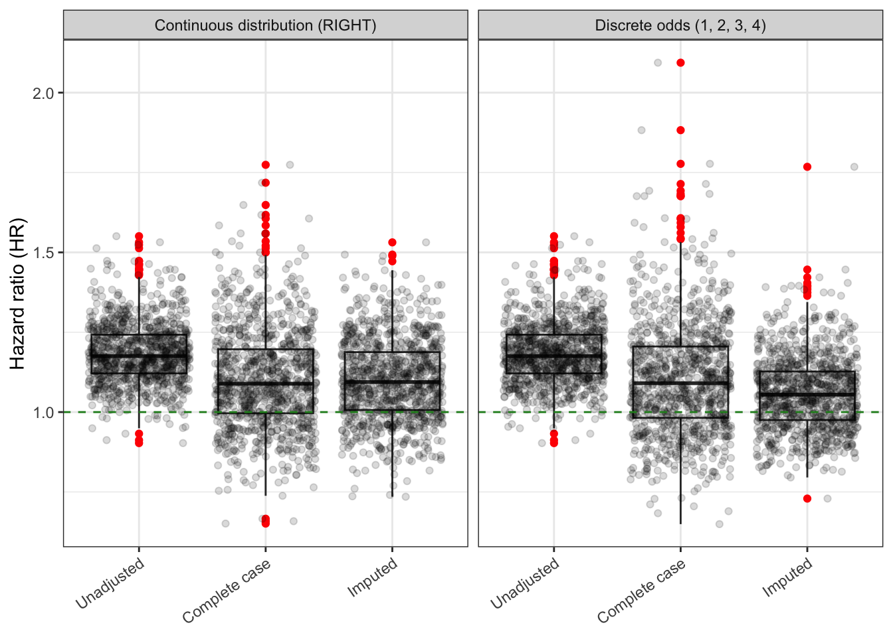
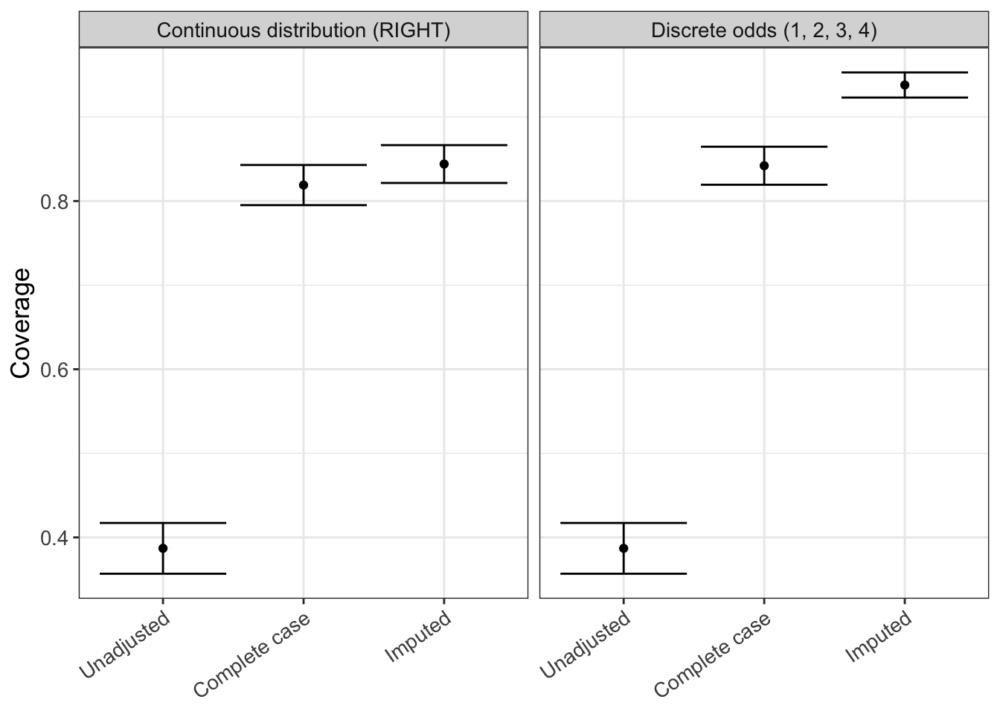

## Objective

In this section, we will generate 2 following different missingness scenarios.


::: {.cell}

```{.r .cell-code}
# define column numbers for pattern and weight determination
col_Z2 <- which(colnames(mock_cohort) %in% "Z2")
col_U <- which(colnames(mock_cohort) %in% "U")

# define missingness pattern
default_pattern <- rep(1, ncol(mock_cohort))
pattern <- replace(default_pattern, col_Z2, 0)

# define weights 
default_weights <- rep(0, ncol(mock_cohort))
weights <- replace(default_weights, c(col_Z2, col_U), c(0.2, 0.8))

prop <- 0.5
```
:::


## Continuous distribution probabilities

Probabilities are based on a continuous distribution. 


::: {.cell}

```{.r .cell-code}
tic(msg = "Simulation based on continuous distribution")

results <- parallel::mclapply(
  X = 1:n_replicates,
  FUN = run_simulation,
  pattern = pattern,
  weights = weights,
  type = "RIGHT",
  prop = prop,
  mc.cores = parallel::detectCores()-1
  ) 
  
results_cont <- do.call(rbind, results) |> 
  mutate(simulation = "Continuous distribution (RIGHT)")

toc()
```

::: {.cell-output .cell-output-stdout}
```
Simulation based on continuous distribution: 2.517 sec elapsed
```
:::
:::


## Discrete distribution probabilities

Probabilities are based on a discrete distribution. 


::: {.cell}

```{.r .cell-code}
tic(msg = "Simulation based on discrete distribution")

odds <- c(1, 2, 3, 4)

results <- parallel::mclapply(
  X = 1:n_replicates,
  FUN = run_simulation,
  pattern = pattern,
  weights = weights,
  odds = odds,
  prop = prop,
  mc.cores = parallel::detectCores()-1
  ) 
  
results_odds <- do.call(rbind, results) |> 
  mutate(simulation = paste0("Discrete odds (", paste0(odds, collapse = ", "), ")"))

toc()
```

::: {.cell-output .cell-output-stdout}
```
Simulation based on discrete distribution: 2.214 sec elapsed
```
:::
:::


## Save simulation results


::: {.cell}

```{.r .cell-code}
results <- rbind(results_cont, results_odds) |> 
  mutate(method = factor(method, levels = c(
    "Unadjusted", 
    "Complete case", 
    "Imputed"))
    )
```
:::


## Results

The next steps of this script analyze the raw simulation results obtained in the previous script via `run_simulation.R`. The last run on 2024-10-14 21:03:53.385771.

## Read raw results table

We first look at the results table with the raw simulation results.


::: {.cell}

```{.r .cell-code}
results |> 
  glimpse()
```

::: {.cell-output .cell-output-stdout}
```
Rows: 12
Columns: 5
$ method     <fct> Unadjusted, Complete case, Imputed, Unadjusted, Complete ca…
$ estimate   <dbl> 1.2629630, 0.8932111, 0.9111699, 1.1150121, 0.8824297, 1.03…
$ se         <dbl> 0.07923421, 0.13274238, 0.10924959, 0.07479571, 0.11677905,…
$ replicate  <int> 1, 1, 1, 2, 2, 2, 1, 1, 1, 2, 2, 2
$ simulation <chr> "Continuous distribution (RIGHT)", "Continuous distribution…
```
:::
:::


## QC

Let's do a few quality/sanity checks.

-   Number of analysis methods


::: {.cell}

```{.r .cell-code}
unique(results$method)
```

::: {.cell-output .cell-output-stdout}
```
[1] Unadjusted    Complete case Imputed      
Levels: Unadjusted Complete case Imputed
```
:::
:::


-   Assert that there are no missing results


::: {.cell}

```{.r .cell-code}
assert_that(!any(sapply(results$estimate, is.na)), msg = "There are missing estimates")
```

::: {.cell-output .cell-output-stdout}
```
[1] TRUE
```
:::

```{.r .cell-code}
assert_that(!any(sapply(results$se, is.na)), msg = "There are missing standard errors")
```

::: {.cell-output .cell-output-stdout}
```
[1] TRUE
```
:::
:::


## Main results


::: {.cell}

```{.r .cell-code}
# call helper functions
source(here::here("functions", "rsimsum_ggplot.R"))
```
:::


For the analysis of aggregate simulation results we use the `rsimsum` package. More information about this package can be found [here](https://ellessenne.github.io/rsimsum/).[@rsimsum]


::: {.cell}

```{.r .cell-code}
simsum_out <- simsum(
  data = results, 
  estvarname = "estimate", 
  se = "se", 
  true = 1, 
  by = "simulation",
  methodvar = "method", 
  ref = "Complete case"
  ) |> 
  summary() |> 
  tidy()
```
:::


::: panel-tabset
### Hazard ratio distribution


::: {.cell}

```{.r .cell-code}
hr_distribution <- results |> 
  ggplot(aes(x = method, y = estimate)) +
  geom_boxplot(outlier.colour = "red") +
  geom_point(position = position_jitter(seed = 42), alpha = 0.15) +
  geom_hline(yintercept = 1.0, color = "forestgreen", linetype = "dashed") +
  labs(
    x = "Method",
    y = "Hazard ratio (HR)"
    ) +
  theme_bw() +
  theme(
    axis.title.x = element_blank(),
    axis.text.x = element_text(angle = 35, vjust = 1, hjust=1)
    ) +
  facet_wrap(~simulation)

hr_distribution
```

::: {.cell-output-display}
{#fig-hr_distribution width=672}
:::
:::


### Hazard ratio distribution (interactive)


::: {.cell}

```{.r .cell-code}
ggplotly(hr_distribution)
```

::: {.cell-output-display}

```{=html}
<div class="plotly html-widget html-fill-item" id="htmlwidget-b783e3eef1a0d1740130" style="width:100%;height:464px;"></div>
<script type="application/json" data-for="htmlwidget-b783e3eef1a0d1740130">{"x":{"data":[{"x":[1,1,2,2,3,3],"y":[1.2629630355325527,1.1150120691545358,0.89321113643250083,0.88242966869539019,0.9111698697883811,1.0336250343236137],"hoverinfo":"y","type":"box","fillcolor":"rgba(255,255,255,1)","marker":{"opacity":null,"outliercolor":"rgba(0,0,0,1)","line":{"width":1.8897637795275593,"color":"rgba(0,0,0,1)"},"size":5.6692913385826778},"line":{"color":"rgba(51,51,51,1)","width":1.8897637795275593},"showlegend":false,"xaxis":"x","yaxis":"y","frame":null},{"x":[1,1,2,2,3,3],"y":[1.2629630355325527,1.1150120691545358,1.121990480564665,0.84765352665830351,0.93647904150155026,0.92117950808935545],"hoverinfo":"y","type":"box","fillcolor":"rgba(255,255,255,1)","marker":{"opacity":null,"outliercolor":"rgba(0,0,0,1)","line":{"width":1.8897637795275593,"color":"rgba(0,0,0,1)"},"size":5.6692913385826778},"line":{"color":"rgba(51,51,51,1)","width":1.8897637795275593},"showlegend":false,"xaxis":"x2","yaxis":"y","frame":null},{"x":[1.3318448347970844,2.3496603306382893,2.8289116278290747,1.2643581008538605,2.1133964151144027,3.0152767593041063],"y":[1.2653896929479107,0.89184576180625441,0.91095936083045637,1.1174685510475115,0.88509947730696859,1.0314895698756554],"text":["method: Unadjusted<br />estimate: 1.2629630","method: Complete case<br />estimate: 0.8932111","method: Imputed<br />estimate: 0.9111699","method: Unadjusted<br />estimate: 1.1150121","method: Complete case<br />estimate: 0.8824297","method: Imputed<br />estimate: 1.0336250"],"type":"scatter","mode":"markers","marker":{"autocolorscale":false,"color":"rgba(0,0,0,1)","opacity":0.14999999999999999,"size":5.6692913385826778,"symbol":"circle","line":{"width":1.8897637795275593,"color":"rgba(0,0,0,1)"}},"hoveron":"points","showlegend":false,"xaxis":"x","yaxis":"y","hoverinfo":"text","frame":null},{"x":[1.1892706517130136,1.7077332777902483,3.1255938323214649,1.1640518272295595,1.9661934209987522,3.1752898013219237],"y":[1.2628234510114957,1.1223273019445053,0.93873463929608369,1.1129950858842046,0.85038287675383883,0.92367313584185706],"text":["method: Unadjusted<br />estimate: 1.2629630","method: Complete case<br />estimate: 1.1219905","method: Imputed<br />estimate: 0.9364790","method: Unadjusted<br />estimate: 1.1150121","method: Complete case<br />estimate: 0.8476535","method: Imputed<br />estimate: 0.9211795"],"type":"scatter","mode":"markers","marker":{"autocolorscale":false,"color":"rgba(0,0,0,1)","opacity":0.14999999999999999,"size":5.6692913385826778,"symbol":"circle","line":{"width":1.8897637795275593,"color":"rgba(0,0,0,1)"}},"hoveron":"points","showlegend":false,"xaxis":"x2","yaxis":"y","hoverinfo":"text","frame":null},{"x":[0.40000000000000002,3.6000000000000001],"y":[1,1],"text":"yintercept: 1","type":"scatter","mode":"lines","line":{"width":1.8897637795275593,"color":"rgba(34,139,34,1)","dash":"dash"},"hoveron":"points","showlegend":false,"xaxis":"x","yaxis":"y","hoverinfo":"text","frame":null},{"x":[0.40000000000000002,3.6000000000000001],"y":[1,1],"text":"yintercept: 1","type":"scatter","mode":"lines","line":{"width":1.8897637795275593,"color":"rgba(34,139,34,1)","dash":"dash"},"hoveron":"points","showlegend":false,"xaxis":"x2","yaxis":"y","hoverinfo":"text","frame":null}],"layout":{"margin":{"t":37.917808219178085,"r":7.3059360730593621,"b":25.57077625570777,"l":43.105022831050235},"plot_bgcolor":"rgba(255,255,255,1)","paper_bgcolor":"rgba(255,255,255,1)","font":{"color":"rgba(0,0,0,1)","family":"","size":14.611872146118724},"xaxis":{"domain":[0,0.48912807131985214],"automargin":true,"type":"linear","autorange":false,"range":[0.40000000000000002,3.6000000000000001],"tickmode":"array","ticktext":["Unadjusted","Complete case","Imputed"],"tickvals":[1,2,3],"categoryorder":"array","categoryarray":["Unadjusted","Complete case","Imputed"],"nticks":null,"ticks":"outside","tickcolor":"rgba(51,51,51,1)","ticklen":3.6529680365296811,"tickwidth":0.66417600664176002,"showticklabels":true,"tickfont":{"color":"rgba(77,77,77,1)","family":"","size":11.68949771689498},"tickangle":-35,"showline":false,"linecolor":null,"linewidth":0,"showgrid":true,"gridcolor":"rgba(235,235,235,1)","gridwidth":0.66417600664176002,"zeroline":false,"anchor":"y","title":"","hoverformat":".2f"},"yaxis":{"domain":[0,1],"automargin":true,"type":"linear","autorange":false,"range":[0.8267667183438232,1.2862765012623911],"tickmode":"array","ticktext":["0.9","1.0","1.1","1.2"],"tickvals":[0.90000000000000002,1,1.1000000000000001,1.2000000000000002],"categoryorder":"array","categoryarray":["0.9","1.0","1.1","1.2"],"nticks":null,"ticks":"outside","tickcolor":"rgba(51,51,51,1)","ticklen":3.6529680365296811,"tickwidth":0.66417600664176002,"showticklabels":true,"tickfont":{"color":"rgba(77,77,77,1)","family":"","size":11.68949771689498},"tickangle":-0,"showline":false,"linecolor":null,"linewidth":0,"showgrid":true,"gridcolor":"rgba(235,235,235,1)","gridwidth":0.66417600664176002,"zeroline":false,"anchor":"x","title":"","hoverformat":".2f"},"annotations":[{"text":"Hazard ratio (HR)","x":0,"y":0.5,"showarrow":false,"ax":0,"ay":0,"font":{"color":"rgba(0,0,0,1)","family":"","size":14.611872146118724},"xref":"paper","yref":"paper","textangle":-90,"xanchor":"right","yanchor":"center","annotationType":"axis","xshift":-27.762557077625573},{"text":"Continuous distribution (RIGHT)","x":0.24456403565992607,"y":1,"showarrow":false,"ax":0,"ay":0,"font":{"color":"rgba(26,26,26,1)","family":"","size":11.68949771689498},"xref":"paper","yref":"paper","textangle":-0,"xanchor":"center","yanchor":"bottom"},{"text":"Discrete odds (1, 2, 3, 4)","x":0.75543596434007387,"y":1,"showarrow":false,"ax":0,"ay":0,"font":{"color":"rgba(26,26,26,1)","family":"","size":11.68949771689498},"xref":"paper","yref":"paper","textangle":-0,"xanchor":"center","yanchor":"bottom"}],"shapes":[{"type":"rect","fillcolor":"transparent","line":{"color":"rgba(51,51,51,1)","width":0.66417600664176002,"linetype":"solid"},"yref":"paper","xref":"paper","x0":0,"x1":0.48912807131985214,"y0":0,"y1":1},{"type":"rect","fillcolor":"rgba(217,217,217,1)","line":{"color":"rgba(51,51,51,1)","width":0.66417600664176002,"linetype":"solid"},"yref":"paper","xref":"paper","x0":0,"x1":0.48912807131985214,"y0":0,"y1":23.37899543378996,"yanchor":1,"ysizemode":"pixel"},{"type":"rect","fillcolor":"transparent","line":{"color":"rgba(51,51,51,1)","width":0.66417600664176002,"linetype":"solid"},"yref":"paper","xref":"paper","x0":0.51087192868014786,"x1":1,"y0":0,"y1":1},{"type":"rect","fillcolor":"rgba(217,217,217,1)","line":{"color":"rgba(51,51,51,1)","width":0.66417600664176002,"linetype":"solid"},"yref":"paper","xref":"paper","x0":0.51087192868014786,"x1":1,"y0":0,"y1":23.37899543378996,"yanchor":1,"ysizemode":"pixel"}],"xaxis2":{"type":"linear","autorange":false,"range":[0.40000000000000002,3.6000000000000001],"tickmode":"array","ticktext":["Unadjusted","Complete case","Imputed"],"tickvals":[1,2,3],"categoryorder":"array","categoryarray":["Unadjusted","Complete case","Imputed"],"nticks":null,"ticks":"outside","tickcolor":"rgba(51,51,51,1)","ticklen":3.6529680365296811,"tickwidth":0.66417600664176002,"showticklabels":true,"tickfont":{"color":"rgba(77,77,77,1)","family":"","size":11.68949771689498},"tickangle":-35,"showline":false,"linecolor":null,"linewidth":0,"showgrid":true,"domain":[0.51087192868014786,1],"gridcolor":"rgba(235,235,235,1)","gridwidth":0.66417600664176002,"zeroline":false,"anchor":"y","title":"","hoverformat":".2f"},"showlegend":false,"legend":{"bgcolor":"rgba(255,255,255,1)","bordercolor":"transparent","borderwidth":1.8897637795275593,"font":{"color":"rgba(0,0,0,1)","family":"","size":11.68949771689498}},"hovermode":"closest","barmode":"relative"},"config":{"doubleClick":"reset","modeBarButtonsToAdd":["hoverclosest","hovercompare"],"showSendToCloud":false},"source":"A","attrs":{"d000618bf26c":{"x":{},"y":{},"type":"box"},"d0002ad8c27c":{"x":{},"y":{}},"d0007cc870dd":{"yintercept":{}}},"cur_data":"d000618bf26c","visdat":{"d000618bf26c":["function (y) ","x"],"d0002ad8c27c":["function (y) ","x"],"d0007cc870dd":["function (y) ","x"]},"highlight":{"on":"plotly_click","persistent":false,"dynamic":false,"selectize":false,"opacityDim":0.20000000000000001,"selected":{"opacity":1},"debounce":0},"shinyEvents":["plotly_hover","plotly_click","plotly_selected","plotly_relayout","plotly_brushed","plotly_brushing","plotly_clickannotation","plotly_doubleclick","plotly_deselect","plotly_afterplot","plotly_sunburstclick"],"base_url":"https://plot.ly"},"evals":[],"jsHooks":[]}</script>
```

:::
:::

:::


### Root mean squared error (RMSE)


::: {.cell}

```{.r .cell-code}
rmse <- rsimsum_ggplot(tidy_simsum = simsum_out, metric = "rmse")
```

::: {.cell-output .cell-output-stderr}
```
Warning: There were 2 warnings in `dplyr::mutate()`.
The first warning was:
ℹ In argument: `lower = sqrt(lower)`.
ℹ In group 1: `simulation = "Continuous distribution (RIGHT)"`.
Caused by warning in `sqrt()`:
! NaNs produced
ℹ Run `dplyr::last_dplyr_warnings()` to see the 1 remaining warning.
```
:::
:::


::: panel-tabset
#### Plot


::: {.cell}

```{.r .cell-code}
rmse$plot
```

::: {.cell-output-display}
{#fig-rmse width=672}
:::
:::


#### Table


::: {#tbl-rmse .cell tbl-cap='Root mean squared error by method.'}

```{.r .cell-code}
rmse$table |> 
  gt()
```

::: {.cell-output-display}

```{=html}
<div id="xddorarubq" style="padding-left:0px;padding-right:0px;padding-top:10px;padding-bottom:10px;overflow-x:auto;overflow-y:auto;width:auto;height:auto;">
<style>#xddorarubq table {
  font-family: system-ui, 'Segoe UI', Roboto, Helvetica, Arial, sans-serif, 'Apple Color Emoji', 'Segoe UI Emoji', 'Segoe UI Symbol', 'Noto Color Emoji';
  -webkit-font-smoothing: antialiased;
  -moz-osx-font-smoothing: grayscale;
}

#xddorarubq thead, #xddorarubq tbody, #xddorarubq tfoot, #xddorarubq tr, #xddorarubq td, #xddorarubq th {
  border-style: none;
}

#xddorarubq p {
  margin: 0;
  padding: 0;
}

#xddorarubq .gt_table {
  display: table;
  border-collapse: collapse;
  line-height: normal;
  margin-left: auto;
  margin-right: auto;
  color: #333333;
  font-size: 16px;
  font-weight: normal;
  font-style: normal;
  background-color: #FFFFFF;
  width: auto;
  border-top-style: solid;
  border-top-width: 2px;
  border-top-color: #A8A8A8;
  border-right-style: none;
  border-right-width: 2px;
  border-right-color: #D3D3D3;
  border-bottom-style: solid;
  border-bottom-width: 2px;
  border-bottom-color: #A8A8A8;
  border-left-style: none;
  border-left-width: 2px;
  border-left-color: #D3D3D3;
}

#xddorarubq .gt_caption {
  padding-top: 4px;
  padding-bottom: 4px;
}

#xddorarubq .gt_title {
  color: #333333;
  font-size: 125%;
  font-weight: initial;
  padding-top: 4px;
  padding-bottom: 4px;
  padding-left: 5px;
  padding-right: 5px;
  border-bottom-color: #FFFFFF;
  border-bottom-width: 0;
}

#xddorarubq .gt_subtitle {
  color: #333333;
  font-size: 85%;
  font-weight: initial;
  padding-top: 3px;
  padding-bottom: 5px;
  padding-left: 5px;
  padding-right: 5px;
  border-top-color: #FFFFFF;
  border-top-width: 0;
}

#xddorarubq .gt_heading {
  background-color: #FFFFFF;
  text-align: center;
  border-bottom-color: #FFFFFF;
  border-left-style: none;
  border-left-width: 1px;
  border-left-color: #D3D3D3;
  border-right-style: none;
  border-right-width: 1px;
  border-right-color: #D3D3D3;
}

#xddorarubq .gt_bottom_border {
  border-bottom-style: solid;
  border-bottom-width: 2px;
  border-bottom-color: #D3D3D3;
}

#xddorarubq .gt_col_headings {
  border-top-style: solid;
  border-top-width: 2px;
  border-top-color: #D3D3D3;
  border-bottom-style: solid;
  border-bottom-width: 2px;
  border-bottom-color: #D3D3D3;
  border-left-style: none;
  border-left-width: 1px;
  border-left-color: #D3D3D3;
  border-right-style: none;
  border-right-width: 1px;
  border-right-color: #D3D3D3;
}

#xddorarubq .gt_col_heading {
  color: #333333;
  background-color: #FFFFFF;
  font-size: 100%;
  font-weight: normal;
  text-transform: inherit;
  border-left-style: none;
  border-left-width: 1px;
  border-left-color: #D3D3D3;
  border-right-style: none;
  border-right-width: 1px;
  border-right-color: #D3D3D3;
  vertical-align: bottom;
  padding-top: 5px;
  padding-bottom: 6px;
  padding-left: 5px;
  padding-right: 5px;
  overflow-x: hidden;
}

#xddorarubq .gt_column_spanner_outer {
  color: #333333;
  background-color: #FFFFFF;
  font-size: 100%;
  font-weight: normal;
  text-transform: inherit;
  padding-top: 0;
  padding-bottom: 0;
  padding-left: 4px;
  padding-right: 4px;
}

#xddorarubq .gt_column_spanner_outer:first-child {
  padding-left: 0;
}

#xddorarubq .gt_column_spanner_outer:last-child {
  padding-right: 0;
}

#xddorarubq .gt_column_spanner {
  border-bottom-style: solid;
  border-bottom-width: 2px;
  border-bottom-color: #D3D3D3;
  vertical-align: bottom;
  padding-top: 5px;
  padding-bottom: 5px;
  overflow-x: hidden;
  display: inline-block;
  width: 100%;
}

#xddorarubq .gt_spanner_row {
  border-bottom-style: hidden;
}

#xddorarubq .gt_group_heading {
  padding-top: 8px;
  padding-bottom: 8px;
  padding-left: 5px;
  padding-right: 5px;
  color: #333333;
  background-color: #FFFFFF;
  font-size: 100%;
  font-weight: initial;
  text-transform: inherit;
  border-top-style: solid;
  border-top-width: 2px;
  border-top-color: #D3D3D3;
  border-bottom-style: solid;
  border-bottom-width: 2px;
  border-bottom-color: #D3D3D3;
  border-left-style: none;
  border-left-width: 1px;
  border-left-color: #D3D3D3;
  border-right-style: none;
  border-right-width: 1px;
  border-right-color: #D3D3D3;
  vertical-align: middle;
  text-align: left;
}

#xddorarubq .gt_empty_group_heading {
  padding: 0.5px;
  color: #333333;
  background-color: #FFFFFF;
  font-size: 100%;
  font-weight: initial;
  border-top-style: solid;
  border-top-width: 2px;
  border-top-color: #D3D3D3;
  border-bottom-style: solid;
  border-bottom-width: 2px;
  border-bottom-color: #D3D3D3;
  vertical-align: middle;
}

#xddorarubq .gt_from_md > :first-child {
  margin-top: 0;
}

#xddorarubq .gt_from_md > :last-child {
  margin-bottom: 0;
}

#xddorarubq .gt_row {
  padding-top: 8px;
  padding-bottom: 8px;
  padding-left: 5px;
  padding-right: 5px;
  margin: 10px;
  border-top-style: solid;
  border-top-width: 1px;
  border-top-color: #D3D3D3;
  border-left-style: none;
  border-left-width: 1px;
  border-left-color: #D3D3D3;
  border-right-style: none;
  border-right-width: 1px;
  border-right-color: #D3D3D3;
  vertical-align: middle;
  overflow-x: hidden;
}

#xddorarubq .gt_stub {
  color: #333333;
  background-color: #FFFFFF;
  font-size: 100%;
  font-weight: initial;
  text-transform: inherit;
  border-right-style: solid;
  border-right-width: 2px;
  border-right-color: #D3D3D3;
  padding-left: 5px;
  padding-right: 5px;
}

#xddorarubq .gt_stub_row_group {
  color: #333333;
  background-color: #FFFFFF;
  font-size: 100%;
  font-weight: initial;
  text-transform: inherit;
  border-right-style: solid;
  border-right-width: 2px;
  border-right-color: #D3D3D3;
  padding-left: 5px;
  padding-right: 5px;
  vertical-align: top;
}

#xddorarubq .gt_row_group_first td {
  border-top-width: 2px;
}

#xddorarubq .gt_row_group_first th {
  border-top-width: 2px;
}

#xddorarubq .gt_summary_row {
  color: #333333;
  background-color: #FFFFFF;
  text-transform: inherit;
  padding-top: 8px;
  padding-bottom: 8px;
  padding-left: 5px;
  padding-right: 5px;
}

#xddorarubq .gt_first_summary_row {
  border-top-style: solid;
  border-top-color: #D3D3D3;
}

#xddorarubq .gt_first_summary_row.thick {
  border-top-width: 2px;
}

#xddorarubq .gt_last_summary_row {
  padding-top: 8px;
  padding-bottom: 8px;
  padding-left: 5px;
  padding-right: 5px;
  border-bottom-style: solid;
  border-bottom-width: 2px;
  border-bottom-color: #D3D3D3;
}

#xddorarubq .gt_grand_summary_row {
  color: #333333;
  background-color: #FFFFFF;
  text-transform: inherit;
  padding-top: 8px;
  padding-bottom: 8px;
  padding-left: 5px;
  padding-right: 5px;
}

#xddorarubq .gt_first_grand_summary_row {
  padding-top: 8px;
  padding-bottom: 8px;
  padding-left: 5px;
  padding-right: 5px;
  border-top-style: double;
  border-top-width: 6px;
  border-top-color: #D3D3D3;
}

#xddorarubq .gt_last_grand_summary_row_top {
  padding-top: 8px;
  padding-bottom: 8px;
  padding-left: 5px;
  padding-right: 5px;
  border-bottom-style: double;
  border-bottom-width: 6px;
  border-bottom-color: #D3D3D3;
}

#xddorarubq .gt_striped {
  background-color: rgba(128, 128, 128, 0.05);
}

#xddorarubq .gt_table_body {
  border-top-style: solid;
  border-top-width: 2px;
  border-top-color: #D3D3D3;
  border-bottom-style: solid;
  border-bottom-width: 2px;
  border-bottom-color: #D3D3D3;
}

#xddorarubq .gt_footnotes {
  color: #333333;
  background-color: #FFFFFF;
  border-bottom-style: none;
  border-bottom-width: 2px;
  border-bottom-color: #D3D3D3;
  border-left-style: none;
  border-left-width: 2px;
  border-left-color: #D3D3D3;
  border-right-style: none;
  border-right-width: 2px;
  border-right-color: #D3D3D3;
}

#xddorarubq .gt_footnote {
  margin: 0px;
  font-size: 90%;
  padding-top: 4px;
  padding-bottom: 4px;
  padding-left: 5px;
  padding-right: 5px;
}

#xddorarubq .gt_sourcenotes {
  color: #333333;
  background-color: #FFFFFF;
  border-bottom-style: none;
  border-bottom-width: 2px;
  border-bottom-color: #D3D3D3;
  border-left-style: none;
  border-left-width: 2px;
  border-left-color: #D3D3D3;
  border-right-style: none;
  border-right-width: 2px;
  border-right-color: #D3D3D3;
}

#xddorarubq .gt_sourcenote {
  font-size: 90%;
  padding-top: 4px;
  padding-bottom: 4px;
  padding-left: 5px;
  padding-right: 5px;
}

#xddorarubq .gt_left {
  text-align: left;
}

#xddorarubq .gt_center {
  text-align: center;
}

#xddorarubq .gt_right {
  text-align: right;
  font-variant-numeric: tabular-nums;
}

#xddorarubq .gt_font_normal {
  font-weight: normal;
}

#xddorarubq .gt_font_bold {
  font-weight: bold;
}

#xddorarubq .gt_font_italic {
  font-style: italic;
}

#xddorarubq .gt_super {
  font-size: 65%;
}

#xddorarubq .gt_footnote_marks {
  font-size: 75%;
  vertical-align: 0.4em;
  position: initial;
}

#xddorarubq .gt_asterisk {
  font-size: 100%;
  vertical-align: 0;
}

#xddorarubq .gt_indent_1 {
  text-indent: 5px;
}

#xddorarubq .gt_indent_2 {
  text-indent: 10px;
}

#xddorarubq .gt_indent_3 {
  text-indent: 15px;
}

#xddorarubq .gt_indent_4 {
  text-indent: 20px;
}

#xddorarubq .gt_indent_5 {
  text-indent: 25px;
}
</style>
<table class="gt_table" data-quarto-disable-processing="false" data-quarto-bootstrap="false">
  <thead>
    <tr class="gt_col_headings">
      <th class="gt_col_heading gt_columns_bottom_border gt_center" rowspan="1" colspan="1" scope="col" id="method">method</th>
      <th class="gt_col_heading gt_columns_bottom_border gt_right" rowspan="1" colspan="1" scope="col" id="est">est</th>
      <th class="gt_col_heading gt_columns_bottom_border gt_right" rowspan="1" colspan="1" scope="col" id="lower">lower</th>
      <th class="gt_col_heading gt_columns_bottom_border gt_right" rowspan="1" colspan="1" scope="col" id="upper">upper</th>
    </tr>
  </thead>
  <tbody class="gt_table_body">
    <tr class="gt_group_heading_row">
      <th colspan="4" class="gt_group_heading" scope="colgroup" id="Continuous distribution (RIGHT)">Continuous distribution (RIGHT)</th>
    </tr>
    <tr class="gt_row_group_first"><td headers="Continuous distribution (RIGHT)  method" class="gt_row gt_center">Unadjusted</td>
<td headers="Continuous distribution (RIGHT)  est" class="gt_row gt_right">0.203</td>
<td headers="Continuous distribution (RIGHT)  lower" class="gt_row gt_right">NaN</td>
<td headers="Continuous distribution (RIGHT)  upper" class="gt_row gt_right">0.310</td></tr>
    <tr><td headers="Continuous distribution (RIGHT)  method" class="gt_row gt_center">Complete case</td>
<td headers="Continuous distribution (RIGHT)  est" class="gt_row gt_right">0.112</td>
<td headers="Continuous distribution (RIGHT)  lower" class="gt_row gt_right">0.101</td>
<td headers="Continuous distribution (RIGHT)  upper" class="gt_row gt_right">0.122</td></tr>
    <tr><td headers="Continuous distribution (RIGHT)  method" class="gt_row gt_center">Imputed</td>
<td headers="Continuous distribution (RIGHT)  est" class="gt_row gt_right">0.067</td>
<td headers="Continuous distribution (RIGHT)  lower" class="gt_row gt_right">NaN</td>
<td headers="Continuous distribution (RIGHT)  upper" class="gt_row gt_right">0.106</td></tr>
    <tr class="gt_group_heading_row">
      <th colspan="4" class="gt_group_heading" scope="colgroup" id="Discrete odds (1, 2, 3, 4)">Discrete odds (1, 2, 3, 4)</th>
    </tr>
    <tr class="gt_row_group_first"><td headers="Discrete odds (1, 2, 3, 4)  method" class="gt_row gt_center">Unadjusted</td>
<td headers="Discrete odds (1, 2, 3, 4)  est" class="gt_row gt_right">0.203</td>
<td headers="Discrete odds (1, 2, 3, 4)  lower" class="gt_row gt_right">NaN</td>
<td headers="Discrete odds (1, 2, 3, 4)  upper" class="gt_row gt_right">0.310</td></tr>
    <tr><td headers="Discrete odds (1, 2, 3, 4)  method" class="gt_row gt_center">Complete case</td>
<td headers="Discrete odds (1, 2, 3, 4)  est" class="gt_row gt_right">0.138</td>
<td headers="Discrete odds (1, 2, 3, 4)  lower" class="gt_row gt_right">0.104</td>
<td headers="Discrete odds (1, 2, 3, 4)  upper" class="gt_row gt_right">0.165</td></tr>
    <tr><td headers="Discrete odds (1, 2, 3, 4)  method" class="gt_row gt_center">Imputed</td>
<td headers="Discrete odds (1, 2, 3, 4)  est" class="gt_row gt_right">0.072</td>
<td headers="Discrete odds (1, 2, 3, 4)  lower" class="gt_row gt_right">0.055</td>
<td headers="Discrete odds (1, 2, 3, 4)  upper" class="gt_row gt_right">0.085</td></tr>
  </tbody>
  
  
</table>
</div>
```

:::
:::

:::


### Bias


::: {.cell}

```{.r .cell-code}
bias <- rsimsum_ggplot(tidy_simsum = simsum_out, metric = "bias")
```
:::


::: panel-tabset
#### Plot


::: {.cell}

```{.r .cell-code}
bias$plot
```

::: {.cell-output-display}
{#fig-bias width=672}
:::
:::


#### Table


::: {#tbl-bias .cell tbl-cap='Bias by method.'}

```{.r .cell-code}
bias$table |> 
  gt()
```

::: {.cell-output-display}

```{=html}
<div id="nrdlmcpriw" style="padding-left:0px;padding-right:0px;padding-top:10px;padding-bottom:10px;overflow-x:auto;overflow-y:auto;width:auto;height:auto;">
<style>#nrdlmcpriw table {
  font-family: system-ui, 'Segoe UI', Roboto, Helvetica, Arial, sans-serif, 'Apple Color Emoji', 'Segoe UI Emoji', 'Segoe UI Symbol', 'Noto Color Emoji';
  -webkit-font-smoothing: antialiased;
  -moz-osx-font-smoothing: grayscale;
}

#nrdlmcpriw thead, #nrdlmcpriw tbody, #nrdlmcpriw tfoot, #nrdlmcpriw tr, #nrdlmcpriw td, #nrdlmcpriw th {
  border-style: none;
}

#nrdlmcpriw p {
  margin: 0;
  padding: 0;
}

#nrdlmcpriw .gt_table {
  display: table;
  border-collapse: collapse;
  line-height: normal;
  margin-left: auto;
  margin-right: auto;
  color: #333333;
  font-size: 16px;
  font-weight: normal;
  font-style: normal;
  background-color: #FFFFFF;
  width: auto;
  border-top-style: solid;
  border-top-width: 2px;
  border-top-color: #A8A8A8;
  border-right-style: none;
  border-right-width: 2px;
  border-right-color: #D3D3D3;
  border-bottom-style: solid;
  border-bottom-width: 2px;
  border-bottom-color: #A8A8A8;
  border-left-style: none;
  border-left-width: 2px;
  border-left-color: #D3D3D3;
}

#nrdlmcpriw .gt_caption {
  padding-top: 4px;
  padding-bottom: 4px;
}

#nrdlmcpriw .gt_title {
  color: #333333;
  font-size: 125%;
  font-weight: initial;
  padding-top: 4px;
  padding-bottom: 4px;
  padding-left: 5px;
  padding-right: 5px;
  border-bottom-color: #FFFFFF;
  border-bottom-width: 0;
}

#nrdlmcpriw .gt_subtitle {
  color: #333333;
  font-size: 85%;
  font-weight: initial;
  padding-top: 3px;
  padding-bottom: 5px;
  padding-left: 5px;
  padding-right: 5px;
  border-top-color: #FFFFFF;
  border-top-width: 0;
}

#nrdlmcpriw .gt_heading {
  background-color: #FFFFFF;
  text-align: center;
  border-bottom-color: #FFFFFF;
  border-left-style: none;
  border-left-width: 1px;
  border-left-color: #D3D3D3;
  border-right-style: none;
  border-right-width: 1px;
  border-right-color: #D3D3D3;
}

#nrdlmcpriw .gt_bottom_border {
  border-bottom-style: solid;
  border-bottom-width: 2px;
  border-bottom-color: #D3D3D3;
}

#nrdlmcpriw .gt_col_headings {
  border-top-style: solid;
  border-top-width: 2px;
  border-top-color: #D3D3D3;
  border-bottom-style: solid;
  border-bottom-width: 2px;
  border-bottom-color: #D3D3D3;
  border-left-style: none;
  border-left-width: 1px;
  border-left-color: #D3D3D3;
  border-right-style: none;
  border-right-width: 1px;
  border-right-color: #D3D3D3;
}

#nrdlmcpriw .gt_col_heading {
  color: #333333;
  background-color: #FFFFFF;
  font-size: 100%;
  font-weight: normal;
  text-transform: inherit;
  border-left-style: none;
  border-left-width: 1px;
  border-left-color: #D3D3D3;
  border-right-style: none;
  border-right-width: 1px;
  border-right-color: #D3D3D3;
  vertical-align: bottom;
  padding-top: 5px;
  padding-bottom: 6px;
  padding-left: 5px;
  padding-right: 5px;
  overflow-x: hidden;
}

#nrdlmcpriw .gt_column_spanner_outer {
  color: #333333;
  background-color: #FFFFFF;
  font-size: 100%;
  font-weight: normal;
  text-transform: inherit;
  padding-top: 0;
  padding-bottom: 0;
  padding-left: 4px;
  padding-right: 4px;
}

#nrdlmcpriw .gt_column_spanner_outer:first-child {
  padding-left: 0;
}

#nrdlmcpriw .gt_column_spanner_outer:last-child {
  padding-right: 0;
}

#nrdlmcpriw .gt_column_spanner {
  border-bottom-style: solid;
  border-bottom-width: 2px;
  border-bottom-color: #D3D3D3;
  vertical-align: bottom;
  padding-top: 5px;
  padding-bottom: 5px;
  overflow-x: hidden;
  display: inline-block;
  width: 100%;
}

#nrdlmcpriw .gt_spanner_row {
  border-bottom-style: hidden;
}

#nrdlmcpriw .gt_group_heading {
  padding-top: 8px;
  padding-bottom: 8px;
  padding-left: 5px;
  padding-right: 5px;
  color: #333333;
  background-color: #FFFFFF;
  font-size: 100%;
  font-weight: initial;
  text-transform: inherit;
  border-top-style: solid;
  border-top-width: 2px;
  border-top-color: #D3D3D3;
  border-bottom-style: solid;
  border-bottom-width: 2px;
  border-bottom-color: #D3D3D3;
  border-left-style: none;
  border-left-width: 1px;
  border-left-color: #D3D3D3;
  border-right-style: none;
  border-right-width: 1px;
  border-right-color: #D3D3D3;
  vertical-align: middle;
  text-align: left;
}

#nrdlmcpriw .gt_empty_group_heading {
  padding: 0.5px;
  color: #333333;
  background-color: #FFFFFF;
  font-size: 100%;
  font-weight: initial;
  border-top-style: solid;
  border-top-width: 2px;
  border-top-color: #D3D3D3;
  border-bottom-style: solid;
  border-bottom-width: 2px;
  border-bottom-color: #D3D3D3;
  vertical-align: middle;
}

#nrdlmcpriw .gt_from_md > :first-child {
  margin-top: 0;
}

#nrdlmcpriw .gt_from_md > :last-child {
  margin-bottom: 0;
}

#nrdlmcpriw .gt_row {
  padding-top: 8px;
  padding-bottom: 8px;
  padding-left: 5px;
  padding-right: 5px;
  margin: 10px;
  border-top-style: solid;
  border-top-width: 1px;
  border-top-color: #D3D3D3;
  border-left-style: none;
  border-left-width: 1px;
  border-left-color: #D3D3D3;
  border-right-style: none;
  border-right-width: 1px;
  border-right-color: #D3D3D3;
  vertical-align: middle;
  overflow-x: hidden;
}

#nrdlmcpriw .gt_stub {
  color: #333333;
  background-color: #FFFFFF;
  font-size: 100%;
  font-weight: initial;
  text-transform: inherit;
  border-right-style: solid;
  border-right-width: 2px;
  border-right-color: #D3D3D3;
  padding-left: 5px;
  padding-right: 5px;
}

#nrdlmcpriw .gt_stub_row_group {
  color: #333333;
  background-color: #FFFFFF;
  font-size: 100%;
  font-weight: initial;
  text-transform: inherit;
  border-right-style: solid;
  border-right-width: 2px;
  border-right-color: #D3D3D3;
  padding-left: 5px;
  padding-right: 5px;
  vertical-align: top;
}

#nrdlmcpriw .gt_row_group_first td {
  border-top-width: 2px;
}

#nrdlmcpriw .gt_row_group_first th {
  border-top-width: 2px;
}

#nrdlmcpriw .gt_summary_row {
  color: #333333;
  background-color: #FFFFFF;
  text-transform: inherit;
  padding-top: 8px;
  padding-bottom: 8px;
  padding-left: 5px;
  padding-right: 5px;
}

#nrdlmcpriw .gt_first_summary_row {
  border-top-style: solid;
  border-top-color: #D3D3D3;
}

#nrdlmcpriw .gt_first_summary_row.thick {
  border-top-width: 2px;
}

#nrdlmcpriw .gt_last_summary_row {
  padding-top: 8px;
  padding-bottom: 8px;
  padding-left: 5px;
  padding-right: 5px;
  border-bottom-style: solid;
  border-bottom-width: 2px;
  border-bottom-color: #D3D3D3;
}

#nrdlmcpriw .gt_grand_summary_row {
  color: #333333;
  background-color: #FFFFFF;
  text-transform: inherit;
  padding-top: 8px;
  padding-bottom: 8px;
  padding-left: 5px;
  padding-right: 5px;
}

#nrdlmcpriw .gt_first_grand_summary_row {
  padding-top: 8px;
  padding-bottom: 8px;
  padding-left: 5px;
  padding-right: 5px;
  border-top-style: double;
  border-top-width: 6px;
  border-top-color: #D3D3D3;
}

#nrdlmcpriw .gt_last_grand_summary_row_top {
  padding-top: 8px;
  padding-bottom: 8px;
  padding-left: 5px;
  padding-right: 5px;
  border-bottom-style: double;
  border-bottom-width: 6px;
  border-bottom-color: #D3D3D3;
}

#nrdlmcpriw .gt_striped {
  background-color: rgba(128, 128, 128, 0.05);
}

#nrdlmcpriw .gt_table_body {
  border-top-style: solid;
  border-top-width: 2px;
  border-top-color: #D3D3D3;
  border-bottom-style: solid;
  border-bottom-width: 2px;
  border-bottom-color: #D3D3D3;
}

#nrdlmcpriw .gt_footnotes {
  color: #333333;
  background-color: #FFFFFF;
  border-bottom-style: none;
  border-bottom-width: 2px;
  border-bottom-color: #D3D3D3;
  border-left-style: none;
  border-left-width: 2px;
  border-left-color: #D3D3D3;
  border-right-style: none;
  border-right-width: 2px;
  border-right-color: #D3D3D3;
}

#nrdlmcpriw .gt_footnote {
  margin: 0px;
  font-size: 90%;
  padding-top: 4px;
  padding-bottom: 4px;
  padding-left: 5px;
  padding-right: 5px;
}

#nrdlmcpriw .gt_sourcenotes {
  color: #333333;
  background-color: #FFFFFF;
  border-bottom-style: none;
  border-bottom-width: 2px;
  border-bottom-color: #D3D3D3;
  border-left-style: none;
  border-left-width: 2px;
  border-left-color: #D3D3D3;
  border-right-style: none;
  border-right-width: 2px;
  border-right-color: #D3D3D3;
}

#nrdlmcpriw .gt_sourcenote {
  font-size: 90%;
  padding-top: 4px;
  padding-bottom: 4px;
  padding-left: 5px;
  padding-right: 5px;
}

#nrdlmcpriw .gt_left {
  text-align: left;
}

#nrdlmcpriw .gt_center {
  text-align: center;
}

#nrdlmcpriw .gt_right {
  text-align: right;
  font-variant-numeric: tabular-nums;
}

#nrdlmcpriw .gt_font_normal {
  font-weight: normal;
}

#nrdlmcpriw .gt_font_bold {
  font-weight: bold;
}

#nrdlmcpriw .gt_font_italic {
  font-style: italic;
}

#nrdlmcpriw .gt_super {
  font-size: 65%;
}

#nrdlmcpriw .gt_footnote_marks {
  font-size: 75%;
  vertical-align: 0.4em;
  position: initial;
}

#nrdlmcpriw .gt_asterisk {
  font-size: 100%;
  vertical-align: 0;
}

#nrdlmcpriw .gt_indent_1 {
  text-indent: 5px;
}

#nrdlmcpriw .gt_indent_2 {
  text-indent: 10px;
}

#nrdlmcpriw .gt_indent_3 {
  text-indent: 15px;
}

#nrdlmcpriw .gt_indent_4 {
  text-indent: 20px;
}

#nrdlmcpriw .gt_indent_5 {
  text-indent: 25px;
}
</style>
<table class="gt_table" data-quarto-disable-processing="false" data-quarto-bootstrap="false">
  <thead>
    <tr class="gt_col_headings">
      <th class="gt_col_heading gt_columns_bottom_border gt_center" rowspan="1" colspan="1" scope="col" id="method">method</th>
      <th class="gt_col_heading gt_columns_bottom_border gt_right" rowspan="1" colspan="1" scope="col" id="est">est</th>
      <th class="gt_col_heading gt_columns_bottom_border gt_right" rowspan="1" colspan="1" scope="col" id="lower">lower</th>
      <th class="gt_col_heading gt_columns_bottom_border gt_right" rowspan="1" colspan="1" scope="col" id="upper">upper</th>
    </tr>
  </thead>
  <tbody class="gt_table_body">
    <tr class="gt_group_heading_row">
      <th colspan="4" class="gt_group_heading" scope="colgroup" id="Continuous distribution (RIGHT)">Continuous distribution (RIGHT)</th>
    </tr>
    <tr class="gt_row_group_first"><td headers="Continuous distribution (RIGHT)  method" class="gt_row gt_center">Unadjusted</td>
<td headers="Continuous distribution (RIGHT)  est" class="gt_row gt_right">0.189</td>
<td headers="Continuous distribution (RIGHT)  lower" class="gt_row gt_right">0.044</td>
<td headers="Continuous distribution (RIGHT)  upper" class="gt_row gt_right">0.334</td></tr>
    <tr><td headers="Continuous distribution (RIGHT)  method" class="gt_row gt_center">Complete case</td>
<td headers="Continuous distribution (RIGHT)  est" class="gt_row gt_right">-0.112</td>
<td headers="Continuous distribution (RIGHT)  lower" class="gt_row gt_right">-0.123</td>
<td headers="Continuous distribution (RIGHT)  upper" class="gt_row gt_right">-0.102</td></tr>
    <tr><td headers="Continuous distribution (RIGHT)  method" class="gt_row gt_center">Imputed</td>
<td headers="Continuous distribution (RIGHT)  est" class="gt_row gt_right">-0.028</td>
<td headers="Continuous distribution (RIGHT)  lower" class="gt_row gt_right">-0.148</td>
<td headers="Continuous distribution (RIGHT)  upper" class="gt_row gt_right">0.092</td></tr>
    <tr class="gt_group_heading_row">
      <th colspan="4" class="gt_group_heading" scope="colgroup" id="Discrete odds (1, 2, 3, 4)">Discrete odds (1, 2, 3, 4)</th>
    </tr>
    <tr class="gt_row_group_first"><td headers="Discrete odds (1, 2, 3, 4)  method" class="gt_row gt_center">Unadjusted</td>
<td headers="Discrete odds (1, 2, 3, 4)  est" class="gt_row gt_right">0.189</td>
<td headers="Discrete odds (1, 2, 3, 4)  lower" class="gt_row gt_right">0.044</td>
<td headers="Discrete odds (1, 2, 3, 4)  upper" class="gt_row gt_right">0.334</td></tr>
    <tr><td headers="Discrete odds (1, 2, 3, 4)  method" class="gt_row gt_center">Complete case</td>
<td headers="Discrete odds (1, 2, 3, 4)  est" class="gt_row gt_right">-0.015</td>
<td headers="Discrete odds (1, 2, 3, 4)  lower" class="gt_row gt_right">-0.284</td>
<td headers="Discrete odds (1, 2, 3, 4)  upper" class="gt_row gt_right">0.254</td></tr>
    <tr><td headers="Discrete odds (1, 2, 3, 4)  method" class="gt_row gt_center">Imputed</td>
<td headers="Discrete odds (1, 2, 3, 4)  est" class="gt_row gt_right">-0.071</td>
<td headers="Discrete odds (1, 2, 3, 4)  lower" class="gt_row gt_right">-0.086</td>
<td headers="Discrete odds (1, 2, 3, 4)  upper" class="gt_row gt_right">-0.056</td></tr>
  </tbody>
  
  
</table>
</div>
```

:::
:::

:::


### Coverage


::: {.cell}

```{.r .cell-code}
coverage <- rsimsum_ggplot(tidy_simsum = simsum_out, metric = "coverage")
```
:::


::: panel-tabset
#### Plot

::: {.cell}

```{.r .cell-code}
coverage$plot
```

::: {.cell-output-display}
{#fig-coverage width=672}
:::
:::


#### Table

::: {#tbl-coverage .cell tbl-cap='Coverage by method.'}

```{.r .cell-code}
coverage$table |> 
  gt()
```

::: {.cell-output-display}

```{=html}
<div id="jbxoxxygxd" style="padding-left:0px;padding-right:0px;padding-top:10px;padding-bottom:10px;overflow-x:auto;overflow-y:auto;width:auto;height:auto;">
<style>#jbxoxxygxd table {
  font-family: system-ui, 'Segoe UI', Roboto, Helvetica, Arial, sans-serif, 'Apple Color Emoji', 'Segoe UI Emoji', 'Segoe UI Symbol', 'Noto Color Emoji';
  -webkit-font-smoothing: antialiased;
  -moz-osx-font-smoothing: grayscale;
}

#jbxoxxygxd thead, #jbxoxxygxd tbody, #jbxoxxygxd tfoot, #jbxoxxygxd tr, #jbxoxxygxd td, #jbxoxxygxd th {
  border-style: none;
}

#jbxoxxygxd p {
  margin: 0;
  padding: 0;
}

#jbxoxxygxd .gt_table {
  display: table;
  border-collapse: collapse;
  line-height: normal;
  margin-left: auto;
  margin-right: auto;
  color: #333333;
  font-size: 16px;
  font-weight: normal;
  font-style: normal;
  background-color: #FFFFFF;
  width: auto;
  border-top-style: solid;
  border-top-width: 2px;
  border-top-color: #A8A8A8;
  border-right-style: none;
  border-right-width: 2px;
  border-right-color: #D3D3D3;
  border-bottom-style: solid;
  border-bottom-width: 2px;
  border-bottom-color: #A8A8A8;
  border-left-style: none;
  border-left-width: 2px;
  border-left-color: #D3D3D3;
}

#jbxoxxygxd .gt_caption {
  padding-top: 4px;
  padding-bottom: 4px;
}

#jbxoxxygxd .gt_title {
  color: #333333;
  font-size: 125%;
  font-weight: initial;
  padding-top: 4px;
  padding-bottom: 4px;
  padding-left: 5px;
  padding-right: 5px;
  border-bottom-color: #FFFFFF;
  border-bottom-width: 0;
}

#jbxoxxygxd .gt_subtitle {
  color: #333333;
  font-size: 85%;
  font-weight: initial;
  padding-top: 3px;
  padding-bottom: 5px;
  padding-left: 5px;
  padding-right: 5px;
  border-top-color: #FFFFFF;
  border-top-width: 0;
}

#jbxoxxygxd .gt_heading {
  background-color: #FFFFFF;
  text-align: center;
  border-bottom-color: #FFFFFF;
  border-left-style: none;
  border-left-width: 1px;
  border-left-color: #D3D3D3;
  border-right-style: none;
  border-right-width: 1px;
  border-right-color: #D3D3D3;
}

#jbxoxxygxd .gt_bottom_border {
  border-bottom-style: solid;
  border-bottom-width: 2px;
  border-bottom-color: #D3D3D3;
}

#jbxoxxygxd .gt_col_headings {
  border-top-style: solid;
  border-top-width: 2px;
  border-top-color: #D3D3D3;
  border-bottom-style: solid;
  border-bottom-width: 2px;
  border-bottom-color: #D3D3D3;
  border-left-style: none;
  border-left-width: 1px;
  border-left-color: #D3D3D3;
  border-right-style: none;
  border-right-width: 1px;
  border-right-color: #D3D3D3;
}

#jbxoxxygxd .gt_col_heading {
  color: #333333;
  background-color: #FFFFFF;
  font-size: 100%;
  font-weight: normal;
  text-transform: inherit;
  border-left-style: none;
  border-left-width: 1px;
  border-left-color: #D3D3D3;
  border-right-style: none;
  border-right-width: 1px;
  border-right-color: #D3D3D3;
  vertical-align: bottom;
  padding-top: 5px;
  padding-bottom: 6px;
  padding-left: 5px;
  padding-right: 5px;
  overflow-x: hidden;
}

#jbxoxxygxd .gt_column_spanner_outer {
  color: #333333;
  background-color: #FFFFFF;
  font-size: 100%;
  font-weight: normal;
  text-transform: inherit;
  padding-top: 0;
  padding-bottom: 0;
  padding-left: 4px;
  padding-right: 4px;
}

#jbxoxxygxd .gt_column_spanner_outer:first-child {
  padding-left: 0;
}

#jbxoxxygxd .gt_column_spanner_outer:last-child {
  padding-right: 0;
}

#jbxoxxygxd .gt_column_spanner {
  border-bottom-style: solid;
  border-bottom-width: 2px;
  border-bottom-color: #D3D3D3;
  vertical-align: bottom;
  padding-top: 5px;
  padding-bottom: 5px;
  overflow-x: hidden;
  display: inline-block;
  width: 100%;
}

#jbxoxxygxd .gt_spanner_row {
  border-bottom-style: hidden;
}

#jbxoxxygxd .gt_group_heading {
  padding-top: 8px;
  padding-bottom: 8px;
  padding-left: 5px;
  padding-right: 5px;
  color: #333333;
  background-color: #FFFFFF;
  font-size: 100%;
  font-weight: initial;
  text-transform: inherit;
  border-top-style: solid;
  border-top-width: 2px;
  border-top-color: #D3D3D3;
  border-bottom-style: solid;
  border-bottom-width: 2px;
  border-bottom-color: #D3D3D3;
  border-left-style: none;
  border-left-width: 1px;
  border-left-color: #D3D3D3;
  border-right-style: none;
  border-right-width: 1px;
  border-right-color: #D3D3D3;
  vertical-align: middle;
  text-align: left;
}

#jbxoxxygxd .gt_empty_group_heading {
  padding: 0.5px;
  color: #333333;
  background-color: #FFFFFF;
  font-size: 100%;
  font-weight: initial;
  border-top-style: solid;
  border-top-width: 2px;
  border-top-color: #D3D3D3;
  border-bottom-style: solid;
  border-bottom-width: 2px;
  border-bottom-color: #D3D3D3;
  vertical-align: middle;
}

#jbxoxxygxd .gt_from_md > :first-child {
  margin-top: 0;
}

#jbxoxxygxd .gt_from_md > :last-child {
  margin-bottom: 0;
}

#jbxoxxygxd .gt_row {
  padding-top: 8px;
  padding-bottom: 8px;
  padding-left: 5px;
  padding-right: 5px;
  margin: 10px;
  border-top-style: solid;
  border-top-width: 1px;
  border-top-color: #D3D3D3;
  border-left-style: none;
  border-left-width: 1px;
  border-left-color: #D3D3D3;
  border-right-style: none;
  border-right-width: 1px;
  border-right-color: #D3D3D3;
  vertical-align: middle;
  overflow-x: hidden;
}

#jbxoxxygxd .gt_stub {
  color: #333333;
  background-color: #FFFFFF;
  font-size: 100%;
  font-weight: initial;
  text-transform: inherit;
  border-right-style: solid;
  border-right-width: 2px;
  border-right-color: #D3D3D3;
  padding-left: 5px;
  padding-right: 5px;
}

#jbxoxxygxd .gt_stub_row_group {
  color: #333333;
  background-color: #FFFFFF;
  font-size: 100%;
  font-weight: initial;
  text-transform: inherit;
  border-right-style: solid;
  border-right-width: 2px;
  border-right-color: #D3D3D3;
  padding-left: 5px;
  padding-right: 5px;
  vertical-align: top;
}

#jbxoxxygxd .gt_row_group_first td {
  border-top-width: 2px;
}

#jbxoxxygxd .gt_row_group_first th {
  border-top-width: 2px;
}

#jbxoxxygxd .gt_summary_row {
  color: #333333;
  background-color: #FFFFFF;
  text-transform: inherit;
  padding-top: 8px;
  padding-bottom: 8px;
  padding-left: 5px;
  padding-right: 5px;
}

#jbxoxxygxd .gt_first_summary_row {
  border-top-style: solid;
  border-top-color: #D3D3D3;
}

#jbxoxxygxd .gt_first_summary_row.thick {
  border-top-width: 2px;
}

#jbxoxxygxd .gt_last_summary_row {
  padding-top: 8px;
  padding-bottom: 8px;
  padding-left: 5px;
  padding-right: 5px;
  border-bottom-style: solid;
  border-bottom-width: 2px;
  border-bottom-color: #D3D3D3;
}

#jbxoxxygxd .gt_grand_summary_row {
  color: #333333;
  background-color: #FFFFFF;
  text-transform: inherit;
  padding-top: 8px;
  padding-bottom: 8px;
  padding-left: 5px;
  padding-right: 5px;
}

#jbxoxxygxd .gt_first_grand_summary_row {
  padding-top: 8px;
  padding-bottom: 8px;
  padding-left: 5px;
  padding-right: 5px;
  border-top-style: double;
  border-top-width: 6px;
  border-top-color: #D3D3D3;
}

#jbxoxxygxd .gt_last_grand_summary_row_top {
  padding-top: 8px;
  padding-bottom: 8px;
  padding-left: 5px;
  padding-right: 5px;
  border-bottom-style: double;
  border-bottom-width: 6px;
  border-bottom-color: #D3D3D3;
}

#jbxoxxygxd .gt_striped {
  background-color: rgba(128, 128, 128, 0.05);
}

#jbxoxxygxd .gt_table_body {
  border-top-style: solid;
  border-top-width: 2px;
  border-top-color: #D3D3D3;
  border-bottom-style: solid;
  border-bottom-width: 2px;
  border-bottom-color: #D3D3D3;
}

#jbxoxxygxd .gt_footnotes {
  color: #333333;
  background-color: #FFFFFF;
  border-bottom-style: none;
  border-bottom-width: 2px;
  border-bottom-color: #D3D3D3;
  border-left-style: none;
  border-left-width: 2px;
  border-left-color: #D3D3D3;
  border-right-style: none;
  border-right-width: 2px;
  border-right-color: #D3D3D3;
}

#jbxoxxygxd .gt_footnote {
  margin: 0px;
  font-size: 90%;
  padding-top: 4px;
  padding-bottom: 4px;
  padding-left: 5px;
  padding-right: 5px;
}

#jbxoxxygxd .gt_sourcenotes {
  color: #333333;
  background-color: #FFFFFF;
  border-bottom-style: none;
  border-bottom-width: 2px;
  border-bottom-color: #D3D3D3;
  border-left-style: none;
  border-left-width: 2px;
  border-left-color: #D3D3D3;
  border-right-style: none;
  border-right-width: 2px;
  border-right-color: #D3D3D3;
}

#jbxoxxygxd .gt_sourcenote {
  font-size: 90%;
  padding-top: 4px;
  padding-bottom: 4px;
  padding-left: 5px;
  padding-right: 5px;
}

#jbxoxxygxd .gt_left {
  text-align: left;
}

#jbxoxxygxd .gt_center {
  text-align: center;
}

#jbxoxxygxd .gt_right {
  text-align: right;
  font-variant-numeric: tabular-nums;
}

#jbxoxxygxd .gt_font_normal {
  font-weight: normal;
}

#jbxoxxygxd .gt_font_bold {
  font-weight: bold;
}

#jbxoxxygxd .gt_font_italic {
  font-style: italic;
}

#jbxoxxygxd .gt_super {
  font-size: 65%;
}

#jbxoxxygxd .gt_footnote_marks {
  font-size: 75%;
  vertical-align: 0.4em;
  position: initial;
}

#jbxoxxygxd .gt_asterisk {
  font-size: 100%;
  vertical-align: 0;
}

#jbxoxxygxd .gt_indent_1 {
  text-indent: 5px;
}

#jbxoxxygxd .gt_indent_2 {
  text-indent: 10px;
}

#jbxoxxygxd .gt_indent_3 {
  text-indent: 15px;
}

#jbxoxxygxd .gt_indent_4 {
  text-indent: 20px;
}

#jbxoxxygxd .gt_indent_5 {
  text-indent: 25px;
}
</style>
<table class="gt_table" data-quarto-disable-processing="false" data-quarto-bootstrap="false">
  <thead>
    <tr class="gt_col_headings">
      <th class="gt_col_heading gt_columns_bottom_border gt_center" rowspan="1" colspan="1" scope="col" id="method">method</th>
      <th class="gt_col_heading gt_columns_bottom_border gt_right" rowspan="1" colspan="1" scope="col" id="est">est</th>
      <th class="gt_col_heading gt_columns_bottom_border gt_right" rowspan="1" colspan="1" scope="col" id="lower">lower</th>
      <th class="gt_col_heading gt_columns_bottom_border gt_right" rowspan="1" colspan="1" scope="col" id="upper">upper</th>
    </tr>
  </thead>
  <tbody class="gt_table_body">
    <tr class="gt_group_heading_row">
      <th colspan="4" class="gt_group_heading" scope="colgroup" id="Continuous distribution (RIGHT)">Continuous distribution (RIGHT)</th>
    </tr>
    <tr class="gt_row_group_first"><td headers="Continuous distribution (RIGHT)  method" class="gt_row gt_center">Unadjusted</td>
<td headers="Continuous distribution (RIGHT)  est" class="gt_row gt_right">0.5</td>
<td headers="Continuous distribution (RIGHT)  lower" class="gt_row gt_right">-0.193</td>
<td headers="Continuous distribution (RIGHT)  upper" class="gt_row gt_right">1.193</td></tr>
    <tr><td headers="Continuous distribution (RIGHT)  method" class="gt_row gt_center">Complete case</td>
<td headers="Continuous distribution (RIGHT)  est" class="gt_row gt_right">1.0</td>
<td headers="Continuous distribution (RIGHT)  lower" class="gt_row gt_right">1.000</td>
<td headers="Continuous distribution (RIGHT)  upper" class="gt_row gt_right">1.000</td></tr>
    <tr><td headers="Continuous distribution (RIGHT)  method" class="gt_row gt_center">Imputed</td>
<td headers="Continuous distribution (RIGHT)  est" class="gt_row gt_right">1.0</td>
<td headers="Continuous distribution (RIGHT)  lower" class="gt_row gt_right">1.000</td>
<td headers="Continuous distribution (RIGHT)  upper" class="gt_row gt_right">1.000</td></tr>
    <tr class="gt_group_heading_row">
      <th colspan="4" class="gt_group_heading" scope="colgroup" id="Discrete odds (1, 2, 3, 4)">Discrete odds (1, 2, 3, 4)</th>
    </tr>
    <tr class="gt_row_group_first"><td headers="Discrete odds (1, 2, 3, 4)  method" class="gt_row gt_center">Unadjusted</td>
<td headers="Discrete odds (1, 2, 3, 4)  est" class="gt_row gt_right">0.5</td>
<td headers="Discrete odds (1, 2, 3, 4)  lower" class="gt_row gt_right">-0.193</td>
<td headers="Discrete odds (1, 2, 3, 4)  upper" class="gt_row gt_right">1.193</td></tr>
    <tr><td headers="Discrete odds (1, 2, 3, 4)  method" class="gt_row gt_center">Complete case</td>
<td headers="Discrete odds (1, 2, 3, 4)  est" class="gt_row gt_right">1.0</td>
<td headers="Discrete odds (1, 2, 3, 4)  lower" class="gt_row gt_right">1.000</td>
<td headers="Discrete odds (1, 2, 3, 4)  upper" class="gt_row gt_right">1.000</td></tr>
    <tr><td headers="Discrete odds (1, 2, 3, 4)  method" class="gt_row gt_center">Imputed</td>
<td headers="Discrete odds (1, 2, 3, 4)  est" class="gt_row gt_right">1.0</td>
<td headers="Discrete odds (1, 2, 3, 4)  lower" class="gt_row gt_right">1.000</td>
<td headers="Discrete odds (1, 2, 3, 4)  upper" class="gt_row gt_right">1.000</td></tr>
  </tbody>
  
  
</table>
</div>
```

:::
:::

:::


### Empirical standard error


::: {.cell}

```{.r .cell-code}
empse <- rsimsum_ggplot(tidy_simsum = simsum_out, metric = "empse")
```
:::


::: panel-tabset

#### Plot


::: {.cell}

```{.r .cell-code}
empse$plot
```

::: {.cell-output-display}
{#fig-empse width=672}
:::
:::


#### Table


::: {#tbl-empse .cell tbl-cap='Empirical standard error by method.'}

```{.r .cell-code}
empse$table |> 
  gt()
```

::: {.cell-output-display}

```{=html}
<div id="aiijqmvutg" style="padding-left:0px;padding-right:0px;padding-top:10px;padding-bottom:10px;overflow-x:auto;overflow-y:auto;width:auto;height:auto;">
<style>#aiijqmvutg table {
  font-family: system-ui, 'Segoe UI', Roboto, Helvetica, Arial, sans-serif, 'Apple Color Emoji', 'Segoe UI Emoji', 'Segoe UI Symbol', 'Noto Color Emoji';
  -webkit-font-smoothing: antialiased;
  -moz-osx-font-smoothing: grayscale;
}

#aiijqmvutg thead, #aiijqmvutg tbody, #aiijqmvutg tfoot, #aiijqmvutg tr, #aiijqmvutg td, #aiijqmvutg th {
  border-style: none;
}

#aiijqmvutg p {
  margin: 0;
  padding: 0;
}

#aiijqmvutg .gt_table {
  display: table;
  border-collapse: collapse;
  line-height: normal;
  margin-left: auto;
  margin-right: auto;
  color: #333333;
  font-size: 16px;
  font-weight: normal;
  font-style: normal;
  background-color: #FFFFFF;
  width: auto;
  border-top-style: solid;
  border-top-width: 2px;
  border-top-color: #A8A8A8;
  border-right-style: none;
  border-right-width: 2px;
  border-right-color: #D3D3D3;
  border-bottom-style: solid;
  border-bottom-width: 2px;
  border-bottom-color: #A8A8A8;
  border-left-style: none;
  border-left-width: 2px;
  border-left-color: #D3D3D3;
}

#aiijqmvutg .gt_caption {
  padding-top: 4px;
  padding-bottom: 4px;
}

#aiijqmvutg .gt_title {
  color: #333333;
  font-size: 125%;
  font-weight: initial;
  padding-top: 4px;
  padding-bottom: 4px;
  padding-left: 5px;
  padding-right: 5px;
  border-bottom-color: #FFFFFF;
  border-bottom-width: 0;
}

#aiijqmvutg .gt_subtitle {
  color: #333333;
  font-size: 85%;
  font-weight: initial;
  padding-top: 3px;
  padding-bottom: 5px;
  padding-left: 5px;
  padding-right: 5px;
  border-top-color: #FFFFFF;
  border-top-width: 0;
}

#aiijqmvutg .gt_heading {
  background-color: #FFFFFF;
  text-align: center;
  border-bottom-color: #FFFFFF;
  border-left-style: none;
  border-left-width: 1px;
  border-left-color: #D3D3D3;
  border-right-style: none;
  border-right-width: 1px;
  border-right-color: #D3D3D3;
}

#aiijqmvutg .gt_bottom_border {
  border-bottom-style: solid;
  border-bottom-width: 2px;
  border-bottom-color: #D3D3D3;
}

#aiijqmvutg .gt_col_headings {
  border-top-style: solid;
  border-top-width: 2px;
  border-top-color: #D3D3D3;
  border-bottom-style: solid;
  border-bottom-width: 2px;
  border-bottom-color: #D3D3D3;
  border-left-style: none;
  border-left-width: 1px;
  border-left-color: #D3D3D3;
  border-right-style: none;
  border-right-width: 1px;
  border-right-color: #D3D3D3;
}

#aiijqmvutg .gt_col_heading {
  color: #333333;
  background-color: #FFFFFF;
  font-size: 100%;
  font-weight: normal;
  text-transform: inherit;
  border-left-style: none;
  border-left-width: 1px;
  border-left-color: #D3D3D3;
  border-right-style: none;
  border-right-width: 1px;
  border-right-color: #D3D3D3;
  vertical-align: bottom;
  padding-top: 5px;
  padding-bottom: 6px;
  padding-left: 5px;
  padding-right: 5px;
  overflow-x: hidden;
}

#aiijqmvutg .gt_column_spanner_outer {
  color: #333333;
  background-color: #FFFFFF;
  font-size: 100%;
  font-weight: normal;
  text-transform: inherit;
  padding-top: 0;
  padding-bottom: 0;
  padding-left: 4px;
  padding-right: 4px;
}

#aiijqmvutg .gt_column_spanner_outer:first-child {
  padding-left: 0;
}

#aiijqmvutg .gt_column_spanner_outer:last-child {
  padding-right: 0;
}

#aiijqmvutg .gt_column_spanner {
  border-bottom-style: solid;
  border-bottom-width: 2px;
  border-bottom-color: #D3D3D3;
  vertical-align: bottom;
  padding-top: 5px;
  padding-bottom: 5px;
  overflow-x: hidden;
  display: inline-block;
  width: 100%;
}

#aiijqmvutg .gt_spanner_row {
  border-bottom-style: hidden;
}

#aiijqmvutg .gt_group_heading {
  padding-top: 8px;
  padding-bottom: 8px;
  padding-left: 5px;
  padding-right: 5px;
  color: #333333;
  background-color: #FFFFFF;
  font-size: 100%;
  font-weight: initial;
  text-transform: inherit;
  border-top-style: solid;
  border-top-width: 2px;
  border-top-color: #D3D3D3;
  border-bottom-style: solid;
  border-bottom-width: 2px;
  border-bottom-color: #D3D3D3;
  border-left-style: none;
  border-left-width: 1px;
  border-left-color: #D3D3D3;
  border-right-style: none;
  border-right-width: 1px;
  border-right-color: #D3D3D3;
  vertical-align: middle;
  text-align: left;
}

#aiijqmvutg .gt_empty_group_heading {
  padding: 0.5px;
  color: #333333;
  background-color: #FFFFFF;
  font-size: 100%;
  font-weight: initial;
  border-top-style: solid;
  border-top-width: 2px;
  border-top-color: #D3D3D3;
  border-bottom-style: solid;
  border-bottom-width: 2px;
  border-bottom-color: #D3D3D3;
  vertical-align: middle;
}

#aiijqmvutg .gt_from_md > :first-child {
  margin-top: 0;
}

#aiijqmvutg .gt_from_md > :last-child {
  margin-bottom: 0;
}

#aiijqmvutg .gt_row {
  padding-top: 8px;
  padding-bottom: 8px;
  padding-left: 5px;
  padding-right: 5px;
  margin: 10px;
  border-top-style: solid;
  border-top-width: 1px;
  border-top-color: #D3D3D3;
  border-left-style: none;
  border-left-width: 1px;
  border-left-color: #D3D3D3;
  border-right-style: none;
  border-right-width: 1px;
  border-right-color: #D3D3D3;
  vertical-align: middle;
  overflow-x: hidden;
}

#aiijqmvutg .gt_stub {
  color: #333333;
  background-color: #FFFFFF;
  font-size: 100%;
  font-weight: initial;
  text-transform: inherit;
  border-right-style: solid;
  border-right-width: 2px;
  border-right-color: #D3D3D3;
  padding-left: 5px;
  padding-right: 5px;
}

#aiijqmvutg .gt_stub_row_group {
  color: #333333;
  background-color: #FFFFFF;
  font-size: 100%;
  font-weight: initial;
  text-transform: inherit;
  border-right-style: solid;
  border-right-width: 2px;
  border-right-color: #D3D3D3;
  padding-left: 5px;
  padding-right: 5px;
  vertical-align: top;
}

#aiijqmvutg .gt_row_group_first td {
  border-top-width: 2px;
}

#aiijqmvutg .gt_row_group_first th {
  border-top-width: 2px;
}

#aiijqmvutg .gt_summary_row {
  color: #333333;
  background-color: #FFFFFF;
  text-transform: inherit;
  padding-top: 8px;
  padding-bottom: 8px;
  padding-left: 5px;
  padding-right: 5px;
}

#aiijqmvutg .gt_first_summary_row {
  border-top-style: solid;
  border-top-color: #D3D3D3;
}

#aiijqmvutg .gt_first_summary_row.thick {
  border-top-width: 2px;
}

#aiijqmvutg .gt_last_summary_row {
  padding-top: 8px;
  padding-bottom: 8px;
  padding-left: 5px;
  padding-right: 5px;
  border-bottom-style: solid;
  border-bottom-width: 2px;
  border-bottom-color: #D3D3D3;
}

#aiijqmvutg .gt_grand_summary_row {
  color: #333333;
  background-color: #FFFFFF;
  text-transform: inherit;
  padding-top: 8px;
  padding-bottom: 8px;
  padding-left: 5px;
  padding-right: 5px;
}

#aiijqmvutg .gt_first_grand_summary_row {
  padding-top: 8px;
  padding-bottom: 8px;
  padding-left: 5px;
  padding-right: 5px;
  border-top-style: double;
  border-top-width: 6px;
  border-top-color: #D3D3D3;
}

#aiijqmvutg .gt_last_grand_summary_row_top {
  padding-top: 8px;
  padding-bottom: 8px;
  padding-left: 5px;
  padding-right: 5px;
  border-bottom-style: double;
  border-bottom-width: 6px;
  border-bottom-color: #D3D3D3;
}

#aiijqmvutg .gt_striped {
  background-color: rgba(128, 128, 128, 0.05);
}

#aiijqmvutg .gt_table_body {
  border-top-style: solid;
  border-top-width: 2px;
  border-top-color: #D3D3D3;
  border-bottom-style: solid;
  border-bottom-width: 2px;
  border-bottom-color: #D3D3D3;
}

#aiijqmvutg .gt_footnotes {
  color: #333333;
  background-color: #FFFFFF;
  border-bottom-style: none;
  border-bottom-width: 2px;
  border-bottom-color: #D3D3D3;
  border-left-style: none;
  border-left-width: 2px;
  border-left-color: #D3D3D3;
  border-right-style: none;
  border-right-width: 2px;
  border-right-color: #D3D3D3;
}

#aiijqmvutg .gt_footnote {
  margin: 0px;
  font-size: 90%;
  padding-top: 4px;
  padding-bottom: 4px;
  padding-left: 5px;
  padding-right: 5px;
}

#aiijqmvutg .gt_sourcenotes {
  color: #333333;
  background-color: #FFFFFF;
  border-bottom-style: none;
  border-bottom-width: 2px;
  border-bottom-color: #D3D3D3;
  border-left-style: none;
  border-left-width: 2px;
  border-left-color: #D3D3D3;
  border-right-style: none;
  border-right-width: 2px;
  border-right-color: #D3D3D3;
}

#aiijqmvutg .gt_sourcenote {
  font-size: 90%;
  padding-top: 4px;
  padding-bottom: 4px;
  padding-left: 5px;
  padding-right: 5px;
}

#aiijqmvutg .gt_left {
  text-align: left;
}

#aiijqmvutg .gt_center {
  text-align: center;
}

#aiijqmvutg .gt_right {
  text-align: right;
  font-variant-numeric: tabular-nums;
}

#aiijqmvutg .gt_font_normal {
  font-weight: normal;
}

#aiijqmvutg .gt_font_bold {
  font-weight: bold;
}

#aiijqmvutg .gt_font_italic {
  font-style: italic;
}

#aiijqmvutg .gt_super {
  font-size: 65%;
}

#aiijqmvutg .gt_footnote_marks {
  font-size: 75%;
  vertical-align: 0.4em;
  position: initial;
}

#aiijqmvutg .gt_asterisk {
  font-size: 100%;
  vertical-align: 0;
}

#aiijqmvutg .gt_indent_1 {
  text-indent: 5px;
}

#aiijqmvutg .gt_indent_2 {
  text-indent: 10px;
}

#aiijqmvutg .gt_indent_3 {
  text-indent: 15px;
}

#aiijqmvutg .gt_indent_4 {
  text-indent: 20px;
}

#aiijqmvutg .gt_indent_5 {
  text-indent: 25px;
}
</style>
<table class="gt_table" data-quarto-disable-processing="false" data-quarto-bootstrap="false">
  <thead>
    <tr class="gt_col_headings">
      <th class="gt_col_heading gt_columns_bottom_border gt_center" rowspan="1" colspan="1" scope="col" id="method">method</th>
      <th class="gt_col_heading gt_columns_bottom_border gt_right" rowspan="1" colspan="1" scope="col" id="est">est</th>
      <th class="gt_col_heading gt_columns_bottom_border gt_right" rowspan="1" colspan="1" scope="col" id="lower">lower</th>
      <th class="gt_col_heading gt_columns_bottom_border gt_right" rowspan="1" colspan="1" scope="col" id="upper">upper</th>
    </tr>
  </thead>
  <tbody class="gt_table_body">
    <tr class="gt_group_heading_row">
      <th colspan="4" class="gt_group_heading" scope="colgroup" id="Continuous distribution (RIGHT)">Continuous distribution (RIGHT)</th>
    </tr>
    <tr class="gt_row_group_first"><td headers="Continuous distribution (RIGHT)  method" class="gt_row gt_center">Unadjusted</td>
<td headers="Continuous distribution (RIGHT)  est" class="gt_row gt_right">0.105</td>
<td headers="Continuous distribution (RIGHT)  lower" class="gt_row gt_right">-0.040</td>
<td headers="Continuous distribution (RIGHT)  upper" class="gt_row gt_right">0.250</td></tr>
    <tr><td headers="Continuous distribution (RIGHT)  method" class="gt_row gt_center">Complete case</td>
<td headers="Continuous distribution (RIGHT)  est" class="gt_row gt_right">0.008</td>
<td headers="Continuous distribution (RIGHT)  lower" class="gt_row gt_right">-0.003</td>
<td headers="Continuous distribution (RIGHT)  upper" class="gt_row gt_right">0.018</td></tr>
    <tr><td headers="Continuous distribution (RIGHT)  method" class="gt_row gt_center">Imputed</td>
<td headers="Continuous distribution (RIGHT)  est" class="gt_row gt_right">0.087</td>
<td headers="Continuous distribution (RIGHT)  lower" class="gt_row gt_right">-0.033</td>
<td headers="Continuous distribution (RIGHT)  upper" class="gt_row gt_right">0.207</td></tr>
    <tr class="gt_group_heading_row">
      <th colspan="4" class="gt_group_heading" scope="colgroup" id="Discrete odds (1, 2, 3, 4)">Discrete odds (1, 2, 3, 4)</th>
    </tr>
    <tr class="gt_row_group_first"><td headers="Discrete odds (1, 2, 3, 4)  method" class="gt_row gt_center">Unadjusted</td>
<td headers="Discrete odds (1, 2, 3, 4)  est" class="gt_row gt_right">0.105</td>
<td headers="Discrete odds (1, 2, 3, 4)  lower" class="gt_row gt_right">-0.040</td>
<td headers="Discrete odds (1, 2, 3, 4)  upper" class="gt_row gt_right">0.250</td></tr>
    <tr><td headers="Discrete odds (1, 2, 3, 4)  method" class="gt_row gt_center">Complete case</td>
<td headers="Discrete odds (1, 2, 3, 4)  est" class="gt_row gt_right">0.194</td>
<td headers="Discrete odds (1, 2, 3, 4)  lower" class="gt_row gt_right">-0.075</td>
<td headers="Discrete odds (1, 2, 3, 4)  upper" class="gt_row gt_right">0.463</td></tr>
    <tr><td headers="Discrete odds (1, 2, 3, 4)  method" class="gt_row gt_center">Imputed</td>
<td headers="Discrete odds (1, 2, 3, 4)  est" class="gt_row gt_right">0.011</td>
<td headers="Discrete odds (1, 2, 3, 4)  lower" class="gt_row gt_right">-0.004</td>
<td headers="Discrete odds (1, 2, 3, 4)  upper" class="gt_row gt_right">0.026</td></tr>
  </tbody>
  
  
</table>
</div>
```

:::
:::

:::


## Session info


Total script runtime: 0.10 minutes.

::: panel-tabset

### Loaded packages


::: {.cell}

```{.r .cell-code}
pander::pander(subset(data.frame(sessioninfo::package_info()), attached==TRUE, c(package, loadedversion)))
```

::: {.cell-output-display}
---------------------------------------------
     &nbsp;        package     loadedversion 
---------------- ------------ ---------------
 **assertthat**   assertthat       0.2.1     

   **dplyr**        dplyr          1.1.4     

  **ggplot2**      ggplot2         3.4.4     

     **gt**           gt          0.10.1     

    **here**         here          1.0.1     

   **plotly**       plotly        4.10.4     

  **rsimsum**      rsimsum        0.11.3     

   **tictoc**       tictoc          1.2      

   **tidyr**        tidyr          1.3.1     
---------------------------------------------
:::
:::


### Session info


::: {.cell}

```{.r .cell-code}
pander::pander(sessionInfo())
```

::: {.cell-output-display}
**R version 4.4.0 (2024-04-24)**

**Platform:** aarch64-apple-darwin20 

**locale:**
en_US.UTF-8||en_US.UTF-8||en_US.UTF-8||C||en_US.UTF-8||en_US.UTF-8

**attached base packages:** 
_parallel_, _stats_, _graphics_, _grDevices_, _datasets_, _utils_, _methods_ and _base_

**other attached packages:** 
_plotly(v.4.10.4)_, _tidyr(v.1.3.1)_, _assertthat(v.0.2.1)_, _rsimsum(v.0.11.3)_, _gt(v.0.10.1)_, _ggplot2(v.3.4.4)_, _tictoc(v.1.2)_, _dplyr(v.1.1.4)_ and _here(v.1.0.1)_

**loaded via a namespace (and not attached):** 
_sass(v.0.4.8)_, _utf8(v.1.2.4)_, _generics(v.0.1.3)_, _renv(v.1.0.3)_, _xml2(v.1.3.6)_, _digest(v.0.6.33)_, _magrittr(v.2.0.3)_, _evaluate(v.0.23)_, _grid(v.4.4.0)_, _fastmap(v.1.1.1)_, _rprojroot(v.2.0.4)_, _jsonlite(v.1.8.8)_, _sessioninfo(v.1.2.2)_, _backports(v.1.4.1)_, _httr(v.1.4.7)_, _pander(v.0.6.5)_, _purrr(v.1.0.2)_, _fansi(v.1.0.6)_, _crosstalk(v.1.2.1)_, _viridisLite(v.0.4.2)_, _scales(v.1.3.0)_, _lazyeval(v.0.2.2)_, _cli(v.3.6.2)_, _rlang(v.1.1.2)_, _ellipsis(v.0.3.2)_, _munsell(v.0.5.0)_, _withr(v.3.0.0)_, _yaml(v.2.3.8)_, _tools(v.4.4.0)_, _checkmate(v.2.3.1)_, _colorspace(v.2.1-0)_, _vctrs(v.0.6.5)_, _R6(v.2.5.1)_, _ggridges(v.0.5.6)_, _lifecycle(v.1.0.4)_, _htmlwidgets(v.1.6.4)_, _simsurv(v.1.0.0)_, _pkgconfig(v.2.0.3)_, _pillar(v.1.9.0)_, _gtable(v.0.3.4)_, _Rcpp(v.1.0.12)_, _glue(v.1.6.2)_, _data.table(v.1.15.0)_, _xfun(v.0.41)_, _tibble(v.3.2.1)_, _tidyselect(v.1.2.0)_, _knitr(v.1.45)_, _farver(v.2.1.1)_, _htmltools(v.0.5.7)_, _rmarkdown(v.2.25)_, _labeling(v.0.4.3)_ and _compiler(v.4.4.0)_
:::
:::


### Repositories


::: {.cell}

```{.r .cell-code}
pander::pander(options('repos'))
```

::: {.cell-output-display}
* **repos**:

    ---------------------------------------------
                      REPO_NAME
    ---------------------------------------------
     https://packagemanager.posit.co/cran/latest
    ---------------------------------------------


<!-- end of list -->
:::
:::

:::
