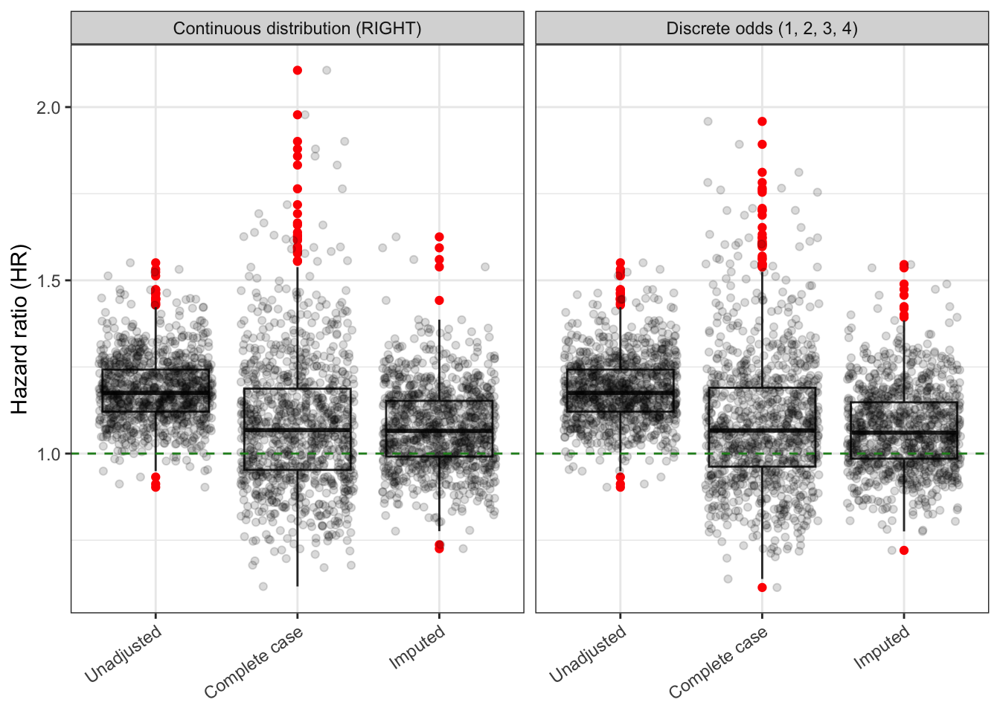
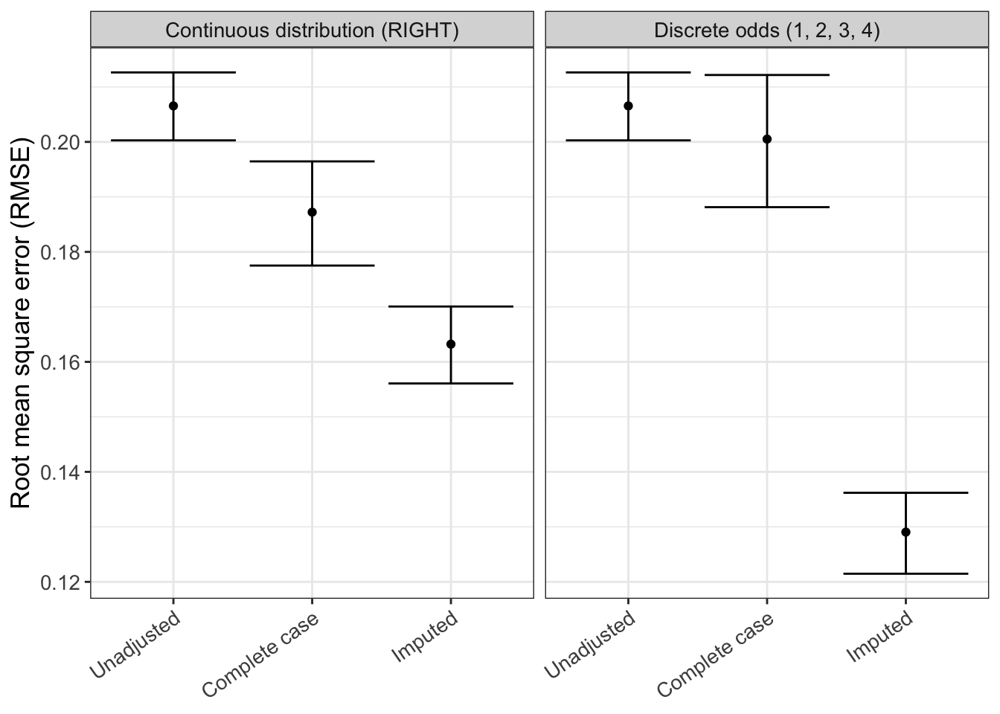
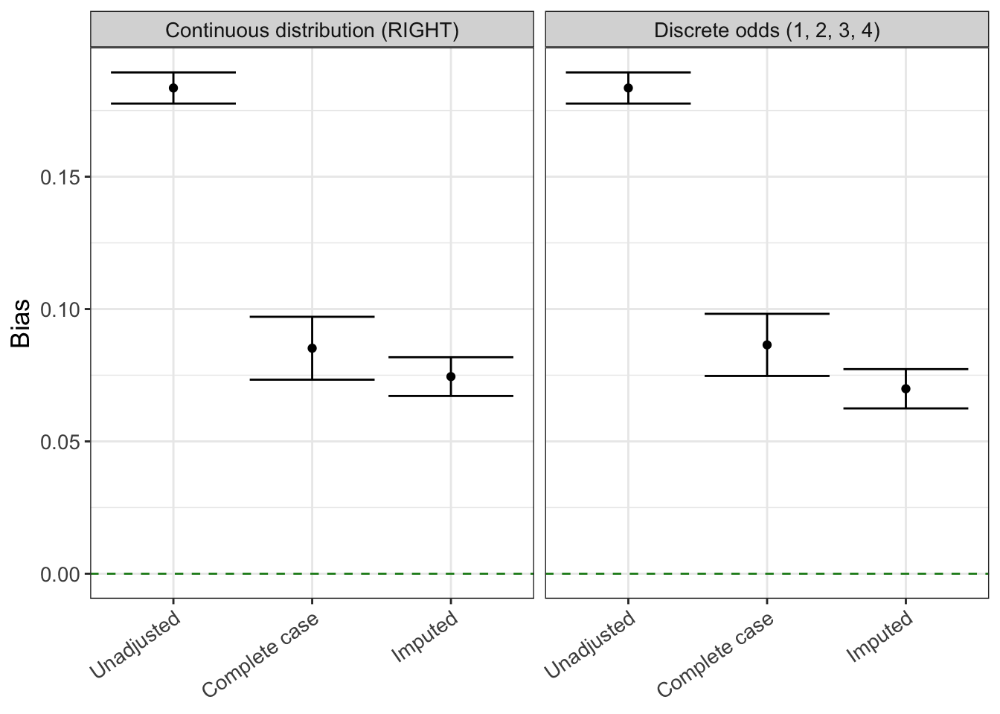
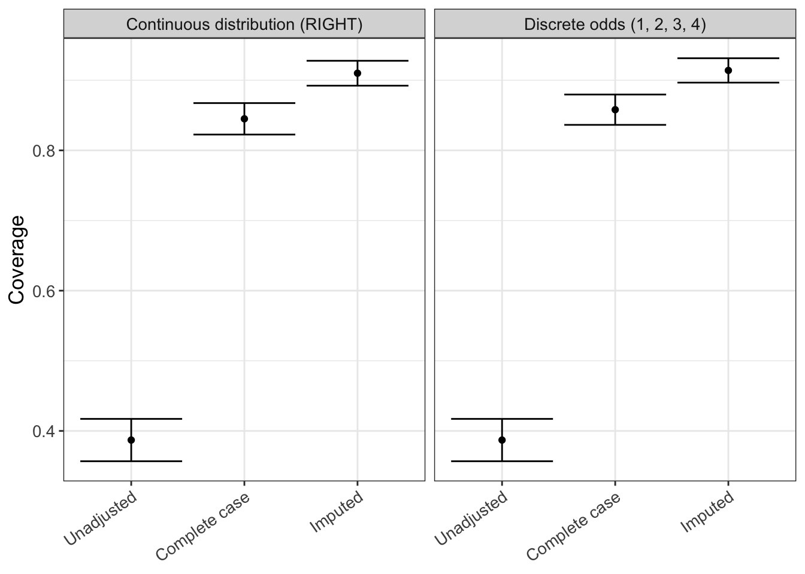
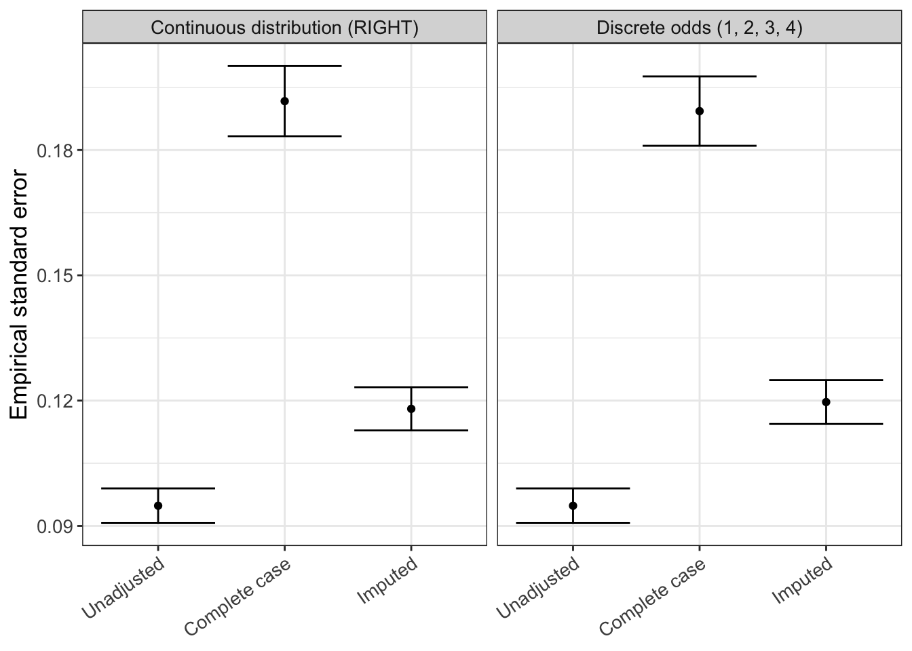

## About

This script analyzes the raw simulation results obtained in the previous script via `run_simulation.R` and was last run on 2024-03-04 19:12:43.4202.

## Read raw results table

We first read the results table with the raw simulation results.


::: {.cell}

```{.r .cell-code}
results <- read_parquet(file = here("data", "simulation_results.parquet")) |> 
  mutate(method = factor(method, levels = c("Unadjusted", "Complete case", "Imputed")))

results |> 
  glimpse()
```

::: {.cell-output .cell-output-stdout}
```
Rows: 6,000
Columns: 5
$ method     <fct> Unadjusted, Complete case, Imputed, Unadjusted, Complete ca…
$ estimate   <dbl> 1.2629630, 1.3353773, 1.2431011, 1.1150121, 0.8445105, 0.93…
$ se         <dbl> 0.07923421, 0.13159058, 0.10915404, 0.07479571, 0.14252148,…
$ replicate  <int> 1, 1, 1, 2, 2, 2, 3, 3, 3, 4, 4, 4, 5, 5, 5, 6, 6, 6, 7, 7,…
$ simulation <chr> "Continuous distribution (RIGHT)", "Continuous distribution…
```
:::
:::


## QC

Let's do a few quality/sanity checks.

-   Number of analysis methods


::: {.cell}

```{.r .cell-code}
unique(results$method)
```

::: {.cell-output .cell-output-stdout}
```
[1] Unadjusted    Complete case Imputed      
Levels: Unadjusted Complete case Imputed
```
:::
:::


-   Assert that there are no missing results


::: {.cell}

```{.r .cell-code}
assert_that(!any(sapply(results$estimate, is.na)), msg = "There are missing estimates")
```

::: {.cell-output .cell-output-stdout}
```
[1] TRUE
```
:::

```{.r .cell-code}
assert_that(!any(sapply(results$se, is.na)), msg = "There are missing standard errors")
```

::: {.cell-output .cell-output-stdout}
```
[1] TRUE
```
:::
:::


## Main results


::: {.cell}

```{.r .cell-code}
# call helper functions
source(here::here("functions", "rsimsum_ggplot.R"))
```
:::


For the analysis of aggregate simulation results we use the `rsimsum` package. More information about this package can be found [here](https://ellessenne.github.io/rsimsum/).[@rsimsum]


::: {.cell}

```{.r .cell-code}
simsum_out <- simsum(
  data = results, 
  estvarname = "estimate", 
  se = "se", 
  true = 1, 
  by = "simulation",
  methodvar = "method", 
  ref = "Complete case"
  ) |> 
  summary() |> 
  tidy()
```
:::


::: panel-tabset
### Hazard ratio distribution


::: {.cell}

```{.r .cell-code}
hr_distribution <- results |> 
  ggplot(aes(x = method, y = estimate)) +
  geom_boxplot(outlier.colour = "red") +
  geom_point(position = position_jitter(seed = 42), alpha = 0.15) +
  geom_hline(yintercept = 1.0, color = "forestgreen", linetype = "dashed") +
  labs(
    x = "Method",
    y = "Hazard ratio (HR)"
    ) +
  theme_bw() +
  theme(
    axis.title.x = element_blank(),
    axis.text.x = element_text(angle = 35, vjust = 1, hjust=1)
    ) +
  facet_wrap(~simulation)

hr_distribution
```

::: {.cell-output-display}
{#fig-hr_distribution width=672}
:::
:::


### Hazard ratio distribution (interactive)


::: {.cell}

```{.r .cell-code}
ggplotly(hr_distribution)
```

::: {.cell-output-display}

```{=html}
<div class="plotly html-widget html-fill-item" id="htmlwidget-566b67352d3ef745028b" style="width:100%;height:464px;"></div>
<script type="application/json" data-for="htmlwidget-566b67352d3ef745028b">{"x":{"data":[{"x":[1,1,1,1,1,1,1,1,1,1,1,1,1,1,1,1,1,1,1,1,1,1,1,1,1,1,1,1,1,1,1,1,1,1,1,1,1,1,1,1,1,1,1,1,1,1,1,1,1,1,1,1,1,1,1,1,1,1,1,1,1,1,1,1,1,1,1,1,1,1,1,1,1,1,1,1,1,1,1,1,1,1,1,1,1,1,1,1,1,1,1,1,1,1,1,1,1,1,1,1,1,1,1,1,1,1,1,1,1,1,1,1,1,1,1,1,1,1,1,1,1,1,1,1,1,1,1,1,1,1,1,1,1,1,1,1,1,1,1,1,1,1,1,1,1,1,1,1,1,1,1,1,1,1,1,1,1,1,1,1,1,1,1,1,1,1,1,1,1,1,1,1,1,1,1,1,1,1,1,1,1,1,1,1,1,1,1,1,1,1,1,1,1,1,1,1,1,1,1,1,1,1,1,1,1,1,1,1,1,1,1,1,1,1,1,1,1,1,1,1,1,1,1,1,1,1,1,1,1,1,1,1,1,1,1,1,1,1,1,1,1,1,1,1,1,1,1,1,1,1,1,1,1,1,1,1,1,1,1,1,1,1,1,1,1,1,1,1,1,1,1,1,1,1,1,1,1,1,1,1,1,1,1,1,1,1,1,1,1,1,1,1,1,1,1,1,1,1,1,1,1,1,1,1,1,1,1,1,1,1,1,1,1,1,1,1,1,1,1,1,1,1,1,1,1,1,1,1,1,1,1,1,1,1,1,1,1,1,1,1,1,1,1,1,1,1,1,1,1,1,1,1,1,1,1,1,1,1,1,1,1,1,1,1,1,1,1,1,1,1,1,1,1,1,1,1,1,1,1,1,1,1,1,1,1,1,1,1,1,1,1,1,1,1,1,1,1,1,1,1,1,1,1,1,1,1,1,1,1,1,1,1,1,1,1,1,1,1,1,1,1,1,1,1,1,1,1,1,1,1,1,1,1,1,1,1,1,1,1,1,1,1,1,1,1,1,1,1,1,1,1,1,1,1,1,1,1,1,1,1,1,1,1,1,1,1,1,1,1,1,1,1,1,1,1,1,1,1,1,1,1,1,1,1,1,1,1,1,1,1,1,1,1,1,1,1,1,1,1,1,1,1,1,1,1,1,1,1,1,1,1,1,1,1,1,1,1,1,1,1,1,1,1,1,1,1,1,1,1,1,1,1,1,1,1,1,1,1,1,1,1,1,1,1,1,1,1,1,1,1,1,1,1,1,1,1,1,1,1,1,1,1,1,1,1,1,1,1,1,1,1,1,1,1,1,1,1,1,1,1,1,1,1,1,1,1,1,1,1,1,1,1,1,1,1,1,1,1,1,1,1,1,1,1,1,1,1,1,1,1,1,1,1,1,1,1,1,1,1,1,1,1,1,1,1,1,1,1,1,1,1,1,1,1,1,1,1,1,1,1,1,1,1,1,1,1,1,1,1,1,1,1,1,1,1,1,1,1,1,1,1,1,1,1,1,1,1,1,1,1,1,1,1,1,1,1,1,1,1,1,1,1,1,1,1,1,1,1,1,1,1,1,1,1,1,1,1,1,1,1,1,1,1,1,1,1,1,1,1,1,1,1,1,1,1,1,1,1,1,1,1,1,1,1,1,1,1,1,1,1,1,1,1,1,1,1,1,1,1,1,1,1,1,1,1,1,1,1,1,1,1,1,1,1,1,1,1,1,1,1,1,1,1,1,1,1,1,1,1,1,1,1,1,1,1,1,1,1,1,1,1,1,1,1,1,1,1,1,1,1,1,1,1,1,1,1,1,1,1,1,1,1,1,1,1,1,1,1,1,1,1,1,1,1,1,1,1,1,1,1,1,1,1,1,1,1,1,1,1,1,1,1,1,1,1,1,1,1,1,1,1,1,1,1,1,1,1,1,1,1,1,1,1,1,1,1,1,1,1,1,1,1,1,1,1,1,1,1,1,1,1,1,1,1,1,1,1,1,1,1,1,1,1,1,1,1,1,1,1,1,1,1,1,1,1,1,1,1,1,1,1,1,1,1,1,1,1,1,1,1,1,1,1,1,1,1,1,1,1,1,1,1,1,1,1,1,1,1,1,1,1,1,1,1,1,1,1,1,1,1,1,1,1,1,1,1,1,1,1,1,1,1,1,1,1,1,1,1,1,1,1,1,1,1,1,1,1,1,1,1,1,1,1,1,1,1,1,1,1,1,1,1,1,1,1,1,1,1,1,1,1,1,1,1,1,1,1,1,1,1,2,2,2,2,2,2,2,2,2,2,2,2,2,2,2,2,2,2,2,2,2,2,2,2,2,2,2,2,2,2,2,2,2,2,2,2,2,2,2,2,2,2,2,2,2,2,2,2,2,2,2,2,2,2,2,2,2,2,2,2,2,2,2,2,2,2,2,2,2,2,2,2,2,2,2,2,2,2,2,2,2,2,2,2,2,2,2,2,2,2,2,2,2,2,2,2,2,2,2,2,2,2,2,2,2,2,2,2,2,2,2,2,2,2,2,2,2,2,2,2,2,2,2,2,2,2,2,2,2,2,2,2,2,2,2,2,2,2,2,2,2,2,2,2,2,2,2,2,2,2,2,2,2,2,2,2,2,2,2,2,2,2,2,2,2,2,2,2,2,2,2,2,2,2,2,2,2,2,2,2,2,2,2,2,2,2,2,2,2,2,2,2,2,2,2,2,2,2,2,2,2,2,2,2,2,2,2,2,2,2,2,2,2,2,2,2,2,2,2,2,2,2,2,2,2,2,2,2,2,2,2,2,2,2,2,2,2,2,2,2,2,2,2,2,2,2,2,2,2,2,2,2,2,2,2,2,2,2,2,2,2,2,2,2,2,2,2,2,2,2,2,2,2,2,2,2,2,2,2,2,2,2,2,2,2,2,2,2,2,2,2,2,2,2,2,2,2,2,2,2,2,2,2,2,2,2,2,2,2,2,2,2,2,2,2,2,2,2,2,2,2,2,2,2,2,2,2,2,2,2,2,2,2,2,2,2,2,2,2,2,2,2,2,2,2,2,2,2,2,2,2,2,2,2,2,2,2,2,2,2,2,2,2,2,2,2,2,2,2,2,2,2,2,2,2,2,2,2,2,2,2,2,2,2,2,2,2,2,2,2,2,2,2,2,2,2,2,2,2,2,2,2,2,2,2,2,2,2,2,2,2,2,2,2,2,2,2,2,2,2,2,2,2,2,2,2,2,2,2,2,2,2,2,2,2,2,2,2,2,2,2,2,2,2,2,2,2,2,2,2,2,2,2,2,2,2,2,2,2,2,2,2,2,2,2,2,2,2,2,2,2,2,2,2,2,2,2,2,2,2,2,2,2,2,2,2,2,2,2,2,2,2,2,2,2,2,2,2,2,2,2,2,2,2,2,2,2,2,2,2,2,2,2,2,2,2,2,2,2,2,2,2,2,2,2,2,2,2,2,2,2,2,2,2,2,2,2,2,2,2,2,2,2,2,2,2,2,2,2,2,2,2,2,2,2,2,2,2,2,2,2,2,2,2,2,2,2,2,2,2,2,2,2,2,2,2,2,2,2,2,2,2,2,2,2,2,2,2,2,2,2,2,2,2,2,2,2,2,2,2,2,2,2,2,2,2,2,2,2,2,2,2,2,2,2,2,2,2,2,2,2,2,2,2,2,2,2,2,2,2,2,2,2,2,2,2,2,2,2,2,2,2,2,2,2,2,2,2,2,2,2,2,2,2,2,2,2,2,2,2,2,2,2,2,2,2,2,2,2,2,2,2,2,2,2,2,2,2,2,2,2,2,2,2,2,2,2,2,2,2,2,2,2,2,2,2,2,2,2,2,2,2,2,2,2,2,2,2,2,2,2,2,2,2,2,2,2,2,2,2,2,2,2,2,2,2,2,2,2,2,2,2,2,2,2,2,2,2,2,2,2,2,2,2,2,2,2,2,2,2,2,2,2,2,2,2,2,2,2,2,2,2,2,2,2,2,2,2,2,2,2,2,2,2,2,2,2,2,2,2,2,2,2,2,2,2,2,2,2,2,2,2,2,2,2,2,2,2,2,2,2,2,2,2,2,2,2,2,2,2,2,2,2,2,2,2,2,2,2,2,2,2,2,2,2,2,2,2,2,2,2,2,2,2,2,2,2,2,2,2,2,2,2,2,2,2,2,2,2,2,2,2,2,2,2,2,2,2,2,2,2,2,2,2,2,2,2,2,2,2,2,2,2,2,2,2,2,2,2,2,2,2,2,2,2,2,2,2,2,2,2,2,2,2,2,2,2,2,2,2,2,2,2,2,2,2,2,2,2,2,2,2,2,2,2,2,2,2,2,2,2,2,2,2,2,2,2,2,2,2,2,2,2,2,2,2,2,2,2,2,2,2,2,2,2,2,2,2,2,2,2,2,2,2,2,2,2,2,2,2,2,2,2,2,2,2,2,2,2,2,2,2,2,2,2,2,2,2,2,2,2,2,2,2,2,2,2,2,2,2,2,2,2,2,2,2,2,2,2,2,3,3,3,3,3,3,3,3,3,3,3,3,3,3,3,3,3,3,3,3,3,3,3,3,3,3,3,3,3,3,3,3,3,3,3,3,3,3,3,3,3,3,3,3,3,3,3,3,3,3,3,3,3,3,3,3,3,3,3,3,3,3,3,3,3,3,3,3,3,3,3,3,3,3,3,3,3,3,3,3,3,3,3,3,3,3,3,3,3,3,3,3,3,3,3,3,3,3,3,3,3,3,3,3,3,3,3,3,3,3,3,3,3,3,3,3,3,3,3,3,3,3,3,3,3,3,3,3,3,3,3,3,3,3,3,3,3,3,3,3,3,3,3,3,3,3,3,3,3,3,3,3,3,3,3,3,3,3,3,3,3,3,3,3,3,3,3,3,3,3,3,3,3,3,3,3,3,3,3,3,3,3,3,3,3,3,3,3,3,3,3,3,3,3,3,3,3,3,3,3,3,3,3,3,3,3,3,3,3,3,3,3,3,3,3,3,3,3,3,3,3,3,3,3,3,3,3,3,3,3,3,3,3,3,3,3,3,3,3,3,3,3,3,3,3,3,3,3,3,3,3,3,3,3,3,3,3,3,3,3,3,3,3,3,3,3,3,3,3,3,3,3,3,3,3,3,3,3,3,3,3,3,3,3,3,3,3,3,3,3,3,3,3,3,3,3,3,3,3,3,3,3,3,3,3,3,3,3,3,3,3,3,3,3,3,3,3,3,3,3,3,3,3,3,3,3,3,3,3,3,3,3,3,3,3,3,3,3,3,3,3,3,3,3,3,3,3,3,3,3,3,3,3,3,3,3,3,3,3,3,3,3,3,3,3,3,3,3,3,3,3,3,3,3,3,3,3,3,3,3,3,3,3,3,3,3,3,3,3,3,3,3,3,3,3,3,3,3,3,3,3,3,3,3,3,3,3,3,3,3,3,3,3,3,3,3,3,3,3,3,3,3,3,3,3,3,3,3,3,3,3,3,3,3,3,3,3,3,3,3,3,3,3,3,3,3,3,3,3,3,3,3,3,3,3,3,3,3,3,3,3,3,3,3,3,3,3,3,3,3,3,3,3,3,3,3,3,3,3,3,3,3,3,3,3,3,3,3,3,3,3,3,3,3,3,3,3,3,3,3,3,3,3,3,3,3,3,3,3,3,3,3,3,3,3,3,3,3,3,3,3,3,3,3,3,3,3,3,3,3,3,3,3,3,3,3,3,3,3,3,3,3,3,3,3,3,3,3,3,3,3,3,3,3,3,3,3,3,3,3,3,3,3,3,3,3,3,3,3,3,3,3,3,3,3,3,3,3,3,3,3,3,3,3,3,3,3,3,3,3,3,3,3,3,3,3,3,3,3,3,3,3,3,3,3,3,3,3,3,3,3,3,3,3,3,3,3,3,3,3,3,3,3,3,3,3,3,3,3,3,3,3,3,3,3,3,3,3,3,3,3,3,3,3,3,3,3,3,3,3,3,3,3,3,3,3,3,3,3,3,3,3,3,3,3,3,3,3,3,3,3,3,3,3,3,3,3,3,3,3,3,3,3,3,3,3,3,3,3,3,3,3,3,3,3,3,3,3,3,3,3,3,3,3,3,3,3,3,3,3,3,3,3,3,3,3,3,3,3,3,3,3,3,3,3,3,3,3,3,3,3,3,3,3,3,3,3,3,3,3,3,3,3,3,3,3,3,3,3,3,3,3,3,3,3,3,3,3,3,3,3,3,3,3,3,3,3,3,3,3,3,3,3,3,3,3,3,3,3,3,3,3,3,3,3,3,3,3,3,3,3,3,3,3,3,3,3,3,3,3,3,3,3,3,3,3,3,3,3,3,3,3,3,3,3,3,3,3,3,3,3,3,3,3,3,3,3,3,3,3,3,3,3,3,3,3,3,3,3,3,3,3,3,3,3,3,3,3,3,3,3,3,3,3,3,3,3,3,3,3,3,3,3,3,3,3,3,3,3,3,3,3,3,3,3,3,3,3,3,3,3,3,3,3,3,3,3,3,3,3,3,3,3,3,3,3,3,3,3,3,3,3,3,3,3,3,3,3,3,3,3,3,3,3,3,3,3,3,3,3,3,3,3,3,3,3,3,3,3,3,3,3,3,3,3,3,3,3,3,3,3,3,3,3,3,3,3,3,3,3,3,3,3,3,3,3,3,3,3,3,3,3,3,3,3,3,3,3,3,3,3,3,3,3,3,3,3,3,3,3,3,3,3,3,3,3,3,3,3,3,3,3,3,3,3,3,3,3,3,3],"y":[1.2629630355325527,1.3201627669151914,1.1376485006865162,1.1150120691545358,1.1094438939427462,1.1310316767549855,1.1255900336402529,1.1698906218595437,1.211529174183356,1.1749070885003383,1.1377894788606477,1.247945350780042,1.0546741925976622,1.2965987068958467,1.0733116246702326,1.2317133053540197,1.2830926445160218,1.1355360141923154,1.0835233750435753,1.067830235741541,1.2187436085356464,0.98452195517224939,1.1233555912551803,1.2223137097872934,1.1294404978081516,1.303515691925295,1.0932760145788027,1.3839441482640922,1.1469654582108102,1.1189805519953502,1.1550627987826294,1.177971413514797,1.1557937554131945,1.4355733091702996,1.3832778358193911,1.067837069788208,1.0982211571873441,1.0871535284599516,1.083218940981197,1.1883122704756484,1.1556963260400508,1.2340226254746887,1.0477899660221974,1.1189536724162341,1.1787623270203138,1.2558255647708105,1.0631347100242181,1.2433550504445638,1.1590681106351328,1.1922928207468855,1.23175710290709,1.3329150576217497,1.1411877300993276,1.4489241915818567,1.2832423425629269,1.3157126931738385,1.2240606843747084,1.2324195321674589,1.2735889264664335,1.0702669060076559,1.2452817307161441,0.94935463023343936,0.90296320254127405,1.0509874459958564,1.0806920214612996,1.3323234899022449,1.2077892028554866,1.2519935514218847,1.2271764445733155,1.2786754504637734,1.4734057442798754,1.2012435575175602,1.1222206481913104,1.2836543104178004,1.2344336832069116,1.2294403643206457,1.1582001347288475,1.1500118464463827,1.1126091773350753,1.2832472119783196,1.1051026650565414,1.1162325353142892,1.0694278431243935,1.0539974080532131,1.1952441048288194,1.1038633852430459,1.2165620798164458,1.131523956611066,1.1715647884379696,1.214055892193624,1.1146934067048047,0.97856637668475388,1.0848272040867393,0.9501694154851672,1.1940705702300667,1.1446878522334114,1.2655717949225422,1.0378649424874271,1.1126453039892914,1.3639272227675747,1.1494434811928085,1.0865174579844843,1.26615283480691,1.0303438255519179,1.1696373456717899,1.1907469928057899,1.0938923140088657,1.2734582429752384,1.1415849981586201,1.2010966432382499,0.98012688214355703,1.0694526032966798,1.222662948863825,1.1934839927997982,1.1220980402582976,1.20586988824698,1.1563497440191846,1.2529370535525448,1.1049825732672804,1.2025613915309965,1.1036801975492305,1.252912263229792,1.4025758309626957,1.0885592369503454,1.2665101100443064,1.382172279038649,1.3456904938159366,1.2430147988455114,1.1565066748352104,1.2049309327486382,1.375842287882266,1.1755825015931132,1.1630480001744443,1.2564709536054846,1.2022138759146037,1.1467789535949726,1.2848502872315277,1.1628255275889088,1.2772040503075239,1.0781234287343093,1.0345886777929028,1.5129284458030452,1.2682106372597546,1.0660216507240499,1.1073147179468423,1.1777309588817264,1.1164891090446065,1.1231479367802679,1.3343145998946577,0.98089832767736818,1.1747898212818451,1.3228785991414524,1.2111769891406405,1.0624835513682278,1.0515195066229006,1.1737579824583513,1.1687850530636932,1.1427387752165055,1.088552161452716,1.2689166799958143,1.1217901905389271,1.1348468481670642,1.212355535339269,1.2054522138205523,1.1466217960481084,1.1705226713464529,1.2311946620722334,1.2030810495179884,1.0396981086434476,1.0011430868940616,1.2612105154464981,1.2243176637344324,1.1224612879421656,1.2092321632097436,1.075060774159152,1.1379602529968837,1.149225304852233,1.1623667704723311,1.0894966346703299,1.0736524395193423,1.4218363705387476,1.2004289848253158,1.2838601112550028,1.12441450362999,1.1267296064316497,1.1679168462927421,1.128834156588663,1.043677246524829,1.124684334970504,1.3271934945384503,1.2507350534454817,1.2014064191073432,1.1632775625221243,1.2569867721635475,1.194920176476461,1.2676798080667782,1.161757755339615,1.119807030323406,1.1402018336316107,1.2097304650679421,1.5316190409137511,1.1406415765307258,1.0293399975373509,1.0952413454675356,1.0535670912301358,1.2249187567605522,0.93237614833429294,1.2683391917742224,1.1020571236736549,1.1832198168444479,1.0602277145945962,1.3668467685775034,1.0656600489885422,1.1850046376694163,1.0301742220162657,1.1830549959464161,1.0927149952205075,1.0283846704365909,1.2892085129276198,1.3831407140940839,1.3243321268813137,1.3035055552787462,1.2915137042865523,1.0313404808110771,1.3274280029739718,1.2573689613762173,1.1754268648543373,1.2328369429517767,1.2640320178930475,1.2204313226874632,1.4226780992842551,1.0734380509650676,1.4312319104773934,1.4444964646746867,1.1638023399534541,1.2135685946827135,1.1417578812490228,1.2472680097151176,1.2212959648202368,1.2125193418738915,1.2167154867287981,1.3770791570624801,0.99007858990897379,1.2705429583953807,1.0351491175250007,1.2315861683795537,1.2229609193388546,1.2163564565958707,1.2517477416113316,1.1821898009744267,1.0986361916706111,1.1897690516007173,1.1605680405636245,1.0497179775407888,1.1963898577405199,1.1865579173376331,1.2688757504595964,1.1493646932563244,1.225194231617901,1.0649192389080535,1.3044041837917217,1.1038798669285996,1.2711548867346578,1.0915361462637789,1.0916261777102647,1.236772592464854,1.1447106059899541,1.1240076395895315,1.0514521920449902,1.248185659985229,1.3616519388788419,1.29020494382625,1.0213873841285577,1.1661164703632754,1.1283301993964712,1.174472420914692,1.1897444614460211,1.4725168564372177,1.3698582495886693,1.1961208766625788,1.2617764062925596,1.1913959838785164,1.3362584979033036,1.1472186715580555,1.3594235947643913,1.1724951268299841,1.0295411197121829,1.0716011689536522,1.1396325772409215,1.1267531737324623,1.320619389977324,1.1775861900245104,1.2528685706069866,1.1085102016737669,1.2806929043590756,1.2440554883870736,1.1364260954464784,1.263022859900883,1.1805816849758115,1.1635344803903285,1.1865812622456626,1.1558528644695187,1.3304111784339128,1.3023212894994989,1.2111677578897726,1.307289443519337,1.1132586664492279,1.1570921054262679,1.2252058956195424,0.99986061145958138,1.135404128963664,1.2889965142635895,1.2347176130761162,1.242433241824016,1.0274451801874394,1.1185411676180401,1.28065764694354,1.1378768638221555,1.2746948590873859,1.1474292540522664,1.0961642700534038,1.2128633239923383,1.3826043011251674,1.0788877815375324,1.1506725511772988,1.1674175893066463,1.148023206198153,1.2762340387503475,1.4074810091005032,0.95386887645978036,1.0794174381652346,1.2643075113056486,1.1694408208220757,1.1818021232053968,1.2429739712100611,1.0919297506617862,1.1178226513491589,1.2156017317298868,1.1537253942958452,1.3032555185856187,1.1983910718025483,1.1489130416247755,1.2004987125493636,1.2619896195927336,1.3500490243106125,1.0884383161080124,1.1443246999751062,1.3217544989985064,1.2339303765631258,1.1750558859792259,1.1132487565470157,1.1582965875456341,1.4455071485656736,1.2384603203305822,1.2792023328830819,1.0468569228875544,1.3344265609258263,1.1546492090693607,1.1566597568407577,1.0874602724435352,1.2372778814962966,1.2142779781173922,1.101510547674827,1.1964010113946459,1.1154298040946153,1.132920949957317,1.2067658156663621,1.1517146052598382,1.2244960595568861,1.1921414241856494,1.2208790323463201,1.165788999938133,1.0273460835595825,1.1915126000593752,1.3020492473207426,1.3089789042427213,1.1244978919128632,1.2086122310428751,1.0711278677366554,1.1476898636107375,1.1496728136028327,1.2248952757857272,1.2277920191800413,1.1241650755899446,1.0383529810174603,1.0603913690642417,1.1932769925980073,1.1857665208315404,1.1046001332636919,1.2127360818565047,1.0149610302031429,1.2175245386652536,1.1497133134625945,1.2066402411748338,1.2212683985206028,1.1665636124198362,1.3200571903235694,1.1718971428837861,1.2765273712421175,1.1586039889340032,1.2370461777957167,1.3312430821955898,1.2035936040446436,1.3198145033279334,1.2080346422802954,1.1698688042440843,1.1354386353642067,1.2535498108948824,1.2422115668050415,1.1819480701986929,1.0610125789004123,1.3000720416907379,1.1656818995440092,1.142382972121343,1.0703020287506837,1.0489474010853383,1.1478611607478855,1.1792938940325604,1.1741257881692686,1.205281940876481,1.1836573870868043,1.0308934886529988,1.2408991401900189,1.3030196991113319,1.1496045758291122,1.1119355410722191,1.1053723855219051,1.1454675412705468,1.3246765182999631,1.1919511357087997,1.1605446082256976,1.0982282288934471,1.1562649879085525,1.1320552306298428,1.2320867457104014,1.2975568411583429,1.1425336596589077,1.3521885680430477,1.1657280182272478,1.174488593840654,1.0973476104577244,1.0999120043566313,1.5236265649294809,1.0791561757662238,1.3735856228154721,1.0541561030080637,1.1971072984425917,1.2440776040161938,1.2208455434248227,1.3383322097685217,1.292993609474977,1.1024711450869982,1.2936649305852279,1.1035794955410598,1.2179161319438556,1.1578011380307225,1.2931285599128519,1.2390528986128222,1.1967327549321103,1.1538299829123466,1.2490775794965057,1.161231648568827,1.3384854701796358,1.1770728125170231,1.123087800092339,1.1871689143884234,1.1017996459508952,1.2099385098858693,1.2086411790296538,1.202731648651006,1.1452153651362753,1.1865876165147655,1.1356790190337029,1.0861244361459192,1.1914579863482888,1.1292097921110111,1.2230512677395367,1.079369497688796,1.083599038146237,1.1492999311258787,1.3428807976364443,1.1811903831354513,1.3246056840249245,1.112359814364245,1.2353968084383908,1.1059582993045849,1.0846910758264978,1.2693028169894187,1.0867669060876093,1.2545528826273935,1.2535375147169969,1.0386600414221707,1.2626230248749695,1.2203625213001761,1.4632074663431962,1.1358843803307543,1.2525743803298031,1.2610048795018036,1.1588868134654549,1.1892699030633582,1.278218785531392,1.0267409113573707,1.1960903017513571,1.1218765617702833,1.1104609929967371,1.12679978193992,1.1849721141756921,1.2943134557709757,1.2151860103970058,1.289850623432621,1.2623045619039743,1.242257546692489,1.2021347960417461,1.1781139272977026,1.3215945795768842,1.1742046085348188,1.2029873414711381,1.294620538094339,1.1384092905184442,1.1580963316320425,1.2989352777318475,1.0466609337724258,1.2280433734318772,1.1945795330696245,1.0588620801418913,1.2476437169222647,1.1376559568555109,1.1925180141614347,1.229393076960605,1.1808127005334994,1.2264434682337986,1.1075151844087305,1.2085474866117414,1.1957012604471846,1.2223820227459286,1.1316434828793454,1.2500896262885446,1.2262837932864132,1.1849559517211625,1.2025870247376405,1.1157372565908816,1.2432858911802509,1.2225832054718053,1.1547667780826425,1.2201634944642368,1.1385423236767476,1.1468069392841638,1.0543404821617384,1.1277339227419103,1.1837021794652374,1.1270650318413062,1.2663181422448324,1.2377719866556902,1.1481179594531934,1.1857887627824029,1.0721198078360237,1.2843593233009154,1.105760136218096,1.0207953037647415,1.1383886597757804,1.1785630214044287,1.3207434285110524,1.2219196701081596,1.3839971310731456,1.1732692528045197,1.1522691210102987,1.0659319872221447,1.2785149217961111,1.1564056523659048,1.1734356114979172,1.1694771994557955,1.1378463952409277,1.2768447258939519,1.2595851972004386,1.2951747979132069,1.169463251824004,1.1049047498558584,1.1407499429116712,1.2313898376811423,1.1000298424034713,1.1195329943661707,1.3212543201560505,1.1097513032266786,1.1687055229331722,1.0845941049482462,1.0749727650323639,1.1728781095482477,1.1674313407195827,1.1581532306072291,1.1162821192908061,1.0705785186966148,1.0934052304590935,1.18762842473138,1.1226393686237448,1.134493825663949,1.1900006281377864,1.1266938988883419,1.2829681003843938,1.1952799475681892,1.0464309402187271,1.0299037438714322,1.5506424984189799,1.3713042100852904,1.2910906819417305,1.2414432841443395,1.2449961251475949,1.1870938263252602,1.2825780763742429,1.2763284543709397,1.1248298610735283,1.1465070200895404,1.1005028975958779,1.0833079692040648,1.320125994110106,1.22882770153087,1.2241387790758473,1.0213066365504544,1.3178702496043821,1.0772363710588873,1.4586013910213498,1.0962945482459046,1.1640020961267021,1.259608119801426,1.2295870192711262,1.2556316943444781,1.1299446157225268,1.1326178339372357,1.0870236020620998,1.1831318478262312,1.2480750905414175,1.1903065855095112,1.1930431833626676,1.2127886805410966,1.2690318084986332,1.1336665313825567,1.1896994105125396,1.0868659034807762,1.1772501508821149,1.463507449599323,1.241226824570151,1.1958200417355651,1.2194757078008593,1.18924005249275,1.2399491236837523,1.2156838701108859,1.2328504228439574,1.1723100514988267,1.1579395700584754,1.2364494811695079,1.163549298154547,1.2021389484811011,1.2601135225701414,1.1854984897104774,1.2069007677905537,1.321258867296526,1.100164452021025,1.1445251864608763,1.183728602993684,1.0250797636602709,1.1976083479378032,1.139973771514595,1.2316398810965445,1.0922744191402001,1.0356756924765862,1.1270977014604606,1.2301717947971567,1.2571536338215574,1.0515842371744488,1.1901386408890247,1.3652621110035337,1.2703764909535638,1.2488153517481051,1.2359371103842198,1.1680309007644667,1.2919197786882342,1.1516120718604506,1.0985177277703357,1.1980505421321486,1.1746109488954914,1.1398811567312177,1.2386095417428744,1.1641308149612684,1.0923451077608732,1.1578904272150399,1.2110275638625663,1.1689823441761018,1.0731042252006913,1.1673441577048487,1.1741744133222052,1.1999804057675139,1.2103998403432255,1.0538916553763578,1.1775252027484155,1.238739058876978,1.2016570209767217,1.1783407125562069,1.145795328750322,1.0549195446805077,1.1806421002355199,1.225844673759769,1.2581737230415917,1.2827477289373013,1.0413792454898769,1.0996837144072988,1.0937337879439404,1.0998251197234539,1.0797110423406331,1.143468068934679,1.2593836899042525,1.4114749084350078,1.1822030164817827,1.1887999915340171,1.1076318903366607,1.2744621485954517,1.2522676641857462,1.0764461136838086,1.3165332571492037,1.0176856040767326,1.1754620165643364,1.1542343753023125,1.1152537438205057,1.1108618538860706,1.1512978383934922,1.10126551961903,1.1538188415484929,1.2034188634937131,1.2938560611910304,1.2374372805623339,1.133184781074569,1.1711869173151275,1.1679711837687003,1.1551530664842449,1.1330431817998412,1.2341561237761907,1.1210151025124957,1.2344783839732478,1.1684365801268801,1.1550216661516179,1.1660207817329382,1.2919372019295503,1.2634385094486262,1.167427528942609,1.122962317648821,1.1144927054907769,1.2108026037750859,1.1192380506133774,1.161479661762693,1.11159421018666,1.1524710552562911,1.0935190815422153,1.0809886351531481,1.1559405679183659,1.1382674302449307,1.2577030365313426,1.2190489883737063,1.2426398165876993,1.1549897562192482,1.0515916904154583,1.1015064818339297,1.1153612158483619,1.1325341936401856,1.0501882297881757,1.2045186838450923,1.2384647251207086,1.0995098798497207,0.98919459403686094,1.2560381852210911,1.1347395604240367,1.1884231612003728,1.1215171337073313,1.0598209747827689,1.1544396417880065,1.1726837008550803,1.3002199820154274,1.3561314931814334,1.1348229364463793,1.243351198198279,1.3590920168247724,1.1134958728788082,1.2674489973282117,1.156963571433721,1.0691458127622255,1.3668905828407241,1.0716024957672248,1.1755481474130995,1.3146675820788998,1.1211445814449899,1.1198409060331116,1.4478146438886192,1.2150641991905309,1.1681216439785305,1.302467629570552,1.1330937014462905,1.2016702532404926,1.244247443522065,1.0705810941440133,1.1658141685018322,1.1983519373550591,1.2384407757275422,1.1512507011528474,1.1280196222244696,1.1624410016448861,1.1469458817945271,1.1157842690311746,1.1468652852165637,1.1554939713353878,1.2808533564369287,1.0074076398935967,1.0724651713089286,1.2773029159319342,1.131139801259947,1.1442250848302846,1.1018551947525757,1.0968480515424694,1.2056086526305807,0.91224204787581964,1.2228353713429145,1.17022297163761,1.2012860234914313,1.3759207583712916,1.181483766498528,1.088090230961887,1.0054446965978392,1.2573806263535263,1.0243745387311951,1.2468624355480291,1.1909345239953211,1.1296963794818409,1.3320392832983421,1.1703354759453377,1.3062623458278786,1.3006776218296379,1.1671870478342337,1.2292042345482934,1.0599310713879178,1.139900015436065,1.0782231616886562,1.2033732212514643,1.2048087924081394,1.1540744962349712,1.3393345155472227,1.1208498212265703,1.1785790361765509,1.0961834438871452,1.1853019279121073,1.3358812703560077,1.2524565172995472,1.2503159949609648,1.315206005557833,1.3180826823829159,1.046700934093443,1.0987063063450826,1.0386153437543513,1.2407794912795069,1.1131161915040564,1.1584714681028645,1.1312399754586346,1.2607019524565146,1.0432365097790575,1.2676073737222753,1.1703406555559903,0.97816396281726248,1.2641482777746011,1.4285884852933344,1.0230920975828108,1.1446299499100092,1.2525499910643514,1.1623846821252599,1.2659399241437497,1.05535033733746,1.1431956132097045,1.2766293046632335,1.0712117348661585,1.4196392772259949,1.3414423670023972,1.1669305881826493,1.1578058220170087,1.1744344647856035,1.1760895167766028,1.0981053708564004,1.0733175849766832,1.1663146682785963,1.3374600881733567,1.2961337862094404,1.2530893991389052,1.1600384499417964,1.1715828389264953,1.1396766088295747,1.207860113932228,1.2522383121792862,1.1152282226405856,1.1808145696084065,1.3356186976781299,1.1804676752511531,1.1687859320031742,1.1895229279412054,1.3371911223894573,1.0583747691101366,1.1130530425624789,1.2499517303255028,1.0670737774510601,1.2578267334625608,1.1501474761757029,1.1853411771607785,1.0389105716524232,1.1998087005878022,1.2795082997683602,1.2764219453602559,1.2004269537748906,1.2085968283140636,1.2201849825331894,1.0473645397369564,0.99135904836056121,1.0595344281065424,1.044226042847429,1.1288876719213514,1.147518994791062,1.1979581787565028,1.2929499921159153,1.157969280246216,1.1043656690598302,1.0745261133379944,1.3982229497497591,1.1066212512419149,1.2230564258004866,1.0959239757722863,1.070221675739488,1.1057601823123744,1.2325125689862295,1.2098234188622894,1.1105041656058723,1.3144101151526735,1.0794297780832711,1.3480384779209746,1.2993416446935606,1.2809321261676621,1.1453419047384066,1.1577345275377675,1.0411861973818797,1.2411692976274269,1.0483928551335555,1.1321953662079276,1.166188732980622,1.3394413063962221,1.2261736299404822,1.1279338620684964,1.1154480151793351,1.1493475892871103,1.1255576951746236,1.0145772938157578,1.301441290567712,1.3391381823465414,1.1437689791743797,1.2514557506511366,1.2578063921051428,1.244945849367618,1.1844701468589285,0.96241260164767051,1.1091095128123194,1.1561640360244825,1.0644296775629414,1.1232540618952032,1.1665489603318495,1.2825851394573125,1.2413594827149286,1.1122638144744401,1.0475597079920662,1.1370086242941959,1.1909814899242464,1.0057705947160891,1.062413926550023,1.184414952882723,1.2632129007836905,1.1344039385847442,1.0079565613327417,1.4442801593623722,1.1885872106543687,1.1350608326319045,1.2853482050656313,1.2195440961694237,1.191491356720914,1.1956423440051109,1.1323727313696659,1.1919915280907101,1.3204108527628424,1.2246854542266281,1.1718244018329911,1.1548730233157511,1.2182805603796891,1.1826006892557761,1.138199221594582,1.2039647095600874,1.2599812551906471,1.2113247720810485,1.2765801428859314,1.1672756283540882,1.1042352477718651,1.0087493349096242,1.2923409630624196,1.0951221113737653,0.98902315903373172,1.007847767667194,1.2253900295334232,1.3475526154795672,1.0395644092733771,1.0583797770367924,1.1873664933557033,1.068952514460457,1.2326317639485482,1.0765138196778317,1.2151383040115971,1.4172020902616707,1.0984600797589756,1.2911911825008617,0.9424081031874858,0.79402551081948658,0.88997318825652283,0.96222135302336398,1.247022134060799,0.81958511354531682,1.11302458797894,1.0677532001395487,1.1154784104448394,0.89430820622715523,1.2001554021910545,1.2534032820610841,0.80430971264182582,1.153434633365209,1.0927673192464813,1.3862054262139485,1.1598282619054094,1.050046948151836,0.95303184713973077,1.5060443185242935,0.89974967936884842,1.4754572742731191,1.0776434924794538,0.93548403568591798,1.0272869255419637,1.1297265699694425,1.1198668461089574,0.84807389825955604,1.1733318976537779,1.1070277287220565,1.1239024992756912,0.61654889245624445,1.0331562551263149,0.93161144035715115,1.0822167478761444,1.0939528142395314,1.3786507190932564,0.84296258341759356,0.92613435450478876,1.0858432486190834,0.86545713270542202,1.1183331216449701,1.1347530732610622,1.2739343071289324,1.4761599504759619,1.3051560398442759,1.0012481875927763,1.1920712600379382,1.2465238430452112,1.2410084520376752,1.1271861371410661,0.80882807283728808,1.1580902319331239,1.0930590977675612,1.2648655263158153,1.0803623832892215,0.82494814616487411,1.1420717050008176,1.0531345056047763,1.0657027523983975,0.94104579798175947,1.0574159180967357,0.99247223078944846,1.1513687799985959,1.0921324023929688,1.0324019396012738,1.055742893165122,0.77199181174687848,0.75569684938311343,1.2110628191106481,1.0455316417830711,1.0858822883486203,0.93154161838191729,1.2238176895696664,0.88918776832393653,0.89225846591168856,0.91725001935229933,0.92204305897599859,1.2929703012334033,1.2777135523462169,1.3353773286839998,1.2645944685167709,0.94611239923777024,0.84451050249783466,0.93196368975566535,1.2061487701100695,1.0940948808006388,1.0869513909244604,1.0571303457692087,0.77273031944013648,1.1509845522279039,1.0718567209779382,1.0625113269094038,1.2526359190759315,1.1150889910159698,1.0998030222903776,0.94022257461440473,1.176376994023836,1.1011049605202115,0.91598985671142741,1.0622417241281754,0.99644887938415805,1.0275275349707831,1.1815219416718989,0.90134665810549175,1.0369347884011995,1.1319369291624704,1.5905701338228047,0.75085121300703317,0.94146878116797705,0.91375499555932826,1.178897014461149,1.1371638205590111,1.4702518500237653,1.3403458795493901,0.97991483019808912,1.0394465819861403,1.2851121485986028,1.0972617959740574,0.96406511978677534,0.96442264050387605,1.1717790503859282,0.98427497494365146,0.88390237106644776,1.1161426466222748,1.2104287020052285,1.008040609551095,1.1283026981556916,0.99148219114390357,1.130231147799301,1.2555542936624895,1.6190773100251823,0.8628969657709632,1.4170146857981922,1.0005900879121681,1.5566755654846618,1.1541730051688697,0.82507518174152761,1.0607730320937145,1.1048190929563675,0.98186566757065119,0.69696522358560442,0.73941821312914469,1.1347723841286288,1.1140848523720048,0.91899331014066854,1.0993754911246927,1.0766764337903987,0.96407091608555806,1.0357341738299575,1.252073750505641,1.1565918136398816,1.1176493557522968,1.1432778465832785,1.3133390213462333,1.1505033765008272,0.99655505083048901,1.1610164259503686,0.95300016337735127,0.89457173455520389,1.1114477303699086,0.90399002040536125,0.85280430669131779,0.67775012740101515,0.94280807478125761,0.99400841013626451,1.3021410288795097,1.1291840069817651,1.2671947371584771,1.4199949150259543,0.91249466799288648,0.85306295958798828,1.014979800015249,0.83925764990017793,0.92792653978658846,1.185738322700931,1.2470016521336555,1.1752223989731791,1.0695644925597896,1.3773360380453925,1.0759095353609665,0.83099422607381968,1.1389941111686244,0.92055381211264764,1.3459740683659287,0.91865603725300671,0.93901049165578121,1.1293112815107873,0.81933133877660291,0.92488287770355604,0.763762765570006,0.82444575407689602,1.252097022211565,0.80469478683196904,0.82508747890536094,1.0985834643786014,0.89259887406411764,1.3229221596012641,1.5547043148237274,1.2184647538660738,1.0900929963277672,1.2010078709142018,1.2425079062809385,1.1601601838019793,1.9009432870140819,1.387434192253008,1.0701844939604792,1.2064867616811674,1.4357550258194596,1.3141032444640504,1.2057473603272866,1.1517510412023459,1.4103118716737386,1.044154340177623,1.0084970042181722,1.096908391794309,1.2161212673893511,1.1485594164076813,1.0339717386963374,0.71899063962139809,0.80541600208188557,1.6152442295643141,1.2874829287628309,0.84437615368001251,1.0123538378862809,1.2508913787119162,1.0682530270402604,1.1775014318536619,1.0953016496714791,0.88208625139695251,0.93018694682790481,1.3839833197413738,1.0759667493011551,1.0830563920810383,0.84994157350004984,1.1049819011953634,1.3840140516073753,0.92966912316623906,1.0783249820287144,1.2034852656089641,1.0370376021222563,1.0561141548288147,1.3583383116895207,0.88428907844475646,1.3386746102787443,0.95180520183124706,0.98957955139856946,1.0859852680893014,0.87787377590931914,0.87942178739229238,1.2212627760552091,1.036931180923008,1.1973231242396063,1.0882735189502257,0.93707487532420897,0.84789864707132212,0.90379482251688403,0.92574043916919324,0.83193741433492974,0.81242873648125991,1.0999163081045771,0.93891140766246872,1.1196748963274585,1.0311007398190659,0.75500064691127466,1.3755176956765072,1.058875928947258,1.1029188241451662,1.0284014733186331,1.2453058402066197,1.1179250324633889,1.0512405927594013,1.0851614104644316,1.2530078243242611,1.1827895467641796,0.90851801771450569,1.0430086573231576,0.99967465162014768,1.0448540950065084,1.2173832091002663,1.5832961320257342,1.3729112175169464,0.92123970908276842,0.97023189928361531,0.99268881217545279,1.060589815721273,0.91690242634067287,1.2826696240928803,0.78930825138375793,0.95048525901612346,1.0261837652588133,1.1466684930864484,1.0547137503543336,1.0665539581224723,0.80188847105682171,1.0433115235591142,0.95299266046074393,0.96195688622990683,1.0718482313157025,1.466401970354706,1.2936209458641184,1.1657843537031021,1.1523345285548521,1.096133186431832,1.0614916417676481,1.0774123608100989,1.1402190794444826,1.3033170532689897,1.0580380970906258,0.95709170723120751,0.99572613183175951,0.99005059025992248,1.314042153308977,1.4053691207005796,1.1123494038486512,1.1969241049298982,1.0084382047071572,1.4273411337198147,1.096828737831623,1.4707087419082996,1.0556427517811264,0.87638776108835559,1.207682520739793,1.2516098495985253,0.8440746320245438,1.0652392292372532,1.4092430261818729,0.97353692619810561,1.028780314145779,1.1936589442575363,0.96110749246806093,0.97387427668587911,0.93886338505637246,0.94890893771853024,1.1074748551252289,1.0064173240138934,1.12162151630116,1.1585369421108647,1.1043568288226184,0.94385135980437729,1.1547822454270527,1.0769266891273153,1.1159171416744884,1.2223667941906151,0.93736322105782743,0.94585354635426966,1.4478827572967909,0.89782631751901909,0.82691642794446163,1.2707158129979312,1.1862063442092881,1.1287580721706021,0.86527984616254994,1.1301607903261792,0.8355445507596434,1.1284464884824992,1.144408774591583,1.3402666080265708,1.0598867608660596,1.2854390693811033,1.1953416835031987,0.93333860617043196,1.0510571307042094,1.2265934120782067,1.0666871305743517,0.92171355447845416,0.95182079894981619,0.77085322855262317,0.94814443547622507,0.92875459350015699,1.0261847787513907,1.0917702683184163,1.2768090972406354,0.96803454847991466,0.97530028250976397,1.5379683872483585,0.90906260749958356,1.4516698547744367,0.8643273596364438,1.0037685362099089,1.4035495067378236,1.1791169008313507,0.8433795734498335,1.5963273341618243,1.0245404551199606,1.0962680951334467,1.6924319440945903,0.81049400329209542,1.2727651214997817,0.74715890802605456,0.89894171080756025,0.99440859885553634,1.050885162332496,1.0383034887391807,0.95422834531358391,0.71733170235679877,1.3239702037666301,1.2145150952418127,1.030954186291581,1.0061253096101905,0.74939163578592582,1.184836274191428,1.404964142235184,1.1218397142034269,1.1203176358469595,1.1650274890493142,0.84468640018171848,1.0341634110941671,1.2860529100565283,0.75965239043717114,1.2066083279489206,1.1496996608806047,1.3024580254005766,1.1060457426793417,0.86589419629153253,0.85397051820058556,0.85845711223267285,0.96337424724647491,1.0118329566103139,1.7183286660554737,0.97946241390300048,0.97711570569061579,1.0940834320596631,1.2065874554965066,1.6382700615910879,1.012612224474448,1.1963329255841784,1.106772407012877,0.92693037104105214,1.1434554696278847,0.72172446774847632,1.5117698401887096,1.1524045987266851,0.98910713173471854,1.0634107412281206,0.9243881982361033,1.0896705681036238,1.1082491875829135,0.99232341527871482,0.85320034214515206,1.0166459029278347,1.3145442180720144,0.87819764404517764,1.5950505707155473,0.74248200614375492,0.95314854263463544,1.1774475303608885,1.0130291351736247,1.254784473129005,1.2619250287230681,0.99442732642337184,1.0294673240072993,0.67802095032145093,1.0278506985699074,1.0692552932020745,1.4392436740127441,1.0234890967126753,1.2281634343889301,1.2080716559730298,1.1024145776755512,1.003082059126543,1.1408154463650015,1.0752850274590635,0.93506443810808693,0.83211532013713618,0.96246931983053352,0.94630000795338409,1.1688540982830686,0.88995384321771998,0.87138386701406689,0.96181749238939807,1.3964952016200785,1.2594707094313731,0.78998262875535707,1.1584575562676285,1.0246418040713201,1.0614213255494718,1.0379814332881769,1.377783364207094,0.88696623610695313,0.93318555037873263,1.3962939720079479,1.046182544947827,0.99442556435729468,0.88882128796523052,1.3561398108004146,0.90815484653924783,1.2780700151164377,1.2260932600199279,1.1908179416565847,0.84625267307252106,0.97247342844242446,1.0713324763689198,0.92083689043334316,1.0998435242924665,0.88181869646441902,1.2084428095035176,1.0121950084168709,1.1636986662153344,1.0354483101687832,1.0782538224453539,1.0517092105706869,1.2905609757864753,1.2365820959187743,1.4983130694290594,1.0388994914072371,1.0279294671551997,0.99372989633121467,1.457733918339311,0.85311740864288921,0.99630792132997359,0.97605527963079031,1.0085743911584435,0.91316719428019599,1.0671090406548598,1.2985477511757688,1.1806677418162064,1.4364250866779293,0.97747838544589127,1.0462986338769908,0.97689050331651495,1.1601263138509792,1.3149521164449511,0.9681787543392496,1.3560782214275047,1.0739225706811957,1.2653134278505758,1.0359778843340701,0.98926152138470547,1.1419301847220045,1.1182007865039365,0.8583457760976414,0.87038191953465049,1.2654795612751386,1.1456846567697501,1.0149746789694005,1.157574095767353,0.94721634865541349,0.96797533356405496,1.1626470768910626,0.89489458706547542,0.93227077668046487,0.96868372394938984,1.180268416270569,1.0954449532114685,1.1273887040275354,1.054917711376868,1.2422545061628347,1.1344447361364938,1.1687244442507134,0.9839290516649718,0.93419696644923156,1.0258485806353466,1.170040066753393,1.3877298781343419,0.9238746614712311,1.2634233068134506,0.94916070745467662,0.99774371753564506,1.1593752676577183,1.103026991845532,1.1417182320853885,1.0384062541929313,1.0256035755399111,1.208383567621532,1.0926821169117784,0.88499536950899838,1.3027568107565393,1.104586809897486,0.9817354074441047,0.99570246318290223,0.97180342139209808,1.2292585899962665,1.1936232690147806,1.4655042844511552,0.82638594770840201,1.2041706255520408,1.4303917697141459,0.76051265895309705,0.99434374240065704,1.2698077055394312,0.93701335614623948,1.0920961596543164,0.95392488891064664,1.0481525773672298,0.922298520683697,0.88590231099564964,1.0392065476370824,0.96890492287526286,1.0757907563271853,1.1826793678226892,1.1075318206742748,1.1410165190677324,0.96270732727629149,1.1361689807721309,0.79417190677087601,0.92881896725673874,1.1153365801615562,0.98852020538031748,1.19678051311891,1.2045289187877173,0.83679950428315375,1.2396179066490307,0.98324139490295337,0.8544934379933834,1.1146505231725234,0.93604473130115373,1.1268791458031227,1.1552143026528137,0.94188903512053423,1.1017525546650655,0.79461847983114009,1.0046133633355674,1.0390673723990991,1.0157911531990946,0.74918935268383025,1.1778927887079953,1.1315637182967175,1.1079552187611246,0.97625670858257918,0.95237716543667816,1.3657065164101911,1.1133328452259963,1.320658015853106,1.1526886288819649,0.87070714479116507,0.76648503061105433,0.99202208594890173,1.0551639795332333,1.1013444246977662,1.1154075526747076,1.3005766440737399,0.88143270191953305,0.83038548414766733,1.2263357797953074,1.0399821882286737,1.5775016786436042,0.96421550453261384,1.0538374727918083,1.5117048934661237,1.2357068893613314,1.1327870728025242,1.2967829653671861,1.106459271643794,0.77784724167914276,1.1644243463288231,1.121713377226522,1.0499414238820981,0.89551729404078628,0.81953546530895849,1.6655592071122272,1.0548570365269363,1.3581634726981258,1.0911192529573552,1.3525875703473951,1.0361625461988049,1.6261546279214054,1.1038746129489641,1.2783776930709703,0.7532443498685919,1.0918360544082124,1.3350568324837828,1.2508308294823991,1.1521112367742898,0.94848515919771947,1.0015558772073188,1.0419672213993678,1.0817371709543677,1.1612134915558754,1.2150894806538117,0.93582907572452878,0.9237582276869365,1.0485846353230359,1.0228418353742241,1.0749033918474431,1.1193080122005361,0.98499194374785459,1.1762510059172664,1.0651480027086861,1.236515172426581,0.80258600505136179,1.8791285015106818,1.3428313083466497,1.2131550887045828,0.98163241864665862,1.4430610460336371,1.0532600571812758,1.1892005920730593,1.2526771285913449,1.0388319674649493,1.126840036425661,0.99668732345274613,1.0107152939433333,1.1374422075579569,1.1677172827683697,1.2215149767375162,0.90757611495139456,1.0995221453313428,1.2393680107902196,1.3119429272677083,0.99581697015061399,1.0904408459074484,1.0753441629091809,0.96229876077481846,1.4240637184614606,0.9334796173144726,1.4015275282559001,0.98137416708639669,1.3041460676928172,1.2359012448704683,1.1636941094040409,0.99672871254773499,1.1747549112657187,1.0977870026944243,1.0134990775079404,1.0114661101233406,0.87408196819725614,1.1253347874639428,1.285331289899579,1.0772544033900584,0.95708667876610232,1.2586150233452771,1.0984908272120453,1.1821351003204801,1.1125283417482059,0.95108558615567551,1.0066575176976744,0.99486427339296679,1.413037114337715,0.95423826522166533,0.84047767260970641,1.4279114723027722,1.0333642854105416,0.9310348115756002,1.1467075194418408,0.72519330732849574,1.2515676762713053,1.1201821716122655,0.95232097831491258,0.97101279615302205,1.0223615360708169,0.87536798843730745,1.0597977634054883,1.0863433747300091,0.90135529435257766,1.0939527082480274,1.1394009892846884,0.97216254206231068,0.9311271212509068,1.3475982097242836,1.1278869892727086,1.2053749580419477,1.3208339079689351,1.0636526179010319,1.4194574874450618,0.94235432974518352,0.86533583533180547,1.1389566081480413,0.84687313463821201,1.1802353229432543,1.1619005827674491,1.2468654162534962,0.86549514057691301,0.89938057003452299,1.3725326465397691,1.0649069250188776,0.99830194014193674,1.1242853091835001,1.1718999809200155,0.86016599592579646,0.85065563830134128,0.95579281696760487,0.96882632992270135,1.1367149509754799,1.2714114676948289,0.95885439103688852,1.0468804421833227,1.0496943095192566,1.1435138408936349,0.74777764774239386,1.2084420610759106,1.2970653697847849,0.79251502928223394,1.1133864878682593,1.1493729199658977,0.80693276989760188,0.95014233403697079,1.1931752870451526,0.85888128606837011,1.0414924264220977,0.87435545110135882,1.0006920822286696,0.91963479468693143,1.0642640418380693,1.6596323606970194,0.88966685163868864,1.1419519779108558,0.89770741674571952,0.92027453580377017,1.1272405373507279,0.97782013296167647,1.0826332270336947,0.95742209435659364,1.035515773801168,1.0489573704550139,1.2370252383536833,1.2969412391001778,1.0594005859045212,1.1429219347094035,0.92984450291394116,1.0590262361225775,0.97943819711484537,0.93767620074782787,1.3443427688178113,1.0127624114214131,0.92959693144709099,1.0799638580621345,1.3091562385578743,1.0416742836579105,1.0628769680865084,1.1513938323243398,1.0185298438578241,0.97162600244886277,1.0583199496449216,1.074601287434146,1.1589956844256488,1.0767929857834744,0.82942309926023294,0.89224044331654473,1.005090998115459,0.95416474340721491,0.85978929446749885,0.91183345155164486,1.045500830979049,0.86132391468981051,1.2277472251238821,1.1448127555435541,0.82660039166490484,0.94571515716763155,0.94423561127575018,1.0835569081717915,0.76570835088325828,1.1177747326700096,1.3765017425254167,1.0109111668284163,0.95893982879794271,1.3314816672678678,1.1695546457777053,1.2214773750780392,0.95423861741453142,0.96368318947226728,0.90895783977045452,1.0188087721178041,1.4424190163676909,1.0685759443510998,1.2308127117600127,1.0800063580274151,1.3535841627107263,1.2368429795702323,1.1902645736044664,0.70920838670364006,1.1904938688911055,1.4252928714357966,0.85342892583721897,0.79945684130744676,0.99496559483101177,1.0549786031599477,1.0981352242948696,1.2296381147684885,0.81610791080855516,1.067927320171741,1.281104304428365,0.92401703375640931,1.0839512304251604,0.9782804133886569,0.96134500700341974,0.97123994572481887,0.76697287224619315,0.91273917815654404,1.2445389043450132,1.060824416063181,0.9339270816218288,1.1859939958776906,1.3374073804436111,0.96043487042832487,1.3370480798703184,1.1581121357862234,0.88082144734144019,1.290180485393108,0.80024496873642925,0.88884286158173786,1.2312184535065978,0.69033431793957112,1.0574735484181039,1.8326407851224324,0.89088329030024294,1.1221045421453046,1.3332342235897714,1.3732313273318046,1.1387423263367715,1.0947103115080474,0.97587895973095518,1.2055532708799466,1.2085774690801367,0.96185151550602177,1.2149553535916131,0.90804058446104352,0.79578276982062734,1.1427703460510839,0.94955766213178183,1.3842556625329296,0.84852445529597198,1.0199096566796118,1.0239880926244165,1.1793979711128659,0.91543464930625229,0.9917930264895678,1.1744082837567287,0.91279183914317441,0.92195438425831966,1.1136946077476684,1.2817698113560909,1.1346429579899968,0.92659002552234482,1.1196474373251761,1.3025203005141148,1.401522995746368,1.2711963633613579,0.97694510909340626,0.76252601326685099,1.0905382898077851,1.0010958452552643,1.2667558161703234,1.2411392211338765,0.89413994984654555,1.1429875377508245,0.82184603408139412,1.2309983141196199,0.89929050261556298,1.0923899425568371,1.0538270599523774,1.1984916720758798,0.96235290838168475,2.1061842602096665,0.87842067667108192,1.4637586606612378,1.0247978843127208,1.3212976612557172,1.0527690280069091,0.93760748360945734,1.2290868193062749,1.3735213818324066,0.81600432791035138,1.0441211410667468,1.1399283599411096,0.87399682638999454,1.187438479636804,1.0544549344721059,1.1347476448962706,1.2402059689107294,1.0107565784611228,0.96260660292621236,1.7641502373995597,1.8582846435074447,1.1247037947172376,0.92596998884832316,0.9632406319243183,0.91611702492617375,0.826446752978101,1.2260947419250552,1.1134672190733357,1.9777684156763267,1.6302179523115576,0.97043855780716137,1.0034907304981842,0.98016299248598182,0.79161487745550252,1.4578903369947636,0.67098152404631517,0.93363324109920465,1.0124947632306911,0.83255917482747599,1.09926235831094,1.0718748206254585,1.2971395597404254,0.99242095305567779,1.0042350505703908,0.88871291163571164,1.0427120326999328,1.0607711785030902,1.1647932158194212,1.1252386116725042,0.99429616981142377,1.0781480946268218,0.97713411627968139,0.91319169625294661,0.97649057775256254,1.593782101181487,1.1643772707863262,1.0718839980878447,1.0811509554122518,0.97878252218953343,1.0518883717400376,0.99484932322948882,1.1054566621519317,1.0033676442121355,0.89290569778706563,0.96860055807974765,1.0377427426494059,0.9590516034545048,1.2058872914275927,1.125023432671439,0.96615369600115975,1.0363163922776553,0.91159208475644848,0.98641299802733617,1.1390327727959959,0.83338468751551553,1.2658840419049899,0.99719421629050742,1.0625436588219839,1.3127151615352173,1.0614081527817949,0.95370964679337511,0.97938275024722288,1.313696846888458,1.0077399651708856,1.0711945686866238,1.0588686908256251,0.95027407558203103,1.191619632279443,1.0227949054240728,1.1354558606452592,0.98620583560322839,1.1716812175820657,0.99716856655758324,0.96095853126249653,1.0618453702196231,0.97338410882067172,1.0132152480207557,0.98681936902111533,0.82124712740701589,1.1681880399470022,1.1398700758857125,1.1217785490498513,0.95543596401404984,1.136760584712069,1.230135431285406,0.9614594365844803,1.1423345394321514,1.0905999111672973,1.1911989316262335,0.96808069448673473,1.2732462527085455,1.0012183791288396,1.2255921646892078,1.3788554544942917,0.98914992692875126,0.9139017174353754,1.1459369847578771,0.91563934920806234,1.1711590853615359,1.1230220181891672,0.93291286780064464,0.99292082565553696,1.1048062995825865,0.94395517639357729,1.2164978101592381,1.0808581088220515,1.2198093530724263,1.1525301564315684,1.014077104922134,1.0293700405435675,1.1435910469998027,1.168067177060556,1.248121861756788,1.1849421061154766,1.1352480860707705,1.189818843710954,1.0037204144663816,1.025670780563374,1.0105943929989083,1.0435024013912708,1.1149662162311662,1.1043450676010906,1.1573723480171694,1.0791367352961374,1.0138519615622998,1.0138470740587573,1.2160814201833867,1.3316456575134998,1.2647194658978811,1.1064257069294026,1.0581234236405377,1.1374568168676489,0.9066626224966412,0.95195112261490833,1.1427110580908877,1.1259386065409702,0.97936588138057867,0.8410472116865898,1.1173722955985521,1.010622202765026,1.1119622182898505,1.2179657866286644,1.1644714640564771,0.90410916488232573,1.2748782838529986,1.1414179095183909,1.3620730008527604,1.0716268154833606,1.0015197012768629,1.1249754976588298,1.1999814344734969,0.92156382715778418,0.95441836008400993,1.0036322443880781,0.9770884829081673,1.0705498274374867,1.1813875829691736,1.1763532863909918,1.051487291909095,1.1198197754786574,0.87209170578387851,1.5600206526033948,1.1392128040342024,0.99152990415488274,0.96358810954802809,1.1443051318051696,0.97054986168274648,0.99224751276390311,0.77613376350425578,0.99947658365416903,1.5387964026885479,0.92494152820776865,1.0525445933303341,1.094940749482922,1.20551737522208,1.1967528588334959,1.2269436363291155,1.040507227704317,1.1948651130998782,1.0932145258486539,1.2053530998306048,1.0303860650771404,1.2823053773257018,1.1956163301197487,1.1408848730450045,1.0545336718953497,0.909980098897189,0.97197888250722042,0.99959790518442615,1.0403528014686827,1.1958201263363744,1.0326954620548949,1.042572418423076,1.057537952231677,1.1596276287878637,1.0316090406463172,0.97077201643437672,1.1469469162047479,0.84549705407932807,0.94295745816854448,1.1100697069989187,1.0618333989376996,1.1199096948026734,0.93456116481426399,1.0336639850078506,1.0305091159851623,1.1784545062097305,1.0441181444049061,0.91339929078747462,0.92156781280047817,1.1550487209742069,1.24310109268272,1.1947899936125588,1.0622251736317818,0.93450878752276767,0.92225215877019961,1.0725809087635776,1.0085912948293909,1.1254113534284169,1.1442345954019291,1.0473060840892614,1.1060618388384296,1.2085951134447244,1.0184701143976029,1.0374026748632361,1.0827958859768045,1.0334477311799473,1.0391323698372497,1.1676951065699666,0.97279127586566383,1.0031124437849923,0.93789476864964461,0.89762505427744643,0.97474137612456369,1.17002241661633,0.97102433087073858,1.0042093859243277,1.033014166373746,1.2934342345797145,0.88772435304594077,0.91038890807414086,1.0403286445299313,0.98388124075735339,1.1398960576424837,1.3212174763795621,1.2217911177881084,0.93339795523040581,1.0712864345843454,1.0463577546458627,0.98215078821028656,1.2109922893572058,0.98907253351999269,1.2621344631749976,0.91315619896836531,0.99336048648269537,1.1099479710249478,1.2562988986807377,0.95311271503238082,1.1488627034770356,1.0842308438477333,1.1091933592645362,1.1183784973820163,1.3516233720583946,0.88355530585495612,1.3009428694759,1.031167513131539,1.2665641716210732,1.0303482975091234,1.0118114342658489,1.0424612754311913,1.0776553595562084,0.99798422078121629,0.83335876435715484,0.73699246168777466,1.0335629869202367,1.1444732871400387,1.2245445861235056,1.0636553622041622,0.99994688225613737,1.0340036776700607,1.1697063481115493,1.3141621894820621,1.2258217330861785,1.0911323242754509,1.0697901232945126,1.1696852937784206,1.042509465329484,0.96511667758851594,1.1531558574950285,0.99691988468233006,1.0786730750430606,1.0042468410313818,0.9042201331173535,0.91786706525268713,0.80179702156077992,1.0304428979607696,1.0906369472461594,1.1839163659176983,1.044124177656069,1.1870881964232154,1.2587684934173098,1.0759798529109927,1.0022906118855381,0.99266410633988444,0.96207190958122102,1.0393859984285729,1.2009965021970175,1.2250149273573765,0.98520468864947774,0.95284869540503758,1.2465506053322901,1.06608646750495,0.85638950379983214,1.1624700722934802,0.97577030733815662,1.0989358957129995,1.0476721676560519,0.92053792624187392,1.1471993923697159,0.90657465713104579,0.97747601976841247,0.90821484729569291,0.9665620747461513,1.0774230532626274,0.94406625886221474,0.89013425177764394,1.1649631941821827,0.93260728019503369,1.108020657747149,1.1871540765067115,1.2184472115104781,0.98656032870870569,1.1101003806074974,1.1183321295251956,1.1088844049195505,1.1400132401362848,1.4420882311453291,1.1620899827348166,1.2338679606758156,1.089546708973705,1.1161989589996146,1.2649964734111334,1.0564763231019703,1.1389254374833502,1.0701865330105604,1.1134968493677906,0.99251110875542292,1.1672038893960257,1.1711413615958508,1.2213996203964381,0.88371142483562304,1.0599104326144808,1.215616855495615,1.2218324380386454,0.92553892464528198,1.0144068242007618,1.2612488083274949,1.1518319254771181,1.0763925697862737,1.1571647996463195,0.89907851830744934,1.0456680520710355,1.3590918768454503,1.0255291503235953,1.0180157621725039,0.99610792955162142,1.0931956481311751,1.0716741693225367,1.0307280383494715,1.0023841760727354,1.0915324833829199,1.0551481291202716,1.0035635487348529,1.1488807835058417,0.96225210531920913,1.1926718435129433,1.1136769677566873,1.04850324023007,1.0177656385562299,0.90994184560228908,0.95833871164871043,1.1722261375423018,1.0531822127095183,0.94984930608048967,1.0227297182692945,0.99844106905890972,0.95675746813444718,0.96966523987109754,1.0119438570876389,0.95666938313142103,1.0320125685601067,1.3866147920866023,0.99323133655794549,1.1452609881264597,1.0567075911074484,1.2146710518001469,1.1839717812652077,1.0068496292042637,1.0127298187583005,1.0513864956550869,1.0558947285870799,1.2187407432611614,0.95306494704973921,1.0283403975713838,1.138237957451153,1.1316338444900214,1.0236461360853311,0.90946004633042898,0.88903808601232859,0.9526831174341055,1.0237493540199603,1.3031910282342998,0.99677841864707062,0.85755360552062343,0.95282287126961074,1.0002541994733849,1.1520820464199439,0.83314665993485559,1.1480838460064828,0.98022890144109576,1.0817567953934624,0.95411036173142005,1.1579416049595161,1.0479113857819409,1.0698490588619058,0.80354328762359828,1.0131159800837286,0.95958841336937317,0.98082519377964394,1.0995010525147828,1.3097327025807386,1.1842478439207613,1.1508376996626435,1.2224120985266012,1.0224728386367015,1.1091041340659558,1.070938775124032,1.0397035305713926,1.0918161191938247,1.1845263478087882,1.3062768617173595,1.3220406607933259,1.0456445407266453,1.1833570041487769,1.3361739027906514,1.1103911859297353,1.1204591329866904,1.0702196190956641,1.2186158670398497,1.2243262495663589,1.158800150382753,1.0419471573798009,1.2212383997722298,0.99064655535800672,1.076014104092611,0.87101159421217245,0.98600182591126484,1.0891892850214242,1.0382990355983073,1.2487392002686784,1.0210593558589753,1.0362061474172539,1.0684271725096064,1.0606148047540098,1.0216745920200352,0.98289926694401775,1.0587726296895916,1.1355822223333714,0.91762378097844854,1.2104229411941436,1.0897364357394304,1.0738134755997217,0.96506501880580942,1.1481195354939862,1.0943121915155962,1.1257749693750303,0.95369831824085316,1.2333881336836425,0.88007107574608989,0.96293383368420016,1.1568107057883958,1.1523484203598937,1.1112895984512283,0.93482897744937088,1.0187525916467042,0.89016320372023361,1.004195385564481,1.0225148688960861,1.3495071534655654,1.2231040435825724,1.2382897239162474,1.0630355585724152,1.0548788160339311,1.0535060479494673,1.0707292708887342,1.2292411695067298,1.0177090343093378,0.8795100815139747,0.93371174356064301,1.0102637226953752,1.1216864562863749,1.100490408573177,1.1052073937423226,1.034825529581672,0.94308937047457619,1.0546879105486613,1.1668810198339792,0.9139112401439774,1.2415720060244664,0.95017185390493575,1.0595091443351887,1.2728587530361213,1.1000354487692772,1.2457488833183896,1.2583334591299187,1.170175602709365,1.2768027657557328,0.97943097449286853,0.86776027919630694,1.0916678202773371,0.82323587959692479,1.0400613195662096,1.0940915303546481,1.1290979172970039,1.146136255741661,0.90225579165541292,0.86037713753570244,1.2037708678850318,1.1987176266051414,0.9944849842657173,1.0373974354527991,0.81449491000404783,1.2003149401685946,1.1476918831996596,0.98879107874351801,1.0902499104457093,1.1767170133342901,0.99650561620414602,1.1696354957606323,1.3609396970928318,0.81608659420394514,1.066152856417137,1.11457618356796,1.1690599613176298,1.0815354159112003,1.1979457728925567,0.9628991742609373,0.93976226903405624,1.0883845482153531,1.1038984745564537,1.2500145759377961,1.0991354667414617,1.0102149358229942,1.1550518500173448,1.2001333865092834,1.3678129807908883,0.95737903478645447,1.0142362493420556,1.1351941244020036,1.1552216261970309,1.1293105711693119,0.98983129125189329,0.99171863643371616,1.1818806346432251,1.0978060826338798,1.084021940410826,0.88010016538642399,1.1188001576611029,1.1239408149530785,1.0722988541748326,0.85366335296509555,1.1709940381972497,1.135291052446237,1.1594797420922682,1.3593582270162898,0.94015554924444211,0.97559973660460919,1.0801525404350363,1.1300832079948138,1.1714005695636953,1.1721535750673304,0.93161583976908524,1.1685516309013826,0.72568776839467442,1.1115906155224737,1.0599668672346119,1.331463087055262,1.0505326890540425,1.1789407143165873,0.9921367747278701,1.0145788483941756,0.93288037031606963,1.1683128624413994,1.1220619480625078,0.98025060723487056,0.91187546114036544,0.96324614975080192,0.96188195560437972,1.1462613454693873,0.94460529230145207,0.9211351701754672,0.90500544991348741,1.2427302112841481,1.0052593187218322,1.057781941532695,1.1412406061712046,1.0319027812132209,1.1710726529538364,1.0360373859162175,1.2995894393293823,0.97129117357356443,1.0629392246917255,1.2201162330665596,1.1078521706500264,1.104057000794417,0.884711556784751,1.1757881385713589,0.98565210150009608,1.2123044900365922,1.2470793006181835,0.99595727194337669,0.84149576872209109,1.0835060337155289,1.1846182977287556,1.0280457511637835,1.0069704559111063,1.0277846103582517,1.1379380857314516,1.0306857852270814,1.1164678842181572,1.0544129265660303,1.095453581410279,0.89254855705639846,1.2568284480008105,1.0077177228237286,1.1023897083804677,1.0365449741412682,0.90877886504049654,1.0723029556642811,1.2502320984116291,0.99086034794772582,1.0820603349455113,0.93853850973080677,1.0820201527856692,1.0651751911053069,1.1028275499398112,1.1409246529997914,1.1438078949042976,1.2728689836132518,1.0285132255942797,1.0259793500964518,0.98620967495540224,0.92075595754593453,1.3502143316739204,1.0667486384392024,1.2626191238493409,1.0539287218632456,1.1491615383478675,1.0322925192752896,1.0276560033700408,1.1631060713923913,1.1908861343872035,1.0023796527925153,1.2660842470241438,1.0239994872996256,1.1848840174283795,0.98509910237707188,1.0252565911678801,1.0216351722645374,1.2548025639526141,1.1519116490399661,0.98985109276915706,0.97232650016895072,1.0934357489092885,1.1708228242418903,1.0057877656704888,1.0407006556933576,1.0441277478421938,1.2589252871588452,0.94288648771135686,1.2445552601778682,0.98255031649321978,0.94596196273538358,0.93828682294748678,1.0487474391500902,1.097497935013628,1.0267440026678565,1.2360524038095746,0.90428096410866077,0.86729565927357499,0.97434735698616037,1.1842935624707718,1.1155837259293746,1.0261549299857062,1.0209653801761165,1.1073133978999621,1.0800391685970139,0.93159605608423524,1.2724372004523161,1.2092150172719096,1.0489504261979119,1.1196534307851331,1.1302695435895254,1.2016024996371444,1.0375155051673983,1.2800414704123759,0.98057513475383273,1.0453513670265986,1.2003041296349803,1.1086208289595447,1.1406750857475483,1.2872395014282421,0.92440765178341677,1.0588331870791794,0.97500434540530456,0.97988637303541581,0.9044083885822376,1.0020136648427236,1.1985488649382481,1.0381364443070424,1.1413959569161807,1.1696363200531756,1.2735678154598324,1.0822004425020588,0.94042289525214162,1.082563819751535,0.89825647208912518,1.1650992678961598,1.1182571611997076,0.96900271517375547,1.078177986023785,1.1595303855522048,1.0411936106317397,1.1019549295121915,1.0591206751023134,0.85382933788328697,1.0767257562064463,1.0913474128735687,1.0678407991705905,1.2068544763335693,1.0864980294816173,1.192346165061662,0.9680559345439369,1.0097523007737814,1.0045839262173686,1.0566458279254003,0.95401129437929932,1.1382013789404573,1.2166894030115991,1.0058185717809736,1.1055620553253689,0.88246501045554038,1.2215133563627256,1.1306803361508624,1.1870177943889566,1.0721010986903678,0.97758950218992036,0.92584039936201223,0.98534202158786077,0.94876584886695503,1.12453238666987,1.0725045347534901,1.1376356348699415,1.1190720939177019,0.90834527530555809,1.0359832951748453,1.0393430101095029,1.3130016202671531,0.99110667480628545,0.96378228516634268,1.2206176843025709,1.0341057449457507,1.2187754846856917,1.1931080934746268,1.1925520507311007,0.94397166590235293,1.2150094292747353,1.0699296840786645,1.1073375825492549,1.0221176451702896,0.99384905365898391,1.2115480471085653,1.0196239311192845,1.1897400406339997,1.1322695828318021,1.1273950011997849,0.85483481543142248,1.1779772733201688,1.0330456794313509,1.1617940199313079,1.0234526976979208,1.2264110413581564,1.1420370361044188,1.0987262969094074,1.0849859795321248,0.87173291874316783,0.91910266365550719,1.1349707459688423,0.99101916875299967,1.05844427468342,1.1005954081328742,1.0791211002951511,0.98504609209928295,1.1243874627873636,0.99070338096576371,1.0908755202831752,1.1967009736318981,0.98457512337387132,1.0581797747947368,1.0177317298857869,0.91604436896107233,0.98823826062219622,1.625389854640656,1.2173325466799167,1.1557949710793554,1.1289401459649895,1.3076569127931215,1.0418069204867511,1.1094604505834742,0.9983909507001919,1.0326135408284229,1.0086085511812242,1.0330962203470964,1.0549588554140703,1.1787525312187552,0.99733302645342792,1.1691762013776781,0.99023544182633516,1.2776611991918405,1.0898754257340721,1.241829316142772,1.1445642137286562,1.0615541202854748,1.1613765088419121,0.89348562679818155,1.1348325461495188,0.97288311066848199,1.0383286727731023,0.95830819253848532,0.98690360444970027,1.1612885452987689,1.0385310697980328,1.0904620418792235,1.0824322530872654,1.0642311092916383,0.97730656206992206,1.0826276741102121,0.87375236965582215,1.1325901018313311,1.2857155456334184,1.1378550587772802,1.1377099608241834,1.1682306051074374,1.1927395119245521,1.0711200883727376,1.1434241183135367,0.96531575132404801,0.95556098210256113,0.98988487611915987,1.2603268818188613,0.86290961266059041,1.2322556770001527,1.3861096236430714,1.018096763622061,1.1304290644037809,1.2570070513640028,1.1982051175007895,1.1045799103558587,1.1744129519958049,0.94582822742008399,1.1122785423530259,1.0346586213829423,0.96085858843764882,0.93178734120320805,1.0202097549797127,1.1155584564946852,0.92839460691811238,1.1175330466885451,0.97099876228546156,1.0997535572134924,1.1695530792142252,1.209301641407506,1.1604702351386076,1.2321371941597514,0.93328448668252761,1.1606819068228031,0.88216010584990623,1.0786199504077016,1.0273647876834595,1.0666260559972705,1.0394934078817804,1.1468564124411542,1.1551446983289115,0.94071669014516357,1.1713810246969631,1.1046233872281195,1.0704067230699097,0.96889636864879403,1.1466919285624655,1.0813323891077078,0.97736098830309848,1.0108397065042658,1.0336977890491017,1.1288641620134283,1.1894137880498903,1.1522413177204767,1.1539558351669508,1.0749315959354782,0.90962296146711297,1.2010977728203625,1.2108113502068008,1.1347857286497085,1.1494676031909696,0.77841841524923672,1.1260674258346099,0.87999161217736332,0.84971059598216803,0.96518561119124657,0.97534723700617809,1.060291137938393,1.1697988506825121,0.99808283572637346,1.1087182278644796,1.0210703572642552,1.1163398533600497,1.3011814623779823,0.84687589049843759,1.3095257182541971,0.88046407589564735,1.0465646034262053,1.1835849373368637,0.95336101867697476,1.0956431491396676,1.0948481802407395,1.102261114879298,0.99787021625787375,1.0672951084002433,1.0992135895365047,1.1100382923845087,1.0489488478785991,0.97337419476118847,1.0485934466405717,1.0832182311584895,1.0262191220760961,1.2688395259691514,1.0648136400068959,1.0609707781260114,1.0437853350606603,1.2684578854125059,1.037763252215318,1.1101050160635451,1.1007762128629985,0.95968076327085838,0.92837452750841454,1.0431455237446747,0.95757144112527526,1.1478495799209356,1.0706927482405229,1.0566189872912053,0.96721312798252412,0.96398557217858361,1.0486351699866416,0.92525665378133837,1.0158967312515574,1.0109639545670859,0.98867098709150014,1.065933793353766,1.0601754012186018,0.97179124055015376,1.0143094255936069,1.0255597999182653,1.1642859424533125,0.91875654785256367,1.1558354611920703,1.2885043275554413,0.99184815407079685,0.81507523203779519,1.3480441618276395,1.1303659141920936,1.1091142417939703,1.1238349057894916,0.99370573711972177,1.0409019865538098,1.0565228866757235,1.337719996236026,1.1906904688338174,0.97337995890819839,1.0489788341216439,1.2804762735584259,0.9592282952363379,1.0391165410578291,1.0561063386912644,1.1348265675521656,1.2159101746818344,0.9499433850022353,0.98042565163639728,1.164405493520442,1.0620394577626002,1.092682488843925,1.0875902031004256,1.0114169852436972,1.0634259489221725,1.3012050018479722,1.06491820797957,1.1750386376716024,1.0301434282860022,0.94602645364459914,0.90573987765979758,1.2151905470378159,1.1623476654840204,1.0769429497503944,0.96648209692886833,1.0212897237728789,1.059179263377019,1.1450241712512677,0.96381398703501919,1.1259397730798955,1.1545634741979198,0.92301849624431165,1.0750524359676996,1.0937382965712885,0.91124188248126969,1.074725072684477],"hoverinfo":"y","type":"box","fillcolor":"rgba(255,255,255,1)","marker":{"opacity":null,"outliercolor":"rgba(0,0,0,1)","line":{"width":1.8897637795275593,"color":"rgba(0,0,0,1)"},"size":5.6692913385826778},"line":{"color":"rgba(51,51,51,1)","width":1.8897637795275593},"showlegend":false,"xaxis":"x","yaxis":"y","frame":null},{"x":[1,1,1,1,1,1,1,1,1,1,1,1,1,1,1,1,1,1,1,1,1,1,1,1,1,1,1,1,1,1,1,1,1,1,1,1,1,1,1,1,1,1,1,1,1,1,1,1,1,1,1,1,1,1,1,1,1,1,1,1,1,1,1,1,1,1,1,1,1,1,1,1,1,1,1,1,1,1,1,1,1,1,1,1,1,1,1,1,1,1,1,1,1,1,1,1,1,1,1,1,1,1,1,1,1,1,1,1,1,1,1,1,1,1,1,1,1,1,1,1,1,1,1,1,1,1,1,1,1,1,1,1,1,1,1,1,1,1,1,1,1,1,1,1,1,1,1,1,1,1,1,1,1,1,1,1,1,1,1,1,1,1,1,1,1,1,1,1,1,1,1,1,1,1,1,1,1,1,1,1,1,1,1,1,1,1,1,1,1,1,1,1,1,1,1,1,1,1,1,1,1,1,1,1,1,1,1,1,1,1,1,1,1,1,1,1,1,1,1,1,1,1,1,1,1,1,1,1,1,1,1,1,1,1,1,1,1,1,1,1,1,1,1,1,1,1,1,1,1,1,1,1,1,1,1,1,1,1,1,1,1,1,1,1,1,1,1,1,1,1,1,1,1,1,1,1,1,1,1,1,1,1,1,1,1,1,1,1,1,1,1,1,1,1,1,1,1,1,1,1,1,1,1,1,1,1,1,1,1,1,1,1,1,1,1,1,1,1,1,1,1,1,1,1,1,1,1,1,1,1,1,1,1,1,1,1,1,1,1,1,1,1,1,1,1,1,1,1,1,1,1,1,1,1,1,1,1,1,1,1,1,1,1,1,1,1,1,1,1,1,1,1,1,1,1,1,1,1,1,1,1,1,1,1,1,1,1,1,1,1,1,1,1,1,1,1,1,1,1,1,1,1,1,1,1,1,1,1,1,1,1,1,1,1,1,1,1,1,1,1,1,1,1,1,1,1,1,1,1,1,1,1,1,1,1,1,1,1,1,1,1,1,1,1,1,1,1,1,1,1,1,1,1,1,1,1,1,1,1,1,1,1,1,1,1,1,1,1,1,1,1,1,1,1,1,1,1,1,1,1,1,1,1,1,1,1,1,1,1,1,1,1,1,1,1,1,1,1,1,1,1,1,1,1,1,1,1,1,1,1,1,1,1,1,1,1,1,1,1,1,1,1,1,1,1,1,1,1,1,1,1,1,1,1,1,1,1,1,1,1,1,1,1,1,1,1,1,1,1,1,1,1,1,1,1,1,1,1,1,1,1,1,1,1,1,1,1,1,1,1,1,1,1,1,1,1,1,1,1,1,1,1,1,1,1,1,1,1,1,1,1,1,1,1,1,1,1,1,1,1,1,1,1,1,1,1,1,1,1,1,1,1,1,1,1,1,1,1,1,1,1,1,1,1,1,1,1,1,1,1,1,1,1,1,1,1,1,1,1,1,1,1,1,1,1,1,1,1,1,1,1,1,1,1,1,1,1,1,1,1,1,1,1,1,1,1,1,1,1,1,1,1,1,1,1,1,1,1,1,1,1,1,1,1,1,1,1,1,1,1,1,1,1,1,1,1,1,1,1,1,1,1,1,1,1,1,1,1,1,1,1,1,1,1,1,1,1,1,1,1,1,1,1,1,1,1,1,1,1,1,1,1,1,1,1,1,1,1,1,1,1,1,1,1,1,1,1,1,1,1,1,1,1,1,1,1,1,1,1,1,1,1,1,1,1,1,1,1,1,1,1,1,1,1,1,1,1,1,1,1,1,1,1,1,1,1,1,1,1,1,1,1,1,1,1,1,1,1,1,1,1,1,1,1,1,1,1,1,1,1,1,1,1,1,1,1,1,1,1,1,1,1,1,1,1,1,1,1,1,1,1,1,1,1,1,1,1,1,1,1,1,1,1,1,1,1,1,1,1,1,1,1,1,1,1,1,1,1,1,1,1,1,1,1,1,1,1,1,1,1,1,1,1,1,1,1,1,1,1,1,1,1,1,1,1,1,1,1,1,1,1,1,1,1,1,1,1,1,1,1,1,1,1,1,1,1,1,1,1,1,1,1,1,1,1,1,1,1,1,1,1,1,1,1,1,1,1,1,1,1,1,1,1,1,1,1,1,1,1,1,1,1,1,1,1,1,1,1,1,1,1,1,1,1,1,1,1,1,1,1,1,1,1,1,1,1,1,1,1,1,1,1,1,1,1,1,1,1,1,1,1,1,1,1,1,1,1,1,1,1,1,1,1,1,1,1,1,1,1,1,2,2,2,2,2,2,2,2,2,2,2,2,2,2,2,2,2,2,2,2,2,2,2,2,2,2,2,2,2,2,2,2,2,2,2,2,2,2,2,2,2,2,2,2,2,2,2,2,2,2,2,2,2,2,2,2,2,2,2,2,2,2,2,2,2,2,2,2,2,2,2,2,2,2,2,2,2,2,2,2,2,2,2,2,2,2,2,2,2,2,2,2,2,2,2,2,2,2,2,2,2,2,2,2,2,2,2,2,2,2,2,2,2,2,2,2,2,2,2,2,2,2,2,2,2,2,2,2,2,2,2,2,2,2,2,2,2,2,2,2,2,2,2,2,2,2,2,2,2,2,2,2,2,2,2,2,2,2,2,2,2,2,2,2,2,2,2,2,2,2,2,2,2,2,2,2,2,2,2,2,2,2,2,2,2,2,2,2,2,2,2,2,2,2,2,2,2,2,2,2,2,2,2,2,2,2,2,2,2,2,2,2,2,2,2,2,2,2,2,2,2,2,2,2,2,2,2,2,2,2,2,2,2,2,2,2,2,2,2,2,2,2,2,2,2,2,2,2,2,2,2,2,2,2,2,2,2,2,2,2,2,2,2,2,2,2,2,2,2,2,2,2,2,2,2,2,2,2,2,2,2,2,2,2,2,2,2,2,2,2,2,2,2,2,2,2,2,2,2,2,2,2,2,2,2,2,2,2,2,2,2,2,2,2,2,2,2,2,2,2,2,2,2,2,2,2,2,2,2,2,2,2,2,2,2,2,2,2,2,2,2,2,2,2,2,2,2,2,2,2,2,2,2,2,2,2,2,2,2,2,2,2,2,2,2,2,2,2,2,2,2,2,2,2,2,2,2,2,2,2,2,2,2,2,2,2,2,2,2,2,2,2,2,2,2,2,2,2,2,2,2,2,2,2,2,2,2,2,2,2,2,2,2,2,2,2,2,2,2,2,2,2,2,2,2,2,2,2,2,2,2,2,2,2,2,2,2,2,2,2,2,2,2,2,2,2,2,2,2,2,2,2,2,2,2,2,2,2,2,2,2,2,2,2,2,2,2,2,2,2,2,2,2,2,2,2,2,2,2,2,2,2,2,2,2,2,2,2,2,2,2,2,2,2,2,2,2,2,2,2,2,2,2,2,2,2,2,2,2,2,2,2,2,2,2,2,2,2,2,2,2,2,2,2,2,2,2,2,2,2,2,2,2,2,2,2,2,2,2,2,2,2,2,2,2,2,2,2,2,2,2,2,2,2,2,2,2,2,2,2,2,2,2,2,2,2,2,2,2,2,2,2,2,2,2,2,2,2,2,2,2,2,2,2,2,2,2,2,2,2,2,2,2,2,2,2,2,2,2,2,2,2,2,2,2,2,2,2,2,2,2,2,2,2,2,2,2,2,2,2,2,2,2,2,2,2,2,2,2,2,2,2,2,2,2,2,2,2,2,2,2,2,2,2,2,2,2,2,2,2,2,2,2,2,2,2,2,2,2,2,2,2,2,2,2,2,2,2,2,2,2,2,2,2,2,2,2,2,2,2,2,2,2,2,2,2,2,2,2,2,2,2,2,2,2,2,2,2,2,2,2,2,2,2,2,2,2,2,2,2,2,2,2,2,2,2,2,2,2,2,2,2,2,2,2,2,2,2,2,2,2,2,2,2,2,2,2,2,2,2,2,2,2,2,2,2,2,2,2,2,2,2,2,2,2,2,2,2,2,2,2,2,2,2,2,2,2,2,2,2,2,2,2,2,2,2,2,2,2,2,2,2,2,2,2,2,2,2,2,2,2,2,2,2,2,2,2,2,2,2,2,2,2,2,2,2,2,2,2,2,2,2,2,2,2,2,2,2,2,2,2,2,2,2,2,2,2,2,2,2,2,2,2,2,2,2,2,2,2,2,2,2,2,2,2,2,2,2,2,2,2,2,2,2,2,2,2,2,2,2,2,2,2,2,2,2,2,2,2,2,2,2,2,2,2,2,2,2,2,2,2,2,2,2,2,2,2,2,2,2,2,2,2,2,2,2,2,2,2,2,2,2,2,2,2,2,2,2,2,2,2,2,2,2,2,2,2,2,2,2,2,2,2,2,2,2,2,2,2,2,2,2,2,2,2,2,2,2,2,2,2,2,2,2,2,2,2,2,2,2,2,2,2,2,2,2,2,2,2,2,2,2,2,2,2,2,2,2,2,2,2,2,2,2,2,2,2,2,2,2,2,2,2,2,2,2,2,2,2,2,2,2,2,2,2,2,2,2,2,2,3,3,3,3,3,3,3,3,3,3,3,3,3,3,3,3,3,3,3,3,3,3,3,3,3,3,3,3,3,3,3,3,3,3,3,3,3,3,3,3,3,3,3,3,3,3,3,3,3,3,3,3,3,3,3,3,3,3,3,3,3,3,3,3,3,3,3,3,3,3,3,3,3,3,3,3,3,3,3,3,3,3,3,3,3,3,3,3,3,3,3,3,3,3,3,3,3,3,3,3,3,3,3,3,3,3,3,3,3,3,3,3,3,3,3,3,3,3,3,3,3,3,3,3,3,3,3,3,3,3,3,3,3,3,3,3,3,3,3,3,3,3,3,3,3,3,3,3,3,3,3,3,3,3,3,3,3,3,3,3,3,3,3,3,3,3,3,3,3,3,3,3,3,3,3,3,3,3,3,3,3,3,3,3,3,3,3,3,3,3,3,3,3,3,3,3,3,3,3,3,3,3,3,3,3,3,3,3,3,3,3,3,3,3,3,3,3,3,3,3,3,3,3,3,3,3,3,3,3,3,3,3,3,3,3,3,3,3,3,3,3,3,3,3,3,3,3,3,3,3,3,3,3,3,3,3,3,3,3,3,3,3,3,3,3,3,3,3,3,3,3,3,3,3,3,3,3,3,3,3,3,3,3,3,3,3,3,3,3,3,3,3,3,3,3,3,3,3,3,3,3,3,3,3,3,3,3,3,3,3,3,3,3,3,3,3,3,3,3,3,3,3,3,3,3,3,3,3,3,3,3,3,3,3,3,3,3,3,3,3,3,3,3,3,3,3,3,3,3,3,3,3,3,3,3,3,3,3,3,3,3,3,3,3,3,3,3,3,3,3,3,3,3,3,3,3,3,3,3,3,3,3,3,3,3,3,3,3,3,3,3,3,3,3,3,3,3,3,3,3,3,3,3,3,3,3,3,3,3,3,3,3,3,3,3,3,3,3,3,3,3,3,3,3,3,3,3,3,3,3,3,3,3,3,3,3,3,3,3,3,3,3,3,3,3,3,3,3,3,3,3,3,3,3,3,3,3,3,3,3,3,3,3,3,3,3,3,3,3,3,3,3,3,3,3,3,3,3,3,3,3,3,3,3,3,3,3,3,3,3,3,3,3,3,3,3,3,3,3,3,3,3,3,3,3,3,3,3,3,3,3,3,3,3,3,3,3,3,3,3,3,3,3,3,3,3,3,3,3,3,3,3,3,3,3,3,3,3,3,3,3,3,3,3,3,3,3,3,3,3,3,3,3,3,3,3,3,3,3,3,3,3,3,3,3,3,3,3,3,3,3,3,3,3,3,3,3,3,3,3,3,3,3,3,3,3,3,3,3,3,3,3,3,3,3,3,3,3,3,3,3,3,3,3,3,3,3,3,3,3,3,3,3,3,3,3,3,3,3,3,3,3,3,3,3,3,3,3,3,3,3,3,3,3,3,3,3,3,3,3,3,3,3,3,3,3,3,3,3,3,3,3,3,3,3,3,3,3,3,3,3,3,3,3,3,3,3,3,3,3,3,3,3,3,3,3,3,3,3,3,3,3,3,3,3,3,3,3,3,3,3,3,3,3,3,3,3,3,3,3,3,3,3,3,3,3,3,3,3,3,3,3,3,3,3,3,3,3,3,3,3,3,3,3,3,3,3,3,3,3,3,3,3,3,3,3,3,3,3,3,3,3,3,3,3,3,3,3,3,3,3,3,3,3,3,3,3,3,3,3,3,3,3,3,3,3,3,3,3,3,3,3,3,3,3,3,3,3,3,3,3,3,3,3,3,3,3,3,3,3,3,3,3,3,3,3,3,3,3,3,3,3,3,3,3,3,3,3,3,3,3,3,3,3,3,3,3,3,3,3,3,3,3,3,3,3,3,3,3,3,3,3,3,3,3,3,3,3,3,3,3,3,3,3,3,3,3,3,3,3,3,3,3,3,3,3,3,3,3,3,3,3,3,3,3,3,3,3,3,3,3,3,3,3,3,3,3,3,3,3,3,3,3,3,3,3,3,3,3,3,3,3,3,3,3,3,3,3,3,3,3,3,3,3,3,3,3,3,3,3,3,3,3,3,3,3,3,3,3,3,3,3,3,3,3,3,3,3,3,3,3,3,3,3,3,3,3,3,3,3,3,3,3,3,3,3,3,3,3,3,3,3,3,3,3,3,3,3,3,3,3,3,3,3,3,3,3,3,3,3,3,3,3,3,3,3,3,3,3,3,3,3,3,3,3,3,3,3,3,3,3,3,3,3,3,3,3,3,3,3],"y":[1.2629630355325527,1.3201627669151914,1.1376485006865162,1.1150120691545358,1.1094438939427462,1.1310316767549855,1.1255900336402529,1.1698906218595437,1.211529174183356,1.1749070885003383,1.1377894788606477,1.247945350780042,1.0546741925976622,1.2965987068958467,1.0733116246702326,1.2317133053540197,1.2830926445160218,1.1355360141923154,1.0835233750435753,1.067830235741541,1.2187436085356464,0.98452195517224939,1.1233555912551803,1.2223137097872934,1.1294404978081516,1.303515691925295,1.0932760145788027,1.3839441482640922,1.1469654582108102,1.1189805519953502,1.1550627987826294,1.177971413514797,1.1557937554131945,1.4355733091702996,1.3832778358193911,1.067837069788208,1.0982211571873441,1.0871535284599516,1.083218940981197,1.1883122704756484,1.1556963260400508,1.2340226254746887,1.0477899660221974,1.1189536724162341,1.1787623270203138,1.2558255647708105,1.0631347100242181,1.2433550504445638,1.1590681106351328,1.1922928207468855,1.23175710290709,1.3329150576217497,1.1411877300993276,1.4489241915818567,1.2832423425629269,1.3157126931738385,1.2240606843747084,1.2324195321674589,1.2735889264664335,1.0702669060076559,1.2452817307161441,0.94935463023343936,0.90296320254127405,1.0509874459958564,1.0806920214612996,1.3323234899022449,1.2077892028554866,1.2519935514218847,1.2271764445733155,1.2786754504637734,1.4734057442798754,1.2012435575175602,1.1222206481913104,1.2836543104178004,1.2344336832069116,1.2294403643206457,1.1582001347288475,1.1500118464463827,1.1126091773350753,1.2832472119783196,1.1051026650565414,1.1162325353142892,1.0694278431243935,1.0539974080532131,1.1952441048288194,1.1038633852430459,1.2165620798164458,1.131523956611066,1.1715647884379696,1.214055892193624,1.1146934067048047,0.97856637668475388,1.0848272040867393,0.9501694154851672,1.1940705702300667,1.1446878522334114,1.2655717949225422,1.0378649424874271,1.1126453039892914,1.3639272227675747,1.1494434811928085,1.0865174579844843,1.26615283480691,1.0303438255519179,1.1696373456717899,1.1907469928057899,1.0938923140088657,1.2734582429752384,1.1415849981586201,1.2010966432382499,0.98012688214355703,1.0694526032966798,1.222662948863825,1.1934839927997982,1.1220980402582976,1.20586988824698,1.1563497440191846,1.2529370535525448,1.1049825732672804,1.2025613915309965,1.1036801975492305,1.252912263229792,1.4025758309626957,1.0885592369503454,1.2665101100443064,1.382172279038649,1.3456904938159366,1.2430147988455114,1.1565066748352104,1.2049309327486382,1.375842287882266,1.1755825015931132,1.1630480001744443,1.2564709536054846,1.2022138759146037,1.1467789535949726,1.2848502872315277,1.1628255275889088,1.2772040503075239,1.0781234287343093,1.0345886777929028,1.5129284458030452,1.2682106372597546,1.0660216507240499,1.1073147179468423,1.1777309588817264,1.1164891090446065,1.1231479367802679,1.3343145998946577,0.98089832767736818,1.1747898212818451,1.3228785991414524,1.2111769891406405,1.0624835513682278,1.0515195066229006,1.1737579824583513,1.1687850530636932,1.1427387752165055,1.088552161452716,1.2689166799958143,1.1217901905389271,1.1348468481670642,1.212355535339269,1.2054522138205523,1.1466217960481084,1.1705226713464529,1.2311946620722334,1.2030810495179884,1.0396981086434476,1.0011430868940616,1.2612105154464981,1.2243176637344324,1.1224612879421656,1.2092321632097436,1.075060774159152,1.1379602529968837,1.149225304852233,1.1623667704723311,1.0894966346703299,1.0736524395193423,1.4218363705387476,1.2004289848253158,1.2838601112550028,1.12441450362999,1.1267296064316497,1.1679168462927421,1.128834156588663,1.043677246524829,1.124684334970504,1.3271934945384503,1.2507350534454817,1.2014064191073432,1.1632775625221243,1.2569867721635475,1.194920176476461,1.2676798080667782,1.161757755339615,1.119807030323406,1.1402018336316107,1.2097304650679421,1.5316190409137511,1.1406415765307258,1.0293399975373509,1.0952413454675356,1.0535670912301358,1.2249187567605522,0.93237614833429294,1.2683391917742224,1.1020571236736549,1.1832198168444479,1.0602277145945962,1.3668467685775034,1.0656600489885422,1.1850046376694163,1.0301742220162657,1.1830549959464161,1.0927149952205075,1.0283846704365909,1.2892085129276198,1.3831407140940839,1.3243321268813137,1.3035055552787462,1.2915137042865523,1.0313404808110771,1.3274280029739718,1.2573689613762173,1.1754268648543373,1.2328369429517767,1.2640320178930475,1.2204313226874632,1.4226780992842551,1.0734380509650676,1.4312319104773934,1.4444964646746867,1.1638023399534541,1.2135685946827135,1.1417578812490228,1.2472680097151176,1.2212959648202368,1.2125193418738915,1.2167154867287981,1.3770791570624801,0.99007858990897379,1.2705429583953807,1.0351491175250007,1.2315861683795537,1.2229609193388546,1.2163564565958707,1.2517477416113316,1.1821898009744267,1.0986361916706111,1.1897690516007173,1.1605680405636245,1.0497179775407888,1.1963898577405199,1.1865579173376331,1.2688757504595964,1.1493646932563244,1.225194231617901,1.0649192389080535,1.3044041837917217,1.1038798669285996,1.2711548867346578,1.0915361462637789,1.0916261777102647,1.236772592464854,1.1447106059899541,1.1240076395895315,1.0514521920449902,1.248185659985229,1.3616519388788419,1.29020494382625,1.0213873841285577,1.1661164703632754,1.1283301993964712,1.174472420914692,1.1897444614460211,1.4725168564372177,1.3698582495886693,1.1961208766625788,1.2617764062925596,1.1913959838785164,1.3362584979033036,1.1472186715580555,1.3594235947643913,1.1724951268299841,1.0295411197121829,1.0716011689536522,1.1396325772409215,1.1267531737324623,1.320619389977324,1.1775861900245104,1.2528685706069866,1.1085102016737669,1.2806929043590756,1.2440554883870736,1.1364260954464784,1.263022859900883,1.1805816849758115,1.1635344803903285,1.1865812622456626,1.1558528644695187,1.3304111784339128,1.3023212894994989,1.2111677578897726,1.307289443519337,1.1132586664492279,1.1570921054262679,1.2252058956195424,0.99986061145958138,1.135404128963664,1.2889965142635895,1.2347176130761162,1.242433241824016,1.0274451801874394,1.1185411676180401,1.28065764694354,1.1378768638221555,1.2746948590873859,1.1474292540522664,1.0961642700534038,1.2128633239923383,1.3826043011251674,1.0788877815375324,1.1506725511772988,1.1674175893066463,1.148023206198153,1.2762340387503475,1.4074810091005032,0.95386887645978036,1.0794174381652346,1.2643075113056486,1.1694408208220757,1.1818021232053968,1.2429739712100611,1.0919297506617862,1.1178226513491589,1.2156017317298868,1.1537253942958452,1.3032555185856187,1.1983910718025483,1.1489130416247755,1.2004987125493636,1.2619896195927336,1.3500490243106125,1.0884383161080124,1.1443246999751062,1.3217544989985064,1.2339303765631258,1.1750558859792259,1.1132487565470157,1.1582965875456341,1.4455071485656736,1.2384603203305822,1.2792023328830819,1.0468569228875544,1.3344265609258263,1.1546492090693607,1.1566597568407577,1.0874602724435352,1.2372778814962966,1.2142779781173922,1.101510547674827,1.1964010113946459,1.1154298040946153,1.132920949957317,1.2067658156663621,1.1517146052598382,1.2244960595568861,1.1921414241856494,1.2208790323463201,1.165788999938133,1.0273460835595825,1.1915126000593752,1.3020492473207426,1.3089789042427213,1.1244978919128632,1.2086122310428751,1.0711278677366554,1.1476898636107375,1.1496728136028327,1.2248952757857272,1.2277920191800413,1.1241650755899446,1.0383529810174603,1.0603913690642417,1.1932769925980073,1.1857665208315404,1.1046001332636919,1.2127360818565047,1.0149610302031429,1.2175245386652536,1.1497133134625945,1.2066402411748338,1.2212683985206028,1.1665636124198362,1.3200571903235694,1.1718971428837861,1.2765273712421175,1.1586039889340032,1.2370461777957167,1.3312430821955898,1.2035936040446436,1.3198145033279334,1.2080346422802954,1.1698688042440843,1.1354386353642067,1.2535498108948824,1.2422115668050415,1.1819480701986929,1.0610125789004123,1.3000720416907379,1.1656818995440092,1.142382972121343,1.0703020287506837,1.0489474010853383,1.1478611607478855,1.1792938940325604,1.1741257881692686,1.205281940876481,1.1836573870868043,1.0308934886529988,1.2408991401900189,1.3030196991113319,1.1496045758291122,1.1119355410722191,1.1053723855219051,1.1454675412705468,1.3246765182999631,1.1919511357087997,1.1605446082256976,1.0982282288934471,1.1562649879085525,1.1320552306298428,1.2320867457104014,1.2975568411583429,1.1425336596589077,1.3521885680430477,1.1657280182272478,1.174488593840654,1.0973476104577244,1.0999120043566313,1.5236265649294809,1.0791561757662238,1.3735856228154721,1.0541561030080637,1.1971072984425917,1.2440776040161938,1.2208455434248227,1.3383322097685217,1.292993609474977,1.1024711450869982,1.2936649305852279,1.1035794955410598,1.2179161319438556,1.1578011380307225,1.2931285599128519,1.2390528986128222,1.1967327549321103,1.1538299829123466,1.2490775794965057,1.161231648568827,1.3384854701796358,1.1770728125170231,1.123087800092339,1.1871689143884234,1.1017996459508952,1.2099385098858693,1.2086411790296538,1.202731648651006,1.1452153651362753,1.1865876165147655,1.1356790190337029,1.0861244361459192,1.1914579863482888,1.1292097921110111,1.2230512677395367,1.079369497688796,1.083599038146237,1.1492999311258787,1.3428807976364443,1.1811903831354513,1.3246056840249245,1.112359814364245,1.2353968084383908,1.1059582993045849,1.0846910758264978,1.2693028169894187,1.0867669060876093,1.2545528826273935,1.2535375147169969,1.0386600414221707,1.2626230248749695,1.2203625213001761,1.4632074663431962,1.1358843803307543,1.2525743803298031,1.2610048795018036,1.1588868134654549,1.1892699030633582,1.278218785531392,1.0267409113573707,1.1960903017513571,1.1218765617702833,1.1104609929967371,1.12679978193992,1.1849721141756921,1.2943134557709757,1.2151860103970058,1.289850623432621,1.2623045619039743,1.242257546692489,1.2021347960417461,1.1781139272977026,1.3215945795768842,1.1742046085348188,1.2029873414711381,1.294620538094339,1.1384092905184442,1.1580963316320425,1.2989352777318475,1.0466609337724258,1.2280433734318772,1.1945795330696245,1.0588620801418913,1.2476437169222647,1.1376559568555109,1.1925180141614347,1.229393076960605,1.1808127005334994,1.2264434682337986,1.1075151844087305,1.2085474866117414,1.1957012604471846,1.2223820227459286,1.1316434828793454,1.2500896262885446,1.2262837932864132,1.1849559517211625,1.2025870247376405,1.1157372565908816,1.2432858911802509,1.2225832054718053,1.1547667780826425,1.2201634944642368,1.1385423236767476,1.1468069392841638,1.0543404821617384,1.1277339227419103,1.1837021794652374,1.1270650318413062,1.2663181422448324,1.2377719866556902,1.1481179594531934,1.1857887627824029,1.0721198078360237,1.2843593233009154,1.105760136218096,1.0207953037647415,1.1383886597757804,1.1785630214044287,1.3207434285110524,1.2219196701081596,1.3839971310731456,1.1732692528045197,1.1522691210102987,1.0659319872221447,1.2785149217961111,1.1564056523659048,1.1734356114979172,1.1694771994557955,1.1378463952409277,1.2768447258939519,1.2595851972004386,1.2951747979132069,1.169463251824004,1.1049047498558584,1.1407499429116712,1.2313898376811423,1.1000298424034713,1.1195329943661707,1.3212543201560505,1.1097513032266786,1.1687055229331722,1.0845941049482462,1.0749727650323639,1.1728781095482477,1.1674313407195827,1.1581532306072291,1.1162821192908061,1.0705785186966148,1.0934052304590935,1.18762842473138,1.1226393686237448,1.134493825663949,1.1900006281377864,1.1266938988883419,1.2829681003843938,1.1952799475681892,1.0464309402187271,1.0299037438714322,1.5506424984189799,1.3713042100852904,1.2910906819417305,1.2414432841443395,1.2449961251475949,1.1870938263252602,1.2825780763742429,1.2763284543709397,1.1248298610735283,1.1465070200895404,1.1005028975958779,1.0833079692040648,1.320125994110106,1.22882770153087,1.2241387790758473,1.0213066365504544,1.3178702496043821,1.0772363710588873,1.4586013910213498,1.0962945482459046,1.1640020961267021,1.259608119801426,1.2295870192711262,1.2556316943444781,1.1299446157225268,1.1326178339372357,1.0870236020620998,1.1831318478262312,1.2480750905414175,1.1903065855095112,1.1930431833626676,1.2127886805410966,1.2690318084986332,1.1336665313825567,1.1896994105125396,1.0868659034807762,1.1772501508821149,1.463507449599323,1.241226824570151,1.1958200417355651,1.2194757078008593,1.18924005249275,1.2399491236837523,1.2156838701108859,1.2328504228439574,1.1723100514988267,1.1579395700584754,1.2364494811695079,1.163549298154547,1.2021389484811011,1.2601135225701414,1.1854984897104774,1.2069007677905537,1.321258867296526,1.100164452021025,1.1445251864608763,1.183728602993684,1.0250797636602709,1.1976083479378032,1.139973771514595,1.2316398810965445,1.0922744191402001,1.0356756924765862,1.1270977014604606,1.2301717947971567,1.2571536338215574,1.0515842371744488,1.1901386408890247,1.3652621110035337,1.2703764909535638,1.2488153517481051,1.2359371103842198,1.1680309007644667,1.2919197786882342,1.1516120718604506,1.0985177277703357,1.1980505421321486,1.1746109488954914,1.1398811567312177,1.2386095417428744,1.1641308149612684,1.0923451077608732,1.1578904272150399,1.2110275638625663,1.1689823441761018,1.0731042252006913,1.1673441577048487,1.1741744133222052,1.1999804057675139,1.2103998403432255,1.0538916553763578,1.1775252027484155,1.238739058876978,1.2016570209767217,1.1783407125562069,1.145795328750322,1.0549195446805077,1.1806421002355199,1.225844673759769,1.2581737230415917,1.2827477289373013,1.0413792454898769,1.0996837144072988,1.0937337879439404,1.0998251197234539,1.0797110423406331,1.143468068934679,1.2593836899042525,1.4114749084350078,1.1822030164817827,1.1887999915340171,1.1076318903366607,1.2744621485954517,1.2522676641857462,1.0764461136838086,1.3165332571492037,1.0176856040767326,1.1754620165643364,1.1542343753023125,1.1152537438205057,1.1108618538860706,1.1512978383934922,1.10126551961903,1.1538188415484929,1.2034188634937131,1.2938560611910304,1.2374372805623339,1.133184781074569,1.1711869173151275,1.1679711837687003,1.1551530664842449,1.1330431817998412,1.2341561237761907,1.1210151025124957,1.2344783839732478,1.1684365801268801,1.1550216661516179,1.1660207817329382,1.2919372019295503,1.2634385094486262,1.167427528942609,1.122962317648821,1.1144927054907769,1.2108026037750859,1.1192380506133774,1.161479661762693,1.11159421018666,1.1524710552562911,1.0935190815422153,1.0809886351531481,1.1559405679183659,1.1382674302449307,1.2577030365313426,1.2190489883737063,1.2426398165876993,1.1549897562192482,1.0515916904154583,1.1015064818339297,1.1153612158483619,1.1325341936401856,1.0501882297881757,1.2045186838450923,1.2384647251207086,1.0995098798497207,0.98919459403686094,1.2560381852210911,1.1347395604240367,1.1884231612003728,1.1215171337073313,1.0598209747827689,1.1544396417880065,1.1726837008550803,1.3002199820154274,1.3561314931814334,1.1348229364463793,1.243351198198279,1.3590920168247724,1.1134958728788082,1.2674489973282117,1.156963571433721,1.0691458127622255,1.3668905828407241,1.0716024957672248,1.1755481474130995,1.3146675820788998,1.1211445814449899,1.1198409060331116,1.4478146438886192,1.2150641991905309,1.1681216439785305,1.302467629570552,1.1330937014462905,1.2016702532404926,1.244247443522065,1.0705810941440133,1.1658141685018322,1.1983519373550591,1.2384407757275422,1.1512507011528474,1.1280196222244696,1.1624410016448861,1.1469458817945271,1.1157842690311746,1.1468652852165637,1.1554939713353878,1.2808533564369287,1.0074076398935967,1.0724651713089286,1.2773029159319342,1.131139801259947,1.1442250848302846,1.1018551947525757,1.0968480515424694,1.2056086526305807,0.91224204787581964,1.2228353713429145,1.17022297163761,1.2012860234914313,1.3759207583712916,1.181483766498528,1.088090230961887,1.0054446965978392,1.2573806263535263,1.0243745387311951,1.2468624355480291,1.1909345239953211,1.1296963794818409,1.3320392832983421,1.1703354759453377,1.3062623458278786,1.3006776218296379,1.1671870478342337,1.2292042345482934,1.0599310713879178,1.139900015436065,1.0782231616886562,1.2033732212514643,1.2048087924081394,1.1540744962349712,1.3393345155472227,1.1208498212265703,1.1785790361765509,1.0961834438871452,1.1853019279121073,1.3358812703560077,1.2524565172995472,1.2503159949609648,1.315206005557833,1.3180826823829159,1.046700934093443,1.0987063063450826,1.0386153437543513,1.2407794912795069,1.1131161915040564,1.1584714681028645,1.1312399754586346,1.2607019524565146,1.0432365097790575,1.2676073737222753,1.1703406555559903,0.97816396281726248,1.2641482777746011,1.4285884852933344,1.0230920975828108,1.1446299499100092,1.2525499910643514,1.1623846821252599,1.2659399241437497,1.05535033733746,1.1431956132097045,1.2766293046632335,1.0712117348661585,1.4196392772259949,1.3414423670023972,1.1669305881826493,1.1578058220170087,1.1744344647856035,1.1760895167766028,1.0981053708564004,1.0733175849766832,1.1663146682785963,1.3374600881733567,1.2961337862094404,1.2530893991389052,1.1600384499417964,1.1715828389264953,1.1396766088295747,1.207860113932228,1.2522383121792862,1.1152282226405856,1.1808145696084065,1.3356186976781299,1.1804676752511531,1.1687859320031742,1.1895229279412054,1.3371911223894573,1.0583747691101366,1.1130530425624789,1.2499517303255028,1.0670737774510601,1.2578267334625608,1.1501474761757029,1.1853411771607785,1.0389105716524232,1.1998087005878022,1.2795082997683602,1.2764219453602559,1.2004269537748906,1.2085968283140636,1.2201849825331894,1.0473645397369564,0.99135904836056121,1.0595344281065424,1.044226042847429,1.1288876719213514,1.147518994791062,1.1979581787565028,1.2929499921159153,1.157969280246216,1.1043656690598302,1.0745261133379944,1.3982229497497591,1.1066212512419149,1.2230564258004866,1.0959239757722863,1.070221675739488,1.1057601823123744,1.2325125689862295,1.2098234188622894,1.1105041656058723,1.3144101151526735,1.0794297780832711,1.3480384779209746,1.2993416446935606,1.2809321261676621,1.1453419047384066,1.1577345275377675,1.0411861973818797,1.2411692976274269,1.0483928551335555,1.1321953662079276,1.166188732980622,1.3394413063962221,1.2261736299404822,1.1279338620684964,1.1154480151793351,1.1493475892871103,1.1255576951746236,1.0145772938157578,1.301441290567712,1.3391381823465414,1.1437689791743797,1.2514557506511366,1.2578063921051428,1.244945849367618,1.1844701468589285,0.96241260164767051,1.1091095128123194,1.1561640360244825,1.0644296775629414,1.1232540618952032,1.1665489603318495,1.2825851394573125,1.2413594827149286,1.1122638144744401,1.0475597079920662,1.1370086242941959,1.1909814899242464,1.0057705947160891,1.062413926550023,1.184414952882723,1.2632129007836905,1.1344039385847442,1.0079565613327417,1.4442801593623722,1.1885872106543687,1.1350608326319045,1.2853482050656313,1.2195440961694237,1.191491356720914,1.1956423440051109,1.1323727313696659,1.1919915280907101,1.3204108527628424,1.2246854542266281,1.1718244018329911,1.1548730233157511,1.2182805603796891,1.1826006892557761,1.138199221594582,1.2039647095600874,1.2599812551906471,1.2113247720810485,1.2765801428859314,1.1672756283540882,1.1042352477718651,1.0087493349096242,1.2923409630624196,1.0951221113737653,0.89294748934013335,1.2540415860886784,1.2733386235010158,1.0618291749417601,1.0785856705632713,1.1014549350031835,1.9586247866137076,1.0154695808070715,1.2705220735119043,1.3021394549068654,0.85274734941660713,1.0327858453697245,1.442517226972319,1.1645037812197261,0.74581632293000322,0.82581032805537824,1.07570272269941,1.0193313493299128,1.5006592707940611,1.0706299083744681,1.0053361244597079,1.0266088903455499,0.92918206403620007,0.82048600014459327,1.3008441338261072,1.189087707840657,0.91128138472772391,1.1181788665951897,1.2391974816038633,1.0947498608463992,1.1165527042331327,0.81901908828935588,1.0347864636108646,1.176513580739956,0.75966220193647027,1.2627296097122471,1.1909203553707228,0.83249495722454048,1.1229519424008978,1.1169090692302566,1.0637415425350882,1.0682820463455036,1.3283807374010772,1.1774531359725466,1.2897213192844521,1.0463298423125778,1.1982451138394972,0.99003714789952457,0.97815468358419211,0.8017472312659486,1.2953094255382656,1.0847925623020469,0.91901869473890896,1.1242329021548674,1.0663119278316442,1.2732774290113387,0.97180822607431872,1.3002678280317037,1.3488372245893769,1.0458880423168593,1.2591775167424486,1.2110551613916665,1.3226202381342544,0.90877101601071553,0.97832101094037183,1.0302149216125867,1.2676939141176065,1.0237635195935018,1.0839528022738965,0.97791370079050288,0.99040353779859724,1.1713675088429607,1.0209220655791789,1.4134779277231615,0.81690143529057779,1.0595512009016912,1.0300165369230267,0.77876594839891178,0.90661033517943623,0.93972419854897771,0.98740691680226278,0.79419675032629367,0.97479887446962965,1.3769104676342698,0.80355555964586522,1.1022347425427095,1.0395624861897315,0.88496750641916133,1.0454326696995337,0.96332394460039927,0.83478859611731793,0.89569266416311344,1.2321599305982229,1.2228099626533515,1.1444159705555066,1.1713733933601123,1.0871685133399143,1.0793224639615591,0.95701977386385639,1.0092029502493831,0.91893169486414572,1.1056330619490951,1.1828406415588506,0.71852874326267213,1.0039792777544125,1.1067072280393304,0.87990625463013983,1.1099263799984485,0.80599597612571172,0.96912495441948521,1.0819512436514613,1.2179785185264431,1.0281169717983134,0.93893456418547538,1.0147376182476167,1.1551667904933476,1.1810799002903201,1.0717398130961797,1.0701465704458575,1.1107358855010361,1.0075018496470169,1.1497378425199665,1.0725730437312744,1.2169696949019577,0.91020996668879284,1.1901576995841829,1.0370019837473063,1.4348592633922885,1.2005593647529427,0.92619888328532418,0.97042635954856682,0.72974795936612447,0.87211052665650002,1.2542477375183529,1.1988546220396463,1.1486771090122996,0.76389733286732586,0.81737524748290336,0.97569345450461664,1.3649044632691638,0.94909747858909133,1.1974032333320335,1.1182431652531997,1.1724121178300171,1.0197171332347581,1.4223435689612949,0.792515675520162,1.431666838080818,1.0524968988519876,1.2837689740121005,1.1121597246872308,1.0981484889263617,1.0739215053583384,0.92817030465997374,1.043612636436825,0.72431262518681283,0.79100807779998716,1.0997694687058783,1.2473596747232261,0.89083523575219647,0.92413008270743202,0.71226436391986914,1.0027522934467326,1.3155019453995322,1.1729161236122865,1.218082104796236,0.98462136076413231,0.90664817464673142,1.2445979440933082,0.89581335275729879,0.82645249127223142,1.0587331126112689,0.98169951858686177,1.3194426618314692,1.0629845586351423,0.79747917078090946,1.0281356608625292,0.95081591219271988,1.165775171382361,0.90682255382899324,0.81236389807820697,1.1089244971085948,1.1314909060396161,1.2530426752739876,0.89102082886974265,0.79693866194205554,0.77055194020282847,0.73511694617855372,1.2369134416395633,1.3397090678037211,0.96659191339757822,1.2320300278850835,1.0226179906193491,1.1637025749372085,1.1303795774160754,0.83675320923277752,1.1294495893097514,1.0741824489817025,0.92835733631552941,1.0604610780932588,0.8835949006546755,1.1666620146275943,1.0103142941457577,1.0715187093605198,0.98788299155581671,1.0460930067215863,1.0815815908777195,1.0591951698742657,0.9836349727694742,1.1230358338055104,0.95555813694083103,1.1533349535120827,0.886422371819235,1.0541781444571132,1.0814162163987606,1.0308962149975782,1.200713906291726,1.1404755014413466,1.5037659864101203,1.6879199469140904,1.2969462994224672,1.3536369890321516,0.79382545423542006,1.2738784464841439,1.3168198525756745,1.6126117769036297,1.1426199774438845,1.1427136257191945,1.4494458788074531,1.0945294211606653,1.4847689584450385,1.2195534137989059,1.2825153590209952,1.4392365855742713,0.69822462105015604,1.2042536945152398,1.6228995494612704,0.87360130083460807,1.0619616291805205,1.220674136620076,0.997169016858375,0.84527705936763586,1.1037556808425353,1.0292201598807629,1.193185660617111,1.2929140971858255,1.0511946473708527,1.1085254024336799,0.95115437687001947,1.0918443936249342,1.2450426056902499,1.1955723739323607,0.73287524152992034,1.4844223376100298,1.388017779472422,1.0970774771580456,0.82245755082912642,1.0555177480207898,0.91083626313052934,1.0975503848034327,1.1511548887343896,1.2619508389803049,1.0862587513871942,1.0859425660104771,1.1573589283476255,0.91548984873702344,1.0150827148589279,1.1210408713896907,1.0139581700598588,0.84194070463801707,0.88728457745753297,1.1160918319440576,0.95316120402751581,0.98343060758257672,1.4846605186798454,1.0317929393471157,1.0927622905051939,0.97411269672553646,1.0805802865560754,0.89698929487686974,0.93371159685134053,1.2305171124942691,0.98103891865628656,1.0888169538430157,1.3290688603748035,1.0020579518298554,0.70209958053348842,1.3433993182124477,1.0176931437807917,0.99498881297212027,0.82242259087308944,1.2145451003421264,1.005010763379393,1.1262645342887925,1.2583706555606029,1.2125282248938125,1.0194640860072828,1.2440735544432568,0.99468888360610264,1.1949757623057782,1.0268177927076527,0.75880675513307894,0.88257708520378442,1.2153270836001733,0.9360188080304902,1.2274104488721747,1.0478516910033111,0.9718193704257243,0.85159596353387057,1.1545712779462882,0.98753029619794852,0.96631159669786482,0.97895992024657508,0.98632082178636304,1.1558185647709709,1.2050808130584576,1.8117114567862984,0.83053759940910232,1.1779653824693361,1.3168125629384362,1.0265198929333461,1.5638887113544113,1.597272110325314,1.2771813835559569,1.2546824974467565,0.87676769568350077,1.4594129503336581,1.1424060223043337,1.3267221727791985,1.05887776372526,0.90774609111711513,1.4468686634881132,1.1011066536233587,1.1284574289996294,0.9396484159425248,1.2097721253357829,1.1188459293114315,1.201694273846786,0.71812051481868788,0.97275121331163616,1.0349092204868713,1.0380566106863656,1.0628795953242325,1.1004376142960297,1.0541132448002393,0.87067066701948925,0.9410535078920822,1.1599998086884886,0.85214645709837766,1.2173825705120158,1.0884330811599057,1.0507653387594973,1.0224771553263836,0.87468548512486954,1.3032076469225118,1.0651395327144044,0.92926615584087002,1.1830102609879229,1.1159480705039508,0.94195861169098749,1.1095508659091087,1.1302851791484489,1.0081937867995476,1.511205776684968,1.2139906914125527,1.0299094850071109,0.90121928415442365,1.0263911434148112,0.99609593313274025,0.90502637315087009,0.93602757600494413,1.7658804615097683,1.2206993003759603,0.9587620828888398,1.4360464032341653,1.5604443071955594,0.82292977652089616,1.256893921038134,1.0674414134006951,1.1577796326655354,0.8852762012425297,0.99521442530444049,1.0521809772333852,0.88854493995616846,0.8598805255356794,1.2569788358468963,1.0523106974489156,1.0725308767029149,1.0427788050702338,1.1538588246757027,1.0378619337832622,1.1805212079710921,0.94992838380712152,1.0457950757484618,0.88716478165456747,1.103928090640091,1.6033158862571342,1.0493494767498617,1.2752655534313524,1.2710904713762112,1.0092436211845259,0.92273496841792346,1.315713851734108,0.81634393046395992,0.99523276257608695,1.1279932558798587,1.4536390027758983,1.6525977744583846,0.84318454485882388,0.99673806637091633,1.0735044575395902,1.0568517457970443,0.93082593426710958,1.1362260611472343,0.98458668294619522,1.167138279007067,1.0621136341979909,0.82792417239617788,1.2186702753691456,1.2191728438440561,1.0697676095547943,1.0626384043638506,1.4634716108714627,0.6136219445603589,1.0723058230821285,0.87114326293254096,0.88939143515909769,1.0727849360796784,0.83705335048994178,0.84954040513001383,1.1731300209403182,0.84282042295401893,1.0322733162147055,1.3141699065932855,1.222753961539172,1.0018661611849622,1.1932781640855972,0.92779660707498668,1.1977454968537256,1.1012500624406285,1.0637499146479017,1.1584449047919407,1.1348072272139687,1.1540476996271216,1.1956251689732331,1.1384430933225194,1.3954001310585342,1.198161259101665,1.1352297226012786,1.0055869477513935,1.0442088813346408,1.009091484437002,1.0570368946895339,0.93861126280410712,1.094258042915971,1.0958044531451741,0.95340743831865848,0.8912654892752806,0.97956082695934521,1.1249366359621746,0.9435483748782304,1.4233709893123423,1.069203138699115,1.0377861020487626,0.92891099634536645,1.1867152439843995,0.72568962961483208,1.0405838714611158,1.3261046120165112,1.2098840051590727,1.0943774927002099,1.4099170035417441,1.0780936490351851,1.1031923676800988,0.94157461650551821,1.1290687979731324,0.97139034200240326,0.89118839411912709,1.0619148334379418,0.84041765118348721,0.91955331201190416,1.2973506257565499,0.93283242059471627,0.8986716518103588,0.83058912416609032,1.4101343405760693,1.094158404751149,1.0765514909488301,0.96945636892769871,0.84458042647924769,1.2167584766250319,1.1786561776189255,1.2878643113161092,0.99291068168007324,1.1758464916727076,1.0261519430576171,0.91098844094279641,1.0644950296224949,1.1083462401724624,1.3149542635928093,0.94068737788780632,1.2291989175055058,0.91084606795870493,1.1448719948643582,0.9401716465307649,1.1151027108136595,1.3702536297183447,0.92028382087844096,0.88233330643718688,0.78528178738078735,1.145891997776957,0.98372696269243887,1.3944615905889739,0.96859781680893675,1.3102310588385646,0.89778223064125484,1.3529337047442695,1.0053612337956817,1.0404530559421725,1.2011234887865134,0.98989910794764457,1.0099964566728705,1.432517860889748,1.1527043769116454,1.0142177516609054,1.041482096498936,0.9121615610606677,0.97298286611823648,1.010049945753547,1.1450679913283994,1.0724763378806881,1.5471908870165234,0.91296826785185947,1.1989628006708508,0.8836481895499102,1.0693955083774029,1.5699234637922963,0.91504341941239598,1.2609696466620721,0.86320984465385009,0.85543355458994019,0.94880390358590905,0.90521242369891908,1.124273126751113,1.2078369807136329,0.94713241019325334,1.0057016374238501,0.98521300008622115,1.1862026795792922,1.0881728065601743,1.1944335033150024,0.91468435753911437,1.1633696562250893,1.1766135896046879,1.2106698658654709,0.9657665049132329,0.93905044739971644,1.1062501077225717,1.0093812684623287,1.1617674758189631,1.3832204488755133,1.2679099316154328,1.2713206117950804,1.4274422135528113,1.4669561310556756,1.0759572021125987,0.96412287070688862,1.3548415015891044,0.784385415303541,0.98879916669455725,1.2529118674398605,1.2185007862278252,0.84106924460197929,0.97158256212559158,1.0643726030318799,1.0810694022765681,1.8925460955516979,0.99231518668532104,1.541010176235674,0.7839863376204167,0.96892133756168664,1.2056450727688286,1.276870403874363,0.96836059166480748,1.050484929090183,1.1121944857018553,1.2116790865405487,0.97522060721586323,1.1219015677228252,1.1821943537020689,1.068633518521922,1.1749932832544161,1.1770207676145015,1.2320559769751347,1.4067807644415098,0.90636491017044796,1.1976023920031036,0.90542131361384881,1.007630838027598,1.0766070174731051,1.2824774685774836,1.3864557009486651,1.1759404260578954,1.7015566479000226,1.3342656791013365,1.2491271687982428,1.3657499512763522,0.84419762772129037,1.1759549507621909,1.239784235752371,0.94866757192619655,1.1863418609800667,1.0224107697654341,1.1335181202560618,1.1501171541877071,0.93624238498367274,1.1688272696183126,0.99397093320286756,1.0419829997490293,1.0719831945655292,1.1561707147135425,1.2685592091990465,1.0808521982234507,1.1750867840697239,1.170699026832605,0.79328074994697617,1.2207581293156156,1.0082697429546437,1.0246145315429724,0.9878610855192933,0.98811924149746111,1.2989577706517665,0.98664793387174976,0.95554646465523985,1.2254655866153283,0.94090153499002027,1.3122821851033921,1.1869374355855595,1.1059232091817552,1.050879188155275,0.77368037429612035,1.1946741305678683,0.88830434456018159,1.128500371053162,1.0243527601405626,1.3374630511189374,0.94646149401206847,0.97678802166497969,0.97499688296320042,1.0629682763460302,1.6228164432682768,0.79388794608095903,1.1134141436763756,0.93667574370205975,1.1839371959942062,1.1985877635121134,1.0424415582535849,1.1117303544750521,1.4878293751119225,0.91113979768339415,0.85759533347175498,0.90684663986258085,1.5382708136184817,0.97297570320315863,1.1507784891445769,0.99342279485992313,0.92680916156578674,1.1064055877012409,1.1063333342731454,0.97091333077506592,0.79336821132696056,1.0964012211152712,1.2807404967056057,1.1005776752314744,1.0049933589872964,1.5243802068091437,1.1002598582288741,1.3759694145708543,1.1821481828642382,1.0754061095217005,1.0826315401253006,1.0902800552718315,1.1489501556554018,1.0562032956862935,1.002968118363297,0.92227004504420462,0.83091367446576003,1.1582786580536983,0.89835945094562086,1.2960830832993548,1.0244375941094268,1.2601438233440441,0.76912631269800547,1.3143264099777638,0.83959871878721493,1.4233282113255581,1.316854087781391,1.3696450694668569,1.0311955188856117,1.1755697168431014,1.04466929539034,1.0618517436546442,1.110426517644691,1.0450523232631945,0.96138224587106413,1.0134576849120895,0.946758851973028,0.90746413599828879,1.2254254625203385,1.1096256809159653,1.0688309065965189,1.5452517379057595,1.1111110384463161,1.2641899514405548,1.2947298929466433,1.3313722922032778,1.1927815289899282,0.93637409990215348,1.4663597558530108,0.86933164886138814,1.0703996821201369,0.8057649916085593,1.2464790378751729,0.98542460680039501,1.2913188591945519,1.069525463516666,1.2450791917224677,1.2757847760438068,0.94027712895295212,1.1810313021619547,0.83800679914709175,0.90642103801875229,1.2168698156764346,1.129486430404619,1.3770771064836307,1.1170380260998369,1.1722220595226192,1.2072031406311303,1.2825663405373662,0.84486813810106554,1.0670647244858245,0.84119016965278059,1.4080470024860043,1.0945182681058137,1.0417124457527729,0.8156191815528514,0.86897633493964499,1.0352055156805808,1.0293933125015016,0.7875132008221789,0.90935355294502418,1.1764552163509634,0.81749419348908048,0.95616258822412448,1.1834272484880153,0.93170060007104727,0.9433162944813176,1.0625476991998866,0.9864946101001455,0.9310285927705767,1.5048636467528049,0.78341023488233985,1.3132882609986516,1.3542767064438426,1.6087100842873689,1.3492249246922852,1.0818011541669201,0.85630315813777402,1.1095982133761322,1.1263847334911619,1.056997350289347,1.157468190580607,1.0536887765081175,0.99899815538872105,1.7019015762376557,1.3061195063607689,0.9246844898716261,1.2527777216452785,1.0347569396943574,1.1726459117856898,1.0411634812933372,0.96177831112256629,1.150236837850052,0.88553093327227883,0.91075721305058499,1.2400178186194288,1.1163479222225385,1.0898698240838935,1.2166317864602887,0.97423099927371026,1.0724548975481834,1.1350118051287523,1.0811844873578371,0.890200713802629,1.1996930705440105,1.1873667632585181,0.75489909856333992,1.0288943802805022,0.86911165531331358,0.98978583172915502,0.97083788835487517,1.103279829788302,1.0742818702682611,1.0213484706934295,0.82342511825726461,0.94108137262272062,1.2508724248477578,1.1671262953933281,1.6047064679719865,0.93869013094802911,1.3074750365821119,0.96663175882954522,0.88131819113716692,1.0124208501681888,0.87617404343615191,0.91251262709528524,0.93154890263310053,1.208883546277532,1.3689704970761774,1.0920002490664111,1.0823285936612239,1.1703555677208357,1.0337351794014262,1.0756381752170352,1.1993651629759334,0.85632280671693428,0.98153127946570085,1.2710932833300166,1.1477367430248731,1.1666574525198614,1.150922161349534,1.3404584291448418,0.86395431466100625,0.93024781032572534,1.1321135288502824,0.86457835892371526,1.170177694070593,1.0685500622394317,1.0601963573304891,1.0917582724033796,1.1420850588035805,1.0055751663823305,0.90448785156877187,1.0316515478498116,1.0235726892821251,0.93753587157450524,1.0937058845633278,1.2056516335807475,1.0393573510619558,1.1619853662845279,0.93875550159279941,1.0185819250254189,0.92774907158419861,1.1445132594462748,1.0832734584196726,1.0983216790512413,1.0087170053517303,1.0667568501459443,0.72458847670194093,0.74889510689299876,1.1222793477082167,1.0376133286361737,1.0368036061121848,1.1139458874372448,1.0213101521302335,1.0460408426831125,1.0043657547460563,1.2546771521628906,1.0553393961034225,1.0779355165865605,0.98432497729387936,1.4435971771772145,1.0288044894138699,1.0550124435422088,0.80969235230224512,1.0643862691845343,1.4441981033324327,1.0699322554506028,0.80570407817157075,1.1899972962350265,0.97132023802451539,0.90881851664859303,1.0086379412843991,1.0992463300959496,1.0225808468275592,1.1096895253137791,0.86184408380220767,1.547662340635733,0.99580625385862098,0.96347760575929187,0.96756754716304705,1.1051395641519237,1.7076295440729714,1.0683103844866888,0.86278102228942488,0.93695207740637743,0.93883097913509206,1.2148491428954205,0.92423846768283147,1.0278468888456094,0.98559218604954901,0.81754655930070252,0.8046004979445438,1.0318157514924364,1.063633057105396,0.99695178387436045,0.816385490494967,1.2147513909150172,1.6325771064483299,1.0188827416261437,1.0321701162145891,1.0491043251258294,1.023385374770047,1.1491492611832892,1.0515605020965231,0.92381207029829437,1.7541960631028715,1.0386460885141795,0.97333661690844875,1.0115366748753463,0.97099316763456689,0.84534406537370188,1.033878594527317,1.1794060225291505,1.1950139485090185,0.91933188165816537,1.023332269232625,1.4417197432112994,0.95979192305848116,1.0975734610080867,1.0517613062997291,1.2272259743791738,0.94915683632483028,1.0872451922943176,1.1386399128321345,1.1988947334229254,1.0224481448707117,1.00033405768628,1.118895795265145,1.2253196472512768,1.0654610130948814,1.0242021777918004,0.97728924378341864,0.81316949137543781,1.1405760933533506,0.9428626872511654,1.1218741050719414,1.0307350849723769,1.1376398526649092,1.2400810915575708,1.0656273912297369,1.054963361370949,1.2587300629925187,1.1238097355786203,1.0255672552184427,1.0304352309344402,0.98472453172008945,1.2867437788412142,0.83452653669793109,1.523425165011266,1.7823742265290436,1.1929241736842617,1.0957229088332985,0.85262046420532545,1.601025312294917,1.2108273457750292,0.83773657969452897,0.93484557356158637,1.2593132335915562,1.0703926922613085,1.0899182271702301,1.0965453211722316,0.94634210811466835,0.95799560674662609,0.96274514061380956,1.0049030620041979,1.1338585849204077,1.7607722842276288,0.98777038443607812,0.94531612143536381,1.2358819510264689,1.02247797412673,0.90555356408141408,1.0454661477517257,0.84833939893774613,1.1370833167777619,1.1594885519181166,0.7344135016082618,0.97303906473860802,1.2219659366686528,0.87370892002059009,1.3623056165512106,0.63820538351131795,0.84948204072086253,0.8736653455531237,0.81937128465493703,0.95660010497916714,1.09220222727782,1.2873418614688454,1.2383272847048119,1.1926174407342007,1.0654061877880308,1.0805982761876314,1.0217937183452217,1.3198297862080486,0.96968658781799788,0.8706827366523856,1.1115322541248647,1.0279084332674608,0.80622320593893315,0.97034262957605999,1.259104661480809,1.2133790423929756,0.98543943198612616,1.2143854355982975,1.0211715501991494,0.97626086992488259,0.93307322254328739,1.0381759822105274,1.0079145324891459,0.95054483661023259,0.91934414704154821,1.0392959080890434,1.0429668152272897,1.1611350117551116,1.0068936399634065,0.92203374580028852,1.0240219664852941,0.98299581435390404,0.91457229564988152,1.1680157635686175,0.83631128069323368,1.1556203986660476,0.97188985470134626,1.1812405557258858,1.4241672845526236,1.0130962039182043,0.97197273950537355,0.91776806261799049,1.3445405277676172,0.93510590786180192,1.0520611530427719,0.99636660841567737,0.97457327580065645,1.1939219484456181,1.0685186749053552,1.110460655702953,1.0674022390234501,1.0517145972097364,1.2763602983856144,0.9647900964779389,1.0305489529542231,0.95819925208272516,0.9148094281768504,0.96412428847240828,0.9638464396211005,1.2337866145882095,0.92087257946829992,1.090622827733793,0.9624735275656795,1.0406761315447828,1.1229303264585582,0.97155692861326393,1.0210224463253186,1.1026049276674503,1.1350162831026318,1.0250915146021198,1.1105345667721731,0.82472377828106957,1.0623298519420461,1.2645270502974821,0.99515868301069044,0.96177608978310913,1.0875579053644033,0.99122016548395087,1.0984112642170589,1.2685893031324336,0.86360213651803053,1.0100127333099369,1.162049557672546,0.89208510358683468,1.1853150385577575,1.2056754061453852,1.2260358679023635,1.106044820463183,0.98840429497809035,0.93662307967185154,1.0655933474498556,1.1965445994505848,1.4892271788170737,1.1541343211039725,1.0333946068170439,1.1817487764812651,1.114000505995582,0.91594957003560051,1.0467728365029754,0.98201467377895346,1.1028336537583063,1.3043844498735886,1.2655347731734741,1.4003802766251969,0.94485406466203448,1.0302551041408068,1.1157804270853449,1.1083473074410399,1.0621474193680827,1.2488487154192713,1.1893291748577099,1.2202711720424579,0.86794062980202757,1.042348419650839,1.1170676479815622,1.19837685921683,0.97598404839393882,1.1180141425687997,0.97429128146229838,1.0035300456827074,1.2307870226547288,1.0750566303359534,1.2591087937231926,0.82552676460657537,1.1785499178213072,1.1780382857264464,1.1727795018615803,1.2025684276520077,1.0169912268449528,1.1400101883199305,1.2399529670578344,1.0231478517043164,0.90368068927384682,1.0041200573518299,0.91759995650517179,1.1329452112091327,1.1392161914125662,1.2202561059727557,1.1278998597583583,1.2293633704930378,1.0240210288706864,1.2320019266001609,0.97594033901952293,1.0953622907960234,0.86219033995136585,1.2033658412093091,0.90950621683753174,0.99818186474433346,0.80446496694228131,0.94825527401717302,1.1150828514384505,0.96568491599549455,1.1754772304408527,1.1911776336004918,1.1903068016361158,1.0787674448124316,1.0401549695870986,1.0530669302440328,1.1911928914281174,1.1126128389187748,1.1053573471135507,1.1366562304930057,1.3933995112770028,1.2402568230603075,1.0506886683796421,1.0089564415985652,1.1091766671227279,0.96573894333205657,1.0267493320751915,1.1315789128904905,1.36280906873148,0.9801411590802902,1.1473741696117941,1.0753319616975643,1.0597432481605444,1.001975683962993,0.86524667373162867,1.1883551860801518,0.94109759810952487,1.0477783559865643,1.1060205920676187,1.0982234176137182,1.0263537862963763,1.0070628343250045,0.99656008614557001,0.98813527338884477,1.1655860086002245,0.98979537398328743,0.83230868565406724,0.84114742165397838,1.1262245319300543,1.0331441495727052,1.3556755022706233,1.0431769706730722,0.93521474694086415,0.92915605293735914,1.0771708303773702,1.0053941273752709,1.1660096107664164,1.0480522162531338,1.1486997675288579,1.1083411144424409,1.1101031687667189,1.0597821181165508,1.076879301715469,0.85953274454053741,1.0703534491144977,1.0031602331378056,1.1476587700844862,1.012490325856253,0.86658942031236619,1.0492295365103252,0.95504751354604356,1.1153235526950311,1.1089458252714446,0.96441134259976025,1.0873564409273317,0.95311227974643775,1.1495829710807626,0.91457380057766491,1.1195798943389978,1.0121859799730066,1.1088487703604348,1.1326127361128313,1.2731681580211314,1.2123550126163078,0.94295367975755751,1.0358514683549058,0.86411870321951822,0.96871999247678486,1.1470516204319199,0.98935754485939542,1.1712349117706391,0.84894434338832936,0.84480259102507493,1.0018257681635556,1.1834558128590629,0.94176709173706319,1.1314185230051845,1.187715887242244,1.2486853261410769,1.0999874801575356,1.3023225924350936,0.98888623633491657,1.2901050540160219,1.1266150674811437,1.33939756083684,1.0408671553111959,1.06882272606481,1.0849684508631459,1.1034773120452528,1.039462246406806,0.8064404155230902,0.84402802779303499,1.0667564274671566,1.1333681754618536,1.192903243655544,0.99688375727031431,1.2715533218908834,1.0505101347019898,1.0572457780962514,1.2940281312064683,1.1663296114807391,0.95303369296838303,1.0895538405926519,1.2894110452012248,1.0335276968879687,1.0889950286032755,1.1596185340098646,1.0442297012456427,1.046668479560563,0.92118317586864173,0.89980201312913888,1.0019023369932973,0.89586389542293487,1.1428404758083901,1.0302041646870985,1.1544958434789496,1.1415614382000119,0.99758658314958104,1.2189256536755124,0.95622080695708211,0.92473765316834022,1.0307608774110744,0.92457166131702673,1.1281539597089976,1.1016097156741524,1.1149202149307154,1.0635990789286394,0.99247560096379361,1.2717026448288233,1.0796628860121666,0.86686225748600865,1.1859747475080724,1.0738231168717147,0.97252563903209011,0.93188498466710834,0.90823815592393919,1.1242887192250555,1.1370978010971795,1.0450179296572237,0.84982098964833785,0.94506559948337321,1.0508058467075647,0.96936959605974538,1.0205813919304849,1.1917007135235482,0.94217403427514612,1.1079999956026272,0.9760655725960663,1.1513600695780815,1.0945520768556165,1.1168489773914381,1.1655366115085777,1.090369319694559,1.3103632509665124,1.2878154120411642,1.2864622351201009,1.1858639781524618,0.88522016413440918,1.1872566154089466,1.1889208738640724,1.1352893546618306,1.1102763155117188,1.2245709259186441,1.2460924995349738,1.0825501090145953,1.155062267710437,1.0997194565470343,1.0825006497171621,0.97365387047100804,0.84440557500083391,1.2311813577377797,1.2517608670695186,0.89324133172879672,1.0901391864291061,1.182478894451809,1.1015864586451678,1.0506911940623518,1.1151700076741538,0.92456620346090035,1.2748791935872477,1.3776734947672151,1.0830664818631253,0.89592887569150692,0.92077850913487369,1.1143789835266078,1.2079736748674659,0.97550922614229363,0.91909080624611172,1.190032826395548,1.0765397154669398,0.98336285133628087,0.95753821632321501,1.0667999011050233,0.91785066025791395,1.0108953529884783,1.0243562664611758,1.1816722125309955,0.95948112236394845,0.95117169038539118,1.1500625828248716,0.91222151273830776,0.92206639774114152,1.2186878391129439,1.0524896388149794,0.86503123520708514,1.0090443132954841,1.0722726012626138,1.0022053639871493,1.094843057107558,1.4741303512240715,1.1141308413034161,1.1532680792839913,1.0422757384713399,0.96455304528810448,1.0020671923038103,0.88645067488227469,1.1178194149074583,1.0381146789381721,1.1188243594270071,1.1409339892621773,0.95258136665104531,1.0124540452094388,1.0344430644052645,0.97190589108872039,1.0809008869131567,0.94821154135012276,0.96422526676856135,1.0228901549786265,1.0430831337025044,1.3578774140784515,1.1738936071120691,0.84380107707698682,0.95980569282866157,0.9960003706468058,1.2746803883960609,0.92471438079696178,1.0804062341513265,1.0048566553872809,1.118733314522339,0.89748350393813692,1.1699330059361583,1.0032542763934045,1.0070768716922727,0.96967138940642195,1.0017750190043382,0.83778281515685271,1.0295814583402807,1.1470670547624457,1.1411202994549094,1.145621784043465,1.1180525117251283,1.0992914076310996,0.94396713086153017,1.0694532357883277,1.0562701373677577,0.96084495221778188,1.2472301833598773,1.2995883909238644,1.3354599352183021,1.4569911096036252,0.99620496592384344,1.2950446943929486,1.2905509339166392,1.0837775684445214,0.98666042664556286,1.0721349390404693,1.2551624406682134,1.13406928760305,1.0454286313919514,1.1056173442715209,1.2658093141774787,0.94884935272113546,1.1716430929084387,0.98434104676107792,1.0787353578272689,1.0715850795700343,1.0533731575876761,1.0587874614706114,0.98189179877006916,1.0043897003918811,0.86234030348298196,1.0589946033104192,1.0674954057565353,0.98528304494730912,1.0848726645965492,0.99673117187076532,1.0496499748183057,1.0404759722263113,0.92412433291583485,1.2193667599778402,0.98966625862825885,1.1210700048116806,1.1761149144670435,1.0810670678110976,1.1102990664404107,1.1478680647113009,1.059159341100181,0.94854476032214952,1.1605678600986162,1.1845302035074134,1.1967956552475083,1.0478100292019159,0.91568214799506886,0.9865281649923201,1.0292373380415025,0.93984304291589227,1.3842574782327304,1.2638630026537621,1.1269633152408642,1.3161798355744698,1.1404975931633088,0.98625713223984535,1.2164192997158239,1.1400421999872872,1.0885404133638499,0.86745076403241861,1.0320629607423852,1.0310492482333398,1.0454516973470167,1.0829853204290776,1.1218407664579211,1.1054071742138787,0.98652066504957248,1.155635873800829,1.1346178263792988,0.98527437940650742,1.2160705830676377,0.98632001515344569,1.0128541839536693,0.93447352951578933,1.1093558154670207,1.5455367629076935,1.1983727098066586,1.2812124251244432,1.281839710645684,0.96431607361682226,0.97160457326372329,1.127185102593099,0.92867099442926826,1.0096494078512162,1.1456953951357001,1.137326625317634,1.2898970357135444,0.973895458075694,0.96784772553606868,1.2019186996219018,1.1377179471752883,1.0965923721356594,1.009211514320179,0.85427945413624162,1.122819248862587,1.2718654395981821,0.89102022661543767,1.1693341737928926,1.1371584685936795,1.0466739386574822,1.0102328890943999,1.2524968553783873,0.72074813294369156,1.0086506636323902,1.1245601147306858,1.0840058397529226,1.0498391395671287,1.0148781349453131,0.95699222332642542,0.99638881804413226,1.0181298805096242,1.0232328441741327,1.3267829700600529,1.1641342541006596,1.0012622415250065,1.0561448070085382,1.047697923008045,1.3004524148105896,1.0361729495499812,1.0760582901486957,1.11936997648308,1.1506092787213595,1.1122437898063695,1.0163074668343579,0.98712771850133074,1.234020658149384,1.137686334731721,1.0291496760181285,0.91061590774537304,1.0860906011096512,0.99871556355270907,1.0145262183338444,1.0564865432512633,1.2015031572379575,0.97679299940244113,1.0193379845896773,0.98279933059734192,0.94661272536172425,1.0829187124424278,0.96634956302636177,1.0863969218332266,1.2282587587034315,1.1783877171861918,0.93453252063991266,1.2591678465126961,0.77553809472053548,0.97120156525484291,1.0410111706742917,1.103019828439499,1.0299055435502977,1.160437013586211,0.93221423856229624,1.1826346977305557,0.99097266160460107,1.12352840360802,0.94802747504231033,0.83831933096672384,0.93760665519311936,0.99416265235930712,1.1811319190301002,1.2688167832534065,0.98696165060159868,0.98152660461933661,0.92646067760612283,1.3344564027542138,0.99505430132323758,1.1596595385236457,1.0403003086158273,0.94014943240816451,1.0571067144913651,1.1104976224620819,1.2581659443953959,0.98837163409899165,1.017051071409262,1.2242291812249857,1.094650157882441,1.0499857410208255,1.0039780347480232,1.1898409572325304,1.0634700639878876,1.087958658302886,1.2215762077646766,1.0832515031027696,1.0270600823607319,1.0429271396013824,1.2211397582278669,0.9663273974112957,0.92751713319373752,0.94768878264002154,1.0186285512781754,0.95847078479918824,1.2413899292579116,1.0847228138825975,1.0824665691582425,0.82321319816753202,1.2763026589635111,1.1521789967928553,1.0989945144692075,1.0702186889674874,0.88149351279231347,1.1467268389795975,1.2364246187483965,0.99059686129132296,0.94163948782616158,1.0335874216105949,1.0199752589608397,1.1530261263024164,1.0111428885097238,1.1648225283916367,1.1039233565206492,1.2507046285207901,0.98257054418240453,1.097006099711352,0.88489594634856672,0.96234298075579017,1.5360400741035267,1.0887296715438926,1.3048709343447267,0.90308675812760164,1.0601522754965207,1.088618472806715,1.0613889228772291,1.1454728056942587,1.1838214825274225,1.0167979392811901,1.0435099815860143,0.98865742637048382,1.2988241351913312,1.05984283957706,1.1375190270244451,0.99965820661720362,1.1512420899392748,1.1246532958874629,1.0751569587305645,0.88712308548852536,1.1068809235694859,1.1681442738674319,0.91092976407231652,1.0791949662228846,1.1296808608969779,1.2766517959986678,1.0162276280496547,1.1652490130476754,1.2257464271081044,1.0656673125963672,0.93953710026462234,1.0538334552769268,1.0072470016403114,0.94965728592806109,1.2789661901959084,0.99629639961589156,0.87090661760534727,0.95295441835739236,1.1154072829841539,1.081330651421853,1.2394433926802153,0.96736224958325112,1.0751102654749014,0.99581298389510531,0.97055608171869012,1.0486073058798633,1.1212211776096999,1.1001321772196466,1.1570878834467226,0.98009162613314404,1.0843939094537189,1.0309278669567508,1.2153763424109185,1.0167821635955643,1.0734404698250695,1.186806303934653,1.0269060859142469,1.1100036479169944,1.286694491114702,0.97769416874701787,0.98438696933312964,1.0476928565401062,1.0359204661432555,1.0490110305403799,1.0849274642744529,1.236401974168114,1.089250396383862,1.4187482444398118,1.1671798459595981,1.2903566146998036,1.1560920869849565,1.0994745462747322,1.0607126034989851,1.0109550138057428,1.1380463388032713,1.2760869809520381,0.91069012342910183,1.0588450516062393,1.1099218108472029,0.92380746119198087,1.0848197506795594,0.95869764603414964,0.93750429811366642,1.1345517683469049,1.1104857681931599,1.1417647566557392,1.1748513835829175,1.1082241874024941,1.0408522788659922,0.96879707685766225,1.0555298681587242,1.1447799074113569,1.0460007145961769,0.98825849293280599,1.1552506015137904,1.0650528941047013,1.0339853268448107,1.0208568026350742,0.95014142844390426,1.0462034193968746,1.1264665178731776,1.0897150121121475,1.0315038245920436,1.0817811943662299,0.94686213919871753,0.97054306217185038,0.96375729659188614,1.184817291843085,0.98028169103605478,1.2143468298145599,1.045836524709651,0.92355699385179324,1.1123504527511725,0.98836287453896499,1.2269853136519813,0.84042890905989598,0.85939811213661343,0.93952257891248558,1.1397422696649653,1.0614003605935691,1.2059709226265998,1.131479123387181,1.2713101387110584,1.0591111263508042,0.93049341149421994,1.1104377382221049,0.98225873063047475,1.128194978494063,1.0928516654777296,0.98940678897648859,1.1836025833655892,1.1649061973264023,1.1809920901411306,0.9464220279324459,0.97823021660235432,0.92743126181740076,1.194350477026455,0.95820446790566105,1.0344169276926305,1.2249542320487399,0.90406090475751488,1.1463183710866165,1.0398552843998965,1.0538158620400961,0.98371585027106001,1.1683392247736548,1.1397054476835256,1.0058683813774851,1.0212366922461176,0.97442306277953006,0.98827949956066019,0.97535702360247967,1.0467638324080244,1.1921179226828733,0.97209286837762332,0.99047206623001005,1.0025240943197478,1.1747930043895429,0.92497321174431113,1.2556000327453967,1.2475659485552513,1.1709482977547374,1.0164425287967416,1.0498577370320412,0.9873612347202636,1.1038311142966597,1.0269214902510564,0.986784516633742,1.0995487144466614,0.93916870241962735,1.0020727812016454,1.1494752387387224,1.100661982004187,1.1121357298643078,0.90355563973641539,1.2800395659088528,1.0613674650928733,1.2928617876606485,1.1647179486072563,1.0439391634487281,1.2389953526838509,1.070499759918915,1.2425124370807914,0.93207518860181005,0.96980305972545156,0.97239285371457862,1.0658156862806696,1.0381599999079858,1.1069246204101133,1.0568987037065742,1.2040737752235251,1.1957356611909278,1.1293807432803371,1.2877835472014365,0.92468016527467056,1.0099463576187326,1.2216742191483152,1.2520503648966359,1.207635668921401,1.1553385853174278,1.1806410956194118,1.1002116339032741,1.3071668183354535,1.0420225787355093,1.0005570025628203,0.94113893440083096,1.16076422917862,1.0897344320086673,1.0677518977442624,1.0844433641319988,0.88694844421367902,1.0367908789066407,1.183669940164169,0.92023261976779192,0.97327785463399907,1.1271157746601772,0.85662721567472189,0.9390483519958569,1.0088975281812016,1.0119491820420721,1.0307322541225716,0.97003559231042702,0.97726241100398192,1.0933390453410508,1.2551481224963463,0.91097193514228747,1.1192370881592653,1.2264173621479164,1.1648801025069819,1.2109788259331231,1.0439259739506348,0.94109310439587446,1.0920746547962765,1.0299715317820626,1.0087931678417703,0.98958275006379948,1.1666786855964519,1.0759318213146269,1.2046587577133678,1.0910657311110543,1.1122144915014378,1.1525191032711957,1.0462066171507856,1.0500054906516048,0.94977164241284784,1.0969185954775675,1.130233827208784,1.0482538969232462,0.93122560951335187,0.98469232987446398,1.0270085303047416,1.0271405161757443,1.0734867150809397,1.1174014938207446,1.1088167117228971,1.0805405922889404,1.0614313122472459,1.0432621966371625,1.129854998540613,1.1550213235115665,0.85254537571572064,0.94719633549959958,0.89426403048779046,1.0694810583191396,0.91662309800947006,0.90437843878265478,1.1452997200300226,1.1652215125392198,0.93008712322299458,1.0049738004485433,1.0243069191941343,1.1057551665133485,1.2554417585515951,0.9905076757552711,1.3164916508376352,0.96359315890777208,1.0082226734502473,1.2380770116530067,0.77890590590814668,1.0978356415057497,1.0758061475268235,1.0851307525352005,0.95418534705850944,1.192050921050996,1.0814637679013175,1.1790645626415461,1.0400575338509515,1.0080856365182453,1.025613038425325,1.0069070509499798,1.1514188878478939,1.2051938990352113,0.99053124027763328,1.111644584409553,0.99129435433959456,1.2168171470384344,1.0263970527656328,0.93522877895174983,1.1581207222400773,0.97246304333155575,0.91406209452607345,0.91528447801201862,1.0226531950562197,1.0374648590229862,1.0936365042532994,0.99764113908183794,0.99116983488605748,0.98971225539475116,1.0679638818917936,0.93649076550859067,0.95503767067268441,1.2200895116118382,1.1514410409020124,1.1875429701330953,1.1662753560820582,0.9361130808267768,0.95328774910007263,1.2262879769235415,1.1855276371799912,1.0413836137413703,1.234891478540467,1.0870561841215229,0.87569507266778779,0.79499107838467531,1.122767591281437,1.1631135885955277,1.1708340724767539,0.99550295802867261,0.92844365093186987,0.99746401805033891,0.99829370164040443,1.2298521876202499,1.1884058994725284,0.95872481330557069,1.2218394320447963,1.1860256275170129,1.064142020090441,1.0324132912771959,0.95521020042707694,0.8682443828580394,1.0858622939028804,0.90910836949843343,0.95759386903261545,1.3442264415201723,0.78129333896372133,0.83942088310312801,1.1614340208256968,0.99631345505055335,0.9008428469442068,1.1000376462188017,0.96478601648886131,1.2433278881244176,0.98673128515460617,0.90515887885373347,1.0490862785334578,1.017115167730416,1.2123835787358763,1.1087161096372316,1.0451128608842066,0.96739757154832318,1.0026417022029521,1.1019817097241775,1.120130018631224,1.0690117885494794,1.0673887293881501,0.89976324570489907,0.96103870981788253,1.1385690039357645,1.0705546933328687,1.1740470144570483],"hoverinfo":"y","type":"box","fillcolor":"rgba(255,255,255,1)","marker":{"opacity":null,"outliercolor":"rgba(0,0,0,1)","line":{"width":1.8897637795275593,"color":"rgba(0,0,0,1)"},"size":5.6692913385826778},"line":{"color":"rgba(51,51,51,1)","width":1.8897637795275593},"showlegend":false,"xaxis":"x2","yaxis":"y","frame":null},{"x":[1.3318448347970844,2.3496603306382893,2.8289116278290747,1.2643581008538605,2.1133964151144027,3.0152767593041063,1.1892706517130136,1.7077332777902483,3.1255938323214649,1.1640518272295595,1.9661934209987522,3.1752898013219237,1.3477377977222205,1.8043430594727397,2.9698342580348251,1.3520116182044148,2.3825811427086592,2.6939898893237113,0.97999766524881127,2.0482661969959737,3.3232251098379493,0.71096813417971139,2.3911133831366898,3.3573345860466359,0.66595004647970191,2.0113694274798037,2.9121627736836673,1.3245905047282576,1.9575757024809719,3.2688034079968928,1.1900764942169189,2.2488441130146386,2.9104866262525322,1.1481357835233212,1.6031586710363626,3.2663328642025591,0.60586731750518075,1.7661271782591939,3.3252811262384059,1.0894229147583245,1.9036473924294115,2.9486172679811715,0.62994482629001136,2.3788319310173391,2.9454009991139172,1.3660612773150205,2.3102039244025945,3.111983015574515,1.3767732882872226,2.095070565864444,2.866741769015789,0.87739859856665126,1.9187883291393519,3.2277542205527423,0.63114919289946547,2.1990363089367748,3.1418214641511439,0.73701146431267262,1.8088703710585832,3.011530347727239,1.1404858196154237,2.3862537583336234,3.2076354140415786,1.0531907392665745,2.2797517748549581,2.7515791483223437,0.81702929176390171,2.2625267881900073,3.1545638563111424,0.79243579171597955,1.6343910368159413,2.7123832752928139,0.77310833204537632,1.9835188513621689,2.7579282738268374,1.1754846701398491,1.6063077909871937,2.9003919716924429,1.0115261666476727,1.601256443373859,3.065283202007413,0.72632416654378174,1.8872226446866989,3.1165055027231574,1.2206586901098491,2.0509174732491373,2.7869627188891171,0.67198441307991741,1.668489651940763,2.8441746955737472,1.1339412117376924,1.6001911172643304,2.766855965554714,1.3464273018762469,2.3405157988891006,3.1872754408046604,0.8664575867354869,2.0120506638661029,3.1951797170564533,1.0953273920342326,2.1009962756186722,2.7737261585891249,0.77325384877622128,1.9111560229212046,3.3539645535871387,1.3700864110141993,2.1918842233717442,3.1865967245772482,1.0286090319976211,1.6018183728680015,3.0871499620378016,1.2694412475451826,2.2012180501595138,2.9621852580457926,1.0286319950595497,2.0299013562500479,2.6011046748608351,0.8845327630639076,2.0897064721211791,3.2631537044420837,0.88537759948521844,1.9285081006586551,3.058780719153583,1.0717426428571344,2.1757258338853718,2.9159784361720087,1.3353631433099509,2.37005623485893,2.786818820424378,1.1795980799943209,2.3229076201096177,3.0827792678028345,1.1052058391273021,2.3499086797237396,3.2803862005472184,1.0638567192479969,2.257123139128089,2.6909748872742059,1.2116062069311737,2.0988907657563685,2.7187572853639721,0.66421157326549296,1.9712556410580873,3.2234945291653276,1.1868223676458001,2.2537843555212023,2.7361299850046636,1.3557762604206802,1.8348990730941295,2.7192576419562102,1.1755028730258346,1.8592687619850039,3.2230475988239049,0.91555280145257711,2.14287429433316,3.2206600341945886,0.75029523521661756,1.6232686551287769,2.7085710376501084,1.1441313425078987,2.3478583630174397,3.0403952674940227,1.0814129883423447,1.7575955905020237,3.0281892884522676,0.7436445914208889,1.9615091955289246,2.8536426814273002,0.69293973632156847,1.7488817254081368,3.1837840773165227,0.92949765697121622,1.9312397453933954,2.9842481032013892,0.94199557248502974,1.70919228810817,3.2597435250878335,1.0738433940336107,2.2355175821110604,3.2152259405702353,1.334445133805275,2.2901038216426968,2.8535801902413369,0.80740846078842876,2.1938131615519523,3.1978888934478165,1.3343232272192838,2.2345529673621058,2.7066636946052314,0.83019980173557995,1.7557409150525927,3.2272875061258675,0.70309772938489912,1.7032714268192648,2.657802489027381,0.64250358678400521,2.0254995491355658,2.6898465933278204,1.1945501757785677,2.1850523818284273,3.3080941496416925,1.0136888444423675,2.2815447879955171,2.9542370146140455,0.726304080337286,1.9538597110658884,3.3741869337856771,0.98767034355551009,1.8019667515531181,2.8077519841492178,1.0336127527058125,2.1199006700888274,2.8691353058442473,0.64875979702919717,1.9610486801713705,3.2710040267556906,1.0597098674625158,1.8826803019270302,3.0379408625885844,1.3141748750582338,1.9919924564659595,2.7373056905344129,1.0344247952103616,2.3691741567105056,2.8509470576420428,1.2564116384834052,1.8456435203552246,2.7483628649264573,0.63867742139846084,1.7965393178164959,2.8808855377137661,0.72721790540963416,1.8432783974334597,2.6140386598184704,1.3972421433776616,2.2435146501287817,2.6692644814029336,1.2959466157481074,2.0436686906963586,2.9371027374640106,0.65410945527255526,2.0491503652185203,2.6565775154158473,0.76911355108022694,2.0396963307633995,2.9855851586908102,0.72757588364183901,1.7196631960570812,2.9994183043017983,1.3524519024416803,1.8673850612714886,2.7507474636659026,0.81577294263988731,2.0245952624827623,2.6171601828187705,1.2390082459896803,1.6882680801674723,3.0318386286497114,1.0569871179759502,2.0951612375676634,3.1718829547986389,0.69864046294242144,1.8488396950066091,3.3565913300961254,1.0000200739130378,1.7081843992695211,3.295406256429851,0.76403968967497349,2.3400367127731441,3.3094028785824774,0.70903666019439693,2.2282795537263156,2.9626427313312886,0.70859393551945682,2.3081768294796348,2.8693708321079612,0.85541929211467505,1.9230262517929078,2.9832618456333875,0.8943214561790227,1.9725524540990591,2.6399137223139406,0.74988536927849059,2.3861275309696794,2.862619255669415,0.7367971124127507,1.9906039156019688,2.614949929341674,0.87158806696534152,1.6237307004630566,3.2937829304486512,1.1853660797700285,1.852208637446165,2.909163209423423,0.86595679242163892,1.671822376921773,3.2056444820016621,1.0823747977614402,1.7163199780508875,2.6260139867663383,0.98701451327651735,1.9556556222960353,2.6483084719628094,0.86200481764972214,2.3027432378381492,3.3444839090108873,0.91374276559799905,1.7270774198696017,2.8559580808505416,0.84557249620556829,1.6862490035593509,3.3834674427285791,0.99752274248749018,1.6744597375392913,2.7694189265370368,1.3444005969911814,1.8374771254137159,3.1225745990872382,1.3208563823252917,2.392636634595692,2.9442665770649912,0.91502153780311346,1.7135271163657309,2.8238453570753337,1.0518577780574561,2.3481116043403745,2.8867201160639526,1.273605744726956,2.1779273714870215,3.2005887914448978,1.3391907617449761,1.6019024854525923,2.7283439319580793,0.91941836103796959,2.1402556618675588,2.984297613054514,1.0270630246028305,1.8535601258277894,3.2518060721457003,0.83377561699599023,1.9273056730628013,2.6727346461266279,1.2388773104175925,1.887828199751675,2.6323900613933802,0.63286907188594332,2.3635473906993867,2.8986729959025981,1.2451357340440155,2.3280472071841358,2.9520609702914955,1.0610692024230957,1.6589342361316084,2.7317019155249,1.1919126207008959,1.9805688101798296,3.1484167626127602,1.3612119542434811,1.9979715900495649,2.9764005012810228,1.048153560049832,2.1220080964267254,2.8236587990075348,1.383926071599126,2.1150912864133717,3.0660627486184238,1.0926968207582832,2.3401122355833648,2.9120183162391187,0.8303357480093837,1.6725887717679142,2.8576271232217549,1.2066160900518299,1.683530343696475,3.1682222820818424,1.3731819069013,1.761192980967462,2.6867909235879779,0.64432174302637568,2.2637788120657207,3.0649582052603366,0.97607390023767948,1.8920112960040569,2.8240997018292546,1.0797726839780808,2.2548556903377177,2.6782658243551851,1.3709516208618879,1.7349891547113656,2.6688667247071862,1.288968556560576,2.0198324816301465,3.1254487002268432,0.7836154982447624,2.1769808251410723,2.9926003159955146,1.3722044739872219,2.3255539843812585,3.0410004222765563,0.66047927960753439,1.6181600090116262,3.0105916222557427,1.1045809213072062,1.935017299465835,3.3034127561375497,0.68638965841382737,2.3842229571193458,2.8119733050465583,0.66742201857268801,1.9087257405743003,2.6999166617169976,1.0652433773502707,1.7921196864917874,3.177510310895741,0.7167429525405169,1.72227101624012,2.8073781361803412,1.2223090080544354,1.9411730397492648,2.6480386689305306,0.69186602961271992,1.9862055178731679,3.3833388671278954,1.2492134295403958,2.0343302536755798,2.6578936696052553,0.97318819686770441,1.8719245167449117,3.1519348841160535,1.0113258976489305,2.011938412487507,3.0364114832133056,0.95796586405485873,1.6671078722923993,3.344106953404844,0.61315854899585243,1.9312739195302129,2.7815808746963739,0.67971246987581257,1.9863391000777484,3.1201029371470215,1.3370638227090241,1.8900814456865191,3.2841079920530318,0.84072492122650144,1.9725299401208758,2.7141845319420099,1.2461751949042084,2.1326461054384707,2.6495527839288116,0.94474045466631651,1.917484065145254,3.1575654011219738,1.1274557204917073,1.925880567729473,2.8455361763015388,0.80408587604761128,2.1380545226857066,3.3155147468671204,1.2765889249742033,1.9143214855343103,2.6632404319941996,1.2627384455874564,1.6583134599030018,2.6918101420626046,1.11198741607368,1.8564529601484536,2.7509996209293606,0.91506371293216948,2.2896208127960564,2.8783291252329946,0.60114711876958604,2.3290275629609822,3.3613787591457367,0.99273518640547986,1.9709213722497225,3.0771776374429463,1.3248407658189536,1.7384009432047605,3.2287048613652587,0.78634750768542294,2.0616385672241448,3.2727016266435385,0.70576302148401737,2.3167129516601563,2.9601098729297517,1.3153140302747488,1.7988361444324255,2.6669562349095939,0.63891285974532364,2.3838526936247946,2.9873341929167507,1.2763144271448255,1.9330348836258053,2.9914740342646837,0.74663025401532646,2.2073291743174197,2.8441146420314909,0.73254259768873453,1.6262473143637179,2.7092041665688158,0.74170912913978104,2.0156483603641391,3.2488966280594469,0.69228961002081624,2.3147374292835594,3.0602823048830032,0.7172579154372215,2.3222446370869876,2.8024019755423071,0.72047808021306992,2.2148377278819682,2.7840986648574471,0.84431946240365507,2.0148556897416712,2.8676797334104775,0.72354797460138798,1.8130956549197434,2.8806036934256554,1.0627667030319572,2.2468814361840486,3.3466162519529461,1.2670906700193882,1.7016022196039557,3.1195631612092258,1.1522813260555267,1.6256358595564961,3.3363913198933006,0.98277510963380332,1.8132164627313614,3.2852085730060936,0.78331718221306801,2.233557498641312,3.1174198882654309,0.93946775253862147,1.6760546144098043,2.6027741631492973,1.0249069351702929,2.0194456927478313,2.7705484436824919,1.1735456639900803,2.3690748609602452,3.0146132797002791,0.73962241783738136,2.0500321079045536,3.2074065357446671,1.1335770700126886,1.7798983385786413,2.8766798099502919,0.85586540792137389,2.3239187180995939,2.7593587040901184,1.1447704132646321,1.7100142069160937,2.6855957495048641,0.67428751662373543,2.3331591641530394,2.8216483486816286,1.3086351018399001,2.2182917196303604,3.2360409889370203,0.76453887447714808,1.6385546583682298,2.631052744947374,0.82765930388122799,1.8790478659793735,3.1899626603350044,0.80133086498826744,2.0139496024698018,3.2075557781383397,1.1088676223531366,1.7631525482982398,3.394436225667596,0.60032403469085693,1.7652560200542211,3.1072224725037811,0.61383346021175389,1.6213883770629764,3.0862724760547282,1.0564330821856855,1.7966826783493162,3.335620069131255,1.137772961333394,2.1163603514432907,2.7666283637285232,0.98449418861418958,2.3892148666083814,3.3944958781823518,0.96061922926455734,2.1718790289014578,2.8532492900267243,1.2669500485062599,1.9471804652363063,3.3967938065528869,1.2446489706635475,1.9889937339350581,3.0310176007449625,0.87283192668110132,1.6416124835610391,2.966978490538895,0.99852527230978017,1.8262113802134992,3.2211560659110545,0.8430822094902396,2.0124409455806016,2.9823606185615064,1.2150817796587945,1.7311430845409632,2.9534193199127912,1.0187261357903481,1.9815353509038687,3.0197146302089095,1.1481825977563858,1.8814336176961661,3.2717050282284617,1.3375309532508255,1.6850476970896124,2.7652231344953178,0.98931432943791153,1.8590576190501451,2.9773711400106548,1.0688708016648889,1.7791600100696088,3.1872237760573627,0.72038727924227719,2.1580426935106516,2.8112863238900898,0.94117193780839448,2.1770668586716058,2.9795773657038809,0.87086956873536114,1.7924737110733986,2.7730077423155306,0.79364649523049591,2.0519237384200095,3.1700544711202383,0.68647727835923433,2.0152606988325714,3.2817522756755353,1.1717055536806584,1.8511853478848934,2.6926537139341233,1.0600032540038229,2.2650975376367568,3.0162718063220382,1.1552088228985666,1.9999231915920972,2.8833283189684153,1.3718433272093535,2.3378090033307672,2.7636741653084753,1.3639223461970689,2.2991942659020426,3.1578758651390673,1.0100750278681516,1.9846532123163343,2.7614407384768129,0.68018348347395663,1.978071099705994,2.8497437184676526,1.2179194441065193,2.3208592010661961,2.8681834273040296,1.2591553971171381,1.7760262878611683,3.2128989906981587,1.0485662808641791,1.9387644302099942,3.2708558306097983,0.82985647004097696,1.9765765605494381,3.2246756266802548,0.66617346983402959,1.9156140401959418,2.6765291258692741,0.70666658878326416,1.7769009424373507,2.8192956328392027,0.83924739975482221,1.8998294180259108,2.9931619940325618,1.3028820987790823,2.1989838629961014,3.3641488185152411,0.86553617045283315,2.2593302370980384,2.7061323067173362,0.69975748304277663,2.1824877694249154,3.0387366628274322,1.0868139302358031,1.6983573604375124,3.3011477591469882,1.2738790525123478,1.6369902508333325,3.1656146628782151,1.0278328441083431,2.3563657872378827,3.3296239832416177,0.9647828131914139,2.2124163828790189,3.0040356636047365,0.76203878633677957,2.1737109778448938,3.2144615715369582,1.1651016362011433,1.7532993089407682,2.8383198408409953,0.86010501310229293,2.0575009878724813,3.3059932203963398,1.3016827011480929,1.9086820296943188,3.1902177238836886,1.2370554912835359,2.1793291686102747,2.9083508711308239,0.83852182608097792,1.6459769219160081,3.1389543714001773,0.75839354153722527,2.1000863192602992,2.7105462724342941,0.89846281651407478,1.8512718662619592,3.2521479198709131,0.89465447757393113,1.9517153009772301,2.9512464219704269,1.0814626285806299,1.9231255490332841,3.3666546247899531,1.3766143709421157,2.3316224185749888,2.6662989666685464,0.98148768879473214,1.8713082127273082,3.1387486511841418,1.1091887561604381,2.2874224916100503,3.3586275398731233,1.059173652715981,2.0282152444124222,3.3533555543050171,1.3138841217383743,1.9282450709491967,2.640024597942829,1.2226154357194901,2.3407691117376088,2.9019817663356662,0.79593679569661613,1.6701087268069386,2.9128867974504828,0.74604914020746949,1.7068998277187348,2.80597033072263,1.0425976382568478,1.7184554211795331,3.3703174592927096,1.3556183030828834,2.3938286352902649,3.1649684565141798,0.71262268461287026,1.6071860993281006,3.1491964308544995,1.1449745533987881,2.3340087059885262,2.9267369713634253,0.93795151207596061,2.0298560654744504,2.9309171704575419,0.67811572682112453,1.9042141122743488,2.7584004620090128,1.180019381083548,1.6088072327896952,3.3350862080231307,1.3201829873025419,2.2033230915665625,3.3615374520421026,1.1004696737974882,2.124760416895151,2.9051004940643907,0.65248450823128223,2.1527046803385019,2.7019870938733219,0.8330548148602247,2.1057767126709224,2.9120191982015968,0.6563405279070138,2.290858344733715,2.9081521656364204,1.1366081070154905,1.6169570418074728,3.0761830085888504,0.82099292892962694,1.9193015240132809,2.7166523436084389,1.2592653827741742,1.7123279061168433,3.3272380121052265,1.3199398491531611,1.7538794031366707,3.0258322110399605,1.0176997924223543,1.7282685847952961,3.0156536141410468,0.7796028073877096,1.825209592282772,3.00295006390661,0.72716851904988289,2.3365045914426448,2.9992235677316783,1.0922752616927027,2.195144701562822,3.0934545686468482,1.3441128367558122,1.6643027728423476,2.6224969528615474,1.0332227749750018,1.7929620550945402,3.1158700175583363,0.90218943934887652,1.6374829493463039,2.6385123994201423,1.3702741539105774,1.7811734003946185,2.6091148557141421,0.77478051055222752,1.6447500549256802,2.7879777174443006,0.92215701602399347,1.6114435488358141,2.8894105346873404,1.0675997918471694,2.0846349906176327,2.810974890552461,1.1401189416646957,2.3486449727788568,2.6028731251135468,1.2295769399031997,2.2455465175211429,2.6584307076409459,1.0535994429141282,2.0313526768237353,2.7101401241496204,0.82106611914932726,1.8814748054370285,3.2502441890537739,0.73723307847976682,2.0169296741485594,3.2116982739418747,0.83100451789796348,1.9494226528331637,3.1355606062337755,0.62953902576118703,2.0485170792788265,3.3459065897390246,0.94769799355417494,2.3489860935136675,3.3826421024277806,1.1414098309352994,1.838615116290748,2.7666027156636117,0.85511714313179255,2.2834999747574329,2.6488479254767299,0.74563688449561594,1.9870692808181047,2.8706268593668938,1.2506901584565639,2.296345984004438,2.6153290230780839,1.2597985457628966,1.9210147961974144,3.137646630592644,0.69493777249008415,1.9811394715681672,3.3402719710022213,1.0598714733496308,2.3302012637257574,3.2042415393516421,1.1047999393194914,2.2355365203693509,3.3388371698558332,0.73157504778355364,1.7543071554973722,2.6781141323968769,1.263287516310811,2.2446911662817,2.8234159890562296,0.95922366324812169,2.1007029658183454,2.8967371329665186,0.90585515871644018,2.3315847011283042,2.9122382037341596,0.65623500756919384,2.1660052886232735,3.1543974511325361,0.67691783215850587,1.6295225836336613,2.9207520967349412,0.60922978017479179,2.0543128127232193,3.3559599407017231,0.8746417418122292,1.7955986239016055,3.0333415819332004,0.69416350238025193,1.8999267641454936,2.8620088934898376,1.3577646009624005,2.3284599298611282,3.2099557723850012,1.2064599329605699,2.3987926675006745,3.0643211238086225,0.77062734514474873,1.7068415187299251,3.2338258529081942,1.3855246698483825,2.3856390340253713,2.7003547800704837,1.0946281151846051,2.2865494433790445,2.7115100286900997,0.8932644171640276,1.7257041817530989,2.9582718674093487,0.98869966343045235,2.3601624323055148,3.3238031040877103,1.3521317614242436,2.218794589303434,2.6737687885761261,0.6129947436973453,1.8668076695874334,2.7934824738651516,1.2336565745994448,1.9971096301451325,3.011103272251785,0.65792150292545548,1.8761112798005342,3.2050599530339241,0.90809523649513724,1.6055368319153787,3.1747513841837645,1.0455754658207297,1.656066101230681,2.878253224864602,0.9304044436663389,1.8493241591379046,3.1900543745607139,0.91067222710698847,2.0955394225195052,3.0988330142572522,1.2419298648834229,2.1232543498277665,3.1435624944046139,0.92860385868698359,2.1306025139987468,2.6216942220926285,1.2527431717142463,1.6600342232733964,3.3207722337916494,0.65666178781539197,1.7528987066820263,3.221543398499489,0.76250680293887851,1.9230116084218025,2.9569445025175809,1.085036375001073,2.0611565941944718,2.647605413198471,0.74613206796348097,1.8368973294273019,2.9008632689714431,1.1704767534509302,1.7001188687980175,2.943386748060584,0.62430163081735368,1.9633349355310201,3.2354465017095206,0.97702119704335932,1.7891116885468363,3.3096280133351685,0.70076222810894251,1.8154491191729902,3.3059665177017452,1.2004158575087787,1.6781543532386423,3.2524536127224564,1.2867144230753182,1.6937258398160338,2.7099177299067376,1.0386055979877711,1.6472237201407551,2.996418632939458,0.60593401845544581,2.2786345779895782,2.6501970654353499,1.2558760700747371,2.0314882352948187,2.9992160791531206,0.61778185665607444,2.0432745076715948,3.1759180823341011,0.78857218343764546,2.2495037449523805,2.9371791176497934,1.0519284406676888,1.7213526276871562,2.755833948403597,0.73342642914503808,2.268087657727301,2.6888627193868162,0.81445608530193569,2.2387847762554882,2.8391435265541078,1.2940550019964576,1.6315385976806283,2.8718588080257179,0.84767687637358902,1.703562948293984,2.8990675879642369,0.97197250314056871,1.6372865511104464,3.3900129593908788,1.3267618643119932,2.3835121173411609,2.736377771012485,0.6341874992474914,1.7142658911645412,2.8884646732360126,1.0355364397168159,2.3499172948300839,3.108439092710614,0.987797225266695,1.6687169820070267,3.3559305496513843,0.87737101744860402,1.8954769786447287,3.0993189943954347,1.1819246603175997,1.758342487178743,3.0709721600636839,1.2743177335709333,2.3995032258331777,2.6091505995020272,1.257065480016172,1.7644990611821414,2.6910438809543846,1.1504685308784246,1.8183690555393697,3.2585359033197165,1.1155171217396855,2.0223218247294428,2.6229207744821905,0.82973603140562768,1.6284668227657675,3.3182943629100921,0.7047751491889358,1.6411552710458637,2.8911572182551026,1.156384626403451,2.3138473050668837,2.7954209560528396,0.9135731175541878,2.0961239257827402,3.0515975818037986,0.63312125690281396,1.9793947886675596,3.3593641867861153,0.79226507600396867,2.1425133617594838,3.3307457473129034,0.63646522089838986,1.7091417049989104,2.6802833864465354,0.92772369198501115,2.3759582761675118,2.8911877209320664,1.17992113083601,2.1621452379971742,2.6198516800999641,1.3567988323047757,2.0267932072281836,3.1570473328232764,0.63620600216090684,2.333257143199444,2.6262753767892719,1.2218377927318216,2.0209134206175805,2.812897506915033,1.0039488634094595,2.0259962048381568,2.6694961892440916,1.3324811438098552,2.0512066099792721,2.6473844209685922,1.1381805554032325,2.1018581422045828,2.6582843359559774,0.95016404334455729,2.1132325967773795,3.2479755897074938,0.91340237762778997,2.2187382448464632,3.2987161001190541,1.0946504931896925,1.8861873472109436,3.3458053449168803,1.1957834368571638,1.6508543932810427,2.6865628061816098,1.2550223132595422,2.2344615504145624,2.6456856289878488,1.3260964941233397,2.177310890890658,3.32216559574008,1.0285714121535421,1.8788314685225487,3.2666347021237017,1.2322631929069758,2.0251272482797504,3.2229751780629159,0.64668715726584192,1.9664883410558105,2.6178648322820663,1.1919112892821431,2.1645896684378387,2.6045653359964489,0.97660257611423729,2.0769380504265427,2.8271948739886286,0.64417543243616815,1.9022994322702289,3.0241791047155857,0.80078245550394056,2.3552691940218211,2.9499906167387961,1.1608534460887312,1.740678313560784,2.7935798581689597,0.61894654631614676,1.8630168389528989,2.9304731404408813,0.68700364455580709,2.281641808152199,2.6072479508817197,1.3758108230307697,2.2437173537909985,3.0008317749947309,1.3473433112725615,1.9742817781865596,3.0087814366444947,1.265777437388897,1.7285196781158447,3.0170892199501393,0.94685339704155924,1.8654544675722717,2.9584190007299185,0.63293388821184626,1.7946912406012416,2.6825357247143984,0.89050475824624298,2.12619362603873,2.9400317257270219,0.65775407627224913,2.149712953157723,3.2822288224473595,1.2937740422785282,1.6712654875591397,2.6104304905980826,0.93860485609620814,2.3786067605018615,2.9992544701322914,1.3957220835611226,1.9959054574370385,2.6984284810721872,1.0483086092397571,1.7914340214803814,3.1802004221826792,1.2288219161331653,1.9598255084827543,2.9752639353275301,0.92148801907896993,2.3219004096463323,3.0509507277980448,1.1527973411604762,1.8658193895593285,2.6758912850171326,1.350323059409857,2.1368152510374783,2.6119952732697129,0.69049101471900931,2.2782326860353352,2.9574555534869433,0.92150431144982581,1.9457713617011905,3.1308835310861469,0.74589546006172891,2.2706710079684855,3.3338983800262212,1.2386408505961299,2.002445025369525,2.8035675976425409,1.1337963486090303,2.3528794998303058,3.3846088234335183,0.64183781910687676,1.9059236170724034,3.244942069426179,1.0383101591840387,1.8435716172680259,2.9218438612297177,0.62207662910223005,2.2791949497535824,2.6248269621282816,1.1218334652483464,2.0774728838354348,2.8500888304784895,1.3895280802622438,2.2631415512412785,3.086174344085157,0.71049010865390305,2.296741729788482,3.0616701943799853,1.2393380565568806,1.622556964866817,2.8050861923024057,1.205413530766964,2.263958643935621,3.0189697990193962,1.1103500721976161,1.9903244845569135,3.0654708784073592,0.68029601816087959,2.2732911748811602,2.9219950998201965,1.2180836910381914,2.3611662803217768,2.8123751854524017,1.2634379986673594,2.1229288749396802,3.2388120651245118,0.74892116375267503,2.2037660598754885,3.1887362947687508,1.2014285989105702,1.8660915875807405,2.6460388993844388,1.1395323580130934,1.6332561384886504,3.1148504255339504,0.83968360554426913,1.9147448644042016,3.3388034097850321,1.143374234996736,2.174037046544254,3.1737092968076466,0.78253764715045693,1.92701915204525,3.0568911703303456,1.3035601191222668,2.0757424214854838,3.3345161166042088,0.88110698107630014,1.8031907260417939,3.1712892374023793,0.77477639075368643,1.9546925228089094,3.1569701455533505,1.1388033136725426,1.7444313395768405,3.1853961411863567,0.8612503860145807,1.8819396730512381,3.2311945466324685,0.89162965547293416,1.8265287477523089,2.8084956755861641,0.62153582107275729,2.1250341570004823,3.1974239224568008,1.104916406236589,1.6436144795268774,3.0218278916552661,0.6702179798856378,1.8162300232797861,2.6010180225595834,1.1652114784345031,2.2376642858609559,2.7074343007057906,1.0793043833225966,1.8873709511011838,3.1424516476690769,0.89274405669420953,2.2407092528417705,3.3896242203190923,0.9866085628047585,1.6629611873999237,2.7075640453025698,1.3154684782028199,2.1708372665569184,3.2993337932974098,1.3230198966339231,1.9818399669602513,2.653422868438065,1.1759032370522617,1.8175432214513421,2.8612642787396907,0.90803970154374836,1.8645676778629423,2.6788642516359689,1.0649430209770798,2.2049536667764187,3.0136033203452826,0.81962063666433094,1.9556942200288177,3.316485022753477,1.3370260605588555,2.0170691374689342,3.2126903904601933,1.2133772175759079,2.2705837588757278,3.3525997521355748,0.93822836019098754,2.0837887112051248,2.7761582583189011,1.28735896833241,2.3421542178839445,3.0667508022859691,1.1270759493112563,1.6522467769682407,2.7956380510702727,1.0071491658687592,2.0119545349851249,3.2109306752681732,0.81428121142089371,2.15019272826612,3.0461804347112773,0.94478128440678122,2.2887320352718232,2.6893352795392276,0.85304403398185968,2.1927914414554834,3.0372895911335944,0.74377110507339239,2.1453025752678512,2.6842536810785531,0.83086631242185827,2.1792432868853213,2.6363129265606404,0.68705856204032889,1.9341024063527583,3.0772205645218493,0.75776450298726561,2.0008847499266267,3.2597774678841231,0.67364353761076923,1.9763272238895297,3.3047516098245979,0.94858295656740665,1.8213246650993824,2.6457076739519834,1.3079408962279557,1.7183083513751627,2.853905186802149,1.144492787308991,1.8261010741814971,2.9397936901077628,0.99003571756184106,1.7931324971839786,2.8881202667951582,0.6553237695246934,1.8885561848059296,3.3863833248615265,0.75205034762620926,2.2975139070302246,2.6900676656514406,0.75527108050882819,2.1841252651065588,2.8161983208730819,0.76805024426430468,2.0660274025052785,2.667472087778151,0.97752467971295121,1.8446240017190576,3.3125620689243078,0.76926759909838438,2.0168205101042984,2.6113291310146449,1.0214532747864724,1.9084397584199906,2.6012270789593459,1.0531067805364729,1.9582607373595238,3.0927084414288402,0.64017058964818707,2.1221957635134459,2.8584100779145958,0.72676095254719253,1.7694994267076254,2.8978523267433047,1.1389504063874483,1.7253148153424263,2.9230132455006244,0.81005881950259206,1.8796794714406133,2.6905360141769052,0.83469589799642563,1.7056894609704614,2.9665595849975945,1.1884910659864545,1.6430793253704905,2.9140883998945357,1.2732424782589078,1.9183031167834996,2.9650960901752113,1.3665163002908232,2.2207151943817736,2.9813744967803357,1.3876557836309076,1.8364894220605492,2.7450715320184829,1.2180437874048948,2.2965781562030316,2.8504302464425564,1.3314120125025513,2.3320875925943256,3.2459987243637443,0.88226960264146326,2.1404584756121041,2.8151175146922469,1.3661842590197921,1.6971025323495268,2.8583796408027409,1.1030289851129056,1.7935435965657234,3.3429963087663053,1.0742411844432354,1.8887333659455181,3.0866866309195755,1.0825072400271893,2.3048025712370874,3.1044455764815213,1.2926980746909975,2.338011933490634,3.0550230329856278,1.1972922844812275,1.9135705212131142,2.7131909063085913,1.35609495267272,1.7943457078188658,2.6177965436130761,0.78223544768989084,1.789174211770296,3.0450330402702095,1.1301647542044519,1.9987402372062206,2.6924586473032832,1.1148320635780693,2.1017203789204357,2.8043841809034347,0.78860380500555038,1.8826636783778667,2.8457637526094914,1.2166099391877652,1.7827205466106535,2.968262610398233,1.2704212574288249,1.8051700245589017,2.9682995034381747,1.2674134254455567,1.8642158310860395,3.0043072665110229,1.2173337064683438,1.743754612095654,3.3942021049559115,1.3650706075131893,2.0138273525983097,2.6971064111217857,1.0504448890686036,1.6299626108258962,3.3632605930790307,0.60970031637698408,2.0613069590181112,3.1940139302983881,0.75093379691243167,1.8376597762107849,2.9575893219560383,0.91315461099147799,2.1256347060203553,3.0911593444645407,1.1830461753532291,1.8563476260751486,2.7153573237359523,0.64312879983335725,2.3640766156837345,2.6204807523638012,1.3366105113178492,1.8933317959308624,3.1587140375748275,1.0554818775504828,1.8272089092060924,2.6090959349647163,0.9370976153761148,2.0914339933544399,2.6038042975589635,1.1308794355019927,1.6925225032493472,3.321835664100945,0.68079903181642298,2.0523323660716413,2.8011453384533525,1.0649567199870944,2.362018964253366,3.1818230424076317,0.92365812119096513,1.9938915234059096,3.1377122797071935,0.97458578199148183,1.8365936176851392,3.0369340576231481,1.1880204962566494,2.2172913607209921,3.2515145819634199,0.86650283113121984,2.3129956528544424,2.8469627177342773,1.1590150287374854,1.7547799309715628,3.3813660794869067,0.73527406491339209,1.7363413728773593,3.1024723239243031,1.1873564284294844,2.3512905934825539,3.2146369686350225,0.73304610680788751,1.824236123263836,2.9402125645428896,1.2698347987607121,1.7212037807330489,3.1326830226927997,1.2544669780880213,2.1388946238905193,2.9003815419971941,1.3074687780812382,2.0568261642009018,2.9759582137688994,1.1088723935186864,2.192478360235691,2.7167020777240394,0.92512262426316738,1.9666314870119095,3.0465960076078771,0.92775195781141517,2.3984956387430429,3.2002200447022915,0.75075916498899464,1.6869937943294644,3.1950518852099776,0.69206170924007893,2.3982562728226187,3.2224977241829036,0.92654643189162011,1.8225866409018636,3.3653566977009177,0.80362560395151372,1.6960849627852439,3.0359920676797629,1.1388227505609394,1.899466416798532,2.7176927320659159,1.3752047972753645,1.6553894355893135,3.0819099150598048,0.75589467976242308,2.0513390827924014,2.7180817101150749,1.2592740736901762,1.8636207269504665,2.9808792175725101,0.75182686448097225,2.0155493076890707,2.9960732122883202,0.71333080902695656,2.2026246240362526,2.6087398631498218,0.74236956331878901,1.6909409949555994,3.0293624272570012,1.036339583620429,1.6167372811585665,2.7205859586596488,1.0450700188055635,2.2036222962662579,3.1290735691785811,1.2126395612955094,1.714273627474904,3.068835176154971,1.1658150784671306,1.9360740309581161,3.3927177410572766,0.66881452817469833,2.0392922595143319,2.9029475929215551,0.91017642356455331,1.8602474685758352,3.397165282443166,1.1971264766529202,2.2238319678232075,3.3237360529601574,1.1333799958229065,2.1534628946334124,3.3568555403500797,0.70367922987788911,2.3604532884433866,3.3621111173182725,0.67028214149177079,2.2750695252791049,3.2056982085108756,1.0707480501383544,1.8440020442008973,2.610940036550164,0.85855391882359977,1.7359149184077978,2.77500886246562,0.97813178449869154,1.6064238270744682,3.2214102448895572,1.2331369929015636,1.6952153272926807,2.7549003606662152,1.3994712658226489,2.3225851204246282,2.6042618734762071,1.1790317825973033,1.9253935711458325,2.6183347547426821,0.91808046363294127,1.7420290941372514,2.8028382359072568,1.3309158081188799,1.8998934254050255,2.8398121172562241,1.2168608209118248,1.6114533336833119,2.752783553302288,1.3994448617100717,1.6149072773754596,3.1743049772456287,1.0298825863748788,1.9131730191409588,2.9994191957637666,1.3919411025941373,1.9958189958706498,3.3813429433852433,1.1983384096994996,2.1476039212197064,2.9957976017147301,0.64361383859068155,2.2249115124344825,2.8770319296047093,0.61774136815220115,2.0982196344062687,2.7036974826827644,0.74387857243418698,2.1091040907427669,2.7349858889356256,0.8896658193320035,1.7767396038398147,3.262090417742729,0.60291419196873908,1.726012702472508,3.349763413146138,1.2123498179018499,2.257306545600295,2.8014408750459552,0.69404457863420244,1.7062764644622803,2.9354880193248389,0.89269800819456568,1.7158187516033649,3.0158807029947639,1.196632301993668,1.6878265548497438,2.895681980997324,0.77794548608362679,2.3175791764631866,2.6850790258497002,1.27119966968894,2.2762956151738765,2.6215332167223098,1.2122785653918982,1.8198601914569736,2.7207301016896963,0.67895821686834101,2.1690835809335112,2.9649741051718594,0.91930962614715095,2.0927624337375166,2.7062160877510903,0.66451328545808797,2.1305556332692506,3.2348327191546558,0.89869314767420283,2.2391097206622361,3.2484952526167037,1.2916930435225367,1.9381998918950558,2.6766977446153759,1.306075301580131,1.8309358531609177,2.8440865777432918,1.2528841398656367,2.0695107253268361,3.1301902368664742,1.1155347479507327,1.7826158082112671,3.087935342080891,0.98907491806894543,2.0640153083950281,3.2501376081258058,0.99585222564637665,1.6656265866011382,2.9710399398580192,1.0786974234506488,2.3311027266085147,2.6384198172017932,1.2544763082638384,1.6701158616691827,2.8167743546888233,1.2779296891763807,2.3349668560549617,2.665633175522089,1.046051973477006,1.6341833356767892,2.8087112842127682,0.75037139784544704,2.0539337407797573,2.6525451995432379,0.95003883801400657,2.0424820248037578,3.0321606349200012,0.80359418354928491,1.7321429783478379,3.1822248622775078,0.76492628827691078,2.069172420911491,3.3308367820456626,0.76557328049093487,2.2654537258669736,2.8471269970759749,0.75073798466473818,2.0151557739824058,2.7472284963354467,0.77942248675972226,2.3660686794668435,2.7544914675876497,1.3774973383173346,2.3445777498185634,2.7748301893472673,0.88740148432552812,1.6771248180419207,3.2938460486009715,1.3965186921879651,2.0576913239434362,3.0726479448378088,1.160265375301242,2.0592573074623943,2.7306251604110003,1.0242758449167013,1.9993630995973946,3.3359748566523195,0.96202069092541931,1.9391839180141688,2.6616368552669885,1.3422171175479889,1.8504716368392109,2.9301442891359328,0.91582869309931991,2.1546174524351955,3.0737542590126394,0.72054854948073621,1.8739393493160605,3.0541448816657066,1.207951477356255,2.3080480197444557,3.1909637937322257,0.94807954058051114,1.6163743618875741,3.3201296981424093,0.70003061946481471,2.3974450003355741,2.6516982821747659,1.2615074262022974,1.884801890514791,2.921463736332953,1.3736694648861887,2.0307438913732767,3.1043688252568247,0.8657354386523366,1.6823372906073928,3.3882574571296571,1.1355263037607073,1.6012354377657174,2.892709699459374,1.0257876662537455,2.0442582147195933,3.0350799622014164,1.0398107521235942,2.0676090851426125,2.6501549739390611,0.64771040324121709,2.3178822575137019,3.0684708569198849,1.2599527081474662,2.059543919749558,2.868290054798126,1.3167332613840701,1.6550819357857107,3.1597544092684986,0.64375379905104635,2.294137679040432,3.2583258191123603,0.73532552681863306,2.2527412358671426,2.960397665016353,0.80159219112247226,2.0608209719881416,3.1469066485762598,1.0858180070295931,2.13821255993098,2.79511942807585,1.3623392656445503,2.3443622469902037,3.159648146852851,0.81627676133066418,2.3786826308816673,2.6425840806216003,1.078969406336546,2.1250706512480972,3.2181320818141104,1.1974660459905864,2.2732847765088082,3.2619581155478956,0.97508715912699695,1.7376062277704478,3.3863683860749005,0.92156449407339092,2.2129292355850341,2.6736135797575118,1.3163252482190728,2.2407028950750827,3.1034701095893977,1.1087728189304471,2.3214564256370069,3.2556633561849595,0.99914748985320334,2.1827978400513528,3.2247646637260914,0.81739492118358614,2.1716647557914257,3.0570315938442945,1.3131973644718529,1.622535328939557,3.1431983189657329,1.1539991794154048,2.0568321030586958,3.2669617969542744,0.83584688603878021,1.752469183318317,2.7352764151990412,0.61307096742093559,1.6917309688404203,2.6511207399889827,1.2443555926904084,1.7062630688771605,2.6721835274249317,1.314155320264399,2.1870762543752789,3.0011112734675409,0.82128672152757642,1.6863168915733695,3.2776210259646179,1.1686333747580648,2.2442012751474976,2.6116099260747432,0.8029009617865086,1.9219557182863354,2.8652843404561281,1.2936920510604977,1.7399848544970156,2.8930387314409018,0.6222339497879148,2.3233025459572674,3.2728608049452306,1.3709591547027231,2.0927702941000463,2.6971492899581788,1.3402913970872761,1.6996811587363481,3.0448636278510093,0.7441910210996866,2.3906312450766563,3.1612023521214723,0.80375447496771812,2.2385306896641852,2.8994356306269764,1.3093559144064786,1.7092293240129948,3.3224872715771196,1.3218785144388676,2.287181201018393,3.0255182003602386,1.2610721414908768,2.3480787323787808,3.0519106294959784,0.91561106387525792,1.7497864855453371,3.3067996492609382,0.78709603194147348,2.3554614540189505,3.1265721790492536,0.72762589566409586,2.3630914764478801,2.7242466080933809,1.3647952672094106,2.1218770002946257,2.621633425913751,0.93830477055162187,1.761712839268148,3.0960380380973218,1.3376558469608426,2.0614548118785025,2.7149115988984702,0.89206782914698124,1.6426476432010531,2.6924527700990439,1.1805471461266279,1.7345172818750143,3.3667592274025084,0.6483675150200725,2.3787795508280398,2.9937512863427402,1.1623368853703142,2.1790649369359016,3.2113076711073516,1.30354161337018,2.1698337055742742,2.7960063936188817,0.99422779865562916,2.2061190038919447,2.6002987828105688,0.66706679482012987,2.2212662642821668,2.8348181169480084,0.87825182434171434,2.1192941047251224,3.2749829536303876,0.65525975786149493,1.8122707312926649,3.1682562349364161,0.64085507020354271,1.8683846598491072,3.3147829759866001,0.78242387622594833,2.0575714757665993,2.7528361916542052,1.3998105913400649,2.0014797143638132,3.2560476090759041,1.1096786834299563,2.2822378780692816,3.1496846182271838,1.2220113750547172,1.7173201791942119,2.8185004057362675,0.80833687894046302,1.8844249494373799,2.8087445529177786,1.2843104794621469,2.1878874002024533,3.2834500884637237,1.1874444300308824,2.1760351803153752,3.3866714198142289,0.72954189181327822,2.2129439027979969,3.3631753779947759,0.8127257509157062,1.668670056015253,2.7831406019628049,0.86594361830502753,2.3614392070099712,3.3919724682345986,0.95079489015042784,2.1599225740879775,3.3112615644931793,1.2673275785520675,2.1875371683388947,3.1175226459279655,1.274302614107728,1.7277130013331772,2.8909649819135668,0.82007400710135703,1.6998356180265546,3.0525015592575073,1.138592178374529,1.6013625040650368,3.2407369779422881,0.75859429258853195,2.1333963511511684,3.2301874469965695,1.3617451768368483,1.9061420619487763,3.0211021451279523,0.91068329196423292,1.7053820801898838,3.2461747348308565,1.1489997504279017,1.8344788072630762,2.9359591625630856,1.1882088432088493,2.2798569964244964,2.661971670947969,0.82709140367805956,1.6878519911319017,2.7775513585656881,0.63764394670724867,1.648701718635857,3.0269041568040849,0.67863967288285498,1.934677100367844,2.6965891215950251,1.3402645686641335,1.6077036140486598,2.9866689603775738,1.2057795990258455,2.3296741109341381,3.2219754293560983,1.379300855472684,1.7296646429225802,2.8493880556896327,0.9518851166591048,2.1209235465154053,3.1524790963158011,0.7592681745067239,2.239717451110482,3.2157918805256487,1.1274792088195682,1.7120995659381151,3.1346176216378807,0.72186730783432718,2.0623030310496686,3.0909041959792374,0.72057971674948929,2.0289429938420653,3.0571795422583818,1.0828635856509208,2.2730854615569114,3.0221107881516218,0.79648954682052131,1.8388210227712989,3.2769183197990062,0.95856259297579527,2.1579168541356921,3.3579207288101314,1.0584681885316969,1.9942890051752329,2.9978064808994533,0.67493594773113719,2.3669583469629289,2.7593425815925001,1.0262773482128977,1.7082168638706208,2.7925649655982854,0.74722890947014098,2.128445395641029,2.6829114457592369,0.82419920694082971,1.6034573266282677,2.7803676687180996,1.1986185852438211,1.6227967642247676,3.1963091233745216,1.0968407450243831,1.9208492210134864,2.8741378454491495,0.78767606876790519,2.2111239386722445,2.7666749667376278,0.7798263868317008,2.1239644167944789,2.9973593691363929,1.071694752946496,1.9462233470752834,3.1306859232485293,1.099367742612958,2.001544043235481,2.8384579187259078,1.1856292169541121,2.2750437345355747,3.1334516106173398,1.0037610804662109,2.1693475564941762,3.3805148763582111,1.1520313045009971,2.3963651511818171,3.3613857226446271,1.2092033417895438,1.7165637990459799,2.7401842899620532,1.3474114181473853,1.983833822980523,2.8952888431027533,0.86032584849745031,1.9792757330462336,3.3448060194030402,1.0258491553366185,2.3332165999338033,2.8615992734208704,0.84332407973706724,1.6042620897293092,2.9860211042687297,0.90173277202993629,1.7101020386442543,3.013203818164766,1.2426363101229072,1.6329034959897399,3.1706886963918803,1.1670556942000985,2.3163957800716162,2.820129866525531,0.70784412063658242,2.3409242926165463,3.1144520485773683,1.0835555756464601,1.8423222135752439,2.772095579467714,1.2557730050757527,2.0532824192196131,3.3236219892278314,1.0813085367903112,1.7605959355831147,3.2553024854511023,1.1250934129580856,1.9501381736248731,2.7101797135546803,0.61680582929402594,2.1666329577565193,2.6774862157180905,0.66736252494156356,1.7565225439146162,3.3882670920342206,1.1320341803133487,2.3905713893473148,2.9103078357875347,1.2511460626497866,1.8155887281522154,2.981993700005114,0.75926871802657847,2.1968990091234444,3.0488598981872199,0.77266556303948164,1.7578117113560439,2.6461559941992165,0.87627534568309784,2.0976414518430828,2.7388917014002798,0.60471702814102168,1.6660239180549978,2.7520051689818503,1.2642062555998566,1.9180388575419784,2.675069035962224,1.3118774760514498,2.0232868272811175,3.2607022989541292,0.82796350885182624,2.2225424870848656,2.7159400150179862,0.78166150581091642,2.0818426650017501,3.3138463586568832,1.1163806626573205,1.9461197298020125,3.3176036760210992,1.3564543683081864,2.1019956862553952,2.6664144221693276,0.95594843626022341,1.8892806362360717,3.3962977936491372,0.99947913698852064,1.8062034023925662,3.179551413282752,0.72630898691713808,1.8523659817874432,2.8370284324511887,1.1435782877728342,1.96483224183321,2.6155094461515547,1.1807121641933918,1.8616541892290115,3.1289906483143568,0.88404981587082143,1.9663120802491902,3.0679881699383258,0.75667467974126335,1.807164004072547,3.2961583586409686,0.69541468173265453,2.2561923151835801,3.0577473269775508,0.78753308914601805,2.0592163553461433,3.2031112220138311,0.68230321351438761,2.1389405678957703,2.6905495151877403,1.2816317759454252,1.9191612146794796,3.0475770799443125,0.98839389067143202,1.7015367921441793,3.2708487989380957,1.2310943424701692,2.1308172721415759,2.7864700289443136,1.3630036532878878,2.1607806975021959,3.0680067338049413,1.3623067675158382,2.3294788876548411,2.6623796690255404,0.65404366087168453,2.3526764003559948,2.7338287137448787,1.3295983219519258,1.734654077887535,2.8388063283637166,0.63082205876708031,1.9206412879750132,3.0902553308755158,0.79712366592139006,1.6184224858880043,2.8273713417351245,1.2503141468390822,2.175134708173573,3.0236613949760796,0.7474697951227427,2.1372977029532194,2.9396202562376859,1.0493323406204582,1.9542307047173382,3.3464545289054515,0.9692263104021549,2.1031867815181613,3.0575932173058389,1.1472754089161754,2.3558557441458108,2.6270313119515776,0.86070018578320739,2.2437335053458809,2.7706732690334319,0.91567444391548636,2.2287220476195215,2.6175414524972438,1.1185620576143265,2.0599884567782283,3.0745611242949962,1.0742907144129277,2.1781886817887424,3.2017887108027936,0.66318820286542168,2.183321892656386,3.2849408648908138,1.169839789159596,2.1400448203086855,3.3811829786747696,1.2634217886254193,2.3578251574188469,2.8197978140786288,1.0593025755137204,1.6261935679242014,2.955009953863919,0.85118701867759228,1.7820730591192842,2.7457951189950109,1.2663305215537548,2.3895072756335138,2.7517543461173775,0.87170591950416565,1.9687627466395496,2.931696794182062,1.2767843639478089,2.2848833221942186,2.9612698029726743,1.1859881309792399,2.1407731998711825,3.1996380399912594,1.3673790637403727,2.3966216882690787,3.3842831537127496,1.0527732303366064,2.3328004436567427,3.3772970963269473,1.370742137171328,2.0801147567108274,2.7568462705239654,0.65782362446188924,1.926115813665092,2.610372269526124,1.3914519514888526,2.1936413355171682,3.2434533711522819,0.72706946711987253,2.2542963337153195,3.0133917141705751,1.3160358799621463,2.3697755765169859,3.2123353563249113,1.10861836373806,2.3627369575202466,2.9096150822937488,0.79924340099096303,1.6217129349708557,2.881078763306141,0.76933392751961949,1.8513192081823946,2.825949375331402,0.83533149156719444,2.20246189404279,2.9367117339745166,1.1484915830194951,2.3601711193099617,3.0044563300907612,0.75164580158889294,2.0572155058383941,3.1387147990986706,0.90930095706135039,2.3733661549165843,3.0096456671133636,0.62950641848146915,2.0856509564444421,3.2532829158008099,1.13867304995656,1.7252169298008084,3.3729578152298929,1.3392014607787133,1.7064511820673942,3.2309044996276497,1.3438942689448594,2.1160951174795626,3.199242351949215,0.96693553943186994,1.6489067293703557,2.6267288453876971,0.91269754059612751,1.7505487931892276,2.8116498121991755,0.76050667259842153,1.740327892266214,3.316995436139405,0.64963055085390797,1.9289056709036232,2.8484936470165847,0.94456851594150071,1.865320453606546,2.7905863059684632,0.89851311352103946,1.9925577890127897,2.6157168855890633,0.62360950987786046,2.1364603117108345,3.2596387637779118,1.2178178930655124,2.2134128017351031,3.2281054543331265,1.3342292614281179,2.2236556965857743,2.9364714210852982,1.063566148467362,2.2381594516336918,3.3431963331997396,0.6906506620347499,1.7523129822686314,3.2169332129880788,0.68798848073929553,2.1012555181980135,3.1058058625087144,1.2932948898524046,2.1362638549879192,3.2773570204153657,0.78214220106601717,1.7065777786076068,3.0116803722456096,1.1461669391021132,2.1014156918972731,3.3776729080826042,1.1183256357908249,1.8341228390112518,3.2477089691907168,1.220270131714642,2.2597521262243392,3.0455545011907814,0.60605943072587243,1.9721073053777218,3.3664042800664902,1.2117846911773085,2.1406447667628528,3.2690623175352811,0.82737333048135042,1.8484256399795413,2.7060045609250665,1.0767466004937887,2.253827459178865,3.2187034813687205,1.102864377386868,1.6853943686932324,3.2876025523990391,1.3420860899612308,1.9807617301121354,2.7427949154749514,0.92304141670465467,2.3789846003055573,3.3900005102157591,1.0276588432490825,1.6167004268616438,2.8255042307078839,1.121655810624361,2.3423225615173577,3.1198497135192156,1.0339476462453603,2.1356471484526991,3.3643532151356341,1.1693007301539182,1.8718968756496905,2.9128943851217626,0.84079021792858843,2.3026008009910583,2.9310059191659095,0.6056467287242413,1.665262952260673,2.7681971913203598,1.1364831952378154,1.9620643330737948,2.942393939383328,1.0518607269972562,1.6371792823076248,3.1262438759207725,1.1629860034212469,2.1909592911601066,3.0437020679935811,0.65256884023547168,2.0579573290422557,3.0024480810388923,0.96395092960447071,2.1599353259429335,2.9265014613047242,1.3261086156591775,1.7852226288989186,2.9638321818783879,1.2328365169465543,2.356085043400526,3.2221491292119024,0.91132214684039359,2.2848721483722327,2.984081424213946,0.7173410195857286,2.0509150397032498,2.7278976248577238,0.84615993816405533,2.2320413306355475,3.2103881591930987,1.2726218666881324,1.6713484488427639,2.8579055715352295,0.99819884784519675,1.7489525971934199,2.8355291709303856,1.0977302329614758,1.8337312322109938,2.687210693396628,1.3001803813502193,2.1538998499512672,3.2829204883426426,1.3631377583369613,2.3559851732105015,2.6159959528595209,0.91677460428327318,1.8116303607821465,3.0103390228003262,1.2091156994923948,1.6483047829940916,3.3464034946635364,0.87915329951792953,1.9294383147731424,3.3689171820878983,1.0248583311215043,1.8708095544949175,3.1046037871390579,0.69739101268351078,2.3179749339818954,3.0133668977767227,1.247572193481028,2.3149660516530277,2.9036598535254599,0.64582888074219225,1.8765856945887207,2.9198537021875381,1.0851913755759597,2.1440376881510019,2.7655530858784916,1.3808072991669178,1.6220495514571667,2.8152618924155832,0.84189621899276967,2.3485374342650176,3.0850051114335657,0.86603636257350436,2.047729488648474,2.7210130061954261,0.96592621915042398,1.7026617065072061,2.6492724258452656,0.93000640925019984,2.0373079277575017,2.9928468607366083,1.083960234373808,1.8987078353762628,3.3830510403960945,1.2829211341217159,1.6063804019242525,3.0601325258612633,0.7230091504752636,1.9662876499816775,3.1039425412192942,0.81872204821556804,1.6847654530778526,2.6779879931360484,1.3719844363629818,1.6200298152863979,3.3173211801797153,1.0675976678729058,2.1300243275240063,3.0080851769074797,0.79774763286113737,2.3311016933992503,3.0578392699360846,1.0916081719100474,2.0280551617965101,3.2298701528459786,1.211699932999909,2.0130772994831205,2.8429712902754547,0.76526887305080893,1.9538389889523387,3.091163529828191,1.1214550796896219,2.1063932562246919,3.1771295094862579,0.76548161488026378,1.909837330877781,2.9908258114010096,0.84797375127673147,2.3818336250260472,3.2578470489010214,0.70351424291729925,1.9770331675186754,3.3436109416186808,0.71638813521713018,1.9281480625271796,2.6657008478417992,1.3446969302371143,2.2546749690547587,2.7596794804558158,1.1013253640383482,1.9788889253512025,3.1069658394902944,1.0977507507428528,2.3111566219478847,2.9641421692445875,1.327481623366475,2.1959746031090619,3.2064820732921362,0.94699161406606436,1.6280162313953042,3.3093154171481727,0.87180124893784527,2.0541278876364233,2.6300691528245808,1.2045304613187908,2.2993690410628913,2.6943205082789063,0.7972516970708966,1.8041152063757182,2.6065850993618369,1.2896280178800226,1.9288608238101006,3.1556390881538392,0.85525274313986299,1.9567580388858914,3.2460467539727689,0.96534992810338738,1.8713273460045456,3.2198764424771071,1.3807596724480391,1.9291616495698691,3.1418661404401065,1.023899851180613,1.702843946032226,2.6399092294275759,0.62976199444383374,2.3695753576233982,2.8776588344946505,1.2225218443199992,1.7773420596495271,3.237901407107711,0.88156389426439996,1.6226882470771671,3.1153481759130957,0.99335037618875499,1.8128514157608151,2.8730352679267526,0.65509885400533674,1.667480825074017,3.3578538332134484,1.2132150579243899,2.3671443486586212,3.3131383273750545,1.39345042668283,1.8320439031347633,3.2255350079387428,0.92748844325542446,1.9014337921515108,3.3652016531676052,1.0044819293543696,1.6395928971469402,2.7060400635004043,1.2173028346151114,2.255017910897732,2.9014019373804332,0.63465634565800433,1.9632794992998241,2.6766877437010406,0.81648662220686674,2.3473001848906279,3.2908901672810318,1.3993084721267224,1.7038686487823724,3.0362321309745313,1.2657025819644332,2.3747269680723546,3.3361654503270985,0.72562123052775862,1.640265060029924,3.2658946983516217,0.70391319710761313,1.9068794809281826,3.178338005207479,0.64651929065585134,1.7355664351955056,2.905655970983207,0.79569304399192331,1.933556522615254,2.8624259382486343,0.7024241361767054,1.8921928642317654,3.0769866425544024,1.2073517007753254,2.031291665136814,2.8186019381508229,1.3487911419942975,2.0284786229953169,3.2965365931391717,1.2156713597476483,2.159443990699947,2.649387151375413,1.2118793854489924,1.7961701856926084,2.6941649535670877,1.2440388364717365,2.3862965179607274,2.8826122198253872,0.66918858289718619,1.6044968228787184,2.951728498004377,0.75639912653714414,1.6464232578873634,3.2342059854418039,0.84998166467994452,1.8678715055808426,3.3883333079516889,0.87429778780788181,2.1554236823692916,2.9536414295434952,0.89111875779926775,2.2112585522234438,3.220563563145697,0.849344907514751,1.8083410676568747,3.1463584052398801,1.1797242596745492,2.1733837388455868,2.950015145726502,0.7233078565448523,1.6861804965883493,2.9802658278495073,1.3443436354398728,1.8361465711146594,2.9627867888659241,1.1293153936043381,1.9324467666447163,2.6525934975594283,0.68313752859830856,2.3504948677495121,3.351337771117687,1.3286813274025917,1.7156489305198193,2.7597236443310975,1.1295386331155897,1.8011751873418689,3.2690242331475021,0.74544829614460473,2.3583520010113714,2.9565575556829571,1.2901834342628717,1.8465377612039446,3.3050197331234812,1.0358731204643845,2.109776173904538,2.6243051210418344,0.9274394147098064,2.0503895990550518,2.7120798084884883,1.0049666825681924,2.0520785486325623,2.6437859082594515,1.1673507468774915,2.0869725093245508,2.7210992991924288,1.0175295200198888,2.2346499869599938,2.9270585076883435,0.85268954951316123,1.9957820948213338,3.1191440032795072,1.1198899747803808,2.0018420672044157,3.10848044231534,0.89026192240417001,1.8664091549813748,2.6329743763431908,1.2999717785045504,2.0148520074784755,2.9883432080969214,0.7048326600342989,1.9567913062870503,2.7737892681732772,1.262058431841433,2.2418486708775163,3.2715290576219558,1.3688931243494153,1.7934036506339908,3.2408989282324909,0.7286627762019634,1.8343464078381657,2.7921702789142726,1.0805936630815267,1.6958737779408692,3.0941376803442835,0.62995211258530615,2.1006077228114011,3.097560398839414,0.98745491895824666,1.95384949631989,2.7009013727307321,1.1917934803292156,2.169945987686515,2.9994704078882934,0.82118211314082146,2.1270319748669864,2.6951181197538974,0.84794135615229604,2.0966534579172729,2.7348003540188075,0.95385687276720998,2.2254035744816063,2.8694062447175384,1.2213659908622505,1.6957297436892986,2.6331876672804357,0.85432646460831163,2.2478693533688783,3.2602116661146283,0.63046686854213474,2.255445315502584,2.9854237876832483,0.78115976527333264,1.8771748706698417,2.7142787389457226,0.95924177840352054,1.6653487488627434,3.2908100979402661,1.0326244926080108,1.6837598722428084,3.3068920290097594,0.91625474859029055,1.6996295586228372,3.395731724612415,1.3409614192321897,1.6557303201407194,3.2995309565216302,0.81237184777855875,2.0995153743773698,2.9869017692282798,1.0189184110611678,2.0633931299671531,3.288588720187545,0.83752882052212951,1.8322620036080479,2.9160857273265721,0.84658001884818079,2.2886802952736618,2.9417774990200996,0.94262694288045168,1.9253936471417545,3.0794460812583564,1.0582225954160094,2.1153105573728679,3.2677582070231437,1.1264068713411688,2.0348233595490455,3.1510550547391176,0.63794408366084099,2.0174275256693361,3.2421824671328068,0.79141070060431962,2.3767051082104445,2.9814131895080207,0.60506481137126689,1.7341343468055128,3.3398845208808781,1.0297635497525335,2.1533661087974907,2.8911657713353636,1.2044712387025358,1.9623210694640876,2.8283008983358742,0.70869135577231646,2.2621256228536368,2.9108473036438225,1.2348152397200467,1.710332017019391,3.0049187542870639,0.87399534415453672,2.2834168361499905,3.1606967998668551,1.2069994093850256,2.0759981224313377,2.9788314351812004,1.2524030599743128,2.3363160986453293,3.1497710321098564,1.1702899241819977,2.0356679009273648,2.9354885628446938,1.2727490289136769,1.6523289551958442,3.3066510736942289,1.1796607056632638,1.664678717404604,2.6803692929446696,1.2510745000094174,1.697902324050665,3.2253627192229031,0.76162542514503007,2.261505436897278,2.6173171456903219,0.74538171179592605,1.9892241990193724,3.3936002681031825,0.74699635021388533,1.6037919014692306,2.6945248778909443,1.0021903485059738,1.861540843732655,3.0376067435368896,1.1694340562447905,1.9524013640359044,3.0296646878123283,1.2181853642687201,2.1795604836195706,3.0394849121570586,0.79756566006690266,1.774614697508514,3.1132707053795459,1.3365880561992527,2.3500031465664506,2.9075301203876736,0.7167179062962532,2.1834350602701305,2.9893926717340946,0.80203405003994699,2.2622365118935703,2.7156791558489202,1.0756378991529345,1.8178487431257964,3.3524844612926246,0.71623358167707918,2.3287547692656516,3.1624160526320337,0.82129670605063443,1.6482560250908136,3.1648488081991673,0.73113292064517732,1.7414424823597074,3.0086857689544559,0.87083990238606934,1.6344961373135447,3.2745209131389856,0.84545499179512262,1.9851349938660861,2.9041700134053827,1.1264153610914946,2.3286890851333739,3.2384998738765716,0.91870580185204742,1.7114109991118311,2.8403097387403249,0.82385056521743538,1.8028764272108675,3.2257608909159901,1.1381138097494841,1.9635085996240378,2.8997538238763809,0.81863462906330819,1.8346374640241265,2.9771239692345262,0.91189122758805752,1.6198892461135983,3.2852917274460198,0.71185648012906311,2.3532315568998454,3.0480641160160302,0.80806055460125203,1.6319008231163026,3.0065491361543537,0.99719231687486176,1.8983193540945649,3.0562148047611117,1.3746980698779225,1.6654330370947719,3.1781285729259254,1.2275262862443923,1.6299893837422132,2.7610092297196389,0.86568380445241933,2.0535718444734812,2.6087449721992018,0.66824157666414974,1.9703724723309279,2.9599309921264649,1.2074180327355863,2.2944810522720216,2.7484239879995584,1.2073451356962324,1.679865969158709,2.7768722148612142,1.3163223028182984,2.2430236496031286,2.7338920690119268,1.3878517730161548,2.2544030362740157,2.9546565301716328,1.0678041376173497,2.3092019125819205,3.2486778749153018,1.1942197194322943,2.2735678242519497,2.9252837559208276,1.2982705621048809,2.3249731736257671,3.3134219085797669,0.60664371456950894,2.0929251257330179,2.9637754675000907,1.0545498346909881,2.3195162491872905,2.7357523480430244,1.2135018553584813,1.6904487783089279,3.2129295859485865],"y":[1.2629630261832776,1.3353773298015166,1.2431010821353203,1.1150120516700186,0.84451049667160893,0.93450878361896117,1.1255900198247248,1.094094892763614,1.0085913083898725,1.1749070768467025,0.77273030799315079,1.0473060764249267,1.0546742073333877,1.0625113417127614,1.0184700986493904,1.2317132994183926,1.099803033359275,1.0334477213110957,1.0835233666795965,1.1011049461060454,0.97279127779542351,0.98452196418238336,0.99644888962441924,0.8976250492093123,1.1294404859909029,0.90134666238384253,0.97102433433056135,1.3839441435668618,1.5905701331655953,1.2934342350679982,1.155062785200158,0.91375500339002891,1.0403286525662157,1.4355732944971114,1.470251831979694,1.3212174606139853,1.0982211733648581,1.039446575917458,1.0712864487524136,1.1883122612017958,0.96406511683986362,1.2109923028871046,1.0477899598555949,0.98427497467923175,0.91315620397180886,1.2558255483245955,1.2104286951354899,1.2562988831104629,1.1590681077801148,0.99148218665010202,1.084230847198802,1.3329150754474546,1.6190773086347918,1.3516233689098616,1.2832423593923357,1.0005900768454334,1.0311675082835299,1.2324195300610279,0.8250751703359076,1.0118114231149202,1.2452817170243253,0.98186567818248749,0.99798421287843986,1.0509874366625322,1.1347723717728864,1.033562972822067,1.2077892149392522,1.0993754854221545,1.0636553658117822,1.2786754426573186,1.0357341722928792,1.1697063491753925,1.1222206485996646,1.1176493645955916,1.0911323125538717,1.2294403667283591,1.150503394593267,1.0425094743545928,1.1126091880538829,0.95300015302794316,0.99691989513729196,1.1162325235800525,0.90399002289769448,0.90422012927593165,1.1952441071609474,0.94280807629381413,1.0304429072209218,1.1315239494952176,1.1291840131764983,1.044124172861544,1.1146934171209204,0.9124946774887347,1.0759798465800754,0.95016942546727623,0.83925766458498541,0.96207191965184347,1.2655717790780086,1.2470016571729381,1.2250149445441134,1.3639272365406256,1.3773360368380734,1.246550613807778,1.2661528378314655,1.1389941069971281,1.1624700714383758,1.1907470076206657,0.91865602617561781,1.0476721621623066,1.1415849915370249,0.81933134290841136,0.90657467318280949,1.069452601134967,0.82444577181244594,0.96656205949663798,1.1220980271790861,0.82508748340704618,0.89013425689589365,1.2529370373021871,1.3229221520571943,1.1080206719363712,1.1036801988760854,1.090093003291239,0.98656033373416274,1.0885592411938156,1.1601601765152836,1.1088844020841488,1.3456904979850421,1.0701844844658108,1.1620899994153984,1.2049309473418113,1.3141032311838325,1.116198959294338,1.1630479944723964,1.4103118886627151,1.1389254417921126,1.1467789583360786,1.0969083971628333,0.99251112645512585,1.2772040513010139,1.0339717414433982,1.2213996253955235,1.5129284336845148,1.6152442271541616,1.2156168706387855,1.1073147207249885,1.0123538529477769,1.0144068231909191,1.1231479285088877,1.1775014436642917,1.0763925707635975,1.1747898309180684,0.93018693467705527,1.045668051790221,1.0624835484356023,1.0830564070314375,1.0180157454247509,1.1687850555581965,1.3840140642193319,1.0716741773851093,1.2689166919668551,1.2034852689329114,1.091532467401966,1.2123555268622277,1.3583383090517682,1.1488807934081764,1.1705226730027116,0.95180518457799745,1.1136769603391263,1.0396980963412965,0.87787377455495874,0.90994185426342877,1.2243176622934169,1.036931195398958,1.0531822164947713,1.0750607581521858,0.93707486273864204,0.99844108312745605,1.1623667650251461,0.92574042408976476,1.0119438486105106,1.4218363622595012,1.0999163028232952,1.3866147770356341,1.1244144939174863,1.0311007371547007,1.0567075945597897,1.1288341573112575,1.0588759148693385,1.0068496350991059,1.3271934998210584,1.2453058341731917,1.0558947370656495,1.1632775622330149,1.0851613938047744,1.0283404019618205,1.2676798238983022,0.90851800537673555,1.0236461482740218,1.1402018241031167,1.0448541105958407,0.95268313277299099,1.1406415795056435,1.3729111991372329,0.99677843666034394,1.0535671034146084,0.99268882314584828,1.0002542125802187,1.2683391953211902,1.2826696392724994,1.1480838457630229,1.0602277088422334,1.0261837521082697,0.95411037277716348,1.1850046454838894,1.0665539612674875,1.069849059496518,1.0927149864347261,0.95299267677313448,0.95958842110643583,1.3831407229587414,1.4664019756809719,1.3097326922119936,1.2915136987046933,1.1523345169005985,1.2224120919895027,1.2573689754024682,1.077412356944206,1.0709387812859603,1.2640320249720125,1.0580380904062749,1.1845263470389686,1.0734380420833782,0.99005057507315797,1.0456445236326188,1.1638023444219781,1.1123494101608107,1.110391180649575,1.2472680150514164,1.4273411439201573,1.2186158831747795,1.2167154724718015,1.0556427688771943,1.0419471399804887,1.2705429441751215,1.2516098425675011,1.0760141004737553,1.2229609105642714,1.4092430148487824,1.0891892942606831,1.1821898029575257,1.1936589269549545,1.0210593709804978,1.1605680273856642,0.93886338282902071,1.0606148029052169,1.1865579231965551,1.0064173140862482,1.0587726480522519,1.2251942288215669,1.1043568197405362,1.2104229270118587,1.1038798662676268,1.076926678245284,0.96506500459190114,1.0916261658698805,0.93736320503092296,1.1257749524341303,1.1240076261793264,0.89782632301913556,0.88007109220443736,1.3616519312909814,1.1862063320848997,1.1523484125838095,1.1661164849618659,1.1301608038327602,1.0187525998957421,1.1897444705856448,1.1444087789819737,1.0225148594538302,1.1961208766894278,1.2854390808334444,1.2382897252563911,1.3362584924587886,1.0510571399485391,1.0535060417965743,1.1724951326596103,0.92171355691579049,1.0177090198634446,1.1396325793013458,0.94814443659164693,1.0102637211162888,1.1775862014103264,1.0917702646502454,1.1052073950612669,1.2806929100905948,0.97530028645079392,1.0546879230837238,1.2630228550063547,1.451669849126493,1.2415720220998436,1.186581277981001,1.4035494895110716,1.2728587420420703,1.3023212801116668,1.5963273517635117,1.2583334749854893,1.1132586772896973,1.6924319322377037,0.97943096928802686,0.99986062281857468,0.7471588902066012,0.82323589695988519,1.234717607371373,1.050885151388411,1.1290979122845675,1.1185411714382953,0.71733171805703932,0.86037715354447852,1.2746948644944032,1.0309541885253981,0.99448496709263556,1.2128633345519326,1.1848362781538098,1.2003149222712881,1.1506725391149653,1.1203176538078923,1.0902498936482732,1.2762340216739538,1.0341634229297703,1.1696354909440201,1.0794174465106952,1.2066083137881511,1.066152850685586,1.1818021321599472,1.1060457583406285,1.0815354300629052,1.1178226468297889,0.85845712929510598,0.93976225229103683,1.3032555055988846,1.7183286778128219,1.2500145933647449,1.20049870332452,1.0940834367075436,1.1550518520310282,1.0884383067238239,1.0126122125983714,0.95737904638963744,1.2339303616668722,0.9269303848164222,1.1552216324861377,1.1582965723857319,1.5117698285511838,0.99171862118129495,1.279202325288834,1.0634107435859002,1.0840219502009658,1.1546492156734145,1.1082491693368766,1.1239408100554267,1.2372778694868307,1.016645894197622,1.1709940543094952,1.196401025435778,1.5950505706363114,1.3593582435812974,1.2067657989311804,1.1774475281003456,1.080152539708324,1.1921414371197017,1.2619250293920941,1.1721535672883674,1.0273460731943729,0.67802094444966854,0.72568775904916261,1.3089789138458361,1.4392436734387888,1.3314630897614645,1.0711278787798753,1.2080716567824177,0.99213676366744474,1.2248952614693136,1.1408154560659958,1.1683128642252789,1.0383529637198743,0.83211531052409349,0.91187547872078512,1.1857665099763306,1.1688541085960977,1.1462613619901594,1.0149610216028477,0.96181747813717744,0.90500544839221253,1.2066402336235083,0.78998261433242167,1.0577819238628576,1.3200571783550525,1.0614213137875448,1.1710726572669579,1.1586039798495773,0.88696621838772016,0.97129118574128681,1.2035936132958052,1.0461825387288968,1.1078521816584566,1.1698688182883312,1.3561398125942954,1.1757881556009697,1.2422115563056997,1.2260932552843942,1.2470793093518004,1.3000720415215614,0.97247342547221316,1.0835060267353467,1.0703020457913694,1.0998435372577822,1.0069704630148744,1.1792938913429141,1.0121950256949757,1.030685772217933,1.1836573786459772,1.0782538200133278,1.0954535952590712,1.3030197052495176,1.236582108228325,1.0077177064367164,1.1053723942995943,1.0279294748189745,0.90877888207018021,1.1919511485526135,0.85311742268002011,0.9908603422283373,1.1562650013491627,1.0085743878844979,1.0820201681161044,1.2975568266098201,1.2985477414629736,1.1409246444279129,1.1657280276096469,0.97747839855256935,1.0285132402566535,1.0999120039203443,1.1601262965415511,0.92075595559771006,1.3735856373443762,1.3560782048917361,1.2626191105990072,1.2440776144355465,1.035977868485676,1.0322925197426205,1.2929936079658957,1.1182007845079933,1.1908861175419529,1.1035794838759034,1.2654795509259282,1.0239994712776386,1.2931285710365739,1.1575740781674237,1.0252565923909551,1.1538299782718138,1.1626470916640468,1.1519116355631844,1.338485474189588,0.96868372352881671,1.0934357320766677,1.1871689099490206,1.1273886902053225,1.0407006665585752,1.2086411813703324,1.1344447356115694,0.94288648161261235,1.1865876233667243,0.93419697816813729,0.94596194491398333,1.1914579885597925,1.3877298817003687,1.0974979215025245,1.0793695044016185,0.94916069976867179,0.90428097101546789,1.3428808103897463,1.1030269930302286,1.1842935503839034,1.1123597973090604,1.0256035595642354,1.0209653771822595,1.0846910837185357,0.88499535141375574,0.93159605875764839,1.2545528735958176,0.98173539685364875,1.0489504281932622,1.2626230241957537,1.2292586005902628,1.2016025018883143,1.1358843855541603,0.82638593744421762,0.98057512556491033,1.1588868187147532,0.76051266378183757,1.10862081951914,1.026740925596203,0.93701335119536366,0.92440764257295127,1.1104610029978514,1.0481525745071532,0.97988636889121239,1.294313458949329,1.0392065309498912,1.1985488581318362,1.2623045580593315,1.1826793628216028,1.1696363032589927,1.1781139398087506,0.96270731987004154,0.94042290877761314,1.2029873326968996,0.92881896090238913,1.1650992863061991,1.1580963460273317,1.1967805200647452,1.0781779700535941,1.2280433797287704,1.2396178931024879,1.1019549324377844,1.2476437182785327,1.1146505157360422,1.076725753362364,1.2293930586597885,1.1552143050691948,1.2068544934829224,1.1075151788794266,0.79461847256077334,0.96805591846736117,1.2223820114743011,1.0157911588193507,1.0566458192359816,1.2262837894332324,1.1315637315277751,1.2166894172236586,1.1157372666236738,0.95237718103252478,0.88246502545819339,1.1547667737580096,1.3206580199115263,1.187017809378311,1.1468069375960102,0.76648504655007699,0.92584039571883003,1.183702161966067,1.1013444084620543,1.1245323975513075,1.2377719904321791,0.88143268573912548,1.1190720890470982,1.0721198126638585,1.039982182729545,1.0393430030801267,1.020795316809753,1.0538374700035329,0.96378229944056804,1.3207434400232392,1.1327870909795321,1.2187754826278012,1.1732692594055247,0.77784722545487162,0.94397166450909087,1.2785149364840116,1.0499414121502399,1.1073375680691508,1.169477198965466,1.6655592228923015,1.2115480639730984,1.2595852064768247,1.0911192495138808,1.1322695876415825,1.104904766680145,1.6261546096397153,1.1779772700700577,1.1000298258220857,0.75324435294013081,1.0234526805696802,1.1097513214227754,1.250830811937673,1.0987262973089846,1.0749727484190719,1.0015558614671483,0.91910266824249054,1.1581532213983008,1.1612134909388807,1.0584442616027814,1.0934052189500558,0.92375822900676552,0.98504610526599168,1.1344938176827406,1.0749033814094293,1.0908755257149012,1.2829680943449986,1.1762510224298244,1.0581797671923074,1.0299037314982349,0.80258598916141599,0.98823824796055348,1.2910906995446636,1.2131550849735711,1.1557949876594606,1.1870938378057723,1.0532600403254679,1.0418069258909046,1.1248298563676453,1.0388319689987544,1.0326135233106875,1.0833079855028416,1.0107152998936115,1.0549588515090729,1.2241387808712834,1.2215149939854995,1.1691761940784304,1.0772363550345119,1.239367993707436,1.0898754298150117,1.164002086481329,1.0904408575999109,1.061554134455384,1.2556317080834114,1.4240637011415149,1.1348325304112286,1.0870235891118363,0.98137415844064457,0.95830819385149624,1.1903065680554548,1.1636941229830853,1.0385310663143716,1.2690317996706915,1.0977869956306407,1.0642310908759427,1.0868659159555207,0.87408198646951818,0.87375237559583374,1.2412268114628671,1.0772543990966759,1.1378550745695497,1.1892400677383788,1.098490814471933,1.1927395098091265,1.2328504256582766,0.95108560112220386,0.96531574170399126,1.2364494902957917,1.4130371133829711,1.2603268908832264,1.2601135199484113,1.4279114840189295,1.3861096078419903,1.3212588587204679,1.1467075174891528,1.2570070358408281,1.1837286023695788,1.1201821823467049,1.1744129630298332,1.13997375664014,1.0223615258302094,1.0346586096971442,1.0356757098508791,1.0863433715375173,1.0202097639186036,1.2571536417063705,1.139400976820814,1.1175330551264808,1.3652620976503167,1.3475981925099987,1.169553091485253,1.235937113940536,1.3208339096128123,1.2321371771325353,1.1516120562138137,0.94235434773282623,0.88216008861090123,1.1746109368312612,0.84687314527648949,1.0666260727456338,1.1641308155906671,1.2468654113629194,1.1551447116015856,1.2110275724400092,1.372532632773841,1.1046233765736291,1.1673441713134194,1.1242853108948538,1.1466919191485885,1.2103998487666272,0.85065562668669781,1.0108397226091093,1.2387390446142579,1.1367149423209921,1.1894137901380877,1.1457953124837423,1.0468804285001885,1.0749315815606275,1.2258446872515165,0.74777764959062853,1.2108113460183116,1.0413792492626013,0.79251503648992749,0.77841841125002564,1.0998251231513547,0.80693277062943347,0.84971058647586573,1.2593836854060121,0.8588812713867493,1.0602911319173212,1.1887999869712496,1.0006921002111411,1.1087182128430977,1.2522676654589837,1.6596323454298791,1.301181476738458,1.0176856084976189,0.89770743502046646,0.88046407187957076,1.1152537287945974,0.9778201465009484,0.95336101665677364,1.1012655320040796,1.0355157737619041,1.1022610985346346,1.2938560754276647,1.2969412517959713,1.0992135847901241,1.1711869318285479,0.92984450746244784,0.97337420027098842,1.1330431844548274,0.93767618580716428,1.0262191274632073,1.2344783906311183,0.9295969226068026,1.0609707929770107,1.1660207999860719,1.0416742767403087,1.037763238460762,1.167427534237327,1.018529839372911,0.95968077930623152,1.2108026097261859,1.0746013014320284,0.95757144728194743,1.111594207474204,0.82942308529087272,1.0566190041805645,1.0809886329522129,0.9541647413894605,1.0486351545317163,1.2577030237320701,1.0455008427982688,1.0109639489396112,1.1549897443779684,1.1448127653087461,1.0601753875762365,1.1153612274985247,0.9442356111899104,1.0255598138982471,1.2045186692621117,1.1177747464671783,1.1558354642990158,0.98919459637799267,0.95893982102591102,0.81507523557012029,1.1884231525309761,1.2214773722549959,1.1091142253975332,1.1544396441230957,0.90895782157740401,1.0409020034190681,1.3561315066986406,1.0685759277512559,1.1906904858274856,1.3590920328674216,1.3535841772961574,1.2804762693827385,1.1569635702355898,0.70920838224878624,1.0561063408499947,1.0716025078780895,0.85342893094647276,0.94994337273579577,1.1211445765776282,1.0549786136777208,1.0620394647273144,1.215064202016245,0.81610792174923297,1.0114169881294566,1.133093713553833,0.92401702692400145,1.0649182219213291,1.0705811043047748,0.96134500098597009,0.9460264650982011,1.2384407805596096,0.91273917010103811,1.1623476639242949,1.1624409977926216,0.93392706683596682,1.0212897340140095,1.1468652734873508,0.96043487960038687,0.96381398291344644,1.0074076227878874,0.88082145121736111,0.92301849825743465,1.1311398156260257,0.88884284533829905,0.91124189333468397,1.0968480622760277,1.1347530587342931,0.98641299958950091,1.2228353796830873,1.3051560348326219,1.2658840301690351,1.3759207626241556,1.2465238546990112,1.3127151559446424,1.0054446844316911,0.80882808374813386,0.97938273576708779,1.2468624434021476,1.2648655275141838,1.0711945522573043,1.3320392725339261,1.1420717194113807,1.1916196454260217,1.3006776352665632,0.94104578496785607,0.9862058448783273,1.0599310786551803,1.1513687956987633,0.96095854372164569,1.2033732328017523,1.0557428880965127,1.0132152379129622,1.3393345219736934,1.211062803344388,1.1681880317016262,1.0961834440760223,0.93154160465963842,0.95543598227781856,1.2524564992221989,0.89225847314622853,0.96145942467622036,1.3180826665250536,1.2929703068990124,1.1911989289851146,1.0386153448444995,0.94240810483891935,1.0012183660517617,1.1584714763154826,0.96222135188358948,0.98914992278050706,1.0432364916306476,1.113024604555694,0.91563935993482459,0.97816397012423706,0.89430819487758462,0.93291286784952154,1.0230920957475627,0.804309698795735,0.94395518227591968,1.1623846850546073,1.3862054150606655,1.219809334805817,1.1431956290200747,0.95303184465086166,1.0293700449882393,1.4196392647936471,1.4754572804049888,1.2481218676360171,1.1578058327528546,1.0272869348477287,1.1898188555671372,1.0981053617938801,0.84807390589487697,1.0105943808965683,1.3374601062827371,1.1239025043123863,1.1043450592385926,1.1600384393611649,0.93161145660885802,1.0138519446811989,1.2078600987356574,1.3786507066781999,1.3316456503495293,1.1808145773744159,1.0858432418419111,1.0581234269183915,1.1687859203707258,0.88997316986423691,0.95195112420464612,1.0583747547017839,0.81958512247340931,0.97936589374919281,1.0670737666086956,1.1154784154584938,1.0106222079455531,1.1853411650252654,1.2534032907909445,1.1644714739786346,1.279508301205055,1.0927673225363295,1.1414178988802974,1.2085968307640269,1.0500469346984695,1.0015196857408915,0.99135903719476615,0.89974966194392403,0.92156383446890555,1.1288876586394359,0.93548405274637325,0.97708850044278284,1.2929499837910718,1.1198668405289303,1.1763533022287445,1.0745261078288022,1.1070277158060886,0.87209170336080688,1.2230564178297734,1.0331562557539973,0.9915299030263347,1.1057601860150021,1.0939528081037511,0.97054987463736409,1.1105041682156949,0.92613436415551809,0.9994765946474331,1.3480384960607643,1.1183331346387502,1.0525446109318313,1.1453419149572497,1.4761599642800987,1.19675284283308,1.2411692800089864,1.1920712518279044,1.1948651294925943,1.1661887278881311,1.1271861408637127,1.0303860745147564,1.1279338729647381,1.0930590814940389,1.1408848632740782,1.1255576859158831,0.82494815613703243,0.97197889161706585,1.3391381992516684,1.0657027645773578,1.1958201293371866,1.2578063963264956,0.99247222418207448,1.0575379689716355,0.96241260993894595,1.0324019214543496,0.97077202260196016,1.0644296809154461,0.75569684867460984,0.94295745716830137,1.2825851219421818,1.0858822757459203,1.1199097010401855,1.0475597001646841,0.88918776864664273,1.0305091194903568,1.0057705993258665,0.92204307326946433,0.91339929868689751,1.2632129044571467,1.2911911852580158,1.2732462616668012,1.4442801692540759,1.2253900176032047,1.3788554564647515,1.2853481987330322,1.0583797861465647,1.145936984179257,1.1956423259382973,1.2326317660462627,1.1230220294913471,1.3204108601993847,1.4172020892660506,1.1048062968683894,1.1548730375407601,1.0078477779319339,1.0808580905943872,1.1381992254382725,1.0395644271991262,1.0140770897138933,1.2113247725055143,1.0689525196314686,1.1680671935518112,1.1042352309491024,1.215138310478614,1.1352480773095972,1.0951221224239882,0.98902316324703021,1.0256707944345267,1.1826006743637059,1.3475526035098677,1.1149662145562484,1.2599812640252461,1.1873664919900899,1.0791367379715815,1.1672756265555824,1.0765138086212902,1.2160814086979534,1.2923409450797296,1.0984600880855695,1.1064257147768024,1.0079565710440468,0.79402551836724955,0.90666261688954486,1.1350608361172212,1.2470221401686712,1.1259385991828377,1.1914913457049976,1.067753197753843,1.117372295930406,1.1919915281860545,1.2001554123830855,1.2179657928360028,1.1718244054116742,1.1534346492693923,1.2748782859261203,1.1885872167343015,1.1598282770232684,1.0716268246198233,1.2195440860986264,1.5060443292548618,1.1999814448464809,1.1323727256844585,1.0776434958073675,1.0036322402303168,1.2246854442976809,1.1297265804843695,1.1813875819339592,1.2182805683416087,1.1733318922482612,1.119819768831809,1.2039647186464182,0.61654889886245701,1.1392128099103831,1.2765801574743958,1.0822167306732788,1.144305135265296,1.0087493515171027,0.84296258538448754,0.77613374567372506,1.1344039494202982,0.86545714207032565,0.92494154267917494,1.2809321161006879,1.2739343004535202,1.2055173884046957,1.0411862117333648,1.0012481932809334,1.0405072382963587,1.1321953815860026,1.2410084610905903,1.2053530972246196,1.2261736445737283,1.1580902137738918,1.1956163300343317,1.1493475859043201,1.0803623751066509,0.90998010045273781,1.3014412947052127,1.0531345199237332,1.0403528001117202,1.2514557366622971,1.0574159262174476,1.0425724145488109,1.1844701548593317,1.0921323959275178,1.0316090227656918,1.1561640520221192,0.77199179835682719,0.84549703757182626,1.1665489614080338,1.0455316548816871,1.0618333806679328,1.1122638283528647,1.2238176860002496,1.0336639833350045,1.190981473740077,0.91725003055421483,1.0441181524099217,1.1844149600871912,1.2777135599086411,1.1550487112938208,1.1376484833592559,0.94611238978057211,1.0622251782220422,1.1310316591123579,1.2061487617371041,1.0725809251035783,1.2115291925787366,1.0571303606173084,1.1442345824752365,1.2479453654572279,1.0718567213399948,1.2085951132082102,1.0733116291168958,1.1150889829167694,1.0827958711972259,1.1355359975654415,1.1763769981363104,1.1676950985623067,1.2187435910205078,1.0622417124032277,0.93789477393752596,1.2223136945224082,1.1815219583812222,1.1700224210809458,1.0932760261555141,1.1319369224599742,1.0330141774660595,1.1189805583483086,0.94146876732409168,0.91038889771669074,1.1557937594759937,1.1371638382715148,1.1398960393499582,1.0678370880465811,0.9799148301620626,0.93339797120364865,1.0832189350804931,1.0972617945025696,0.98215078811254186,1.2340226343706688,1.1717790434724538,1.2621344476899623,1.1787623111522429,1.1161426315432748,1.1099479727019581,1.2433550440848531,1.1283026985281817,1.148862720238585,1.2317571026914735,1.2555542904036485,1.1183784959233458,1.4489242034598224,1.4170146883719812,1.3009428687476172,1.224060671031624,1.1541730001662263,1.0303482816316973,1.0702669089196033,1.1048190853357409,1.0776553576151788,0.90296320049411172,0.73941822887712438,0.73699247341164065,1.3323234749054107,0.91899331354909208,1.2245445877268828,1.227176427662382,0.96407091571087256,1.0340036720484627,1.2012435555352716,1.1565918057491589,1.2258217242698388,1.2344336949154266,1.3133390310614987,1.1696852923307823,1.150011830584416,1.161016438026518,1.1531558676212721,1.1051026737194969,1.1114477124583741,1.0042468250563461,1.053997424271037,0.67775014307818104,0.80179703109970524,1.2165620741229846,1.3021410296371498,1.1839163803180486,1.2140558740358607,1.4199949212519869,1.2587684921526705,1.0848272124737566,1.0149797900643658,0.99266411227045837,1.144687866192269,1.1857383088931401,1.2009964856499591,1.1126453134841416,1.0695644760896852,0.95284870576891711,1.0865174547070759,0.83099421328593426,0.85638950298865602,1.1696373327549188,1.3459740597079366,1.0989359096390658,1.2734582402785273,1.129311292239956,1.1471993885441885,0.9801268989853017,0.76376275817895489,0.90821485069679453,1.1934839835722997,0.80469480437559493,0.94406625656508714,1.1563497331814423,0.89259888637268936,0.93260729649422025,1.2025614088177368,1.2184647498866743,1.2184472242643847,1.4025758247502877,1.2425079069528846,1.1183321233172583,1.3821722648313648,1.3874341793091178,1.442088242887142,1.1565066686419956,1.4357550416067009,1.0895467034528141,1.1755824988923904,1.1517510375702886,1.0564763203211442,1.2022138683581827,1.0084970187146527,1.1134968553284219,1.1628255303035251,1.1485594324005666,1.1711413796068098,1.0345886635108001,0.80541600132378843,1.0599104389958087,1.0660216342442741,0.8443761514778837,0.92553893773466367,1.1164891144492026,1.0682530322501922,1.1518319127189434,0.98089832381161013,0.88208623446587331,0.8990785037268193,1.2111769954326765,1.0759667607183965,1.0255291406770113,1.1737579906921598,1.1049819102649201,1.0931956520770898,1.0885521441814441,1.0783249982473031,1.0023841850365904,1.1348468350286498,1.0561141505544704,1.0035635517558998,1.1466218141804057,1.3386746066541191,1.1926718322665226,1.2030810567772576,1.0859852840536004,1.0177656448633898,1.2612105284526907,1.2212627743362179,1.1722261291746374,1.209232147245902,1.0882735164766011,1.0227297189634128,1.1492252967185417,0.90379483839535912,0.96966524152573652,1.0736524219936665,0.81242873880292865,1.0320125610042132,1.2838600987693325,1.1196749034238695,1.1452609954900121,1.1679168329116927,1.3755177101254816,1.1839717684487723,1.1246843505030339,1.0284014606246519,1.051386482209627,1.2014064086686846,1.0512405917685641,0.95306495222752607,1.1949201685537987,1.1827895643602193,1.1316338454941157,1.1198070380741871,0.99967465341366346,0.88903807529846912,1.5316190299377637,1.5832961242360741,1.3031910273923233,1.0952413321491365,0.9702319122923001,0.95282286152807971,0.93237614593639884,0.91690241691128493,0.83314665433356627,1.1832198323780834,0.95048526705870895,1.0817568042150361,1.0656600518387982,1.054713733500128,1.0479113920767191,1.183055006848688,1.0433115331280158,1.0131159948288717,1.2892085084354705,1.0718482279424755,1.0995010474821429,1.3035055705045853,1.1657843404140065,1.1508377045869209,1.3274279903750086,1.0614916506044771,1.1091041450656034,1.2328369383064084,1.3033170494080548,1.0918161348693447,1.4226780987712311,0.99572613262187093,1.3220406545984489,1.4444964607544721,1.4053691133044106,1.3361739094157954,1.141757890769957,1.0084382030817849,1.0702196146424143,1.2125193381476362,1.4707087303326261,1.1588001601956301,0.99007857868229776,1.2076825178028985,0.99064656064648104,1.2315861623418416,1.0652392124667764,0.98600181830942535,1.2517477458660751,1.0287802987406078,1.2487391846766935,1.189769068046701,0.97387426998988802,1.0684271635463085,1.1963898429064315,1.1074748496616167,0.98289928410615734,1.1493646945308171,1.1585369511369512,0.91762377206014445,1.3044041877920614,1.154782227795967,1.0738134871837155,1.0915361526480845,1.2223668090865774,1.0943121988776976,1.1447105896716119,1.4478827537122714,1.233388122910994,1.2481856523532333,1.2707158232339115,1.1568106951236561,1.0213873773186817,0.86527986366647347,0.9348289834281911,1.1744724166104532,1.1284464946321435,1.0041953850437455,1.3698582503936179,1.0598867624399306,1.2231040607862274,1.1913959805156551,0.93333860627977439,1.0548788341610562,1.3594235929252987,1.0666871304032302,1.2292411779835675,1.0716011556071035,0.77085323027170438,0.9337117481019187,1.320619373426954,1.0261847921519061,1.1004904084320377,1.1085101889195357,0.96803453421626462,0.94308938716538182,1.1364260983595664,0.90906261149733514,0.91391123222986537,1.1635344777295378,1.0037685184852085,1.0595091556606029,1.3304111713204534,0.84337955797464581,1.2457488812651967,1.3072894594078481,1.0962681099032778,1.2768027575322767,1.2252059035531984,1.2727651099975201,1.0916678295080546,1.2889965068496099,0.99440860499682626,1.0940915308111714,1.0274451619646461,0.95422833321633838,0.90225579554996715,1.1378768456140944,1.2145151057257528,1.1987176287411665,1.0961642544665509,0.74939164702363403,0.81449490043225348,1.0788877784716333,1.1218396991817374,0.98879108445878661,1.1480232113048066,0.84468641038550252,0.99650561553486805,0.95386886418655525,0.75965240336196682,0.81608661101298452,1.1694408182299358,1.3024580146072835,1.169059970265643,1.0919297514044313,0.85397051123528422,0.96289919142620695,1.1537253982797293,1.0118329600178189,1.1038984596620569,1.1489130412013031,0.97711569073962135,1.0102149221094918,1.3500490172180633,1.6382700477096674,1.3678129859460746,1.3217544913310835,1.1067724204460929,1.1351941182179721,1.1132487459217757,0.72172448440850867,0.98983128324402636,1.238460312464055,0.98910712419754532,1.0978060688421114,1.3344265737390464,1.0896705777254596,1.1188001666516221,1.0874602747907258,0.85320033481168456,0.85366335462908027,1.1015105435096353,0.87819765999640265,1.1594797547502478,1.1329209627494752,0.9531485482324239,0.97559975061339455,1.2244960768654085,1.2547844695675894,1.1714005626533415,1.165788997493725,1.0294673203849862,1.1685516296654033,1.3020492403469384,1.0692552822965646,1.0599668636427886,1.2086122169240907,1.2281634512044686,1.1789407199574278,1.1496728099927058,1.0030820564814213,0.93288035374506784,1.1241650756221386,0.93506442448299742,0.98025062130466245,1.193277008972254,0.9462999985673608,0.96188194520429393,1.2127360993801577,0.87138385463463086,0.92113516387998495,1.1497133208502963,1.259470719852408,1.0052593115265713,1.1665635987139868,1.0246418202366241,1.0319027851806217,1.2765273683823082,1.3777833539749409,1.2995894534448214,1.3312430722531037,1.3962939697259382,1.2201162184806182,1.208034627747042,0.88882128771412461,0.88471156293161202,1.2535498210924196,1.278069997557348,1.2123044875212163,1.0610125739789638,0.84625266921547293,0.84149575055216363,1.142382966065822,0.9208368997420523,1.028045760554994,1.1478611773601495,1.2084428225295565,1.1379380851900018,1.2052819229593328,1.0354483163345924,1.0544129194672991,1.2408991410904078,1.2905609872420751,1.2568284637966263,1.1119355572690597,1.0388994753006267,1.0365449821937553,1.3246765001215008,1.4577339164200698,1.2502321046491054,1.098228237314276,0.97605529117753642,0.93853851290572876,1.2320867309888033,1.0671090480528929,1.1028275515485644,1.3521885746051028,1.4364250873913922,1.2728689996064244,1.097347597293256,0.97689050840382552,0.98620967246883684,1.0791561700498902,0.96817874390571079,1.0667486512341751,1.1971072948611277,1.2653134172158214,1.1491615398250181,1.3383322054517182,1.1419301764510428,1.1631060532560646,1.2936649354552283,0.87038192237078971,1.2660842564430299,1.1578011467271341,1.0149746862881175,0.98509908550668646,1.19673275875006,0.96797535179682181,1.2548025790718409,1.1612316366086937,0.93227076087161109,0.97232648535143806,1.1230878056500599,1.0954449484556608,1.0057877816843668,1.2099385142240879,1.2422545053264771,1.2589252808863589,1.1452153584202158,0.98392905868539804,0.98255031313051922,1.0861244245884141,1.1700400543831351,1.048747449025542,1.2230512516733127,1.2634233086767068,1.2360523901211573,1.1492999484778639,1.1593752845615539,0.97434736244154951,1.3246056997835991,1.0384062535338547,1.02615493198948,1.105958301299794,1.0926820986860128,1.0800391763015855,1.0867668909777797,1.1045867991859926,1.2092149998388904,1.0386600287727334,0.97180340351241068,1.1302695548221333,1.463207466076448,1.4655042856915446,1.2800414560459716,1.2610048636157924,1.4303917516063298,1.2003041173643405,1.2782187887815275,1.269807707060788,1.287239508424536,1.1218765758001585,0.9539248773534631,0.97500434822077031,1.184972131467704,0.88590231088915528,1.0020136634004544,1.2898506168661896,1.0757907506326192,1.1413959471225819,1.2021347929795554,1.1410165102694763,1.0822004375145069,1.1742046148600684,0.79417190685532613,0.89825646396148395,1.1384092733990714,0.98852020810473495,0.96900271594723442,1.0466609294195726,0.83679950559077343,1.0411936129711701,1.0588620971270772,0.85449345075724326,0.85382932541588297,1.1925180247692708,1.1268791522669901,1.0678407985221814,1.2264434680591081,1.1017525421477619,1.1923461602919727,1.1957012684728463,1.0390673788096867,1.0045839282087476,1.2500896428716095,1.1778927760136104,1.1382013639508723,1.2025870373606977,0.9762567189344894,1.1055620667387196,1.2225831998710039,1.1133328357919645,1.1306803212725467,1.1385423419794485,0.87070713918282694,0.97758948378346655,1.1277339142556013,1.0551639884145414,0.94876583868070063,1.2663181354375117,1.3005766514769663,1.1376356376888865,1.1857887730581678,1.2263357667793939,1.0359832932033077,1.1057601326374353,0.9642155150433912,0.99110666631376909,1.1785630387301942,1.23570689639161,1.0341057511373246,1.383997137567188,1.106459278384246,1.192552060592297,1.065931992560931,1.1217133829512291,1.0699296828654794,1.1734356102322951,0.8195354675967097,0.99384905224329845,1.2768447200957624,1.3581634899860782,1.1897400257248716,1.1694632629859754,1.0361625321657482,0.85483481455977506,1.2313898207557208,1.2783777090483339,1.1617940090344707,1.3212543265728716,1.3350568377422043,1.1420370346421467,1.0845941035417115,0.94848514642483628,0.87173291984020285,1.1674313457182937,1.0817371699540064,0.99101917603687661,1.0705785038283262,0.9358290669147139,1.0791211126392593,1.1226393560525552,1.022841845059077,0.99070336591586616,1.1266938954179131,0.98499193235972438,0.9845751210825231,1.046430953417393,1.236515183063297,0.91604437560432717,1.3713042199055634,1.3428312964314537,1.2173325282753191,1.2449961088060975,1.4430610608402423,1.3076568944544102,1.2763284587483361,1.2526771165877828,0.99839094197360923,1.1005029043673273,0.99668731274628097,1.0330962061864395,1.2288277088907489,1.1677172871909052,0.99733304380224375,1.3178702665088904,1.0995221583054862,1.2776611813170076,1.0962945419278827,0.99581696839213818,1.1445642037377286,1.2295870069049295,0.96229874823775408,0.89348563900078515,1.1326178449526678,1.4015275283286837,1.0383286646546699,1.2480750956452422,1.2359012501937876,1.1612885478776127,1.212788684505427,1.1747549146294614,1.0824322373305628,1.189699415272135,1.0114661137516441,1.0826276617727104,1.4635074398718306,1.2853313046506674,1.2857155371600226,1.2194757239111973,1.258615034631642,1.1682306028962164,1.2156838568488502,1.1125283390917233,1.1434241353836703,1.1579395528308398,0.994864264851133,0.98988487853832829,1.2021389473479784,0.84047765461878832,1.2322556782281167,1.2069007648191312,0.93103481043140779,1.1304290484825228,1.1445251751840388,1.2515676655827273,1.1045799181603426,1.1976083455469744,0.97101281370403558,1.1122785497465058,1.0922744195371861,1.0597977788785311,0.931787328488625,1.2301717887114048,1.0939527082516218,0.92839460381396643,1.1901386374008753,0.93112711788523073,1.0997535712116489,1.2488153447899033,1.2053749462643721,1.1604702306866261,1.2919197745786539,1.4194574971137952,1.160681919620427,1.1980505591135255,1.1389566114966327,1.0273648039693166,1.2386095558521373,1.1619005810885055,1.1468563957405065,1.1578904353619988,0.89938056019780976,1.1713810165715979,1.073104215666375,0.99830192413081442,0.96889636697657366,1.1999804130685234,0.86016598132112487,0.97736099359216533,1.1775251948721341,0.96882634632917342,1.1288641447377419,1.1783407100164838,0.95885439961197394,1.1539558183247396,1.1806420942219336,1.1435138450282167,1.2010977762339543,1.2827477128901505,1.2970653681249107,1.1494675896189086,1.0937337962231586,1.1493729134004484,0.87999161808286197,1.1434680625261537,1.1931752698803038,0.97534722167414833,1.1822030017450456,0.87435546411163201,0.99808282379851232,1.2744621530215616,1.0642640246096937,1.1163398415272259,1.3165332393174556,1.1419519668111058,1.3095257307195407,1.1542343609153702,1.127240535921926,1.1835849424037075,1.1512978362651662,0.95742210581725951,1.0948481758450674,1.2034188570377977,1.2370252252625249,1.0672951211470445,1.1331847884448907,1.1429219300919711,1.0489488522996779,1.1551530702399639,0.97943819598850868,1.083218244723736,1.1210151083219728,1.0127624010972218,1.0648136533999901,1.1550216678045184,1.3091562225303797,1.26845789287924,1.2634385189417139,1.1513938262835239,1.1007762252573001,1.1144927076691862,1.0583199473869207,1.0431455294662237,1.16147965826636,1.0767929998728587,1.070692755669487,1.0935190933783832,1.0050909831081696,0.96398556651844314,1.1382674339362577,0.91183345998939114,1.0158967328250694,1.2426398328040014,1.2277472311443551,1.0659337846761019,1.101506482050054,0.94571517273226291,1.0143094257241918,1.0501882144937125,0.76570834619148986,0.9187565362313177,1.0995098876441838,1.0109111688392034,0.9918481433472065,1.1347395436145762,1.1695546572839026,1.1303659188248487,1.0598209618283521,0.96368317164457773,0.99370574097339581,1.3002199720187562,1.4424190176161347,1.3377199840879068,1.2433512163987062,1.0800063700062095,1.048978834133661,1.2674489838973992,1.1902645587307505,1.0391165559076854,1.366890574111072,1.4252928606841551,1.2159101644464896,1.3146675771969321,0.99496560572549664,1.1644054825879682,1.4478146286802469,1.2296381280134825,1.0875901947285107,1.3024676145293039,1.2811043168390384,1.301205011816208,1.2442474373775607,0.97828042576532104,1.0301434317667979,1.1983519319401044,0.76697287807093351,1.2151905321640344,1.1280196219621181,1.0608244258660202,0.96648210347799579,1.1157842567126985,1.3374073760169116,1.1450241597250601,1.2808533695292226,1.1581121264304939,1.1545634910232201,1.2773029039515331,0.80024495444131749,1.0937383132159062,1.1018552114715239,0.69033432643699,0.91159206833794082,0.91224205276402603,0.89088329646947684,0.83338467948790418,1.2012860413236022,1.3732313403597514,1.0625436551861729,1.088090218229107,0.97587895586285123,0.95370964372413825,1.0243745521009595,0.96185152896493498,1.0077399507350235,1.1296963675052472,0.79578276189112018,0.9502740761312134,1.3062623424803039,1.3842556522418863,1.1354558644517261,1.2292042289863194,1.0239880758705744,0.9971685657659205,1.0782231564077722,0.99179302373223432,0.97338411933681579,1.1540745085108894,0.92195438660028872,0.82124713604736621,1.1785790314481879,1.1346429688052193,1.1217785517159788,1.3358812814682619,1.3025202883348899,1.2301354463497598,1.3152060033175446,0.97694511240392656,1.0905998965450148,1.0987063153163628,1.0010958612654348,0.96615369108513738,1.1131161962038572,0.89413994814417563,1.0427120356487851,1.2607019599779599,1.230998296456469,1.1252386067975597,1.1703406412690647,1.0538270545702761,0.9771341168689015,1.428588489257081,2.1061842540428222,1.5937821173226239,1.2525500012842841,1.0247978688979791,1.0811509683437786,1.055350330648025,0.93760747006592704,0.99484932870974463,1.0712117320061156,0.81600433252959026,0.89290571501729243,1.1669305726421857,0.87399683570237485,0.95905159348843128,1.1760895291991216,1.1347476312888114,1.0718839873406203,1.1663146676085199,0.96260661545765536,1.0518883866931459,1.2530893824434022,1.124703794693964,1.003367639787986,1.1396766057327004,0.91611701659411671,1.0377427606403857,1.1152282383042922,1.1134672106722046,1.1250234276739792,1.1804676769220099,0.9704385522917921,0.88871290680172876,1.3371911125795353,0.79161486573387208,1.1647932172878683,1.2499517387218662,0.93363324829458505,1.0781480872720635,1.1501474599082306,1.0992623694642649,0.97649057596080946,1.1998086947476052,0.99242096911998501,1.0042350484911913,1.2004269474450782,0.98016298171288874,1.0607711671425613,1.0473645350311356,0.67098153238764846,0.99429617524476532,1.0442260512228276,0.8325591572397254,0.91319168067820722,1.1979581661750129,1.2971395766227334,1.1643772749062977,1.1043656718620216,1.0034907170536307,0.97878253903547396,1.1066212636793187,1.4578903238154843,1.1054566494175881,1.0702216774486131,1.0124947519401504,0.96860055481890417,1.2098234155515053,1.0718748381010585,1.2058872874694524,1.0794297677028819,1.6302179486176998,1.0363164028053014,1.2056086585753849,1.8326407716513973,1.1390327807791072,1.1702229760942902,1.3332342064247789,0.9971942303989042,1.1814837786596841,1.0947103293180853,1.0614081679215854,1.257380616092127,1.2085774589498484,1.3136968430331035,1.1909345066486332,0.9080405942516826,1.0588686742534406,1.1703354581166316,0.94955764472236226,1.0227948896237182,1.1671870523047569,1.0199096583114093,1.1716812263219469,1.139900005917758,0.91543466515364436,1.0618453805019539,1.2048087970864871,0.9127918503319935,0.98681938089976873,1.1208498396467486,1.2817698035681446,1.1398700637311239,1.1853019153881748,1.1196474249862336,1.136760588598924,1.2503159885185899,1.2711963682295788,1.1423345333048704,1.0467009163590133,1.0905383021726218,0.9680807065030187,1.2407794772733347,1.2411392126494618,1.2255921613500749,1.1312399738130643,0.8218460407990088,0.91390170472475507,1.2676073872947895,1.0923899513235915,1.1711590779115923,1.2641482724432263,0.96235290261870177,0.99292081007972666,1.1446299642002149,1.4637586648555898,1.2164977967133492,1.2659399075383637,1.0527690105697449,1.1525301536496306,1.276629309455781,1.3735213821178447,1.1435910320939318,1.3414423853129642,1.1399283558216193,1.184942113317782,1.1744344521054331,1.0544549197753328,1.003720410901249,1.0733175903864671,1.0107565679743196,1.0435023999406667,1.2961338001097511,1.8582846467258003,1.1573723403646008,1.1715828224452118,0.96324064929431252,1.0138470907857855,1.2522383270899562,1.2260947497300445,1.2647194548190084,1.3356186922689917,1.266755797991572,1.1374567992154681,1.1895229160364429,1.1429875434536088,1.1427110613229037,1.1130530271198718,0.899290508172226,0.84104719762042979,1.2578267450891425,1.1984916796796901,1.1119622147443193,1.0389105815625208,0.87842068884529712,0.90410915944423487,1.2764219409998852,1.3212976446695792,1.3620730067398426,1.2201849644382514,1.229086821464507,1.1249754821980358,1.0595344420442458,1.0441211315885137,0.95441835953404552,1.1475189824418277,1.187438468839485,1.0705498320851701,1.1579692986182197,1.2402059580837459,1.0514872773521697,1.3982229564532693,1.7641502405692253,1.5600206667649568,1.0959239647524188,0.9259699825028751,0.96358811691204627,1.2325125537938153,0.82644676366453018,0.99224749867758943,1.3144101282460026,1.9777684258743751,1.5387963852346436,1.299341628457088,1.0574735615137021,1.0949407659088974,1.1577345454952781,1.1221045462001438,1.226943632247415,1.0483928673396203,1.1387423126689928,1.093214515902952,1.3394412918285434,1.2055532620572984,1.2823053628979206,1.1154480215354841,1.2149553628319334,1.0545336691283373,1.0145772985082815,1.1427703542287366,0.99959788693216645,1.1437689764242178,0.84852447079519433,1.0326954593770163,1.2449458585776141,1.1793979881060765,1.1596276174846771,1.109109519766152,1.1744082993847069,1.1469468981352471,1.1232540652300598,1.1136946174601074,1.1100696905959133,1.2413594734043409,0.92659001797115026,0.93456116538218592,1.137008622730062,1.4015230109406267,1.1784544948878446,1.0624139433142838,0.76252599539511923,0.92156779524802535,1.3201627545713299,1.2645944524235988,1.1947899783653122,1.1094439001826253,0.93196368987038347,0.92225214992273086,1.1698906228825687,1.0869513841766056,1.1254113461779576,1.1377894932619494,1.1509845664391094,1.1060618322819493,1.2965987016745912,1.252635905121491,1.0374026841814856,1.2830926401630318,0.94022257958947819,1.0391323801381163,1.0678302464769971,0.91598986021225959,1.0031124519432659,1.1233556013821326,1.0275275318651063,0.97474135910434856,1.3035156801792156,1.0369347901087311,1.0042093856291938,1.1469654676338974,0.75085120165545083,0.88772436838228874,1.1779714266277725,1.1788969961381142,0.98388124790890819,1.3832778253814797,1.3403458971306221,1.2217911284992085,1.0871535255177462,1.2851121559694312,1.0463577505607431,1.1556963311703001,0.96442264363643848,0.98907251708284138,1.1189536688257042,0.88390236640052766,0.99336047337145406,1.0631346921518048,1.0080405942315895,0.95311271531329866,1.1922928093912784,1.1302311352774039,1.1091933446162685,1.141187714426052,0.86289697281881284,0.88355530833358709,1.3157126911209862,1.5566755826681054,1.266564166916935,1.2735889101139024,1.0607730331579888,1.0424612640405728,0.94935463585563851,0.69696522072373301,0.8333587491492277,1.0806920118696766,1.114084866807036,1.1444732741715347,1.2519935486122826,1.0766764422374395,0.99994689286694072,1.4734057316287035,1.252073762704407,1.3141621871123856,1.2836543126590678,1.1432778589907426,1.0697901258582903,1.1582001399394337,0.99655504902128389,0.96511666114851391,1.2832472112722499,0.89457174949272367,1.0786730920235026,1.0694278506908794,0.85280429006100966,0.91786706844590804,1.103863400415634,0.99400840822966907,1.0906369357459955,1.1715647771358324,1.2671947295781718,1.1870881855267008,0.97856636146306286,0.85306294741934308,1.0022906262511235,1.19407055481346,0.92792655110421995,1.039386005907355,1.0378649410426619,1.1752223837404125,0.98520467412705204,1.1494434871675951,1.0759095453096239,1.0660864563534824,1.0303438279521193,0.92055382345996573,0.97577030581520041,1.0938923268984555,0.93901047860731235,0.92053792654691446,1.2010966370921752,0.92488288336845348,0.97747601957612507,1.2226629528781277,1.2520970106239593,1.0774230377648943,1.2058698889754145,1.0985834750540127,1.164963194396071,1.1049825836236002,1.5547043016415549,1.1871540647766625,1.2529122745667285,1.2010078583625523,1.1101003867950037,1.266510115263219,1.9009432781034965,1.1400132268139791,1.2430148029918806,1.2064867642463386,1.2338679458091977,1.375842296626548,1.2057473675947383,1.2649964695109042,1.2564709672326384,1.0441543380749791,1.0701865183994517,1.2848502778861544,1.2161212550032492,1.1672038849010877,1.0781234373809367,0.71899063166668187,0.88371142040283179,1.2682106554897516,1.2874829199447739,1.221832446382022,1.1777309626781345,1.2508913923649441,1.2612488144605012,1.3343145932234384,1.0953016394965287,1.1571647966165468,1.3228785818191626,1.3839833380677455,1.3590918838088792,1.0515194956778038,0.84994158428543509,0.9961079207092397,1.1427387788208576,0.92966912108990396,1.030728024749221,1.1217902040088858,1.0370376080230941,1.055148110732171,1.205452218034458,0.88428909614468254,0.96225210376128512,1.2311946486872742,0.98957956169303551,1.0485032258484097,1.001143098254305,0.87942178245360914,0.95833869873371824,1.122461296973031,1.1973231065186181,0.94984929491686398,1.1379602368445509,0.84789862975199848,0.95675746119167571,1.0894966277420894,0.83193743163900102,0.95666938787493472,1.200428975771995,0.93891141896571051,0.99323132197136754,1.1267296201787271,0.75500065509604397,1.214671045610993,1.0436772577622075,1.1029188399375451,1.0127298271016081,1.2507350676242315,1.1179250151761106,1.2187407366950458,1.2569867593704773,1.2530078361000101,1.1382379616929441,1.1617577684173157,1.0430086402142427,0.90946003097381789,1.2097304620338347,1.2173832251797307,1.0237493437888456,1.0293399963907597,0.92123972138350829,0.85755361261132579,1.2249187501329541,1.0605898144398909,1.1520820327971917,1.1020571142629518,0.78930824067378158,0.98022891753897723,1.3668467652569682,1.1466685080426817,1.1579416096550139,1.0301742088283237,0.80188848789033207,0.80354328738964387,1.0283846679918331,0.96195689379057325,0.98082517775889877,1.3243321098136585,1.2936209642750129,1.184247837516136,1.0313404852987749,1.0961331932114358,1.0224728373549414,1.1754268598580984,1.1402190975599318,1.039703512888249,1.2204313285702251,0.95709169133620731,1.3062768649339811,1.4312318986040584,1.3140421504032507,1.183357006699205,1.2135685889414698,1.1969240877674798,1.1204591467969924,1.2212959718810239,1.0968287473137899,1.2243262627025966,1.3770791654719274,0.87638775319583373,1.2212383945266068,1.0351491295994499,0.84407461871486045,0.87101160655614418,1.2163564422673452,0.97353692594558494,1.0382990446270952,1.0986361864877974,0.96110749242510496,1.0362061446361968,1.0497179600167872,0.94890892039523689,1.0216746082707955,1.2688757582911792,1.1216215257384912,1.1355822271763152,1.0649192330710346,0.94385135756198857,1.0897364527291626,1.2711548684178631,1.1159171451737679,1.1481195397324451,1.2367725764269937,0.94585355424829043,0.95369832449858205,1.0514521806504664,0.82691642065267545,0.96293384635167478,1.2902049565282772,1.1287580802112469,1.1112895825581557,1.1283301852885692,0.83554456101802776,0.89016319151010326,1.4725168684503616,1.3402666048053289,1.3495071529788372,1.2617763937904578,1.195341690062832,1.0630355455837028,1.147218660315354,1.2265934273088372,1.0707292672839186,1.0295411058417185,0.95182079724257496,0.8795100853082074,1.1267531867699108,0.92875457725980048,1.1216864600703338,1.2528685705019429,1.2768091053401098,1.0348255375057653,1.2440554787232179,1.5379684007715102,1.1668810110323273,1.1805816713870909,0.86432734815882739,0.95017184387608933,1.1558528758996676,1.1791169124393488,1.1000354498495173,1.2111677660940601,1.0245404581147175,1.1701755985238735,1.1570921028608181,0.81049400400036231,0.86776026761135738,1.1354041220475688,0.89894171793043909,1.0400613292302612,1.2424332496175585,1.0383034937653695,1.1461362625118465,1.2806576455691474,1.3239702071947173,1.2037708567836107,1.1474292627185596,1.0061253136422479,1.0373974399632431,1.3826042969334811,1.4049641393769945,1.1476918659442217,1.1674175775284057,1.1650274768682702,1.1767169971518339,1.4074809923512666,1.2860528947162353,1.3609397090646311,1.2643075225601987,1.1496996769207075,1.1145761820827162,1.2429739893055989,0.86589419041249127,1.1979457907286608,1.2156017410662081,0.96337423713718984,1.0883845418601319,1.1983910572409804,0.97946242948574314,1.0991354581141595,1.2619896308079335,1.2065874701849055,1.2001333730998327,1.14432468744322,1.1963329325159713,1.0142362397299789,1.175055872480665,1.1434554595829476,1.129310580529687,1.4455071445378065,1.1524045967636636,1.1818806436902392,1.0468569131949372,0.92438818220448637,0.88010016467795793,1.1566597565228494,0.99232341248501232,1.0722988371998381,1.214277974347572,1.3145442309700928,1.1352910694490583,1.1154298153698519,0.74248199079025279,0.94015555310548637,1.1517146142448225,1.0130291318006444,1.1300832060209907,1.2208790451482441,0.99442732258719979,0.93161584830591759,1.1915126070790205,1.0278506845864963,1.1115906050786148,1.1244979101337003,1.0234891116389175,1.0505326803270127,1.1476898674111731,1.1024145648808348,1.0145788421115582,1.2277920253924657,1.0752850456593943,1.1220619519484243,1.0603913589906082,0.96246932205128444,0.96324614427555577,1.1046001176464557,0.88995383908713621,0.94460529365654744,1.2175245206775334,1.3964952071790995,1.2427302236990856,1.2212684165001482,1.1584575442298939,1.1412405957452014,1.1718971422479125,1.0379814432570857,1.0360373919833168,1.2370461665608743,0.93318555075182663,1.0629392290681394,1.3198145137270161,0.99442555212395223,1.1040570105761243,1.1354386177701876,0.90815485484730585,0.98565208345068844,1.1819480603253039,1.1908179529807477,0.99595727964792369,1.165681900662644,1.0713324592135882,1.1846183032587623,1.0489473888849756,0.88181867875271802,1.0277846141354843,1.1741257860384418,1.1636986651226531,1.1164678856572459,1.030893480202647,1.0517092271885355,0.89254857204198934,1.14960456634236,1.4983130603981172,1.1023897190096943,1.1454675499566909,0.99372989591014982,1.0723029541873053,1.1605446201658824,0.99630793311691745,1.0820603373691347,1.1320552200345002,0.91316719656417988,1.0651751942607441,1.1425336572412836,1.1806677326681669,1.143807896196847,1.1744885953058761,1.0462986351384271,1.0259793350093767,1.5236265624178991,1.3149521216528415,1.3502143295180331,1.0541561099029775,1.0739225818308196,1.0539287054159951,1.2208455407039589,0.98926150402855251,1.0276559923713773,1.1024711446113222,0.85834577470913997,1.0023796530144695,1.2179161172812398,1.1456846433518222,1.1848840342866285,1.239052882549825,0.94721636686209032,1.0216351835938389,1.2490775791257309,0.89489458067486283,0.98985109287261375,1.1770728044722214,1.1802684038479805,1.1708228366948661,1.101799650400562,1.0549177272944377,1.0441277602454606,1.2027316430217303,1.1687244546685278,1.2445552669581477,1.1356790189210684,1.0258485804571837,0.93828683754671394,1.1292097816202609,0.92387467848452021,1.0267439989971427,1.0835990336360912,0.99774372159230096,0.86729566536911296,1.1811904005132197,1.1417182459456723,1.1155837106018445,1.2353968042712504,1.2083835637378233,1.1073133998474229,1.2693028132947148,1.3027567972716547,1.2724371947489905,1.2535375032621188,0.99570245684818504,1.119653412659225,1.220362509484876,1.1936232596145557,1.0375154867834671,1.2525743729104453,1.2041706200106748,1.0453513801859036,1.1892699053070674,0.99434372900956813,1.1406750778006081,1.1960903005015335,1.09209615933696,1.0588331811315979,1.1267997783539505,0.92229851517740202,0.90440839720357602,1.2151860124276925,0.96890493569860103,1.0381364602931729,1.2422575426525815,1.1075318068038071,1.2735678191988427,1.3215945888202871,1.1361689716779959,1.0825638103092896,1.2946205263132262,1.1153365664935702,1.1182571738461857,1.2989352888532508,1.2045289227698015,1.1595303707841493,1.1945795186857238,0.98324138276174256,1.059120658649602,1.1376559695449011,0.93604474782676428,1.0913474113025952,1.1808127104335191,0.9418890514572329,1.0864980140551803,1.2085475049249652,1.0046133711803291,1.0097523036792178,1.1316434976990211,0.74918936288146742,0.95401130787701172,1.1849559533848928,1.1079552141851154,1.0058185639176984,1.2432858753133811,1.3657065066892611,1.2215133521356136,1.2201635077067046,1.1526886228862416,1.0721011085382031,1.0543404856390186,0.99202209264325281,0.98534203593299818,1.1270650433829055,1.1154075618898955,1.0725045210538489,1.1481179534078847,0.8303854707319781,0.90834527541843779,1.2843593255722836,1.5775016918931446,1.3130016278504197,1.1383886701070169,1.5117049072978817,1.2206176944831433,1.2219196859708188,1.2967829498738574,1.1931080961400697,1.1522691196026063,1.1644243328851651,1.2150094323155654,1.1564056381533665,0.8955173107251817,1.0221176328850521,1.1378464107405586,1.0548570519561793,1.0196239193192198,1.2951748037036104,1.352587575738019,1.1273950171273641,1.1407499421247009,1.1038746036573102,1.0330456804422452,1.1195329935974156,1.0918360408953767,1.2264110501300869,1.1687055126610972,1.1521112419151069,1.0849859955442267,1.172878095530947,1.0419672273686635,1.1349707300619862,1.1162821097116831,1.2150894624828992,1.1005953911359725,1.1876284336632807,1.0485846310242102,1.1243874710806261,1.1900006405146155,1.1193080121135122,1.196700984528605,1.1952799652340447,1.0651479897548617,1.0177317338991949,1.5506425112862994,1.8791284944963407,1.6253898495800911,1.2414432981217109,0.98163241849771488,1.1289401585891785,1.2825780702825382,1.189200582481585,1.1094604568807074,1.1465070210974109,1.126840019163476,1.0086085627075694,1.3201260066083236,1.1374422196980183,1.1787525466785913,1.021306634599972,0.90757613030428785,0.99023542705013579,1.4586013743684241,1.3119429439228556,1.2418293013156567,1.2596081218043975,1.0753441562349091,1.1613765022483487,1.1299446195317975,0.93347961287618331,0.9728831100302735,1.1831318416122232,1.3041460650568677,0.98690358762840902,1.1930431742219552,0.99672871004013897,1.0904620579860147,1.1336665438694358,1.0134990941971407,0.97730658009692983,1.1772501363847256,1.1253347799412674,1.1325900901954502,1.1958200389703373,0.95708666843884871,1.1377099698398621,1.239949123216987,1.1821350978732359,1.0711200707933732,1.1723100439657046,1.0066575142461631,0.95556097728668454,1.1635492886259182,0.95423826847389126,0.86290960487771817,1.1854984717333517,1.0333642871460185,1.0180967547785673,1.1001644350658086,0.72519330922837899,1.1982051146280686,1.0250797707294077,0.95232096588341952,0.94582821500683378,1.2316398656460215,0.87536798013220984,0.96085857449651102,1.1270976847117598,0.90135527742763311,1.1155584630700384,1.0515842493404739,0.97216255078807334,0.97099876650573202,1.2703764898641696,1.1278869916097929,1.2093016418187996,1.1680309017630026,1.0636525996846011,0.93328449403694114,1.0985177433038593,0.86533584904929273,1.0786199460144108,1.1398811660958108,1.1802353146272091,1.0394933902989165,1.0923451080501083,0.86549514779483283,0.9407166985019948,1.1689823436985434,1.0649069413259218,1.0704067188311566,1.174174418897711,1.1718999832477246,1.0813323754754725,1.0538916435892567,0.95579281580240871,1.0336978074750052,1.2016570225557528,1.2714114732676833,1.1522413201258892,1.0549195552634467,1.0496943219666075,0.90962295158810946,1.2581737217594535,1.2084420619741969,1.1347857182202503,1.0996837253888889,1.1133865032870351,1.1260674112366875,1.0797110606668687,0.95014232883885896,0.96518560683807786,1.4114748953646448,1.0414924384585806,1.1697988575158358,1.1076319036289763,0.91963479802026071,1.0210703691100691,1.0764460980576744,0.88966684582314814,0.84687588262769165,1.1754620256657649,0.92027453374284374,1.0465646178112449,1.1108618398266512,1.0826332454197838,1.0956431545020193,1.1538188472752409,1.0489573673117816,0.99787021730950365,1.2374372947545527,1.0594005737869689,1.1100382847529706,1.167971183965818,1.0590262383012012,1.0485934562248713,1.2341561097514264,1.3443427779332959,1.2688395324864108,1.1684365684159637,1.0799638528529778,1.0437853351308282,1.2919371844923309,1.0628769547899142,1.1101050163258872,1.1229623234671178,0.97162600761246143,0.92837452884275085,1.1192380601003404,1.1589956987277856,1.1478495867254166,1.1524710574640122,0.89224044269967873,0.96721314062953168,1.1559405824607891,0.85978930267382014,0.92525667030169523,1.2190489772341664,0.86132389955427147,0.98867097115914215,1.0515916968079713,0.82660039106652783,0.97179124330230382,1.1325342115590409,1.0835568899920645,1.1642859526803173,1.2384647329922072,1.376501749888231,1.2885043225272808,1.25603819402817,1.3314816716047586,1.3480441766296873,1.1215171328544475,0.95423863416793431,1.1238349068010638,1.1726837131179371,1.0188087561243715,1.0565229014920814,1.1348229216690602,1.2308127246540321,0.97337994707120701,1.1134958883611732,1.2368429749635261,0.9592283091164735,1.0691458222123671,1.1904938524768702,1.1348265617900466,1.1755481373143097,0.79945684941534145,0.98042564815150035,1.1198408955353045,1.0981352239936701,1.0926825049538027,1.1681216615016794,1.0679273200210209,1.0634259545152387,1.2016702488683657,1.0839512435867307,1.1750386507489228,1.1658141645603495,0.97123993839815015,0.90573988039999132,1.1512507074604621,1.2445389017253543,1.076942932814303,1.1469458795003367,1.18599398387385,1.0591792804587565,1.1554939536475186,1.3370480843377968,1.1259397654074934,1.0724651765643336,1.2901804902340428,1.075052435351165,1.1442250803212608,1.2312184451945924,1.0747250626947269],"text":["method: Unadjusted<br />estimate: 1.2629630","method: Complete case<br />estimate: 1.3353773","method: Imputed<br />estimate: 1.2431011","method: Unadjusted<br />estimate: 1.1150121","method: Complete case<br />estimate: 0.8445105","method: Imputed<br />estimate: 0.9345088","method: Unadjusted<br />estimate: 1.1255900","method: Complete case<br />estimate: 1.0940949","method: Imputed<br />estimate: 1.0085913","method: Unadjusted<br />estimate: 1.1749071","method: Complete case<br />estimate: 0.7727303","method: Imputed<br />estimate: 1.0473061","method: Unadjusted<br />estimate: 1.0546742","method: Complete case<br />estimate: 1.0625113","method: Imputed<br />estimate: 1.0184701","method: Unadjusted<br />estimate: 1.2317133","method: Complete case<br />estimate: 1.0998030","method: Imputed<br />estimate: 1.0334477","method: Unadjusted<br />estimate: 1.0835234","method: Complete case<br />estimate: 1.1011050","method: Imputed<br />estimate: 0.9727913","method: Unadjusted<br />estimate: 0.9845220","method: Complete case<br />estimate: 0.9964489","method: Imputed<br />estimate: 0.8976251","method: Unadjusted<br />estimate: 1.1294405","method: Complete case<br />estimate: 0.9013467","method: Imputed<br />estimate: 0.9710243","method: Unadjusted<br />estimate: 1.3839441","method: Complete case<br />estimate: 1.5905701","method: Imputed<br />estimate: 1.2934342","method: Unadjusted<br />estimate: 1.1550628","method: Complete case<br />estimate: 0.9137550","method: Imputed<br />estimate: 1.0403286","method: Unadjusted<br />estimate: 1.4355733","method: Complete case<br />estimate: 1.4702519","method: Imputed<br />estimate: 1.3212175","method: Unadjusted<br />estimate: 1.0982212","method: Complete case<br />estimate: 1.0394466","method: Imputed<br />estimate: 1.0712864","method: Unadjusted<br />estimate: 1.1883123","method: Complete case<br />estimate: 0.9640651","method: Imputed<br />estimate: 1.2109923","method: Unadjusted<br />estimate: 1.0477900","method: Complete case<br />estimate: 0.9842750","method: Imputed<br />estimate: 0.9131562","method: Unadjusted<br />estimate: 1.2558256","method: Complete case<br />estimate: 1.2104287","method: Imputed<br />estimate: 1.2562989","method: Unadjusted<br />estimate: 1.1590681","method: Complete case<br />estimate: 0.9914822","method: Imputed<br />estimate: 1.0842308","method: Unadjusted<br />estimate: 1.3329151","method: Complete case<br />estimate: 1.6190773","method: Imputed<br />estimate: 1.3516234","method: Unadjusted<br />estimate: 1.2832423","method: Complete case<br />estimate: 1.0005901","method: Imputed<br />estimate: 1.0311675","method: Unadjusted<br />estimate: 1.2324195","method: Complete case<br />estimate: 0.8250752","method: Imputed<br />estimate: 1.0118114","method: Unadjusted<br />estimate: 1.2452817","method: Complete case<br />estimate: 0.9818657","method: Imputed<br />estimate: 0.9979842","method: Unadjusted<br />estimate: 1.0509874","method: Complete case<br />estimate: 1.1347724","method: Imputed<br />estimate: 1.0335630","method: Unadjusted<br />estimate: 1.2077892","method: Complete case<br />estimate: 1.0993755","method: Imputed<br />estimate: 1.0636554","method: Unadjusted<br />estimate: 1.2786755","method: Complete case<br />estimate: 1.0357342","method: Imputed<br />estimate: 1.1697063","method: Unadjusted<br />estimate: 1.1222206","method: Complete case<br />estimate: 1.1176494","method: Imputed<br />estimate: 1.0911323","method: Unadjusted<br />estimate: 1.2294404","method: Complete case<br />estimate: 1.1505034","method: Imputed<br />estimate: 1.0425095","method: Unadjusted<br />estimate: 1.1126092","method: Complete case<br />estimate: 0.9530002","method: Imputed<br />estimate: 0.9969199","method: Unadjusted<br />estimate: 1.1162325","method: Complete case<br />estimate: 0.9039900","method: Imputed<br />estimate: 0.9042201","method: Unadjusted<br />estimate: 1.1952441","method: Complete case<br />estimate: 0.9428081","method: Imputed<br />estimate: 1.0304429","method: Unadjusted<br />estimate: 1.1315240","method: Complete case<br />estimate: 1.1291840","method: Imputed<br />estimate: 1.0441242","method: Unadjusted<br />estimate: 1.1146934","method: Complete case<br />estimate: 0.9124947","method: Imputed<br />estimate: 1.0759799","method: Unadjusted<br />estimate: 0.9501694","method: Complete case<br />estimate: 0.8392576","method: Imputed<br />estimate: 0.9620719","method: Unadjusted<br />estimate: 1.2655718","method: Complete case<br />estimate: 1.2470017","method: Imputed<br />estimate: 1.2250149","method: Unadjusted<br />estimate: 1.3639272","method: Complete case<br />estimate: 1.3773360","method: Imputed<br />estimate: 1.2465506","method: Unadjusted<br />estimate: 1.2661528","method: Complete case<br />estimate: 1.1389941","method: Imputed<br />estimate: 1.1624701","method: Unadjusted<br />estimate: 1.1907470","method: Complete case<br />estimate: 0.9186560","method: Imputed<br />estimate: 1.0476722","method: Unadjusted<br />estimate: 1.1415850","method: Complete case<br />estimate: 0.8193313","method: Imputed<br />estimate: 0.9065747","method: Unadjusted<br />estimate: 1.0694526","method: Complete case<br />estimate: 0.8244458","method: Imputed<br />estimate: 0.9665621","method: Unadjusted<br />estimate: 1.1220980","method: Complete case<br />estimate: 0.8250875","method: Imputed<br />estimate: 0.8901343","method: Unadjusted<br />estimate: 1.2529371","method: Complete case<br />estimate: 1.3229222","method: Imputed<br />estimate: 1.1080207","method: Unadjusted<br />estimate: 1.1036802","method: Complete case<br />estimate: 1.0900930","method: Imputed<br />estimate: 0.9865603","method: Unadjusted<br />estimate: 1.0885592","method: Complete case<br />estimate: 1.1601602","method: Imputed<br />estimate: 1.1088844","method: Unadjusted<br />estimate: 1.3456905","method: Complete case<br />estimate: 1.0701845","method: Imputed<br />estimate: 1.1620900","method: Unadjusted<br />estimate: 1.2049309","method: Complete case<br />estimate: 1.3141032","method: Imputed<br />estimate: 1.1161990","method: Unadjusted<br />estimate: 1.1630480","method: Complete case<br />estimate: 1.4103119","method: Imputed<br />estimate: 1.1389254","method: Unadjusted<br />estimate: 1.1467790","method: Complete case<br />estimate: 1.0969084","method: Imputed<br />estimate: 0.9925111","method: Unadjusted<br />estimate: 1.2772041","method: Complete case<br />estimate: 1.0339717","method: Imputed<br />estimate: 1.2213996","method: Unadjusted<br />estimate: 1.5129284","method: Complete case<br />estimate: 1.6152442","method: Imputed<br />estimate: 1.2156169","method: Unadjusted<br />estimate: 1.1073147","method: Complete case<br />estimate: 1.0123538","method: Imputed<br />estimate: 1.0144068","method: Unadjusted<br />estimate: 1.1231479","method: Complete case<br />estimate: 1.1775014","method: Imputed<br />estimate: 1.0763926","method: Unadjusted<br />estimate: 1.1747898","method: Complete case<br />estimate: 0.9301869","method: Imputed<br />estimate: 1.0456681","method: Unadjusted<br />estimate: 1.0624836","method: Complete case<br />estimate: 1.0830564","method: Imputed<br />estimate: 1.0180158","method: Unadjusted<br />estimate: 1.1687851","method: Complete case<br />estimate: 1.3840141","method: Imputed<br />estimate: 1.0716742","method: Unadjusted<br />estimate: 1.2689167","method: Complete case<br />estimate: 1.2034853","method: Imputed<br />estimate: 1.0915325","method: Unadjusted<br />estimate: 1.2123555","method: Complete case<br />estimate: 1.3583383","method: Imputed<br />estimate: 1.1488808","method: Unadjusted<br />estimate: 1.1705227","method: Complete case<br />estimate: 0.9518052","method: Imputed<br />estimate: 1.1136770","method: Unadjusted<br />estimate: 1.0396981","method: Complete case<br />estimate: 0.8778738","method: Imputed<br />estimate: 0.9099418","method: Unadjusted<br />estimate: 1.2243177","method: Complete case<br />estimate: 1.0369312","method: Imputed<br />estimate: 1.0531822","method: Unadjusted<br />estimate: 1.0750608","method: Complete case<br />estimate: 0.9370749","method: Imputed<br />estimate: 0.9984411","method: Unadjusted<br />estimate: 1.1623668","method: Complete case<br />estimate: 0.9257404","method: Imputed<br />estimate: 1.0119439","method: Unadjusted<br />estimate: 1.4218364","method: Complete case<br />estimate: 1.0999163","method: Imputed<br />estimate: 1.3866148","method: Unadjusted<br />estimate: 1.1244145","method: Complete case<br />estimate: 1.0311007","method: Imputed<br />estimate: 1.0567076","method: Unadjusted<br />estimate: 1.1288342","method: Complete case<br />estimate: 1.0588759","method: Imputed<br />estimate: 1.0068496","method: Unadjusted<br />estimate: 1.3271935","method: Complete case<br />estimate: 1.2453058","method: Imputed<br />estimate: 1.0558947","method: Unadjusted<br />estimate: 1.1632776","method: Complete case<br />estimate: 1.0851614","method: Imputed<br />estimate: 1.0283404","method: Unadjusted<br />estimate: 1.2676798","method: Complete case<br />estimate: 0.9085180","method: Imputed<br />estimate: 1.0236461","method: Unadjusted<br />estimate: 1.1402018","method: Complete case<br />estimate: 1.0448541","method: Imputed<br />estimate: 0.9526831","method: Unadjusted<br />estimate: 1.1406416","method: Complete case<br />estimate: 1.3729112","method: Imputed<br />estimate: 0.9967784","method: Unadjusted<br />estimate: 1.0535671","method: Complete case<br />estimate: 0.9926888","method: Imputed<br />estimate: 1.0002542","method: Unadjusted<br />estimate: 1.2683392","method: Complete case<br />estimate: 1.2826696","method: Imputed<br />estimate: 1.1480838","method: Unadjusted<br />estimate: 1.0602277","method: Complete case<br />estimate: 1.0261838","method: Imputed<br />estimate: 0.9541104","method: Unadjusted<br />estimate: 1.1850046","method: Complete case<br />estimate: 1.0665540","method: Imputed<br />estimate: 1.0698491","method: Unadjusted<br />estimate: 1.0927150","method: Complete case<br />estimate: 0.9529927","method: Imputed<br />estimate: 0.9595884","method: Unadjusted<br />estimate: 1.3831407","method: Complete case<br />estimate: 1.4664020","method: Imputed<br />estimate: 1.3097327","method: Unadjusted<br />estimate: 1.2915137","method: Complete case<br />estimate: 1.1523345","method: Imputed<br />estimate: 1.2224121","method: Unadjusted<br />estimate: 1.2573690","method: Complete case<br />estimate: 1.0774124","method: Imputed<br />estimate: 1.0709388","method: Unadjusted<br />estimate: 1.2640320","method: Complete case<br />estimate: 1.0580381","method: Imputed<br />estimate: 1.1845263","method: Unadjusted<br />estimate: 1.0734381","method: Complete case<br />estimate: 0.9900506","method: Imputed<br />estimate: 1.0456445","method: Unadjusted<br />estimate: 1.1638023","method: Complete case<br />estimate: 1.1123494","method: Imputed<br />estimate: 1.1103912","method: Unadjusted<br />estimate: 1.2472680","method: Complete case<br />estimate: 1.4273411","method: Imputed<br />estimate: 1.2186159","method: Unadjusted<br />estimate: 1.2167155","method: Complete case<br />estimate: 1.0556428","method: Imputed<br />estimate: 1.0419472","method: Unadjusted<br />estimate: 1.2705430","method: Complete case<br />estimate: 1.2516098","method: Imputed<br />estimate: 1.0760141","method: Unadjusted<br />estimate: 1.2229609","method: Complete case<br />estimate: 1.4092430","method: Imputed<br />estimate: 1.0891893","method: Unadjusted<br />estimate: 1.1821898","method: Complete case<br />estimate: 1.1936589","method: Imputed<br />estimate: 1.0210594","method: Unadjusted<br />estimate: 1.1605680","method: Complete case<br />estimate: 0.9388634","method: Imputed<br />estimate: 1.0606148","method: Unadjusted<br />estimate: 1.1865579","method: Complete case<br />estimate: 1.0064173","method: Imputed<br />estimate: 1.0587726","method: Unadjusted<br />estimate: 1.2251942","method: Complete case<br />estimate: 1.1043568","method: Imputed<br />estimate: 1.2104229","method: Unadjusted<br />estimate: 1.1038799","method: Complete case<br />estimate: 1.0769267","method: Imputed<br />estimate: 0.9650650","method: Unadjusted<br />estimate: 1.0916262","method: Complete case<br />estimate: 0.9373632","method: Imputed<br />estimate: 1.1257750","method: Unadjusted<br />estimate: 1.1240076","method: Complete case<br />estimate: 0.8978263","method: Imputed<br />estimate: 0.8800711","method: Unadjusted<br />estimate: 1.3616519","method: Complete case<br />estimate: 1.1862063","method: Imputed<br />estimate: 1.1523484","method: Unadjusted<br />estimate: 1.1661165","method: Complete case<br />estimate: 1.1301608","method: Imputed<br />estimate: 1.0187526","method: Unadjusted<br />estimate: 1.1897445","method: Complete case<br />estimate: 1.1444088","method: Imputed<br />estimate: 1.0225149","method: Unadjusted<br />estimate: 1.1961209","method: Complete case<br />estimate: 1.2854391","method: Imputed<br />estimate: 1.2382897","method: Unadjusted<br />estimate: 1.3362585","method: Complete case<br />estimate: 1.0510571","method: Imputed<br />estimate: 1.0535060","method: Unadjusted<br />estimate: 1.1724951","method: Complete case<br />estimate: 0.9217136","method: Imputed<br />estimate: 1.0177090","method: Unadjusted<br />estimate: 1.1396326","method: Complete case<br />estimate: 0.9481444","method: Imputed<br />estimate: 1.0102637","method: Unadjusted<br />estimate: 1.1775862","method: Complete case<br />estimate: 1.0917703","method: Imputed<br />estimate: 1.1052074","method: Unadjusted<br />estimate: 1.2806929","method: Complete case<br />estimate: 0.9753003","method: Imputed<br />estimate: 1.0546879","method: Unadjusted<br />estimate: 1.2630229","method: Complete case<br />estimate: 1.4516699","method: Imputed<br />estimate: 1.2415720","method: Unadjusted<br />estimate: 1.1865813","method: Complete case<br />estimate: 1.4035495","method: Imputed<br />estimate: 1.2728588","method: Unadjusted<br />estimate: 1.3023213","method: Complete case<br />estimate: 1.5963273","method: Imputed<br />estimate: 1.2583335","method: Unadjusted<br />estimate: 1.1132587","method: Complete case<br />estimate: 1.6924319","method: Imputed<br />estimate: 0.9794310","method: Unadjusted<br />estimate: 0.9998606","method: Complete case<br />estimate: 0.7471589","method: Imputed<br />estimate: 0.8232359","method: Unadjusted<br />estimate: 1.2347176","method: Complete case<br />estimate: 1.0508852","method: Imputed<br />estimate: 1.1290979","method: Unadjusted<br />estimate: 1.1185412","method: Complete case<br />estimate: 0.7173317","method: Imputed<br />estimate: 0.8603771","method: Unadjusted<br />estimate: 1.2746949","method: Complete case<br />estimate: 1.0309542","method: Imputed<br />estimate: 0.9944850","method: Unadjusted<br />estimate: 1.2128633","method: Complete case<br />estimate: 1.1848363","method: Imputed<br />estimate: 1.2003149","method: Unadjusted<br />estimate: 1.1506726","method: Complete case<br />estimate: 1.1203176","method: Imputed<br />estimate: 1.0902499","method: Unadjusted<br />estimate: 1.2762340","method: Complete case<br />estimate: 1.0341634","method: Imputed<br />estimate: 1.1696355","method: Unadjusted<br />estimate: 1.0794174","method: Complete case<br />estimate: 1.2066083","method: Imputed<br />estimate: 1.0661529","method: Unadjusted<br />estimate: 1.1818021","method: Complete case<br />estimate: 1.1060457","method: Imputed<br />estimate: 1.0815354","method: Unadjusted<br />estimate: 1.1178227","method: Complete case<br />estimate: 0.8584571","method: Imputed<br />estimate: 0.9397623","method: Unadjusted<br />estimate: 1.3032555","method: Complete case<br />estimate: 1.7183287","method: Imputed<br />estimate: 1.2500146","method: Unadjusted<br />estimate: 1.2004987","method: Complete case<br />estimate: 1.0940834","method: Imputed<br />estimate: 1.1550519","method: Unadjusted<br />estimate: 1.0884383","method: Complete case<br />estimate: 1.0126122","method: Imputed<br />estimate: 0.9573790","method: Unadjusted<br />estimate: 1.2339304","method: Complete case<br />estimate: 0.9269304","method: Imputed<br />estimate: 1.1552216","method: Unadjusted<br />estimate: 1.1582966","method: Complete case<br />estimate: 1.5117698","method: Imputed<br />estimate: 0.9917186","method: Unadjusted<br />estimate: 1.2792023","method: Complete case<br />estimate: 1.0634107","method: Imputed<br />estimate: 1.0840219","method: Unadjusted<br />estimate: 1.1546492","method: Complete case<br />estimate: 1.1082492","method: Imputed<br />estimate: 1.1239408","method: Unadjusted<br />estimate: 1.2372779","method: Complete case<br />estimate: 1.0166459","method: Imputed<br />estimate: 1.1709940","method: Unadjusted<br />estimate: 1.1964010","method: Complete case<br />estimate: 1.5950506","method: Imputed<br />estimate: 1.3593582","method: Unadjusted<br />estimate: 1.2067658","method: Complete case<br />estimate: 1.1774475","method: Imputed<br />estimate: 1.0801525","method: Unadjusted<br />estimate: 1.1921414","method: Complete case<br />estimate: 1.2619250","method: Imputed<br />estimate: 1.1721536","method: Unadjusted<br />estimate: 1.0273461","method: Complete case<br />estimate: 0.6780210","method: Imputed<br />estimate: 0.7256878","method: Unadjusted<br />estimate: 1.3089789","method: Complete case<br />estimate: 1.4392437","method: Imputed<br />estimate: 1.3314631","method: Unadjusted<br />estimate: 1.0711279","method: Complete case<br />estimate: 1.2080717","method: Imputed<br />estimate: 0.9921368","method: Unadjusted<br />estimate: 1.2248953","method: Complete case<br />estimate: 1.1408154","method: Imputed<br />estimate: 1.1683129","method: Unadjusted<br />estimate: 1.0383530","method: Complete case<br />estimate: 0.8321153","method: Imputed<br />estimate: 0.9118755","method: Unadjusted<br />estimate: 1.1857665","method: Complete case<br />estimate: 1.1688541","method: Imputed<br />estimate: 1.1462613","method: Unadjusted<br />estimate: 1.0149610","method: Complete case<br />estimate: 0.9618175","method: Imputed<br />estimate: 0.9050054","method: Unadjusted<br />estimate: 1.2066402","method: Complete case<br />estimate: 0.7899826","method: Imputed<br />estimate: 1.0577819","method: Unadjusted<br />estimate: 1.3200572","method: Complete case<br />estimate: 1.0614213","method: Imputed<br />estimate: 1.1710727","method: Unadjusted<br />estimate: 1.1586040","method: Complete case<br />estimate: 0.8869662","method: Imputed<br />estimate: 0.9712912","method: Unadjusted<br />estimate: 1.2035936","method: Complete case<br />estimate: 1.0461825","method: Imputed<br />estimate: 1.1078522","method: Unadjusted<br />estimate: 1.1698688","method: Complete case<br />estimate: 1.3561398","method: Imputed<br />estimate: 1.1757881","method: Unadjusted<br />estimate: 1.2422116","method: Complete case<br />estimate: 1.2260933","method: Imputed<br />estimate: 1.2470793","method: Unadjusted<br />estimate: 1.3000720","method: Complete case<br />estimate: 0.9724734","method: Imputed<br />estimate: 1.0835060","method: Unadjusted<br />estimate: 1.0703020","method: Complete case<br />estimate: 1.0998435","method: Imputed<br />estimate: 1.0069705","method: Unadjusted<br />estimate: 1.1792939","method: Complete case<br />estimate: 1.0121950","method: Imputed<br />estimate: 1.0306858","method: Unadjusted<br />estimate: 1.1836574","method: Complete case<br />estimate: 1.0782538","method: Imputed<br />estimate: 1.0954536","method: Unadjusted<br />estimate: 1.3030197","method: Complete case<br />estimate: 1.2365821","method: Imputed<br />estimate: 1.0077177","method: Unadjusted<br />estimate: 1.1053724","method: Complete case<br />estimate: 1.0279295","method: Imputed<br />estimate: 0.9087789","method: Unadjusted<br />estimate: 1.1919511","method: Complete case<br />estimate: 0.8531174","method: Imputed<br />estimate: 0.9908603","method: Unadjusted<br />estimate: 1.1562650","method: Complete case<br />estimate: 1.0085744","method: Imputed<br />estimate: 1.0820202","method: Unadjusted<br />estimate: 1.2975568","method: Complete case<br />estimate: 1.2985478","method: Imputed<br />estimate: 1.1409247","method: Unadjusted<br />estimate: 1.1657280","method: Complete case<br />estimate: 0.9774784","method: Imputed<br />estimate: 1.0285132","method: Unadjusted<br />estimate: 1.0999120","method: Complete case<br />estimate: 1.1601263","method: Imputed<br />estimate: 0.9207560","method: Unadjusted<br />estimate: 1.3735856","method: Complete case<br />estimate: 1.3560782","method: Imputed<br />estimate: 1.2626191","method: Unadjusted<br />estimate: 1.2440776","method: Complete case<br />estimate: 1.0359779","method: Imputed<br />estimate: 1.0322925","method: Unadjusted<br />estimate: 1.2929936","method: Complete case<br />estimate: 1.1182008","method: Imputed<br />estimate: 1.1908861","method: Unadjusted<br />estimate: 1.1035795","method: Complete case<br />estimate: 1.2654796","method: Imputed<br />estimate: 1.0239995","method: Unadjusted<br />estimate: 1.2931286","method: Complete case<br />estimate: 1.1575741","method: Imputed<br />estimate: 1.0252566","method: Unadjusted<br />estimate: 1.1538300","method: Complete case<br />estimate: 1.1626471","method: Imputed<br />estimate: 1.1519116","method: Unadjusted<br />estimate: 1.3384855","method: Complete case<br />estimate: 0.9686837","method: Imputed<br />estimate: 1.0934357","method: Unadjusted<br />estimate: 1.1871689","method: Complete case<br />estimate: 1.1273887","method: Imputed<br />estimate: 1.0407007","method: Unadjusted<br />estimate: 1.2086412","method: Complete case<br />estimate: 1.1344447","method: Imputed<br />estimate: 0.9428865","method: Unadjusted<br />estimate: 1.1865876","method: Complete case<br />estimate: 0.9341970","method: Imputed<br />estimate: 0.9459620","method: Unadjusted<br />estimate: 1.1914580","method: Complete case<br />estimate: 1.3877299","method: Imputed<br />estimate: 1.0974979","method: Unadjusted<br />estimate: 1.0793695","method: Complete case<br />estimate: 0.9491607","method: Imputed<br />estimate: 0.9042810","method: Unadjusted<br />estimate: 1.3428808","method: Complete case<br />estimate: 1.1030270","method: Imputed<br />estimate: 1.1842936","method: Unadjusted<br />estimate: 1.1123598","method: Complete case<br />estimate: 1.0256036","method: Imputed<br />estimate: 1.0209654","method: Unadjusted<br />estimate: 1.0846911","method: Complete case<br />estimate: 0.8849954","method: Imputed<br />estimate: 0.9315961","method: Unadjusted<br />estimate: 1.2545529","method: Complete case<br />estimate: 0.9817354","method: Imputed<br />estimate: 1.0489504","method: Unadjusted<br />estimate: 1.2626230","method: Complete case<br />estimate: 1.2292586","method: Imputed<br />estimate: 1.2016025","method: Unadjusted<br />estimate: 1.1358844","method: Complete case<br />estimate: 0.8263859","method: Imputed<br />estimate: 0.9805751","method: Unadjusted<br />estimate: 1.1588868","method: Complete case<br />estimate: 0.7605127","method: Imputed<br />estimate: 1.1086208","method: Unadjusted<br />estimate: 1.0267409","method: Complete case<br />estimate: 0.9370134","method: Imputed<br />estimate: 0.9244077","method: Unadjusted<br />estimate: 1.1104610","method: Complete case<br />estimate: 1.0481526","method: Imputed<br />estimate: 0.9798864","method: Unadjusted<br />estimate: 1.2943135","method: Complete case<br />estimate: 1.0392065","method: Imputed<br />estimate: 1.1985489","method: Unadjusted<br />estimate: 1.2623046","method: Complete case<br />estimate: 1.1826794","method: Imputed<br />estimate: 1.1696363","method: Unadjusted<br />estimate: 1.1781139","method: Complete case<br />estimate: 0.9627073","method: Imputed<br />estimate: 0.9404229","method: Unadjusted<br />estimate: 1.2029873","method: Complete case<br />estimate: 0.9288190","method: Imputed<br />estimate: 1.1650993","method: Unadjusted<br />estimate: 1.1580963","method: Complete case<br />estimate: 1.1967805","method: Imputed<br />estimate: 1.0781780","method: Unadjusted<br />estimate: 1.2280434","method: Complete case<br />estimate: 1.2396179","method: Imputed<br />estimate: 1.1019549","method: Unadjusted<br />estimate: 1.2476437","method: Complete case<br />estimate: 1.1146505","method: Imputed<br />estimate: 1.0767258","method: Unadjusted<br />estimate: 1.2293931","method: Complete case<br />estimate: 1.1552143","method: Imputed<br />estimate: 1.2068545","method: Unadjusted<br />estimate: 1.1075152","method: Complete case<br />estimate: 0.7946185","method: Imputed<br />estimate: 0.9680559","method: Unadjusted<br />estimate: 1.2223820","method: Complete case<br />estimate: 1.0157912","method: Imputed<br />estimate: 1.0566458","method: Unadjusted<br />estimate: 1.2262838","method: Complete case<br />estimate: 1.1315637","method: Imputed<br />estimate: 1.2166894","method: Unadjusted<br />estimate: 1.1157373","method: Complete case<br />estimate: 0.9523772","method: Imputed<br />estimate: 0.8824650","method: Unadjusted<br />estimate: 1.1547668","method: Complete case<br />estimate: 1.3206580","method: Imputed<br />estimate: 1.1870178","method: Unadjusted<br />estimate: 1.1468069","method: Complete case<br />estimate: 0.7664850","method: Imputed<br />estimate: 0.9258404","method: Unadjusted<br />estimate: 1.1837022","method: Complete case<br />estimate: 1.1013444","method: Imputed<br />estimate: 1.1245324","method: Unadjusted<br />estimate: 1.2377720","method: Complete case<br />estimate: 0.8814327","method: Imputed<br />estimate: 1.1190721","method: Unadjusted<br />estimate: 1.0721198","method: Complete case<br />estimate: 1.0399822","method: Imputed<br />estimate: 1.0393430","method: Unadjusted<br />estimate: 1.0207953","method: Complete case<br />estimate: 1.0538375","method: Imputed<br />estimate: 0.9637823","method: Unadjusted<br />estimate: 1.3207434","method: Complete case<br />estimate: 1.1327871","method: Imputed<br />estimate: 1.2187755","method: Unadjusted<br />estimate: 1.1732693","method: Complete case<br />estimate: 0.7778472","method: Imputed<br />estimate: 0.9439717","method: Unadjusted<br />estimate: 1.2785149","method: Complete case<br />estimate: 1.0499414","method: Imputed<br />estimate: 1.1073376","method: Unadjusted<br />estimate: 1.1694772","method: Complete case<br />estimate: 1.6655592","method: Imputed<br />estimate: 1.2115480","method: Unadjusted<br />estimate: 1.2595852","method: Complete case<br />estimate: 1.0911193","method: Imputed<br />estimate: 1.1322696","method: Unadjusted<br />estimate: 1.1049047","method: Complete case<br />estimate: 1.6261546","method: Imputed<br />estimate: 1.1779773","method: Unadjusted<br />estimate: 1.1000298","method: Complete case<br />estimate: 0.7532443","method: Imputed<br />estimate: 1.0234527","method: Unadjusted<br />estimate: 1.1097513","method: Complete case<br />estimate: 1.2508308","method: Imputed<br />estimate: 1.0987263","method: Unadjusted<br />estimate: 1.0749728","method: Complete case<br />estimate: 1.0015559","method: Imputed<br />estimate: 0.9191027","method: Unadjusted<br />estimate: 1.1581532","method: Complete case<br />estimate: 1.1612135","method: Imputed<br />estimate: 1.0584443","method: Unadjusted<br />estimate: 1.0934052","method: Complete case<br />estimate: 0.9237582","method: Imputed<br />estimate: 0.9850461","method: Unadjusted<br />estimate: 1.1344938","method: Complete case<br />estimate: 1.0749034","method: Imputed<br />estimate: 1.0908755","method: Unadjusted<br />estimate: 1.2829681","method: Complete case<br />estimate: 1.1762510","method: Imputed<br />estimate: 1.0581798","method: Unadjusted<br />estimate: 1.0299037","method: Complete case<br />estimate: 0.8025860","method: Imputed<br />estimate: 0.9882383","method: Unadjusted<br />estimate: 1.2910907","method: Complete case<br />estimate: 1.2131551","method: Imputed<br />estimate: 1.1557950","method: Unadjusted<br />estimate: 1.1870938","method: Complete case<br />estimate: 1.0532601","method: Imputed<br />estimate: 1.0418069","method: Unadjusted<br />estimate: 1.1248299","method: Complete case<br />estimate: 1.0388320","method: Imputed<br />estimate: 1.0326135","method: Unadjusted<br />estimate: 1.0833080","method: Complete case<br />estimate: 1.0107153","method: Imputed<br />estimate: 1.0549589","method: Unadjusted<br />estimate: 1.2241388","method: Complete case<br />estimate: 1.2215150","method: Imputed<br />estimate: 1.1691762","method: Unadjusted<br />estimate: 1.0772364","method: Complete case<br />estimate: 1.2393680","method: Imputed<br />estimate: 1.0898754","method: Unadjusted<br />estimate: 1.1640021","method: Complete case<br />estimate: 1.0904408","method: Imputed<br />estimate: 1.0615541","method: Unadjusted<br />estimate: 1.2556317","method: Complete case<br />estimate: 1.4240637","method: Imputed<br />estimate: 1.1348325","method: Unadjusted<br />estimate: 1.0870236","method: Complete case<br />estimate: 0.9813742","method: Imputed<br />estimate: 0.9583082","method: Unadjusted<br />estimate: 1.1903066","method: Complete case<br />estimate: 1.1636941","method: Imputed<br />estimate: 1.0385311","method: Unadjusted<br />estimate: 1.2690318","method: Complete case<br />estimate: 1.0977870","method: Imputed<br />estimate: 1.0642311","method: Unadjusted<br />estimate: 1.0868659","method: Complete case<br />estimate: 0.8740820","method: Imputed<br />estimate: 0.8737524","method: Unadjusted<br />estimate: 1.2412268","method: Complete case<br />estimate: 1.0772544","method: Imputed<br />estimate: 1.1378551","method: Unadjusted<br />estimate: 1.1892401","method: Complete case<br />estimate: 1.0984908","method: Imputed<br />estimate: 1.1927395","method: Unadjusted<br />estimate: 1.2328504","method: Complete case<br />estimate: 0.9510856","method: Imputed<br />estimate: 0.9653158","method: Unadjusted<br />estimate: 1.2364495","method: Complete case<br />estimate: 1.4130371","method: Imputed<br />estimate: 1.2603269","method: Unadjusted<br />estimate: 1.2601135","method: Complete case<br />estimate: 1.4279115","method: Imputed<br />estimate: 1.3861096","method: Unadjusted<br />estimate: 1.3212589","method: Complete case<br />estimate: 1.1467075","method: Imputed<br />estimate: 1.2570071","method: Unadjusted<br />estimate: 1.1837286","method: Complete case<br />estimate: 1.1201822","method: Imputed<br />estimate: 1.1744130","method: Unadjusted<br />estimate: 1.1399738","method: Complete case<br />estimate: 1.0223615","method: Imputed<br />estimate: 1.0346586","method: Unadjusted<br />estimate: 1.0356757","method: Complete case<br />estimate: 1.0863434","method: Imputed<br />estimate: 1.0202098","method: Unadjusted<br />estimate: 1.2571536","method: Complete case<br />estimate: 1.1394010","method: Imputed<br />estimate: 1.1175330","method: Unadjusted<br />estimate: 1.3652621","method: Complete case<br />estimate: 1.3475982","method: Imputed<br />estimate: 1.1695531","method: Unadjusted<br />estimate: 1.2359371","method: Complete case<br />estimate: 1.3208339","method: Imputed<br />estimate: 1.2321372","method: Unadjusted<br />estimate: 1.1516121","method: Complete case<br />estimate: 0.9423543","method: Imputed<br />estimate: 0.8821601","method: Unadjusted<br />estimate: 1.1746109","method: Complete case<br />estimate: 0.8468731","method: Imputed<br />estimate: 1.0666261","method: Unadjusted<br />estimate: 1.1641308","method: Complete case<br />estimate: 1.2468654","method: Imputed<br />estimate: 1.1551447","method: Unadjusted<br />estimate: 1.2110276","method: Complete case<br />estimate: 1.3725326","method: Imputed<br />estimate: 1.1046234","method: Unadjusted<br />estimate: 1.1673442","method: Complete case<br />estimate: 1.1242853","method: Imputed<br />estimate: 1.1466919","method: Unadjusted<br />estimate: 1.2103998","method: Complete case<br />estimate: 0.8506556","method: Imputed<br />estimate: 1.0108397","method: Unadjusted<br />estimate: 1.2387391","method: Complete case<br />estimate: 1.1367150","method: Imputed<br />estimate: 1.1894138","method: Unadjusted<br />estimate: 1.1457953","method: Complete case<br />estimate: 1.0468804","method: Imputed<br />estimate: 1.0749316","method: Unadjusted<br />estimate: 1.2258447","method: Complete case<br />estimate: 0.7477776","method: Imputed<br />estimate: 1.2108114","method: Unadjusted<br />estimate: 1.0413792","method: Complete case<br />estimate: 0.7925150","method: Imputed<br />estimate: 0.7784184","method: Unadjusted<br />estimate: 1.0998251","method: Complete case<br />estimate: 0.8069328","method: Imputed<br />estimate: 0.8497106","method: Unadjusted<br />estimate: 1.2593837","method: Complete case<br />estimate: 0.8588813","method: Imputed<br />estimate: 1.0602911","method: Unadjusted<br />estimate: 1.1888000","method: Complete case<br />estimate: 1.0006921","method: Imputed<br />estimate: 1.1087182","method: Unadjusted<br />estimate: 1.2522677","method: Complete case<br />estimate: 1.6596324","method: Imputed<br />estimate: 1.3011815","method: Unadjusted<br />estimate: 1.0176856","method: Complete case<br />estimate: 0.8977074","method: Imputed<br />estimate: 0.8804641","method: Unadjusted<br />estimate: 1.1152537","method: Complete case<br />estimate: 0.9778201","method: Imputed<br />estimate: 0.9533610","method: Unadjusted<br />estimate: 1.1012655","method: Complete case<br />estimate: 1.0355158","method: Imputed<br />estimate: 1.1022611","method: Unadjusted<br />estimate: 1.2938561","method: Complete case<br />estimate: 1.2969412","method: Imputed<br />estimate: 1.0992136","method: Unadjusted<br />estimate: 1.1711869","method: Complete case<br />estimate: 0.9298445","method: Imputed<br />estimate: 0.9733742","method: Unadjusted<br />estimate: 1.1330432","method: Complete case<br />estimate: 0.9376762","method: Imputed<br />estimate: 1.0262191","method: Unadjusted<br />estimate: 1.2344784","method: Complete case<br />estimate: 0.9295969","method: Imputed<br />estimate: 1.0609708","method: Unadjusted<br />estimate: 1.1660208","method: Complete case<br />estimate: 1.0416743","method: Imputed<br />estimate: 1.0377633","method: Unadjusted<br />estimate: 1.1674275","method: Complete case<br />estimate: 1.0185298","method: Imputed<br />estimate: 0.9596808","method: Unadjusted<br />estimate: 1.2108026","method: Complete case<br />estimate: 1.0746013","method: Imputed<br />estimate: 0.9575714","method: Unadjusted<br />estimate: 1.1115942","method: Complete case<br />estimate: 0.8294231","method: Imputed<br />estimate: 1.0566190","method: Unadjusted<br />estimate: 1.0809886","method: Complete case<br />estimate: 0.9541647","method: Imputed<br />estimate: 1.0486352","method: Unadjusted<br />estimate: 1.2577030","method: Complete case<br />estimate: 1.0455008","method: Imputed<br />estimate: 1.0109640","method: Unadjusted<br />estimate: 1.1549898","method: Complete case<br />estimate: 1.1448128","method: Imputed<br />estimate: 1.0601754","method: Unadjusted<br />estimate: 1.1153612","method: Complete case<br />estimate: 0.9442356","method: Imputed<br />estimate: 1.0255598","method: Unadjusted<br />estimate: 1.2045187","method: Complete case<br />estimate: 1.1177747","method: Imputed<br />estimate: 1.1558355","method: Unadjusted<br />estimate: 0.9891946","method: Complete case<br />estimate: 0.9589398","method: Imputed<br />estimate: 0.8150752","method: Unadjusted<br />estimate: 1.1884232","method: Complete case<br />estimate: 1.2214774","method: Imputed<br />estimate: 1.1091142","method: Unadjusted<br />estimate: 1.1544396","method: Complete case<br />estimate: 0.9089578","method: Imputed<br />estimate: 1.0409020","method: Unadjusted<br />estimate: 1.3561315","method: Complete case<br />estimate: 1.0685759","method: Imputed<br />estimate: 1.1906905","method: Unadjusted<br />estimate: 1.3590920","method: Complete case<br />estimate: 1.3535842","method: Imputed<br />estimate: 1.2804763","method: Unadjusted<br />estimate: 1.1569636","method: Complete case<br />estimate: 0.7092084","method: Imputed<br />estimate: 1.0561063","method: Unadjusted<br />estimate: 1.0716025","method: Complete case<br />estimate: 0.8534289","method: Imputed<br />estimate: 0.9499434","method: Unadjusted<br />estimate: 1.1211446","method: Complete case<br />estimate: 1.0549786","method: Imputed<br />estimate: 1.0620395","method: Unadjusted<br />estimate: 1.2150642","method: Complete case<br />estimate: 0.8161079","method: Imputed<br />estimate: 1.0114170","method: Unadjusted<br />estimate: 1.1330937","method: Complete case<br />estimate: 0.9240170","method: Imputed<br />estimate: 1.0649182","method: Unadjusted<br />estimate: 1.0705811","method: Complete case<br />estimate: 0.9613450","method: Imputed<br />estimate: 0.9460265","method: Unadjusted<br />estimate: 1.2384408","method: Complete case<br />estimate: 0.9127392","method: Imputed<br />estimate: 1.1623477","method: Unadjusted<br />estimate: 1.1624410","method: Complete case<br />estimate: 0.9339271","method: Imputed<br />estimate: 1.0212897","method: Unadjusted<br />estimate: 1.1468653","method: Complete case<br />estimate: 0.9604349","method: Imputed<br />estimate: 0.9638140","method: Unadjusted<br />estimate: 1.0074076","method: Complete case<br />estimate: 0.8808214","method: Imputed<br />estimate: 0.9230185","method: Unadjusted<br />estimate: 1.1311398","method: Complete case<br />estimate: 0.8888429","method: Imputed<br />estimate: 0.9112419","method: Unadjusted<br />estimate: 1.0968481","method: Complete case<br />estimate: 1.1347531","method: Imputed<br />estimate: 0.9864130","method: Unadjusted<br />estimate: 1.2228354","method: Complete case<br />estimate: 1.3051560","method: Imputed<br />estimate: 1.2658840","method: Unadjusted<br />estimate: 1.3759208","method: Complete case<br />estimate: 1.2465238","method: Imputed<br />estimate: 1.3127152","method: Unadjusted<br />estimate: 1.0054447","method: Complete case<br />estimate: 0.8088281","method: Imputed<br />estimate: 0.9793828","method: Unadjusted<br />estimate: 1.2468624","method: Complete case<br />estimate: 1.2648655","method: Imputed<br />estimate: 1.0711946","method: Unadjusted<br />estimate: 1.3320393","method: Complete case<br />estimate: 1.1420717","method: Imputed<br />estimate: 1.1916196","method: Unadjusted<br />estimate: 1.3006776","method: Complete case<br />estimate: 0.9410458","method: Imputed<br />estimate: 0.9862058","method: Unadjusted<br />estimate: 1.0599311","method: Complete case<br />estimate: 1.1513688","method: Imputed<br />estimate: 0.9609585","method: Unadjusted<br />estimate: 1.2033732","method: Complete case<br />estimate: 1.0557429","method: Imputed<br />estimate: 1.0132152","method: Unadjusted<br />estimate: 1.3393345","method: Complete case<br />estimate: 1.2110628","method: Imputed<br />estimate: 1.1681880","method: Unadjusted<br />estimate: 1.0961834","method: Complete case<br />estimate: 0.9315416","method: Imputed<br />estimate: 0.9554360","method: Unadjusted<br />estimate: 1.2524565","method: Complete case<br />estimate: 0.8922585","method: Imputed<br />estimate: 0.9614594","method: Unadjusted<br />estimate: 1.3180827","method: Complete case<br />estimate: 1.2929703","method: Imputed<br />estimate: 1.1911989","method: Unadjusted<br />estimate: 1.0386153","method: Complete case<br />estimate: 0.9424081","method: Imputed<br />estimate: 1.0012184","method: Unadjusted<br />estimate: 1.1584715","method: Complete case<br />estimate: 0.9622214","method: Imputed<br />estimate: 0.9891499","method: Unadjusted<br />estimate: 1.0432365","method: Complete case<br />estimate: 1.1130246","method: Imputed<br />estimate: 0.9156393","method: Unadjusted<br />estimate: 0.9781640","method: Complete case<br />estimate: 0.8943082","method: Imputed<br />estimate: 0.9329129","method: Unadjusted<br />estimate: 1.0230921","method: Complete case<br />estimate: 0.8043097","method: Imputed<br />estimate: 0.9439552","method: Unadjusted<br />estimate: 1.1623847","method: Complete case<br />estimate: 1.3862054","method: Imputed<br />estimate: 1.2198094","method: Unadjusted<br />estimate: 1.1431956","method: Complete case<br />estimate: 0.9530318","method: Imputed<br />estimate: 1.0293700","method: Unadjusted<br />estimate: 1.4196393","method: Complete case<br />estimate: 1.4754573","method: Imputed<br />estimate: 1.2481219","method: Unadjusted<br />estimate: 1.1578058","method: Complete case<br />estimate: 1.0272869","method: Imputed<br />estimate: 1.1898188","method: Unadjusted<br />estimate: 1.0981054","method: Complete case<br />estimate: 0.8480739","method: Imputed<br />estimate: 1.0105944","method: Unadjusted<br />estimate: 1.3374601","method: Complete case<br />estimate: 1.1239025","method: Imputed<br />estimate: 1.1043451","method: Unadjusted<br />estimate: 1.1600384","method: Complete case<br />estimate: 0.9316114","method: Imputed<br />estimate: 1.0138520","method: Unadjusted<br />estimate: 1.2078601","method: Complete case<br />estimate: 1.3786507","method: Imputed<br />estimate: 1.3316457","method: Unadjusted<br />estimate: 1.1808146","method: Complete case<br />estimate: 1.0858432","method: Imputed<br />estimate: 1.0581234","method: Unadjusted<br />estimate: 1.1687859","method: Complete case<br />estimate: 0.8899732","method: Imputed<br />estimate: 0.9519511","method: Unadjusted<br />estimate: 1.0583748","method: Complete case<br />estimate: 0.8195851","method: Imputed<br />estimate: 0.9793659","method: Unadjusted<br />estimate: 1.0670738","method: Complete case<br />estimate: 1.1154784","method: Imputed<br />estimate: 1.0106222","method: Unadjusted<br />estimate: 1.1853412","method: Complete case<br />estimate: 1.2534033","method: Imputed<br />estimate: 1.1644715","method: Unadjusted<br />estimate: 1.2795083","method: Complete case<br />estimate: 1.0927673","method: Imputed<br />estimate: 1.1414179","method: Unadjusted<br />estimate: 1.2085968","method: Complete case<br />estimate: 1.0500469","method: Imputed<br />estimate: 1.0015197","method: Unadjusted<br />estimate: 0.9913590","method: Complete case<br />estimate: 0.8997497","method: Imputed<br />estimate: 0.9215638","method: Unadjusted<br />estimate: 1.1288877","method: Complete case<br />estimate: 0.9354840","method: Imputed<br />estimate: 0.9770885","method: Unadjusted<br />estimate: 1.2929500","method: Complete case<br />estimate: 1.1198668","method: Imputed<br />estimate: 1.1763533","method: Unadjusted<br />estimate: 1.0745261","method: Complete case<br />estimate: 1.1070277","method: Imputed<br />estimate: 0.8720917","method: Unadjusted<br />estimate: 1.2230564","method: Complete case<br />estimate: 1.0331563","method: Imputed<br />estimate: 0.9915299","method: Unadjusted<br />estimate: 1.1057602","method: Complete case<br />estimate: 1.0939528","method: Imputed<br />estimate: 0.9705499","method: Unadjusted<br />estimate: 1.1105042","method: Complete case<br />estimate: 0.9261344","method: Imputed<br />estimate: 0.9994766","method: Unadjusted<br />estimate: 1.3480385","method: Complete case<br />estimate: 1.1183331","method: Imputed<br />estimate: 1.0525446","method: Unadjusted<br />estimate: 1.1453419","method: Complete case<br />estimate: 1.4761600","method: Imputed<br />estimate: 1.1967529","method: Unadjusted<br />estimate: 1.2411693","method: Complete case<br />estimate: 1.1920713","method: Imputed<br />estimate: 1.1948651","method: Unadjusted<br />estimate: 1.1661887","method: Complete case<br />estimate: 1.1271861","method: Imputed<br />estimate: 1.0303861","method: Unadjusted<br />estimate: 1.1279339","method: Complete case<br />estimate: 1.0930591","method: Imputed<br />estimate: 1.1408849","method: Unadjusted<br />estimate: 1.1255577","method: Complete case<br />estimate: 0.8249481","method: Imputed<br />estimate: 0.9719789","method: Unadjusted<br />estimate: 1.3391382","method: Complete case<br />estimate: 1.0657028","method: Imputed<br />estimate: 1.1958201","method: Unadjusted<br />estimate: 1.2578064","method: Complete case<br />estimate: 0.9924722","method: Imputed<br />estimate: 1.0575380","method: Unadjusted<br />estimate: 0.9624126","method: Complete case<br />estimate: 1.0324019","method: Imputed<br />estimate: 0.9707720","method: Unadjusted<br />estimate: 1.0644297","method: Complete case<br />estimate: 0.7556968","method: Imputed<br />estimate: 0.9429575","method: Unadjusted<br />estimate: 1.2825851","method: Complete case<br />estimate: 1.0858823","method: Imputed<br />estimate: 1.1199097","method: Unadjusted<br />estimate: 1.0475597","method: Complete case<br />estimate: 0.8891878","method: Imputed<br />estimate: 1.0305091","method: Unadjusted<br />estimate: 1.0057706","method: Complete case<br />estimate: 0.9220431","method: Imputed<br />estimate: 0.9133993","method: Unadjusted<br />estimate: 1.2632129","method: Complete case<br />estimate: 1.2911912","method: Imputed<br />estimate: 1.2732463","method: Unadjusted<br />estimate: 1.4442802","method: Complete case<br />estimate: 1.2253900","method: Imputed<br />estimate: 1.3788555","method: Unadjusted<br />estimate: 1.2853482","method: Complete case<br />estimate: 1.0583798","method: Imputed<br />estimate: 1.1459370","method: Unadjusted<br />estimate: 1.1956423","method: Complete case<br />estimate: 1.2326318","method: Imputed<br />estimate: 1.1230220","method: Unadjusted<br />estimate: 1.3204109","method: Complete case<br />estimate: 1.4172021","method: Imputed<br />estimate: 1.1048063","method: Unadjusted<br />estimate: 1.1548730","method: Complete case<br />estimate: 1.0078478","method: Imputed<br />estimate: 1.0808581","method: Unadjusted<br />estimate: 1.1381992","method: Complete case<br />estimate: 1.0395644","method: Imputed<br />estimate: 1.0140771","method: Unadjusted<br />estimate: 1.2113248","method: Complete case<br />estimate: 1.0689525","method: Imputed<br />estimate: 1.1680672","method: Unadjusted<br />estimate: 1.1042352","method: Complete case<br />estimate: 1.2151383","method: Imputed<br />estimate: 1.1352481","method: Unadjusted<br />estimate: 1.0951221","method: Complete case<br />estimate: 0.9890232","method: Imputed<br />estimate: 1.0256708","method: Unadjusted<br />estimate: 1.1826007","method: Complete case<br />estimate: 1.3475526","method: Imputed<br />estimate: 1.1149662","method: Unadjusted<br />estimate: 1.2599813","method: Complete case<br />estimate: 1.1873665","method: Imputed<br />estimate: 1.0791367","method: Unadjusted<br />estimate: 1.1672756","method: Complete case<br />estimate: 1.0765138","method: Imputed<br />estimate: 1.2160814","method: Unadjusted<br />estimate: 1.2923410","method: Complete case<br />estimate: 1.0984601","method: Imputed<br />estimate: 1.1064257","method: Unadjusted<br />estimate: 1.0079566","method: Complete case<br />estimate: 0.7940255","method: Imputed<br />estimate: 0.9066626","method: Unadjusted<br />estimate: 1.1350608","method: Complete case<br />estimate: 1.2470221","method: Imputed<br />estimate: 1.1259386","method: Unadjusted<br />estimate: 1.1914914","method: Complete case<br />estimate: 1.0677532","method: Imputed<br />estimate: 1.1173723","method: Unadjusted<br />estimate: 1.1919915","method: Complete case<br />estimate: 1.2001554","method: Imputed<br />estimate: 1.2179658","method: Unadjusted<br />estimate: 1.1718244","method: Complete case<br />estimate: 1.1534346","method: Imputed<br />estimate: 1.2748783","method: Unadjusted<br />estimate: 1.1885872","method: Complete case<br />estimate: 1.1598283","method: Imputed<br />estimate: 1.0716268","method: Unadjusted<br />estimate: 1.2195441","method: Complete case<br />estimate: 1.5060443","method: Imputed<br />estimate: 1.1999814","method: Unadjusted<br />estimate: 1.1323727","method: Complete case<br />estimate: 1.0776435","method: Imputed<br />estimate: 1.0036322","method: Unadjusted<br />estimate: 1.2246855","method: Complete case<br />estimate: 1.1297266","method: Imputed<br />estimate: 1.1813876","method: Unadjusted<br />estimate: 1.2182806","method: Complete case<br />estimate: 1.1733319","method: Imputed<br />estimate: 1.1198198","method: Unadjusted<br />estimate: 1.2039647","method: Complete case<br />estimate: 0.6165489","method: Imputed<br />estimate: 1.1392128","method: Unadjusted<br />estimate: 1.2765801","method: Complete case<br />estimate: 1.0822167","method: Imputed<br />estimate: 1.1443051","method: Unadjusted<br />estimate: 1.0087493","method: Complete case<br />estimate: 0.8429626","method: Imputed<br />estimate: 0.7761338","method: Unadjusted<br />estimate: 1.1344039","method: Complete case<br />estimate: 0.8654571","method: Imputed<br />estimate: 0.9249415","method: Unadjusted<br />estimate: 1.2809321","method: Complete case<br />estimate: 1.2739343","method: Imputed<br />estimate: 1.2055174","method: Unadjusted<br />estimate: 1.0411862","method: Complete case<br />estimate: 1.0012482","method: Imputed<br />estimate: 1.0405072","method: Unadjusted<br />estimate: 1.1321954","method: Complete case<br />estimate: 1.2410085","method: Imputed<br />estimate: 1.2053531","method: Unadjusted<br />estimate: 1.2261736","method: Complete case<br />estimate: 1.1580902","method: Imputed<br />estimate: 1.1956163","method: Unadjusted<br />estimate: 1.1493476","method: Complete case<br />estimate: 1.0803624","method: Imputed<br />estimate: 0.9099801","method: Unadjusted<br />estimate: 1.3014413","method: Complete case<br />estimate: 1.0531345","method: Imputed<br />estimate: 1.0403528","method: Unadjusted<br />estimate: 1.2514558","method: Complete case<br />estimate: 1.0574159","method: Imputed<br />estimate: 1.0425724","method: Unadjusted<br />estimate: 1.1844701","method: Complete case<br />estimate: 1.0921324","method: Imputed<br />estimate: 1.0316090","method: Unadjusted<br />estimate: 1.1561640","method: Complete case<br />estimate: 0.7719918","method: Imputed<br />estimate: 0.8454971","method: Unadjusted<br />estimate: 1.1665490","method: Complete case<br />estimate: 1.0455316","method: Imputed<br />estimate: 1.0618334","method: Unadjusted<br />estimate: 1.1122638","method: Complete case<br />estimate: 1.2238177","method: Imputed<br />estimate: 1.0336640","method: Unadjusted<br />estimate: 1.1909815","method: Complete case<br />estimate: 0.9172500","method: Imputed<br />estimate: 1.0441181","method: Unadjusted<br />estimate: 1.1844150","method: Complete case<br />estimate: 1.2777136","method: Imputed<br />estimate: 1.1550487","method: Unadjusted<br />estimate: 1.1376485","method: Complete case<br />estimate: 0.9461124","method: Imputed<br />estimate: 1.0622252","method: Unadjusted<br />estimate: 1.1310317","method: Complete case<br />estimate: 1.2061488","method: Imputed<br />estimate: 1.0725809","method: Unadjusted<br />estimate: 1.2115292","method: Complete case<br />estimate: 1.0571303","method: Imputed<br />estimate: 1.1442346","method: Unadjusted<br />estimate: 1.2479454","method: Complete case<br />estimate: 1.0718567","method: Imputed<br />estimate: 1.2085951","method: Unadjusted<br />estimate: 1.0733116","method: Complete case<br />estimate: 1.1150890","method: Imputed<br />estimate: 1.0827959","method: Unadjusted<br />estimate: 1.1355360","method: Complete case<br />estimate: 1.1763770","method: Imputed<br />estimate: 1.1676951","method: Unadjusted<br />estimate: 1.2187436","method: Complete case<br />estimate: 1.0622417","method: Imputed<br />estimate: 0.9378948","method: Unadjusted<br />estimate: 1.2223137","method: Complete case<br />estimate: 1.1815219","method: Imputed<br />estimate: 1.1700224","method: Unadjusted<br />estimate: 1.0932760","method: Complete case<br />estimate: 1.1319369","method: Imputed<br />estimate: 1.0330142","method: Unadjusted<br />estimate: 1.1189806","method: Complete case<br />estimate: 0.9414688","method: Imputed<br />estimate: 0.9103889","method: Unadjusted<br />estimate: 1.1557938","method: Complete case<br />estimate: 1.1371638","method: Imputed<br />estimate: 1.1398961","method: Unadjusted<br />estimate: 1.0678371","method: Complete case<br />estimate: 0.9799148","method: Imputed<br />estimate: 0.9333980","method: Unadjusted<br />estimate: 1.0832189","method: Complete case<br />estimate: 1.0972618","method: Imputed<br />estimate: 0.9821508","method: Unadjusted<br />estimate: 1.2340226","method: Complete case<br />estimate: 1.1717791","method: Imputed<br />estimate: 1.2621345","method: Unadjusted<br />estimate: 1.1787623","method: Complete case<br />estimate: 1.1161426","method: Imputed<br />estimate: 1.1099480","method: Unadjusted<br />estimate: 1.2433551","method: Complete case<br />estimate: 1.1283027","method: Imputed<br />estimate: 1.1488627","method: Unadjusted<br />estimate: 1.2317571","method: Complete case<br />estimate: 1.2555543","method: Imputed<br />estimate: 1.1183785","method: Unadjusted<br />estimate: 1.4489242","method: Complete case<br />estimate: 1.4170147","method: Imputed<br />estimate: 1.3009429","method: Unadjusted<br />estimate: 1.2240607","method: Complete case<br />estimate: 1.1541730","method: Imputed<br />estimate: 1.0303483","method: Unadjusted<br />estimate: 1.0702669","method: Complete case<br />estimate: 1.1048191","method: Imputed<br />estimate: 1.0776554","method: Unadjusted<br />estimate: 0.9029632","method: Complete case<br />estimate: 0.7394182","method: Imputed<br />estimate: 0.7369925","method: Unadjusted<br />estimate: 1.3323235","method: Complete case<br />estimate: 0.9189933","method: Imputed<br />estimate: 1.2245446","method: Unadjusted<br />estimate: 1.2271764","method: Complete case<br />estimate: 0.9640709","method: Imputed<br />estimate: 1.0340037","method: Unadjusted<br />estimate: 1.2012436","method: Complete case<br />estimate: 1.1565918","method: Imputed<br />estimate: 1.2258217","method: Unadjusted<br />estimate: 1.2344337","method: Complete case<br />estimate: 1.3133390","method: Imputed<br />estimate: 1.1696853","method: Unadjusted<br />estimate: 1.1500118","method: Complete case<br />estimate: 1.1610164","method: Imputed<br />estimate: 1.1531559","method: Unadjusted<br />estimate: 1.1051027","method: Complete case<br />estimate: 1.1114477","method: Imputed<br />estimate: 1.0042468","method: Unadjusted<br />estimate: 1.0539974","method: Complete case<br />estimate: 0.6777501","method: Imputed<br />estimate: 0.8017970","method: Unadjusted<br />estimate: 1.2165621","method: Complete case<br />estimate: 1.3021410","method: Imputed<br />estimate: 1.1839164","method: Unadjusted<br />estimate: 1.2140559","method: Complete case<br />estimate: 1.4199949","method: Imputed<br />estimate: 1.2587685","method: Unadjusted<br />estimate: 1.0848272","method: Complete case<br />estimate: 1.0149798","method: Imputed<br />estimate: 0.9926641","method: Unadjusted<br />estimate: 1.1446879","method: Complete case<br />estimate: 1.1857383","method: Imputed<br />estimate: 1.2009965","method: Unadjusted<br />estimate: 1.1126453","method: Complete case<br />estimate: 1.0695645","method: Imputed<br />estimate: 0.9528487","method: Unadjusted<br />estimate: 1.0865175","method: Complete case<br />estimate: 0.8309942","method: Imputed<br />estimate: 0.8563895","method: Unadjusted<br />estimate: 1.1696373","method: Complete case<br />estimate: 1.3459741","method: Imputed<br />estimate: 1.0989359","method: Unadjusted<br />estimate: 1.2734582","method: Complete case<br />estimate: 1.1293113","method: Imputed<br />estimate: 1.1471994","method: Unadjusted<br />estimate: 0.9801269","method: Complete case<br />estimate: 0.7637628","method: Imputed<br />estimate: 0.9082148","method: Unadjusted<br />estimate: 1.1934840","method: Complete case<br />estimate: 0.8046948","method: Imputed<br />estimate: 0.9440663","method: Unadjusted<br />estimate: 1.1563497","method: Complete case<br />estimate: 0.8925989","method: Imputed<br />estimate: 0.9326073","method: Unadjusted<br />estimate: 1.2025614","method: Complete case<br />estimate: 1.2184648","method: Imputed<br />estimate: 1.2184472","method: Unadjusted<br />estimate: 1.4025758","method: Complete case<br />estimate: 1.2425079","method: Imputed<br />estimate: 1.1183321","method: Unadjusted<br />estimate: 1.3821723","method: Complete case<br />estimate: 1.3874342","method: Imputed<br />estimate: 1.4420882","method: Unadjusted<br />estimate: 1.1565067","method: Complete case<br />estimate: 1.4357550","method: Imputed<br />estimate: 1.0895467","method: Unadjusted<br />estimate: 1.1755825","method: Complete case<br />estimate: 1.1517510","method: Imputed<br />estimate: 1.0564763","method: Unadjusted<br />estimate: 1.2022139","method: Complete case<br />estimate: 1.0084970","method: Imputed<br />estimate: 1.1134968","method: Unadjusted<br />estimate: 1.1628255","method: Complete case<br />estimate: 1.1485594","method: Imputed<br />estimate: 1.1711414","method: Unadjusted<br />estimate: 1.0345887","method: Complete case<br />estimate: 0.8054160","method: Imputed<br />estimate: 1.0599104","method: Unadjusted<br />estimate: 1.0660217","method: Complete case<br />estimate: 0.8443762","method: Imputed<br />estimate: 0.9255389","method: Unadjusted<br />estimate: 1.1164891","method: Complete case<br />estimate: 1.0682530","method: Imputed<br />estimate: 1.1518319","method: Unadjusted<br />estimate: 0.9808983","method: Complete case<br />estimate: 0.8820863","method: Imputed<br />estimate: 0.8990785","method: Unadjusted<br />estimate: 1.2111770","method: Complete case<br />estimate: 1.0759667","method: Imputed<br />estimate: 1.0255292","method: Unadjusted<br />estimate: 1.1737580","method: Complete case<br />estimate: 1.1049819","method: Imputed<br />estimate: 1.0931956","method: Unadjusted<br />estimate: 1.0885522","method: Complete case<br />estimate: 1.0783250","method: Imputed<br />estimate: 1.0023842","method: Unadjusted<br />estimate: 1.1348468","method: Complete case<br />estimate: 1.0561142","method: Imputed<br />estimate: 1.0035635","method: Unadjusted<br />estimate: 1.1466218","method: Complete case<br />estimate: 1.3386746","method: Imputed<br />estimate: 1.1926718","method: Unadjusted<br />estimate: 1.2030810","method: Complete case<br />estimate: 1.0859853","method: Imputed<br />estimate: 1.0177656","method: Unadjusted<br />estimate: 1.2612105","method: Complete case<br />estimate: 1.2212628","method: Imputed<br />estimate: 1.1722261","method: Unadjusted<br />estimate: 1.2092322","method: Complete case<br />estimate: 1.0882735","method: Imputed<br />estimate: 1.0227297","method: Unadjusted<br />estimate: 1.1492253","method: Complete case<br />estimate: 0.9037948","method: Imputed<br />estimate: 0.9696652","method: Unadjusted<br />estimate: 1.0736524","method: Complete case<br />estimate: 0.8124287","method: Imputed<br />estimate: 1.0320126","method: Unadjusted<br />estimate: 1.2838601","method: Complete case<br />estimate: 1.1196749","method: Imputed<br />estimate: 1.1452610","method: Unadjusted<br />estimate: 1.1679168","method: Complete case<br />estimate: 1.3755177","method: Imputed<br />estimate: 1.1839718","method: Unadjusted<br />estimate: 1.1246843","method: Complete case<br />estimate: 1.0284015","method: Imputed<br />estimate: 1.0513865","method: Unadjusted<br />estimate: 1.2014064","method: Complete case<br />estimate: 1.0512406","method: Imputed<br />estimate: 0.9530649","method: Unadjusted<br />estimate: 1.1949202","method: Complete case<br />estimate: 1.1827895","method: Imputed<br />estimate: 1.1316338","method: Unadjusted<br />estimate: 1.1198070","method: Complete case<br />estimate: 0.9996747","method: Imputed<br />estimate: 0.8890381","method: Unadjusted<br />estimate: 1.5316190","method: Complete case<br />estimate: 1.5832961","method: Imputed<br />estimate: 1.3031910","method: Unadjusted<br />estimate: 1.0952413","method: Complete case<br />estimate: 0.9702319","method: Imputed<br />estimate: 0.9528229","method: Unadjusted<br />estimate: 0.9323761","method: Complete case<br />estimate: 0.9169024","method: Imputed<br />estimate: 0.8331467","method: Unadjusted<br />estimate: 1.1832198","method: Complete case<br />estimate: 0.9504853","method: Imputed<br />estimate: 1.0817568","method: Unadjusted<br />estimate: 1.0656600","method: Complete case<br />estimate: 1.0547138","method: Imputed<br />estimate: 1.0479114","method: Unadjusted<br />estimate: 1.1830550","method: Complete case<br />estimate: 1.0433115","method: Imputed<br />estimate: 1.0131160","method: Unadjusted<br />estimate: 1.2892085","method: Complete case<br />estimate: 1.0718482","method: Imputed<br />estimate: 1.0995011","method: Unadjusted<br />estimate: 1.3035056","method: Complete case<br />estimate: 1.1657844","method: Imputed<br />estimate: 1.1508377","method: Unadjusted<br />estimate: 1.3274280","method: Complete case<br />estimate: 1.0614916","method: Imputed<br />estimate: 1.1091041","method: Unadjusted<br />estimate: 1.2328369","method: Complete case<br />estimate: 1.3033171","method: Imputed<br />estimate: 1.0918161","method: Unadjusted<br />estimate: 1.4226781","method: Complete case<br />estimate: 0.9957261","method: Imputed<br />estimate: 1.3220407","method: Unadjusted<br />estimate: 1.4444965","method: Complete case<br />estimate: 1.4053691","method: Imputed<br />estimate: 1.3361739","method: Unadjusted<br />estimate: 1.1417579","method: Complete case<br />estimate: 1.0084382","method: Imputed<br />estimate: 1.0702196","method: Unadjusted<br />estimate: 1.2125193","method: Complete case<br />estimate: 1.4707087","method: Imputed<br />estimate: 1.1588002","method: Unadjusted<br />estimate: 0.9900786","method: Complete case<br />estimate: 1.2076825","method: Imputed<br />estimate: 0.9906466","method: Unadjusted<br />estimate: 1.2315862","method: Complete case<br />estimate: 1.0652392","method: Imputed<br />estimate: 0.9860018","method: Unadjusted<br />estimate: 1.2517477","method: Complete case<br />estimate: 1.0287803","method: Imputed<br />estimate: 1.2487392","method: Unadjusted<br />estimate: 1.1897691","method: Complete case<br />estimate: 0.9738743","method: Imputed<br />estimate: 1.0684272","method: Unadjusted<br />estimate: 1.1963899","method: Complete case<br />estimate: 1.1074749","method: Imputed<br />estimate: 0.9828993","method: Unadjusted<br />estimate: 1.1493647","method: Complete case<br />estimate: 1.1585369","method: Imputed<br />estimate: 0.9176238","method: Unadjusted<br />estimate: 1.3044042","method: Complete case<br />estimate: 1.1547822","method: Imputed<br />estimate: 1.0738135","method: Unadjusted<br />estimate: 1.0915361","method: Complete case<br />estimate: 1.2223668","method: Imputed<br />estimate: 1.0943122","method: Unadjusted<br />estimate: 1.1447106","method: Complete case<br />estimate: 1.4478828","method: Imputed<br />estimate: 1.2333881","method: Unadjusted<br />estimate: 1.2481857","method: Complete case<br />estimate: 1.2707158","method: Imputed<br />estimate: 1.1568107","method: Unadjusted<br />estimate: 1.0213874","method: Complete case<br />estimate: 0.8652798","method: Imputed<br />estimate: 0.9348290","method: Unadjusted<br />estimate: 1.1744724","method: Complete case<br />estimate: 1.1284465","method: Imputed<br />estimate: 1.0041954","method: Unadjusted<br />estimate: 1.3698582","method: Complete case<br />estimate: 1.0598868","method: Imputed<br />estimate: 1.2231040","method: Unadjusted<br />estimate: 1.1913960","method: Complete case<br />estimate: 0.9333386","method: Imputed<br />estimate: 1.0548788","method: Unadjusted<br />estimate: 1.3594236","method: Complete case<br />estimate: 1.0666871","method: Imputed<br />estimate: 1.2292412","method: Unadjusted<br />estimate: 1.0716012","method: Complete case<br />estimate: 0.7708532","method: Imputed<br />estimate: 0.9337117","method: Unadjusted<br />estimate: 1.3206194","method: Complete case<br />estimate: 1.0261848","method: Imputed<br />estimate: 1.1004904","method: Unadjusted<br />estimate: 1.1085102","method: Complete case<br />estimate: 0.9680345","method: Imputed<br />estimate: 0.9430894","method: Unadjusted<br />estimate: 1.1364261","method: Complete case<br />estimate: 0.9090626","method: Imputed<br />estimate: 0.9139112","method: Unadjusted<br />estimate: 1.1635345","method: Complete case<br />estimate: 1.0037685","method: Imputed<br />estimate: 1.0595091","method: Unadjusted<br />estimate: 1.3304112","method: Complete case<br />estimate: 0.8433796","method: Imputed<br />estimate: 1.2457489","method: Unadjusted<br />estimate: 1.3072894","method: Complete case<br />estimate: 1.0962681","method: Imputed<br />estimate: 1.2768028","method: Unadjusted<br />estimate: 1.2252059","method: Complete case<br />estimate: 1.2727651","method: Imputed<br />estimate: 1.0916678","method: Unadjusted<br />estimate: 1.2889965","method: Complete case<br />estimate: 0.9944086","method: Imputed<br />estimate: 1.0940915","method: Unadjusted<br />estimate: 1.0274452","method: Complete case<br />estimate: 0.9542283","method: Imputed<br />estimate: 0.9022558","method: Unadjusted<br />estimate: 1.1378769","method: Complete case<br />estimate: 1.2145151","method: Imputed<br />estimate: 1.1987176","method: Unadjusted<br />estimate: 1.0961643","method: Complete case<br />estimate: 0.7493916","method: Imputed<br />estimate: 0.8144949","method: Unadjusted<br />estimate: 1.0788878","method: Complete case<br />estimate: 1.1218397","method: Imputed<br />estimate: 0.9887911","method: Unadjusted<br />estimate: 1.1480232","method: Complete case<br />estimate: 0.8446864","method: Imputed<br />estimate: 0.9965056","method: Unadjusted<br />estimate: 0.9538689","method: Complete case<br />estimate: 0.7596524","method: Imputed<br />estimate: 0.8160866","method: Unadjusted<br />estimate: 1.1694408","method: Complete case<br />estimate: 1.3024580","method: Imputed<br />estimate: 1.1690600","method: Unadjusted<br />estimate: 1.0919298","method: Complete case<br />estimate: 0.8539705","method: Imputed<br />estimate: 0.9628992","method: Unadjusted<br />estimate: 1.1537254","method: Complete case<br />estimate: 1.0118330","method: Imputed<br />estimate: 1.1038985","method: Unadjusted<br />estimate: 1.1489130","method: Complete case<br />estimate: 0.9771157","method: Imputed<br />estimate: 1.0102149","method: Unadjusted<br />estimate: 1.3500490","method: Complete case<br />estimate: 1.6382701","method: Imputed<br />estimate: 1.3678130","method: Unadjusted<br />estimate: 1.3217545","method: Complete case<br />estimate: 1.1067724","method: Imputed<br />estimate: 1.1351941","method: Unadjusted<br />estimate: 1.1132488","method: Complete case<br />estimate: 0.7217245","method: Imputed<br />estimate: 0.9898313","method: Unadjusted<br />estimate: 1.2384603","method: Complete case<br />estimate: 0.9891071","method: Imputed<br />estimate: 1.0978061","method: Unadjusted<br />estimate: 1.3344266","method: Complete case<br />estimate: 1.0896706","method: Imputed<br />estimate: 1.1188002","method: Unadjusted<br />estimate: 1.0874603","method: Complete case<br />estimate: 0.8532003","method: Imputed<br />estimate: 0.8536634","method: Unadjusted<br />estimate: 1.1015105","method: Complete case<br />estimate: 0.8781976","method: Imputed<br />estimate: 1.1594797","method: Unadjusted<br />estimate: 1.1329209","method: Complete case<br />estimate: 0.9531485","method: Imputed<br />estimate: 0.9755997","method: Unadjusted<br />estimate: 1.2244961","method: Complete case<br />estimate: 1.2547845","method: Imputed<br />estimate: 1.1714006","method: Unadjusted<br />estimate: 1.1657890","method: Complete case<br />estimate: 1.0294673","method: Imputed<br />estimate: 1.1685516","method: Unadjusted<br />estimate: 1.3020492","method: Complete case<br />estimate: 1.0692553","method: Imputed<br />estimate: 1.0599669","method: Unadjusted<br />estimate: 1.2086122","method: Complete case<br />estimate: 1.2281634","method: Imputed<br />estimate: 1.1789407","method: Unadjusted<br />estimate: 1.1496728","method: Complete case<br />estimate: 1.0030821","method: Imputed<br />estimate: 0.9328804","method: Unadjusted<br />estimate: 1.1241651","method: Complete case<br />estimate: 0.9350644","method: Imputed<br />estimate: 0.9802506","method: Unadjusted<br />estimate: 1.1932770","method: Complete case<br />estimate: 0.9463000","method: Imputed<br />estimate: 0.9618820","method: Unadjusted<br />estimate: 1.2127361","method: Complete case<br />estimate: 0.8713839","method: Imputed<br />estimate: 0.9211352","method: Unadjusted<br />estimate: 1.1497133","method: Complete case<br />estimate: 1.2594707","method: Imputed<br />estimate: 1.0052593","method: Unadjusted<br />estimate: 1.1665636","method: Complete case<br />estimate: 1.0246418","method: Imputed<br />estimate: 1.0319028","method: Unadjusted<br />estimate: 1.2765274","method: Complete case<br />estimate: 1.3777834","method: Imputed<br />estimate: 1.2995894","method: Unadjusted<br />estimate: 1.3312431","method: Complete case<br />estimate: 1.3962940","method: Imputed<br />estimate: 1.2201162","method: Unadjusted<br />estimate: 1.2080346","method: Complete case<br />estimate: 0.8888213","method: Imputed<br />estimate: 0.8847116","method: Unadjusted<br />estimate: 1.2535498","method: Complete case<br />estimate: 1.2780700","method: Imputed<br />estimate: 1.2123045","method: Unadjusted<br />estimate: 1.0610126","method: Complete case<br />estimate: 0.8462527","method: Imputed<br />estimate: 0.8414958","method: Unadjusted<br />estimate: 1.1423830","method: Complete case<br />estimate: 0.9208369","method: Imputed<br />estimate: 1.0280458","method: Unadjusted<br />estimate: 1.1478612","method: Complete case<br />estimate: 1.2084428","method: Imputed<br />estimate: 1.1379381","method: Unadjusted<br />estimate: 1.2052819","method: Complete case<br />estimate: 1.0354483","method: Imputed<br />estimate: 1.0544129","method: Unadjusted<br />estimate: 1.2408991","method: Complete case<br />estimate: 1.2905610","method: Imputed<br />estimate: 1.2568284","method: Unadjusted<br />estimate: 1.1119355","method: Complete case<br />estimate: 1.0388995","method: Imputed<br />estimate: 1.0365450","method: Unadjusted<br />estimate: 1.3246765","method: Complete case<br />estimate: 1.4577339","method: Imputed<br />estimate: 1.2502321","method: Unadjusted<br />estimate: 1.0982282","method: Complete case<br />estimate: 0.9760553","method: Imputed<br />estimate: 0.9385385","method: Unadjusted<br />estimate: 1.2320867","method: Complete case<br />estimate: 1.0671090","method: Imputed<br />estimate: 1.1028275","method: Unadjusted<br />estimate: 1.3521886","method: Complete case<br />estimate: 1.4364251","method: Imputed<br />estimate: 1.2728690","method: Unadjusted<br />estimate: 1.0973476","method: Complete case<br />estimate: 0.9768905","method: Imputed<br />estimate: 0.9862097","method: Unadjusted<br />estimate: 1.0791562","method: Complete case<br />estimate: 0.9681788","method: Imputed<br />estimate: 1.0667486","method: Unadjusted<br />estimate: 1.1971073","method: Complete case<br />estimate: 1.2653134","method: Imputed<br />estimate: 1.1491615","method: Unadjusted<br />estimate: 1.3383322","method: Complete case<br />estimate: 1.1419302","method: Imputed<br />estimate: 1.1631061","method: Unadjusted<br />estimate: 1.2936649","method: Complete case<br />estimate: 0.8703819","method: Imputed<br />estimate: 1.2660842","method: Unadjusted<br />estimate: 1.1578011","method: Complete case<br />estimate: 1.0149747","method: Imputed<br />estimate: 0.9850991","method: Unadjusted<br />estimate: 1.1967328","method: Complete case<br />estimate: 0.9679753","method: Imputed<br />estimate: 1.2548026","method: Unadjusted<br />estimate: 1.1612316","method: Complete case<br />estimate: 0.9322708","method: Imputed<br />estimate: 0.9723265","method: Unadjusted<br />estimate: 1.1230878","method: Complete case<br />estimate: 1.0954450","method: Imputed<br />estimate: 1.0057878","method: Unadjusted<br />estimate: 1.2099385","method: Complete case<br />estimate: 1.2422545","method: Imputed<br />estimate: 1.2589253","method: Unadjusted<br />estimate: 1.1452154","method: Complete case<br />estimate: 0.9839291","method: Imputed<br />estimate: 0.9825503","method: Unadjusted<br />estimate: 1.0861244","method: Complete case<br />estimate: 1.1700401","method: Imputed<br />estimate: 1.0487474","method: Unadjusted<br />estimate: 1.2230513","method: Complete case<br />estimate: 1.2634233","method: Imputed<br />estimate: 1.2360524","method: Unadjusted<br />estimate: 1.1492999","method: Complete case<br />estimate: 1.1593753","method: Imputed<br />estimate: 0.9743474","method: Unadjusted<br />estimate: 1.3246057","method: Complete case<br />estimate: 1.0384063","method: Imputed<br />estimate: 1.0261549","method: Unadjusted<br />estimate: 1.1059583","method: Complete case<br />estimate: 1.0926821","method: Imputed<br />estimate: 1.0800392","method: Unadjusted<br />estimate: 1.0867669","method: Complete case<br />estimate: 1.1045868","method: Imputed<br />estimate: 1.2092150","method: Unadjusted<br />estimate: 1.0386600","method: Complete case<br />estimate: 0.9718034","method: Imputed<br />estimate: 1.1302695","method: Unadjusted<br />estimate: 1.4632075","method: Complete case<br />estimate: 1.4655043","method: Imputed<br />estimate: 1.2800415","method: Unadjusted<br />estimate: 1.2610049","method: Complete case<br />estimate: 1.4303918","method: Imputed<br />estimate: 1.2003041","method: Unadjusted<br />estimate: 1.2782188","method: Complete case<br />estimate: 1.2698077","method: Imputed<br />estimate: 1.2872395","method: Unadjusted<br />estimate: 1.1218766","method: Complete case<br />estimate: 0.9539249","method: Imputed<br />estimate: 0.9750043","method: Unadjusted<br />estimate: 1.1849721","method: Complete case<br />estimate: 0.8859023","method: Imputed<br />estimate: 1.0020137","method: Unadjusted<br />estimate: 1.2898506","method: Complete case<br />estimate: 1.0757908","method: Imputed<br />estimate: 1.1413960","method: Unadjusted<br />estimate: 1.2021348","method: Complete case<br />estimate: 1.1410165","method: Imputed<br />estimate: 1.0822004","method: Unadjusted<br />estimate: 1.1742046","method: Complete case<br />estimate: 0.7941719","method: Imputed<br />estimate: 0.8982565","method: Unadjusted<br />estimate: 1.1384093","method: Complete case<br />estimate: 0.9885202","method: Imputed<br />estimate: 0.9690027","method: Unadjusted<br />estimate: 1.0466609","method: Complete case<br />estimate: 0.8367995","method: Imputed<br />estimate: 1.0411936","method: Unadjusted<br />estimate: 1.0588621","method: Complete case<br />estimate: 0.8544934","method: Imputed<br />estimate: 0.8538293","method: Unadjusted<br />estimate: 1.1925180","method: Complete case<br />estimate: 1.1268791","method: Imputed<br />estimate: 1.0678408","method: Unadjusted<br />estimate: 1.2264435","method: Complete case<br />estimate: 1.1017526","method: Imputed<br />estimate: 1.1923462","method: Unadjusted<br />estimate: 1.1957013","method: Complete case<br />estimate: 1.0390674","method: Imputed<br />estimate: 1.0045839","method: Unadjusted<br />estimate: 1.2500896","method: Complete case<br />estimate: 1.1778928","method: Imputed<br />estimate: 1.1382014","method: Unadjusted<br />estimate: 1.2025870","method: Complete case<br />estimate: 0.9762567","method: Imputed<br />estimate: 1.1055621","method: Unadjusted<br />estimate: 1.2225832","method: Complete case<br />estimate: 1.1133328","method: Imputed<br />estimate: 1.1306803","method: Unadjusted<br />estimate: 1.1385423","method: Complete case<br />estimate: 0.8707071","method: Imputed<br />estimate: 0.9775895","method: Unadjusted<br />estimate: 1.1277339","method: Complete case<br />estimate: 1.0551640","method: Imputed<br />estimate: 0.9487658","method: Unadjusted<br />estimate: 1.2663181","method: Complete case<br />estimate: 1.3005766","method: Imputed<br />estimate: 1.1376356","method: Unadjusted<br />estimate: 1.1857888","method: Complete case<br />estimate: 1.2263358","method: Imputed<br />estimate: 1.0359833","method: Unadjusted<br />estimate: 1.1057601","method: Complete case<br />estimate: 0.9642155","method: Imputed<br />estimate: 0.9911067","method: Unadjusted<br />estimate: 1.1785630","method: Complete case<br />estimate: 1.2357069","method: Imputed<br />estimate: 1.0341057","method: Unadjusted<br />estimate: 1.3839971","method: Complete case<br />estimate: 1.1064593","method: Imputed<br />estimate: 1.1925521","method: Unadjusted<br />estimate: 1.0659320","method: Complete case<br />estimate: 1.1217134","method: Imputed<br />estimate: 1.0699297","method: Unadjusted<br />estimate: 1.1734356","method: Complete case<br />estimate: 0.8195355","method: Imputed<br />estimate: 0.9938491","method: Unadjusted<br />estimate: 1.2768447","method: Complete case<br />estimate: 1.3581635","method: Imputed<br />estimate: 1.1897400","method: Unadjusted<br />estimate: 1.1694633","method: Complete case<br />estimate: 1.0361625","method: Imputed<br />estimate: 0.8548348","method: Unadjusted<br />estimate: 1.2313898","method: Complete case<br />estimate: 1.2783777","method: Imputed<br />estimate: 1.1617940","method: Unadjusted<br />estimate: 1.3212543","method: Complete case<br />estimate: 1.3350568","method: Imputed<br />estimate: 1.1420370","method: Unadjusted<br />estimate: 1.0845941","method: Complete case<br />estimate: 0.9484852","method: Imputed<br />estimate: 0.8717329","method: Unadjusted<br />estimate: 1.1674313","method: Complete case<br />estimate: 1.0817372","method: Imputed<br />estimate: 0.9910192","method: Unadjusted<br />estimate: 1.0705785","method: Complete case<br />estimate: 0.9358291","method: Imputed<br />estimate: 1.0791211","method: Unadjusted<br />estimate: 1.1226394","method: Complete case<br />estimate: 1.0228418","method: Imputed<br />estimate: 0.9907034","method: Unadjusted<br />estimate: 1.1266939","method: Complete case<br />estimate: 0.9849919","method: Imputed<br />estimate: 0.9845751","method: Unadjusted<br />estimate: 1.0464309","method: Complete case<br />estimate: 1.2365152","method: Imputed<br />estimate: 0.9160444","method: Unadjusted<br />estimate: 1.3713042","method: Complete case<br />estimate: 1.3428313","method: Imputed<br />estimate: 1.2173325","method: Unadjusted<br />estimate: 1.2449961","method: Complete case<br />estimate: 1.4430610","method: Imputed<br />estimate: 1.3076569","method: Unadjusted<br />estimate: 1.2763285","method: Complete case<br />estimate: 1.2526771","method: Imputed<br />estimate: 0.9983910","method: Unadjusted<br />estimate: 1.1005029","method: Complete case<br />estimate: 0.9966873","method: Imputed<br />estimate: 1.0330962","method: Unadjusted<br />estimate: 1.2288277","method: Complete case<br />estimate: 1.1677173","method: Imputed<br />estimate: 0.9973330","method: Unadjusted<br />estimate: 1.3178702","method: Complete case<br />estimate: 1.0995221","method: Imputed<br />estimate: 1.2776612","method: Unadjusted<br />estimate: 1.0962945","method: Complete case<br />estimate: 0.9958170","method: Imputed<br />estimate: 1.1445642","method: Unadjusted<br />estimate: 1.2295870","method: Complete case<br />estimate: 0.9622988","method: Imputed<br />estimate: 0.8934856","method: Unadjusted<br />estimate: 1.1326178","method: Complete case<br />estimate: 1.4015275","method: Imputed<br />estimate: 1.0383287","method: Unadjusted<br />estimate: 1.2480751","method: Complete case<br />estimate: 1.2359012","method: Imputed<br />estimate: 1.1612885","method: Unadjusted<br />estimate: 1.2127887","method: Complete case<br />estimate: 1.1747549","method: Imputed<br />estimate: 1.0824323","method: Unadjusted<br />estimate: 1.1896994","method: Complete case<br />estimate: 1.0114661","method: Imputed<br />estimate: 1.0826277","method: Unadjusted<br />estimate: 1.4635074","method: Complete case<br />estimate: 1.2853313","method: Imputed<br />estimate: 1.2857155","method: Unadjusted<br />estimate: 1.2194757","method: Complete case<br />estimate: 1.2586150","method: Imputed<br />estimate: 1.1682306","method: Unadjusted<br />estimate: 1.2156839","method: Complete case<br />estimate: 1.1125283","method: Imputed<br />estimate: 1.1434241","method: Unadjusted<br />estimate: 1.1579396","method: Complete case<br />estimate: 0.9948643","method: Imputed<br />estimate: 0.9898849","method: Unadjusted<br />estimate: 1.2021389","method: Complete case<br />estimate: 0.8404777","method: Imputed<br />estimate: 1.2322557","method: Unadjusted<br />estimate: 1.2069008","method: Complete case<br />estimate: 0.9310348","method: Imputed<br />estimate: 1.1304291","method: Unadjusted<br />estimate: 1.1445252","method: Complete case<br />estimate: 1.2515677","method: Imputed<br />estimate: 1.1045799","method: Unadjusted<br />estimate: 1.1976083","method: Complete case<br />estimate: 0.9710128","method: Imputed<br />estimate: 1.1122785","method: Unadjusted<br />estimate: 1.0922744","method: Complete case<br />estimate: 1.0597978","method: Imputed<br />estimate: 0.9317873","method: Unadjusted<br />estimate: 1.2301718","method: Complete case<br />estimate: 1.0939527","method: Imputed<br />estimate: 0.9283946","method: Unadjusted<br />estimate: 1.1901386","method: Complete case<br />estimate: 0.9311271","method: Imputed<br />estimate: 1.0997536","method: Unadjusted<br />estimate: 1.2488154","method: Complete case<br />estimate: 1.2053750","method: Imputed<br />estimate: 1.1604702","method: Unadjusted<br />estimate: 1.2919198","method: Complete case<br />estimate: 1.4194575","method: Imputed<br />estimate: 1.1606819","method: Unadjusted<br />estimate: 1.1980505","method: Complete case<br />estimate: 1.1389566","method: Imputed<br />estimate: 1.0273648","method: Unadjusted<br />estimate: 1.2386095","method: Complete case<br />estimate: 1.1619006","method: Imputed<br />estimate: 1.1468564","method: Unadjusted<br />estimate: 1.1578904","method: Complete case<br />estimate: 0.8993806","method: Imputed<br />estimate: 1.1713810","method: Unadjusted<br />estimate: 1.0731042","method: Complete case<br />estimate: 0.9983019","method: Imputed<br />estimate: 0.9688964","method: Unadjusted<br />estimate: 1.1999804","method: Complete case<br />estimate: 0.8601660","method: Imputed<br />estimate: 0.9773610","method: Unadjusted<br />estimate: 1.1775252","method: Complete case<br />estimate: 0.9688263","method: Imputed<br />estimate: 1.1288642","method: Unadjusted<br />estimate: 1.1783407","method: Complete case<br />estimate: 0.9588544","method: Imputed<br />estimate: 1.1539558","method: Unadjusted<br />estimate: 1.1806421","method: Complete case<br />estimate: 1.1435138","method: Imputed<br />estimate: 1.2010978","method: Unadjusted<br />estimate: 1.2827477","method: Complete case<br />estimate: 1.2970654","method: Imputed<br />estimate: 1.1494676","method: Unadjusted<br />estimate: 1.0937338","method: Complete case<br />estimate: 1.1493729","method: Imputed<br />estimate: 0.8799916","method: Unadjusted<br />estimate: 1.1434681","method: Complete case<br />estimate: 1.1931753","method: Imputed<br />estimate: 0.9753472","method: Unadjusted<br />estimate: 1.1822030","method: Complete case<br />estimate: 0.8743555","method: Imputed<br />estimate: 0.9980828","method: Unadjusted<br />estimate: 1.2744621","method: Complete case<br />estimate: 1.0642640","method: Imputed<br />estimate: 1.1163399","method: Unadjusted<br />estimate: 1.3165333","method: Complete case<br />estimate: 1.1419520","method: Imputed<br />estimate: 1.3095257","method: Unadjusted<br />estimate: 1.1542344","method: Complete case<br />estimate: 1.1272405","method: Imputed<br />estimate: 1.1835849","method: Unadjusted<br />estimate: 1.1512978","method: Complete case<br />estimate: 0.9574221","method: Imputed<br />estimate: 1.0948482","method: Unadjusted<br />estimate: 1.2034189","method: Complete case<br />estimate: 1.2370252","method: Imputed<br />estimate: 1.0672951","method: Unadjusted<br />estimate: 1.1331848","method: Complete case<br />estimate: 1.1429219","method: Imputed<br />estimate: 1.0489488","method: Unadjusted<br />estimate: 1.1551531","method: Complete case<br />estimate: 0.9794382","method: Imputed<br />estimate: 1.0832182","method: Unadjusted<br />estimate: 1.1210151","method: Complete case<br />estimate: 1.0127624","method: Imputed<br />estimate: 1.0648136","method: Unadjusted<br />estimate: 1.1550217","method: Complete case<br />estimate: 1.3091562","method: Imputed<br />estimate: 1.2684579","method: Unadjusted<br />estimate: 1.2634385","method: Complete case<br />estimate: 1.1513938","method: Imputed<br />estimate: 1.1007762","method: Unadjusted<br />estimate: 1.1144927","method: Complete case<br />estimate: 1.0583199","method: Imputed<br />estimate: 1.0431455","method: Unadjusted<br />estimate: 1.1614797","method: Complete case<br />estimate: 1.0767930","method: Imputed<br />estimate: 1.0706927","method: Unadjusted<br />estimate: 1.0935191","method: Complete case<br />estimate: 1.0050910","method: Imputed<br />estimate: 0.9639856","method: Unadjusted<br />estimate: 1.1382674","method: Complete case<br />estimate: 0.9118335","method: Imputed<br />estimate: 1.0158967","method: Unadjusted<br />estimate: 1.2426398","method: Complete case<br />estimate: 1.2277472","method: Imputed<br />estimate: 1.0659338","method: Unadjusted<br />estimate: 1.1015065","method: Complete case<br />estimate: 0.9457152","method: Imputed<br />estimate: 1.0143094","method: Unadjusted<br />estimate: 1.0501882","method: Complete case<br />estimate: 0.7657084","method: Imputed<br />estimate: 0.9187565","method: Unadjusted<br />estimate: 1.0995099","method: Complete case<br />estimate: 1.0109112","method: Imputed<br />estimate: 0.9918482","method: Unadjusted<br />estimate: 1.1347396","method: Complete case<br />estimate: 1.1695546","method: Imputed<br />estimate: 1.1303659","method: Unadjusted<br />estimate: 1.0598210","method: Complete case<br />estimate: 0.9636832","method: Imputed<br />estimate: 0.9937057","method: Unadjusted<br />estimate: 1.3002200","method: Complete case<br />estimate: 1.4424190","method: Imputed<br />estimate: 1.3377200","method: Unadjusted<br />estimate: 1.2433512","method: Complete case<br />estimate: 1.0800064","method: Imputed<br />estimate: 1.0489788","method: Unadjusted<br />estimate: 1.2674490","method: Complete case<br />estimate: 1.1902646","method: Imputed<br />estimate: 1.0391165","method: Unadjusted<br />estimate: 1.3668906","method: Complete case<br />estimate: 1.4252929","method: Imputed<br />estimate: 1.2159102","method: Unadjusted<br />estimate: 1.3146676","method: Complete case<br />estimate: 0.9949656","method: Imputed<br />estimate: 1.1644055","method: Unadjusted<br />estimate: 1.4478146","method: Complete case<br />estimate: 1.2296381","method: Imputed<br />estimate: 1.0875902","method: Unadjusted<br />estimate: 1.3024676","method: Complete case<br />estimate: 1.2811043","method: Imputed<br />estimate: 1.3012050","method: Unadjusted<br />estimate: 1.2442474","method: Complete case<br />estimate: 0.9782804","method: Imputed<br />estimate: 1.0301434","method: Unadjusted<br />estimate: 1.1983519","method: Complete case<br />estimate: 0.7669729","method: Imputed<br />estimate: 1.2151905","method: Unadjusted<br />estimate: 1.1280196","method: Complete case<br />estimate: 1.0608244","method: Imputed<br />estimate: 0.9664821","method: Unadjusted<br />estimate: 1.1157843","method: Complete case<br />estimate: 1.3374074","method: Imputed<br />estimate: 1.1450242","method: Unadjusted<br />estimate: 1.2808534","method: Complete case<br />estimate: 1.1581121","method: Imputed<br />estimate: 1.1545635","method: Unadjusted<br />estimate: 1.2773029","method: Complete case<br />estimate: 0.8002450","method: Imputed<br />estimate: 1.0937383","method: Unadjusted<br />estimate: 1.1018552","method: Complete case<br />estimate: 0.6903343","method: Imputed<br />estimate: 0.9115921","method: Unadjusted<br />estimate: 0.9122420","method: Complete case<br />estimate: 0.8908833","method: Imputed<br />estimate: 0.8333847","method: Unadjusted<br />estimate: 1.2012860","method: Complete case<br />estimate: 1.3732313","method: Imputed<br />estimate: 1.0625437","method: Unadjusted<br />estimate: 1.0880902","method: Complete case<br />estimate: 0.9758790","method: Imputed<br />estimate: 0.9537096","method: Unadjusted<br />estimate: 1.0243745","method: Complete case<br />estimate: 0.9618515","method: Imputed<br />estimate: 1.0077400","method: Unadjusted<br />estimate: 1.1296964","method: Complete case<br />estimate: 0.7957828","method: Imputed<br />estimate: 0.9502741","method: Unadjusted<br />estimate: 1.3062623","method: Complete case<br />estimate: 1.3842557","method: Imputed<br />estimate: 1.1354559","method: Unadjusted<br />estimate: 1.2292042","method: Complete case<br />estimate: 1.0239881","method: Imputed<br />estimate: 0.9971686","method: Unadjusted<br />estimate: 1.0782232","method: Complete case<br />estimate: 0.9917930","method: Imputed<br />estimate: 0.9733841","method: Unadjusted<br />estimate: 1.1540745","method: Complete case<br />estimate: 0.9219544","method: Imputed<br />estimate: 0.8212471","method: Unadjusted<br />estimate: 1.1785790","method: Complete case<br />estimate: 1.1346430","method: Imputed<br />estimate: 1.1217785","method: Unadjusted<br />estimate: 1.3358813","method: Complete case<br />estimate: 1.3025203","method: Imputed<br />estimate: 1.2301354","method: Unadjusted<br />estimate: 1.3152060","method: Complete case<br />estimate: 0.9769451","method: Imputed<br />estimate: 1.0905999","method: Unadjusted<br />estimate: 1.0987063","method: Complete case<br />estimate: 1.0010958","method: Imputed<br />estimate: 0.9661537","method: Unadjusted<br />estimate: 1.1131162","method: Complete case<br />estimate: 0.8941399","method: Imputed<br />estimate: 1.0427120","method: Unadjusted<br />estimate: 1.2607020","method: Complete case<br />estimate: 1.2309983","method: Imputed<br />estimate: 1.1252386","method: Unadjusted<br />estimate: 1.1703407","method: Complete case<br />estimate: 1.0538271","method: Imputed<br />estimate: 0.9771341","method: Unadjusted<br />estimate: 1.4285885","method: Complete case<br />estimate: 2.1061843","method: Imputed<br />estimate: 1.5937821","method: Unadjusted<br />estimate: 1.2525500","method: Complete case<br />estimate: 1.0247979","method: Imputed<br />estimate: 1.0811510","method: Unadjusted<br />estimate: 1.0553503","method: Complete case<br />estimate: 0.9376075","method: Imputed<br />estimate: 0.9948493","method: Unadjusted<br />estimate: 1.0712117","method: Complete case<br />estimate: 0.8160043","method: Imputed<br />estimate: 0.8929057","method: Unadjusted<br />estimate: 1.1669306","method: Complete case<br />estimate: 0.8739968","method: Imputed<br />estimate: 0.9590516","method: Unadjusted<br />estimate: 1.1760895","method: Complete case<br />estimate: 1.1347476","method: Imputed<br />estimate: 1.0718840","method: Unadjusted<br />estimate: 1.1663147","method: Complete case<br />estimate: 0.9626066","method: Imputed<br />estimate: 1.0518884","method: Unadjusted<br />estimate: 1.2530894","method: Complete case<br />estimate: 1.1247038","method: Imputed<br />estimate: 1.0033676","method: Unadjusted<br />estimate: 1.1396766","method: Complete case<br />estimate: 0.9161170","method: Imputed<br />estimate: 1.0377427","method: Unadjusted<br />estimate: 1.1152282","method: Complete case<br />estimate: 1.1134672","method: Imputed<br />estimate: 1.1250234","method: Unadjusted<br />estimate: 1.1804677","method: Complete case<br />estimate: 0.9704386","method: Imputed<br />estimate: 0.8887129","method: Unadjusted<br />estimate: 1.3371911","method: Complete case<br />estimate: 0.7916149","method: Imputed<br />estimate: 1.1647932","method: Unadjusted<br />estimate: 1.2499517","method: Complete case<br />estimate: 0.9336332","method: Imputed<br />estimate: 1.0781481","method: Unadjusted<br />estimate: 1.1501475","method: Complete case<br />estimate: 1.0992624","method: Imputed<br />estimate: 0.9764906","method: Unadjusted<br />estimate: 1.1998087","method: Complete case<br />estimate: 0.9924210","method: Imputed<br />estimate: 1.0042351","method: Unadjusted<br />estimate: 1.2004270","method: Complete case<br />estimate: 0.9801630","method: Imputed<br />estimate: 1.0607712","method: Unadjusted<br />estimate: 1.0473645","method: Complete case<br />estimate: 0.6709815","method: Imputed<br />estimate: 0.9942962","method: Unadjusted<br />estimate: 1.0442260","method: Complete case<br />estimate: 0.8325592","method: Imputed<br />estimate: 0.9131917","method: Unadjusted<br />estimate: 1.1979582","method: Complete case<br />estimate: 1.2971396","method: Imputed<br />estimate: 1.1643773","method: Unadjusted<br />estimate: 1.1043657","method: Complete case<br />estimate: 1.0034907","method: Imputed<br />estimate: 0.9787825","method: Unadjusted<br />estimate: 1.1066213","method: Complete case<br />estimate: 1.4578903","method: Imputed<br />estimate: 1.1054567","method: Unadjusted<br />estimate: 1.0702217","method: Complete case<br />estimate: 1.0124948","method: Imputed<br />estimate: 0.9686006","method: Unadjusted<br />estimate: 1.2098234","method: Complete case<br />estimate: 1.0718748","method: Imputed<br />estimate: 1.2058873","method: Unadjusted<br />estimate: 1.0794298","method: Complete case<br />estimate: 1.6302180","method: Imputed<br />estimate: 1.0363164","method: Unadjusted<br />estimate: 1.2056087","method: Complete case<br />estimate: 1.8326408","method: Imputed<br />estimate: 1.1390328","method: Unadjusted<br />estimate: 1.1702230","method: Complete case<br />estimate: 1.3332342","method: Imputed<br />estimate: 0.9971942","method: Unadjusted<br />estimate: 1.1814838","method: Complete case<br />estimate: 1.0947103","method: Imputed<br />estimate: 1.0614082","method: Unadjusted<br />estimate: 1.2573806","method: Complete case<br />estimate: 1.2085775","method: Imputed<br />estimate: 1.3136968","method: Unadjusted<br />estimate: 1.1909345","method: Complete case<br />estimate: 0.9080406","method: Imputed<br />estimate: 1.0588687","method: Unadjusted<br />estimate: 1.1703355","method: Complete case<br />estimate: 0.9495577","method: Imputed<br />estimate: 1.0227949","method: Unadjusted<br />estimate: 1.1671870","method: Complete case<br />estimate: 1.0199097","method: Imputed<br />estimate: 1.1716812","method: Unadjusted<br />estimate: 1.1399000","method: Complete case<br />estimate: 0.9154346","method: Imputed<br />estimate: 1.0618454","method: Unadjusted<br />estimate: 1.2048088","method: Complete case<br />estimate: 0.9127918","method: Imputed<br />estimate: 0.9868194","method: Unadjusted<br />estimate: 1.1208498","method: Complete case<br />estimate: 1.2817698","method: Imputed<br />estimate: 1.1398701","method: Unadjusted<br />estimate: 1.1853019","method: Complete case<br />estimate: 1.1196474","method: Imputed<br />estimate: 1.1367606","method: Unadjusted<br />estimate: 1.2503160","method: Complete case<br />estimate: 1.2711964","method: Imputed<br />estimate: 1.1423345","method: Unadjusted<br />estimate: 1.0467009","method: Complete case<br />estimate: 1.0905383","method: Imputed<br />estimate: 0.9680807","method: Unadjusted<br />estimate: 1.2407795","method: Complete case<br />estimate: 1.2411392","method: Imputed<br />estimate: 1.2255922","method: Unadjusted<br />estimate: 1.1312400","method: Complete case<br />estimate: 0.8218460","method: Imputed<br />estimate: 0.9139017","method: Unadjusted<br />estimate: 1.2676074","method: Complete case<br />estimate: 1.0923899","method: Imputed<br />estimate: 1.1711591","method: Unadjusted<br />estimate: 1.2641483","method: Complete case<br />estimate: 0.9623529","method: Imputed<br />estimate: 0.9929208","method: Unadjusted<br />estimate: 1.1446299","method: Complete case<br />estimate: 1.4637587","method: Imputed<br />estimate: 1.2164978","method: Unadjusted<br />estimate: 1.2659399","method: Complete case<br />estimate: 1.0527690","method: Imputed<br />estimate: 1.1525302","method: Unadjusted<br />estimate: 1.2766293","method: Complete case<br />estimate: 1.3735214","method: Imputed<br />estimate: 1.1435910","method: Unadjusted<br />estimate: 1.3414424","method: Complete case<br />estimate: 1.1399284","method: Imputed<br />estimate: 1.1849421","method: Unadjusted<br />estimate: 1.1744345","method: Complete case<br />estimate: 1.0544549","method: Imputed<br />estimate: 1.0037204","method: Unadjusted<br />estimate: 1.0733176","method: Complete case<br />estimate: 1.0107566","method: Imputed<br />estimate: 1.0435024","method: Unadjusted<br />estimate: 1.2961338","method: Complete case<br />estimate: 1.8582846","method: Imputed<br />estimate: 1.1573723","method: Unadjusted<br />estimate: 1.1715828","method: Complete case<br />estimate: 0.9632406","method: Imputed<br />estimate: 1.0138471","method: Unadjusted<br />estimate: 1.2522383","method: Complete case<br />estimate: 1.2260947","method: Imputed<br />estimate: 1.2647195","method: Unadjusted<br />estimate: 1.3356187","method: Complete case<br />estimate: 1.2667558","method: Imputed<br />estimate: 1.1374568","method: Unadjusted<br />estimate: 1.1895229","method: Complete case<br />estimate: 1.1429875","method: Imputed<br />estimate: 1.1427111","method: Unadjusted<br />estimate: 1.1130530","method: Complete case<br />estimate: 0.8992905","method: Imputed<br />estimate: 0.8410472","method: Unadjusted<br />estimate: 1.2578267","method: Complete case<br />estimate: 1.1984917","method: Imputed<br />estimate: 1.1119622","method: Unadjusted<br />estimate: 1.0389106","method: Complete case<br />estimate: 0.8784207","method: Imputed<br />estimate: 0.9041092","method: Unadjusted<br />estimate: 1.2764219","method: Complete case<br />estimate: 1.3212977","method: Imputed<br />estimate: 1.3620730","method: Unadjusted<br />estimate: 1.2201850","method: Complete case<br />estimate: 1.2290868","method: Imputed<br />estimate: 1.1249755","method: Unadjusted<br />estimate: 1.0595344","method: Complete case<br />estimate: 1.0441211","method: Imputed<br />estimate: 0.9544184","method: Unadjusted<br />estimate: 1.1475190","method: Complete case<br />estimate: 1.1874385","method: Imputed<br />estimate: 1.0705498","method: Unadjusted<br />estimate: 1.1579693","method: Complete case<br />estimate: 1.2402060","method: Imputed<br />estimate: 1.0514873","method: Unadjusted<br />estimate: 1.3982229","method: Complete case<br />estimate: 1.7641502","method: Imputed<br />estimate: 1.5600207","method: Unadjusted<br />estimate: 1.0959240","method: Complete case<br />estimate: 0.9259700","method: Imputed<br />estimate: 0.9635881","method: Unadjusted<br />estimate: 1.2325126","method: Complete case<br />estimate: 0.8264468","method: Imputed<br />estimate: 0.9922475","method: Unadjusted<br />estimate: 1.3144101","method: Complete case<br />estimate: 1.9777684","method: Imputed<br />estimate: 1.5387964","method: Unadjusted<br />estimate: 1.2993416","method: Complete case<br />estimate: 1.0574735","method: Imputed<br />estimate: 1.0949407","method: Unadjusted<br />estimate: 1.1577345","method: Complete case<br />estimate: 1.1221045","method: Imputed<br />estimate: 1.2269436","method: Unadjusted<br />estimate: 1.0483929","method: Complete case<br />estimate: 1.1387423","method: Imputed<br />estimate: 1.0932145","method: Unadjusted<br />estimate: 1.3394413","method: Complete case<br />estimate: 1.2055533","method: Imputed<br />estimate: 1.2823054","method: Unadjusted<br />estimate: 1.1154480","method: Complete case<br />estimate: 1.2149554","method: Imputed<br />estimate: 1.0545337","method: Unadjusted<br />estimate: 1.0145773","method: Complete case<br />estimate: 1.1427703","method: Imputed<br />estimate: 0.9995979","method: Unadjusted<br />estimate: 1.1437690","method: Complete case<br />estimate: 0.8485245","method: Imputed<br />estimate: 1.0326955","method: Unadjusted<br />estimate: 1.2449458","method: Complete case<br />estimate: 1.1793980","method: Imputed<br />estimate: 1.1596276","method: Unadjusted<br />estimate: 1.1091095","method: Complete case<br />estimate: 1.1744083","method: Imputed<br />estimate: 1.1469469","method: Unadjusted<br />estimate: 1.1232541","method: Complete case<br />estimate: 1.1136946","method: Imputed<br />estimate: 1.1100697","method: Unadjusted<br />estimate: 1.2413595","method: Complete case<br />estimate: 0.9265900","method: Imputed<br />estimate: 0.9345612","method: Unadjusted<br />estimate: 1.1370086","method: Complete case<br />estimate: 1.4015230","method: Imputed<br />estimate: 1.1784545","method: Unadjusted<br />estimate: 1.0624139","method: Complete case<br />estimate: 0.7625260","method: Imputed<br />estimate: 0.9215678","method: Unadjusted<br />estimate: 1.3201628","method: Complete case<br />estimate: 1.2645945","method: Imputed<br />estimate: 1.1947900","method: Unadjusted<br />estimate: 1.1094439","method: Complete case<br />estimate: 0.9319637","method: Imputed<br />estimate: 0.9222522","method: Unadjusted<br />estimate: 1.1698906","method: Complete case<br />estimate: 1.0869514","method: Imputed<br />estimate: 1.1254114","method: Unadjusted<br />estimate: 1.1377895","method: Complete case<br />estimate: 1.1509846","method: Imputed<br />estimate: 1.1060618","method: Unadjusted<br />estimate: 1.2965987","method: Complete case<br />estimate: 1.2526359","method: Imputed<br />estimate: 1.0374027","method: Unadjusted<br />estimate: 1.2830926","method: Complete case<br />estimate: 0.9402226","method: Imputed<br />estimate: 1.0391324","method: Unadjusted<br />estimate: 1.0678302","method: Complete case<br />estimate: 0.9159899","method: Imputed<br />estimate: 1.0031124","method: Unadjusted<br />estimate: 1.1233556","method: Complete case<br />estimate: 1.0275275","method: Imputed<br />estimate: 0.9747414","method: Unadjusted<br />estimate: 1.3035157","method: Complete case<br />estimate: 1.0369348","method: Imputed<br />estimate: 1.0042094","method: Unadjusted<br />estimate: 1.1469655","method: Complete case<br />estimate: 0.7508512","method: Imputed<br />estimate: 0.8877244","method: Unadjusted<br />estimate: 1.1779714","method: Complete case<br />estimate: 1.1788970","method: Imputed<br />estimate: 0.9838812","method: Unadjusted<br />estimate: 1.3832778","method: Complete case<br />estimate: 1.3403459","method: Imputed<br />estimate: 1.2217911","method: Unadjusted<br />estimate: 1.0871535","method: Complete case<br />estimate: 1.2851121","method: Imputed<br />estimate: 1.0463578","method: Unadjusted<br />estimate: 1.1556963","method: Complete case<br />estimate: 0.9644226","method: Imputed<br />estimate: 0.9890725","method: Unadjusted<br />estimate: 1.1189537","method: Complete case<br />estimate: 0.8839024","method: Imputed<br />estimate: 0.9933605","method: Unadjusted<br />estimate: 1.0631347","method: Complete case<br />estimate: 1.0080406","method: Imputed<br />estimate: 0.9531127","method: Unadjusted<br />estimate: 1.1922928","method: Complete case<br />estimate: 1.1302311","method: Imputed<br />estimate: 1.1091934","method: Unadjusted<br />estimate: 1.1411877","method: Complete case<br />estimate: 0.8628970","method: Imputed<br />estimate: 0.8835553","method: Unadjusted<br />estimate: 1.3157127","method: Complete case<br />estimate: 1.5566756","method: Imputed<br />estimate: 1.2665642","method: Unadjusted<br />estimate: 1.2735889","method: Complete case<br />estimate: 1.0607730","method: Imputed<br />estimate: 1.0424613","method: Unadjusted<br />estimate: 0.9493546","method: Complete case<br />estimate: 0.6969652","method: Imputed<br />estimate: 0.8333588","method: Unadjusted<br />estimate: 1.0806920","method: Complete case<br />estimate: 1.1140849","method: Imputed<br />estimate: 1.1444733","method: Unadjusted<br />estimate: 1.2519936","method: Complete case<br />estimate: 1.0766764","method: Imputed<br />estimate: 0.9999469","method: Unadjusted<br />estimate: 1.4734057","method: Complete case<br />estimate: 1.2520738","method: Imputed<br />estimate: 1.3141622","method: Unadjusted<br />estimate: 1.2836543","method: Complete case<br />estimate: 1.1432778","method: Imputed<br />estimate: 1.0697901","method: Unadjusted<br />estimate: 1.1582001","method: Complete case<br />estimate: 0.9965551","method: Imputed<br />estimate: 0.9651167","method: Unadjusted<br />estimate: 1.2832472","method: Complete case<br />estimate: 0.8945717","method: Imputed<br />estimate: 1.0786731","method: Unadjusted<br />estimate: 1.0694278","method: Complete case<br />estimate: 0.8528043","method: Imputed<br />estimate: 0.9178671","method: Unadjusted<br />estimate: 1.1038634","method: Complete case<br />estimate: 0.9940084","method: Imputed<br />estimate: 1.0906369","method: Unadjusted<br />estimate: 1.1715648","method: Complete case<br />estimate: 1.2671947","method: Imputed<br />estimate: 1.1870882","method: Unadjusted<br />estimate: 0.9785664","method: Complete case<br />estimate: 0.8530630","method: Imputed<br />estimate: 1.0022906","method: Unadjusted<br />estimate: 1.1940706","method: Complete case<br />estimate: 0.9279265","method: Imputed<br />estimate: 1.0393860","method: Unadjusted<br />estimate: 1.0378649","method: Complete case<br />estimate: 1.1752224","method: Imputed<br />estimate: 0.9852047","method: Unadjusted<br />estimate: 1.1494435","method: Complete case<br />estimate: 1.0759095","method: Imputed<br />estimate: 1.0660865","method: Unadjusted<br />estimate: 1.0303438","method: Complete case<br />estimate: 0.9205538","method: Imputed<br />estimate: 0.9757703","method: Unadjusted<br />estimate: 1.0938923","method: Complete case<br />estimate: 0.9390105","method: Imputed<br />estimate: 0.9205379","method: Unadjusted<br />estimate: 1.2010966","method: Complete case<br />estimate: 0.9248829","method: Imputed<br />estimate: 0.9774760","method: Unadjusted<br />estimate: 1.2226629","method: Complete case<br />estimate: 1.2520970","method: Imputed<br />estimate: 1.0774231","method: Unadjusted<br />estimate: 1.2058699","method: Complete case<br />estimate: 1.0985835","method: Imputed<br />estimate: 1.1649632","method: Unadjusted<br />estimate: 1.1049826","method: Complete case<br />estimate: 1.5547043","method: Imputed<br />estimate: 1.1871541","method: Unadjusted<br />estimate: 1.2529123","method: Complete case<br />estimate: 1.2010079","method: Imputed<br />estimate: 1.1101004","method: Unadjusted<br />estimate: 1.2665101","method: Complete case<br />estimate: 1.9009433","method: Imputed<br />estimate: 1.1400132","method: Unadjusted<br />estimate: 1.2430148","method: Complete case<br />estimate: 1.2064868","method: Imputed<br />estimate: 1.2338680","method: Unadjusted<br />estimate: 1.3758423","method: Complete case<br />estimate: 1.2057474","method: Imputed<br />estimate: 1.2649965","method: Unadjusted<br />estimate: 1.2564710","method: Complete case<br />estimate: 1.0441543","method: Imputed<br />estimate: 1.0701865","method: Unadjusted<br />estimate: 1.2848503","method: Complete case<br />estimate: 1.2161213","method: Imputed<br />estimate: 1.1672039","method: Unadjusted<br />estimate: 1.0781234","method: Complete case<br />estimate: 0.7189906","method: Imputed<br />estimate: 0.8837114","method: Unadjusted<br />estimate: 1.2682106","method: Complete case<br />estimate: 1.2874829","method: Imputed<br />estimate: 1.2218324","method: Unadjusted<br />estimate: 1.1777310","method: Complete case<br />estimate: 1.2508914","method: Imputed<br />estimate: 1.2612488","method: Unadjusted<br />estimate: 1.3343146","method: Complete case<br />estimate: 1.0953016","method: Imputed<br />estimate: 1.1571648","method: Unadjusted<br />estimate: 1.3228786","method: Complete case<br />estimate: 1.3839833","method: Imputed<br />estimate: 1.3590919","method: Unadjusted<br />estimate: 1.0515195","method: Complete case<br />estimate: 0.8499416","method: Imputed<br />estimate: 0.9961079","method: Unadjusted<br />estimate: 1.1427388","method: Complete case<br />estimate: 0.9296691","method: Imputed<br />estimate: 1.0307280","method: Unadjusted<br />estimate: 1.1217902","method: Complete case<br />estimate: 1.0370376","method: Imputed<br />estimate: 1.0551481","method: Unadjusted<br />estimate: 1.2054522","method: Complete case<br />estimate: 0.8842891","method: Imputed<br />estimate: 0.9622521","method: Unadjusted<br />estimate: 1.2311947","method: Complete case<br />estimate: 0.9895796","method: Imputed<br />estimate: 1.0485032","method: Unadjusted<br />estimate: 1.0011431","method: Complete case<br />estimate: 0.8794218","method: Imputed<br />estimate: 0.9583387","method: Unadjusted<br />estimate: 1.1224613","method: Complete case<br />estimate: 1.1973231","method: Imputed<br />estimate: 0.9498493","method: Unadjusted<br />estimate: 1.1379603","method: Complete case<br />estimate: 0.8478986","method: Imputed<br />estimate: 0.9567575","method: Unadjusted<br />estimate: 1.0894966","method: Complete case<br />estimate: 0.8319374","method: Imputed<br />estimate: 0.9566694","method: Unadjusted<br />estimate: 1.2004290","method: Complete case<br />estimate: 0.9389114","method: Imputed<br />estimate: 0.9932313","method: Unadjusted<br />estimate: 1.1267296","method: Complete case<br />estimate: 0.7550006","method: Imputed<br />estimate: 1.2146711","method: Unadjusted<br />estimate: 1.0436772","method: Complete case<br />estimate: 1.1029188","method: Imputed<br />estimate: 1.0127298","method: Unadjusted<br />estimate: 1.2507351","method: Complete case<br />estimate: 1.1179250","method: Imputed<br />estimate: 1.2187407","method: Unadjusted<br />estimate: 1.2569868","method: Complete case<br />estimate: 1.2530078","method: Imputed<br />estimate: 1.1382380","method: Unadjusted<br />estimate: 1.1617578","method: Complete case<br />estimate: 1.0430087","method: Imputed<br />estimate: 0.9094600","method: Unadjusted<br />estimate: 1.2097305","method: Complete case<br />estimate: 1.2173832","method: Imputed<br />estimate: 1.0237494","method: Unadjusted<br />estimate: 1.0293400","method: Complete case<br />estimate: 0.9212397","method: Imputed<br />estimate: 0.8575536","method: Unadjusted<br />estimate: 1.2249188","method: Complete case<br />estimate: 1.0605898","method: Imputed<br />estimate: 1.1520820","method: Unadjusted<br />estimate: 1.1020571","method: Complete case<br />estimate: 0.7893083","method: Imputed<br />estimate: 0.9802289","method: Unadjusted<br />estimate: 1.3668468","method: Complete case<br />estimate: 1.1466685","method: Imputed<br />estimate: 1.1579416","method: Unadjusted<br />estimate: 1.0301742","method: Complete case<br />estimate: 0.8018885","method: Imputed<br />estimate: 0.8035433","method: Unadjusted<br />estimate: 1.0283847","method: Complete case<br />estimate: 0.9619569","method: Imputed<br />estimate: 0.9808252","method: Unadjusted<br />estimate: 1.3243321","method: Complete case<br />estimate: 1.2936209","method: Imputed<br />estimate: 1.1842478","method: Unadjusted<br />estimate: 1.0313405","method: Complete case<br />estimate: 1.0961332","method: Imputed<br />estimate: 1.0224728","method: Unadjusted<br />estimate: 1.1754269","method: Complete case<br />estimate: 1.1402191","method: Imputed<br />estimate: 1.0397035","method: Unadjusted<br />estimate: 1.2204313","method: Complete case<br />estimate: 0.9570917","method: Imputed<br />estimate: 1.3062769","method: Unadjusted<br />estimate: 1.4312319","method: Complete case<br />estimate: 1.3140422","method: Imputed<br />estimate: 1.1833570","method: Unadjusted<br />estimate: 1.2135686","method: Complete case<br />estimate: 1.1969241","method: Imputed<br />estimate: 1.1204591","method: Unadjusted<br />estimate: 1.2212960","method: Complete case<br />estimate: 1.0968287","method: Imputed<br />estimate: 1.2243262","method: Unadjusted<br />estimate: 1.3770792","method: Complete case<br />estimate: 0.8763878","method: Imputed<br />estimate: 1.2212384","method: Unadjusted<br />estimate: 1.0351491","method: Complete case<br />estimate: 0.8440746","method: Imputed<br />estimate: 0.8710116","method: Unadjusted<br />estimate: 1.2163565","method: Complete case<br />estimate: 0.9735369","method: Imputed<br />estimate: 1.0382990","method: Unadjusted<br />estimate: 1.0986362","method: Complete case<br />estimate: 0.9611075","method: Imputed<br />estimate: 1.0362061","method: Unadjusted<br />estimate: 1.0497180","method: Complete case<br />estimate: 0.9489089","method: Imputed<br />estimate: 1.0216746","method: Unadjusted<br />estimate: 1.2688758","method: Complete case<br />estimate: 1.1216215","method: Imputed<br />estimate: 1.1355822","method: Unadjusted<br />estimate: 1.0649192","method: Complete case<br />estimate: 0.9438514","method: Imputed<br />estimate: 1.0897364","method: Unadjusted<br />estimate: 1.2711549","method: Complete case<br />estimate: 1.1159171","method: Imputed<br />estimate: 1.1481195","method: Unadjusted<br />estimate: 1.2367726","method: Complete case<br />estimate: 0.9458535","method: Imputed<br />estimate: 0.9536983","method: Unadjusted<br />estimate: 1.0514522","method: Complete case<br />estimate: 0.8269164","method: Imputed<br />estimate: 0.9629338","method: Unadjusted<br />estimate: 1.2902049","method: Complete case<br />estimate: 1.1287581","method: Imputed<br />estimate: 1.1112896","method: Unadjusted<br />estimate: 1.1283302","method: Complete case<br />estimate: 0.8355446","method: Imputed<br />estimate: 0.8901632","method: Unadjusted<br />estimate: 1.4725169","method: Complete case<br />estimate: 1.3402666","method: Imputed<br />estimate: 1.3495072","method: Unadjusted<br />estimate: 1.2617764","method: Complete case<br />estimate: 1.1953417","method: Imputed<br />estimate: 1.0630356","method: Unadjusted<br />estimate: 1.1472187","method: Complete case<br />estimate: 1.2265934","method: Imputed<br />estimate: 1.0707293","method: Unadjusted<br />estimate: 1.0295411","method: Complete case<br />estimate: 0.9518208","method: Imputed<br />estimate: 0.8795101","method: Unadjusted<br />estimate: 1.1267532","method: Complete case<br />estimate: 0.9287546","method: Imputed<br />estimate: 1.1216865","method: Unadjusted<br />estimate: 1.2528686","method: Complete case<br />estimate: 1.2768091","method: Imputed<br />estimate: 1.0348255","method: Unadjusted<br />estimate: 1.2440555","method: Complete case<br />estimate: 1.5379684","method: Imputed<br />estimate: 1.1668810","method: Unadjusted<br />estimate: 1.1805817","method: Complete case<br />estimate: 0.8643274","method: Imputed<br />estimate: 0.9501719","method: Unadjusted<br />estimate: 1.1558529","method: Complete case<br />estimate: 1.1791169","method: Imputed<br />estimate: 1.1000354","method: Unadjusted<br />estimate: 1.2111678","method: Complete case<br />estimate: 1.0245405","method: Imputed<br />estimate: 1.1701756","method: Unadjusted<br />estimate: 1.1570921","method: Complete case<br />estimate: 0.8104940","method: Imputed<br />estimate: 0.8677603","method: Unadjusted<br />estimate: 1.1354041","method: Complete case<br />estimate: 0.8989417","method: Imputed<br />estimate: 1.0400613","method: Unadjusted<br />estimate: 1.2424332","method: Complete case<br />estimate: 1.0383035","method: Imputed<br />estimate: 1.1461363","method: Unadjusted<br />estimate: 1.2806576","method: Complete case<br />estimate: 1.3239702","method: Imputed<br />estimate: 1.2037709","method: Unadjusted<br />estimate: 1.1474293","method: Complete case<br />estimate: 1.0061253","method: Imputed<br />estimate: 1.0373974","method: Unadjusted<br />estimate: 1.3826043","method: Complete case<br />estimate: 1.4049641","method: Imputed<br />estimate: 1.1476919","method: Unadjusted<br />estimate: 1.1674176","method: Complete case<br />estimate: 1.1650275","method: Imputed<br />estimate: 1.1767170","method: Unadjusted<br />estimate: 1.4074810","method: Complete case<br />estimate: 1.2860529","method: Imputed<br />estimate: 1.3609397","method: Unadjusted<br />estimate: 1.2643075","method: Complete case<br />estimate: 1.1496997","method: Imputed<br />estimate: 1.1145762","method: Unadjusted<br />estimate: 1.2429740","method: Complete case<br />estimate: 0.8658942","method: Imputed<br />estimate: 1.1979458","method: Unadjusted<br />estimate: 1.2156017","method: Complete case<br />estimate: 0.9633742","method: Imputed<br />estimate: 1.0883845","method: Unadjusted<br />estimate: 1.1983911","method: Complete case<br />estimate: 0.9794624","method: Imputed<br />estimate: 1.0991355","method: Unadjusted<br />estimate: 1.2619896","method: Complete case<br />estimate: 1.2065875","method: Imputed<br />estimate: 1.2001334","method: Unadjusted<br />estimate: 1.1443247","method: Complete case<br />estimate: 1.1963329","method: Imputed<br />estimate: 1.0142362","method: Unadjusted<br />estimate: 1.1750559","method: Complete case<br />estimate: 1.1434555","method: Imputed<br />estimate: 1.1293106","method: Unadjusted<br />estimate: 1.4455071","method: Complete case<br />estimate: 1.1524046","method: Imputed<br />estimate: 1.1818806","method: Unadjusted<br />estimate: 1.0468569","method: Complete case<br />estimate: 0.9243882","method: Imputed<br />estimate: 0.8801002","method: Unadjusted<br />estimate: 1.1566598","method: Complete case<br />estimate: 0.9923234","method: Imputed<br />estimate: 1.0722989","method: Unadjusted<br />estimate: 1.2142780","method: Complete case<br />estimate: 1.3145442","method: Imputed<br />estimate: 1.1352911","method: Unadjusted<br />estimate: 1.1154298","method: Complete case<br />estimate: 0.7424820","method: Imputed<br />estimate: 0.9401555","method: Unadjusted<br />estimate: 1.1517146","method: Complete case<br />estimate: 1.0130291","method: Imputed<br />estimate: 1.1300832","method: Unadjusted<br />estimate: 1.2208790","method: Complete case<br />estimate: 0.9944273","method: Imputed<br />estimate: 0.9316158","method: Unadjusted<br />estimate: 1.1915126","method: Complete case<br />estimate: 1.0278507","method: Imputed<br />estimate: 1.1115906","method: Unadjusted<br />estimate: 1.1244979","method: Complete case<br />estimate: 1.0234891","method: Imputed<br />estimate: 1.0505327","method: Unadjusted<br />estimate: 1.1476899","method: Complete case<br />estimate: 1.1024146","method: Imputed<br />estimate: 1.0145788","method: Unadjusted<br />estimate: 1.2277920","method: Complete case<br />estimate: 1.0752850","method: Imputed<br />estimate: 1.1220619","method: Unadjusted<br />estimate: 1.0603914","method: Complete case<br />estimate: 0.9624693","method: Imputed<br />estimate: 0.9632461","method: Unadjusted<br />estimate: 1.1046001","method: Complete case<br />estimate: 0.8899538","method: Imputed<br />estimate: 0.9446053","method: Unadjusted<br />estimate: 1.2175245","method: Complete case<br />estimate: 1.3964952","method: Imputed<br />estimate: 1.2427302","method: Unadjusted<br />estimate: 1.2212684","method: Complete case<br />estimate: 1.1584576","method: Imputed<br />estimate: 1.1412406","method: Unadjusted<br />estimate: 1.1718971","method: Complete case<br />estimate: 1.0379814","method: Imputed<br />estimate: 1.0360374","method: Unadjusted<br />estimate: 1.2370462","method: Complete case<br />estimate: 0.9331856","method: Imputed<br />estimate: 1.0629392","method: Unadjusted<br />estimate: 1.3198145","method: Complete case<br />estimate: 0.9944256","method: Imputed<br />estimate: 1.1040570","method: Unadjusted<br />estimate: 1.1354386","method: Complete case<br />estimate: 0.9081548","method: Imputed<br />estimate: 0.9856521","method: Unadjusted<br />estimate: 1.1819481","method: Complete case<br />estimate: 1.1908179","method: Imputed<br />estimate: 0.9959573","method: Unadjusted<br />estimate: 1.1656819","method: Complete case<br />estimate: 1.0713325","method: Imputed<br />estimate: 1.1846183","method: Unadjusted<br />estimate: 1.0489474","method: Complete case<br />estimate: 0.8818187","method: Imputed<br />estimate: 1.0277846","method: Unadjusted<br />estimate: 1.1741258","method: Complete case<br />estimate: 1.1636987","method: Imputed<br />estimate: 1.1164679","method: Unadjusted<br />estimate: 1.0308935","method: Complete case<br />estimate: 1.0517092","method: Imputed<br />estimate: 0.8925486","method: Unadjusted<br />estimate: 1.1496046","method: Complete case<br />estimate: 1.4983131","method: Imputed<br />estimate: 1.1023897","method: Unadjusted<br />estimate: 1.1454675","method: Complete case<br />estimate: 0.9937299","method: Imputed<br />estimate: 1.0723030","method: Unadjusted<br />estimate: 1.1605446","method: Complete case<br />estimate: 0.9963079","method: Imputed<br />estimate: 1.0820603","method: Unadjusted<br />estimate: 1.1320552","method: Complete case<br />estimate: 0.9131672","method: Imputed<br />estimate: 1.0651752","method: Unadjusted<br />estimate: 1.1425337","method: Complete case<br />estimate: 1.1806677","method: Imputed<br />estimate: 1.1438079","method: Unadjusted<br />estimate: 1.1744886","method: Complete case<br />estimate: 1.0462986","method: Imputed<br />estimate: 1.0259794","method: Unadjusted<br />estimate: 1.5236266","method: Complete case<br />estimate: 1.3149521","method: Imputed<br />estimate: 1.3502143","method: Unadjusted<br />estimate: 1.0541561","method: Complete case<br />estimate: 1.0739226","method: Imputed<br />estimate: 1.0539287","method: Unadjusted<br />estimate: 1.2208455","method: Complete case<br />estimate: 0.9892615","method: Imputed<br />estimate: 1.0276560","method: Unadjusted<br />estimate: 1.1024711","method: Complete case<br />estimate: 0.8583458","method: Imputed<br />estimate: 1.0023797","method: Unadjusted<br />estimate: 1.2179161","method: Complete case<br />estimate: 1.1456847","method: Imputed<br />estimate: 1.1848840","method: Unadjusted<br />estimate: 1.2390529","method: Complete case<br />estimate: 0.9472163","method: Imputed<br />estimate: 1.0216352","method: Unadjusted<br />estimate: 1.2490776","method: Complete case<br />estimate: 0.8948946","method: Imputed<br />estimate: 0.9898511","method: Unadjusted<br />estimate: 1.1770728","method: Complete case<br />estimate: 1.1802684","method: Imputed<br />estimate: 1.1708228","method: Unadjusted<br />estimate: 1.1017996","method: Complete case<br />estimate: 1.0549177","method: Imputed<br />estimate: 1.0441277","method: Unadjusted<br />estimate: 1.2027316","method: Complete case<br />estimate: 1.1687244","method: Imputed<br />estimate: 1.2445553","method: Unadjusted<br />estimate: 1.1356790","method: Complete case<br />estimate: 1.0258486","method: Imputed<br />estimate: 0.9382868","method: Unadjusted<br />estimate: 1.1292098","method: Complete case<br />estimate: 0.9238747","method: Imputed<br />estimate: 1.0267440","method: Unadjusted<br />estimate: 1.0835990","method: Complete case<br />estimate: 0.9977437","method: Imputed<br />estimate: 0.8672957","method: Unadjusted<br />estimate: 1.1811904","method: Complete case<br />estimate: 1.1417182","method: Imputed<br />estimate: 1.1155837","method: Unadjusted<br />estimate: 1.2353968","method: Complete case<br />estimate: 1.2083836","method: Imputed<br />estimate: 1.1073134","method: Unadjusted<br />estimate: 1.2693028","method: Complete case<br />estimate: 1.3027568","method: Imputed<br />estimate: 1.2724372","method: Unadjusted<br />estimate: 1.2535375","method: Complete case<br />estimate: 0.9957025","method: Imputed<br />estimate: 1.1196534","method: Unadjusted<br />estimate: 1.2203625","method: Complete case<br />estimate: 1.1936233","method: Imputed<br />estimate: 1.0375155","method: Unadjusted<br />estimate: 1.2525744","method: Complete case<br />estimate: 1.2041706","method: Imputed<br />estimate: 1.0453514","method: Unadjusted<br />estimate: 1.1892699","method: Complete case<br />estimate: 0.9943437","method: Imputed<br />estimate: 1.1406751","method: Unadjusted<br />estimate: 1.1960903","method: Complete case<br />estimate: 1.0920962","method: Imputed<br />estimate: 1.0588332","method: Unadjusted<br />estimate: 1.1267998","method: Complete case<br />estimate: 0.9222985","method: Imputed<br />estimate: 0.9044084","method: Unadjusted<br />estimate: 1.2151860","method: Complete case<br />estimate: 0.9689049","method: Imputed<br />estimate: 1.0381364","method: Unadjusted<br />estimate: 1.2422575","method: Complete case<br />estimate: 1.1075318","method: Imputed<br />estimate: 1.2735678","method: Unadjusted<br />estimate: 1.3215946","method: Complete case<br />estimate: 1.1361690","method: Imputed<br />estimate: 1.0825638","method: Unadjusted<br />estimate: 1.2946205","method: Complete case<br />estimate: 1.1153366","method: Imputed<br />estimate: 1.1182572","method: Unadjusted<br />estimate: 1.2989353","method: Complete case<br />estimate: 1.2045289","method: Imputed<br />estimate: 1.1595304","method: Unadjusted<br />estimate: 1.1945795","method: Complete case<br />estimate: 0.9832414","method: Imputed<br />estimate: 1.0591207","method: Unadjusted<br />estimate: 1.1376560","method: Complete case<br />estimate: 0.9360447","method: Imputed<br />estimate: 1.0913474","method: Unadjusted<br />estimate: 1.1808127","method: Complete case<br />estimate: 0.9418890","method: Imputed<br />estimate: 1.0864980","method: Unadjusted<br />estimate: 1.2085475","method: Complete case<br />estimate: 1.0046134","method: Imputed<br />estimate: 1.0097523","method: Unadjusted<br />estimate: 1.1316435","method: Complete case<br />estimate: 0.7491894","method: Imputed<br />estimate: 0.9540113","method: Unadjusted<br />estimate: 1.1849560","method: Complete case<br />estimate: 1.1079552","method: Imputed<br />estimate: 1.0058186","method: Unadjusted<br />estimate: 1.2432859","method: Complete case<br />estimate: 1.3657065","method: Imputed<br />estimate: 1.2215134","method: Unadjusted<br />estimate: 1.2201635","method: Complete case<br />estimate: 1.1526886","method: Imputed<br />estimate: 1.0721011","method: Unadjusted<br />estimate: 1.0543405","method: Complete case<br />estimate: 0.9920221","method: Imputed<br />estimate: 0.9853420","method: Unadjusted<br />estimate: 1.1270650","method: Complete case<br />estimate: 1.1154076","method: Imputed<br />estimate: 1.0725045","method: Unadjusted<br />estimate: 1.1481180","method: Complete case<br />estimate: 0.8303855","method: Imputed<br />estimate: 0.9083453","method: Unadjusted<br />estimate: 1.2843593","method: Complete case<br />estimate: 1.5775017","method: Imputed<br />estimate: 1.3130016","method: Unadjusted<br />estimate: 1.1383887","method: Complete case<br />estimate: 1.5117049","method: Imputed<br />estimate: 1.2206177","method: Unadjusted<br />estimate: 1.2219197","method: Complete case<br />estimate: 1.2967830","method: Imputed<br />estimate: 1.1931081","method: Unadjusted<br />estimate: 1.1522691","method: Complete case<br />estimate: 1.1644243","method: Imputed<br />estimate: 1.2150094","method: Unadjusted<br />estimate: 1.1564057","method: Complete case<br />estimate: 0.8955173","method: Imputed<br />estimate: 1.0221176","method: Unadjusted<br />estimate: 1.1378464","method: Complete case<br />estimate: 1.0548570","method: Imputed<br />estimate: 1.0196239","method: Unadjusted<br />estimate: 1.2951748","method: Complete case<br />estimate: 1.3525876","method: Imputed<br />estimate: 1.1273950","method: Unadjusted<br />estimate: 1.1407499","method: Complete case<br />estimate: 1.1038746","method: Imputed<br />estimate: 1.0330457","method: Unadjusted<br />estimate: 1.1195330","method: Complete case<br />estimate: 1.0918361","method: Imputed<br />estimate: 1.2264110","method: Unadjusted<br />estimate: 1.1687055","method: Complete case<br />estimate: 1.1521112","method: Imputed<br />estimate: 1.0849860","method: Unadjusted<br />estimate: 1.1728781","method: Complete case<br />estimate: 1.0419672","method: Imputed<br />estimate: 1.1349707","method: Unadjusted<br />estimate: 1.1162821","method: Complete case<br />estimate: 1.2150895","method: Imputed<br />estimate: 1.1005954","method: Unadjusted<br />estimate: 1.1876284","method: Complete case<br />estimate: 1.0485846","method: Imputed<br />estimate: 1.1243875","method: Unadjusted<br />estimate: 1.1900006","method: Complete case<br />estimate: 1.1193080","method: Imputed<br />estimate: 1.1967010","method: Unadjusted<br />estimate: 1.1952799","method: Complete case<br />estimate: 1.0651480","method: Imputed<br />estimate: 1.0177317","method: Unadjusted<br />estimate: 1.5506425","method: Complete case<br />estimate: 1.8791285","method: Imputed<br />estimate: 1.6253899","method: Unadjusted<br />estimate: 1.2414433","method: Complete case<br />estimate: 0.9816324","method: Imputed<br />estimate: 1.1289401","method: Unadjusted<br />estimate: 1.2825781","method: Complete case<br />estimate: 1.1892006","method: Imputed<br />estimate: 1.1094605","method: Unadjusted<br />estimate: 1.1465070","method: Complete case<br />estimate: 1.1268400","method: Imputed<br />estimate: 1.0086086","method: Unadjusted<br />estimate: 1.3201260","method: Complete case<br />estimate: 1.1374422","method: Imputed<br />estimate: 1.1787525","method: Unadjusted<br />estimate: 1.0213066","method: Complete case<br />estimate: 0.9075761","method: Imputed<br />estimate: 0.9902354","method: Unadjusted<br />estimate: 1.4586014","method: Complete case<br />estimate: 1.3119429","method: Imputed<br />estimate: 1.2418293","method: Unadjusted<br />estimate: 1.2596081","method: Complete case<br />estimate: 1.0753442","method: Imputed<br />estimate: 1.1613765","method: Unadjusted<br />estimate: 1.1299446","method: Complete case<br />estimate: 0.9334796","method: Imputed<br />estimate: 0.9728831","method: Unadjusted<br />estimate: 1.1831318","method: Complete case<br />estimate: 1.3041461","method: Imputed<br />estimate: 0.9869036","method: Unadjusted<br />estimate: 1.1930432","method: Complete case<br />estimate: 0.9967287","method: Imputed<br />estimate: 1.0904620","method: Unadjusted<br />estimate: 1.1336665","method: Complete case<br />estimate: 1.0134991","method: Imputed<br />estimate: 0.9773066","method: Unadjusted<br />estimate: 1.1772502","method: Complete case<br />estimate: 1.1253348","method: Imputed<br />estimate: 1.1325901","method: Unadjusted<br />estimate: 1.1958200","method: Complete case<br />estimate: 0.9570867","method: Imputed<br />estimate: 1.1377100","method: Unadjusted<br />estimate: 1.2399491","method: Complete case<br />estimate: 1.1821351","method: Imputed<br />estimate: 1.0711201","method: Unadjusted<br />estimate: 1.1723101","method: Complete case<br />estimate: 1.0066575","method: Imputed<br />estimate: 0.9555610","method: Unadjusted<br />estimate: 1.1635493","method: Complete case<br />estimate: 0.9542383","method: Imputed<br />estimate: 0.8629096","method: Unadjusted<br />estimate: 1.1854985","method: Complete case<br />estimate: 1.0333643","method: Imputed<br />estimate: 1.0180968","method: Unadjusted<br />estimate: 1.1001645","method: Complete case<br />estimate: 0.7251933","method: Imputed<br />estimate: 1.1982051","method: Unadjusted<br />estimate: 1.0250798","method: Complete case<br />estimate: 0.9523210","method: Imputed<br />estimate: 0.9458282","method: Unadjusted<br />estimate: 1.2316399","method: Complete case<br />estimate: 0.8753680","method: Imputed<br />estimate: 0.9608586","method: Unadjusted<br />estimate: 1.1270977","method: Complete case<br />estimate: 0.9013553","method: Imputed<br />estimate: 1.1155585","method: Unadjusted<br />estimate: 1.0515842","method: Complete case<br />estimate: 0.9721625","method: Imputed<br />estimate: 0.9709988","method: Unadjusted<br />estimate: 1.2703765","method: Complete case<br />estimate: 1.1278870","method: Imputed<br />estimate: 1.2093016","method: Unadjusted<br />estimate: 1.1680309","method: Complete case<br />estimate: 1.0636526","method: Imputed<br />estimate: 0.9332845","method: Unadjusted<br />estimate: 1.0985177","method: Complete case<br />estimate: 0.8653358","method: Imputed<br />estimate: 1.0786200","method: Unadjusted<br />estimate: 1.1398812","method: Complete case<br />estimate: 1.1802353","method: Imputed<br />estimate: 1.0394934","method: Unadjusted<br />estimate: 1.0923451","method: Complete case<br />estimate: 0.8654951","method: Imputed<br />estimate: 0.9407167","method: Unadjusted<br />estimate: 1.1689823","method: Complete case<br />estimate: 1.0649069","method: Imputed<br />estimate: 1.0704067","method: Unadjusted<br />estimate: 1.1741744","method: Complete case<br />estimate: 1.1719000","method: Imputed<br />estimate: 1.0813324","method: Unadjusted<br />estimate: 1.0538917","method: Complete case<br />estimate: 0.9557928","method: Imputed<br />estimate: 1.0336978","method: Unadjusted<br />estimate: 1.2016570","method: Complete case<br />estimate: 1.2714115","method: Imputed<br />estimate: 1.1522413","method: Unadjusted<br />estimate: 1.0549195","method: Complete case<br />estimate: 1.0496943","method: Imputed<br />estimate: 0.9096230","method: Unadjusted<br />estimate: 1.2581737","method: Complete case<br />estimate: 1.2084421","method: Imputed<br />estimate: 1.1347857","method: Unadjusted<br />estimate: 1.0996837","method: Complete case<br />estimate: 1.1133865","method: Imputed<br />estimate: 1.1260674","method: Unadjusted<br />estimate: 1.0797110","method: Complete case<br />estimate: 0.9501423","method: Imputed<br />estimate: 0.9651856","method: Unadjusted<br />estimate: 1.4114749","method: Complete case<br />estimate: 1.0414924","method: Imputed<br />estimate: 1.1697989","method: Unadjusted<br />estimate: 1.1076319","method: Complete case<br />estimate: 0.9196348","method: Imputed<br />estimate: 1.0210704","method: Unadjusted<br />estimate: 1.0764461","method: Complete case<br />estimate: 0.8896669","method: Imputed<br />estimate: 0.8468759","method: Unadjusted<br />estimate: 1.1754620","method: Complete case<br />estimate: 0.9202745","method: Imputed<br />estimate: 1.0465646","method: Unadjusted<br />estimate: 1.1108619","method: Complete case<br />estimate: 1.0826332","method: Imputed<br />estimate: 1.0956431","method: Unadjusted<br />estimate: 1.1538188","method: Complete case<br />estimate: 1.0489574","method: Imputed<br />estimate: 0.9978702","method: Unadjusted<br />estimate: 1.2374373","method: Complete case<br />estimate: 1.0594006","method: Imputed<br />estimate: 1.1100383","method: Unadjusted<br />estimate: 1.1679712","method: Complete case<br />estimate: 1.0590262","method: Imputed<br />estimate: 1.0485934","method: Unadjusted<br />estimate: 1.2341561","method: Complete case<br />estimate: 1.3443428","method: Imputed<br />estimate: 1.2688395","method: Unadjusted<br />estimate: 1.1684366","method: Complete case<br />estimate: 1.0799639","method: Imputed<br />estimate: 1.0437853","method: Unadjusted<br />estimate: 1.2919372","method: Complete case<br />estimate: 1.0628770","method: Imputed<br />estimate: 1.1101050","method: Unadjusted<br />estimate: 1.1229623","method: Complete case<br />estimate: 0.9716260","method: Imputed<br />estimate: 0.9283745","method: Unadjusted<br />estimate: 1.1192381","method: Complete case<br />estimate: 1.1589957","method: Imputed<br />estimate: 1.1478496","method: Unadjusted<br />estimate: 1.1524711","method: Complete case<br />estimate: 0.8922404","method: Imputed<br />estimate: 0.9672131","method: Unadjusted<br />estimate: 1.1559406","method: Complete case<br />estimate: 0.8597893","method: Imputed<br />estimate: 0.9252567","method: Unadjusted<br />estimate: 1.2190490","method: Complete case<br />estimate: 0.8613239","method: Imputed<br />estimate: 0.9886710","method: Unadjusted<br />estimate: 1.0515917","method: Complete case<br />estimate: 0.8266004","method: Imputed<br />estimate: 0.9717912","method: Unadjusted<br />estimate: 1.1325342","method: Complete case<br />estimate: 1.0835569","method: Imputed<br />estimate: 1.1642859","method: Unadjusted<br />estimate: 1.2384647","method: Complete case<br />estimate: 1.3765017","method: Imputed<br />estimate: 1.2885043","method: Unadjusted<br />estimate: 1.2560382","method: Complete case<br />estimate: 1.3314817","method: Imputed<br />estimate: 1.3480442","method: Unadjusted<br />estimate: 1.1215171","method: Complete case<br />estimate: 0.9542386","method: Imputed<br />estimate: 1.1238349","method: Unadjusted<br />estimate: 1.1726837","method: Complete case<br />estimate: 1.0188088","method: Imputed<br />estimate: 1.0565229","method: Unadjusted<br />estimate: 1.1348229","method: Complete case<br />estimate: 1.2308127","method: Imputed<br />estimate: 0.9733800","method: Unadjusted<br />estimate: 1.1134959","method: Complete case<br />estimate: 1.2368430","method: Imputed<br />estimate: 0.9592283","method: Unadjusted<br />estimate: 1.0691458","method: Complete case<br />estimate: 1.1904939","method: Imputed<br />estimate: 1.1348266","method: Unadjusted<br />estimate: 1.1755481","method: Complete case<br />estimate: 0.7994568","method: Imputed<br />estimate: 0.9804257","method: Unadjusted<br />estimate: 1.1198409","method: Complete case<br />estimate: 1.0981352","method: Imputed<br />estimate: 1.0926825","method: Unadjusted<br />estimate: 1.1681216","method: Complete case<br />estimate: 1.0679273","method: Imputed<br />estimate: 1.0634259","method: Unadjusted<br />estimate: 1.2016703","method: Complete case<br />estimate: 1.0839512","method: Imputed<br />estimate: 1.1750386","method: Unadjusted<br />estimate: 1.1658142","method: Complete case<br />estimate: 0.9712399","method: Imputed<br />estimate: 0.9057399","method: Unadjusted<br />estimate: 1.1512507","method: Complete case<br />estimate: 1.2445389","method: Imputed<br />estimate: 1.0769429","method: Unadjusted<br />estimate: 1.1469459","method: Complete case<br />estimate: 1.1859940","method: Imputed<br />estimate: 1.0591793","method: Unadjusted<br />estimate: 1.1554940","method: Complete case<br />estimate: 1.3370481","method: Imputed<br />estimate: 1.1259398","method: Unadjusted<br />estimate: 1.0724652","method: Complete case<br />estimate: 1.2901805","method: Imputed<br />estimate: 1.0750524","method: Unadjusted<br />estimate: 1.1442251","method: Complete case<br />estimate: 1.2312185","method: Imputed<br />estimate: 1.0747251"],"type":"scatter","mode":"markers","marker":{"autocolorscale":false,"color":"rgba(0,0,0,1)","opacity":0.14999999999999999,"size":5.6692913385826778,"symbol":"circle","line":{"width":1.8897637795275593,"color":"rgba(0,0,0,1)"}},"hoveron":"points","showlegend":false,"xaxis":"x","yaxis":"y","hoverinfo":"text","frame":null},{"x":[0.81903396286070351,2.3553573606535791,2.9567866550758479,1.0334297291934491,1.7294035691767931,3.1544428322464229,1.2378194924443959,2.2188692713156342,2.7706315517425537,0.76288353446871038,2.1065973328426479,3.2088064085692167,1.2463737783953548,2.2631379036232828,2.6948567278683186,0.82507448419928553,2.2774568133056166,2.6867914026603104,0.61399736776947966,1.930731689184904,3.0726895112544299,1.0130526643246411,2.3477570209652185,2.8084099274128675,1.1685619533061982,1.7345184240490199,3.2558978933840992,1.2000856196507812,1.8319967441260814,2.7438504287973045,1.0938335474580527,2.0898415898904203,3.2925750877708198,1.1117731604725123,1.6735194480046629,3.2939017221331595,1.2734034627676012,1.9963926453143359,2.6634981384500862,0.61732040252536535,1.8471734628081322,3.1853448590263724,1.3965111382305624,1.9640693098306656,3.1561658976599576,1.3557254062965511,1.9710468728095294,3.1653941649943591,1.268921692483127,1.6390193585306405,2.9229516055434943,1.0325290409848094,2.1863730013370515,2.7167080789804459,0.89215948320925231,1.6159896224737167,2.6074046041816472,1.2368008373305202,2.1453399503603579,2.6208769313991072,0.84360593948513274,2.3586723985150457,2.8264948084950445,0.88696238715201614,2.0012118889018895,2.8122451189905404,1.3282330289483071,1.7444606140255927,3.0929434634745121,0.6383282041177154,2.2400371083989739,3.129273394867778,1.1882772147655487,1.6348061570897698,3.0323698177933691,1.1004656957462431,2.1991425897926091,2.719628591835499,0.95599614996463056,2.1594334106892346,2.6846203509718181,1.217525171302259,2.1087543459609153,3.0738424668088555,0.60909507274627683,1.6159973291680216,2.7296121936291455,0.65465482678264375,1.9810083713382483,3.3865757223218678,0.94891313109546904,2.3584373421967029,2.8696885516867043,0.99385861214250326,2.2708546875044702,3.2608376897871496,0.71391727607697253,1.6923620278015732,2.6035832952708007,1.1929928945377468,2.2259500293061136,2.7705156018957497,1.0143905784934759,1.7533661112189294,2.9654430698603393,1.0212665421888232,1.878252574428916,3.1932155916467311,0.6366413779556751,1.8277125015854836,2.7362959360703827,0.82004900928586721,2.1552542814984919,3.278196571022272,1.0060048716142773,2.3628308683633805,2.6623700601980089,1.0180844150483608,2.1801099140197038,2.6802396485581994,1.2273419544100763,1.9599697573110462,2.9571608040481805,1.1840892406180501,1.9947704136371613,2.6858006343245506,1.3364825394004582,1.7921615881845354,3.122815222479403,1.3074086818844082,2.3109951095655559,3.3804257648065685,0.9856183076277375,1.6769439194351434,3.3443960083648561,0.85307050459086886,1.9758682711049915,3.0448431879281999,1.2564997704699636,2.108691700361669,2.8921042973175646,0.98409716989845042,1.7125916330143809,2.7906308485195042,1.273386181332171,2.2500125331804157,3.3913297371938826,1.1835455095395446,1.8978066284209489,3.0083029452711343,1.3432512704282999,2.0627767909318209,2.9250909755006433,0.76950959935784335,2.2576998867094518,2.9933290902525185,0.72902772016823292,2.1679137183353303,3.0868720971047878,0.68828263208270068,1.7780276952311396,3.0372584372758866,0.67053579818457365,1.7032468242570757,3.1950191823765635,1.3064340934157372,2.3570100024342535,2.8056708168238402,0.77216009460389612,1.7667407531291246,2.7507052382454278,0.75863255895674231,1.7133955778554082,3.156358681432903,0.85874046143144367,1.9045278562232852,3.19774530287832,0.82495111338794236,2.2094706129282713,2.6584193082526326,1.1368804603815079,2.3353500936180351,3.2209994778037072,1.1923787880688905,1.8556628333404661,3.1075705919414758,0.94515175931155682,1.866061100177467,3.2019170429557562,0.61665508188307283,1.9113070525228977,2.84222813565284,0.73449568748474126,2.0922440670430662,2.6673245349898935,0.77308663316071036,2.3972062380984425,2.7007088936865329,0.63567380905151372,2.3190828118473292,3.0093551820144055,0.64077296573668718,2.3787702025845645,2.726437035575509,1.2390778154134749,1.7244210081174969,2.9411829600110648,0.75358847361058001,2.1624777071177959,3.2405681623145939,1.3702926337718964,1.6384119043126701,3.0601596845313908,0.93660157583653925,1.8277187012135983,2.8761394927278161,1.3413874501362444,2.325901043228805,3.3753505082800985,1.2393485680222511,1.7299371033906936,2.8186498939990998,1.2110836787149311,2.2585547963157295,3.0411668609827758,0.71589377503842111,2.2068388508632779,2.6694157399237155,1.1606386184692383,2.2631444182246923,2.99345362726599,1.0380890587344767,2.1355182822793721,2.6280672660097482,0.69043045174330464,2.1502428522333501,2.6640775356441737,0.8526124622672796,2.2115744573995473,2.8799632027745248,1.0274247184395791,2.314609358087182,2.9581148838624358,0.86244356948882339,1.6374912053346633,2.9114618839696051,0.82760729268193245,1.8162063647061586,3.0609673969447613,1.1035892669111491,1.8506952900439502,3.1509742544963957,1.0259135657921434,2.2079955667257307,3.1198745794594287,0.99750750530511145,1.9562536163255573,2.8564618214964868,1.1324210468679667,1.6061586037278175,2.9231821870431305,1.2773967932909729,1.9000869216397405,3.273426239192486,0.9197653429582715,2.1876131216064096,3.190841532871127,0.86114242393523455,2.2353563891723751,3.2487821929156779,1.3921926377341152,2.2939126098528506,2.7301824381574988,1.0728867623955012,1.7917129009962083,2.9857458150014282,1.1922085022553801,1.6220148224383593,3.3594033842906357,1.3486260287463665,2.3120180571451785,3.0803157644346357,0.85599805060774092,2.1228997714817526,2.7990500804036857,1.2739345645532012,2.3640761097893117,2.9636493710801006,1.3508528264239432,1.7459191674366594,3.0679457368329168,0.91959814149886365,2.3643993854522707,2.7228120103478433,0.99745100103318696,2.1943611979484556,2.7653656318783759,0.92448114249855284,1.9838544646278025,2.9601244824007154,1.0254799919202924,1.8984029311686754,2.6475445067510011,1.2924249259755016,1.9455328948795796,2.685184871405363,0.87020132094621649,1.944665578752756,3.1507105603814125,0.65064076986163855,1.838104198500514,2.9912715729326012,1.1481401666998863,1.9968560075387358,3.1632970290258529,1.1143035197630524,1.9119984108954668,3.0057941613718868,0.98611887041479351,2.1951085338369012,3.3931033715605734,0.99624989181756973,2.3513540752232074,3.0321424180641769,1.3519988905638458,2.3324781646952033,3.0185359871014952,1.2399565424770116,1.7604129387065768,3.3436390144750474,1.1728336147964,2.2110667582601309,3.0210640875622632,0.84624242763966318,2.3998649949207902,3.0264298047870399,0.62134896386414762,1.6368261169642211,2.9357063792645932,1.0661121279001236,2.3448462059721349,2.9592767963185906,0.61434382144361732,2.2763769771903752,2.9180539177730678,1.1634917873889208,2.1046686815097928,3.2947690729051828,0.93046136386692524,2.3918746288865806,2.7405817922204734,0.75980031695216899,1.9610835101455451,2.9668590426445007,1.327710304968059,1.9815779579803348,2.671020753867924,0.82399590983986859,2.3371533323079348,3.3678345533087848,1.2557235509157181,1.7388486390933395,2.6864811889827251,0.93641357161104677,1.6533670203760267,3.108151338994503,1.0110209608450531,2.0558763617649674,3.0901405474171044,0.96974213514477015,2.3057839483022691,2.9237993881106377,0.98801878932863474,2.006638357229531,3.1303143953904509,0.83098345249891281,2.3210750369355084,2.8501143498346209,1.3033105071634055,2.2528126792982222,3.2364996118471026,1.3451952820643784,2.1015996696427464,2.7333406683057548,1.1187039837241173,1.9770035540685058,3.3083505693823101,1.2113171579316258,2.2918511060997844,3.098680868372321,0.98037964273244138,2.3471176115795971,3.1138329826295377,0.8250110074877739,2.363783716224134,2.8652837859466671,1.3435232402756809,2.1523695884272458,2.7313786236569286,0.88507998082786798,2.3409757329151035,3.3819407057017088,0.97263246718794105,1.8448428554460405,2.6462162714451551,1.1113874206319452,2.3215230807662008,3.2624823838472365,1.0269261874258517,1.7193120576441288,3.2665915839374065,1.2937188813462854,2.3790049707517027,2.6637145828455688,1.2879204399883748,1.7448200449347495,2.8894574074074626,1.3874096989631655,1.9570690615102648,3.2861937332898377,0.72943109218031166,1.750611150637269,2.7644972134381534,0.61829294078052044,2.1502136548981072,2.6037926146760584,0.90589133929461241,2.3795986648648979,3.1958502568304539,1.3265262961387636,2.2379288783296944,2.7714598974213005,1.1134964616969227,1.6697267709299921,2.8760617233812811,1.3818891862407328,1.6536605754867195,3.2499390978366138,1.0365040607750415,1.7963187493383885,2.7197421731427314,0.95080954171717169,2.1926827836781739,3.3510185083374382,1.2241544449701904,2.2693846633657815,3.0992032960057259,0.70382490716874591,1.7196870094165206,3.0968834521248936,0.78006664477288723,2.2807615606114267,2.8492279201745987,1.2292128331959247,2.0468184622004628,3.2473434925079347,1.392620835825801,1.8252309693023563,2.7428893512114882,1.1768861247226596,1.6124070052057504,3.3799484618008138,0.9616665037348866,1.6388090936467052,2.7605328885838389,0.68412989526987067,1.6119289956986904,3.3458041356876493,0.7527802173048258,2.3763263426721095,2.8834869183599947,1.3458646312355995,1.7081502912566067,3.2833571542054414,1.2103194395080208,2.112314208224416,3.2543726818636061,1.0019313979893922,1.8981314240023495,3.3125848604366182,0.6553802056238055,1.6591967748478056,3.1790409365668895,1.362760041281581,1.7570482131093741,2.9488800648599862,0.76263415943831203,2.340530021674931,3.0474122617393733,0.90004595369100571,1.7315968357026577,3.376307962462306,0.90729399099946018,1.9884827962145208,2.7762887191027401,0.86785536427050824,2.1220605595037343,3.2024495776742699,0.7589528476819396,1.82860561106354,2.7595214262604713,1.0531963218003511,1.7344422530382873,3.3549049166962503,1.0035264680162073,1.6376555740833283,3.3102457795292137,0.75742207746952772,1.7496273463591934,3.0529011161997914,1.0690599109977483,2.3759771352633834,2.8046995345503092,1.2394416306167841,1.7105469765141605,2.7959410075098274,1.2899138858541845,2.0942840704694392,2.8276807488873601,1.1226817382499577,2.3579766545444727,2.9672452485188843,0.79683600626885887,2.0254129108041523,3.1955267850309612,0.7231966033577919,2.2933196589350699,3.1157503273338079,1.3870813766494394,1.7282540485262872,2.7623958170413969,1.2718679077923298,2.0243615193292497,2.6929796036332845,1.2602545635774733,2.2758295599371197,2.8463607920333742,1.3225632609799505,2.1792234245687725,3.3066636187955738,0.86668880768120293,2.3970011208206414,2.702828761190176,0.62225459497421975,1.6101100558415056,2.7767677159979938,1.1572780398651958,1.6258752524852753,2.8929683206602932,1.0107281973585487,2.3656724132597446,2.6834330663084982,0.70570415947586296,2.0947359479963779,2.8500840634107591,0.99136275127530094,2.2322099763900041,2.6122504722326996,0.91763430796563628,2.1390884537249804,3.1497970355674623,1.323294199630618,2.3295501181855798,2.8116514887660742,1.3882022736594082,1.6542086757719516,3.0163931770250203,1.3073845898732543,1.760790840908885,3.0713307667523622,0.71123687811195846,2.3462533665820957,2.8338799087330697,0.81477163378149275,1.8678945953026413,2.7728352887555956,0.69035853482782839,2.2937048535794018,3.1800087707117202,1.3486888768151402,2.3382093463093043,2.6877950539812447,0.86301989741623397,2.186778302490711,2.7192739970982074,1.1631098937243223,1.6810799593105912,3.0935214838013052,1.2235160164535046,2.0630382243543863,3.0100589001551272,0.83011852037161593,1.6227195817977189,2.8482356209307911,0.9606036528944969,1.6698202786967158,3.0001048021018506,1.3992881961166859,1.7595173118636012,3.322853791154921,0.68878393005579708,2.0847976146265865,2.860223526135087,1.2890027994289994,1.79299186617136,2.8401086444035171,0.80002780165523291,2.1708958934992553,2.6085110144689678,0.94101243354380126,1.9525163786485791,3.1193211518228052,1.2628885965794325,2.0657688101753591,3.3009868312627075,0.82726137004792688,2.3847813652828336,3.233669139444828,1.0836855607107281,2.2494029939174651,2.7171191189438106,0.80675921943038698,2.1538292771205305,2.8472643222659828,1.2914401410147547,2.1449045438319443,3.3763092190027235,0.69917794000357381,2.2331119572743772,3.0473956072703006,1.3375521613284946,1.8265154853463172,3.1357846299186347,0.75158795993775129,1.6805700846016407,2.7736461898311973,0.75561301205307241,1.6484906984493137,3.3763351095840335,0.80285789463669066,2.2074486386030912,2.9154942728579045,0.80172479934990404,2.2372943254187705,2.792146323248744,0.71976041682064529,1.7428789488971232,3.3503907278180121,1.047212290763855,2.1832806710153818,2.9210295733064413,0.78113995529711244,1.738524374179542,3.392594433017075,1.3101313069462777,1.6635300500318408,3.0059252066537736,1.3125509759411216,2.220579306036234,2.6783387897536159,0.8815595483407378,2.1910077007487416,3.0555520243942738,1.0354142181575299,2.279456375911832,2.821871460787952,1.200313643924892,1.7459707841277123,3.2613756977021695,1.0795916208997369,1.6271021613851189,3.0037712745368479,1.0562608586624265,2.1709352996200324,2.9391570810228584,1.1767884062603116,1.8062255496159196,3.3346742289140821,0.83000182174146175,2.3510231658816338,3.3624863689765334,0.71480154078453784,2.1332772752270102,3.3544069439172746,0.95400858819484713,1.9680490043014287,3.2609129825606944,1.1438059274107217,1.8341647636145353,3.0965861873701215,1.0441726399585605,2.0320533774793148,3.3408258033916356,0.85258823614567514,1.8957660187035799,2.8767939448356628,0.76967991627752785,2.3494414051994683,2.8333963589742779,1.3966182339936495,1.7173408759757876,3.2811674825847148,1.0797883819788694,2.269050946086645,3.1027935523539782,0.96330799888819452,2.24312839563936,2.6971640542149542,1.3713668741285803,2.0294192612171171,3.3360201284289359,1.0330115139484406,1.6844041768461466,3.0466937001794578,1.3817613707855343,1.9958710549399257,3.0443079626187681,1.3357057143002748,1.8796004753559827,3.3554215725511312,1.3745977964252234,2.2735362010076643,3.1327886117622255,0.78482063766568899,2.3666043188422918,3.0410216137766839,0.98611363619565962,2.3439353831112384,2.7858906952664255,1.1939680436626077,1.6197211056947709,2.7957821728661658,1.2960802292451263,1.9049420915544033,2.7497981444001196,0.72479641269892459,2.2465767860412598,3.2487934706732631,1.0381730183959008,1.8348671579733491,3.1453534519299864,1.2748840652406215,2.3178863670676946,3.3327817227691412,0.85098077338188882,2.2618309430778027,2.8577663326635956,0.87504354324191813,1.9266902884468435,2.7116986850276588,1.2844065299257637,1.7732446672394873,2.8539758877828718,1.0331184335052968,1.9442714802920817,2.8919224772602319,1.2296626161783935,2.2956690249964593,3.2255480997264385,1.0047454949468375,2.2297737203538417,2.6124134492129087,1.0156487222760915,2.248885807953775,3.2217222917824984,1.3765749936923384,2.0900466307997703,2.8456442767754195,0.81074177026748662,2.1144243672490122,3.3715315772220493,0.92058339919894938,1.6249842908233405,2.7009869107976554,1.2408736411482097,1.8471587968990206,3.106959604099393,0.95067746415734289,2.0072689313441514,2.8790270982310178,0.81637392248958351,2.0937525494024158,2.9177829906344415,0.66786167267709962,2.3716120589524508,3.2724595064297319,0.96909079067409043,1.7428472643718123,2.8802471006289125,0.93768826741725209,1.7518988858908415,3.1434758095070721,0.84807672277092938,2.2333812132477759,2.9731295699253679,0.64917605910450216,1.6698207572102546,2.7418611831963062,1.2987343726679683,1.9319709293544292,3.031172147579491,0.67474782355129714,2.3428339269012213,3.0654677651822566,1.2712155481800438,1.9268926564604043,3.337100645713508,1.3834246329963209,1.6726330798119307,2.6476817764341831,1.1751218261197209,1.9170665813609957,2.8869942553341388,0.68238486759364603,1.9850523345172406,2.7540141727775334,0.81954180710017677,2.3454755697399379,3.0681256631389262,0.65976325701922178,2.0298392413184048,3.3226259833201768,0.6136080084368587,1.8806971915066242,3.2424127133563161,1.197058361954987,2.0490742404013873,2.7069045737385751,0.73244775086641312,2.2505814533680679,2.7082841964438558,1.291418892145157,1.7960160827264189,2.66044512540102,0.64531072843819848,2.2762473085895181,3.0438298800960184,0.91978834010660648,2.3467966752126812,3.3387542994692923,1.061179319396615,1.8313669247552753,3.1607655454427004,1.072700760141015,1.6552078479900956,2.8021138207986951,0.6495021214708685,2.1369811741635205,2.7480086406692861,1.2923978883773088,2.2116534134373067,3.2108276899904014,0.75057012569159265,1.715745447948575,3.1694256991147993,1.3113474875688553,1.9307418137788772,2.8535162901505826,1.1194969858974217,2.0778579717501997,2.7194995516911149,1.3242667142301798,1.7370498238131404,3.1034740947186945,0.96681665088981394,1.8644726080819964,2.9338695103302599,1.1355095144361258,1.6294633146375417,2.8671423776075242,1.1635162828490138,1.9161205494776368,2.6204849394038319,1.3738000674173236,1.8711881078779697,3.3014650683850051,1.017585933767259,2.0623387971892955,2.7930717391893269,0.67355267908424143,1.6641467135399579,3.367959502711892,0.87600917294621472,2.2510389219969511,2.9648299468681216,0.67404180243611334,1.7421781850978733,3.256276122108102,0.66988160200417046,2.2161880014464259,2.6928966397419574,1.1980918180197477,1.8388643290847539,3.1739816585555674,0.86032697409391401,2.1795396625995638,3.3376969538629053,1.151391357369721,1.6794217417016626,3.2692814206704499,1.1187629071995615,1.819959614239633,2.8705342750996352,1.0655322059988976,2.0295945381745697,3.0505955245345833,0.80278250370174642,2.0340297842398285,3.231170200370252,0.74737891033291814,1.6354210425168276,3.0837553545832632,1.0489267999306322,1.9342542396858335,3.0083211481571199,1.1884049050509931,2.283587746322155,3.0398426001891492,0.92895754016935828,1.7882393084466457,3.1522105198353527,1.1821304365992547,2.1242295440286396,3.1493131488561632,0.8070753643289208,1.8448757266625762,2.973298022337258,0.89035917650908236,1.9574808426201344,3.3866414951160548,1.2948469560593368,2.0406585305929186,3.0756263062357903,0.8491698687896132,2.0914577774703504,2.824706842005253,1.3923605738207698,2.1814198641106488,3.1291232474148272,1.1188973154872657,2.1132029743865131,3.1784643072634937,1.162021667510271,1.9000245327129961,3.3513551486656068,0.82386265080422161,2.265477319434285,2.6461959043517709,1.1059861898422241,2.1942511212080715,2.8164922723546626,1.3814829912036659,2.1115788670256732,2.6290741335600614,1.0450127571821213,2.1906587511301039,2.6265258327126504,0.66737970113754264,1.6493236904963851,2.8821291806176306,0.62910083234310155,1.957015304081142,3.33711569160223,1.0821979710832239,2.1854589495807888,2.8805018441751598,0.60750018190592525,2.2008757410570978,3.1438090901821854,0.8682252567261457,2.0203583825379612,3.0626058405265213,0.91909989174455409,2.2693383183330296,2.7826242845505478,1.2680246736854315,1.6817728213965892,3.0623028516769408,1.2446631859987973,2.2280465850606559,2.8255934299901129,1.2989849099889397,1.9579091323539615,2.8735960558056832,1.1770723385736346,1.7173583684489131,3.1629401359707119,0.74560028575360771,1.8776066919788719,2.9588414944708346,0.83551072757691147,2.3300071891397236,3.0818850589916109,0.93534278795123105,1.6954741980880499,2.7860813546925782,1.0962003139778971,2.1494074886664749,3.0550907297059893,0.88335397299379115,2.0791438607499004,3.3751580912619827,0.91242826357483864,2.2822516079992057,2.6338300410658122,0.93977788090705872,1.6179124372079969,2.6256570821627974,0.67856940682977429,2.35423804204911,3.1142056854441762,0.71751340106129646,1.9516106504946946,2.9241799287497998,0.78515655435621734,2.149953180924058,2.7736923936754465,1.2648318288847804,2.1675019895657899,3.0185617530718445,0.6428857540711761,2.0996446926146746,3.2182585006579756,0.9060776980593801,2.1387127490714191,2.623102107644081,0.75370649565011261,2.1866265732794998,2.9688529826700689,0.95882030092179771,2.2512785948812963,3.3277518078684807,1.3293109422549607,2.3330518981441855,3.3454019347205759,1.0316389245912432,2.1157650142908095,2.648558290116489,0.93207121286541228,2.0137000000104308,3.1404986178502439,0.88993905540555707,1.9185284659266473,2.7959406673908234,0.72635905984789129,2.0245933117344976,3.2405643103644253,0.95420354977250099,2.2050923334434627,3.1104800954461096,1.3170770043507218,1.9064293563365937,3.3617591716349127,1.1685313664376735,2.3435763057321308,2.8997819840908052,1.2280289975926282,1.7752874935045839,2.9883680576458573,1.1449826363474132,1.9709069970995188,3.3513146033510566,0.87188281808048484,1.6003060594201088,2.7739066032692792,0.62885276097804299,1.8785871786996722,2.6783629048615696,1.1842709427699447,2.1886416349560021,3.1198093097656967,1.3085295291617514,1.6911799626424908,2.81595486048609,1.3076100179925563,2.3772084238007665,3.3213381221517921,1.156986933387816,2.3447778437286617,3.1985087951645257,0.68844198044389482,2.0306967763230204,2.8717914668843152,1.1800873924046755,1.8728453727439045,3.2005611160770058,0.86074833851307631,1.8303939180448652,2.8289114227518439,0.76438166685402398,1.8301889570429921,2.8122818568721413,0.73270736038684847,1.7314880341291428,2.8294220153242349,1.0094230771064758,1.8959446916356684,3.3532357281073928,1.0614200541749597,2.0297046352177857,3.1820992289111016,0.85351727139204736,2.2647493997588755,3.1289371980354188,0.76929470766335728,1.8784561650827527,3.0135754702612756,1.3248674804344773,2.3921972634270787,2.8337748648598788,0.8576705465093255,2.103282539360225,3.2163843324407937,0.78338266890496011,1.7939846711233258,2.7046440903097393,1.2853163927793503,1.680099750496447,3.1658407561480999,1.0355387493968009,1.7434037178754807,2.7552442362532021,1.2778908357024195,2.1388402920216323,3.2958894928917291,1.1006353452801705,2.2490623414516451,3.3473602997139098,0.60225551668554544,1.97944574970752,3.0457450384274125,0.77427447158843277,2.3485838584601879,3.3822338975965978,0.9455900957807899,2.2463480219244958,2.8041779860854148,1.0711372023448349,1.9509509829804301,2.7501870885491373,0.60686814468353978,1.9051387669518589,2.7019985742866992,1.3687379151582717,1.9721873616799712,2.7866921821609139,1.2385864909738302,2.1362893877550961,3.0671917801722883,1.1337193313986063,2.1914809165522455,3.1369069499894975,0.72080992646515374,2.0850617073476316,3.3450640846043824,0.90497539695352314,2.3064562924206258,3.1600148456171153,1.1851659268140793,1.8252685502171517,2.9450799586251377,1.1809283401817083,2.2444326240569352,2.9480389529839157,0.81408048812299971,2.2269463712349533,2.7519312484189866,0.7320804532617331,1.6103363433852791,2.8991776794195174,1.0612988654524087,2.2426184395328166,2.6082966055721046,1.304133045859635,1.9922345407307147,3.0786146612837912,1.1364134214818478,1.9338913369923829,3.2280900031328201,1.1890640215948225,2.2772534869611265,3.1291943129152058,1.1846470909193159,2.3172083854675294,2.7560087136924265,1.3857274871319532,2.2507744602859021,3.0649758577346802,1.0201809072867036,2.3404514282941817,2.6248915672302244,1.1786264559254049,1.9639688223600387,3.2053861867636444,0.62980937045067553,2.1547243881970646,2.7168465083464981,0.79871259611099954,1.8142730947583914,3.0696830231696368,0.82289798762649302,1.796303105354309,3.2584243431687354,1.2053064443171024,1.9791403517127037,2.7092737572267653,0.73948042802512648,2.3326562521979213,2.8104690201580524,1.30714495126158,1.826055846735835,3.3153992637991907,1.059718645736575,2.1432626597583293,3.1642262784764172,0.81109151411801572,1.8695358961820603,2.8884122883901,0.89370331373065715,1.8749366495758295,3.1582391286268829,0.68923189938068385,1.7538540605455637,2.6651254888623952,0.94894103724509482,2.3359367953613401,2.9546371353790164,0.81613829210400579,1.7776583705097437,3.2332601455971597,0.80375272799283271,1.6464473489671945,2.9034139111638071,1.3252239640802146,1.7511264150962234,2.8814505634829404,0.96961626932024958,2.3651432458311321,2.6807865403592586,0.62860419955104585,2.1171098204329608,2.6522419666871428,0.85556199047714476,1.8097316144034266,3.2302683448418974,0.71115398965775967,2.1320408575236796,3.3260619383305312,0.84342344626784327,2.178809171356261,2.8912816174328326,0.94609283600002525,2.1830943446606397,2.8102382987737657,1.2151772962883114,2.0081817619502544,3.1465721363201737,0.95571166593581436,2.102921755053103,3.1280811976641418,0.62994750142097478,2.2256276546046139,3.0380154840648173,0.9494048859924078,1.6624418197199702,3.2675819933414458,1.0242432994768023,2.3559368271380663,2.8034877035766841,1.2076149256899953,1.9663897085934878,3.3156703213229775,0.69518642388284202,2.198998331092298,2.9477793557569383,1.2648837069049477,2.3485393658280374,2.8141001259908078,1.3728095473721624,2.1416109038516877,2.6051293125376107,1.16312176566571,1.639224823564291,2.659226988069713,0.66214353181421748,2.3781419467180966,2.6807402838021517,0.93039522636681793,2.3849567709490658,2.6219751117751002,1.2760598452761771,2.1149284699931741,2.9650865774601698,1.2799482176080348,2.269465229101479,2.9758371341973544,1.3905048923566938,2.036976177804172,3.1903734896332026,1.2863510569557548,2.3696762664243578,2.9959221016615629,0.7004697566851974,1.7943816075101495,2.7121775779873132,1.0123701235279441,2.285782746039331,3.3241601733490826,1.2509899066761136,2.0757537653669713,3.2463009340688584,1.1757167449221015,2.1491457611322402,3.3944973621517418,0.85502953194081788,1.9016904339194298,3.2630798837170003,0.77871329020708802,2.3741432955488562,3.313347861915827,1.3140701089054345,1.6794228930026294,2.6669344341382386,1.3575052622705699,2.1459930801764129,2.8244768295437099,1.0039402853697539,2.0041448121890424,3.0277631647884844,1.3867838134989143,1.9421175180003047,2.8337833913043142,0.68225246183574195,1.9320001114159822,3.103827984072268,0.63380789831280704,2.3294151455163954,2.6644711673259733,1.3593115048483013,1.7208392431959509,3.1474897637963295,1.1757142063230277,1.7846153870224952,2.6767757359892128,0.82395284380763767,2.0267924815416336,2.8163654543459415,1.0632771153002978,2.1814896635711194,2.9232482334598897,0.92544652484357359,2.2254577429965137,3.3985273042693733,1.1155398715287448,1.9153900502249599,2.9873666243627666,1.0470922028645873,2.0469410665333272,2.9344679918140173,0.68402756806462994,1.8082038171589374,3.361128344759345,1.2413294076919557,2.0946825172752144,2.8391185391694309,1.0097287420183421,2.0007566355168818,2.8962335566058757,0.9112141406163573,1.8072045324370265,2.6018708148971199,1.2982551224529744,2.193963413313031,3.0503431055694818,1.0501413740217687,1.6987481147050858,2.7573667969554663,1.2439685866236687,2.3308596119284628,3.225712302699685,0.68265059627592561,1.942273143492639,2.630165054090321,0.79010795839130876,1.796853349916637,2.7335576564073563,0.69451210610568515,2.1450379330664875,3.2281135009601711,1.0650767140090465,2.027401913329959,2.7233033902943133,0.88453468512743716,2.0376327509060501,3.0029796937480571,1.1531957505270838,1.7366296516731381,3.0479096418246625,1.0576782926917077,2.337669860944152,3.0603828646242617,1.3764321547001601,1.9771239202469588,3.2303316896781324,0.99908987171947961,1.6252956246957182,2.7071069033816455,1.3011681178584695,2.2601242123171685,2.7707494236528873,0.65492864008992902,1.6402885772287845,3.3896622359752655,1.1076820893213153,2.3582612171769144,3.064878165535629,1.15870894305408,1.9947358045727015,2.6705464616417887,0.82276987042278049,2.1319929527118804,3.2119874620810149,0.63850995730608706,2.1045450197532771,2.9148814547806978,0.72039425428956738,2.2283736074343325,2.6692551838234069,1.2397731157019733,1.6604282118380069,3.0105204327031969,0.97497101835906508,1.9247016338631511,3.1843618243932723,1.0831500263884664,2.2970531241968275,2.6445731891319157,1.2963624550029635,1.8826968580484391,3.0622638836503029,1.3720380887389183,1.9522400161251425,2.6328772967681289,1.1533049948513507,2.3586842041462659,3.0714711155742407,1.1610295394435526,1.9702275291085243,2.8874059967696666,1.0878571989014745,2.3899015799164771,2.8579576447606088,0.98717358727008109,2.3992011178284884,3.3767166534438728,0.60348883345723148,2.007915686443448,3.3468747483566403,1.1680111397057771,2.3953607721254229,2.8262921338900924,1.0075153600424529,1.7412931134924292,3.269632274657488,0.61818173713982105,1.8829642331227661,2.8135586749762296,1.2993911202996968,2.2131452819332482,3.2826492261141538,0.70815279837697742,1.7189053127542138,2.6985070446506141,0.67406085040420294,1.8642919627949595,3.1400218771770598,1.0505747461691499,1.7143945010378956,2.8483528062701224,1.3353872649371623,2.3098513595759869,3.1608405306935312,1.0920787502080203,2.1738242138177157,2.9884994002059102,1.1007491312921047,1.7080775648355484,3.124928820692003,0.73978336658328769,2.3134382233023643,3.1420338729396464,1.0326769318431617,1.8958459315821528,3.1345935743302107,1.2925376560539008,2.0475736996158957,2.6409292811527849,1.2701411459594967,2.1050081398338079,2.8371821908280253,0.83992854151874785,1.6593860145658255,3.3426536517217755,0.92091918364167213,2.1323001416400076,2.6199739981442689,0.72212077956646681,1.7184191208332777,2.6763414094224571,0.99549213945865633,2.0726395452395083,2.7199013847857714,0.90353086963295937,2.2309459147974851,2.9732756519690158,0.98345976825803516,1.9473471943289042,2.7333264669403432,1.1950161296874284,2.2509558044373987,2.712979495152831,0.88252829797565935,2.399792518466711,3.1818370591849088,1.0925215616822244,2.040478090196848,2.8366800813004374,0.96248517259955402,1.9539558863267303,2.724987197481096,1.1649085644632577,1.6033217275515199,3.189613405428827,0.6189358059316874,1.630368666537106,2.6496119823306801,0.6155262609943748,1.7808395596221089,2.971344475261867,1.2973731486126781,2.238918492011726,2.8167027425020934,1.0528130326420069,1.6234943637624384,3.2779538949951528,0.73922416120767598,2.1252761602401735,3.1130617206916211,1.1277446364983916,2.0936817349866033,3.3628316123038529,0.73815290816128254,1.7152747416868805,2.829252547211945,0.77152259908616538,2.0355076970532537,3.1209452092647552,0.82806489933282135,2.0802013128995895,3.0209942415356634,0.61149209458380938,2.2501044228672979,3.163714067451656,1.0969978196546435,1.6788360374048352,3.1386803340166809,0.68814812935888758,2.2068042889237405,3.3663410926237702,0.73026321157813068,2.3016387380659582,2.8598479561507704,0.78174507934600113,2.0971712751314042,3.3617681683972478,0.63529278282076118,1.8385286929085851,2.7112193983048201,1.2785420224070549,1.9476769160479308,3.3325602184981107,0.72706485968083145,2.3267247851938011,3.3217028414830567,1.3161585230380297,2.3358652219176292,2.9095424700528385,0.84068970959633593,1.8338241765275598,3.1296678571030498,1.3160526564344766,1.7353290606290102,2.9771289704367518,0.85683056339621544,1.7979851618409157,2.8678946126252414,0.72214594334363935,2.2242575477808715,3.3227757029235363,1.0229368405416608,2.2206341696903111,3.0706263918429615,1.3444095222279429,1.751371130719781,2.8142183676362036,1.0417350420728326,2.0819579835981132,3.0875155150890352,0.71089943405240774,2.2484206488355993,3.0274845184758306,0.84360306467860935,1.7589759275317192,3.0455876916646956,1.121061684563756,2.1031612981110812,2.9879912249743938,0.71951485406607385,2.3406844146549703,2.6712143452838064,1.099570687301457,2.2140099661424757,2.8744908254593611,1.2463542131707073,1.6327269427478313,3.1027284469455481,0.86027097459882496,2.2540472418069841,2.8231266848742962,1.2629705097526314,2.2995992060750723,3.3120221728459001,1.1410360099747776,2.0275335807353256,2.8226649081334472,1.2304554361850024,2.072115051932633,2.7744410073384644,1.0426856994628906,1.7659224020317197,3.1032368140295148,1.3727429110556841,1.9064301915466786,3.0174687426537274,1.3055911220610144,1.706839445605874,3.3238587750121953,0.95475441869348288,1.696727122552693,2.837834145873785,1.2723230432718993,1.6236600378528236,2.7820261463522913,0.97279313746839757,2.070233237184584,3.1962282674387099,1.2732586806640029,2.2566244818270205,3.1515179987996818,1.0241010103374719,1.9973049590364098,3.3750130573287604,1.0306352905929088,2.10621948055923,3.3902383152395488,0.60595747344195838,2.3396712690591812,3.3477816184982658,1.003321611881256,1.7636838484555484,2.8993472434580325,0.88025359753519294,2.3737909110262989,3.016031605936587,1.0286611862480641,1.7816334273666143,3.1251597430557014,0.81033195164054628,2.3238395897671582,3.1222982795909049,0.81588330343365667,1.6084176847711205,2.8652855988591908,1.0410764602944256,1.8809530686587095,3.1466047829017043,1.0544137066230177,2.0387185368686915,2.6062671348452566,1.2340249182656406,1.8703287065029144,3.2278367314487695,1.2082220185548067,2.2115232633426785,3.0979252798482775,1.356080718897283,2.1096566695719958,2.8434423018246888,0.64501725006848565,2.0801370996981858,3.0685675386339426,0.94330901168286796,1.9634573630988599,3.2019557384774089,1.0064905418083072,1.8474100716412067,3.2512121975421904,0.80934093929827211,2.3409625915810466,3.1147397985681891,0.92040688209235666,1.9441906422376634,2.820077113620937,0.7860692029818892,1.9217339707538486,3.0007302785292267,1.2245142294093967,2.1586622977629304,2.9622409582138061,0.93739988002926111,1.8705013157799839,2.7903079789131882,0.9832755895331502,2.1479657966643573,3.3296990947797895,0.70036266352981325,1.7428929781541229,2.9564859926700593,0.90238977074623106,1.934566443786025,2.7164232954382896,1.3767350299283863,2.389930977486074,2.6113250717520713,0.85446754060685626,2.0858339386060836,3.2540371095761658,1.0799575896933675,2.0120984353125095,3.0153027690947054,0.94431798961013558,2.3326409921050071,2.8870576886460184,0.84954254925251005,1.7686462307348847,2.9920117940753697,1.3281066415831448,2.2508715657517313,3.1874558277428151,0.9005186770111322,2.0099338816478847,2.9987706812098622,0.70942184124141927,1.9605717096477746,2.8506694462150337,1.1870510939508676,2.2637829570099712,3.0356825929135085,0.72798920776695009,1.7817492270842195,2.8269639343023298,0.75001902338117366,2.2265898335725067,2.972448565810919,1.1188274538144469,1.6285650456324219,2.8193869886919858,1.0775344004854559,2.3606363171711564,2.6917609484866261,0.69349803533405063,2.1058108434081078,3.3372520118951798,1.3884362371638419,2.2337816119194032,3.3925354652106763,0.6143772216513752,2.0630291847512128,3.1004627281799912,0.69659573715180156,2.2307531537488101,3.2872645147144794,0.77141876202076676,2.3948772190138699,2.9965958861634134,0.93226234260946517,1.6417914923280477,3.3871430359780788,0.7456428023055196,2.1756588941439987,3.0435139238834381,0.71869528051465748,2.0855014113709331,2.7732312140986322,0.97651198264211414,2.2945031952112913,2.7754705393686891,1.2447446752339602,2.1789459617808462,3.0150050258263947,1.3262632723897696,1.6184028742834926,2.8191797351464629,0.96237191874533889,2.0180247856304048,2.9769515886902811,0.83814636506140228,1.7231918983161449,2.974208977073431,1.116976842097938,2.0510856330394747,3.1647528199478985,0.96745804175734518,1.8478684281930327,2.8891107644885778,0.98981720376759763,1.854991352930665,3.1544371288269759,1.0108632285147905,2.1748764747753739,2.9363666301593185,0.71335502304136744,1.8344531118869782,3.1524794222787023,1.1176382372155786,1.9802186172455549,3.1254349514842032,0.77867907676845793,2.0540704736486077,3.3782914144918323,0.70834474954754112,2.1840033208951355,3.1250646421685815,1.3028426816686989,2.1319032810628413,2.8609013427048922,0.91083127055317159,1.644479278102517,3.1680677311494945,0.83085109740495677,2.317559122107923,3.2777823265641928,1.1027755880728365,2.1952880356460809,3.2223167166113855,1.3831011442467571,2.3201433826237916,2.6992625791579483,1.3611445682123304,1.9012720577418805,2.8522834157571197,1.0724513998255134,1.8733580702915789,3.1448706576600669,0.89688683003187175,1.9355996448546648,3.2916546683758496,1.3352780595421792,2.1756973268464206,3.235039316676557,1.2647303577512503,2.1992723952978848,3.094762854464352,0.91840948667377231,1.9091975325718522,3.3076355079188944,0.65814028475433584,2.1170249154791234,2.6353037767112255,0.8130830574780703,2.3822791619226336,3.0035109182819726,1.0012642694637179,1.9939717499539256,3.1693228580057622,0.63562466595321898,2.2050509370863436,2.9880819100886584,1.3407651539891958,1.9794028054922819,3.1894289648160337,1.1778728168457746,2.0084152212366462,2.9160044705495238,1.2169771805405616,1.7163327986374497,3.1086546391248704,0.97445183992385864,1.8118299966678024,2.7530999427661298,1.2648740947246551,1.730618904903531,3.0522465165704489,1.0642781112343074,1.9889257069677115,2.7087772397324441,0.74287367537617688,2.0356853796169161,3.2996216813102364,1.0740161659196019,1.8786500794813037,3.3671655597165229,0.96837169677019119,2.0175202075392007,2.9910756828263403,1.2582669930532575,1.981821620091796,3.3022656416520477,1.1686224069446325,2.1790512969717382,3.2531610704958438,0.93707877434790132,2.1633888045325875,2.9149900453165172,0.65649631097912786,2.0987661419436336,2.6063922217115758,1.144838018901646,1.8860393760725855,3.0618196075782178,0.94246274065226321,1.6491405919194222,2.9526015836745501,1.2488517383113504,1.6654824336990715,2.8313879605382679,0.79876410514116292,2.0039283385500313,2.6275573786348105,0.68817084524780503,2.3966737829148768,3.3548552302643655,1.1661408450454473,2.3155090654268862,2.998035955429077,1.1132026359438896,1.6234957264736294,2.8824430665001275,0.91585438717156653,1.7058038938790561,3.2352118248119952,1.0313416542485356,2.225418029911816,3.2604932351037861,1.1400949599221348,1.9513787588104605,3.3365902842953803,1.2311665007844568,1.6280523678287864,3.3854009537026286,0.70810613483190532,1.7054850365966558,2.9938828740268946,1.2003102812916042,2.0474744051694871,3.3642008367925884,0.83777076639235015,1.6906307972967625,3.3076092299073934,1.2940662609413267,1.6164369884878398,2.6010051583871245,0.72417377289384599,2.1634130330756305,3.356507165916264,1.1150107186287641,2.2511178644374015,2.7624564569443466,0.65163546185940502,1.6632312614470721,3.2359169414266944,1.3949302382767201,2.1141233012080192,3.0518443118780851,0.67328591607511035,1.7595341464504599,3.112334349565208,1.3868048742413521,2.2512559719383716,3.2915510723367332,0.7278752479702234,1.9983890136703848,3.1586830960586667,1.2363989418372512,1.6866230661049486,3.048909700103104,1.1614794751629234,1.8688639935106039,2.7302347648888827,0.88224420063197617,1.8828424461185933,2.9503956260159612,0.71901375614106655,1.7375583726912738,3.2058459032326936,0.99134367201477291,1.9540584294125438,3.3927289649844168,1.1527595648542046,1.6430408325046302,3.1851949386298655,1.0487621597945691,1.9985506828874349,3.2728475740179421,0.97091556061059237,1.7591285390779376,3.1243254214525225,1.3898391406983137,2.1776291051879526,2.6196261934936045,0.99461356420069935,1.7217074489220976,3.1298270700499415,0.62186839655041692,2.2306843409314752,2.6189514564350249,1.2013711400330067,1.7757254287600517,3.3238761818036435,0.64785994552075854,1.6234382895752788,2.7281230108812453,1.1079343847930432,2.3909153433516623,3.0491966301575304,0.92188549023121591,1.7773654039949178,3.3354131489992143,0.78060038965195422,1.6297147205099463,3.1599638851359488,0.88098044637590645,1.8889084035530685,2.8205045636743309,0.91786328032612796,2.3920331388711928,3.1551964793354275,0.86102819107472894,2.2988186374306681,3.1764672823250293,1.3844994556158783,2.2244976587593555,3.2234483247622849,1.0749479027464985,2.3818860227242111,2.8257462775334714,1.3185968590900301,2.2115142606198788,3.1045033557340505,1.2396244164556265,2.0802242338657377,2.7690009724348785,1.3786025367677213,2.0703764380887151,2.724437465891242,0.74926800522953274,2.020553462021053,3.159905045852065,1.0610202638432384,1.8827660428360105,2.6077129939571022,0.69296649843454361,1.8900055317208171,3.1828807093203069,1.1084405368193984,1.8697174429893493,2.6018680918961765,1.2600207898765803,2.1148127399384977,2.6630187205970288,0.91010932493954899,1.7047136008739472,3.1368165304884315,0.84545629341155293,2.2108159605413675,3.2108917530626058,1.3382092598825692,1.9644831325858831,2.6367652507498862,1.1285306943580509,2.0133142070844769,2.7687641197815536,0.81070813424885269,1.6244320902973413,3.0096048399806024,1.1102475801482796,1.9588976178318263,2.9100992415100335,0.69585404470562939,2.3751955287531019,2.6283161785453557,0.92695788927376266,2.3864081615582107,3.2763695606961845,0.67414734121412034,1.809429039992392,3.0866801403462887,0.92176992781460287,1.706995683722198,3.3303864931687714,1.3473516196012496,1.8151534337550401,2.6308712827041747,1.0831192402169108,1.7496888941153883,3.1886943174526095,0.68912987597286701,2.219439268298447,3.016040735691786,0.66802484318613997,1.8494235021993517,2.8175098164007069,1.3931694677099586,1.8874646324664355,2.9985995139926671,1.3523229325190187,2.3268152164295315,3.1787843363359571,1.2352978991344572,1.8135066078975797,3.2028337886556981,1.0335463436320425,2.1576249768957494,3.0781005736440421,1.0863052377477289,1.8127668322995305,2.7902551677078007,1.0941963670775294,1.8926261004060507,3.2908855959773065,1.1443662909790873,2.3311609625816345,2.6053170375525951,1.188497570157051,1.62541329767555,2.8336857000365852,0.86964577585458747,2.162690424732864,2.6248144399374724,1.2803239744156598,2.0361478250473737,3.1964310612529516,1.144663331657648,1.9451264543458819,3.2494497720152138,1.3194252017885448,2.2938213877379896,2.9303723296150563,1.1716736733913422,2.2080687051638961,3.1659799057990314,0.85229151844978324,2.0758190903812648,2.9147992298007011,1.010892309434712,1.922153740003705,2.7676152259111406,1.3878530209884048,2.3896379778161645,3.3739102881401779,0.7712220491841435,1.9169585639610887,3.3641425440087915,0.93997665401548147,2.2608922595158218,3.3095502976328133,1.3832715209573507,2.0512112019583584,3.2142413495108486,0.72382959630340338,1.8698387879878282,3.3259925089776514,0.90270240418612957,1.9944525815546512,2.669446380250156,0.86446686051785937,2.2802387673407791,2.9067689074203371,1.0147453429177404,2.1170859638601542,2.9815716639161112,0.92549437191337347,2.0244675513356922,3.3187676435336471,0.81052601151168346,2.2207724114879968,2.8687974462285637,1.2083395574241877,2.2250635670498013,2.6092487316578628,1.3240443540737035,2.263284402526915,3.0185965497046707,0.78034320175647731,2.0775408012792469,2.9576455663889645,1.0734856747090817,1.7989296745508909,3.0598926173523067,0.96616382915526633,1.9235691353678703,2.6072866288945078,1.1731081491336226,1.6905192570760845,3.2078729484230282,1.3334349464625119,2.0649397775530813,2.7434103878214957,1.167648990266025,1.6727262953296305,2.8277773909270763,1.2526689477264883,2.0611279910430311,2.9556836480274797,1.1862515253946184,1.9855053685605526,2.9658471755683422,0.84941462855786087,1.9605020696297288,2.7958740515634419,0.85676632113754747,2.3225969858467579,3.1734525494277479,0.8048278447240591,2.0804910162463783,2.6844122134149075,1.396985269151628,1.7729153834283351,2.9572044568136335,1.2862791243940592,2.0355355469509959,2.6194865487515928,0.72499760091304777,2.0148995077237486,3.2501578345894813,0.94211186338216069,1.9034711139276623,2.6267443135380746,1.0423748405650257,2.1609070688486098,3.2622030911967159,0.95289695877581837,2.3491648396477105,2.87339545506984,0.92182381208986042,2.3565090727061033,2.8885554049164055,0.73064174894243483,2.0658985493704676,2.9160780502483248,1.3093737846240403,2.2316589953377841,3.0371161527931689,0.65053594280034299,2.0609238605946301,2.7698499409481885,1.2273973522707822,2.015238321572542,3.216241329908371,1.0903077935799956,2.2891308275982736,2.6628342378884553,0.62033697124570608,2.3508443348109722,2.6948145534843206,0.9639071941375732,1.6950921937823296,2.6629409488290547,1.1175249442458153,1.677085905894637,2.6699390452355147,1.2558669719845057,1.9276693550869823,3.3629932951182129,1.1311567695811391,1.7642608501017094,3.379092238843441,1.0340701166540385,1.9238160477951169,3.3008708182722328,0.99330765120685105,1.8945321535691619,3.0745173776522279,0.92515456359833481,1.8206452043727039,2.7054552493616937,0.60055055022239689,1.9905060561373831,3.3477129891514776,1.3657127398997546,1.8924627564847469,3.3739249432459473,0.78936713878065345,1.7282569266855716,3.0906334869563579,1.1862776560708881,1.8147691752761603,3.3480816857889293,1.2570058843120933,2.171358995512128,2.8599025495350361,0.73567816894501448,2.2431480748578907,3.2269866473972799,0.92613596841692924,1.6778408870100976,2.7311562512069942,1.1046678023412824,2.2156035853549838,3.2841547381132843,1.3941511234268547,1.8863518031314015,2.7283829070627688,0.81719181016087528,1.8637616129592061,2.7083332441747188,0.69689901247620578,2.0763497604057193,3.3554450344294309,1.322870644554496,2.0405108146369457,2.9094451196491717,0.60798400603234759,2.3488857261836529,2.6112146135419607,0.89017335195094338,2.2609416391700505,3.0571431940421463,1.0940734721720218,1.9059680070728064,2.6186396036297084,1.1734221830964089,1.6914149904623628,3.1937912404537201,1.1238498602062463,2.0207340812310575,3.01427947152406,0.76673962790519001,1.6248075434938074,3.3192383432760835,1.2193053202703594,1.7329880630597472,2.8681351372972133,1.0562868500128388,2.3146252498030662,2.6318003796041012,1.1390165517106652,2.2376245034858586,3.3052458217367531,0.80528841707855459,1.6198130499571561,3.0445503223687411,1.217881085909903,2.3011137582361698,3.2827560266479852,1.3751750364899635,2.159936182387173,2.8943368501961233,0.7058400487527251,2.2007210357114673,2.9847610192373395,1.3047310670837762,1.6220937071368098,2.6793936375528573,0.82700189631432297,2.2409041542559862,2.7817366257309915,0.63377150762826195,2.108016064018011,3.0049534028396012,1.3878127595409753,1.8187168264761566,3.105446594208479,1.1546260422095656,1.870418631285429,2.6887521745637057,1.2577411152422429,2.2826391743496059,3.2227118752896784,1.397858589142561,2.0785777570679782,2.8858039274811746,0.80441628806293008,2.3200283003970981,3.1760761162266133,0.60224065314978359,2.2040940534323452,3.1960232550278307,1.0918439636006951,1.8039694586768746,3.3782117016613484,1.2261308325454592,2.3915586456656457,3.3246852409094574,0.72902704980224375,1.6708397096022964,3.1247578101232647,0.8968128135427833,1.6871216470375656,3.2749853620305656,0.83438687641173603,2.2534038972109558,2.8655605886131523,0.76828203145414586,1.9551968976855278,3.0200505051761866,1.3685106145218016,1.6091599177569151,2.762583535350859,0.91365329939872031,2.1572188187390564,3.0072429699823262,1.2275179427117111,2.3721244759857654,3.0764927404001354,1.1847759583964943,2.1697855273261668,2.9704425644129513,0.80616876743733878,2.2778146781027315,2.8586681565269827,1.0931099982932211,1.7984786307439209,3.2338696843013168,0.61133917700499296,1.8432563116773963,3.1874706333503129,1.2456356640905142,1.8711215848103167,3.1984567441046239,0.94402210023254152,2.2598471228033303,3.197646103426814,0.9612897971644998,2.0159139133989812,3.2806502865627407,0.9645037170499563,1.6979875544086098,2.8386801809072493,0.71712371334433556,2.3575503639876842,2.8615920333191753,1.0443813260644674,2.3128166874870657,3.0380748258903623,1.2606368249282243,2.2691390398889779,3.270100960880518,1.1182390108704567,1.850081048347056,2.7514976525679229,1.3021196506917478,1.8737639218568802,2.9986562836915254,0.77483397591859104,1.7748312765732408,2.6369111789390445,0.76504134628921749,1.9469535099342465,3.0340387586504223,1.1789813036099077,2.3783587744459509,2.8417388942092656,1.1900830144062637,2.1363722430542111,2.9340597733855249,1.2200445836409926,1.8773968588560819,2.9640246361494063,0.74353405609726908,1.8540216030552983,2.615924551524222,0.79304124861955638,2.0881237111985684,2.911984041891992,0.63692179899662738,2.3528926692903043,3.3482653640210627,1.0290327152237295,1.9599685491994023,2.8575786106288432,1.0288239300251008,1.8609576424583794,2.9792372139170764,1.0233083058148622,2.2766611114144326,3.0418015768751503,1.1649317739531397,2.3286320749670266,2.9516925083473327,0.86881261747330418,2.3363328196108339,3.2685609057545664,1.2755810754373669,1.8112213367596268,3.0484021838754414,1.0695740254595876,1.7156858609989285,2.8918355414643884,1.3165066275745629,2.2742154961451888,3.2152463274076579,1.3350725501775742,1.8845799259841443,3.3501219360157846,1.0735468311235308,2.2025433368980885,2.6640689777210356,0.84532448835670948,2.2425076657906176,2.9604522883892059,0.62609292734414335,2.0947362994775176,3.2181926829740406,0.61474198326468465,1.9630695957690478,3.3378031503409149,1.1086540954187512,1.714031589962542,2.764372912235558,0.85839259214699259,2.1290852576494217,3.3268120231106879,1.2547008033841849,2.1272119719535114,2.880603289231658,1.1453253531828522,1.8535968858748675,2.7813744945451617,1.0076984649524092,1.6436895363032817,2.8058060146868229,0.77147320229560135,1.8555192423984408,3.1537359552457929,1.3815012259408832,2.210698555968702,2.897467073611915,1.0138326449319721,1.6849982365965843,2.877389790676534,0.6095182145014405,2.1184232708066704,2.8005737047642469,0.81346420142799614,1.7985577292740345,3.1563680229708551,0.8790792196989059,1.7082937333732844,2.6984411824494599,1.3749257965013384,2.1438661942258479,2.602732270397246,0.60684788990765814,2.3375164296478035,3.2423321118578317,0.80490740258246662,2.0411569608375428,3.3158133028075101,1.3253052320331336,1.6576844342052937,3.189819227717817,0.89633789807558051,2.3585842216387389,3.0667882161214948,1.0401461835950614,1.7250940989702941,3.1200244549661873,0.8371217286214232,1.6626747881993651,3.1517764039337637,0.93589021973311903,2.1666589181870224,2.6515291351824999,0.68781744036823511,2.2859541686251759,2.7256483806297185,0.99981662947684524,2.0656482880935072,2.6105533257126807,1.3374537331983447,2.1325488753616808,3.2179961586371064,1.0917090052738785,1.6514614073559641,3.1985960945487024,0.78859257530421023,2.3911896323785187,2.6264124654233454,1.0930350439622998,2.2268768506124617,3.3156487675383688,0.75349027272313829,1.9456808650866151,2.996532043069601,0.87618425581604242,2.1830277550965547,3.1858941188082097,0.95766101069748399,2.2566998142749073,2.7582343429327012,0.77101261150091882,2.036665929108858,3.3163104223087432,0.6732312405481935,1.7553381778299808,3.3929701143875719,0.86563312262296677,1.6050264205783606,3.0644271990284322,1.3889811480417849,2.0625924402847886,3.1729077545925977,1.0756924510002137,1.8237566890195012,2.8693018427118657,1.086630592867732,1.79142001029104,2.9845943035557867,0.94684026427567003,2.3902829332277178,2.8913092821836472,1.3891017941758037,2.0874605258926748,3.2227305293083193,1.0207673778757453,1.9105053722858429,3.2186614982783794,1.0482133163139224,1.829086908325553,2.7738960428163408,0.92294923439621923,1.7353464879095555,3.3417389623820783,0.90434720572084193,2.1045695094391705,3.3496802452951671,0.69694835413247347,1.8529729887843132,3.1806924903765319,1.0869698045775293,2.0212934596464036,3.3215651171281935,0.70735271722078319,2.1313768023625017,2.7357338124886157,1.1609350861981511,2.0702458120882512,2.8052885400131347,1.1049875501543283,2.0387376094236971,2.9758710073307157,0.72948390860110524,1.9810432493686676,2.7799569515511395,0.8826606484130024,1.6982583921402692,3.296318138949573,0.86316371560096739,2.2541285917162894,3.1049342125654222,0.63023386672139159,1.9679286047816276,2.6706304108723997,0.73171761073172092,2.1123155781999232,2.7321782600134612,0.72132876273244617,1.6719959093257786,2.7018987387418747,1.1284803556278349,2.0749913200736048,3.0864160822704436,0.97704923152923584,1.6629491103813052,3.0466384984552861,0.63703292217105623,1.7638897588476539,2.977650051191449,0.7672196816653013,1.8581177685409784,3.0335987720638515,0.69095041695982218,2.0058800013735891,3.2807460172101854,0.99147625397890804,1.9788858456537128,2.7589429847896101,0.99366272836923597,2.091025799140334,3.1847250195220114,1.0221793113276363,2.1303177146241068,3.3223696904256941,0.89717831462621689,1.8472298661246895,2.7026412742212416,1.2596322791650891,2.3051602963358162,2.7385950880125165,0.63484826441854236,2.0865014636889101,3.3328974612057207,0.71711004171520476,1.8354015609249472,3.2621669888496401,1.3848226841539146,2.1406183002516626,2.9351036969572304,0.90584563873708246,1.8325391417369246,2.9555621579289437,1.0131444171071053,2.1073836121708154,3.3248709354549648,1.1623071951791644,1.6281400199979543,3.3139324778690935,0.90323634594678881,1.8733254596590996,3.092668356001377,0.81474509183317423,2.0469905383884908,3.3983893994241954,1.0369236221536995,1.7453260296955704,2.898577576689422,1.0988644318655134,1.7016534177586435,3.2850554283708333,1.3983124736696482,1.6036088731139899,2.6586688568815591,1.3167005075141787,2.2699034420773385,3.2396972881630064,0.70717214103788129,1.8549539903178811,2.6182479908689857,0.85944550484418869,2.0479221517220139,3.042184165492654,1.3860210608690977,2.3901744274422527,3.1883103068917991,1.262577722966671,1.6405982628464699,2.7875908121466635,0.80409299768507481,1.8298313492909073,2.7812276292592286,0.83442959561944008,1.7008618092164398,3.1681589763611555,1.2783472867682577,2.3889620929956434,3.3947157530114054,0.95787984617054467,1.6584543742239475,3.1131871663033963,1.2356294365599751,2.0834501484408974,2.7144884658977388,1.3859035102650523,2.2904718136414886,2.6646901642903686,1.0698372496291995,1.8838614949956536,2.9107972733676433,1.1982312252745033,2.2089309351518751,2.7509867858141659,1.3891711695119739,1.7412543799728155,3.3368278544396164,1.399651404283941,1.9376568278297781,3.0647364389151335,1.2199926944449544,1.7609619479626417,2.7095642961561679,1.1239947382360698,2.1331741215661166,2.8550652358680964,1.2652885539457204,1.6820647550746799,3.1415234303101895,1.1600368581712246,1.8203484155237675,3.371238974481821,0.9856154337525368,2.3847005126997827,2.8243563968688248,0.71467228159308438,2.136854141764343,2.6116440588608385,0.90255421102046962,2.3538152849301697,2.9294671954587104,1.1725574506446719,1.8108014060184359,2.7217864146456123,1.2856456214562058,1.7340018788352609,3.1056726159527899,0.6958478175103664,1.7361052146181464,3.0902472198009492,1.0793280346319079,2.1136091547086835,2.8334359189495446,1.0701332990080119,2.0328897414728999,2.9248429045081137,1.3751843804493546,1.9249386273324489,2.7191513683646917,1.0770739324390888,2.0696464879438281,3.1055984484031796,0.66180234327912335,1.6923157839104532,3.1848467856645586,1.352057101018727,1.6597702594473958,2.6630002602934839,0.63551978897303341,1.6815836247056724,3.1690472263842819,0.66331098340451722,1.7811787718907,3.3806214276701212,0.61949261501431463,2.1610241575166582,2.6741396723315121,0.99494429100304838,2.28714551795274,2.7722414741292596,1.0558305989950896,1.9931205056607724,3.0658849282190204,0.86174247171729801,2.2513005608692764,3.3595680883154273,1.0629728434607386,2.1370646081864835,2.6005865033715962,0.65163493249565363,2.0062815621495247,2.679690546914935,0.66530634015798573,2.2219838334247468,2.7402792766690256,0.73221739381551743,1.6413217432796956,3.0577570984140037,1.1151780223473906,1.8337129013612867,3.3910902516916392,0.93514710180461402,2.1493676416575909,3.047728982940316,1.378663711063564,2.2761072022840381,2.9265751235187052,1.0194669188931584,1.836384091898799,3.0281747141852975,1.2272768847644331,2.2345290541648866,2.6841736054047942,1.0294823454692961,1.6741793092340231,3.0241105223074554,0.60119806937873355,1.9774599432945252,2.6104132264852522,0.90461822114884849,1.8634957866743207,3.361762384325266,1.0396778838708998,1.771922836638987,2.8905363123863936,0.80128032993525267,1.6227901754900813,2.6174232363700867,0.69939279556274414,1.6649932984262705,2.7720019107684495,0.79973671063780782,2.2526246270164849,3.2131442265585064,1.0992111394181847,1.9110364662483335,2.7632977072149516,0.96504594031721358,1.6425614906474948,2.8876925831660629,0.94712675865739582,1.7619228037074208,2.6302673351019621,0.95854331366717815,1.8019384905695914,2.9641876889392735,0.90324356332421307,2.288981813006103,3.3113964008167387,1.1786322901025414,2.2518694691359995,3.0779484024271371,1.0646289283409716,1.8244769636541605,2.9315955944359304,0.6528388319537044,1.8502181418240071,3.1608035175129769,1.1811442779377104,1.6752712078392507,2.6653149398043752,0.76825204007327552,1.8892864894121886,2.9688125604763629,1.3126782666891814,2.3454671969637273,2.7663941668346523,1.3276432989165188,1.6507370201870799,2.8499948428943753,1.0002914329990744,2.3525197433307765,3.0928506948053838,1.3938791023567321,2.3648367837071418,2.9325768405571582,0.74565781690180299,2.0657326756045222,2.8393847204744818,1.0168931836262345,2.3140111066401006,3.2984520761296152,0.91550996117293837,1.636064119823277,3.0956208692863583,0.85247001573443404,2.1447447119280696,2.9057768050581219,1.320649595744908,2.3144580371677876,3.2563381750136613,1.1798859694972634,1.9869270786643027,2.736182676628232,0.67893659602850676,1.8976394616067409,2.9747184365987778,1.3595975406467915,2.2162544678896667,2.8446869179606438,1.3193252339959145,2.0662630736827849,3.1976137781515717,1.3723583795130252,1.651134474761784,3.1112396834418177,1.0401778740808367,2.0461277060210703,2.7031577210873365,0.71541701443493366,1.8532237373292446,3.1481849269941451,0.70879923216998575,2.3159093905240296,3.3649040542542936,1.0563761763274671,1.9415730772539974,2.9243551943451167,1.3749263988807798,1.8057033661752939,2.6326000813394783,0.94585438966751101,1.7733434151858092,3.2822779182344677,1.2294175390154125,2.0423643888905643,2.8378155978396533,1.3229755882173777,2.3811779782176017,3.2576660063117742,0.80581197291612627,1.8692535469308496,2.6124034514650702,0.8132405692711473,1.9706704769283534,3.0810939136892559,0.87642897143959997,2.1340825697407126,2.9559927010908722,0.70296555981039999,1.7635749639943241,2.7528572594746947],"y":[1.2629630325735557,1.1444159825820506,1.0331441352761357,1.1150120582365382,1.0793224636743219,0.93521475674191545,1.125590023514798,0.91893170280710124,1.0053941414910867,1.1749070767862539,0.71852875928502691,1.1486997702491411,1.0546741786189824,0.87990624214785007,1.0597821032869186,1.2317133178297768,0.96912494755460199,1.0703534611391574,1.0835233741659125,1.0281169658592941,1.0124903277353157,0.9845219730452901,1.1551668010966947,0.95504751607903238,1.1294404850786346,1.0701465781476973,0.96441134618900459,1.3839441536960126,1.1497378337233297,1.1495829821199848,1.1550627904300645,0.91020995027017515,1.012185987662781,1.4355733145121368,1.4348592652131935,1.2731681423768848,1.0982211668122328,0.9704263676661784,1.0358514574787858,1.1883122684476739,1.2542477387927591,1.1470516360391447,1.0477899634113172,0.76389734567765255,0.84894435618398645,1.2558255775815177,1.3649044628584552,1.1834558180592993,1.1590681000424643,1.1182431550572374,1.1877158969724355,1.3329150619223746,1.4223435763480887,1.3023226107121471,1.2832423533519639,1.052496899297293,1.1266150699779711,1.2324195418187733,1.0981484779047128,1.0688227241107213,1.2452817148124915,1.0436126518986841,1.0394622598462415,1.0509874437123856,1.0997694806966443,1.0667564191600942,1.207789203424428,0.92413009918955802,0.9968837391391614,1.2786754580918913,1.3155019439853255,1.0572457939538715,1.122220659018673,0.98462135782365845,0.95303368601851057,1.229440369637675,0.89581335726897415,1.0335277129137992,1.112609164419369,0.98169950654730131,1.0442297084818049,1.1162325378037938,0.79747915571779815,0.8998019950069237,1.1952440971052123,1.1657751735810238,1.142840490252873,1.1315239436979179,1.1089244938669027,1.1415614307370332,1.1146934222786207,0.89102081224430296,0.95622081221487043,0.95016942078072109,0.73511696059671705,0.92457167341680024,1.2655717939443281,0.96659191868689975,1.1149202242263876,1.3639272240306142,1.1637025824256568,1.2717026289387867,1.2661528293290907,1.1294495742835038,1.1859747639087281,1.1907469977284473,1.0604610896501401,0.931885002644817,1.1415849872732848,1.0103142893500263,1.1370978152141589,1.0694526211165196,1.0460929999283624,0.9450655926369943,1.1220980219836401,0.98363496946211049,1.0205813886934298,1.2529370556517383,1.1533349416034366,1.1080000079362051,1.1036801917121344,1.0814162343043099,1.0945520685029082,1.0885592470713696,1.1404754832715565,1.0903693127825045,1.3456904867172546,1.2969462910057759,1.2864622473698843,1.2049309405922308,1.2738784297427754,1.1872566032513296,1.1630480159038619,1.1426199696388186,1.1102763316237645,1.1467789540622304,1.0945294090586732,1.0825500940984134,1.2772040683441648,1.2825153734784873,1.082500636286895,1.5129284491110138,1.2042536966215587,1.2311813437251393,1.1073147122912932,1.0619616189179346,1.0901392010344539,1.1231479321049513,0.8452770448023188,1.0506911904724097,1.1747898147201197,1.1931856680579513,1.274879177668752,1.0624835596310731,1.1085254134610869,0.89592887687832989,1.1687850610459711,1.2450425921104804,1.2079736729734072,1.2689166842494908,1.4844223269420349,1.1900328180792759,1.2123555229938305,0.82245754254642245,0.95753821766985969,1.1705226585556467,1.0975503693516417,1.0108953688349964,1.039698126349939,1.086258743889182,0.95948110891304139,1.224317680649647,0.91548984764761887,0.91222149458568125,1.0750607658354918,1.0139581738408991,1.0524896350430128,1.1623667811979905,1.1160918307677554,1.0722726090390875,1.4218363781265269,1.4846605212142607,1.4741303403112203,1.1244144854693894,0.97411268439721388,1.042275740880664,1.1288341670841819,0.93371160802840913,0.8864506925038661,1.3271935070457996,1.0888169635768716,1.1188243496361756,1.1632775688513963,0.70209958312477749,1.0124540479714927,1.2676797962137685,0.99498881410657336,1.0809008844463259,1.1402018161850562,1.0050107576614957,1.0228901629611762,1.140641569197991,1.212528217780481,1.1738936141264602,1.0535670955539052,0.99468889303738206,0.9960003866338355,1.2683391963022765,0.75880675310113854,1.080406228688515,1.0602277226850201,0.93601881373362528,0.89748349430696683,1.1850046306347244,0.97181938592432471,1.0070768883691599,1.0927150108347063,0.98753029462253161,0.83778282548468486,1.38314070555135,0.98632083238749246,1.1411202878784901,1.2915137085866082,1.8117114575484699,1.099291413052621,1.2573689666352297,1.3168125700063025,1.0562701453891139,1.2640320154020488,1.5972721114019461,1.2995883832059263,1.073438039299506,0.87676769128504806,0.99620496893179022,1.1638023473942067,1.3267221826914188,1.0837775629103521,1.2472680173988711,1.4468686460470801,1.2551624467355602,1.2167154966907228,0.93964842129644888,1.105617347706453,1.2705429468810043,1.2016942646086379,1.1716431032242407,1.2229609159219217,1.0349092129795172,1.071585085366298,1.1821898193638263,1.1004376308916064,0.98189178449049241,1.1605680537625143,0.94105349940679939,1.05899459490856,1.1865579253523575,1.2173825886974152,1.0848726632028609,1.2251942464675247,1.0224771461559157,1.0404759791421976,1.1038798794914235,1.0651395381669648,0.98966627231346815,1.0916261707163073,1.1159480875558014,1.0810670754116127,1.1240076307444284,1.1302851882542326,1.0591593230697345,1.3616519370900886,1.2139907027243515,1.1845302100683761,1.1661164769289232,1.026391132126854,0.9156821609048339,1.1897444754373128,0.9360275829631427,0.93984304159589616,1.1961208645693668,0.95876206569690881,1.1269633076960694,1.3362584914309501,0.82292978256449578,0.98625713619729483,1.1724951416706897,1.1577796410833543,1.0885404247514332,1.1396325633716216,1.0521809681416614,1.0310492490707417,1.1775861851417826,1.2569788343648436,1.1218407813646223,1.2806928976071195,1.0427787938049946,1.1556358616704017,1.2630228425369601,1.1805211927427535,1.216070589006276,1.186581265562862,0.88716477441340669,0.93447351601132089,1.3023212917716909,1.0493494662094494,1.1983726990113215,1.1132586768140009,1.0092436202905719,0.96431606636234801,0.99986059627245238,0.81634393495518009,0.92867098531221792,1.234717625900045,1.4536389909216088,1.1373266283505259,1.1185411810214201,0.99673806751486804,0.96784774202041512,1.2746948507447813,0.93082592033990796,1.0965923618947679,1.2128633196411098,1.1671382677033926,1.1228192347133705,1.1506725562877764,1.2186702909943459,1.1693341565090538,1.2762340428882946,1.0626384103597859,1.0102328886603802,1.0794174241382293,1.0723058335214921,1.0086506661383079,1.1818021142310704,1.0727849507286555,1.0498391400606502,1.1178226586063575,1.1731300191380074,0.99638881408936397,1.3032555103439654,1.3141699111485219,1.3267829553435451,1.2004986959108659,1.1932781592318127,1.0561447992738242,1.0884383319384052,1.1012500585352694,1.0361729640648225,1.2339303582607954,1.1348072420291757,1.1506092957291849,1.1582966030912467,1.1384430980703715,0.98712770392645344,1.2792023458883921,1.1352297126480737,1.0291496757126797,1.154649203114813,1.0090914912865399,0.99871557026850299,1.2372778988941853,1.0942580304582197,1.2015031576361768,1.1964010141514403,0.89126549378618247,0.98279931284276267,1.2067658233023835,0.94354837098557431,0.96634956849654963,1.1921414100285703,1.0377861108716879,1.1783877056180156,1.0273460801204746,0.72568961700339707,0.77553809020755493,1.3089789127619498,1.2098839912833408,1.1030198159695117,1.0711278629091272,1.0780936584536003,0.93221423260433933,1.2248952729136233,1.1290687899422074,1.1235284098937397,1.0383529881685862,1.0619148249230541,0.93760665945948052,1.1857665172581633,1.2973506124560699,1.2688167775750188,1.0149610241426799,0.83058912099987459,0.92646068133058224,1.2066402406742147,1.0765514959725009,1.159659551766842,1.3200571919989437,1.2167584653248154,1.0571067060907073,1.1586039805803898,0.99291069838901003,0.98837161973920273,1.203593610558684,0.91098844611649321,1.0946501494479572,1.1698688079460637,1.3149542780933137,1.1898409492667643,1.2422115608404922,0.91084606183612893,1.2215762245208295,1.3000720342181857,1.1151027112552108,1.0429271319402471,1.0703020156828809,0.88233332481465143,0.92751713949300574,1.1792938760903129,0.9837269771287307,0.95847078730110413,1.1836573763889797,1.3102310694834991,1.0824665562417184,1.3030196885172878,1.005361237880549,1.1521790004174224,1.1053723683019945,0.98989910246584822,0.88149350805252269,1.191951151104792,1.1527043688924796,0.99059686558747018,1.156264996952524,0.91216157360484551,1.0199752417264489,1.2975568354415632,1.1450679752468405,1.1648225360177293,1.1657280143642457,0.91296826976416723,0.98257053261929972,1.0999120175775428,1.0693955137668545,0.96234299347722896,1.3735856188876898,1.2609696336222622,1.3048709263772285,1.2440776159071381,0.94880391931669161,1.0886184783737294,1.2929935917455304,1.2078369701751588,1.1838215006588322,1.1035794981351854,0.98521300344376916,0.98865741825572795,1.2931285500909251,1.1944335149292991,1.1375190135538427,1.1538300004223474,1.1766135764462178,1.1246533059820267,1.3384854798721275,0.93905043283423195,1.1068809362985437,1.1871689010385893,1.1617674663151898,1.0791949840376933,1.2086411926099603,1.2713206196722495,1.0162276313462522,1.186587608964663,1.0759571934719543,1.0656673196552444,1.1914580014080323,0.78438540370889176,1.0072470117782339,1.0793694837614962,1.2185007717507179,0.99629638696508382,1.3428808086991832,1.0643726170809866,1.1154072980808178,1.1123598179860472,0.99231518358055271,0.96736223123997889,1.0846910676061308,0.96892133596561503,0.97055609233329054,1.2545528926600427,0.96836060786499756,1.1001321684755159,1.262623018473261,1.2116790784729241,1.0843939156845224,1.1358843645846826,1.182194370842311,1.016782176112182,1.1588868099285636,1.1770207775388095,1.0269060807047885,1.0267409112556933,0.90636490097569378,0.97769417888610133,1.1104609797023124,1.0076308310935513,1.0359204509324946,1.2943134661414837,1.386455709190461,1.2364019582418344,1.2623045576680834,1.334265692355018,1.1671798304236491,1.178113914148545,0.84419763494666455,1.0994745450198435,1.2029873330911016,0.9486675719538441,1.1380463219630506,1.1580963422856636,1.1335181111306041,1.058845059266031,1.2280433602472949,1.1688272838350118,1.0848197495031959,1.2476437255702517,1.0719832046267859,1.1345517623911543,1.229393089478753,1.0808521947284937,1.1748513904739282,1.1075151842521465,0.7932807396067838,0.96879708298603184,1.2223820296012982,1.0246145242810285,1.0460007013265085,1.2262837877201542,1.2989577802789245,1.0650528832736565,1.1157372541889692,1.2254655704724773,0.95014142262511991,1.1547667946094708,1.186937444065997,1.0897150207220023,1.1468069443980926,0.77368037064377571,0.94686212176429307,1.1837021872681472,1.128500353482025,1.1848173066457979,1.2377720043755833,0.94646148021318954,1.0458365274340033,1.0721198192766648,1.0629682915326431,0.98836286024033149,1.0207953193541293,1.1134141509007944,0.85939811113092901,1.3207434329127514,1.1985877486304846,1.0614003600558051,1.1732692372034852,1.4878293599421935,1.2713101205684101,1.2785149171400283,0.90684665616789273,1.1104377448121001,1.1694771983748182,1.1507785067913932,1.092851676856651,1.2595851833984744,1.1064055847078269,1.1649061806231715,1.1049047644725443,0.79336819797383029,0.97823022092635281,1.1000298372608099,1.1005776797091018,0.95820445927158782,1.1097512992628262,1.1002598425959078,0.90406090346483314,1.0749727475091735,1.0754061214230968,1.0538158790054517,1.158153212297182,1.1489501551361629,1.1397054364784043,1.0934052203303997,0.92227003157688758,0.974423054014251,1.1344938200250032,0.89835946825365409,1.0467638197737277,1.282968115233331,1.2601438326522914,0.99047205645630831,1.0299037585684268,0.83959873465741075,0.92497322365689871,1.2910906966909645,1.3696450827845432,1.1709483040560955,1.1870938374823758,1.0446692992055666,0.98736124603413755,1.124829842819788,1.0450523108141996,0.98678451608637674,1.0833079521286471,0.94675883759055623,1.0020727990531901,1.2241387716182222,1.1096256724831093,1.112135737613152,1.0772363877901943,1.111111021472283,1.0613674485954658,1.1640020894194991,1.331372289920586,1.0439391511087994,1.2556316924346878,1.4663597413264,1.2425124395400291,1.0870235946822653,0.80576497944082559,0.97239286852233375,1.1903065808900599,1.291318869802861,1.1069246311509731,1.2690317931407264,1.275784775197597,1.1957356692561003,1.0868658955497803,0.83800678625818015,0.92468015868575182,1.2412268288359094,1.1294864486109235,1.2520503659201827,1.189240043191478,1.1722220640330696,1.1806411044177563,1.2328504233896878,0.84486815286300676,1.0420225860828667,1.2364494679862827,1.4080470047051434,1.1607642239085378,1.2601135322404533,0.81561918748711981,1.0844433671067626,1.3212588815982405,1.0293933272742903,1.1836699538892925,1.1837286021039961,1.1764552153691554,1.1271157634652895,1.1399737767572409,1.1834272427393602,1.0088975310276602,1.0356756904509563,1.0625477030522918,0.97003557681286356,1.2571536310553781,1.5048636303330611,1.2551481052245701,1.3652621000205305,1.3542767024847031,1.2264173704867107,1.2359371145641438,1.0818011718988958,1.0439259794291134,1.1516120683820159,1.1263847330534291,1.0299715171128649,1.1746109547461951,1.0536887679073028,1.1666786820181367,1.1641308108525503,1.3061194894654955,1.0910657453952566,1.2110275611227004,1.0347569350555834,1.0462066152419556,1.1673441483816882,0.96177829300621887,1.0969185905507866,1.2103998521136048,0.91075721322560266,0.93122559603740085,1.2387390772790428,1.0898698325613696,1.0271405326155336,1.1457953322803154,1.072454905338355,1.108816699394696,1.2258446902760907,0.89020071732631856,1.0432621821452233,1.0413792602026262,0.75489908371201975,0.85254537840419276,1.0998251334779132,0.98978582754640299,1.0694810632632612,1.2593836904907718,1.074281884838671,1.1452997154527611,1.188799993025254,0.94108135626713008,1.0049737837333244,1.2522676665415813,1.6047064575297378,1.255441746665978,1.0176856211874536,0.96663174250885209,0.96359314254087702,1.1152537263392936,0.87617403881735711,0.77890590046732344,1.1012655227652917,1.2088835550199484,1.0851307487209436,1.2938560451189902,1.0823286013785292,1.0814637579718684,1.1711869330254698,1.0756381815925784,1.0080856424819877,1.1330431670088721,0.9815312797863075,1.1514189038433087,1.2344783788339537,1.1666574417532787,1.1116445692172883,1.1660207750862064,0.86395431535617584,1.026397067009762,1.1674275338468283,0.86457836652305453,0.9724630442656943,1.2108026149803925,1.060196354577706,1.0226531812320894,1.1115941942010339,1.0055751795169827,0.99764113968117363,1.0809886350406133,1.0235727074851213,1.067963888728894,1.2577030445483663,1.2056516339579879,1.2200894965350086,1.1549897536164244,0.93875550678710684,1.1662753738854015,1.1153612254899428,1.1445132443182369,1.2262879914334839,1.2045186994626336,1.0087169927877686,1.2348914736763881,0.98919458884884426,0.74889509694536427,0.79499109035961479,1.1884231706270203,1.0368035987556747,1.1708340665760435,1.1544396246702344,1.0460408544566544,0.99746401840400245,1.3561314809752198,1.0553393997012823,1.1884058862662559,1.3590920037762015,1.4435971918719044,1.1860256153845792,1.1569635814129593,0.80969235330801836,0.95521019797136686,1.071602498435535,1.0699322625597458,0.90910837187209692,1.1211445822466151,0.9713202235808589,0.78129334009358065,1.2150641866793304,1.0992463231990142,0.99631345243316971,1.1330937053693326,0.86184409050665844,0.96478601473064396,1.0705811063120725,0.96347762047829066,0.90515887247114257,1.2384407589903792,1.707629559516652,1.2123835877937779,1.1624409983691737,0.93695206959701383,0.96739758013652677,1.1468652775636585,0.92423846511721663,1.1201300178936904,1.0074076567779831,0.81754657470631653,0.89976326227135317,1.1311397856653815,1.0636330581890163,1.0705546816072582,1.0968480678608428,0.97180822284648294,0.91457227989960099,1.2228353738709619,1.0458880605956313,1.1556204014940843,1.375920739951461,1.3226202556687547,1.4241672978138562,1.0054446998917732,1.0302149140628261,0.91776806160099444,1.2468624483670216,1.083952804899978,1.0520611623872436,1.3320392716570462,1.1713675020800771,1.1939219583806526,1.3006776378288964,0.8169014252626855,1.0674022501668861,1.059931059462135,0.77876593267997907,0.96479010260330378,1.2033732309514873,0.9874069246353534,0.91480942275914745,1.339334499225403,1.3769104801561958,1.2337866297291105,1.0961834366510703,1.0395624685449456,0.96247353108185441,1.2524565300380426,0.96332394102607455,0.97155692959341799,1.3180826679016253,1.2321599446256135,1.1350162855258079,1.0386153517345398,0.74581631323626962,0.82472379415381436,1.1584714852093652,1.0193313493138627,0.99515869293507808,1.0432365209785819,1.0053361091827766,0.99122015201196845,0.97816394763508263,0.82048599855600524,0.8636021350145815,1.0230921130917938,0.91128138072733622,0.89208511319459993,1.1623846753439606,1.0947498449216302,1.2260358579252371,1.1431956048776812,1.0347864693935698,0.9366230815495743,1.4196392856419406,1.2627295983704805,1.4892271632478655,1.1578058117100383,1.1229519396764949,1.1817487932534043,1.0981053756602346,1.0682820331244929,1.0467728539319354,1.3374600913545831,1.2897213291377432,1.3043844609530031,1.160038440668665,0.99003715092220146,0.94485406706569386,1.2078601113300877,1.2953094335838575,1.1083473165642928,1.1808145685189708,1.1242328952931011,1.189329184247949,1.1687859483354566,1.0757027254518503,1.0423484115253538,1.0583747760010751,1.0706298944576926,0.97598403532293299,1.0670737590293189,0.92918206868302533,1.003530049695712,1.185341181821415,1.1890876951599865,1.2591087901060216,1.2795083005356858,1.2391974876727028,1.1780382694737412,1.2085968378200929,0.81901910062081207,1.0169912441604569,0.9913590450597406,0.75966219422771297,1.0231478652463029,1.128887685371704,0.83249496447323634,0.91759994946381562,1.2929500041299307,1.0637415558720222,1.2202561137739734,1.074526117271575,1.1774531390539067,1.0240210405763637,1.2230564418528842,1.1982450974553793,1.0953622846165432,1.1057601981910665,0.8017472164114553,0.90950623079181814,1.1105041832485185,0.91901867844327878,0.94825526994033216,1.3480384914506198,1.2732774411715764,1.1754772477823869,1.1453419003013932,1.3488372192579319,1.0787674485699503,1.2411692943167043,1.2110551687940696,1.1911928791830937,1.1661887156407471,0.97832100676220757,1.1366562352741896,1.1279338531572787,1.0237635075237719,1.0506886554651578,1.1255577125622116,0.99040355230398414,0.9657389526298028,1.339138193797663,1.4134779420713639,1.3628090563711082,1.2578063880736892,1.030016539330469,1.0753319629259872,0.96241261522139321,0.93972420334849072,0.86524668893512646,1.0644296830173392,0.97479886366555213,1.0477783437800259,1.282585151146864,1.1022347392261573,1.0263537802827174,1.0475596936216325,1.0454326864515715,0.98813528920734184,1.0057705822135781,0.89569266085861199,0.83230870064987283,1.2632129103496834,1.1645037678058376,1.110534564629128,1.4442801484828021,1.2733386337943009,1.2645270484424727,1.2853482103215719,1.1014549385556287,1.0875579183555031,1.1956423604183373,1.2705220852574981,1.2685892893112589,1.3204108596252491,1.0327858273811381,1.1620495519514986,1.1548730079341141,1.2540415797513247,1.2056754072855529,1.1381992294432859,1.0785856770036408,0.9884042843792884,1.2113247569271053,1.0154695947037267,1.1965446080812583,1.1042352564538271,0.85274735177668481,1.0333946137989027,1.0951221168046485,0.89294749038701327,0.91594957543371558,1.1826007015739752,1.061829169254189,1.1028336582472595,1.2599812612085426,1.9586247845674292,1.4003802854834526,1.1672756236375184,1.302139437994517,1.1157804253416217,1.2923409764350997,1.4425172385593521,1.2488487031235032,1.0079565644155652,0.8258103395823263,0.86794062288784168,1.1350608239895699,1.5006592675781834,1.1983768472079741,1.1914913386825972,1.0266089072583366,0.97429128548453181,1.1919915367849092,1.3008441461766491,1.0750566451392962,1.1718243881099488,1.1181788627274207,1.1785499192326157,1.1885871988315282,1.1165526973637629,1.202568414921219,1.2195440856684709,1.1765135893502625,1.239952968348401,1.1323727368822893,1.1909203453752295,1.0041200673160109,1.2246854530897546,1.1169090776952726,1.1392162064255711,1.2182805521495137,1.3283807206016724,1.2293633596170983,1.20396470035309,1.046329853936391,0.97594033288730608,1.2765801547427515,0.97815469811165057,1.2033658249064141,1.0087493464007244,1.0847925502208566,0.80446496609109852,1.1344039488583129,1.066311913444711,0.96568492655190008,1.2809321301656942,1.3002678452463343,1.1903068031379453,1.0411861929700774,1.2591775238258089,1.053066944341571,1.1321953662417665,0.90877102875570392,1.1053573316383325,1.2261736357462056,1.2676939099463953,1.2402568123494335,1.1493476052694453,0.9779137161227095,1.1091766504323843,1.3014412961591439,1.0209220677955153,1.1315789142906389,1.2514557670169613,1.0595512008482648,1.1473741631656569,1.1844701462427893,0.90661034230403559,1.0019756937982476,1.1561640292176489,0.79419673305574046,0.94109760398439013,1.1665489497273078,0.80355554457299028,1.098223435393006,1.1122638058919925,0.88496749951385278,0.99656009932781531,1.1909814791630862,0.83478861414548367,0.9897953842567917,1.1844149468102709,1.222809967130186,1.1262245373130442,1.1376484842551002,1.0871685276323164,1.0431769765243024,1.131031673483863,1.0092029445908224,1.0771708325112841,1.2115291639698968,1.1828406517149415,1.0480522246867836,1.2479453326589418,1.1067072451466771,1.110103177423053,1.0733116139721968,0.80599596477879565,0.85953272675885095,1.1355360157886172,1.2179785027547074,1.1476587654253294,1.2187436185662219,1.0147376171232416,1.0492295245233574,1.2223137216474276,1.0717398308363371,1.1089458299278849,1.0932760148096816,1.0075018424257705,0.95311226598868692,1.1189805536724069,1.2169696997366672,1.119579905962915,1.1557937376661716,1.0370019911769659,1.1326127318991401,1.0678370540238085,0.92619888114202686,0.94295366137748049,1.0832189463489839,0.87211053210422829,0.96872000004438774,1.2340226202254156,1.148677109514713,1.1712349175703127,1.1787623197454387,0.97569345904567273,1.0018257806154007,1.2433550438204062,1.1974032217889701,1.1314185283692759,1.2317571075722926,1.0197171412749191,1.0999874736317257,1.4489242038429249,1.4316668365452134,1.2901050554848332,1.2240606701295988,1.1121597132903449,1.0408671411531882,1.0702669031036465,0.92817031411417472,1.1034772975914247,0.90296321743465646,0.79100807981675669,0.8440280437767087,1.3323234742623098,0.89083523705234757,1.1929032614585244,1.2271764588156111,1.0027522761224268,1.0505101486079382,1.2012435557263996,1.2180820907478156,1.1663296291265166,1.2344336703074328,1.2445979307574422,1.28941105808561,1.1500118353090514,1.0587331143512699,1.1596185163040988,1.1051026576756626,1.0629845425693287,0.92118316662698896,1.0539973950747905,0.95081589501984076,0.89586387906297749,1.21656207339782,0.81236390348513732,1.1544958382021266,1.2140559080339179,1.2530426654091591,1.2189256424795212,1.0848271986098283,0.77055192654778593,1.0307608796322265,1.1446878662033952,1.3397090592797336,1.1016096998442728,1.1126453181826479,1.0226179956482095,0.99247558904948152,1.0865174683079759,0.83675320249213225,0.86686227518563386,1.1696373451203288,0.92835734295510064,0.97252563330829433,1.2734582320370402,1.1666619977830488,1.1242887343784052,0.98012687383228336,0.98788297505882616,0.84982098910444626,1.193484000451897,1.0591951764630478,0.96936959739793205,1.1563497356732584,0.95555811888438769,0.94217401848044935,1.2025613905314998,1.0541781395875762,1.1513600752842359,1.4025758202634699,1.2007139065298573,1.165536624417437,1.3821722952071938,1.6879199320261438,1.2878154056237023,1.1565066681877356,0.79382543884656498,0.88522017827103205,1.175582497484521,1.6126117916927176,1.1352893571992169,1.2022138905310766,1.4494458607014398,1.2460924990442765,1.1628255220998023,1.2195534238415195,1.0997194653398088,1.0345886833124271,0.69822461967405325,0.84440557872131794,1.0660216589554643,0.87360130811745906,0.8932413478755552,1.1164891219995463,0.99716899967505157,1.1015864480935402,0.98089834324649328,1.0292201665235388,0.92456621325455401,1.2111769728161526,1.0511946627522362,1.0830664739410982,1.1737579916564598,1.0918443981199839,1.1143789848678765,1.0885521438354102,0.7328752589159111,0.91909080996155301,1.13484684511949,1.097077471838821,0.98336283374661815,1.1466217786597623,0.91083626389057815,0.91785066442096974,1.2030810320462106,1.2619508240208017,1.1816722279742746,1.2612105246460321,1.157358912689626,1.150062575971875,1.2092321774009354,1.1210408577534585,1.2186878293475165,1.1492253065230251,0.88728457233152469,1.0090443211709097,1.0736524554301932,0.98343062190481001,1.0948430638747333,1.2838601143182868,1.092762275213268,1.1532680692311592,1.1679168437006757,0.8969892798540664,1.0020671875001799,1.1246843532897746,0.9810389071022636,1.0381146769492078,1.2014064279259726,1.0020579381743762,0.95258138493469824,1.194920187516413,1.0176931303402139,0.97190589896722612,1.1198070272843934,1.214545093781189,0.964225285068951,1.5316190498596565,1.2583706586189065,1.3578773998794824,1.0952413404949042,1.2440735599481421,0.95980569276196093,0.93237614251944334,1.0268177760250505,0.92471439077917006,1.1832198147244857,1.2153270857891878,1.1187333012105558,1.0656600554115068,1.0478516764863728,1.0032542761853835,1.1830549991726631,1.1545712748186359,1.0017750089998472,1.2892084968742943,0.97895992739129534,1.1470670636323519,1.3035055616383551,1.2050808279856693,1.1180525170583937,1.3274280205041367,1.1779653844024092,1.0694532504523342,1.2328369502755421,1.5638887293994002,1.2472301698340518,1.4226781174363823,1.2546824827009637,1.4569911114320688,1.4444964541612884,1.1424060288806135,1.2905509476339114,1.1417578987502803,0.90774609051419775,1.0721349422528157,1.2125193394831295,1.128457412890252,1.0454286281459639,0.99007859236145113,1.1188459308235406,0.94884934828067946,1.2315861757470359,0.97275120995027364,1.0787353583014596,1.2517477536788926,1.0628796077354352,1.0587874554783665,1.1897690662058471,0.87067067530305797,0.86234031671626443,1.1963898705616947,0.85214645968040836,0.98528305268228256,1.149364708792304,1.0507653296646018,1.0496499771761991,1.3044041917459415,1.3032076500981116,1.2193667726709612,1.0915361481019594,1.1830102559927995,1.1761149242751947,1.1447106023713913,1.1095508572109931,1.1478680678156523,1.2481856493650483,1.5112057763285442,1.1605678766471383,1.0213873697725093,0.90121926894026128,1.0478100324562321,1.174472435710465,0.9050263685899036,1.02923732156848,1.369858255529079,1.2206993175197607,1.2638629952661928,1.1913959830312824,1.5604443056715596,1.1404976113109493,1.3594235976944593,1.0674414183111054,1.140042201147212,1.0716011605272022,0.99521441136556188,1.0320629721561296,1.320619397570054,0.85988052937741888,1.0829853163048013,1.108510211274047,1.0725308739546231,0.98652066871629573,1.1364261091673342,1.03786194916532,0.98527438707431292,1.1635344925727302,1.0457950921654997,1.0128541782581391,1.3304111829440424,1.6033158897159956,1.54553677479494,1.307289460099516,1.2710904546567707,1.2818397134984065,1.2252059016596817,1.3157138662416519,1.1271850956180574,1.2889965277513651,1.1279932558587471,1.1456953986429808,1.0274451751032561,0.84318455577897167,0.97389547323733161,1.1378768561554748,1.0568517300704474,1.1377179464608609,1.0961642882201623,0.98458670040817198,0.85427944180293292,1.0788877852286425,0.82792415776629114,0.89102024117669665,1.1480232043445289,1.0697676035298578,1.046673945897292,0.95386885834301727,0.61362195391363294,0.72074812126888044,1.1694408275097599,0.88939143169402379,1.084005839677662,1.091929736339772,0.84954041074192987,0.95699223441487735,1.153725406566914,1.0322733160915301,1.0232328502126391,1.1489130293453502,1.0018661753873168,1.0012622548232681,1.3500490426265432,1.1977454921486477,1.3004524212451927,1.321754485101919,1.1584449147578937,1.1193699748672832,1.1132487721628592,1.1956251712636572,1.0163074720970726,1.2384603384517958,1.1981612737798157,1.1376863385900853,1.3344265740261432,1.0442088760668444,1.086090606530338,1.0874602599440337,0.93861125919613408,1.0564865456580821,1.1015105560870495,0.95340743349847235,1.0193379769908193,1.132920960877938,1.1249366356273756,1.0829187163562806,1.2244960508059719,1.0692031544521918,1.2282587725621616,1.1657890031841209,1.1867152415161037,1.2591678310933494,1.3020492657556555,1.3261046005834136,1.0410111818841274,1.2086122307214007,1.40991701581587,1.1604370219370537,1.149672818204547,0.94157463467782343,0.99097264917201111,1.1241650847097255,0.89118840287473677,0.83831933912297019,1.1932769751030017,0.91955329734981262,1.1811319229828705,1.2127360870203518,0.89867163634722624,0.98152658966574868,1.149713312813111,1.0941583966662232,0.9950543103901619,1.1665636237190646,0.84458044108088171,0.94014944457838456,1.2765273785954057,1.2878643053844625,1.2581659461472803,1.3312430743857862,1.0261519581199385,1.224229177296791,1.2080346518578089,1.1083462575344811,1.0039780302197427,1.2535497925861798,1.2291989164225217,1.0879586563625521,1.0610125758991114,0.94017166001205976,1.0270600672165433,1.1423829697343788,0.92028383384686752,0.96632738335465895,1.1478611530960126,1.1458920067164207,1.018628553900804,1.2052819523022194,0.96859782747147927,1.0847227995029107,1.2408991321623806,1.3529337002110626,1.2763026459140623,1.1119355501097068,1.2011234721976234,1.0702186786202674,1.3246765047802966,1.4325178602784758,1.2364246268226697,1.098228225389938,1.0414821033916011,1.033587419093057,1.2320867546396097,1.0100499432368353,1.0111428814616052,1.3521885828224913,1.5471908919612005,1.2507046419510133,1.0973476119474972,0.88364819627260294,0.88489593700069202,1.079156172670853,0.91504342131263494,1.0887296548875158,1.1971072843179302,0.85543354260827442,1.0601522681939659,1.3383322233024113,1.1242731311561596,1.145472794052502,1.2936649392244564,1.0057016329139317,1.0435099808429003,1.1578011514004436,1.0881728083828446,1.0598428246802198,1.196732761234748,1.1633696731643426,1.1512420718170595,1.1612316469338426,0.96576651179045658,0.88712306734094382,1.1230877987227086,1.0093812555804003,0.91092977713353174,1.2099385057998682,1.2679099215350038,1.2766518113802503,1.1452153538436483,1.4669561442334733,1.2257464145759553,1.0861244458166202,1.3548415071997879,1.0538334610795921,1.2230512626091179,1.2529118659850669,1.2789661817776641,1.1492999239446646,0.97158255779791503,0.95295440490339223,1.3246056746183577,1.8925461082498123,1.2394433809448144,1.1059583009083362,0.78398632168585025,0.99581299630267262,1.0867669015593868,1.2768704219227178,1.1212211916266575,1.0386600476183658,1.1121944894401989,0.98009162389498639,1.4632074728961704,1.1219015803977814,1.2153763246497979,1.2610048731807455,1.1749932651379502,1.1868063101926598,1.2782187776920544,1.4067807818164941,1.2866944739743635,1.1218765533095705,0.90542132276914022,1.0476928445233673,1.1849721270922231,1.2824774554109328,1.0849274759689316,1.2898506379043189,1.7015566460295493,1.4187482527312627,1.202134777673568,1.3657499659643879,1.1560921009860754,1.1742046186276853,1.2397842396203287,1.0109550170607906,1.1384092819348188,1.0224107732671341,0.91069012936439975,1.0466609349830696,0.93624240041542317,0.923807451877666,1.0588620942019684,1.0419830016181792,0.93750430859685419,1.1925180097556811,1.2685592116158277,1.1417647662051058,1.2264434628565204,1.1706990136887472,1.0408522932607713,1.1957012467064314,1.0082697245733323,1.1447799236816938,1.2500896130502157,0.98811923905586674,1.1552505954576939,1.2025870396451446,0.95554646700235146,1.0208568154955986,1.2225832171788722,1.3122821744325195,1.1264665168252048,1.13854231166471,1.0508791761305505,1.0817811860168005,1.1277339047650314,0.88830432696581907,0.96375730041818997,1.2663181469060729,1.3374630618262997,1.2143468224020206,1.1857887674997079,0.9749968673845405,1.1123504667998068,1.1057601250318327,0.79388793366314836,0.84042892335361319,1.178563007108332,1.1839372097886436,1.1397422733610205,1.3839971451848347,1.1117303375429419,1.1314791141953224,1.0659320019773375,0.85759534966266771,0.93049339353719607,1.1734356001225636,0.97297571160386009,1.1281949874469406,1.2768447368828528,0.92680915897185912,1.1836025695770733,1.1694632673928689,0.97091333517856404,0.94642203739339736,1.2313898547154458,1.2807404805190648,1.1943504592895571,1.3212543359346305,1.5243801958112211,1.2249542271328369,1.0845941198392168,1.1821481733686097,1.0398552801042251,1.1674313358470247,1.0902800487989794,1.168339210470061,1.070578533275647,1.0029681114270455,1.0212367004039051,1.1226393540707758,1.1582786597863646,0.97535703937393103,1.1266938993936297,1.0244375929923435,0.97209288167254093,1.0464309221761026,1.3143263974293162,1.1747929899529239,1.3713042135332394,1.3168540831707167,1.2475659493794951,1.2449961068049951,1.1755697122676556,1.0498577192353638,1.2763284429845538,1.1104265008279626,1.0269214855969198,1.1005029100587458,1.0134576800641444,0.93916870631463278,1.2288276912549316,1.2254254594932761,1.1006619965591764,1.3178702340361383,1.5452517484213362,1.2800395591331748,1.0962945495716088,1.2947298787604786,1.1647179580845484,1.2295870209077164,0.93637410675867527,1.0704997675607031,1.1326178389935768,1.0703996792617008,0.96980307438932134,1.2480750949618875,0.98542459948184669,1.0381600130722552,1.2127886931758398,1.2450791922106321,1.2040737832313726,1.1896993976135033,1.1810312839107502,1.2877835645536049,1.463507433923587,1.216869819214254,1.2216742133560214,1.219475700953385,1.1170380411954364,1.1553385831574499,1.2156838822638898,1.2825663441677864,1.3071668273995753,1.1579395679058992,0.84119016132704638,0.9411389248870059,1.2021389493812606,1.0417124547305583,1.0677518971747633,1.2069007664317839,1.0352055130713329,1.0367908703814457,1.1445251731678312,0.90935353565370824,0.97327784988429422,1.1976083401595183,0.95616257505209368,0.93904835736398617,1.0922744316249158,0.94331630338257455,1.0307322468402573,1.2301717800938716,0.9310285946134419,1.0933390613688199,1.1901386533683387,1.3132882478211638,1.1192370972175201,1.2488153432996409,1.349224910517653,1.21097882852563,1.2919197603730415,1.1095982193512905,1.0920746507217465,1.1980505418263523,1.157468200463204,0.98958274183084594,1.2386095397672585,1.7019015592824394,1.2046587592217453,1.1578904141322817,1.2527777253315553,1.1525191071186875,1.0731042197664182,1.041163486382928,0.94977163503762585,1.1999804093541468,0.88553092413304602,1.0482538958914551,1.1775252036942103,1.1163479220335362,1.0270085435545067,1.1783407140602102,0.97423100981565258,1.1174015122127281,1.18064209518043,1.0811844874397238,1.061431319613078,1.2827477161369469,1.1873667541049577,1.1550213365966107,1.0937337925877724,0.869111671090807,0.89426401525757315,1.1434680799657093,1.1032798193078808,0.90437843701471221,1.1822030253056801,0.82342510197120489,0.93008712496374257,1.2744621588951375,1.1671263023720739,1.1057551802679113,1.3165332687417493,1.3074750224152163,1.3164916329831253,1.1542343622979014,1.0124208382224515,1.2380770023239791,1.1512978564927965,0.9315488908942583,1.0758061291520324,1.2034188630764799,1.0920002424915594,1.1920509035639939,1.1331847799283599,1.0337351815177231,1.0400575201741245,1.1551530612993892,0.85632280463364374,1.0069070659578379,1.1210151072747818,1.1477367299331849,0.99053124302338458,1.1550216834337859,1.3404584421523233,1.2168171445061884,1.2634385268941568,1.1321135304113288,1.1581207182538988,1.1144926947343112,1.068550062715079,0.91528446080849801,1.1614796534767202,1.1420850425726801,1.093636510279004,1.0935190832252981,1.0316515662318011,0.98971225502139415,1.1382674311283358,1.0937058993353961,0.95503766021850578,1.2426398148670312,1.1619853697059552,1.187542984911474,1.1015064710123228,0.9277490883765479,0.95328773983234749,1.0501882337110788,1.098321693597091,1.0413836261892078,1.0995098918522381,0.72458847101468038,0.87569509082643737,1.1347395441500072,1.0376133130330876,1.1631135856267694,1.0598209846687814,1.0213101494995003,0.92844364164790838,1.3002199678848951,1.2546771375539709,1.2298521859452094,1.2433511996539401,0.98432499333924917,1.2218394323682265,1.2674489912559179,1.0550124512545414,1.0324133084512273,1.3668905789966919,1.4441980907646172,1.0858623032335224,1.3146675670112207,1.1899972882303498,1.3442264256779712,1.4478146405797303,1.0086379463864985,1.1614340106482053,1.3024676256695182,1.1096895433435161,1.1000376481044851,1.2442474609566754,0.99580626614428125,0.98673127475803246,1.1983519526304796,1.1051395717298229,1.0171151609408255,1.1280196212516738,0.86278103891177149,1.0451128702679258,1.1157842668940685,1.2148491435777955,1.1019817049114069,1.2808533435712957,0.98559217083876016,1.0673887258148498,1.2773029029795555,1.03181573674696,1.1385690025747628,1.1018551781197479,0.81638549369782309,0.98299581643002254,0.91224203547173865,1.018882751389989,0.83631129416968575,1.2012860290050489,1.0233853894756879,1.1812405666088741,1.0880902134947787,0.92381207607356897,0.97197272983781347,1.0243745530679742,0.97333662665099696,0.93510589017677748,1.1296963917668754,0.84534406935887108,0.97457327868039367,1.3062623638649924,1.1950139468593319,1.1104606639524182,1.2292042354599606,1.4417197279372567,1.2763603047856662,1.0782231446209876,1.051761309092188,0.9581992661939045,1.1540745146547855,1.0872451942080918,0.96384642951132071,1.1785790486375995,1.022448135606199,1.0906228254503354,1.3358812795928154,1.2253196301322467,1.1229303400274273,1.3152060232271678,0.97728924527260908,1.1026049202843156,1.0987063073962038,0.94286270064998534,0.92203374375977498,1.113116177536587,1.1376398671677905,1.0805982602935926,1.2607019468259297,1.0549633462065835,0.96968658337827551,1.1703406657862427,1.0255672691442819,1.0279084301045029,1.4285884994026656,1.2867437902450398,1.2591046568710913,1.2525499746443913,1.7823742213854843,1.2143854212987792,1.0553503534449602,0.85262046691103521,0.93307323763895289,1.0712117477297911,0.83773659363302022,0.95054484697414388,1.166930578531844,1.0703927063896872,1.0429667999764207,1.1760895286513025,0.94634212028893616,0.98543944315320697,1.1663146702765508,1.0049030545909985,0.97626088458577531,1.2530893996254548,0.98777036960860554,1.0079145255521345,1.139676626083634,1.0224779660494621,1.0392959033691758,1.115228223169896,0.84833939680676074,1.0068936390481646,1.1804676790388073,0.73441351375659447,1.0654061788100293,1.3371911142929946,0.87370892280595813,1.3198297689952256,1.2499517214974667,0.84948203397337263,1.1115322573724464,1.1501474898284898,0.9566000934868637,0.97034262873535271,1.1998086900261193,1.2383272977263819,1.1926174514124384,1.2004269577456788,1.2219659545899955,1.0217937238974772,1.0473645356466263,0.63820539278362642,0.87068272715322903,1.0442260485959982,0.81937129683729504,0.80622320064667963,1.1979581748725987,1.2873418496446187,1.213379051739363,1.1043656697219462,0.97303904820779097,1.0211715330116491,1.1066212584563102,1.3623056329150276,1.0381760000165876,1.0702216718012838,0.87366534898429749,0.91934415805120151,1.2098234335045688,1.0922022093810566,1.1611350132763538,1.0794297727951014,1.1594885643205253,1.0240219833006812,1.2056086472465555,1.6325771129046169,1.1680157575990049,1.1702229608520784,1.0491043311398767,0.97188985635775327,1.1814837734080714,1.0515605096463474,1.013096218501135,1.2573806358883381,1.0386461006229353,1.3445405151861443,1.1909345140360015,0.97099315300644162,0.99636660408516509,1.1703354796243561,1.1794060195783793,1.0685186763273307,1.1671870567360725,1.0233322527255739,1.0517145816558864,1.139900009743315,1.097573473528453,1.0305489580581151,1.2048087929754538,0.94915683797825323,0.96412429034084157,1.1208498123442383,1.1988947435207056,0.92087258516153803,1.1853019269886751,1.1188958033971739,1.0406761219993148,1.2503159966558413,1.0242021680529145,1.021022455275264,1.0467009263571432,1.1405760837157659,1.0250915187051186,1.2407794913925161,1.0307350693891058,1.0623298653397144,1.1312399608276471,1.065627396429915,0.96177610121437707,1.2676073683606921,1.123809725411558,1.0984112610076486,1.2641482716382137,0.98472452836824742,1.0100127512632262,1.1446299626874272,1.5234251592002817,1.1853150229143474,1.2659399186512932,1.095722922805406,1.1060448279187904,1.2766293178871857,1.2108273567983852,1.0655933430778122,1.3414423775821782,1.2593132420125159,1.154134339411492,1.1744344599415408,1.0965453388841393,1.1140005169569509,1.07331759945709,0.96274512821163094,0.9820146590451615,1.296133804085672,1.7607722800920367,1.2655347710263471,1.1715828211919246,1.2358819349317531,1.0302550886991744,1.2522383052633457,1.0454661512700454,1.0621474039507945,1.3356187042793928,1.1218741195974018,1.2202711589610149,1.1895229096022957,1.2400810857611464,1.1170676404627058,1.1130530587754395,1.258730053961989,1.1180141428584107,1.2578267201970932,1.0304352451590277,1.2307870302981956,1.0389105787273669,0.83452654117645597,0.82552676008282477,1.2764219338416409,1.1929241632861849,1.1727794867854253,1.2201849893647423,1.6010253053456083,1.1400101795597992,1.0595344234008999,0.9348455723531629,0.90368070692841662,1.1475189993407144,1.0899182298093835,1.1329452101979376,1.1579692906528896,0.95799559453788996,1.1278998656764376,1.3982229364359211,1.1338585769560678,1.232001931135484,1.0959239766133895,0.94531613022993433,0.86219032270912277,1.2325125734788933,0.90555356104480955,0.99818187194779251,1.314410127256999,1.1370833032894339,1.1150828331287885,1.2993416406878846,1.2147513847863229,1.1911776436978343,1.1577345209722825,1.032170131731792,1.0401549701829509,1.0483928432541394,1.1491492490516275,1.1126128222698874,1.3394412935742737,1.7541960647807635,1.3933995256147924,1.1154480203977344,1.0115366894693807,1.0089564532459965,1.0145773104929692,1.0338786102805011,1.0267493138452604,1.143768978355532,0.91933189662892256,0.98014114394911855,1.2449458463209218,0.9597919066590942,1.0597432451814879,1.1091094961699004,1.2272259765522784,1.1883551855953824,1.1232540500913406,1.1386399185857816,1.106020593704591,1.2413594738586713,1.0003340404564811,1.007062849336996,1.1370086134456072,1.0654610210061168,1.1655860256938195,1.0624139231088112,0.81316949007687112,0.84114743101924527,1.320162762770803,1.1713733997884155,1.3556755065520822,1.1094438889096971,0.95701977289192042,0.92915605960566872,1.1698906188143343,1.1056330768019595,1.1660096099300181,1.1377894896404657,1.0039792924572504,1.1083411228956779,1.2965987175518405,1.1099263728500728,1.0768793000354524,1.2830926470139845,1.0819512576707264,1.0031602200902696,1.0678302401986384,0.9389345692520451,0.8665894193766257,1.123355585293669,1.1810798913285818,1.1153235417546006,1.3035157017970558,1.1107358737630602,1.0873564494004833,1.1469654590810812,1.0725730548293686,0.91457379727015609,1.1779713981640694,1.1901576882555021,1.1088487779005556,1.3832778369048935,1.200559348597309,1.2123550295108034,1.0871535169094733,0.72974797631779942,0.86411870560833148,1.1556963161204845,1.1988546154492765,0.98935753577759833,1.1189536757813354,0.81737524845244058,0.84480258047802115,1.0631347051371023,0.94909746023370944,0.94176710881793479,1.1922928280750047,1.1724121248208017,1.2486853391283717,1.1411877380336541,0.79251569306487346,0.98888624429159377,1.315712711127029,1.2837689697773573,1.3393975627678982,1.2735889374430496,1.0739214906955203,1.0849684355701008,0.94935463000393472,0.72431262511073591,0.80644042443910036,1.0806920365070167,1.2473596647076286,1.1333681583551605,1.2519935608322119,0.71226435100024421,1.2715533092910649,1.473405730705027,1.1729161146598277,1.2940281410826278,1.2836543251918082,0.90664817432243938,1.0895538567555159,1.1582001310250172,0.82645250461448627,1.0889950385145788,1.2832471966734802,1.3194426446735807,1.0466684919081224,1.0694278550328793,1.0281356492629257,1.0019023300935506,1.1038633943987579,0.90682255922748711,1.0302041536357511,1.1715648010693722,1.1314908988369063,0.99758657418758345,0.97856637943259139,0.79693867878495539,0.92473765164927302,1.194070567779099,1.2369134297385982,1.1281539704559369,1.0378649407858038,1.2320300113722007,1.0635990860109601,1.1494434698215512,1.130379588324586,1.0796628846981864,1.0303438429963365,1.0741824610798696,1.0738231297620879,1.0938923155886786,0.88359488703398192,0.90823814039971207,1.2010966499494184,1.0715187172575047,1.0450179341231947,1.2226629523374988,1.0815815967266369,1.0508058595799232,1.2058698985307676,1.1230358320492337,1.1917007259102019,1.1049825911914699,0.88642238109433569,0.97606555907828629,1.2529122724123021,1.0308962234396539,1.1168489645663167,1.2665101265217948,1.5037659683188929,1.3103632444540005,1.2430148094871574,1.3536369979036793,1.1858639882331226,1.3758422929925733,1.3168198468530066,1.1889208682575831,1.2564709523380979,1.1427136423809887,1.2245709165385721,1.2848502832440991,1.4847689652950187,1.1550622570420634,1.0781234151318695,1.4392365681723609,0.97365386441065871,1.2682106490566487,1.6228995497697096,1.2517608525828618,1.177730967619697,1.2206741446737694,1.1824788991665014,1.3343146060137683,1.1037556911598772,1.1151699895038436,1.322878616516816,1.2929140990726093,1.3776734864582436,1.0515195078365842,0.95115437270670078,0.92077851951143275,1.1427387647416258,1.1955723622022036,0.97550921495397624,1.1217902051701349,1.3880177978948864,1.0765397284298757,1.2054522122297098,1.0555177661147823,1.0667998842627524,1.2311946778684151,1.1511548831795606,1.024356255423529,1.0011430945592072,1.0859425670851561,0.95117168892212267,1.1224612802889933,1.0150827315234616,0.92206638193828416,1.1379602507689013,0.8419406873707983,0.86503125224967814,1.0894966344459205,0.95316121729687142,1.0022053499305241,1.2004289920892106,1.0317929441500873,1.1141308440879467,1.1267296171492773,1.080580292923333,0.96455305973922723,1.0436772607377613,1.2305171087758098,1.1178194222053306,1.2507350669372665,1.3290688480612716,1.1409340029666373,1.2569867637977516,1.3433993236139028,1.0344430617089058,1.1617577477231078,0.82242259938010676,0.94821155350674335,1.2097304621756562,1.1262645169989483,1.0430831304024233,1.0293400126444681,1.0194640753079776,0.84380109159001515,1.2249187546011595,1.1949757606223916,1.2746803705204044,1.1020571273643127,0.88257709013390673,1.0048566384336641,1.3668467735009266,1.2274104395468992,1.1699330216574011,1.0301742155275233,0.85159597237021756,0.96967140670090624,1.0283846853973737,0.96631158072547862,1.0295814454963961,1.3243321145364968,1.1558185620222703,1.1456217878890902,1.0313404820669998,0.83053760305988278,0.94396711905464026,1.175426861693976,1.0265198783249958,0.96084495289165284,1.2204313188583507,1.277181393935015,1.3354599362302109,1.431231905895513,1.4594129686304016,1.2950447076774776,1.2135685833772862,1.0588777741318982,0.98666044115212947,1.2212959817616365,1.1011066586415434,1.1340692837469624,1.3770791718234143,1.2097721123713547,1.2658093128513412,1.0351491208734178,0.71812050171345454,0.98434105862083865,1.2163564743664961,1.0380566260709054,1.0533731685480749,1.0986362091643751,1.0541132350977445,1.0043896828951624,1.0497179772095317,1.1599998030592911,1.0674954109599226,1.2688757654203906,1.088433085088204,0.99673115949897895,1.0649192380504664,0.87468547995094115,0.92412432052385662,1.2711548723895352,0.92926617370924236,1.1210699940175279,1.2367725953480966,0.94195860195466063,1.110299074280104,1.0514521810707664,1.0081938000137636,0.94854476813513666,1.2902049311978212,1.0299094672000035,1.1967956451121697,1.1283301992617467,0.99609592649908563,0.98652818073628523,1.4725168381564184,1.7658804462750481,1.3842574837721107,1.2617764129314435,1.4360464083050175,1.3161798216328451,1.147218689437447,1.2568939168079452,1.2164192958272986,1.0295411220937565,0.88527621113937671,0.8674507763840259,1.1267531705803531,0.88854494339551515,1.0454516924957551,1.2528685609657044,1.0523107079442211,1.1054071843334328,1.2440554841845517,1.1538588082430046,1.1346178307425971,1.1805816949087273,0.94992837042748024,0.98632000275289144,1.1558528559261223,1.1039280767635682,1.1093558158614547,1.2111677594747419,1.2752655573292611,1.2812124074477398,1.1570920984305106,0.92273495893645696,0.97160456296061115,1.135404118113666,0.99523276339616817,1.0096493942247606,1.2424332602408819,1.6525977772002935,1.2898970300810741,1.2806576485233832,1.0735044490654597,1.2019187071173723,1.1474292437858629,1.136226078017798,1.0092115214037929,1.3826042988090899,1.0621136455343592,1.2718654571736345,1.1674175716092725,1.2191728266692308,1.1371584582284047,1.4074809922704541,1.463471611032898,1.2524968428014849,1.2643075133687189,0.87114325906347501,1.1245601168432846,1.2429739698884661,0.83705333441233276,1.0148781515195231,1.2156017293508383,0.8428204164913583,1.0181298623399515,1.1983910847428456,1.2227539715176201,1.1641342565926516,1.2619896270592033,0.92779661844449446,1.0476979300299332,1.1443247136541475,1.0637499245896371,1.0760582729408545,1.1750558847848078,1.154047708349079,1.1122437883998715,1.4455071420969319,1.3954001459563596,1.2340206515523944,1.0468569065840441,1.0055869345410215,0.91061591424953658,1.1566597517175823,1.0570368767791356,1.0145262032278448,1.2142779916389792,1.0958044422517221,0.97679298335700215,1.1154298041947617,0.9795608270091688,0.94661272168920485,1.1517146123252753,1.4233709993467543,1.0863969252819465,1.2208790143531305,0.92891098030389818,0.9345325316022044,1.1915126125067024,1.0405838779978147,0.9712015592653972,1.124497877023114,1.0943774931836407,1.0299055366138077,1.1476898668387336,1.103192362861503,1.1826347147090337,1.2277920185729074,0.97139032408633885,0.94802746170085672,1.0603913719943996,0.84041763691966609,0.99416265823652461,1.104600150331182,0.93283243891359946,0.98696163858952446,1.2175245380071595,1.4101343294672106,1.3344563889794785,1.2212683991120652,0.96945638410150958,1.0403003212917141,1.1718971272885665,1.1786561653619396,1.1104976372693107,1.2370461818034737,1.1758464739210732,1.0170510855156596,1.3198144874344573,1.0644950318678605,1.0499857460011031,1.1354386323679817,0.94068736193339153,1.0634700688987795,1.1819480863747875,1.1448719964549263,1.0832514890273941,1.1656818868323104,1.3702536425088994,1.2211397627156038,1.0489473997548524,0.78528177597945203,0.94768878603698081,1.174125805621784,1.3944616033593955,1.2413899176919658,1.0308934732454531,0.89778224710486965,0.82321320767776995,1.1496045820025298,1.040453043322342,1.0989945226833289,1.1454675291326868,1.0099964568568853,1.1467268408461007,1.160544592792921,1.0142177536980048,0.94163948728602298,1.1320552200062701,0.97298286282419533,1.1530261108275388,1.1425336777711279,1.0724763325673656,1.1039233620918947,1.174488588198054,1.1989627990005127,1.0970061178766448,1.5236265660908135,1.5699234700323474,1.5360400918434742,1.054156116140768,0.86320982819478775,0.90308677137402116,1.2208455422255911,0.9052124345696263,1.0613889250945951,1.1024711509967242,0.94713241434772655,1.0167979443259201,1.2179161472944615,1.1862026705755735,1.2988241254519477,1.2390529101133367,0.91468433986594366,0.99965821615606942,1.2490775720836198,1.2106698481619782,1.0751569481857897,1.1770728012827452,1.1062500903177568,1.1681442567186084,1.1017996488051236,1.3832204623200988,1.1296808628509794,1.2027316469133928,1.4274422014538601,1.1652490209261996,1.1356790368847998,0.96412285416271182,0.93953711606241075,1.1292097944238455,0.98879915806956487,0.94965730345978216,1.0835990532398929,0.84106923143348356,0.87090660360048411,1.1811903905474539,1.0810694044287368,1.0813306636952704,1.2353968264561532,1.541010159548158,1.0751102774146117,1.2693028246269165,1.2056450671995975,1.0486073128941791,1.2535374968388864,1.0504849261126337,1.1570878932535604,1.2203625369419684,0.97522059627059277,1.0309278700226141,1.2525743970561019,1.0686335149622108,1.0734404847794277,1.1892699016767041,1.2320559820398747,1.1100036345355799,1.1960903172670143,1.1976024004996799,0.98438695319179548,1.1267997754971359,1.0766070353625696,1.0490110317592718,1.2151860268855119,1.1759404330437366,1.0892504107874588,1.2422575471456374,1.2491271754253441,1.2903565986533994,1.321594568860053,1.1759549613407352,1.0607125966790178,1.2946205307189342,1.1863418552005929,1.2760869702718505,1.2989352929605089,1.1501171487683646,1.1099217934123404,1.1945795220174662,0.99397092849526814,0.95869765332772283,1.1376559647369737,1.1561707224971698,1.1104857514021336,1.1808126988038168,1.1750867765852198,1.1082241832776503,1.2085475029424855,1.2207581344392826,1.0555298706463796,1.1316434689023944,0.98786109911668896,0.98825848538886996,1.1849559506046348,0.98664792014611058,1.033985338702897,1.243285887078559,0.94090154282543526,1.0462034250729451,1.2201635076737574,1.1059232138993158,1.0315038250449791,1.0543404790398714,1.1946741179072988,0.97054307139122076,1.1270650166169636,1.0243527453084749,0.98028170124840763,1.1481179752387112,0.97678801562212636,0.92355697636094425,1.2843593124917925,1.6228164483476293,1.2269853230345513,1.1383886483748076,0.93667574932062236,0.9395225968612646,1.221919656259487,1.042441544580027,1.2059709059068964,1.1522691325808969,0.9111397818165542,1.0591111247749518,1.1564056683158135,1.5382708159284237,0.98225873713627343,1.1378463993004313,0.99342279091284125,0.98940680111975943,1.2951748052481733,1.1063333166334686,1.1809920887529204,1.1407499527120504,1.0964012051240224,0.92743126960163402,1.1195330057489554,1.0049933426690307,1.0344169397881882,1.1687055066900749,1.3759693994463702,1.1463183645881148,1.1728781250555502,1.08263154834522,0.98371584817685753,1.1162821129818437,1.0562032855078711,1.0058683706829987,1.1876284431476614,0.83091365831608677,0.98827949705418872,1.1900006127748766,1.2960830665367928,1.192117916005661,1.1952799489733026,0.76912630757100897,1.0025241027686069,1.5506425065835026,1.4233282248980825,1.2556000162495411,1.2414432896186978,1.0311955060589946,1.0164425271399466,1.2825780853739344,1.0618517356141777,1.1038311252479889,1.1465070284812193,0.96138223913338561,1.0995487050138411,1.320125999113293,0.90746414767259198,1.1494752408788023,1.0213066311084531,1.0688308925997805,0.9035556219637576,1.4586013822395711,1.2641899623860906,1.2928618027282339,1.2596081157947019,1.1927815173683434,1.238995353059436,1.129944603477494,0.86933166534180883,0.93207517160019226,1.1831318452767761,1.2464790534477275,1.065815689724058,1.1930431801041315,1.069525465707911,1.0568986973965862,1.1336665475222274,0.94027712818011444,1.129380738794874,1.1772501477309774,0.90642102737372221,1.0099463509054796,1.1958200317683649,1.3770771005591982,1.207635651146876,1.2399491296681691,1.2072031233297773,1.1002116276475762,1.1723100663796646,1.0670647290276623,1.0005570017778511,1.1635493064555833,1.0945182692258859,1.0897344244503604,1.1854984930726846,0.86897632218966292,0.88694845844229353,1.1001644340594543,0.78751319680110532,0.92023260876650081,1.0250797611808378,0.81749417505318955,0.85662722765549104,1.2316398933965995,0.93170061370702573,1.0119491739427309,1.127097713854085,0.98649462411123989,0.97726239711278751,1.0515842555178945,0.78341023779172625,0.9109719270653881,1.2703764845867611,1.6087100736978233,1.1648800960782297,1.1680309053949458,0.85630316228253256,0.94109310723059969,1.0985177439524743,1.0569973506461701,1.0087931509849568,1.1398811689881285,0.99899814435659451,1.0759318324059373,1.0923451073813284,0.92468448928841673,1.1122144860048655,1.1689823383335336,1.1726459229440493,1.0500054939957078,1.1741744104121297,1.1502368543588377,1.1302338204525939,1.053891637436875,1.2400178341526096,0.98469233267559253,1.2016570329416525,1.2166317769391231,1.0734867023565047,1.0549195383155778,1.1350117880867183,1.0805405816392506,1.2581737264575756,1.1996930559229744,1.1298550166764381,1.0996837034292144,1.0288943733333205,0.94719635216804721,1.0797110269664494,0.97083787437282587,0.91662308479125587,1.4114749020282664,1.0213484556613353,1.1652214968954535,1.1076318853387153,1.2508724374822506,1.0243069314964899,1.0764461269880512,0.93869013544389301,0.99050768282697421,1.175462029374083,0.88131820399984007,1.0082226874448339,1.1108618374747479,0.91251263058777554,1.0978356549037522,1.1538188467172943,1.3689705126304079,0.95418533472954425,1.2374372854989115,1.1703555768324811,1.179064575372808,1.1679711849780943,1.1993651524289679,1.0256130280787756,1.2341561342625358,1.2710932784019597,1.20519388210851,1.1684365831709069,1.1509221601927755,0.99129437249181807,1.2919372015752466,0.9302478250734485,0.93522877798513837,1.122962305840624,1.1701776948718439,0.91406210350774952,1.1192380510545514,1.0917582609602814,1.037464842779932,1.1524710633200854,0.9044878345180154,0.99116982034669354,1.1559405518869195,0.93753585595957045,0.93649074922392239,1.2190489910316327,1.0393573483837684,1.1514410527252066,1.0515916780494183,1.0185819131134068,0.93611307354789153,1.1325342057457419,1.0832734498733583,1.185527651689408,1.2384647108701057,1.0667568591603918,1.0870561831529473,1.2560381987953597,1.1222793460692115,1.1227675929267857,1.1215171255053331,1.1139459043850481,0.99550296448933029,1.1726837129411789,1.0043657601309659,0.99829370469509393,1.1348229256848621,1.0779355084211251,0.95872480126425041,1.1134958755152695,1.0288045020963321,1.0641420344972943,1.0691458304034112,1.0643862782600551,0.86824437128130083,1.1755481381073416,0.80570409007898369,0.9575938581966027,1.119840917141647,0.90881852417551878,0.8394208911222637,1.1681216315507268,1.0225808623980965,0.90084286224877941,1.2016702547964953,1.547662339966545,1.2433278764976186,1.1658141713204444,0.96756754459472794,1.0490862606321503,1.1512507031438279,1.0683103994057364,1.1087160939576697,1.1469458765140774,0.9388309881440049,1.002641713113261,1.1554939567605422,1.0278468711510687,1.0690117800642578,1.0724651789049848,0.80460050258650861,0.96103871504288862,1.1442250928198843,0.99695176749206937,1.1740470281429798],"text":["method: Unadjusted<br />estimate: 1.2629630","method: Complete case<br />estimate: 1.1444160","method: Imputed<br />estimate: 1.0331441","method: Unadjusted<br />estimate: 1.1150121","method: Complete case<br />estimate: 1.0793225","method: Imputed<br />estimate: 0.9352147","method: Unadjusted<br />estimate: 1.1255900","method: Complete case<br />estimate: 0.9189317","method: Imputed<br />estimate: 1.0053941","method: Unadjusted<br />estimate: 1.1749071","method: Complete case<br />estimate: 0.7185287","method: Imputed<br />estimate: 1.1486998","method: Unadjusted<br />estimate: 1.0546742","method: Complete case<br />estimate: 0.8799063","method: Imputed<br />estimate: 1.0597821","method: Unadjusted<br />estimate: 1.2317133","method: Complete case<br />estimate: 0.9691250","method: Imputed<br />estimate: 1.0703534","method: Unadjusted<br />estimate: 1.0835234","method: Complete case<br />estimate: 1.0281170","method: Imputed<br />estimate: 1.0124903","method: Unadjusted<br />estimate: 0.9845220","method: Complete case<br />estimate: 1.1551668","method: Imputed<br />estimate: 0.9550475","method: Unadjusted<br />estimate: 1.1294405","method: Complete case<br />estimate: 1.0701466","method: Imputed<br />estimate: 0.9644113","method: Unadjusted<br />estimate: 1.3839441","method: Complete case<br />estimate: 1.1497378","method: Imputed<br />estimate: 1.1495830","method: Unadjusted<br />estimate: 1.1550628","method: Complete case<br />estimate: 0.9102100","method: Imputed<br />estimate: 1.0121860","method: Unadjusted<br />estimate: 1.4355733","method: Complete case<br />estimate: 1.4348593","method: Imputed<br />estimate: 1.2731682","method: Unadjusted<br />estimate: 1.0982212","method: Complete case<br />estimate: 0.9704264","method: Imputed<br />estimate: 1.0358515","method: Unadjusted<br />estimate: 1.1883123","method: Complete case<br />estimate: 1.2542477","method: Imputed<br />estimate: 1.1470516","method: Unadjusted<br />estimate: 1.0477900","method: Complete case<br />estimate: 0.7638973","method: Imputed<br />estimate: 0.8489443","method: Unadjusted<br />estimate: 1.2558256","method: Complete case<br />estimate: 1.3649045","method: Imputed<br />estimate: 1.1834558","method: Unadjusted<br />estimate: 1.1590681","method: Complete case<br />estimate: 1.1182432","method: Imputed<br />estimate: 1.1877159","method: Unadjusted<br />estimate: 1.3329151","method: Complete case<br />estimate: 1.4223436","method: Imputed<br />estimate: 1.3023226","method: Unadjusted<br />estimate: 1.2832423","method: Complete case<br />estimate: 1.0524969","method: Imputed<br />estimate: 1.1266151","method: Unadjusted<br />estimate: 1.2324195","method: Complete case<br />estimate: 1.0981485","method: Imputed<br />estimate: 1.0688227","method: Unadjusted<br />estimate: 1.2452817","method: Complete case<br />estimate: 1.0436126","method: Imputed<br />estimate: 1.0394622","method: Unadjusted<br />estimate: 1.0509874","method: Complete case<br />estimate: 1.0997695","method: Imputed<br />estimate: 1.0667564","method: Unadjusted<br />estimate: 1.2077892","method: Complete case<br />estimate: 0.9241301","method: Imputed<br />estimate: 0.9968838","method: Unadjusted<br />estimate: 1.2786755","method: Complete case<br />estimate: 1.3155019","method: Imputed<br />estimate: 1.0572458","method: Unadjusted<br />estimate: 1.1222206","method: Complete case<br />estimate: 0.9846214","method: Imputed<br />estimate: 0.9530337","method: Unadjusted<br />estimate: 1.2294404","method: Complete case<br />estimate: 0.8958134","method: Imputed<br />estimate: 1.0335277","method: Unadjusted<br />estimate: 1.1126092","method: Complete case<br />estimate: 0.9816995","method: Imputed<br />estimate: 1.0442297","method: Unadjusted<br />estimate: 1.1162325","method: Complete case<br />estimate: 0.7974792","method: Imputed<br />estimate: 0.8998020","method: Unadjusted<br />estimate: 1.1952441","method: Complete case<br />estimate: 1.1657752","method: Imputed<br />estimate: 1.1428405","method: Unadjusted<br />estimate: 1.1315240","method: Complete case<br />estimate: 1.1089245","method: Imputed<br />estimate: 1.1415614","method: Unadjusted<br />estimate: 1.1146934","method: Complete case<br />estimate: 0.8910208","method: Imputed<br />estimate: 0.9562208","method: Unadjusted<br />estimate: 0.9501694","method: Complete case<br />estimate: 0.7351169","method: Imputed<br />estimate: 0.9245717","method: Unadjusted<br />estimate: 1.2655718","method: Complete case<br />estimate: 0.9665919","method: Imputed<br />estimate: 1.1149202","method: Unadjusted<br />estimate: 1.3639272","method: Complete case<br />estimate: 1.1637026","method: Imputed<br />estimate: 1.2717026","method: Unadjusted<br />estimate: 1.2661528","method: Complete case<br />estimate: 1.1294496","method: Imputed<br />estimate: 1.1859747","method: Unadjusted<br />estimate: 1.1907470","method: Complete case<br />estimate: 1.0604611","method: Imputed<br />estimate: 0.9318850","method: Unadjusted<br />estimate: 1.1415850","method: Complete case<br />estimate: 1.0103143","method: Imputed<br />estimate: 1.1370978","method: Unadjusted<br />estimate: 1.0694526","method: Complete case<br />estimate: 1.0460930","method: Imputed<br />estimate: 0.9450656","method: Unadjusted<br />estimate: 1.1220980","method: Complete case<br />estimate: 0.9836350","method: Imputed<br />estimate: 1.0205814","method: Unadjusted<br />estimate: 1.2529371","method: Complete case<br />estimate: 1.1533350","method: Imputed<br />estimate: 1.1080000","method: Unadjusted<br />estimate: 1.1036802","method: Complete case<br />estimate: 1.0814162","method: Imputed<br />estimate: 1.0945521","method: Unadjusted<br />estimate: 1.0885592","method: Complete case<br />estimate: 1.1404755","method: Imputed<br />estimate: 1.0903693","method: Unadjusted<br />estimate: 1.3456905","method: Complete case<br />estimate: 1.2969463","method: Imputed<br />estimate: 1.2864622","method: Unadjusted<br />estimate: 1.2049309","method: Complete case<br />estimate: 1.2738784","method: Imputed<br />estimate: 1.1872566","method: Unadjusted<br />estimate: 1.1630480","method: Complete case<br />estimate: 1.1426200","method: Imputed<br />estimate: 1.1102763","method: Unadjusted<br />estimate: 1.1467790","method: Complete case<br />estimate: 1.0945294","method: Imputed<br />estimate: 1.0825501","method: Unadjusted<br />estimate: 1.2772041","method: Complete case<br />estimate: 1.2825154","method: Imputed<br />estimate: 1.0825006","method: Unadjusted<br />estimate: 1.5129284","method: Complete case<br />estimate: 1.2042537","method: Imputed<br />estimate: 1.2311814","method: Unadjusted<br />estimate: 1.1073147","method: Complete case<br />estimate: 1.0619616","method: Imputed<br />estimate: 1.0901392","method: Unadjusted<br />estimate: 1.1231479","method: Complete case<br />estimate: 0.8452771","method: Imputed<br />estimate: 1.0506912","method: Unadjusted<br />estimate: 1.1747898","method: Complete case<br />estimate: 1.1931857","method: Imputed<br />estimate: 1.2748792","method: Unadjusted<br />estimate: 1.0624836","method: Complete case<br />estimate: 1.1085254","method: Imputed<br />estimate: 0.8959289","method: Unadjusted<br />estimate: 1.1687851","method: Complete case<br />estimate: 1.2450426","method: Imputed<br />estimate: 1.2079737","method: Unadjusted<br />estimate: 1.2689167","method: Complete case<br />estimate: 1.4844223","method: Imputed<br />estimate: 1.1900328","method: Unadjusted<br />estimate: 1.2123555","method: Complete case<br />estimate: 0.8224576","method: Imputed<br />estimate: 0.9575382","method: Unadjusted<br />estimate: 1.1705227","method: Complete case<br />estimate: 1.0975504","method: Imputed<br />estimate: 1.0108954","method: Unadjusted<br />estimate: 1.0396981","method: Complete case<br />estimate: 1.0862588","method: Imputed<br />estimate: 0.9594811","method: Unadjusted<br />estimate: 1.2243177","method: Complete case<br />estimate: 0.9154898","method: Imputed<br />estimate: 0.9122215","method: Unadjusted<br />estimate: 1.0750608","method: Complete case<br />estimate: 1.0139582","method: Imputed<br />estimate: 1.0524896","method: Unadjusted<br />estimate: 1.1623668","method: Complete case<br />estimate: 1.1160918","method: Imputed<br />estimate: 1.0722726","method: Unadjusted<br />estimate: 1.4218364","method: Complete case<br />estimate: 1.4846605","method: Imputed<br />estimate: 1.4741304","method: Unadjusted<br />estimate: 1.1244145","method: Complete case<br />estimate: 0.9741127","method: Imputed<br />estimate: 1.0422757","method: Unadjusted<br />estimate: 1.1288342","method: Complete case<br />estimate: 0.9337116","method: Imputed<br />estimate: 0.8864507","method: Unadjusted<br />estimate: 1.3271935","method: Complete case<br />estimate: 1.0888170","method: Imputed<br />estimate: 1.1188244","method: Unadjusted<br />estimate: 1.1632776","method: Complete case<br />estimate: 0.7020996","method: Imputed<br />estimate: 1.0124540","method: Unadjusted<br />estimate: 1.2676798","method: Complete case<br />estimate: 0.9949888","method: Imputed<br />estimate: 1.0809009","method: Unadjusted<br />estimate: 1.1402018","method: Complete case<br />estimate: 1.0050108","method: Imputed<br />estimate: 1.0228902","method: Unadjusted<br />estimate: 1.1406416","method: Complete case<br />estimate: 1.2125282","method: Imputed<br />estimate: 1.1738936","method: Unadjusted<br />estimate: 1.0535671","method: Complete case<br />estimate: 0.9946889","method: Imputed<br />estimate: 0.9960004","method: Unadjusted<br />estimate: 1.2683392","method: Complete case<br />estimate: 0.7588068","method: Imputed<br />estimate: 1.0804062","method: Unadjusted<br />estimate: 1.0602277","method: Complete case<br />estimate: 0.9360188","method: Imputed<br />estimate: 0.8974835","method: Unadjusted<br />estimate: 1.1850046","method: Complete case<br />estimate: 0.9718194","method: Imputed<br />estimate: 1.0070769","method: Unadjusted<br />estimate: 1.0927150","method: Complete case<br />estimate: 0.9875303","method: Imputed<br />estimate: 0.8377828","method: Unadjusted<br />estimate: 1.3831407","method: Complete case<br />estimate: 0.9863208","method: Imputed<br />estimate: 1.1411203","method: Unadjusted<br />estimate: 1.2915137","method: Complete case<br />estimate: 1.8117115","method: Imputed<br />estimate: 1.0992914","method: Unadjusted<br />estimate: 1.2573690","method: Complete case<br />estimate: 1.3168126","method: Imputed<br />estimate: 1.0562701","method: Unadjusted<br />estimate: 1.2640320","method: Complete case<br />estimate: 1.5972721","method: Imputed<br />estimate: 1.2995884","method: Unadjusted<br />estimate: 1.0734381","method: Complete case<br />estimate: 0.8767677","method: Imputed<br />estimate: 0.9962050","method: Unadjusted<br />estimate: 1.1638023","method: Complete case<br />estimate: 1.3267222","method: Imputed<br />estimate: 1.0837776","method: Unadjusted<br />estimate: 1.2472680","method: Complete case<br />estimate: 1.4468687","method: Imputed<br />estimate: 1.2551624","method: Unadjusted<br />estimate: 1.2167155","method: Complete case<br />estimate: 0.9396484","method: Imputed<br />estimate: 1.1056173","method: Unadjusted<br />estimate: 1.2705430","method: Complete case<br />estimate: 1.2016943","method: Imputed<br />estimate: 1.1716431","method: Unadjusted<br />estimate: 1.2229609","method: Complete case<br />estimate: 1.0349092","method: Imputed<br />estimate: 1.0715851","method: Unadjusted<br />estimate: 1.1821898","method: Complete case<br />estimate: 1.1004376","method: Imputed<br />estimate: 0.9818918","method: Unadjusted<br />estimate: 1.1605680","method: Complete case<br />estimate: 0.9410535","method: Imputed<br />estimate: 1.0589946","method: Unadjusted<br />estimate: 1.1865579","method: Complete case<br />estimate: 1.2173826","method: Imputed<br />estimate: 1.0848727","method: Unadjusted<br />estimate: 1.2251942","method: Complete case<br />estimate: 1.0224772","method: Imputed<br />estimate: 1.0404760","method: Unadjusted<br />estimate: 1.1038799","method: Complete case<br />estimate: 1.0651395","method: Imputed<br />estimate: 0.9896663","method: Unadjusted<br />estimate: 1.0916262","method: Complete case<br />estimate: 1.1159481","method: Imputed<br />estimate: 1.0810671","method: Unadjusted<br />estimate: 1.1240076","method: Complete case<br />estimate: 1.1302852","method: Imputed<br />estimate: 1.0591593","method: Unadjusted<br />estimate: 1.3616519","method: Complete case<br />estimate: 1.2139907","method: Imputed<br />estimate: 1.1845302","method: Unadjusted<br />estimate: 1.1661165","method: Complete case<br />estimate: 1.0263911","method: Imputed<br />estimate: 0.9156821","method: Unadjusted<br />estimate: 1.1897445","method: Complete case<br />estimate: 0.9360276","method: Imputed<br />estimate: 0.9398430","method: Unadjusted<br />estimate: 1.1961209","method: Complete case<br />estimate: 0.9587621","method: Imputed<br />estimate: 1.1269633","method: Unadjusted<br />estimate: 1.3362585","method: Complete case<br />estimate: 0.8229298","method: Imputed<br />estimate: 0.9862571","method: Unadjusted<br />estimate: 1.1724951","method: Complete case<br />estimate: 1.1577796","method: Imputed<br />estimate: 1.0885404","method: Unadjusted<br />estimate: 1.1396326","method: Complete case<br />estimate: 1.0521810","method: Imputed<br />estimate: 1.0310492","method: Unadjusted<br />estimate: 1.1775862","method: Complete case<br />estimate: 1.2569788","method: Imputed<br />estimate: 1.1218408","method: Unadjusted<br />estimate: 1.2806929","method: Complete case<br />estimate: 1.0427788","method: Imputed<br />estimate: 1.1556359","method: Unadjusted<br />estimate: 1.2630229","method: Complete case<br />estimate: 1.1805212","method: Imputed<br />estimate: 1.2160706","method: Unadjusted<br />estimate: 1.1865813","method: Complete case<br />estimate: 0.8871648","method: Imputed<br />estimate: 0.9344735","method: Unadjusted<br />estimate: 1.3023213","method: Complete case<br />estimate: 1.0493495","method: Imputed<br />estimate: 1.1983727","method: Unadjusted<br />estimate: 1.1132587","method: Complete case<br />estimate: 1.0092436","method: Imputed<br />estimate: 0.9643161","method: Unadjusted<br />estimate: 0.9998606","method: Complete case<br />estimate: 0.8163439","method: Imputed<br />estimate: 0.9286710","method: Unadjusted<br />estimate: 1.2347176","method: Complete case<br />estimate: 1.4536390","method: Imputed<br />estimate: 1.1373266","method: Unadjusted<br />estimate: 1.1185412","method: Complete case<br />estimate: 0.9967381","method: Imputed<br />estimate: 0.9678477","method: Unadjusted<br />estimate: 1.2746949","method: Complete case<br />estimate: 0.9308259","method: Imputed<br />estimate: 1.0965924","method: Unadjusted<br />estimate: 1.2128633","method: Complete case<br />estimate: 1.1671383","method: Imputed<br />estimate: 1.1228192","method: Unadjusted<br />estimate: 1.1506726","method: Complete case<br />estimate: 1.2186703","method: Imputed<br />estimate: 1.1693342","method: Unadjusted<br />estimate: 1.2762340","method: Complete case<br />estimate: 1.0626384","method: Imputed<br />estimate: 1.0102329","method: Unadjusted<br />estimate: 1.0794174","method: Complete case<br />estimate: 1.0723058","method: Imputed<br />estimate: 1.0086507","method: Unadjusted<br />estimate: 1.1818021","method: Complete case<br />estimate: 1.0727849","method: Imputed<br />estimate: 1.0498391","method: Unadjusted<br />estimate: 1.1178227","method: Complete case<br />estimate: 1.1731300","method: Imputed<br />estimate: 0.9963888","method: Unadjusted<br />estimate: 1.3032555","method: Complete case<br />estimate: 1.3141699","method: Imputed<br />estimate: 1.3267830","method: Unadjusted<br />estimate: 1.2004987","method: Complete case<br />estimate: 1.1932782","method: Imputed<br />estimate: 1.0561448","method: Unadjusted<br />estimate: 1.0884383","method: Complete case<br />estimate: 1.1012501","method: Imputed<br />estimate: 1.0361729","method: Unadjusted<br />estimate: 1.2339304","method: Complete case<br />estimate: 1.1348072","method: Imputed<br />estimate: 1.1506093","method: Unadjusted<br />estimate: 1.1582966","method: Complete case<br />estimate: 1.1384431","method: Imputed<br />estimate: 0.9871277","method: Unadjusted<br />estimate: 1.2792023","method: Complete case<br />estimate: 1.1352297","method: Imputed<br />estimate: 1.0291497","method: Unadjusted<br />estimate: 1.1546492","method: Complete case<br />estimate: 1.0090915","method: Imputed<br />estimate: 0.9987156","method: Unadjusted<br />estimate: 1.2372779","method: Complete case<br />estimate: 1.0942580","method: Imputed<br />estimate: 1.2015032","method: Unadjusted<br />estimate: 1.1964010","method: Complete case<br />estimate: 0.8912655","method: Imputed<br />estimate: 0.9827993","method: Unadjusted<br />estimate: 1.2067658","method: Complete case<br />estimate: 0.9435484","method: Imputed<br />estimate: 0.9663496","method: Unadjusted<br />estimate: 1.1921414","method: Complete case<br />estimate: 1.0377861","method: Imputed<br />estimate: 1.1783877","method: Unadjusted<br />estimate: 1.0273461","method: Complete case<br />estimate: 0.7256896","method: Imputed<br />estimate: 0.7755381","method: Unadjusted<br />estimate: 1.3089789","method: Complete case<br />estimate: 1.2098840","method: Imputed<br />estimate: 1.1030198","method: Unadjusted<br />estimate: 1.0711279","method: Complete case<br />estimate: 1.0780936","method: Imputed<br />estimate: 0.9322142","method: Unadjusted<br />estimate: 1.2248953","method: Complete case<br />estimate: 1.1290688","method: Imputed<br />estimate: 1.1235284","method: Unadjusted<br />estimate: 1.0383530","method: Complete case<br />estimate: 1.0619148","method: Imputed<br />estimate: 0.9376067","method: Unadjusted<br />estimate: 1.1857665","method: Complete case<br />estimate: 1.2973506","method: Imputed<br />estimate: 1.2688168","method: Unadjusted<br />estimate: 1.0149610","method: Complete case<br />estimate: 0.8305891","method: Imputed<br />estimate: 0.9264607","method: Unadjusted<br />estimate: 1.2066402","method: Complete case<br />estimate: 1.0765515","method: Imputed<br />estimate: 1.1596595","method: Unadjusted<br />estimate: 1.3200572","method: Complete case<br />estimate: 1.2167585","method: Imputed<br />estimate: 1.0571067","method: Unadjusted<br />estimate: 1.1586040","method: Complete case<br />estimate: 0.9929107","method: Imputed<br />estimate: 0.9883716","method: Unadjusted<br />estimate: 1.2035936","method: Complete case<br />estimate: 0.9109884","method: Imputed<br />estimate: 1.0946502","method: Unadjusted<br />estimate: 1.1698688","method: Complete case<br />estimate: 1.3149543","method: Imputed<br />estimate: 1.1898410","method: Unadjusted<br />estimate: 1.2422116","method: Complete case<br />estimate: 0.9108461","method: Imputed<br />estimate: 1.2215762","method: Unadjusted<br />estimate: 1.3000720","method: Complete case<br />estimate: 1.1151027","method: Imputed<br />estimate: 1.0429271","method: Unadjusted<br />estimate: 1.0703020","method: Complete case<br />estimate: 0.8823333","method: Imputed<br />estimate: 0.9275171","method: Unadjusted<br />estimate: 1.1792939","method: Complete case<br />estimate: 0.9837270","method: Imputed<br />estimate: 0.9584708","method: Unadjusted<br />estimate: 1.1836574","method: Complete case<br />estimate: 1.3102311","method: Imputed<br />estimate: 1.0824666","method: Unadjusted<br />estimate: 1.3030197","method: Complete case<br />estimate: 1.0053612","method: Imputed<br />estimate: 1.1521790","method: Unadjusted<br />estimate: 1.1053724","method: Complete case<br />estimate: 0.9898991","method: Imputed<br />estimate: 0.8814935","method: Unadjusted<br />estimate: 1.1919511","method: Complete case<br />estimate: 1.1527044","method: Imputed<br />estimate: 0.9905969","method: Unadjusted<br />estimate: 1.1562650","method: Complete case<br />estimate: 0.9121616","method: Imputed<br />estimate: 1.0199753","method: Unadjusted<br />estimate: 1.2975568","method: Complete case<br />estimate: 1.1450680","method: Imputed<br />estimate: 1.1648225","method: Unadjusted<br />estimate: 1.1657280","method: Complete case<br />estimate: 0.9129683","method: Imputed<br />estimate: 0.9825705","method: Unadjusted<br />estimate: 1.0999120","method: Complete case<br />estimate: 1.0693955","method: Imputed<br />estimate: 0.9623430","method: Unadjusted<br />estimate: 1.3735856","method: Complete case<br />estimate: 1.2609696","method: Imputed<br />estimate: 1.3048709","method: Unadjusted<br />estimate: 1.2440776","method: Complete case<br />estimate: 0.9488039","method: Imputed<br />estimate: 1.0886185","method: Unadjusted<br />estimate: 1.2929936","method: Complete case<br />estimate: 1.2078370","method: Imputed<br />estimate: 1.1838215","method: Unadjusted<br />estimate: 1.1035795","method: Complete case<br />estimate: 0.9852130","method: Imputed<br />estimate: 0.9886574","method: Unadjusted<br />estimate: 1.2931286","method: Complete case<br />estimate: 1.1944335","method: Imputed<br />estimate: 1.1375190","method: Unadjusted<br />estimate: 1.1538300","method: Complete case<br />estimate: 1.1766136","method: Imputed<br />estimate: 1.1246533","method: Unadjusted<br />estimate: 1.3384855","method: Complete case<br />estimate: 0.9390504","method: Imputed<br />estimate: 1.1068809","method: Unadjusted<br />estimate: 1.1871689","method: Complete case<br />estimate: 1.1617675","method: Imputed<br />estimate: 1.0791950","method: Unadjusted<br />estimate: 1.2086412","method: Complete case<br />estimate: 1.2713206","method: Imputed<br />estimate: 1.0162276","method: Unadjusted<br />estimate: 1.1865876","method: Complete case<br />estimate: 1.0759572","method: Imputed<br />estimate: 1.0656673","method: Unadjusted<br />estimate: 1.1914580","method: Complete case<br />estimate: 0.7843854","method: Imputed<br />estimate: 1.0072470","method: Unadjusted<br />estimate: 1.0793695","method: Complete case<br />estimate: 1.2185008","method: Imputed<br />estimate: 0.9962964","method: Unadjusted<br />estimate: 1.3428808","method: Complete case<br />estimate: 1.0643726","method: Imputed<br />estimate: 1.1154073","method: Unadjusted<br />estimate: 1.1123598","method: Complete case<br />estimate: 0.9923152","method: Imputed<br />estimate: 0.9673622","method: Unadjusted<br />estimate: 1.0846911","method: Complete case<br />estimate: 0.9689213","method: Imputed<br />estimate: 0.9705561","method: Unadjusted<br />estimate: 1.2545529","method: Complete case<br />estimate: 0.9683606","method: Imputed<br />estimate: 1.1001322","method: Unadjusted<br />estimate: 1.2626230","method: Complete case<br />estimate: 1.2116791","method: Imputed<br />estimate: 1.0843939","method: Unadjusted<br />estimate: 1.1358844","method: Complete case<br />estimate: 1.1821944","method: Imputed<br />estimate: 1.0167822","method: Unadjusted<br />estimate: 1.1588868","method: Complete case<br />estimate: 1.1770208","method: Imputed<br />estimate: 1.0269061","method: Unadjusted<br />estimate: 1.0267409","method: Complete case<br />estimate: 0.9063649","method: Imputed<br />estimate: 0.9776942","method: Unadjusted<br />estimate: 1.1104610","method: Complete case<br />estimate: 1.0076308","method: Imputed<br />estimate: 1.0359205","method: Unadjusted<br />estimate: 1.2943135","method: Complete case<br />estimate: 1.3864557","method: Imputed<br />estimate: 1.2364020","method: Unadjusted<br />estimate: 1.2623046","method: Complete case<br />estimate: 1.3342657","method: Imputed<br />estimate: 1.1671798","method: Unadjusted<br />estimate: 1.1781139","method: Complete case<br />estimate: 0.8441976","method: Imputed<br />estimate: 1.0994745","method: Unadjusted<br />estimate: 1.2029873","method: Complete case<br />estimate: 0.9486676","method: Imputed<br />estimate: 1.1380463","method: Unadjusted<br />estimate: 1.1580963","method: Complete case<br />estimate: 1.1335181","method: Imputed<br />estimate: 1.0588451","method: Unadjusted<br />estimate: 1.2280434","method: Complete case<br />estimate: 1.1688273","method: Imputed<br />estimate: 1.0848198","method: Unadjusted<br />estimate: 1.2476437","method: Complete case<br />estimate: 1.0719832","method: Imputed<br />estimate: 1.1345518","method: Unadjusted<br />estimate: 1.2293931","method: Complete case<br />estimate: 1.0808522","method: Imputed<br />estimate: 1.1748514","method: Unadjusted<br />estimate: 1.1075152","method: Complete case<br />estimate: 0.7932807","method: Imputed<br />estimate: 0.9687971","method: Unadjusted<br />estimate: 1.2223820","method: Complete case<br />estimate: 1.0246145","method: Imputed<br />estimate: 1.0460007","method: Unadjusted<br />estimate: 1.2262838","method: Complete case<br />estimate: 1.2989578","method: Imputed<br />estimate: 1.0650529","method: Unadjusted<br />estimate: 1.1157373","method: Complete case<br />estimate: 1.2254656","method: Imputed<br />estimate: 0.9501414","method: Unadjusted<br />estimate: 1.1547668","method: Complete case<br />estimate: 1.1869374","method: Imputed<br />estimate: 1.0897150","method: Unadjusted<br />estimate: 1.1468069","method: Complete case<br />estimate: 0.7736804","method: Imputed<br />estimate: 0.9468621","method: Unadjusted<br />estimate: 1.1837022","method: Complete case<br />estimate: 1.1285004","method: Imputed<br />estimate: 1.1848173","method: Unadjusted<br />estimate: 1.2377720","method: Complete case<br />estimate: 0.9464615","method: Imputed<br />estimate: 1.0458365","method: Unadjusted<br />estimate: 1.0721198","method: Complete case<br />estimate: 1.0629683","method: Imputed<br />estimate: 0.9883629","method: Unadjusted<br />estimate: 1.0207953","method: Complete case<br />estimate: 1.1134141","method: Imputed<br />estimate: 0.8593981","method: Unadjusted<br />estimate: 1.3207434","method: Complete case<br />estimate: 1.1985878","method: Imputed<br />estimate: 1.0614004","method: Unadjusted<br />estimate: 1.1732693","method: Complete case<br />estimate: 1.4878294","method: Imputed<br />estimate: 1.2713101","method: Unadjusted<br />estimate: 1.2785149","method: Complete case<br />estimate: 0.9068466","method: Imputed<br />estimate: 1.1104377","method: Unadjusted<br />estimate: 1.1694772","method: Complete case<br />estimate: 1.1507785","method: Imputed<br />estimate: 1.0928517","method: Unadjusted<br />estimate: 1.2595852","method: Complete case<br />estimate: 1.1064056","method: Imputed<br />estimate: 1.1649062","method: Unadjusted<br />estimate: 1.1049047","method: Complete case<br />estimate: 0.7933682","method: Imputed<br />estimate: 0.9782302","method: Unadjusted<br />estimate: 1.1000298","method: Complete case<br />estimate: 1.1005777","method: Imputed<br />estimate: 0.9582045","method: Unadjusted<br />estimate: 1.1097513","method: Complete case<br />estimate: 1.1002599","method: Imputed<br />estimate: 0.9040609","method: Unadjusted<br />estimate: 1.0749728","method: Complete case<br />estimate: 1.0754061","method: Imputed<br />estimate: 1.0538159","method: Unadjusted<br />estimate: 1.1581532","method: Complete case<br />estimate: 1.1489502","method: Imputed<br />estimate: 1.1397054","method: Unadjusted<br />estimate: 1.0934052","method: Complete case<br />estimate: 0.9222700","method: Imputed<br />estimate: 0.9744231","method: Unadjusted<br />estimate: 1.1344938","method: Complete case<br />estimate: 0.8983595","method: Imputed<br />estimate: 1.0467638","method: Unadjusted<br />estimate: 1.2829681","method: Complete case<br />estimate: 1.2601438","method: Imputed<br />estimate: 0.9904721","method: Unadjusted<br />estimate: 1.0299037","method: Complete case<br />estimate: 0.8395987","method: Imputed<br />estimate: 0.9249732","method: Unadjusted<br />estimate: 1.2910907","method: Complete case<br />estimate: 1.3696451","method: Imputed<br />estimate: 1.1709483","method: Unadjusted<br />estimate: 1.1870938","method: Complete case<br />estimate: 1.0446693","method: Imputed<br />estimate: 0.9873612","method: Unadjusted<br />estimate: 1.1248299","method: Complete case<br />estimate: 1.0450523","method: Imputed<br />estimate: 0.9867845","method: Unadjusted<br />estimate: 1.0833080","method: Complete case<br />estimate: 0.9467589","method: Imputed<br />estimate: 1.0020728","method: Unadjusted<br />estimate: 1.2241388","method: Complete case<br />estimate: 1.1096257","method: Imputed<br />estimate: 1.1121357","method: Unadjusted<br />estimate: 1.0772364","method: Complete case<br />estimate: 1.1111110","method: Imputed<br />estimate: 1.0613675","method: Unadjusted<br />estimate: 1.1640021","method: Complete case<br />estimate: 1.3313723","method: Imputed<br />estimate: 1.0439392","method: Unadjusted<br />estimate: 1.2556317","method: Complete case<br />estimate: 1.4663598","method: Imputed<br />estimate: 1.2425124","method: Unadjusted<br />estimate: 1.0870236","method: Complete case<br />estimate: 0.8057650","method: Imputed<br />estimate: 0.9723929","method: Unadjusted<br />estimate: 1.1903066","method: Complete case<br />estimate: 1.2913189","method: Imputed<br />estimate: 1.1069246","method: Unadjusted<br />estimate: 1.2690318","method: Complete case<br />estimate: 1.2757848","method: Imputed<br />estimate: 1.1957357","method: Unadjusted<br />estimate: 1.0868659","method: Complete case<br />estimate: 0.8380068","method: Imputed<br />estimate: 0.9246802","method: Unadjusted<br />estimate: 1.2412268","method: Complete case<br />estimate: 1.1294864","method: Imputed<br />estimate: 1.2520504","method: Unadjusted<br />estimate: 1.1892401","method: Complete case<br />estimate: 1.1722221","method: Imputed<br />estimate: 1.1806411","method: Unadjusted<br />estimate: 1.2328504","method: Complete case<br />estimate: 0.8448681","method: Imputed<br />estimate: 1.0420226","method: Unadjusted<br />estimate: 1.2364495","method: Complete case<br />estimate: 1.4080470","method: Imputed<br />estimate: 1.1607642","method: Unadjusted<br />estimate: 1.2601135","method: Complete case<br />estimate: 0.8156192","method: Imputed<br />estimate: 1.0844434","method: Unadjusted<br />estimate: 1.3212589","method: Complete case<br />estimate: 1.0293933","method: Imputed<br />estimate: 1.1836699","method: Unadjusted<br />estimate: 1.1837286","method: Complete case<br />estimate: 1.1764552","method: Imputed<br />estimate: 1.1271158","method: Unadjusted<br />estimate: 1.1399738","method: Complete case<br />estimate: 1.1834272","method: Imputed<br />estimate: 1.0088975","method: Unadjusted<br />estimate: 1.0356757","method: Complete case<br />estimate: 1.0625477","method: Imputed<br />estimate: 0.9700356","method: Unadjusted<br />estimate: 1.2571536","method: Complete case<br />estimate: 1.5048636","method: Imputed<br />estimate: 1.2551481","method: Unadjusted<br />estimate: 1.3652621","method: Complete case<br />estimate: 1.3542767","method: Imputed<br />estimate: 1.2264174","method: Unadjusted<br />estimate: 1.2359371","method: Complete case<br />estimate: 1.0818012","method: Imputed<br />estimate: 1.0439260","method: Unadjusted<br />estimate: 1.1516121","method: Complete case<br />estimate: 1.1263847","method: Imputed<br />estimate: 1.0299715","method: Unadjusted<br />estimate: 1.1746109","method: Complete case<br />estimate: 1.0536888","method: Imputed<br />estimate: 1.1666787","method: Unadjusted<br />estimate: 1.1641308","method: Complete case<br />estimate: 1.3061195","method: Imputed<br />estimate: 1.0910657","method: Unadjusted<br />estimate: 1.2110276","method: Complete case<br />estimate: 1.0347569","method: Imputed<br />estimate: 1.0462066","method: Unadjusted<br />estimate: 1.1673442","method: Complete case<br />estimate: 0.9617783","method: Imputed<br />estimate: 1.0969186","method: Unadjusted<br />estimate: 1.2103998","method: Complete case<br />estimate: 0.9107572","method: Imputed<br />estimate: 0.9312256","method: Unadjusted<br />estimate: 1.2387391","method: Complete case<br />estimate: 1.0898698","method: Imputed<br />estimate: 1.0271405","method: Unadjusted<br />estimate: 1.1457953","method: Complete case<br />estimate: 1.0724549","method: Imputed<br />estimate: 1.1088167","method: Unadjusted<br />estimate: 1.2258447","method: Complete case<br />estimate: 0.8902007","method: Imputed<br />estimate: 1.0432622","method: Unadjusted<br />estimate: 1.0413792","method: Complete case<br />estimate: 0.7548991","method: Imputed<br />estimate: 0.8525454","method: Unadjusted<br />estimate: 1.0998251","method: Complete case<br />estimate: 0.9897858","method: Imputed<br />estimate: 1.0694811","method: Unadjusted<br />estimate: 1.2593837","method: Complete case<br />estimate: 1.0742819","method: Imputed<br />estimate: 1.1452997","method: Unadjusted<br />estimate: 1.1888000","method: Complete case<br />estimate: 0.9410814","method: Imputed<br />estimate: 1.0049738","method: Unadjusted<br />estimate: 1.2522677","method: Complete case<br />estimate: 1.6047065","method: Imputed<br />estimate: 1.2554418","method: Unadjusted<br />estimate: 1.0176856","method: Complete case<br />estimate: 0.9666318","method: Imputed<br />estimate: 0.9635932","method: Unadjusted<br />estimate: 1.1152537","method: Complete case<br />estimate: 0.8761740","method: Imputed<br />estimate: 0.7789059","method: Unadjusted<br />estimate: 1.1012655","method: Complete case<br />estimate: 1.2088835","method: Imputed<br />estimate: 1.0851308","method: Unadjusted<br />estimate: 1.2938561","method: Complete case<br />estimate: 1.0823286","method: Imputed<br />estimate: 1.0814638","method: Unadjusted<br />estimate: 1.1711869","method: Complete case<br />estimate: 1.0756382","method: Imputed<br />estimate: 1.0080856","method: Unadjusted<br />estimate: 1.1330432","method: Complete case<br />estimate: 0.9815313","method: Imputed<br />estimate: 1.1514189","method: Unadjusted<br />estimate: 1.2344784","method: Complete case<br />estimate: 1.1666575","method: Imputed<br />estimate: 1.1116446","method: Unadjusted<br />estimate: 1.1660208","method: Complete case<br />estimate: 0.8639543","method: Imputed<br />estimate: 1.0263971","method: Unadjusted<br />estimate: 1.1674275","method: Complete case<br />estimate: 0.8645784","method: Imputed<br />estimate: 0.9724630","method: Unadjusted<br />estimate: 1.2108026","method: Complete case<br />estimate: 1.0601964","method: Imputed<br />estimate: 1.0226532","method: Unadjusted<br />estimate: 1.1115942","method: Complete case<br />estimate: 1.0055752","method: Imputed<br />estimate: 0.9976411","method: Unadjusted<br />estimate: 1.0809886","method: Complete case<br />estimate: 1.0235727","method: Imputed<br />estimate: 1.0679639","method: Unadjusted<br />estimate: 1.2577030","method: Complete case<br />estimate: 1.2056516","method: Imputed<br />estimate: 1.2200895","method: Unadjusted<br />estimate: 1.1549898","method: Complete case<br />estimate: 0.9387555","method: Imputed<br />estimate: 1.1662754","method: Unadjusted<br />estimate: 1.1153612","method: Complete case<br />estimate: 1.1445133","method: Imputed<br />estimate: 1.2262880","method: Unadjusted<br />estimate: 1.2045187","method: Complete case<br />estimate: 1.0087170","method: Imputed<br />estimate: 1.2348915","method: Unadjusted<br />estimate: 0.9891946","method: Complete case<br />estimate: 0.7488951","method: Imputed<br />estimate: 0.7949911","method: Unadjusted<br />estimate: 1.1884232","method: Complete case<br />estimate: 1.0368036","method: Imputed<br />estimate: 1.1708341","method: Unadjusted<br />estimate: 1.1544396","method: Complete case<br />estimate: 1.0460408","method: Imputed<br />estimate: 0.9974640","method: Unadjusted<br />estimate: 1.3561315","method: Complete case<br />estimate: 1.0553394","method: Imputed<br />estimate: 1.1884059","method: Unadjusted<br />estimate: 1.3590920","method: Complete case<br />estimate: 1.4435972","method: Imputed<br />estimate: 1.1860256","method: Unadjusted<br />estimate: 1.1569636","method: Complete case<br />estimate: 0.8096924","method: Imputed<br />estimate: 0.9552102","method: Unadjusted<br />estimate: 1.0716025","method: Complete case<br />estimate: 1.0699323","method: Imputed<br />estimate: 0.9091084","method: Unadjusted<br />estimate: 1.1211446","method: Complete case<br />estimate: 0.9713202","method: Imputed<br />estimate: 0.7812933","method: Unadjusted<br />estimate: 1.2150642","method: Complete case<br />estimate: 1.0992463","method: Imputed<br />estimate: 0.9963135","method: Unadjusted<br />estimate: 1.1330937","method: Complete case<br />estimate: 0.8618441","method: Imputed<br />estimate: 0.9647860","method: Unadjusted<br />estimate: 1.0705811","method: Complete case<br />estimate: 0.9634776","method: Imputed<br />estimate: 0.9051589","method: Unadjusted<br />estimate: 1.2384408","method: Complete case<br />estimate: 1.7076295","method: Imputed<br />estimate: 1.2123836","method: Unadjusted<br />estimate: 1.1624410","method: Complete case<br />estimate: 0.9369521","method: Imputed<br />estimate: 0.9673976","method: Unadjusted<br />estimate: 1.1468653","method: Complete case<br />estimate: 0.9242385","method: Imputed<br />estimate: 1.1201300","method: Unadjusted<br />estimate: 1.0074076","method: Complete case<br />estimate: 0.8175466","method: Imputed<br />estimate: 0.8997632","method: Unadjusted<br />estimate: 1.1311398","method: Complete case<br />estimate: 1.0636331","method: Imputed<br />estimate: 1.0705547","method: Unadjusted<br />estimate: 1.0968481","method: Complete case<br />estimate: 0.9718082","method: Imputed<br />estimate: 0.9145723","method: Unadjusted<br />estimate: 1.2228354","method: Complete case<br />estimate: 1.0458880","method: Imputed<br />estimate: 1.1556204","method: Unadjusted<br />estimate: 1.3759208","method: Complete case<br />estimate: 1.3226202","method: Imputed<br />estimate: 1.4241673","method: Unadjusted<br />estimate: 1.0054447","method: Complete case<br />estimate: 1.0302149","method: Imputed<br />estimate: 0.9177681","method: Unadjusted<br />estimate: 1.2468624","method: Complete case<br />estimate: 1.0839528","method: Imputed<br />estimate: 1.0520612","method: Unadjusted<br />estimate: 1.3320393","method: Complete case<br />estimate: 1.1713675","method: Imputed<br />estimate: 1.1939219","method: Unadjusted<br />estimate: 1.3006776","method: Complete case<br />estimate: 0.8169014","method: Imputed<br />estimate: 1.0674022","method: Unadjusted<br />estimate: 1.0599311","method: Complete case<br />estimate: 0.7787659","method: Imputed<br />estimate: 0.9647901","method: Unadjusted<br />estimate: 1.2033732","method: Complete case<br />estimate: 0.9874069","method: Imputed<br />estimate: 0.9148094","method: Unadjusted<br />estimate: 1.3393345","method: Complete case<br />estimate: 1.3769105","method: Imputed<br />estimate: 1.2337866","method: Unadjusted<br />estimate: 1.0961834","method: Complete case<br />estimate: 1.0395625","method: Imputed<br />estimate: 0.9624735","method: Unadjusted<br />estimate: 1.2524565","method: Complete case<br />estimate: 0.9633239","method: Imputed<br />estimate: 0.9715569","method: Unadjusted<br />estimate: 1.3180827","method: Complete case<br />estimate: 1.2321599","method: Imputed<br />estimate: 1.1350163","method: Unadjusted<br />estimate: 1.0386153","method: Complete case<br />estimate: 0.7458163","method: Imputed<br />estimate: 0.8247238","method: Unadjusted<br />estimate: 1.1584715","method: Complete case<br />estimate: 1.0193313","method: Imputed<br />estimate: 0.9951587","method: Unadjusted<br />estimate: 1.0432365","method: Complete case<br />estimate: 1.0053361","method: Imputed<br />estimate: 0.9912202","method: Unadjusted<br />estimate: 0.9781640","method: Complete case<br />estimate: 0.8204860","method: Imputed<br />estimate: 0.8636021","method: Unadjusted<br />estimate: 1.0230921","method: Complete case<br />estimate: 0.9112814","method: Imputed<br />estimate: 0.8920851","method: Unadjusted<br />estimate: 1.1623847","method: Complete case<br />estimate: 1.0947499","method: Imputed<br />estimate: 1.2260359","method: Unadjusted<br />estimate: 1.1431956","method: Complete case<br />estimate: 1.0347865","method: Imputed<br />estimate: 0.9366231","method: Unadjusted<br />estimate: 1.4196393","method: Complete case<br />estimate: 1.2627296","method: Imputed<br />estimate: 1.4892272","method: Unadjusted<br />estimate: 1.1578058","method: Complete case<br />estimate: 1.1229519","method: Imputed<br />estimate: 1.1817488","method: Unadjusted<br />estimate: 1.0981054","method: Complete case<br />estimate: 1.0682820","method: Imputed<br />estimate: 1.0467728","method: Unadjusted<br />estimate: 1.3374601","method: Complete case<br />estimate: 1.2897213","method: Imputed<br />estimate: 1.3043844","method: Unadjusted<br />estimate: 1.1600384","method: Complete case<br />estimate: 0.9900371","method: Imputed<br />estimate: 0.9448541","method: Unadjusted<br />estimate: 1.2078601","method: Complete case<br />estimate: 1.2953094","method: Imputed<br />estimate: 1.1083473","method: Unadjusted<br />estimate: 1.1808146","method: Complete case<br />estimate: 1.1242329","method: Imputed<br />estimate: 1.1893292","method: Unadjusted<br />estimate: 1.1687859","method: Complete case<br />estimate: 1.0757027","method: Imputed<br />estimate: 1.0423484","method: Unadjusted<br />estimate: 1.0583748","method: Complete case<br />estimate: 1.0706299","method: Imputed<br />estimate: 0.9759840","method: Unadjusted<br />estimate: 1.0670738","method: Complete case<br />estimate: 0.9291821","method: Imputed<br />estimate: 1.0035300","method: Unadjusted<br />estimate: 1.1853412","method: Complete case<br />estimate: 1.1890877","method: Imputed<br />estimate: 1.2591088","method: Unadjusted<br />estimate: 1.2795083","method: Complete case<br />estimate: 1.2391975","method: Imputed<br />estimate: 1.1780383","method: Unadjusted<br />estimate: 1.2085968","method: Complete case<br />estimate: 0.8190191","method: Imputed<br />estimate: 1.0169912","method: Unadjusted<br />estimate: 0.9913590","method: Complete case<br />estimate: 0.7596622","method: Imputed<br />estimate: 1.0231479","method: Unadjusted<br />estimate: 1.1288877","method: Complete case<br />estimate: 0.8324950","method: Imputed<br />estimate: 0.9176000","method: Unadjusted<br />estimate: 1.2929500","method: Complete case<br />estimate: 1.0637415","method: Imputed<br />estimate: 1.2202561","method: Unadjusted<br />estimate: 1.0745261","method: Complete case<br />estimate: 1.1774531","method: Imputed<br />estimate: 1.0240210","method: Unadjusted<br />estimate: 1.2230564","method: Complete case<br />estimate: 1.1982451","method: Imputed<br />estimate: 1.0953623","method: Unadjusted<br />estimate: 1.1057602","method: Complete case<br />estimate: 0.8017472","method: Imputed<br />estimate: 0.9095062","method: Unadjusted<br />estimate: 1.1105042","method: Complete case<br />estimate: 0.9190187","method: Imputed<br />estimate: 0.9482553","method: Unadjusted<br />estimate: 1.3480385","method: Complete case<br />estimate: 1.2732774","method: Imputed<br />estimate: 1.1754772","method: Unadjusted<br />estimate: 1.1453419","method: Complete case<br />estimate: 1.3488372","method: Imputed<br />estimate: 1.0787674","method: Unadjusted<br />estimate: 1.2411693","method: Complete case<br />estimate: 1.2110552","method: Imputed<br />estimate: 1.1911929","method: Unadjusted<br />estimate: 1.1661887","method: Complete case<br />estimate: 0.9783210","method: Imputed<br />estimate: 1.1366562","method: Unadjusted<br />estimate: 1.1279339","method: Complete case<br />estimate: 1.0237635","method: Imputed<br />estimate: 1.0506887","method: Unadjusted<br />estimate: 1.1255577","method: Complete case<br />estimate: 0.9904035","method: Imputed<br />estimate: 0.9657389","method: Unadjusted<br />estimate: 1.3391382","method: Complete case<br />estimate: 1.4134779","method: Imputed<br />estimate: 1.3628091","method: Unadjusted<br />estimate: 1.2578064","method: Complete case<br />estimate: 1.0300165","method: Imputed<br />estimate: 1.0753320","method: Unadjusted<br />estimate: 0.9624126","method: Complete case<br />estimate: 0.9397242","method: Imputed<br />estimate: 0.8652467","method: Unadjusted<br />estimate: 1.0644297","method: Complete case<br />estimate: 0.9747989","method: Imputed<br />estimate: 1.0477784","method: Unadjusted<br />estimate: 1.2825851","method: Complete case<br />estimate: 1.1022347","method: Imputed<br />estimate: 1.0263538","method: Unadjusted<br />estimate: 1.0475597","method: Complete case<br />estimate: 1.0454327","method: Imputed<br />estimate: 0.9881353","method: Unadjusted<br />estimate: 1.0057706","method: Complete case<br />estimate: 0.8956927","method: Imputed<br />estimate: 0.8323087","method: Unadjusted<br />estimate: 1.2632129","method: Complete case<br />estimate: 1.1645038","method: Imputed<br />estimate: 1.1105346","method: Unadjusted<br />estimate: 1.4442802","method: Complete case<br />estimate: 1.2733386","method: Imputed<br />estimate: 1.2645271","method: Unadjusted<br />estimate: 1.2853482","method: Complete case<br />estimate: 1.1014549","method: Imputed<br />estimate: 1.0875579","method: Unadjusted<br />estimate: 1.1956423","method: Complete case<br />estimate: 1.2705221","method: Imputed<br />estimate: 1.2685893","method: Unadjusted<br />estimate: 1.3204109","method: Complete case<br />estimate: 1.0327858","method: Imputed<br />estimate: 1.1620496","method: Unadjusted<br />estimate: 1.1548730","method: Complete case<br />estimate: 1.2540416","method: Imputed<br />estimate: 1.2056754","method: Unadjusted<br />estimate: 1.1381992","method: Complete case<br />estimate: 1.0785857","method: Imputed<br />estimate: 0.9884043","method: Unadjusted<br />estimate: 1.2113248","method: Complete case<br />estimate: 1.0154696","method: Imputed<br />estimate: 1.1965446","method: Unadjusted<br />estimate: 1.1042352","method: Complete case<br />estimate: 0.8527473","method: Imputed<br />estimate: 1.0333946","method: Unadjusted<br />estimate: 1.0951221","method: Complete case<br />estimate: 0.8929475","method: Imputed<br />estimate: 0.9159496","method: Unadjusted<br />estimate: 1.1826007","method: Complete case<br />estimate: 1.0618292","method: Imputed<br />estimate: 1.1028337","method: Unadjusted<br />estimate: 1.2599813","method: Complete case<br />estimate: 1.9586248","method: Imputed<br />estimate: 1.4003803","method: Unadjusted<br />estimate: 1.1672756","method: Complete case<br />estimate: 1.3021395","method: Imputed<br />estimate: 1.1157804","method: Unadjusted<br />estimate: 1.2923410","method: Complete case<br />estimate: 1.4425172","method: Imputed<br />estimate: 1.2488487","method: Unadjusted<br />estimate: 1.0079566","method: Complete case<br />estimate: 0.8258103","method: Imputed<br />estimate: 0.8679406","method: Unadjusted<br />estimate: 1.1350608","method: Complete case<br />estimate: 1.5006593","method: Imputed<br />estimate: 1.1983769","method: Unadjusted<br />estimate: 1.1914914","method: Complete case<br />estimate: 1.0266089","method: Imputed<br />estimate: 0.9742913","method: Unadjusted<br />estimate: 1.1919915","method: Complete case<br />estimate: 1.3008441","method: Imputed<br />estimate: 1.0750566","method: Unadjusted<br />estimate: 1.1718244","method: Complete case<br />estimate: 1.1181789","method: Imputed<br />estimate: 1.1785499","method: Unadjusted<br />estimate: 1.1885872","method: Complete case<br />estimate: 1.1165527","method: Imputed<br />estimate: 1.2025684","method: Unadjusted<br />estimate: 1.2195441","method: Complete case<br />estimate: 1.1765136","method: Imputed<br />estimate: 1.2399530","method: Unadjusted<br />estimate: 1.1323727","method: Complete case<br />estimate: 1.1909204","method: Imputed<br />estimate: 1.0041201","method: Unadjusted<br />estimate: 1.2246855","method: Complete case<br />estimate: 1.1169091","method: Imputed<br />estimate: 1.1392162","method: Unadjusted<br />estimate: 1.2182806","method: Complete case<br />estimate: 1.3283807","method: Imputed<br />estimate: 1.2293634","method: Unadjusted<br />estimate: 1.2039647","method: Complete case<br />estimate: 1.0463298","method: Imputed<br />estimate: 0.9759403","method: Unadjusted<br />estimate: 1.2765801","method: Complete case<br />estimate: 0.9781547","method: Imputed<br />estimate: 1.2033658","method: Unadjusted<br />estimate: 1.0087493","method: Complete case<br />estimate: 1.0847926","method: Imputed<br />estimate: 0.8044650","method: Unadjusted<br />estimate: 1.1344039","method: Complete case<br />estimate: 1.0663119","method: Imputed<br />estimate: 0.9656849","method: Unadjusted<br />estimate: 1.2809321","method: Complete case<br />estimate: 1.3002678","method: Imputed<br />estimate: 1.1903068","method: Unadjusted<br />estimate: 1.0411862","method: Complete case<br />estimate: 1.2591775","method: Imputed<br />estimate: 1.0530669","method: Unadjusted<br />estimate: 1.1321954","method: Complete case<br />estimate: 0.9087710","method: Imputed<br />estimate: 1.1053573","method: Unadjusted<br />estimate: 1.2261736","method: Complete case<br />estimate: 1.2676939","method: Imputed<br />estimate: 1.2402568","method: Unadjusted<br />estimate: 1.1493476","method: Complete case<br />estimate: 0.9779137","method: Imputed<br />estimate: 1.1091767","method: Unadjusted<br />estimate: 1.3014413","method: Complete case<br />estimate: 1.0209221","method: Imputed<br />estimate: 1.1315789","method: Unadjusted<br />estimate: 1.2514558","method: Complete case<br />estimate: 1.0595512","method: Imputed<br />estimate: 1.1473742","method: Unadjusted<br />estimate: 1.1844701","method: Complete case<br />estimate: 0.9066103","method: Imputed<br />estimate: 1.0019757","method: Unadjusted<br />estimate: 1.1561640","method: Complete case<br />estimate: 0.7941968","method: Imputed<br />estimate: 0.9410976","method: Unadjusted<br />estimate: 1.1665490","method: Complete case<br />estimate: 0.8035556","method: Imputed<br />estimate: 1.0982234","method: Unadjusted<br />estimate: 1.1122638","method: Complete case<br />estimate: 0.8849675","method: Imputed<br />estimate: 0.9965601","method: Unadjusted<br />estimate: 1.1909815","method: Complete case<br />estimate: 0.8347886","method: Imputed<br />estimate: 0.9897954","method: Unadjusted<br />estimate: 1.1844150","method: Complete case<br />estimate: 1.2228100","method: Imputed<br />estimate: 1.1262245","method: Unadjusted<br />estimate: 1.1376485","method: Complete case<br />estimate: 1.0871685","method: Imputed<br />estimate: 1.0431770","method: Unadjusted<br />estimate: 1.1310317","method: Complete case<br />estimate: 1.0092030","method: Imputed<br />estimate: 1.0771708","method: Unadjusted<br />estimate: 1.2115292","method: Complete case<br />estimate: 1.1828406","method: Imputed<br />estimate: 1.0480522","method: Unadjusted<br />estimate: 1.2479454","method: Complete case<br />estimate: 1.1067072","method: Imputed<br />estimate: 1.1101032","method: Unadjusted<br />estimate: 1.0733116","method: Complete case<br />estimate: 0.8059960","method: Imputed<br />estimate: 0.8595327","method: Unadjusted<br />estimate: 1.1355360","method: Complete case<br />estimate: 1.2179785","method: Imputed<br />estimate: 1.1476588","method: Unadjusted<br />estimate: 1.2187436","method: Complete case<br />estimate: 1.0147376","method: Imputed<br />estimate: 1.0492295","method: Unadjusted<br />estimate: 1.2223137","method: Complete case<br />estimate: 1.0717398","method: Imputed<br />estimate: 1.1089458","method: Unadjusted<br />estimate: 1.0932760","method: Complete case<br />estimate: 1.0075018","method: Imputed<br />estimate: 0.9531123","method: Unadjusted<br />estimate: 1.1189806","method: Complete case<br />estimate: 1.2169697","method: Imputed<br />estimate: 1.1195799","method: Unadjusted<br />estimate: 1.1557938","method: Complete case<br />estimate: 1.0370020","method: Imputed<br />estimate: 1.1326127","method: Unadjusted<br />estimate: 1.0678371","method: Complete case<br />estimate: 0.9261989","method: Imputed<br />estimate: 0.9429537","method: Unadjusted<br />estimate: 1.0832189","method: Complete case<br />estimate: 0.8721105","method: Imputed<br />estimate: 0.9687200","method: Unadjusted<br />estimate: 1.2340226","method: Complete case<br />estimate: 1.1486771","method: Imputed<br />estimate: 1.1712349","method: Unadjusted<br />estimate: 1.1787623","method: Complete case<br />estimate: 0.9756935","method: Imputed<br />estimate: 1.0018258","method: Unadjusted<br />estimate: 1.2433551","method: Complete case<br />estimate: 1.1974032","method: Imputed<br />estimate: 1.1314185","method: Unadjusted<br />estimate: 1.2317571","method: Complete case<br />estimate: 1.0197171","method: Imputed<br />estimate: 1.0999875","method: Unadjusted<br />estimate: 1.4489242","method: Complete case<br />estimate: 1.4316668","method: Imputed<br />estimate: 1.2901051","method: Unadjusted<br />estimate: 1.2240607","method: Complete case<br />estimate: 1.1121597","method: Imputed<br />estimate: 1.0408672","method: Unadjusted<br />estimate: 1.0702669","method: Complete case<br />estimate: 0.9281703","method: Imputed<br />estimate: 1.1034773","method: Unadjusted<br />estimate: 0.9029632","method: Complete case<br />estimate: 0.7910081","method: Imputed<br />estimate: 0.8440280","method: Unadjusted<br />estimate: 1.3323235","method: Complete case<br />estimate: 0.8908352","method: Imputed<br />estimate: 1.1929032","method: Unadjusted<br />estimate: 1.2271764","method: Complete case<br />estimate: 1.0027523","method: Imputed<br />estimate: 1.0505101","method: Unadjusted<br />estimate: 1.2012436","method: Complete case<br />estimate: 1.2180821","method: Imputed<br />estimate: 1.1663296","method: Unadjusted<br />estimate: 1.2344337","method: Complete case<br />estimate: 1.2445979","method: Imputed<br />estimate: 1.2894110","method: Unadjusted<br />estimate: 1.1500118","method: Complete case<br />estimate: 1.0587331","method: Imputed<br />estimate: 1.1596185","method: Unadjusted<br />estimate: 1.1051027","method: Complete case<br />estimate: 1.0629846","method: Imputed<br />estimate: 0.9211832","method: Unadjusted<br />estimate: 1.0539974","method: Complete case<br />estimate: 0.9508159","method: Imputed<br />estimate: 0.8958639","method: Unadjusted<br />estimate: 1.2165621","method: Complete case<br />estimate: 0.8123639","method: Imputed<br />estimate: 1.1544958","method: Unadjusted<br />estimate: 1.2140559","method: Complete case<br />estimate: 1.2530427","method: Imputed<br />estimate: 1.2189257","method: Unadjusted<br />estimate: 1.0848272","method: Complete case<br />estimate: 0.7705519","method: Imputed<br />estimate: 1.0307609","method: Unadjusted<br />estimate: 1.1446879","method: Complete case<br />estimate: 1.3397091","method: Imputed<br />estimate: 1.1016097","method: Unadjusted<br />estimate: 1.1126453","method: Complete case<br />estimate: 1.0226180","method: Imputed<br />estimate: 0.9924756","method: Unadjusted<br />estimate: 1.0865175","method: Complete case<br />estimate: 0.8367532","method: Imputed<br />estimate: 0.8668623","method: Unadjusted<br />estimate: 1.1696373","method: Complete case<br />estimate: 0.9283573","method: Imputed<br />estimate: 0.9725256","method: Unadjusted<br />estimate: 1.2734582","method: Complete case<br />estimate: 1.1666620","method: Imputed<br />estimate: 1.1242887","method: Unadjusted<br />estimate: 0.9801269","method: Complete case<br />estimate: 0.9878830","method: Imputed<br />estimate: 0.8498210","method: Unadjusted<br />estimate: 1.1934840","method: Complete case<br />estimate: 1.0591952","method: Imputed<br />estimate: 0.9693696","method: Unadjusted<br />estimate: 1.1563497","method: Complete case<br />estimate: 0.9555581","method: Imputed<br />estimate: 0.9421740","method: Unadjusted<br />estimate: 1.2025614","method: Complete case<br />estimate: 1.0541781","method: Imputed<br />estimate: 1.1513601","method: Unadjusted<br />estimate: 1.4025758","method: Complete case<br />estimate: 1.2007139","method: Imputed<br />estimate: 1.1655366","method: Unadjusted<br />estimate: 1.3821723","method: Complete case<br />estimate: 1.6879199","method: Imputed<br />estimate: 1.2878154","method: Unadjusted<br />estimate: 1.1565067","method: Complete case<br />estimate: 0.7938255","method: Imputed<br />estimate: 0.8852202","method: Unadjusted<br />estimate: 1.1755825","method: Complete case<br />estimate: 1.6126118","method: Imputed<br />estimate: 1.1352894","method: Unadjusted<br />estimate: 1.2022139","method: Complete case<br />estimate: 1.4494459","method: Imputed<br />estimate: 1.2460925","method: Unadjusted<br />estimate: 1.1628255","method: Complete case<br />estimate: 1.2195534","method: Imputed<br />estimate: 1.0997195","method: Unadjusted<br />estimate: 1.0345887","method: Complete case<br />estimate: 0.6982246","method: Imputed<br />estimate: 0.8444056","method: Unadjusted<br />estimate: 1.0660217","method: Complete case<br />estimate: 0.8736013","method: Imputed<br />estimate: 0.8932413","method: Unadjusted<br />estimate: 1.1164891","method: Complete case<br />estimate: 0.9971690","method: Imputed<br />estimate: 1.1015865","method: Unadjusted<br />estimate: 0.9808983","method: Complete case<br />estimate: 1.0292202","method: Imputed<br />estimate: 0.9245662","method: Unadjusted<br />estimate: 1.2111770","method: Complete case<br />estimate: 1.0511946","method: Imputed<br />estimate: 1.0830665","method: Unadjusted<br />estimate: 1.1737580","method: Complete case<br />estimate: 1.0918444","method: Imputed<br />estimate: 1.1143790","method: Unadjusted<br />estimate: 1.0885522","method: Complete case<br />estimate: 0.7328752","method: Imputed<br />estimate: 0.9190908","method: Unadjusted<br />estimate: 1.1348468","method: Complete case<br />estimate: 1.0970775","method: Imputed<br />estimate: 0.9833629","method: Unadjusted<br />estimate: 1.1466218","method: Complete case<br />estimate: 0.9108363","method: Imputed<br />estimate: 0.9178507","method: Unadjusted<br />estimate: 1.2030810","method: Complete case<br />estimate: 1.2619508","method: Imputed<br />estimate: 1.1816722","method: Unadjusted<br />estimate: 1.2612105","method: Complete case<br />estimate: 1.1573589","method: Imputed<br />estimate: 1.1500626","method: Unadjusted<br />estimate: 1.2092322","method: Complete case<br />estimate: 1.1210409","method: Imputed<br />estimate: 1.2186878","method: Unadjusted<br />estimate: 1.1492253","method: Complete case<br />estimate: 0.8872846","method: Imputed<br />estimate: 1.0090443","method: Unadjusted<br />estimate: 1.0736524","method: Complete case<br />estimate: 0.9834306","method: Imputed<br />estimate: 1.0948431","method: Unadjusted<br />estimate: 1.2838601","method: Complete case<br />estimate: 1.0927623","method: Imputed<br />estimate: 1.1532681","method: Unadjusted<br />estimate: 1.1679168","method: Complete case<br />estimate: 0.8969893","method: Imputed<br />estimate: 1.0020672","method: Unadjusted<br />estimate: 1.1246843","method: Complete case<br />estimate: 0.9810389","method: Imputed<br />estimate: 1.0381147","method: Unadjusted<br />estimate: 1.2014064","method: Complete case<br />estimate: 1.0020580","method: Imputed<br />estimate: 0.9525814","method: Unadjusted<br />estimate: 1.1949202","method: Complete case<br />estimate: 1.0176931","method: Imputed<br />estimate: 0.9719059","method: Unadjusted<br />estimate: 1.1198070","method: Complete case<br />estimate: 1.2145451","method: Imputed<br />estimate: 0.9642253","method: Unadjusted<br />estimate: 1.5316190","method: Complete case<br />estimate: 1.2583707","method: Imputed<br />estimate: 1.3578774","method: Unadjusted<br />estimate: 1.0952413","method: Complete case<br />estimate: 1.2440736","method: Imputed<br />estimate: 0.9598057","method: Unadjusted<br />estimate: 0.9323761","method: Complete case<br />estimate: 1.0268178","method: Imputed<br />estimate: 0.9247144","method: Unadjusted<br />estimate: 1.1832198","method: Complete case<br />estimate: 1.2153271","method: Imputed<br />estimate: 1.1187333","method: Unadjusted<br />estimate: 1.0656600","method: Complete case<br />estimate: 1.0478517","method: Imputed<br />estimate: 1.0032543","method: Unadjusted<br />estimate: 1.1830550","method: Complete case<br />estimate: 1.1545713","method: Imputed<br />estimate: 1.0017750","method: Unadjusted<br />estimate: 1.2892085","method: Complete case<br />estimate: 0.9789599","method: Imputed<br />estimate: 1.1470671","method: Unadjusted<br />estimate: 1.3035056","method: Complete case<br />estimate: 1.2050808","method: Imputed<br />estimate: 1.1180525","method: Unadjusted<br />estimate: 1.3274280","method: Complete case<br />estimate: 1.1779654","method: Imputed<br />estimate: 1.0694532","method: Unadjusted<br />estimate: 1.2328369","method: Complete case<br />estimate: 1.5638887","method: Imputed<br />estimate: 1.2472302","method: Unadjusted<br />estimate: 1.4226781","method: Complete case<br />estimate: 1.2546825","method: Imputed<br />estimate: 1.4569911","method: Unadjusted<br />estimate: 1.4444965","method: Complete case<br />estimate: 1.1424060","method: Imputed<br />estimate: 1.2905509","method: Unadjusted<br />estimate: 1.1417579","method: Complete case<br />estimate: 0.9077461","method: Imputed<br />estimate: 1.0721349","method: Unadjusted<br />estimate: 1.2125193","method: Complete case<br />estimate: 1.1284574","method: Imputed<br />estimate: 1.0454286","method: Unadjusted<br />estimate: 0.9900786","method: Complete case<br />estimate: 1.1188459","method: Imputed<br />estimate: 0.9488494","method: Unadjusted<br />estimate: 1.2315862","method: Complete case<br />estimate: 0.9727512","method: Imputed<br />estimate: 1.0787354","method: Unadjusted<br />estimate: 1.2517477","method: Complete case<br />estimate: 1.0628796","method: Imputed<br />estimate: 1.0587875","method: Unadjusted<br />estimate: 1.1897691","method: Complete case<br />estimate: 0.8706707","method: Imputed<br />estimate: 0.8623403","method: Unadjusted<br />estimate: 1.1963899","method: Complete case<br />estimate: 0.8521465","method: Imputed<br />estimate: 0.9852830","method: Unadjusted<br />estimate: 1.1493647","method: Complete case<br />estimate: 1.0507653","method: Imputed<br />estimate: 1.0496500","method: Unadjusted<br />estimate: 1.3044042","method: Complete case<br />estimate: 1.3032076","method: Imputed<br />estimate: 1.2193668","method: Unadjusted<br />estimate: 1.0915361","method: Complete case<br />estimate: 1.1830103","method: Imputed<br />estimate: 1.1761149","method: Unadjusted<br />estimate: 1.1447106","method: Complete case<br />estimate: 1.1095509","method: Imputed<br />estimate: 1.1478681","method: Unadjusted<br />estimate: 1.2481857","method: Complete case<br />estimate: 1.5112058","method: Imputed<br />estimate: 1.1605679","method: Unadjusted<br />estimate: 1.0213874","method: Complete case<br />estimate: 0.9012193","method: Imputed<br />estimate: 1.0478100","method: Unadjusted<br />estimate: 1.1744724","method: Complete case<br />estimate: 0.9050264","method: Imputed<br />estimate: 1.0292373","method: Unadjusted<br />estimate: 1.3698582","method: Complete case<br />estimate: 1.2206993","method: Imputed<br />estimate: 1.2638630","method: Unadjusted<br />estimate: 1.1913960","method: Complete case<br />estimate: 1.5604443","method: Imputed<br />estimate: 1.1404976","method: Unadjusted<br />estimate: 1.3594236","method: Complete case<br />estimate: 1.0674414","method: Imputed<br />estimate: 1.1400422","method: Unadjusted<br />estimate: 1.0716012","method: Complete case<br />estimate: 0.9952144","method: Imputed<br />estimate: 1.0320630","method: Unadjusted<br />estimate: 1.3206194","method: Complete case<br />estimate: 0.8598805","method: Imputed<br />estimate: 1.0829853","method: Unadjusted<br />estimate: 1.1085102","method: Complete case<br />estimate: 1.0725309","method: Imputed<br />estimate: 0.9865207","method: Unadjusted<br />estimate: 1.1364261","method: Complete case<br />estimate: 1.0378619","method: Imputed<br />estimate: 0.9852744","method: Unadjusted<br />estimate: 1.1635345","method: Complete case<br />estimate: 1.0457951","method: Imputed<br />estimate: 1.0128542","method: Unadjusted<br />estimate: 1.3304112","method: Complete case<br />estimate: 1.6033159","method: Imputed<br />estimate: 1.5455368","method: Unadjusted<br />estimate: 1.3072894","method: Complete case<br />estimate: 1.2710905","method: Imputed<br />estimate: 1.2818397","method: Unadjusted<br />estimate: 1.2252059","method: Complete case<br />estimate: 1.3157139","method: Imputed<br />estimate: 1.1271851","method: Unadjusted<br />estimate: 1.2889965","method: Complete case<br />estimate: 1.1279933","method: Imputed<br />estimate: 1.1456954","method: Unadjusted<br />estimate: 1.0274452","method: Complete case<br />estimate: 0.8431845","method: Imputed<br />estimate: 0.9738955","method: Unadjusted<br />estimate: 1.1378769","method: Complete case<br />estimate: 1.0568517","method: Imputed<br />estimate: 1.1377179","method: Unadjusted<br />estimate: 1.0961643","method: Complete case<br />estimate: 0.9845867","method: Imputed<br />estimate: 0.8542795","method: Unadjusted<br />estimate: 1.0788878","method: Complete case<br />estimate: 0.8279242","method: Imputed<br />estimate: 0.8910202","method: Unadjusted<br />estimate: 1.1480232","method: Complete case<br />estimate: 1.0697676","method: Imputed<br />estimate: 1.0466739","method: Unadjusted<br />estimate: 0.9538689","method: Complete case<br />estimate: 0.6136219","method: Imputed<br />estimate: 0.7207481","method: Unadjusted<br />estimate: 1.1694408","method: Complete case<br />estimate: 0.8893914","method: Imputed<br />estimate: 1.0840058","method: Unadjusted<br />estimate: 1.0919298","method: Complete case<br />estimate: 0.8495404","method: Imputed<br />estimate: 0.9569922","method: Unadjusted<br />estimate: 1.1537254","method: Complete case<br />estimate: 1.0322733","method: Imputed<br />estimate: 1.0232328","method: Unadjusted<br />estimate: 1.1489130","method: Complete case<br />estimate: 1.0018662","method: Imputed<br />estimate: 1.0012622","method: Unadjusted<br />estimate: 1.3500490","method: Complete case<br />estimate: 1.1977455","method: Imputed<br />estimate: 1.3004524","method: Unadjusted<br />estimate: 1.3217545","method: Complete case<br />estimate: 1.1584449","method: Imputed<br />estimate: 1.1193700","method: Unadjusted<br />estimate: 1.1132488","method: Complete case<br />estimate: 1.1956252","method: Imputed<br />estimate: 1.0163075","method: Unadjusted<br />estimate: 1.2384603","method: Complete case<br />estimate: 1.1981613","method: Imputed<br />estimate: 1.1376863","method: Unadjusted<br />estimate: 1.3344266","method: Complete case<br />estimate: 1.0442089","method: Imputed<br />estimate: 1.0860906","method: Unadjusted<br />estimate: 1.0874603","method: Complete case<br />estimate: 0.9386113","method: Imputed<br />estimate: 1.0564865","method: Unadjusted<br />estimate: 1.1015105","method: Complete case<br />estimate: 0.9534074","method: Imputed<br />estimate: 1.0193380","method: Unadjusted<br />estimate: 1.1329209","method: Complete case<br />estimate: 1.1249366","method: Imputed<br />estimate: 1.0829187","method: Unadjusted<br />estimate: 1.2244961","method: Complete case<br />estimate: 1.0692031","method: Imputed<br />estimate: 1.2282588","method: Unadjusted<br />estimate: 1.1657890","method: Complete case<br />estimate: 1.1867152","method: Imputed<br />estimate: 1.2591678","method: Unadjusted<br />estimate: 1.3020492","method: Complete case<br />estimate: 1.3261046","method: Imputed<br />estimate: 1.0410112","method: Unadjusted<br />estimate: 1.2086122","method: Complete case<br />estimate: 1.4099170","method: Imputed<br />estimate: 1.1604370","method: Unadjusted<br />estimate: 1.1496728","method: Complete case<br />estimate: 0.9415746","method: Imputed<br />estimate: 0.9909727","method: Unadjusted<br />estimate: 1.1241651","method: Complete case<br />estimate: 0.8911884","method: Imputed<br />estimate: 0.8383193","method: Unadjusted<br />estimate: 1.1932770","method: Complete case<br />estimate: 0.9195533","method: Imputed<br />estimate: 1.1811319","method: Unadjusted<br />estimate: 1.2127361","method: Complete case<br />estimate: 0.8986717","method: Imputed<br />estimate: 0.9815266","method: Unadjusted<br />estimate: 1.1497133","method: Complete case<br />estimate: 1.0941584","method: Imputed<br />estimate: 0.9950543","method: Unadjusted<br />estimate: 1.1665636","method: Complete case<br />estimate: 0.8445804","method: Imputed<br />estimate: 0.9401494","method: Unadjusted<br />estimate: 1.2765274","method: Complete case<br />estimate: 1.2878643","method: Imputed<br />estimate: 1.2581659","method: Unadjusted<br />estimate: 1.3312431","method: Complete case<br />estimate: 1.0261519","method: Imputed<br />estimate: 1.2242292","method: Unadjusted<br />estimate: 1.2080346","method: Complete case<br />estimate: 1.1083462","method: Imputed<br />estimate: 1.0039780","method: Unadjusted<br />estimate: 1.2535498","method: Complete case<br />estimate: 1.2291989","method: Imputed<br />estimate: 1.0879587","method: Unadjusted<br />estimate: 1.0610126","method: Complete case<br />estimate: 0.9401716","method: Imputed<br />estimate: 1.0270601","method: Unadjusted<br />estimate: 1.1423830","method: Complete case<br />estimate: 0.9202838","method: Imputed<br />estimate: 0.9663274","method: Unadjusted<br />estimate: 1.1478612","method: Complete case<br />estimate: 1.1458920","method: Imputed<br />estimate: 1.0186286","method: Unadjusted<br />estimate: 1.2052819","method: Complete case<br />estimate: 0.9685978","method: Imputed<br />estimate: 1.0847228","method: Unadjusted<br />estimate: 1.2408991","method: Complete case<br />estimate: 1.3529337","method: Imputed<br />estimate: 1.2763027","method: Unadjusted<br />estimate: 1.1119355","method: Complete case<br />estimate: 1.2011235","method: Imputed<br />estimate: 1.0702187","method: Unadjusted<br />estimate: 1.3246765","method: Complete case<br />estimate: 1.4325179","method: Imputed<br />estimate: 1.2364246","method: Unadjusted<br />estimate: 1.0982282","method: Complete case<br />estimate: 1.0414821","method: Imputed<br />estimate: 1.0335874","method: Unadjusted<br />estimate: 1.2320867","method: Complete case<br />estimate: 1.0100499","method: Imputed<br />estimate: 1.0111429","method: Unadjusted<br />estimate: 1.3521886","method: Complete case<br />estimate: 1.5471909","method: Imputed<br />estimate: 1.2507046","method: Unadjusted<br />estimate: 1.0973476","method: Complete case<br />estimate: 0.8836482","method: Imputed<br />estimate: 0.8848959","method: Unadjusted<br />estimate: 1.0791562","method: Complete case<br />estimate: 0.9150434","method: Imputed<br />estimate: 1.0887297","method: Unadjusted<br />estimate: 1.1971073","method: Complete case<br />estimate: 0.8554336","method: Imputed<br />estimate: 1.0601523","method: Unadjusted<br />estimate: 1.3383322","method: Complete case<br />estimate: 1.1242731","method: Imputed<br />estimate: 1.1454728","method: Unadjusted<br />estimate: 1.2936649","method: Complete case<br />estimate: 1.0057016","method: Imputed<br />estimate: 1.0435100","method: Unadjusted<br />estimate: 1.1578011","method: Complete case<br />estimate: 1.0881728","method: Imputed<br />estimate: 1.0598428","method: Unadjusted<br />estimate: 1.1967328","method: Complete case<br />estimate: 1.1633697","method: Imputed<br />estimate: 1.1512421","method: Unadjusted<br />estimate: 1.1612316","method: Complete case<br />estimate: 0.9657665","method: Imputed<br />estimate: 0.8871231","method: Unadjusted<br />estimate: 1.1230878","method: Complete case<br />estimate: 1.0093813","method: Imputed<br />estimate: 0.9109298","method: Unadjusted<br />estimate: 1.2099385","method: Complete case<br />estimate: 1.2679099","method: Imputed<br />estimate: 1.2766518","method: Unadjusted<br />estimate: 1.1452154","method: Complete case<br />estimate: 1.4669561","method: Imputed<br />estimate: 1.2257464","method: Unadjusted<br />estimate: 1.0861244","method: Complete case<br />estimate: 1.3548415","method: Imputed<br />estimate: 1.0538335","method: Unadjusted<br />estimate: 1.2230513","method: Complete case<br />estimate: 1.2529119","method: Imputed<br />estimate: 1.2789662","method: Unadjusted<br />estimate: 1.1492999","method: Complete case<br />estimate: 0.9715826","method: Imputed<br />estimate: 0.9529544","method: Unadjusted<br />estimate: 1.3246057","method: Complete case<br />estimate: 1.8925461","method: Imputed<br />estimate: 1.2394434","method: Unadjusted<br />estimate: 1.1059583","method: Complete case<br />estimate: 0.7839863","method: Imputed<br />estimate: 0.9958130","method: Unadjusted<br />estimate: 1.0867669","method: Complete case<br />estimate: 1.2768704","method: Imputed<br />estimate: 1.1212212","method: Unadjusted<br />estimate: 1.0386600","method: Complete case<br />estimate: 1.1121945","method: Imputed<br />estimate: 0.9800916","method: Unadjusted<br />estimate: 1.4632075","method: Complete case<br />estimate: 1.1219016","method: Imputed<br />estimate: 1.2153763","method: Unadjusted<br />estimate: 1.2610049","method: Complete case<br />estimate: 1.1749933","method: Imputed<br />estimate: 1.1868063","method: Unadjusted<br />estimate: 1.2782188","method: Complete case<br />estimate: 1.4067808","method: Imputed<br />estimate: 1.2866945","method: Unadjusted<br />estimate: 1.1218766","method: Complete case<br />estimate: 0.9054213","method: Imputed<br />estimate: 1.0476929","method: Unadjusted<br />estimate: 1.1849721","method: Complete case<br />estimate: 1.2824775","method: Imputed<br />estimate: 1.0849275","method: Unadjusted<br />estimate: 1.2898506","method: Complete case<br />estimate: 1.7015566","method: Imputed<br />estimate: 1.4187482","method: Unadjusted<br />estimate: 1.2021348","method: Complete case<br />estimate: 1.3657500","method: Imputed<br />estimate: 1.1560921","method: Unadjusted<br />estimate: 1.1742046","method: Complete case<br />estimate: 1.2397842","method: Imputed<br />estimate: 1.0109550","method: Unadjusted<br />estimate: 1.1384093","method: Complete case<br />estimate: 1.0224108","method: Imputed<br />estimate: 0.9106901","method: Unadjusted<br />estimate: 1.0466609","method: Complete case<br />estimate: 0.9362424","method: Imputed<br />estimate: 0.9238075","method: Unadjusted<br />estimate: 1.0588621","method: Complete case<br />estimate: 1.0419830","method: Imputed<br />estimate: 0.9375043","method: Unadjusted<br />estimate: 1.1925180","method: Complete case<br />estimate: 1.2685592","method: Imputed<br />estimate: 1.1417648","method: Unadjusted<br />estimate: 1.2264435","method: Complete case<br />estimate: 1.1706990","method: Imputed<br />estimate: 1.0408523","method: Unadjusted<br />estimate: 1.1957013","method: Complete case<br />estimate: 1.0082697","method: Imputed<br />estimate: 1.1447799","method: Unadjusted<br />estimate: 1.2500896","method: Complete case<br />estimate: 0.9881192","method: Imputed<br />estimate: 1.1552506","method: Unadjusted<br />estimate: 1.2025870","method: Complete case<br />estimate: 0.9555465","method: Imputed<br />estimate: 1.0208568","method: Unadjusted<br />estimate: 1.2225832","method: Complete case<br />estimate: 1.3122822","method: Imputed<br />estimate: 1.1264665","method: Unadjusted<br />estimate: 1.1385423","method: Complete case<br />estimate: 1.0508792","method: Imputed<br />estimate: 1.0817812","method: Unadjusted<br />estimate: 1.1277339","method: Complete case<br />estimate: 0.8883043","method: Imputed<br />estimate: 0.9637573","method: Unadjusted<br />estimate: 1.2663181","method: Complete case<br />estimate: 1.3374631","method: Imputed<br />estimate: 1.2143468","method: Unadjusted<br />estimate: 1.1857888","method: Complete case<br />estimate: 0.9749969","method: Imputed<br />estimate: 1.1123505","method: Unadjusted<br />estimate: 1.1057601","method: Complete case<br />estimate: 0.7938879","method: Imputed<br />estimate: 0.8404289","method: Unadjusted<br />estimate: 1.1785630","method: Complete case<br />estimate: 1.1839372","method: Imputed<br />estimate: 1.1397423","method: Unadjusted<br />estimate: 1.3839971","method: Complete case<br />estimate: 1.1117304","method: Imputed<br />estimate: 1.1314791","method: Unadjusted<br />estimate: 1.0659320","method: Complete case<br />estimate: 0.8575953","method: Imputed<br />estimate: 0.9304934","method: Unadjusted<br />estimate: 1.1734356","method: Complete case<br />estimate: 0.9729757","method: Imputed<br />estimate: 1.1281950","method: Unadjusted<br />estimate: 1.2768447","method: Complete case<br />estimate: 0.9268092","method: Imputed<br />estimate: 1.1836026","method: Unadjusted<br />estimate: 1.1694633","method: Complete case<br />estimate: 0.9709133","method: Imputed<br />estimate: 0.9464220","method: Unadjusted<br />estimate: 1.2313898","method: Complete case<br />estimate: 1.2807405","method: Imputed<br />estimate: 1.1943505","method: Unadjusted<br />estimate: 1.3212543","method: Complete case<br />estimate: 1.5243802","method: Imputed<br />estimate: 1.2249542","method: Unadjusted<br />estimate: 1.0845941","method: Complete case<br />estimate: 1.1821482","method: Imputed<br />estimate: 1.0398553","method: Unadjusted<br />estimate: 1.1674313","method: Complete case<br />estimate: 1.0902801","method: Imputed<br />estimate: 1.1683392","method: Unadjusted<br />estimate: 1.0705785","method: Complete case<br />estimate: 1.0029681","method: Imputed<br />estimate: 1.0212367","method: Unadjusted<br />estimate: 1.1226394","method: Complete case<br />estimate: 1.1582787","method: Imputed<br />estimate: 0.9753570","method: Unadjusted<br />estimate: 1.1266939","method: Complete case<br />estimate: 1.0244376","method: Imputed<br />estimate: 0.9720929","method: Unadjusted<br />estimate: 1.0464309","method: Complete case<br />estimate: 1.3143264","method: Imputed<br />estimate: 1.1747930","method: Unadjusted<br />estimate: 1.3713042","method: Complete case<br />estimate: 1.3168541","method: Imputed<br />estimate: 1.2475659","method: Unadjusted<br />estimate: 1.2449961","method: Complete case<br />estimate: 1.1755697","method: Imputed<br />estimate: 1.0498577","method: Unadjusted<br />estimate: 1.2763285","method: Complete case<br />estimate: 1.1104265","method: Imputed<br />estimate: 1.0269215","method: Unadjusted<br />estimate: 1.1005029","method: Complete case<br />estimate: 1.0134577","method: Imputed<br />estimate: 0.9391687","method: Unadjusted<br />estimate: 1.2288277","method: Complete case<br />estimate: 1.2254255","method: Imputed<br />estimate: 1.1006620","method: Unadjusted<br />estimate: 1.3178702","method: Complete case<br />estimate: 1.5452517","method: Imputed<br />estimate: 1.2800396","method: Unadjusted<br />estimate: 1.0962945","method: Complete case<br />estimate: 1.2947299","method: Imputed<br />estimate: 1.1647179","method: Unadjusted<br />estimate: 1.2295870","method: Complete case<br />estimate: 0.9363741","method: Imputed<br />estimate: 1.0704998","method: Unadjusted<br />estimate: 1.1326178","method: Complete case<br />estimate: 1.0703997","method: Imputed<br />estimate: 0.9698031","method: Unadjusted<br />estimate: 1.2480751","method: Complete case<br />estimate: 0.9854246","method: Imputed<br />estimate: 1.0381600","method: Unadjusted<br />estimate: 1.2127887","method: Complete case<br />estimate: 1.2450792","method: Imputed<br />estimate: 1.2040738","method: Unadjusted<br />estimate: 1.1896994","method: Complete case<br />estimate: 1.1810313","method: Imputed<br />estimate: 1.2877835","method: Unadjusted<br />estimate: 1.4635074","method: Complete case<br />estimate: 1.2168698","method: Imputed<br />estimate: 1.2216742","method: Unadjusted<br />estimate: 1.2194757","method: Complete case<br />estimate: 1.1170380","method: Imputed<br />estimate: 1.1553386","method: Unadjusted<br />estimate: 1.2156839","method: Complete case<br />estimate: 1.2825663","method: Imputed<br />estimate: 1.3071668","method: Unadjusted<br />estimate: 1.1579396","method: Complete case<br />estimate: 0.8411902","method: Imputed<br />estimate: 0.9411389","method: Unadjusted<br />estimate: 1.2021389","method: Complete case<br />estimate: 1.0417124","method: Imputed<br />estimate: 1.0677519","method: Unadjusted<br />estimate: 1.2069008","method: Complete case<br />estimate: 1.0352055","method: Imputed<br />estimate: 1.0367909","method: Unadjusted<br />estimate: 1.1445252","method: Complete case<br />estimate: 0.9093536","method: Imputed<br />estimate: 0.9732779","method: Unadjusted<br />estimate: 1.1976083","method: Complete case<br />estimate: 0.9561626","method: Imputed<br />estimate: 0.9390484","method: Unadjusted<br />estimate: 1.0922744","method: Complete case<br />estimate: 0.9433163","method: Imputed<br />estimate: 1.0307323","method: Unadjusted<br />estimate: 1.2301718","method: Complete case<br />estimate: 0.9310286","method: Imputed<br />estimate: 1.0933390","method: Unadjusted<br />estimate: 1.1901386","method: Complete case<br />estimate: 1.3132883","method: Imputed<br />estimate: 1.1192371","method: Unadjusted<br />estimate: 1.2488154","method: Complete case<br />estimate: 1.3492249","method: Imputed<br />estimate: 1.2109788","method: Unadjusted<br />estimate: 1.2919198","method: Complete case<br />estimate: 1.1095982","method: Imputed<br />estimate: 1.0920747","method: Unadjusted<br />estimate: 1.1980505","method: Complete case<br />estimate: 1.1574682","method: Imputed<br />estimate: 0.9895828","method: Unadjusted<br />estimate: 1.2386095","method: Complete case<br />estimate: 1.7019016","method: Imputed<br />estimate: 1.2046588","method: Unadjusted<br />estimate: 1.1578904","method: Complete case<br />estimate: 1.2527777","method: Imputed<br />estimate: 1.1525191","method: Unadjusted<br />estimate: 1.0731042","method: Complete case<br />estimate: 1.0411635","method: Imputed<br />estimate: 0.9497716","method: Unadjusted<br />estimate: 1.1999804","method: Complete case<br />estimate: 0.8855309","method: Imputed<br />estimate: 1.0482539","method: Unadjusted<br />estimate: 1.1775252","method: Complete case<br />estimate: 1.1163479","method: Imputed<br />estimate: 1.0270085","method: Unadjusted<br />estimate: 1.1783407","method: Complete case<br />estimate: 0.9742310","method: Imputed<br />estimate: 1.1174015","method: Unadjusted<br />estimate: 1.1806421","method: Complete case<br />estimate: 1.0811845","method: Imputed<br />estimate: 1.0614313","method: Unadjusted<br />estimate: 1.2827477","method: Complete case<br />estimate: 1.1873668","method: Imputed<br />estimate: 1.1550213","method: Unadjusted<br />estimate: 1.0937338","method: Complete case<br />estimate: 0.8691117","method: Imputed<br />estimate: 0.8942640","method: Unadjusted<br />estimate: 1.1434681","method: Complete case<br />estimate: 1.1032798","method: Imputed<br />estimate: 0.9043784","method: Unadjusted<br />estimate: 1.1822030","method: Complete case<br />estimate: 0.8234251","method: Imputed<br />estimate: 0.9300871","method: Unadjusted<br />estimate: 1.2744621","method: Complete case<br />estimate: 1.1671263","method: Imputed<br />estimate: 1.1057552","method: Unadjusted<br />estimate: 1.3165333","method: Complete case<br />estimate: 1.3074750","method: Imputed<br />estimate: 1.3164917","method: Unadjusted<br />estimate: 1.1542344","method: Complete case<br />estimate: 1.0124209","method: Imputed<br />estimate: 1.2380770","method: Unadjusted<br />estimate: 1.1512978","method: Complete case<br />estimate: 0.9315489","method: Imputed<br />estimate: 1.0758061","method: Unadjusted<br />estimate: 1.2034189","method: Complete case<br />estimate: 1.0920002","method: Imputed<br />estimate: 1.1920509","method: Unadjusted<br />estimate: 1.1331848","method: Complete case<br />estimate: 1.0337352","method: Imputed<br />estimate: 1.0400575","method: Unadjusted<br />estimate: 1.1551531","method: Complete case<br />estimate: 0.8563228","method: Imputed<br />estimate: 1.0069071","method: Unadjusted<br />estimate: 1.1210151","method: Complete case<br />estimate: 1.1477367","method: Imputed<br />estimate: 0.9905312","method: Unadjusted<br />estimate: 1.1550217","method: Complete case<br />estimate: 1.3404584","method: Imputed<br />estimate: 1.2168171","method: Unadjusted<br />estimate: 1.2634385","method: Complete case<br />estimate: 1.1321135","method: Imputed<br />estimate: 1.1581207","method: Unadjusted<br />estimate: 1.1144927","method: Complete case<br />estimate: 1.0685501","method: Imputed<br />estimate: 0.9152845","method: Unadjusted<br />estimate: 1.1614797","method: Complete case<br />estimate: 1.1420851","method: Imputed<br />estimate: 1.0936365","method: Unadjusted<br />estimate: 1.0935191","method: Complete case<br />estimate: 1.0316515","method: Imputed<br />estimate: 0.9897123","method: Unadjusted<br />estimate: 1.1382674","method: Complete case<br />estimate: 1.0937059","method: Imputed<br />estimate: 0.9550377","method: Unadjusted<br />estimate: 1.2426398","method: Complete case<br />estimate: 1.1619854","method: Imputed<br />estimate: 1.1875430","method: Unadjusted<br />estimate: 1.1015065","method: Complete case<br />estimate: 0.9277491","method: Imputed<br />estimate: 0.9532877","method: Unadjusted<br />estimate: 1.0501882","method: Complete case<br />estimate: 1.0983217","method: Imputed<br />estimate: 1.0413836","method: Unadjusted<br />estimate: 1.0995099","method: Complete case<br />estimate: 0.7245885","method: Imputed<br />estimate: 0.8756951","method: Unadjusted<br />estimate: 1.1347396","method: Complete case<br />estimate: 1.0376133","method: Imputed<br />estimate: 1.1631136","method: Unadjusted<br />estimate: 1.0598210","method: Complete case<br />estimate: 1.0213102","method: Imputed<br />estimate: 0.9284437","method: Unadjusted<br />estimate: 1.3002200","method: Complete case<br />estimate: 1.2546772","method: Imputed<br />estimate: 1.2298522","method: Unadjusted<br />estimate: 1.2433512","method: Complete case<br />estimate: 0.9843250","method: Imputed<br />estimate: 1.2218394","method: Unadjusted<br />estimate: 1.2674490","method: Complete case<br />estimate: 1.0550124","method: Imputed<br />estimate: 1.0324133","method: Unadjusted<br />estimate: 1.3668906","method: Complete case<br />estimate: 1.4441981","method: Imputed<br />estimate: 1.0858623","method: Unadjusted<br />estimate: 1.3146676","method: Complete case<br />estimate: 1.1899973","method: Imputed<br />estimate: 1.3442264","method: Unadjusted<br />estimate: 1.4478146","method: Complete case<br />estimate: 1.0086379","method: Imputed<br />estimate: 1.1614340","method: Unadjusted<br />estimate: 1.3024676","method: Complete case<br />estimate: 1.1096895","method: Imputed<br />estimate: 1.1000376","method: Unadjusted<br />estimate: 1.2442474","method: Complete case<br />estimate: 0.9958063","method: Imputed<br />estimate: 0.9867313","method: Unadjusted<br />estimate: 1.1983519","method: Complete case<br />estimate: 1.1051396","method: Imputed<br />estimate: 1.0171152","method: Unadjusted<br />estimate: 1.1280196","method: Complete case<br />estimate: 0.8627810","method: Imputed<br />estimate: 1.0451129","method: Unadjusted<br />estimate: 1.1157843","method: Complete case<br />estimate: 1.2148491","method: Imputed<br />estimate: 1.1019817","method: Unadjusted<br />estimate: 1.2808534","method: Complete case<br />estimate: 0.9855922","method: Imputed<br />estimate: 1.0673887","method: Unadjusted<br />estimate: 1.2773029","method: Complete case<br />estimate: 1.0318158","method: Imputed<br />estimate: 1.1385690","method: Unadjusted<br />estimate: 1.1018552","method: Complete case<br />estimate: 0.8163855","method: Imputed<br />estimate: 0.9829958","method: Unadjusted<br />estimate: 0.9122420","method: Complete case<br />estimate: 1.0188827","method: Imputed<br />estimate: 0.8363113","method: Unadjusted<br />estimate: 1.2012860","method: Complete case<br />estimate: 1.0233854","method: Imputed<br />estimate: 1.1812406","method: Unadjusted<br />estimate: 1.0880902","method: Complete case<br />estimate: 0.9238121","method: Imputed<br />estimate: 0.9719727","method: Unadjusted<br />estimate: 1.0243745","method: Complete case<br />estimate: 0.9733366","method: Imputed<br />estimate: 0.9351059","method: Unadjusted<br />estimate: 1.1296964","method: Complete case<br />estimate: 0.8453441","method: Imputed<br />estimate: 0.9745733","method: Unadjusted<br />estimate: 1.3062623","method: Complete case<br />estimate: 1.1950139","method: Imputed<br />estimate: 1.1104607","method: Unadjusted<br />estimate: 1.2292042","method: Complete case<br />estimate: 1.4417197","method: Imputed<br />estimate: 1.2763603","method: Unadjusted<br />estimate: 1.0782232","method: Complete case<br />estimate: 1.0517613","method: Imputed<br />estimate: 0.9581993","method: Unadjusted<br />estimate: 1.1540745","method: Complete case<br />estimate: 1.0872452","method: Imputed<br />estimate: 0.9638464","method: Unadjusted<br />estimate: 1.1785790","method: Complete case<br />estimate: 1.0224481","method: Imputed<br />estimate: 1.0906228","method: Unadjusted<br />estimate: 1.3358813","method: Complete case<br />estimate: 1.2253196","method: Imputed<br />estimate: 1.1229303","method: Unadjusted<br />estimate: 1.3152060","method: Complete case<br />estimate: 0.9772892","method: Imputed<br />estimate: 1.1026049","method: Unadjusted<br />estimate: 1.0987063","method: Complete case<br />estimate: 0.9428627","method: Imputed<br />estimate: 0.9220337","method: Unadjusted<br />estimate: 1.1131162","method: Complete case<br />estimate: 1.1376399","method: Imputed<br />estimate: 1.0805983","method: Unadjusted<br />estimate: 1.2607020","method: Complete case<br />estimate: 1.0549634","method: Imputed<br />estimate: 0.9696866","method: Unadjusted<br />estimate: 1.1703407","method: Complete case<br />estimate: 1.0255673","method: Imputed<br />estimate: 1.0279084","method: Unadjusted<br />estimate: 1.4285885","method: Complete case<br />estimate: 1.2867438","method: Imputed<br />estimate: 1.2591047","method: Unadjusted<br />estimate: 1.2525500","method: Complete case<br />estimate: 1.7823742","method: Imputed<br />estimate: 1.2143854","method: Unadjusted<br />estimate: 1.0553503","method: Complete case<br />estimate: 0.8526205","method: Imputed<br />estimate: 0.9330732","method: Unadjusted<br />estimate: 1.0712117","method: Complete case<br />estimate: 0.8377366","method: Imputed<br />estimate: 0.9505448","method: Unadjusted<br />estimate: 1.1669306","method: Complete case<br />estimate: 1.0703927","method: Imputed<br />estimate: 1.0429668","method: Unadjusted<br />estimate: 1.1760895","method: Complete case<br />estimate: 0.9463421","method: Imputed<br />estimate: 0.9854394","method: Unadjusted<br />estimate: 1.1663147","method: Complete case<br />estimate: 1.0049031","method: Imputed<br />estimate: 0.9762609","method: Unadjusted<br />estimate: 1.2530894","method: Complete case<br />estimate: 0.9877704","method: Imputed<br />estimate: 1.0079145","method: Unadjusted<br />estimate: 1.1396766","method: Complete case<br />estimate: 1.0224780","method: Imputed<br />estimate: 1.0392959","method: Unadjusted<br />estimate: 1.1152282","method: Complete case<br />estimate: 0.8483394","method: Imputed<br />estimate: 1.0068936","method: Unadjusted<br />estimate: 1.1804677","method: Complete case<br />estimate: 0.7344135","method: Imputed<br />estimate: 1.0654062","method: Unadjusted<br />estimate: 1.3371911","method: Complete case<br />estimate: 0.8737089","method: Imputed<br />estimate: 1.3198298","method: Unadjusted<br />estimate: 1.2499517","method: Complete case<br />estimate: 0.8494820","method: Imputed<br />estimate: 1.1115323","method: Unadjusted<br />estimate: 1.1501475","method: Complete case<br />estimate: 0.9566001","method: Imputed<br />estimate: 0.9703426","method: Unadjusted<br />estimate: 1.1998087","method: Complete case<br />estimate: 1.2383273","method: Imputed<br />estimate: 1.1926174","method: Unadjusted<br />estimate: 1.2004270","method: Complete case<br />estimate: 1.2219659","method: Imputed<br />estimate: 1.0217937","method: Unadjusted<br />estimate: 1.0473645","method: Complete case<br />estimate: 0.6382054","method: Imputed<br />estimate: 0.8706827","method: Unadjusted<br />estimate: 1.0442260","method: Complete case<br />estimate: 0.8193713","method: Imputed<br />estimate: 0.8062232","method: Unadjusted<br />estimate: 1.1979582","method: Complete case<br />estimate: 1.2873419","method: Imputed<br />estimate: 1.2133790","method: Unadjusted<br />estimate: 1.1043657","method: Complete case<br />estimate: 0.9730391","method: Imputed<br />estimate: 1.0211716","method: Unadjusted<br />estimate: 1.1066213","method: Complete case<br />estimate: 1.3623056","method: Imputed<br />estimate: 1.0381760","method: Unadjusted<br />estimate: 1.0702217","method: Complete case<br />estimate: 0.8736653","method: Imputed<br />estimate: 0.9193441","method: Unadjusted<br />estimate: 1.2098234","method: Complete case<br />estimate: 1.0922022","method: Imputed<br />estimate: 1.1611350","method: Unadjusted<br />estimate: 1.0794298","method: Complete case<br />estimate: 1.1594886","method: Imputed<br />estimate: 1.0240220","method: Unadjusted<br />estimate: 1.2056087","method: Complete case<br />estimate: 1.6325771","method: Imputed<br />estimate: 1.1680158","method: Unadjusted<br />estimate: 1.1702230","method: Complete case<br />estimate: 1.0491043","method: Imputed<br />estimate: 0.9718899","method: Unadjusted<br />estimate: 1.1814838","method: Complete case<br />estimate: 1.0515605","method: Imputed<br />estimate: 1.0130962","method: Unadjusted<br />estimate: 1.2573806","method: Complete case<br />estimate: 1.0386461","method: Imputed<br />estimate: 1.3445405","method: Unadjusted<br />estimate: 1.1909345","method: Complete case<br />estimate: 0.9709932","method: Imputed<br />estimate: 0.9963666","method: Unadjusted<br />estimate: 1.1703355","method: Complete case<br />estimate: 1.1794060","method: Imputed<br />estimate: 1.0685187","method: Unadjusted<br />estimate: 1.1671870","method: Complete case<br />estimate: 1.0233323","method: Imputed<br />estimate: 1.0517146","method: Unadjusted<br />estimate: 1.1399000","method: Complete case<br />estimate: 1.0975735","method: Imputed<br />estimate: 1.0305490","method: Unadjusted<br />estimate: 1.2048088","method: Complete case<br />estimate: 0.9491568","method: Imputed<br />estimate: 0.9641243","method: Unadjusted<br />estimate: 1.1208498","method: Complete case<br />estimate: 1.1988947","method: Imputed<br />estimate: 0.9208726","method: Unadjusted<br />estimate: 1.1853019","method: Complete case<br />estimate: 1.1188958","method: Imputed<br />estimate: 1.0406761","method: Unadjusted<br />estimate: 1.2503160","method: Complete case<br />estimate: 1.0242022","method: Imputed<br />estimate: 1.0210224","method: Unadjusted<br />estimate: 1.0467009","method: Complete case<br />estimate: 1.1405761","method: Imputed<br />estimate: 1.0250915","method: Unadjusted<br />estimate: 1.2407795","method: Complete case<br />estimate: 1.0307351","method: Imputed<br />estimate: 1.0623299","method: Unadjusted<br />estimate: 1.1312400","method: Complete case<br />estimate: 1.0656274","method: Imputed<br />estimate: 0.9617761","method: Unadjusted<br />estimate: 1.2676074","method: Complete case<br />estimate: 1.1238097","method: Imputed<br />estimate: 1.0984113","method: Unadjusted<br />estimate: 1.2641483","method: Complete case<br />estimate: 0.9847245","method: Imputed<br />estimate: 1.0100127","method: Unadjusted<br />estimate: 1.1446299","method: Complete case<br />estimate: 1.5234252","method: Imputed<br />estimate: 1.1853150","method: Unadjusted<br />estimate: 1.2659399","method: Complete case<br />estimate: 1.0957229","method: Imputed<br />estimate: 1.1060448","method: Unadjusted<br />estimate: 1.2766293","method: Complete case<br />estimate: 1.2108273","method: Imputed<br />estimate: 1.0655933","method: Unadjusted<br />estimate: 1.3414424","method: Complete case<br />estimate: 1.2593132","method: Imputed<br />estimate: 1.1541343","method: Unadjusted<br />estimate: 1.1744345","method: Complete case<br />estimate: 1.0965453","method: Imputed<br />estimate: 1.1140005","method: Unadjusted<br />estimate: 1.0733176","method: Complete case<br />estimate: 0.9627451","method: Imputed<br />estimate: 0.9820147","method: Unadjusted<br />estimate: 1.2961338","method: Complete case<br />estimate: 1.7607723","method: Imputed<br />estimate: 1.2655348","method: Unadjusted<br />estimate: 1.1715828","method: Complete case<br />estimate: 1.2358820","method: Imputed<br />estimate: 1.0302551","method: Unadjusted<br />estimate: 1.2522383","method: Complete case<br />estimate: 1.0454661","method: Imputed<br />estimate: 1.0621474","method: Unadjusted<br />estimate: 1.3356187","method: Complete case<br />estimate: 1.1218741","method: Imputed<br />estimate: 1.2202712","method: Unadjusted<br />estimate: 1.1895229","method: Complete case<br />estimate: 1.2400811","method: Imputed<br />estimate: 1.1170676","method: Unadjusted<br />estimate: 1.1130530","method: Complete case<br />estimate: 1.2587301","method: Imputed<br />estimate: 1.1180141","method: Unadjusted<br />estimate: 1.2578267","method: Complete case<br />estimate: 1.0304352","method: Imputed<br />estimate: 1.2307870","method: Unadjusted<br />estimate: 1.0389106","method: Complete case<br />estimate: 0.8345265","method: Imputed<br />estimate: 0.8255268","method: Unadjusted<br />estimate: 1.2764219","method: Complete case<br />estimate: 1.1929242","method: Imputed<br />estimate: 1.1727795","method: Unadjusted<br />estimate: 1.2201850","method: Complete case<br />estimate: 1.6010253","method: Imputed<br />estimate: 1.1400102","method: Unadjusted<br />estimate: 1.0595344","method: Complete case<br />estimate: 0.9348456","method: Imputed<br />estimate: 0.9036807","method: Unadjusted<br />estimate: 1.1475190","method: Complete case<br />estimate: 1.0899182","method: Imputed<br />estimate: 1.1329452","method: Unadjusted<br />estimate: 1.1579693","method: Complete case<br />estimate: 0.9579956","method: Imputed<br />estimate: 1.1278999","method: Unadjusted<br />estimate: 1.3982229","method: Complete case<br />estimate: 1.1338586","method: Imputed<br />estimate: 1.2320019","method: Unadjusted<br />estimate: 1.0959240","method: Complete case<br />estimate: 0.9453161","method: Imputed<br />estimate: 0.8621903","method: Unadjusted<br />estimate: 1.2325126","method: Complete case<br />estimate: 0.9055536","method: Imputed<br />estimate: 0.9981819","method: Unadjusted<br />estimate: 1.3144101","method: Complete case<br />estimate: 1.1370833","method: Imputed<br />estimate: 1.1150829","method: Unadjusted<br />estimate: 1.2993416","method: Complete case<br />estimate: 1.2147514","method: Imputed<br />estimate: 1.1911776","method: Unadjusted<br />estimate: 1.1577345","method: Complete case<br />estimate: 1.0321701","method: Imputed<br />estimate: 1.0401550","method: Unadjusted<br />estimate: 1.0483929","method: Complete case<br />estimate: 1.1491493","method: Imputed<br />estimate: 1.1126128","method: Unadjusted<br />estimate: 1.3394413","method: Complete case<br />estimate: 1.7541961","method: Imputed<br />estimate: 1.3933995","method: Unadjusted<br />estimate: 1.1154480","method: Complete case<br />estimate: 1.0115367","method: Imputed<br />estimate: 1.0089564","method: Unadjusted<br />estimate: 1.0145773","method: Complete case<br />estimate: 1.0338786","method: Imputed<br />estimate: 1.0267493","method: Unadjusted<br />estimate: 1.1437690","method: Complete case<br />estimate: 0.9193319","method: Imputed<br />estimate: 0.9801412","method: Unadjusted<br />estimate: 1.2449458","method: Complete case<br />estimate: 0.9597919","method: Imputed<br />estimate: 1.0597432","method: Unadjusted<br />estimate: 1.1091095","method: Complete case<br />estimate: 1.2272260","method: Imputed<br />estimate: 1.1883552","method: Unadjusted<br />estimate: 1.1232541","method: Complete case<br />estimate: 1.1386399","method: Imputed<br />estimate: 1.1060206","method: Unadjusted<br />estimate: 1.2413595","method: Complete case<br />estimate: 1.0003341","method: Imputed<br />estimate: 1.0070628","method: Unadjusted<br />estimate: 1.1370086","method: Complete case<br />estimate: 1.0654610","method: Imputed<br />estimate: 1.1655860","method: Unadjusted<br />estimate: 1.0624139","method: Complete case<br />estimate: 0.8131695","method: Imputed<br />estimate: 0.8411474","method: Unadjusted<br />estimate: 1.3201628","method: Complete case<br />estimate: 1.1713734","method: Imputed<br />estimate: 1.3556755","method: Unadjusted<br />estimate: 1.1094439","method: Complete case<br />estimate: 0.9570198","method: Imputed<br />estimate: 0.9291561","method: Unadjusted<br />estimate: 1.1698906","method: Complete case<br />estimate: 1.1056331","method: Imputed<br />estimate: 1.1660096","method: Unadjusted<br />estimate: 1.1377895","method: Complete case<br />estimate: 1.0039793","method: Imputed<br />estimate: 1.1083411","method: Unadjusted<br />estimate: 1.2965987","method: Complete case<br />estimate: 1.1099264","method: Imputed<br />estimate: 1.0768793","method: Unadjusted<br />estimate: 1.2830926","method: Complete case<br />estimate: 1.0819512","method: Imputed<br />estimate: 1.0031602","method: Unadjusted<br />estimate: 1.0678302","method: Complete case<br />estimate: 0.9389346","method: Imputed<br />estimate: 0.8665894","method: Unadjusted<br />estimate: 1.1233556","method: Complete case<br />estimate: 1.1810799","method: Imputed<br />estimate: 1.1153236","method: Unadjusted<br />estimate: 1.3035157","method: Complete case<br />estimate: 1.1107359","method: Imputed<br />estimate: 1.0873564","method: Unadjusted<br />estimate: 1.1469655","method: Complete case<br />estimate: 1.0725730","method: Imputed<br />estimate: 0.9145738","method: Unadjusted<br />estimate: 1.1779714","method: Complete case<br />estimate: 1.1901577","method: Imputed<br />estimate: 1.1088488","method: Unadjusted<br />estimate: 1.3832778","method: Complete case<br />estimate: 1.2005594","method: Imputed<br />estimate: 1.2123550","method: Unadjusted<br />estimate: 1.0871535","method: Complete case<br />estimate: 0.7297480","method: Imputed<br />estimate: 0.8641187","method: Unadjusted<br />estimate: 1.1556963","method: Complete case<br />estimate: 1.1988546","method: Imputed<br />estimate: 0.9893575","method: Unadjusted<br />estimate: 1.1189537","method: Complete case<br />estimate: 0.8173752","method: Imputed<br />estimate: 0.8448026","method: Unadjusted<br />estimate: 1.0631347","method: Complete case<br />estimate: 0.9490975","method: Imputed<br />estimate: 0.9417671","method: Unadjusted<br />estimate: 1.1922928","method: Complete case<br />estimate: 1.1724121","method: Imputed<br />estimate: 1.2486853","method: Unadjusted<br />estimate: 1.1411877","method: Complete case<br />estimate: 0.7925157","method: Imputed<br />estimate: 0.9888862","method: Unadjusted<br />estimate: 1.3157127","method: Complete case<br />estimate: 1.2837690","method: Imputed<br />estimate: 1.3393976","method: Unadjusted<br />estimate: 1.2735889","method: Complete case<br />estimate: 1.0739215","method: Imputed<br />estimate: 1.0849685","method: Unadjusted<br />estimate: 0.9493546","method: Complete case<br />estimate: 0.7243126","method: Imputed<br />estimate: 0.8064404","method: Unadjusted<br />estimate: 1.0806920","method: Complete case<br />estimate: 1.2473597","method: Imputed<br />estimate: 1.1333682","method: Unadjusted<br />estimate: 1.2519936","method: Complete case<br />estimate: 0.7122644","method: Imputed<br />estimate: 1.2715533","method: Unadjusted<br />estimate: 1.4734057","method: Complete case<br />estimate: 1.1729161","method: Imputed<br />estimate: 1.2940281","method: Unadjusted<br />estimate: 1.2836543","method: Complete case<br />estimate: 0.9066482","method: Imputed<br />estimate: 1.0895538","method: Unadjusted<br />estimate: 1.1582001","method: Complete case<br />estimate: 0.8264525","method: Imputed<br />estimate: 1.0889950","method: Unadjusted<br />estimate: 1.2832472","method: Complete case<br />estimate: 1.3194427","method: Imputed<br />estimate: 1.0466685","method: Unadjusted<br />estimate: 1.0694278","method: Complete case<br />estimate: 1.0281357","method: Imputed<br />estimate: 1.0019023","method: Unadjusted<br />estimate: 1.1038634","method: Complete case<br />estimate: 0.9068226","method: Imputed<br />estimate: 1.0302042","method: Unadjusted<br />estimate: 1.1715648","method: Complete case<br />estimate: 1.1314909","method: Imputed<br />estimate: 0.9975866","method: Unadjusted<br />estimate: 0.9785664","method: Complete case<br />estimate: 0.7969387","method: Imputed<br />estimate: 0.9247377","method: Unadjusted<br />estimate: 1.1940706","method: Complete case<br />estimate: 1.2369134","method: Imputed<br />estimate: 1.1281540","method: Unadjusted<br />estimate: 1.0378649","method: Complete case<br />estimate: 1.2320300","method: Imputed<br />estimate: 1.0635991","method: Unadjusted<br />estimate: 1.1494435","method: Complete case<br />estimate: 1.1303796","method: Imputed<br />estimate: 1.0796629","method: Unadjusted<br />estimate: 1.0303438","method: Complete case<br />estimate: 1.0741824","method: Imputed<br />estimate: 1.0738231","method: Unadjusted<br />estimate: 1.0938923","method: Complete case<br />estimate: 0.8835949","method: Imputed<br />estimate: 0.9082382","method: Unadjusted<br />estimate: 1.2010966","method: Complete case<br />estimate: 1.0715187","method: Imputed<br />estimate: 1.0450179","method: Unadjusted<br />estimate: 1.2226629","method: Complete case<br />estimate: 1.0815816","method: Imputed<br />estimate: 1.0508058","method: Unadjusted<br />estimate: 1.2058699","method: Complete case<br />estimate: 1.1230358","method: Imputed<br />estimate: 1.1917007","method: Unadjusted<br />estimate: 1.1049826","method: Complete case<br />estimate: 0.8864224","method: Imputed<br />estimate: 0.9760656","method: Unadjusted<br />estimate: 1.2529123","method: Complete case<br />estimate: 1.0308962","method: Imputed<br />estimate: 1.1168490","method: Unadjusted<br />estimate: 1.2665101","method: Complete case<br />estimate: 1.5037660","method: Imputed<br />estimate: 1.3103633","method: Unadjusted<br />estimate: 1.2430148","method: Complete case<br />estimate: 1.3536370","method: Imputed<br />estimate: 1.1858640","method: Unadjusted<br />estimate: 1.3758423","method: Complete case<br />estimate: 1.3168199","method: Imputed<br />estimate: 1.1889209","method: Unadjusted<br />estimate: 1.2564710","method: Complete case<br />estimate: 1.1427136","method: Imputed<br />estimate: 1.2245709","method: Unadjusted<br />estimate: 1.2848503","method: Complete case<br />estimate: 1.4847690","method: Imputed<br />estimate: 1.1550623","method: Unadjusted<br />estimate: 1.0781234","method: Complete case<br />estimate: 1.4392366","method: Imputed<br />estimate: 0.9736539","method: Unadjusted<br />estimate: 1.2682106","method: Complete case<br />estimate: 1.6228995","method: Imputed<br />estimate: 1.2517609","method: Unadjusted<br />estimate: 1.1777310","method: Complete case<br />estimate: 1.2206741","method: Imputed<br />estimate: 1.1824789","method: Unadjusted<br />estimate: 1.3343146","method: Complete case<br />estimate: 1.1037557","method: Imputed<br />estimate: 1.1151700","method: Unadjusted<br />estimate: 1.3228786","method: Complete case<br />estimate: 1.2929141","method: Imputed<br />estimate: 1.3776735","method: Unadjusted<br />estimate: 1.0515195","method: Complete case<br />estimate: 0.9511544","method: Imputed<br />estimate: 0.9207785","method: Unadjusted<br />estimate: 1.1427388","method: Complete case<br />estimate: 1.1955724","method: Imputed<br />estimate: 0.9755092","method: Unadjusted<br />estimate: 1.1217902","method: Complete case<br />estimate: 1.3880178","method: Imputed<br />estimate: 1.0765397","method: Unadjusted<br />estimate: 1.2054522","method: Complete case<br />estimate: 1.0555177","method: Imputed<br />estimate: 1.0667999","method: Unadjusted<br />estimate: 1.2311947","method: Complete case<br />estimate: 1.1511549","method: Imputed<br />estimate: 1.0243563","method: Unadjusted<br />estimate: 1.0011431","method: Complete case<br />estimate: 1.0859426","method: Imputed<br />estimate: 0.9511717","method: Unadjusted<br />estimate: 1.1224613","method: Complete case<br />estimate: 1.0150827","method: Imputed<br />estimate: 0.9220664","method: Unadjusted<br />estimate: 1.1379603","method: Complete case<br />estimate: 0.8419407","method: Imputed<br />estimate: 0.8650312","method: Unadjusted<br />estimate: 1.0894966","method: Complete case<br />estimate: 0.9531612","method: Imputed<br />estimate: 1.0022054","method: Unadjusted<br />estimate: 1.2004290","method: Complete case<br />estimate: 1.0317929","method: Imputed<br />estimate: 1.1141308","method: Unadjusted<br />estimate: 1.1267296","method: Complete case<br />estimate: 1.0805803","method: Imputed<br />estimate: 0.9645530","method: Unadjusted<br />estimate: 1.0436772","method: Complete case<br />estimate: 1.2305171","method: Imputed<br />estimate: 1.1178194","method: Unadjusted<br />estimate: 1.2507351","method: Complete case<br />estimate: 1.3290689","method: Imputed<br />estimate: 1.1409340","method: Unadjusted<br />estimate: 1.2569868","method: Complete case<br />estimate: 1.3433993","method: Imputed<br />estimate: 1.0344431","method: Unadjusted<br />estimate: 1.1617578","method: Complete case<br />estimate: 0.8224226","method: Imputed<br />estimate: 0.9482115","method: Unadjusted<br />estimate: 1.2097305","method: Complete case<br />estimate: 1.1262645","method: Imputed<br />estimate: 1.0430831","method: Unadjusted<br />estimate: 1.0293400","method: Complete case<br />estimate: 1.0194641","method: Imputed<br />estimate: 0.8438011","method: Unadjusted<br />estimate: 1.2249188","method: Complete case<br />estimate: 1.1949758","method: Imputed<br />estimate: 1.2746804","method: Unadjusted<br />estimate: 1.1020571","method: Complete case<br />estimate: 0.8825771","method: Imputed<br />estimate: 1.0048567","method: Unadjusted<br />estimate: 1.3668468","method: Complete case<br />estimate: 1.2274104","method: Imputed<br />estimate: 1.1699330","method: Unadjusted<br />estimate: 1.0301742","method: Complete case<br />estimate: 0.8515960","method: Imputed<br />estimate: 0.9696714","method: Unadjusted<br />estimate: 1.0283847","method: Complete case<br />estimate: 0.9663116","method: Imputed<br />estimate: 1.0295815","method: Unadjusted<br />estimate: 1.3243321","method: Complete case<br />estimate: 1.1558186","method: Imputed<br />estimate: 1.1456218","method: Unadjusted<br />estimate: 1.0313405","method: Complete case<br />estimate: 0.8305376","method: Imputed<br />estimate: 0.9439671","method: Unadjusted<br />estimate: 1.1754269","method: Complete case<br />estimate: 1.0265199","method: Imputed<br />estimate: 0.9608450","method: Unadjusted<br />estimate: 1.2204313","method: Complete case<br />estimate: 1.2771814","method: Imputed<br />estimate: 1.3354599","method: Unadjusted<br />estimate: 1.4312319","method: Complete case<br />estimate: 1.4594130","method: Imputed<br />estimate: 1.2950447","method: Unadjusted<br />estimate: 1.2135686","method: Complete case<br />estimate: 1.0588778","method: Imputed<br />estimate: 0.9866604","method: Unadjusted<br />estimate: 1.2212960","method: Complete case<br />estimate: 1.1011067","method: Imputed<br />estimate: 1.1340693","method: Unadjusted<br />estimate: 1.3770792","method: Complete case<br />estimate: 1.2097721","method: Imputed<br />estimate: 1.2658093","method: Unadjusted<br />estimate: 1.0351491","method: Complete case<br />estimate: 0.7181205","method: Imputed<br />estimate: 0.9843410","method: Unadjusted<br />estimate: 1.2163565","method: Complete case<br />estimate: 1.0380566","method: Imputed<br />estimate: 1.0533732","method: Unadjusted<br />estimate: 1.0986362","method: Complete case<br />estimate: 1.0541132","method: Imputed<br />estimate: 1.0043897","method: Unadjusted<br />estimate: 1.0497180","method: Complete case<br />estimate: 1.1599998","method: Imputed<br />estimate: 1.0674954","method: Unadjusted<br />estimate: 1.2688758","method: Complete case<br />estimate: 1.0884331","method: Imputed<br />estimate: 0.9967312","method: Unadjusted<br />estimate: 1.0649192","method: Complete case<br />estimate: 0.8746855","method: Imputed<br />estimate: 0.9241243","method: Unadjusted<br />estimate: 1.2711549","method: Complete case<br />estimate: 0.9292662","method: Imputed<br />estimate: 1.1210700","method: Unadjusted<br />estimate: 1.2367726","method: Complete case<br />estimate: 0.9419586","method: Imputed<br />estimate: 1.1102991","method: Unadjusted<br />estimate: 1.0514522","method: Complete case<br />estimate: 1.0081938","method: Imputed<br />estimate: 0.9485448","method: Unadjusted<br />estimate: 1.2902049","method: Complete case<br />estimate: 1.0299095","method: Imputed<br />estimate: 1.1967957","method: Unadjusted<br />estimate: 1.1283302","method: Complete case<br />estimate: 0.9960959","method: Imputed<br />estimate: 0.9865282","method: Unadjusted<br />estimate: 1.4725169","method: Complete case<br />estimate: 1.7658805","method: Imputed<br />estimate: 1.3842575","method: Unadjusted<br />estimate: 1.2617764","method: Complete case<br />estimate: 1.4360464","method: Imputed<br />estimate: 1.3161798","method: Unadjusted<br />estimate: 1.1472187","method: Complete case<br />estimate: 1.2568939","method: Imputed<br />estimate: 1.2164193","method: Unadjusted<br />estimate: 1.0295411","method: Complete case<br />estimate: 0.8852762","method: Imputed<br />estimate: 0.8674508","method: Unadjusted<br />estimate: 1.1267532","method: Complete case<br />estimate: 0.8885449","method: Imputed<br />estimate: 1.0454517","method: Unadjusted<br />estimate: 1.2528686","method: Complete case<br />estimate: 1.0523107","method: Imputed<br />estimate: 1.1054072","method: Unadjusted<br />estimate: 1.2440555","method: Complete case<br />estimate: 1.1538588","method: Imputed<br />estimate: 1.1346178","method: Unadjusted<br />estimate: 1.1805817","method: Complete case<br />estimate: 0.9499284","method: Imputed<br />estimate: 0.9863200","method: Unadjusted<br />estimate: 1.1558529","method: Complete case<br />estimate: 1.1039281","method: Imputed<br />estimate: 1.1093558","method: Unadjusted<br />estimate: 1.2111678","method: Complete case<br />estimate: 1.2752656","method: Imputed<br />estimate: 1.2812124","method: Unadjusted<br />estimate: 1.1570921","method: Complete case<br />estimate: 0.9227350","method: Imputed<br />estimate: 0.9716046","method: Unadjusted<br />estimate: 1.1354041","method: Complete case<br />estimate: 0.9952328","method: Imputed<br />estimate: 1.0096494","method: Unadjusted<br />estimate: 1.2424332","method: Complete case<br />estimate: 1.6525978","method: Imputed<br />estimate: 1.2898970","method: Unadjusted<br />estimate: 1.2806576","method: Complete case<br />estimate: 1.0735045","method: Imputed<br />estimate: 1.2019187","method: Unadjusted<br />estimate: 1.1474293","method: Complete case<br />estimate: 1.1362261","method: Imputed<br />estimate: 1.0092115","method: Unadjusted<br />estimate: 1.3826043","method: Complete case<br />estimate: 1.0621136","method: Imputed<br />estimate: 1.2718654","method: Unadjusted<br />estimate: 1.1674176","method: Complete case<br />estimate: 1.2191728","method: Imputed<br />estimate: 1.1371585","method: Unadjusted<br />estimate: 1.4074810","method: Complete case<br />estimate: 1.4634716","method: Imputed<br />estimate: 1.2524969","method: Unadjusted<br />estimate: 1.2643075","method: Complete case<br />estimate: 0.8711433","method: Imputed<br />estimate: 1.1245601","method: Unadjusted<br />estimate: 1.2429740","method: Complete case<br />estimate: 0.8370534","method: Imputed<br />estimate: 1.0148781","method: Unadjusted<br />estimate: 1.2156017","method: Complete case<br />estimate: 0.8428204","method: Imputed<br />estimate: 1.0181299","method: Unadjusted<br />estimate: 1.1983911","method: Complete case<br />estimate: 1.2227540","method: Imputed<br />estimate: 1.1641343","method: Unadjusted<br />estimate: 1.2619896","method: Complete case<br />estimate: 0.9277966","method: Imputed<br />estimate: 1.0476979","method: Unadjusted<br />estimate: 1.1443247","method: Complete case<br />estimate: 1.0637499","method: Imputed<br />estimate: 1.0760583","method: Unadjusted<br />estimate: 1.1750559","method: Complete case<br />estimate: 1.1540477","method: Imputed<br />estimate: 1.1122438","method: Unadjusted<br />estimate: 1.4455071","method: Complete case<br />estimate: 1.3954001","method: Imputed<br />estimate: 1.2340207","method: Unadjusted<br />estimate: 1.0468569","method: Complete case<br />estimate: 1.0055869","method: Imputed<br />estimate: 0.9106159","method: Unadjusted<br />estimate: 1.1566598","method: Complete case<br />estimate: 1.0570369","method: Imputed<br />estimate: 1.0145262","method: Unadjusted<br />estimate: 1.2142780","method: Complete case<br />estimate: 1.0958045","method: Imputed<br />estimate: 0.9767930","method: Unadjusted<br />estimate: 1.1154298","method: Complete case<br />estimate: 0.9795608","method: Imputed<br />estimate: 0.9466127","method: Unadjusted<br />estimate: 1.1517146","method: Complete case<br />estimate: 1.4233710","method: Imputed<br />estimate: 1.0863969","method: Unadjusted<br />estimate: 1.2208790","method: Complete case<br />estimate: 0.9289110","method: Imputed<br />estimate: 0.9345325","method: Unadjusted<br />estimate: 1.1915126","method: Complete case<br />estimate: 1.0405839","method: Imputed<br />estimate: 0.9712016","method: Unadjusted<br />estimate: 1.1244979","method: Complete case<br />estimate: 1.0943775","method: Imputed<br />estimate: 1.0299055","method: Unadjusted<br />estimate: 1.1476899","method: Complete case<br />estimate: 1.1031924","method: Imputed<br />estimate: 1.1826347","method: Unadjusted<br />estimate: 1.2277920","method: Complete case<br />estimate: 0.9713903","method: Imputed<br />estimate: 0.9480275","method: Unadjusted<br />estimate: 1.0603914","method: Complete case<br />estimate: 0.8404177","method: Imputed<br />estimate: 0.9941627","method: Unadjusted<br />estimate: 1.1046001","method: Complete case<br />estimate: 0.9328324","method: Imputed<br />estimate: 0.9869617","method: Unadjusted<br />estimate: 1.2175245","method: Complete case<br />estimate: 1.4101343","method: Imputed<br />estimate: 1.3344564","method: Unadjusted<br />estimate: 1.2212684","method: Complete case<br />estimate: 0.9694564","method: Imputed<br />estimate: 1.0403003","method: Unadjusted<br />estimate: 1.1718971","method: Complete case<br />estimate: 1.1786562","method: Imputed<br />estimate: 1.1104976","method: Unadjusted<br />estimate: 1.2370462","method: Complete case<br />estimate: 1.1758465","method: Imputed<br />estimate: 1.0170511","method: Unadjusted<br />estimate: 1.3198145","method: Complete case<br />estimate: 1.0644950","method: Imputed<br />estimate: 1.0499857","method: Unadjusted<br />estimate: 1.1354386","method: Complete case<br />estimate: 0.9406874","method: Imputed<br />estimate: 1.0634701","method: Unadjusted<br />estimate: 1.1819481","method: Complete case<br />estimate: 1.1448720","method: Imputed<br />estimate: 1.0832515","method: Unadjusted<br />estimate: 1.1656819","method: Complete case<br />estimate: 1.3702536","method: Imputed<br />estimate: 1.2211398","method: Unadjusted<br />estimate: 1.0489474","method: Complete case<br />estimate: 0.7852818","method: Imputed<br />estimate: 0.9476888","method: Unadjusted<br />estimate: 1.1741258","method: Complete case<br />estimate: 1.3944616","method: Imputed<br />estimate: 1.2413899","method: Unadjusted<br />estimate: 1.0308935","method: Complete case<br />estimate: 0.8977822","method: Imputed<br />estimate: 0.8232132","method: Unadjusted<br />estimate: 1.1496046","method: Complete case<br />estimate: 1.0404531","method: Imputed<br />estimate: 1.0989945","method: Unadjusted<br />estimate: 1.1454675","method: Complete case<br />estimate: 1.0099965","method: Imputed<br />estimate: 1.1467268","method: Unadjusted<br />estimate: 1.1605446","method: Complete case<br />estimate: 1.0142178","method: Imputed<br />estimate: 0.9416395","method: Unadjusted<br />estimate: 1.1320552","method: Complete case<br />estimate: 0.9729829","method: Imputed<br />estimate: 1.1530261","method: Unadjusted<br />estimate: 1.1425337","method: Complete case<br />estimate: 1.0724763","method: Imputed<br />estimate: 1.1039234","method: Unadjusted<br />estimate: 1.1744886","method: Complete case<br />estimate: 1.1989628","method: Imputed<br />estimate: 1.0970061","method: Unadjusted<br />estimate: 1.5236266","method: Complete case<br />estimate: 1.5699235","method: Imputed<br />estimate: 1.5360401","method: Unadjusted<br />estimate: 1.0541561","method: Complete case<br />estimate: 0.8632098","method: Imputed<br />estimate: 0.9030868","method: Unadjusted<br />estimate: 1.2208455","method: Complete case<br />estimate: 0.9052124","method: Imputed<br />estimate: 1.0613889","method: Unadjusted<br />estimate: 1.1024711","method: Complete case<br />estimate: 0.9471324","method: Imputed<br />estimate: 1.0167979","method: Unadjusted<br />estimate: 1.2179161","method: Complete case<br />estimate: 1.1862027","method: Imputed<br />estimate: 1.2988241","method: Unadjusted<br />estimate: 1.2390529","method: Complete case<br />estimate: 0.9146844","method: Imputed<br />estimate: 0.9996582","method: Unadjusted<br />estimate: 1.2490776","method: Complete case<br />estimate: 1.2106699","method: Imputed<br />estimate: 1.0751570","method: Unadjusted<br />estimate: 1.1770728","method: Complete case<br />estimate: 1.1062501","method: Imputed<br />estimate: 1.1681443","method: Unadjusted<br />estimate: 1.1017996","method: Complete case<br />estimate: 1.3832204","method: Imputed<br />estimate: 1.1296809","method: Unadjusted<br />estimate: 1.2027316","method: Complete case<br />estimate: 1.4274422","method: Imputed<br />estimate: 1.1652490","method: Unadjusted<br />estimate: 1.1356790","method: Complete case<br />estimate: 0.9641229","method: Imputed<br />estimate: 0.9395371","method: Unadjusted<br />estimate: 1.1292098","method: Complete case<br />estimate: 0.9887992","method: Imputed<br />estimate: 0.9496573","method: Unadjusted<br />estimate: 1.0835990","method: Complete case<br />estimate: 0.8410692","method: Imputed<br />estimate: 0.8709066","method: Unadjusted<br />estimate: 1.1811904","method: Complete case<br />estimate: 1.0810694","method: Imputed<br />estimate: 1.0813307","method: Unadjusted<br />estimate: 1.2353968","method: Complete case<br />estimate: 1.5410102","method: Imputed<br />estimate: 1.0751103","method: Unadjusted<br />estimate: 1.2693028","method: Complete case<br />estimate: 1.2056451","method: Imputed<br />estimate: 1.0486073","method: Unadjusted<br />estimate: 1.2535375","method: Complete case<br />estimate: 1.0504849","method: Imputed<br />estimate: 1.1570879","method: Unadjusted<br />estimate: 1.2203625","method: Complete case<br />estimate: 0.9752206","method: Imputed<br />estimate: 1.0309279","method: Unadjusted<br />estimate: 1.2525744","method: Complete case<br />estimate: 1.0686335","method: Imputed<br />estimate: 1.0734405","method: Unadjusted<br />estimate: 1.1892699","method: Complete case<br />estimate: 1.2320560","method: Imputed<br />estimate: 1.1100036","method: Unadjusted<br />estimate: 1.1960903","method: Complete case<br />estimate: 1.1976024","method: Imputed<br />estimate: 0.9843870","method: Unadjusted<br />estimate: 1.1267998","method: Complete case<br />estimate: 1.0766070","method: Imputed<br />estimate: 1.0490110","method: Unadjusted<br />estimate: 1.2151860","method: Complete case<br />estimate: 1.1759404","method: Imputed<br />estimate: 1.0892504","method: Unadjusted<br />estimate: 1.2422575","method: Complete case<br />estimate: 1.2491272","method: Imputed<br />estimate: 1.2903566","method: Unadjusted<br />estimate: 1.3215946","method: Complete case<br />estimate: 1.1759550","method: Imputed<br />estimate: 1.0607126","method: Unadjusted<br />estimate: 1.2946205","method: Complete case<br />estimate: 1.1863419","method: Imputed<br />estimate: 1.2760870","method: Unadjusted<br />estimate: 1.2989353","method: Complete case<br />estimate: 1.1501172","method: Imputed<br />estimate: 1.1099218","method: Unadjusted<br />estimate: 1.1945795","method: Complete case<br />estimate: 0.9939709","method: Imputed<br />estimate: 0.9586976","method: Unadjusted<br />estimate: 1.1376560","method: Complete case<br />estimate: 1.1561707","method: Imputed<br />estimate: 1.1104858","method: Unadjusted<br />estimate: 1.1808127","method: Complete case<br />estimate: 1.1750868","method: Imputed<br />estimate: 1.1082242","method: Unadjusted<br />estimate: 1.2085475","method: Complete case<br />estimate: 1.2207581","method: Imputed<br />estimate: 1.0555299","method: Unadjusted<br />estimate: 1.1316435","method: Complete case<br />estimate: 0.9878611","method: Imputed<br />estimate: 0.9882585","method: Unadjusted<br />estimate: 1.1849560","method: Complete case<br />estimate: 0.9866479","method: Imputed<br />estimate: 1.0339853","method: Unadjusted<br />estimate: 1.2432859","method: Complete case<br />estimate: 0.9409015","method: Imputed<br />estimate: 1.0462034","method: Unadjusted<br />estimate: 1.2201635","method: Complete case<br />estimate: 1.1059232","method: Imputed<br />estimate: 1.0315038","method: Unadjusted<br />estimate: 1.0543405","method: Complete case<br />estimate: 1.1946741","method: Imputed<br />estimate: 0.9705431","method: Unadjusted<br />estimate: 1.1270650","method: Complete case<br />estimate: 1.0243528","method: Imputed<br />estimate: 0.9802817","method: Unadjusted<br />estimate: 1.1481180","method: Complete case<br />estimate: 0.9767880","method: Imputed<br />estimate: 0.9235570","method: Unadjusted<br />estimate: 1.2843593","method: Complete case<br />estimate: 1.6228164","method: Imputed<br />estimate: 1.2269853","method: Unadjusted<br />estimate: 1.1383887","method: Complete case<br />estimate: 0.9366757","method: Imputed<br />estimate: 0.9395226","method: Unadjusted<br />estimate: 1.2219197","method: Complete case<br />estimate: 1.0424416","method: Imputed<br />estimate: 1.2059709","method: Unadjusted<br />estimate: 1.1522691","method: Complete case<br />estimate: 0.9111398","method: Imputed<br />estimate: 1.0591111","method: Unadjusted<br />estimate: 1.1564057","method: Complete case<br />estimate: 1.5382708","method: Imputed<br />estimate: 0.9822587","method: Unadjusted<br />estimate: 1.1378464","method: Complete case<br />estimate: 0.9934228","method: Imputed<br />estimate: 0.9894068","method: Unadjusted<br />estimate: 1.2951748","method: Complete case<br />estimate: 1.1063333","method: Imputed<br />estimate: 1.1809921","method: Unadjusted<br />estimate: 1.1407499","method: Complete case<br />estimate: 1.0964012","method: Imputed<br />estimate: 0.9274313","method: Unadjusted<br />estimate: 1.1195330","method: Complete case<br />estimate: 1.0049934","method: Imputed<br />estimate: 1.0344169","method: Unadjusted<br />estimate: 1.1687055","method: Complete case<br />estimate: 1.3759694","method: Imputed<br />estimate: 1.1463184","method: Unadjusted<br />estimate: 1.1728781","method: Complete case<br />estimate: 1.0826315","method: Imputed<br />estimate: 0.9837159","method: Unadjusted<br />estimate: 1.1162821","method: Complete case<br />estimate: 1.0562033","method: Imputed<br />estimate: 1.0058684","method: Unadjusted<br />estimate: 1.1876284","method: Complete case<br />estimate: 0.8309137","method: Imputed<br />estimate: 0.9882795","method: Unadjusted<br />estimate: 1.1900006","method: Complete case<br />estimate: 1.2960831","method: Imputed<br />estimate: 1.1921179","method: Unadjusted<br />estimate: 1.1952799","method: Complete case<br />estimate: 0.7691263","method: Imputed<br />estimate: 1.0025241","method: Unadjusted<br />estimate: 1.5506425","method: Complete case<br />estimate: 1.4233282","method: Imputed<br />estimate: 1.2556000","method: Unadjusted<br />estimate: 1.2414433","method: Complete case<br />estimate: 1.0311955","method: Imputed<br />estimate: 1.0164425","method: Unadjusted<br />estimate: 1.2825781","method: Complete case<br />estimate: 1.0618517","method: Imputed<br />estimate: 1.1038311","method: Unadjusted<br />estimate: 1.1465070","method: Complete case<br />estimate: 0.9613822","method: Imputed<br />estimate: 1.0995487","method: Unadjusted<br />estimate: 1.3201260","method: Complete case<br />estimate: 0.9074641","method: Imputed<br />estimate: 1.1494752","method: Unadjusted<br />estimate: 1.0213066","method: Complete case<br />estimate: 1.0688309","method: Imputed<br />estimate: 0.9035556","method: Unadjusted<br />estimate: 1.4586014","method: Complete case<br />estimate: 1.2641900","method: Imputed<br />estimate: 1.2928618","method: Unadjusted<br />estimate: 1.2596081","method: Complete case<br />estimate: 1.1927815","method: Imputed<br />estimate: 1.2389954","method: Unadjusted<br />estimate: 1.1299446","method: Complete case<br />estimate: 0.8693316","method: Imputed<br />estimate: 0.9320752","method: Unadjusted<br />estimate: 1.1831318","method: Complete case<br />estimate: 1.2464790","method: Imputed<br />estimate: 1.0658157","method: Unadjusted<br />estimate: 1.1930432","method: Complete case<br />estimate: 1.0695255","method: Imputed<br />estimate: 1.0568987","method: Unadjusted<br />estimate: 1.1336665","method: Complete case<br />estimate: 0.9402771","method: Imputed<br />estimate: 1.1293807","method: Unadjusted<br />estimate: 1.1772502","method: Complete case<br />estimate: 0.9064210","method: Imputed<br />estimate: 1.0099464","method: Unadjusted<br />estimate: 1.1958200","method: Complete case<br />estimate: 1.3770771","method: Imputed<br />estimate: 1.2076357","method: Unadjusted<br />estimate: 1.2399491","method: Complete case<br />estimate: 1.2072031","method: Imputed<br />estimate: 1.1002116","method: Unadjusted<br />estimate: 1.1723101","method: Complete case<br />estimate: 1.0670647","method: Imputed<br />estimate: 1.0005570","method: Unadjusted<br />estimate: 1.1635493","method: Complete case<br />estimate: 1.0945183","method: Imputed<br />estimate: 1.0897344","method: Unadjusted<br />estimate: 1.1854985","method: Complete case<br />estimate: 0.8689763","method: Imputed<br />estimate: 0.8869484","method: Unadjusted<br />estimate: 1.1001645","method: Complete case<br />estimate: 0.7875132","method: Imputed<br />estimate: 0.9202326","method: Unadjusted<br />estimate: 1.0250798","method: Complete case<br />estimate: 0.8174942","method: Imputed<br />estimate: 0.8566272","method: Unadjusted<br />estimate: 1.2316399","method: Complete case<br />estimate: 0.9317006","method: Imputed<br />estimate: 1.0119492","method: Unadjusted<br />estimate: 1.1270977","method: Complete case<br />estimate: 0.9864946","method: Imputed<br />estimate: 0.9772624","method: Unadjusted<br />estimate: 1.0515842","method: Complete case<br />estimate: 0.7834102","method: Imputed<br />estimate: 0.9109719","method: Unadjusted<br />estimate: 1.2703765","method: Complete case<br />estimate: 1.6087101","method: Imputed<br />estimate: 1.1648801","method: Unadjusted<br />estimate: 1.1680309","method: Complete case<br />estimate: 0.8563032","method: Imputed<br />estimate: 0.9410931","method: Unadjusted<br />estimate: 1.0985177","method: Complete case<br />estimate: 1.0569974","method: Imputed<br />estimate: 1.0087932","method: Unadjusted<br />estimate: 1.1398812","method: Complete case<br />estimate: 0.9989982","method: Imputed<br />estimate: 1.0759318","method: Unadjusted<br />estimate: 1.0923451","method: Complete case<br />estimate: 0.9246845","method: Imputed<br />estimate: 1.1122145","method: Unadjusted<br />estimate: 1.1689823","method: Complete case<br />estimate: 1.1726459","method: Imputed<br />estimate: 1.0500055","method: Unadjusted<br />estimate: 1.1741744","method: Complete case<br />estimate: 1.1502368","method: Imputed<br />estimate: 1.1302338","method: Unadjusted<br />estimate: 1.0538917","method: Complete case<br />estimate: 1.2400178","method: Imputed<br />estimate: 0.9846923","method: Unadjusted<br />estimate: 1.2016570","method: Complete case<br />estimate: 1.2166318","method: Imputed<br />estimate: 1.0734867","method: Unadjusted<br />estimate: 1.0549195","method: Complete case<br />estimate: 1.1350118","method: Imputed<br />estimate: 1.0805406","method: Unadjusted<br />estimate: 1.2581737","method: Complete case<br />estimate: 1.1996931","method: Imputed<br />estimate: 1.1298550","method: Unadjusted<br />estimate: 1.0996837","method: Complete case<br />estimate: 1.0288944","method: Imputed<br />estimate: 0.9471963","method: Unadjusted<br />estimate: 1.0797110","method: Complete case<br />estimate: 0.9708379","method: Imputed<br />estimate: 0.9166231","method: Unadjusted<br />estimate: 1.4114749","method: Complete case<br />estimate: 1.0213485","method: Imputed<br />estimate: 1.1652215","method: Unadjusted<br />estimate: 1.1076319","method: Complete case<br />estimate: 1.2508724","method: Imputed<br />estimate: 1.0243069","method: Unadjusted<br />estimate: 1.0764461","method: Complete case<br />estimate: 0.9386901","method: Imputed<br />estimate: 0.9905077","method: Unadjusted<br />estimate: 1.1754620","method: Complete case<br />estimate: 0.8813182","method: Imputed<br />estimate: 1.0082227","method: Unadjusted<br />estimate: 1.1108619","method: Complete case<br />estimate: 0.9125126","method: Imputed<br />estimate: 1.0978356","method: Unadjusted<br />estimate: 1.1538188","method: Complete case<br />estimate: 1.3689705","method: Imputed<br />estimate: 0.9541853","method: Unadjusted<br />estimate: 1.2374373","method: Complete case<br />estimate: 1.1703556","method: Imputed<br />estimate: 1.1790646","method: Unadjusted<br />estimate: 1.1679712","method: Complete case<br />estimate: 1.1993652","method: Imputed<br />estimate: 1.0256130","method: Unadjusted<br />estimate: 1.2341561","method: Complete case<br />estimate: 1.2710933","method: Imputed<br />estimate: 1.2051939","method: Unadjusted<br />estimate: 1.1684366","method: Complete case<br />estimate: 1.1509222","method: Imputed<br />estimate: 0.9912944","method: Unadjusted<br />estimate: 1.2919372","method: Complete case<br />estimate: 0.9302478","method: Imputed<br />estimate: 0.9352288","method: Unadjusted<br />estimate: 1.1229623","method: Complete case<br />estimate: 1.1701777","method: Imputed<br />estimate: 0.9140621","method: Unadjusted<br />estimate: 1.1192381","method: Complete case<br />estimate: 1.0917583","method: Imputed<br />estimate: 1.0374649","method: Unadjusted<br />estimate: 1.1524711","method: Complete case<br />estimate: 0.9044879","method: Imputed<br />estimate: 0.9911698","method: Unadjusted<br />estimate: 1.1559406","method: Complete case<br />estimate: 0.9375359","method: Imputed<br />estimate: 0.9364908","method: Unadjusted<br />estimate: 1.2190490","method: Complete case<br />estimate: 1.0393574","method: Imputed<br />estimate: 1.1514410","method: Unadjusted<br />estimate: 1.0515917","method: Complete case<br />estimate: 1.0185819","method: Imputed<br />estimate: 0.9361131","method: Unadjusted<br />estimate: 1.1325342","method: Complete case<br />estimate: 1.0832735","method: Imputed<br />estimate: 1.1855276","method: Unadjusted<br />estimate: 1.2384647","method: Complete case<br />estimate: 1.0667569","method: Imputed<br />estimate: 1.0870562","method: Unadjusted<br />estimate: 1.2560382","method: Complete case<br />estimate: 1.1222793","method: Imputed<br />estimate: 1.1227676","method: Unadjusted<br />estimate: 1.1215171","method: Complete case<br />estimate: 1.1139459","method: Imputed<br />estimate: 0.9955030","method: Unadjusted<br />estimate: 1.1726837","method: Complete case<br />estimate: 1.0043658","method: Imputed<br />estimate: 0.9982937","method: Unadjusted<br />estimate: 1.1348229","method: Complete case<br />estimate: 1.0779355","method: Imputed<br />estimate: 0.9587248","method: Unadjusted<br />estimate: 1.1134959","method: Complete case<br />estimate: 1.0288045","method: Imputed<br />estimate: 1.0641420","method: Unadjusted<br />estimate: 1.0691458","method: Complete case<br />estimate: 1.0643863","method: Imputed<br />estimate: 0.8682444","method: Unadjusted<br />estimate: 1.1755481","method: Complete case<br />estimate: 0.8057041","method: Imputed<br />estimate: 0.9575939","method: Unadjusted<br />estimate: 1.1198409","method: Complete case<br />estimate: 0.9088185","method: Imputed<br />estimate: 0.8394209","method: Unadjusted<br />estimate: 1.1681216","method: Complete case<br />estimate: 1.0225808","method: Imputed<br />estimate: 0.9008428","method: Unadjusted<br />estimate: 1.2016703","method: Complete case<br />estimate: 1.5476623","method: Imputed<br />estimate: 1.2433279","method: Unadjusted<br />estimate: 1.1658142","method: Complete case<br />estimate: 0.9675675","method: Imputed<br />estimate: 1.0490863","method: Unadjusted<br />estimate: 1.1512507","method: Complete case<br />estimate: 1.0683104","method: Imputed<br />estimate: 1.1087161","method: Unadjusted<br />estimate: 1.1469459","method: Complete case<br />estimate: 0.9388310","method: Imputed<br />estimate: 1.0026417","method: Unadjusted<br />estimate: 1.1554940","method: Complete case<br />estimate: 1.0278469","method: Imputed<br />estimate: 1.0690118","method: Unadjusted<br />estimate: 1.0724652","method: Complete case<br />estimate: 0.8046005","method: Imputed<br />estimate: 0.9610387","method: Unadjusted<br />estimate: 1.1442251","method: Complete case<br />estimate: 0.9969518","method: Imputed<br />estimate: 1.1740470"],"type":"scatter","mode":"markers","marker":{"autocolorscale":false,"color":"rgba(0,0,0,1)","opacity":0.14999999999999999,"size":5.6692913385826778,"symbol":"circle","line":{"width":1.8897637795275593,"color":"rgba(0,0,0,1)"}},"hoveron":"points","showlegend":false,"xaxis":"x2","yaxis":"y","hoverinfo":"text","frame":null},{"x":[0.40000000000000002,3.6000000000000001],"y":[1,1],"text":"yintercept: 1","type":"scatter","mode":"lines","line":{"width":1.8897637795275593,"color":"rgba(34,139,34,1)","dash":"dash"},"hoveron":"points","showlegend":false,"xaxis":"x","yaxis":"y","hoverinfo":"text","frame":null},{"x":[0.40000000000000002,3.6000000000000001],"y":[1,1],"text":"yintercept: 1","type":"scatter","mode":"lines","line":{"width":1.8897637795275593,"color":"rgba(34,139,34,1)","dash":"dash"},"hoveron":"points","showlegend":false,"xaxis":"x2","yaxis":"y","hoverinfo":"text","frame":null}],"layout":{"margin":{"t":37.917808219178085,"r":7.3059360730593621,"b":25.57077625570777,"l":43.105022831050235},"plot_bgcolor":"rgba(255,255,255,1)","paper_bgcolor":"rgba(255,255,255,1)","font":{"color":"rgba(0,0,0,1)","family":"","size":14.611872146118724},"xaxis":{"domain":[0,0.48912807131985214],"automargin":true,"type":"linear","autorange":false,"range":[0.40000000000000002,3.6000000000000001],"tickmode":"array","ticktext":["Unadjusted","Complete case","Imputed"],"tickvals":[1,2,3],"categoryorder":"array","categoryarray":["Unadjusted","Complete case","Imputed"],"nticks":null,"ticks":"outside","tickcolor":"rgba(51,51,51,1)","ticklen":3.6529680365296811,"tickwidth":0.66417600664176002,"showticklabels":true,"tickfont":{"color":"rgba(77,77,77,1)","family":"","size":11.68949771689498},"tickangle":-35,"showline":false,"linecolor":null,"linewidth":0,"showgrid":true,"gridcolor":"rgba(235,235,235,1)","gridwidth":0.66417600664176002,"zeroline":false,"anchor":"y","title":"","hoverformat":".2f"},"yaxis":{"domain":[0,1],"automargin":true,"type":"linear","autorange":false,"range":[0.53899382877789348,2.1808123759921321],"tickmode":"array","ticktext":["1.0","1.5","2.0"],"tickvals":[1,1.5,2],"categoryorder":"array","categoryarray":["1.0","1.5","2.0"],"nticks":null,"ticks":"outside","tickcolor":"rgba(51,51,51,1)","ticklen":3.6529680365296811,"tickwidth":0.66417600664176002,"showticklabels":true,"tickfont":{"color":"rgba(77,77,77,1)","family":"","size":11.68949771689498},"tickangle":-0,"showline":false,"linecolor":null,"linewidth":0,"showgrid":true,"gridcolor":"rgba(235,235,235,1)","gridwidth":0.66417600664176002,"zeroline":false,"anchor":"x","title":"","hoverformat":".2f"},"annotations":[{"text":"Hazard ratio (HR)","x":0,"y":0.5,"showarrow":false,"ax":0,"ay":0,"font":{"color":"rgba(0,0,0,1)","family":"","size":14.611872146118724},"xref":"paper","yref":"paper","textangle":-90,"xanchor":"right","yanchor":"center","annotationType":"axis","xshift":-27.762557077625573},{"text":"Continuous distribution (RIGHT)","x":0.24456403565992607,"y":1,"showarrow":false,"ax":0,"ay":0,"font":{"color":"rgba(26,26,26,1)","family":"","size":11.68949771689498},"xref":"paper","yref":"paper","textangle":-0,"xanchor":"center","yanchor":"bottom"},{"text":"Discrete odds (1, 2, 3, 4)","x":0.75543596434007387,"y":1,"showarrow":false,"ax":0,"ay":0,"font":{"color":"rgba(26,26,26,1)","family":"","size":11.68949771689498},"xref":"paper","yref":"paper","textangle":-0,"xanchor":"center","yanchor":"bottom"}],"shapes":[{"type":"rect","fillcolor":"transparent","line":{"color":"rgba(51,51,51,1)","width":0.66417600664176002,"linetype":"solid"},"yref":"paper","xref":"paper","x0":0,"x1":0.48912807131985214,"y0":0,"y1":1},{"type":"rect","fillcolor":"rgba(217,217,217,1)","line":{"color":"rgba(51,51,51,1)","width":0.66417600664176002,"linetype":"solid"},"yref":"paper","xref":"paper","x0":0,"x1":0.48912807131985214,"y0":0,"y1":23.37899543378996,"yanchor":1,"ysizemode":"pixel"},{"type":"rect","fillcolor":"transparent","line":{"color":"rgba(51,51,51,1)","width":0.66417600664176002,"linetype":"solid"},"yref":"paper","xref":"paper","x0":0.51087192868014786,"x1":1,"y0":0,"y1":1},{"type":"rect","fillcolor":"rgba(217,217,217,1)","line":{"color":"rgba(51,51,51,1)","width":0.66417600664176002,"linetype":"solid"},"yref":"paper","xref":"paper","x0":0.51087192868014786,"x1":1,"y0":0,"y1":23.37899543378996,"yanchor":1,"ysizemode":"pixel"}],"xaxis2":{"type":"linear","autorange":false,"range":[0.40000000000000002,3.6000000000000001],"tickmode":"array","ticktext":["Unadjusted","Complete case","Imputed"],"tickvals":[1,2,3],"categoryorder":"array","categoryarray":["Unadjusted","Complete case","Imputed"],"nticks":null,"ticks":"outside","tickcolor":"rgba(51,51,51,1)","ticklen":3.6529680365296811,"tickwidth":0.66417600664176002,"showticklabels":true,"tickfont":{"color":"rgba(77,77,77,1)","family":"","size":11.68949771689498},"tickangle":-35,"showline":false,"linecolor":null,"linewidth":0,"showgrid":true,"domain":[0.51087192868014786,1],"gridcolor":"rgba(235,235,235,1)","gridwidth":0.66417600664176002,"zeroline":false,"anchor":"y","title":"","hoverformat":".2f"},"showlegend":false,"legend":{"bgcolor":"rgba(255,255,255,1)","bordercolor":"transparent","borderwidth":1.8897637795275593,"font":{"color":"rgba(0,0,0,1)","family":"","size":11.68949771689498}},"hovermode":"closest","barmode":"relative"},"config":{"doubleClick":"reset","modeBarButtonsToAdd":["hoverclosest","hovercompare"],"showSendToCloud":false},"source":"A","attrs":{"12f0b3d90fe22":{"x":{},"y":{},"type":"box"},"12f0b7a1c89c1":{"x":{},"y":{}},"12f0b67981c88":{"yintercept":{}}},"cur_data":"12f0b3d90fe22","visdat":{"12f0b3d90fe22":["function (y) ","x"],"12f0b7a1c89c1":["function (y) ","x"],"12f0b67981c88":["function (y) ","x"]},"highlight":{"on":"plotly_click","persistent":false,"dynamic":false,"selectize":false,"opacityDim":0.20000000000000001,"selected":{"opacity":1},"debounce":0},"shinyEvents":["plotly_hover","plotly_click","plotly_selected","plotly_relayout","plotly_brushed","plotly_brushing","plotly_clickannotation","plotly_doubleclick","plotly_deselect","plotly_afterplot","plotly_sunburstclick"],"base_url":"https://plot.ly"},"evals":[],"jsHooks":[]}</script>
```

:::
:::

:::


### Root mean squared error (RMSE)


::: {.cell}

```{.r .cell-code}
rmse <- rsimsum_ggplot(tidy_simsum = simsum_out, metric = "rmse")
```
:::


::: panel-tabset
#### Plot


::: {.cell}

```{.r .cell-code}
rmse$plot
```

::: {.cell-output-display}
{#fig-rmse width=672}
:::
:::


#### Table


::: {#tbl-rmse .cell tbl-cap='Root mean squared error by method.'}

```{.r .cell-code}
rmse$table |> 
  gt()
```

::: {.cell-output-display}

```{=html}
<div id="wlhvnxfclm" style="padding-left:0px;padding-right:0px;padding-top:10px;padding-bottom:10px;overflow-x:auto;overflow-y:auto;width:auto;height:auto;">
<style>#wlhvnxfclm table {
  font-family: system-ui, 'Segoe UI', Roboto, Helvetica, Arial, sans-serif, 'Apple Color Emoji', 'Segoe UI Emoji', 'Segoe UI Symbol', 'Noto Color Emoji';
  -webkit-font-smoothing: antialiased;
  -moz-osx-font-smoothing: grayscale;
}

#wlhvnxfclm thead, #wlhvnxfclm tbody, #wlhvnxfclm tfoot, #wlhvnxfclm tr, #wlhvnxfclm td, #wlhvnxfclm th {
  border-style: none;
}

#wlhvnxfclm p {
  margin: 0;
  padding: 0;
}

#wlhvnxfclm .gt_table {
  display: table;
  border-collapse: collapse;
  line-height: normal;
  margin-left: auto;
  margin-right: auto;
  color: #333333;
  font-size: 16px;
  font-weight: normal;
  font-style: normal;
  background-color: #FFFFFF;
  width: auto;
  border-top-style: solid;
  border-top-width: 2px;
  border-top-color: #A8A8A8;
  border-right-style: none;
  border-right-width: 2px;
  border-right-color: #D3D3D3;
  border-bottom-style: solid;
  border-bottom-width: 2px;
  border-bottom-color: #A8A8A8;
  border-left-style: none;
  border-left-width: 2px;
  border-left-color: #D3D3D3;
}

#wlhvnxfclm .gt_caption {
  padding-top: 4px;
  padding-bottom: 4px;
}

#wlhvnxfclm .gt_title {
  color: #333333;
  font-size: 125%;
  font-weight: initial;
  padding-top: 4px;
  padding-bottom: 4px;
  padding-left: 5px;
  padding-right: 5px;
  border-bottom-color: #FFFFFF;
  border-bottom-width: 0;
}

#wlhvnxfclm .gt_subtitle {
  color: #333333;
  font-size: 85%;
  font-weight: initial;
  padding-top: 3px;
  padding-bottom: 5px;
  padding-left: 5px;
  padding-right: 5px;
  border-top-color: #FFFFFF;
  border-top-width: 0;
}

#wlhvnxfclm .gt_heading {
  background-color: #FFFFFF;
  text-align: center;
  border-bottom-color: #FFFFFF;
  border-left-style: none;
  border-left-width: 1px;
  border-left-color: #D3D3D3;
  border-right-style: none;
  border-right-width: 1px;
  border-right-color: #D3D3D3;
}

#wlhvnxfclm .gt_bottom_border {
  border-bottom-style: solid;
  border-bottom-width: 2px;
  border-bottom-color: #D3D3D3;
}

#wlhvnxfclm .gt_col_headings {
  border-top-style: solid;
  border-top-width: 2px;
  border-top-color: #D3D3D3;
  border-bottom-style: solid;
  border-bottom-width: 2px;
  border-bottom-color: #D3D3D3;
  border-left-style: none;
  border-left-width: 1px;
  border-left-color: #D3D3D3;
  border-right-style: none;
  border-right-width: 1px;
  border-right-color: #D3D3D3;
}

#wlhvnxfclm .gt_col_heading {
  color: #333333;
  background-color: #FFFFFF;
  font-size: 100%;
  font-weight: normal;
  text-transform: inherit;
  border-left-style: none;
  border-left-width: 1px;
  border-left-color: #D3D3D3;
  border-right-style: none;
  border-right-width: 1px;
  border-right-color: #D3D3D3;
  vertical-align: bottom;
  padding-top: 5px;
  padding-bottom: 6px;
  padding-left: 5px;
  padding-right: 5px;
  overflow-x: hidden;
}

#wlhvnxfclm .gt_column_spanner_outer {
  color: #333333;
  background-color: #FFFFFF;
  font-size: 100%;
  font-weight: normal;
  text-transform: inherit;
  padding-top: 0;
  padding-bottom: 0;
  padding-left: 4px;
  padding-right: 4px;
}

#wlhvnxfclm .gt_column_spanner_outer:first-child {
  padding-left: 0;
}

#wlhvnxfclm .gt_column_spanner_outer:last-child {
  padding-right: 0;
}

#wlhvnxfclm .gt_column_spanner {
  border-bottom-style: solid;
  border-bottom-width: 2px;
  border-bottom-color: #D3D3D3;
  vertical-align: bottom;
  padding-top: 5px;
  padding-bottom: 5px;
  overflow-x: hidden;
  display: inline-block;
  width: 100%;
}

#wlhvnxfclm .gt_spanner_row {
  border-bottom-style: hidden;
}

#wlhvnxfclm .gt_group_heading {
  padding-top: 8px;
  padding-bottom: 8px;
  padding-left: 5px;
  padding-right: 5px;
  color: #333333;
  background-color: #FFFFFF;
  font-size: 100%;
  font-weight: initial;
  text-transform: inherit;
  border-top-style: solid;
  border-top-width: 2px;
  border-top-color: #D3D3D3;
  border-bottom-style: solid;
  border-bottom-width: 2px;
  border-bottom-color: #D3D3D3;
  border-left-style: none;
  border-left-width: 1px;
  border-left-color: #D3D3D3;
  border-right-style: none;
  border-right-width: 1px;
  border-right-color: #D3D3D3;
  vertical-align: middle;
  text-align: left;
}

#wlhvnxfclm .gt_empty_group_heading {
  padding: 0.5px;
  color: #333333;
  background-color: #FFFFFF;
  font-size: 100%;
  font-weight: initial;
  border-top-style: solid;
  border-top-width: 2px;
  border-top-color: #D3D3D3;
  border-bottom-style: solid;
  border-bottom-width: 2px;
  border-bottom-color: #D3D3D3;
  vertical-align: middle;
}

#wlhvnxfclm .gt_from_md > :first-child {
  margin-top: 0;
}

#wlhvnxfclm .gt_from_md > :last-child {
  margin-bottom: 0;
}

#wlhvnxfclm .gt_row {
  padding-top: 8px;
  padding-bottom: 8px;
  padding-left: 5px;
  padding-right: 5px;
  margin: 10px;
  border-top-style: solid;
  border-top-width: 1px;
  border-top-color: #D3D3D3;
  border-left-style: none;
  border-left-width: 1px;
  border-left-color: #D3D3D3;
  border-right-style: none;
  border-right-width: 1px;
  border-right-color: #D3D3D3;
  vertical-align: middle;
  overflow-x: hidden;
}

#wlhvnxfclm .gt_stub {
  color: #333333;
  background-color: #FFFFFF;
  font-size: 100%;
  font-weight: initial;
  text-transform: inherit;
  border-right-style: solid;
  border-right-width: 2px;
  border-right-color: #D3D3D3;
  padding-left: 5px;
  padding-right: 5px;
}

#wlhvnxfclm .gt_stub_row_group {
  color: #333333;
  background-color: #FFFFFF;
  font-size: 100%;
  font-weight: initial;
  text-transform: inherit;
  border-right-style: solid;
  border-right-width: 2px;
  border-right-color: #D3D3D3;
  padding-left: 5px;
  padding-right: 5px;
  vertical-align: top;
}

#wlhvnxfclm .gt_row_group_first td {
  border-top-width: 2px;
}

#wlhvnxfclm .gt_row_group_first th {
  border-top-width: 2px;
}

#wlhvnxfclm .gt_summary_row {
  color: #333333;
  background-color: #FFFFFF;
  text-transform: inherit;
  padding-top: 8px;
  padding-bottom: 8px;
  padding-left: 5px;
  padding-right: 5px;
}

#wlhvnxfclm .gt_first_summary_row {
  border-top-style: solid;
  border-top-color: #D3D3D3;
}

#wlhvnxfclm .gt_first_summary_row.thick {
  border-top-width: 2px;
}

#wlhvnxfclm .gt_last_summary_row {
  padding-top: 8px;
  padding-bottom: 8px;
  padding-left: 5px;
  padding-right: 5px;
  border-bottom-style: solid;
  border-bottom-width: 2px;
  border-bottom-color: #D3D3D3;
}

#wlhvnxfclm .gt_grand_summary_row {
  color: #333333;
  background-color: #FFFFFF;
  text-transform: inherit;
  padding-top: 8px;
  padding-bottom: 8px;
  padding-left: 5px;
  padding-right: 5px;
}

#wlhvnxfclm .gt_first_grand_summary_row {
  padding-top: 8px;
  padding-bottom: 8px;
  padding-left: 5px;
  padding-right: 5px;
  border-top-style: double;
  border-top-width: 6px;
  border-top-color: #D3D3D3;
}

#wlhvnxfclm .gt_last_grand_summary_row_top {
  padding-top: 8px;
  padding-bottom: 8px;
  padding-left: 5px;
  padding-right: 5px;
  border-bottom-style: double;
  border-bottom-width: 6px;
  border-bottom-color: #D3D3D3;
}

#wlhvnxfclm .gt_striped {
  background-color: rgba(128, 128, 128, 0.05);
}

#wlhvnxfclm .gt_table_body {
  border-top-style: solid;
  border-top-width: 2px;
  border-top-color: #D3D3D3;
  border-bottom-style: solid;
  border-bottom-width: 2px;
  border-bottom-color: #D3D3D3;
}

#wlhvnxfclm .gt_footnotes {
  color: #333333;
  background-color: #FFFFFF;
  border-bottom-style: none;
  border-bottom-width: 2px;
  border-bottom-color: #D3D3D3;
  border-left-style: none;
  border-left-width: 2px;
  border-left-color: #D3D3D3;
  border-right-style: none;
  border-right-width: 2px;
  border-right-color: #D3D3D3;
}

#wlhvnxfclm .gt_footnote {
  margin: 0px;
  font-size: 90%;
  padding-top: 4px;
  padding-bottom: 4px;
  padding-left: 5px;
  padding-right: 5px;
}

#wlhvnxfclm .gt_sourcenotes {
  color: #333333;
  background-color: #FFFFFF;
  border-bottom-style: none;
  border-bottom-width: 2px;
  border-bottom-color: #D3D3D3;
  border-left-style: none;
  border-left-width: 2px;
  border-left-color: #D3D3D3;
  border-right-style: none;
  border-right-width: 2px;
  border-right-color: #D3D3D3;
}

#wlhvnxfclm .gt_sourcenote {
  font-size: 90%;
  padding-top: 4px;
  padding-bottom: 4px;
  padding-left: 5px;
  padding-right: 5px;
}

#wlhvnxfclm .gt_left {
  text-align: left;
}

#wlhvnxfclm .gt_center {
  text-align: center;
}

#wlhvnxfclm .gt_right {
  text-align: right;
  font-variant-numeric: tabular-nums;
}

#wlhvnxfclm .gt_font_normal {
  font-weight: normal;
}

#wlhvnxfclm .gt_font_bold {
  font-weight: bold;
}

#wlhvnxfclm .gt_font_italic {
  font-style: italic;
}

#wlhvnxfclm .gt_super {
  font-size: 65%;
}

#wlhvnxfclm .gt_footnote_marks {
  font-size: 75%;
  vertical-align: 0.4em;
  position: initial;
}

#wlhvnxfclm .gt_asterisk {
  font-size: 100%;
  vertical-align: 0;
}

#wlhvnxfclm .gt_indent_1 {
  text-indent: 5px;
}

#wlhvnxfclm .gt_indent_2 {
  text-indent: 10px;
}

#wlhvnxfclm .gt_indent_3 {
  text-indent: 15px;
}

#wlhvnxfclm .gt_indent_4 {
  text-indent: 20px;
}

#wlhvnxfclm .gt_indent_5 {
  text-indent: 25px;
}
</style>
<table class="gt_table" data-quarto-disable-processing="false" data-quarto-bootstrap="false">
  <thead>
    <tr class="gt_col_headings">
      <th class="gt_col_heading gt_columns_bottom_border gt_center" rowspan="1" colspan="1" scope="col" id="method">method</th>
      <th class="gt_col_heading gt_columns_bottom_border gt_right" rowspan="1" colspan="1" scope="col" id="est">est</th>
      <th class="gt_col_heading gt_columns_bottom_border gt_right" rowspan="1" colspan="1" scope="col" id="lower">lower</th>
      <th class="gt_col_heading gt_columns_bottom_border gt_right" rowspan="1" colspan="1" scope="col" id="upper">upper</th>
    </tr>
  </thead>
  <tbody class="gt_table_body">
    <tr class="gt_group_heading_row">
      <th colspan="4" class="gt_group_heading" scope="colgroup" id="Continuous distribution (RIGHT)">Continuous distribution (RIGHT)</th>
    </tr>
    <tr class="gt_row_group_first"><td headers="Continuous distribution (RIGHT)  method" class="gt_row gt_center">Unadjusted</td>
<td headers="Continuous distribution (RIGHT)  est" class="gt_row gt_right">0.207</td>
<td headers="Continuous distribution (RIGHT)  lower" class="gt_row gt_right">0.200</td>
<td headers="Continuous distribution (RIGHT)  upper" class="gt_row gt_right">0.213</td></tr>
    <tr><td headers="Continuous distribution (RIGHT)  method" class="gt_row gt_center">Complete case</td>
<td headers="Continuous distribution (RIGHT)  est" class="gt_row gt_right">0.210</td>
<td headers="Continuous distribution (RIGHT)  lower" class="gt_row gt_right">0.195</td>
<td headers="Continuous distribution (RIGHT)  upper" class="gt_row gt_right">0.223</td></tr>
    <tr><td headers="Continuous distribution (RIGHT)  method" class="gt_row gt_center">Imputed</td>
<td headers="Continuous distribution (RIGHT)  est" class="gt_row gt_right">0.140</td>
<td headers="Continuous distribution (RIGHT)  lower" class="gt_row gt_right">0.132</td>
<td headers="Continuous distribution (RIGHT)  upper" class="gt_row gt_right">0.147</td></tr>
    <tr class="gt_group_heading_row">
      <th colspan="4" class="gt_group_heading" scope="colgroup" id="Discrete odds (1, 2, 3, 4)">Discrete odds (1, 2, 3, 4)</th>
    </tr>
    <tr class="gt_row_group_first"><td headers="Discrete odds (1, 2, 3, 4)  method" class="gt_row gt_center">Unadjusted</td>
<td headers="Discrete odds (1, 2, 3, 4)  est" class="gt_row gt_right">0.207</td>
<td headers="Discrete odds (1, 2, 3, 4)  lower" class="gt_row gt_right">0.200</td>
<td headers="Discrete odds (1, 2, 3, 4)  upper" class="gt_row gt_right">0.213</td></tr>
    <tr><td headers="Discrete odds (1, 2, 3, 4)  method" class="gt_row gt_center">Complete case</td>
<td headers="Discrete odds (1, 2, 3, 4)  est" class="gt_row gt_right">0.208</td>
<td headers="Discrete odds (1, 2, 3, 4)  lower" class="gt_row gt_right">0.195</td>
<td headers="Discrete odds (1, 2, 3, 4)  upper" class="gt_row gt_right">0.221</td></tr>
    <tr><td headers="Discrete odds (1, 2, 3, 4)  method" class="gt_row gt_center">Imputed</td>
<td headers="Discrete odds (1, 2, 3, 4)  est" class="gt_row gt_right">0.139</td>
<td headers="Discrete odds (1, 2, 3, 4)  lower" class="gt_row gt_right">0.131</td>
<td headers="Discrete odds (1, 2, 3, 4)  upper" class="gt_row gt_right">0.145</td></tr>
  </tbody>
  
  
</table>
</div>
```

:::
:::

:::


### Bias


::: {.cell}

```{.r .cell-code}
bias <- rsimsum_ggplot(tidy_simsum = simsum_out, metric = "bias")
```
:::


::: panel-tabset
#### Plot


::: {.cell}

```{.r .cell-code}
bias$plot
```

::: {.cell-output-display}
{#fig-bias width=672}
:::
:::


#### Table


::: {#tbl-bias .cell tbl-cap='Bias by method.'}

```{.r .cell-code}
bias$table |> 
  gt()
```

::: {.cell-output-display}

```{=html}
<div id="lmpkgvljsl" style="padding-left:0px;padding-right:0px;padding-top:10px;padding-bottom:10px;overflow-x:auto;overflow-y:auto;width:auto;height:auto;">
<style>#lmpkgvljsl table {
  font-family: system-ui, 'Segoe UI', Roboto, Helvetica, Arial, sans-serif, 'Apple Color Emoji', 'Segoe UI Emoji', 'Segoe UI Symbol', 'Noto Color Emoji';
  -webkit-font-smoothing: antialiased;
  -moz-osx-font-smoothing: grayscale;
}

#lmpkgvljsl thead, #lmpkgvljsl tbody, #lmpkgvljsl tfoot, #lmpkgvljsl tr, #lmpkgvljsl td, #lmpkgvljsl th {
  border-style: none;
}

#lmpkgvljsl p {
  margin: 0;
  padding: 0;
}

#lmpkgvljsl .gt_table {
  display: table;
  border-collapse: collapse;
  line-height: normal;
  margin-left: auto;
  margin-right: auto;
  color: #333333;
  font-size: 16px;
  font-weight: normal;
  font-style: normal;
  background-color: #FFFFFF;
  width: auto;
  border-top-style: solid;
  border-top-width: 2px;
  border-top-color: #A8A8A8;
  border-right-style: none;
  border-right-width: 2px;
  border-right-color: #D3D3D3;
  border-bottom-style: solid;
  border-bottom-width: 2px;
  border-bottom-color: #A8A8A8;
  border-left-style: none;
  border-left-width: 2px;
  border-left-color: #D3D3D3;
}

#lmpkgvljsl .gt_caption {
  padding-top: 4px;
  padding-bottom: 4px;
}

#lmpkgvljsl .gt_title {
  color: #333333;
  font-size: 125%;
  font-weight: initial;
  padding-top: 4px;
  padding-bottom: 4px;
  padding-left: 5px;
  padding-right: 5px;
  border-bottom-color: #FFFFFF;
  border-bottom-width: 0;
}

#lmpkgvljsl .gt_subtitle {
  color: #333333;
  font-size: 85%;
  font-weight: initial;
  padding-top: 3px;
  padding-bottom: 5px;
  padding-left: 5px;
  padding-right: 5px;
  border-top-color: #FFFFFF;
  border-top-width: 0;
}

#lmpkgvljsl .gt_heading {
  background-color: #FFFFFF;
  text-align: center;
  border-bottom-color: #FFFFFF;
  border-left-style: none;
  border-left-width: 1px;
  border-left-color: #D3D3D3;
  border-right-style: none;
  border-right-width: 1px;
  border-right-color: #D3D3D3;
}

#lmpkgvljsl .gt_bottom_border {
  border-bottom-style: solid;
  border-bottom-width: 2px;
  border-bottom-color: #D3D3D3;
}

#lmpkgvljsl .gt_col_headings {
  border-top-style: solid;
  border-top-width: 2px;
  border-top-color: #D3D3D3;
  border-bottom-style: solid;
  border-bottom-width: 2px;
  border-bottom-color: #D3D3D3;
  border-left-style: none;
  border-left-width: 1px;
  border-left-color: #D3D3D3;
  border-right-style: none;
  border-right-width: 1px;
  border-right-color: #D3D3D3;
}

#lmpkgvljsl .gt_col_heading {
  color: #333333;
  background-color: #FFFFFF;
  font-size: 100%;
  font-weight: normal;
  text-transform: inherit;
  border-left-style: none;
  border-left-width: 1px;
  border-left-color: #D3D3D3;
  border-right-style: none;
  border-right-width: 1px;
  border-right-color: #D3D3D3;
  vertical-align: bottom;
  padding-top: 5px;
  padding-bottom: 6px;
  padding-left: 5px;
  padding-right: 5px;
  overflow-x: hidden;
}

#lmpkgvljsl .gt_column_spanner_outer {
  color: #333333;
  background-color: #FFFFFF;
  font-size: 100%;
  font-weight: normal;
  text-transform: inherit;
  padding-top: 0;
  padding-bottom: 0;
  padding-left: 4px;
  padding-right: 4px;
}

#lmpkgvljsl .gt_column_spanner_outer:first-child {
  padding-left: 0;
}

#lmpkgvljsl .gt_column_spanner_outer:last-child {
  padding-right: 0;
}

#lmpkgvljsl .gt_column_spanner {
  border-bottom-style: solid;
  border-bottom-width: 2px;
  border-bottom-color: #D3D3D3;
  vertical-align: bottom;
  padding-top: 5px;
  padding-bottom: 5px;
  overflow-x: hidden;
  display: inline-block;
  width: 100%;
}

#lmpkgvljsl .gt_spanner_row {
  border-bottom-style: hidden;
}

#lmpkgvljsl .gt_group_heading {
  padding-top: 8px;
  padding-bottom: 8px;
  padding-left: 5px;
  padding-right: 5px;
  color: #333333;
  background-color: #FFFFFF;
  font-size: 100%;
  font-weight: initial;
  text-transform: inherit;
  border-top-style: solid;
  border-top-width: 2px;
  border-top-color: #D3D3D3;
  border-bottom-style: solid;
  border-bottom-width: 2px;
  border-bottom-color: #D3D3D3;
  border-left-style: none;
  border-left-width: 1px;
  border-left-color: #D3D3D3;
  border-right-style: none;
  border-right-width: 1px;
  border-right-color: #D3D3D3;
  vertical-align: middle;
  text-align: left;
}

#lmpkgvljsl .gt_empty_group_heading {
  padding: 0.5px;
  color: #333333;
  background-color: #FFFFFF;
  font-size: 100%;
  font-weight: initial;
  border-top-style: solid;
  border-top-width: 2px;
  border-top-color: #D3D3D3;
  border-bottom-style: solid;
  border-bottom-width: 2px;
  border-bottom-color: #D3D3D3;
  vertical-align: middle;
}

#lmpkgvljsl .gt_from_md > :first-child {
  margin-top: 0;
}

#lmpkgvljsl .gt_from_md > :last-child {
  margin-bottom: 0;
}

#lmpkgvljsl .gt_row {
  padding-top: 8px;
  padding-bottom: 8px;
  padding-left: 5px;
  padding-right: 5px;
  margin: 10px;
  border-top-style: solid;
  border-top-width: 1px;
  border-top-color: #D3D3D3;
  border-left-style: none;
  border-left-width: 1px;
  border-left-color: #D3D3D3;
  border-right-style: none;
  border-right-width: 1px;
  border-right-color: #D3D3D3;
  vertical-align: middle;
  overflow-x: hidden;
}

#lmpkgvljsl .gt_stub {
  color: #333333;
  background-color: #FFFFFF;
  font-size: 100%;
  font-weight: initial;
  text-transform: inherit;
  border-right-style: solid;
  border-right-width: 2px;
  border-right-color: #D3D3D3;
  padding-left: 5px;
  padding-right: 5px;
}

#lmpkgvljsl .gt_stub_row_group {
  color: #333333;
  background-color: #FFFFFF;
  font-size: 100%;
  font-weight: initial;
  text-transform: inherit;
  border-right-style: solid;
  border-right-width: 2px;
  border-right-color: #D3D3D3;
  padding-left: 5px;
  padding-right: 5px;
  vertical-align: top;
}

#lmpkgvljsl .gt_row_group_first td {
  border-top-width: 2px;
}

#lmpkgvljsl .gt_row_group_first th {
  border-top-width: 2px;
}

#lmpkgvljsl .gt_summary_row {
  color: #333333;
  background-color: #FFFFFF;
  text-transform: inherit;
  padding-top: 8px;
  padding-bottom: 8px;
  padding-left: 5px;
  padding-right: 5px;
}

#lmpkgvljsl .gt_first_summary_row {
  border-top-style: solid;
  border-top-color: #D3D3D3;
}

#lmpkgvljsl .gt_first_summary_row.thick {
  border-top-width: 2px;
}

#lmpkgvljsl .gt_last_summary_row {
  padding-top: 8px;
  padding-bottom: 8px;
  padding-left: 5px;
  padding-right: 5px;
  border-bottom-style: solid;
  border-bottom-width: 2px;
  border-bottom-color: #D3D3D3;
}

#lmpkgvljsl .gt_grand_summary_row {
  color: #333333;
  background-color: #FFFFFF;
  text-transform: inherit;
  padding-top: 8px;
  padding-bottom: 8px;
  padding-left: 5px;
  padding-right: 5px;
}

#lmpkgvljsl .gt_first_grand_summary_row {
  padding-top: 8px;
  padding-bottom: 8px;
  padding-left: 5px;
  padding-right: 5px;
  border-top-style: double;
  border-top-width: 6px;
  border-top-color: #D3D3D3;
}

#lmpkgvljsl .gt_last_grand_summary_row_top {
  padding-top: 8px;
  padding-bottom: 8px;
  padding-left: 5px;
  padding-right: 5px;
  border-bottom-style: double;
  border-bottom-width: 6px;
  border-bottom-color: #D3D3D3;
}

#lmpkgvljsl .gt_striped {
  background-color: rgba(128, 128, 128, 0.05);
}

#lmpkgvljsl .gt_table_body {
  border-top-style: solid;
  border-top-width: 2px;
  border-top-color: #D3D3D3;
  border-bottom-style: solid;
  border-bottom-width: 2px;
  border-bottom-color: #D3D3D3;
}

#lmpkgvljsl .gt_footnotes {
  color: #333333;
  background-color: #FFFFFF;
  border-bottom-style: none;
  border-bottom-width: 2px;
  border-bottom-color: #D3D3D3;
  border-left-style: none;
  border-left-width: 2px;
  border-left-color: #D3D3D3;
  border-right-style: none;
  border-right-width: 2px;
  border-right-color: #D3D3D3;
}

#lmpkgvljsl .gt_footnote {
  margin: 0px;
  font-size: 90%;
  padding-top: 4px;
  padding-bottom: 4px;
  padding-left: 5px;
  padding-right: 5px;
}

#lmpkgvljsl .gt_sourcenotes {
  color: #333333;
  background-color: #FFFFFF;
  border-bottom-style: none;
  border-bottom-width: 2px;
  border-bottom-color: #D3D3D3;
  border-left-style: none;
  border-left-width: 2px;
  border-left-color: #D3D3D3;
  border-right-style: none;
  border-right-width: 2px;
  border-right-color: #D3D3D3;
}

#lmpkgvljsl .gt_sourcenote {
  font-size: 90%;
  padding-top: 4px;
  padding-bottom: 4px;
  padding-left: 5px;
  padding-right: 5px;
}

#lmpkgvljsl .gt_left {
  text-align: left;
}

#lmpkgvljsl .gt_center {
  text-align: center;
}

#lmpkgvljsl .gt_right {
  text-align: right;
  font-variant-numeric: tabular-nums;
}

#lmpkgvljsl .gt_font_normal {
  font-weight: normal;
}

#lmpkgvljsl .gt_font_bold {
  font-weight: bold;
}

#lmpkgvljsl .gt_font_italic {
  font-style: italic;
}

#lmpkgvljsl .gt_super {
  font-size: 65%;
}

#lmpkgvljsl .gt_footnote_marks {
  font-size: 75%;
  vertical-align: 0.4em;
  position: initial;
}

#lmpkgvljsl .gt_asterisk {
  font-size: 100%;
  vertical-align: 0;
}

#lmpkgvljsl .gt_indent_1 {
  text-indent: 5px;
}

#lmpkgvljsl .gt_indent_2 {
  text-indent: 10px;
}

#lmpkgvljsl .gt_indent_3 {
  text-indent: 15px;
}

#lmpkgvljsl .gt_indent_4 {
  text-indent: 20px;
}

#lmpkgvljsl .gt_indent_5 {
  text-indent: 25px;
}
</style>
<table class="gt_table" data-quarto-disable-processing="false" data-quarto-bootstrap="false">
  <thead>
    <tr class="gt_col_headings">
      <th class="gt_col_heading gt_columns_bottom_border gt_center" rowspan="1" colspan="1" scope="col" id="method">method</th>
      <th class="gt_col_heading gt_columns_bottom_border gt_right" rowspan="1" colspan="1" scope="col" id="est">est</th>
      <th class="gt_col_heading gt_columns_bottom_border gt_right" rowspan="1" colspan="1" scope="col" id="lower">lower</th>
      <th class="gt_col_heading gt_columns_bottom_border gt_right" rowspan="1" colspan="1" scope="col" id="upper">upper</th>
    </tr>
  </thead>
  <tbody class="gt_table_body">
    <tr class="gt_group_heading_row">
      <th colspan="4" class="gt_group_heading" scope="colgroup" id="Continuous distribution (RIGHT)">Continuous distribution (RIGHT)</th>
    </tr>
    <tr class="gt_row_group_first"><td headers="Continuous distribution (RIGHT)  method" class="gt_row gt_center">Unadjusted</td>
<td headers="Continuous distribution (RIGHT)  est" class="gt_row gt_right">0.184</td>
<td headers="Continuous distribution (RIGHT)  lower" class="gt_row gt_right">0.178</td>
<td headers="Continuous distribution (RIGHT)  upper" class="gt_row gt_right">0.189</td></tr>
    <tr><td headers="Continuous distribution (RIGHT)  method" class="gt_row gt_center">Complete case</td>
<td headers="Continuous distribution (RIGHT)  est" class="gt_row gt_right">0.085</td>
<td headers="Continuous distribution (RIGHT)  lower" class="gt_row gt_right">0.073</td>
<td headers="Continuous distribution (RIGHT)  upper" class="gt_row gt_right">0.097</td></tr>
    <tr><td headers="Continuous distribution (RIGHT)  method" class="gt_row gt_center">Imputed</td>
<td headers="Continuous distribution (RIGHT)  est" class="gt_row gt_right">0.074</td>
<td headers="Continuous distribution (RIGHT)  lower" class="gt_row gt_right">0.067</td>
<td headers="Continuous distribution (RIGHT)  upper" class="gt_row gt_right">0.082</td></tr>
    <tr class="gt_group_heading_row">
      <th colspan="4" class="gt_group_heading" scope="colgroup" id="Discrete odds (1, 2, 3, 4)">Discrete odds (1, 2, 3, 4)</th>
    </tr>
    <tr class="gt_row_group_first"><td headers="Discrete odds (1, 2, 3, 4)  method" class="gt_row gt_center">Unadjusted</td>
<td headers="Discrete odds (1, 2, 3, 4)  est" class="gt_row gt_right">0.184</td>
<td headers="Discrete odds (1, 2, 3, 4)  lower" class="gt_row gt_right">0.178</td>
<td headers="Discrete odds (1, 2, 3, 4)  upper" class="gt_row gt_right">0.189</td></tr>
    <tr><td headers="Discrete odds (1, 2, 3, 4)  method" class="gt_row gt_center">Complete case</td>
<td headers="Discrete odds (1, 2, 3, 4)  est" class="gt_row gt_right">0.086</td>
<td headers="Discrete odds (1, 2, 3, 4)  lower" class="gt_row gt_right">0.075</td>
<td headers="Discrete odds (1, 2, 3, 4)  upper" class="gt_row gt_right">0.098</td></tr>
    <tr><td headers="Discrete odds (1, 2, 3, 4)  method" class="gt_row gt_center">Imputed</td>
<td headers="Discrete odds (1, 2, 3, 4)  est" class="gt_row gt_right">0.070</td>
<td headers="Discrete odds (1, 2, 3, 4)  lower" class="gt_row gt_right">0.062</td>
<td headers="Discrete odds (1, 2, 3, 4)  upper" class="gt_row gt_right">0.077</td></tr>
  </tbody>
  
  
</table>
</div>
```

:::
:::

:::


### Coverage


::: {.cell}

```{.r .cell-code}
coverage <- rsimsum_ggplot(tidy_simsum = simsum_out, metric = "coverage")
```
:::


::: panel-tabset
#### Plot

::: {.cell}

```{.r .cell-code}
coverage$plot
```

::: {.cell-output-display}
{#fig-coverage width=672}
:::
:::


#### Table

::: {#tbl-coverage .cell tbl-cap='Coverage by method.'}

```{.r .cell-code}
coverage$table |> 
  gt()
```

::: {.cell-output-display}

```{=html}
<div id="sequpqcqtp" style="padding-left:0px;padding-right:0px;padding-top:10px;padding-bottom:10px;overflow-x:auto;overflow-y:auto;width:auto;height:auto;">
<style>#sequpqcqtp table {
  font-family: system-ui, 'Segoe UI', Roboto, Helvetica, Arial, sans-serif, 'Apple Color Emoji', 'Segoe UI Emoji', 'Segoe UI Symbol', 'Noto Color Emoji';
  -webkit-font-smoothing: antialiased;
  -moz-osx-font-smoothing: grayscale;
}

#sequpqcqtp thead, #sequpqcqtp tbody, #sequpqcqtp tfoot, #sequpqcqtp tr, #sequpqcqtp td, #sequpqcqtp th {
  border-style: none;
}

#sequpqcqtp p {
  margin: 0;
  padding: 0;
}

#sequpqcqtp .gt_table {
  display: table;
  border-collapse: collapse;
  line-height: normal;
  margin-left: auto;
  margin-right: auto;
  color: #333333;
  font-size: 16px;
  font-weight: normal;
  font-style: normal;
  background-color: #FFFFFF;
  width: auto;
  border-top-style: solid;
  border-top-width: 2px;
  border-top-color: #A8A8A8;
  border-right-style: none;
  border-right-width: 2px;
  border-right-color: #D3D3D3;
  border-bottom-style: solid;
  border-bottom-width: 2px;
  border-bottom-color: #A8A8A8;
  border-left-style: none;
  border-left-width: 2px;
  border-left-color: #D3D3D3;
}

#sequpqcqtp .gt_caption {
  padding-top: 4px;
  padding-bottom: 4px;
}

#sequpqcqtp .gt_title {
  color: #333333;
  font-size: 125%;
  font-weight: initial;
  padding-top: 4px;
  padding-bottom: 4px;
  padding-left: 5px;
  padding-right: 5px;
  border-bottom-color: #FFFFFF;
  border-bottom-width: 0;
}

#sequpqcqtp .gt_subtitle {
  color: #333333;
  font-size: 85%;
  font-weight: initial;
  padding-top: 3px;
  padding-bottom: 5px;
  padding-left: 5px;
  padding-right: 5px;
  border-top-color: #FFFFFF;
  border-top-width: 0;
}

#sequpqcqtp .gt_heading {
  background-color: #FFFFFF;
  text-align: center;
  border-bottom-color: #FFFFFF;
  border-left-style: none;
  border-left-width: 1px;
  border-left-color: #D3D3D3;
  border-right-style: none;
  border-right-width: 1px;
  border-right-color: #D3D3D3;
}

#sequpqcqtp .gt_bottom_border {
  border-bottom-style: solid;
  border-bottom-width: 2px;
  border-bottom-color: #D3D3D3;
}

#sequpqcqtp .gt_col_headings {
  border-top-style: solid;
  border-top-width: 2px;
  border-top-color: #D3D3D3;
  border-bottom-style: solid;
  border-bottom-width: 2px;
  border-bottom-color: #D3D3D3;
  border-left-style: none;
  border-left-width: 1px;
  border-left-color: #D3D3D3;
  border-right-style: none;
  border-right-width: 1px;
  border-right-color: #D3D3D3;
}

#sequpqcqtp .gt_col_heading {
  color: #333333;
  background-color: #FFFFFF;
  font-size: 100%;
  font-weight: normal;
  text-transform: inherit;
  border-left-style: none;
  border-left-width: 1px;
  border-left-color: #D3D3D3;
  border-right-style: none;
  border-right-width: 1px;
  border-right-color: #D3D3D3;
  vertical-align: bottom;
  padding-top: 5px;
  padding-bottom: 6px;
  padding-left: 5px;
  padding-right: 5px;
  overflow-x: hidden;
}

#sequpqcqtp .gt_column_spanner_outer {
  color: #333333;
  background-color: #FFFFFF;
  font-size: 100%;
  font-weight: normal;
  text-transform: inherit;
  padding-top: 0;
  padding-bottom: 0;
  padding-left: 4px;
  padding-right: 4px;
}

#sequpqcqtp .gt_column_spanner_outer:first-child {
  padding-left: 0;
}

#sequpqcqtp .gt_column_spanner_outer:last-child {
  padding-right: 0;
}

#sequpqcqtp .gt_column_spanner {
  border-bottom-style: solid;
  border-bottom-width: 2px;
  border-bottom-color: #D3D3D3;
  vertical-align: bottom;
  padding-top: 5px;
  padding-bottom: 5px;
  overflow-x: hidden;
  display: inline-block;
  width: 100%;
}

#sequpqcqtp .gt_spanner_row {
  border-bottom-style: hidden;
}

#sequpqcqtp .gt_group_heading {
  padding-top: 8px;
  padding-bottom: 8px;
  padding-left: 5px;
  padding-right: 5px;
  color: #333333;
  background-color: #FFFFFF;
  font-size: 100%;
  font-weight: initial;
  text-transform: inherit;
  border-top-style: solid;
  border-top-width: 2px;
  border-top-color: #D3D3D3;
  border-bottom-style: solid;
  border-bottom-width: 2px;
  border-bottom-color: #D3D3D3;
  border-left-style: none;
  border-left-width: 1px;
  border-left-color: #D3D3D3;
  border-right-style: none;
  border-right-width: 1px;
  border-right-color: #D3D3D3;
  vertical-align: middle;
  text-align: left;
}

#sequpqcqtp .gt_empty_group_heading {
  padding: 0.5px;
  color: #333333;
  background-color: #FFFFFF;
  font-size: 100%;
  font-weight: initial;
  border-top-style: solid;
  border-top-width: 2px;
  border-top-color: #D3D3D3;
  border-bottom-style: solid;
  border-bottom-width: 2px;
  border-bottom-color: #D3D3D3;
  vertical-align: middle;
}

#sequpqcqtp .gt_from_md > :first-child {
  margin-top: 0;
}

#sequpqcqtp .gt_from_md > :last-child {
  margin-bottom: 0;
}

#sequpqcqtp .gt_row {
  padding-top: 8px;
  padding-bottom: 8px;
  padding-left: 5px;
  padding-right: 5px;
  margin: 10px;
  border-top-style: solid;
  border-top-width: 1px;
  border-top-color: #D3D3D3;
  border-left-style: none;
  border-left-width: 1px;
  border-left-color: #D3D3D3;
  border-right-style: none;
  border-right-width: 1px;
  border-right-color: #D3D3D3;
  vertical-align: middle;
  overflow-x: hidden;
}

#sequpqcqtp .gt_stub {
  color: #333333;
  background-color: #FFFFFF;
  font-size: 100%;
  font-weight: initial;
  text-transform: inherit;
  border-right-style: solid;
  border-right-width: 2px;
  border-right-color: #D3D3D3;
  padding-left: 5px;
  padding-right: 5px;
}

#sequpqcqtp .gt_stub_row_group {
  color: #333333;
  background-color: #FFFFFF;
  font-size: 100%;
  font-weight: initial;
  text-transform: inherit;
  border-right-style: solid;
  border-right-width: 2px;
  border-right-color: #D3D3D3;
  padding-left: 5px;
  padding-right: 5px;
  vertical-align: top;
}

#sequpqcqtp .gt_row_group_first td {
  border-top-width: 2px;
}

#sequpqcqtp .gt_row_group_first th {
  border-top-width: 2px;
}

#sequpqcqtp .gt_summary_row {
  color: #333333;
  background-color: #FFFFFF;
  text-transform: inherit;
  padding-top: 8px;
  padding-bottom: 8px;
  padding-left: 5px;
  padding-right: 5px;
}

#sequpqcqtp .gt_first_summary_row {
  border-top-style: solid;
  border-top-color: #D3D3D3;
}

#sequpqcqtp .gt_first_summary_row.thick {
  border-top-width: 2px;
}

#sequpqcqtp .gt_last_summary_row {
  padding-top: 8px;
  padding-bottom: 8px;
  padding-left: 5px;
  padding-right: 5px;
  border-bottom-style: solid;
  border-bottom-width: 2px;
  border-bottom-color: #D3D3D3;
}

#sequpqcqtp .gt_grand_summary_row {
  color: #333333;
  background-color: #FFFFFF;
  text-transform: inherit;
  padding-top: 8px;
  padding-bottom: 8px;
  padding-left: 5px;
  padding-right: 5px;
}

#sequpqcqtp .gt_first_grand_summary_row {
  padding-top: 8px;
  padding-bottom: 8px;
  padding-left: 5px;
  padding-right: 5px;
  border-top-style: double;
  border-top-width: 6px;
  border-top-color: #D3D3D3;
}

#sequpqcqtp .gt_last_grand_summary_row_top {
  padding-top: 8px;
  padding-bottom: 8px;
  padding-left: 5px;
  padding-right: 5px;
  border-bottom-style: double;
  border-bottom-width: 6px;
  border-bottom-color: #D3D3D3;
}

#sequpqcqtp .gt_striped {
  background-color: rgba(128, 128, 128, 0.05);
}

#sequpqcqtp .gt_table_body {
  border-top-style: solid;
  border-top-width: 2px;
  border-top-color: #D3D3D3;
  border-bottom-style: solid;
  border-bottom-width: 2px;
  border-bottom-color: #D3D3D3;
}

#sequpqcqtp .gt_footnotes {
  color: #333333;
  background-color: #FFFFFF;
  border-bottom-style: none;
  border-bottom-width: 2px;
  border-bottom-color: #D3D3D3;
  border-left-style: none;
  border-left-width: 2px;
  border-left-color: #D3D3D3;
  border-right-style: none;
  border-right-width: 2px;
  border-right-color: #D3D3D3;
}

#sequpqcqtp .gt_footnote {
  margin: 0px;
  font-size: 90%;
  padding-top: 4px;
  padding-bottom: 4px;
  padding-left: 5px;
  padding-right: 5px;
}

#sequpqcqtp .gt_sourcenotes {
  color: #333333;
  background-color: #FFFFFF;
  border-bottom-style: none;
  border-bottom-width: 2px;
  border-bottom-color: #D3D3D3;
  border-left-style: none;
  border-left-width: 2px;
  border-left-color: #D3D3D3;
  border-right-style: none;
  border-right-width: 2px;
  border-right-color: #D3D3D3;
}

#sequpqcqtp .gt_sourcenote {
  font-size: 90%;
  padding-top: 4px;
  padding-bottom: 4px;
  padding-left: 5px;
  padding-right: 5px;
}

#sequpqcqtp .gt_left {
  text-align: left;
}

#sequpqcqtp .gt_center {
  text-align: center;
}

#sequpqcqtp .gt_right {
  text-align: right;
  font-variant-numeric: tabular-nums;
}

#sequpqcqtp .gt_font_normal {
  font-weight: normal;
}

#sequpqcqtp .gt_font_bold {
  font-weight: bold;
}

#sequpqcqtp .gt_font_italic {
  font-style: italic;
}

#sequpqcqtp .gt_super {
  font-size: 65%;
}

#sequpqcqtp .gt_footnote_marks {
  font-size: 75%;
  vertical-align: 0.4em;
  position: initial;
}

#sequpqcqtp .gt_asterisk {
  font-size: 100%;
  vertical-align: 0;
}

#sequpqcqtp .gt_indent_1 {
  text-indent: 5px;
}

#sequpqcqtp .gt_indent_2 {
  text-indent: 10px;
}

#sequpqcqtp .gt_indent_3 {
  text-indent: 15px;
}

#sequpqcqtp .gt_indent_4 {
  text-indent: 20px;
}

#sequpqcqtp .gt_indent_5 {
  text-indent: 25px;
}
</style>
<table class="gt_table" data-quarto-disable-processing="false" data-quarto-bootstrap="false">
  <thead>
    <tr class="gt_col_headings">
      <th class="gt_col_heading gt_columns_bottom_border gt_center" rowspan="1" colspan="1" scope="col" id="method">method</th>
      <th class="gt_col_heading gt_columns_bottom_border gt_right" rowspan="1" colspan="1" scope="col" id="est">est</th>
      <th class="gt_col_heading gt_columns_bottom_border gt_right" rowspan="1" colspan="1" scope="col" id="lower">lower</th>
      <th class="gt_col_heading gt_columns_bottom_border gt_right" rowspan="1" colspan="1" scope="col" id="upper">upper</th>
    </tr>
  </thead>
  <tbody class="gt_table_body">
    <tr class="gt_group_heading_row">
      <th colspan="4" class="gt_group_heading" scope="colgroup" id="Continuous distribution (RIGHT)">Continuous distribution (RIGHT)</th>
    </tr>
    <tr class="gt_row_group_first"><td headers="Continuous distribution (RIGHT)  method" class="gt_row gt_center">Unadjusted</td>
<td headers="Continuous distribution (RIGHT)  est" class="gt_row gt_right">0.387</td>
<td headers="Continuous distribution (RIGHT)  lower" class="gt_row gt_right">0.357</td>
<td headers="Continuous distribution (RIGHT)  upper" class="gt_row gt_right">0.417</td></tr>
    <tr><td headers="Continuous distribution (RIGHT)  method" class="gt_row gt_center">Complete case</td>
<td headers="Continuous distribution (RIGHT)  est" class="gt_row gt_right">0.845</td>
<td headers="Continuous distribution (RIGHT)  lower" class="gt_row gt_right">0.823</td>
<td headers="Continuous distribution (RIGHT)  upper" class="gt_row gt_right">0.867</td></tr>
    <tr><td headers="Continuous distribution (RIGHT)  method" class="gt_row gt_center">Imputed</td>
<td headers="Continuous distribution (RIGHT)  est" class="gt_row gt_right">0.910</td>
<td headers="Continuous distribution (RIGHT)  lower" class="gt_row gt_right">0.892</td>
<td headers="Continuous distribution (RIGHT)  upper" class="gt_row gt_right">0.928</td></tr>
    <tr class="gt_group_heading_row">
      <th colspan="4" class="gt_group_heading" scope="colgroup" id="Discrete odds (1, 2, 3, 4)">Discrete odds (1, 2, 3, 4)</th>
    </tr>
    <tr class="gt_row_group_first"><td headers="Discrete odds (1, 2, 3, 4)  method" class="gt_row gt_center">Unadjusted</td>
<td headers="Discrete odds (1, 2, 3, 4)  est" class="gt_row gt_right">0.387</td>
<td headers="Discrete odds (1, 2, 3, 4)  lower" class="gt_row gt_right">0.357</td>
<td headers="Discrete odds (1, 2, 3, 4)  upper" class="gt_row gt_right">0.417</td></tr>
    <tr><td headers="Discrete odds (1, 2, 3, 4)  method" class="gt_row gt_center">Complete case</td>
<td headers="Discrete odds (1, 2, 3, 4)  est" class="gt_row gt_right">0.858</td>
<td headers="Discrete odds (1, 2, 3, 4)  lower" class="gt_row gt_right">0.836</td>
<td headers="Discrete odds (1, 2, 3, 4)  upper" class="gt_row gt_right">0.880</td></tr>
    <tr><td headers="Discrete odds (1, 2, 3, 4)  method" class="gt_row gt_center">Imputed</td>
<td headers="Discrete odds (1, 2, 3, 4)  est" class="gt_row gt_right">0.914</td>
<td headers="Discrete odds (1, 2, 3, 4)  lower" class="gt_row gt_right">0.897</td>
<td headers="Discrete odds (1, 2, 3, 4)  upper" class="gt_row gt_right">0.931</td></tr>
  </tbody>
  
  
</table>
</div>
```

:::
:::

:::


### Empirical standard error


::: {.cell}

```{.r .cell-code}
empse <- rsimsum_ggplot(tidy_simsum = simsum_out, metric = "empse")
```
:::


::: panel-tabset

#### Plot


::: {.cell}

```{.r .cell-code}
empse$plot
```

::: {.cell-output-display}
{#fig-empse width=672}
:::
:::


#### Table


::: {#tbl-empse .cell tbl-cap='Empirical standard error by method.'}

```{.r .cell-code}
empse$table |> 
  gt()
```

::: {.cell-output-display}

```{=html}
<div id="esiodpssqp" style="padding-left:0px;padding-right:0px;padding-top:10px;padding-bottom:10px;overflow-x:auto;overflow-y:auto;width:auto;height:auto;">
<style>#esiodpssqp table {
  font-family: system-ui, 'Segoe UI', Roboto, Helvetica, Arial, sans-serif, 'Apple Color Emoji', 'Segoe UI Emoji', 'Segoe UI Symbol', 'Noto Color Emoji';
  -webkit-font-smoothing: antialiased;
  -moz-osx-font-smoothing: grayscale;
}

#esiodpssqp thead, #esiodpssqp tbody, #esiodpssqp tfoot, #esiodpssqp tr, #esiodpssqp td, #esiodpssqp th {
  border-style: none;
}

#esiodpssqp p {
  margin: 0;
  padding: 0;
}

#esiodpssqp .gt_table {
  display: table;
  border-collapse: collapse;
  line-height: normal;
  margin-left: auto;
  margin-right: auto;
  color: #333333;
  font-size: 16px;
  font-weight: normal;
  font-style: normal;
  background-color: #FFFFFF;
  width: auto;
  border-top-style: solid;
  border-top-width: 2px;
  border-top-color: #A8A8A8;
  border-right-style: none;
  border-right-width: 2px;
  border-right-color: #D3D3D3;
  border-bottom-style: solid;
  border-bottom-width: 2px;
  border-bottom-color: #A8A8A8;
  border-left-style: none;
  border-left-width: 2px;
  border-left-color: #D3D3D3;
}

#esiodpssqp .gt_caption {
  padding-top: 4px;
  padding-bottom: 4px;
}

#esiodpssqp .gt_title {
  color: #333333;
  font-size: 125%;
  font-weight: initial;
  padding-top: 4px;
  padding-bottom: 4px;
  padding-left: 5px;
  padding-right: 5px;
  border-bottom-color: #FFFFFF;
  border-bottom-width: 0;
}

#esiodpssqp .gt_subtitle {
  color: #333333;
  font-size: 85%;
  font-weight: initial;
  padding-top: 3px;
  padding-bottom: 5px;
  padding-left: 5px;
  padding-right: 5px;
  border-top-color: #FFFFFF;
  border-top-width: 0;
}

#esiodpssqp .gt_heading {
  background-color: #FFFFFF;
  text-align: center;
  border-bottom-color: #FFFFFF;
  border-left-style: none;
  border-left-width: 1px;
  border-left-color: #D3D3D3;
  border-right-style: none;
  border-right-width: 1px;
  border-right-color: #D3D3D3;
}

#esiodpssqp .gt_bottom_border {
  border-bottom-style: solid;
  border-bottom-width: 2px;
  border-bottom-color: #D3D3D3;
}

#esiodpssqp .gt_col_headings {
  border-top-style: solid;
  border-top-width: 2px;
  border-top-color: #D3D3D3;
  border-bottom-style: solid;
  border-bottom-width: 2px;
  border-bottom-color: #D3D3D3;
  border-left-style: none;
  border-left-width: 1px;
  border-left-color: #D3D3D3;
  border-right-style: none;
  border-right-width: 1px;
  border-right-color: #D3D3D3;
}

#esiodpssqp .gt_col_heading {
  color: #333333;
  background-color: #FFFFFF;
  font-size: 100%;
  font-weight: normal;
  text-transform: inherit;
  border-left-style: none;
  border-left-width: 1px;
  border-left-color: #D3D3D3;
  border-right-style: none;
  border-right-width: 1px;
  border-right-color: #D3D3D3;
  vertical-align: bottom;
  padding-top: 5px;
  padding-bottom: 6px;
  padding-left: 5px;
  padding-right: 5px;
  overflow-x: hidden;
}

#esiodpssqp .gt_column_spanner_outer {
  color: #333333;
  background-color: #FFFFFF;
  font-size: 100%;
  font-weight: normal;
  text-transform: inherit;
  padding-top: 0;
  padding-bottom: 0;
  padding-left: 4px;
  padding-right: 4px;
}

#esiodpssqp .gt_column_spanner_outer:first-child {
  padding-left: 0;
}

#esiodpssqp .gt_column_spanner_outer:last-child {
  padding-right: 0;
}

#esiodpssqp .gt_column_spanner {
  border-bottom-style: solid;
  border-bottom-width: 2px;
  border-bottom-color: #D3D3D3;
  vertical-align: bottom;
  padding-top: 5px;
  padding-bottom: 5px;
  overflow-x: hidden;
  display: inline-block;
  width: 100%;
}

#esiodpssqp .gt_spanner_row {
  border-bottom-style: hidden;
}

#esiodpssqp .gt_group_heading {
  padding-top: 8px;
  padding-bottom: 8px;
  padding-left: 5px;
  padding-right: 5px;
  color: #333333;
  background-color: #FFFFFF;
  font-size: 100%;
  font-weight: initial;
  text-transform: inherit;
  border-top-style: solid;
  border-top-width: 2px;
  border-top-color: #D3D3D3;
  border-bottom-style: solid;
  border-bottom-width: 2px;
  border-bottom-color: #D3D3D3;
  border-left-style: none;
  border-left-width: 1px;
  border-left-color: #D3D3D3;
  border-right-style: none;
  border-right-width: 1px;
  border-right-color: #D3D3D3;
  vertical-align: middle;
  text-align: left;
}

#esiodpssqp .gt_empty_group_heading {
  padding: 0.5px;
  color: #333333;
  background-color: #FFFFFF;
  font-size: 100%;
  font-weight: initial;
  border-top-style: solid;
  border-top-width: 2px;
  border-top-color: #D3D3D3;
  border-bottom-style: solid;
  border-bottom-width: 2px;
  border-bottom-color: #D3D3D3;
  vertical-align: middle;
}

#esiodpssqp .gt_from_md > :first-child {
  margin-top: 0;
}

#esiodpssqp .gt_from_md > :last-child {
  margin-bottom: 0;
}

#esiodpssqp .gt_row {
  padding-top: 8px;
  padding-bottom: 8px;
  padding-left: 5px;
  padding-right: 5px;
  margin: 10px;
  border-top-style: solid;
  border-top-width: 1px;
  border-top-color: #D3D3D3;
  border-left-style: none;
  border-left-width: 1px;
  border-left-color: #D3D3D3;
  border-right-style: none;
  border-right-width: 1px;
  border-right-color: #D3D3D3;
  vertical-align: middle;
  overflow-x: hidden;
}

#esiodpssqp .gt_stub {
  color: #333333;
  background-color: #FFFFFF;
  font-size: 100%;
  font-weight: initial;
  text-transform: inherit;
  border-right-style: solid;
  border-right-width: 2px;
  border-right-color: #D3D3D3;
  padding-left: 5px;
  padding-right: 5px;
}

#esiodpssqp .gt_stub_row_group {
  color: #333333;
  background-color: #FFFFFF;
  font-size: 100%;
  font-weight: initial;
  text-transform: inherit;
  border-right-style: solid;
  border-right-width: 2px;
  border-right-color: #D3D3D3;
  padding-left: 5px;
  padding-right: 5px;
  vertical-align: top;
}

#esiodpssqp .gt_row_group_first td {
  border-top-width: 2px;
}

#esiodpssqp .gt_row_group_first th {
  border-top-width: 2px;
}

#esiodpssqp .gt_summary_row {
  color: #333333;
  background-color: #FFFFFF;
  text-transform: inherit;
  padding-top: 8px;
  padding-bottom: 8px;
  padding-left: 5px;
  padding-right: 5px;
}

#esiodpssqp .gt_first_summary_row {
  border-top-style: solid;
  border-top-color: #D3D3D3;
}

#esiodpssqp .gt_first_summary_row.thick {
  border-top-width: 2px;
}

#esiodpssqp .gt_last_summary_row {
  padding-top: 8px;
  padding-bottom: 8px;
  padding-left: 5px;
  padding-right: 5px;
  border-bottom-style: solid;
  border-bottom-width: 2px;
  border-bottom-color: #D3D3D3;
}

#esiodpssqp .gt_grand_summary_row {
  color: #333333;
  background-color: #FFFFFF;
  text-transform: inherit;
  padding-top: 8px;
  padding-bottom: 8px;
  padding-left: 5px;
  padding-right: 5px;
}

#esiodpssqp .gt_first_grand_summary_row {
  padding-top: 8px;
  padding-bottom: 8px;
  padding-left: 5px;
  padding-right: 5px;
  border-top-style: double;
  border-top-width: 6px;
  border-top-color: #D3D3D3;
}

#esiodpssqp .gt_last_grand_summary_row_top {
  padding-top: 8px;
  padding-bottom: 8px;
  padding-left: 5px;
  padding-right: 5px;
  border-bottom-style: double;
  border-bottom-width: 6px;
  border-bottom-color: #D3D3D3;
}

#esiodpssqp .gt_striped {
  background-color: rgba(128, 128, 128, 0.05);
}

#esiodpssqp .gt_table_body {
  border-top-style: solid;
  border-top-width: 2px;
  border-top-color: #D3D3D3;
  border-bottom-style: solid;
  border-bottom-width: 2px;
  border-bottom-color: #D3D3D3;
}

#esiodpssqp .gt_footnotes {
  color: #333333;
  background-color: #FFFFFF;
  border-bottom-style: none;
  border-bottom-width: 2px;
  border-bottom-color: #D3D3D3;
  border-left-style: none;
  border-left-width: 2px;
  border-left-color: #D3D3D3;
  border-right-style: none;
  border-right-width: 2px;
  border-right-color: #D3D3D3;
}

#esiodpssqp .gt_footnote {
  margin: 0px;
  font-size: 90%;
  padding-top: 4px;
  padding-bottom: 4px;
  padding-left: 5px;
  padding-right: 5px;
}

#esiodpssqp .gt_sourcenotes {
  color: #333333;
  background-color: #FFFFFF;
  border-bottom-style: none;
  border-bottom-width: 2px;
  border-bottom-color: #D3D3D3;
  border-left-style: none;
  border-left-width: 2px;
  border-left-color: #D3D3D3;
  border-right-style: none;
  border-right-width: 2px;
  border-right-color: #D3D3D3;
}

#esiodpssqp .gt_sourcenote {
  font-size: 90%;
  padding-top: 4px;
  padding-bottom: 4px;
  padding-left: 5px;
  padding-right: 5px;
}

#esiodpssqp .gt_left {
  text-align: left;
}

#esiodpssqp .gt_center {
  text-align: center;
}

#esiodpssqp .gt_right {
  text-align: right;
  font-variant-numeric: tabular-nums;
}

#esiodpssqp .gt_font_normal {
  font-weight: normal;
}

#esiodpssqp .gt_font_bold {
  font-weight: bold;
}

#esiodpssqp .gt_font_italic {
  font-style: italic;
}

#esiodpssqp .gt_super {
  font-size: 65%;
}

#esiodpssqp .gt_footnote_marks {
  font-size: 75%;
  vertical-align: 0.4em;
  position: initial;
}

#esiodpssqp .gt_asterisk {
  font-size: 100%;
  vertical-align: 0;
}

#esiodpssqp .gt_indent_1 {
  text-indent: 5px;
}

#esiodpssqp .gt_indent_2 {
  text-indent: 10px;
}

#esiodpssqp .gt_indent_3 {
  text-indent: 15px;
}

#esiodpssqp .gt_indent_4 {
  text-indent: 20px;
}

#esiodpssqp .gt_indent_5 {
  text-indent: 25px;
}
</style>
<table class="gt_table" data-quarto-disable-processing="false" data-quarto-bootstrap="false">
  <thead>
    <tr class="gt_col_headings">
      <th class="gt_col_heading gt_columns_bottom_border gt_center" rowspan="1" colspan="1" scope="col" id="method">method</th>
      <th class="gt_col_heading gt_columns_bottom_border gt_right" rowspan="1" colspan="1" scope="col" id="est">est</th>
      <th class="gt_col_heading gt_columns_bottom_border gt_right" rowspan="1" colspan="1" scope="col" id="lower">lower</th>
      <th class="gt_col_heading gt_columns_bottom_border gt_right" rowspan="1" colspan="1" scope="col" id="upper">upper</th>
    </tr>
  </thead>
  <tbody class="gt_table_body">
    <tr class="gt_group_heading_row">
      <th colspan="4" class="gt_group_heading" scope="colgroup" id="Continuous distribution (RIGHT)">Continuous distribution (RIGHT)</th>
    </tr>
    <tr class="gt_row_group_first"><td headers="Continuous distribution (RIGHT)  method" class="gt_row gt_center">Unadjusted</td>
<td headers="Continuous distribution (RIGHT)  est" class="gt_row gt_right">0.095</td>
<td headers="Continuous distribution (RIGHT)  lower" class="gt_row gt_right">0.091</td>
<td headers="Continuous distribution (RIGHT)  upper" class="gt_row gt_right">0.099</td></tr>
    <tr><td headers="Continuous distribution (RIGHT)  method" class="gt_row gt_center">Complete case</td>
<td headers="Continuous distribution (RIGHT)  est" class="gt_row gt_right">0.192</td>
<td headers="Continuous distribution (RIGHT)  lower" class="gt_row gt_right">0.183</td>
<td headers="Continuous distribution (RIGHT)  upper" class="gt_row gt_right">0.200</td></tr>
    <tr><td headers="Continuous distribution (RIGHT)  method" class="gt_row gt_center">Imputed</td>
<td headers="Continuous distribution (RIGHT)  est" class="gt_row gt_right">0.118</td>
<td headers="Continuous distribution (RIGHT)  lower" class="gt_row gt_right">0.113</td>
<td headers="Continuous distribution (RIGHT)  upper" class="gt_row gt_right">0.123</td></tr>
    <tr class="gt_group_heading_row">
      <th colspan="4" class="gt_group_heading" scope="colgroup" id="Discrete odds (1, 2, 3, 4)">Discrete odds (1, 2, 3, 4)</th>
    </tr>
    <tr class="gt_row_group_first"><td headers="Discrete odds (1, 2, 3, 4)  method" class="gt_row gt_center">Unadjusted</td>
<td headers="Discrete odds (1, 2, 3, 4)  est" class="gt_row gt_right">0.095</td>
<td headers="Discrete odds (1, 2, 3, 4)  lower" class="gt_row gt_right">0.091</td>
<td headers="Discrete odds (1, 2, 3, 4)  upper" class="gt_row gt_right">0.099</td></tr>
    <tr><td headers="Discrete odds (1, 2, 3, 4)  method" class="gt_row gt_center">Complete case</td>
<td headers="Discrete odds (1, 2, 3, 4)  est" class="gt_row gt_right">0.189</td>
<td headers="Discrete odds (1, 2, 3, 4)  lower" class="gt_row gt_right">0.181</td>
<td headers="Discrete odds (1, 2, 3, 4)  upper" class="gt_row gt_right">0.198</td></tr>
    <tr><td headers="Discrete odds (1, 2, 3, 4)  method" class="gt_row gt_center">Imputed</td>
<td headers="Discrete odds (1, 2, 3, 4)  est" class="gt_row gt_right">0.120</td>
<td headers="Discrete odds (1, 2, 3, 4)  lower" class="gt_row gt_right">0.114</td>
<td headers="Discrete odds (1, 2, 3, 4)  upper" class="gt_row gt_right">0.125</td></tr>
  </tbody>
  
  
</table>
</div>
```

:::
:::

:::


## Session info


Script runtime: 0.02 minutes.

::: panel-tabset
### Loaded packages


::: {.cell}

```{.r .cell-code}
pander::pander(subset(data.frame(sessioninfo::package_info()), attached==TRUE, c(package, loadedversion)))
```

::: {.cell-output-display}
---------------------------------------------
     &nbsp;        package     loadedversion 
---------------- ------------ ---------------
   **arrow**        arrow        14.0.0.2    

 **assertthat**   assertthat       0.2.1     

   **dplyr**        dplyr          1.1.4     

  **ggplot2**      ggplot2         3.4.4     

     **gt**           gt          0.10.1     

    **here**         here          1.0.1     

   **plotly**       plotly        4.10.4     

  **rsimsum**      rsimsum        0.11.3     

   **tictoc**       tictoc          1.2      

   **tidyr**        tidyr          1.3.1     
---------------------------------------------
:::
:::


### Session info


::: {.cell}

```{.r .cell-code}
pander::pander(sessionInfo())
```

::: {.cell-output-display}
**R version 4.3.2 (2023-10-31)**

**Platform:** aarch64-apple-darwin20 (64-bit) 

**locale:**
en_US.UTF-8||en_US.UTF-8||en_US.UTF-8||C||en_US.UTF-8||en_US.UTF-8

**attached base packages:** 
_stats_, _graphics_, _grDevices_, _datasets_, _utils_, _methods_ and _base_

**other attached packages:** 
_plotly(v.4.10.4)_, _tidyr(v.1.3.1)_, _assertthat(v.0.2.1)_, _rsimsum(v.0.11.3)_, _gt(v.0.10.1)_, _ggplot2(v.3.4.4)_, _tictoc(v.1.2)_, _arrow(v.14.0.0.2)_, _here(v.1.0.1)_ and _dplyr(v.1.1.4)_

**loaded via a namespace (and not attached):** 
_sass(v.0.4.8)_, _utf8(v.1.2.4)_, _generics(v.0.1.3)_, _renv(v.1.0.3)_, _xml2(v.1.3.6)_, _digest(v.0.6.33)_, _magrittr(v.2.0.3)_, _evaluate(v.0.23)_, _grid(v.4.3.2)_, _fastmap(v.1.1.1)_, _rprojroot(v.2.0.4)_, _jsonlite(v.1.8.8)_, _sessioninfo(v.1.2.2)_, _backports(v.1.4.1)_, _httr(v.1.4.7)_, _pander(v.0.6.5)_, _purrr(v.1.0.2)_, _fansi(v.1.0.6)_, _crosstalk(v.1.2.1)_, _viridisLite(v.0.4.2)_, _scales(v.1.3.0)_, _lazyeval(v.0.2.2)_, _cli(v.3.6.2)_, _rlang(v.1.1.2)_, _ellipsis(v.0.3.2)_, _bit64(v.4.0.5)_, _munsell(v.0.5.0)_, _withr(v.3.0.0)_, _yaml(v.2.3.8)_, _tools(v.4.3.2)_, _checkmate(v.2.3.1)_, _colorspace(v.2.1-0)_, _vctrs(v.0.6.5)_, _R6(v.2.5.1)_, _ggridges(v.0.5.6)_, _lifecycle(v.1.0.4)_, _htmlwidgets(v.1.6.4)_, _bit(v.4.0.5)_, _pkgconfig(v.2.0.3)_, _pillar(v.1.9.0)_, _gtable(v.0.3.4)_, _Rcpp(v.1.0.12)_, _glue(v.1.6.2)_, _data.table(v.1.15.0)_, _xfun(v.0.41)_, _tibble(v.3.2.1)_, _tidyselect(v.1.2.0)_, _knitr(v.1.45)_, _farver(v.2.1.1)_, _htmltools(v.0.5.7)_, _rmarkdown(v.2.25)_, _labeling(v.0.4.3)_ and _compiler(v.4.3.2)_
:::
:::


### Repositories


::: {.cell}

```{.r .cell-code}
pander::pander(options('repos'))
```

::: {.cell-output-display}
* **repos**:

    ---------------------------------------------
                      REPO_NAME
    ---------------------------------------------
     https://packagemanager.posit.co/cran/latest
    ---------------------------------------------


<!-- end of list -->
:::
:::

:::
